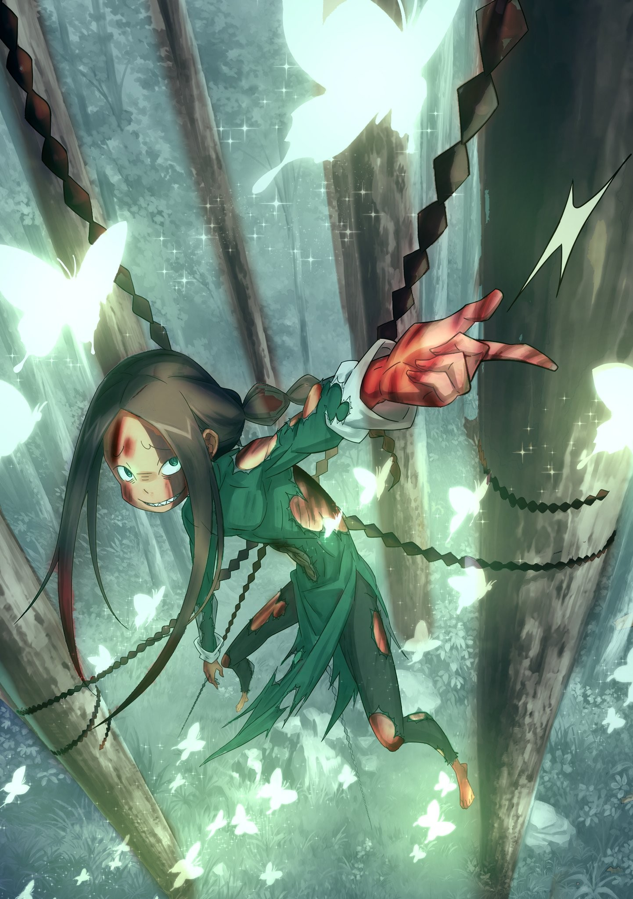
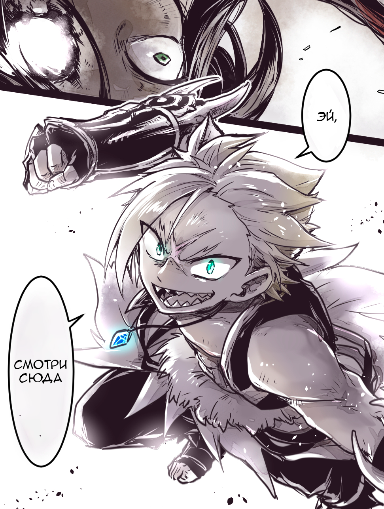
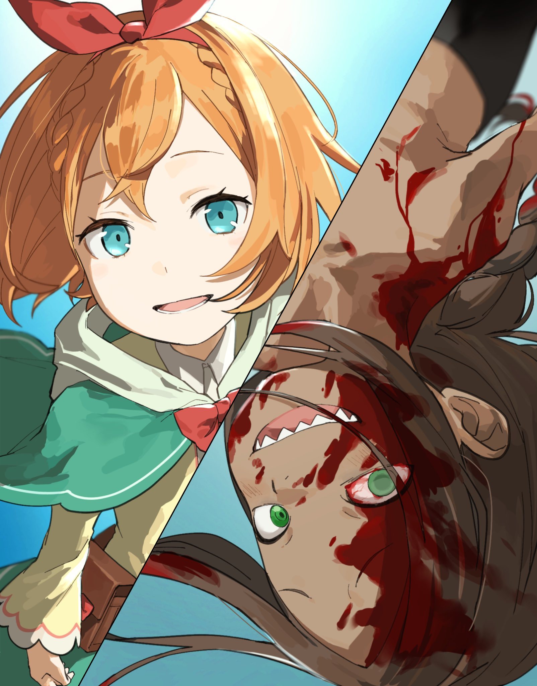
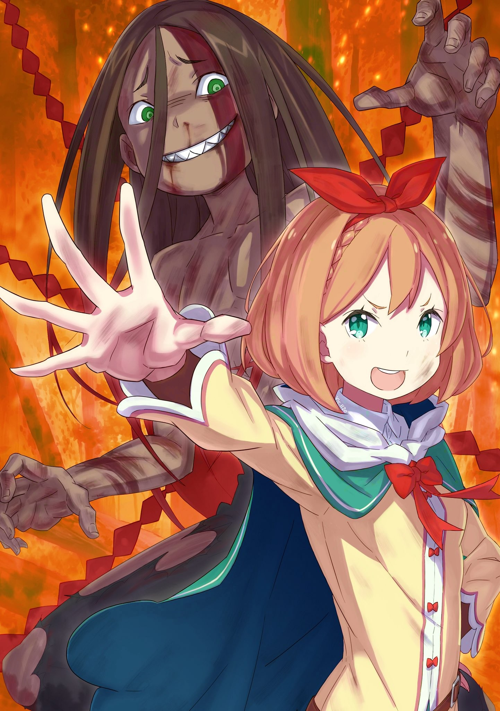

О любящий Бог, о мудрый Будда, о всеблаженная Лагуна… Даю обет, что в жизни привередливым я более не буду.

△ ▼ △ ▼ △ ▼ △

«Ведьма Уныния», Петра Лейт.

Для начала разберёмся, почему именно она стала стала хранительницей этого Фактора.

Кандидатура изначального владельца отпала сразу. Клинд должен был сделать то, что мог сделать только он — сдержать «Божественного Дракона». Пожалуй, хранителем мог стать кто угодно, кроме него.

Разумеется, свою роль играла и предрасположенность. Эмилии и Мейли Фактор не нужен, а у Рем — своя миссия, так что они выбыли из списка сразу после дворецкого. Но даже так претендентов было достаточно.

Поэтому, когда остались только Рам, Петра и Ром, весы склонились в сторону девочки не из-за боевого потенциала. Всё решил куда более весомый довод.

Просто она лучше всех справлялась с этим Полномочием.

— Этот Архиепископ… Лой, чтоб его… Хвастался, что жрёт всё без разбору, и, похоже, не врёт — арсенал у него просто чудовищный. Что делать-то будем? — Проблема в том, что он хорош на любой дистанции. — Жулик. Прямо как молодой господин. — Да будь он как Райнхард, то был бы непобедим! — Прекратите орать! Грассис, не неси чушь, у меня голова раскалывается! — Ха! Какая идиллия. Уже празднуете победу? Может, Рам к вам присоединится? — До чего ж язвительная девка… — Но в словах сестрички-горничной есть смысл. План-то есть? — В целом, продолжаем в том же духе. Да, у него найдутся козыри на любой случай, но… — Но?.. — Сколько бы карт ни было у него на руках, голова, что решает, какую вытянуть, всего одна. Будем давить волнами — и рано или поздно он просчитается. — К тому же раны у него глубокие. Как только сдадут нервы — полезет напролом. Это вам на руку, господин Ром. — Хех, мой старик ещё ого-го, да? — Да, на господина Рома всегда можно положиться. — Браво, браво, господин Ром! — Мы тут вообще-то насмерть бьёмся! — Простите, что мешаю вам, но мне ещё Голодным Королям приказы отдавать и всё такое, голова от вас сейчас взорвётся!

— ПРОСТИ!

Весь этот военный совет, больше похожий на обычную перепалку, Петра при помощи Полномочия Уныния «сжала» до одного-единственного мгновения. И не только разговор — она «сжала» размышления каждого, пока все они не пришли к единому, наилучшему решению.

— Если Клинд сжимал расстояние и время перемещения, значит, можно сжать время на размышления и обсуждения… Это просто другой взгляд на ту же концептуальную способность!

— Просто у него мышление закостенело оттого, что он всегда применял её одинаково, — произнесла девочка, ведя непринуждённую беседу с полупрозрачным, воображаемым Субару и одновременно концентрируясь на тонкой настройке Полномочия.

Шёл бой. В иной ситуации жалобы на то, что это отвлекает, были бы уместны, но этот внутренний диалог ей помогал. Храня за пазухой шкатулку с Фактором «Уныния» — ту самую, что ей досталась от Клинда, — она душой ощущала чудовищную силу притяжения, исходящую от него.

— Хоть и сама придумала, но «притяжение» подходит идеально.

Это непреодолимое влечение, которому невозможно сопротивляться… Сравнивая его с гравитацией, она постоянно напоминала себе об осторожности. Стоило ей ослабить бдительность, как Фактор тут же начинал соблазнять: «ты можешь и это», «и то».

Пытался забрать у неё то, что делало её человеком.

Не будь сдерживающего фактора, она бы давно поддалась притягивающему чувству…

— Но нельзя.

Чувство всемогущества — сладкий мёд, опьяняющий разум. Факторы играют на слабостях человеческого сердца, и делают это самым коварным образом: предлагают тебе силу как средство достижения самой заветной мечты, шепча: «Разве не этого ты желаешь?». Тот, у кого есть бесценное, сокровенное желание устоять не сможет.

Наверное, даже «Ведьма Жадности» и Петельгейзе Романе-Конти не были исключениями. Она не знала, что стало бы с ней, не найди она способа удержать своё «я».

Но…

— Петра! Чину и Тону нужна поддержка!

— Кэм отдыхает! — звонко ответила Петра мужчине, чей голос исходил из глубин её души. — Положитесь на меня!

Она активировала Полномочие. Рачинс и Гастон не знали, как отразить и поток чумы, и удар кровавой косы. Петра «сжала» их мысли и движения, позволив мгновенно найти идеальное решение.

Они обменялись целями: Гастон с помощью «Метода Потока» принял на себя удар косы, а Рачинс огненным шквалом отбил скверну. Безупречная защита.

«Субару» поднял большой палец вверх, и Петра с улыбкой ответила ему тем же.

— Отлично! Так держать! Ты крутая!

И пускай это была лишь иллюзия, благодаря улыбке любимого человека она могла быть отважной.

Вот оно. Благодаря этому она может превзойти себя, но остаться собой.

В отличие от многих других носителей Факторов Петра была не одна. Именно это не давало ей пасть и стать настоящей «Ведьмой Уныния».

Ведь…

— Я не хочу, чтобы Субару меня возненавидел.

Смейтесь, если хотите, над этим ребячеством. Тыкайте пальцем, насмехайтесь, сколько угодно. Если нужно, она приведёт не два, и не три благовидных предлога.

Она борется за мир. За спокойствие жителей королевства. Борется, чтобы защитить такое важное событие, как Королевский Отбор. На неё возложены всеобщие надежды.

Хотя, дело было не только в громких словах. Причин тоже хватало.

Сестрица Рам обычно отлынивает от работы, но сейчас сражается изо всех сил. Сестрица Фредерика осталась в особняке и там молится за нас. Отто никогда не думает о себе. Бесит, когда приходится плясать под дудку Господина. Хочется выставить себя в лучшем свете перед сестрицей Эмилией и сестрицей Рем. Я буду рычать и за себя, и за Гарфа! Мейли, не беспокойся ты так. Беатрис, я обязательно спасу тебя, так что не плачь.

Всё это — важно. Всё это — причины, по которым она сражается.

Но главная причина…

Главная — это ты.

Я не хочу, чтобы ты видел, какая я глупая. Не хочу, чтобы ты видел, какая я жалкая. Я хочу, чтобы ты всегда видел только лучшую версию меня.

Смотришь ты лишь на ту, что сияет, словно звезда. Если мне нужно родиться в звёздных яслях, чтобы ты наконец посмотрел на меня… что ж, я буду сиять, как она.

Меня уже давно притянуло. И всё это время я падаю.

Фактор здесь ни при чём. Я соткана из любви к тебе.

— Поэтому мне всё нипочём.

Сколько бы эта сила не искушала её, Петра никогда не сломается.

Пока она любит, ни «Чревоугодие», ни Чёрный Змей ей ни капельки не страшны.

△ ▼ △ ▼ △ ▼ △

О любящий Бог, о мудрый Будда, о всеблаженная Лагуна… Даю обет, что в жизни ни по ком я плакать более не буду.

△ ▼ △ ▼ △ ▼ △

Скрытая мощь… нет, не «Охотников за Альдебараном», а «Ведьмы Уныния» и её Апостолов — превзошла все его ожидания.

— Хорошо, неплохо, здорово, отлично, великолепно, божественно, не иначе как гениально, можно сказать, безупречно, а раз так — хвала и честь вам! Обжорство! Чревоугодие!

По правде говоря, Лой и сам не до конца понимал, что именно она делает. Но он отчётливо видел результат: раз за разом она спасала своих союзников, использовала способность на полную и бросала вызов Полномочию Чревоугодия.

В бою Фельт и остальные не совершали чудес — её Полномочие лишь выжимало из них весь потенциал до последней капли.

Но…

— Сомневаюсь, что у этой штуки нет ограничений.

Лой помнил слова матери об изъяне Фактора «Уныния». Он чужероден любому и, даруя способную попрать сами законы мира силу, взамен требовал плату. Бракованная вещица.

А значит, её безупречная тактика рано или поздно загнётся. И когда это случится, зависело лишь от того, какую цену она готова заплатить.

— Ах, как же это трогательно… Петра так любит Нацуки…

Заглянув в «Желудок Душ» к самым свежим «воспоминаниям», Лой в полной мере вкусил самоотверженную любовь новорождённой «Ведьмы» этого мира.

Она — всего лишь юная и незрелая девочка. Но ради своей пылкой любви она готова пожертвовать жизнью. Скажи ей, что для возвращения утраченного сокровища нужно сжечь что-то помимо собственной души, — и она без колебаний швырнёт это в огонь.

И она уже делает это. Но её запасы не безграничны.

— Теперь вопрос лишь в том, кто иссякнет первым.

Его время тоже было на исходе. Он намеренно не исцелял кровоточащие раны: сама кровь стала его оружием. Но обильная кровопотеря уже подожгла фитиль его жизни, и он неумолимо сгорал.

Битва и впрямь превратилась в состязание «кто кого съест первым».

— Ха-ха…

Выдыхая горячий воздух, Лой благодарил голод, будоражущий его душу.

До сих пор «Обжора» пожирал всё без разбора. Он ел, пробовал, жадно вгрызался в чужие судьбы в поисках того, что могло бы утолить его врождённый голод.

Он был готов прочесать весь мир в своей охоте, но всякий раз итог был один: он ел — и разочаровывался, ел — и падал духом, ел — и впадал в уныние.

Сколько бы он ни «поглощал», его вечно терзало неутолимое чувство голода.

Но однажды в этой бесконечной охоте всё изменилось.

Всё из-за одной встречи в той башне на краю песчаного моря…

— Ну давай, попробуй. Посмотрим, сожрёшь ты меня или сдохнешь, ты.

Ошеломляющая душа этого человека едва не расколола само его тело.

Рейд Астрея.

Прикосновение к душе первого «Святого Меча» переродило Лоя.

Он звал себя «Обжорой», вечно охотился, но в глубине души терзался мыслью: «А что, если этот голод утолить невозможно?»

— Ах, так вот оно что… но ты не один такой особенный, дорогуша. И я, и все остальные — мы ищем любви, которой нам так не хватает. Я помогу тебе найти то, чему ты сам не можешь дать имя. А взамен… ну, ты ведь понимаешь, чего я хочу, да?

С томной, садистской усмешкой на лице чудовище назвало себя его матерью. Он не доверился ей и не впал в зависимость — лишь пользовался ею в надежде найти то, чего не мог отыскать сам. Наверное, это было взаимно.

Сколько бы он ни ел, сколько бы ни держался за запятнанную любовью материнскую руку — желаемого не получал.

Лай находил самое вкусное на каждом столе. Луи, кажется, искала что-то конкретное.

Только Лой. Только он оставался пустым. Но вот, наконец, он нашёл.

— В этом нет ничего странного, ты. Есть или быть съеденным — вот и весь смысл жизни.

Ах, да… Точно. Именно так.

Он искал причину, что позволила бы ему рассмеяться от всего сердца и закричать: «Я живу!».

— Отдавать всего себя ради того, чего хочешь достичь… и ежу понятно, что только так и надо, нет?

Ах, да. Точно. Именно так.

Хоть он и не испытывал к ней ни капли любви или уважения, одно это её наставление было донельзя верным.

И потому…

— Если не отдавать всего себя! Всё, что у тебя есть! Каждую частичку своей сути! — то это… даже любовью не назвать!

Раз уж противник раз за разом превосходит себя, он обязан ответить тем же. Если он не сможет поглотить столь роскошное блюдо, то опозорит имя «Чревоугодия».

— Ну же, ну же, ну же, ну же! Идите сюда! Вкусите! Попробуйте!

Тело леденело от потери крови, но душа ликовала.

Хлынувшая кровь тут же обрастала шипами, сплетаясь в насекомьи лапы.

Вторя его неистовому порыву, Чёрный Змей за спиной взметнулся до самых небес и снова начал охоту.

— …

С оглушительным рёвом ветра ядовитая лавина рухнула на лес. Родилась кощунственная, неостановимая волна отравы. Она принялась в буквальном смысле пожирать поле боя, угрожала уничтожить всё живое.

Но…

— Будьте сильными!

— ЖИВИТЕ!

Этот простой, всеобъемлющий приказ, да и ответ на него, стали сигналом к контратаке. Ураганный ветер Рам рассёк чёрную волну; стая зверодемонов во главе с Голодным Королём Мейли пробила в ней брешь. За ними устремились воины — как старые, так и новые. Их удары обрушились на землю, сокрушая её и воздвигая стену на пути яда.

Так рождалась сокрушительная мощь из воли слабых. Битва, в которой натиск «Смерти» отражался отчаянным усилием разношёрстной жизни.

— Так-так… Полномочие Петрочки — своего рода «сжатие» событий, да?

— Не скажу.

— Какая ты суровая! Ах, как же ты нас заводишь!

Не прекращая атаки, облачившись в кровавые доспехи, Лой прорывался сквозь дождь скверны. Он непрерывно переключался между способностями, техниками и талантами аномалий, обрушивая на жертв шквалы ударов, магии и проклятых песнопений.

Но каждый раз его противники мгновенно сплетали физические и магические атаки в единый узор, давали ему отпор. Уже было не разобрать, кто кого и что защищает — лишь то, что они делали всё вместе меняло ход боя.

Даже в гуще сражения его хищный взгляд лихорадочно метался, оценивал добычу.

Он был почти уверен: Полномочие «Ведьмы Уныния» — «Сжатие». С его помощью она сокращала время и расстояние для перемещения и, вероятно, сжимала и сам процесс мышления. Доказательством служили появляющиеся и исчезающие апостолы «Уныния». Даже на лицах бойцов, призванных лишь мгновение назад, не было замешательства. Вернее, само замешательство было попросту «сжато», что позволяло им немедленно вступить в битву.

— Но надолго ли их ещё хватит!?

Их упорство и боевой дух вызывали восхищение. Но и он, и противники его были уже на пределе. Впрочем, у него оставался козырь — Чёрный Змей в тылу. Даже одолев Лоя, они столкнутся с этим чудовищным зверодемоном.

То, что они не могут бросить на него самого все силы… о, это была та самая последняя щепотка специй, доводящая блюдо до совершенства.

— Это место… станет нашим пиршеством!

Огромное тело Чёрного Змея вновь взметнулось к небесам, готовясь обрушить ливень скверны. И в тот самый миг, когда «Ведьма Уныния» и её соратники приготовились к обороне, Лой высвободил «воспоминания».

То был его собственный, новый «столовый этикет»…

— «Двойное Затмение»!

Отличный и от «Солнечного», и от «Лунного Затмения».

△ ▼ △ ▼ △ ▼ △

О любящий Бог, о мудрый Будда, о всеблаженная Лагуна… Даю обет, что звёзды более разглядывать я ни с кем не буду.

△ ▼ △ ▼ △ ▼ △

В тот же миг поле боя затопили осколки бесчисленных «воспоминаний» — объедки, которые он когда-то проглотил, но которыми презрительно пренебрёг.

После Сторожевой Башни «Обжора» переосмыслил свой подход к еде. Он научился ценить каждый приём пищи, каждую встречу. Ведь не бывает невкусной еды. Бывают лишь глупцы с неразвитыми рецепторами, не способные постичь её истинную прелесть.

Возьмём вот ядовитую рыбу: если её правильно выпотрошить, наслаждение от вкуса перевесит смертельный риск. Так и с его добычей — у каждой жизни есть съедобные части. Вот их он сейчас и использовал.

— «Воспоминания о Боли».

Каждый, кто прожил на свете хоть сколько-нибудь, хотя бы раз испытывал невыносимую боль. Лой Альфард извлёк из «Желудка Душ» бесчисленное множество таких «воспоминаний», смешал их в ядовитый коктейль и выплеснул на поле боя. Атака была невидимой, а потому — неотвратимой.

Кощунственный по своей «сути» приём.

Сами по себе эти «воспоминания» не могли причинить вред. Но они служили спусковым крючком, пробуждали в каждом, кого касались, его собственную, запертую глубоко внутри боль.

— А…

Ещё мгновение назад это были воины, чьи голоса гремели отвагой, а в глазах горела решимость. Но сейчас вместо боевого клича с их губ срывались лишь тонкие, жалобные стоны.

— А… а-а… А-А-А-А-А-АХ!

И стоило этой плотине рухнуть, поток уже было не остановить. Широко раскрыв глаза и рты, люди прижимали руки к груди, к головам, к животам — к тем самым местам, где когда-то гнездилась их собственная агония, — и разражались душераздирающими воплями.

Кричал не один. Кричали все.

— А-А-А-А-А-АХ!!!

Атака Архиепископа заставляли тела «вспомнить». Она воскрешала в каждом самую страшную боль, заставляла пережить её заново — здесь и сейчас.

Можно ли вынести боль, если однажды ты её уже пережил?

Ответ — нет.

Что сломало тебя однажды, сломает вновь.

— Гха…

Беззвучные крики срывались с их губ. Никто не мог этого вынести. Но громче всех, пронзительнее всех кричала…

— ПЕТРА!!

Запрокинув голову, с искажённым от агонии лицом, кричала Петра Лейт.

На её хрупкие плечи обрушилась вся боль каждой смерти Нацуки Субару.

△ ▼ △ ▼ △ ▼ △

О любящий Бог, о мудрый Будда, о всеблаженная Лагуна… Даю обет, что в жизни не буду назначать встреч с кем-либо.

△ ▼ △ ▼ △ ▼ △

— ПЕТРА!.. — крикнул воображаемый Субару, и Петра подумала — но не испытала облегчения, — что ему, её видению, не придётся испытывать боль.

А она не могла. Петра Лейт ни коим образом не могла не испытывать эту боль.

— Ах… — сорвался с губ сдавленный выдох.

Больно. Больно. Адски больно.

Больнобольнобольнобольнобольнобольнобольнобольнобольнобольнобольнобольнобольнобольнобольнобольнобольнобольнобольнобольнобольнобольнобольнобольнобольнобольнобольно…

— И-и-и…

Болел вспоротый живот. Болели раздавленные глаза. Болела пронзённая грудь. Болела спина от удара маньяка. Болели порезанные от неумелого обращения с ножом пальцы. Болели цыпки на руках от долгой работы в воде. Болел внезапно раскроенный череп. Болело всё тело от пыток под звон цепи. Болело перерезанное ветром горло. Болели острые камни, о которые она разбилась, спрыгнув вниз. Болело тело и душа от жестоких укусов. Болели руки и ноги от тренировок, где её щадили из притворства. Болели замёрзшие и отвалившиеся пальцы и лодыжки. Противно и больно от облизанных глазных яблок. Болели запястья, что сломались вместе с замороженными кандалами. Болели и ныли все суставы от стояния на коленях на ледяной земле. Болело тело после того, как её столкнул обезумевший Отто. Больно и стыдно от того, как жалко она металась, спасаясь от Белого Кита. Болела душа, запертая в ледяной статуе в лютый мороз. Больно от вышедших из-под контроля врат, призванных заставить её принять решение об убийстве из милосердия. Больно от удара в грудь во имя милосердия. Больно от того, как сжимается сердце при признании о «Посмертном Возвращении». Больно от хватки назойливого Полномочия Лени. Больно от того, как она проткнула себе горло из страха потерять Рем. Болел живот от распоротого живота, впервые за несколько месяцев. Больно от ударов обломков по всему телу, от изрезанных рук, а в конце — от того, как её пожирали. Больно от того, как дикие звери терзали и разрывали её на куски. А в конце она снова сама пронзила себе горло, и было больно, больно, больнобольнобольно.

— Ух…

— Петра! Петра! Не оставляй нас!

Боль захлёстывала её разум. Всё внутри — тело, мысли, сердце — всё, что должно было быть заполнено ■■■■■■, было смыто болью. От макушки до кончиков пальцев не было ни единого места, которое бы не терзала мука. Всё, что составляло её, превратилось в боль, и она сама существовала лишь для того, чтобы испытывать боль, состояла из боли.

Боль болела, и болеть было больнобольнобольно больнобольно больнобольно-но-но-но…

— А-а…

Зрение залила алая пелена, собственный невыносимо громкий крик казался звоном в ушах, в носу остро пахло кровью, рот наполнился слюной со вкусом смерти, а по всей коже бегали мурашки от невыносимого потрясения. ■■■■■ ■■■■ отчётливо прочувствовала страдания ■■■■■■ ■■■■■■, которые никогда не смогла бы по-настоящему понять, просто прочитав «Книгу Мёртвых». Болью ■■■■■ ■■■■ прочувствовала ■■■■■■ ■■■■■■ в самом прямом, буквальном смысле. Боль поглощала и внешнее, и внутренне ■■■■■ ■■■■, закрашивала всё целиком, и посреди этого она чувствовала боль.

— О-о…

И что вся эта пережитая боль была связана с воспоминаниями ■■■■■■ ■■■■■■, На■■■■ ■■ба■■, На■■ки Суба■■… Нацуки Субару, наполненными отчаянным раскаянием и чувством утраты.

— …

Было больно. Он дал умереть Эмилии. Было больно. Он дал умереть Фельт. Было больно. Он дал умереть старику Рому. Было больно. Он дал умереть Рем. Было больно. Он дал умереть всем в деревне Алам. Было больно. Он дал умереть Рам. Было больно. Он дал умереть Фредерике. Было больно. Он дал умереть Петре. Было больно. Он дал умереть Беатрис. Было больно. Он дал умереть Отто. Было больно. Он дал умереть Розваалю. Было больно. Он дал умереть Рюдзу. Было больно. Он дал умереть Гарфиэлю. Больно. Больно. Больно… Горько.

— Горько.

Больно.

Больнобольно. Больнобольнобольно. Больнобольнобольнобольно… И что с того?

— Не хочу проигрывать.

Пусть больно, пусть мучительно, но горечь и печаль — гораздо хуже. Я люблю их всех, я не могу от них отказаться. И я люблю тебя, который любит их всех и не может от них отказаться, и от тебя я тоже не могу отказаться. Поэтому…

— За кого… вы меня держите?

■■■■■ ■■■■, ■■тра ■ей■, Пе■ра ■ейт… Петра Лейт быстро учится, она талантлива, она — комок возможностей, её ждёт великое и светлое будущее. Тот человек, те люди — они верили в Петру… Что ж, значит, я это сделаю.

— Я смогу.

Ведь ты сможешь, Петра Лейт. Ради того, чтобы не сделать лжецами всех, кто верил в меня. Или все они лжецы, поверившие в слабую, жалкую и ни на что не способную Петру?

— Быть такого не может.

Я смогу. Я должна. Раз они так сказали, я не буду просто болтать, а сделаю. Сделаю. Сделай. Я могу. Сделай сейчас. Сделай немедленно. Сейчас! Ну же, делай, делай… СДЕЛАЙ!

— «Сжатие»… нет.

Нужно это «сжать» Полномочием Уныния. Так же, как она «сжимала» расстояние, время в пути, время на размышления и время на обсуждения, так же «сжать» и этот ужасный миг, мучивший их всех.

Как же страшна боль. Капля боли рождает каплю слезы, от чуть более острой боли не можешь спать по ночам, а тупая и ноющая боль может повлиять на всю твою дальнейшую жизнь. Будь она незначительной, острой или тупой, время, пока ты её испытываешь, кажется долгим.

Нужно «сжать» это время, когда секунда длится как десять, час — как полдня, а день — как вечность.

— Держитесь крепче! — прокричала она.

— Будет всего секунда, но в сто раз больнее!.. — поддержал воображаемый Субару. О том, что может быть и в десять тысяч раз больнее, он не сказал.

Да и не важно, скажет или нет, подготовит морально или нет, — делать это всё равно придётся.

— «Сжатие Агонии», — такова была новая ступень силы «Ведьмы Уныния».

△ ▼ △ ▼ △ ▼ △

О любящий Бог, о мудрый Будда, о всеблаженная Лагуна… Даю обет, что никогда не буду сожалеть о расставании.

△ ▼ △ ▼ △ ▼ △

— …

Представленный новый приём, несомненно, сработал и дал трещину в доселе безупречной координации противника. В ушах стоял рёв ветра от падающего тела Чёрного Змея, а с той стороны доносилась какофония самых разных воплей, криков и визга. Все они звучали так мучительно и горько, что, будь у Лоя время, он бы целую ночь проплакал, сочувствуя им, а после изложил бы свои чувства в стихах и пустил их по реке. Но времени не было. А поэтического таланта не было и в помине, так что ничего путного бы не вышло. Однако он и вправду пожалел их. У него не было к ним ни злобы, ни ненависти. Даже смешанных чувств любви и ненависти не было — лишь простая любовь. Кто захочет видеть, как страдают и кричат те, кого он любит? Это лишь специя, чтобы лучше насладиться их жизнями. А специи — не основное блюдо. Делать их главным блюдом — удел безумцев.

— Мы не будем творить таких ужасов.

«Двойное Затмение», вызвавшее цепную реакцию «воспоминаний о боли», разорвало связь между его жертвами. Оставалось лишь дождаться ливня скверны от Чёрного Змея — эта его голова отвечала за «Старческую Немощь», так что жизней она не отнимет. Она лишь заблокирует их мысли и действия, бесконечно удерживая на грани смерти. А дальше — как с вином в погребе: остаётся ждать, пока они созреют, пока не придёт время узнать их истинные имена. Говорят, на этой грани нет спасения, и страдания и тьма бесконечны, но в итоге вся пережитая ими боль без остатка перейдёт к Лою и исчезнет, так что всё в порядке. Прочувствовать эту горечь, испить её до дна, насладиться ею — это тоже часть «трапезы».

— Ах, видеть созревший фрукт и не иметь возможности съесть его прямо сейчас — это…

«…мучительно», — хотел было сказать Лой, но его прервали. Не то чтобы последовала контратака. Наоборот. Его жертвы издали особенно громкий, душераздирающий вопль. Звук был настолько пронзительным, что его можно было принять за предсмертный крик. На мгновение Лой опешил, но решил, что это лишь подтверждает успех его плана…

— К-кре… пче-е-е-е!..

— Д-де-ржи-ись!..

Тут же невероятная реакция и сплочённость опровергли финал, который, казалось, вот-вот должен был поглотить его жертв.

△ ▼ △ ▼ △ ▼ △

О любящий Бог, о мудрый Будда, о всеблаженная Лагуна… Даю обет, что в жизнь ни с кем не погуляю я в закате.

△ ▼ △ ▼ △ ▼ △

Фельт испытала такую адскую боль, словно с неё живьём содрали кожу, а Райнхард обильно посыпал её солью и отполировал металлической щёткой.

— Ух.

Она впервые испытала чувство, будто от боли у неё все внутренности перевернулись. В голове онемел какой-то участок, и даже возникла иллюзия, будто кровь в теле течёт вспять. Что произошло — она не понимала. Нет, понимала. Это сделала Петра.

— Вот же малявка… — тихо восхитилась она стойкостью девочки, что была ей почти ровесницей.

Она знала, что на протяжении всего этого безумно сжатого «совещания» Петра, в паре со стариком Ромом, блестяще руководила их сводным отрядом. Это было поразительно. Ведь старик Ром — самый умный и надёжный человек в мире, а значит, Петра, без сомнения, гений. И этот гений сотворил нечто невообразимое и сокрушил нечто вражеское.

— И всё же, везёт тебе, как утопленнику.

Скривив губы, Фельт заметила краем глаза небольшую фигуру — Кэмберли. В отличие от Гастона, что сражался с самого начала, и Рачинса, присоединившегося позже, Кэмберли вступил в бой в самый ответственный момент, словно козырь в рукаве. И именно в этот миг на них обрушилась та чудовищная боль — это было больше, чем просто невезение. Однако…

— Может, и не везёт, но ты — лучший, — сказала Фельт и почти вырвала из рук Кэмберли, у которого на глазах выступили слёзы, тот самый предмет.

Козырь их лагеря — «Звёздный Посох». Выстрелить. Фельт собрала все силы своего тела, вложила в удар всё, что у неё было. Оставалось лишь…

— Выбрать, куда влепить!

△ ▼ △ ▼ △ ▼ △

О любящий Бог, о мудрый Будда, о всеблаженная Лагуна… Даю обет, что на чужую тень я более не встану никогда.

△ ▼ △ ▼ △ ▼ △

— К-кре… пче-е-е-е!..

— Д-де-ржи-ись!..

Раздался оглушительный рёв, неотличимый от рёва зверодемона, и тело Чёрного Змея, будто сплетённое из тысячи бедствий, отбросило назад взрывом снизу. Поле боя захлестнул поток света и тьмы, и удар, казалось, расколовший небеса, опалил всё тело Лоя изумлением.

Что произошло? Как они это сделали? — все эти вопросы он отбросил за ненадобностью.

— Петрочка-а-а!

Кто это сделал — было очевидно, и Лой Альфард испытал экстаз. Невероятно. Он готов был рукоплескать. Вместе с мириадами «воспоминаний» внутри себя он должен был устроить ей бурную овацию.

Скольким же нужно пожертвовать, чтобы заставить Ведьминский Фактор «Уныния» сотворить такое? Можно было предположить, что для того, чтобы вести эту битву на равных, чтобы позволить себе подобную дерзость, нужно отказаться от всякой надежды на обычное человеческое счастье.

Хотим быть счастливыми.

Это ведь абсолютное, нерушимое, фундаментальное желание каждого человека. Даже для Лоя, даже для Лая, даже для Луи, даже для Архиепископов Греха, для злодеев, для преступников — это было неизменной, абсолютной молитвой. Ради этого они и жили. Но дабы выстоять в этой ситуации, нужно было от этого отказаться.

— …

Лой, моргнув, осушил увлажнившиеся от восторга глаза и посмотрел на Фельт, отнимавшую у товарища белый посох. Раз уж в такой критический момент карлик, от которого, казалось бы, не было никакого толку в бою, притащил с собой эту вещь, значит, это их секретное оружие. То есть…

— Вы разревётесь, если оно не сработает, да-а?!

Заплясали радужные бабочки, посыпались копья из огня и льда, со всех сторон ударили кровавые косы, началось давление, сжимающее не слева и справа, а спереди и сзади, и раздалась проклятая песнь.

— Защищайте Фельт!

Ветер изрезал всех бабочек; огненные и ледяные копья были разбиты ледяными и огненными снарядами; кровавые косы приняли на себя толстые мышцы, хоть и были их обладатели ранены; надвигающиеся спереди и сзади пласты земли пронзили мгновенные парные удары; а проклятую песнь, разрушающую плоть, заблокировали гигантские тела старика и свинолюда.

— Блестяще-е! Но-о…

Волновую атаку отразила их железная координация, но Лой не унывал. Он применил «Перенос», который до этого момента придерживал, и в мгновение ока появился в центре группы Фельт. Его целью была не Фельт, а…

— Эти двое ведь тоже ключевые фигуры, да?

Он нацелился на спины двух девочек, у которых не было сил даже подняться, пока остальные были заняты отражением атаки. «Ведьма Уныния» и «Повелительница Зверодемонов» — обе были незаменимы в битве с «Чревоугодием» и Чёрным Змеем.

Никто не успевал остановить Лоя, оказавшегося за их спинами. Облизнувшись, он вложил в правую руку «Ладонь Короля Кулака», в левую — «Снегоеда», и мягко…

В тот же миг волосы Мейли зашевелились, и вспышка белого света пронзила левый глаз Лоя.

— ГХАА!

Глаз прожгла жгучая боль — он ослеп на левый глаз. Правым Лой пытался понять, что произошло, и увидел искусный приём, лишивший его зрения, — маленького скорпиона, прятавшегося в волосах Мейли. Незнакомое существо. Козырь, о котором не было «воспоминаний», припрятанная карта… да здравствует тотальная война.

— Даже такой маленький союзник…

«…старается изо всех сил», — хотел он договорить, но не смог. Прежде чем он успел, земля, на которой он стоял, предала его, без предупреждения подбросив в воздух.

— …

Это была не магия. Он не почувствовал никаких колебаний маны. Значит, снова «Ведьма Уныния»? Нет, даже у неё не было глаз на затылке. Произошёл подъём земной тверди. Без предупреждения, без договорённости, это был скачок, который…

— Чёрт, да вы слишком уж надёжные, мои товарищи-и!

Внезапно раздался резкий голос, слишком знакомый по «воспоминаниям». Этот голос принадлежал тому, кто был непобедим, пока стоял на земле, откликаясь на её зов своими ногами. Тому, кто был слишком надёжен, чтобы его голос здесь прозвучал.

Пока он кувыркался в воздухе, Лой увидел землю в перевёрнутом виде и приказал копошащемуся там очагу заразы, зверодемону, буйствовать. В отличие от прошлого раза, расстояние между ним и зверодемоном было большим. Кровавая броня почти слетела, но если он обрушит на них дождь скверны, их силы будут разделены.

— Сидеть!

Крик, похожий на плач, на мгновение сбил движения Чёрного Змея. Но заминка длилась меньше мгновения. Даже если бы он выиграл это время, замысел Лоя бы не провалился… и в этот миг тело Змея, которое должно было устремиться в небо, взорвалось. Оно разбрасывало скверну, и из этой грязной земли выкатилась тень.

— Бу-ха… кхе, гха-кха… — задыхался красноволосый мужчина. Он рухнул в самую отвратительную лужу скверны в мире, и Лоя поразил такой шок, который нельзя было объяснить ни живучестью, ни упорством.

— Не может быть, — потерял Лой дар речи. Почему он жив? От этого вопроса и подступающего чувства голода у него заурчало в животе.

— Эй, смотри сюда.

Лёгким прыжком светловолосый юноша догнал Лоя в воздухе, клацнул острыми клыками и с размаху замахнулся кулаком в серебряной перчатке. Если этот удар достигнет цели, полуживому Лою не сдобровать. Понимая, что это лишь отсрочка, он решил отступить, снова прибегнув к «Прыгуну», и активировал «Лунное Затмение», но…

— Бу-ух.

…его сбило столкновение с зоддацким жуком, что налетел с левой, слепой зоны.

— …

Жужжание раздражало. Он перевёл взгляд и увидел вдалеке, в десятках метров от себя, опирающегося на деревья лазурного земляного дракона, а на нём — человека, который должен был быть пустышкой. Мужчина указал на него пальцем и, заметив, что их взгляды встретились, усмехнулся. Словно говоря: «Попался».

Тут же взвыл ветер, и кулак, окутанный его давлением, устремился прямо на Лоя. Ему показалось, что он летит мучительно медленно, что до удара ещё целая вечность, и тут он понял…

— Петра, это ты сделала?

— Да. Я ещё кое-что хотела сказать в самом конце, так что… Так тебе и надо, — объявила о своей победе стоящая на земле «Ведьма Уныния» в растянутом ею времени.

Против этого Лой уже ничего не мог поделать. Яростный кулак разъярённого тигра приближался, оставалось расстояние в пять монет. Что можно успеть сделать до удара? Он подумал, и его осенило.

— Вау. Ты молодец, Петра. Но не слишком ли дорого обошлась тебе победа?

— Это у тебя предсмертная агония? У нас потерь нет. Для Архиепископа Греха ты жалок.

— Против «Ведьмы Уныния» мы бессильны. Но жертва — это не только жизнь. Это будущее, надежда, возможности. Нам искренне жаль, что твоя долгая-долгая жизнь теперь будет одинокой.

Осталось четыре монеты. Он вскроет цену, которую она, скорее всего, хотела бы скрыть, и этой болью запечатает себя в её памяти.

Петра лишь моргнула и сделала удивлённое лицо. Неужели она платила, не зная цены? Такая реакция была…

— Ты, случайно, не ошибаешься?

— Ошибаемся?

— Странно. Я думала, господин Отто вам уже сказал. Что-то вроде: «На этот раз ваш враг — весь мир».

— …

Осталось три монеты. Прямо этого ему не говорили, но в «воспоминаниях» было что-то подобное. Учитывая поступки Альдебарана и нанесённый им ущерб, это не было удивительно. Но это должно было быть не более и не менее чем…

— Неужели…

— Именно.

Осталось две монеты. В растянутом восприятии нельзя было позволить себе такую роскошь, как вздох, но Лой мысленно вздохнул и посмотрел на неё, мягко улыбающуюся, как и подобает «Ведьме». Девочка, которая не должна была быть совместима с Ведьминским Фактором, без сомнения, была «Ведьмой Уныния». Потому что…

— Ведьминским Фактором «Уныния» может пользоваться кто угодно, если заплатить цену, а цену может заплатить кто угодно, если она будет соразмерной. Так что… платят жители столицы.

— …

— Тогда скажу ещё раз… Так тебе и надо!

Осталась одна монета. Ведь Лой не знал никого, кто бы так злоупотреблял Ведьминским Фактором «Уныния». Если это не «Ведьма Уныния», то кто?

— Ах-х… Спасибо за угощение.

Ноль монет. Удар «Великолепного Тигра» пришёлся в цель.

— …

Он пробил лицо Лоя и швырнул его на землю, где извивался Чёрный Змей. Его маленькое тело летело прямо в лужу скверны… почти.

— Сдохни!

Посох, сиявший в руках Фельт, изрыгнул ослепительный белый свет, который затопил собой весь мир. Это был неотвратимый, неизбежный удар возмездия, поглотивший злодеев.

Таким было финальное блюдо в «трапезе» «Обжоры».
