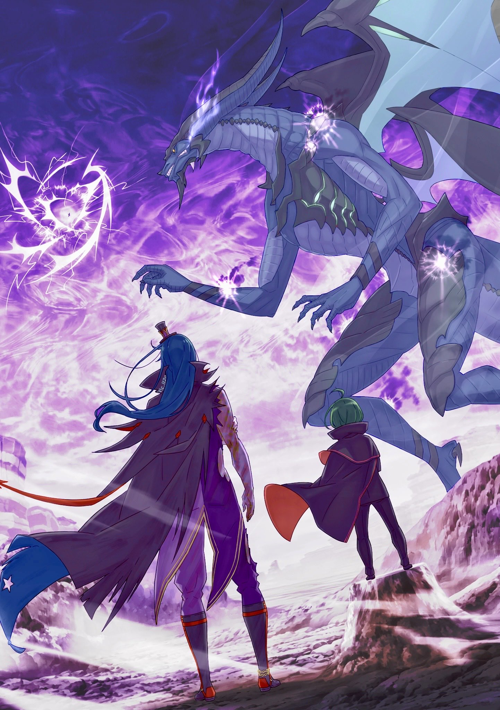
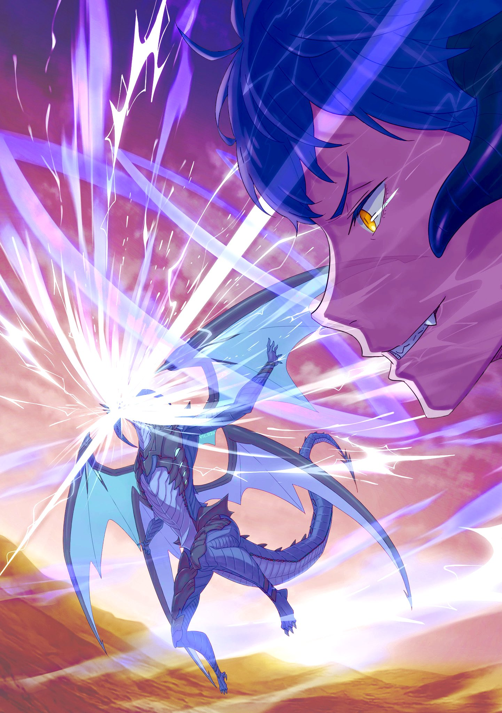

Пляска разрядов фиолетовой молнии — и Клинд уже во всех мыслимых и немыслимых направлениях, стремительно, беспрепятственно носился по охваченному битвой небу.

— !..

В погоне за вспышками этого грозового света, словно шторм, обрушивались драконьи когти. Они раз за разом рассекали воздух, и каждый такой взмах разрывал пустое пространство, а возникающие вакуумные волны перекрывали дракониду пути к отступлению. Теряя один за другим варианты для манёвра, Клинд заставлял «Дракона» сосредоточиться лишь на нём, отводя его внимание — и даже последствия атак — от земли. Он действовал в небесах осторожно, но смело.

— Вы превзошли мои ожидания, надо же. Удивление.

Уклоняясь, парируя и в лоб отражая яростные атаки «Дракона», каждая из которых могла бы изменить сам ландшафт, Клинд не мог не восхищаться тем, как узурпатор обращался с драконьей оболочкой. Как уже говорилось, узурпатор не владел драконьей оболочкой «Божественного Дракона» в совершенстве. Это всё равно что вручить тело «Святого Меча» новорождённому младенцу. Изначально это было немыслимо. Поэтому Клинд и восхищался не тем, что узурпатор раскрывал истинный потенциал «Божественного Дракона», а его ненасытным стремлением использовать саму драконью оболочку как орудие для победы. И в этом он вновь узрел одну из граней силы слабого человечества, проникнувшись уважением. Однако бой затягивался, превосходя все его расчёты, и он осознал… Осознал, что узурпатор тоже куда быстрее, чем он ожидал, адаптировался к драконьей оболочке и продолжал расти.

— Я слышал, что до сего момента вам довелось сразиться и со «Святым Меча», и с «Демоном Меча». Ясно.

Даже с драконьей оболочкой «Божественного Дракона» он не мог с лёгкостью одолеть могучих противников, но, раз за разом вступая с ними в бой, узурпатор сумел в значительной мере раскрыть свой потенциал как «Дракона». Клинд в полной мере ощущал это по сиянию драконьей чешуи и драконьего нимба, защищавших сердцевину.

— Человеческий потенциал… Преклонение.

Насколько же нелепым было само существование «Драконов», кичившихся тем, что они — само совершенство? Почему «Драконы» могли ходить по земле с видом полноправных хозяев, как сильнейшие из живых существ? Клинд полагал, что ответ крылся в их тяжёлой, бесцеремонной поступи. Они были слишком напористы, и никто не мог отвести от них взгляд. Их нельзя было игнорировать. Именно это и позволяло «Драконам» вести себя на этой земле так надменно… И именно поэтому «Драконам» не осталось здесь места, и они исчезли за Великим Водопадом.

— …

Хоть он и понимал, что сейчас не время для сантиментов, в груди драконида всколыхнулись воспоминания.

Небо прорезали десятки трещин. Поднятые рёвом ветра, в воздухе закружились гигантские валуны и ледяные глыбы. Прорываясь сквозь них с помощью десяти, а то и двадцати ударных волн, Клинд видел в своём сознании картину четырёхсотлетней давности — своих собратьев, изгнанных с этих земель и улетающих прочь.

Считается, что в тот день на земле остались лишь изгои и чудаки, а все здравомыслящие «Драконы» с развитой способностью к суждению отправились за Великий Водопад. Но, по мнению Клинда, всё было ровно наоборот. «Драконы» смогли стать высшими существами потому, что их жизнь была спроектирована так, чтобы быть сильнее всех. А значит, «Драконы» должны были постоянно учиться и расти, чтобы никогда не уступать своего трона. Разве само рождение драконидов не было тому доказательством?

— Неужели они этого не замечают?.. Просто смешно.

Клинд, превратив окутывающую его фиолетовую молнию в оглушительный гром, сокрушил им сотни каменных и ледяных глыб, заполнивших небо, и, привлекши к себе внимание «Дракона», взглянул на землю. А там…

— Драконья чешуя и драконий нимб… — произнёс Эццо. — Так вот в чём фокус, с помощью которого «Божественный Дракон» сделал бесполезным твой козырь.

— «Бесполезным»… как обидно, — отозвался Розвааль. — Я бы предпочёл «обезвредил» или «нейтрализовал».

— И это сейчас время цепляться к словам?!.. Одновременное использование разных стихий — это применение «Перекрёстной Формулы Двух Стихий»? Но если смешать три, то как контролировать давление схождения огня и ветра?

— Всё просто-о. Нужно лишь сделать само давление схождения ядром. Нестабильность формулы, возникающую из-за взаимного влияния, можно скорректировать: если третья стихия — вода, то подстраиваем под огонь, если земля — под ветер.

— Использовать спиральную интерференцию стихий?! Чушь! Если столкнуть стихии с противоположными фазами, формула аннигилируется, и отклонение врат от критического значения будет с лёгкостью превышено… Предельное Сжатие!

— Ого, додумался до этого своим умом. А ты способный, как я погляжу. Судя по всему, у тебя новаторский подход к построению формул, похоже на самообучение… хотя, погоди, если присмотреться… это что, основы построения формул, оставленные моей предшественницей в позапрошлом поколении? — удивился Розвааль.

— Нгх!..

— На сегодняшний день основно-о-ой считается «Уравновешенный Цикл», где мана, циркулирующая в теле, рассматривается как кольцо. Твою теорию посчитали бесполезной и отбросили… документы были утеряны довольно давно, но неужели их нашёл ты-ы-ы?

— Чтобы постичь путь магии, нужна определённая решимость, так или иначе! — воскликнул Эццо. — И вообще, я нашёл эту книгу на рынке, она пылилась в углу! Именно из неё я вывел «Объединённый Цикл» и кардинально повысил эффективность использования маны при сотворении волшебства!

— Воистину воровская наглость, и это с теорией, придуманной другим челове-е-еком.

— Признаю, это помогло моей идее, но усовершенствование и доработка — неотъемлемая часть прогресса! Ты хочешь сказать, что тебя никто и никогда ничему не учил и не наставлял?!

— …

— Не смей вдруг замолкать! И вообще, даже если сто раз тебе уступить, это великое достижение не твоё, а твоей предшественницы, госпожи Розвааль J. Мейзерс!

— Она — это почти то же самое, что и я. Давай вернёмся к те-е-еме. Об «Объединённом Цикле» я даже не задумывался. Если ты понимаешь проблемы «Перекрёстной Формулы Двух Стихий», то и объяснять, почему «Трёхточечный Контроль Центра Тяжести» не подходит для «Перекрёстной Формулы Множества Стихий», не ну-у-ужно?

— Ты издеваешься? Если добавить ещё одну стихию для одновременной активации, возмущение спиральной интерференции возрастёт многократно. С помощью «Трёхточечного Контроля Центра Тяжести» можно одновременно активировать до трёх стихий, но больше… постой, ты же только что контролировал пять стихий одновременно. Каким, сука, образом ты это сделал?

— Я-а-асно. Хочешь знать ответ? Хорошо, я раскрою тебе тайну. Хотя я считаю, что настоящее удовольствие от магии заключается в том, чтобы самому утолять жажду познания и постигать сокровенную суть волшебства, но раз уж твой энтузиазм не простирается так далеко…

— Стой, стой, стой, молчи!.. Пять стихий, спиральная интерференция, Предельное Сжатие… Нет, его формула основана на «Уравновешенном Цикле»… Точно! Параллельное наложение «Трёхточечного Контроля Центра Тяжести»!

— !..

— То есть ты параллельно запустил два наложенных друг на друга «Трёхточечных Контроля» по три стихии каждый! А из трёх стихий второго потока использовал стихию Света для поддержки своих Врат, а возникшее из-за спиральной интерференции давление схождения сделал ядром. Тем самым ты сделал Предельное Сжатие трёх и двух стихий и добился…

— Да, именно так! — перебил Розвааль. — Это и есть ключ к доказательству существования «Пятислойной Точки Резонанса»!

— Ты с ума сошёл?! Одно движение, одно мгновение, одна минута, одна сотая! Малейшее отклонение — и всё закончится спиральным коллапсом! Ты устроишь вокруг себя второе ущелье Агзад!

— Но ведь этого не произошло-о-о. В этом и заключается высочайшая, далёкая вершина пути волшебства.

— …

— Страшно, да, Эццо Каднер?

— Да, страшно. Страшно, что моё сердце желает этого, Розвааль L. Мейзерс.

Да, там, на земле, два мага столкнулись в поединке, где оттачивали своё мастерство.

— Какие у них одухотворённые лица. Удивление.

Изначально на него была возложена определённая роль. Поэтому Клинд по своей воле принял бой на передовой, облачившись в фиолетовую молнию для схватки с «Драконом». Но даже если бы ему не доверили эту роль, Клинд, следуя своим убеждениям, всё равно бы выбрал скрестить молнии со своей былой драконьей оболочкой.

Люди, состязаясь друг с другом и оттачивая свои умения, вот-вот породят нечто новое. Именно этого и желал Клинд — драконид «Божественного Дракона» Волканики, который пошёл по пути, что привёл его на эту землю, оставшись здесь в одиночестве, сочтённый еретиком собратьями, не признававшими новых ценностей. Ведь это и было самой прочной опорой его духа, который так и не поддался ведьминскому фактору «Уныния», требующему в качестве платы отказ от возможностей.

△ ▼ △ ▼ △ ▼ △

Розвааль почти ничего не знал об Эццо Каднере, стоявшем рядом с ним. Имя было ему знакомо: новый человек в лагере Фельт, ответственный за внутренние дела, который благодаря своим талантам быстро стал одной из ключевых фигур, — такая у него была информация. Ещё упоминалось, что он маг, но Розвааль воспринимал его как какого-то самоучку без именитого наставника, и в общем-то, был не так уж далёк от истины. Однако это мнение — «какой-то самоучка» — изменилось, когда он столкнулся с Эццо лицом к лицу и увидел его теорию построения магии. Он был настоящим. И тем, кто признал друг в друге подлинное мастерство, не нужно было много слов.

— Отдохни немного, переведи дух. Тебе придётся ещё раз пойти на безрассудство, — сказал Эццо и спрыгнул с созданной им опоры. Он шагнул вперёд и посмотрел на небо.

— …

Из-за череды мощнейших заклинаний, на которые наложилось столкновение «Дракона» и драконида, скопившаяся мана оказала колоссальное влияние на атмосферу. Лазурное небо превратилось в аномальное явление, переливающееся всеми цветами радуги. Там по-прежнему бесчисленными цепями взрывались фиолетовые молнии — это драконид продолжал свой одинокий бой в небесах. Даже после того, как Розвааль, исчерпав силы, пал, Клинд продолжал исполнять свой долг…

— Почему он дерётся один? Ты всё не так понял, — сказал Эццо.

— Что ты сказал?.. — ошеломлённо спросил Розвааль.

— Думаешь, маги не могут действовать сообща? Вовсе нет, гармония — вот их сила! — воскликнул Эццо, как вокруг него возникли бесчисленные водяные сферы.

Каждая из них вобрала в себя по нескольку осколков скал, и с этим грузом они разом устремились ввысь — прямо в гущу ожесточённой битвы Клинда и «Божественного Дракона».

— Это же…

«Безрассудство» — даже скорее «бессмыслица», — подумал Розвааль, не в силах постичь замысел Эццо. Хотя он и был впечатлён мастерством, с которым тот управлял почти сотней объектов одной лишь стихией воды, такие водяные сферы, даже если запустить их вместе с обломками скал, не смогли бы даже отвлечь «Дракона». Наоборот, это могло разрушить тактику Клинда, в одиночку противостоявшего «Божественному Дракону».

— Повторю ещё раз, Розвааль. Ты всё не так понял.

От того, что он увидел далее, у Розвааля перехватило дыхание. Бесчисленные водяные сферы, которые создал Эццо, предназначались не для атаки на «Божественного Дракона». Взрывы фиолетовых молний разрывали сферы и обломки скал, и Клинд, используя их как опору, набирал в небе ещё большую скорость. Словно указывая ускоряющемуся Клинду путь, водяные сферы рассеялись по широкой площади, став для него стартовой площадкой и сделав его удары ещё острее, тяжелее и ярче, позволив пробить драконью чешую «Божественного Дракона». Грохот и ударные волны донеслись до самой земли, и Эццо продолжил, обращаясь к Розваалю, которого обдало ветром:

— Да, он может драться в воздухе один. Но, насколько я могу судить, смысл этого магического сияния — не это, а его офигеть какие защитные свойства. Он хороший боец, поэтому может драться и по-другому, но если убрать рассеивания силы, то мощь будет куда выше.

— Но если создать ему опоры в небе, это, наоборот, затруднит распыление атак. Сильная сторона Клинда — прыжки в воздухе — может быть сведена на нет, разве не так?

— Ты считаешь его настолько неопытным, что он не сможет переключаться между тактиками, если надо будет? Тогда тебе не хватает не только такта, но и умения разбираться в людях.

— …

— Розвааль, сражаться с кем-то вместе — не значит слепо доверять ему и не думать ни о чём. Это значит доверить то, что нужно доверить, и дополнять там, где нужно дополнить. С твоим подходом сто и сто могут стать двумястами, не мешая друг другу, но никогда не станут тысячей, которую дают сто и сто, усиливающие друг друга.

И даже пока Эццо и излагал всё это, он не ослаблял поддержки сражающемуся над головой.

Каменистая равнина не давала испытывать недостатка в валунах. Количество водяных сфер, казалось, вот-вот заполнит всё небо, и хотя Клинд с невообразимой скоростью расходовал их как опоры, их становилось всё больше.

— Тьфу, только подумал, что за хитрости, а это вы, учитель!

«Божественный Дракон», обнаружив Эццо — источник этих опор, — яростно взревел. Его когти разом уничтожили сотню водяных сфер, а затем в сторону магов на земле из его пасти вырвалось пламя…

…но Клинд, подпрыгнув, обеими ногами ударил «Дракона» в челюсть снизу.

— Отвлекаться не советую. Вот так. Доказано.

Невыпущенное пламя взорвалось прямо в пасти «Дракона», и от удара отлетели его клыки.

— Ты!..

«Божественный Дракон» отшатнулся от собственного взрыва и заставил воздух вокруг себя исказиться и искривиться. Нестабильное, но бесспорно мощное магическое сияние начало расширяться — «Дракон» пытался сымитировать и применить великое заклинание. Клинд с его барьером из фиолетовой молнии и «Божественный Дракон» с его защитой, полагающейся на драконий нимб, могли бы выдержать, но обрушься это всё на землю, Розваалю и остальным пришёл бы конец.

— Тогда нужно просто взорвать его в небе.

К счастью, здесь было полно беспорядочно высвобожденной маны и бесчисленных водяных сфер, созданных на основе «Объединённого Цикла», который он так внимательно изучил. Достаточно вмешаться в структуру этих заклинаний и переписать их свойства.

— Эй, это моя магия!

— Магия не принадлежит никому, путь всегда открыт, — так говорил мой Учитель.

В тот же миг он перехватил контроль над водяными сферами, объединил их, вобрал окружающую ману и сжал до предела. Он вмешался в создаваемое «Божественным Драконом» великое заклинание со своей собственной интерпретацией и намеренно сорвал его завершение.

Произошёл тот самый спиральный коллапс, которого опасался Эццо — небо, уже не раз разрушенное в этой битве, вновь рухнуло в ослепительном взрыве света. Волны жара и леденящего холода сменяли друг друга, скалы в небе плавились, замерзали и рассыпались в пыль. Молнии сжигали даже их остатки, а ударная волна разносила пепел и пыль на километры вперёд. Это была катастрофа.

— Ты с ума сошёл?! Ты же мог и своего друга убить!

— Но ты же его защити-и-ил. В этом и заключается твоя так называемая гармония, не-е-ет? — подмигнул Розвааль жёлтым глазом.

Эццо замолчал.

И в самом деле, именно мастерство Эццо спасло Клинда, попавшего в эпицентр взрыва: он окружил его несколькими слоями водяных лент и максимально погасил разрушительную мощь. Розвааль знал, что Эццо разгадает его замысел и поступит именно так. Будь их роли обратными, из-за разницы в мастерстве и сочувствии такое безупречное распределение ролей было бы невозможно. Он всё-таки был бессердечным злодеем. Просто злодеем, у которого ещё была возможность для доработки, улучшения и прогресса.

— И всё же, после такого поступка я засомневался в здравомыслии господина. Изверг, — упрекнул его Клинд, который только что благодаря сообразительности Эццо избежал падения.

Его слов, казалось, вот-вот донесутся до них. Но выслушивать его нотации, глядя в его холодное лицо, предстояло уже после окончания битвы. И тогда…

— Эццо Каднер, — окликнул Розвааль.

— Что, Розвааль L. Мейзерс?.. — спросил тот.

То, как Эццо назвал его в ответ, показалось Розваалю забавным. Спрятав эти мысли за потёкшей от крови и пота косметикой, он выдохнул. А затем, вновь посмотрев на «Серого» Эццо Каднера, произнёс:

— Прошу, помоги мне. Помоги в сотворении нового волшебства, какого ещё не видел этот мир.

«Какие же подлые слова», — с вызовом подумал Розвааль. Ведь тот, кто был одержим магией, просто не мог устоять перед таким искушением.

△ ▼ △ ▼ △ ▼ △

Выстраивая формулу, Эццо Каднер сам не заметил, как из его глаз едва не хлынули слёзы.

«Дурак, дурак, дурак… чёртовы слёзные железы. Не смейте сейчас работать, ленитесь!» — мысленно отругал он функции собственного тела и, напрягшись, сдержал подступившие слёзы.

Эццо ненавидел лениться. Потому что народ полуросликов не был одарён ни выдающимися физическими способностями, ни мощными Вратами, и многим его соплеменникам приходилось трудиться куда усерднее, чем представителям других рас, дабы достичь своих целей. Единственная расовая особенность полуросликов — лёгкость в получении Божественной Защиты — тоже обошла его стороной, в отличие от того же Кэмберли из лагеря Фельт. Он был типичным представителем тех, кто ничем не владел.

Эццо ненавидел лениться. И не потому, что ему была предначертана более суровая жизнь, чем другим. А потому что ему было… просто невыносимо, когда на него смотрели свысока, с этим «а, ну да, как и ожидалось», только из-за его происхождения. Даже если Эццо не достигнет поставленной цели, это будет не потому, что он полурослик. Он прекрасно понимал: стоит лишь раз в жизни дать себе поблажку, как лень и праздность тут же захватят тебя и превратят в размазню, в нерешительного, изнеженного слюнтяя. Собственно, его брат и сестра были именно такими. Эццо был младшим из десяти детей, но все его братья и сёстры, кроме него самого, получили Божественную Защиту и, пользуясь этим, вели расслабленный образ жизни. Он не говорил, что это плохо. Это была жизнь его брата и сестры. Хотелось сказать, что плохо, но он не говорил. Терпел.

Но будь такая жизнь была его собственной — он бы не стерпел. Поэтому Эццо Каднер, когда нашёл на рыночном прилавке, в самом дальнем углу ящика, пыльную книгу по магии, посвятил свою жизнь этому восторгу и поклялся никогда не искать оправданий.

— Ты ведь такой же, Розвааль… Я это вижу.

Занимая пост придворного мага королевства, нося титул «Цветного», что даётся тем, кто достиг вершин в стихийной магии, Розвааль, тем не менее, был известен тем, что не учил и не вступал в общение с другими. Его мастерство маркграфа было неоспоримо, но положение мага он купил за счёт своего происхождения и политической власти. Когда-то Эццо, подозревая Розвааля в этом, бросил ему вызов — то было тёмное пятно в его прошлом, которое он никогда не забудет. Но когда он увидел безупречное построение магии Розвааля, красоту создаваемых им формул, Эццо до глубины души устыдился своих мыслей.

Эццо и Розвааль были ровесниками. И полурослик заносчиво полагал, что среди его сверстников нет никого, кто трудился бы усерднее его. Он возомнил, что посвятил всё своё время изучению магии и коснулся лишь её краешка. Но это было совсем не так. Разница в постижении магии, в усердии между ним и Розваалем казалась ему разницей в целое столетие, если не больше. И это была абсолютная истина, которую нельзя было списать ни на разницу в таланте, ни на разницу в расе, ни на разницу в происхождении. Поэтому Эццо Каднер был так счастлив, что у него едва не хлынули слёзы.

— !..

Человек, стоявший на той вершине, к которой он так стремился, трудился ещё усерднее, чем он сам. И это было хорошо. Это понимание, почтение и благодарность всколыхнули сердце Эццо и заставили его, ненавидевшего лень больше всего на свете, впервые в жизни приказать своим слёзным железам лениться.

С этими мыслями Эццо тоже сконцентрировался, дабы показать плоды своих изысканий.

Магия требует чёткого представления желаемого результата. Это сродни полному обнажению себя — демонстрации своих мыслей, желаний, чаяний. Поэтому в магии нет лжи. Посмотрев на магию, можно узнать о человеке всё.

— Ведь ты это понимаешь, Розвааль?

Были ли это слова, произнесённые вслух? Или же это была иллюзия, порождённая небывалой нагрузкой на Врата и концентрацией, что выжигала саму жизнь?

— Да, понимаю, Эццо Каднер.

Но, вопреки сомнениям в том, что это был обман зрения или слуха, ответ всё же последовал.

Из-за предельной концентрации маны пейзаж стал белым, даже рёв фиолетовой молнии, что сражалась, защищая их, стал неслышен. И всё же присутствие друг друга ощущалось так близко, будто они могли слышать биение сердец. Через сплетаемую магию, через обнажение своих душ, сознания двух чародеев пересеклись. Он чувствовал, как передавались ему дни, что Розвааль провёл в трудах, плоды его неустанных поисков, время, когда он в одиночку шёл к вершине, и никто не мог его догнать. Выдающийся результат невольно обрекает человека на одиночество. И Розвааль тоже был одинок. Но Эццо, поклявшись на тех слезах, что не пролил, должен был сказать ему.

— Я не знаю, как далеко ты собрался зайти в полном одиночестве, но сколько бы людей ни считали тебя далёким, я — не из их числа.

Если его сюда привели усердие и старания, то и он сам сможет достичь того же… нет, даже большего.

— Как бы ты ни любил одиночество, как бы ни хотел умереть в одиночку, куда бы ни стремился, где никто не сможет тебя достать, я один буду вцепляться в тебя.

Ему было неведомо чувство, когда хочется всё бросить, но чувство, когда хочется плакать, Эццо понимал. Ведь ты просто делал всё, что мог, и, оглянувшись, обнаружил, что рядом никого нет. Никто не хочет винить в этом себя.

— Ты был удостоен званий «Красного», «Зелёного» и «Жёлтого» — титулов тех, кто постиг стихии. Но место «Синего» ты уступил господину Феликсу Аргайлу, а места «Белого» и «Чёрного» до сих пор пустуют. Ты понимаешь, что это значит?

— …

— Ты знаешь, как меня называют? «Серый» Эццо Каднер. Как ты думаешь, из каких цветов состоит серый? Розвааль, я тот, кто доберётся до тебя.

Поэтому он преподнесёт великому чародею ту же благодарность, что испытал сам.

— На этом пути ты никогда не будешь один.

△ ▼ △ ▼ △ ▼ △

Цвет неба уже исчез. Лазурь покинула ясный небосвод, оставив лишь выцветшую серо-белую пелену. Сама ценность атмосферы, казалось, истончилась, стала хрупкой и готовой вот-вот исчезнуть.

Эту выцветшую пустоту пронзила вспышка. Клинд, оставляя за собой шлейф фиолетовой молнии, мчался, словно громовой разряд. Это было уже не «прыжком», а движением, будто он проламывал само небо. Против него — гигантская тень, защищённая драконьей чешуёй и драконьим нимбом, чей слабо светящийся панцирь парил в воздухе. Каждый взмах её когтей разрывал пустоту, и вакуумные разломы с грохотом неслись к дракониду.

— …

На слова уже не хватало сил. Звенели лишь фиолетовые молнии. Следом взмахнули драконьи крылья, и с порывом ураганного ветра в небо устремились бесчисленные световые снаряды. Они, словно звёздная пыль, рассыпались по серому небу и по свирепым траекториям устремились к Клинду, ближе, ближе, ближе… Вспышка оглушительного грома пронзила дождь из сотен лучей света, и мириады искр озарили пустынное небо. Последствия взрыва были направлены вверх и рассеялись, не задев ни единым осколком двух магов на земле.

— …

В следующий миг все увидели, как на небе в буквальном смысле этого слова вспыхнула звезда. Из-за выцветшего небосвода, из далёких далей, притянутый колоссальной гравитацией, падал звёздный свет, устремляясь прямо к земле. Промедление длилось менее чем мгновение.

— !..

Ослепительная вспышка фиолетовой молнии и цепь грозовых разрядов вознесли драконида к падающей с небес звезде.

— !!!

Пламя «Божественного Дракона» — вырвавшийся из его пасти поток белого жара — выжгло небо, но не было направлено ни на драконида в вышине, ни на чародеев на земле — оно устремилось в далёкие земли. Взрыв фиолетовой молнии смешался с рёвом «Дракона», и разбившаяся на краю неба звезда ярко-ярко озарила выцветшие небеса и землю…

— Аль-Секстет.

Песнь заклинания заставила горизонт дрогнуть, а небо — затаить дыхание.

Всей мане, что формирует мир, были даны шесть различных ролей, и пробудившиеся силы пересеклись и слились воедино. Интерференция, которая в обычных условиях привела бы к мгновенному коллапсу, породила единый ритм и, используя сам обесцвеченный мир как проводник, создала прекрасное кольцо. Вскоре шесть потоков слились в один, став столпом, разделившим небо и землю. Этот столп не склонялся ни к одному из шести цветов; он избрал своим цветом лишь само первозданное сияние, проявление самой сути «магии», и этот столп света начал обращаться в силу, поглощающую всё сущее…

А в центре этого столпа света оказалась гигантская тень «Божественного Дракона». Его когти, крылья и пламя, которыми он пытался сопротивляться, были поглощены пустотой. Сила «Дракона» стала топливом для магии, и столп света становился всё толще, а его сияние — всё ярче.

Свет поднялся к небесам и пронзил безоблачное небо, озарив белым светом верхние слои атмосферы и далёкий горизонт. В этот миг законы мироздания на одно мгновение были переписаны. Это было абсолютное чудо, которого не совершали ни «Первый Маг» за всю историю магии, ни даже «Ведьма Жадности».

— Ах…

В мире, лишённом звуков, это «Ах…» было слишком скромной похвалой для такого грандиозного события. Но этого было достаточно, чтобы прийти к выводу: нимб «Божественного Дракона» был сокрушён. И тогда…

— Третье снятие печати с оков.

В самом сердце мира, где шесть стихий, сохраняя равновесие, обратились в столп, что расколол небо и сжёг землю… Пронзив этот вихрь света, единственная, сохранившая свой цвет, фиолетовая молния рухнула с небес. Словно метеорит, расколовший звезду, его тело, объятое молниями, ворвалось из-за пределов неба. Отталкиваясь от пустоты взрывами под ногами, он превратил себя в совершенную стрелу, летящую в одну-единственную точку.

Цель — чешуя на горле. Единственное уязвимое место «Божественного Дракона», ахиллесова пята в броне, что гордилась своей абсолютной защитой. Последняя преграда на пути к сердцевине «Дракона», который был поглощён столпом света и лишён своего драконьего нимба.

— Большое спасибо. Благодарность.

Клинд, подобно комете с длинным хвостом, преодолел звуковой барьер и защиту драконьей чешуи. Кулак вонзился в цель. Сияние столпа и поток фиолетовой молнии слились воедино. Удар заставил пустоту содрогнуться, и с пронзительным звоном по всему телу «Дракона» пробежали световые ленты. Удар всей силы, соединённый с вершиной чуда невиданной доселе магии, пронзил самые глубины драконьей оболочки «Божественного Дракона» и достиг сокрытой там сердцевины.

— …

Пронзённый этим точным ударом «Божественный Дракон», распростёрший крылья в зените, медленно опустил взгляд на землю. Заметив там едва дышащее крошечное существо, он провёл когтями по воздуху возле своей головы — словно по привычке потянулся к застёжке шлема, который, как ему казалось, был на нём.

— Тьфу, жалко-то как… С такой-то форой, и так облажаться… даже на звёзды не свалишь , — донельзя обыденно и несвойственно своему величию пробормотал «Божественный Дракон».

Абсолютное существо, что правило небесами, поддалось силе притяжения и начало падать. Увлекая за собой мерцающие остатки света, оно, разрывая пустоту, с грохотом падало вниз.

Таков был исход битвы с узурпатором, похитившим драконью оболочку «Божественного Дракона» Волканики.
