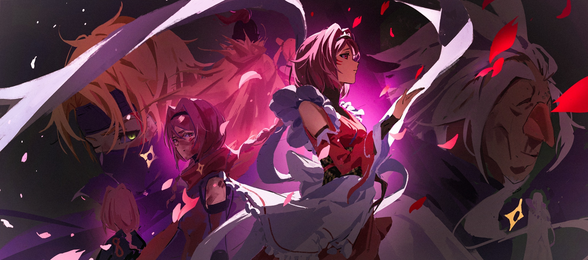
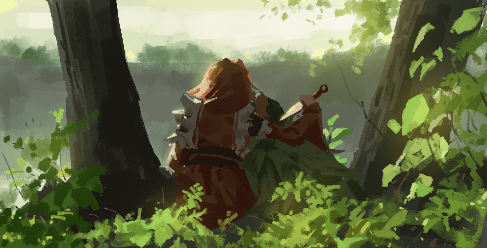

«Синоби не должен ни к чему привязываться сердцем», — таково было учение, что в деревне синоби империи Волакия вбивали в головы тех, кому была уготована лишь одна судьба. Это железное правило следовало чтить превыше даже кровных законов, пустивших корни в имперской земле.

Стоит доверить своё сердце чему-либо, и отточенный клинок, имя которому «синоби», мгновенно покроется ржавчиной. А потому каждый, кто звался синоби, без исключений обязан был высечь это правило в своей душе и следовать ему. И всё же…

— А знаешь, ты, поди, как и я… из тех, кто на всё горазд, а оттого и жизнь пресной кажется. Может, стоит найти что-то одно для души, а? — произнёс с улыбкой староста деревни, после чего обнажил на удивление целые для его лет зубы.

Яэ до сих пор помнила, как её обуяла лютая злоба от его слов. Куда, спрашивается, подевалось железное правило синоби?

«Я так жить не смогу», — врезалось в память и то, как твёрдо она тогда это решила.

△ ▼ △ ▼ △ ▼ △

«Багровая Сакура» Яэ Тэндзэн была гениальным синоби, каких свет не видывал. Это — неоспоримый факт, который и сама Яэ, пусть и с неохотой, но признавала. Окружающие превозносили её как величайший талант за всю историю деревни, во всеуслышание заявляя, что её потенциал, возможно, не уступает даже «Хвалителю» из городов-государств Карараги. По правде говоря, самой Яэ отчаянно хотелось, чтобы её перестали сравнивать с такими невероятными личностями, но всем в деревне было плевать на её чувства — они были без ума от её природного дара. И впрямь, если талант — это то, что позволяет с высокомерной лёгкостью срезать углы там, где другие тратят неимоверные усилия, то Яэ, без всяких сомнений, обладала врождённым даром синоби. Однако, в противоположность всеобщей оценке, Яэ ненавидела, когда к ней относились как к «особенной». Это было сродни физиологическому отторжению, внутреннему сопротивлению, своего рода «аллергии на „особенное“». Когда особенными считали других, её это не волновало. Но стоило этому клейму коснуться её самой, как Яэ охватывало невыносимое чувство, которое заставляло желать всё бросить и сбежать. Такова была её реакция. И для Яэ, с её острой аллергией на всё «особенное», железное правило синоби, которое староста деревни самолично поставил под сомнение, подходило как нельзя лучше. Привязаться к чему-то сердцем — значит создать внутри себя нечто «особенное». А раз у Яэ на это аллергия, то она без малейшего труда могла соблюдать железное правило синоби. Воистину, женщина, рождённая стать ниндзя. Правда, это стало ещё одной причиной, по которой окружающие считали её «особенной», — так что тут, как говорится, палка о двух концах.

Путь синоби суров, и стать им дано не каждому. Это настолько узкая тропа, что говорят, лишь один из тысячи учеников становится гэнином, один из тысячи гэнинов — тюнином, и один из тысячи тюнинов — наконец дзёнином. Впрочем, каждый раз, слыша эту байку, Яэ думала: «Да откуда в мире возьмётся миллиард тех, кто хочет стать синоби?» Что ж, уже неплохо, что старшие товарищи сами понимают, насколько суров их путь, раз прибегают к таким абсурдным сравнениям. Любую пытку приятнее переносить, когда палач делает это не с мыслью «и зачем я этим занимаюсь?», а с твёрдым убеждением: «пытать именно это место имеет глубокий смысл». Такова уж человеческая природа. А процесс создания синоби действительно был жесток, как настоящая пытка. Поскольку тренировки начинались в том возрасте, когда ребёнок только-только начинает осознавать себя, Яэ считала, что это даже не пытки, а жестокое обращение с детьми. Но если начать перечислять все тёмные стороны подготовки синоби, этому не будет конца, так что, увязнув в самом начале, мы далеко не продвинемся.

Начнём с кандидатов в ученики — обычно это похищенные где-то дети. Как уже говорилось, тренировки синоби начинаются в раннем детстве. Нечеловеческие, абсурдные испытания приводят к тому, что дети мрут как мухи. Поэтому, ради эффективности, похищают не младенцев, а малышей подходящего для тренировок возраста. Уже в этом нежелании возиться с грудничками видна вся бесчеловечная и отвратительная натура синоби.

Первое, чему подвергают похищенных детей, — это обработка памяти. Говорят, для этого используют наркотики, гипноз или даже техники, напрямую влияющие на воспоминания, но доподлинно ничего не известно. Так или иначе, дети напрочь забывают и семью, и родной дом. Яэ тоже не помнила лиц родителей и не знала своего настоящего имени. Имя «Яэ» она получила позже, а до этого её называли «Красная №8», под стать цвету волос. И те, у кого нет предрасположенности, спотыкаются уже на этом этапе. У одних стирание памяти работает плохо, другие, наоборот, поддаются ему слишком сильно и превращаются в бесполезных овощей. Сплошные неудачи с самого начала. А Яэ — ей самой стыдно в этом признаваться — забыла своё прошлое на удивление легко и быстро. Всё вылетело из головы настолько гладко и без сопротивления, что Фудзиро Тэндзэн, проводивший обработку, был ошарашен — так он сам ей позже и рассказал. К слову, этот Фудзиро, который передал Яэ свою фамилию, стал её приёмным отцом — он был предыдущим главой клана Тэндзэн.

Впрочем, «приёмный отец» — слишком громко сказано. Их отношения были лишены всякой теплоты и скорее напоминали формальную связь наставника и ученицы. Для неё Фудзиро был лишь человеком, давшим ей имя, одним из тех в деревне, с кем ей доводилось общаться чаще других. Так или иначе, сперва у ребёнка силой отнимают все душевные опоры, чем превращают его в чистый холст — лишённого прошлого малыша, которого затем можно расписывать чёрной кистью под названием «синоби». И тут-то «фабрика по производству нелюдей», деревня синоби, показывает себя во всей красе: начинается не модификация, а переделка человеческого тела. Ломают и заново сращивают кости, дабы достичь сверхчеловеческой гибкости и ловкости; постепенно приучают организм к смертельным дозам яда; на собственном теле, через боль, заставляют запоминать опасность приёмов и инструментов синоби — всё это было ежедневной рутиной, с нормативами по сломанным костям, порванным мышцам и пролитой крови. Нередко поутру можно было наткнуться на остывшее тело сверстника, не дожившего до рассвета. Но и его не разрешали хоронить: труп становился учебным пособием для привыкания к смерти. Многие сходили с ума от одного вида, как разлагается тело, и одного вдоха этого зловония.

Все эти, так называемые, ужасающие тренировки Яэ проходила играючи. Нет, «играючи» — это, конечно, ложь. Яэ тоже приходилось нелегко, но её страдания были, наверное, в десятки тысяч раз меньше тех, что испытывали её сверстники. Если это и был талант, то да — это был он.

При ломке и сращивании костей она научилась отключать болевые рецепторы; от яда, сжигавшего внутренности, она страдала, но кровавая моча и понос были минимальными; стоило ей раз взять в руки инструмент синоби, как он становился послушен, словно верный напарник, служивший ей десять лет; а приём, который она испытала на себе, она тут же использовала, чтобы одолеть противника крупнее себя, и больше никогда не попадалась на ту же уловку. Только к трупной вони привыкнуть было тяжело, но и с этим она в итоге справилась.

Так, маленькая Яэ с неслыханной скоростью и стала одной из той самой тысячи.

— С сегодняшнего дня ты будешь зваться Яэ Тэндзэн, — нарёк её именем Фудзиро в день, когда ей присвоили ранг гэнина.

Увы, особых чувств это в ней не вызвало. Ведь ещё будучи «Красной №8», она уже выделялась среди сверстников, так что наличие или отсутствие имени никак не повлияло на её самоощущение. Ей было лишь неприятно и досадно, что к ней относятся как к «особенной».

Почему Фудзиро назвал её именно Яэ, она так и не узнала. Упустила возможность спросить. Теперь-то ей это имя вполне нравится, да и фамилия «Тэндзэн» звучит неплохо. Всяко лучше, чем если бы её по какой-то ошибке назвали Яэ Данкелькен. Но даже эту её колкость староста деревни встретил смехом:

— Кха-ха-ха! Ишь ты, дерзкая какая!

Кстати, в деревне не было ни одного синоби с такой же фамилией, как у старосты. Интересно, почему? Он был плохим учителем или просто увиливал от своих обязанностей? Яэ склонялась к первому варианту. Как бы то ни было, хоть «Красная №8» и стала Яэ Тэндзэн, ни её восприятие мира, ни её путь синоби не изменились. Изменилась не Яэ, а её окружение.

Именно это и стало главной причиной, по которой она так возненавидела быть «особенной».

△ ▼ △ ▼ △ ▼ △

Как уже упоминалось, Яэ страдала от «аллергии на „особенное“», и когда она, став самым юным гэнином в рекордные сроки, добилась повышения, её «аллергия» лишь обострилась. В конце концов талант и силу Яэ признали все в деревне, но ещё на стадии гэнина её блестящим будущим пленился один человек… Фудзиро Тэндзэн, её приёмный отец и наставник. Он был покорён талантом Яэ, что впитывала его уроки не в десятикратном, а в стократном и тысячекратном объёме. Это было прямое нарушение железного правила синоби: ни к чему не привязываться сердцем. Он должен своими руками превратить несравненного гения, Яэ Тэндзэн, в величайшего синоби. И эта слепая одержимость миссией поглотила Фудзиро.

— У тебя такой талант! Почему ты этого не понимаешь?! — выкрикивал он с пламенем в глазах. Да, верил в её дар он фанатично.

День ото дня Яэ чувствовала, как его взгляд становился всё более пылким, но последствия этого взрыва превзошли все её самые смелые предположения. Фудзиро, чей разум был опалён «особенностью» Яэ, устроил ритуал «Кодоку». Он работал по тому же принципу, что и «Церемониальный Отбор» Волакии: глупое и безрассудное действо. Он втянул в это дело тридцать гэнинов, равных Яэ по статусу. Оно могло поставить под угрозу само существование деревни.

Гэнинов вывели в глухой лес и приказали убивать друг друга, пока не останется лишь один. Не смея ослушаться приказа старшего по званию, они бездумно расставались с жизнями.

Как и ожидал Фудзиро, последней осталась Яэ Тэндзэн. Вот только он был крайне недоволен тем, как она сражалась — никогда не нападала первой, лишь отвечала на чужие атаки, — а также тем, что она пощадила последнего сверстника, молившего о пощаде… точнее не «он», а «они».

Фудзиро был не единственным, кто, влюбившись в талант Яэ Тэндзэн, свернул с пути. Многие, вдохновившись его словами или воочию убедившись в росте Яэ, решились на ритуал «Кодоку», дабы возложить на неё свои извращённые надежды. И когда Яэ обманула ожидания этих слепо верящих в неё людей, их пыл не только не угас, но, извратившись, разгорелся с новой силой.

Было бы куда милее с их стороны, если бы они попытались убить Яэ, предавшую их надежды, а затем покончили с собой. Но нет, они приняли неверное решение: повторять «Кодоку» снова и снова, пока Яэ не станет тем идеальным синоби, которого они себе вообразили. Этим людям уже ничто не могло помочь.

— Ты изменишь саму суть синоби!..

Даже умирая, Фудзиро верил в потенциал Яэ. Он верил до самого последнего вздоха… пока она не перерезала ему глотку. Лепестки белоснежной сакуры, распустившейся как назло пышным цветом, тихо опадали на бездыханные тела её приёмного отца и его глупых приспешников, лежавших в лужах крови. Яэ помнила эти лепестки, окрашенные в багрянец, и чувство невыразимой усталости.

— Ого-го, ну и дела. Девчонка желторотая, а уложила всех, даже дзёнинов, что тут были, — лениво окинул взглядом опоздавший староста трупы молодых синоби и стоявшую посреди них Яэ.

Похоже, верхушка деревни знала о тайных планах Фудзиро и его сообщников, и их судьба, вне зависимости от исхода «Кодоку», была предрешена. Очень не хотелось бы строить догадки, что они так медлили лишь потому, что решили свалить устранение смутьянов на Яэ…

— Так что, все мертвы?

Не из-за этих догадок, но Яэ врала в ответ на вопросы старосты. Она умолчала о причине недовольства Фудзиро и его людей — о сверстнике, молившем о пощаде, которого она отпустила. Она позволила ему сбежать не только из «Кодоку», но и из самой деревни синоби. Тот парень предложил: «Эй, может, и ты со мной сбежишь?», но Яэ твёрдо отказала. Не потому, что хотела остаться в деревне, а потому, что не хотела вставать с ним в один ряд, ведь её силы и таланты были несравнимо выше. Но инстинкт кричал: если Яэ и суждено умереть, то это случится, когда она будет рядом с ним.

— Ошибка, ошибка, — пробормотал он и ушёл.

Яэ почувствовала, что он хотел устранить всех, кто знал о том, что он выжил, но он оказался достаточно здравомыслящим, так что отказался от этой цели. Благодаря этому в том «Кодоку» выжили только двое: Яэ и тот сверстник. Может быть, от того, что она не осталась единственной выжившей, её «особенность» хоть немного померкнет? Так она тогда думала.

— Ну, стало быть, пора возвращаться… «Багровая Сакура», — повернулся к ней спиной староста. Тогда он впервые и назвал её этим прозвищем.

Почему Фудзиро нарёк её Яэ, она так и не поняла. Но почему староста назвал её так, она поняла без слов. В ту ночь, когда погибло слишком много синоби, цветущая белоснежная сакура была обильно окроплена кровью.

△ ▼ △ ▼ △ ▼ △

«Багровая Сакура» Яэ Тэндзэн была гениальным синоби, каких свет не видывал. К тому времени, как она в самом юном возрасте получила ранг дзёнина и окончательно укрепила свою репутацию, её «аллергия на „особенное“» стала неизлечимой. Быть для кого-то «особенной» для Яэ было проклятием, угрозой, вмешательством, которое несло в её жизнь один лишь негатив. Надежды и ожидания обычно воспринимаются как нечто позитивное, поэтому в мире слишком много тех, кто размахивает ими, не понимая, что они могут стать клинком, удар которых будет проникать невероятно глубоко. И что хуже всего, когда клинок невидим, ни палач, ни жертва могут не заметить раны. От таких клинков Яэ досталось сполна, и она смертельно устала.

— А знаешь, ты, поди, как и я… из тех, кто на всё горазд, а оттого и жизнь пресной кажется. Может, стоит найти что-то одно для души, а? — говорил он.

Староста знал о существовании этих клинков, но всё равно вызывал у Яэ ненависть. Он сам подталкивал её к нарушению железного правила синоби. Не иначе как спятил. Да и вообще, Яэ не искала в жизни никакого смысла. Ей это было не нужно.

Искать смысл — значит верить в свои способности, надеяться на будущее… а это не что иное, как вера в собственную «особенность», что для Яэ было равносильно наступлению на мину. Поэтому она сознательно отдалилась от того образа синоби, на который все возлагали надежды и ожидания. Она стала полной противоположностью идеала, который пытались создать Фудзиро Тэндзэн и его последователи ценой своих жизней — легкомысленная, неуловимая, дружелюбная, но ни с кем не сближающаяся. Так и сформировалась личность Яэ Тэндзэн — ветреной и поверхностной особы.

Чтобы не было недопонимания, стоит сказать прямо: это было нормальным следствием отвращения Яэ к «особенному», а вовсе не подражанием старосте деревни. Не вникать ни в чью жизнь, ни с кем не сходиться по-настоящему, не позволять никому себя ценить — такова была выработанная «Багровой Сакурой» Яэ Тэндзэн тактика выживания и философия…

— Ты ведь не считаешь такой ужасный образ жизни своим даром? — как-то раз сказала одна женщина ей наедине, отчего у девушки багровой красоты перехватило дыхание.

Её обострившаяся «аллергия на „особенное“» позволяла ей не только ненавидеть, когда «особенной» считали её, но и тонко чувствовать это в других. А женщина, с которой она сейчас говорила, была воплощением «особенного» от кончиков волос до глубины души. Впрочем, чтобы заметить её особенность, не нужно было обладать чутким чутьём — это было очевидно каждому.

«Кровавая Невеста» Присцилла Бариэль… Дни, проведённые с ней, кого народ прозвал «Принцессой Солнца», были яркими и незабываемыми даже для Яэ, выполнившей множество заданий в качестве синоби. Изначально она внедрилась в поместье Присциллы в качестве горничной по приказу Чиши Голда, одного из «Девяти Божественных Генералов» Империи. Что эта женщина, участвовавшая в Королевских Выборах в далёком Королевстве Лугуника, значила для Империи, Яэ не сказали, да она и не спрашивала. Выполнять приказы без лишних вопросов — в этом суть синоби, и её это устраивало. Открыто перечил приказам разве что староста, а Яэ, в отличие от него, была послушной.

Тем не менее, задание было нелогичным и непонятным. В основном требовалось наблюдать за объектом и докладывать о её передвижениях. Никаких приказов о саботаже или диверсиях не поступало, как и приказа «быстро убей и возвращайся». Раз уж на это задание выбрали именно Яэ, значит, от неё ожидали соответствующего уровня мастерства и способности выжить, но первое время в поместье она просто исполняла обязанности горничной… Честно говоря, это было пустой тратой таланта гениального синоби, «Багровой Сакуры». На деле, врождённые таланты Яэ распространялись не только на искусство синоби — она с лёгкостью справлялась с большинством других дел. Поэтому обязанности горничной не доставляли ей хлопот, и миссия по внедрению в поместье Бариэль казалась такой же простой, как и все предыдущие. Вот только в общении с Присциллой приходилось быть предельно осторожной.

По долгу службы Яэ видела немало высокопоставленных особ. И «Белый Паук», отдавший ей приказ, и, в какой-то мере, «Порочный Старик», староста деревни, тоже были важными фигурами в Империи. Ей даже довелось издали видеть самого императора… хотя тогда она встретилась взглядом с «Голубой Молнией», стоявшим рядом с ним, и тот ей даже помахал, отчего она содрогнулась, поняв, что всегда есть кто-то сильнее. Но даже по сравнению со всеми ними проницательность Присциллы была бездонной, и предугадать, что она видит насквозь, было невозможно. Яэ не раз ловила себя на мысли, что её, шпионку из Империи, должно быть, раскрыли, хотя это и казалось невозможным. Если бы это было так, её бы не оставили в живых. Значит, не догадалась. Но так ли это? Присцилла была настолько непредсказуемой, что могла и заметить, и проигнорировать. Это можно было бы назвать рискованной натурой, не жалеющей даже собственной жизни. Или же, как она сама часто говорила, верой в то, что мир вращается вокруг неё, — чистой воды бредом сумасшедшей.

Как бы то ни было, Яэ считала это несчастьем и жалела «особенную» Присциллу. Её несравненная красота, манеры, речь, даже само дыхание — всё в Присцилле таило дьявольское очарование, которое, хотела она того или нет, привлекало взоры, вторгалось в жизни и трогало чувства людей. Многие будут возлагать на неё надежды, мечтать о ней, поддаваться дурным желаниям и эмоциям. Даже эта жалость, которую испытывала Яэ, была порождена её «особенностью». Именно тогда, словно прочитав её мысли, Присцилла и произнесла те слова.

Она тогда сидела в своей комнате, глядя в книгу, и, казалось, даже не смотрела в сторону Яэ, готовившей чай, как вдруг, без всякого предупреждения, заговорила. Однако, как уже говорилось, рядом с Присциллой она всегда была начеку. Поэтому и в тот раз, хоть и удивившись, она смогла ответить в своей обычной, легкомысленной манере. Легко, с напускной игривостью с видом, будто не принимает слова всерьёз, она улыбнулась. В ответ на неизменную манеру служанки Присцилла прищурила один глаз и сказала:

— Когда-нибудь и тебе придётся поставить на кон всё, что у тебя есть. Помяни мои слова. И будь готова на все сто.

Яэ не смогла спросить, что она имела в виду. Частично потому, что инстинкт синоби подсказывал: переспросишь — вызовешь подозрения. Но, скорее всего, главная причина была в том, что Яэ просто не хотела слышать неудобные слова, обращённые к ней, из уст «особенной» Присциллы. Поэтому Яэ так и не узнала истинного смысла слов Присциллы. Как не знала и того, почему Фудзиро назвал её Яэ, или зачем староста, словно издеваясь, постоянно подталкивал её к нарушению железного правила синоби.

Чтобы другие не считали её «особенной», она закрывала уши и отворачивалась, ведь такова была жизненная философия Яэ Тэндзэн: не желать быть «особенной» и не желать, чтобы тебя таковой считали.

△ ▼ △ ▼ △ ▼ △

В конце концов, Яэ оказалась права. Даже Присцилла, сиявшая так ярко и пленившая столь многих своим пламенным, «особенным» естеством, пала на жестокой и беспощадной земле Империи. И теперь тот, кто сгорал от тоски по её утраченной «особенной» сути, сжигал свою жизнь, снедаемый безудержной страстью, в стремлении отплатить ей. Яэ Тэндзэн не желает такой жизни, подвластной чужой «особенной» воле.

Поэтому. Вот поэтому она должна как можно скорее стереть с лица земли ту «особенность», что вызывает в ней нездоровую привязанность. Это единственная причина, по которой Яэ, рискуя жизнью, помогает ему — тому, кого отвергла его возлюбленная «особенность»…

— !..

Ледяной диск вращался на огромной скорости — и всё же Яэ использовала его как поле боя, отражая атаку ворвавшейся девушки-Демона, Рем. Правая рука метнула стальную нить вертикально, левая же, подхватив меч, нанесла удар горизонтально. Двойной, почти неотвратимый выпад, зажал Рем спереди и сзади.

Из-за слаженных действий противниц Яэ упустила Эмилию. Полуэльфийка на ледяных крыльях, поймав ветер, устремилась вдаль, в небеса, за летящим Алом и набирала всё большую скорость. Её удаляющаяся спина — в то время как сама Яэ могла лишь падать камнем вниз — наконец-то вышла из радиуса досягаемости стальной нити. Конечно, можно было бы попытаться метнуть обломок камня или меч с помощью нити, но…

— Не отвлекаться!

…из-за Рем эта возможность ускользнула — синеволосая девушка уклонилась от меча и стальной нити. Уклонилась от меча она с помощью цепи, а от нити благодаря тому, что вовремя пригнулась.

Яэ скрипнула зубами от досады. Синоби, дабы уйти от приближающейся Рем, с помощью нити сделала широкий круг и оказалась на противоположной стороне диска.

— Становиться сильнее прямо на ходу — это как-то нечестно, вам не кажется? Что за причина?..

— Любовь!

— Зря спросила!..

Рем пробивала лёд напролом, преследуя Яэ. Девушка-Демон, чей рог на лбу светился, чем даровал ей силы, действовала грубо. Чтобы выйти на свою излюбленную среднюю дистанцию, Яэ уклонилась от мощного удара руки и шипастого шара, прильнув к вращающейся платформе и оказавшись за спиной Рем.

Скорость вращения диска была высока, но, хоть его движения по вертикали и горизонтали были хаотичны, само вращение имело определённый ритм. Стоило его уловить, и риск сорваться исчезал. Яэ порхала по льду, словно в танце. Но, в отличие от неё, движения Рем были просты и прямолинейны.

— Не позволю!.. — крикнула Рем и впила пальцы и кончики ног в лёд, а коротко перехваченный шипастый шар использовала как якорь, дабы цепляться за поверхность и по-звериному преследовать Яэ.

Это был грубый, яростный стиль охоты хищника, далёкий от изящества и утончённости, — и всё же быстрый. Она стремительно сокращала расстояние до порхающей Яэ.

— Не находишь, что твоё поведение не подобает горничной?

— Увы, наш господин любит в горничных лишь одно — самоотверженность!

Рем, опираясь на три конечности, подняла голову, извернулась и при помощи вращения диска ударила шипастым шаром с минимальным замахом. Яэ нитями парировала его, чем отбросила в сторону, и мысленно выругалась.

Соревнование за звание лучшей горничной… шутить на эту тему у Яэ не было ни малейшего желания. Она превосходила Рем в технике и была уверена, что её уровень мастерства выше не на одну, а на все три ступени. Но они были просто несовместимы. Моргенштерн Рем — оружие инерционного типа, а его тяжёлые, смертоносные удары было труднее всего отражать стальными нитями.

Сила стальных нитей была в том, что, скрутив их в жгут, можно было блокировать любую атаку. Но для этого требовались подходящая дистанция и достаточное количество. Чтобы наверняка отразить один удар Рем, Яэ пришлось бы задействовать все семь пальцев на обеих руках. Если не хочешь этого, уворачивайся, но…

— Слишком уж точные удары!..

Несмотря на шаткую опору, шипастый шар, словно огромная змея, неотступно преследовал Яэ. Каждый удар летел прямо в центр, так что пропустить его было невозможно, даже закрыв глаза, но ритм атак Яэ сбивался раз за разом. А вдобавок ко всему этому — ужасающие боевые способности расы Демонов.

— А-А-А-А-А-А!!!

Рем вцепилась в ледяной диск, и из её тела вырвался красный пар — это был результат низкой температуры на высоте в несколько тысяч метров, активации маны в теле, характерной для расы Демонов, и быстрой регенерации ран от стальных нитей Яэ. До этого момента синоби уклонялась от смертельных ударов Рем и успела нанести ей множество ран в надежде вывести девушку из строя. Но ни одна из них не смогла превзойти регенерацию Демона. И что самое главное…

— Ч-ш…

Она поднесла кольцо к губам, и стальная нить вновь вспыхнула. В тот же миг, ослепив Рем огнём, Яэ взмахнула рукой нацелилась на шею противницы за стеной жара. Молниеносный удар стальной нитью, летящей со скоростью звука, должен был обезглавить её. Это была оригинальная техника Яэ, которой не было в свитках, — самый быстрый её приём. Словами Ала — «ульта». Яэ была уверена, что этот смертоносный удар невидимой нити с неизвестной дистанции сразит любого противника. И всё же Рем увернулась… И не раз, а дважды.

— !..

В первый раз она жадно попыталась поразить и Рем, и Эмилию одним ударом. Когда его отразили, она нацелилась не в шею, а в грудь, чтобы Рем не смогла уклониться, просто пригнув голову. Свист рассекаемого воздуха был таким, что случайное уклонение исключалось. Следовательно, Рем увернулась не чудом и не случайно — это была закономерность… Рем видела её технику стальной нити. Ледяного тумана вокруг уже не было, так что она использовала какой-то другой способ, не тот, что Эмилия, которая чувствовала нити по разрезаемым частицам льда. Принципа этого способа Яэ пока не понимала.

— Не позволю, — прошептала Яэ, сжав губы. Она перестала изображать на лице всякие эмоции, которых и так не было.

Не позволю пройти. Не позволю уйти. Не позволю остановить. И Рем, и Эмилию остановит Яэ.

— …

Ал расправил каменные крылья и покинул поле боя — он не стал дожидаться исхода сражения.

Яэ не считала, что её бросили или оставили. Не исключено, что он в ней разочаровался, но Ал был слишком прижимист. Он не станет так просто разбрасываться картами и фигурами. Поэтому Яэ и восприняла его уход как поручение. Она решила, что он приказал ей остановить преследовательниц любой ценой. Значит, Ал доверил ей… лицензию на убийство.

— Остановлю, даже если придётся убить.

Остановить, остановить, во что бы то ни стало. Помочь Алу достичь его цели. Устранить все преграды на его пути. Чтобы Ал, страдающий после потери своей «особенной» Присциллы, как можно скорее исчез из этого мира. Иначе Яэ Тэндзэн не сможет вернуться к себе прежней — той, что соблюдает железное правило синоби, той, чьё сердце ни к чему не привязано, той, кто ненавидит и избегает «особенного».

△ ▼ △ ▼ △ ▼ △

— Просто звёзды не сошлись, — повторяло снова и снова чудовище, что вселяло ужас в Яэ Тэндзэн.

Дни в поместье Бариэль, куда её отправили на задание по внедрению, оборвались довольно внезапно. Ежедневная работа горничной, поддразнивание милого младшего дворецкого, перепалки с шутом-рыцарем, которого и за рыцаря-то не считали, служба ослепительной и грозной «Принцессе Солнца» — всё это было не так уж и плохо. Но когда приходит приказ, чувства Яэ перестают иметь значение. Выполнить задание, исчезнуть, не оставить следов. Так, получив внезапный приказ об убийстве, Яэ направилась к спальне Присциллы, но в тёмном коридоре её остановил этот мужчина. Его вмешательство было столь ожидаемым, что оправданий не требовалось. Яэ и мужчина — Ал — сошлись в смертельной схватке.

Хотя «смертельной схваткой» это можно было назвать с натяжкой. Разница в силах была очевидна. Несмотря на то, что Ал был рыцарем кандидатки на трон, он был намного слабее Яэ, и исход поединка должен был решиться в одно мгновение… Должен был .

— Просто звёзды не сошлись, — произнёс то же самое тем же тоном мужчина, которому она только-только пронзила сердце.

Но даже в такой ненормальной ситуации Яэ не медлила и наносила удар за ударом. Убиваешь, а он не умирает… С таким она сталкивалась не впервые. В мире полно чудаков, и ей доводилось сражаться с теми, у кого было не два, а целых три сердца. Но и они умирали, когда она уничтожала третье. Главное — убивать, пока не умрёт.

Она отрубила ему голову, разрубила пополам, сожгла дотла, оторвала руки-ноги, перерезала горло, размозжила череп, выколола глаза, содрала всю кожу со спины, переломала все кости, превратила в кашу внутренности, заставила выпить яд, закопала в землю, утопила в воде, повесила, повесила за всё, кроме шеи. Яэ испробовала все известные ей техники синоби, отняла столько жизней, сколько могла, убила всеми возможными способами.

— Просто звёзды не сошлись.

Но сколько бы она ни убивала, Ал вновь произносил то же самое. Она испробовала все свои техники, все мыслимые способы, и в конце концов, отбросив разум, отдалась инстинктам, но убить его не смогла. Не смогла до конца.

— Просто звёзды не сошлись.

Она подвергла его пыткам, от которых он должен был пожалеть о своём рождении — бесполезно; попыталась бросить задание и сбежать — бесполезно; попыталась втянуть других — бесполезно. И когда, наконец, она решила, что всё кончено, и накинула нить на свою же шею…

— Просто звёзды не сошлись.

…даже это не помогло.

— Просто звёзды не сошлись.

Повторяющийся диалог, спираль, блуждающая между смертями, бесконечное, бесконечное повторение одного и того же, и Яэ Тэндзэн впервые в жизни испытала… ужас.

— Просто звёзды не сошлись.

Ради спасения она готова была на всё. И поклялась, что сделает всё. Ради того, чтобы всё это кончилось, она готова была на всё. И поклялась, что сделает всё.

— Просто звёзды не сошлись.

Но одного лишь познания ужаса было недостаточно. Чудовище по имени Ал не собиралось её прощать.

— Просто звёзды не сошлись.

Даже когда её душа была разбита вдребезги, безжалостность чудовища не знала конца. Она даже не считала. В этом мире не было никого, кто убивал бы Яэ и кого бы убивала Яэ чаще, чем это чудовище. Бесчисленное количество раз она убивала его, и неисчислимое — он убивал её.

— Просто звёзды не сошлись.

Такого противника больше не было. И не нужно. И думать не хочется. Даже сейчас, когда по прихоти чудовища она оказалась высвобождена из этой бесконечности, когда поклялась в верности и всем своим существом следовать его цели, это было высечено в глубине её души.

— Просто звёзды не сошлись.

Нужно как можно скорее избавиться от чудовища, от мужчины, от Ала. Неважно, что стало причиной, поводом, связью — сердцу Яэ Тэндзэн не должно быть позволено привязываться к чему-либо.

— Просто звёзды не сошлись.

Не должно… быть позволено привязываться к чему-либо.

△ ▼ △ ▼ △ ▼ △

— Просто звёзды не сошлись, — сорвалось уже с её губ, отчего она на миг вернула улетевшее сознание. Внезапно она поняла, что её тело было подброшено в воздух, а мир вокруг кувыркался.

Толчок… да, был толчок. Ледяной диск был пробит ударом снизу, и его разрушительная сила пронзила и тело Яэ.

«Что это?» — на краю сознания она бросила взгляд вниз и увидела, что диск был разбит о вершину огромной ледяной горы, выросшей со дна ущелья. Великая река, что текла по дну, была заморожена, и чудовищная глыба льда, созданная там, поджидала падающий диск. Судя по скорости падения, ветру и прошедшим секундам, высота составляла примерно пять тысяч метров — это соответствовало самому большому в мире Агзадскому ущелью, и вид замороженной на его дне реки заставил Яэ осознать запредельную мощь магии Эмилии. Но больнее всего было другое…

Пока Яэ вращалась в воздухе, она среди мириадов осколков разбитого диска, сверкающих, как алмазная пыль, увидела Рем со светящимся рогом на лбу.

— Упорная же ты…

В момент столкновения Рем уклонилась от удара и взмыла в воздух, а затем оттолкнулась от разлетающихся обломков и устремилась к парящей Яэ.

Она сказала, что до столкновения десять секунд, когда на самом деле оставалось пять. Потерять хладнокровие — непростительная ошибка для синоби; попасться на уловку — непростительный промах для горничной; предать возложенную на тебя миссию — непростительно для «Багровой Сакуры»…

Она выставила себя в жалком свете.

— Это всё хреновы звёзды не сошлись, — обратилась она не к приближающейся девушке и даже не к самой себе, а к чудовищу, которого здесь не было и которое улетело далеко-далеко. И произнесла она это с тем же смыслом, с которым оно говорило это другим.

— А-а…

Всё тело стонало от удара. Яэ даже не была уверена, на месте ли её руки и ноги. Но что ей онемение? Она преодолела его во время тренировок с ядами. Что ей отсутствие чувствительности? Во время пыточных тренировок ей ломали все кости. Что ей помутнение сознания? Она проходила тренировки, в которых сражалась на грани жизни и смерти, выпускала из тела почти всю кровь. Мысль о том, что всё это сейчас ей пригодилось, вызвала в памяти хитрый смех старосты, и от этого стало тошно. Тошно, тошно, но…

— А-А!

Тысячи, десятки тысяч, сотни тысяч, миллионы, десятки миллионов раз она повторяла одно и то же движение. Яэ управляла стальной нитью, которой никто не пользовался сотни лет и которая требовала ювелирной точности движений пальцев с точностью до миллиметра. И управляла она ею, даже когда тело немело, кровоточило, а сознание туманилось. Даже если семь десятых её жизни уже покинуло это тело, пальцы, управляющие нитью, не ошибутся.

— А-А-А-А-А!!!

Она резко дёрнула руками и ногами, и в тот же миг обломки льда, опутанные нитью, сорвались с места и устремились в небо. Осколки разбитого диска, подхваченные нитями, в такт движениям её тела яростно закружились в воздухе и сбоку врезались в летящую Рем.

— !..

Раздался грохот, и Рем оказалась сбита ударом ледяной глыбы — она с огромной силой отлетела в сторону. Вдогонку летящей Рем полетели новые и новые обломки льда, подхваченные стальными нитями, и обрушились на неё, когда та упала на вершину ледяной горы. Взметнулось белое облако снега, в поднявшемся ледяном тумане показалась кровь, что превращала ледяную гору в надгробие для демона… Но в то же мгновение надгробие было пронзено, и взлетевший вверх шипастый шар вонзился прямо в Яэ.

— Ах!..

Ужасный железный шар с шипами вонзился Яэ в бок и пробил его насквозь. Но важные органы она сместила в сторону. Благодаря нечеловеческой перестройке тела, синоби Яэ могла смещать расположение своих внутренних органов. Шип прошёл через пустоту и вышел из спины, разбрызгивая кровь.

Она намеренно приняла этот удар. Напрягши мышцы, она зажала шипастый шар в собственном теле. Затем из белого тумана вырвалась окровавленная девушка-Демон, которая вцепилась в цепь своего оружия и взмыла вверх. Её траектория была прямой, без изысков и хитрости — полёт, ведомый одним лишь чувством. И на пути этой летящей Рем её ждала паутина из стальных нитей.

— …

Рем сама бросилась в стальную клетку, которая должна была разорвать её на куски. Бесчисленные порезы появились на её белой коже, нити готовы были разрезать её на сотни частей… Но за мгновение до этого губы Рем прошептали короткое заклинание:

— Хьюма.

Это заклинание создавало лёд. Яэ видела эту магию в этом бою уже не раз.

Синоби всем своим существом напряглась. Она готовилась к любому подвоху и ожидала, где именно Рем создаст лёд, и направила все свои чувства на триста шестьдесят градусов, дабы отразить любую внезапную атаку.

Но это было излишне, ибо не было никакой внезапной атаки — лёд появился прямо перед Яэ. Ощущение от стальных нитей, которые должны были разорвать Рем, пропало. Она увидела, что нити, впившиеся в неё, оказались остановлены красным льдом — замороженной кровью. Стоило ей это понять, как она поднесла кольцо к губам, чтобы воспламенить нить, растопить застывшую кровь и возобновить смертельную атаку… Но было уже поздно.

Рем не упустила мгновение, пока нити ослабли. Она занесла кулак над синоби.

— Йа-а-а-а-а!!! — проревела Рем.

Это был удар, в котором чувствовалась воля завершить этот бой, и в который было вложено достаточно силы для этого. Яэ по виду окровавленного белого кулака смогла оценить его мощь. Поэтому его нельзя было принимать. Ни в коем случае. Ещё оставалась Эмилия… И ради победы она достала свой козырь.

— …

Яэ задействовала двадцать пальцев на руках и ногах, все стальные нити были в деле, но враг прорвался.

Но есть. Ещё есть. Главный козырь техники стальной нити Яэ Тэндзэн — её красный язык, который она дразняще высунула…

— Бе…

С кольца, что она надела на кончик языка, сорвался последний, финальный режущий блик света. Он с точностью до миллиметра устремился к тонкой шее приближающейся Рем и одним взмахом оборвал её жизнь.

△ ▼ △ ▼ △ ▼ △

«Багровая Сакура» Яэ Тэндзэн была гениальным синоби, каких свет не видывал. «Порочный Старик» Ольбарт Данкелькен высоко, очень высоко ценил её талант и силу. Сама она терпеть не могла, когда её так оценивали, но её недовольство лишь раззадоривало садистские наклонности Ольбарта, потому он не прекращал. В мастерстве, пожалуй, он, с его многолетним опытом, был выше. Но её талант намного превосходил его собственный, и со временем из неё вырастет сильнейший синоби, с которым никто не сможет совладать. Так что желание видеть в Яэ свою мечту было вполне понятным. Впрочем, он — это он, а другие — это другие. Нет смысла позволять другим воплощать твои мечты. Поэтому Ольбарт, который не перестал мечтать сам, мог дать гениальной девушке лишь один чистосердечный совет… нет, предостережение.

«Понимаешь, у меня самого такое бывало. Мы, такие вот необыкновенные ребята, живём, как правило, дольше обычных синоби и всякого насмотримся. И бывает такое, знаешь… когда железное правило синоби соблюдать уже не получается».

«А? Думаешь, я о том, что слаб тот, у кого нет ничего дорогого? Не-а, совсем не об этом я. Дело в другом… вот смотри, ты же не сможешь справиться с ядом, которого не знаешь?»

«Детей с малых лет поят ядом, чтобы они от яда не умерли. Так что мой совет, что стоит найти что-то одно для души, — он тоже для того, чтобы ты не умерла».

«Понимаешь, он ведь никогда не любил и никогда не был любим. От этого становятся ужасно слабыми. Синоби, который впервые полюбил кого-то… кха-ха-ха!»

△ ▼ △ ▼ △ ▼ △

Козырной удар, стальная нить, сорвавшаяся с кольца на кончике языка, не промахнулась: она оторвала голову несущейся на неё девушки.

Яэ сняла с себя запрет на убийство и устранила преграду на пути Ала. При мысли об этом и о реакции Ала, когда он узнает, Яэ почувствовала, как что-то скребётся в груди…

Но она даже не успела в полной мере насладиться этим щемящем чувством. Яэ выпучила глаза не в силах поверить в увиденное.

— Что? — вырвалось у неё.

Её стальная нить без сомнения перерезала тонкую шею Рем. Она тогда чётко почувствовала, как лезвие прошло сквозь плоть, кровь и кости, а после — свист воздуха, сам признак окончания жизни. И всё же…

— Я тоже схитрила.

Багровые глаза Яэ встретились с бледно-голубыми глазами Рем. В них не угас свет. А красная линия на шее, смертельная рана, начала медленно исчезать.

Не заблокировала, не увернулась — отменила удар, который должен был неминуемо лишить её жизни. Это было чудо, которое нельзя было объяснить одной лишь регенерацией расы Демонов. Настолько сильной исцеляющей магией во всём мире обладали лишь немногие…

— Господин Ал…

Она хотела помочь ему, чудовищу, которое не проиграло бы, даже если бы весь мир обернулся против него. Она хотела этим поступком стереть то «особенное», что таилось в её сердце.

Стоило закрыть глаза, как вновь раздавались те ужасные слова, от которых волосы вставали дыбом.

— Просто звёзды не сошлись.

Но на этот раз, как ни странно, они принесли Яэ не ужас.

— Проиграла из-за…

— …любви! — ответила ей Рем.

И затем последовал мощный ударом кулаком по шипастому шару, что всё ещё был в Яэ. Этот смертельный удар был страшнее падения с пятикилометровой высоты.

И вот, на вершине ледяной горы, возвышавшейся в ущелье Агзад… рассыпались лепестки сакуры.

«Багровая Сакура» Яэ Тэндзэн опала в бою против синеволосого Демона.

