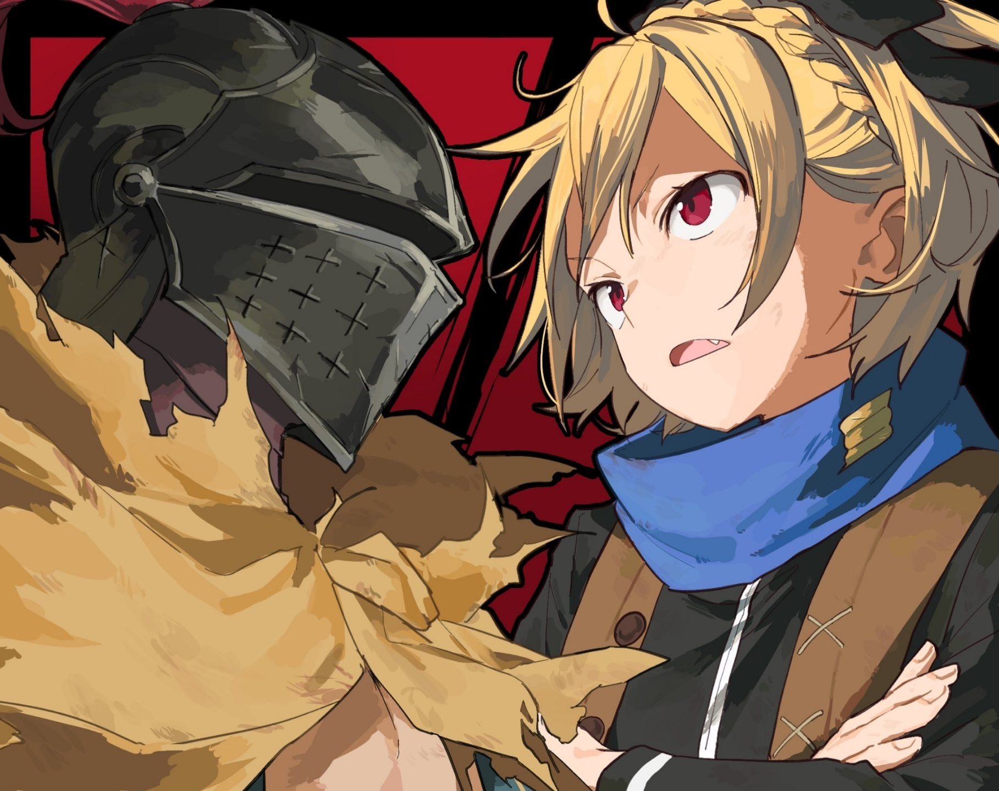

— Уж сорян, что трюк избитый, но вот мой козырь, снова на бис, — едва он это произнёс, как сверху, с огромной высоты, на него начала падать исполинская каменная глыба.

Приёмчик был повторный, и Альдебаран был готов к упрёкам в неоригинальности, но выражение лица Эмилии, уворачивавшейся от каменных исполинских рук, всё же изменилось.

— …

Сперва она с изумлением уставилась на огромный валун, затем на её щеках и в уголках глаз отразилось горькое сожаление о том, как она позволила ему сбежать в столице. Она крепко зажмурилась, дабы это гнетущее чувство поражения не одолело её сердце, и, вновь открыв глаза, увидела в них отражение каменной громады. «Справлюсь ли я?..» — на миг промелькнула тень сомнения, но тут же сменилась твёрдой волей, словно она приказала себе: «Я должна!». Взгляд её обрёл ещё большую силу, чем до мимолётной слабости, и она уверенно посмотрела вперёд. Вся эта смена выражений заняла не более секунды — поразительно, как быстро она умеет брать себя в руки.

— Но одним этим тут не отделаешься.

Гигантский валун, скрежеща и обдирая стены ущелья, продолжал своё падение.

Первым делом воспрянувшая духом Эмилия попыталась создать на пути глыбы толстую ледяную плиту, чтобы та приняла на себя всю чудовищную массу. Однако Альдебаран сорвал её замысел: он выстрелил из камнестрельной пушки — сотворённой магией оружием, что палило каменными ядрами, — и пробил саму стену ущелья. Стена осыпалась, и ледяная плита уже не могла полностью перекрыть проход. Теперь она стала лишь ещё одним снарядом, летящим вниз вместе с гигантской глыбой.

Эмилия поняла, что затея эта не удалась, и тут же переключилась на следующий план.

— Раз так, то!.. — крикнула девушка. Она вновь сотворила за спиной ледяные крылья и, опять став ангелом, поджала свои длинные ноги, после чего прижала подошвы к ногам ледяных солдат, возникших позади, и приняла от них толчок такой силы, какую оригинальный Нацуки Субару и вообразить бы не смог, — и разом взмыла ввысь.

— …

Сотни рук, тянувшихся из каменных стен, не успели за её яростным ускорением и лишь беспомощно хватали пустоту. Побег ангела — нет, скорее, его натиск на Альдебарана — состоялся.

Мужчина в шлеме был сосредоточен на отражении атаки, поэтому его собственная скорость снизилась, и расстояние между ним и стремительно наступающей Эмилией начало резко сокращаться.

Яэ осталась, дабы выиграть ему время, но всё это преимущество было растрачено впустую. Альдебарану даже послышался язвительный голосок: «Господин Ал, да от вас никакого проку, как я погляжу-у~».

— Если меня поймают, тогда да, никакого! — рявкнул он ей в ответ.

Он встретил Эмилию шквалом каменной шрапнели. Но, как и с падающей глыбой, это был всё тот же избитый приём. Эмилия божественно изящно изогнулась в воздухе и увернулась.

— Да ладно! — опешил он. Проделала такой трюк, так ещё и с крыльями! А они, казалось бы, должны движения сковывать!

Естественно, созданные изо льда ангельские крылья не махали. Секрет её нынешнего манёвра заключался в маленьких дополнительных крылышках, которые она разместила под большими — наслоение нескольких ледяных крыльев позволило менять угол обтекания воздушного потока и маневрировать наклоном тела. И такой аэродинамический финт она, без сомнения, провернула на чистом чутье.

Эмилия развернулась в воздухе для уклонения. Но даже так в скорости она не потеряла.

— Догоню!.. — крикнула девушка.

Расстояние между ними таяло на глазах. Если она сохранит этот темп, то успеет вырваться из зоны поражения падающего валуна. Его козырь, казалось бы, стопроцентный, был с лёгкостью парирован. Положение Альдебарана стало критическим — в этот миг оба участника схватки должны были прийти к единому мнению на этот счёт.

Как вдруг, фиалковые глаза Эмилии широко распахнулись, и в них отразилось чистое изумление.

— !..

Она видела, что Альдебаран не предпринял ничего особенного. Он продолжал безуспешно палить шрапнелью, но не готовил новой магии и не пытался уйти от неё на сверхскорости. Даже против её рывка он ничего не предпринимал. Ещё немного, и она бы его догнала, и тогда он бы уже не смог увернуться от её леденящих пальцев. Это означало бы, что Эмилия достигла своей цели в этой схватке. Однако в её глазах не было ни радости, ни триумфа. Ибо…

— Я же сказал, трюк избитый.

Тогда, в столице, Альдебаран смог сбежать от Эмилии благодаря тому, что заставил её остановить ужасные разрушения от валуна. И пускай его упрекнут в отсутствии фантазии, он решил применить тот же трюк, что однажды уже сработал. С одной лишь разницей: здесь не было ни одного невинного, кто мог бы пострадать. Ни одного невинного жителя.

— Ал! — крикнула она и отчаянно потянулась к нему… к единственному, кроме неё самой, кто находился под угрозой падающей глыбы.

△ ▼ △ ▼ △ ▼ △

— Схватка окончена! Ты славно выстоял в «Спарке»! Отныне ты — один из Гладиаторов Острова Гладиаторов! Добро пожаловать, сукин ты сын! — Это бурное приветствие и похвала звучали так, что их не отличить было от ругани.

Вслед за ними грубые крики толпы заполнили всю арену. Слушая их, Альдебаран, пошатываясь, опёрся на огромную тушу и опустился на колени. Он безвольно прислонился к мёртвому телу зверодемона-Гилтилоу, павшего с мечом, глубоко вонзённым в его толстую шею. Гилтилоу лишился правой передней и задней лап, и на его морде застыло выражение не столько боли, сколько растерянности и смятения. Глядя на эту жалкую предсмертную гримасу, он тяжело дышал, его плечи вздымались и опадали. Он почувствовал сострадание, но тут же ощутил омерзение к себе за это лицемерное чувство.

— А ты ведь выжил. Я удивлён, — сказал ему мужчина в простой одежде — один из гладиаторов Острова Гладиаторов. Он был первым, кто нашёл Альдебарана, когда тот очнулся.

На лице мужчины читались смешанные чувства. Наверно, для него было полной загадкой, как Альдебаран смог пережить «Спарку» — обряд посвящения для новичков. Этому человеку не повезло: как первооткрывателю ему поручили присматривать за Альдебараном, и, возможно, он втайне надеялся, что тот погибнет в «Спарке», чем избавит его от лишних хлопот. В общем, выживание Альдебарана поразило его, но он был не единственным, кто удивился.

Альдебаран и сам не мог поверить, что остался жив. Проиграв битву, в которой не имел права проигрывать, он оказался в неведомом ему мире. Незнакомое окружение, чужие люди, непонятные правила — всё это было для него подобно неизведанным землям, будто его забросили в новый мир. Он знал наверняка лишь одно: он утратил смысл своего существования, и не осталось никого, кто мог бы сокрушаться об этой утрате. Поэтому…

— Говорил, что хочешь умереть, а на деле — одни слова, — сказал мужчина и с ядом в тоне, и с сарказмом. Альдебарана это полоснуло по сердцу.

Когда он понял, что пережил поражение в своей первой битве и избежал предначертанного конца, его захлестнуло безмерное чувство утраты и самобичевания. Он всей душой желал смерти. В этом смысле «Спарка», испытание для новичков на Острове Гладиаторов, пришлась как нельзя кстати. Сумбурные объяснения были донельзя скупыми, но суть сводилась к тому, что ему придётся участвовать в смертельной проверке на прочность: те, кто не годится в Гладиаторы, умрут. И для Альдебарана, жаждущего гибели, это было как раз кстати. И действительно, когда его вместе с четырьмя другими новичками вывели на арену и выставили против Гилтилоу, он собирался умереть без сопротивлений… но вопреки всему Альдебаран выжил. Другие мужчины то бросались в атаку, то пытались бежать, то молили о пощаде, но всех их убили. Когда Альдебаран остался последним, он должен был принять смерть от когтей зверодемона, быть раздавленным его лапами, захлебнуться кровью, что пузырилась из пробитых рёбер. Однако…

«Тебя, моё творение, не победит никто», — в тот момент в голове пронеслись эти слова, и Альдебаран раскрыл «Владения».

В «Спарке» оказалось достаточно триста четыре попытки для нахождения способа убийства противника, потому она ему не показалось такой уж и мучительной, особенно если сравнивать с противником, которого он не смог одолеть, даже бросив вызов сотни миллионов раз.

Настоящая мука началась позже, когда он, выживший, остался наедине с самим собой. Зачем, почему, ради чего он не умер?

— Хм? Хочешь узнать о внешнем мире? Да что я тебе расскажу, я и сам здесь уже давно…

Альдебаран уже как Гладиатор обрёл право на жизнь на этом острове. Здесь он узнал, что это часть Империи Волакия, что пленённые Гладиаторы вынуждены участвовать в смертельных боях на потеху публике и что о порядке здесь давно забыли. Но ему хотелось знать ещё больше. В итоге, под градом его настойчивых вопросов оказался тот самый Гладиатор, назначенный его опекуном.

— Тебя интересует не текущая обстановка, а история… Ну, я в ней не особо силён. Разве что о «Ведьмах»… про «Ведьму Зависти», по крайней мере, слышал.

Он спросил о «Ведьмах», не особо надеясь на ответ, и был поражён, что Гладиатор знал о них. Но ещё больше его потрясло, что в рассказе, который тот поведал с нескрываемым ужасом, упоминалась лишь «Ведьма Зависти» — та, что едва не уничтожила мир и была запечатана «Тремя Великими Героями». Никаких других преданий о «Ведьмах» в этом мире не существовало; все записи о «Ведьмах» Греха исчезли.

Альдебаран впал в отчаяние, услышав, что эти события произошли почти четыреста лет назад. Четыреста долгих лет стёрли с лица земли все следы «Ведьм» Греха. Неужели мир забыл даже о той «Ведьме», что готова была пожертвовать всем ради исполнения своего обещания? Но было нечто ещё более жестокое…

— «Ведьма Жадности»? Что за бред? Ты это сам выдумал? — подозрительно спросил мужчина. Альдебаран не нашёл что ответить.

Это не могло быть выдумкой. Дни, проведённые с «Ведьмой», всё ещё жили в его памяти: её учение, прикосновение её пальцев, сказанные ею слова — он помнил всё. В этом мире действительно была другая «Ведьма», осмелившаяся бросить вызов той, что обладала ужасающей силой. Альдебаран был её учеником, её последним козырем.

— Ублюдок! Какого хрена?! Я просто отвечал на твои вопросы, а ты вдруг набросился на меня!

Так закончились отношения с его первым благодетелем в этом… нет, в новом мире — тот выругался, когда Альдебаран, впав в ярость от отрицания существования «Ведьмы», ударил его. Подобным образом он рассорился и с другими Гладиаторами, оставшись в полном одиночестве.

«Помешанный, одержимый „Ведьмой“» — такой слух о нём он слышал не раз. Говорили, что распускал его тот самый благодетель, но, в каком-то смысле, это была верная оценка. И Альдебаран не собирался ничего исправлять. Впрочем, его бесило, когда его ставили в один ряд с какими-то непонятными типами из Культа Ведьмы. Как он выяснил, эти люди провозглашали своей целью воскрешение «Ведьмы» и повсюду устраивали теракты и прочие бесчинства. Он снова впал в ярость от того, что его сравнили с такими , и его репутация стала ещё хуже.

— Такой маньяк, как ты, хорошей смертью не умрёт, — таковы были последние слова его первого благодетеля, которые тот прохрипел перед смертью. Альдебаран зарубил его палашом в поединке, устроенном по воле тогдашнего наместника Острова Гладиаторов. Альдебаран вытер брызги крови своего спасителя и мрачно кивнул в ответ на это предсмертное проклятие. Без сомнения, так оно и будет.

«Владения» по-прежнему были с ним, и он продолжал выживать в смертельных поединках Острова Гладиаторов. Все те, кто называл его помешанным на «Ведьме», рано или поздно выставлялись против него и погибали от его палаша. Он делал это не из мести. Он не стремился обелить имя «Ведьмы». Да и о каком имени могла идти речь, если её существование, как и существование других «Ведьм», было просто стёрто из истории? Поэтому Альдебаран не искал в «Ведьме» причину продолжать жить. Он просто хотел знать, ради чего ему сохранили жизнь.

И чтобы узнать это, он не мог позволить себе умереть. Ради этого он выжил в своей первой «Спарке» и продолжал выживать в последующих поединках. Поэтому он использовал «Владения», сотни раз принимал смерть в схватках, переступал через жизни бесчисленных гладиаторов, чтобы жить. Жить. Продолжать жить. И вот…

— Удивительно, как ты выжил. Снимаю шляпу перед твоей невероятной удачей: ты побеждаешь даже тех, кто заведомо сильнее, — прокомментировал наместник с изумлением и восхищением победу Альдебарана, когда тот сумел ухватиться за мизерный шанс и убить более сильного противника.

Альдебаран отбросил сломанный палаш и повернулся спиной к арене, на которой почти не раздавалось аплодисментов.

Прошло уже десять лет с тех пор, как он очнулся на Острове Гладиаторов. Они пролетели как один миг.

△ ▼ △ ▼ △ ▼ △

«Тебя, моё творение, не победит никто».

Десять лет — долгий срок. Эти годы безжалостно стирали в Альдебаране всё человеческое. Стоило ему закрыть глаза, как вместо отчётливых образов лица, голоса и тепла, что он так хорошо помнил, перед ним вставали предсмертные гримасы убитых, их последние крики, холодная кровь, заливавшая его… Воспоминания тускнели, вытеснялись смертью.

«Тебя, моё творение, не победит никто».

Да, эти слова были правдой. Действительно, никто не мог убить Альдебарана. За эти десять лет его много раз бросали в «Спарку» Острова Гладиаторов, он бесчисленное множество раз переступал через черту смерти на арене, убивал мастеров и нелюдей, которым, казалось, невозможно было противостоять. Раз за разом он одерживал невероятные победы, и не раз и не два ему устраивали заведомо проигрышные бои в надежде, что он наконец умрёт. Но каждый раз это приводило лишь к гибели очередного многообещающего Гладиатора, и со временем Альдебаран стал своего рода неприкасаемым.

«Тебя, моё творение, не победит никто».

За десять лет состав гладиаторов Острова Гладиаторов сменился полностью. Альдебаран давно уже стал одним из старейших бойцов, и не осталось никого, кто помнил бы слухи о «помешанном, одержимом „Ведьмой“». Он и сам перестал говорить о «Ведьмах» с тех пор, как понял, что эта тема — табу, и что большинство людей знают лишь верхушку легенд. Однако эта перемена была вызвана не разочарованием или смирением от невозможности получить нужный ответ, а чем-то гораздо более серьёзным.

«Тебя, моё творение, не победит никто».

Десять лет он провёл на заброшенном Острове Гладиаторов, где его заставляли сражаться насмерть. Здесь, где единственной реальностью была битва не на жизнь, а на смерть, его поглотило великое отчаяние. Отчаяние, заставившее его усомниться в самом существовании «Ведьмы».

«Тебя, моё творение, не победит никто».

Закрыв глаза, он определённо слышал этот голос. Он помнил, что ему это говорили. Но… но было ли это на самом деле?

«Тебя, моё творение, не победит никто».

Он не мог вспомнить лицо «Ведьмы», не мог вспомнить голос «Ведьмы», не мог вспомнить тепло «Ведьмы». За десять лет воспоминания истёрлись, как плёнка в засмотренной до дыр видеокассете. Даже если склеить порванную ленту, она уже не проиграется, и в конце концов сама кассета рассыплется в прах. Когда воспоминания рассеялись и последняя пылинка просочилась сквозь пальцы, Альдебаран перестал понимать, а существовала ли «Ведьма» на самом деле? Были ли его воспоминания вообще правдой?

«Тебя, моё творение, не победит никто».

Иногда его охватывало неудержимое желание уничтожить себя. В такие моменты Альдебаран намеренно отключал «Владения» и шёл в бой, позволяя противнику, дерущемуся на пределе сил, разорвать его на куски, чтобы заглянуть в бездну смерти. Нет, не просто заглянуть, а, может быть, даже сорваться вниз. Но именно в такие моменты «Владения» самым неожиданным образом спасали его.

«Тебя, моё творение, не победит никто».

Словно в подтверждение слов той «Ведьмы», в реальность которой он уже не верил, противники, находившиеся в шаге от того, чтобы убить его, раз за разом на его глазах сходили с ума. Каждый раз, видя, как враг закатывает глаза, теряет рассудок и волю к бою, он чувствовал, что некая незримая сила заставляет его жить. С невыносимым чувством он отрубал противнику голову.

Прошло десять лет, но Альдебаран так и не понял, ради чего его оставили в живых. Более того, он начал сомневаться, существовал ли вообще тот, кто хотел его спасти.

«Тебя, моё творение, не победит никто».

Он просто боялся. Боялся, что всё, что формировало его как личность, было лишь иллюзией. Что все старания «Ведьмы» и её слова — выдумка, и что он на самом деле просто безумец, одержимый ею. Эти сомнения грызли его душу, и он годами не мог уснуть.

«Тебя, моё творение, не победит никто».

Слова, которые когда-то были для него опорой и смыслом существования, теперь внушали ужас. Продолжать сомневаться в том, что всё это — плод его воображения, что его миссия, встречи и расставания никогда не существовали…

«Тебя, моё творение, не победит никто».

Бесконечная спираль самокопания. Ощущение, будто он по грудь увяз в болоте безысходности, где нет ответов, и не мог сдвинуться с места. Время, в котором не было определено лишь одно — способ его смерти, — тянулось бесконечно. И однажды в этих застойных днях Альдебарана внезапно наступил переломный момент. Этим переломным моментом стал…

— Внемлите мне, вы, сброд из Гладиаторов!

…голос девушки, пламенный и яростный, что разнёсся по всему острову через переговорную трубу.

△ ▼ △ ▼ △ ▼ △

Всеобщее восстание Гладиаторов и, под его прикрытием, заговор с целью убийства нового императора — такова была, по-видимому, суть того переломного момента, что обрушился на него. Впрочем, обычному Гладиатору с Острова Гладиаторов никто не докладывал подробностей, да и сам Альдебаран не горел желанием их узнавать. Судя по тому, что в управлении Островом ничего не изменилось, он предположил, что переворот провалился. По крайней мере, в его знаниях о мире на тот момент смены императора не значилось. Но было одно событие, которое заставило Альдебарана ощутить в себе разительную перемену, — он спас среброволосую девушку, попавшую в беду. Конечно, это не входило в его изначальные планы. Девушка оказалась случайной собаколюдкой, не имевшей никакого отношения к среброволосой личности, связанной с ним. Однако то, что он смог спасти её, и голос той пламенной девушки, что во время всей этой суматохи шла своим путём, презрев всё на свете, заставили Альдебарана решиться… выйти за пределы замкнутого мира, чтобы удостовериться в существовании «Ведьмы».

«Тебя, моё творение, не победит никто».

Снова и снова погибая от рук водяного зверодемона, выпущенного в озеро, Альдебаран наконец покинул Остров, на котором провёл в плену более десяти лет, и ступил на сушу, не окружённую водой. Хотя, строго говоря, весь мир окружён Великим Водопадом, так что земли, не окружённой водой, не существует, — но он был в состоянии отпустить такую шутку, пусть и через силу.

«Тебя, моё творение, не победит никто».

Эти слова были для Альдебарана и проклятием, и утешением, и оковами, и прощением. Чтобы разобраться в природе этого огромного, неопределённого чувства, в его жаре и туманной ясности, он решил пойти по следам «Ведьмы».

Времени было немного. За десять с лишним лет, проведённых на замкнутом острове, мир, по иронии судьбы, всё больше становился похож на тот, что хранился в памяти Альдебарана. Оставалось лишь проверить, было ли то, что хранилось в нём самом, настоящим. А для этого нужно было найти подтверждение существования «Ведьмы».

— И почему же ТЕБЯ нет в «Евангелии», хотелось бы МНЕ знать? — произнёс Архиепископ Греха из Культа Ведьмы и неестественно склонил голову.

Альдебаран, хоть и догадывался о причинах, лишь нервно потрогал пальцем крепление своего шлема, уклонившись от ответа. Угольно-чёрный железный шлем, который он носил с тех пор, был его трофеем с Острова Гладиаторов. Он ценил его за прочность и за то, что он полностью скрывал лицо.

Этому чрезмерно громкому и суетливому Архиепископу Греха, похоже, не понравилось, что в его драгоценном «Евангелии» не было ни слова о ком-то со столь примечательной внешностью.

— ТЫ… ЛЕНИВ, ДА-С?

Честно говоря, битва с ним была одной из самых трудных в жизни Альдебарана. Ему и так редко удавалось победить, не умерев ни разу, но этот противник был особенно силён, и найти ключ к победе было непросто. В итоге, хоть он и выполнил условия для победы, одолеть его так и не смог. По своей зловещей мощи этот Архиепископ Греха, пожалуй, не уступал «Ведьмам», в реальность которых, как и в существование той самой «Ведьмы», было трудно поверить. Как бы то ни было…

«Тебя, моё творение, не победит никто».

Альдебаран, получив нужную информацию, посчитал, что оправдал эти её слова. Дабы убедиться в существовании «Ведьмы», больше всего шансов было найти информацию у той самой секты, о которой он так часто слышал на Острове Гладиаторов, — у Культа Ведьмы.

Говорили, что обычно они прячутся неизвестно где, но это лишь если пытаться их найти. Выманить их было не так уж сложно — стоило лишь пустить слух о «Ведьме Зависти», которую они почитали, как кто-нибудь непременно примчится. Правда, если не справиться с тем, кто примчится, можно просто по-глупому умереть, став жертвой самой идиотской затеи на свете.

— ПРЕКРАТИТЬ-С! ЭТО НЕПОЧТИТЕЛЬНО-С! САТЕЛЛА! ПОМИМО САТЕЛЛЫ, РАЗГОВОРЫ О ДРУГИХ «ВЕДЬМАХ», КРОМЕ «ВЕДЬМЫ ЗАВИСТИ», КРАЙНЕ НЕПОЧТИТЕЛЬНЫ-С! ПРАВО НА ВТОРОЕ ПРИШЕСТВИЕ В ЭТОТ МИР ПРИНАДЛЕЖИТ ЛИШЬ ЕЙ ОДНОЙ, ЧТО ДАРУЕТ МНЕ СВОЮ ЛЮБОВЬ!!!

Трудно было сказать, насколько можно верить словам этого Архиепископа Греха, с его неадекватным поведением и безумными речами. Но сколь бы бессмысленными ни были откровения этого сумасшедшего для других, для Альдебарана они имели значение.

«Тебя, моё творение, не победит никто».

Он терпеливо повторял встречу с Архиепископом Греха, вытягивал из него слова, вёл необходимые диалоги, доводил до бешенства и погибал, а потом начинал всё сначала — и так раз за разом, пока не получил от него нужную информацию. А затем он просто позволил примчавшемуся Архиепископу пронестись мимо, сделав вид, что этой встречи никогда и не было.

— А-А! А-А! А-А-А! ЛЕНЬ-ЛЕНЬ-ЛЕНЬ-ЛЕНЬ-ЛЕНЬ… А-А-А!!!

Ему живо представилось, как Архиепископ Греха, упустивший его, кричит в ярости, харкая кровью, пока Альдебаран, вырвавшись из сетей Культа Ведьмы, скрывается из виду. Но это его больше не волновало. В тот момент у него было лишь одно желание — подтвердить реальность «Ведьмы». Он знал, как погибли «Ведьмы» Греха: «Ведьма Гнева» умерла в безумии, попав в ловушку; «Ведьма Похоти» сгорела в великом пожаре; «Ведьма Чревоугодия» иссохла в песчаном море; «Ведьма Гордыни» утонула в великом наводнении; «Ведьма Лени» сразила «Дракона» и канула в Великий Водопад. А «Ведьма Зависти» была запечатана на краю света, и последняя «Ведьма»…

— Вот как. То, что в это место можно попасть не только из Гробницы, — это структурный недостаток. И механизм «Святилища» тоже… небрежно сработано. Хотя, отчасти это было неизбежно.

Бескрайние луга; необозримое, нереально синие небо; на невысоком холме, обдуваемом прохладным ветром, — белый стол и зонтик. Это, без сомнения, была та самая картина из его тускнеющих, исчезающих воспоминаний. А в центре её — прекрасное создание, которое можно было описать всего двумя цветами: чёрным и белым…

— Почему же любовь угасает?

После долгих мытарств он наконец вернулся в Замок Снов. Альдебаран уже сомневался в своём рассудке и почти поверил, что это лишь иллюзия.

«Ведьма» — нет, «Ведьма Жадности» — приветствовала их воссоединение безжизненной улыбкой. Для него прошло десять лет с разлуки, а для неё… все четыреста.

△ ▼ △ ▼ △ ▼ △

— …

Альдебаран уже прожил большую часть жизни одноруким. Поэтому он редко ощущал это как недостаток, но всё же, в самых редких случаях, неудобство давало о себе знать: например, когда приходилось нести на руках кого-то без сознания.

— Только не жалуйся, что тут жестковато, — произнёс Альдебаран, в чьих руках — если считать созданный магией каменный протез — покоилась безвольная, потерявшая сознание Эмилия.

Их воздушная погоня в огромном ущелье закончилась тем, что Эмилия проиграла, попавшись на грязный трюк Альдебарана.

Ничего особенного. Тот же самый козырь, что помог ему сбежать от неё в столице. Добросердечная Эмилия не может смотреть, как в бою кто-то погибает. Она, как и многие, была глубоко травмирована смертью Присциллы во время «Великого Бедствия» в Империи. Поэтому, дабы защитить его, стоявшего прямо на пути падающей глыбы, она без колебаний бросилась вперёд.

— Хоть и не было другого способа стопроцентно попасть, но до чего же паскудный план, если вдуматься.

Разумеется, Альдебаран пришёл к этому выводу методом проб и ошибок, испробовав и другие тактики: он менял траекторию падения глыбы, пытался устроить камнепад, дробя скалу, выбирал разные направления для шквала шрапнели, пробовал комбинировать магию. Но Эмилия, благодаря своему чутью и интуиции, блестяще справлялась со всем.

Глупые версии Альдебарана, выбравшие другие тактики, неизбежно попадали под её прикосновение и превращались в лёд, так что ему не оставалось ничего другого, кроме как прибегнуть к этому отчаянному плану.

— Хотя от этого ни чувство вины не пропадёт, ни прощения не дождёшься, — сказал он в пустоту. Это оправдание было настолько жалким, что его не приняла бы даже Эмилия.

Прикрыв Альдебарана, она получила касательный удар от огромной глыбы и, конечно же, потеряла сознание от мощного сотрясения. На первый взгляд, никаких серьёзных травм не было — похоже, отделалась сильным сотрясением мозга. Он всё тщательно рассчитал, чтобы было именно так.

— Ну и крюк же мы сделали… Ждать Яэ, пожалуй, не лучшая идея.

Когда падение с высоты и погоня с Эмилией закончились, наконец-то появилось время осмотреться. Так он понял, что они, вероятно, находятся в ущелье Агзад, самом большом в мире, и теперь их разделяет огромная разница в высоте с целью — Великим Гейзером Моголейд. Они уже пересекли границу Королевства Лугуника и оказались в Городах-государствах Карараги, но чтобы взобраться на несколько тысяч метров и вернуться на прежний маршрут, потребуется уйма времени. К тому же…

— «Альтер»-то ладно, а вот Лой и старик смогут с нами соединиться?..

Из его подельников, от которых он отделился, «Альдебаран», конечно, не вызывал опасений в плане боевой мощи, а вот Лой Альфард и Хейнкель были весьма сомнительны как по силе, так и по своим человеческим качествам. Конечно, действия Лоя были скованы печатью проклятия, так что, если жизнь ему дорога, он не должен был нарушать правила.

— Ладно, лучше всего будет ждать всех в точке сбора.

Главным приоритетом Альдебарана было добраться до Великого Гейзера Моголейд и выполнить свою цель. Для этого нужна была помощь «Альдебарана», но в крайнем случае можно было обойтись и без неё. К тому же, Полномочие «Чревоугодия» Лоя было необходимо для устранения последствий катастрофы, которую они затеяли, так что после выполнения задачи нужно было как-то с ним встретиться и заставить подчиняться.

— А то будем как дураки: хотели убрать вторичные последствия, а в итоге наплодили третичные и четвертичные, — пробормотал он, наклонил каменные крылья за спиной и, сохраняя скорость, медленно и аккуратно приземлился на берегу великой реки, текущей по дну ущелья… Ложь. Он шесть раз разбился насмерть вместе с Эмилией и лишь на седьмой раз сумел удачно приземлиться.

— Вот умора была бы, если б я тут ходить не смог.

Один раз он переломал не только ноги, но и поясницу, и чуть не остался парализованным, не в силах даже принять яд. Еле-еле смог скатиться в реку и утонуть, но повторять такой опыт не хотелось.

Чтобы её случайно не унесло, если река вдруг разольётся, Альдебаран уложил её не на самом дне, а в нише в скале, чуть повыше.

— Прости, Эмилия… девчушка.

Перед тем, как оставить её, он на мгновение запнулся, подбирая слова. Поколебавшись, он всё же назвал её так, как всегда называл Альдебаран. Произнести что-то иное, что отражало бы их правильные отношения, сейчас, в их неправильных отношениях, у него не хватило духа.

— !..

Сразу после того, как Альдебаран мысленно проклял свою трусость, его пронзила ослепляющая головная боль, и он сжал зубы. Стоило пережить трудный момент и немного расслабиться, как накопившийся долг тут же дал о себе знать. Он кое-как взял себя в руки, сделал десять глубоких вдохов и глотнул яд — повторяя это, он пытался успокоить свой разум. Но если такой способ и позволял дать передышку душе, то телу — особенно мозгу — он не помогал. Его мозг работал без остановки уже почти сто часов по реальному времени. В пути он кое-как держался благодаря исцеляющей магии «Альдебарана», но без полного отключения тела и разума этот перегрев было не унять. И всё же, ещё один рывок, — убеждал он себя.

«Тебя, моё творение, не победит никто».

— Да, Учитель, ты права. Никто не сможет меня победить. Точно. Так и есть.

Стоило ему закрыть глаза, как эти слова всплывали в его памяти. Опираясь на них, Альдебаран…

— Гляди, я снова… — раздался прерывистый, неразборчивый голос.

— …

— Я снова…

— …

— Я…

Он знал, чей это голос, ибо от слов этих сгорала его душа. Поэтому он перекрыл свой внутренний слух.

Не останавливаться — он так решил. Решил. Он решил, что ему и не следовало останавливаться. Он так решил, поэтому…

△ ▼ △ ▼ △ ▼ △

Альдебаран, заставив замолчать внутренний голос, с трудом выбрался из ущелья и уже было возобновил свой путь к Великому Гейзеру Моголейд. Как вдруг…

— А?.. — сорвался с его губ сиплый вздох.

Неудивительно, что он невольно ахнул. Это был удар из ниоткуда, несчастный случай, который он в глубине души считал невозможным. Всего в двух метрах от него в землю вонзилась гигантская ледяная глыба.

— …

Сглотнув, Альдебаран обернулся и понял: этот огромный ледяной снаряд запустила Эмилия, которую он оставил на дне ущелья. Но ведь она была ранена… Она должна была прийти в себя лишь через несколько часов. Получается, она нанесла этот прощальный удар, будучи без сознания.

— Ну и упорство…

С другой стороны, если бы он выбрался из ущелья на пять секунд раньше, он оказался бы прямо под этим ледяным копьём, так что, можно сказать, он избежал трагедии вдвойне. Конечно, даже при прямом попадании он бы использовал своё Полномочие, чтобы переиграть момент и избежать удара. Но и для Эмилии, и для душевного равновесия самого Альдебарана было лучше, чтобы он не погиб от её руки. И всё же…

— Иногда в бою и такое бывает, но всё равно жутковато.

Даже в «Спарке» на Острове Гладиаторов бывало, что смертельно раненный противник из последних сил наносил удар, коим мог утащить за собой в могилу. В его опыте был даже случай, когда враг убил его уже после того, как ему отрубили голову.

Похоже, что если решение действовать уже принято, то остатки воли в руках и ногах пытаются исполнить его даже после потери сознания или жизни. Последний удар Эмилии тоже был воплощением её желания остановить Альдебарана любой ценой… Он уже было хотел восхититься её силой духа, как вдруг затаил дыхание.

— Постой-ка.

Ледяная глыба, едва не задевшая его, была огромна, словно копьё мифического гиганта. Но для того, чтобы просто убить его, такой размер был явно избыточен. Такая огромная штука была скорее как…

— Якорь… — едва сорвалось это с губ, как на Альдебарана был послан новый противник; копьё было использовано как ориентир. А оппонентом была…

— Эй, — послышался женский голос, — Шлемоголовый, давненько не виделись. Что-то ты потрёпан.

— Что ж, — ответил он, — взаимно, да и язык у тебя стал поострее, Фьоре.

Эти две стороны пережили первую фазу битвы и перешли к следующей.

Фьоре Лугуника — нет, Фельт, — во главе сводного отряда преграждала ему путь, точно так же, как в тот раз, когда они ослепили его светошумовой гранатой из «Воспоминаний».

