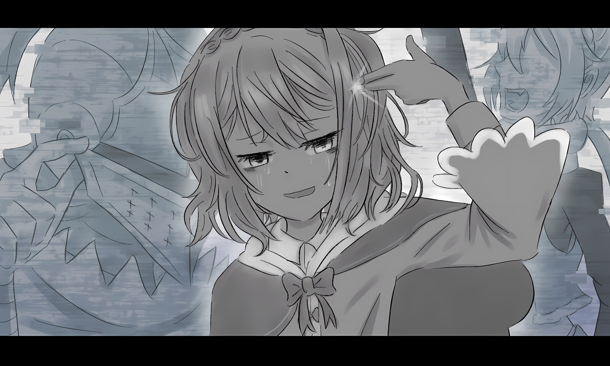
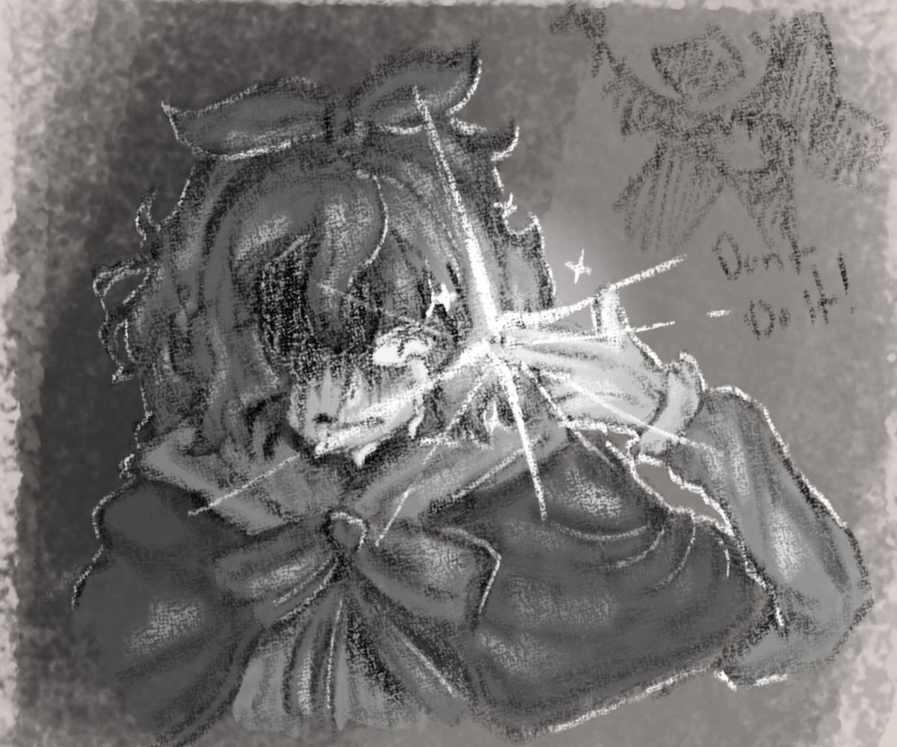
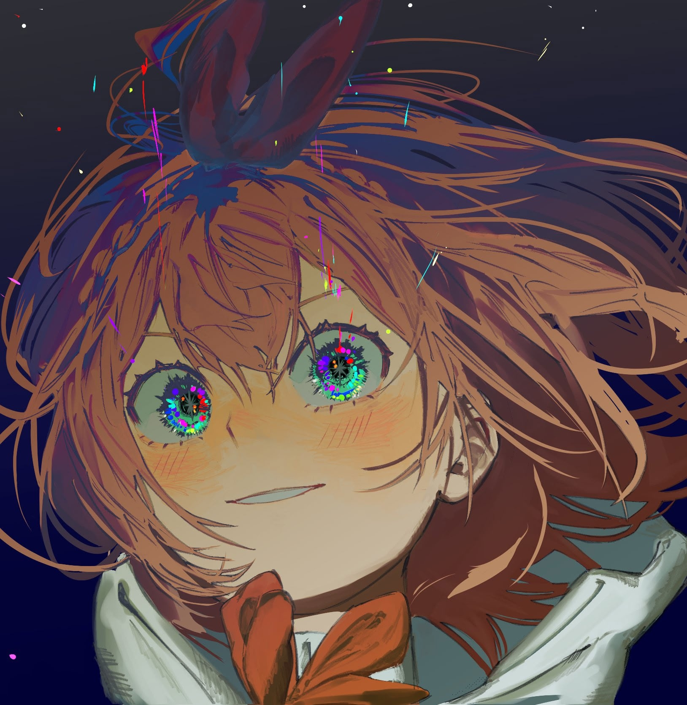

Петра Лейте, деревенская девчушка, была родом из деревни Алам, что располагалась в Королевстве Лугуника. Хоть она и родилась с незаурядной внешностью и врождённой сноровкой, ничем другим примечательным она не обладала. По идее, ей не было суждено стать частью событий, что войдут в историю. Скорее всего, она бы прожила всю свою жизнь обычной селянкой, так и не осуществив мечту повидать столицу. Потому её нынешнее положение — положение участницы величайших исторических потрясений — есть не что иное, как результат вмешательства, исказившего её «изначальный» путь. И сама Петра осознавала это искривление своей судьбы.

Изначально Петра была несносной девчонкой, которая, кичась своей миловидностью, заблуждалась, будто может вертеть как взрослыми, так и детьми. Скорее всего, эту «изначальную» Петру никто бы так и не поставил на место, и она бы прожила жизнь, воображая себя правительницей своего маленького мирка.

Не то чтобы эта жизнь была плоха. Она наверняка была бы по-своему весёлой и счастливой. Вот только нынешняя Петра, сошедшая с «изначального» пути, со своими новыми ценностями уже не смогла бы счесть такое счастьем.

— Ведь там не было бы никого из тех, кого я сейчас люблю.

Не было бы Субару, Фредерики, Эмилии, Беатрис, Мейли, Рам, Рем, Рюдзу, Аннерозе, Гарфиэля, Отто, Клинда и… ну, Розвааль может и подождать. Однако… там не было бы их всех.

— От одной мысли мурашки по коже.

Если та, что не встретила всех этих дорогих людей — это «изначальная» Петра, а та, что здесь — результат какого-то столкновения судеб, то она по-настоящему рада, что сошла с того пути. Сойдя с «изначального» пути, она познала и страдания, и боль, и печаль, и горе. Ей пришлось пережить и смертельно опасные мгновения, и такие, когда смерть казалась избавлением. Но то, что она обрела, то, за что смогла ухватиться, было куда важнее всех этих бед… Поэтому Петра Лейте может сказать от всего сердца:

— Даже если бы я могла начинать жизнь заново сколько угодно раз, я бы всё равно не пошла по «изначальному» пути.

И она бы вновь и вновь встречала тебя, чтобы сказать… что тот человек, который знает те же страдания, что и ты, с той же болью и тоской смотрит на звёзды.

Петра Лейте…

△ ▼ △ ▼ △ ▼ △

О любящий Бог, о мудрый Будда, о всеблаженная Лагуна… Даю обет, что провожающей в последний путь не стану.

△ ▼ △ ▼ △ ▼ △

— Кх!.. — с силой выдохнула Петра, оттолкнулась от твёрдой скалы и отчаянно рванулась вперёд.

Выровнять осанку, податься вперёд… Старт получился идеальным, она бы и сама в себя влюбилась. Петра бежала, бежала, бежала, бежала так быстро, как никогда в жизни. Неслась вперёд, слыша громкий стук крови в ушах. Сердце, казалось, вот-вот взорвётся, колотясь о рёбра изнутри. Её собственное прерывистое дыхание осталось где-то позади. И даже несмотря на это…

— Поиграем… — прозвучал холодный приговор, после чего его владелец коснулся её спины.

Тотчас всё перед её глазами изменилось. Она и сама не заметила, как её ноги, несшиеся быстрее, чем когда-либо в жизни, замерли. Петра ошеломлённо стояла посреди скал. Перед ней раскинулся знакомый пейзаж, от которого она только что пыталась убежать. А в самом его центре мужчина в железном шлеме пробормотал:

— Раскрытие Владений, Переопределение Матрицы.

Это был сигнал. Знак того, что мужчина, чьё лицо скрывал иссиня-чёрный шлем, начал приводить в исполнение свой замысел при помощи Полномочия.

И вслед за его фразой, прямо на глазах девочки все её товарищи, что не ведали о злом замысле, издали яростный рёв, сотрясший сам воздух.

— Вперёд, ребята! — прозвучал боевой клич отважной девушки, отчего боевой дух отряда поднялся до предела и взорвался неудержимой яростью.

— О-О-О! — Оседлав эту волну, они все разом бросились на человека в шлеме, но… это было бесполезно.

Исход и так предрешён. Как бы они ни тянули руки, им никогда до него не дотянуться.

— …

Тридцать семь человек, точно оборванные нити, один за другим рухнули на землю. Могло показаться, что они упали одновременно, но на самом деле была едва уловимая последовательность. Она знала это, потому что внимательно наблюдала за падением каждого. Впрочем, между первым упавшим и последним, тридцать седьмым, прошло не более двух секунд.

Вклиниться в этот ничтожный промежуток было невозможно, и их вызов закончился ничем.

— Это не «ничем». Понять, что этот способ не работает, уже что-то да даёт , — прозвучал бесстрастный голос прозвучал в её ушах… нет, не в ушах. Этот голос не был вибрацией воздуха, что достигает барабанных перепонок.

Если это не барабанные перепонки, то что же тогда вибрировало?

— Что за вопрос? Конечно же, сердце.

Сердце… «Да, точно. Именно так. Я слышу, потому что мой разум трепещет». Значит, в нём ещё осталась способность трепетать. И доказательством тому служит он. И имя этого человека…

— Субару…

— Да, я здесь, Петра.

Ей стало легче от этого.

«Да. Я — Петра Лейте. Я всё ещё не забыла себя».

Раз так, то значит… значит так и должно быть.

— Поиграем…

Петра Лейте всё ещё должна продолжать это паломничество по аду.

△ ▼ △ ▼ △ ▼ △

О любящий Бог, о мудрый Будда, о всеблаженная Лагуна… Даю обет, что помощи ни от кого я больше не приму.

△ ▼ △ ▼ △ ▼ △

— Раскрытие Владений, Переопределение Матрицы.

Одно мгновение начиналось с одного объявления, а заканчивалось — другим.

— Поиграем…

Сколько же времени прошло с тех пор, как Петра оказалась заперта в этой петле, длящейся меньше минуты?

— Ой… то есть, и секунды не прошло, — поправила она саму себя тихим шёпотом. С её губ сорвался тихий вздох: — Ха.

Даже ей самой её шёпот показался ужасно циничным, полным самобичевания и вселенской тоски. Она даже удивилась, что может издавать такой почерневший от эмоций звук. Но это точно была не ошибка и не чей-то чужой голос. Потому что здесь…

— …кроме меня, них и того мужчины, я слышу только голос Субару, — пробормотала она, прежде плюхнувшись на землю, обхватив колени и уткнувшись в них лбом.

Прямо перед ней разворачивалась очередная сцена: тридцать семь человек бросаются на одинокую фигуру в шлеме и беззвучно терпят поражение.

Это просто безумие. «Почему они не понимают?»

— Они что, совсем тупые? Они же знают, что проиграют, но почему они ничего не придумывают, а просто бегут вперёд?..

Вот, опять. Опять их всех сразили. Они падают один за другим. Знакомая картина. Она видела её чаще, чем поражения злодеев от рук героев в утренних телешоу. Снова, и снова, и снова, и снова, и снова, снова, и снова, и снова, и снова, и снова, и снова, и снова, и снова, и снова, и снова, и снова, и снова, и снова, и снова, и снова, и снова, и снова, и снова, и снова, и снова, и снова, и снова, и снова, и снова, и снова…

— Как глупо.

Среди них ведь должны быть и умные люди. Так почему, почему нет никакой изобретательности? Их побеждают раз за разом, так почему они не пробуют другой способ?

Но на деле-то она знала: они банально не осознают, что их побеждали много раз. Они не знают, что это повторялось, и не понимают, что это будет повторяться снова и снова. Раз они не ведают будущего, то нет ничего удивительного в том, что они попадают в ловушку очевидного исхода. Это несправедливо. Неразумно. Иррационально. «Знаю. Знаю, но…»

— Вы же взрослые, так сделайте хоть что-нибудь!..

Она снова и снова билась лбом о согнутые колени.

Больно. Не больно. Больно. Не больно. Больно. Не больно. Больно. Не больно. Больно. Больно.

АААААААААААААААААААААААААААААААААААААААААААААААААААААААААААААААААААААААА — Поиграем… АААААААААААААААААААААА АААААААААААААААААААААААААААААААААААААААААААААААААААА

× × ×

АААААААААААААААААААААААААААААААААААААААААААААААААААААААААААА — Раскрытие Владений, Переопределение Матрицы. АААААААААААА АААААААААААААААААААААААААААААААААААААААААААААААААААА

Ей удалось закричать и в конце, и в начале петли. И что с того? Её внезапный вопль изменил поведение товарищей, собиравшихся броситься на человека в шлеме. Они обернулись к ней и, увидев, как она кричит, рвя на себе волосы, переменились в лице.

— Эй, что стряслось?!

— Петра! Что случилось?! Что он с тобой сделал?!

— Назад, Петра! Ты наш ключ к победе! — крикнула Рам.

До неё доносились голоса. Все волновались о ней, когда она так странно себя вела. Они пытались её поддержать свежими, искренними словами.

«Я рада. Спасибо. Я всех вас очень люблю. Правда. Очень. Но не хочу».

— Я… всё это уже знаю.

«Я знаю, какие слова они скажут, если я начну так себя вести. Я знаю, что они все вместе будут ломать голову, если я попытаюсь объяснить им про петлю. Я знаю, что они согласятся, если я предложу использовать Сжатие, чтобы все разбежались в разные стороны».

Знает. Она всё знает. Она видела, слышала, говорила, учила, передавала, советовалась, думала, страдала, бросала вызов, пробовала, сдавалась, поднималась и снова сдавалась.

— СКАЖИТЕ ЧТО-НИБУДЬ ДРУГОЕ!!! — закричала она жалким голосом, царапая землю до крови под ногтями, с безобразным, искажённым от слёз лицом. — ПОКАЖИТЕ МНЕ ЧТО-НИБУДЬ ДРУГОЕ!!! БУДЬТЕ ДРУГИМИ!!! НЕ ТАКИМИ, КАК В ПРОШЛЫЙ РАЗ, И КАК В СЛЕДУЮЩИЙ, И КАК СЕЙЧАС!!!..

Все замерли в оцепенении, а затем мгновенно определили причину и, обратив свой гнев на человека в шлеме, оскалились.

Одна из тех, кто бросился на врага, отделилась от группы и протянула ей руку.

— Петра, вставай, — сказала она. — Рам поможет тебе.

Как нежно. Даже сейчас, несмотря на суровый голос и лицо, её прикосновение было нежным. «Я люблю её».

— Но знаешь…

— Поиграем…

× × ×

— Раскрытие Владений, Переопределение Матрицы.

Да, вот и всё. Её искажённое лицо, содранные ногти, сорванный голос — всё вернулось в норму. Их беспокойство, их праведный гнев, их тревога за младшую сестрёнку — всё сбросилось. Всё обнулилось, и с чистой душой можно было снова наслаждаться новым началом и новым концом.

— Вперёд, ребята!

— О-О-О!

«Вам-то хорошо. Вы можете каждый раз с новыми силами так воодушевлённо кричать. А я не могу. Я не могу, как вы. Я пыталась драться вместе с вами. Больше ста раз пыталась. Но ничего не меняется, вы все падаете первыми и закатываете глаза. Это просто нечестно».

— Может, и мне сжульничать? — пробормотала она, надув губы.

Пока она размышляла, все её товарищи уже рухнули, а перед ней, неряшливо топая, приближался тот мужчина, всё копаясь в застёжках своего шлема.

— …

Он медленно протянул к ней руку, которой только что возился с застёжками.

«Интересно, он вообще ухаживает за своим шлемом? Смазывает маслом, протирает… За такими вещами ведь надо следить. Мне кажется, он давно не мылся из-за постоянных боёв. От мысли, что он тянется ко мне такой рукой, становится немного не по себе. Но… нужно терпеть. Терпеть, терпеть и ждать, пока его рука дотянется. Наверное, ему будет неловко, если я буду так пристально смотреть. Ладно, я закрою глаза, а ты за это время меня поймаешь. Итак… раз… два… три…»

× × ×

— Раскрытие Владений, Переопределение Матрицы.

«Так я и знала. Даже если меня поймают, ничего не изменится. Аха-ха-ха, да чтоб ты сдох».

△ ▼ △ ▼ △ ▼ △

О любящий Бог, о мудрый Будда, о всеблаженная Лагуна… Даю обет, что страшные истории не расскажу я больше.

△ ▼ △ ▼ △ ▼ △

— Раскрытие Владений, Переопределение Матрицы.

Когда Петра впервые поняла, что попала в петлю, начинавшуюся с этого сигнала, она не впала в панику и сохранила спокойствие, несмотря на чрезвычайность ситуации. Конечно, она была встревожена, но куда меньше, чем можно было ожидать. А всё потому что…

— Петра! Ты в короткой временной петле! Это следующая техника Ала! — крикнул вместо неё тот, кто разделял с ней эту петлю и был единственным, кто понимал повторяющийся ход времени, — Воображаемый Субару.

Именно присутствие этого «Субару» и сообщение от старика Рома, которое она увидела за мгновение до попадания в петлю — выцарапанные на земле отметины, — помогли ей сдержать панику.

— Значит, со стариком Ромом случилось то же самое, что и со мной сейчас.

Одна горизонтальная черта, перечёркнутая четырьмя вертикальными — так называемая «система насечек» для ведения счёта. В кандзи для этого обычно используется иероглиф « 正 ».

Старик Ром этим знаком сообщил Петре о своём положении. Вряд ли он оказался в таком состоянии всего за пять циклов, так что он хотел передать не количество повторений, а сам факт их наличия. Эта информация могла показаться запоздалой для Петры, уже оказавшейся в той же ситуации, но это было не так. Сообщение старика Рома стало для неё ясным предостережением. Он хотел сказать:

— Если я буду повторять это снова и снова, то стану такой же, как он.

На теле павшего старика не было ран; его состояние не было следствием накопившихся в петлях повреждений. Вернее, в некотором смысле, оно было следствием накопления, но другого рода: старик Ром просто исчерпал свой дух в повторяющемся времени. Ирония заключалась в том, что это была та самая тактика, которую Альдебастеры применили против Ала, и теперь он словно ответил им тем же. Петра не думала, что Ал намеренно мстил, но, так или иначе, если бы она попала в эту ситуацию неподготовленной, её, возможно, постигла бы та же участь.

— Да, и не только старик Ром , — поддержал «Субару». — Судя по всему, Рам и остальные тоже.

— Похоже на то… Ал применил своё Полномочие и на всех, кто на него бросался… Но ведь, когда я попала в петлю, они все были в порядке?

— Были… Может, в этой повторяющейся ситуации как-то отражаются и события реального времени, за пределами петли? Типа, те, кого одолели, выбывают? Если так…

— …то осталась только я.

Вывод, к которому они с «Субару» пришли, был настолько безнадёжным, что у Петры застыли щёки. Если предположить, что к моменту, когда петля добралась до Петры, судьба её товарищей из Альдебастеров уже была решена…

— То даже когда эта петля закончится…

— Стой, стой, стой! Не впадай в пессимизм! Допустим… допустим, это так, хорошо? Даже если и так, у нас есть Полномочие Уныния. Мы можем использовать его, чтобы «сжать» время на восстановление или…

— «Сжать» время, пока они в отключке, и сразу их разбудить?..

— Точно! — щёлкнул «Субару» пальцами. — Мы никогда такого не делали, но если получится, это будет круто, да?

Петра затаила дыхание. Честно говоря, она понимала, что это будет очень сложно. С помощью Полномочия можно было «сжать» время для обсуждений или освоения новых навыков, но это требовало огромной энергии.

Проще говоря, «сжатие» одного дня жизни Петры потребляло энергию за один день. Три дня — за три. Семь — за семь. Если на восстановление истощённого духа потребуется месяц или даже годы, то необходимой энергии просто негде будет взять.

Полномочие Уныния тоже не было всемогущим. Но… даже так.

— Да… думаю, это будет очень здорово! Может, и получится.

— Вот видишь! Поэтому первое, что нужно запомнить: как только вырвемся из петли, первым делом поднимаем всех павших. Иначе нас тут же сомнут , — начал он уже строить план на будущие.

Петра в ответ согласно кивнула.

Так вот оно что… Наверное, и старик Ром думал о том же. Возможно, этот мудрый старик, даже когда его дух был сломлен, подсознательно заставлял себя царапать на земле знаки, снова и снова, чтобы запрограммировать своё поведение после выхода из петли. В таком случае, предложение «Субару» заранее определить действия после петли было верным. Вот только…

— Сколько же раз старик Ром повторял это, чтобы его тело запомнило?..

Даже когда его дух был сломлен, а разум помутился, старик Ром всё же сумел сразу после выхода из петли процарапать землю пальцами. Сколько же раз он повторял это, дабы оно въелось в его душу и тело выполняло его даже без участия сознания?

— …

— Петра, давай кое-что проверим. Однажды Беако заперла меня в бесконечном коридоре. Если правила те же, то должно быть условие для завершения петли.

Петра сглотнула и, улыбнувшись, кивнула в ответ. Она снова посмотрела вперёд.

— Вперёд, ублюдки!

— О-О-О!

Пока Петра и «Субару» разговаривали, её товарищи из Альдебастеров снова и снова бросались на Ала и падали перед ним один за другим.

Честно говоря, прочитав Книгу Мёртвых, она восхищалась тем, как Субару бережно относился к каждой петле, как он впитывал в себя каждое событие. Это было круто. Но повторить то же самое в этой петле, длящейся меньше минуты, казалось невозможным.

— Даже я понимаю, что каждый раз искренне страдать из-за их поражений в такой ситуации — это слишком. Но давай всё хорошенько запомним.

— Количество повторений?

— И это тоже. И то, что ты каждый раз злилась, сокрушалась и печалилась. Все твои чувства.

— Да… ты прав.

В этом мире повторений, в этой бесконечной петле, единственная, кто может сохранить эти чувства — это она, поэтому, как и сказал «Субару», она должна всё запомнить.

«Когда петля закончится, я не прощу Ала, даже если он и не будет знать, через что мы прошли; я обязательно покажу ему всю нашу боль», — поклялась Петра. Она кивнула «Субару», и они вместе посмотрели вперёд.

— Звёзды… Они просто не сошлись.

И, встретившись взглядом с подошедшим вплотную Алом…

— Поиграем…

«Поиграем…» — « Поиграем… », — смело объявила она в унисон с «Субару» о начале своего паломничества по аду.

△ ▼ △ ▼ △ ▼ △

О любящий Бог, о мудрый Будда, о всеблаженная Лагуна… Даю обет, что больше волосы мои никто другой не заплетёт.

△ ▼ △ ▼ △ ▼ △

И так Петра продолжала блуждать по аду, в который шагнула с твёрдой волей.

«Что же мне делать?..»

Свернувшись калачиком, она снова и снова билась лбом о колени, задавая себе один и тот же вопрос.

«Что делать? Как быть? Как мне закончить эту петлю? Какое здесь условие?»

Чтобы закончить петлю, должно быть условие — так он ей сказал. И она была с ним согласна. В подобных ситуациях, где всё повторяется по кругу, всегда есть какой-то триггер для завершения. Это закон жанра. Правило. Непреложное правило, которое нужно соблюдать. Не может не быть. Раз есть правило, значит, есть и способ всё закончить. Вот и всё. Дискуссия окончена. Итак, обдумаем условия. Что может быть триггером?

«Я уже всё перепробовала».

Используя Сжатие, она испробовала гораздо больше вариантов, чем смог бы обычный человек: они с товарищами пытались победить мужчину в шлеме; пытались сбежать все вместе с помощью Сжатия, если его нельзя было убивать. Конечно, она и сама пробовала убежать как можно дальше. И даже намеренно давала себя поймать, когда он в конце протягивал руку, и даже сама прыгала ему в объятия — всё бесполезно. Она рассматривала возможность, что у каждого из товарищей есть ключ к разгадке, поэтому они все вместе совещались, подробно разбирали ситуацию каждого, делились секретами, слушали истории о семьях, рождении и родных краях — говорили о том, о чём не говорят даже друзья, знакомые десять лет. Не помогло.

Она думала, что правильный ответ — это подойти к человеку в шлеме. Она говорила с ним, отвергала его, сражалась с ним один на один, и со Сжатием, и без, и побеждала, и проигрывала. Она убегала, насмехалась, хвалила, пела. Бессмысленно.

— Так что же мне тогда делать?!

«Я всё сделала! Я сделала всё, что только могла придумать! Но это было бесполезно! Ничего не помогло! Ничего не сработало!»

— Вперёд, ребята!

— О-О-О!

— ЗАТКНИТЕСЬ!

«Как же бесит, что вы так бодро кричите, хотя всё равно ничего не можете сделать. Если не собираетесь помогать, то хотя бы не мешайте думать! Ах, я срываюсь на них. Ненавижу себя за это. Не хочу так думать. Что это, я строю из себя хорошую девочку? Может, это и есть настоящая я? Может, я и не люблю их всех на самом деле? Может, мне просто нравится та я, которая кажется великодушной, милосердной, доброй и ко всем относится одинаково? Да, ведь так?»

— ЗАТКНИТЕСЬ, ЗАТКНИТЕСЬ, ЗАТКНИТЕСЬ, ЗАТКНИТЕСЬ, ЗАТКНИТЕСЬ!..

Справа, слева, вверху, внизу, впереди, сзади, в прошлом, будущем, настоящем, сегодня, завтра, вчера, послезавтра, позавчера, в прошлом году, в этом, в следующем, в прошлой жизни, в этой, в следующей — всё, абсолютно всё, всё, всё, всё бесит!

«Который сейчас раз, примерно? Заткнитесь. Сдохните. Или, может, мне вас убить?»

— Продолжаем.

«Так я и знала».

× × ×

— Раскрытие Владений, Переопределение Матрицы.

Она снова в том же месте.

Удивились, да? Иногда он говорит не только «Поиграем…».

Пока длится петля, все остальные — не просто куклы. Они реагируют на её слова, отвечают на её действия. И не только они, но и мужчина в шлеме. И, разумеется, он понимает, через что она проходит.

«И что с того?»

Даже если он понимает, когда мир заканчивается и начинается следующий, даже сам зачинщик не остаётся с ней. Петра всегда одна, и она всегда снова и снова переживает один и тот же мир. Никто, никто не понимает её страданий и борьбы. Одна. Совсем одна. «Неужели одна?»

— Кх!.. «Субару»! «Субару»! Где ты?! Где?!

— Петра! — Стоило ей вспомнить о нём, как он, словно молния, тут же появился перед ней.

Петра, вновь его увидев, убедилась, что это правда он, и выдохнула. Казалось, всё вот-вот потускнеет и исчезнет, она всё забудет, но она была не совсем одна, её не бросили.

— Субару-у…

Она со слезами на глазах бросилась к нему. Прыгнула. Он инстинктивно выставил руки, чтобы поймать её… Но не смог… Она прошла сквозь него и неуклюже рухнула на голый камень. Больно. Ударилась лицом. Субару… нет, «Субару» её не поймал. Конечно. Как и всегда. Его руки вечно заняты кем-то другим.

— Тогда не пытайся меня обнять!

— Петра…

— Надо было… Надо было просто оставить меня там, в деревне, и дать умереть! Надо было дать сожрать меня зверодемонам!..

Она знала: если бы Нацуки Субару ничего не сделал, её бы уже давно не было в живых. Она должна была умереть, но она живёт. Она выжила. И раз уж она выжила, ей приходится так страдать, терпеть боль, и конца этому нет.

— Прости, Петра… Прости! Но подожди! Не говори так…

— Ч-что?! Что ты сказал?! Я так страдаю, а ты меня ругаешь?! После всего, через что я прошла, снова и снова, мне так больно, я плачу… а т-ты… ты меня… р-руг… ругаешь? Ругаешь? Ха, ах, ха-ха, прекрати!

— …

Она накричала на него. Получилось… Она сделала это.

«Субару» смотрел на неё с лицом, полным боли и скорби, и ей захотелось выблевать кровь, вырвать собственное сердце, снести себе голову. «Точно, так и сделаю».

— Самое… очевидное условие для конца петли… — сказала она, сложила пальцы в пистолет и приставила указательный палец к своему виску. Сосредоточив ману на его кончике, она заставила его засветиться слабым белым светом.

«Субару» с ужасом на лице протянул к ней руки. «Всё равно ведь не дотронешься. Вот, видишь, промахнулся».

— Подожди, Петра! Не делай глупостей! Я понимаю, но подожди с этим! А что, если это и есть цель врага…

— Тогда женись на мне!

— !..

— Сделай меня своей женой! Стань моим! Поставь меня на первое место! Ты ведь спас меня, так женись! Возьми на себя всю мою жизнь! Сделай мою жизнь своей! Тогда ладно! Но это ведь не так, да? Значит, это не моя жизнь. Если бы она была моей, дай мне распоряжаться ею самой!

Она и сама не понимала, что говорит. Просто… всё бесит. Ничто не идёт так, как она хочет. Все, кто не может ничего сделать с этой ситуацией, и тот в шлеме, кто её создал, — все бесят. Ненавидит. Ненавидит, ненавидит. «Но Субару люблю. Ха. Что за бред. Он ведь ничего не делает для меня. Но он всегда что-то делал, и даже сейчас пытается что-то сделать. Хоть и не женится на мне».

— Как же тупо.

— Пет…

«А, это я не тебе. Это я о себе, какая же я дура… Эх, такая голова мне больше не нужна. Пока-пока».

Тотчас из её пальца вырвался белый луч света…

× × ×

— Раскрытие Владений, Переопределение Матрицы.

— Так и знала…

А-ХА-ХА-ХА-ХА-ХА-ХА-ХА-ХА-ХА-ХА-ХА-ХА-ХА-ХА-ХА-ХА-ХА.

△ ▼ △ ▼ △ ▼ △

О любящий Бог, о мудрый Будда, о всеблаженная Лагуна… Даю обет, что счастья никому я более не пожелаю.

△ ▼ △ ▼ △ ▼ △

Ведьма Уныния — Петра Лейте — вступила в бой с непоколебимой волей.

Ведьминский Фактор, врученный ей Клиндом, и дарованное им Полномочие Уныния обладали невероятным потенциалом. Сила позволяла так мастерски выстраивать игру в свою пользу, что, казалось, не имела аналогов во всём мире. И, разумеется, дабы владеть такой силой, нужна была соответствующая плата. Как говорится, с великой силой приходит великая ответственность. Хотя, может, это немного не то. В любом случае, раз уж она добровольно приняла на себя столь тяжкое бремя, то и польза от него должна быть максимальной. Иначе решимость Петры, которая лгала даже своим близким, оказалась бы напрасной.

«Хорошо, что сестрицы Фредерики здесь нет».

Будь Фредерика в рядах Альдебастеров, Петра не была бы уверена, что смогла бы солгать. Дело было не столько в проницательности горничной, сколько в слабости самой девочки перед ней — она, безмерно уважавшая и любившая её, не могла ничего от неё скрывать. Она бы наверняка выложила всё как на духу, рыдая и цепляясь за неё. Что касается сокрытия правды, то же самое можно было сказать и о Рам и Отто в их обычном состоянии. Однако первая, опьянённая радостью от возвращения Рем, и второй, потерявший Воспоминания, не могли проявить свою обычную проницательность и не заметили лжи Петры.

«Интересно, догадывался ли обо всём братец Клинд, и почему он молчал?»

Возраст и истинные намерения этого человека были загадкой. Можно было с уверенностью сказать лишь то, что он на их стороне. Неудивительно, если бы он видел Петру насквозь. Но, с другой стороны, будучи близким другом Розвааля, он мог совершенно не разбираться в тонкостях человеческой души. Как бы то ни было, Клинд с самого начала знал, какую огромную жертву принесла Петра. И он сознавал, что это могло привести к двум противоположным исходам: с одной стороны, она могла решить, что заплатила достаточно и остановится, с другой — что, потеряв так много, она уже не остановится ни перед чем.

Поэтому для неё проще было считать, что он молчаливо поддержал её волю. Вне зависимости от истинных намерений Клинда, жребий был уже брошен.

«Сколько их там уже?..»

Не пить алкоголь. Не писать писем. Не обнимать плюшевые игрушки. Не пользоваться иголкой с ниткой. Не петь песни. Не играть с детьми. Не посещать памятные места. Не срывать красивые цветы. Не есть любимую еду. Не возвращаться в родную деревню. Не плакать на людях. Не вытирать чужие слёзы. Не рассказывать о прошлом. Не говорить о любимых историях. Не называть людей по прозвищам. Не приглашать никого домой. Не провожать никого в последний путь. Не пожимать ничьих рук. Не желать примирения. Не показывать никому свою слабость. Не встречать ни с кем рассвет. Отказаться от всех симпатий и антипатий. Не плакать ни по кому. Не смотреть на звёзды. Не назначать встреч. Не гулять ни с кем на закате. Не наступать на тень идущего рядом. Не жалеть о расставании. Не говорить о мечтах. Не участвовать в праздниках. Не дарить подарки. Не махать рукой на прощание. Не молиться перед сном. Не сочувствовать чужой боли. Не радоваться ясному небу. Не сокрушаться о дождливой погоде. Не любоваться радугой. Не наслаждаться тишиной. Не нарушать важные обещания. Не ждать доброты. Не провожать в последний путь. Не принимать милостыню. Не рассказывать о своих неудачах. Не позволять никому заплетать мне волосы. Не желать себе удачи… так много.

Если начать перечислять принесённые жертвы, конца и края не будет. Будущее Петры выглядело беспросветным.

«И это ещё довольно мягкий вариант».

Говорят, лучший способ солгать — это добавить в ложь щепотку правды. Так уж вышло, что ложь Петры оказалась похожей на эту истину.

«Плата за Полномочие Уныния будет разделена между многими людьми, а не ляжет только на плечи Петры» — на этом условии все согласились доверить Петре Ведьминский Фактор. Однако такой способ оплаты работал только для Сжатия, которое затрагивало цель самого Полномочия.

Если, к примеру, использовалось Сжатие по просьбе Эмилии для её перемещения, то плату вносила сама Эмилия, но если Петра использовала Сжатие, чтобы спасти Эмилию по собственной инициативе, то платить приходилось Петре. Этого никто, кроме неё, не мог знать.

Каждое совещание Альдебастеров, момент, когда она забросила Ала вместе с Эмилией и Рем в ущелье Агзад, спасение товарищей в последнюю секунду, «сжатие» мучительной боли, которую испытывали все, до одного мига — за всё это платила Петра.

Наверное, чем дороже жертва, тем больше становится ёмкость Полномочия Уныния. Можно предположить, что это связано с ослаблением влияния самой Петры на мир, которое и позволяло ей влиять на него. Вероятно, если бы Петра пожертвовала всей своей жизнью, Ведьминский Фактор Уныния даровал бы ей ещё более могущественную силу.

«Но я этого не сделаю».

Даже если Полномочие будет поглощать Петру Лейте, заставляя её распродавать свою жизнь по кусочкам, лишая надежд на будущее и отказываясь от многих радостей, она не станет в отчаянии бросаться на смерть и принимать крайние меры.

«Это ведь так некрасиво».

Она не хотела показывать свою некрасивую сторону. Не хотела делать некрасивых вещей. Точно так же, как и в битве с Архиепископом Греха Чревоугодия, Лоем Альфардом. Пока это чувство поддерживает её, Петра не потеряет себя.

Ведь Петра, Петра Лейте, на звёзды…

△ ▼ △ ▼ △ ▼ △

О любящий Бог, о мудрый Будда, о всеблаженная Лагуна… Даю обет, что спину никому я более не поддержу.

△ ▼ △ ▼ △ ▼ △

— Раскрытие Владений, Переопределение Матрицы.

«За что мне всё это? Что я сделала плохого? Я же была хорошей девочкой. Я же старалась быть хорошей девочкой. Почему, почему так получилось? Кто-нибудь, объясните мне толком».

— Вперёд, ребята!

— О-О-О!

«Что мне делать? Я всё перепробовала. Много раз пробовала. Всё, что приходило в голову, всё сделала. Победила в бою? Да. Проиграла в бою? Да. Позволила убить его? Да. Умерла в бою? Да. Умерла без боя? Да. Убежала? Да. Плакала? Да».

— Звёзды… Они просто не сошлись.

«Я много раз умирала. Много раз побеждала. Много раз убегала. Я много извинялась. Много злилась. Много плакала. Было очень страшно. Было очень больно. Было очень тяжело».

— Поиграем…

«Я знала: это не кончится. Это не кончится для меня. Даже если я сейчас буду кричать и плакать, даже если вы будете волноваться, через десять секунд вы всё забудете. Нет, не забудете. Вы не будете знать. Вы оставите меня. Только меня одну».

— Раскрытие Владений, Переопределение Матрицы.

«Хватит. Всех ненавижу. Ненавижу, ненавижу, ненавижу. Почему вы мне не помогаете? Я же так отчаянно кричу, почему? Не кончится. Не закончится. Не закончится для меня. Вы не дадите этому закончиться. И я тоже».

— Вперёд, ребята!

— О-О-О!

«Сколько ни плачь, ни кричи, ни буйствуй, ни проклинай — всё повторяется. Удивительно. Я заблуждалась. Я возомнила, что смогу что-то сделать. Мои надёжные товарищи? А они хоть что-то сделали? Ну ладно. Мои надёжные товарищи, как там их… та женщина, например, она же такая сильная, почему же она не смогла это преодолеть?»

— Звёзды… Они просто не сошлись.

«Но теперь я поняла. Ведь ничего не поделаешь. Голова всё хуже и хуже соображает. То, что происходит передо мной, перестаёт меня интересовать. Нет, не так. Не перестаёт интересовать, а я сама пытаюсь от этого отгородиться. И я понимаю, почему».

— Поиграем…

«Ведь я не хочу ненавидеть всех. Но когда я думаю о них, я начинаю их ненавидеть за то, что они ничего не делают. Поэтому я не думаю. Чтобы не ненавидеть, я больше не думаю. Я не думаю о них. Мне всё равно, что с ними. А, нет. Простите, простите, я шучу, я вас очень люблю. Вот, лю-юблю».

— Раскрытие Владений, Переопределение Матрицы.

«Ну а что поделать? Я же ещё ребёнок. Как ни старайся, за один прыжок взрослой не станешь. Если я буду здесь проводить одно и то же время снова и снова, я когда-нибудь стану взрослой? Нет, к сожалению, не стану. Потому что это повторение одного и того же времени. Как ни старайся, всё будет одинаково. А если стараться бесполезно, то зачем стараться?»

— Вперёд, ребята!

— О-О-О!

«Точно, стараться бессмысленно. Всё равно всё будет так же. Эх, зря я старалась. Может, перестать думать о сложных вещах? Эх, зря старалась. Ничего не имеет смысла. Я всё время делала бесполезные вещи. Да. Точно. Я знала».

— Звёзды… Они просто не сошлись.

«Да и вообще, зачем стараться? Даже если я буду стараться, я не стану королевой. Меня не будут ценить. Я не выйду замуж за того человека. Поэтому ничего не поделаешь. Ничего не поделаешь».

— Поиграем…

«Раз ничего не поделаешь, давай уже закончим».

— Это не «ничего не поделаешь».

«Почему?»

— Сдаться нелегко… Но одновременно и легко.

«Почему? Зачем?»

— Сломаться духом или умереть — это всего лишь царапина.

«Почему? Зачем? Как ты можешь так говорить?»

— Потому что…

«Почему? Зачем? Как ты можешь так говорить? Что дальше?»

— Потому что…

«Почему? Зачем? Как ты можешь так говорить? Что дальше? Что… дальше?»

— …мы ещё можем сражаться. Проще простого.

— …

— …

«И правда, врать ты совсем не умеешь. Я знала».

△ ▼ △ ▼ △ ▼ △

О любящий Бог, о мудрый Будда, о всеблаженная Лагуна… Даю обет, что я не сдамся никогда.

О любящий Бог, о мудрый Будда, о всеблаженная Лагуна… Даю обет, что я колена никогда не преклоню.

О любящий Бог, о мудрый Будда, о всеблаженная Лагуна… Даю обет, что сожалеть о выборе своём я никогда не буду.

О любящий Бог, о мудрый Будда, о всеблаженная Лагуна… Даю обет, что плакать от досады не буду никогда я.

О любящий Бог, о мудрый Будда, о всеблаженная Лагуна… Даю обет, что не забуду тех, кого я полюбила.

△ ▼ △ ▼ △ ▼ △

Петра Лейте, деревенская девчушка, была родом из деревни Алам, что располагалась в Королевстве Лугуника. «Изначальная» Петра не была девушкой, которой суждено было участвовать в битвах, решающих судьбы мира. Обычная деревенская девчушка, она либо прожила бы чуть более комфортную жизнь благодаря своей красоте и хитрости, либо была бы сметена великими потрясениями, и её жизнь трагически оборвалась бы — такова была её участь. Но Петра, сошедшая с «изначального» пути и познавшая себя нынешнюю, сейчас думает: «Даже если бы я могла начинать жизнь заново сколько угодно раз, я бы всё равно не пошла по „изначальному“ пути».

Да, именно так. Сойдя с «изначального» пути, Петра всегда будет оказываться здесь. И она хочет сказать тебе, кто увёл её с «изначального» пути и спас, кто с таким страданием на лице и такой неумелой ложью отчаянно пытается удержать её, она скажет:

— Благодаря звёздам я… могу быть здесь, — сказала Петра, вытерев губы тыльной стороной ладони.

— …

— …

Ал, и «Субару» в ответ замерли в оцепенении. Ну, с Алом-то всё понятно, но причина молчания «Субару» ясна: он, наверное, думал, что своей неуклюжей ложью и подбадриваниями вверг Петру в такую депрессию, что она и слова сказать не может.

Да, это была неумелая ложь. Только что она говорила, что лучшая ложь — та, в которой есть доля правды. Но в этой лжи не было ни капли правды. Это была самая неумелая ложь на свете.

— Но я не хочу, чтобы тот, кого я люблю, был лжецом.

Поэтому она взяла себя в руки. Сама. Раз утешения и подбадривания не помогают, а он всё так же с беспокойством смотрит на неё, пытается погладить по голове, хоть и не может дотронуться, пытается поддержать за спину, то она не могла не подумать: «Ну что с тобой поделаешь?». Наверное, это была слабость влюблённой.

— Тот, кого я люблю, не лжец.

Потому что вот, она смогла встать. Раз Петра встала, значит, Субару — не лжец.

Мир повторений был жесток. Собрать воедино почти разбившееся сердце было нелегко. Пожалуй, это было самое трудное испытание за всю её жизнь. Но она встала. Она встала. Потому что рядом был тот, кто верил в неё — в ту Петру, что в каждый момент была такой хрупкой, слабой и беспомощной.

— Мои звёзды ни в чём не виноваты, — прервала она его коронную фразу.

Это так трудно. Нужно так стараться. «Я ведь способная девочка. Я всегда всё быстро схватываю. Но оправдать его ожидания — это так трудно». Но если он безо всяких на то причин верит, что Петра не сдастся даже в таком аду, где сотни, тысячи, десятки тысяч раз повторяется одно и то же, и где у любого бы разбилось сердце… то у неё нет другого выбора, кроме как оправдать его веру.

Если Нацуки Субару верит, что Петра Лейте — девочка настолько сильная, что её дух не сломить даже десятками тысяч повторений, то она станет такой.

— Девушки из другого мира должны уметь творить чудеса сами, иначе не выжить.

Если бы она не сделала чего-то такого, что сбило её с «изначальной» колеи судьбы, она бы даже не встретила того, кого полюбила всем сердцем.

— Господин Ал, — обратилась она к нему, — можете повторять это сколько угодно, но, думаю, это бесполезно.

Это была не бравада и не блеф, а искренние чувства Петры — даже если бы это время повторилось не десятки тысяч, а миллионы или миллиарды раз, её дух не сломить. Не потому что девичья любовь безгранична — нет, мы не в сказке.

— Эта петля ведь будет повторяться, пока противник не сломается духом?

Она не заканчивалась ни после победы над Алом, ни после его убийства, ни после того, как его забрасывали далеко-далеко. Она не заканчивалась ни после поражения, ни после плена, ни после попытки сбежать. Она не заканчивалась ни после самоубийства, ни после убийства, ни после того, как она в отчаянии пыталась всё бросить. Просто-напросто, после более чем десяти тысяч повторений, она не заканчивалась.

— Но ведь вы сами решаете, когда её прекратить, да?

Единственный способ закончить эту бесконечную петлю — это чтобы сам Ал развеял Владения. Эта петля заканчивается тогда, когда дух оппонента оказывается сломлен. И Ал, находящийся внутри петли, должен каждый раз осознанно её завершать. В конечном счёте, если заставить его сдаться, то петлю можно закончить не за десять тысяч, а всего за один раз. Если, конечно, удастся убедить осторожного и трусливого Ала из «первого раза» принять такое решение.

— Поэтому я хочу, чтобы ты уже прекратил. Я осталась одна, так что очевидно, что ты победил. Продолжать нет смысла.

Повторюсь, это не блеф и не бравада со стороны Петры. Даже если эта петля будет продолжаться вечно, её дух не сломится, ибо она сделала свой выбор.

— Я… я больше не могу сдаться, не могу жалеть, не могу плакать от обиды и не могу забыть тех, кого люблю. Я стала… Ведьмой.

Ибо Петра Лейте выбрала стать Ведьмой Уныния.

— Скажите, господин Ал… сколько ещё раз мы будем это повторять? — спросила она, склонив голову набок.

У Ала пред ней тихонько дрогнуло горло. За железным шлемом, в его невидимых глазах, она увидела, как в глубине круглых зрачков Ведьмы Уныния отразилось что-то непостижимое, и в них зародилась тёмная эмоция. Возможно, это было связано с глубоко укоренившимся, неизлечимым шрамом в душе Ала. Может быть, он и раньше, заглянув глубоко в глаза «Ведьмы», был ранен? И эту травму…

— Сжатие Агонии.

…она «сжала» и вбила ему в сознание. Пусть его мозг вскипит, кровь потечёт вспять, а радость, горе, счастье и несчастье сорвут коросту с незажившей раны и вольют туда не соль, а саму травму. Пусть он испытает в это мгновение стимул от травмы, которая будет заставлять его плакать до конца жизни, раз, и десять, и сотни, и тысячи раз, но в тысячекратной концентрации.

— А!..

В тот миг, от ужаса, внушаемого Ведьмой Уныния, и от «сжатой» травмы, Ал обратился не к реакции тела, а к реакции души — к самому близкому и доступному спасению. А именно…

— Конец игры!

Способ закончить бесконечную петлю — это начать следующую. Стоило Ведьме Уныния это понять, как она переплела пальцы с невидимой рукой своего возлюбленного, стоявшего рядом, и улыбнулась.

— Как некрасиво, — обратилась она к нему. — А Субару бы на твоём месте сказал, что сломленное сердце — это всего лишь царапина, и держался бы молодцом.

— Ты слишком хороша, Петра , — произнёс её возлюбленный бессильно, но с гордостью.

Сердце Ведьмы Уныния наполнилось теплом, но она всё продолжала смотреть вперёд.

— Итак, — продолжила она, — вот он, последний, решающий момент.

Раз уж она принесла в жертву и ранимое сердце, и слабость, заставлявшую желать конца, и слёзы обиды, и всё остальное… то Ведьма Уныния не ослабит хватку, пока не одержит победу в том виде, в каком она её задумала.

△ ▼ △ ▼ △ ▼ △

Развеять Владения, создать их заново, перестроить Матрицу. Это было признанием поражения в, казалось бы, беспроигрышной схватке Владений. Но ничего уже не попишешь. Прецедент уже был. Владения не могли убить Ведьму, ставшую его жертвой… Конечно, «убить» — это условность, цель — только дух, но…

— …

Петра, гордо заявившая, что выдержит Владения, — нет, её уже нельзя было называть просто Петрой. Она без всяких скидок стала…

— …Ведьмой Уныния.

В прошлом Владения Альдебарана смогла одолеть Ведьма Жадности. Если вдуматься, его Полномочие, вне зависимости от того, кто был инициатором Владений, всегда терпело поражение в первом бою. Нехороший знак. Как бы то ни было, даже сейчас, когда Владения были парированы, преимущество было на стороне Альдебарана.

— Кх!..

Помимо Ведьмы Уныния, все остальные Альдебастеры, поставившие себе целью победить Альдебарана, были уничтожены. К сожалению, истощение духа с помощью Владений было абсолютным. Альдебаран не был настолько наивен, чтобы не проверить, притворяются они или мертвы, прежде чем решать навязать Владения. Он наверняка бы оторвал жертве руку или ногу, чтобы убедиться, прежде чем переключиться на следующую цель. Хотя он и не помнил, как именно он это проверял из-за отсутствия непрерывности сознания, но если это пришло в голову ему сейчас, то пришло бы и ему в петле. Поэтому он мог с уверенностью сказать: никто, кроме Ведьмы Уныния, не поднимется.

— Но она это тоже понимает.

Альдебаран не мог недооценивать Ведьму Уныния перед собой настолько, чтобы думать, будто она будет действовать, наивно полагая, что раз она смогла встать, то и другие смогут… А значит, у неё был план, как переломить ситуацию отсюда.

Даже став Ведьмой, она, будучи с козырем, всё ещё твердит, что всем обязана звёздам.

— …

Владения были развеяны. На мгновение Ал и Ведьма Уныния оказались на свободе. Расстояние между ними — около пяти метров, но перед её Полномочием это ничто. Да и с таким Полномочием, как Сжатие, расстояние не давало никакой гарантии безопасности.

Но это Полномочие. Она наверняка разыграет карту Полномочия Уныния. Самое вероятное применение Полномочия, конечно же, призыв кого-то другого с помощью Сжатия. А возможные варианты:

«Девчонка Рем, девчонка Мейли или, может, маркграф?»

Если подумать о силах, которых здесь нет, но которых может призвать Ведьма Уныния, первыми на ум приходят они. Рем, по идее, сейчас в разгаре боя с Яэ, но раз Рам не выказывала беспокойства, то по их связи вкус поражения не передавался. Сложно поверить, что та Яэ проиграла, но сейчас приходилось учитывать и такую возможность.

У Мейли была свора зверодемонов, а у Розвааля — чудовищная огневая мощь, с которой он творил что хотел даже в Империи. Они тоже вполне вероятные кандидаты.

Но все они — просто сильные, просто крепкие. А как уже было доказано, ни числом, ни силой Альдебарана не одолеть. Если она рассчитывает на это, то это просто…

— Нет…

Нет, это не они, — интуитивно почувствовал Альдебаран по глазам Ведьмы Уныния. К тому же, она может «сжать» процесс мышления и сразу же прийти к выводу. Идеи, которые приходят в голову Альдебарану и тут же им отбрасываются, Ведьма Уныния наверняка отбросит ещё на стадии обдумывания. Значит, не то… Нужно изменить сам ход мыслей, чтобы догнать её. Тот, кого Ведьма Уныния призовёт сюда, должен быть кем-то, кто сможет переломить ситуацию…

— Неужели?!.. — сжал он зубы и округлил глаза.

Тотчас, словно увидев искру в синапсах Альдебарана, Ведьма Уныния взмахнула рукой и опустила её. Произошло «сжатие» пространства, и между Альдебараном и Ведьмой Уныния появился…

— Вау… А тут у вас, мы поглядим, та ещё заварушка.

…закованный в кандалы, обездвиженный Архиепископ Чревоугодия, Лой Альфард.

△ ▼ △ ▼ △ ▼ △

Стоило Лою упасть на землю, Альдебаран сразу же понял её замысел. Он и до этого был на целые восемьдесят процентов уверен, что Лой не умер. К тому же, для спасения жертв Чревоугодия выживание Лоя было необходимо. Выбив из него Имя Рем, Альдебастеры только укрепились в этой уверенности.

Как заставить его сотрудничать — другой вопрос, но если убить его, то и договариваться будет не с кем. Двадцать процентов на смерть он оставлял на случай, если не будет возможности его сохранить, и на случай, если Лой слишком сильно разозлит их и будет убит. В любом случае, выживание Лоя — удача, но замысел противника плох: раз Ведьма Уныния призвала сюда Лоя, то, если это не просто помощь врагу, на то была причина, цель, тайное соглашение или что-то, что заставит Лоя действовать в её интересах. И она, прочитавшая Книгу Мёртвых и вернувшаяся к жизни, из знаний Нацуки Субару могла понять, почему вмешалась Ведьма Зависти. А если это понять, то можно сделать и кое-что ещё. А именно…

— Райнхард!..

Если тайное соглашение Ведьмы Уныния с Лоем заключалось в том, чтобы он использовал своё Полномочие, то Ведьма Уныния, чей дух был сломлен настолько, что на неё не действовал даже Владения, ради возвращения Нацуки Субару могла пойти на крайний, самопожертвенный шаг. Это было то, что предполагал и Альдебаран — спасение мира с помощью Полномочия Чревоугодия — похищение Воспоминаний у того, кто прочитал Книгу Мёртвых Нацуки Субару. А когда Ведьма Зависти отступит, явится сдерживающая сила мира: «Святой Меча», которого удалось однажды оттеснить с помощью множества испытаний и ловушек.

— Если сюда доберётся «Святой Меча» Райнхард ван Астрея, то это конец.

План рухнет. Поэтому Альдебаран бросит все силы на его предотвращение. Он должен остановить Лоя Альфарда, призванного сюда Полномочием Уныния…

— Запрещаю поедать Воспоминания! — вновь ужесточил он ослабленное ранее условие. — Проклятая печать сожжёт тебя!

Многократное изменение условий нанесло тяжёлый урон душе самого Альдебарана, наложившего проклятую печать. Он почувствовал, как треснуло Од в глубине его тела. Это была не боль, а огромное чувство утраты, то самое чувство потери источника, которое, как говорят, испытывал и Нацуки Субару. Но теперь Лой не сможет поглотить Воспоминания Ведьмы Уныния. Если Ведьма Зависти не отступит, то и Святой Меча сюда не доберётся…

Он уже было подумал, что предотвратил угрозу, и он сжал кулаки.

— Господин Ал… — позвала его Ведьма Уныния. Он ожидал увидеть на её лице горькое разочарование от провала замысла, но она действительно выглядела страдающей.

Однако это было не сожаление о собственном будущем. Это была… жалость к нему.

— Что?.. — По его спине пробежали мурашки, и Альдебаран попытался понять смысл её выражения.

Но этого не следовало делать, не следовало думать — нужно было сразу умереть. Если бы он умер сейчас, то, что бы это ни было, он бы смог что-то сделать… Альдебаран в самый важный момент снова не смог умереть. Как и тогда, когда он позволил погаснуть солнцу этого мира, снова.

— Поиграем, — произнесла Ведьма Уныния реплику Альдебарана, которую он собирался сказать, но не успел.

Тотчас за его спиной появился его заклятый враг.

△ ▼ △ ▼ △ ▼ △

— Кажется, я поняла слабость господина Ала, — сказала Петра, когда дошла к догадке. Это было ещё до её становления Ведьмой Уныния и официального формирования Альдебастеров, пока они совещались насчёт плана победы над группой Ала.

Когда из рассказа старика Рома стало известно, что Полномочие Ала — это способность к петле, аналогичная Посмертному Возращению Нацуки Субару, Петра подумала, что если условия её активации такие же, то есть и способ её предотвратить. Правда, тогда у неё ещё не было уверенности. Нужно было уточнить у самого человека, возможно ли это, а если не считать их контакта через Книгу Мёртвых, то Петра и она… нет, он, были почти незнакомы. Но на всякий случай, она связалась с ним перед операцией Альдебастеров и договорилась о его участии в качестве козыря на случай, если Ала удастся загнать в самый крайний угол. И вот…

— Поиграем, — повторила Ведьма Уныния ту фразу, которую ей говорили снова и снова, и взглянула на своего противника через Лоя Альфарда, которого она бросила между собой и Алом в качестве приманки.

К её печали, Ал повёл себя в точности так, как она и предполагала, как и желала. Она знала, что, увидев Лоя, он решит, что её цель — заставить его использовать Полномочие. Если бы ещё в ходе Отката Времени у неё был шанс узнать, что Лой прежде заключил подковёрный сговор с Фельт и что он питал вражду к Алу, то она бы заподозрила его намерения.

И действительно, Ал поступил так, как она и ожидала, решив пресечь предательство Лоя. Он, вероятно, и не предполагал, что в тот же момент за его спиной появится козырь Ведьмы Уныния. Он и представить не мог, что этот человек может быть здесь.

Прибывшие сюда шестьдесят один член «Альдебастеров» — это действительно все силы, которые смогли выставить лагеря Эмилии и Фельт. В этих словах не было лжи. Участники из лагерей Эмилии и Фельт. Поэтому…

— Совсем ты развалился, да-а? Сейчас я тебя вылечу-у, мя-я-у.

В тот же миг величайший целитель во всём мире — «Синий» Феррис— применил своё мощнейшее исцеляющее заклинание, отняв у Ала «смерть».

△ ▼ △ ▼ △ ▼ △

Феликс Аргайл, по прозвищу Феррис, носил титул «Синего». Он был первым рыцарем кандидата на трон Круш Карстен и величайшим — нет, лучшим в мире — мастером магии исцеления… и последним из трёх заклятых врагов Альдебарана — того, кто ради своего плана устранил и Нацуки Субару, и Святого Меча, Райнхарда ван Астрея. И именно он применил на Альдебаране свою нежную, милосердную и жестокую магию.

По спине Альдебарана пошли мурашки, и он резко развернулся, отбросил стоявшего за ним Ферриса на землю и раскусил ампулу с ядом во рту.

— А-А-А-А-А!

Яд мгновенно растворился на слизистой языка — он должен был нанести смертельный урон жизненным функциям Альдебарана и убить его за считанные секунды… но не убил. Разрушающиеся ткани тут же восстанавливались, а хлынувшая из носа под шлемом кровь остановилась за секунду.

— Блядь…

Тогда он инстинктивно создал Каменное Люэдао, приставил его к своей шее и резко дёрнул: крупные сосуды оказались перерезаны, и хлынула кровь; это должно было лишить Альдебарана жизни… но не лишило — рана мгновенно затянулась, а боль была не сильнее укола иглой.

— Блядь, блядь, блядь!..

Его достали. Это был самый страшный и эффективный способ нейтрализации Альдебарана, какой только можно было придумать. Способ заблокировать Посмертное Возвращение был прост до гениальности — не давать умереть. Вот и всё. Нежнейшая рука в этом мире была самым верным способом убить Альдебарана или Нацуки Субару.

— На этом всё, господин Ал, — тихо произнесла Ведьма Уныния, глядя на жалкую, растерянную фигуру мужчины.

Он не мог умереть. Не мог начать заново. Он было посмотрел на лежащего рядом Ферриса, подумал заставить его снять исцеляющую магию и направил остриё меча прямо на него, но…

— Не выйдет. Или хочешь потягаться с Ферри в выносливости? — спросил Феррис, не меняя выражения лица. Он тоже был одним из тех, кто вступил в этот бой с твёрдой волей.

Если Феррис применил на себе такое же заклинание исцеления, что и на Альдебаране, то заставить его снять магию здесь и сейчас было невозможно. Это означало, что Альдебаран здесь был в тупике…

«Тебя, моё творение, не победит никто» , — снова послышался голос Ведьмы. И в тот же миг…

— …

…ужасающая, разрушительная ударная волна, возникшая вдалеке, накрыла и Альдебарана, и Ведьму Уныния, и всех, кто стоял на этом поле последней битвы.

△ ▼ △ ▼ △ ▼ △

Это не была преднамеренная помощь от Божественного Дракона. Когда Дракон оказался на другом поле боя, где сражался с изначальным владельцем тела и получил рану сотворённого двумя магами чудесного сверхзаклинания, он сделал великий выбор: предпочёл своей сиюминутной победе исполнение цели, желания, заветной мечты, ради которой он и его вторая половина начали всё это.

— !!!..

Последний выдох Дракона оказался направлен не на драконида или магов, а в далёкие земли — к своей цели, огромной дыре в земле, самому глубокому и тёмному месту в мире, Гейзеру Моголейд, уходящему, как считалось, до самого центра земли.

Вызванные этим катаклизмы и потрясения для мира были невообразимы, но и на это поле боя пришла огромная волна, поднятая землёй. Волна, обрушившаяся на поле битвы Альдебарана и Ведьмы Уныния в самый решающий момент.

— …

Сам того не зная, Альдебаран, поглощённый хлынувшей водой и облаком пыли, увидел в этом шанс — шанс, который выпадает раз в тысячу лет. Не было сомнений, что это была неожиданная и последняя возможность, дарованная ему. Это не было подстроено Ведьмой Уныния. Это сработала та удача, которой в жизни Альдебарана быть почти не должно, — удача, которую он, казалось, истратил на встречу с Присциллой.

— Кх!.. — На мгновение ошеломлённый, он, под ударами ветра и воды, вглядывался в затянутое туманом поле боя, ища его .

Не Ведьму Уныния, не Ферриса, не павших Альдебастеров, а то единственное, последнее, что он мог предпринять на этом поле боя. Последний способ для Альдебарана, лишённого «смерти» и союзников, исполнить заветное желание, к которому он шёл вместе с Ведьмой, оставшейся только внутри него. Этот способ…

— ЛОЙ! ЕСЛИ ТЫ ЗДЕСЬ, ИДИ КО МНЕ! СОЖРИ МЕНЯ… МОЁ ИМЯ! — закричал Альдебаран, готовый выхаркнуть душу вместе с кровью. Он чувствовал, как из-за каждой отчаянной смены условия проклятой печати его Од снова трещит под огромной нагрузкой.

Единственная мера, которую мог предпринять Альдебаран, лишённый своих способностей, дабы обнулить ситуацию — это съеденное Имя. Оно заставит всех забыть о нём, и это перевернёт всё с ног на голову.

Для этого, вглядываясь в густое облако пыли, Альдебаран искал ненавистную фигуру Чревоугодия и кричал:

— СОЖРИ МЕНЯ! МОЁ, МОЁ ИМЯ…

Это ничтожество было названо Альдебараном и обременено судьбой Звезды-Последователя. Он должен был избавить мир от Нацуки Субару и исполнить заветное желание Ведьмы, но, воспылав к солнцу, потерял всё. И Имя ему было…

— …РИГЕЛЬ. НАЦУКИ РИГЕЛЬ!

Таково было Имя глупой звезды, предавшей ожидания Ведьмы и позволившей зайти солнцу за горизонт.
