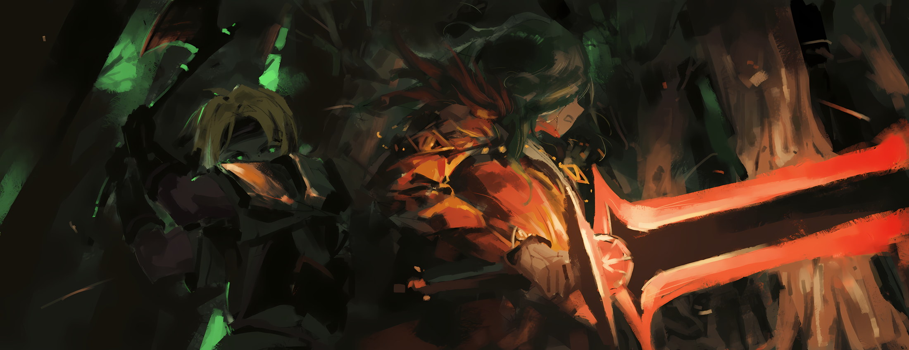
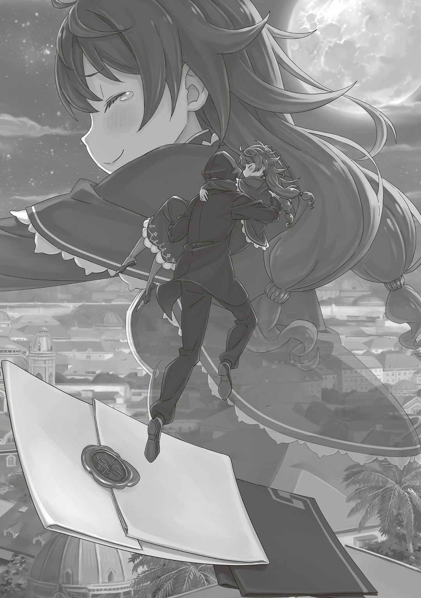

…Поражение Сфинкс означало конец «Великому Бедствию».

Запретную магию больше не использовали, отчего нежить лишилась своей главной силы — бессмертия.

«Ведьма» насильно возрождала мертвых и заставляла их подчиняться своим планам: кто-то сразу же покончил с собой, но многие, конечно же, воздержались.

Хотя они и превратились в нежить, но все еще оставались имперцами, которые следовали «Законам Железа и Крови».

Даже если их оживляли силой, пока нежить могла держать меч в руках, она всегда была готова сражаться, есть у нее жизнь или нет; такой же боевой дух присутствовал и в войсках «Укрепленного Города».

Битва за Гарклу закончилась практически одновременно с «Великим Бедствием», поэтому нежить, которую почти что истребили, была вынуждена бежать.

Почему она сдалась и отступила? …Без командующего фронт развалился, и войска оставили свои позиции.

Имперцы, смотревшие смерти в глаза, не хотели жертвовать своими жизнями в заведомо проигранной битве, даже если и были нежитью.

А что касается того, куда пропал командующий, то…,

— К-как такое могло произойти…!?

Палладио отвернулся от вида того, как разрушается строй армии, и в отчаянии потянулся рвать волосы на голове.

Да быть такого не могло, да чтоб такое произошло, да никогда.

Этого не должно было случиться. Этого не должно было случиться, но это случилось. Палладио всегда, всю жизнь преследовали нелепости и бессмыслицы.

Он стал командовать армией нежити и старался выполнять свои обязанности как достойный член Императорской Семьи.

Однако его планы постоянно срывались простыми горожанами, а бездарная нежить, которая не выполняла приказы как надо, лишь усугубляла ситуацию, что в итоге привело к катастрофе.

Он, конечно же, не собирался опускать руки. Но из-за нелепости и бессмыслицы обязанности Палладио пошли крахом, и, в конце концов, ему пришлось бежать.

…Нет, он не делал ноги.

Палладио благородно отступал, чтобы стратегически подготовиться к будущей победе. А иначе же: в чем смысл подвергать такой участи члена Императорской Семьи и Племени Злого Глаза?

— Ну и что это за хрень, «Ведьма Жадности» поганая…! Неужели это и есть результат всех твоих красивых речей…?

В голове его мелькнул образ отвратительной личности, которая первая рухнула под тяжестью всех трудностей. Беловолосая «Ведьма», на которую злился Палладио, почти переломила ход битвы, но безответственно бросила свою роль и просто исчезла.

До того, как она решила уничтожить Гарклу огромной звездой с неба, все шло хорошо.

Но вмешательство со стороны столицы все испортило, а затем, что еще хуже, последовала контратака тех, в чьих глазах горел огонь.

Палладио, используя свой Злой Глаз, видел, как все жители города, даже беспомощные бездомные, с огнем в глазу подняли оружие, чтобы победить нежить.

А затем случилось «это». «Ведьма Жадности» даже не попыталась исправить ситуацию, а просто растворилась в пыли.

— «…Ах, это так, да. Я — Сфинкс.»

Напоследок «Ведьма» оставила эти слова и исчезла. Почему она ушла с таким довольным лицом?

Палладио ничего не понимал. Его загнали в угол.

— Твою мать, твою мать, твою мать, твоюматьтвоюматьтвоюмааать…!

Проклиная все на свете, Палладио бежал с равнины и скрылся в лесу.

Примерно тогда же, когда исчезла «Ведьма Жадности», он заметил что-то неладное — нежить больше не воскресает. Это полностью обесценило их армию.

Каждая битва следовала определенному ходу.

Так было в любых войнах, особенно в крупных, которые решали будущее.

Палладио ощутил перемены и быстро оставил позиции. Он взял с собой лишь нескольких сопровождающих, чтобы отступить и подготовиться к новой атаке.

Это было не бегство, а тактическое отступление ради будущей победы.

— Сегодня победа за вами. Винсент, Приска…!

Это были лишь уступки.

Палладио собирался отступать и возвращаться вновь. И если в следующий раз, без помощи «Ведьмы», он добьется неоспоримой победы, этим уступкам придет конец.

В следующий раз он обязательно поставит Волакию под власть законного Императора.

Именно для этого у него и был Злой Глаз.

С этим небесным оком Палладио непременно займет трон Императора.

— …

Он был в этом уверен, поэтому сразу же использовал силу Злого Глаза, чтобы понять, какую дорогу лучше выбрать, и тут вдруг кое-что осознал… Палладио заметил, что нежить, которая его сопровождала, куда-то исчезла.

— Чего? Эй, э-эй?! Куда вы все подевались?! Сволочи, вы что, просто бросили меня на…

Произвол судьбы? Но тут его ярость быстро сменилась шоком.

На секунду Палладио подумал, что нежить могла сбежать из-за какой-то глупости, однако его Злой Глаз мигом бы такое заметил. Поэтому ответ был прост: все они умерли.

— …Кх

Он почувствовал, как по его бескровному мертвому телу пробежали мурашки, и быстро достал «Меч Света»…

— …Ах

…Его рука, что схватилась было за меч, оказалась отрублена по локоть. Палладио рухнул на землю.

— Ч-чт-что…

Все три его глаза округлились, пока он пытался понять, что происходит.

Сразу же после этого Палладио получил второй удар по другой руке: теперь он не сможет взять меч. Взмах топора, это был взмах топора — вот что он понял.

Однако это было все, что он смог понять.

— Почему…

Злой Глаз, который делал Палладио особенным, небесное око, почему оно не уловило внезапной атаки врага?

Он не понимал, не понимал, не понимал. …И тут он кое о чем подумал.

В прошлом Палладио слышал один сказ.

Сказ об одной глупой расе, совершившей неискупимый грех, который разгневал самого грозного Императора Волакии. Эта раса, эти существа, презираемые «Законами Железа и Крови», были записаны в историю как те, которых нужно истреблять.

Сам факт их жизни в Империи считался преступлением, караемым смертью.

— Подож… — Я не буду ждать.

И тут хладнокровный и безжалостный удар навсегда завершил пьесу Палладио Манески.

…Это был тот удар, из-за которого нежить вокруг Гарклы потеряла своего командующего. Их фронт развалился, а «Великое Бедствие» скрылось на задворках истории.

△ ▼ △ ▼ △ ▼ △

Прокручивая колеса инвалидной коляски, Катя удивилась размерам комнаты, которую ей выделили.

— Брат, конечно, говорил, что теперь, когда он «Генерал», ко мне будут относиться по-особенному, но… это уже перебор.

Катя оглядела просторные покои, после чего ее плечи поникли, и мысли о будущем закружились у нее в голове.

Краем уха она слышала, что из-за «Великого Бедствия» восстановление Рапганы займет время, поэтому всех беженцев расселяли по ближайшим городам и деревням, включая Гарклу.

Среди тех, к кому относились особо, был и Джамал, который теперь работал при Императоре Винсенте.

Катя никогда не тянулась к роскоши. Даже когда богатства окружили ее, она оставалась скромной и застенчивой, а значит не могла по-настоящему этим насладиться.

Именно поэтому она отказывалась от большинства того, что ей предлагали.

— Мне так не нравится, когда эти люди пытаются со мной сблизиться.

Семья Орели хоть и принадлежала к аристократии (Катя — дочь аристократа), была на задворках знати. В их доме всегда были слуги, окружавшие ее заботой, но теперь все изменилось из-за нового положения Джамала.

Многие пытались подлизаться к Кате, чтобы стать ближе к ее брату.

Но ее не волновали эти мелочи. К тому же, Катю вполне устраивало, как сейчас обстояли дела между ней и Рем.

— Ну, говорить о ней смысла уже нет, ведь она уехала.

Катя понимала, что имеет непростой характер, но Рем все равно была для нее хорошей подругой. Эта голубоволосая девушка всегда говорила то, что другие не решались сказать, и это их сблизило. По сути, Рем стала ее первой настоящей подругой.

Тем не менее, ей пришлось вернуться в Лугунику вместе с черноволосым юношей и своей старшей сестрой.

В день расставания, заметив печаль на лице Кати, Рем пообещала писать ей письма, хотя совершенно не представляла, о чем именно.

— Похоже, моя жизнь никогда не станет лучше…

Не так давно в жизни Кати начались перемены, но в остальном ее будни оставались скучными и однообразными, ничего не чувствовалось — лишь время, которое медленно тянуло ее к смерти.

Катя думала, что не сможет написать Рем ничего интересного, боялась, что со временем их привязанность ослабеет и письма прекратятся.

Это мрачное будущее ясно рисовалось в ее голове.

— Я так больше не могу… я не могу, я-я просто хочу уже умереть.

Она осталась одна, и ей становилось все хуже и хуже.

По натуре Катя была плаксой и во всем винила только себя, однако рядом с ней всегда находился кто-то, кто помогал ей не зацикливаться на плохом.

До вчерашнего дня это была Рем, а до нее…,

— Дурак. По-настоящему глупый, недалекий, пустоголовый дурак.

Крепко схватившись за колеса инвалидной коляски, тихонько прорычала Катя.

Этот дурак без зазрения совести ворвался в ее жизнь. Хотя она пыталась держаться от него подальше, он все равно притянул ее поближе к себе, навесив на уши всякого приятного и милого, что слышать она, конечно же, не хотела. А потом, после всего того, что между ними было, он просто взял и исчез.

Ей было очень больно о нем вспоминать.

— Ах, нет-нет, не хочу плакать…

Всхлипнула Катя, чувствуя, как наворачиваются слезы.

Лучше бы она погибла, защищая свою подругу в разгар «Великого Бедствия», чем страдала сейчас. Если бы Рем это услышала, то наверняка бы назвала ее дурочкой.

А еще так Катя избежала бы неловкости за свои неуклюже написанные письма.

Все-таки очень несправедливо, что мертвых людей нельзя упрекнуть в лицо.

Мириться с этим Катя не хотела, а потому продолжала говорить про них плохое.

— Дурак, ты такой дурак, полное дурачье, дураааак…!

Но такие попытки выпустить злость только усиливали ее страдания.

Катя все больше думала и вспоминала про него.

От этого у нее потекли слезы, и начало щипать в носу.

Несомненно, если бы она сейчас посмотрела в зеркало, то увидела бы очень неуклюжую и жалкую женщину в инвалидной коляске.

— Никого… я больше никого не хочу видеть…

Пробормотала Катя, собираясь подъехать к кровати.

Ей хотелось не расплетать косы и не раздеваться, а просто упасть на кровать и лежать, пока не умрет от голода. Хотя, разумеется, такого не случится. В конце концов, голод возьмет свое, и Катя что-нибудь съест.

И вот, думая о том, по кому ей хотелось рыдать…

— …? Кто там?

Когда она уже собиралась было подъехать к кровати, в дверь постучали.

Хоть Катя и думала, что сейчас не лучшее время, она не могла игнорировать этот стук. Из-за проблем в стране всем было сложно, поэтому ее мелкие истерики могли помешать кому-то сделать что-то важное.

С искренностью в душе она направилась к двери.

На секунду Катя засомневалась, стоит ли открывать, ведь она вся заплаканная, но это была лишь секунда. Что бы там не подумал гость, девушка потянулась к двери.

И тут…,

— Да, кто там…?

Сказала Катя, медленно открывая дверь и…,

— …Ах

Из ее тоненького горла вырвался слабый вздох.

△ ▼ △ ▼ △ ▼ △

— …Спасибо за вашу работу, «Императорский Генерал» Джамал.

— Ага, взаимно.

Он улыбнулся имперскому солдату, который отдал честь.

Титул «Императорский Генерал», который присвоили Джамалу, был создан специально для него за вклад в последнюю большую битву на стороне Императора.

Этот титул был очень престижным, поскольку теперь он стал личным телохранителем Винсента. Для Джамала, который стремился стать «Генералом» ради процветания семьи Орели, это было великое достижение.

Теперь он мог показать, что те, кто смеялся над ним, ошибались, и, что важнее, обеспечить Кате жизнь, которую она не смогла бы себе позволить без его помощи.

Хотя Катя была пассивной и считала себя никем, для Джамала она оставалась дорогой семьей. Несмотря на ее возможные чувства, он знал, что она примет его помощь, ведь они были одинокими братом и сестрой.

— Блядь, говорила же она мне, что я часто лезу куда не надо.

С досадой сказал он и пошел к своей сестре.

С тех пор как его повысили до «Императорского Генерала», к Джамалу и Кате начали относиться с должным уважением.

Пока столица Империи не восстановится, она будет жить во временном доме. Брат хотел, чтобы сестра жила в достатке и без лишних забот.

Но девушка, которая некоторое время жила у Кати и была ее подругой, теперь возвращалась в Лугунику.

Сейчас Кате нужно было время, чтобы погоревать.

— Поплачется немного: и я уже тут как тут с мясом и бухлишком.

Тут он встряхнул бутылку ликера и пакет с мясом высшего сорта, которые достал из запасов, пользуясь своим положением.

Отпив первоклассный алкоголь, он впился зубами в толстенный кусок идеально прожаренного мяса.

Именно так Джамал справлялся с горем.

— Катя, ты дома? Эт я.

Джамал постучал в дверь и позвал Катю. Он ожидал, что она будет в своей комнате, так как обычно та не выходила из дома без веской причины. Сегодня не должно было быть исключений.

Но ответа не последовало, отчего Джамал насторожился.

— Дрыхнешь, что ль? Встречай гостей.

Так как Катя часто дулась, а потом спала как убитая, Джамал спокойно вошел в комнату.

Он огляделся: спальня выглядела так, будто в нее кто-то только-только переехал.

— Катя?

Но Кати нигде не было. Джамал задумался, не мог ли он случайно пропустить момент, когда она вышла из комнаты.

…Внезапно его взгляд упал на письмо, которое лежало на столе.

— …

Хотя письмо не выглядело особенным, оно тут же привлекло его внимание. Необычным было то, что лежало рядом с ним: бандана, которую когда-то носил один хорошо знакомый Джамалу человек…,

— …Кх.

Он с нетерпением разорвал обертку и принялся читать письмо.

Мелкий и неуверенный почерк Кати контрастировал с четким и уверенным почерком кое-кого еще; это был брачный договор.

— …Вот же хитрожопый засранец, а!

От такого поворота Джамал выругался.

Вопреки резким словам, он не смог скрыть облегчения, радости, а еще сложных родственных чувств. Ведь подлючий друг Джамала украл его любимую младшую сестру.

— Ха, хахаха, ХАААХАХАХА!!!

Все еще держа в руках письмо, он поднес ладонь к лицу и начал истерически смеяться. Джамал смеялся и смеялся, да так сильно, что из его глаза, закрытого повязкой, тоже потекли слезы.

То, что это были редкие слезы радости в Империи, изнывающей от слез прощания, не вошло бы ни в одну Волакийскую книгу по истории.

Но достоверно известно только одно: именно в этот день и именно здесь состоялась свадьба между дворянкой и ее похитителем, которую благословил одинокий «Генерал».

…Катя Орели пропала невесть куда.

Однако грустить было ни к чему, ведь в письмах, которые она частенько слала своей единственной подруге, не было и намека на горе или несчастье.

