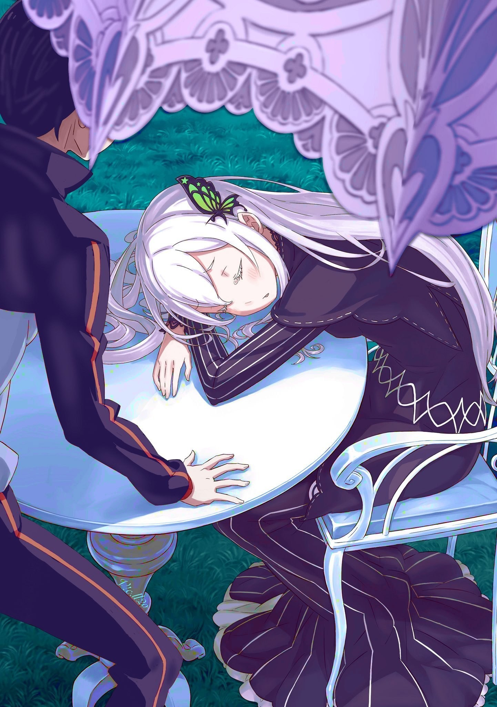
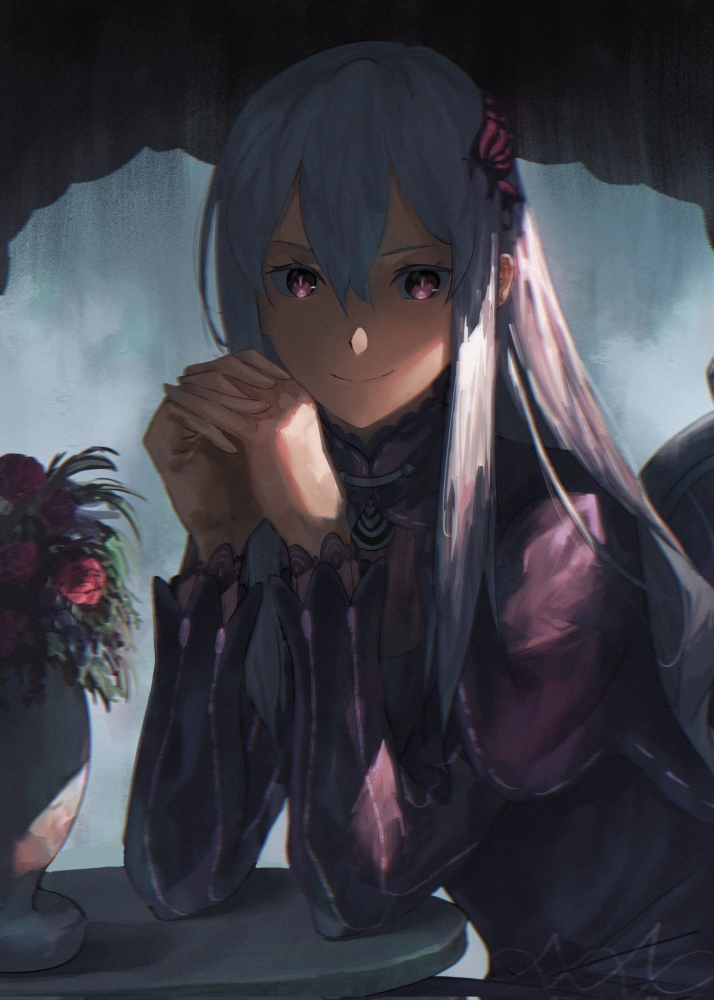

— Как и ты, я та ещё неудачница.

Услышав слова, что тихо произнесла «Ведьма», не поднимая своих опущенных ресниц, Альдебаран не нашёл что сказать.

Зелёная лужайка, где раз за разом он встречался с ней, была местом, которого не существовало в этом мире. Иное измерение, сотворённое её волей. Этакий замок снов.

Сколько бы он ни допытывался о природе этого места, она отделывалась туманными фразами вроде «Это нечто сродни сновидению, посещающему тебя в полудрёме». Но сегодня, что было крайне необычно, здесь царила ночь.

— Похоже, даже для необычного есть своё время, — удивленно вздохнул Ал, глядя на усыпанное звёздами полотно над головой.

Обычно здесь всегда был полдень. Это пространство было всего лишь пейзажем из воображения своей создательницы, оторванным от реального течения времени. Посему здесь всегда было светло, а над головой сияло ясное небо.

И пусть хозяйка этого мира не признавала цветов, отличных от чёрного и белого, неужели в глубине её души таилось столько жизнелюбия, что из неё нет-нет да и выглядывал клочок ясного неба?

Несмотря на подобные сомнения, вид ночного луга всё же поражал. Не говоря уже о том, что сама виновница торжества мирно дремала на вершине холма.

— …

Прислонившись к белому столу, она спала, тихо и спокойно дыша.

Ал хотел было спросить про незнакомый ночной пейзаж, но осёкся, заметив это. Он затаил дыхание, не в силах отвести взгляд от её спящего лица.

Первой его мыслью было: Надо же, «Ведьмы» тоже спят?

Как бы очевидно это ни казалось, но образ её жизни был сплошной загадкой. Она ведь существо, способное по щелчку пальцев создавать иные измерения. Узнай он, что ей не нужен сон, нисколько бы не удивился. К тому же, прежде он никогда не видел её спящей.

— Досадно красива…

Он и так это знал, но даже во сне она обладала ненормальной, совершенной красотой.

Миндалевидные глаза, хранившие бездну знаний и прорву любопытства, были сомкнуты, но её черты, будто выточенные рукой божества, длинные белые волосы и обесцвеченная кожа кричали о том, что миру и не нужны другие цвета.

И это поистине его бесило.

— Если так подумать, то такой шанс может больше и не выпасть… надо бы ей рожу чем-нибудь разрисовать…

— М-м-мх…

— Кх!

Стоило ему подумать об этом, как с её губ сорвался тихий стон, что сковал его на месте.

Хоть он ничего и не сделал, он почувствовал себя ребёнком, пойманным с поличным. Но в следующую секунду напряжение его пронзило с новой силой.

Ведь на ресницах спящей «Ведьмы» блеснула слеза.

— Учитель…

— М-м-мх…

Сам не понимая зачем, он коснулся её плеча и легонько потряс. От его прикосновения и зова она тихо застонала и медленно приоткрыла веки.

Её чёрные глаза несколько раз моргнули, пытаясь сфокусироваться, и наконец отразили его застывшую фигуру.

— Альдебаран?

— Ага, это я, Учитель. Дремаешь здесь… как непохоже на тебя.

— …

Он скрыл своё смятение и молча наблюдал, как она потягивается. Она коснулась подбородка тонкими пальцами, словно приводя мысли в порядок.

А затем…

— Так это всего лишь сон… — прошептала она, и в голосе её слышалось явное сожаление от того, что это было так.

«Ведьма» стёрла слёзы кончиками пальцев, избавляясь от послевкусия сна. Этот простой жест показался ему таким одиноким, что он, сам того не осознавая, спросил: — Плакать во сне… ты что, ребёнок? Что хоть снилось?

Едва произнеся это, он тут же пожалел о своём вопросе. Повисла неловкая тишина.

Он уже приготовился к чему-то в её обычном духе: либо к занудной лекции о природе сновидений, либо к язвительным подколкам на тему его любопытства.

Но она не ответила так, как он ожидал.

Вместо этого «Ведьма» просто повторила фразу, с которой всё и началось.

— Как и ты, я та ещё неудачница.

— …

Ещё раз обдумав её слова, совершенно сбитый с толку Ал просто промолчал.

Чёрт возьми, что она имела в виду? Её совсем не заботит такой прямой вопрос? Обычно она болтала без умолку, так почему же сейчас она вела себя так сдержанно?

Но даже если он спросит и всё выяснит, не причинит ли это «Ведьме» боль?

— Вот уж не знаю, кто из нас ребёнок?

— А?

— Это ведь ты сказал, что я стала похожа на дитя. Но будь уверен, я не хрупкое создание, которое так легко ранить. Я ведь злая «Ведьма», так?

Она подмигнула, произнося свою заученную фразу. Он же тяжело вздохнул, заметив в этом жесте проблеск её обычной ребячливости.

Почему-то ему показалось, что в словах её не было ни капли жизни.

— Чёрт, надо же мне было так раскиснуть из-за тебя, Учитель…

— Как занятно. «Учитель» — это ведь почётный титул, но в твоих словах нет и тени благоговения. Хотя, полагаю, ты просто пытаешься скрыть своё смущение за то, что подглядывал за спящей девой.

— Язвительности тебе не занимать!

Ему и так было тошно, но его отчаянный вопль да и жалобу собеседница пропустила мимо ушей, лишь весело постукивая пальцем по столу.

В тот же миг на нём возникли две чашки с дымящимся чаем, одна из которых предназначалась ему.

— Ну-ну, взбодрись. Может, мне потрудиться и сотворить ещё и сладостей?

— Не надо. Даже если я здесь поем, в желудке будет пусто. Вернусь, а в голове сумятица: мозг сыт, а внутри ничего нет.

— От таких слов мне ещё больше хочется накормить тебя до отвала.

— Ты худшая! — крикнул он, видя, что она и не пытается скрыть свою вредность, и подпёр подбородок рукой.

Искоса взглянув на её довольное лицо, он убедился, что следов слёз больше не было.

— …

Исчезли. И всё же колючий ком в груди его никуда не делся.

То, что она назвала шуткой, скорее всего, было правдой. Даже она, такая вся прекрасная и мудрая, порой ненавидела себя до слёз.

Кто в этом мире вообще мог счесть «Ведьму» «неудачницей»?

— Хм?

— Ничего, Сонячитель.

Бросив колкость в ответ на её невинно склоненную набок голову, он поднёс чашку к губам.

Кажется, он упустил свой шанс. Представится ли возможность задать вопрос ещё раз? А если и да, захочет ли он сам узнать ответ?

А если и захочет, то для чего? Найти сочувствие? Или сострадание?

Или, быть может…

— Даже фальшивое звёздное небо — то ещё зрелище, да?

…он желал, чтобы эти глаза — чёрные, как бездна, но сияющие ярче любых звёзд, — смотрели лишь на него одного?

Ал, который, как и «Ведьма», был тем ещё неудачником, ответа не знал.

