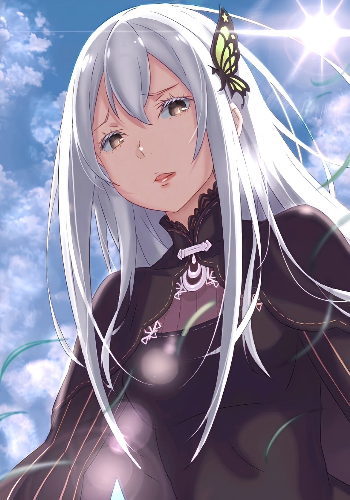

— Тебя, моё творение, не победит никто.

Её улыбка показалась ему кровавой.

Словно цеплялась, лелеяла, оплакивала, умоляла, открывалась, отчаивалась — «Ведьма» была так близко, что он ощущал её дыхание на своём лице.

Бледная кожа, чёрные радужки… она была прекрасна.

Пожалуй, из всех, кого он знал, по красоте она была одной из двух самых красивых.

Серебро и аметист против белого и чёрного.

Для него, знавшего, по сути, лишь свой крошечный мирок, эти две палитры были вершиной всего прекрасного и достойного почитания.

△ ▼ △ ▼ △ ▼ △

Когда скорлупа, которую он пытался сокрушить бесчисленное множество раз, наконец треснула, на душе воцарилась на удивление звенящая пустота.

— …

На чайный столик с глухим стуком упал чёрный шар. Он удивлённо проводил его взглядом.

Он много раз представлял, как достигнет успеха, даже испытал его на себе, но сам путь к нему оказался бесконечной чередой провалов.

Конечно, она уверила, что у него получится. Он и сам верил в это, но…

— Подумать только, всё вышло так… буднично, — не скрывая чувств, пробормотал он, поднимая катившийся по столу шар.

Он принялся перекатывать его в ладони, наслаждаясь странным на ощупь предметом — шар не был ни холодным, ни тёплым.

Может, со стороны и казалось, что он разочарован, но этот шар был не просто апофеозом Магии Тьмы, не плодом праведного искусства, а самой квинтэссенцией ереси, запретным искусством «Оль Шамак».

Заклинание, доведённое до максимальной эффективности за счёт узкой направленности: оно действовало исключительно на обладателей Факторов.

Единственный в мире козырь против «Ведьм».

Его создание было непреложным условием, и именно ради этой сверхмагии он и трудился всё это время.

— Понимаю, ты ушёл в себя, но не мог бы уделить внимание и мне?

— У-о-о-а-а?!

Вздрогнув от внезапного голоса, он выронил своё творение. Шар, словно протестуя, покатился по зелёной траве.

— Ох, виноват. Бывает.

— Говоришь так, будто тебе всё равно. Ну же, подними меня скорее.

— Щас-щас, — ответил он, спеша за упавшим шаром.

К счастью, трава на поляне была коротко подстрижена, так что он не боялся потерять его из виду.

— А катится он лучше, чем я ожидал… Учитель, а может, тебе так будет легче передвигаться? Хочешь, оставлю в таком виде?

— Не говори ерунды. Это заклинание создала я, да, но оно слишком уж эффективно против обладателей Факторов. Здесь я совершенно бессильна. Если у тебя поедет крыша и ты решишь запечатать меня, я даже пикнуть не смогу.

— Учитель в таком состоянии, значит…

— А? Бормочешь так, словно и впрямь на это способен… Страшно, очень страшно. Ты что, пытаешься загнать меня в угол своими шутками?

Хотя она и была «Ведьмой», хоть она и не понимала эмоций, но то, как мастерски она изображала страх, царапало по нервам.

Проигнорировав это чувство, он наконец догнал остановившийся шар. Подняв его, он снова принялся перекатывать его в руке. На секунду ему и впрямь захотелось оставить её в таком виде.

— Альдебаран?

Но один лишь её зов тут же развеял этот мимолётный соблазн.

На смену ему пришла осязаемая реальность, а вместе с ней — тревога. Тревога перед великим финалом, о котором ему твердили без конца. И мужество, чтобы встретить его.

— Если ты выберешься отсюда, Учитель…

— Что такое?

— Так-то, всё готово… Моё Полномочие, нужная магия и…

— Твоё становление. Действительно. Время пришло.

Понимала ли она его чувства, нет ли — голос «Ведьмы» оставался спокоен.

Порой она вела себя как ребёнок или соблазнительница, и поддаться её чарам было проще простого. Но она — «Ведьма». Их отношения всегда сводились лишь к общей цели.

Они никогда не поймут друг друга. Никогда не станут дорожить друг другом.

И всё же…

— Кажется, ты кое-что не так понял.

— А?

Её слова застали его врасплох — как раз в тот миг, когда он почти собрался с мыслями. Он смог лишь промычать в ответ.

Чёрная сфера в его руке, словно обретя волю к разрушению, покрылась сетью молниеносных трещин.

То, что могло быть уничтожено лишь Полномочием или Драконьим Мечом, рассыпалось от воли не своего создателя…

— …

В следующий миг он поднял глаза на «Ведьму». Она прижимала его к траве, глядя сверху вниз. Скованный её черными глазами, он не мог вымолвить ни слова.

Она обратилась к нему: — Тебе не о чем тревожиться. Я научила тебя всему, чему могла. Ты прошёл все испытания, что я ставила перед тобой. Ты даже не искал мудрости у других «Ведьм», я права?

— Учитель, я…

— Помолчи.

Её палец коснулся его дрожащих губ, заставляя умолкнуть. Выражение её лица изменилось.

Она изогнула губы в нежный полумесяц, даруя ему улыбку, какой он никогда прежде не видел.

Кровавую улыбку.

Словно она хотела пленить его взгляд, дыхание и сердце.

Вечно бело-чёрная «Ведьма» вдруг явила цвет крови…

— Тебя, моё творение, не победит никто.

Её слова пронзили его слух, просочились в мозг и выжглись на самой душе.

Никогда не забывай, никогда не забывай, никогда не забывай.

Это благословение впечатывалось в душу вечного последователя той звезды.

«Ведьма» никогда не лгала. А значит, это была истина.

— Никто… меня не победит…

— И я хочу, чтобы ты это доказал. Конечно, никто и никогда тебя не похвалит, но… торжественно клянусь, я одна буду той, кто от всего сердца благословит тебя, когда ты преуспеешь.

Для него эта клятва была искушением, которому невозможно противостоять.

В этом мире он жаждал признания лишь двух людей. И поскольку от одного из них ждать было нечего, оставалось молить о признании другого.

— Я выиграю, Учитель… Я стану самим собой.

— …

Он ответил так, как она и ожидала. Пламя вспыхнуло в его сердце.

В её вечно улыбающихся глазах мелькнула совершенно иная эмоция. Он не знал, какой душевной раной «Ведьмы» она рождена.

Альдебаран верил только её словам, только её учению и только её благословению.

Перед глазами — прекрасная «Ведьма» белого и чёрного.

За закрытыми веками — прекрасная «Ведьма» серебра и аметиста.

Гонясь за слепящей, ненавистной, мерцающей звездой, он ждал этого момента.

Наконец-то его труды будут вознаграждены. Он верил в это. И, словно скрепляя печатью его отвагу и своё благословение, губы «Ведьмы» коснулись его лба.

Ощущая в этом прикосновении всю отчаянную жажду, за которую она цеплялась из последних сил, «Звезда-Последователь» прошептал…

— Несмотря ни на что… я… обязательно убью тебя.
