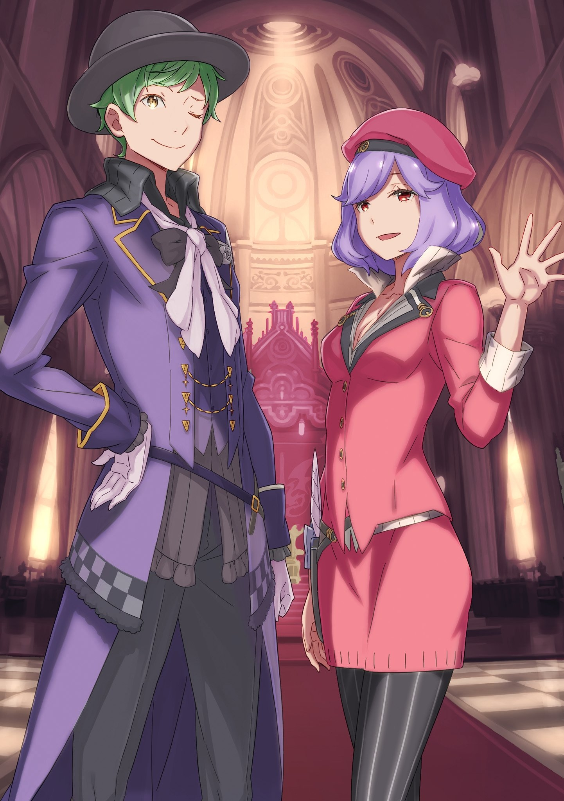
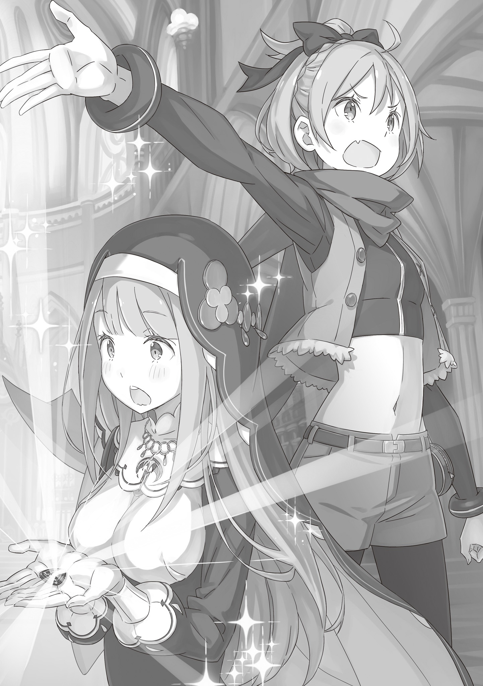

Всякий раз, когда Фельт переступала порог Королевского Замка, она ощущала нечто странное — словно прорывает тонкую, едва ощутимую пленку сопротивления.

Замок всегда маячил где-то на краю зрения Фельт, что выросла в трущобах Столицы, и оставался для нее символом абсолютной недосягаемости, не связанным с ее жизнью. Место, которое вроде бы существует, но с которым невозможно соприкоснуться. Что-то смутное, бесплотное, лишенное реальной ценности, подобно миражу — таково было ее впечатление. Возможно, именно поэтому до сих пор, каждый раз заявляясь в Замок в качестве кандидата на трон, она испытывает сюрреалистичное чувство, будто вторгается в чей-то сон или иллюзию. И это …

— Госпожа Фельт?.. — послышался голос.

Фельт, застывшая было на месте, подняла голову. Она встретилась взглядом с парой голубых глаз своего рыцаря, который, положив руку на дверь, обернулся к ней.

— Ничего, — лишь фыркнула Фельт.

Да, ничего особенного. Никто не сможет остановить их поступь.

— Пошли, — приказала она.

Этим заявлением она словно подвела черту для себя и для других. Фельт разорвала пленку сопротивления и двинулась вперед.

Рыцарь — Райнхард — кивнул и распахнул двери. Стоило им показаться внутри, как их встретила привычная картина: помещение было переполнено людьми, а воздух пронизан странным напряжением. Здесь хаотично переплетались огнем воли множества людей, их взглядов и слов. Однако, стоило ей войти, как эти разрозненные воли невольно объединились в бесцеремонном намерении оценить Фельт ради будущего Королевства.

«Ну, мне-то по фигу. Я тоже, когда с кем-то вижусь, обычно прикидываю, че к чему».

В этом плане, независимо от Королевских Выборов, сказывалась наука выживания в трущобах или, можно сказать, житейская мудрость Фельт — привычка постоянно взвешивать, полезен ли ей собеседник или нет, и что он замышляет на самом деле, стала ее второй натурой. На самом деле, эта въевшаяся привычка не раз выручала ее и после того, как она стала кандидатом. В конце концов, количество людей, с которыми ей приходилось встречаться, не шло ни в какое сравнение с временами жизни в трущобах, и она была завалена необходимостью разгадывать их цели. Если бы ей пришлось выстраивать эту систему ценностей с нуля, трудно даже представить, сколько шишек она бы набила. Впрочем …

«Хотя есть и такие, как сестрица Эмилия, которым все это вообще до высокой колокольни».

Эмилия, будучи таким же кандидатом, умудрялась сохранять почти чудесную беззащитность.

Фельт полагала, что за тем, что эта полуэльфийка остается собой, стоит колоссальный труд ее рыцаря, Нацуки Субару, а также Отто и остальных, сопровождавших ее и в этот раз. С другой стороны, Королевские Выборы и окружающая их среда не настолько снисходительны, чтобы позволить кому-то выжить, просто полагаясь на постоянную защиту. При всем этом у Эмилии все же был наметанный глаз на людей и интуиция, которая помогала понимать чужие замыслы. И раз при всем этом она ведет себя так, то Фельт было вдвойне сложнее иметь с ней дело.

«Как никак, она меня в подруги записала», — вспомнила она и вздохнула.

Она не жалела, что приняла предложение Эмилии, но чувствовала, что перспективы снова стали туманными. У нее и в мыслях не было прибегать к грязным трюкам или интригам, но, безусловно, сражаться с враждебным Лагерем, было бы проще, чем принимать решения, не делая скидок на симпатию.

«Если только они будут активны в этой дружбе, то это невыгодно только им».

Может, именно такой и была базовая стратегия Анастасии, и Фельт предполагала, что истинной целью приглашения других лагерей в Пристеллу было именно это … К сожалению, этот расчет, похоже, был разбит вдребезги тем, что после Выборов она подружилась с Эмилией. Как бы то ни было …

— Ладно, я не против, — она скривила губы в ухмылке. — Давненько я не ощущала на себе таких взглядов.

Это не было бравадой; она правда приняла направленное на нее внимание.

В Тронном зале, куда они вошли — в том самом месте, где было объявлено о начале Королевских Выборов, — собралось множество чиновников Замка Лугуника, а также члены Совета Мудрецов, что был центром управления государством. Ранее Фельт уже общалась с ними, когда докладывала о достижениях Мейли Портрут, которая «продала» свою ценность, заявив, что может указать путь к Башне Мудреца через Песчаные Дюны Аугрии и Сторожевую Башню Плеяд. Но сейчас атмосфера была совершенно иной.

На нее смотрели как на еретика или чужеродный элемент — в самом начале, на церемонии открытия выборов, Фельт умудрилась затеять ссору со всеми присутствующими. Это было похоже на те оттенки недоумения и замешательства, что были обращены тогда на беспризорницу из трущоб.

Тяжело ступая по красному ковру, Фельт дошла до середины Тронного зала. Прищурив один глаз, она уставилась на мужчину и женщину, стоявших там первыми.

— Здрасьте. Тут переполох из-за вас двоих? Мне ваши рожи не знакомы. — Она попыталась сходу перехватить инициативу.

В ответ они обернулись. Это была пара молодых людей, которым едва стукнуло двадцать, — смазливый парниша с волосами цвета молодой травы и красотка с коротко стриженными фиолетовыми волосами, напоминающими цветы, распускающиеся в сезон дождей. Несмотря на место, эти двое держались уверенно, не подавленные окружающими взглядами. Собственно, даже обращение Фельт их не смутило.

Парень лишь криво усмехнулся, а женщина мягко помахала рукой.

— Ой-йой … — протянула девушка. — Как же внеза-апно. Мы ведь впервые встре-етились, а Фельт такая колючая, прямо как в слу-ухах.

— Слухи, значит. И чё за слухи обо мне ходят?

— Маленькая и ми-иленькая, но величественная, дерзкая и никому не уступает, настоящий паца-ан … Говорят, от такого контраста в очаровании голова кру-угом иде-ет.

Фельт скривилась от ответа.

— Ну и тупые же слухи бывают …

Женщина же обольстительно хихикнула. Она была облачена в одежду розового цвета, напоминающего спелый плод, и шляпу того же оттенка, надетую набекрень. Ее наряд и аура напоминали какого-нибудь писца или служанку высокопоставленной особы. Однако бесцеремонное сокращение дистанции и сонные красные глаза с поволокой создавали впечатление кого-то неуловимого. Проще говоря, она производила впечатление человека, с которым просто так не сладишь.

Стоявший рядом с ней парень заговорил:

— Сакура, наш собеседник — один из кандидатов на трон, — упрекнул он свою спутницу. — Прекрати разговаривать в своей обычной тягучей манере. Жизней не напасешься.

Впрочем, его замечание прозвучало довольно легкомысленно и не говорило наверняка о серьезности или честности самого парня.

В ответ женщина, которую назвали Сакурой, лишь улыбнулась:

— Хм-м, — протянула она. — Неужели Тига тоже хочет сделать меня злоде-ейкой? У меня и так положение шаткое из-за капризов девчонки, а тут еще один-единственный союзник такое говори-ит … Я разочаро-ована.

— Тогда тем более не стоит делать себе врагов, — возразил юноша, Тига. — Первое впечатление имеет долгие последствия. Особенно сейчас, когда нам здесь … не очень рады, вроде.

— Да-да, — девушка обиженно высунула язык, — Тига говорит дельные ве-ещи.

— Рад, что ты понимаешь, — парень театральным жестом кивнул.

Затем он снова повернулся к Фельт и ее спутнику, снял широкополую шляпу, глубоко надвинутую на голову, и прижал ее к груди, прикрытой темно-фиолетовым плащом.

— В общем, прошу прощения за грубость моей спутницы, госпожа Фельт, — он элегантно поклонился и подмигнул Фельт желтым глазом. — Я — Тига Лауреон, а это — Сакура Элемент. Прошу любить и жаловать.

Позерство и манерность сидели на этом щеголе как влитые.

Разглядывая Тигу и Сакуру, Фельт всё для себя уяснила. Несомненно, эти двое сильно выделялись из атмосферы Королевского Замка и были той причиной, по которой Райнхард поспешно вытащил ее из особняка.

— Райнхард, эти двое …

— Да … это посланники Церкви Божественного Дракона.

Райнхард остановился рядом с Фельт и встал напротив этой парочки.

Так вышло, что в центре Тронного зала Фельт со своим рыцарем и двое из Церкви Божественного Дракона оказались лицом к лицу, приковав к себе всеобщее внимание обитателей замка.

Не обращая на это внимания, Фельт скрестила руки на груди и уставилась на Тигу:

— Насколько я знаю, Церковь Божественного Дракона не лезет в дела государства. Какого хера вы здесь забыли?

— Не уверен, что вы поверите, но на самом деле этот контакт и для нас нежелателен. Как вы и сказали, Церковь всегда держалась на расстоянии от политики. Конечно, я не говорю, что мы совсем не связаны с Королевством.

— Нежелательный контакт, говоришь? И это ты смело заявляешь, хотя знаешь, что сможете помочь кандидатке Круш Карстен?

Тига на мгновение дрогнул.

— Именно, — ответил он.

Завидев это, Сакура прикрыла рот рукой и снова захихикала.

— А? — Фельт рыкнула на эту улыбку.

— Ой-йой, у Фельт такие быстрые ушки-и, — девушка склонила голову набок. — Хотя разговор вроде как должен был остаться в За-амке.

— Ха, не недооценивай парня, который стоит рядом со мной. Он слышит даже то, как я ночью с кровати слезаю, чтобы в туалет сгонять.

— Я не отрицаю, — вклинился Райнхард, — но ваша формулировка может вызвать недопонимание, госпожа Фельт.

— Да заткнись ты. Не лыбься виновато. Лучше сделай наглую рожу. Так они больше бояться будут.

О том, что переговоры с Церковью Божественного Дракона в Замке касаются Круш, говорил Отто, поэтому Фельт, соблюдая приличия, не стала его выдавать. В конце концов, даже если к репутации Райнхарда добавятся слухи о чутком слухе или привычке подслушивать, ему от этого ни горячо ни холодно. Факт остается фактом: он, вероятно, услышит падение иголки за километр. В любом случае …

— Мне не нравится эта Церковь Божественного Дракона …

— Ой, Фельт тоже не любит Це-ерковь? А я думаю, наша деятельность в, например, трущобах приносила по-ользу.

— Извиняй, но я ненавижу подачки. Я никогда не стояла в очереди за хлебом в Церкви. Но я не говорю, что ваше дело бесполезное или плохое. Я говорила о том, что вы можете спасти герцогиню Карстен. — Фельт показала язык девушке.

— Значит, вы хотите, чтобы соперник и дальше мучился? — Сакура же, вопреки своей сладкой речи, жалила ядовитыми намеками.

— Хочешь заставить меня сказать «нет»? Увы, у меня не так много свободного времени.

Конечно, Круш — соперница, но причина, по которой она оказалась в таком состоянии, — это отдельный разговор. Все, кто был тогда на месте, чувствовали вину за случившееся, и если есть способ ей помочь, человеческая природа требует использовать любую возможность … Однако единственное, что вызывает сильнейшее отторжение, это то, что Круш придется принять помощь Церкви Божественного Дракона. В конце концов …

— Герцогиня Круш Карстен на церемонии Выборов заявила: она расторгает пакт с Драконом и отказывается от процветания под его опекой, — вмешался старик с длинной бородой, сидевший в ряду Совета Мудрецов — Миклотов МакМахон.

— …

Услышав его, Фельт тихо вздохнула:

— Сказать, что полагаться на Дракона всем государством — это жалко, а потом занять силу у Церкви Божественного Дракона, которая поклоняется этому самому Дракону … Как-то это не круто.

— Выбирайте выражения, госпожа Фельт, — вмешался один из гражданских чиновников. — Речь не о том, круто это или нет …

— Нет, госпожа Фельт права, — осадил его Миклотов. — Крутость … другими словами, вопрос имиджа. В этом плане госпожа Круш получит непоправимый удар. Впрочем, это произойдет только в том случае, если она примет помощь.

Добавленное мудрецом замечание означало, что окончательное решение касательно предложения Церкви Божественного Дракона остается за Круш и ее людьми. Однако …

— Феликс … — тихо произнес Райнхард, слегка опустив глаза, имя своего друга — обладателя титула «Синий», Первого Рыцаря Круш, которая сейчас находилась в пучине страданий.

Фельт видела, как он извелся, находясь рядом с Круш, как осунулось его прекрасное, похожее на девичье лицо, когда она навещала больную. С тех пор она не слышала, чтобы состояние Круш улучшилось. Значит, и его душевное состояние осталось прежним.

Драгоценная госпожа горела в адском пламени ядовитого огня. Какое бы решение ни принял Первый Рыцарь, получив средство спасения, никто не вправе его винить.

— Разумеется, у нас тоже возникли споры по поводу предложения Церкви Божественного Дракона. Прежде всего, необходимо было проверить, правдиво ли само предложение. В зависимости от результата …

— Возможно, удастся помочь и тем, кто пострадал в Пристелле. Если подумать об этом, то, за что мы цепляемся, — просто мелочи.

— Хм. Вы согласны …

— Думаешь, я могу согласиться?

Она понимала логику, понимала доводы разума. Но эмоциональное согласие — это другое.

Раз уж она участвует в Выборах, Фельт намерена победить. Но если Присцилла погибла в Империи, а Круш выйдет из игры из-за этого случая, это совсем не то, чего она хотела. Если все так и закончится, чем это отличается от того, если бы Райнхард просто разбушевался и вывел из строя всех остальных кандидатов?

— Никто не виноват. Если уж искать виноватых, то виноват только Культ Ведьмы.

— Говорить поздно, но надо было прибить эту суку, Гнев, прежде чем кидать ее в тюрьму. Глядишь, злости бы поубавилось.

Конечно, все понимали, что это ничего бы не решило и вряд ли принесло бы облегчение. В конце концов, большая часть ущерба в Пристелле была нанесена Чревоугодием и Похотью, а последствия действий Гнева были минимальны. И Райнхард это понимал, поэтому полные ненависти слова Фельт никто не воспринял всерьез. В любом случае …

— Ситуацию в общих чертах я поняла. Церковь принесла лекарство, и герцогиня … А, ладно. Спасется сестрица Круш или нет, зависит от того, согласится ли ее рыцарь на лечение … Мы не можем вмешиваться.

Что бы она ни думала, выбор могут сделать только те, кого это касается.

Признав это, Фельт спросила «И?» у стоящего рядом Райнхарда, а заодно и у всех присутствующих:

— Я поняла, что к чему, но зачем нужно было так срочно тащить меня сюда? Спасибо, конечно, за объяснение, но в Столице сейчас не только я, но и сестрица Эмилия. Вы могли бы объяснить все всем сразу, ничего бы не изменилось.

Ситуация может сильно повлиять на Выборы. Значит, тем более нужно было срочно поделиться информацией не только с Фельт, но и с Эмилией. Вряд ли Райнхард стал бы вытаскивать только ее, пытаясь обойти соперницу. Сомнительно, что ему вообще может прийти в голову идея кого-то обойти.

И все же была причина, по которой сюда привели только Фельт …

— Если причина есть, то это вы, церковники? Но пока что нам с Церковью обсуждать нечего … Хотя о Божественном Драконе поговорить можно. — Вторая половина фразы прозвучала тише и менее уверенно. Все из-за того, что ее отношение к Божественному Дракону, Волканике, которому так пафосно поклоняется Церковь Божественного Дракона, совсем недавно изменилось.

— В конце концов, когда я потащилась с Мейли в Сторожевую Башню Плеяд, мне пришлось вблизи наблюдать, как Райнхард сцепился с этим пустоголовым Драконом …

Битва между Святым Меча и Божественным Драконом произошла в условиях, где ни один из них не мог выложиться на полную, но все равно это было грандиозное сражение, похожее на конец света. После той битвы Фельт узнала, что Божественный Дракон находится в состоянии, далеком от легендарного величия, но если бы ее попросили рассказать подробности, она бы не нашла слов.

Однако в ответ Тига пожал плечами:

— Нет, вызов госпожи Фельт — это не наша инициатива. И вообще, что касается предыдущего разговора, Церковь оказалась в довольно щекотливом положении, — он сделал сложное лицо.

— Предыдущего разговора … ты про сестрицу Круш? И что там щекотливого?

— Ну, скажем так … в Церкви еще не было четкого ответа на вопрос, будем ли мы спасать герцогиню Круш Карстен.

— А?.. — невольно издала Фельт низкий звук и нахмурилась.

Бессмыслица какая-то. Она думала, что у Церкви Божественного Дракона есть способ исцелить жертв Культа Ведьмы, и они сказали, что спасут Круш через Замок. Но слова Тиги рушили эту предпосылку.

— Но ведь, должно быть, сестрицу Круш уже лечат. Если Церковь не дала ответа, то почему …

— Дело в том, что … — вмешалась Сакура, — одна наша нетерпеливая девочка побежала впереди всех.

— Побежала впереди всех?..

— Ага-а. Поэтому мы тоже в панике примчались в Замок и сейчас узнаем у всех, что да ка-ак. Неловко вы-ышло.

Ей не хватало серьезности, чтобы поверить до конца. Однако Тига, с которым можно было разговаривать куда более нормально, чем с Сакурой, не остановил ее и не стал отрицать, лишь приложил руку ко лбу, словно стыдясь за своих.

Если это правда, то в Церкви Божественного Дракона тоже есть безрассудные кадры. Но даже если так …

— В итоге это не объясняет, зачем позвали меня.

— Хм. Что касается этого момента, мы тоже сейчас в большом затруднении, — ответил Миклотов. — Поскольку рыцарь Райнхард был здесь, мы попросили прийти и госпожу Фельт. Дело в том, что в проблеме, с которой мы столкнулись, вы, госпожа Фельт, очень даже заинтересованное лицо.

— …

Фельт сузила свои алые глаза и облизнула губы.

Похоже, они зашли сильно издалека, но наконец-то добрались до сути. Действия Церкви Божественного Дракона, от которых зависит судьба Круш, тот факт, что это стало неожиданностью даже для самой Церкви, и причина, по которой Фельт была вызвана туда, где находились их посланники — это …

— Та самая персона, которая сама вступила с нами в контакт от имени Церкви Божественного Дракона, о которой мы говорили ранее … это женщина с прекрасными золотыми волосами и красными глазами. И к тому же …

Фельт не перебивала Миклотова.

Описание внешности преподнесли как нечто важное. Фельт не была настолько недогадливой, чтобы не понять, что это значит.

Наблюдая за ее реакцией, Миклотов продолжил объяснение:

— Эта особа назвала себя Фьоре … У нее то же имя, что и у дочки брата короля, Форда Лугуники, которая пропала пятнадцать лет назад.

Дочь брата короля Форда Лугуники, Фьоре Лугуника. Имя и само существование этого человека имеют огромное значение для Королевства Лугуника, но для Фельт это значение просто колоссальное. В конце концов, подоплекой ее участия в Выборах было подозрение, что именно она и есть та самая исчезнувшая Фьоре. Эта причина была даже более весомой, чем то, что инсигния засветилась у нее в руках, чем и дала право на участие.

Действительно, Фьоре еще младенцем пропала пятнадцать лет назад. Примерно таков и возраст Фельт, а цвет ее волос и глаз соответствует чертам Королевской Семьи Лугуника. Конечно, сама она никогда не считала себя членом Королевской Семьи и не пыталась этим воспользоваться … Но она была не настолько эгоистична, чтобы полностью игнорировать ожидания окружающих — многие в Королевстве видели в ней возможность возвращения исчезнувшей королевской крови.

Каким бы ни было самовосприятие Фельт, человеческая природа такова, что ожидания и зависть никуда не деть. И это касалось не только абстрактного народа Королевства, но и участников при объявлении начала Выборов — и даже Райнхарда, в чьем сердце теплился осколок надежды.

Конечно, вероятность того, что она и есть выживший член Королевской Семьи, дала Фельт, выходцу из трущоб, первый меч для сражения на арене Королевских Выборов. И вот …

— Настоящая исчезнувшая Фьоре, значит … — пробормотала она, не разжимая губ, стоило ситуации улечься в голове.

Понятно, почему Замок трясет. Возможно, даже тот факт, что Круш была спасена Церковью Божественного Дракона и, как следствие, возникла угроза ее выбывания из Выборов, на фоне этой новости мог показаться мелочью — настолько шокирующим было существование монахини из Церкви Божественного Дракона, называющей себя Фьоре.

— Госпожа Фельт … — внезапно окликнул Райнхард.

Фельт слегка затаила дыхание.

Это не было неожиданностью, и все же она не смогла уловить эмоцию, вложенную в его голос … Нет, надо признать. Зародившееся внутри Фельт несомненное волнение не позволило ей уловить эмоции Райнхарда.

— …

Сначала, когда он вытащил ее на Выборы, Фельт, пережившая принудительное заточение в особняке после склада краденого, испытывала лишь сильный протест и враждебность. В итоге, после вмешательства старика Рома, ей пришлось принять решение об участии, но изначальной причиной, по которой Райнхард привел ее сюда и выдвинул как кандидата, было именно подозрение, что она — выжившая королевская особа. А теперь такая вероятность была под сомнением.

Это было опровергнуто … нет, не опровергнуто, это все еще лишь подозрение. К тому же Фельт до сих пор насмехалась над этой возможностью и отмахивалась от нее. Но когда это было опровергнуто прямо у нее на глазах, в груди шевельнулось отчетливое волнение. Причиной была не мысль «я хотела быть королевской крови». Это было разочарование из-за ее собственной, не зависящей от нее несостоятельности перед теми, кто ожидал, что она — член Королевской Семьи.

Стоило ей это осознать, Фельт почувствовала отвращение к самой себе.

— Жалкое зрелище …

Обычно она ведет себя нагло и дерзко, делает вид, что ничто не может ее поколебать, но стоило случиться чему-то непредвиденному, стоило понять, что она может потерять то, что, как ей казалось, она была готова отпустить в любой момент, — и вот она уже паникует самым неприглядным образом.

Она приготовилась к худшему и с трудом повернула отяжелевшую, словно каменную, шею в сторону Райнхарда. Какое бы лицо он сейчас ни делал …

— …

Ее глаза запечатлели взгляд небесной синевы. Рыцарь смотрел прямо на нее. И в этом взгляде не было ни тревоги, ни смятения. Тем более — ни разочарования, ни уныния … Там была только безграничная, величественная вера в нее.

— Что это еще за взгляд?..

— Стараюсь хранить верность госпоже Фельт, как умею, — сказал он и едва заметно улыбнулся. То ли в шутку, то ли всерьез.

— Ха, заткнись … — ответила Фельт и ткнула его локтем в бок.

Иначе и быть не могло. Как бы ни раздражало, но благодаря такому поведению тяжесть в груди мгновенно исчезла.

«Без разницы. Я — это я. Остается только переть напролом».

Ей нужен был повод, чтобы четко и ясно заявить то, что и так было понятно. Райнхард невольно дал ей этот повод, и Фельт, хоть и чувствовала недовольство, не стала цокать языком. Недовольство, но приятное. Хотя ему она об этом ни за что не скажет.

И вот, когда Фельт окончательно утвердилась в этом решении …

— Рыцарь Маркос Гилдарк вернулся, — поступило сообщение от стражи в Тронный зал.

Лица присутствующих тотчас стали серьезными. Райнхард завидел недоумение Фельт и наклонился к ее уху.

— Командир Маркос отводил ту женщину к госпоже Круш, — прошептал он. — Независимо от итога лечения …

— Значит, встреча. Хорошо, что я уже все решила, — ответила та и глубоко вдохнула. И, оставив Райнхарда стоять рядом, стала ждать. Как тут …

— Вас так много, и все ждете меня?.. — услышала Фельт голос девушки, что заглянула в Тронный зал через дверь. — Хотя, зная ситуацию, это, наверное, нормально.

— Это она …

Монахиня из Церкви Божественного Дракона, которая назвалась Фьоре и явилась в Королевский Замок. Действительно, как и говорили, у нее были длинные золотые волосы и волевые алые глаза. Она держала спину прямо, но, встретив устремленные на нее взгляды, почувствовала себя неуютно. Однако отступать было некуда — позади возвышалась гигантская фигура в доспехах.

Наконец, словно смирившись, она покачала головой и шагнула в зал …

— Фьоре? — помахала ей Сакура.

— Ге-ге, — ее правильное лицо исказила гримаса ужаса; она мгновенно побледнела. Девушка застыла с занесенной ногой, помедлила, а затем повернулась спиной.

— Фьоре, — окликнул Тига, пожав плечами, — все уже знают, так что иди сюда спокойно.

Фьоре скривилась, но, похоже, сдалась.

— Гх, не только Сакура, но и Тига …

— Разумеется, мы здесь. Ну ты и натворила делов, конечно.

Она оставила попытку сбежать. Монахиня понуро побрела к ним, глубоко вздохнула перед своими знакомыми, Тигой и Сакурой, и …

— Молиться ради народа Королевства — искренняя воля Церкви Божественного Дракона. Я лишь следовала этому учению, — гордо заявила девушка, выпятив грудь. — Ну как?

— Ну как, ну как …

— Думаю, выговора и нотаций вам не избежать.

Но ее бравада тут же была разбита.

— Но я же не ошиблась! — вскрикнула Фьоре и схватилась за голову.

Фельт же, глядя на все это, невольно вскинула бровь. Девушка оказалась совсем не такой, какой представлялась на первый взгляд. К тому же …

— Она куда выше меня, — сказала Фельт. — Ее в детстве хорошо кормили?

— Подожди-ка, хорошо кормили? Хорошо кормили — это ты про меня? Если так, то это ужасная ошибка! Девиз Церкви Божественного Дракона — дух милосердия! Почти всё милосердие и все пожертвования Церкви идут не внутрь, а вовне. То есть …

— То есть?

— Мы почти всегда голодаем! — громко ответила монахиня, положив руку на живот.

От ее напора и громкости Фельт почесала щеку пальцем, а договорившая Фьоре получила подзатыльник.

— Ай! — она обернулась. Ударил ее стоящий сзади Тига.

Он посмотрел на Фьоре как на проблемную младшую сестру:

— Не кричи о нашем позоре на каждом углу. Мы столько времени скрывали этот секрет в центре страны. Ты что, собираешься выложить все начистоту в таком духе?

— Н-не может быть. Вы что, думаете, я такая болтушка?..

— Тогда что насчет Та-аинства?

— …

Фьоре втянула воздух в легкие с таким звуком, что он неестественно громко разнесся по всему Тронному залу. Тига и Сакура заглянули ей в лицо с двух сторон. Девушка некоторое время беззвучно открывала и закрывала рот, а затем промолвила:

— Я … я же попросила всех выйти …

— Ха-а …

— Какой громкий вздох! И это … это благодарность за то, что я помогла людям? В Писании тоже сказано! — она поспешно достала толстый фолиант, подняла его обеими руками и начала оправдываться: — «Злодеяние под покровом сумерек для глаз Дракона подобно костру посреди дня. Гордыня, что верит в тайну, есть тьма заблуждения, созданная собственноручно!»

Фельт не очень разбиралась в этом, но суть уловила так: тайное всегда становится явным, так что не стоит быть самоуверенным. Хотя вряд ли догмы Церкви Божественного Дракона обрадуются, если их будут использовать как сборник оправданий.

Миклотов проигнорировал перепалку и обратился командиру Королевской гвардии, вошедшему вместе с Фьоре:

— Рыцарь Маркос, как все прошло?

— Да, — ответил Маркос с неизменно суровым лицом. — Я лично присутствовал и был свидетелем силы Таинства госпожи Фьоре.

— Был свидетелем — значит …

— Зловещий огонь в теле герцогини Круш Карстен утратил источник жизни и потерял силу.

Пока Фельт слушала доклад, ее щеки напряглись от непонятной эмоции.

Да, Круш спасена — это радостно. Но она ведь спасена Церковью Божественного Дракона — и этому радоваться было совсем нельзя. Однако, как она и решила минуту назад, выбор сделали сами участники.

— Хм, вот как … — Миклотов с высоты своих лет принял сложные чувства, схожие с теми, какие сейчас были у Фельт, и бросил взгляд на Фьоре.

Девушка подняла голову, встретившись с ним глазами. Мудрец погладил длинную бороду и произнес:

— Что ж, нам многое нужно обсудить. Разумеется, и Таинство, которое доказала госпожа Фьоре, и, что важнее всего …

— Разве было что-то еще?.. — Фьоре склонила голову и нахмурилась, словно не имела ни малейшего понятия о том, что Миклотов не озвучил.

Ее реакция — это одно, но колебание Миклотова, не решавшегося продолжить, вероятно, было вызвано заботой о присутствующей здесь Фельт. Но …

— Не нужна мне такая забота … — Фельт протянула руку. — Райнхард.

— Да, — ответил тот и, словно зная, что она сделает, мягко вложил в ее ладонь то самое .

Тотчас Фельт щелчком пальца отправила предмет вперед — прямо во Фьоре.

— Ой-ой-ой, что это? — воскликнула монахиня. Фьоре рефлекторно вытянула обе руки и поймала летящий предмет.

Удивленная этим внезапным движением, она моргнула. Фельт лишь тихо фыркнула и, пожав плечами перед всеми, кто вытаращил глаза от ее выходки, заявила:

— Все здесь хотели увидеть именно это, да? — Фельт указала большим пальцем туда, где стояла Фьоре, что сжимала пойманный предмет обеими руками.

Инсигния в ее ладонях засияла ослепительно ярким проблеском света …

Этот свет благословлял явление шестой Жрицы, признанной драконьей скрижалью.

И

