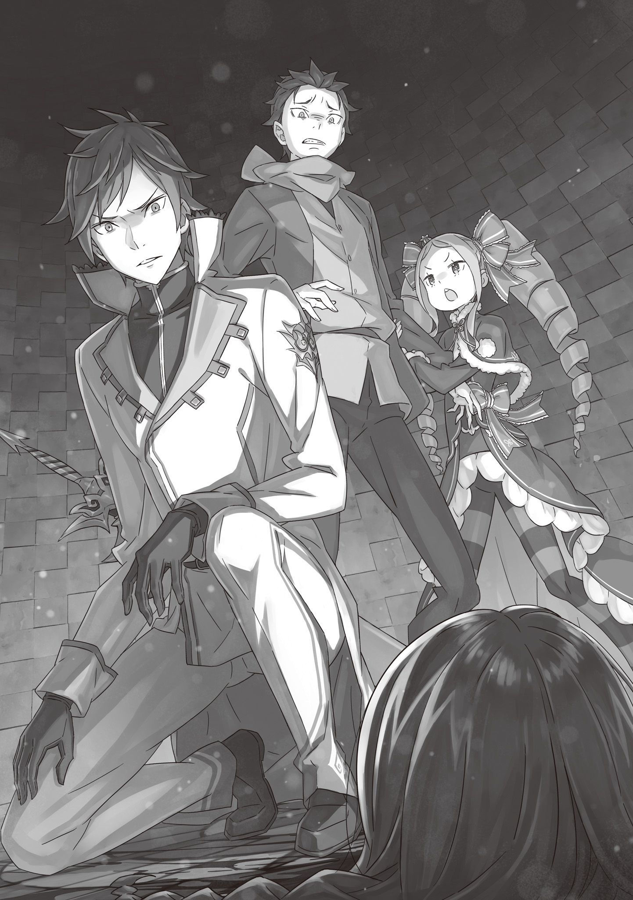
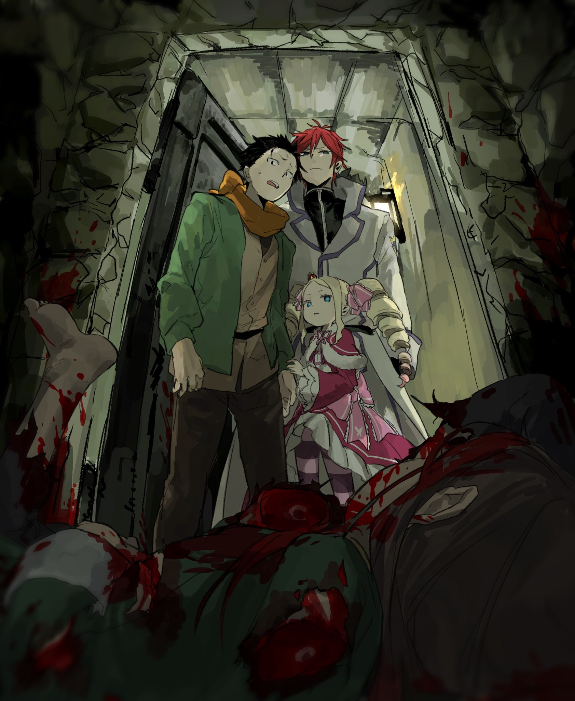

Вся та моральная подготовка, которую Субару вырабатывал перед путешествием с помощью «Райнхарда», оказалась вдвойне бесполезной.

— Возможно, сначала будет чуть непривычно, но вы быстро привыкните, — предупредил Святой Меча.

А затем он просто подхватил драконью повозку вместе с Патраш и … помчался по воздуху. Нет, он буквально рванул ввысь.

— А-ба-ба-ба-ба-ба!..

Пейзаж за окном проносился с безумной скоростью, однако внутри повозки почти не чувствовалось тряски. Из-за этого «визуального бага» черноволосому юноше оставалось лишь в ужасе вцепиться в Беатрис, дрожа всем телом.

Принцип был понятен: по сути, происходящее повторяло эффект Божественной Защиты Заграждения от Ветра, которой обладают земляные драконы. Загвоздка была лишь в том, что источником этой силы был человек, бегущий со скоростью, заставляющей усомниться в здравом смысле мироздания.

— Со мной он уже та~ак делал. Теперь ваша очередь, братец Субару, — спокойно сидя, приговаривала Мейли, подперев щеку рукой. Неудивительно: она-то к таким трюкам уже привыкла.

— И к этому … к этому правда можно привыкнуть? — спросила Петра, в страхе кутаясь в плащ девочки.

Та лишь самодовольно хмыкнула:

— О-о, неужели наша Петрочка чего-то испуга~алась? Как неожиданно.

— Не то чтобы испугалась … — ответила Петра, — просто когда происходит что-то такое нереальное, от такого в дрожь бросает. Я слышала, что Святые Меча — просто нечто, но это уже просто какой-то бред.

— Признаться, я и сам не слыхал, чтобы кто-то из великих предков был настолько … вне рамок, — ответил старик Ром, поглаживая лысину.

Даже его массивному телу, втиснутому в тесное сиденье повозки, этот «Райнхард-экспресс» пришелся не по душе — ради спокойствия он упирался ладонью в стенку. Похоже, в Лагере Фельт такой способ передвижения не был повседневной рутиной, хотя стратегическое преимущество он давал колоссальное.

— Если полагаться на такое вне экстренных ситуаций, — продолжил Ром, — поползут слухи, что Святого Меча используют почем зря, и его авторитет упадет. А падение его престижа — проблема для всего Королевства … Того и гляди, ему не то что выезд за границу, а бег в таком стиле запретят.

— А, этот нелепый «Закон Райнхарда» … — Субару криво усмехнулся, вспомнив специфическое международное право этого мира.

Закон, названный в честь Райнхарда ван Астрея, был создан с единственной целью — удерживать его внутри границ Лугуники. Звучит как шутка, но, глядя на его запредельные возможности, трудно назвать такие меры избыточными. И все же …

— Пускай Райнхард и пипец силен — то есть, он буквально читер ходячий — хотелось бы, чтобы люди видели, что он не будет пакостить другим странам.

— Хо-хо, и это говорит представитель другого Лагеря? Высоко же ты его ценишь.

— Ну, мы же друзья. Обидно будет, если мы все отправимся в кругосветку, а он один останется дом сторожить. В ту же Волакию … хотя нет, в ней ловить нечего. Разве что Флоп и Медиум используют свои связи и построят там парк аттракционов.

Субару на мгновение представил, как они обводят Авеля вокруг пальца или просто убеждают его спустить казну Империи на индустрию развлечений.

— Гарфиэль, а ты чего так вытаращился, в самом деле? — спросила Беатрис.

— Да вот думал: кабы Я так умел, Боссу и остальным жилось бы куда проще. Но, видать, «у каждого свой рог, да не каждый — единорог», — он с досадой лязгнул зубами. — Не смогу я так.

В плане чистой физической мощи он, может, и мог бы потягаться, но без Защиты Заграждения от Ветра такая поездка превратилась бы для пассажиров в филиал ада. Да и Субару не позволил бы использовать своего братана как ломовую лошадь без крайней нужды.

— Вот почему «Райнхард-экспресс» не станет массовым. От одной мысли об этом на душе тяжелеет.

— Приятно, что ты это понимаешь , — прозвучал голос Райнхарда прямо в голове. — Я и сам неохотно прибегаю к такому, если дело не касается жизни и смерти.

— Ты так спокойно включился в разговор … — поразился черноволосый юноша.

Святой Меча разговаривал благодаря Божественной Защите Телепатии, с которой Субару уже сталкивался в Пристелле. Судя по ошарашенным лицам Петры и остальных, на этот раз рыцарь обратился ко всем сразу. Лишь Мейли сохраняла невозмутимость — выказывала свою «закалку».

— Ладно, — продолжил юноша, — шок от бега Райнхарда поутих, но второй удар я еще не переварил. Это правда? Насчет появления этой девушки … Фьоре.

— Да. Это чистая правда.

Хотя Райнхарда не было видно, Субару кожей почувствовал, как тот кивнул.

Юноша тяжело вздохнул в попытке осознать новости, что пришли из Столицы, пока они были в Башне. Произошел контакт с Церковью Божественного Дракона, вместе с чем появилась некая Фьоре, в чьих руках загорелась инсигния. То, что организация, годами не выходившая из тени, внезапно выставила фигуру, которую невозможно игнорировать в Королевских Выборах, заставило Субару, как рыцаря Эмилии, серьезно занервничать. Однако …

— Но то, что госпожу Круш вылечили — просто отлично.

Политические потрясения важны, но лично для него выздоровление этой кандидатки имело большое значение. В Пристелле она пала жертвой Архиепископа Похоти, поразившей ее тело неизлечимым проклятием крови. Чувство вины за то, что он был рядом и не смог ее защитить, долгое время терзало юношу.

— Я бы полностью покрыл себя чернотой, если бы ей это помогло вылечиться.

Она ужасно пострадала. Субару тоже прошел через «кровавое крещение» Похоти, но его последствия были иными: да, его конечности изменились, но, в отличие от Круш, он не страдал от постоянной боли. Разве что иногда пугался собственного отражения в ванной. Юноша был готов забрать ее боль себе, но …

— Она так и не сказала «да».

Круш тогда наотрез отказалась перекладывать ношу на него перед походом к Башне Плеяд. С тех пор он не переставал о ней беспокоиться. И известие о ее исцелении было однозначным благом. Хотя …

— Печально то, что сами спасенные не могут радоваться этому от чистого сердца, — тяжело обронил старик Ром.

И он его понимал. То, что исцеление пришло из рук Церкви Божественного Дракона, ставило Лагерь Круш в крайне уязвимое положение. Даже если жизнь важнее политики, Субару не мог просто отмахнуться от последствий.

— Но появление этой Фьоре … У нее ведь светлые волосы и красные глаза, да? — спросила Петра. — Это ведь не к добру?

— О~ох, еще бы. Только-только одно место в Выборах освободилось, как его тут же заняли, — съязвила Мейли. — Мы возвращаемся к началу.

— Мейли, подбирай слова, а то я разозлюсь, — глаза девочки опасно сверкнули. — Мы ради этого в такую даль тащились.

— Хоть тот шлемоголовый все и испортил … Ладно, ладно, не злись. Я виновата, каюсь, — шутливо извинилась Мейли.

Петра же вздохнула и продолжила:

— Дело не в количестве мест. Фьоре … золотоволосая и красноглазая. Это ведь …

— Это признаки Королевской Семьи Лугуники, да? — продолжила Мейли. — И имя принцессы, которую похитили пятнадцать лет назад … кажется …

— Фьоре, — закончил за нее старик Ром.

Все взгляды скрестились на нем. Старик смотрел на свои колени и негромко произнес:

— Дочь младшего брата короля, которая пропала пятнадцать лет назад из Замка, звалась Фьоре. Точно так же, как и эта монахиня из Церкви.

— И она заставила инсигнию сиять на глазах у всех, я полагаю, — добавила Беатрис. — Если это правда, то неудивительно, что все Выборы пошли кувырком, в самом деле.

В повозке воцарилась тяжелая, гнетущая тишина. Но Субару, решив нарушить атмосферу, подал голос:

— Слушайте, а мне это кажется каким-то … сомнительным.

— Сомнительным? — отозвался Райнхард. — В плане?

— Я уже привыкаю общаться с голосом в голове, но … вас всех ведь волнует, что эта Фьоре может быть настоящей принцессой, да? Раз инсигния сияет, значит, кровь настоящая.

— Да, Субару. Что же здесь не так?

— Ну, послушайте … разве у Фельт не точно такой же случай?

К сожалению, он не слышал официальной речи Фельт в день начала Выборов — его тогда с позором выставили из Тронного зала. Но позже ему пересказали все до мельчайших подробностей. Вопрос о выжившей принцессе стоял уже тогда.

— Ситуация один в один, — продолжил юноша. — Лично мне больше по душе история, как принцессу тайком вывезли из Замка, после чего она росла среди простолюдинов. Это звучит круче. Потому я за Фельт.

— Хм, вот оно что, — ответил старик Ром. — Но Субару, если Фельт официально признают принцессой, Выборы закончатся ее победой. Ты понимаешь это?

— Э? — Субару вытаращился на него. Он ждал, что это шутка, но никто не засмеялся. Похоже, все были согласны со стариком. — Стоп-стоп-стоп, почему?!

— Да потому что это очевидно, балда! — вклинился Гарфиэль. — Выборы же затеяли только потому, что короли кончились. Если выяснится, что законный наследник жив-здоров, то по логике вещей он и должен сесть на трон!

— Т-то есть … престолонаследие важнее Выборов?

— Хотелось бы подобрать слова помягче, но … да, это так , — подтвердил Райнхард.

Получив «выговор» от двух сильнейших бойцов группы, юноша осознал пропасть между своим менталитетом и логикой этого мира. Для Нацуки Субару, рожденного в современной Японии, выборы лидера казались чем-то естественным. Сама система Королевских Выборов виделась ему аналогом демократического процесса. Но для жителей этого мира естественным было иное: за королем следует принц, за принцем — его дитя. Если Фельт — истинная кровь, то Выборы теряют легитимность.

— Значит, если бы Фельт признали сразу, все было бы плохо?!

— Пока это оставалось на уровне слухов, Выборы продолжались. Субару, ты точно рыцарь той леди? — старик Ром с сомнением взглянул на него.

— Заткнись! — воскликнул он. — Просто я … немного не в ладах с местными традициями! Зато у нас есть Беако, Петра и Гарфиэль — молодая элита. Вот они и заполняют мои пробелы!

— Поправлю: прелестная и очаровательная Бетти тут самая взрослая, я полагаю, — Беатрис, сидевшая на коленях у Субару, гордо выпятила грудь.

— Ладно, признаю, облажался с матчастью. Но мой вопрос остается в силе. Допустим, принцесса на троне — это финал игры. Но ведь сомнения в личности Фьоре такие же, как и с Фельт. Значит …

— Значит, нужно выяснить, кто из них настоящая . — Голос Райнхарда в голове прозвучал пугающе спокойно. В нем не было эмоций, но Субару почудилось острие клинка, приставленное к горлу.

Выяснить, кто настоящая …

— Недоказуемые подозрения позволяли Выборам существовать до сего дня. Но когда претендентов двое, игнорировать это нельзя. Придется учитывать, что кто-то пробрался в Выборы со злым умыслом, — рассудил Ром.

— Злой умысел … Но даже если одна из них — настоящая, это не делает вторую «злодейкой»! Может, это просто совпадение? Золотые волосы, красные глаза …

— Таких совпадений не бывает, в самом деле. Это уникальные черты рода Лугуника, — отрезала Беатрис.

— Но инсигния светилась у обеих!

Субару начал заводиться. Логика Рома и Беатрис была безупречна, и ему оставалось только взывать к чувствам. Он и сам не до конца понимал, почему так бурно реагирует. Возможно, дело было в том, что Фельт — одна из первых, кого он встретил в этом мире. Он не хотел, чтобы ее путь и ее усилия перечеркнули просто из-за «чистоты крови». И в то же время ему претила мысль заранее считать Фьоре врагом.

— Если им так нужен наследник, почему они не провели какой-нибудь тест ДНК еще тогда, когда появилась Фельт?! Вместо этого начали Выборы, заставили Эмилию и всех остальных проходить через это …

— Субару … — Беатрис обеспокоенно коснулась его руки.

Он крепко зажмурился, тяжело дышал, сердце колотилось от гнева. Эмилия, Фельт, Круш, Анастасия, Присцилла — все они поставили на кон свои убеждения и жизни. И теперь правила игры хотят поменять из-за внезапного вмешательства?

— Раз так …

— Раз так, то что? — спросила Беатрис.

— Устрою демонстрацию протеста вместе с Райнхардом за продолжение Выборов … — закончил Субару.

— Хм, любопытно.

— Ничего не любопытно! Не смей говорить такие ужасы! — Ром не на шутку перепугался. — Субару, не вздумай подначивать Святого Меча, а то он ведь реально это сделает!

— А я поддержу! — рявкнул Гарфиэль.

— Гарф, помолчи, и так все сложно! — цыкнула на него Петра.

Субару выдохнул. Конечно, это была наполовину шутка, но решимости ему было не занимать.

— В Столице будет полно дел … Такое чувство, что я уже полгода вкалываю без выходных.

— Это только цветочки, я полагаю, — парировала дух. — У Бетти ощущение, будто она без остановки пашет уже одиннадцать с половиной лет, в самом деле.

— Не говори таких жутких вещей, у меня мозг закипит …

Благодаря подколкам Беатрис напряжение немного спало. Субару прикинул список дел: Эмилия, исцеленная Круш, загадочная Фьоре, Совет Мудрецов, магическая сфера на шее … Но первым делом …

— Субару, мы на месте , — доложил Святой Меча.

— Что? Уже? Извини за этот крюк.

Стиль передвижения Райнхарда действительно поражал. Может, Сесилус и бегает быстрее, но у него вряд ли хватило бы сил тащить на себе повозку, так что на «Сесилус-экспресс» можно и не рассчитывать.

Пейзаж за окном обрел четкость, движение замедлилось. Повозка мягко коснулась земли.

— Да что здесь происходит?! — раздался возмущенный голос снаружи.

Субару пулей выскочил из дверей, едва не выронив Беатрис.

— Нья! — выкрикнула она.

На улице стоял Райнхард — ни капли пота после марафона с повозкой. И рядом — Патраш, выглядящая так, будто она только что совершила полет в бездну … А перед воротами знакомого поместья Розвааля, вылупив глаза на безумное появление повозки, стояла девушка с голубыми волосами.

Субару, разглядев ее, рухнул на колени и схватился за сердце.

— Угх!..

— Субару?! Что такое, в самом деле?! — Беатрис засуетилась вокруг него. Она похлопывала его по голове и плечам.

Он позволил ей это делать, но сердце пронзила боль от увиденного зрелища. Потому что перед поместьем Розвааля, встречая их, стояла …

— Только сейчас я понял … как же мне не хватало этого твоего вида …

— А вы, как всегда, верны себе, где бы мы ни встретились, — вздохнула девушка. На ее лице смешались усталость и облегчение.

Это была Рем. В своей форме горничной.

Субару уговорил Райнхарда сделать крюк до поместья Розвааля по пути в Столицу. Цель была очевидна: он хотел, чтобы Рем присутствовала при разговоре с Лоем Альфардом — Архиепископом Чревоугодия, который сейчас томился в тюрьме. И это была одна из причин поездки — вернуть Воспоминания.

— Не верю, что с Чревоугодием можно договориться по-хорошему, но Ал как-то вытянул из него Воспоминания, — размышлял юноша. — Значит, способ есть. Я уже пропустил встречу Рам и Рем … Если я пропущу момент возвращения памяти Рем, я этого не переживу!

Райнхард, несмотря на спешку вернуться к Фельт, не раздумывая согласился. Субару был готов ради такого друга на все, но вот таскать на себе повозку за сотни километров он бы точно не взялся.

Более того, Райнхард пошел еще дальше.

— Прости, что втянул тебя в это.

— Не стоит. Хотя я этого не помню, я тоже жертва Чревоугодия. Говорят, я забыл близкого друга.

— Ага … Этот самый «друг» вроде как даже обрадовался. Сказал, что раз ты забыл его приемы, у него есть шанс тебя победить.

— Вот как … Что ж, это звучит многообещающе, — Райнхард искренне улыбнулся.

Субару мысленно извинился перед Юлиусом за то, что, возможно, лишил его единственного козыря и разжег в Святом Меча азарт. Хотя … зная Юлиуса, тот сам бы раскрыл все карты, посчитав нечестным пользоваться амнезией противника.

Он пытался занять голову всякой ерундой, настолько тяжелая атмосфера царила в этом месте.

И вот, они подошли к массивному зданию.

— М-да … Тюремная Башня оправдывает название, — пробормотал Субару. По его лбу скатилась капля холодного пота — нормальная реакция организма на атмосферу этого места.

Этот каменный шпиль, что возведен в верхнем ярусе Королевской Столицы Лугуника, недалеко от Замка, — место для самых опасных преступников Королевства. Разумеется, тяжелые железные двери каждой камеры были наглухо закрыты, чтобы никто не мог просто так увидеться с узниками — совсем не как в манге, где заключенные сидят за решеткой.

Субару, зайдя внутрь, ощутил смесь облегчения и разочарования в пропорции семь к трем.

— Ребята на Гинунхайве тоже были преступниками, но они казались … попроще, что ли, — пробормотал он.

Трудно назвать это местным колоритом, но преступления Хиайна, Вайца, Идры и других его товарищей по Острову были, в основном, связаны с буйством, без подлой, липкой злобы, какая чувствуется здесь. Конечно, некоторых, как Хиайна, туда швырнули безжалостно, сделали Гладиаторами, но даже так называемые тяжкие преступления там сводились к разнице между «немного побуянил» и «сильно побуянил».

Здесь же, в Тюремной Башне, воздух был пропитан совершенно иным, тошнотворным запахом крови, который Субару, знавший Остров Гладиаторов, сразу уловил.

— Здесь, наверно, немало тех, кто связан с Культом? — спросил юноша.

— Да, — ответил Райнхард. — Учитывая, что в основном они действуют в Лугунике, это логично. Кстати, Гнев тоже здесь, в подземелье.

— Подземелье … Подальше от Чревоугодия, значит.

— Меры предосторожности. К Гневу нельзя подпускать людей. Даже других заключенных.

Полномочие Архиепископа Гнева, Сириус Романе-Конти, подобно инфекции: передается по воздуху и захватывает эмоции людей, стоит им попасть под ее влияние. Учитывая это, даже если ее полностью сковать, это не даст полных гарантий. На самом деле, казалось, что часть этой гнетущей атмосферы в этой Башне исходит именно от нее.

— Хоть и чувствую к ней отвращение, — заговорил Субару, — но нам придется поговорить и с ней, рано или поздно.

— Тогда позови меня, — поддержал его Райнхард. — Я буду рядом, как и сейчас.

— На тебя можно положиться.

Как же, однако, хорошо, когда у тебя есть друг, который бьет себя в грудь и берет на себя ответственность. Правда, в случае с Сириус сила Райнхарда может сыграть злую шутку — тут нужна осторожность. Так или иначе, сегодня они пришли не к ней. Так что пусть пока наслаждается холодным воздухом подземелья. Вместо этого …

— Сюда, пожалуйста, — стражник указал на одну из дверей. Его лицо было аж бледным от напряжения, но вместе с тем в нем читался профессионализм — идеальный баланс.

Субару кивнул ему и уставился на дверь … Один ее вид веял тяжелым холодом. За ней покоился Архиепископ Греха Чревоугодия.

— Хотя он сейчас запечатан так же, как и «Ал-шарик», так что вряд ли он в сознании.

Субару вспомнил свои ощущения внутри черной сферы — будто в теплой воде, где мысли путаются и затихают. Он был бесконечно благодарен Беатрис за то, что она разгадала механизм запретной магии ради него, и даже хотел бы вручить ей премию «Лучшая девочка года», но список номинанток в его голове был слишком велик.

Он схватился за щечки Беатрис и начал их тискать.

— Субару? Что ты делаешь, в самом деле?

— Ну, просто награду «Лучшая девочка года» я вручить сейчас не могу, так что держи аванс …

— Не отвлекайся, я полагаю. Сначала дело, а потом делай что хочешь, в самом деле, — строго одернула она его, хотя и не отстранилась. Ибо раскусила, что тот делает это из-за тревоги.

— Да, ты права.

План был таков: Беатрис — впереди, Райнхард — в тылу. Это была идеальная формация, какую он смог придумать. Жаль, конечно, что без Рем, но вряд ли все решится за один разговор. Убеждение — или угрозы — в адрес Чревоугодия потребуют настойчивости и времени.

— Он запечатан Магией Тьмы, так что без Беако не обойтись, — сказал Субару.

— Положись на Бетти, я полагаю, — ответила Беатрис. — А если этот гаденыш решит брыкаться сразу после разморозки … Святой Меча, разделай его, в самом деле.

— Да, понял, — ответил рыцарь. — Он и пальцем вас не коснется. Будьте спокойны.

— И правда, становится спокойнее. Ну, тогда …

Субару кивнул стражнику — скрежетнул тяжелый засов, и дверь медленно отворилась. Он сжал кулаки, готовясь увидеть в темноте камеры черный монолит, в котором застыл Лой Альфард. Они заставят его выплюнуть все: и Воспоминания Рем, и Имена с Воспоминаниями тысяч жертв.

Битва слов с Архиепископом — это всегда испытание на прочность рассудка, но Субару был готов.

— А?..

Задержавший дыхание, он в ожидании решительного шага выдохнул. Глаза уже начали привыкать к полумраку помещения, однако то, что он там застал, было вовсе не тем, что он ожидал.

Здесь Лой Альфард должен был быть вмурован в черную плиту монолита, подобно образцу из коллекции.

— …

Субару остолбенел не в силах ничего понять. Райнхард его мягко отстранил и вошел в камеру первым, а Беатрис, что была подле него, привалилась к нему … нет, она его поддерживала. Потому что ноги его подогнулись, и он был готов рухнуть.

Райнхард, пройдя дальше, рассмотрел то, что было разбросано по ледяному полу тюремной камеры. Он покачал головой и вымолвил:

— Увы, он мертв.

У ног Святого Меча в кровавом беспорядке валялись останки Архиепископа Греха Чревоугодия — «Обжоры», Лоя Альфарда. Вырванные конечности истерзанного тела валялись грудой мяса.

