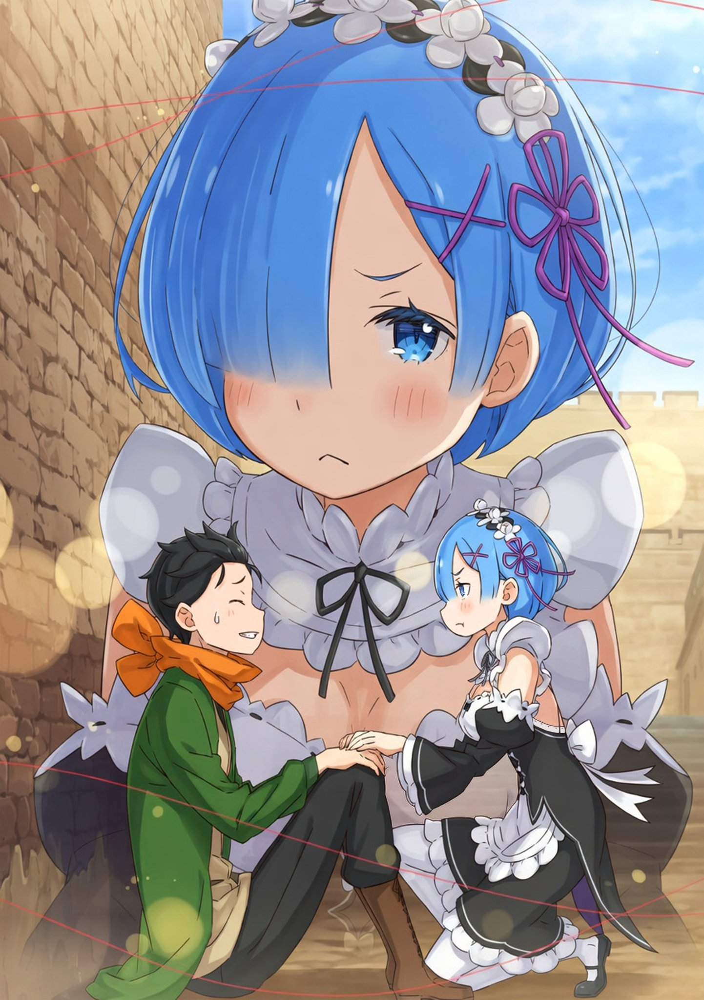
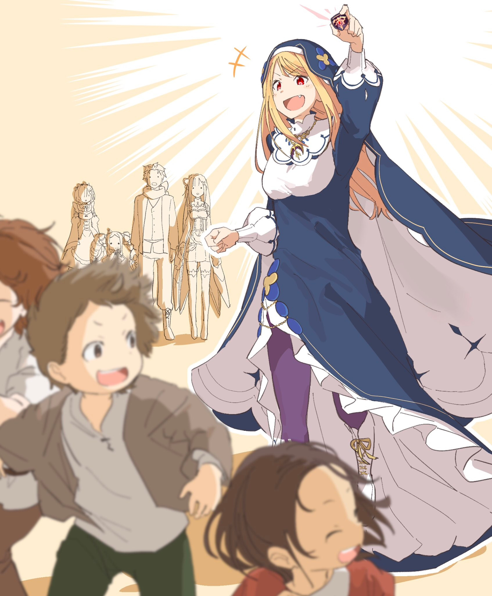

В Тюремной Башне на время воцарился хаос: люди с побледневшими лицами в спешке сновали туда-сюда. Субару издали наблюдал за этой картиной. Он сидел спиной к крепостной стене, обхватив колени руками.

— …

Юноша уперся лбом в колени и глубоко выдохнул.

Слишком много шокирующего навалилось разом. Субару не был готов к виду ужасающего трупа, так и останки эти к тому же оказались …

— Ты как? — послышался голос над головой.

Юноша приподнял лицо и увидел Рем. На ее лице было написано волнение. Девушка присела рядом и взглянула ему пряма в глаза. Она протерла его понурое лицо своим носовым платком.

От чувства холодной, влажной ткани Субару стало легче.

— Прости, — выдохнул он.

— Не надо извиняться … Говорят, внутри ты увидел что-то ужасное.

— Да уж. Я не хотел, чтобы ты с ним виделась, но теперь понимаю — хорошо, что я оставил тебя ждать снаружи. Тебе не стоило этого видеть.

— Не нужно меня так опекать. В Волакии я видела немало смертей. Меня уже мало чем можно напугать …

— Понимаю. Но если бы было можно, я бы все равно не дал тебе что-то такое видеть лишний раз. Бывают смерти ради чего-то важного, когда человек до конца верен своим убеждениям … Но это не тот случай. На такое вообще никому не стоит смотреть.

Субару не отрицал значимость смерти, если она была итогом прожитой жизни. Если бы он думал иначе, то не смог бы так молча отпустить Присциллу. Однако то, что он только что увидел в Тюремной башне — кошмарная кончина Лоя Альфарда, Архиепископа Греха Чревоугодия, — не имело ничего общего с благородством. Это было нечто уродливое и омерзительное. В том, чтобы лишить кого-то жизни, а затем так надругаться над телом, нет смысла. За этим стоит либо злой умысел, либо такая запредельная ярость, что человеку мало просто убить — ему нужно терзать даже бездыханное тело. Конечно, Архиепископы заслужили ненависть всего мира, но такой участи не пожелаешь никому.

— Проклятье … — он сокрушенно цыкнул. В груди клокотала досада. Злость на того, кто растерзал Лоя, смешивалась с горечью от того, что разгадка Полномочия Чревоугодия снова ускользнула от них.

Честно говоря, он не мог не думать об этом. Если бы они с Райнхардом не мешкали и сразу поспешили в Столицу, возможно, Лой был бы жив. И ведь у него был способ это проверить. Наверное, прежний он, с его «имперским менталитетом» времен инфантилизации сделал бы это без колебаний. Но …

— Ал … — юноша сжал висящий на шее «Ал-шарик» и прикусил губу.

Если он сейчас погибнет и сработает Посмертное Возвращение, то, скорее всего, снова окажется в Сторожевой Башне Плеяд — в тот момент, когда он заточил Ала с помощью Оль Шамака. Возможно, точка сместилась, но по ощущениям это было его последнее «сохранение» … Да и Нацуки Субару просто не мог заставить себя вернуться в то время. Он не мог снова пройти через тот момент, когда ему пришлось запечатать Ала.

— …

Дело было не в ограничениях магии. Просто у него не хватало мужества снова столкнуться с ним. Он боялся, что если попробует переубедить его словами, то даст слабину, не сможет остановить его вовремя — и в итоге Ал снова его запрет. А если это случится, исправлять его ошибки опять придется друзьям. Именно поэтому он не мог решиться на бездумный прыжок в смерть.

Но как же Рем? Как же жертвы Чревоугодия?

— И снова ты пытаешься все делать сам …

Субару вздрогнул, и Рем накрыла его руку, сжимающую «Ал-шарик», своей. Она с прищуром пристально посмотрела ему в глаза.

— Скажу одно, — вымолвила она. — Пожалуйста, не надо ставить целью возвращение моих Воспоминаний. Это моя проблема. И мне не по себе, что ты за это волнуешься больше, чем я.

— Но … ты не понимаешь, — ответил он. — Я должен вернуть их тебе.

— Вот в этом и ошибка. Почему над моей проблемой больше всего голову ломаешь ты? Это мои трудности. Не делай их только своими.

— Это … — Субару отвел взгляд. Он не знал, что ответить.

В памяти всплыли то, как она ему сказала в Городе-Крепости: «Ты не герой». Тогда по спине пробежали мурашки от мысли, что он может лишиться даже права бороться ради нее.

— Прошу, — произнесла Рем, — не надо смотреть на меня как на щенка какого-то побитого.

— А?

— Нет, «щенок» не совсем подходит. Щенки милые, даже когда промокнут. Ты сейчас больше похож на … на мокрого дракона.

— Ну, мне бы больше хотелось, чтобы меня называли крутым, а не милым, но «мокрый дракон» — это как-то не очень.

— Это и не был комплимент. И не пойми меня неправильно, — она сделала паузу, подбирала слова, а потом продолжила ровным тоном: — я примерно понимаю ситуацию. Тот человек, который был здесь заперт и еще как-то связан со Спикой … он мог вернуть мои Воспоминания. Но он умер, и поэтому ты так расстроен. Куда сильнее, чем я, хотя это касается меня напрямую.

— Да … звучит так, будто я нереальный эгоист.

— Наконец-то ты начал трезво мыслить, — спокойно отрезала Рем.

Субару почувствовал, как удушливое чувство вины понемногу отступает. Завидев это, девушка едва заметно улыбнулась.

— Я тоже расстроена. Казалось, еще чуть-чуть — и я все вспомню … но когда я вижу, как ты убиваешься из-за этого, мне становится не до своих страданий.

— Э-э … ну, я рад, что ты не грустишь.

— Что, прости? Зато ты грустишь за двоих, из-за чего все волнуются!

— Прости-и-и! — Субару в шутливом отчаянии схватился за голову.

Надо же, его обвинили в краже права на депрессию. Но юноша не врал — он правда хотел бы, чтобы у Рем и Эмилии никогда не было повода грустить.

— Вот это мне и не нравится, — сказала девушка. — Решил, что должен страдать один ты.

— Рем …

— Да, это твоя плохая привычка — думать, что во всем виноват ты. Потому и решить все пытаешься сам … Может, хватит уже?

— Ты хочешь сказать … чтобы я не мучился один?

— Я с самого начала это говорю.

— Да?! Наверное, и правда говорила … Точно, говорила. Я болван — не заметил! Ну я и дурак! — Субару начал картинно колотить себя по макушке.

Внутри шевельнулось новое чувство вины — Рем ведь искренне за него переживала, а он, закрывшись в себе, даже не смог сразу принять ее доброту.

— Прости, — снова извинился он. — Я потащил тебя сюда с такой надеждой, а в итоге только зря обнадежил.

— Я не думаю, что это ты виноват. Просто …

— Просто?

— Теперь Спике станет еще труднее.

Двое из Архиепископов Чревоугодия — Лай Батенкайтос и Лой Альфард, «Гурман» и «Обжора» — мертвы. Теперь единственной обладательницей этого Полномочия осталась Спика. Это значит, что все надежды на возвращение Имен и Воспоминаний теперь возложены на ее плечи. И Рем волновалась, не станет ли это давление для девочки невыносимым.

— Самой Спике вряд ли покажется это обузой … — обнадежил Субару. — Но я свяжусь с Авелем, чтобы за ней присматривали. Попрошу Сеси, чтобы он был настороже. Хотя, сможет ли он — другой вопрос.

— Да.

Трагедия, случившаяся с Лоем, могла повториться. Он разделил опасения Рем и решил действовать через Волакию. Нужно сделать все возможное, чтобы Спике, оставшейся в Империи, ничего не угрожало. Даже будь это чрезмерная опека — так станет спокойнее.

К ним подошел Райнхард, только что вышедший из башни, рядом с которым семенила Беатрис.

— Извиняюсь за ожидание, — сказал он.

Субару вскочил и отряхнулся.

— Райнхард, как там внутри? — спросил юноша. — Что с Сириус?

— К счастью — если тут уместно это слово — мои догадки подтвердились, — ответил Святой Меча. — С ней все в порядке. Одиночные камеры в подвале полностью изолированы, она даже не знала, что в этой же башне держали Архиепископа Чревоугодия. И не только она — никто из остальных заключенных не пострадал.

— Сириус и остальные целы … Что ж, по крайней мере, это проясняет ситуацию, — Субару угрюмо кивнул.

Значит, у преступника была одна-единственная цель:

— Архиепископ Чревоугодия, — произнесли они оба в унисон.

Судя по обстановке на месте преступления, других вариантов не оставалось, но все же вопросы оставались.

— Беатрис говорила, что убить его было не так-то просто, да? — спросил Субару.

— Мы все проверили. Мои слова подтвердились, я полагаю, — Беатрис подошла к нему и взяла его за руку. Она внимательно заглянула ему в лицо. — Тебе стало хоть немного лучше, в самом деле?

— Не то чтобы совсем хорошо, но полегчало. Прости, что свалил на тебя осмотр места происшествия.

— Бетти сама вызвалась, я полагаю. К тому же, живым нет дела до мертвецов. Бетти может лишь дать оценку с точки зрения Великого Духа, в самом деле.

— Мне было бы очень интересно послушать, — вставил Райнхард. — Я в подобных тонкостях не силен.

Все трое выжидающе посмотрели на девочку. Она важно кашлянула, словно профессор перед аудиторией:

— Чревоугодие было запечатано Магией Тьмы, я полагаю. Мы с Юлиусом это сделали вместе, так что пробить такую защиту было бы практически невозможно. Обидно, что я сама не додумалась до такой продвинутой формы печати, в самом деле.

— Стража башни подтвердила это, — добавил Райнхард. — Заключенный был полностью неподвижен, словно превратился в каменную плиту — монолит.

— К такому объекту нельзя подступиться ни изнутри, ни снаружи, — продолжила Беатрис. — Чтобы снять печать, нужно виртуозно владеть Магией Тьмы, я полагаю.

— И это еще не все, — накинул Райнхард. — Мало просто вытащить его из монолита. Нужно было еще справиться с Лоем, который наверняка сразу пошел бы в атаку. Справиться и …

— … убить. То есть, действовать в два этапа, — закончила Рем.

Все замолчали — обдумывали ее слова … Чтобы убить Лоя в состоянии монолита, преступник должен был хорошо владеть как Магией Тьмы, так и силой. Да такой, чтобы прикончить Архиепископа. Таких людей в мире — раз-два и обчелся.

— К тому же, убийца незамеченным миновал всю охрану, — сказал Святой Меча. — Мастер Магии Тьмы, сильный боец и эксперт по скрытности … Найти такого человека — как иголку в стоге сена.

— Мне просто хочется верить, что это Ольбарт, — проворчал Субару.

Увы, даже Порочный Старик не владел Магией Тьмы. Хотя, если бы оказалось, что у синоби есть какая-нибудь секретная техника, он бы не сильно удивился.

— Волакийцы — народ воинственный, — рассудил Райнхард, — но в нынешнем положении они вряд ли станут рисковать отношениями с Королевством. К тому же, приезд госпожи Эмилии в Столицу напрямую связан с делами Империи.

— Это точно, — отметил Субару. — Проще поверить в то, что волки из Волакии стали капельку умнее, чем в то, что они решили самоубиться. И все же, прости, Райнхард. Все вышло наперекосяк.

— «Прости»? Тебе не за что извиняться предо мной.

— Ну как же. Ты сделал крюк ради нас, договорился о проходе в башню … А в итоге — пшик. И … — он наткнулся на ледяной взгляд Рем, — а …

Опять он за свое — винит себя во всем подряд. Слова застряли в горле.

— Результат плачевный, я полагаю, — пришла на помощь Беатрис. — Но мы благодарны за твои усилия, в самом деле.

— Вот! — воскликнул Субару. — Слышали? Золотые слова моей Беако! Что скажешь, Рем?

— Ха-а … — та лишь тяжело вздохнула.

— Опять вздохи!

Юноша закрыл лицо руками. Райнхард, глядя на эту сцену, не выдержал и слегка улыбнулся.

— Пустяки, — сказал Святой Меча. — Ю а вэлкам.

В одной из комнат Королевского особняка Эмилия выслушала отчет.

— Вот как … Значит, Чревоугодие … Как же обидно, что все вечно идет не так, — сказала она, печально опустив взгляд.

Полуэльфийка выглядела бледной и измотанной — редкое зрелище для всегда энергичной Эмилии. Субару чувствовал укол совести, понимая, что в ее усталости есть и его вина.

Попрощавшись с Райнхардом, который вернулся к Фельт, он в сопровождении Рем и Беатрис отправился в особняк, где остановилась их группа. Там уже собрались почти все члены Лагеря Эмилии, кроме Розвааля и Фредерики, которые уехали в поместье Бариэль вместе с Шультом.

И, конечно же, розоволосая горничная тоже была здесь.

— Примчались в спешке в Столицу, и все впустую, — отрезала Рам. — Славно же ты нас обнадежил, Барусу.

— Вообще-то, всем остальным тоже жаль, — ответил юноша, — но моя грусть вне конкуренции. Еще чуть-чуть — и зарыдал бы кровью.

— Ха! — плеснула Рам. Ее язвительность зашкаливала. — Кровью? Это просто сосуды лопнули в глазах. Если хочешь, Рам может устроить тебе такие прямо сейчас.

— Сил моих нет! Ты чего такая злюка сегодня?

Разумеется, узнав о цели поездки в Столицу, она настояла на том, что поедет с ними — сестра не могла пропустить момент возвращения Воспоминаний Рем. Субару был только за. Но, видимо, месяцы скитаний от Башни до Империи дали о себе знать. Рам держалась на чистом упрямстве, и когда надежда рухнула, ее силы иссякли.

Огрызнувшись на него напоследок, она под присмотром Рем и Петры отправилась в кровать — приходить в себя.

— Впрочем, не только госпожа Рам сейчас не в духе. У нас у всех голова кругом. Проблемы господина Нацуки и остальных, убийство в тюрьме, появление Церкви Божественного Дракона … И довеху — хаос в Королевских Выборах, — посетовал Отто.

Он прибыл в Столицу раньше Субару и должен был подробно доложить в Замке о Великом Бедствии в Империи. В его задачи также входило обсуждение соглашений между Королевством и Империей, доверенных ему Авелем. Это была важная миссия, которой он гордился … И тут на него внезапно свалился ворох проблем, к которым никто не был готов. У Субару даже не нашлось слов, чтобы подразнить его.

Пока он раздумывал, с чего начать разговор …

— Расскажешь про Ала?.. — Эмилия, словно прочитав его мысли, выбрала первую тему.

Флам, служанка Фельт, благодаря своей Божественной Защите могла передавать информацию сестре на любом расстоянии. Через нее они уже знали вкратце, что произошло в Башне Плеяд. Но Субару изложил все в деталях: поиски Книг Мертвых, предательство Ала той ночью, то, как ему пришлось его запечатать … и то, что они так и не узнали, зачем он это сделал. Но также и о том, что, несмотря на все это, он не собирался просто так вычеркивать Ала из своей жизни.

— Да … то же самое на душе, что и у Субару. Это будет правильно, — Эмилия грустно кивнула, глядя на «Ал-шарик».

В дороге он уже обсуждал это с Беатрис и Петрой. Теперь его позицию знали Эмилия и Отто, который сидел с таким видом, будто съел лимон.

В помещение зашла Рем, вернувшись от Рам, которую уложила спать.

— Ал любил госпожу Присциллу. Я не вправе его судить, — тихо сказала она.

На этом вопрос был временно закрыт. Субару звонко хлопнул себя по щекам. С Алом и тюрьмой пока ничего не поделать. Значит, осталась последняя тема …

— Давайте поговорим о Фьоре из Церкви Божественного Дракона, — вымолвил Субару.

Воздух в комнате мгновенно переменился. Но это было не напряжение, а скорее глубокое недоумение.

— Что вообще говорят в Замке? — продолжил юноша. — Про то, что Церковь влезла в политику и появилась шестая кандидатка, и еще про то, что ее имя, которое такое же, как у пропавшей принцессы … Это же все как гром среди ясного неба.

— Ну … сейчас в Замке только об этом и спорят, — ответила Эмилия. — С одной стороны, Церковь нарушила правила, но они ведь сделали это, чтобы помочь тем, кому не поздоровилось в Пристелле? Разве это плохо? К тому же …

— Они вылечили госпожу Круш … — закончил Субару. — Эмилия-тан, Отто, вы сами видели?

— Да, мы видели. Правда, Отто?

— Рассматривать даму в деталях было неучтиво, — ответил тот, — но, насколько я мог заметить, те черные пятна на ее коже исчезли.

Он мельком взглянул на ноги Субару. Намек был понятен: если Церковь может исцелить Круш, то и ноги Субару — тоже. Честно говоря, шрамы ему не мешали, но каждый раз в купальне он чувствовал неловкость перед друзьями, так что от лечения он бы не отказался.

— Но брать что-то у Церкви Божественного Дракона … как-то боязно. Ой!

— Ой, бра~атец, чего это ты задрожал? — подколола его Мейли.

— Да так … опять вспомнил, что мне нельзя все решать самому, а то отругают …

— Раз понимаешь, веди себя увереннее, — вздохнула Рем.

Юноша неловко откашлялся. Брать на себя обязательства перед подозрительной организацией ради личной выгоды ему не хотелось.

— Слушайте, — подал голос Гарфиэль, сидевший на подоконнике. Он в раздумье почесал затылок. — Я понимаю, что там всякие терки и прочая муть, но я скажу только то, что думаю.

— Гарфиэль … Да, мы слушаем.

— Если они могут вылечить людей в Пристелле, Я хочу, чтоб это сделали как можно скорее. Вся эта жопа с черными драконами и мухами … людям и так херово пришлось.

Он говорил искренне. В Пристелле у него осталась семья, с которой он сблизился. Отец того семейства во время битвы был превращен Похотью в черного дракона. Сейчас он, как и другие жертвы, спит в ледяном плену Эмилии в одном из районов города. Если их можно спасти, ему было плевать, чьими руками это будет сделано.

— Я согласен, — произнес Субару. — Если кому-то можно помочь, то неважно, кто это сделает.

— Ого, Субару заговорил как здравомыслящий человек? — вставила Петра. — А ведь раньше ты так и рвался спасать сестричку Рем в одиночку.

— Было такое … И как ты только все помнишь, Петра?!

— Я не забуду. Мне тогда было обидно. Я даже подумала, что Рем слишком везет, но я все равно не сдамся, — она озорно надула губки.

Субару только и оставалось, что почесать в затылке. Да, до того как Рем проснулась, он говорил, что неважно, кто её разбудит, лишь бы она проснулась, но при этом бахвалился, что хочет сделать это сам. Сейчас даже немного страшно смотреть в ее сторону, а то кто знает, какую мину она там давит? Впрочем, сейчас важнее было будущее.

— Как бы ни прошли переговоры в Замке, раз Церковь доказала, что вылечить людей можно, то ведь с жителями Пристеллы так и сделают?

— Скорее всего, — ответил Отто. — Даже если споры затянутся, отказать людям в лечении никто не посмеет. Вопрос лишь в том, какую цену за это заломит Церковь.

— Шестая кандидатка, Драконья Жрица …

В конечном итоге, судьба этой девушки была вне их власти. Позиция Лагеря Эмилии будет зависеть от того, что решит Совет Мудрецов. Но Субару не давала покоя сама Фьоре.

— Эмилия-тан, ты ведь видела ее. Какая она? — спросил юноша.

— Ну … — протянула полуэльфийка, — мне показалось, что она очень старательная и добрая девочка.

— Понятно. А что ты думаешь о Мейли?

— О Мейли? Я думаю, что она очень заботливая, любит друзей и вообще умница.

— Братец, я понимаю, к чему ты клонишь, но не надо использовать меня как пример, — фыркнула Мейли.

Субару не то чтобы не доверял суждениям Эмилии, но в ее глазах почти каждый был «старательным и добрым». Хотя с Мейли она была права, так что это не показатель. Может, было бы точнее узнать мнение Абеля.

— Отто, а ты что скажешь? — спросил Субару.

— Я с ней и не общался толком, — ответил тот, — но Фьоре показалась мне очень набожной. И она честно считает, что служение людям — высшее благо, и …

— И?

— И … она немного безрассудная. Говорят, она все делала по своему желанию, вопреки воле Церкви.

— По своему желанию? И спасение Круш, и свечение инсигнии?

— Ну, если первое — полностью да, то второе — оно как бы и само произошло. Но выглядит это все так, будто Церковь Божественного Дракона хотела скрыть ее.

— М-да …

Действительно ли Фьоре — пропавшая пятнадцать лет назад племянница короля? Зачем Церкви было прятать шестую кандидатку? Почему они молчали, пока шли Выборы? Загадок было слишком много, и ни у кого из присутствующих не было на них ответа.

— Послушай, Эмилия-тан …

— Субару, на самом деле я …

Они, подняв головы, заговорили одновременно.

Субару и Эмилия встретились взглядами, будто так передали мысль друг другу, и рассмеялись. Да, видимо, Эмилия думала о том же самом. О …

— Ну что, не хочешь увидеться с этой Фьоре лично?

Если подумать, Субару до сих пор плохо знал Столицу Лугуника. Он помнил фонтан в торговом квартале, где «призвался», фруктовую лавку, поместья других кандидаток, где он в свое время наломал дров, да трущобы со складом краденого. Но это были лишь крохотные кусочки огромного города. Поэтому маленькая часовня Церкви Божественного Дракона, притаившаяся в одном из переулков жилого квартала, стала для него открытием.

— Надо же, — дивился Субару, — такая приметная церковь, а я и не знал …

— Я то-о-оже удивилась, — ответила Эмилия. — Но помнишь, в Пристелле мы видели похожую, когда Регулус пытался устроить свадьбу?

— А, точно! Где я дверь вышиб! Так это тоже была их церковь?

Тогда ему было не до архитектуры, он думал лишь о том, как спасти Эмилию. Но Субару припоминал, что там была церковь, а раз в Королевстве нет обычая верить в богов, то логично предположить, что она была связана с Церковью Божественного Дракона.

— Получается, образ Эмилии в свадебном платье — это лучшее, что было, а все остальное — кошмар. Так что у Церкви Божественного Дракона в моем личном рейтинге пока отрицательный балл.

— Бетти там не было, — вклинилась Беатрис, — но Архиепископы и правда вечно все портят, я полагаю. Хотя винить за это Церковь — просто придирка, в самом деле.

— Ну, к ворчанию этого человека нам не привыкать, — добавила Рем.

— Беако и Рем против меня … — проворчал Субару. — Неужели все девочки так трепетно относятся к свадьбам и церквям?

Беатрис и Рем переглянулись и синхронно пожали плечами. Юноша приуныл, но Эмилия, хихикнув, приободрила его своей улыбкой.

— Вообще, — продолжил он, — раз уж мы выбрались вместе … Я, Эмилия-тан, Беако и Рем … Разве это не «команда мечты»?

— Не знаю насчет мечты, — ответила Беатрис, — но компания и правда редкая, я полагаю.

— Это верно, — добавила Эмилия. — Пока Субару не вытащил Беатрис из Запретной Библиотеки, она почти никуда с нами не ходила. Наверное, и Рем до того, как уснула, редко выбиралась в город вместе с нами.

— Я этого не помню, но звучит правдоподобно, — заметила Рем. — Мне очень приятно гулять с вами, госпожа Эмилия, Беатрис.

— Эй, ты меня нарочно пропустила? Мне же обидно! — воскликнул Субару.

Впрочем, он все равно был доволен. Эта четверка и была группой «навестим Фьоре из Церкви», отправившейся на разведку вражеского стана.

И вот, они уже подходили к часовне, как Субару задумался над тем, какой предлог нужен, чтобы позвать Фьоре — как тут …

— Да сколько можно называть меня вруньей!.. — донесся бойкий голос из-за каменной ограды. — Ладно, смотрите! Вот доказательство того, что я была в Замке!

Субару и остальные увидели, как за стеной вспыхнул и начал разрастаться мягкий алый свет.

— Это, случаем, не …

— Ого-о! Смотрите, смотрите!

— Правда светится! Как ты это сделала?

— Она его украла! Воровка!

— Сначала врунья, теперь воровка?! Да за кого вы меня принимаете?! Я послушница! Избранница небес! Почти святая!

Детские голоса перемежались с возмущенными возгласами девушки. Компашка Субару переглянулась между собой и поспешила за угол обогнуть каменную ограду.

И вот, пройдя стену, они дошли до главного входа в территорию церкви, где застали удивительную картину.

— Узрите! Это сияние нашего Божественного Дракона, которое испепеляет нечестивцев! В Писании сказано: «Человек рожден из земли, а Дракон сошел с небес. Те, кто забыл смотреть ввысь и возомнил, что имеет крылья за спиной, познают грех свой в падении!» — выкрикивала девушка, держа в руках светящуюся алым светом инсигнию.

«Кья-а!» — «Ува-а!» — «Угья-а!» — визжали от восторга дети, пока девушка с хохотом гонялась за ними.

— Ну, кто еще хочет покаяться перед величием Дракона … — она замерла, девушка медленно обернулась и увидела стоящую неподалеку группу, что наблюдала за ней. Ее рот забавно приоткрылся. — Ой.

Субару не знал, что и сказать, глядя на эту златовласую красноглазую девушку. Но тут Эмилия, стоявшая рядом, порылась в складках платья. Она достала свою инсигнию, и та вспыхнула таким же алым светом.

— Смотри-смотри, я тоже так умею! — искренне, с ангельской улыбкой поддержала она «коллегу».

Тотчас лицо, шея и даже уши Фьоре залились густой краской, становясь пунцовыми на фоне белой кожи.

«До белого каления довели», — невольно подумал Субару.
