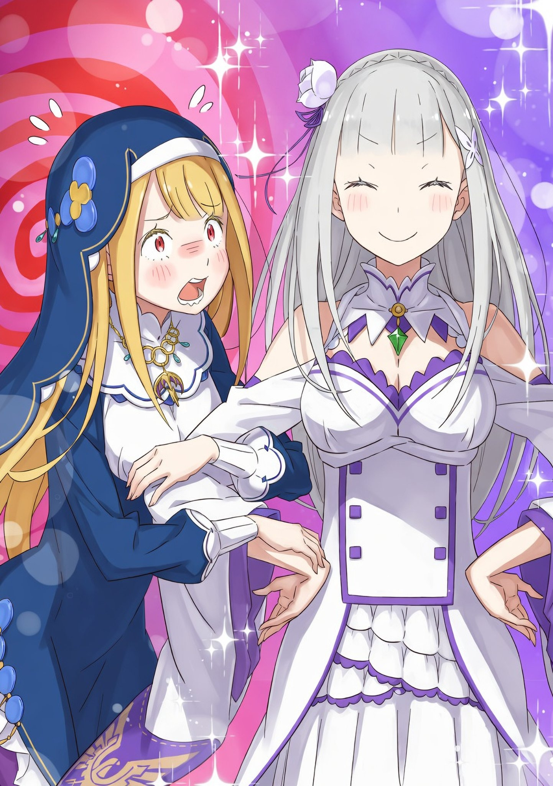

— Все нормально? Точно справишься?

— Сестренка, да смотри ты на руки! Опасно же, осторожно!

— Глядите, та самая полуэльфийка из слухов! А давайте ее обольем! — восклицали дети. Пока монахиня готовилась принимать гостей, неся поднос, они без конца крутились под ногами и донимали ее.

— Не лезьте не в свое дело! — прервала она их. — И не вздумайте подстрекать к подлости! В Писании сказано: «Не касайся чешуи Драконьей помыслом нечистым. Ибо осквернившийся под серебряный дождь попадет, и не дозволят ему врата золотые пройти, покуда воды те не вымоют всю муть из сердца его».

— И что это значит?.. — в унисон спросили дети.

— Это значит, что нельзя не только пакостить, но даже думать об этом — иначе схлопочете! Так, мне нужно встретить гостей. А ну, бегом играть на улицу!

Громкий, чистый голос по-доброму выпроводил озорную детвору. В ответ дети подняли веселый гомон и гурьбой высыпали наружу. Двое мальчишек и девчонка — самая острая на язык. На всех была темно-синяя, почти черная монашеская одежда, из чего Субару сделал вывод, что они при церкви.

«Ну, дети полны энергии, и это здорово», — подумал Субару.

— Простите за наших сорванцов, они ужасно шумные. Я твержу им одно и то же изо дня в день, да только толку мало. Совсем меня ни во что не ставят … Фух!

Проводив их взглядом, златовласая и красноглазая монахиня легонько пожала плечами. Это была Фьоре Лугуника. Судя по всему, дети ее и правда любили и ни капли не боялись.

Впрочем, слова утешения так и не сорвались с губ Субару — внимание его и спутников было приковано к тому, как Фьоре, пошатываясь, несет к ним серебряный поднос с чайным сервизом. Все на подносе дребезжало и ходило ходуном, грозя вот-вот сорваться. Сидя за столом в гостиной, куда их пригласили, Субару и остальные затаили дыхание, во все глаза глядя на это опасное шествие.

— Может, вам помочь? — предложила Рем.

— Стой! Прошу, не трогай! Я, если честно, еле держу тут равновесие. Один шаг — и все полетит в тартарары. Осторожненько, осторожненько …

— Ну … ну же, поднажми!.. — искренне за нее болела Эмилия.

Пройдя между ними, Фьоре с замиранием сердца все же опустила поднос на стол, не опрокинув ни единой чашки.

— О-о-о! — невольно захлопали зрители.

Монахиня вытерла воображаемый пот со лба.

— Кхм-кхм, простите за ожидание, — сказала Фьоре. — И за то, что заставила вас так понервничать. Обычно встречей гостей занимаются другие, но сейчас я осталась за главную.

— Ничего страшного, — произнесла Эмилия. — Спасибо, что приняла нас. Нам даже неудобно, что мы нагрянули именно тогда, когда у вас рук не хватает.

— Вовсе нет. Двери Церкви должны быть всегда открыты. Ведь в Писании сказано: «Страх и почтение к силе Дракона — суть признаки любви. Любовь без почтения — гордыня, почтение без любви — раболепие. Лишь истинная любовь рождает величие пред очами Дракона».

— Эм, а что это значит? — спросила Эмилия.

— Это значит, — монахиня подняла указательный палец, — что всегда нужно держать спину прямо и выглядеть подобающе, на случай если тебя увидит кто-то важный.

Видимо, она цитировала строчку из Писания Церкви Божественного Дракона, но умела очень доступно объяснять смысл. Даже для Субару, чей уровень веры стремился к нулю, такая трактовка сухих церковных догм была приятной.

— То есть, когда ты кричала на детей — это ты так «держала спину прямо»? — подколол Субару.

— Упс.

— А когда ты нас увидела и покраснела как рак — это тоже часть твоего «величия», я полагаю? — ехидно добавила Беатрис.

— Ауч! — Фьоре картинно схватилась за сердце от этих колких замечаний.

Субару уже хотел позлорадствовать над ее реакцией, как вдруг почувствовал, что за одно ухо его взяла Рем, а за другое Эмилия взяла Беатрис.

— Это было лишнее, — отчитала Рем.

— Нельзя так вредничать, это некрасиво, — упрекнула Эмилия.

— Ой-ой-ой! — Вдвоем они заплатили за свои шутки. Выходит, за одну только подачу чая пострадало сразу три человека.

Но отставим пустую болтовню.

— Позвольте представиться еще раз, — девушка приложила руку к груди в представлении. — Я Фьоре … монахиня Церкви Божественного Дракона. Та самая, что наделала шуму в Королевском Замке.

В комнате повисла тишина. Видя отсутствие реакции, лицо монахини тут же помрачнело.

— Ну … скажите хоть что-нибудь. Мне как-то не по себе.

— Да нет, просто мы подумали — значит, ты и сама понимаешь, что «наделала шуму».

— Разумеется! Еще как … понимаю. Когда на тебя в Замке все смотрят так, будто ты — нечто неописуемое, тут любой волей-неволей задастся вопросом: «Ой, неужели я напортачила?».

— Ну, нас там не было, но я тебя отлично понимаю, — поддержал Субару. — Я очень хорошо знаю чувство, когда ты словно бельмо на глазу и тебе хочется сквозь землю провалиться …

— Неужели?! — удивилась Фьоре и подалась вперед. — Значит, тебе знаком этот ад?!

— Ой, Субару, — Эмилия сложила руки у груди, — ты это про тот случай, когда при всех назвал себя моим рыцарем? А я тогда со стыда сказала, что это не так?

— Угу … ну, типа того!

Обе девушки с неподдельным сочувствием атаковали юношу, отчего старые раны вновь свежо заныли. Впрочем, со стороны Эмилии тот отказ, оказывается, объяснялся «стыдом». Субару никогда раньше не спрашивал ее напрямую о чувствах в тот момент, но хотя причина и была милой, полученный тогда урон все равно оставался колоссальным.

— Звучит все это просто ужасно, — подала голос Рем. — Неужели это правда?

— Увы, Бетти тогда еще не заключила контракт с Субару, так что всех подробностей я не знаю, в самом деле, — добавила Беатрис. — Но вполне верю, что он мог тогда выкинуть что-то подобное.

— Знаете что? Мне как-то не по себе слушать такие вещи от вас! — запротестовал Субару. — Чтоб вы знали, прошлая Рем была в курсе дела и даже сочувствовала немного!

— Да неужели? — съязвила Рем. — А не могла я тогда просто остолбенеть от твоего поведения и поэтому тактично промолчать?

— Перестань! Мне уже кажется, что так оно и было!

На самом деле, какие бы чувства Субару тогда ни испытывали, он совершил ошибку за ошибкой: в методах, в словах, в поведении. Он уже давно раскаялся в содеянном, и, раз уж сам завел об этом речь, надеялся на прощение.

Но пока он морально занимался самобичеванием …

— Я понимаю … я тебя так понимаю! — руки Фьоре резко потянулись через стол и крепко сжали правую ладонь Субару. Монахиня подалась вперед, не сводя с него взгляда блестящих алых глаз. — Они так ужасным … все эти ледяные взгляды на чужака, который внезапно сунул нос не в свое дело!

— Точно!

— И тот момент, когда уже говоришь все, что на уме, и пути назад нет!

— Да-да, именно так!

— И эта вечная тишина после твоей речи, когда ждешь, что хоть кто-нибудь хоть что-нибудь скажет!

— Секунды кажутся вечностью!..

— Я тогда четко поняла: «Все. Кажется, я оплошала».

— Фьоре!.. — он в ответ сжал ее руки.

Все, что она пережила, Субару чувствовал, как свое — впрочем, так оно и было. Над столом, сцепив руки, они кивали друг другу в знак понимания. Два сапога пара, два нарушителя спокойствия, облажавшихся в Тронном зале …

— Но ведь есть огромная разница между госпожой Фьоре, которая добилась всего сразу, и тобой, который только отложил шанс на исправление? — вмешалась Рем.

— Хорош уже … у нас тут такой душевный момент был.

— Вот именно! — согласилась Фьоре. — В Писании ведь сказано: «Находясь под тенью одних крыльев, не точи когти на ближнего своего. Ибо братья, что спорят под общим небом, сами отвергают милость Дракона».

— Эм, а это что значит? — спросил Субару.

— Это значит: раз вы в одной лодке и одинаково опозорились, живите дружно, а не ругайтесь.

— Согласен на все сто! Чур я вступаю в Церковь!

— Не неси чушь и не относись так легко к вере, я полагаю! — любящая ладонь Беатрис звонко отвесила ему подзатыльник.

Ну, если вера — это любовь, то Субару уже был верным прихожанином Культа Беатрис, при этом умудряясь состоять в культах Эмилии и Рем.

— Хотя, если так посудить, у меня какая-то многобожица в голове. Как японец, я вроде как атеист, но в глазах божества я, выходит, изменщик? — испуганно пробормотал он.

— Ну, так и есть? — Рем одарила его леденящим взглядом своих нежно-голубых глаз.

— До чего ж страшный взгляд!

Эмилия и Беатрис лишь горько усмехнулись. Субару решил поскорее сменить тему и снова перевел взгляд на Фьоре. Хотя она и казалась очень дружелюбной, была одна важная вещь, которую он хотел сказать:

— Я слышал, что ты спасла Круш. Наверное, странно это слышать от меня, но … спасибо тебе. Огромное, — Субару низко поклонился, едва не ударившись лбом о столешницу.

Фьоре удивленно захлопала ресницами и посмотрела на Эмилию. Кажется, предупреждение о «странности» слов благодарности ее не особо успокоило. Но следом за ним голову склонила и полуэльфийка:

— Позволь и мне поблагодарить тебя, — сказала она. — Мы все очень хотели помочь Круш, но не знали как. А ты — сделала это.

— По правде говоря, мы как раз искали решение, в самом деле, — добавила Беатрис. — Ты сделала великое свершение.

— Я лишь слышала о случившемся, но считаю твой поступок достойным восхищения, — подкинула и Рем.

Фьоре несколько мгновений безмолвно открывала и закрывала рот, как рыба. Переварив услышанное, она медленно покачала головой, а затем величаво и с мягкой улыбкой обвела их взглядом:

— Все в порядке. Я лишь сделала то, что должна была. И если это кого-то спасло — значит, я достигла своей цели.

Ответ был именно таким, каким Субару и ожидал от милосердной монахини. И если бы у нее при этом так довольно не раздувались ноздри, образ был бы просто безупречным. Впрочем, из чувства благодарности он решил тактично об этом промолчать.

Когда первый обмен любезностями подошел к концу, Фьоре начала рассказывать о своем положении и жизни.

— Меня нашли у дверей Церкви, когда я была совсем младенцем. Было это чуть больше пятнадцати лет назад.

Это признание заставило Субару и остальных переглянуться. История с подкидышем была ключевым моментом в подозрениях, что «Фьоре — исчезнувшая принцесса».

— Раз тебя подбросили … значит, своих родителей ты совсем не помнишь? — мягко спросила Эмилия.

— Нет, ни лиц, ни имен. Но вся Церковь — это моя семья. Мне никогда не было одиноко … ну, если только когда какие-нибудь злыдни дразнили меня, тогда я злилась, но в целом — нет. Рядом всегда кто-то был.

— Ясно, — ответил Субару. — Но скажи, ты сама никогда не находила это странным? Золотые волосы, алые глаза, имя Фьоре … У тебя же комбо из всех примет Королевской Семьи.

— Но это же Церковь Божественного Дракона! То, что Церковь держится в стороне от Королевской Семьи и Замка — в порядке вещей. Ко мне просто не доходила такая информация … А теперь я думаю, что от меня все это скрывали специально. Вот ведь … ох!.. — кулаки Фьоре на столе мелко задрожали от обиды на свою судьбу.

Несмотря на серьезный вид, за то короткое время, что Субару общался с ней, он понял: монахиня — натура импульсивная и эмоциональная. И ее выпад в Замке, скорее всего, был вызван очередным эмоциональным взрывом.

— В последнее время Культ Ведьмы совсем совесть потерял. А когда случилось то, что произошло в Пристелле … все, терпение лопнуло.

— И тогда ты, никого не слушая, сама ворвалась в Замок и начала скандалить? — спросил черноволосый юноша.

— Можно подобрать выражения чуть … помягче? Как насчет: «величаво и грациозно выразила свой гнев»?

— Ладно, значит, ты «величаво и грациозно пошла скандалить».

— Кажется, мой благородный порыв так и не оценили по достоинству.

Но Субару лишь следовал ее просьбе … В любом случае стало понятно: Фьоре двигало чувство долга и сильное возмущение. Но Субару и компанию интересовала причина, которая позволила ей действовать.

— «Таинство» … Ты ведь так это назвала? — стоило Эмилии это спросить, воздух в комнате словно застыл.

Таинство — то «нечто», с помощью чего Фьоре исцелила Круш. Та самая сила, способная обернуть вспять последствия работы Полномочия, в чем она убедила всех в Королевском Замке. По какой-то причине Церковь хранила это в тайне и не спешила афишировать средство спасения жертв Культа.

Субару облизнул губы, пытаясь справиться с волнением. Если это Таинство — оно явно относится к сокровенным секретам Церкви. Не исключено, что само знание о нем могло сделать их врагами организации. Обычно в таких случаях люди начинают уклоняться от ответов …

— Таинство? — откликнулась Фьоре. — Ну да. Это секретная техника, которую издавна хранят в Церкви. Ею может ей пользоваться крайне мало людей. В Церкви их называют «Святыми», и раз у меня есть способности, я могу пользоваться этой силой. Вот и все.

— Ты вот так просто это выложила?! — удивился Субару. — А тебе по шее не настучат?!

— Чего тут скрывать? Даже если Церковь хотела это утаить, я уже во всеуслышание раззвонила об этом в Замке. Скрытничать теперь нет смысла … В Писании сказано: «Не отравляй ядом корысти землю, очищенную Драконом. Чтобы наполнить иссякший источник, потребуется тысяча лет молитв и слез грешников».

— И … что это значит?

— Если хочешь загрести только выгоду, потом в случае чего будет тяжко разгребать последствия … И я решила, что этот момент «в случае чего» уже настал.

Вопреки воле Церкви, Фьоре выбрала верность своим догматам и открыто явила свою силу. Естественно, сама Церковь Божественного Дракона была в ужасе, а Замок — в полном замешательстве, внезапно оказавшись в долгу у монахини. Однако, какой бы хаос это ни породило, в основе лежал добрый умысел.

— Сейчас в Замке решают, что со мной делать … Там собрались большие шишки из Церкви и люди, которых я всю жизнь считала семьей.

— А почему Фьоре не там, хотя обсуждают как раз Фьоре? — удивилась Эмилия.

— Да потому что меня оттуда выставили! — девушка аж покраснела. — Сказали, что если я там буду, то будет только сложнее … Будто я совсем не умею себя вести! Обидно, не находите?

— Боюсь, — вставила Беатрис, — они просто адекватно оценили риски, я полагаю.

— Да не будь ты к ней так строга, — шепнул ей Субару.

Однако, глядя на ее пылкий нрав, трудно было не согласиться с их вердиктом. Хотя она и говорила, что ей пятнадцать, внешне она выглядела взрослой, но по натуре была сущим ребенком, если и вовсе не младше своих лет. Может, сказалось то, что она росла как тепличное растение, вдали от мирской суеты. Субару не знал, почему Церковь Божественного Дракона растила ее именно так.

— Так все заинтересованные сейчас в Замке? Значит, вы, госпожа Фьоре, остались в Церкви совсем одна?

— Вот именно. Ну, те малыши, конечно, со мной, так что мне не скучно, но мне строго-настрого запретили выходить наружу. А ведь я хочу как можно скорее раздавать силу Таинства всем, кому она нужна! Поскорее!

— У этой Святой мотивация бьет через край … — пробормотал юноша.

Каким бы необычным ни был этот «святой» настрой, он не мог его не одобрить. Вспомнив слова Гарфиэля о жертвах в Пристелле, которые ждут спасения, Субару всем сердцем разделял ее нетерпение. Ему самому хотелось подтолкнуть ее.

— Я тебя прекрасно понимаю, — сказал он. — Хочешь, я попрошу Райнхарда? Он тебя мигом доставит в Пристеллу по воздуху.

— У-ух … Какое заманчивое предложение! Но мне велели покорно ждать …

— Но ты ведь не давала официального обета? И даже если обещали, когда речь идет о спасении жизней, можно и чуть-чуть …

— Субару? — удивилась Эмилия. — Неужели ты не только сам не держишь слово, но и подстрекаешь других на это? По-моему, это очень, очень некрасиво …

— Рецидивист и нарушитель клятв скатился на самое дно, в самом деле, — поддакнула Беатрис.

— Ауч! — Субару не нашелся с ответом.

Монахиня рядом с ним тоже увяла под тяжестью аргумента об «обещании». Оставалось только надеяться, что совещание в Замке закончится быстро и в их пользу.

— Но все же, раз уж госпожа Фьоре — монахиня Церкви Дракона … — Рем сменила тему, привлекая внимание.

— Рем?

— Несмотря на это, ты так легко впустила гопожу Эмилию.

Юноша, который уже мысленно возносил молитвы в сторону Замка, удивленно вскинул брови, Эмилия прикусила губу, а Фьоре продолжила держать руки в молитве, что и Субару. Голубоволосая горничная затронула непростую тему — отношения Церкви и Эмилии.

— Церковь Божественного Дракона превыше всего почитает силу и милость Волканики, их союз, — продолжала Рем. — А самое известное деяние Дракона в королевстве Лугуника — заточение Ведьмы Зависти, верно?

— Эй, ты же не хочешь сказать … — Субару дернулся, готовый вскочить.

Однако Рем даже не взглянула на него. Она лишь плотно сжала губы — понимала, что ее слова могут разрушить сложившуюся уютную атмосферу. Но Рем не могла промолчать. Она не хотела оставлять фальшивую недосказанность.

— Истово верующие члены Церкви могут иметь … неоднозначное мнение по поводу госпожи Эмилии. Вот и все.

На самом деле, пока его не ткнули носом в этот факт, Субару даже не задумывался об этом. Церковь Божественного Дракона никогда не была частью его повседневности, а к тому, что Эмилия — потрясающая красавица, он привыкал заново каждый день. Для него она с самой первой встречи не была объектом страха.

Но мир ничего не забыл. Эмилия всегда жила под тяжестью своего сходства с Ведьмой Зависти, которой так боялись в этих краях. И для организации, почитающей Дракона — одного из Трех Героев, остановивших Ведьму четыреста лет назад, — ее сходство с тем самым врагом человечества не могло быть пустым звуком. Они не могли просто так закрыть на это глаза. Тем более, что Фьоре — носительница Таинства, занимающая почти сакральную позицию. Было бы вполне естественно, если бы у нее были предубеждения.

— Ну и идиот же я. Нет, полный идиот.

Это должен был заметить сам Субару, а не ждать, пока укажет Рем. Будучи Первым Рыцарем Эмилии, он обязан был предугадать опасность там, где ее могли обидеть, а ему не хватило ни знаний, ни бдительности. И если лицо Эмилии омрачится, он что, просто поругает себя, будто виноват только он? Ведь отчасти именно нехватка знаний гнала его в Столицу.

— Рем, ты, оказывается, так много всего изучила … — поразилась Эмилия. — Я та-а-ак удивлена.

Но она не стала ругать Субару и не выказала шока. Она просто мягко улыбнулась, пока хвалила Рем.

— Да ничего я особо не учила … Просто теперь у меня есть место, где меня принимают, вот я и слушала, что рассказывала сестра Рам.

— Все равно мне приятно. Хотя это странно, что за меня волнуются … да?

— Вовсе нет. Бывает досадно, что тебя считают слабой, когда за тебя переживают. Но при этом чувствуешь, что ты кому-то по-настоящему дорога.

— Хе-хе, вот как? Значит, Рем я тоже дорога.

— Думаю, госпожа Эмилия начала первой, — Рем отвела глаза.

И Субару сразу понял — она просто смущается. Честный и чистый взгляд Эмилии всегда видел людей насквозь.

— Бетти, врежь мне! — воскликнул Субару.

— Ну что ты будешь делать, в самом деле! — ответила та, словно только этого и ждала, и маленькая ладошка Беатрис со звонким хлопком приземлилась на щеку юноши.

От несильного, но ощутимого удара у него даже плечи дрогнули.

— Ой?! Что это вы вдруг? — Эмилия обеспокоенно коснулась пальцами горящей щеки Субару.

Наслаждаясь прохладой ее тонких пальцев, он шмыгнул носом:

— Забей. Просто привожу чувства в порядок. Такую перезагрузку … назовем ее «Беантализм». Или «Беа-терапия»? Что лучше?

— Прости, Субару, но я вообще не понимаю, о чем ты, — ответила полуэльфийка в своем привычном ключе.

Судя по ее спокойствию, она не боялась последствий своего сходства с Ведьмой и не злилась на его оплошность.

— Конечно, нельзя просто все время сидеть у нее на шее. Если я разбираюсь в проблемах Лагеря хуже Рем, которая только-только пришла в себя — это никуда не годится.

— Надеюсь, ты правда сделал выводы, — сказала Рем.

— Говоришь так, потому что веришь в меня! Лады, положись на меня.

— Ну … пусть будет так

Поддержка Рем воодушевила его, чуть было не потерявшего дух, и он повернулся к Фьоре. Она монахиня и Святая. Но именно поэтому …

— Я считаю, будет правильно, если такой человек избавится от предубеждений, — сказал юноша. — Поэтому … как насчет того, Фьоре, чтобы заключить с Эмилией дружеский союз?

— Дружеский союз? — переспросила полуэльфийка. — Субару, ты имеешь в виду …

— Именно! Я имею в виду — станьте подругами! — со сжатым кулаком и небывалой силой провозгласил он.

Эмилия радостно всплеснула руками, и ее глаза засияли. Всем было известно: она была буквально «одержима» поиском друзей. Недавно даже Фельт сходу предложила дружбу и добилась своего. Но не только Эмилия загорелась идеей …

— Со мной … подругами? Серьезно?! — Фьоре с грохотом оперлась на стол. Ее алые глаза метались между Субару и Эмилией, наполняясь надеждой. — Ой, простите. Наверное, я ослышалась. Я подумала, вы сказали «подругами», а вы, небось, сказали «потугами»? Ну, в плане, потуги не остаться тут одной.

— Плохо дело, — заметил юноша, — эта Святая засиделась в одиночестве.

— Но я ее понимаю! — поддержала Эмилия. — Я тоже так нервничала, когда Субару захотел со мной подружиться. Не понимала, что у него на уме, и мне было очень тревожно.

— Прости! Но мои чувства не менялись с первого дня, только крепнут со временем … — оправдывался он, как вдруг почувствовал боль. — Ай! Рем, ты че, мне на ногу наступила?!

— Нет, — ответила она, — я просто уронила железный шар.

— Ты моргенштерн с собой притащила?! — Субару с ужасом смотрел, как горничная поспешно прячет за спину свое оружие, упавшее ранее на подъем его стопы.

Было жутковато представлять раздробленные кости, но при этом умилительно видеть ее со знакомым шаром, который она постоянно начищала в поместье.

— Послушай, Фьоре … — Эмилия проигнорировала их перепалку и подошла к монахине. Когда она коснулась руки девушки на столе, та вздрогнула от неожиданности. — Инициатива была от Субару, и это с моей стороны как-то легкомысленно — просто идти у него на поводу. Но ты как думаешь, Фьоре?

— Я … я … — запиналась монахиня. — А что я должна думать? Я совсем запуталась … Скажите прямо, а то я решу, что сплю … Это же сон, да?

— Вовсе нет. Скажу прямо, чтобы не было путаницы: если хочешь … нет, давай будем друзьями!

Вся застенчивость Фьоре вмиг испарилась.

— О господи, да! С радостью! — ее лицо просияло, она схватила Эмилию за руки, и они тут же начали строить «новую дружбу» на дистанции в ноль сантиметров.

Субару диву дался такой скорости развития отношений, но, однако, кивнул сам себе. Дела пошли в гору.

— Рад, что все решилось так быстро. Какой напор … прямо как тогда, когда Беако все же решила меня выслушать.

— Случай Бетти был куда более романтичным и драматичным, я полагаю! И я не была так … так голодна до общения, в самом деле! — Разобиженная Беатрис принялась притоптывать по его здоровой ноге, но делала это так очаровательно, что Субару лишь улыбнулся.

— Больно! Ай! Но так мило …

Глядя на то, как Эмилия и Фьоре находят общий язык, Рем тоже облегченно вздохнула. Видимо, она тоже переживала за исход этой встречи.

— Ну что, Рем, довольна? — спросил Субару. — Подружились.

— Не думаю, что все так просто. К тому же у меня есть Катя.

— Да ладно, разве друзей бывает много? Взять хоть тех ребят с Острова Гладиаторов — я их всех считаю своими корешами.

— У меня есть Катя, — упрямо отрезала Рем. У нее были свои четкие границы для категорий «знакомый» и «друг», и переубеждать ее было бесполезно.

Тем временем в комнате зародился настоящий исторический союз. Эмилия явно вошла во вкус.

— И с Фельт подружилась, и с Анастасией пообещала подружиться. Кажется, у меня талант находить друзей! — похвасталась она.

Субару подумал, что если дать ей волю, то Эмилия пойдет приставать к каждому прохожему, и хотя в этом нет ничего дурного, по репутации это могло ударить странным боком. Пришлось мысленно притормозить «другозаводилку» госпожи.

— Эмилия … Позволь, я буду называть тебя так! — попросила Фьоре. — Значит, мы подруги, да? Но называть имена других друзей вот так, сразу … тебе не кажется, что это жестоко?! Нет-нет, я не обижаюсь, правда! Но могла бы ты побольше смотреть на меня, ведь мы только что стали друзьями …

Фьоре, видать, слишком долго была одна. В ее словах проскальзывали нотки едва ли не одержимости — тип «яндере» во всей красе. Похоже, ей нужно больше друзей, чтобы она не задушила в объятиях одну лишь Эмилию. Если уговорить Рем никак, то придется Субару и Беатрис принять удар на себя.

— Но на самом деле, Фьоре … Тебя все-таки не смущает внешность Эмилии? Я понимаю, что в ней от Ведьмы Зависти только лицо, но …

— А? У тебя какие-то претензии к моей Эмилии? — Святая притянула полуэльфийку и устроилась у нее на груди, обнимая как бы сзади, а та в свою очередь ее защищала.

— Ой-ей. Теперь ясно, почему у нее нет друзей! — Субару потер лоб.

«М-да, будет труднее, чем я думал», — подумал юноша.

Завидев его реакцию, Эмилия лишь горько улыбнулась из объятий монахини:

— Ну-ну, тише. Субару, прости за мою подругу …

— Погоди. Эмилия-тан, кто я для тебя после этого? Я теряю статус?

— Что? Конечно нет! Субару же — мой рыцарь!

— Фух, отлегло. Самооценка спасена.

Конфликт между Церковью и полуэльфийкой так и не начался, зато чуть было не вспыхнула война между Рыцарем Номер Один и Гиперопекающей Подругой.

Внезапно дверь гостиной распахнулась.

— Фьоре, ты выгнала Люсьена и остальных? Ты ведь должна быть под надзором, чтобы раскаяться.

На пороге стоял молодой человек. Худощавый красавец в темно-фиолетовом наряде и широкополой черной шляпе. Заметив Субару и остальных, он изумленно распахнул желтые глаза:

— Ого. У нас гости? Видать, малышня мне ничего не сказала. Вот лентяи, придется им потом задать взбучку. — Молодой человек сдвинул шляпу на лоб.

— Тига, с возвращением! Смотри, это Эмилия, моя подруга, — представила ее Фьоре, буквально истекая радостью, пока крепко держала девушку. — Завидуешь? Моя настоящая подруга … Хи-хи, подруга, хе-хе-хе …

Красивое лицо монахини сейчас выражало крайнюю степень зависимости от социального взаимодействия с подругой.

Парень по имени Тига Лауреон вопросительно вскинул бровь, спросив:

— Эмилия? — и перевел взгляд с полуэльфийки на всех остальных. — Вот как. Рад, что у тебя кто-то появился. Но не надо делать такое победное лицо передо мной. Например … как насчет того, чтобы и нам стать друзьями?

— Это ты мне? — удивился Субару.

— Тебе. Я Тига Лауреон. А ты?..

— Нацуки Субару. Приятно познакомиться, май фрэнд.

— Ха! Взаимно, май фрэнд , — Тига вальяжно протянул руку, и Субару без колебаний ее пожал.

Этот парень явно умел играть на публику: легко подхватил иностранное словечко, да и еще лихо подмигнул … Казалось, они поладили за доли секунды. Черноволосый юноша, пару раз повторив про себя «май фрэнд, май фрэнд», всем видом выказывал желание сблизиться.

Глядя на эту молниеносную дипломатию, Фьоре, вечный заложник одиночества, окончательно выпала в осадок.

— Вы … вам не страшно?! — выпалила она. — А если тебе откажут, а? О чем ты только думал?!

— Эй, Тига, ты как ее воспитывал? — спросил Субару. — При таком взрывном характере она трусит подойти к людям. Что за дисбаланс?

— Да уж, каюсь. Мы ее слишком сильно берегли, держали взаперти, вот она и истосковалась по общению. Ей нужно время привыкнуть. Не бойся, она не кусается.

— С чего это я вдруг вообще должна кусаться?! — возмутилась Фьоре. — За кого ты меня принимаешь?! Я подруга Эмилии! И почти Святая!

— Удивительно, как статус «Святой» для нее стал менее важен, чем «подруга Эмилии» … — прошептала Рем. И сказала она это прямо в точку.

Мнение Субару об этой монахини за последние десять минут менялось раз семь. Но раз вернулся представитель Церкви, значит, переговоры в Замке подошли к концу.

— Верно мыслишь, — заметил Тига. — Хотя нам с коллегами еще предстоит многое обсудить за закрытыми дверями. Так что прошу прощения, но на сегодня аудиенция окончена.

— Да ладно тебе, май фрэнд, — хорохорился Субару. — Между друзьями не должно быть тайн.

— Искренность — залог дружбы? Возможно. Но я считаю, что настоящие друзья — это те, кто умеет вовремя промолчать и не грузить друг друга лишним, чтобы сохранить отношения. Что скажешь?

— Лады, умыл меня. Беако, вставь свои пять копеек.

— В отличие от тебя, — откликнулась девочка, — у Бетти и Субару вообще нет глупых тайн, я полагаю.

— Это просто нытье проигравшего, — вздохнула Рем.

Определение дружбы от Тиги звучало весомо, так что спорить дальше было бесполезно. На этом их визит подошел к концу.

— Что ж, результат есть, — подытожил Субару. — Главное — я понял, что Фьоре не собирается сеять хаос в Выборах.

— Да, Фьоре — хорошая девочка, — добавила Эмилия.

— Слышал, Тига?! Это сказала моя подруга ! — похвасталась монахиня.

— Слышал-слышал. Спасибо, что уделили внимание нашей Фьоре.

Субару думал, что она будет до последнего вцепляться в Эмилию, но нет — она смиренно разжала руки, и операция по эвакуации прошла успешно.

Эмилия подошла к юноше, и Тига снял шляпу, после чего элегантно поклонился.

— Раз уж мы подружились, — сказал он, — я не хочу отпускать подругу Фьоре и тебя, май фрэнд , с пустыми руками. Держи хорошую новость.

— Новость для нас? Какую? — удивился юноша.

— Герцогиня Карстен очнулась.

Субару невольно подался вперед.

— Леди Круш очнулась?!

Тига со стильным видом кивнул, наслаждаясь его реакцией. Субару понимал, что парень специально придержал этот козырь, чтобы оставить за собой последнее слово, но сейчас было плевать на гордость. Это была по-настоящему прекрасная новость.

— Эмилия-тан, после этого …

— Да, конечно, — откликнулась та. — Пойдем ее навестим. Я тоже очень хочу поговорить с ней.

— Тогда я тоже пойду с Эмилией … — начала было Фьоре.

— А Фьоре остается здесь, — Тига пресек попытку монахини удрать, положив руку ей на плечо. — Подождем возвращения Сакуры и остальных.

Девушка с ненавистью уставилась на его руку.

— Но это же нечестно! — вспылила она. — Речь идет о герцогине Карстен! Я должна лично увидеть итог Таинства! Это мой долг! Ну?!

— Если заговорила о долге, то будь добра, неси и ответственность Святой. Мы навестим герцогиню позже. Как представители Церкви.

— Э-эмилия …

— Все хорошо, Фьоре. Я навещу ее за тебя, — успокоила полуэльфийка.

— Ты меня не понимаешь?! Мы же подруги?!

«Кажется, она ждет от дружбы слишком многого», — подумал Субару. Как бы там ни было, радость от того, что Круш пришла в себя, переполняла его. Ему хотелось немедленно отправиться к ней.

— Мы еще поболтаем позже, — сказал Субару. — Сегодня было круто. Покедова!

— Как грубо! Субару, так нельзя … Мгх! — противилась Фьоре.

— Идите, я ее удержу! — воскликнул Тига, играя роль «злодея».

Так что их группа все же покинула Церковь. На выходе они снова столкнулись с детьми, которые тут же начали их донимать:

— О, уже уходите?

— Ну как там наша сестренка? Совсем опозорилась?

— Наверняка. Без нас она вообще ни на что не годна, эх.

Несмотря на остроты, в их словах слышалась скрытая забота.

— Дождись меня, Круш. Нам есть о чем поговорить, — пробормотал Субару, ускоряя шаг. Его сердце билось в такт этой радостной новости.

Проводив взглядом представителей Эмилии, Тига отпустил Фьоре. Она, покачиваясь, подошла к столу, провожая взглядом след от недавно обретенной подруги, а затем метнула злой взгляд на юношу.

— Что это за взгляд? — спросил он. — Хочешь что-то сказать?

— Ненависть …

— Фу, ну и словечки. Ничего не попишешь. Нам и правда нужно поговорить, и то, что герцогиня очнулась — свершившийся факт.

— Ну да-да. Вам-то, господин Тига-супер-социальность-Лауреон, не понять, — обиженно фыркнула девушка и схватила чашку с чаем, которую до этого не успела и коснуться.

В вихре событий у нее даже не было секунды перевести дух. Тига прищурил желтые глаза, наблюдая за ней в профиль.

— Надо же, именно с госпожой Эмилией …

— Ты о чем? Опять начнешь про серебряные волосы?

— И это тоже. Но не только. Фьоре … где инсигния?

Монахиня немного поколебалась, но вытащила из-за пазухи значок. Когда она раскрыла ладонь, красный самоцвет внутри инсигнии Дракона вспыхнул ослепительным светом.

Глядя на это сияние и на пробудившую его Фьоре, Тига тихо прошептал:

— Что ж, будет жарковато. Как-никак, мы опоздали на целых полтора года.
