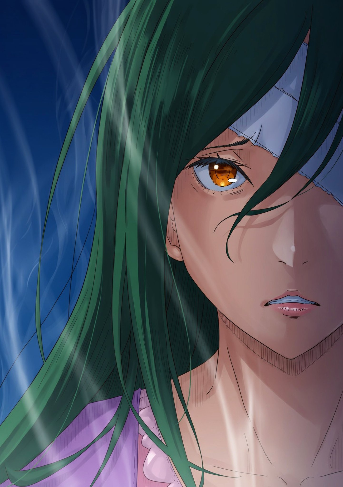

— Огромное спасибо, что не забыли про наш дом, — низко поклонился Вильгельм.

— Да что вы! Не надо, — Субару смущенно замахал ручками Беатрис, будто своими.

Сидевшая у него на коленях, она смерила его хмурым взглядом, но гулкое биение его сердца, что отдавалось ей в спину, выдавало его волнение с головой. Беатрис со смирением вздохнула — позволила и дальше вымещать так на себе свои нервы.

Встреча с Фьоре ввергла Королевские Выборы в пучину хаоса. Но, стоило услышать в Церкви весть насчет Круш, они все вместе тотчас помчались в поместье Карстен, что в дворянском квартале. По всем правилам этикета нужно было договориться о визите заранее. Они же, однако, забыли обо всем на свете и нагло вломились к ним. Тем не менее, их приняли со всем радушием.

Вильгельм проводил всех четверых в гостиную, где они уселись на длинном диване и томительно выжидали встречи.

Старый мечник завидел нетерпение Субару и снова глубоко поклонился:

— Прошу простить. Госпожа Круш придет, как только соберется.

— Нет-нет, это же мы завалились! — восклицал Субару. — Спасибо, что вообще не выгнали!

— Кем надо быть, чтобы так сделать? Госпожа Круш была очень рада, когда узнала, что вы с леди Эмилией пришли ее наведать.

— Ой, да как бы не вышло наоборот … Я ведь и расплакаться могу, когда увижу ее … — да, прозвучало жалко, но Субару правда так думал.

Он искренне надеялся, что и Вильгельм, и Эмилия морально готовы к этому. А пока, чтобы хоть как-то совладать с чувствами, он тряс ручками Беатрис в такт своему «нет-нет».

— Да прекрати ты дергать, я полагаю! — не стерпела Беатрис. — У Бетти сейчас руки отвалятся, в самом деле!

— А, ой, прости! Просто места себе не нахожу. Ведь … — запнулся юноша. Он легонько ткнул девочку в щеку.

Нетерпение грызло изнутри, но ожидание того стоило.

— Ведь Круш … — выдохнул полный надежды Субару.

— Да, — кивнул в ответ Вильгельм, обуреваемый глубокими эмоциями.

Нет, сравнивать их чувства было бы верхом наглости. Облегчение старика было неизмеримо больше. Выздоровление той, кому он поклялся в верности, значило для него все.

— Я уже говорила, но повторю: господин Вильгельм, я за вас о-о-очень рада, — тепло улыбнулась Эмилия.

Она уже успела поздравить всех с выздоровлением Круш в тот же день, когда Фьоре применила на ней Таинство. Но тогда она еще не пришла в себя. Теперь же Эмилия предвкушала разговор, отчего аметистовые глаза ее сияли.

— Ох, с этими двумя проблем не оберешься, я полагаю, — вздохнула Беатрис. — Рем, если что, все на нас с тобой, иначе они тут такого наворотят, в самом деле.

— Да. Чуть что — и я влезу. Я как раз начала привыкать к весу моргенштерна, — раздался тихий лязг цепи.

Субару от сего звука поежился. Рем как стражник — это страшновато, но надежно. Вдруг он заметил, что в комнате не хватает кое-кого, кто должен был радоваться больше всех. Первого Рыцаря Круш.

— Кстати, о надежных людях, — спохватился он. — А где Феррис? Помогает Круш переодеваться? Хотелось бы и с ним поболтать.

Наверняка излечение Церкви больно ударило по нему как лучшему целителю. Однако Субару не сомневался: Феррис выше какого-то там самолюбия, так что сейчас, должно быть, больше радуется спасению своей госпожи. Но …

Старый мечник на миг напрягся.

— Вильгельм? — нахмурился Субару.

— Прошу прощения, — дворецкий быстро совладал с лицом. — Феррис … признаться, немного занемог. Как только госпожу вылечили, его сразу задавило все то плохое, что в нем копилось.

— Ой, как же так … — распереживалась Эмилия. — Бедный Феррис. Круш проснулась, а он слег … Он же сам себя будет упрекать. Совсем ему плохо, господин Вильгельм?

— Полагаю, отдохнет — и ему станет лучше. Но я бы его пока не отвлекал. Хотя вряд ли бы он вообще помешал вам с ней встретиться.

— Помешал? Глупости какие … но хорошо, я поняла. Придем к нему в другой раз.

Субару согласно кивнул. Беда не приходит одна, но раз Феррису нужен покой, настаивать не стоит. Они еще пробудут в Столице, так что время найдется. И вдруг …

— Извиняюсь за ожидание, — дверь гостиной отворилась.

Субару тотчас невольно вскочил. На пороге стояла Круш Карстен — стройная, изящная, с длинными зелеными волосами. Ее фигура была облачена в темное домашнее платье, а плечи покрывала розовая шаль.

Когда он видел Круш в последний раз, та была прикована к постели и задыхалась от боли, не в силах даже подняться. Но сейчас она стояла на своих двоих, а губы играли легкой, еле заметной улыбкой … однако половина ее лица все так же была укутана бинтами, что и приковало к себе взгляд.

— Не волнуйтесь, — предвосхитила она. — Бинты здесь, потому что глаз еще плохо видит. Самое страшное … нет, все страшное позади. Так что, пожалуйста, не смотрите так грустно.

Субару упрекнул себя: пришел проведать больную, а в итоге заставил ее успокаивать тебя. Конечно, повязка на лице пугала, но главное — она сама дошла сюда! После всего того кошмара это казалось настоящим чудом.

— Господин Субару? — прищурила янтарный глаз Круш, стоило ей заметить молчание юноши.

Субару же в это время осторожно подбирал слова. Сделай он один неверный вдох — и все накопленное вырвется слезами.

— Понимаете, Круш … — заговорил он, — у меня в голове крутилось столько всего. В основном, извинения, что это все из-за меня так вышло и что мне очень жаль …

— Да.

— Но когда я увидел вас … живой, на ногах … сейчас на уме только: «Как же хорошо». Слава богу …

Всю дорогу он репетировал идеальную речь, подбирал самые правильные фразы, но стоило увидеть ее вживую, как весь этот умный вздор обратился лишь детской, бессвязной радостью.

Круш в ответ округлила глаза. И затем ее губы вновь тронула мягкая улыбка:

— От ваших слов мне стало куда легче. Вы меня столько раз видели в ужасном виде, так что я боялась, что вы совсем во мне разочаровались.

— Да никогда в жизни! И вообще, что это мы тебя на пороге держим, тебе же только-только полегчало! — Субару тут же засуетился и выдвинул кресло. — Присаживайся, пожалуйста!

— Хи-хи, — Круш прикрыла рот рукой, — с удовольствием.

Вильгельм помог ей опуститься на сиденье, и Субару запоздало смутился самому себе — раскомандовался в чужом доме. Сев на место, он бросил укоризненный взгляд на Эмилию и остальных:

— А чего это я один тут скачу? Вы чего сидите?

— Ну, ты же больше всех за нее волновался, так что первое слово дали тебе, — улыбнулась Эмилия.

— А мне сейчас вообще не по статусу лезть, — вежливо добавила Рем. — Да и мне пришлось ловить малышку Беатрис.

— Беако? Стоп, а почему она у тебя на коленях? — удивился Субару. — Ты ж вроде у меня сидела!

— Сидела, пока ты не вскочил как ошпаренный и не скинул меня, я полагаю! Если бы Рем меня не поймала, я бы сейчас валялась на полу, в самом деле!

— А, ой, прости. Как-то из головы вылетело …

— Подбирай слова! — надула щеки Беатрис. Она нарочито прижалась к голубоволосой горничной, и та с радостью обняла девочку.

Субару снова про себя дал себе подзатыльник. Круш же тихо рассмеялась, отчего Эмилия извиняюще улыбнулась:

— Простите за шум. Пришли проведать вас, а устраиваем тут такое.

— Ничего страшного, — ответила Круш. — Я не против. И … мне очень приятно, что вы пришли сразу, как только узнали.

— Вот и славно. Но мы постараемся не слишком вас утомлять.

Эмилии говорила искренне и заботливо. Было видно: она выросла и научилась подбирать нужные слова.

— Так как вы себя чувствуете? — перешла она к делу.

— Гораздо лучше, — ответила Круш, поправляя шаль. — Силы вернутся еще не скоро, но в остальном все хорошо.

Лицо было бледным — неудивительно для человека, который только-только встал с постели, но она держалась уверенно, рассудок был ясен. Судя по всему, и походка ее была все той же, так кроме бинтов на лице, ничто не напоминало о той страшной болезни … Вдруг Круш добавила:

— Пока я лежала, мне обо всем докладывали. И про … смерть Присциллы.

Ее слова упали тяжелым камнем. Так как ясный ум остался при ней, стало ясно: она не собирается заканчивать все светской беседой насчет ее здоровья. В мире все было далеко не спокойно.

Субару с Эмилией напряглись. То, что сказала Круш, было чем-то похоже намек: ей сейчас не нужны простые утешения, и она не собирается откладывать политику на «потом».

— Как я помню, мы с ней почти не общались, — продолжила Круш. — Но у нее были свои принципы, и в Пристелле, и в Выборах она билась ради них. Так что мы должны продолжать бой и за нее тоже.

— Да, я думаю так же, — кивнула Эмилия. — Ради Присциллы мы просто не можем сидеть сложа руки.

— Я рада, что мы думаем одинаково, леди Эмилия, — Круш отхлебнула чаю, и ее правый глаз вспыхнул янтарем. — Тогда вы согласитесь, что сейчас главное — покой Королевства. Да, Культ Ведьмы напал, и нам было трудно. Но если мы бросим все ради на них, то забудем, зачем вообще нужны Выборы.

— Понимаю, — согласилась Эмилия. — Выборы нужны для будущего страны, а не чтобы бегать за Культом.

— Конечно, правителю проблему нужно решать, но ставить Культ выше всего остального — значит играть им на руку. Мы должны помнить о главной сути Выборов.

— Фельт сейчас в Столице, Анастасия пока не вернулась, но если нужно, я рада поговорить о …

— Кроме того! — Круш внезапно подалась вперед, перебив Эмилию. В ее голосе лязгнула сталь.

Сталь, нож которой приставили, по ощущениям Эмилии, к шее. Несмотря на это, глаз Круш воспылал еще большим янтарем, и она продолжила:

— Я слышала, вы открыли путь к Сторожевой Башне Плеяд. Восхищаюсь вашей заслугой. Если легенды правдивы, то она станет очень сильным оружием против других стран. Это нужно срочно обсудить с Советом Мудрецов!

— Леди Круш … — попыталась было остановить ее Эмилия, но слова лились из Круш бурным потоком.

— Осталось полтора года до Церемонии дракона … голосования, где выберут следующего короля. Скоро за Лагерями будут следить куда больше! Нам нужно пуще прежнего прислушиваться к гражданам!

— Подожди, леди Круш, я хочу поговорить. Не надо так спешить …

— Я!..

Тишину гостиной разорвал резкий стук — Круш с силой опустила чашку на блюдце, отчего чай с громким звоном расплескался. Вильгельм мгновенно перехватил руку госпожи, накрыл платком и убрал чашку в сторону.

Круш даже не взглянула на него. Она неотрывно смотрела на Субару и Эмилию. Ее губы дрожали.

— Я … не права?..

Голос сорвался, уверенный тон рассыпался. На глазах не было слез, но они звучали в каждом ее слове. Холодный рассудок рассорился с чувствами, отчего сердце Субару полоснуло ножом.

Круш ведь все сама понимала. Умная, проницательная, привыкшая брать на себя ответственность, она прекрасно понимала, как именно ее спасли. Понимала, что способ ее исцеления недостоин короля, коим она желала стать.

«Что за чушь!» — сжал он зубы.

Слушать ее было больно. Выходит, лучше бы она и дальше гнила от проклятия Похоти? С какой стати такая благородная девушка должна была обменивать мечту на исцеление? Просто потому, что так захотели мерзавцы из Культа Ведьмы? До чего ж подло! Да какая вообще разница, кто там ее спас? Разве нельзя было обойтись простым «спасибо» и идти дальше к цели?

Субару сам не заметил, как вскочил с места и крепко сжал ее за лежащую на столике руку, отчего с пальцев упал платок.

— Вы ни в чем не ошибаетесь, — глухо выдавил он. Гнев на несправедливость судьбы сам вырвался наружу.

Ее белые, изящные пальцы более не были омрачены уродливыми черными пятнами. Рука была столь чиста, что ни у кого и мыли не должно было марать ее.

— Господин Субару?

— Вы ни в чем не виноваты! — горячо выпалил он. — Давайте проведем Выборы как надо! Будем спорить, доказывать и тягаться друг с другом! Я сделаю все, что смогу!

Субару ясно понимал, что дает пустые обещания, и ждал, пока его не отругают за это, ибо, по логике, Эмилии как сопернице было бы только на руку, если бы такой сильный оппонент выбыл из гонки.

— Но ведь так нельзя! Мы же начали это все, чтобы на троне был тот, в кого верим! А не побеждать из-за чей-то беды!

— …

— Поэтому … вы все делаете правильно, Круш!

Субару сам не был уверен, не сморозил ли он глупость. Но она, ошеломленная его напором, словно сбросила горы с плеч и тихо, прерывисто выдохнула.

— Ну вот, Субару опять разошелся и украл то, что я хотела сказать, — картинно надула губки Эмилия, сидящая на диване. — Хитрюга.

Настроение стало чуть проще, и Субару покраснел до корней волос. «Да, нельзя так, нельзя», — пару раз пробормотал он, пока торопливо садился обратно.

— Господин Субару … ваша рука … — вдруг прошептала Круш.

— А? Рука? —посмотрел он на свою ладонь, которой только что так бесцеремонно сжимал ее пальцы. Юноша подумал, что она упрекает его в грубости, но взгляд янтарного глаза был прикован к другому.

— Ваша рука … На ней ведь были такие же пятна, как у меня … Вам тоже, что ли, помогла Церковь Божественного Дракона?

— А, нет! У меня это было куда более … жестко. Прям «бабах!» — и готово. Так полностью и не понял, как так вышло, но повторять не советую. Жуткое дело.

Субару сжал и разжал ладонь. Да, вид-то у нее был уже нормальный, но вот способ лечения был больно жестким, отчего вряд ли кому захотелось его повторять. Если без обиняков: она сгорела, взорвалась, а потом отросла … Сейчас его нога была в том же плачевном положении, но не особо хотелось проверять, а вырастет ли она, если сжечь и взорвать.

— Нечестно, — вдруг послышался тихий шепот.

— …

Субару тотчас оцепенел, а в комнате воцарилась тишина. Он, моргая, взглянул на Круш, не веря своим ушам.

— Леди Круш, вам нужно отдохнуть, — мягко произнесла Эмилия, словно не было того молчания. — А потом я, как и Субару, сделаю все, что смогу.

— Спасибо … Но вам самим от этого может быть худо потом.

— Раньше я так не могла, но сейчас различаю, о чем могу жалеть, а о чем — нет.

Былые мысли и чувства на душе Субару уступили диалогу двух кандидаток на престол. Их предложение было чистой воды помощью врагу, но никому бы не стало радостно от победы над сломленной Круш. Потому те их заявления были гласом Лагеря Эмилии.

— Фух, — вздохнула зеленоволосая девушка. Только-только оправилась, а тут ее выждал еще один всплеск чувств. Для нее этот разговор и так затянулся.

— Нам пора, госпожа Эмилия, — позвала Рем.

— Да, ты права … Леди Круш, спасибо большое, что увиделась с нами, хотя тебе и так плохо.

— Да что вы … Это вы простите, что не приняла как следует, — улыбнулась та. — Вильгельм, проводи, пожалуйста, наших гостей.

Старый мечник, стоявший подле, с почтительным поклоном принял приказ. И когда они уже начали собираться, Круш тоже поднялась, чтобы попрощаться:

— Спасибо вам за сегодня. Мне было в радость вас увидеть.

Субару хотел было сказать что-то напоследок, но …

— Господин Субару, я провожу вас, — настойчиво перебил его Вильгельм, словно прочитал мысли.

— Прошу простить мою недавнюю дерзость, — заговорил шагавший впереди Вильгельм, когда они шли по коридорам к выходу.

— Я заметил, что вы меня нарочно перебили, — ответил Субару, ведя Беатрис за руку. — Хотя я и сам не знал, что хотел сказать.

— Как бы там ни было, перебивать гостя непозволительно. Мной двигала лишь тревога за госпожу Круш. Примите мои извинения.

— Вы ведь тоже это заметили, да? Ее здоровье …

— Разумеется, ей еще лечиться и лечиться, так что госпоже нужен покой. Но даже когда все устаканится … — осекся мечник, взгляд его упал куда-то вниз.

Однако Субару и так все понял. Никто не осмелился сказать это вслух, но и больше всех это понимала как раз сама Круш — и оттого из груди ее вырвались полные терзаний слова.

— Феррису, наверное, сейчас труднее всех, — сочувственно произнесла Эмилия, пока то и дело глядела в сторону покинутой гостиной. — Он больше всего на свете хотел бы быть с ней, а тут здоровье подвело …

Вильгельм едва заметно сглотнул. Не останавливаясь, он мрачно произнес:

— Леди Эмилия. Я солгал вам.

— Что? Солгали?

— Да. Насчет Ферриса.

Все удивленно переглянулись. Солгал? По его словам, он сейчас болел и отдыхал. Но …

— Постойте, — нахмурился Субару. — А разве Феррис вообще может болеть?

— Ну, он, конечно, не Райнхард, но все же … — протянула Эмилия.

— Ну, Райнхард — тот еще ходячий парадокс, но и Феррис в каком-то смысле недалеко ушел.

Райнхард был вообще человеком за гранью понимания, но и Феррис носил титул «Синего» — сильнейшего целителя Королевства. Субару лично видел, как тот невредимым возвращался после атаки смертников из Культа Ведьмы, разнесших драконью повозку в щепки. Феррис был суперхиллером, коих можно встретить в манге или анимэ. Нельзя было, конечно, исключать, что у него просто мана кончилась, а все силы он отдал Круш, но …

— Как вы верно заметили, господин Субару, Феррис не болеет. Сейчас его вообще нет в поместье.

— Нет в поместье? То есть …

— … на Королевском кладбище, — коротко бросил старик и довел их до дверей особняка. — Прошу вас.

«Королевское кладбище» … ну, по названию и так можно понять, что это за место. Но почему Вильгельм назвал именно его?

Дворецкий низко поклонился и глухим, полным боли голосом произнес:

— Каким бы позором я себя ни покрыл, я служу госпоже Круш. И я не могу делать что-либо вопреки ей. Поэтому … пожалуйста, послушайте его.

На изрезанном морщинами лице читалась невыносимая мука. Это была мольба о помощи в деле, которое Демон Меча не мог разрубить своим клинком.

Королевское кладбище располагалось в самой глубине дворянского квартала Столицы Лугуника. Как и было ясно из названия, оно было местом упокоения усопших, коих оберегали мириады надгробий.

— Здесь ведь есть и могилы тех, кто умер в битве с Белым Китом? — тихо спросила Эмилия.

— Да, — подтвердил Субару. — Стыдно признаться, но я тут ни разу не был. Надо будет в следующий раз прийти с цветами.

— Да, нужно обязательно сказать им «спасибо» за все.

За массивными воротами из черного железа, не тронутого ржавчиной, тянулась вымощенная камнем аллея, окруженная могилами. Ни одну из них нельзя было назвать простым камнем: рыцарские статуи, прославляющие былые подвиги; изящные миниатюрные храмы с тончайшей резьбой, рассказывающие историю целого рода. На ветру трепетали знамена с гербами, а свежие букеты цветов оживляли холодный серый пейзаж.

— М-да, аристократы даже после смерти любят пустить пыль в глаза, — хмыкнул юноша. — Если убрать весь этот пафос, то чем-то похоже на кладбища из западных фильмов.

Ухоженные газоны, каменные мостовые на пологих холмах — ничего общего с японскими храмами или деревянными дощечками. Ветер здесь гулял прохладный и печальный.

— Слушай, как-то не задумывался … а здесь умерших сжигают или хоронят в земле? — спросил Субару.

— Обычно сжигают, я полагаю, — тотчас ответила Беатрис. — Когда человек умирает, Душа … Од покидает тело. А без Од оно начинает гнить, и зрелище это пренеприятнейшее, в самом деле. Так что трупы сжигают, чтобы показать: его роль, как и роль Од, подошла к концу, я полагаю.

— Логично. Значит, дело тут не только в страхе болезней, но и в самом мире.

Теперь было ясно, почему вся нежить Великого Бедствия выглядела точно так же, как при жизни, а не как полусгнившие трупы — их тела были собраны по новой из земли согласно форме Души.

— Выходит, то местечко, куда отправляются Души, Колыбель Од-Лагуны — или как там ее? — важное. Вроде реки Стикс или Края Времен 3 .

— Не бормочи всякие ужасы себе под нос, в самом деле, — поморщилась Беатрис. — О Колыбели Од-Лагуны даже в шутку говорить не стоит. Говорят, случайно встретишься с ней взглядом — и мигом слетишь с катушек.

— Да я не шучу вообще-то … Хотя, помнится, об этом болтала только Луи, так что над правдивостью стоит еще подумать …

Все это он слышал от Луи Арнеб, когда та мнила себя привратницей Коридора Воспоминаний, но что именно это было — до сих пор никто не знает. Луи стала Спикой, и проверить уже не выйдет.

— Разве что найти Книгу Мертвых Рейда и рискнуть заглянуть туда самому …

— Прошу прощения, что прерываю, но можно вопрос? — потянула его за рукав Рем.

— А? — обернулся он.

— Мы ведь кого-то ищем, да? Ферриса?

В ее глазах читалось искреннее непонимание: она не помнила Ферриса и не знала, кого они вообще высматривают.

— Ой, прости-прости! Мы ищем одного с кошачьими ушками. И с хвостиком. Довольно миленький, так что сразу узнаешь.

— А нельзя более конкретно?..

— Да куда уж конкретнее … Ну, не такой миленький, как Беако, — скорее, как Петра или Мейли. И ростом примерно с меня.

Рем подняла Беатрис перед собой и принялась задумчиво изучать ее личико.

— Ясно. Милота бывает разной, — серьезно кивнула Рем.

Сама Беатрис явно не поняла, к чему это разделение миловидности на виды, но, однако, ее это непонимание как раз-таки и добавляло ей изюминки. Но милота и вправду бывает разной — есть, например, миловидные красавицы, а есть красивые милашки и так далее.

— Но все же, что господин Вильгельм имел в виду? — с испугом спросила Эмилия. — Волнуюсь я что-то.

— Он знал, где Феррис, и хотел, чтобы мы с ним поговорили, да? — произнес уже Субару.

— Да. Я была, конечно, рада, что они с нами советуются, но мне показалось, что Круш и Вильгельм не очень-то хотели показывать свои слабые места.

Ясно было одно: в их Лагере произошла некая беда, а Вильгельм решить ее один не мог. Субару, конечно, догадывался, из-за чего мог произойти раздор, но узы Лагеря Круш были самыми крепкими среди всех остальных Лагерей. Они, узы, даже не развязались после того, как их госпожа потеряла Воспоминания … как минимум, Субару верил в это.

Юноша посмотрел на свою правую ладонь. Он сверлил глазами линию жизни. Тут в голове пронеслось, как он бестактно схватил Круш за руку, а та взглянула на нее в ответ … и поняла, что Субару уже был исцелен от сей напасти, но не силой Церкви Божественного Дракона. В памяти тотчас всплыл тот тихий шепот. Настолько тихий, что, казалось, его и вовсе не было: «Нечестно … »

«Хочется верить, — задумался он, — что мне это просто послышалось».

Но, увы, не послышалось. Как бы он ни хотел, то была горькая, мрачная правда из самых глубин ее души. Да, слышать это бы больно, но и злиться было бы высшей формой высокомерия. И главное — Субару очень хорошо понимал боль Круш.

«С самой Круш я поговорить на этот счет не смогу».

Находящаяся в гуще событий, она только-только начала выздоравливать. Только вот выздоравливало тело, не душа — Круш все еще несла на плечах горы терзаний. Но не мог же он спросить об этом ее напрямую. А Ферриса? Вряд ли. Но и просто уйти, мучаясь сомнениями, он не мог.

— Что-то Ферриса нигде не видно, — огляделась Эмилия.

Погруженные в думы, они сами не заметили, как уже обошли все кладбище. Место было немалым, и, поскольку оно было в дворянском квартале, ближе к середине, в глубине, могилы становились все больше и чище, ибо надгробия эти несли на себе память о тех, кто нес тяжкое бремя Королевства, и требовали должного обращения. И, к тому же, встретить редких навещающих становилось все легче. Так что они вряд ли пропустили Ферриса.

Вот бы они только знали, кого он пришел навестить. Тогда, гляди, и дело было бы вовсе иным …

— Мы все осмотрели, — откликнулась Рем, — но девушки с таким описанием нигде нет.

— Ну, это и не девушка … но сразу в глаза не бросается, так что проехали.

— А?.. — она с сомнением покосилась на юношу. — Ну, раз говорим о том, что бросается в глаза, то тут есть еще это.

Она указала пальцем на белое величественное строение с колоннами, что возвышалось в самой середине кладбища на холме. Прямо-таки Мавзолей. Само здание навевало торжественностью и святостью, а окружающие его ряды могил будто присягали на верность — мол, там покоятся избранные. Раз это Королевское кладбище и тут есть отдельное место для особо почитаемых, то …

— Кажется, в этом мавзолее могилы Королевской Семьи, — догадался Субару.

— То есть, ее члены покоятся там …

Этот мавзолей был символом власти даже после гибели Королевской Семьи Лугуники, чья внезапная кончина и послужила причиной Выборов.

И тут Субару запоздало понял: навивание торжественности этого места делало само кладбище эдакой маленькой копией самой Столицы, а стоящий посереди него мавзолей — Королевским Замком, символом власти, но только для усопших.

— Наверное, туда так просто не пускают погулять? — спросил Субару.

— Конечно. Королевская усыпальница должна строго охраняться, в самом деле, — кивнула Беатрис. — Всегда найдутся мерзавцы, которые захотят украсть прах для своих дурных целей, я полагаю. Увы, но это факт.

Единственным местом оставался этот мавзолей, но раз зайти туда нельзя, то и вряд ли бы они там вообще встретили Ферриса. Однако Вильгельм доверил им сие дело, так что Субару просто не мог вернуться с пустыми руками.

— Может, хотя бы спросим, кто сейчас внутри … — раздумывал Субару, как вдруг Эмилия указала пальцем на вход мавзолея.

Двери здания отворились и оттуда кто-то вышел.

— О, как раз вовремя! — воскликнул юноша.

На входе виднелась стройная фигура, облаченная в строгий темно-синий мужской фрак. Незнакомец почтительно прикрыл за собой дверь, отдавая дань уважения покойным — даже со спины была видна исключительная грация. И раз этот человек мог войти в усыпальницу, то это, видимо, был смотритель или кто-то вроде него.

Эмилия тотчас побежала к нему, а Субару поплелся вслед за ней.

— Извините, можно вас на минутку? — окликнула полуэльфийка вышедшего. — Вы же только что вышли оттуда? Не подскажете, не было ли там одного человека …

Да, такая напористость могла вызвать вопросы, однако на входе в кладбище стояла стража, что проверяла личность всякого туда вошедшего, так что всяких подозрительных типов здесь быть не могло. Юноша понадеялся, что собеседник правильно ее поймет.

Человек во фраке обернулся и взглянул на полуэльфийку.

— Леди Эмилия?.. — с удивлением произнес он, и Эмилия наконец увидела его лицо.

— А?.. — лишь выдохнула она и замерла как вкопанная.

Субару, как и она, тоже оцепенел, не веря своим глазам.

— Надо же, в каком нелепом виде вы меня застали, — криво усмехнулся парень, пожав плечами. — Небось старик Вил послал, да?

Перед ними стоял Феррис. В его «улыбке» сквозило то ли горе, то ли самоирония. Он был одет лишь в строгий мужской костюм.

У Субару от его вида сперло дыхание. Феррис и раньше переодевался в мужское — например, когда носил официальную форму Рыцарской Гвардии. Но даже тогда он умудрялся привносить в свой образ толику привычного кокетства.

Сейчас же от этого не осталось и следа.

— Феррис … что стряслось? — выдавил Субару.

— Да не делай ты такое лицо, будто конец света настал, — слабо улыбнулся тот. Он рефлекторно попытался по-прежнему склонить голову набок … но одернул себя. Словно перечеркнул свое прошлое «я».

И, словно в подтверждение, спокойно добавил:

— Ничего особенного. Просто … меня лишили звания рыцаря госпожи Круш. Так что с Ферри все покончено. Теперь я снова просто Феликс Аргайл.
