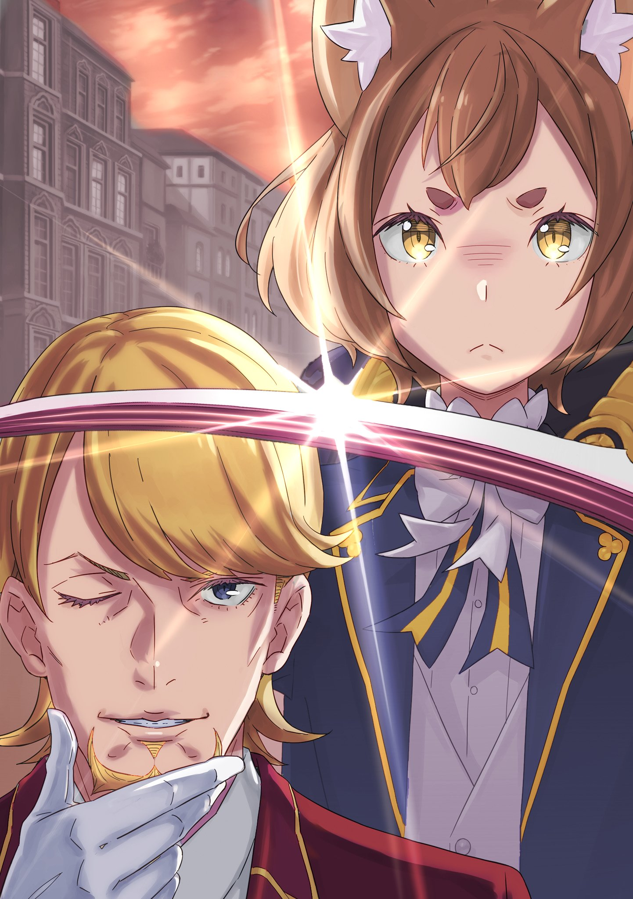

Феликс Аргайл … Таково было настоящее имя парня, стоявшего перед Субару. Он и раньше о нем знал — слышал от других, да и сам Феррис этим именем только что представился. И, однако, он ловил себя на мысли, что имя ничуть не состыкуется с милой внешностью — «Феликс» звучало слишком уж по-мужски, отчего в голове Субару произошел полный бардак. Чересчур сильно сросся образ этого парня с прозвищем «Феррис».

— Лишили … звания рыцаря? — переспросил Субару. — То есть …

— Меня уволили, — ответил Феррис, поправив фрак. — Ну, что поделать, так уж вышло. Я был готов к этому, когда решил, что стоит доверить госпожу Круш Церкви. Только так ее можно было спасти. — Он прижал ушки и потупил взгляд. — Ах да, госпожа Эмилия, пожалуйста, не вините себя.

Да как он может с такой деланной легкостью говорить о том, что ушел?!

— Феррис … — Эмилия, застывшая на полпути к нему, не знала, что ответить: она то поднимала руку, то опускала ее, словно взвешивала то, что хотела сказать.

— Когда вы к нам пришли, мне правда стало легче, — ответил Феррис с грустной улыбкой. — Я тогда понял, что, кроме меня и старика Вила, есть еще те, кто рад, что она спаслась … Так что я смог поверить, что сделал все правильно.

Растерянность и смущение — реакция Эмилии была нормальной. Но у Субару, глядящего на Ферриса, ответ был иным. Он скрипнул зубами и развернулся.

— Постой! — окрикнула полуэльфийка. — Субару, ты куда собрался?

— Тц … ясное дело куда — к Круш, — огрызнулся он низким, срывающимся голосом. — Это уже перебор!

Картина была ясна: чтобы спасти Круш от Драконьей крови, пришлось прибегнуть к помощи Церкви Божественного Дракона. Как следствие — это плохо сказалось на ее Лагере в Королевских Выборах. А выбор этот сделал Феррис, пока его госпожа валялась в отключке. Да, он спас ее, но теперь победа в Выборах для них была недосягаема. Круш, что желала во что бы то ни стало взойти на трон, очевидно, такого исхода не желала.

— Но ведь ты сделал все это ради нее! — кричал Субару. — Ради Круш! А она тебя выгоняет? Это … это просто неправильно!

Он в сердцах отшвырнул руку Беатрис.

— Субару! — вскрикнула она.

Но юноша не остановился. Он был готов побежать обратно в поместье Карстен, ворваться к Круш и потребовать, чтобы она отменила свое решение, даже если придется трясти ее за грудки.

Однако первый же его шаг прервали. Перед ним, раскинув руки, встала Рем.

— Не мешай, — сказал Субару. — Я не хочу, чтобы вы видели, как я ору и бешусь.

— Если ты понимаешь, что путаешь берега, то лучше остановись сам, — ответила девушка. — И может, вместо того чтобы закатывать истерику, соизволишь хотя бы посмотреть ему в лицо?

Сбитый с толку ее столь спокойным отпором, он замер.

— В лицо … ему? — переспросил Субару.

Рем кивнула в ответ и указала подбородком вперед. Обернувшись, юноша увидел встревоженные взгляды Эмилии и Беатрис, а за ними, у входа в усыпальницу — смотрящего на него сверху вниз Ферриса … того самого Ферриса, чья судьба подожгла в нем костер гнева.

Миловидный парень недоумевал с него. Сначала он перевел взгляд на Рем:

— Спасибочки, Рем … Впервые вижу, как ты стоишь и ходишь, но ты оказалась куда лучше, чем я думал. Жаль только, в парнях совсем не разбираешься.

Зажатый между ними Субару слушал их разговор.

— Мне говорили, что, пока я спала, господин Феррис тоже заботился обо мне, — она лишь спокойно поджала губы. — Вы мне помогли, так что отвечу спокойно … но вы сейчас очень и очень неправы.

— Вот как. Ну, раз ты так считаешь, то ладно. Кстати, рад, что ты проснулась.

— …

— Так вот, — Феррис решил сменить тему. Он с прищуром смотрел на черноволосого юношу сверху вниз. — Субару, ты все-таки нереально высокомерный.

— Высоко … мерный? — переспросил тот.

— Я даже слова подбираю, чтобы не сказать «эгоист». Цени это, ладно? Ты ведь все делаешь не только ради себя, но и ради других. Но получается это так хреново, что у тебя выходит только медвежья услуга.

— Эй, полегче …

— И знаешь … если ты высокомерен, то я подумал: может, и я тоже? — улыбнулся Феррис.

Стоило это увидеть, Субару словно окатили ледяной водой.

— …

Дыхание сперло, и он уставился на парня, что только что приравнял себя к нему и выругался столькими же колкостями, сколько и получил в свой адрес — пусть и невысказанными. Но, однако, не казалось, что в нем с момента встречи что-то переменилось: он казался неуловимым, слишком спокойным. Точно морской штиль.

Но этого просто не могло быть. Особенно учитывая, что стряслось с Феррисом, внутри него должен бушевать шторм, а не царить штиль. Субару вглядывался в его лицо, ища признаки этой бури. Но тот, словно не замечая этого, подмигнул и вдруг воскликнул:

— О! Точно. Госпожа Эмилия, не хотите зайти помолиться?

— Помолиться? — спросила та в ответ. — В той усыпальнице? А можно?

— Ага. Ключ у меня, смотритель доверил. Я тут, как никак, доверенный паломник, так что бываю часто.

— Доверенный паломник?.. — переспросил юноша.

— Ого, Субару, ну ты и деревня, — хихикнул парень, высунув язык. — Если Первый Рыцарь госпожи Эмилии продолжит в том же духе — она опозорится.

Субару прикусил язык. Его задело не столько то, что тот его обвинил в невежестве, сколько то, как легко Феррис обронил «Первый Рыцарь». Сейчас подобные слова были подобны ходьбе по тонкому льду. Впрочем, судя по озорному блеску в глазах, он сделал это нарочно.

А их настроением, оказывается, Феррис крутить еще как может.

Парень положил руку на приоткрытую дверь усыпальницы, из которой только что вышел:

— Давайте зайдем, там и поговорим о наболевшем. А то мне и так казалось, что Его Высочеству будет грустно, если я приду один.

Усыпальница эта выделялась даже на фоне Королевского кладбища. Она прямо давила своим величием. Помогали ей в этом собранный со всего Королевства мрамор, всяческие украшения в виде Дракона — символ союза со страной, — внешние стены, что сияли божественностью, отпугивающей нечистые силы, и рельеф Дракона на сомкнутых створках врат, который, казалось, вечно охранял достоинство усопших монархов.

Внутри открывалась белоснежная анфилада надгробий, что несли память королей и принцев. Ряды каменных саркофагов, выстроенные в строгом порядке, были украшены скульптурами и орнаментами, напоминавшими о прижизненных деяниях усопших. И это особенно чувствовалось подле надгробия, к которому они шли, — могилы Четвертого принца.

Феррис, цокая каблуками по натертому до блеска полу, остановился и жестом указал на выделяющееся надгробие:

— Вот здесь покоится Его Высочество … Фурье Лугуника.

В строгой, скованной тишиной усыпальнице здесь порядок словно дал слабину: могила Четвертого принца была слишком несуразной для места вечного сна.

— Это что, подношения? — спросил Субару, оглядывая могилу. — Письма, вязаные вещи, даже деревянные фигурки зверей …

— Не очень-то похоже на дары члена Королевской Семьи, правда? — ответил Феррис. — Но что поделать? Те, кто просил это передать, были уж больно далеки от придворного этикета и подобных правил.

— Далеки от этикета … то есть, это подарки от простого народа? Разве такое не изымают при проверке?

Феррис присел на корточки перед саркофагом и с теплотой посмотрел на разложенные предметы.

— Конечно, — ответил он. — Если бы это были какие-то шутки или издевки, то это бы сразу забирали. Но я, доверенный паломник, проверял все лично, когда принимал.

Эти вещи принесли те, кто правда любил Четвертого принца, невзирая на сословия. Каждый вложил в свои дары чувства.

Доверенный паломник — это тот, кто может с позволения смотрителя кладбища приносить дары от имени тех, кто не может посетить это место лично. И Феррис, как доверенное лицо, приносил сюда чувства людей к Фурье.

— Вообще-то, — начал он пояснять, все так же горбясь, — в роду Лугуника все были славными, добрыми и умели располагать к себе. Но Его Высочество Фурье был особенным — очень светлым и веселым человеком. Он то и дело сбегал из Замка, чтобы поиграть с простым людом.

— Обалдеть … прям сюжет из манги. Но ведь в реальном мире за такое по головке не гладят.

— Ну, бывало всякое. Принца нет, Гвардию поднимают на уши, ищут. А он, оказывается, стоит в очереди за бесплатной едой в трущобах, — вспоминал Феррис с улыбкой. — И ладно бы просто едой, так ее раздавала Церковь Божественного Дракона! Там у Замка и Церкви чуть скандал не случился, шуму было …

— Сейчас над этим как-то неловко смеяться.

Субару смотрел на могилу Фурье. В рассказах парня сквозила нескрываемая любовь к главному герою этих историй. Даже по этим обрывкам становилось ясно, почему принца так любили.

— Я ведь уже рассказывал тебе о Его Высочестве, Субару? — спросил Феррис.

— Ну, ты говорил, что был такой человек, что он дружил с тобой и Круш, — припоминал Субару. — И еще, кажется, ты говорил, что мы с ним чем-то похожи?

— Чего?! Ты и Его Высочество? Я тебя прибью! — на полном серьезе пригрозил тот.

— Тогда ты сказал то же самое! — тотчас оправдался он в испуге.

На самом деле, это было почти все, что Субару знал о Фурье. Но даже ему, недогадливому, было ясно: из-за смерти именно этого человека Круш решила вступить в Выборы.

— Значит, — подала голос Эмилия, — Круш решила стать королем ради принца Фурье?

— Как и ожидалось от вас, госпожа Эмилия, — ответил Феррис. — Спрашиваете прямо в лоб и невпопад.

— Ой, прости. Просто ты решил рассказать нам об этом и позвал на могилу … Я подумала, что если все узнаю, то смогу понять, что делать дальше.

— Что делать дальше? — переспросил Субару. — В смысле?

— Да. Ты меня опять обогнал, но я тоже собиралась пойти к Круш и попросить ее передумать. Мы бы с Субару попытались вместе ее уговорить. Как тебе?

— Хорошая мысль … — согласился юноша, как вдруг его ущипнули за бок. — Ай-ай-ай!

— Не говори глупостей на эмоциях, — упрекнула виновница, Рем. — Не забывай, где мы.

Феррис, наблюдая за ними, с горькой улыбкой поднялся:

— Я же говорил: пожалуйста, не ходите к госпоже Круш с разборками. Я знал, на что шел, с самого начала.

— Но …

— Я так решил. Хоть и сказал, что это меня лишили звания, на самом деле это я заявил, что больше не имею права быть вместе с ней. Да и … — он на миг замолчал и приложил палец к губам. После он этим пальцем показал на Эмилию и Субару. — Госпожа Эмилия, если бы я, или Совет Мудрецов, или кто угодно другой сказал вам: «Обдумайте хорошенько ваши отношения с Субару» — что бы вы сделали?

— А? Над нашими с ним отношениями я очень-очень много думала и решала сама. Если бы кто другой мне указывал на этот счет, я бы подумала: «Да кем вы себя возомнили?» … Ой.

— Вот именно. То же самое вы хотели сделать только что.

Эмилия поняла намек Ферриса: не надо лезть в чужие дела со всей своей большой, непрошенной заботой. Она понуро опустила плечи, и радость насчет ее хороших уз с Субару померкла, ввиду собственной бестактности.

Этот аргумент бил не только по ней, но и по Субару. Феррис прекрасно это понимал. Он пожал плечами, глядя на юношу поверх поникшей Эмилии:

— Отвечая на ваш вопрос: госпожа Круш не настолько узколоба. Так что участвовать Выборах она решила не только из-за Его Высочества Фурье.

— Но ведь мы не можем закрывать глаза на эту причину, да? — спросил Субару.

— Ой-ой, как мы цепляемся к словам. Где же твое старое обаяние? — язвительно ответил тот, хоть и не выглядел задетым, и продолжил: — Не спорю. Смерть Его Высочества стала для госпожи Круш … да и для меня, огромным событием. Нам было очень больно, рыдали так, что слез до конца жизни не осталось. Ну, я-то нытик, так что я и потом много плакал.

— …

— Госпожа Круш не показывала этого, но внутри страдала, мучилась … Но больше всего ей было больно от того, что стряслось потом, после его смерти.

— После?..

— Принц и остальные из Королевской Семьи умирали один за другим, все на уши встали. Госпожа Круш, как герцогиня Карстен, советовалась в Замке … и там поняла: всем был поровну на то, что умер Его Высочество. Они боялись только того, что может кончиться пакт с Божественным Драконом.

Феррис говорил тихо, старался сдерживать эмоции, но от этого его рассказ звучал еще страшнее.

По виду этой усыпальницы было ясно, как сильно любили семью Лугуника. У каждого надгробия, не только у Фурье, лежали подношения, молящие о покое усопших. Но даже смерть таких любимых людей померкла перед страхом потерять пакт с Драконом.

— Так вот почему … — выдохнула Эмилия. Она явно пришла к тому же выводу, что и Субару. Полуэльфийка прижала руку к груди, и в глазах ее заиграла скорбь. — И поэтому госпожа Круш решила, что когда станет королем, то сделает страну сильной, чтобы не нужен был пакт.

— Не только поэтому, но да, в этом есть доля правды.

— Не только поэтому?

— Она стала противна сама себе … потому что понимала: если бы не была так с ним близка, то думала бы точно так же, как и все.

Этого никто не мог знать наверняка, и проверить это было невозможно, так что винить себя за это не имело смысла. Но Круш встретила Фурье и пришла к этим мыслям. Ненавидеть себя ту, которой не существовало — лишь напрасно бередить раны.

Однако, слушая рассказ, до Субару дошло: все было куда сложнее, чем простое противоречие ее лозунгов на Выборах. Круш, поклявшаяся разорвать пакт с Драконом, была спасена силой Таинства … Таинства, что принадлежит Церкви Божественного Дракона, которая поклоняется этому самому Дракону. Но дело не только в этом.

— Госпожа Круш поклялась создать страну, где Королевскую Семью … где принца Фурье будут оплакивать честно, — продолжила Эмилия. — И правда пыталась это сделать. Но теперь не сможет.

— И Церковь не спасла Его Высочество. А госпожу Круш — спасла, — хрипло добил Феррис.

— …

Еще недавно они были готовы пойти к Круш, чтобы та передумала увольнять Ферриса, особенно учитывая ее здоровье. Но что мог теперь сделать Субару, когда узнал обо всем, что было растоптано в грязь? Если бы он только мог отдать ей руку или ногу, лишь бы забрать скверну на себя …

— Вот поэтому ты и высокомерный, Субару, — укорил Феррис, словно общался с ребенком. Он наклонил голову.

— Чего?..

— У тебя все на лице написано. Неудивительно, что Беатрис от тебя не отходит. Даже если бы ты мог что-то сделать, это ничего бы не решило, понимаешь?

Он понимал. Его мысли — поверхностные, пустые фантазии, и, как сказал Феррис, бесполезные. Даже если бы спасителем стал не Дракон, а Нацуки Субару, рыцарь Эмилии, это бы все равно ударило по ее репутации, ибо ей тогда пришлось принять помощь Лагеря соперника. А в самый разгар Выборов это б стало еще пущей проблемой.

— Не пристало королю полагаться на помощь, да?

— Жестоко … но да.

— Это не мои слова …

Это некогда сказала сама Круш. Во времена, когда за Эмилией охотился Культ Ведьмы, он пришел к ней с просьбой помочь, не предложив ничего взамен. Тогда она жестоко отвергла его мольбу.

И это был урок, который ему следовало усвоить. Да и Субару не держал на нее зла. Но, однако, было просто невыносимо, что теперь судьба сыграла злую иронию.

— Слушай, Феррис … не знаю, можно ли о таком спрашивать, — нарушила молчание Эмилия.

Вместо поникшего Субару к нему шагнула Эмилия, встав перед могилой Фурье. Она взглянула на дары, сжала в ладони кристалл, висевший на груди, и закрыла очи. Беатрис и Рем, что были позади нее, тоже вознесли безмолвные молитвы.

Закончив, Эмилия посмотрела на самый пышный букет цветов — тот, который поправил Феррис и который, несомненно, принес он сам, — и спросила:

— Госпожа Круш и принц Фурье … они любили друг друга?

— …

Феррис на миг широко раскрыл глаза, а затем тихо рассмеялся. И после ответил:

— Не пристало мне такое говорить. Это было бы слишком бестактно с моей стороны.

Дверь усыпальницы закрылась с тяжелым звуком, и Субару встретился взглядом с Драконом на барельефе. Очевидно, это было изображение Божественного Дракона, Волканики, того самого, что чеканят на монетах. Но теперь, услышав историю трагической любви Круш и Фурье, он стал относиться к нему более противоречиво.

— Я видел его вживую на Башне. Знаешь, голова-то у него совсем пустая. После этого как-то неубедительно звучат все эти пакты с Королевством и вера Церкви.

— Может, он приходит в себя, когда нужно, я полагаю? — предположила Беатрис. — А в остальное время копит силы, прямо как Отто, когда дел нет, в самом деле.

— Сравнивать Отто без работы с пустоголовым — это жестоко … Но Дракона все-таки уважают, так что для простого люда это, наверное, честь?

Субару попытался представить себе Божественного Дракона в режиме Отто-бездельника, но образ их пьяного от свободы министра мало помогал делу. Пить надо в меру, вот что.

— В общем … — Эмилия повернулась к целителю. — Феррис, что ты теперь будешь делать?

— Что делать?

— Угу. К Круш ты вернуться не можешь … тебе ведь будет трудно, да? Вы ведь жили в одном поместье. Тебе есть куда идти?

Они шли возвращать ключ смотрителю. Вопрос Эмилии застал Ферриса врасплох, и он растерянно почесал щеку.

Замечание попало прямо в аблочко. Наверное, Вильгельм послал их сюда именно потому, что волновался, куда тому податься. Каковы бы ни были причины, Круш и Феррис больше не были господином и слугой. Демон Меча, как вассал Круш, не мог открыто пойти против воли госпожи.

Попросить кого-то надежного присмотреть за Феррисом — это максимум, что Вильгельм мог сделать. Так что надо отвечать на эту его заботу по полной.

— Эмилия-тан имеет в виду вот что: не хочешь пока пожить у нас? — предложил Субару.

— Да, именно! — согласилась девушка. — Как тебе? Конечно, не навсегда. Просто расставаться вот так грустно, и тебе, наверное, нужно время. Я вот сто лет привыкала к тому, что заморозила всех в родном лесу.

— Думаю, сто лет — это все-таки слишком, — поправил Субару.

— Кстати, — добавила Беатрис. — Бетти было нужно четыреста лет, чтобы открыться любви Субару, я полагаю.

— Думаю, четыреста лет для него — это прямо-таки совсем слишком, — вновь поправил Субару.

Рем жалостливо взглянула на него из-за этих постоянных поправлений. Сие недоразумение придется улаживать позже, но предлагали они это Феррису на полном серьезе.

Феррис в ответ приложил ладонь ко лбу:

— Так и знал, что вы это скажете. Но все равно удивили. Я понимаю, я ведь гениальный целитель, за меня впору драться.

— Эй, я же не шучу … — оправдывалась Эмилия.

— Да, да, конечно, я знаю, что вы всегда серьезны. И мне правда приятно, что вы зовете. Честно-честно.

— Но судя по тону …

— Агась. Спасибо, что пригласили, но согласиться не могу, — с горькой улыбкой отказал он, покачав головой.

Хотелось настоять, но Субару понимал и причину отказа. Потому что …

— Даже если мы расстались, я дорожу госпожой Круш. Пусть из-за меня ей теперь вряд ли вообще получится победить, я не могу просто взять и уйти к другим.

— Н-не нужно ведь прямо уходить! — убеждала Эмилия. — Ты можешь меня даже ненавидеть. Просто … я не хочу, чтобы ты совсем пропал. Мне нужно знать, что у тебя все хорошо.

Пусть хотя бы будет у них в безопасности.

— Да не буду я вас ненавидеть … Ан нет, вру. Я вас ненавижу. Я всегда-всегда-всегда вас ненавидел, госпожа Эмилия.

— Э?! Что?! — оцепенела Эмилия.

Феррис же кивнул ей — «Ага» — и показал ключом от усыпальницы на остальных:

— И не только вас. Я ненавижу всех кандидаток, кроме госпожи Круш, и их рыцарей тоже. И Беатрис я ненавижу, и Рем — тоже, хоть толком ее не знаю … а Субару я ненавижу особенно.

— Говоришь так, как будто только меня по-настоящему ненавидишь …

— А с чего ты взял, что это не так?

Субару поперхнулся, не найдя, что ответить.

— Ты правда не передумаешь?..

Даже Эмилия поняла, что скрывается за этим «ненавижу». Феррис использовал неприязнь как щит, чтобы отказаться. Сколько бы его ни уговаривали, что бы с ним ни сделали, его преданность Круш оставалась неизменной.

— Не волнуйтесь вы так, — успокоил Феррис. — Ну, не знаю, вернусь ли в Гвардию, надо с капитаном поговорить, но вот в какой-нибудь лечебнице меня с руками оторвут.

— Ты ведь не натворишь глупостей? — спросил Субару.

— Глупостей? В смысле, совсем запущу себя и покончу с собой? Я-то? Не найти того, кто бы сильнее меня ненавидел смерть.

— Прости … был неправ.

В его ответе не было и тени шутки, он правда извинился, ибо даже вдали от госпожи Феррис не предаст свою суть — суть «Синего», суть целителя. В это Субару верил.

— А-а-а! Как же хреново! — завопил юноша. — К Круш не пойти, Ферриса не приютить, ничего не могу!..

— Разве не поэтому Феррис назвал тебя высокомерным? — спросила Рем.

— Во-во, послушай ее, — поддакнул целитель.

— Но, Рем …

— Некоторые проблемы могут решить только те, кого они касаются, — тихо вздохнула Рем, потупив взгляд.

Они были очевидцами трагедии, но не могли ее исправить.

— Как никто посторонний не может вмешиваться в твои отношения с Эмилией или в твой Контракт с Беатрис … так и наши с тобой …

— Рем?

— Какие у нас отношения? Кто ты мне?

— Не надо сейчас так резко приходить в себя! Ты мне дорога!

— И нам тоже! — поддержала Эмилия. — Нам Рем о-очень дорога!

— Спасибо вам, — бросила Рем, словно нарочито закрыла глаза на Субару.

— А я?! — сорвался он на фальцет.

Девушка же невозмутимо пропустила его крик мимо ушей.

Пока они препирались, Беатрис окликнула Ферриса:

— Эй, — и, держась за край одежды Субару, произнесла: — Бетти о тебе не так сильно волнуется, как остальные, в самом деле. Но у Бетти перед тобой должок, я полагаю.

— Сама Беатрис мне должна? — удивился Феррис. — Какой же должок может быть у Великого Духа?

— Ты спас Субару, когда его Врата чуть не сломались из-за его же бестолковости, в самом деле. Хоть он и пропустил твои советы мимо ушей и все равно сломал их, ты выиграл нам время, я полагаю. Без тебя не было бы Контракта Бетти и Субару, в самом деле.

— Ого. Это, пожалуй, приятнее, чем я думал.

— Наслаждайся моментом, я полагаю. Бетти всегда возвращает долги, так что, если с тобой что-то случится, я всегда приду на помощь, в самом деле, — Беатрис уперла руки в бока.

— Даже если Субару будет висеть на краю обрыва?

— Сначала подберу его, а потом стрелой к тебе, я полагаю, — гордо фыркнула девочка.

Феррис на миг замер, а затем, прикрыв рот, тихо рассмеялся: «А-ха-ха». Смех нарастал, и на глазах проступили слезы.

— Ох, ну зачем так … Не доводите меня до слез, госпожа Беатрис.

— Как и было сказано: нытик, полагаю.

Услышав это, он улыбнулся еще ярче.

Эмилия до самого расставания продолжала его уговаривать.

«Если передумаешь, приходи в любое время! Я всех предупрежу, тебя обязательно встретят! Обещаешь? Феррис, ты можешь пообещать?»

«Рикошет прилетел в меня!»

«Заслуженно».

Феррис понимал, что зла они не желали. Он винил себя за то, что каждым отказом омрачал ее лицо, но выбора не было.

— Не то чтобы у меня были к ним претензии, правда.

Даже лишившись звания, Феррис в душе оставался рыцарем Круш. И он не мог позволить себе, пусть и временно, искать убежища под крылом другой кандидатки на трон. Если об этом узнают, поползут слухи, которые только сделают Круш только хуже. А главное — он боялся того, что подумает она сама.

— В этом плане Его Высочество был крут … Неужели ему не было страшно?

В усыпальнице, перед могилой, он исповедовался сколько мог. Но стоило пройти совсем немного времени, как сожаления накатывали вновь.

Нытик, нытик, нытик. Даже в мужском фраке он не мог содрать с себя эту женственную слабость. Как же он себя ненавидел. Единственное, в чем он, кажется, поступил правильно — это …

— Хорошо, что я сам это сказал.

Как он и говорил Эмилии, отставка была его решением. Он понимал, что не сможет быть рыцарем Круш, еще тогда, когда принял помощь Церкви в лице Таинства Фьоре. Но его душа бы просто не выдержала, если бы это произнесла сама Круш.

Поэтому он опередил ее, чтобы та не утруждалась его выгонять … Ха. Хотел похвалить себя, а снова напоролся на свою трусость.

— Я только и делаю, что вру …

«Поступил правильно». Ложь.

«Фурье не боялся». Ложь.

«Нет претензий к Эмилии». Ложь.

Его отставка была щитом для его хрупкого сердца. Он знал, что даже Фурье приходилось собирать волю в кулак, чтобы пригласить Круш куда-нибудь. А успехи Эмилии и Субару — вообще нонсенс: начинали с нуля, а добились столького, что ставили в тупик всю высшую знать ее серебряными волосами и аметистовыми глазами … Так как же он, такой же рыцарь, мог ничего не чувствовать, глядя на это?

Феррис даже не спросил Субару о его правой руке, с которой тот снял перчатку. Раз Субару сам не заговорил об этом, значит, этот метод вряд ли помог бы Круш. Но это лишь догадка. Он не стал проверять. Причина проста: он сбежал от возможности того, что существовал другой вариант, помимо Церкви.

Все, что он делал, — это бежал от боли.

— А дорог ли мне кто-нибудь … по правде?..

Если бы он любил по-настоящему, разве не должен был беречь то, что дорого любимому человеку? Зная клятву Круш на могиле Фурье, разве не должен был искать путь, который не перечеркнет ее желание, даже если это означало бы продолжение ее мук? Может быть, именно гнев на его безжалостный поступок, на попрание ее клятвы, и заставил Круш вспомнить Фурье?

Если тот хаос в ее Воспоминаниях творился из-за ее злобы на предательство Ферриса … то, может, его ненавидит не только она, но и Фурье?

— Тц, хватит. Бессмысленно.

Опять он прикрывается самобичеванием, чтобы пожалеть себя. Вместо того чтобы тратить время на ерунду, нужно решить, как жить дальше, чтобы не волновать Эмилию с остальными и не ставить Вильгельма меж двух огней.

Причин оставаться рыцарем больше нет. Но титул «Синего» при нем. В любой лечебнице или институте магии его встретят с распростертыми объятиями. Найти работу проще простого. Но просто прозябать бессмысленно.

Он должен продолжать спасать кого-то своими руками — это неизбежно. Но есть и другое желание. Даже если Феррис … нет, Феликс Аргайл, сам лишил себя права на него.

Пока он шел, сверля глазами брусчатку квартала знати, на обратном пути из кладбища его кто-то окликнул:

— Ах, как удачно. Боялся, что мы разминемся.

Его уши дернулись на голос, он остановился и поднял глаза. Посреди дороги стоял мужчина.

Знакомый мужчина. Тусклые золотые волосы, глубокие синие глаза. Стройный, высокий и в дорогом костюме с аккуратной бородкой и волосами, он навевал элегантностью. Впрочем, для его профессии в этом не было ничего такого. Ведь это был …

— Рассел Феллоу, кажется? — спросил Феррис. — Из Торговой Гильдии.

— Да, верно. Для меня большая честь, что вы помните. Как мне к вам обращаться: господин Феррис? Или господин Феликс?

— Как хочешь, мне без разницы …

— Тогда, с вашего позволения, господин Феликс, — он склонился в учтивом поклоне. — В моем деле называть партнера полным именем надежнее, чтобы не было недоразумений.

— Ну-ну, — Феррис прищурился, глядя на мужчину — Рассела Феллоу.

Он — представитель столичной Торговой Гильдии, акула бизнеса, известный своей хваткой даже среди прожженных торговцев Столицы. Лагерь Круш пользовался его услугами во время охоты на Белого Кита, так что чужаком его не назовешь.

— Но учти, сейчас с меня взять нечего, — предупредил Феррис. — Я больше не при делах. Жаль разочаровывать …

— Контракт вассала с герцогиней Карстен расторгнут. Да, я в курсе.

— А слухи хлебом не корми … — сказал он и одернул себя за глупое начало разговора.

Рассел явно поджидал его. Такого раньше не случалось. И если он решил действовать именно сегодня, значит, у него есть веская причина.

И была еще одна глупость, которую Феррис заметил слишком поздно.

— Еще только вечер, а на улице ни души. Странно, да?

— …

Рассел стоял в центре дороги, метрах в десяти от Ферриса. И вокруг них, в оживленном обычно квартале знати, не было никого. Будь это глубокая ночь или раннее утро — ладно, но до заката такое невозможно. А если невозможное происходит, у этого всегда есть причина. И сейчас причина была в том, что …

— Господин Феликс, я бы очень хотел побеседовать с вами. Не окажете ли честь отужинать в моем скромном жилище? Если, конечно, вы еще не решили, куда идти.

— Уже пытаешься завербовать, как только мне сняли ошейник? Извини, но это не ко мне …

— Нет-нет, это не вербовка. — Рассел медленно, словно с сожалением, покачал головой. — Видите ли, разговор носит принудительный характер.

Тотчас Феррис почувствовал, как к его тонкой шее прижалось холодное лезвие — кто-то возник прямо у него за спиной.

— !..

Дыхание перехватило. Он не мог пошевелиться. Все произошло вмиг. Он понял лишь, что у горла — изогнутый узкий клинок, а за спиной стоит кто-то гораздо выше его.

Нет, не только это. И еще …

— Ты ведь не просто торговец, да? — спросил Феррис.

— Кто знает, — ответил Рассел, пока шаг за шагом подходил к нему, — хотелось бы им оставаться.

Обездвиженный клинком у горла, он старался хотя бы не отводить взгляд, вновь проклиная себя. Как он мог принять человека с такими ледяными глазами за простого гражданского?

Феррис закусил губу, дабы не застонать. Это все, что он мог сейчас сделать — его последний рубеж.

Глядя на него в упор, Рассел с тем же ледяным взглядом произнес:

— Теперь, когда вы больше не рыцарь герцогини, ничто не мешает допросу. Вам придется рассказать о том, что передается в роду Аргайл … о Таинстве Бессмертного Короля.

