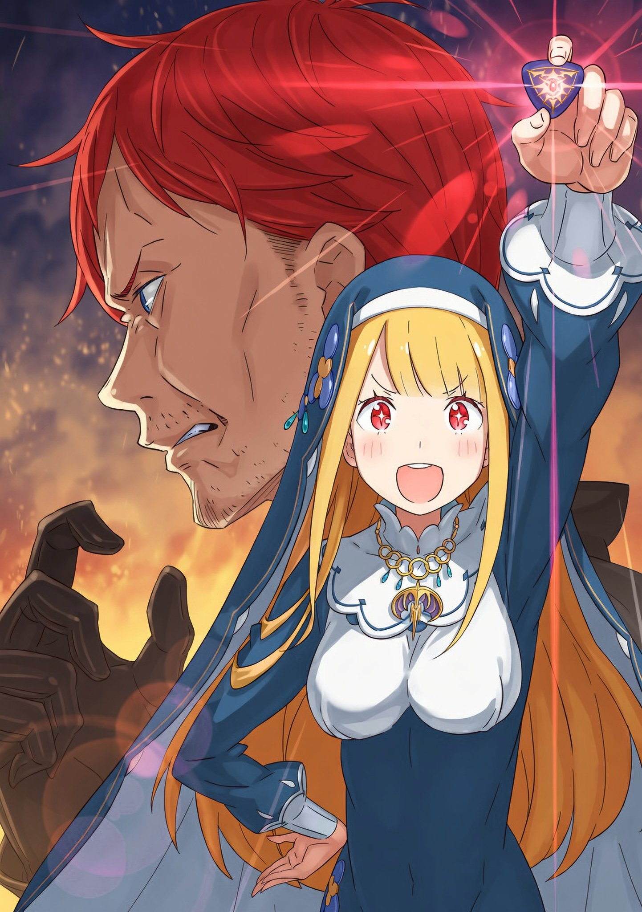

— Сакура, ну скажи, разве вы с Тигой со мной не жестоки? — спросила Фьоре. — Знай я, что все так обернется, я бы … я бы ни за что!..

— Неуже-ели ты думала, что если спасешь кого-то Таинством, то все зако-ончится одним твоим споко-ойствием? — протянула Сакура.

— Да я бы все равно спасла, даже если знала! Но одно дело — делать это специально, а другое — вот так! Теперь у меня на душе неспокойно!

Фьоре прекрасно сознавала, что сначала делает, а только потом думает. Она со слезами на глазах воззрилась на сидящую напротив Сакуру. Назвавшаяся ее старшей сестрой, она лишь свела брови:

— Но от ва-аших жалоб ничего не поменяется, на-ам ведь тоже нелегко. Субару, Беатрис, вы ведь меня понима-аете?

— Не знаю, с чего вдруг ты решила приплести сюда нас с Беако, но в целом ясно, что все к этому и шло, — ответил Субару.

— И кто бы ни был виноват, — добавила Беатрис, — заварила эту кашу именно Фьоре, я полагаю. По вашим перепалкам это сразу видно, в самом деле.

Юноша и его Дух удрученно покачали головами.

К слову о рассадке: сейчас на диванах в гостиной друг напротив друга сидели хозяева и гости. Со стороны хозяев — Эмилия, Отто и вцепившаяся в руку Эмилии Фьоре. Напротив них — Сакура, а также пересевшие к ней Субару и Беатрис. А вдоль стен выстроились Петра, что была здесь с самого начала, и проводившая Святую Рем, отчего в гостиной стало еще теснее и многолюднее.

— Хотя львиная доля шума здесь на Фьоре, — заметил Субару. — И вообще, почему мы-то сидим на этой стороне? Какая-то странная компания подобралась.

— Какой ужас! — наигранно испугалась Фьоре и прильнула к полуэльфийке. — Эмилия, ты слышала? Субару пытается разлучить нас, двух лучших подруг! Может, он шпион Церкви?..

— Если тут и есть шпион Церкви, то это ты сама, я полагаю, — вздохнула Беатрис.

Эмилия с мягкой улыбкой погладила Святую:

— Перестань так смотреть на Субару, Фьоре. Он очень добрый и не хочет нам мешать. Да и у меня с тобой совсем не такие отношения, как с ним.

— Д-да, конечно, — внимала Святая. — Думаю, ты права … А кто тебе важнее, если не секрет?

— Э? Ну …

— Нет, постой! Ничего не говори! — она уткнулась лицом в книгу. — В писании сказано: «Испытания, ниспосланные Драконом, даруются от великой любви. Как золото очищается в пламени, так и душа, когда проходит через горнило страданий во имя любви, обретает сияние, достойное взора Дракона!»

Фьоре сейчас походила не на благочестивую прихожанку Церкви Божественного Дракона, а на страуса, который прячет голову в песок религиозных догматов от неудобной правды.

Из-за того, что Святая ее перебила, Субару так и не узнал, насколько он важен Эмилии, отчего несколько раздосадовался. Но сейчас было не до того.

— Итак, насчет нашего разговора … — Эмилия посмотрела на Сакуру, закрыв глаза на Фьоре, которая то бледнела, то краснела. — Фьоре ведь будет участвовать в Выборах, чтобы заменить Присциллу, да?

Сакура чуть прищурила свои и без того сонные глаза:

— Скажем та-ак: ее смерть — точно один из по-оводов. В противном случае бы начали-ись противоречия с текстом драконьей Скрижа-али.

— Если верить пророчеству, кандидаток, то есть Жриц, должно быть пять, — произнес Отто. — И политика Церкви не позволяет пойти против этого предписания.

— Но прошу-у вас, не думайте, будто мы то-олько и ждали повода, чтобы с радостью вломиться в За-амок, — ответила Сакура. — Даже если из-за кончины Присциллы стало на одно место бо-ольше, Церковь собиралась держаться поодаль.

— Но все вышло по-другому. А причина тому … — Отто не договорил, но все присутствующие разом посмотрели на Фьоре — ту самую искру, из-за которой и разгорелся этот пожар.

Святая, побледнев, сглотнула под натиском взглядов и вцепилась в Эмилию:

— Нет-нет, Эмилия! Я никогда не хотела быть тебе соперником! Просто так совпало! И во-о-ообще! — Фьоре резко повернулась к Сакуре и выпалила, широко распахнув глаза: — У меня есть вопросы ко всем этим секретикам Церкви! А все потому, что вы меня держали взаперти, как будто я какой-то цветок в теплице! Я, конечно, рада, что мне не надо было учиться, как другим детям, но чтобы из-за этого ссориться с Эмилией … Я тут ни при чем!

— Ну-ну, не плачь, Фьоре, — нежно сказала Эмилия, гладя ее по голове. — Я совсем не злюсь. Да и я никогда не думала о других кандидатках как о своих врагах.

— Э-Эмилия … — Буря под ласками начала утихать.

И Сакура прикрыла рот рукой:

— Ого-о. Обычно после таких истерик она еще до-олго дуется, но у вас, Эмилия, просто тала-ант! В чем ваш секре-ет?

— Давайте оставим шутки про магию рук Эмилии-тан, из-за которой таят всякие Фьоре … — встрял Субару. — Если серьезно, зачем она все-таки пришла?

Судя по ее поведению, это явно не объявление войны. Неужели она мчалась через всю столицу, просто чтобы поплакаться и оправдаться?

— Я вовсе из-за этого не удивилась, в самом деле, — фыркнула Беатрис.

— Я, в общем-то, согласен, но так мы с места не сдвинемся …

— Постойте! — остановила Фьоре. — Вы за кого меня держите? Да, я часто делаю что в голову взбредет, но сегодня все по-другому! У меня есть план!

— План?

— Именно! Я не хочу участвовать в Выборах. Но я хочу выполнить свой долг Святой и использовать Таинство. Поэтому Эмилия спрячет меня у себя, а я тайком буду спасать жителей Пристеллы! Ну как вам?!

— Это сценарий для злодеев из детских мультиков?

Тот еще, конечно, дырявый план, шитый белыми нитками … хотя его цель — спасение людей, так что на что-то криминальное это не тянуло. Но ведь Сакура ее уже нашла — то есть план провалился, даже не начавшись.

— Да и если поползут слухи, что мы похитили Святую, нам не поздоровится, — добавил Субару.

— Сестрица Эмилия тоже иногда так делает, но все куда страшнее, если кто-то сам не понимает, что он — ходячее бедствие, — вздохнула Петра.

— Ой, это значит, что мы с Эмилией так похожи?.. — воодушевилась Фьоре.

— Тут нечему радоваться, я полагаю, — осадила ее Беатрис. Святой даже не дали сказать что-то против.

Да и вообще, Субару казалось, что она слишком уж легкомысленна ко всему вокруг. Фьоре упорно пыталась свести все к отказу от участия, но …

— Статус кандидата на трон нельзя просто так взять и отбросить. Ведь так?

— Эмилия …

— Я ведь каждый день столько учусь. — Эмилия смотрела на Фьоре серьезнее некуда. — Мне кажется, я теперь понимаю дела Королевства куда лучше, чем раньше … и я знаю, как сильно важен драконий жемчуг. У меня с самого начала была причина участвовать в Выборах, но, даже если бы ее не было, я не думаю, что мне дали бы отказаться.

Понятно, что права на отказ у кандидаток нет. Вчера Субару обсуждал это с Гарфиэлем и Петрой: Пакт с Драконом в этом Королевстве — догма. Да и, помнится, Фельт тоже пыталась отказаться, но ее все равно вынудили, когда взяли в заложники старика Рома.

Государство не остановится ни перед чем, чтобы посадить на трон Жрицу, на которую указала Скрижаль. И Эмилия пыталась донести до Фьоре, что ее ждет то же самое.

— Но … но ведь я этого не просила!

— Да, пожалуй, так и есть, — в голосе полуэльфийки чувствовалась воистину материнская любовь. — И если бы в твоих руках инсигния не горела, мы бы об этом даже не говорили. Но … драконий жемчуг засиял. Тебя выбрали. И ты лучше всех должна понимать, что это значит.

— Уу … — Фьоре виновато опустила голову.

Она — монахиня Церкви Божественного Дракона. Фьоре с детства воспитывали в почитании Дракона, и кому, как не ей, осознавать всю непреложность пророчеств Скрижали. Ее выходки до сей поры были лишь попыткой сбежать от реальности. Но …

— Тогда … смотри: давай заключим дружеский союз! — предложила Фьоре. — Я буду тебе во всем помогать, чтобы ты стала королевой! И тогда на Выборах …

— Спасибо тебе большое, но … я этого отнюдь не хочу, — спокойно, но с непреклонной твердостью отказала Эмилия.

От благородного звона ее голоса у Фьоре сперло дыхание. Полуэльфийка потянулась к карману, достала значок и раскрыла ладонь … и тотчас красное сияние драконьего жемчуга ярко озарило гостиную особняка.

— Как я уже сказала, у меня с самого начала была причина участвовать в Выборах, — говорила она так, чтобы ее слова проникли в самое сердце Фьоре.

Поначалу Эмилия вступила в гонку лишь ради того, чтобы заполучить хранящуюся в Замке Драконью Кровь и спасти замерзший лес. Но время шло, она встречала новых людей, узнавала мир, и ее отношение к Выборам постепенно менялось … но та первая, заветная мечта никуда не исчезла. И …

— У других то же самое. У Круш свои цели, у Анастасии — свои, у Фельт — свои … у Присциллы … тоже были свои … Все они ради чего-то вступили в эту битву. Хотя нет, не так.

— Не так? О чем ты? — опешила Фьоре.

— Когда у кого-то загорается жемчуг, они получают право участвовать. У них есть желания, которые невозможно исполнить по-другому. И если так, значит, у тебя они тоже есть, — Эмилия мужественно, но в то же время нежно улыбнулась девушке.

— У меня … тоже?..

Фьоре предлагала стать кандидаткой лишь для того, чтобы поддерживать подругу, но Эмилию такой суррогат мечты не устраивал. Она не могла признать равной ту, кто вступает в борьбу за Лугунику с такой слабой мотивацией.

— Очень прошу тебя, не отказывайся сразу только потому, что тебе страшно и непривычно. Подумай как следует. Отказаться от Выборов тебе не дадут. Но я не хочу, чтобы место Присциллы занял тот, кто делает это спустя рукава.

Это были сильные слова. Это была воля. Это была мольба.

— …

Фьоре лишь хлопала глазами в ответ на этот искренний душевный порыв. В повисшей между ними паузе никто не смел проронить ни слова. Ни Субару, ни остальные не хотели нарушать эту тишину. Никто не хотел примешивать ничего лишнего к выбору, который сейчас предстояло сделать Фьоре.

— Держи, — первой нарушила тишину Эмилия, что была к Фьоре ближе всех.

Прищурившись, она протянула ей свой значок, и Фьоре рефлекторно взяла его. Пусть она сделала это неосознанно, жемчуг на значке не выбирает время для сияния.

— Если … если я все-таки буду участвовать в Королевских выборах …

Жемчуг в ее руке вспыхнул так же ярко, как и у Эмилии. Какую же цель она изберет перед лицом этой неизбежной судьбы? Глядя на свет, идентичный цвету своих глаз, Фьоре торжественно произнесла:

— Я хочу поменять отношения между Королевством и Церковью. Чтобы, когда нужна помощь, люди из-за этих глупых суеверий не думали лишний раз. Ни в Замке, ни в Церкви.

— …

— Если я стану королевой, я построю страну, где никто не будет бояться помогать другим.

В ее словах сквозил юношеский идеализм, им не хватало должных раздумий и конкретики. Но это было ее искреннее желание — стремление разрушить барьеры, в которых она, как монахиня Церкви Божественного Дракона, выросла и которые всегда ее тяготили. И никто в этой комнате уже не посмел бы назвать ее жалкой заменой или марионеткой, которую силком втащили в Выборы ради числа.

— Говорил же я, надо гнать взашей всех, кто заявляется без спроса, — тихо пробормотал Отто. Одетый по-домашнему, без привычной шляпы и плаща, он нервно ерошил свои серые волосы, обдумывая итоги случившегося.

Субару его прекрасно понимал.

— На сцену выходит лютый конкурент, — вздохнул юноша.

— Это просто смехотворно — помогать врагу! — простонал Отто. — И самое ужасное, что решила это наш лидер!

— Спокойно. Чем сильнее противник, тем круче становится Эмилия-тан.

— Если хотели утешить, могли бы подобрать слова и получше!

— На этот раз мне даже грустно за Отто, в самом деле, — произнесла Беатрис, прищурившись. — Но …

Субару был с ней солидарен. Они оба смотрели вперед, на залитых светом девушек. Если судить по одним фактам, Эмилия совершила невероятную глупость. Он уже видел, как Розвааль падает на колени от отчаяния.

Но оно того стоило. Да, они получили сильную соперницу, но взамен …

— Я ни за что не проиграю Фьоре!

… будущая правительница Эмилия, без сомнения, стала еще на шаг ближе к трону.

— Исходя из вышесказанного, я с честью принимаю предложение участвовать в Королевских выборах, — заявила Фьоре, прижав одну руку к груди, а другой показывая ярко сияющий значок. Ее тон был пронизан такой дерзостью и бесстрашием, словно для нее вообще не было преград.

Дело было в Королевском Замке. Но не в тронном зале, куда их вечно вызывали по любому поводу, а в более мелкой комнате переговоров. В зале размером с обычный школьный класс стоял круглый стол человек на двадцать. Как правило, именно здесь собирались Совет Мудрецов и знать.

— Знаешь, когда начались Выборы и тебя выгнали из зала, мы все пришли сюда и продолжили все обсуждать, — прошептала Эмилия.

— А, это пока Юлиус меня в порошок стирал …

— Я этого и не знала … — удивилась Эмилия. — Вы с Юлиусом когда-то поссорились? Но ведь потом же помирились? Вы же сейчас такие хорошие друзья.

— Насчет хороших друзей я бы поспорил, но, если бы не тот случай, мы бы с тобой не стали куда ближе, — усмехнулся Субару.

Ему не хотелось углубляться в то, как именно запомнился его тогдашний позор у людей — как-никак, «имя» Юлиуса исчезло. К счастью, сегодня в зале было много пустых мест, и почти никого из свидетелей того случая здесь не оказалось. Встреча проходила в обстановке строжайшей секретности: от каждой фракции присутствовал лишь минимум людей. От их Лагеря были только Эмилия, Субару и его верная напарница Беатрис. Впрочем, один из немногих участников этой тайной встречи — старец с длинной бородой — как раз видел те события.

Глядя на чудесным образом переменившуюся Фьоре, Миклотов МакМахон из Совета Мудрецов произнес:

— Хм. Ваш ответ, бесспорно, радует нас — тех, кто и предложил это вам … но позвольте все же уточнить: мы дали согласие, но почему на этой встрече присутствуют госпожа Эмилия и господин Нацуки?

— Этим утром, прежде чем явиться в Замок, мы все обсуждали. Эмилия — моя дорогая подруга, а Субару — ее рыцарь … По-хорошему, мне стоило бы привести сюда весь Лагерь Эмилии, ведь именно они помогли мне решиться.

— Но если бы вы это сде-елали, ни я, ни Церковь бы не смогли-и сохранить лицо, — с виноватым видом добавила Сакура, единственная сопровождавшая Святую от Церкви.

Фьоре недовольно фыркнула, но Субару не мог не согласиться с Сакурой: заявляться на столь важное официальное мероприятие толпой из чужого Лагеря было бы как минимум странно.

Однако внимание Миклотова, поглаживающего длинную бороду, зацепилось совсем за другое. Прищурив внимательные глаза, старец привычно выдохнул свое «хм» и медленно произнес:

— Подруга, говорите? Госпожа Фьоре из Церкви Божественного Дракона и … госпожа Эмилия.

— Вы опять за старое? — нахмурился Субару и подался вперед. — Что-то вроде: «Как же так, Эмилия — сереброволосая полуэльфийка, а Фьоре — монахиня Церкви Божественного Дракона»?

— Субару, постой … — попыталась остановить его Эмилия.

Но кроме него и Беатрис из их надежных товарищей здесь никого не было. А значит, Субару должен был высказаться за всех. Как Первый Рыцарь, он обязан твердо стоять против любой несправедливости в адрес своей госпожи.

— Господин Миклотов, вы прекрасно знаете обо всем, что Эмилия сделала за эти полтора года, — сказал он. — И зная все это, мне бы очень хотелось, чтобы важные шишки Королевства перестали смотреть на нее через призму суеверий. Пора бы уже забыть про «полуэльфийку».

— «Забыть» было бы слишком неуважительно к простому люду, — опытный оратор Миклотов мягко, но твердо осадил пыл Субару. — Мы прекрасно понимаем, что между госпожой Эмилией и той самой Ведьмой нет ничего общего, кроме расы и внешности … но именно это и имеет колоссальный вес. Вы ведь и сами это понимаете.

— Угх …

Субару отступил. Ему, пришедшему из другого мира, было сложно в полной мере прочувствовать тот первобытный страх перед Ведьмой, что укоренился в жителях сего мира. И проблема касалась не только Эмилии.

— Вполне нормально, что народ сильно удивится тому, что в Выборы вступает монахиня Церкви Божественного Дракона, — обратился старец к Фьоре. — Это идет вразрез со многими традициями. Для нас это решение было крайне непростым.

— Да, я это понимаю. Но …

— Хм. Что же за «но»?

— Но тогда почему вы вообще решили так настойчиво втянуть меня в Выборы?

Вопрос Фьоре был вполне закономерен. По тону Миклотова было ясно, что королевский двор не был особо рад кандидатуре от Церкви.

— Я — монахиня, и свято чту предписания драконьей Скрижали, — продолжила Фьоре. — Но даже после смерти Присциллы Бариэль нельзя оспорить, что Выборы идут с пятью Жрицами. Пророчество ведь не было нарушено, да?

— Или же текст на Скрижали поменялся? Хотите сказать, там появилось указание найти замену выбывшей жрице?

— Нет, сообщений о том, что текст на Скрижали изменился, не поступало. Просто в этом вопросе все решает не наша воля, а глас народа.

Субару и Эмилия в унисон удивленно наклонили головы:

— Народа?

— Глас?

Миклотов чуть понизил голос:

— Вскоре это и так станет всем известно, но пока пусть останется в стенах этой комнаты. Видите ли, по столице поползли слухи о том, что Святая из Церкви Божественного Дракона спасла герцогиню Карстен.

— !

— Замок строго-настрого запретил это распространять, — сокрушенно вздохнул старец. — Безусловно, слухи всегда найдут, где просочиться, прямо как дождь, но … говорят даже, что у этой Святой та же внешность, что и исчезнувшей принцессы Лугуники.

— Да вы просто все слили подчистую! — возмутился Субару.

Миклотов помрачнел, словно признал поражение. Брешь просто ужасная! Если это правда, то хваленая секретность Королевского Замка оказалась не такой уж секретной.

— Слушай, Фьоре … — Субару подозрительно прищурился. — Только не говори мне, что ты на радостях побежала всем растрепывать, как круто спасла Круш?

— Это бы все объяснило, я полагаю, — кивнула Беатрис.

— Ничего это не объясняет! — отрезала Фьоре. — Ничего я не растрепывала! У меня тоже есть голова на плечах! Ну, может, я и обмолвилась об этом кое-кому из близких, чтобы переубедить церковников … но чтобы кричать об этом на весь город — ни за что!

— М-да. Беако, что скажешь?

— Скажу так: рыльце у нее не просто в пушку, а пуху там по самые уши, в самом деле.

Субару был склонен с ней согласиться.

Фьоре же возмущенно затопала ногами, но, если вспомнить все ее грешки, поверить в невиновность было сложно. В любом случае, от кого бы ни пошли слухи …

— Значит, слухи о том, что у Фьоре загорелась инсигния, тоже поползли? — спросила Эмилия. — И теперь все требуют сделать ее кандидаткой?

— До этого пока не дошло, — ответил Миклотов. — Однако вскоре нам придется официально объявить о кончине госпожи Присциллы. И если в этот час народу уже будет известно о Фьоре, то будет премного тех, кто станет требовать от нее вступления в Выборы.

— И чтобы не было бунта, вы решили все подготовить заранее … — подытожил Субару.

Раз участие Фьоре неизбежно, лучше оформить все официально и без лишнего шума — логика политиков была понятна. Но мысль о том, что Фьоре была лишена права выбора, не давала ему покоя. Если бы Эмилия вовремя не вразумила ее, Фьоре ввязалась бы в гонку в самом ужасном расположении духа, совершенно к этому не готовая.

— Ну-ну, не хму-урьтесь так, Субару, — протянула Сакура. — Как никак, все решилось как нельзя лучше. Разве важен процесс, если хоро-ош итог?

— А вас саму это устраивает, Сакура? Фьоре ведь вообще не должны были выпускать из Церкви. Ее участие в Выборах — это же сплошная случайность, так?

— Как бы вы ни хотели, лепестки только и могут что плыть по ветру или воде.

— …

Субару невольно опешил от того, как резко упал ее голос. В ее тоне сквозило глухое, как дупло старого высохшего дерева, абсолютное смирение перед судьбой. Казалось, Сакура говорит даже не о Фьоре, а о себе самой.

— В о-общем, чему быть, того не минова-ать, — Сакура вновь вернула свой беззаботный тон. — Да и даже если она сама-а уже воодушеви-илась, мы потеряли полтора го-ода, которые будет трудно наверста-ать. Вряд ли мы победи-им.

— Эй, Сакура! — воскликнула Фьоре. — Зачем ты всю малину портишь?! Раз уж я участвую, то иду до победного … Мое упорство подобно самому Дракону!

— Мне вот интересно, — встрял Субару, — а что в Церкви думают о том, что Фьоре так часто говорит о Драконе всуе?

— Должно бы-ыть, думают, что это велича-айшее богохульство.

— Богохульство?! — ахнула Фьоре.

Оценка оказалась строже, чем думал Субару, но он был полностью согласен: ее манеры были далеки от общепринятого образа скромной Святой.

Как бы то ни было, он наконец понял и цель этого секретного собрания, и причину столь узкого круга лиц. Говоря простыми словами, они предварительно согласовали мнения всех сторон перед большой официальной оглаской.

Но тут в голову Субару пришел еще один вопрос:

— Слушай, раз Фьоре становится кандидаткой, значит, она тоже выберет себе рыцаря? Как мы с Эмилией или остальные?

— Ой, Субару, тут ты немного ошибаешься, — ответила Эмилия.

— Ошибаюсь?

— Ну … так уж вышло, что сейчас у каждой кандидатки есть свой рыцарь, но это не обязательно. Ведь ни я, ни Анастасия в начале Выборов не назначали официально рыцарей.

— Со мной-то все ясно, но вот Юлиус с самого начала был ее рыцарем.

— А, вот как. Надо это запомнить, ради Юлиуса, — принялась девушка вносить правки в прорехи памяти из-за стирания «имени».

Юноша обдумывал ее слова. И правда, в самом начале за спиной Эмилии стоял спонсор Розвааль, а Субару не был рыцарем — он вообще тогда еще не заслужил доверия. Так что технически рыцарь кандидатке не обязателен.

— Но согласись, с рыцарем как-то солиднее. Что думаешь, Фьоре? Кто бы лучше из близких подошел … может, май фрэнд? — предложил Субару.

— Май фрэ … а, ты про Тигу. Звучит неплохо. Вы с ним вроде очень хорошо ладите … — поддержала Эмилия, молитвенно сложив руки.

— Э-э-э, Тига — мой рыцарь? — протянула Фьоре полным, к удивлению, недовольства голосом. — И где же тут солидность?! Он, конечно, парень способный, и с ролью рыцаря бы справился, но он же постоянно ворчит! Чуть что — так сразу я во всех грехах виновата. Никакого почтения! И вообще, он и без титула таскается за мной повсюду, зачем его еще и официально назначать? Отклоняется! Твердо отклоняется!

— Ну, дело твое, тебе с ним работать … стоп. А как вообще обычно назначают рыцаря?

В случае с Субару все прошло просто: Эмилия сама посвятила его в рыцари, и он занял свое нынешнее положение. Но как обстоят дела у Райнхарда или Юлиуса? Иметь рыцаря — прерогатива не только кандидаток на престол, но как именно заключаются такие договоры, Субару, к своему стыду, не знал.

— Хм, извольте. Зачастую рыцарь сам ищет господина и приносит ему клятву верности, — просветил его Миклотов. — Однако, если речь идет о прославленном воине, господин может сам обратиться к нему с просьбой о службе и пообещать высокое жалованье и особые привилегии.

— Ого, не ожидал лекции от самого господина Миклотова. А у вас, кстати, есть свои рыцари?

— В нашем доме немало тех, кто служит нам долгие годы и кому мы всецело доверяем. И, как правило, человек, которому присягнул выдающийся рыцарь, заслуживает особого уважения в обществе.

— Ну … это логично.

Действительно, статус «Святого Меча» или «Безупречного рыцаря» придавал именам Фельт и Анастасии огромный политический вес. Известность первого рыцаря — важный козырь в гонке за трон … А приносит ли сам Субару достаточно пользы Эмилии как ее рыцарь? А как же Круш, которая лишила Ферриса статуса первого рыцаря? Будет ли она искать ему замену?

— …

«Прошу, не надо» — этот эгоизм больно ударил по Субару. Феррис наверняка бы сказал, что он опять лезет не в свое дело, пытается все контролировать. Но пропасть, что разверзлась между ними, возможно, затянется, если дать им обоим время остыть. Поэтому Субару хотелось, чтобы это место оставалось пустым.

И пока он предавался унынию …

— Господин Миклотов только что сказал … что прославленного рыцаря нужно умолять служить себе, чего бы это ни стоило, да? — тихо произнесла Фьоре, до боли сжав кулаки и явно с трудом сдерживая эмоции.

— А? Мне кажется, или поначалу это звучало не так драматично, в самом деле? — удивилась Беатрис.

— Да и смысл был немного другим … — пробормотал Субару, возвращаясь из уныния в реальность.

То ли у Фьоре был избирательный слух, то ли она поняла сказанное Миклотовым по-своему, но щеки ее пылали от волнения.

— Фьоре, неужели у тебя уже есть кто-то на примете? — спросила Эмилия.

— Ох! Как ты догадалась? Наверное, потому что мы лучшие подруги?!

— Да, наверное. Так кто он?

— Заранее говорю: Райнхард уже занят, — предупредил юноша.

— И, само собой, — добавила Беатрис, — Субару тоже навечно занят Бетти и Эмилией, я полагаю.

Собрав на себе пристальные взгляды троицы, а также Сакуры и Миклотова, Фьоре загадочно усмехнулась. Резким движением она распахнула перед собой толстую книгу писания:

— Вдумчиво внимайте! В писании сказано: «Мечом вершит человеческая рука, но судьбами повелевает воля Дракона. Там, где ступает избранный рыцарь, даже кровавый след обращается сияющей серебряной тропой!»

— И что это значит?

— А то, что моим рыцарем будет только тот, кого избрал Дракон!

Трактовка показалась Субару весьма вольной, но если уж речь зашла о рыцаре, которого признал бы сам Дракон, на ум снова приходил только Райнхард. Ну, с большой натяжкой еще попадала и Эмилия, прошедшая Экзамен на первом этаже Башни Плеяд, но …

— Кандидатка в правительницы становится рыцарем другой кандидатки — это, конечно, интересный поворот, но у Эмилии уже есть я. Так что этот вариант не катит.

— Эмилия — мой рыцарь … Звучит очень заманчиво! Но нет, сейчас я надеюсь на другого. Хватит сбивать меня с толку!

Субару не стал отмечать то, как легко она повелась на его шутку, да и учитывая, что речь шла об Эмилии, ее можно было понять. Закрыв на него глаза, Фьоре кашлянула:

— Готовы? Как я уже сказала, если уж я, Святая Церкви Божественного Дракона, вступаю в Королевские выборы, мой рыцарь должен быть благословлен Драконом. И насколько мне известно, есть лишь один такой …

При такой формулировке оставался лишь один логичный кандидат. По иронии судьбы, это был человек, связанный с Фельт — той самой девушкой, с которой Фьоре предстояло делить не только гонку за трон, но и само право называться выжившей принцессой Лугуники. Первый Рыцарь Фельт — Святой Меча, Райнхард ван Астрея. Кто же еще …

— Господин Хейнкель Астрея.

— А?! — удивился Субару таким нелепым выдохом, будто услышал заведомо неправильный ответ на экзамене.

Но Фьоре стояла с победоносным видом, а сидевшие рядом Эмилия и Беатрис, как и юноша, смотрели на нее вытаращенными от шока глазами.

Фамилия была правильной. Астрея. Вот только человек оказался совсем не тем.

— Э-э-э … Фьоре?

— Ч-что такое? Почему вы на меня так смотрите?

— А как нам еще смотреть?! Умоляю, повтори еще раз: кто достоин стать рыцарем Святой из Церкви Божественного Дракона?

— Да сколько можно повторять … Господин Хейнкель Астрея!

Сколько ни переспрашивай, имя не менялось. Фьоре непонимающе наклонила голову. Ей искренне казалась странной именно их реакция. В конце концов, в ее глазах этот человек выглядел так:

— Я хочу назначить своим рыцарем выходца из рода «Святых Меча» — того, кто победил омывшую его Драконью Кровь и стал бессмертным … господина Хейнкеля Астрея!

Да, Фьоре, ставшая шестой кандидаткой на престол, с гордостью заявила, что ее Первым Рыцарем достоин стать лишь один человек — «Веролом Меча», Хейнкель Астрея.

