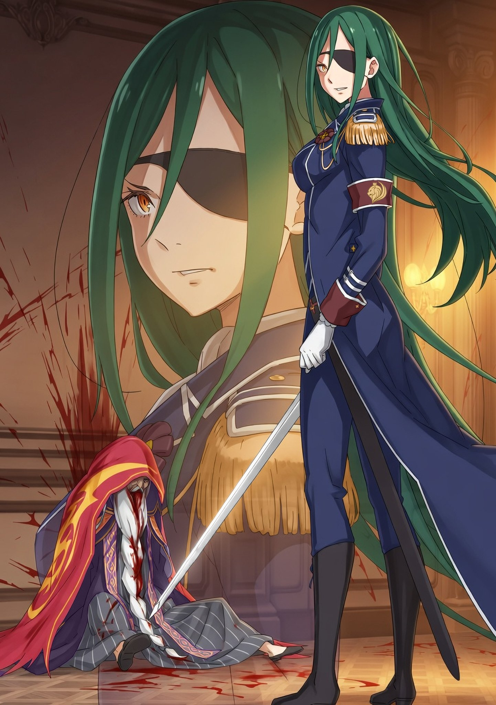

Субару держал за руку шагающую Беатрис. Сегодняшним утром стояла довольно ясная погода. Может, это знак того, что будущее будет спокойным? Юноша вдруг спросил:

— Слишком я, видать, размечтался, да?

— Бетти так не кажется, я полагаю, — ответила девочка. — Скажем так, ты просто заранее празднуешь. Если, конечно, Таинство Фьоре сработает как мы ждем, в самом деле.

— Ну, раз уж я начал праздновать раньше времени, значит, все-таки размечтался, — почесал Субару щеку.

Хотелось бы, конечно, хоть как-то оправдать свою радость, но если припомнить значимость его вклада в это дело — а точнее, в его скромности — то он не мог не отрицать: он и впрямь веселится раньше времени.

Сейчас они собирались к поездке в Город Водных Врат, Пристеллу. Там Церковь Божественного Дракона должна будет провести Таинство, дабы исцелить жертв Культа Ведьмы. Но, увы, самому Субару в этом деле никакой особой роли не отводилось. Он лишь хотел быть рядом при исцелении ужасных ран от битвы, в которой участвовал сам. И, конечно же, чтобы поддержать Эмилию — одну из тех, благодаря которой это чудо станет возможным.

— Поэтому я и напросился в экспедицию к Райнхарду. Пусть он в последнее время и зашивается от работы, но до Пристеллы нас добросит.

— Разумеется, Бетти тоже поедет, я полагаю. У Гарфиэля с Отто есть еще незаконченные дела. И у Эмилии. Ей ведь еще жителей размораживать, в самом деле.

— Гарфиэль же хочет увидеться с отцом знакомой семьи. Он ведь тоже пострадал от Полномочия Похоти. А Отто … едет забирать книгу у реставратора, да?

— Вроде того … ох уж этот проныра, ничего не упустит, я полагаю, — Беатрис недовольно надула щечки.

Субару прекрасно понимал ее смешанные чувства. Книга, которую Отто оставил реставратору в Пристелле, — это легендарная Книга Мудрости, наследие Ведьмы Жадности, Ехидны … точнее, тот ее экземпляр, который был у Розвааля. Когда Отто притащил то, что осталось от книги, в надежде докопаться до ее содержимого, его упорству оставалось только поразиться, как и самоуверенности мастера, который пообещал восстановить эти обугленности. Правда, это наверняка бередило раны Беатрис, чья Книга Мудрости сгорела дотла.

— Субару, тебе не о чем волноваться, в самом деле.

— Беатрис …

— Теперь мой путеводный свет — это ты, я полагаю. Конечно, жлобство Отто немного пугает — он сует даже горелые ошметки. Но если мы так сможем утереть нос Розваалю, то я не против, в самом деле.

— Вот как.

Ее звонкая уверенность мгновенно развеяла все тревоги. Сердце Субару сжалось от нежности, и он от души потрепал свою милую Беатрис по голове.

Как уже говорили, в Пристеллу на драконьей повозке Райнхарда отправлялся почти тот же состав, что и в прошлый раз. Он бы предпочел поехать всем лагерем, но Рам слишком устала, и заставлять ее было нельзя. От других лагерей же к ним присоединялись: Райнхард, управляющий повозкой, и Фельт, его надзиратель. А также главная звезда предстоящей экспедиции — Фьоре, и ее неизменная сопровождающая Сакура.

— Если честно, у нас и так дел по горло, — посетовал Субару. — Сажать Фельт и Фьоре в одну драконью повозку — это как мешать химикаты, которые норовят взорваться. Добра не жди.

— Но, как говорят, они уже давно познакомились, я полагаю.

— А, ну да. Это ж произошло, когда Фьоре пришла в Замок и вылечила Круш. Они тогда увиделись … и, говорят, именно Фельт сунула Фьоре инсигнию, чтобы проверить, а кандидатка ли она.

— Да, она бесстрашна до мозга костей, в самом деле. Любой другой бы трижды подумал, не навредит ли это ему самому, так что бы не рисковал, я полагаю.

— Она с самого начала не цеплялась за свое происхождение. Эта ее прямота … даже восхищает.

В этой бескомпромиссности Фельт крылась невероятная харизма. Люди, желавшие возвести ее на трон, шли за ней именно потому, что их пленяли ее слова, поступки и сам образ жизни. Они видели идеал в ее хрупкой спине. И если все это — чистый, неподдельный свет ее души, то нынешняя ситуация бросала на него совершенно ненужную тень.

— Значит, Фельт или Фьоре. Кто-то из них — настоящая принцесса, а кто-то — самозванка.

— Все это вообще звучит нелепо. Без разницы, кто настоящая. Если такое может быть, то надо трубить об этом отовсюду, иначе грош ей цена. Заставить одних поверить, а других — сомневаться … В этом же весь смысл.

Чем больше Субару об этом думал, тем больше понимал: слух о выжившей принцессе используется как-то криво. Беатрис права — это мощное преимущество не просто пропадает зря. Хуже того, на обеих девушках теперь висит ярлык: раз одна из них настоящая, значит, другая гарантированно фальшивка. И тут возникает главный вопрос:

— О чем вообще думала Церковь, когда скрывала Фьоре?

По словам самой Святой, пятнадцать лет назад ее подбросили к дверям Церкви. Там ее подобрали и воспитали в приюте при Церкви Божественного Дракона, пряча от мира как величайшую драгоценность. Так на свет появилось это невероятно деятельное, но совершенно наивное создание, не знающее внешнего мира … Впрочем, оставим в стороне хаос, который она успела устроить. Церковь Божественного Дракона знала ее внешность, возраст и даже имя. Невозможно, абсолютно невозможно, чтобы священники не связали все это с королевской семьей Лугуники. Более того, если Таинство Фьоре может противостоять Полномочиям Похоти и Чревоугодия, неужели эта сила не спасла бы королевскую семью от поразившей ее болезни? Почему же тогда Церковь Божественного Дракона позволила королевской семье погибнуть?

— Пока мы не узнаем наверняка, никто спать спокойно не сможет.

Тем более сейчас, когда весть о Королевских Выборах разнеслась по всей стране. Весь народ Лугуники затаив дыхание следит за тем, кто займет трон. Люди жадно ловят каждый шаг кандидаток, будь то громкий триумф или грандиозный провал, и ничего не забывают. Поэтому Субару нужно было понять, чего добивается церковь. Любой ценой. И для этого …

— Приглашение Миклотова пришлось как нельзя кстати.

— Именно, в самом деле.

Субару вспомнил события недавнего дня. Тогда, после того как Фьоре согласилась участвовать в Выборах, он и Эмилия остались в королевском зале заседаний и немного поговорили с Миклотовым.

Выбор рыцаря обернулся скандальным заявлением Фьоре, поднялся страшный шум, и все свернулось в спешке, но Субару успел извлечь свою выгоду — Миклотов, видный член Совета Мудрецов и, пожалуй, один из самых осведомленных людей в Королевстве, пообещал уделить ему время для личной беседы. Пока вокруг бушевал театр одного актера по имени Фьоре, он наудачу попросил старика о встрече — и тот на удивление легко согласился.

«Хм-м. Тогда я освобожу для вас время, господин Нацуки, — сказал тогда Миклотов. — У меня как раз тоже был к вам разговор не для чужих ушей».

«Это просто замечательно, но … ко мне?» — удивился тогда Субару.

«Именно. Мне нужно в кое-чем убедиться, кое-что сообщить и о кое-чем посоветоваться … Уж простите, но буду рад, если вы составите компанию старику и выслушаете мои долгие речи».

С добродушной старческой улыбкой Миклотов назвал адрес своей резиденции и назначил тайную встречу. Она должна была состояться сегодня, в час Огня, прямо перед отъездом в Пристеллу. Поэтому сейчас он шел по указанному адресу один — вернее, вдвоем с Беатрис, предупредив об этом остальных.

— Разговор с Миклотовым … Ладно еще вопросы и новости, но вот это его «посоветоваться» меня немного пугает. Хотя и у меня к нему есть целый вагон вопросов. В идеале бы вообще выпросить одним глазком взглянуть на драконью скрижаль.

— Говорят, драконью скрижаль охраняют так же, как и кровь Дракона — строго. Но если бы Бетти на него взглянула, то смогла бы понять природу его магии.

— Я не то чтобы не доверяю самой скрижали, просто … смерть всей королевской семьи проглядели, а вот как Выборы устраивать — так предсказания во всех подробностях. Странно это.

В душу закрадывались подозрения: а нет ли здесь злого умысла? Чьей-то направляющей длани? Не хотелось верить, что смерть монархов тоже была частью чьего-то плана.

В усыпальнице он своими глазами видел саркофаги почившей королевской семьи. Эту семью очень любили, и смерть Четвертого Принца обернулась для Круш и Ферриса страшной трагедией. Если такова была чья-то злая воля, то Субару никогда не простит виновника.

От этих мыслей он невольно сжал руку в кулак. И тут …

— А мысли-то у тебя весьма кровожадные, май фрэнд, — панибратски и бодро позвал его кто-то.

Неожиданный голос заставил его вздрогнуть и обернуться. Там, на Т-образном перекрестке, он увидел элегантно одетого юношу, который махал рукой. В ответ Субару расплылся в улыбке:

— «Май фрэнд»? — переспросил черноволосый юноша. — А мы, я смотрю, быстро перешли на «ты» …

— Эй-эй-эй, ты же сам меня так первый назвал! — юноша комично вытаращил глаза. — Не давай заднюю!

— Да шучу я. Рад снова тебя видеть, Тига, — сказал он и протянул руку юноше.

Тига смерил его подозрительным взглядом, пожал плечами и все же пожал руку. Дружба была официально подтверждена.

— Леди Беатрис, мое почтение, — обратился тот к девочке. — Для меня великая честь и радость встретить вас снова.

— Бетти позволяет тебе радоваться … но что ты здесь забыл?

— Хотел задать вам тот же вопрос. Не то чтобы я прятался, но, вообще-то, встреча должна была быть тайной.

— Тайной … погоди, тебя тоже позвал Миклотов?

— Выходит, и вас?

Субару с Тигой округлили глаза и ткнули друг в друга пальцами. Беатрис, встав между ними, потянулась на цыпочках и опустила им руки. От этого милого жеста Тига смягчился и тихо выдохнул:

— Фух, а я уж испугался, что за мной хвост. Хотя, подумал я, вряд ли кто-то стал бы следить за мной с ребенком на буксире … короче, не бери в голову.

— Эй, начал говорить — договаривай. Я не обижусь, честно.

— Правда? Ну, раз так: я подумал, что уж знаменитому «Пользователю девочек» Нацуки Субару устроить слежку с ребенком — раз плюнуть …

— Ах ты ж!.. Кого ты назвал «Пользователем девочек», придурок?! — Субару тотчас бросился на обидчика с кулаками.

— Ты же сам обещал, что не будешь злиться! — Тига ловко увернулся от всех выпадов и проворно спрятался за спину Беатрис.

Та, глядя на эти жалкие попытки спастись, лишь вздохнула:

— Хватит балаган устраивать. Субару, будь взрослее, я полагаю.

— Ц-ц, ладно, — ответил тот. — Раз уж я взрослый, то не стану отчитывать тебя за твои детские выходки. Потому что я — взрослый.

— Настоящие взрослые не кричат на каждом углу о том, какие они взрослые. Честное слово. — Тига выпрямился, поправил шляпу и кивнул в сторону перекрестка — туда, куда они оба направлялись. — Раз идем мы в одно место и время, то пойдем вместе.

— Я не против. Но зачем было городить эту тайну? Могли бы пойти вместе, взяли бы Эмилию.

— Эмилия — твоя госпожа. Станешь таскать ее за собой по своим личным делам?

— Не таскать за собой, а просто я бы ни на секунду с ней не расставался, если б мог.

— Знаешь … . — Тига внезапно запнулся и отвел взгляд. — Мне, конечно, приятно, но мое сердце уже занято … многими.

— Строишь из себя верного влюбленного, а несешь чушь как последний бабник?!

Субару рассмеялся — острый язык Тиги пришелся ему по душе. Он с самого начала чувствовал, что они на одной волне; обращение «май фрэнд» явно было не пустым звуком. Тига с улыбкой заразился его смехом, совсем позабыв о неловкости.

Беатрис же тем временем отошла немного вперед и встала на углу улицы, где поманила их рукой:

— Хватит дурачиться, вы двое. Мы пришли, в самом деле.

Субару и Тига прибавили шаг и одновременно поравнялись с ней.

На окраине дворянского квартала, точно по указанному адресу, высился просторный особняк. Цвет крыши совпадал с описанием — сомнений не было, это резиденция Миклотова.

— А о чем ты собирался говорить с Миклотовым, Тига? — спросил Субару.

— Хотел посоветоваться насчет одной пропажи. А вы?

— Мы с Беако в поисках исторических интриг. Хотели расспросить о темных пятнах в прошлом Королевства, ну и, может, выпросить одним глазком взглянуть на драконью скрижаль.

— Понятно. Отсюда и те кровожадные мысли. Дам тебе совет по дружбе: лучше не обсуждать посреди улицы, что именно ты собрался сделать с драконьей скрижалью …

Тига явно собирался сказать что-то еще, но вдруг осекся. Субару и Беатрис обернулись. Не дойдя до ворот, Тига замер; он напряженно вглядывался в каменную ограду особняка. На его точеном, красивом профиле отразилась острая тревога.

— Дело дрянь, — процедил он. — Пахнет кровью.

В левой руке — ладонь Беатрис, в правой — верный кнут. Субару крался по пропахшему кровью особняку, стараясь даже не дышать.

— Субару, не отставай. Прикрываем спины друг друга, — бросил Тига едва слышным шепотом.

Он, пригнувшись, тихо шагал впереди. В его руке тускло блестел обнаженный с тихим шелестом клинок — шамшир, серебряный полумесяц с глубоким, хищным изгибом. По тому, как уверенно Тига держал оружие, было ясно: он отлично им владеет. Субару некстати подумал, что Фьоре совершенно не разбирается в рыцарях, раз упустила такого бойца.

Через пальцы Беатрис передавалось его напряжение, а ему — ее. К счастью, она была крайне спокойна, что не давало им обоим сорваться в панику и пустить в ход спираль страха друг друга — эдакую карманную версию Полномочия Гнева.

Особняк Миклотова превратился в кровавый ад, от которого хотелось выть. Они вошли с черного хода и уже завидели больше десятка мертвых слуг и охранников. Всех изрубили. Причем каждого одним-единственным взмахом клинка.

Можно ли назвать такую сиюминутную смерть милосердием? Или же все-таки пущей жестокостью, что не давала и надежды на победу? Слова теряли смысл. От этого вязкого, бьющего в самый нос запаха смерти сердце колотилось так, будто норовило вот-вот проломить ребра. С этим делом он бы наверняка не справился в одиночку. Бежать, звать на помощь, поднимать тревогу — единственно верное решение. Но, однако, они шли вперед, ибо надеялись: вдруг кто-то еще жив?

— Их убили только что, — вымолвил Субару.

— Согласна, в самом деле. Может, хоть кто-то еще дышит …

В коридоре они наткнулись на новую жертву. Глубокая зарубка на стене, а прямо под ней — рухнувшее тело. Широкий удар рассек несчастного по диагонали и пробил даже стену за его спиной. Кровь убитого еще не свернулась. От нее исходил тот самый теплый, солоноватый дух, какой бывает у свежих трупов, — тошнотворная смесь угасающей жизни и торжествующей смерти.

— Как же бесит, что пережитое в Империи пригождается мне именно сейчас …

Самое страшное, самое кошмарное воспоминание в жизни Нацуки Субару — это Остров Гладиаторов. Там, в рукотворном аду, устроенном мерзким Тоддом Фангом, он видел горы трупов, среди которых были лица его знакомых. Там он насмотрелся на смерть вдоволь. И теперь с одного взгляда мог сказать, как давно человек испустил дух и сильно ли он мучился перед концом.

— Они … не мучились.

Тринадцать тел. Ни над кем не издевались. Но что это — милосердие убийцы или просто запредельное мастерство? То, что они умерли быстро, утешало разве что Субару и Беатрис. Какое же высокомерие!

Перед глазами невольно пронеслись ругательства Ферриса. С чего бы вдруг? Может, потому, что Феррис ненавидел смерть больше всего на свете, и Субару казалось, что сейчас от бессилия посреди этой бойни они бы поняли друг друга?

— Блядь.

Он видел столько смертей, но так и не смог привыкнуть. Сквозь тошноту и щемящее чувство утраты Субару закрывал мертвецам глаза и шел дальше. Он не поворачивал назад, потому что резня произошла только что. Надежда спасти хоть кого-то еще оставалась. Бегство означало бы смерть для тех, кто еще мог дышать. И к тому же …

— Миклотов все еще нужен этой стране.

Они почти не общались. К Совету Мудрецов, верхушке аристократии Королевства, у него не было теплых чувств. Но среди редких воспоминаний, погребенных под слоем давней обиды, одно сияло особенно ярко:

«По крайней мере, этот юноша доказал, что вы — не тот чудовищный полуэльф, которого так страшится мир … Хороший же у вас слуга».

Это проронил Миклотов, после того как Субару устроил безобразную сцену в тронном зале. Когда все отвернулись от него, когда его с позором выгнали. И он вспомнил об этом лишь сейчас. Но тогда, в тот самый день, среди толпы презрительных лиц нашелся человек, который взглянул на его отчаянную выходку иначе.

Субару этого не замечал. Ну и пусть. Сейчас он был безмерно благодарен старику. За это спасительное тепло он собирался отплатить Миклотову сполна.

— Субару, леди Беатрис, — позвал их Тига, что встал у массивных двустворчатых дверей.

Они не успели оглядеть весь особняк, но главные помещения прошли. Планировка дома была такова, что в случае нападения хозяин должен был укрыться именно здесь. Скорее всего, они найдут Миклотова живым именно тут. И вот …

Вместо слов Тига кивнул, резко распахнул створки и бросился внутрь.

Первое, что бросилось в глаза в просторном кабинете, — огромный флаг Королевства Лугуника во всю стену, на котором два дракона смотрели друг на друга с мечом посередине. Полотнище было распорото наискось, и одна его половина свесилась вниз … а там, на полу, сидел, привалившись к стене, человек. Он был завернут в край опавшего знамени. Мужчина лежал в огромной луже крови — видимо, принял на себя тот же чудовищный удар.

— А-а … — сорвался у Субару сдавленный стон.

Лицо убитого было опущено, но ошибиться было невозможно. Знаменитая длинная белая борода пропиталась кровью и стала багровой.

Это был Миклотов МакМахон. Великий мудрец, долгие годы бывший опорой Лугуники, нашел здесь свой безжалостный, пугающе обыденный конец.

Но Субару застонал не от этого. Не жертва заставила его оцепенеть. А убийца.

Посередине комнаты, спиной к вошедшим, стоял тот, кто оборвал жизнь старика. Виднелись стройная, точеная спина, длинные, блестящие зеленые волосы. Изгибы женского тела не мог скрыть даже строгий темно-синий мундир. Сей вид вносил в кровавую бойню пугающее, почти греховное изящество.

В руке она сжимала длинный прямой меч, на лезвии которого не было ни единой капли крови. Еще бы — ее клинок рубил врагов не сталью, а ветром.

Субару и его спутники замерли в шоке.

Женщина же медленно обернулась. Пред ними встала красавица, что была облачена в мужской костюм. Один ее глаз скрывала повязка, а янтарный, оставшийся холодным взор смерил вошедших.

— А, Нацуки Субару. Ответь мне … ты ли тот «настоящий», которого я знаю? — спросила посреди обители смерти и крови … Круш Карстен.

Тот в ответ смог лишь выдавить жалкий, беспомощный стон.

