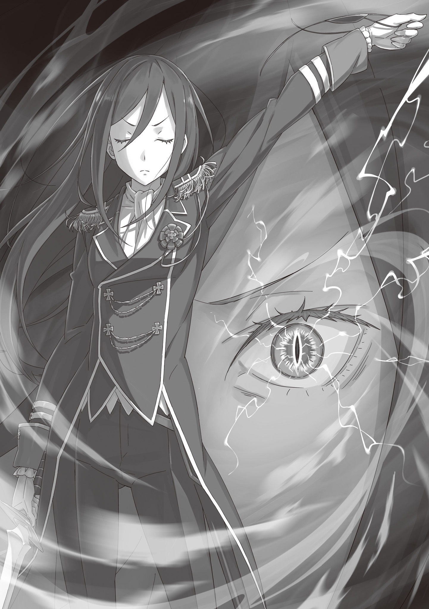

Особняк Миклотова МакМахона, одного из членов Совета Мудрецов, возвышался в дворянском квартале королевской столицы Лугуники. Его сдержанный облик всецело отражал характер хозяина, известного своей скромностью.

Многие аристократы любили ночные приемы и застолья — то и дело закатывали пышные празднества, чтобы похвастать своим могуществом. Однако Миклотов подобных привычек не разделял. С юных лет он блистал как государственный чиновник. Словно желая доказать, что он от и до принадлежит Королевству, он так и не обзавелся женой. Только лишь изводил себя неустанным трудом на благо страны.

Потому особняк МакМахона никогда не отличался броской роскошью. Во всяком случае, до сегодняшнего дня … дня, когда жестоко убили чертову дюжину людей, когда зловоние крови и смерти поползло по коридору … когда оборвалась жизнь самого Миклотова МакМахона.

Нацуки Субару застыл в оцепенении перед этой немыслимой, ужасающей картиной.

— …

Их сюда пригласили, но по пути через особняк им не встретилось ни единой живой души. Тринадцать мертвецов, которых они миновали, скорее всего, были стражниками и слугами. Каждого из них зарубили одним смертоносным ударом.

Субару оставил позади этот шлейф из трупов и добрался до дальней комнаты. Судя по письменному столу и книжным шкафам, это был рабочий кабинет. Здесь старец вершил дела, ломал голову над бедами Королевства и тревожился о его будущем … И в этом самом кабинете, пропитанном историей, у дальней стены сейчас сидел сам Миклотов.

Он вытянул ноги и привалился спиной к стене, словно ребенок, который наигрался и уснул прямо на полу. И в каком-то смысле так оно и было. Мудрый старец уснул. Уснул вечным сном под разрубленным флагом Лугуники.

А рядом с мертвым старцем …

— Госпожа Круш?.. — дрогнул голос Субару.

Миклотов рухнул на пол, веки на его морщинистом лице были сомкнуты. А над ним стояла она, обернувшаяся к вошедшим вполоборота. Прекрасная дева, кою украшали янтарные глаза и длинные зеленые волосы, была облачена в темно-синий наряд, который чем-то напоминал военный мундир … Левый ее глаз скрывала широкая повязка.

Это была Круш Карстен. Та самая девушка, которую Субару знал слишком хорошо. Она услышала сбивчивый оклик, прищурилась и поудобнее перехватила узкий меч, пока пристально смотрела на юношу.

— Я чувствую ветер страха, Нацуки Субару, — слетело с ее губ. — Чего ты боишься?

— Боюсь?.. Я? Но …

— Зачем ты вообще сюда явился? Разве у тебя были какие-то личные дела с Миклотовом МакМахоном?

— Он меня пригласил … да и я сам хотел кое о чем спросить …

— Именно сегодня? Странно. О чем же ты хотел спросить? О Королевских Выборах, или дело в другом тайном сговоре? Я еще не попала в точку, а ветер твоего волнения все сильнее. Спрошу еще раз. Тот ли ты человек, которого я знаю?

Слова сыпались градом. Ошеломленный этим безжалостным допросом, он не мог связать и двух слов. Субару еще не успел переварить то, что видел перед собой, а Круш уже разила его своими острыми, как бритва, вопросами.

Она не сводила с него сурового взгляда, словно собиралась выпотрошить его душу, но тут …

— Довольно, я полагаю, — раздался звонкий голос.

— Да уж, зрелище не из приятных, — подхватил второй.

Беатрис и Тига, не в силах смотреть на то, как Субару сдается под этим напором, вмешались в разговор. Девочка крепко сжала его ладонь, а Тига шагнул вперед, заслонив Субару от пронзительного взгляда Круш.

Их поддержка привела юношу в чувство. Субару наконец-то смог вдохнуть, и прошибший его холодный пот немного остудил пылающий разум.

Тем временем Тига встал лицом к лицу с Круш, пока поигрывал изогнутым клинком. Он надвинул на глаза поля шляпы и протянул:

— Слушай … тебе бы понять, герцогиня, что обстановочка здесь располагает к недопониманию.

— К недопониманию? — переспросила Круш.

— Именно. Как-никак, кругом куча трупов, да еще и один из столпов Королевства убит, — говорил Тига в своей излюбленной небрежной манере — И если посреди всего этого стоишь ты с мечом в руках, любой подумает, что всех этих людей перебила герцогиня Круш Карстен.

Слова его били прямо в лоб. Да что уж там, Субару сам хотел спросить то же самое в первую очередь.

Да, Тига прав. Круш — главная и единственная подозреваемая в кровавой резне, унесшей жизни всех обитателей особняка … и самого Миклотова. Но Субару ведь знал ее характер. Он не хотел верить, что все это учинила правда она.

Круш благородна, она всегда судит здраво. Пусть потеряла «воспоминания» и ей пришлось заново учиться аристократической выдержке, но Чревоугодие не смогло сожрать ее добродетель и человечность. Она просто не способна на такое зверство. Это невозможно. И точка.

Поэтому Субару ждал, что сейчас она все опровергнет. Скажет, что точно так же, как и они, почуяла неладное, бросилась на помощь, но опоздала. Субару хотел услышать именно это. Хотел, чтобы они вместе, горя праведным гневом, выследили убийц Миклотова и заставили их поплатиться.

Он всем сердцем ждал этих слов, но из уст Круш вырвалось:

— Вижу, ты из тех, кто любит разыгрывать невинность.

Она смотрела на Тигу холодно, ни один мускул не дрогнул на ее лице. Тот лишь слегка пожал плечами:

— Суровая оценка, но стерплю. Так что скажешь? — Он выдержал паузу и четко, чеканя каждое слово, спросил: — Миклотова МакМахона убила ты? Герцогиня Круш Карстен?

— Да, — сухо ответила та.

Это был худший ответ из всех. Он подтвердил худшие опасения, растоптал отчаянные надежды Субару. В горле у юноши пересохло, из груди вырвался хриплый вздох. Это короткое «да» эхом заметалось в его голове.

Круш чуть вздернула подбородок.

— И прислугу, и Миклотова МакМахона зарубила я. Своими руками, — сказала она так, словно хотела добить Субару с концами. — Они предатели, ибо посягнули на благо Королевства …

— Это скорее про тебя, герцогиня! — в сердцах крикнул Тига и кинулся вперед.

В мгновение ока он приблизился к ней и начал сыпать шквалом изящных ударов своим кривым мечом. Парень бил без малейших колебаний, даже не думал просить ее сдаться … Но та лишь одним плавным взмахом снизу вверх отбила его выпад. По кабинету разнесся звон столкнувшейся стали.

И этот звук стал сигналом. Между бойцами засверкали искры, заклубился вихрь смертоносных атак.

Два мечника сошлись в бою, превратили просторный кабинет в поле брани. Круш билась так, как подобает истинному рыцарю, посвятившему жизнь мечу — ее стиль остался прежним: что в давней битве с Белым Китом до потери «воспоминаний», что в недавних сражениях в Пристелле. Она била чисто, прямолинейно, ее клинок рассекал воздух безупречными росчерками.

А вот стиль Тиги был до боли специфичным — он то и дело припадал к полу и кружился юлой. Субару доводилось видеть немало выдающихся мечников — Юлиуса, Вильгельма, Сесилуса … Если не брать в расчет Райнхарда, который чаще пускал в ход руки и ноги, все они шли классическим, истинным путем меча. Но если их школу считать благородной, то школа Тиги была порочной: он не пытался сокрушить противника лоб в лоб. Лишь безжалостно бил по ногам и рукам, путал обманными маневрами, нападал с неожиданных углов — все ради победы, любой ценой.

— Ха-а! — резко выдохнул Тига. Его зажатый обратным хватом клинок устремился к Круш по немыслимой дуге.

Та уклонилась и попятилась назад, но следом прилетел удар длинной ноги, хлесткий, как удар кнута. Удары меча и ног сливались в единый непрерывный танец, безжалостный шторм, что обуял Круш.

Но она, не меняясь в лице, точными движениями ног удерживала нужное расстояние. Ловя ритм, она отбивала удары один за другим и пыталась перехватить инициативу в этой сумасшедшей рубке. Казалось, в ее сапоги вшиты стальные пластины — она умудрялась отбивать пинки Тиги прямо мечом. Она ни на дюйм не уступала натиску своего непредсказуемого врага. Благородство против коварства — силы были равны.

Противники сцепились клинками.

— Отличная выучка, — подала голос Круш. — В Церкви так учат пользоваться мечом?

— Увы, самоучка! С детства привык пускать в ход и руки, и ноги!

— Храбрый ветер. И в нем нет лжи.

Круш увернулась от очередного пинка в миллиметре от своего лица и ударила мечом сверху вниз. Тига принял удар на обратный хват кривого клинка, и бойцы замерли, давя друг на друга.

Ни один не уступал другому. Оба были мастерами своего дела, и чаша весов не клонилась ни в чью сторону. Но тут …

— Субару! Соберись, в самом деле! — подпрыгнула Беатрис и шлепнула его по щеке, чем привела в чувство.

Юноша широко распахнул глаза. Он вдруг сознал, что снова выпал из мира и завороженно наблюдал за боем. Хвала Беатрис!

Да, Субару был потрясен. Если вдуматься в происходящее, то оставаться в здравом уме было трудно. Но сейчас не время думать. Нужно действовать.

— Май фрэнд … — бросил ему Тига, пока смотрел на Круш и продолжал скрещивать с ней клинки.

И просил он не подмоги.

— Наружу …

Нужно бежать. Поднять тревогу. Остановить это безумие.

К счастью, в столице сейчас полно надежных товарищей — и Гарфиэль, и Вильгельм, и сам Райнхард. Они в дворянском квартале. У соседних особняков наверняка есть стража и рыцари. Позвать их, скрутить Круш, и тогда …

И тогда … что? Предать ее суду? Как государственную изменницу, убившую Миклотова?

И вдруг над Субару просвистел порыв ветра.

— Боюсь, вам придется остаться, — процедила Круш. — Я еще не решила, кто вы такие.

Субару невольно втянул голову в плечи. Сорвавшийся с лезвия ветряной резак пронесся над ним, едва не задев волосы, и врезался в стену прямо над входом в кабинет. Раздался грохот, куски потолка и стены обвалились, чем наглухо засыпали дверной проем.

Путь к отступлению был отрезан.

Субару похолодел в осознании, что выбора у него почти не осталось. В разгар битвы никто не даст им времени разбирать завалы. Минья не настолько сильна — ей не разнести такую гору камней. Оставалось лишь два пути: смотреть или вмешаться. Смотреть сложа руки — немыслимо.

Но вмешаться — значит … Значит, сражаться? С Круш? Это какой-то бред. Он отказывался во все это верить. Отказывался верить своим глазам.

Ведь это же Круш Карстен. Субару искренне ее уважал. Пусть они были соперниками на Выборах, ее добродетель не вызывала сомнений. Гордая, безупречная, готовая свернуть горы ради блага людей, она была первым человеком в этом мире, в котором он разглядел задатки истинного правителя. Тот день, когда они одолели Белого Кита и она признала его заслуги, навсегда изменил жизнь Нацуки Субару. Этого не отнять никому.

Да, он выбрал Эмилию. Но тогда, в тот самый миг, он подумал: Круш Карстен достойна стать королевой Лугуники. И потому сейчас он выбрал самый жалкий, самый бессмысленный путь.

— Хватит! Прошу тебя, Круш, прекрати! — сорвался он.

Но Круш даже ухом не повела — лишь продолжала ожесточенно теснить Тигу. Она смотрела только на своего противника. Но Субару не верил, что она может закрывать на него глаза. Он закричал громче:

— Брось меч! Пожалуйста! Я не знаю, как все исправить! Не знаю, но давай просто поговорим! Мы что-нибудь придумаем, только давай поговорим!

Сам того не замечая, Субару свободной рукой вцепился в черный шар, висевший у него на шее. С Алом он так и не успел толком поговорить — пришлось силой заткнуть его горечь.

Смерть Присциллы, толкнувшая того на отчаянный шаг, выжгла в душе Субару чудовищный страх. Страх абсолютной, безвозвратной потери.

Для нынешнего Нацуки Субару страшнее собственной смерти было … потерять кого-то близкого, так и не успев с ним поговорить.

— Я не хочу, чтобы все так закончилось! Не хочу … потерять кого-то и так ни хрена не понять!

— Субару …

— Прошу! Умоляю! Пожалуйста … богом молю … остановись!

Его лицо исказила мука. Беатрис не могла не смотреть на него с болью в глазах. Она закусила губу.

Какое убожество. Какой стыд. Он — контрактор Великого Духа Беатрис, но ее великая сила сейчас ничем не могла ему помочь. Ему оставалось лишь жалко вопить.

— Умоляю …

Субару понимал свою беспомощность, но ничего не мог с собой поделать. Путь назад отрезан, но драться с Круш он не мог.

В этом мире люди менялись. Такое бывало. Но обычно враги становились друзьями. Дурное оборачивалось хорошим. А чтобы наоборот — таких случаев Субару знал всего два: Тодд и Ал. И добавить в этот короткий, проклятый список еще и Круш … Он бы просто этого не вынес.

Его отчаянные, жалкие крики тонули в грохоте клинков. Казалось, в этой битве слова Субару весили не больше пылинки и пролетали мимо ушей Круш. Но вдруг …

— Похоже, в твоих словах нет лжи.

Субару резко вскинул голову. Они встретились взглядами поверх плеча Тиги. Субару смотрел в янтарные глаза Круш и в его груди вспыхнула надежда: она услышала!

— Что ж, тогда с тобой я разберусь чуть позже.

И тотчас чудовищный шторм смел все на своем пути. Сжатый воздух ударил по комнате, и Субару оторвало от пола. Он мгновенно понял: это Круш. Ее коронный «Один удар — сто павших». Только в этот раз она не стала помещать ветер в одно лезвие, а выпустила его во все стороны разом.

Ураганный вихрь прошелся по кабинету, разнося все в щепки. В воздух взлетели тяжелые книги, кипы бумаг и даже мертвое тело мудрого старца.

И больше Субару уже не понимал происходящего.

— Гха!..

Его, беззащитного, с силой швырнуло к потолку. Воздух выбило из легких. Он успел лишь прижать к себе Беатрис, чтобы защитить ее от удара.

— Субару! — крикнула девочка.

Но в тот же миг ветер впечатал его спиной к стене, и Субару безвольно рухнул на пол. Его пронзила боль, заставившая выдавить последний вздох.

— Гх …

В голове разлился ледяной холод, и юноша понял: дела ужасны. Хоть и была это не «смерть», но он уже терял сознание. Он так отчаянно пытался спасти Беатрис, что совершенно забыл о себе. Словно в пробитом затылке прозияла дыра, через которую утекали мысли. Дрянь, дрянь, дрянь …

— Нельзя.

Если он сейчас отрубится, то кто же тогда достучится до Круш? Тига ведь ее не знает. И не знает, какая на самом деле она добрая. Он все не так понял. Нужно его остановить. Круш — хороший человек. Договориться с ней можно.

Можно ведь …

— До … гово … рить … ся …

«Пожалуйста, не закрывай от меня свое сердце», — пронеслось в голове, и он с тихим плеском утонул во тьме.

Утонул … и …

— Да.

Сознание вспыхнуло так резко, что Субару едва не потерял равновесие. Мозг не успел все понять: мгновение назад он лежал изломанной куклой, а сейчас стоял на ногах. От этого чудовищного несоответствия руки и ноги на мгновение отказались повиноваться, накатила тошнота.

Субару чувствовал под ботинками пол. Он стоял. Вроде бы ничего необычного. Но так ли это? Разве секунду назад он не чувствовал, как все перевернулось вверх дном?

«Нет».

Сейчас важно не то, почему мир перевернулся. Важно, что к этому привело.

А ответ был прост. Время обернулось вспять.

Субару чудом устоял на ногах. Перед его глазами снова предстал нетронутый погромом кабинет МакМахона. Снова разрубленный флаг на трупе старца. Снова стоящая вполоборота женщина с зелеными волосами и спина юноши с кривым мечом.

Круш и Тига. Тот самый миг.

— И прислугу, и Миклотова МакМахона зарубила я. Своими руками. Они — предатели, ибо посягнули на благо Королевства.

Он вернулся к этой роковой фразе. Фразе, которая отрезала все пути к отступлению.

— Это скорее про тебя, герцогиня!

Кровь застыла в жилах. Тига с боевым кличем ринулся вперед.

Снова замелькал зажатый обратным хватом шамшир, снова Круш приняла вызов. Истинный и порочный пути меча схлестнулись вновь. Снова слышался звон стали, снова виделись снопы искр.

У Субару помутилось в глазах — на сей раз по другой причине.

— Какого … хрена?.. — Он прижал ладонь ко рту, дабы подавить стон.

Виски отдавались болью, подобной открытой ране, из которой хлещет кровь. Его будто кто-то бил кувалдой изнутри.

«Посмертное Возвращение». Он посмертно вернулся. В прошлый раз Круш швырнула его об стену ураганом. Он потерял сознание. А раз он очнулся здесь, значит, из того обморока он так и не вышел — он умер.

И если он умер в отключке … значит, убила его …

— Субару! Соберись, в самом деле! — сказала, как и в тот раз, Беатрис, но уже по другому поводу, и шлепнула его по щеке.

Вспышка боли и жар маленькой ладошки вернули Субару в реальность.

— Прости, Беатрис.

Он потер ушибленную щеку тыльной стороной ладони и сжал зубы так, что они заскрежетали.

Смерть ничего не изменила. Ужас и смятение никуда не делись. Но отрицать происходящее и рыдать от бессилия бесполезно — итог будет тем же. Если он снова струсит и начнет скулить вместо того, чтобы вмешаться в бой, он умрет. И его кровь будет на руках Круш.

«Не позволю».

Он этого не допустит. Круш Карстен не убьет Нацуки Субару. Он не позволит своей слабости очернить ее благородство.

Он не позволит запятнать ее руки своей кровью.

— Беако, помоги мне!

— Само собой, я полагаю!

Голова все еще металась в панике, мысли рассыпались, как кусочки мозаики. Но Субару выхватил из этого хаоса единственную ясную деталь и крепко сжал ладонь своего безгранично надежного духа.

Бой кипел. Круш и Тига сражались на равных, никто не уступал ни дюйма.

Субару, знавший силу Круш, мог лишь поражаться мастерству Тиги, сумевшему навязать ей борьбу. Но в долгой перспективе перевес все равно был бы на стороне герцогини — у нее в рукаве прятался всесокрушающий «Один удар — сто павших».

Тига, знал он об этом или нет, не давал ей продыху, из-за чего та не успевала плести заклинания. Но Субару на собственной шкуре испытал, что даже в этой сумасшедшей рубке Круш умудрялась по крупицам собирать ману для удара, способного переломить ход боя. А значит …

— На магию не надейся, май фрэнд! — крикнул Субару юноше.

— Да я ей и не пользуюсь, май фрэнд! — на удивление бодро ответил тот.

Субару рывком прижал Беатрис к груди, и они оказались щека к щеке. Не отрывавшие глаз от сражающихся, парочка в один голос крикнула:

— E.M.T.!

И тотчас эхом по кабинету разнеслось заклинание. Вокруг Субару и Беатрис сию же секунду развернулась невидимая сфера — их коронная техника, антимагическое поле, расплетающее чужую ману и сводящее на нет любые заклинания.

Внутри этого поля нельзя было не только колдовать, но даже использовать метеоры или инструменты, работающие на мане, — они просто, как выразилась Беатрис, «размякали». Хотя, по ее же словам, если враг поймет принцип и успеет соткать новую формулу, все может измениться, но …

— Этого хватит, чтобы хорошенько вмазать Розваалю, в самом деле! — заявила Беатрис.

— А уж тому, кто видит это впервые … вообще снесет крышу!

Поле накрыло не только их двоих, но и сражающихся мечников. Тиге, как он и сказал, это нисколько не мешало. А вот Круш, готовившая свой ветряной козырь, разом лишилась главного оружия.

Услышав заклинание, она приготовилась к отражению атаки, но мигом поняла, что ее магия рассеялась. Круш краем глаза взглянула в сторону Субару. До «смерти» их взгляды уже встречались.

Тогда его надежды рассыпались прахом, а сам он расстался с жизнью. Но сейчас …

— Сдавайся, Круш! Твой козырь бит! «Удара сотни» не будет! Я его блокнул! Это конец! — кричал он так сильно, как только мог, чтобы скрыть дрожь.

Он уже понял: сопливые мольбы не изменят ровным счетом ничего. Сейчас нужно ударить словами так, чтобы пробить ее броню. Слова должны нести вес. Надо вложить в них всю душу. Заставить поверить и врага, и самого себя. Заставить ее поверить, что Нацуки Субару — противник, с которым лучше не связываться.

Он сверлил Круш темным взглядом, она отвечала ему немигающим взором янтарного глаза. Клинки с лязгом скрестились еще раз, и мечники разорвали дистанцию.

Тига, не выходя из стойки, шагнул так, чтобы заслонить Субару с Беатрис.

— В общем, май фрэнд тебе все сказал, — сказал он, не сводя с Круш глаз. — И смею подумать, на него тебе далеко не все равно … На твоем месте я бы прислушался.

— Тига …

— Буду честен: у меня нет сил выбить у тебя меч и скрутить, — признался Тига. — Придется подставиться под удар, а то и жизнью рискнуть. Но ни мне, ни ребятам кровь не нужна.

Может, он просто решил подыграть Субару в надежде, что Круш даст слабину. Но благодаря Тиге он теперь мог попытаться достучаться до герцогини.

Тига знать не знал о том, что связывало Субару и Круш. Напротив, если он хоть краем уха слышал о Выборах, то должен был считать их соперниками. Но ему хватило пары слов, чтобы понять: здесь все куда сложнее.

И Субару ухватился за это. Он заставит ее сдаться. Заставит, а там уже видно будет. Он все уладит. Обязательно.

— Я … — начала было Круш.

— Минья! — крикнула Беатрис.

Сидевшая на руках Субару, она выбросила ладонь вперед — и тотчас прямо под ноги герцогини ударил сгусток пурпурного света. Пол покрылся кристаллами и с хрустом треснул.

— Посоветовала бы тебе не делать резких движений, я полагаю. Внутри E.M.T. колдовать могут только двое: Субару и Бетти. Думаешь, справишься с нами, пока будешь отбиваться от этого шутника, в самом деле?

— Меня, конечно, задело слово «шутник», но … значит, ваша магия работает? Нечестно играете, — хмыкнул Тига.

— В этом и задумка. Но суть ты уловил.

Показ силы ударил в цель — Круш на миг напряглась. До этого мига она не воспринимала Субару и Беатрис как серьезную угрозу, но теперь ей пришлось поменять свое мнение.

Субару стало больно от этого, но если она сочла их врагами — тем лучше. Стоит ей понять, что надежды нет, она должна отступить …

— Ясно, — лишь сухо обронила Круш.

Она вдруг сделала неуловимо быстрое движение мечом и рассекла пустоту.

Довольно неожиданно! Но, скорее всего, Круш просто проверяла работу E.M.T. И привычного ветра от клинка не последовало, так что убедилась, что «Один удар — сто павших» правда не работает, и кивнула. А затем …

— Чего ты так боишься, Нацуки Субару?

И снова прозвучал этот вопрос. Но на сей раз Субару не растерялся. Он сжал зубы и выдержал ее взгляд.

— Итога битвы? За свою жизнь дрожишь? За чужие? За будущее Королевства? Или … — чеканила она каждое слово, вбивала в повисшую тишину. — Или … ты боишься за мой рассудок?

Субару не дрогнул. Он приложил все усилия, чтобы ни единый мускул на лице не выдал его сомнений и страха. Он смотрел на нее взглядом, полным непреклонной воли.

Что же увидела Круш в этом отчаянном взгляде?

— Понятно, — лишь коротко бросила она.

Незримая буря чувств, бушевавшая между Субару и Круш, наконец улеглась.

— Герцогиня, наши условия озвучены, — вновь обратился к ней Тига, словно и не заметил ту бурю. — Что скажешь?

Тон его стал жестким — это был ультиматум. Он изготовился к атаке, но Круш лишь перевела на него взгляд.

— Ваша позиция мне ясна, — ответила она. — Вы лишили меня ветра, и теперь преимущество на вашей стороне. Вы предлагаете мне сложить оружие.

— Именно. И теперь в бой врываемся мы с Беако, — блефовал Субару. — Шансов у тебя …

— … нет? Больно спешите, Нацуки Субару, — разрезал ледяной голос его притворство.

Круш медленно подняла левую руку, не занятую мечом. Тонкие пальцы в белой перчатке легли на повязку на левом глазу. Эту повязку она носила с тех пор, как проклятие Драконьей Крови удалось лишь частично исцелить благодаря силе Фьоре. Субару в шоке наблюдал, как Круш одним резким движением сорвала ее. Ибо под повязкой …

— Я не люблю показывать его без нужды. Как никак, я все-таки женщина, — тихо произнесла Круш.

Ее обнаженный левый глаз разительно отличался от правого янтарного. Он сиял ослепительным золотом. Зрачок был узким, подобно рептилии, и разбегался под веком сетью светящихся линий, словно кровеносные сосуды …

Стоило это увидеть, Субару словно ударило молнией.

— А-а …

Он не знал наверняка, прав ли он … но по виду этого жуткого, нечеловеческого золотого зрачка было понятно лишь одно — левый глаз Круш Карстен стал Глазом Дракона.

