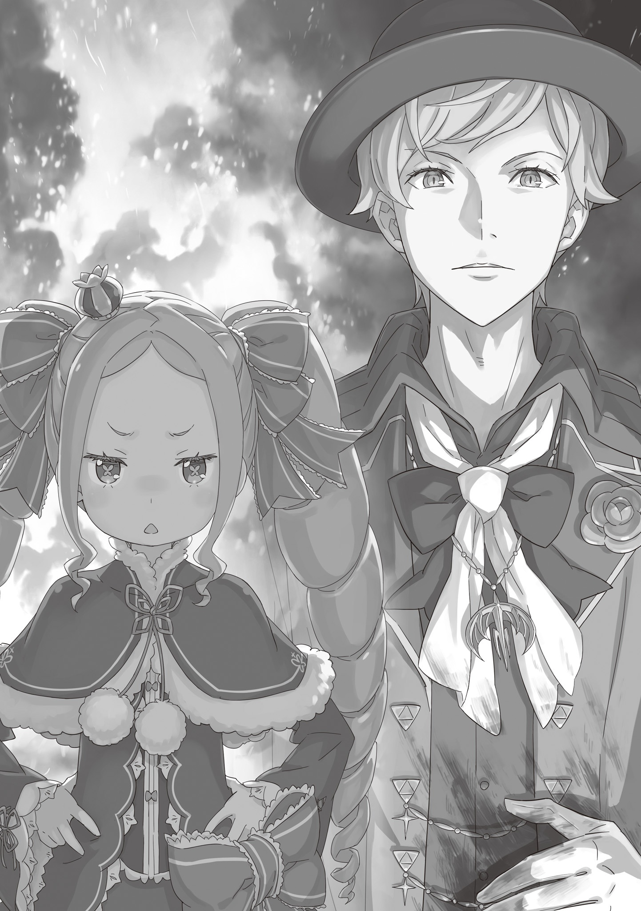
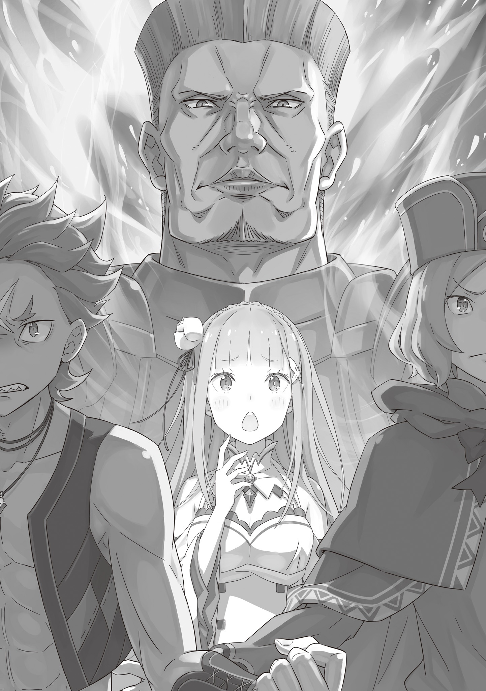

Когда бушующее адское пламя поглотило Нацуки Субару, Беатрис не поверила своим глазам.

— Как же так … — вырвалось у нее.

Развернутое E.M.T. представляло собой поле, что вмешивалось во всю магию в своих пределах. По сути, это незаконный прием, который перестраивал структуру чужого заклинания и грубо вплетал в него команду на отмену и распад. Будь сейчас иные времена, эту магию непременно бы окрестили запретной, читерной.

Конечно, если кто-то разгадает принцип E.M.T., он может сплести заклинание так, чтобы оно сработало даже после распада основной структуры — и тогда защиту удастся пробить. Но на такую запредельную тонкость — взять филигранно собранный магический конструкт, заменить в нем всего одну деталь на совершенно иную и заставить все работать как прежде — способна разве что мать Беатрис, Ведьма Жадности, да еще, пожалуй, Розвааль.

За исключением подобных ходячих аномалий, никто не мог колдовать внутри поля. И все же …

— Как, скажи на милость, ты ее пробил, в самом деле? — сощурилась Беатрис.

— Ничего я не пробивал, — раздался голос. — Просто пораскинул мозгами и рискнул шкурой.

Ответил ей Тига Лауреон. Привалившись к стене, юноша тяжело поднимался на ноги — а ведь всего минуту назад свирепая дева с Глазом Дракона, Круш, так пнула его, что он отлетел в стену и, казалось, вырубился.

Тига тяжело, вымученно вздохнул. В одной руке он сжимал свой верный меч, а другую прижимал к боку. Беатрис содрогнулась от вида истлевшей одежды под его ладонью и почерневшей кожи вокруг раны.

Эту рану оставила не Круш. Эта рана …

— О чем ты только думал, я полагаю? — прошептала Беатрис.

— Сделал то, что должен был, госпожа Беатрис. В Писании сказано: «Пока Дракон кружит в небесах, человек должен возделывать землю, — покачал Тига головой, пока цитировал Писание, совсем как Фьоре до этого. — Тот же, кто губит отведенное время во сне, не удостоится даже тени Дракона, когда придет пора жатвы» … как-то так.

И все же Беатрис сильно сомневалась, что именно набожность толкнула его на такой шаг. Обожженный бок Тиги зиял раной от того самого пламени, что поглотило Субару и Круш. Только вот огонь опалил юношу не снаружи, а выжег его изнутри.

E.M.T. разрушает структуру заклинаний, срабатывающих внутри поля. И Тига обошел это условие грубой силой.

— Магия внутри моего тела не поддается твоему запретному заклинанию. Я не был уверен до конца, но, похоже, оказался прав.

В разгар боя он понял, что, хотя обычная мана и не работает, Метод Потока, однако, исправно действовал. Это и навело его на мысль.

— И все же … не скажешь, что это просто — вспороть себе живот и колдовать, хоть и знаешь, что магия сожжет тебе все изнутри, я полагаю … На такое способен лишь тот, кто ставит превыше всего что-то более жуткое, чем чувство долга, в самом деле.

— Звучит так, будто ты считаешь меня сумасшедшим. Обидно, — Тига слегка пожал плечами. — Хотя … не виню.

В его голосе слышалась усталость, но отвечал он на удивление спокойно. От этого спокойствия у Беатрис — духа без органов, — по спине все равно пробежал ледяной холодок.

Она знала Тигу без году неделя, лишь с тех пор, как они встретились в храме Церкви Божественного Дракона. И все же ей нравились его шутки, легкость в общении и то, как легко он сошелся с Субару. Но теперь этот образ никак не вязался с тем, кто стоял перед ней. Сейчас перед собой Беатрис видела лишь полную противоположность прежнему Тиге. Теперь он руководствовался холодным расчетом и был готов даже принести себя в жертву ради выполнения задачи.

Что же заставило его зайти так далеко?

Беатрис знала человека, которым двигала подобная ненормальная, выходящая за рамки простого долга одержимость. Одержимость Тиги была схожа с той, что и у Розвааля — человека, четыреста лет ломавшего чужие судьбы ради своей цели.

Неужели Тига готов шагнуть в ту же бездну?

— Я лишь делаю то, что должен, — ответил Тига на ее немой вопрос. — Чтобы вернуть себе свою жизнь.

Он посмотрел вглубь комнаты — туда, где ревело пламя.

— Честно говоря, госпожа Беатрис, меня скорее удивляет твоя реакция. Я был готов к тому, что ты немедленно ударишь по мне магией. В конце концов, я сделал то, что сделал.

— Хочешь сказать, ты ударил не в состоянии аффекта, а все просчитал, я полагаю?

— Да, именно так. Герцогиня Круш Карстен раз за разом отвергала наши призывы сдаться. Я выдвинул ультиматум — она ответила ударом клинка.

— …

— Она убила МакМахона и подняла на нас меч. Она явно не в себе. Поэтому я принял решение в бою и полностью устранил угрозу. Скажешь, я не прав?

На красивом, привлекательном лице Тиги застыло абсолютное бесстрастие, когда он спросил Беатрис, праведно ли его деяние. В его взгляде не было ни раскаяния мученика, молящего о прощении, ни тени вины — лишь холодное спокойствие палача, желающего убедиться, что его руки в крови по закону.

Прежний образ Тиги окончательно рассыпался в ее голове.

— Скажу, что ты не ошибаешься, в самом деле, — Беатрис сузила свои круглые глаза.

Действительно, он был прав. Тига действовал безупречно с тех пор, как они обнаружили бойню в особняке МакМахона и столкнулись с Круш, убившей хозяина. Он до последнего следовал плану Субару и пытался взять Круш живой. И именно она отвергла все попытки решить дело миром. Тига имел полное право на жестокое решение, чтобы защитить свою жизнь от смертельной угрозы. И даже то, что под удар попал Субару — их союзник, — не давало повода безоговорочно обвинять юношу. Поэтому …

— Бетти не настолько упряма и глупа, чтобы винить тебя на пустом месте, я полагаю.

— Вот как. Тогда …

— Однако … — Беатрис оборвала его на полуслове.

На миг в желтых глазах Тиги мелькнуло не удивление, а холодный расчет. Беатрис отбросила эту мысль и продолжила.

Его слова звучали справедливо, но все же …

— Бетти всегда встанет на сторону того, кто спасет Субару, в самом деле.

В следующий миг стена обжигающего пламени на другом конце комнаты разлетелась надвое. Огонь бесшумно расступился, и в образовавшемся проходе предстала Круш Карстен — дева с Глазом Дракона. Она только что рассекла пламя рубящим ударом, а левой рукой прижимала к себе Субару, потерявшего сознание.

— Я разрубила не жар … а сам поток силы, — прошептала Круш, словно все поняла. Пальцами правой руки она коснулась века, скрывающего Глаз Дракона. — Так вот что значит «Ахиллесова Пята» …

Она рассекла адское пламя одним взмахом руки. Беатрис поразилась этому, но куда большее облегчение ей принес вид живого Субару.

Ее не охватила паника, когда огонь поглотил его, только потому, что их связь контрактора не подала никаких сигналов о смертельной опасности. Стоило понять это и вспомнить, как Круш бросилась наперерез пламени, дабы спасти Субару, — и Беатрис тут же приняла решение. Она встанет на сторону Круш Карстен.

— Как минимум, Бетти выслушает ее, а уж потом решит, что к чему, я полагаю.

— Это вряд ли назовешь разумным, госпожа Беатрис. То, что она спасла твоего контрактора, не должно застить тебе глаза. Герцогиня опасна.

— Не смей обращаться с Бетти как со слепым и безмозглым духом, в самом деле. Впрочем, даже будь я такой, все равно бы встала на сторону того, кто спас Субару, я полагаю.

— Выбрала время цепляться к словам! Сейчас люди заметят пожар и вот-вот сбегутся сюда! Ошибешься стороной сейчас — потом поздно будет сожалеть. Что тогда станется с Субару?!

— Твои слова ничего не стоят, ведь ты сам едва не сжег его вместе с этой девушкой. Но в одном ты прав: времени у нас в обрез. Поэтому …

Беатрис медленно подняла правую руку, и Тига напрягся. Но готовилась она не к атаке. Напротив. Стоило юноше понять, зачем она занесла пальцы для щелчка, как он хищно прищурился и вскинул шамшир.

— Стой. Не делай этого. Я ведь не смогу вас защитить.

— Бетти уже давным-давно ошиблась, когда просто стояла и провожала друзей … И больше я на те же грабли не наступлю!

Даже когда события неслись вскачь, сметая все на своем пути, Беатрис принимала решения сама, пока у нее оставался хоть малейший выбор. Она больше не осядет на землю в слезах перед потерей дорогого человека, не позволит течению уносить все, что ей дорого. Ради этого …

— Бетти выбирает твою сторону, Круш Карстен!

Она щелкнула пальцами — и по этому сигналу развеяла E.M.T. Невидимый купол, до этого накрывавший кабинет, исчез.

Любой, кто обладал хоть каплей магического чутья, немедленно бы это заметил. Тига не стал исключением. Не стала им и владелица Глаза Дракона.

— «Один удар — сто павших».

И тотчас в кабинете зародился мощнейший взрыв ветра, что сотряс весь особняк МакМахона.

— А потом мы сбежали от того парня в канализацию, я полагаю. Бетти хотела уйти подальше, но пока Субару спал, рисковать было нельзя, в самом деле.

Беатрис тихо сидела рядом и прижималась к его боку. Пока Субару слушал ее, он с трудом собирал мысли в кучу, переваривал все в гудящей голове, но все же выдавил:

— Понятно …

Честно говоря, ему было стыдно. Вокруг творился такой кошмар, а он один умудрился так быстро вырубиться. Но самобичевание пришлось отложить на потом.

— Во-первых … Беако, ты молодец, что не бросила Круш. Если бы мы разделились в такой суматохе, я бы себе этого никогда не простил.

— Учитывать чувства партнера — святая обязанность, я полагаю. Бетти точно знала, что Субару поступил бы именно так, в самом деле.

— Со стороны твой выбор выглядел безумием, так что вслух я с тобой согласиться не могу.

Дела были хуже некуда, но Беатрис все равно смотрела на него с гордым превосходством, отчего Субару невольно усмехнулся. Впрочем, улыбка быстро сползла с его лица. Он бросил взгляд на свою руку — ожог мучительно дергал и ныл — и закусил губу.

— Значит, Тига сделал это …

— Без сомнений, я полагаю. В бою он сказал, что не может колдовать — и либо это был блеф, либо … нет, забудь.

— В смысле «забудь»? Если тебя что-то тревожит, выкладывай.

— У нас сейчас и без того хлопот полон рот, не время отвлекаться, в самом деле, — покачала она головой. — Главное, что этот парень ударил магией, хотя прекрасно понимал, что заденет и нас. Доверие Бетти к нему рухнуло ниже плинтуса, я полагаю.

— Ну … ты просто очень меня любишь, вот и злишься.

Она насупила брови и надула щеки. На душе у Субару скребли кошки.

Конечно, он не собирался спускать Тиге с рук атаку, которая едва их не прикончила. Но сам Тига ведь был на волосок от смерти в битве с Круш — той, кто была куда сильнее него. В пылу боя он нашел единственный выход. Субару не мог просто взять и осудить решение, принятое в такой мясорубке.

Вдруг взгляд Беатрис стал очень суровым.

— Субару, только не говори, что ты …

— Нет, я не собираюсь делать вид, что ничего не было. Я обязательно заставлю его извиниться за этот ожог. Тут я не уступлю. Это же нормально?

Девочка в ответ лишь с укоризной взглянула на него.

— Эй, почему ты смотришь на меня как на идиота? — растерялся Субару. — Я же сказал, что заставлю его извиниться!

Оба были неправы, и Субару считал, что вина Тиги перевешивает. Ему казалось, что он и так занял довольно жесткую позицию. К тому же …

— Да и вообще, мы сцепились с Тигой во многом из-за недопонимания, — старался он подбирать слова, дабы переубедить Беатрис. — Если нормально поговорить, все прояснится и …

— Увы, но я не позволю тебе этого сделать, — вдруг перебили его. И сделала это не его нахмуренная напарница. Это была Круш, шедшая впереди.

Она освещала путь по темной канализации лампой из лагмитовой руды. И теперь ясно дала понять, что вмешивается в разговор — выхватила кинжал и направила его прямо на Субару.

— К-Круш?..

— Я не позволю тебе связываться с Тигой Лауреоном. Дело не только в том, что мы скрестили клинки. Он один из тех, кто прямо сейчас бросил за нами погоню. Стоит тебе неосторожно к нему сунуться, как ты тут же окажешься в кандалах.

— Да, но … с точки зрения Тиги, это логично … Ситуация-то какая …

— …

— …

Субару смотрел в янтарный глаз Круш — левый скрывала повязка — и мучительно раздумывал, что сказать дальше.

Она убила МакМахона и прямо сейчас целилась в него лезвием. Говорить с нынешней Круш нужно было крайне осторожно. Одно неверное слово, малейшая провокация — и в этот раз Субару точно заставит ее замарать руки в крови.

Они сверлили друг друга взглядами, пока наконец …

— Удивительно … но от тебя не веет ветром лжи, — Круш первой опустила клинок.

— А? — опешил Субару.

Она убрала кинжал в ножны и произнесла:

— Ты не лжешь. От тебя не веет обманом. С самой нашей встречи в особняке Миклотова МакМахона и до этой самой минуты. Только поэтому я позволила Беатрис пойти со мной.

— Вот как … — Субару переглянулся с Беатрис и все-таки решился спросить без обиняков: — Но, Круш … чего ты хочешь от нас?

Ветер лжи … Как носительница Божественной Защиты Чтения Ветра, Круш могла чувствовать истинные мысли и намерения людей — словно живой детектор лжи. Когда они только познакомились, она легко читала его насквозь, чем заставляла стыдиться собственного малодушия.

И сейчас именно это чутье руководило ее поступками. Раз Божественная Защита подсказывает ей верить Субару … значит, и Миклотова, и тринадцать слуг в особняке она тоже убила по подсказке своей силы?

— Ответь мне, Круш. Зачем мы … нет, давай о тебе. Чего ты добиваешься?

— Я хочу … нет, я обязана спасти Королевство от изменников. Это последнее, что я смогу сделать для страны.

— Изменников … В смысле, последнее?

— Станешь отрицать? Я пала жертвой Культа Ведьмы, слегла от болезни и впустую потратила уйму времени. А теперь меня вернула на ноги Церковь Божественного Дракона — что в корне противоречит моей клятве избавить страну от Дракона. Думаешь, после этого у меня остались шансы на победу?

— Но это …

— Я чувствую ветер понимания. Ты честный человек, Нацуки Субару, — Круш опустила глаза и горько усмехнулась.

В ее взгляде читалась правда, открытая ей Защитой. Она видела, что Субару не может ей возразить, что он чувствует свое бессилие и не знает, как вытащить ее из этой ямы. И то, что она назвала его «честным», не принесло ему ни капли радости.

— Хватит нести чушь, в самом деле! — вспылила Беатрис. — Бетти уже достало смотреть, как ты строишь из себя трагическую героиню и огрызаешься на Субару, я полагаю!

— Беатрис …

— И ты тоже хорош, Субару! — она уперла руки в бока. — Чего ты раскис из-за того, в чем даже не виноват, в самом деле? Продолжишь в том же духе — скоро начнешь корить себя за то, что на улице ребенок споткнулся, я полагаю! А если ты будешь вечно загоняться, у тебя не останется времени холить и лелеять Бетти! Категорически протестую, в самом деле!

Хоть она кричала в порыве нелепой вспышки гнева, Субару выдохнул, ибо понял, что так она просто разряжает обстановку и перетягивает внимание на себя, дабы сгладить углы между ним и Круш.

Сама девушка, разумеется, тоже поняла.

— Беатрис права, — кивнула она со всей серьезностью. — Не время цепляться за мелкие обиды. Чем больше времени мы дадим врагам, тем хуже для нас. Поэтому, Нацуки Субару … точнее, Субару и Беатрис, я прошу вас о помощи.

— О помощи?

— Да. Страна в опасности. Враги проникли в самое сердце Королевства и плетут заговоры, угрожают самому его существованию. Именно сейчас мне нужна твоя сила — сила Нацуки Субару, человека, что объединился с моим домом и внес неоценимый вклад в победу над Белым Китом.

Субару затаил дыхание. Он уставился на Круш, не в силах отвести взгляд.

Она убрала кинжал и теперь протягивала ему руку. И поразила его не только сама просьба. Больше всего его потрясло то, как она говорила о битве с Белым Китом — как о событии, которое она помнит лично.

Субару наконец задал вопрос, который крутился у него на языке с самой их встречи в особняке МакМахона:

— Скажи мне только одно … Твои «воспоминания» … вернулись?

— Разумеется. Неужели ты видишь во мне хоть каплю той жалкой, слабой Круш Карстен, какой я была, когда потеряла себя? Твой вопрос звучит даже оскорбительно.

— …

Субару стиснул зубы. От ее прямолинейного ответа у него внутри все перевернулось — радость смешалась с гневом.

Конечно, он был счастлив всем сердцем, что к Круш вернулась память. Но то, с каким презрением она отзывалась о себе самой в те дни, когда ничего не помнила …

— Чувствую ветер недовольства. Неужели ты поддерживал ту, забывшую себя Круш?

— Все не так просто! И сейчас, когда ты все помнишь, и тогда, когда не помнила — для меня ты всегда была Круш!

— Нет. Круш Карстен, потерявшая «воспоминания», — это уже не Круш Карстен. И именно поэтому … — девушка сжала кулаки, — Феррис и отвернулся от меня.

— Д-да ты!..

Слушая, как скрипят от боли зубы дрожащей Круш, Субару едва не крикнул ей в лицо: «Это ложь! Все было совсем не так!»

Он понял это еще тогда, до того, как они начали спускаться. Круш в корне неверно истолковала поступок Ферриса, она не поняла тяжести его решения.

Да, Феррис нарушил клятву Круш. Клятву, данную покойному члену королевской семьи. Субару прекрасно понимал, насколько эта клятва была важна для нее — даже зная все лишь понаслышке.

Но для Ферриса она значила не меньше. Он тоже любил покойного Четвертого Принца. И все же Феррис сделал свой выбор — он выбрал любовь к живому, а не преданность мертвецу.

Субару не мог позволить ей перечеркивать этот выбор. Хуже того — не мог позволить, чтобы два человека, столь беззаветно преданные друг другу, оказались разделены глупым недопониманием. Такая трагедия …

— Похоже, время на раздумья вышло, — оборвала его Круш.

Прежде чем Субару успел выплеснуть накопившиеся чувства, действительность грубо вмешалась в их спор.

Круш смотрела в темноту туннеля за их спинами. И вскоре стало понятно почему: издалека донеслись голоса и топот множества сапог … Погоня. В канализацию спустился целый отряд. Подземелья прочесывали в поисках Круш и их самих.

— Если мы выйдем и все объясним …

— Я же сказала: тебя уже считают моим сообщником. Там осталось оружие, которое ты выбил странным приемом. А признать мою причастность легко — на теле убитого раны явно моего характера. Но кроме того …

— Кроме того? Что еще? Куда уж хуже?

— Тига Лауреон прекрасно знал, что ты не был причастен, однако тебя все равно сочли соучастником убийства Миклотова. Должно быть, именно так этот юноша все и доложил.

— …

— Выбор за вами. Если считаете, что мне нельзя доверять — идите навстречу страже и просите защиты. Прощайте.

Она высказала все, что накипело, и бросила лампу прямо в сточные воды. Круш ясно дала понять, что разговор окончен, развернулась и стремительно скрылась во тьме. Тусклый свет тонущей лампы угас, и ее спина растворилась во мраке. Удаляющиеся шаги звучали для Субару как отсчет времени. Ему нужно было выбирать: оставить Круш, пойти к преследователям, выложить все как на духу и просить защиты … или шагнуть в темноту вслед за одинокой девушкой, решившей в одиночку бросить вызов грандиозному заговору? Одно из двух.

— Черт! Я хочу тебе верить! Но есть ли вообще этот заговор?!

Круш неверно истолковала намерения Ферриса. Она дошла до того, что направила лезвие на Субару. Ее чувства кипели, она находилась на грани срыва. В худшем случае никакого заговора не было, а убийство МакМахона и все остальное — лишь кровавый бред Круш, обезумевшей от паранойи.

Что же делать?..

— Субару, успокойся и послушай, я полагаю, — голос Беатрис вывел его из оцепенения. — Что бы ты ни выбрал, на чью бы сторону ни встал, Бетти всегда будет на твоей стороне и никуда не уйдет, в самом деле.

— Беако …

— Бетти больше не желает расставаться с тобой, как это было в Империи, я полагаю. Когда тебя нет рядом, я так переживаю, что аж дышать трудно, в самом деле.

Беатрис обещала ему, что сделает любой его выбор правильным. Точнее — что они сделают его правильным вместе.

Туман в голове Субару рассеялся. Она права. Разве не в этом его главный талант? Сделать шаг, а потом из кожи вон лезть, чтобы доказать, что шаг был верным. Именно так сражался Нацуки Субару.

— Я не могу бросить Круш. Придется тебе пройти со мной прямо в ад, Беатрис!

— Если с Субару, Бетти согласна хоть на четыреста лет запечатывания, я полагаю!

— Не говори так! Звучит пугающе!

Субару подхватил на руки свою надежную и горячо любимую напарницу и бросился во мрак, вслед за утихающим стуком шагов.

Прав он или нет — Субару не мог оставить Круш одну. Чтобы остановить ее или чтобы помочь — он должен быть рядом.

— Ах, черт! Как же болит рука!

Ожог дергал и ныл, словно наказывал его за глупость. Терпя боль, Субару думал не столько о том, в какую трясину его затянуло, сколько о том, что подумают Эмилия и остальные, когда узнают. И было ему стыдно не столько за то, что он доставит им проблем, сколько за то, что заставит их волноваться. Эмилию, Рем, Рам, Петру, Мейли, Гарфиэля … всех.

И поэтому он до боли стиснул зубы, вгляделся в густую тьму и криком взмолился своему другу:

— Пожалуйста, разрули там все, Отто!

И побежал дальше.

В то же самое время в особняке королевской семьи Лугуника.

Этот день должен был стать отправной точкой грандиозных событий — как для всего Королевства, так и для Лагеря кандидатки на престол, Эмилии. День, когда должна была появиться реальная возможность устранить последствия чудовищной атаки Культа Ведьмы на Пристеллу. Благодаря помощи Церкви Божественного Дракона долгие месяцы бессилия должны были остаться позади — и Эмилия со своими соратниками ждала этого с нетерпением. Должна была.

— И как, позвольте узнать, понимать происходящее? — обратился ко внезапным гостям Отто, стараясь сохранить ледяное спокойствие.

Лагерь уже был готов к отъезду, оставалось лишь дождаться возвращения ушедших по делам Субару и Беатрис. Чтобы скоротать время, Лагерь устроил чаепитие в гостиной … но внезапно к ним шумно и бесцеремонно ввалились солдаты Королевства в полной амуниции и рассредоточились по гостиной. От них веяло тяжелой, мрачной напряженностью.

Отто заслонил собой Эмилию и остальных девушек. Хотя, разумеется, перед ним тут же вырос кое-кто еще.

— А не слишком ли борзо прете? — оскалился Гарфиэль Тинзель, щелкая клыками. — То, что госпожа Эмилия добрая, еще не значит, что вам дозволено тут хамить!

— Гарфиэль, придержи клыки, — одернул его Отто. — Они все-таки гости. Пока что.

— Ага, понял, братан.

Отто выждал паузу, дабы гости первыми начали объяснять причину своего визита. Хоть он сам же и спровоцировал эту заминку, он сделал вид, что уступает, тем самым делая им одолжение. Если у них есть хоть капля мозгов, они поймут …

— Всем опустить оружие. Вы хоть понимаете, перед кем стоите? — прозвучал низкий, рокочущий голос, и солдаты мгновенно вытянулись по струнке.

Ряды расступились, и под тяжелый, мерный стук шагов вперед вышел исполин, на которого приходилось смотреть снизу вверх. Его огромное тело было заковано в стальные латы, а лицо походило на высеченную из камня скалу. Это был командир Гвардии Рыцарей Королевства Лугуника — воин, стоявший на вершине всего рыцарства страны, Маркос Гилдарк.

— Командир Маркос … — тихо произнесла Эмилия.

— Приношу глубочайшие извинения за внезапное вторжение, госпожа Эмилия.

Аметистовые глаза Эмилии удивленно расширились. Маркос, чьи манеры были столь же безупречны, сколь устрашающа была его внешность, отвесил ей глубокий, учтивый поклон. Затем он выпрямился, и его взгляд скользнул по Эмилии, по всем членам ее Лагеря, и на мгновение задержался на Отто и Гарфиэле, смотревших на него с откровенной враждебностью.

— Мы явились сюда, чтобы просить госпожу Эмилию немедленно отправиться с нами в замок. Возникли подозрения, требующие срочного и безотлагательного прояснения.

— Как же внезапно … Подозрения? О чем вы?

— О личности рыцаря Нацуки Субару.

— О Субару?

Стоило услышать, что подозрения касаются Субару, как Эмилия подала голос, а остальные невольно выдали свое беспокойство жестами и взглядами. Маркос держался в рамках этикета, выказывал уважение, но в его позе не было и намека на то, что он примет отказ.

Отто тут же пожалел, что они так ответили, потому что это дало Маркосу возможность нанести удар. И то, что озвучил Маркос о подозрениях в адрес Нацуки Субару, звучало как приговор.

— Рыцарь Нацуки Субару подозревается в глубоких связях с Культом Ведьмы … вплоть до того, что он может являться Архиепископом Греха.

Эти слова стали чертой. Чертой, определяющей, будет ли Нацуки Субару признан врагом всего мира.

