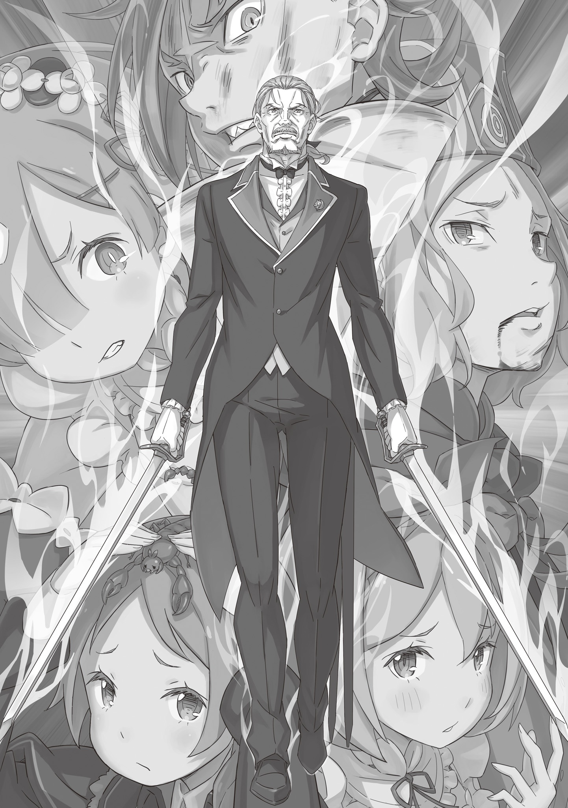
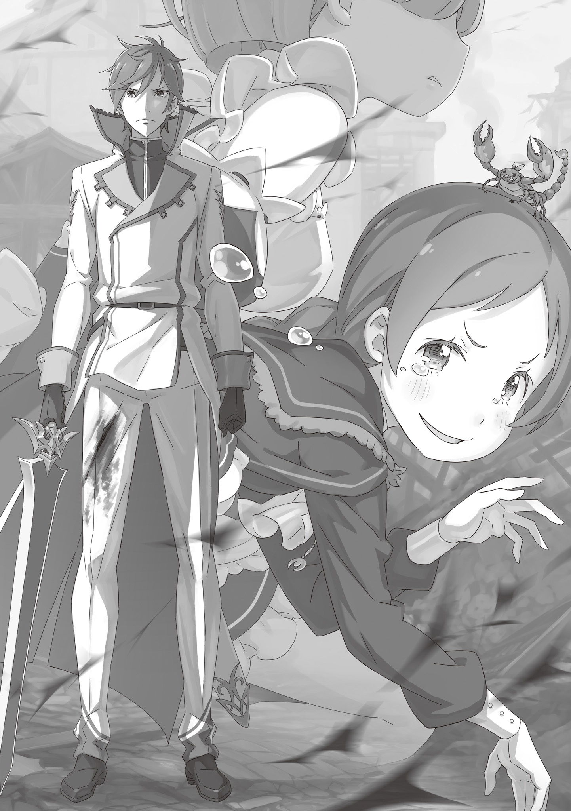

В тот миг, когда он ступил на мостовую, дыхание оборвалось. Не чье-то чужое. Дыхание затаил сам мир.

Как-то раз Гарфиэль спросил у сильнейшего воина Империи Волакия, на чем зиждется его запредельная мощь. И тот ответил:

«Мир — это сцена! Свет солнца, шум ветра, запахи земли и благоухание зелени — все это лишь декорации, дабы актеры сияли ярче. Но зачем же миру так стараться? Расцвечивать и украшать их? Да потому, что сам мир — это самый что ни на есть преданный фанат, который с замиранием сердца ждет от своих актеров ярких битв, великолепной игры, великих слов и незабываемых сцен!»

Эти мысли шли вразрез со здравым смыслом, и, честно говоря, понять их было непросто. Но сейчас, в эту самую минуту, казалось, будто крошечная доля истины в громких словах Голубой Молнии вдруг прояснилась. Мир действительно смотрит на людей так, словно наслаждается спектаклем. Наверное, именно поэтому сейчас так остро чувствовалось, что мир затаил дыхание.

У Гарфиэля и остальных за спиной возвышалась высокая стена, отделяющая дворянский квартал от квартала простолюдинов. А впереди, преграждая им путь, стоял человек с огненно-красными волосами и небесно-голубыми глазами.

Не просто стоял — он воздвигся на их пути непреодолимой преградой. Да, именно преградой.

— Райнхард ван Астрея … — пробормотал Отто. — Худший из всех возможных преследователей.

— Согласен, Отто. Жаль, что все так обернулось, — даже не стал скрывать Святой Меча.

Теперь стало точно ясно: Райнхард ван Астрея явился по их души. Сувен первым оправился от потрясения — выдержки ему было не занимать. И все же в его голосе проскользнули чувства, которые он не смог скрыть.

Райнхард держался за рукоять висящего на поясе Драконьего Меча.

— Замок приказал вас задержать, — сказал он. — Прошу, сдавайтесь.

— А если откажемся — возьмете силой? — спросил Отто.

— Придется. Я бы не хотел … впрочем, мои желания здесь ни при чем.

— Верно. Судят ведь не по чувствам, а по делам.

Торговец весь подобрался, приготовился к худшему. Райнхард же с самого своего появления оставался невозмутим. Он уже все решил. А если Святой Меча принял решение, он исполнит его до конца, и ничто в мире ему не помешает.

— Господин Райнхард, да? — подала голос Рем из-за плеча Гарфиэля.

Она загородила собой Петру с Мейли и бесстрашно глядела на врага. Ответ на ее следующий вопрос Гарфиэлю тоже не терпелось услышать:

— Вы сказали, что действуете по приказу из замка. Вы не знаете, что сейчас с моей сестрой и госпожой Эмилией?

Отто наверняка предвидел нечто подобное, когда решил спешно покинуть особняк.

— Увы, в замке я их не видел. Но мне известно, зачем их вызвали. Скорее всего, они взяты под стражу.

— Если с ними обойдутся грубо …

— Не обойдутся. Стражи себе такого не позволят, ручаюсь. К тому же, ни госпожа Эмилия, ни Рам не станут поднимать лишний шум.

— Вот как. Благодарю за ответ.

Вести прозвучали, однако, обнадеживающе, но Рем все же не удержалась от колкости. Райнхард лишь прикрыл один глаз. Но Отто был прав: важны не чувства, а действия.

— Райнхард, все это подстроено, это же очевидно! — горячо заговорил торговец. — Обвинения против Субару и госпожи Круш, арест Лагеря госпожи Эмилии … Да и госпожа Фельт вряд ли в безопасности! И все равно вы …

— Я — Святой Меча, — спокойно и бесстрастно ответил тот.

— …

— Мой долг — быть мечом Королевства и выполнять приказы. Повторяю: сдавайтесь. В замке вам не причинят зла. Я сделаю все, что в моих силах, чтобы …

— Вы преградили нам путь. Думаете, после этого вам можно верить? — отрезал Отто.

Его суровый ответ ударил наотмашь. И так думал не только Отто — все пятеро разделяли это мнение. Сколько бы красивых слов ни произнес Райнхард, он стоял здесь, чтобы не дать им уйти.

— Что ж … — ответил Святой Меча. — Видимо, друзьями нам не стать.

— Уж конечно. Я так и думал.

На этом переговоры закончились. Как ни странно, оба разом поняли, что тратить слова впустую больше нет смысла.

Отто рассудил верно. Раз их нагнал Райнхард, значит, в замке знают, где они. Если подтянется подмога, бежать станет некуда. А уж если в дело вмешается сам капитан Маркос, надежды на спасение не останется вовсе.

— Других стражей не будет, — заверил Райнхард. — Я приказал оцепить район, но сюда пришел один.

— Могу узнать, почему?

— Не хочу лишней крови. Я не сомневаюсь в выучке солдат, но и вас недооценивать не смею. Потому я и взялся за это дело.

— Чтобы мы не покалечили стражников? — спросила Рем, перехватив нить разговора.

— И чтобы не покалечили вас. Мне по силам этого не допустить.

При этих словах по столице прокатилась дрожь, словно мир покрылся мурашками. Непреклонная воля Райнхарда, его убеждения ощущались почти что телом.

Но это же бред!

— Я тут, блин, молча слушал, о чем вы с братаном Отто да с Рем толковали, но кое с чем Я ни хрена не согласен, эй!

— Не согласен?

Гарфиэль с громким хрустом размял кулаки и надел на руки серебряные латные рукавицы. Святой Меча с прищуром взглянул на его боевую стойку, и тот щелкнул клыками.

Он понял, почему Райнхард пришел один. Гарфиэль и сам не хотел лишних жертв. И все же его это бесило. Бесило, потому что …

— Говоришь, не недооцениваешь нас? Но ты, кажись, кое-что упустил! Да то, что ТЫ! ПРЯМО ЩАС! ОГРЕБЕШЬ!

С яростным ревом Гарфиэль оттолкнулся от мостовой и бросился на Райнхарда.

В глазах Святого Меча не мелькнуло ни удивления, ни тревоги. Нет. В них читалась лишь горечь от чужого неверного выбора. Взгляд, полный жалости, — так смотрят на ребенка, который разбил вазу и вместо того, чтобы повиниться, закапывает осколки в саду.

И в этого человека со скорбным взором Гарфиэль метил свой кулак …

Все в точности повторило их первую встречу в Пристелле, когда Гарфиэль, задавленный чужой аурой, бросился в атаку на одних рефлексах. Райнхард вскинул правую руку, дабы встретить удар, и раскрытая ладонь поймала тяжелый кулак, чтобы легко отвести силу в сторону …

Но ничего не вышло.

— У-О-О-О-О-О!!! — взревел Гарфиэль и вложил в удар всю мощь своего тела. Он не даст увести силу впустую!..

И тотчас прямо на руке Райнхарда взорвалась ударная волна: рукав его белого мундира разорвался, а непогашенная энергия паутиной трещин разбежалась по земле под ногами Святого Меча.

Райнхард широко распахнул глаза, пораженный немыслимой силой удара, а Гарфиэль хищно оскалился:

— Хватит, на хрен, думать, что тут все топчутся на месте!

Он резко выбросил вперед обе ноги и пресильно ударил ими прямо в скрещенные руки Райнхарда. Взрывная волна диким вихрем прошлась по улицам столицы.

И показалось, будто мир захлопал в ладоши, словно восторженно приветствовал начало сей битвы.

Петра с крепко сжатыми кулачками не отрывала взгляда от развернувшегося сражения.

Яростный, непрерывный натиск рычащего Гарфиэля … Он дрался как настоящий зверь: руки, ноги, когти, клыки — все шло в ход, лишь бы вцепиться врагу в глотку. Движения юноши сливались в размытое пятно, глаза за ними не поспевали. Но Райнхард принимал удары на руки, уклонялся, гасил инерцию. Впрочем, отражал он лишь самое страшное, а непогашенные отголоски ударов вырывались наружу.

— Какой Гарф сильный … бьется с ним на равных … — невольно сорвалось с губ Петры. Девочка искренне восхищалась им.

Как и любой житель Королевства, Петра еще простой деревенской девчонкой слышала о запредельной силе Святого Меча. Говорили даже, что в Лугунике можно не знать имени короля, но не знать имени Райнхарда ван Астрея попросту невозможно.

Когда-то давно, будучи младше нынешней Петры, Святой Меча в одиночку сорвал планы трех соседних держав, что разом посягнули на Королевство. Этот подвиг вселил надежду в сердца людей и навсегда впечатал в народную память осознание того, сколь ужасающ нынешний Святой Меча.

В родной деревне Петры, Алам, мальчишки боготворили его, а девочки — и Петра в их числе — порой грезили о сказке, где прекрасный рыцарь спасает простую селянку. Правда, принцем Петры стал вовсе не увенчанный славой Святой Меча, а просто самый замечательный на свете юноша.

Так или иначе, когда она оказалась в Лагере, что политически враждует с живой легендой, Петра поняла: все слухи — лишь жалкие детские сказки по сравнению с действительностью. Она убедилась в этом на собственной шкуре, когда они возвращались из Башни Плеяд. И потому, глядя, как Гарфиэль идет в лобовую атаку на это непостижимое существо, Петра ощущала неуместный восторг и даже гордость.

— Твою мать, никто не откликается … — процедил сквозь зубы Отто, что отчаянно следил за всем вокруг.

Пока он краем глаза следил за битвой, торговец напрягал Божественную Защиту, силясь найти хоть какую-то лазейку. Но вокруг не было ни единого существа, готового прийти на помощь. Отто, казалось бы, всегда и везде умел заводить полезные знакомства среди зверья, но впервые он потерпел полное фиаско.

Строго говоря, Райнхард настиг их именно потому, что, как выразился Отто, «насекомые обманули его». Однако глупо думать, что жуки специально устроили засаду. Значит, у противника есть свой способ подчинять живых тварей — причем куда более мощный. Такой же …

— … как Защита Мейли, — прошептала Петра и покосилась на прижавшуюся к ней девочку. Она сразу догадалась, как именно обманули Отто.

Божественная Защита Духовной Речи не раз выручала их, но не столько благодаря своей силе, сколько благодаря смекалке Отто. Божественная Защита лишь позволяла понимать язык животных, а вот уговорить их помочь — это уже плод личного таланта переговорщика.

До сих пор они полностью полагались на Отто. Но если враг может подчинять зверей напрямую, как Мейли — зверодемонов, все дипломатические ухищрения летят прахом.

— Пе~етра, если что, я … — протянула Мейли.

— Даже не думай! — резко оборвала ее Петра.

Девочка собиралась предложить свою помощь — пустить в ход собственную Защиту, раз уж дар Отто бесполезен. Да, это могло спасти их прямо сейчас, но цена была бы непомерно высокой.

— Если ты призовешь зверодемонов, пути назад уже не будет. Все подумают, что злодей-культист Субару спелся с хозяйкой чудовищ. И что сестрица Эмилия точно заодно с Ведьмой … с Ведьмой Зависти.

— Но ведь за нами прислали самого Святого Меча! Люди в замке уже давно все решили …

— Нет, ты не поняла. Главное, чтобы так не подумали простые люди — жители столицы … всего Королевства.

Мейли промолчала.

— Те люди, которых спасли Субару и сестрица Эмилия, обязательно поймут, что все это — ложь. Как понимаем мы. И мы не можем лишать их этой веры.

Положение и впрямь было отчаянным, но если ради сиюминутного спасения они пустятся во все тяжкие, то лишь сыграют на руку врагу. Именно поэтому они не стали пробиваться из особняка силой, хоть Гарфиэлю и Рем это было вполне по плечу. Чем опаснее выставят себя они — Лагерь Эмилии, — тем хуже придется беглому Субару и заточенной в замке Эмилии. Этого никак нельзя было допустить.

— Как же обидно … — с досадой прикусила губу Мейли, стоило понять правоту подруги.

На макушке у нее, вторя хозяйке, сердито щелкал клешнями Багровый Скорпион. Иметь силу и не сметь ею воспользоваться — это особое, горькое чувство бессилия, совсем не такое, как у Петры.

«Я должна смотреть» , — велела себе Петра.

В отличие от Мейли и Отто, ее не терзали муки выбора: применять Защиту или нет. И потому она сейчас должна думать лишь об одном. Она не знала, что именно может сделать. Но если вдруг мелькнет хоть крошечная зацепка, она обязана ее не упустить. В этом и заключалась решимость Петры Лейте, ее собственный способ бросить вызов Святому Меча.

Суженное зрение. Приглушенный слух. Обостренное обоняние. Пульсирующая боль. Смутный привкус крови на губах. Жизнь по имени Гарфиэль пылала белым пламенем, позабыв обо всем на свете.

Он превзошел все ожидания, когда начал схватку с идеального, молниеносного броска.

Железные кулаки, тяжелые ноги и звериные когти, сея хаос, не давали стоящему впереди Райнхарду вздохнуть и вынуждали его уйти в глухую оборону. По сравнению с их стычкой в Пристелле, где Гарфиэля раскидали как слепого котенка, это был невероятный успех.

— В тот раз Я тебя даже сдвинуть не смог …

— …

— Но не щас!

Гарфиэль отвел руки за спину, после чего сокрушительно ударил ими в грудь Райнхарда. Тот вскинул Драконий Меч, дабы принять удар на прочные ножны. Однако погасить всю силу ему не удалось: ноги Святого Меча оторвались от земли, и он сделал широкий шаг назад.

Серией тяжелых ударов он заставил Райнхарда отступить. Для Гарфиэля, который когда-то в полной мере ощутил пропасть между ними, это было высшей наградой. Райнхард, видимо, тоже это сознал. Его лицо едва заметно напряглось, и он поднял глаза:

— Ты стал …

— Че, сильнее, да?!

— Именно.

Но Гарфиэлю не были нужны словесные похвалы. Он жаждал вырвать признание самой победой. Юноша снова рванулся вперед. Если Райнхард отступил, значит, удары Гарфиэля для него уже не просто легкий ветерок. Разумеется, он не питал иллюзий и не считал, будто превзошел Святого Меча.

«Бесит, сука … »

Райнхард явился за ними, но было ясно, что вражда с Гарфиэлем, а тем более с Субару и Эмилией, ему не по душе. Он просто выполнял приказ — как и подобает Святому Меча. К тому же пришел один, чтобы избежать случайных жертв, и даже сейчас бился с ним далеко не на всю свою чудовищную силу.

Иными словами, Гарфиэль дрался на пике своих возможностей, переполненный боевым духом, а Райнхард — без всякого желания, да еще и сдерживаясь, чтобы не разнести все вокруг. Только благодаря этому и возникло хрупкое равновесие.

«Как же, сука, бесит!»

Он хотел победить. Больше всего на свете.

Победить так, чтобы враг не мог оправдаться. Доказать, что он вырос, стал сильнее и превзошел того, перед кем когда-то был бессилен. Услышать от Субару: «Ай да Гарфиэль, я знал, что ты победишь!». Заслужить уважение Отто: «На этот раз вы здорово нас выручили, Гарфиэль». Добиться признания Фредерики: «Я поражена, Гарф. Ты уже совсем взрослый». Услышать восторженный визг Мими: «Яха-а! Гарф, круто! Ваще силища!». Получить похвалу от Рам: «Ха, а ты неплох, Гарф». Он хотел увидеть их улыбки.

Он собрал в кулак всю эту жажду идеальной победы, вложил всю душу в этот несправедливый, неправильный матч-реванш со Святым Меча.

— Г-р-р-а-а-а!!!

Вверх, вниз, вправо, влево, вперед, назад, снаружи, изнутри, сверху, снизу … Гарфиэль метался вокруг неподвижного Райнхарда, бил со всех мыслимых и немыслимых сторон, не оставлял и щели, куда могла бы проскользнуть мышь. Грохот ударов, более частый, тяжелый и гулкий, чем барабанная дробь, безжалостно рвал в клочья тишину столицы, крушил и ломал ее покой.

Но так и должно быть. Иначе никак. Ведь мир в столице — ложь. Фальшивка. Дешевая декорация.

Где-то там Субару в смертельной опасности. Во дворце — Эмилия. А здесь, на улицах, — они сами. И Райнхард — воплощение этой слепой, жестокой угрозы.

— СДОХНИ-И-И!!!

Райнхард отразил ножнами сокрушительный удар правой. В этот самый миг Гарфиэль крутанул приподнятым левым коленом и с силой впечатал ногу в землю. Накопленная энергия — сила, которую Гарфиэль ни разу не пустил в ход за все время своей бешеной атаки, — разом вырвалась наружу.

Все это время он использовал Божественную Защиту лишь для укрепления собственного тела и тщательно сберегал козырь. И все ради этого мига: дабы выбить землю из-под ног Райнхарда. Будь ты хоть трижды Святым Меча, если подлетишь в воздух, тебе останется лишь падать обратно. Лишенного опоры врага можно было бы добить серией ударов, или же использовать эту секунду, чтобы сбежать. Но …

— Получай!..

— Ты и правда стал сильнее.

… взметнувшуюся из-под земли мощь Райнхард одним ударом ноги впечатал обратно. Силе не осталось выхода, и она волной разошлась во все стороны от подошвы его ботинка. Мостовая вздыбилась и лопнула, ударная волна пронеслась по улице, снося здания вокруг одно за другим.

Гарфиэль в шоке распахнул зеленые глаза.

— Жители давно эвакуированы, — спокойно произнес Райнхард. — Волноваться не о чем.

Вспышка света прочертила дугу, и страшный удар наискось перечеркнул Гарфиэля, вбил его головой в землю. Из горла вырвался сдавленный хрип. Под тяжестью удара земля треснула еще сильнее и преобразилась в огромный полукруглый кратер вокруг того места, где только что бушевала подавленная сила.

В Империи Гарфиэль принимал на себя удары Облачного Дракона. Да, не без последствий, но он выдерживал. А сейчас … его хваленая выносливость оказалась бессильна.

Захрустели кости, закричали мышцы, онемели внутренности. Организм, потрясенный чудовищной силой удара, впал в панику: глаза чувствовали вкус, уши — боль, нос — цвет, язык — звук, а кожа — запах. Чувства смешались в дикий, бессмысленный ком. Больно? Горько? Пахнет ржавчиной? Громко? Что вообще произошло?

Он пропустил сокрушительный, смертельный удар, выжегший все мысли. Пропустил. Пропустил-пропустил-пропустил …

Сознание кружилось в водовороте, рвалось на части, распадалось в прах. И все же сквозь эту муть он ощутил: кто-то рядом затаил дыхание. Затаил дыхание и распахнул глаза красноволосый человек. Человек с голубыми глазами. Тот, кого нужно было остановить. Правая рука этого человека только нанесла рубящий удар и теперь была намертво зажата в объятиях Гарфиэля.

Он сделал то, что задумал. То единственное, что должен был сделать.

— Г-а-а-а …

— Гарфиэль, ты …

Из легких выбило весь воздух … или из желудка? В чем там хранится воздух? Похрен. Главное — рычать, даже если внутри пусто. Рев придает сил. А пока есть силы, враг не вырвет руку.

А пока враг не может пошевелиться …

— А-А-А-А!!!

… в дело вступит то зеленое пятно, которому Гарфиэль доверял как себе.

— …

Райнхард перевел взгляд. В его глазах мелькнула тревога: прямо на него, не разбирая дороги, неслось зеленое пятно.

Нельзя было предугадать, что он выкинет. Какую ловушку приготовил. Что задумал. Расстояние стремительно сокращалось, пока не исчезло вовсе … но ничего не произошло.

— Неужели … ничего?

— Это лучший способ застать вас врасплох … разве нет?

Свободная рука Райнхарда взметнулась в воздух и чиркнула Отто по подбородку. Юноша в зеленом, бросившийся в самоубийственную атаку с пустыми руками, безвольно рухнул на землю. И, падая, еле слышно шепнул:

— Сейчас …

Губы шевельнулись в почти беззвучном шепоте. События неслись сплошным потоком, за гранью понимания, но мозг, осознававший себя Гарфиэлем, продолжал все обдумывать. Красный стоит. Зеленый упал. Гарфиэль держит руку.

— Давай!

— Малыш Скорпиончик!

Две белые вспышки прорезали воздух и пролетели над упавшим Отто. Они устремились прямиком к Райнхарду. Бесшумные, быстрее любой стрелы, вспышки ударили в человека, чья правая рука была занята, а левая замерла после удара. Но …

— Вы меня удивили.

Райнхард изогнул только что ударившую левую руку и подтолкнул локтем белые ножны висевшего на поясе меча. Меч повернулся в воздухе, идеально отбив обе вспышки … С влажным звуком, похожим на всплеск воды, свет разлетелся вдребезги — совместная атака Петры и Мейли не достигла цели.

Отчаянный рывок Гарфиэля, самопожертвование Отто, скрытый удар Петры и Мейли — все оказалось тщетно …

Но тут шипастый стальной шар на бешеной скорости врезался прямо в грудь Райнхарда.

Затаивши дыхание, Рем вложила всю себя в один-единственный миг. Она подавила страх, волнение и чрезмерный азарт — все, что могло ослабить удар или сбить прицел.

Гарфиэль пошел в лобовую, Отто отвлек внимание, Петра и Мейли ударили исподтишка. Но чтобы пробить абсолютную защиту Райнхарда, Рем пришлось пойти на унизительную хитрость. Она знала, что враг не воспринимал ее всерьез, и воспользовалась этим.

Гордость осталась позади, и Рем вложила всю душу в этот бросок.

— Х-а-а-а-а!

Под звон натянутой цепи шипастый моргенштерн со свистом распорол воздух и устремился прямо в грудь Святого Меча.

Прямое попадание такой тяжеленной шипастой гири неминуемо обратило бы человека в кровавое месиво. Но Рем не колебалась ни секунды — она знала, кто перед ней. Ударь она его со всей силы по голове со спины, Райнхард все равно бы выжил. Это благоговейное доверие к нечеловеческой мощи врага направляло ее черное оружие. Железный шар почти достиг цели …

— ?!..

Но в тот миг, когда Рем уже решила, что попала, ее правое плечо дернуло так сильно, что сустав едва не выскочил из сумки.

«Что за … » — она в шоке распахнула глаза.

Райнхард, стоя на месте, высоко вскинул длинную ногу. Нет, не просто вскинул — это был удар. На самом кончике вытянутой к небу ноги замер подброшенный в воздух моргенштерн. Райнхард отбил его одним неуловимым движением. Цепь резко натянулась, и отдача едва не вырвала Рем руку.

Еще до того, как тело пронзила боль, отчаяние захлестнуло разум. Она промахнулась. Гарфиэль сражался на пределе сил, Отто изобразил отчаянный бросок, Петра с Мейли отвлекли внимание … Все они старались лишь для того, чтобы открыть путь для ее атаки. И эта единственная надежда, добытая общими усилиями пятерых …

— Не достала …

— Нет. Достанем, — незнакомый мужской голос начисто смыл ее отчаяние.

— …

Все присутствующие пораженно обернулись. Владельцем голоса был седовласый старик в костюме дворецкого, что в руках сжимал сверкающие парные мечи.

Источавший чудовищную ауру меча, он произнес:

— Ради спасения своей госпожи … Демон Меча Вильгельм Триас пришел, дабы помочь, — произнес он.

Сразу за этими словами последовала мгновенная череда атак.

— Дедушка … — с болью и удивлением выдохнул Райнхард.

И тотчас в его расширившихся глазах отразился Демон Меча: пригнувшийся к самой земле Вильгельм рванулся вперед, словно пуля. Старик оттолкнулся от развороченной мостовой и в мгновение ока преодолел расстояние между ними. Он занес мечи на уровне бедра, приготовился нанести смертоносный удар.

И в этот ничтожный зазор, за долю секунды до удара …

— Куда зыришь, а?!

С налитыми кровью глазами, Гарфиэль, все еще намертво вцепившийся в правую руку противника, вздыбил землю, на которой лежал. Глыбы камня обрушились на Райнхарда. Атака была слепой и неуклюжей — юноша просто ударил по площади, дабы зацепить врага. Но Святой Меча взмахнул левой рукой и отбил камни мощной ударной волной. Осколки брызнули во все стороны.

И тут, опережая выпад Вильгельма …

— А-а-а-а!!! — с пронзительным криком Рем изо всех сил рванула правую руку вниз.

На ее лбу слабо засветился рог. Девушка-Демон, чье тело теперь работало за гранью человеческих возможностей, остановила взлетевший в воздух моргенштерн и с силой направила его прямо на голову врага.

Райнхард отвлекся на каменные глыбы и на летящего прямо на него Демона Меча. Атака сверху, которую он уже отбил, должна была стать идеальным сюрпризом. Однако …

— Вот, значит, на что вы способны.

… он подбросил Драконий Меч, что недавно отстегнулся от пояса после атаки Петры, поймал его левой рукой — той самой, которой только что разбил камни, — и принял удар моргенштерна на ножны.

Невероятная, чудовищная сила. Он отбил все атаки на одних лишь сверхчеловеческих рефлексах. Но наконец …

— Р-и-а-а-а-а!!! — с оглушительным боевым кличем парные мечи Демона Меча прочертили серебряные дуги.

Это была не очередная уловка. Это был удар мастера, посвятившего мечу всю свою жизнь.

Левая рука с Драконьим Мечом занята железом Рем. Правая намертво зажата Гарфиэлем. Казалось, теперь Райнхарду точно не уйти. Если бы только он плавно не повел правой рукой … и не поднял ее вместе с висящим на ней Гарфиэлем.

Светловолосый юноша поперхнулся воздухом. Райнхард собирался отбить атаку Вильгельма им самим! И помешать этому Гарфиэль не мог. Если отпустить руку — Райнхард просто ударит старика. Пусть уж лучше он сам послужит живым щитом, скует движения врага. Но если Вильгельм прервет атаку, дабы не задеть Гарфиэля, малая надежда будет тотчас упущена …

И в ту же секунду их взгляды встретились. Гарфиэль все понял. И с готовностью принял решение старика.

Ответ Демона Меча был неумолим.

— Не может быть … — Райнхард ошарашенно расширил глаза.

— Твоя дурная привычка. Ты всегда недооцениваешь, на что другие готовы пойти.

Синие, спокойные как лесное озеро глаза Вильгельма смотрели прямо на внука.

И тотчас сверкнул клинок. Он прочертил полукруг и распорол бок висящему Гарфиэлю, после чего лезвие, пройдя юношу насквозь, глубоко вонзилось в ногу Райнхарда.

— Наконец-то … достали …

Пожертвовали малым, дабы нанести смертельный удар. Опыт совместного боя в Пристелле помог им понять друг друга без слов. Райнхард считал, что дед остановит клинок, стоит увидеть перед собой союзника. Но Демон Меча понял замысел Гарфиэля. Понадеявшийся на регенерацию зверочеловека, он рубанул прямо сквозь него.

Райнхард судорожно выдохнул от боли в ноге, и Гарфиэль наконец-то выскользнул из его хватки. Зажав рану на боку, юноша из последних сил пустил в ход исцеляющую магию, пока отчаянно цеплялся за ускользающее сознание. Магия текла туго, но он влил в нее все остатки сил.

— Великолепно.

Прежде чем Гарфиэль рухнул на землю, его подхватил Вильгельм. Старик уже успел спрятать мечи в ножны и теперь держал юношу под одной мышкой, а бессознательного Отто — под другой. Старик холодно посмотрел на Райнхарда:

— Даже тебе не залечить такую рану в один миг.

— Дедушка, подождите! Они … госпожа Круш …

— Я больше не доверю свой меч Королевству, — оборвал он внука на полуслове и мощным прыжком отлетел назад.

Райнхард потрясенно уставился ему вслед. Старик был прав: рана оказалась слишком глубокой, и Святой Меча не мог броситься в погоню прямо сейчас.

— Госпожа Рем! — крикнул Вильгельм очнувшейся девушке. — Забирайте девочек!

— Да, незнакомый дедушка!

Рем молниеносно подскочила к пискнувшим от неожиданности Петре и Мейли и подхватила их на руки. Отто, болтающийся под мышкой у Вильгельма, слабо пошевелился:

— Вдоль стены … на запад …

— Отто! Вы живы … — обрадовалась Рем.

— Еще бы … На западе нет ни жуков, ни их следов. Там … нас не обманут.

— Понял вас, — кивнул Вильгельм.

Раз враг использовал животных против них, Отто решил бежать туда, где нет живых существ — чтобы избежать новых засад. Вильгельм и Рем обменялись кивками и сорвались с места, унося ноги прочь от раненого Райнхарда.

Гарфиэль раскачивался под мышкой у Демона Меча. Он с трудом повернул голову. Посреди разрушенной улицы Райнхард остался совсем один. Мыслей было много. Не то чтобы Гарфиэль ненавидел Святого Меча. И все же, он испытал облегчение и гордость, ибо преодолел эту несокрушимую преграду …

— И все же я — меч Королевства.

И в этот миг он почувствовал, как сам мир затаил дыхание. Не просто задержал, а именно затаил в ужасе. Воздух тихо задрожал …

Драконий Меч Рейд покинул ножны, блеснул холодным голубоватым светом.

Драконий Меч Рейд . Один из десяти священных и магических клинков этого мира. Легендарный меч, который передавался из поколения в поколение и повиновался лишь Святому Меча Драконьего Королевства Лугуника. О его чудовищной мощи ходили легенды, но поскольку меч сам выбирал, когда его можно обнажить, мало кто видел его в деле.

А уж с тех пор, как он попал в руки Райнхарда ван Астрея, его и вовсе перестали извлекать из ножен. Случаи, когда клинок выходил на свет, можно было пересчитать по пальцам одной руки. И неудивительно — ведь сам Райнхард был настолько силен, что ни один враг просто не стоил того, чтобы обнажать против него Драконий Меч. В большинстве сражений, где Святой Меча защищал Королевство, сила легендарного клинка ему не требовалась. Из-за этого Субару как-то раз ляпнул: «Слушай, а если им просто как дубиной махать, он же точно не сломается? Так, по-моему, даже круче», — чем вызвал у Райнхарда кривую усмешку. Однако …

Стоило клинку обнажиться, и мир понимал: случилось нечто непоправимое.

Условия, при которых меч покидал ножны, оставались загадкой даже для знатоков истории и самого рода Святых Меча. Ни сила противника, ни тяжесть ответственности, ни масштаб угрозы — ничто из этого не служило точным критерием. Ясно было лишь одно: если Драконий Меч Рейд обнажен, он обязательно достигнет цели. Исключений не бывает.

Холодная волна ужаса окатила Гарфиэля с ног до головы. Нельзя. Нельзя. Нельзя! Нельзя! Нельзя! Этим мечом ни в коем случае нельзя бить!

Зубы юноши громко лязгнули. Зря обернулся, зря смотрит. Когда он увидел обнаженный клинок, то волосы тотчас встали дыбом. Рем и старик не оборачивались — им было не до того. Но они наверняка ощутили спиной, душой, всем своим существом эту воистину чудовищную ауру меча.

И все же они, превозмогая леденящий страх, продолжали бежать. Гарфиэль искренне ими восхищался. Он бы так не смог. Как им удается сохранять самообладание?

«Надо брать с них пример. Сделать то, что должен. Хоть мне потом и влетит. Сделать то, что должен. Стать в один ряд с теми, кто всегда выкладывается на полную».

Он готов был пойти до конца. Но …

— Вылезайте, Песчаные Червячки!

В следующее мгновение земля под ногами в буквальном смысле содрогнулась. Мощный толчок сотряс столицу.

— Мейли?! — Петра, болтавшаяся под мышкой у Рем и судорожно искавшая выход из положения, в ужасе уставилась на подругу. Та нарушила ее строгий запрет.

Мейли виновато показала язык:

— Прости~и. Знаю, что мы так подставим братика Субару и сестренку Эмилию … Но мы же не можем тут умере~еть, правда?

— Дурочка! Какая же ты дурочка! — расплакалась Петра. — Ведь тебя … тебя только-только простили …

— Ах вот ты о че~ем … — улыбнулась та.

Мейли все поняла. Вызов зверодемонов навредил бы репутации Лагеря Эмилии — но Петра переживала не только из-за этого. Некогда простили ее прошлое убийцы, и Петра до слез не хотела, чтобы Королевство вновь сочло подругу опасной преступницей.

— Ничего стра~ашного. Я хотя бы … успела увидеть хороший сон.

Ей и впрямь начало казаться, что однажды ее простят. Что она сможет жить нормальной жизнью вместе с теми, кто был добр к ней. И от одной лишь мысли об этом на душе становилось так же тепло, как когда-то рядом с хлопотливой сестрой. Да, это был чудесный сон.

— Сможешь ли ты нас догнать, братец Святой Меча?! — крикнула Мейли. — Я выпустила по Червячку у всех ворот столицы — на западе, востоке, юге и севере. Там, наверно, все ужасно испугались!

Черви Песчаных Дюн Аугрии были невероятно огромны. Мейли заранее приказала им тайком следовать за ней под землей и прятаться в столице. И теперь, пустив в ход Защиту, она приказала им посеять как можно больше паники.

Если Райнхард не вмешается, погибнут люди. Но Мейли было плевать. Главное, чтобы не пострадали Субару, Беатрис, Эмилия и остальные. Пусть умрут все, кроме тех, кто дорог ей и кому дорога она.

— Мейли … — далеко позади Райнхард, держа в руках Драконий Меч, едва слышно произнес ее имя.

Мейли путешествовала в Башню Плеяд вместе с ним и Фельт. Она помнила, как Райнхард заботился о ней. Но до Субару и остальных ему было далеко.

— Я же плохая девочка, — горько усмехнулась Мейли и помахала тому рукой.

Из ее глаз выкатились горячие слезы, но сама она их не замечала. Слезы видели лишь Святой Меча, что мог видеть остро даже так далеко, да плачущая Петра, висевшая на руках у бегущей Рем.

— Мейли … дурочка … прости … прости меня … — всхлипывала Петра.

И после этого отчаянного выбора …

— …

Впервые с тех пор, как Драконий Меч Рейд попал в руки Райнхарда ван Астрея, он вернулся в ножны, так и не поразив цель.

