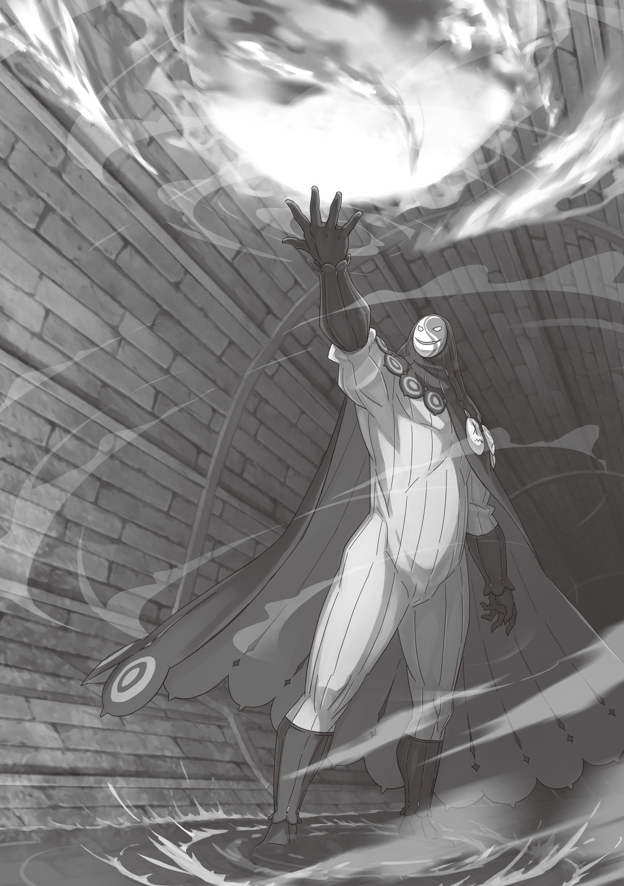

Сколько же времени прошло с тех пор, как они пустились в бега?

Вокруг царил мрак, куда почти не проникал дневной свет, а провал в памяти из-за потери сознания сбивал с толку. По внутренним ощущениям с начала всей этой заварушки прошло от нескольких часов до полусуток.

— Кажется, чудом, но от погони мы оторвались … — оглянулся Субару. Юноша с трудом дышал и стирал пот с подбородка. В затхлом, едва теплом воздухе подземелья он вслушивался, не раздадутся ли во тьме шаги невидимых преследователей.

Еще совсем недавно по их пятам неотступно гнались отряды королевских стражников, не давая ни секунды на передышку. Дороги перекрывали, дабы схватить их. Раз за разом в голове мелькали одни и те же мысли: сдаться или идти на пролом. Что ни выбери — верная гибель, но …

— Нас спасло то жуткое землетрясение … Кстати говоря, не припомню, чтобы в этом мире меня хоть раз трясло. Что это вообще было?

— Бетти этот гул земли тоже напугал … — ответила Беатрис, что до сих пор сидела на руках юноши, — но сейчас не об этом, я полагаю. Субару, покажи руку. Я залечу ожог, в самом деле.

— Ох, выручишь.

Он опустил Беатрис на грязный пол. Девочка сжала и разжала ладонь, словно проверяла свои силы, а затем окутала мягким светом исцеления правое предплечье Субару — поверх носового платка, заменявшего бинт. Ноющая тупая боль, мучившая его все это время, начала стихать, и он невольно выдохнул.

— Так и знала, что ты просто строишь из себя героя, я полагаю. Мог бы и раньше сказать, что тебе больно, в самом деле.

— Да нет, пока мы бежали в мыле, я про нее и правда забыл! А стоило выдохнуть — как сразу прострелило! А-а-ай! С-скорее … спасай!..

— Да-да, что за несносный мальчишка, я полагаю. Сейчас все пройдет, не распускай нюни, в самом деле.

— Спасибо, мамочка Беако!.. С маной совсем туго?

— Честно говоря, запасов в обрез, я полагаю.

— Ну … — почесал он щеку здоровой рукой, — я так и думал.

В особняке Миклотова они и так разгулялись не на шутку, тут уж ничего не попишешь. Минья, каскад Шамаков, да еще и E.M.T. — Субару должен был вот-вот пересохнуть … Да уж, так он себе в качестве личного хранилища маны.

Оставалось лишь горько сетовать на свою никудышную приспособленность к иному миру.

— А ведь в Империи у меня прямо все получалось … Может, в маленьком мне помещается больше всяких чудес?

— Тогда твой Од исказили, и Бетти не в восторге от таких методов, в самом деле. Даже страшно представить, сколько людей они замучили опытами, чтобы добиться таких плодов, я полагаю.

— Вроде Ольбарт нам больше не враг, да и из Империи мы уехали, но мрак вокруг этих синоби все гуще и гуще …

В самом деле, лепить из Од — считай, из души — все что вздумается, без долгих тренировок невозможно. А раз так, значит, Ольбарт или вся их деревня синоби годами на ком-то упражнялись. Прозвище «Порочный Старик» подходило ему как нельзя лучше.

— Похоже, стражники заняты тем гулом, — влезла Круш, что до сей поры осматривала окрестности с лампой. — В ветре больше нет чужой настороженности, и напряжение стало слабее. Пока что мы оторвались.

Лампа с приглушенным кристаллом лагмита едва освещала сток. Круш прищурила янтарный глаз и молча глядела, как лечат руку Субару.

На мгновение юноша озадачился, но тут же все понял: свет исцеляющей магии напомнил ей о ком-то близком и незабвенном.

«Но сейчас не время об этом говорить … »

Слишком уж стремительно их утопила лавина событий. С самой Сторожевой Башни Плеяд, с той стычки с Алом, Субару гнало вперед без передышки и не оставляло ни минуты покоя. Возвышение Церкви Божественного Дракона, исцеление Круш, резня в особняке Миклотова, а теперь вот Нацуки Субару — беглый преступник. Сущий кошмар.

А ведь он так хотел при встрече с Круш расспросить ее об отставке Ферриса. Выведать истинные причины, найти компромисс и помочь давним друзьям помириться. Феррис наверняка назвал бы это высокомерным вмешательством не в свое дело, но ему было плевать. Со стороны он действительно казался невыносимым, упрямым и наглым гордецом — таким уж был Нацуки Субару.

— Я должна …

— А?

— Я должна сказать вам спасибо. За то, что бросились за мной в такой час.

Субару промолчал. Голос Круш дрогнул, и он не нашелся что ответить.

Дешево же он ценит свои мучения, раз одно лишь слово «спасибо» разом искупило полдня безумной беготни по подземельям. Но не бросься он тогда ей вслед, никогда бы не услышал этих слов.

— Знаешь, а я вот не могу так просто ответить «не за что». Ожог болит, от Тиги ты меня вроде спасла, но вообще-то из-за тебя все и началось. Эмилия-тан там наверняка с ума сходит, мы ее страшно подвели. А храбрая Беако уже морально готовится провести со мной четыре сотни лет в аду …

— Субару! Субару, если у тебя мысли путаются, это не повод трепать Бетти по голове! Ты мне всю красоту испортишь, в самом деле!

— Ой, прости … И правда! Как все испорчено … Смотреть больно!

— Еще чего! Пусть волосы и растрепало, Бетти осталась все такой же очаровашкой, даже заиграла новыми красками, в самом деле!

Субару и не заметил — задумался и начал безжалостно растрепывать волосы своего духа. А прерывать заклинание она не смела и потому терпела его издевательства.

Эта привычная перепалка помогла расслабиться; ледяной ком в животе немного подтаял и уже не сковывал все внутри. Юноша уже было свободно выдохнул, как вдруг …

— Пф-ф, — послышался тихий смешок.

— Ого! — вылупился Субару на нее. — Круш, ты сейчас рассмеялась?

Стоявшая у грязной стены водостока, она прикрыла рот ладонью и затем поймала на себе изумленный взгляд юноши.

— Простите, — бросила Круш. — Ваша перебранка так не вязалась с нашей бедой, что я не удержалась. Непростительная слабость с моей стороны.

— Насчет слабости не знаю, но это всяко лучше, чем вечно ходить с натянутыми нервами. А то у тебя все время такое страшное лицо было.

— Страшное лицо … Виной тому еще и этот глаз.

— Да ладно, даже с одним глазом ты все равно красавица.

Повисла тишина.

— Субару …

— Ой! Я опять ляпнул что-то не то?!

Круш коснулась повязки и нахмурилась, Беатрис обреченно вздохнула, а Субару в панике заметался. Но герцогиня лишь тихо выдохнула и медленно покачала головой:

— Ты … нет, вы очень сильны.

— Если ты обо мне с Беако, то множественное число тут в самый раз. Без нее я вообще пустое место. Но …

— Но?

— … ты ведь была так же сильна.

Круш плотно сжала губы, и Субару мысленно обругал себя. Залез слишком глубоко. Лицо, которое только-только смягчилось, вновь окаменело.

Он замялся, подбирая слова, но тут Беатрис легонько хлопнула его по руке:

— Все, готово, я полагаю. Теперь должно быть в порядке.

— О, спасибо … Кожу тянет, но так намного лучше.

— Платок пока не снимай, в самом деле. Будет чесаться, но если поскребешь — кожа слезет лохмотьями, так что держи руки при себе, я полагаю.

— Звучит жутко, так что трогать не буду. — Он перевел дух. — Так вот …

Субару снова повернулся к Круш. Ожог вылечен, погоня позади. Самое время прояснить целую гору накопившихся вопросов. И первое, что нужно было узнать прямо сейчас:

— У тебя есть куда податься?

— Куда податься? До того, как все это началось, было. Но теперь я все это зарубила своими же руками.

— Судя по твоим словам, ты рассчитывала на …

— Именно. На Миклотова МакМахона. До того, как раскрылись его подлые замыслы.

— О боже мой …

Она кивнула так буднично, что у юноши потемнело в глазах. Он возвел взгляд к небесам, но уперся лишь в грязный низкий свод канализации.

Субару и сам собирался так поступить, поэтому винить Круш не мог. Миклотов казался идеальным источником сведений о Королевстве. Учитывая возвышение Церкви Божественного Дракона и шаткое положение кандидаток на трон, неудивительно, что даже Круш решила искать помощи у старика — это лишний раз доказывало его безупречную репутацию. И все же …

— Миклотов замышлял переворот?

— Да. МакМахон радушно принял меня, хотя я пришла без предупреждения. Правда, сослался на скорый визит других гостей и попросил подождать в отдельной комнате …

— В отдельной комнате. И что?

— Я увидела подозрительный ветер, что веял и на меня, и на тех, кто собирался прийти, так что решила прямо спросить у него по этому поводу, но слуги не дали мне пройти. А что было дальше — ты видел сам.

— Видел …

Изрубленный Миклотов, тела слуг и стражи по всему особняку. Даже после ее объяснения Субару не мог с легкостью принять их.

Вся беда крылась в том, что единственным доказательством вины Миклотова служил этот пресловутый «подозрительный ветер» — видение, рожденное ее Божественной Защитой Чтения Ветра.

Субару стиснул зубы. Само собой, он не мог почувствовать то же самое, что ее Божественная Защита, которой она безоговорочно доверяла. Ему оставалось лишь верить ей на слово, но полной уверенности не было. И это до боли напоминало …

« … то, что случилось со мной».

Пока разговаривал с Круш, Субару чувствовал, как сжимается сердце.

Их роли поменялись. Все повторялось с точностью до зеркала — когда особняку Розвааля и деревне Алам грозила гибель. Ослепленный в тот час ненавистью к Петельгейзе, он точно так же взывал к Круш.

«У меня тогда кровь бросилась в голову. Я бесился, что никто меня не понимает, не желал никого слушать … »

Круш его тогда мгновенно раскусила: увидела ту ярость и ненависть, так что безжалостно отвергла его глупый гнев. И вот теперь все повторилось, только наоборот.

Слова и поступки Круш в точности повторяли поведение Субару, который пытался доказать всем правду, добытую через Посмертное Возвращение — силу, непостижимую для других, — и впадал в истерику, когда ему не верили. Конечно, Круш вела себя куда благоразумнее, чем тогдашний полоумный он. Но в отличие от беспомощного мальчишки, у нее была реальная власть и сила.

— Нет, так не пойдет, — Субару до боли прикусил губу и сжал кулаки.

— Субару?

— Раз уж ты оказалась в той же яме, что и я когда-то, бросить тебя я не имею права. Буду ли я тебе помогать или попытаюсь остановить — неважно, но я останусь с тобой.

Беатрис молча глядела на Субару.

В то время Круш готовилась к великой битве — охоте на Белого Кита. И все же она терпеливо возилась с невежественным, упрямым и дерзким Субару. А в конце концов прислушалась к его словам и помогла свершить задуманное … Теперь пришел его черед возвращать долг. Если она права — он встанет с ней плечом к плечу. Если ошиблась — преградит ей путь и остановит любой ценой.

Ради этого он …

— Круш, я …

— Погоди, Нацуки Субару, — прервала она юношу.

Субару даже не успел возмутиться: лицо девушки мгновенно стало предельно сосредоточенным. Она шагнула к ним, заслоняя собой, и вперила взгляд во мрак тоннеля.

Он посмотрел туда же, но не увидел ровным счетом ничего.

— Кто здесь? — в руке Круш тотчас блеснул короткий меч. — Можешь таить дыхание сколько угодно, но ветер выдаст тебя. От моих глаз не скроешься.

Страсти накалялись, и Беатрис сразу же прижалась к Субару.

— Что?! — поразился Субару. — Мы же вроде оторвались от стражи …

— Похоже, у этого гостя иные намерения. Предупреждаю: молчать тебе невыгодно. Если не отзовешься, я сочту тебя врагом и …

— Стой, стой, стой! — донесся испуганный вскрик. — Не горячись! Понял я! Все понял!

Субару едва успел подивиться правоте Круш, как вдруг нахмурился. Голос показался ему смутно знакомым.

— Этот голос …

— Проклятье! Я выхожу! Слышите? Не вздумайте бить! У меня и в мыслях не было с вами драться!

— Все зависит от твоих действий, — она не сводила взгляда с незваного гостя. — Обещать ничего не могу. Впрочем, ты один, а нас трое, перевес …

— Слушай, это ты, что ли, Чин? — спросил Субару.

— Что? — Круш удивленно вскинула бровь.

— Чин … — тихо повторила Беатрис. — Разве это не тот самый парень, которого мы видели в Пристелле, в самом деле?

— Ага, он самый. Сейчас отирается в лагере Фельт …

— Меня сама Фельт и послала! — цокнул сам виновник торжества. — Тьфу ты, ну и позор …

И мужчина с поднятыми руками медленно выступил из темноты. Как и думал Субару, это оказался Рачинс — парень с жутким взглядом исподлобья, один из троицы подворотных бандитов «ТонЧинКэм», что некогда каким-то образом примкнул к Лагерю Фельт.

Все-таки встреча со старым знакомым Субару обрадовала:

— Ого, Чин!.. Что ни встреча с тобой, то сюрприз!

— Заткнись! Говорил же: не Чин я! А Рачинс!

— Значит, Чин, я полагаю, — вклинилась Беатрис.

— Я тебе не Чин, малявка!

— Самоубийственно смелый Чин, в самом деле.

Они не виделись с самой Пристеллы — с тех пор, когда безумная выходка Сириус положила начало жуткому сборищу Культа Ведьмы. Субару, конечно, знал, что бандит выжил, но воочию убедиться в этом было приятно.

— Ну да ладно. Как же я рад видеть знакомое лицо! У меня к тебе столько вопросов …

— Ни с места, Чин, или как там тебя, — вмешалась Круш. — В отличие от Нацуки Субару, я тебя не знаю.

— Круш?!

Юноша сильно расслабился, но не Круш. Она по-прежнему сверлила Рачинса холодным взглядом, не опуская меч … И то верно. Рачинс не жил в гостинице «Водное оперение», а после стычки с Сириус сразу же выбыл из строя, так что пересечься с Круш попросту не мог.

Ее подозрительность была вполне оправдана, вот только …

— А-а? Не знаете меня? А герцогиня Карстен, смотрю, памятью слаба!

— Что?..

— Ну да, где мне, простолюдину, с герцогами-то якшаться, — он нагло высунул язык. — Только вот вы у моего старика фехтованию учились. И если вы меня в упор не помните, грош цена его урокам!

Круш опешила, а Субару оставалось лишь поражаться его безбашенной дерзости.

— Эй, ну ты и заливаешь … — вмешался юноша.

— Ничего я не заливаю!.. У меня, между прочим, родословная будь здоров. По пальцам одной руки можно пересчитать, сколько раз я с герцогами в одном зале сидел, но все же!

— Серьезно? Если ты сейчас врешь, то у тебя фантазия вообще отбитая …

Впрочем, говорил он так уверенно, что поневоле закрадывалась мысль: а вдруг и правда не врет? Поди разбери, где здесь вымысел, а где реальность. Субару с опаской покосился на Круш.

Герцогиня будто с трудом копошилась в глубинах своей памяти. И спустя долгую паузу она произнесла:

— Неужели ты — сын Рикерта Хоффманна, наставника королевской семьи?

— Ха! Слыхали? Всплыло в памяти у герцогини Карстен!

— Да ладно!

— Похоже на то, я полагаю.

Субару с Беатрис переглянулись. Невероятно — обычный уличный головорез Рачинс оказался выходцем из знатного рода Лугуники.

— И как же тебя тогда занесло в подворотни слабых грабить? — спросил Субару.

— Да заткнись ты! У всякого свои причины, не лезь в чужие дела!

— Причин и у Бетти с Субару предостаточно, в самом деле. И сдается мне, ты примчался сюда неспроста, я полагаю.

— Угх …

— Точно. Беако дело говорит … Круш, опусти меч. Думаю, Чину можно доверять. Я ручаюсь.

— Одно неверное движение или дуновение ветра — и я тебя зарублю.

— За движения я еще отвечу, а вот за ветер увольте!.. — затрясся Рачинс.

Круш медленно опустила клинок и расслабила стойку, но прятать меч в ножны не стала и продолжила буравить бандита единственным глазом. Как бы там ни было …

— Еще раз: спасибо, что нашел нас, — поблагодарил Субару. — Но как тебе это удалось?

— Да ничего особенного. Я тут не один рыскаю. Гастон и Кэмберли тоже бродят, ищут вас.

— Значит, ты просто ткнул пальцем в небо, в самом деле? И правда ничего особенного, я полагаю.

— Достала, малявка. Нашел же, и слава богу. Ну так что? Что тут у вас стряслось?

— Долго рассказывать, да и ты все равно не поверишь. Так что давай сначала ты … Как там Эмилия и остальные?

Хоть и понимал, что поступает невежливо, Субару пропустил вопрос Рачинса мимо ушей.

С самого побега из особняка Миклотова они пребывали в неведении. Тревога, страх и отчаяние грызли его изнутри, избивали душу в кровавое месиво.

— Эмилии наверняка уже донесли, что мы сбежали вместе с Круш. Представляю, сколько бед мы на них навлекли и как они там места себе не находят …

Стража наверняка трясет всех подряд, и Лагерь стоит на ушах. Но реальность превзошла все ожидания Субару. Причем самым неожиданным и жутким образом.

— Э-э-э …

Что-то в голосе Рачинса заставило его насторожиться. Тот округлил свои белесые глаза, а затем, совершенно для себя нехарактерно, бросил на Субару сочувствующий взгляд и произнес то, что прозвучало как приговор:

— Твою полуэльфийку заперли в замке. А остальные из вашего Лагеря пустились в бега. Теперь они в розыске, как и ты.

Эмилию заточили в королевском замке, а Рем, Отто и остальные сбежали из гостевого особняка. Мир словно перевернулся вверх дном. Худших новостей нельзя было и представить. Субару раз за разом прокручивал в голове слова Рачинса, силясь понять весь масштаб бед.

Но голова отказывалась в это верить.

— П-почему все так вышло?..

— Даже Бетти такого не предвидела, в самом деле …

Субару побледнел как полотно. Зубы выбивали мелкую дробь. Видимо, когда человек сталкивается с чем-то таким, тепло уходит из тела. Кровь остыла, и пальцы заледенели так, будто вот-вот почернеют от обморожения.

Тепло пришло неожиданно — Беатрис крепко сжала его руку, но дрожь не унималась. Беда оказалась куда страшнее, чем он мог себе вообразить.

— Это все из-за меня … — винил себя Субару. В ушах зазвенело, голова пошла кругом. — Из-за меня Эмилия, и ребята …

— Тьфу, заладил со своим нытьем, — Рачинс сложил руки на груди и цокнул языком. — Кончай брать все на себя. Тут и дураку ясно: вас подставили.

— А? — Субару непонимающе заморгал.

Он так спокойно сказал: «Вас подставили», будто это было очевидно.

— Подставили? То есть …

— То и значит! Сам-то пораскинь мозгами: слишком уж много херни повалилось разом со всех сторон.

Ошеломленный Субару промолчал, и Рачинс со вздохом пожал плечами. Мозг отказывался соображать, и за онемевшего контрактора вступилась Беатрис:

— Ты имеешь в виду погоню за Бетти и Субару и заточение Эмилии в замке, я полагаю?

— Не только. Ваши ребята бросились наутек без оглядки, потому что поняли: их идут убивать.

— Убивать?!..

— Фигурально выражаясь! Прямо так взять и прирезать кандидаток на трон никто не даст … Потому-то эта взбалмошная девчонка и успела отправить нас на поиски.

От таких жутких вестей глаза Субару полезли на лоб, и Рачинс в сердцах пнул грязную стену. Но, несмотря на грубость бандита, его терпеливые разъяснения мало-помалу привели мысли Субару в порядок.

Выходило вот что:

— Кто-то строит козни, чтобы выкинуть Эмилию из Королевских Выборов. Меня умело использовали, и ее заперли в замке. А Отто и остальные раскусили замысел врага и сбежали, пока их тоже не скрутили … Так?

— Бетти добавила бы только одно … быть может, что злодей нацелился не только на Эмилию, в самом деле.

— Не только на Эмилию? — Субару удивленно вскинул брови.

Но Беатрис промолчала. Она кивнула и указала подбородком на Рачинса. Тот скорчил недовольную мину и принялся жевать щеку. На его лице явно читалось: «Ударили по больному месту».

— Погоди-ка. Значит, Чин примчался сюда не просто потому, что Эмилия и Фельт сдружились?

— Проклятье, догадливая малявка …

— Долг Бетти — заполнять пробелы Субару, я полагаю. И хватит называть меня малявкой, в самом деле … Жить надоело, человек?

— Так научи своего хозяина обращаться к людям по-человечески! — рявкнул Рачинс. М-да, с ней у него явно не задалось. Он замялся, но все же выдавил: — В замке заперли не только вашу полуэльфийку. Фельт тоже сцапали. А к Райнхарду придрались по какому-то пустяку и связали по рукам и ногам.

— Райнхарда?! И Фельт схватили … Выходит, метят не в Эмилию, а в сами Королевские Выборы?!

— Долго же до тебя доходит. Фельт сразу заподозрила неладное и, пока ее не увели, приказала: «Найдите братца. И ни на шаг от него не отходите». Из-за этого мы и носились по этому вонючему стоку как ошпаренные.

Неудивительно, что Рачинс не хотел выдавать слабость своего Лагеря, но эта новость меняла в корне все. Субару-то думал, что враг использовал его, чтобы ударить по Эмилии, но замысел оказался куда коварнее.

Если щупальца заговора дотянулись до Эмилии, Фельт, Субару, Райнхарда и даже до их сторонников — это точно не случайность. Кто-то плел интриги против Королевских Выборов, готовясь сотрясти всю Лугунику. И в эту чудовищную картину идеально вписывалось то, что Субару услышал совсем недавно.

— Круш, ты слышала?! Значит, то, о чем ты говорила …

Юноша с воодушевлением обернулся к Круш, которая молча слушала их разговор. До появления Рачинса он сомневался, можно ли слепо верить ее Божественной Защите Чтения Ветра. Но обрушившийся водопад новостей придал ее словам пугающую убедительность.

Вполне возможно, что замысел Миклотова, из-за которого Круш пустила в ход меч, тоже был частью этого грандиозного заговора. Вот только …

— Эй, Круш?

… она не ответила. Субару пригляделся и не поверил собственным глазам: Круш клевала носом, прислонившись к стене.

Уснуть посреди такого важного разговора, да еще и находясь начеку — это было совершенно на нее не похоже. И когда она услышала оклик, то подняла на него совершенно пустой, затуманенный взгляд и пробормотала:

— Простите, внезапно сморило … Наверное … это из-за левого глаза …

— Из-за глаза?.. Слушай, а что с ним вообще случилось?

— Оставляю все … на вас … Субару …

— Эй!

Ноги подкосились. Она покачнулась и рухнула вперед. Субару едва успел подхватить девушку. Из ослабевших пальцев выскользнул клинок и со звоном ударился о каменный пол. Но Круш даже не шелохнулась. Она безмятежно засопела.

— Да ладно?! В такой-то момент … просто взяла и уснула!..

— Эй, что это с герцогиней? Я слышал, она память потеряла, заболела, а теперь еще и умом тронулась, но чтоб так …

— Чего-о-о?! Что ты сейчас про Круш вякнул?! — вскипел Субару. — Я тебе сейчас вмажу, ублюдок!

— Да это не я говорил, а слухи! Чего завелся-то!

— Да хватит вам грызться, я полагаю!.. — Беатрис встала между спорщиками. Она заглянула в лицо спящей Круш. — Судя по всему, она и вправду просто уснула, в самом деле. Видимо, как она сама и сказала, усталость взяла свое, я полагаю.

Субару тоже не заметил на лице девушки ни боли, ни страданий — просто изможденное тело провалилось в спасительный сон. Но если этот обморок, как сказала сама Круш, был побочным эффектом Глаза Дракона, значит, пускать дело на самотек ни в коем случае нельзя. И более того …

«Если припомнить Таинство Церкви и показания Тиги … на кандидаток открыли охоту, и все это явно связано».

Глупо было отрицать очевидное. Все ниточки вели к одному — к Церкви Божественного Дракона. Эта религия глубоко пустила корни в Лугунике. Если признать Церковь врагом, то кого именно прикажете ненавидеть? Тига явно замешан, тут и гадать нечего. А что насчет Сакуры? А Фьоре?

— Если все так, как я думаю, то расклеюсь, а Эмилия совсем убьется горем …

И без того запертая в замке, не знающая, что сталось с Отто, Субару и Беатрис, она, должно быть, страдает. Чтобы хоть немного облегчить ее ношу, нужно действовать. Найти самый верный шаг.

Круш была легкой — он и не ожидал. Закинул ее на спину, перехватил за ноги покрепче, а Беатрис тем временем подобрала кинжал и убрала его в ножны. Она кивнула юноше.

— Рачинс, здесь оставаться нет смысла, — обратился Субару. — Раз уж ты за нами пришел, значит, у тебя на примете есть безопасное местечко? Веди.

— Не люблю, когда мной командуют, но так и быть, пошли … Только учтите: сейчас в столице от чужих глаз так просто не скроешься, так что ничего не обещаю.

— Вот теперь я окончательно понял, в какой заднице мы оказались.

Враг задействовал что только можно, дабы загнать их в угол. То, что Рачинс сумел их разыскать и обо всем рассказать — настоящее чудо, невероятное стечение обстоятельств. Хотя называть это чудом значило оскорбить Рачинса, который сбился с ног, исполняя приказ Фельт. Как бы то ни было …

— Круш нужно срочно уложить в постель. Как только она придет в себя и немного отдохнет, мы сможем нормально поговорить. А пока …

— Как раз вовремя! — из темноты водостока донесся звонкий, до жути неуместный здесь голос. — Именно сейчас, в сию же секунду, я мечтал, просто жаждал пригласить к себе беглецов, коих в столице просто тьма!

— Что?!

Субару с Круш на спине, Беатрис и Рачинс как по команде обернулись, округлив глаза. Говоривший стоял во мраке, куда не доставал тусклый свет лагмита. Рачинс цокнул языком и швырнул что-то во тьму.

— Ого, да будет свет! — последовало в ответ. — Ха-ха-ха! Весьма умно!

Камень звонко ударился о мокрый пол — и ослепительная вспышка залила тоннель. Расчет оказался верен: свет выхватил из темноты фигуру незваного гостя. Это был …

— Маска?..

— Эй-эй-эй! И это все, что ты можешь сказать при виде меня? «Маска»? Как скучно и банально! Прояви фантазию! Подбирай слова так же пылко и страстно, как если бы соблазнял девушку своей мечты! Ха-ха-ха-ха!

Незнакомец сотрясался от хохота. О нем можно было сказать лишь одно: это высокий мужчина. С ног до головы он был закутан в черное, а лицо скрывала нелепая клоунская маска.

Белая маска жутко и неестественно белела в сумраке тоннеля. Слова, манеры, злобный блеск глаз в прорезях — хватило и пяти секунд, чтобы понять: от этого шута не стоит ждать ничего хорошего.

— Можете сдохнуть, ребятки. Мне нужна только эта спящая красавица!

И тотчас канализацию озарило пламя, затмившее своим сиянием кристалл, и всех залил всепожирающий нестерпимый жар.

