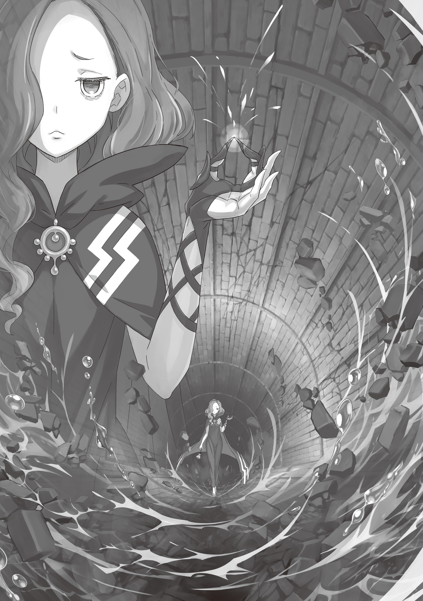
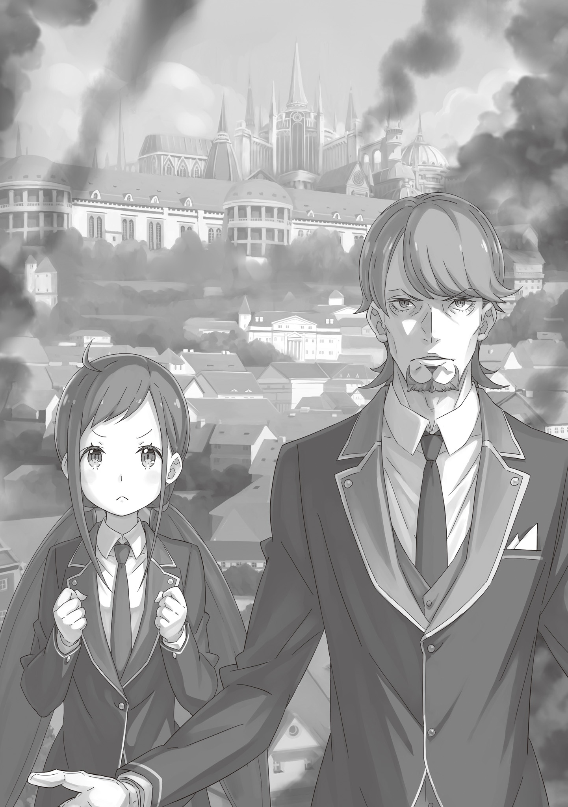

Красный … Субару не видел ничего, кроме красного цвета.

— !..

Внезапно возникший человек в шутовской маске — кто он и чего добивается, оставалось загадкой — вместо «здравствуйте» и «прощайте» швырнул в них огромный огненный шар.

Жар опалил кожу, и полутемный сток вспыхнул, как днем. Но свет лишь безжалостно высветил, как пламя заполняет узкий туннель без надежды на спасение — и от этого в груди лишь острее резануло отчаянием.

Субару тащил на спине Круш. Свой дневной лимит заклинаний E.M.T. и E.M.M. он уже исчерпал. Сил почти не осталось, маны — тем более, и спастись от огня он никак не мог.

— Твою же ж!.. — грубо рявкнул кто-то, а затем раздался вязкий всплеск.

Краем глаза юноша заметил, что Рачинс исчез. В отличие от Субару, потрясенного появлением шута, он сориентировался быстрее и без колебаний нырнул головой вперед прямо в сточные воды — единственное укрытие в этом туннеле.

— Субару! Мы тоже …

— Нет.

Беатрис поняла задумку Рачинса и вцепилась в одежку Субару, напрягла все свои скромные силенки, дабы утащить юношу за собой в воду.

Но тот уперся ногами.

— Субару?! — сорвалась девочка. Она с распахнутыми глазами пристально глядела на непреклонного Субару.

— Верь мне, Беатрис.

Их взгляды встретились. Характерные узоры в ее зрачках дрогнули, и Беатрис затаила дыхание.

Сказать она ничего не успела: ревущее пламя накрыло их. И ужасающий жар должен был вот-вот сжечь и Субару, и Беатрис, и Круш у него на спине, но … он не тронул их. Огонь приблизился, обжег кожу, казалось, сейчас вся влага в теле вскипит … но жгучая волна лишь слегка подпалила Субару челку — и тут же исчезла.

Словно по волшебству. Будто кто-то выключил солнце. В туннеле разом стемнело. Остался лишь свет их лампы, тусклое свечение осколков лагмита на полу да пахнущий гарью раскаленный воздух. А еще …

— Какого черта? — послышалось от белеющей в полумраке маски шута.

— А?

— С чего? Почему? Зачем стоять столбом, когда на тебя летит смерть?!

Незнакомец наклонил голову — его маска выражала полное недоумение. Причем злодейскую рожу он успел сменить: теперь на его лице красовалась маска с крестиками вместо глаз.

Субару сглотнул гнев на этот балаган, сдул подпаленную челку и бросил:

— Ты сам сказал, что тебе нужна Круш. Сжигать ее дотла вместе с нами тебе не с руки.

В ответ тот лишь разразился смехом, а затем ответил:

— И все?! Из-за одной только догадки ты не сдвинулся с места?! Ты ведь себя и своего Великого Духа мог сжечь!

— Рисковал. Но ставку я выиграл.

— Какая самоуверенность! Достойно Первого Рыцаря кандидатки! — шут картинно захлопал в ладоши, однако в голосе не слышалось ни капли уважения. — Стало быть, так ты и прорубаешь себе путь — слепо веришь интуиции?! Блеск! Прелесть! С ума сойти! Зависть берет!

По туннелю гулко и пусто разносились хлопки. Но Субару стиснул зубы и молча стерпел издевательскую похвалу. Лишь бы не злить этого психа зря.

Однако Беатрис молчать не стала:

— Это просто Субару оказался умнее тебя, я полагаю. А твои жалкие попытки задеть его — верх глупости, в самом деле.

В ответ шут схватился за голову:

— Какая прелесть, какая любовь! Дух и контрактор прямо как замок и ключик! Друг без друга не могут! Но такая любовь может быть не только лекарством, но и ядом!

— С ним невозможно разговаривать, я полагаю, — поморщилась Беатрис. — Прямо как с Архиепископом Греха, до чего противно, в самом деле.

— Э-э, нет, стоп, погодите! Сжальтесь, умоляю! Только не Архиепископ! Не ровняйте меня с этими отбросами! К тому же, разве не тебя, парниша, самого в этом подозревают, а?!

— Подозревают? В том, что …

— В том, что ты Архиепископ! Наверху только об этом и твердят, Нацуки Субару. Что внутри тебя сидит Архиепископ Лени! — шут театрально замахал руками. — Ой, что же делать, как же быть, просто дурдом какой-то!

Пока он кривлялся, маска вновь сменилась на прежнюю. Все это жутко бесило, но Субару было не до того.

Обвинение в связях с Культом ударило по нему слишком сильно.

— Я … Архиепископ …

— Всякий бред имеет границы, я полагаю, — отрезала Беатрис. — Если так, то почему Субару все это время крошил Культ Ведьмы в пыль, в самом деле? Это, по-твоему, внутренние разборки, я полагаю?

— Да шут его знает! Мне-то какое дело! Всем плевать на правду! Главное — выкрутить слухи так, чтобы получить выгоду. Такие ублюдки … бесят, скажи?

Пока шут болтал, он ни секунды не стоял на месте, раскачивался из стороны в сторону. И только в последней фразе Субару почудились искренние нотки.

Юноша глубоко вдохнул, шумно выдохнул и спросил:

— Так в итоге …

— А-сь? Чегось? М-м?

— Чего тебе надо? Я понял, что ты хочешь забрать Круш. Но ради чего? И на кого ты работаешь? Ты не из стражи, это уж точно.

То, что за ним гонятся рыцари, а теперь еще и приписали к Архиепископам, вызывало нервную дрожь, но с этим придется разбираться потом. Сейчас главная угроза — шут.

Ему нужна Круш, и он не с королевскими рыцарями. Так что вывод напрашивается сам: он заодно с теми, кто их подставил. Даже если забыть о герцогине, этот тип слишком силен в магии. У вымотавшихся Субару и Беатрис нет ни единой надежды в прямом бою. Нужно узнать от него как можно больше, потянуть время, выискать выход …

— А? — Субару уставился на черный балахон шута. — Что это у тебя?

— Э-э? Что? Захотел время потянуть?.. Ой.

Однако незнакомец уставился взглядом туда, куда глядел юноша — из-под одеяния, что скрывало его фигуру, пробивался ритмично мигающий свет. И Субару уже видел нечто подобное.

— Это случайно не Зеркало Связи? — спросил юноша.

— А-а! И-и! У-у! Да с чего бы?! Скажу сразу! От того, что у меня светится пузо, ваша участь никак не …

— Светится все ярче, в самом деле, — заметила Беатрис. — Видать, дело важное, я полагаю.

— Гр-р-р!.. Так, стойте здесь! Ждите!

Шут развернулся к ним спиной — настолько беззаботно и открыто, что Субару даже опешил. Незнакомец зашуршал балахоном, выудил из-за пазухи какой-то предмет — скорее всего, то самое Зеркало — и принялся с кем-то говорить.

Ему было плевать на открытую спину — он словно издевался, дескать, вы мне ничего не сделаете. Бесит, слов нет, но …

— Сейчас или никогда …

— Эй, вытащи меня … — вдруг раздался тихий шепот.

Субару скосил глаза: в потоке нечистот у самых ног показалась голова Рачинса.

— Чин! Ты все это время сидел в воде?!

— Не хотел привлекать внимание этого психа! Да и на дне какая-то цепь валяется, за ногу зацепилась, вылезти не могу …

— Если бы ты утонул, это была бы самая нелепая смерть, в самом деле, — хмыкнула Беатрис.

— Заткнись! — огрызнулся Рачинс. — Руку давай!

Субару замешкался. Он хотел помочь, но руки заняты спящей Круш. Придется просить Беатрис, но хватит ли у нее сил вытянуть взрослого парня? Как бы она сама не свалилась в сток. Разве что применить Мурак, снять вес и одновременно рвануть …

— Да чтоб тебя! — топал ногами шут неподалеку. Он орал в Зеркало Связи. — Я все делаю правильно! Ну да, малость пошумел, слегка проявил самодеятельность, но я на приказ глаза не закрывал! Не смей меня обвинять!

И после того как собеседник ему что-то ответил, он сдался:

— Ладно, ладно! Эх … — тяжело вздохнул шут. Он обернулся к Субару с Беатрис. — Эй, вы, ловите!

И тотчас в их сторону метнулся какой-то предмет.

— Чего?! Беако!

— Осторожно!

Юноша понял: к ним летит Зеркало — и сразу же окликнул Беатрис. Руки у него были заняты, так что поймала девочка.

— Чуть не уронила, я полагаю. Ты чем думаешь …

— С вами там хотят поболтать! — крикнул шут.

Субару и Беатрис недоуменно переглянулись:

— С нами?

Ожидать от мага можно было чего угодно, но они все же решились — заглянули в зеркало. И там отразился собеседник:

— Ой, проявилось! Простите, видите меня?

— …

Субару опешил — он никак не ожидал увидеть в Зеркале столь юную девицу.

Лицо незнакомое. На год-два младше Субару. Блестящие длинные темно-синие волосы были собраны в два высоких хвоста, а огромные золотистые глаза смотрели с явной тревогой. Несмотря на миловидность, девочка казалась какой-то робкой и неуверенной. А одета она была практично, без всяких излишеств: белая рубашка с узким галстуком под черным пиджаком — настоящий строгий деловой костюм.

Этот пронзительный серьезный взгляд совершенно не вязался с происходящим вокруг безумием.

— Ты … то есть вы кто?

— Эм, меня зовут Белая Овечка. И … кажется, Черный Пес — тот человек в маске — доставил вам кучу проблем … Простите, пожалуйста! — девочка вдруг низко поклонилась, отчего пропала из кадра.

— Э-э, простите?..

В голове у юноши все смешалось. Человек в маске — Черный Пес — был явно опасен, а его напарница вдруг отвешивает поклоны и извиняется. Либо тут закралась чудовищная ошибка, либо они просто издеваются.

— Буду с вами честен, — сказал Субару, — я без понятия, как к вам относиться. Я и так запутался во всем этом бреду, голова кругом идет. Дайте хоть какую-то ясность.

— Ясность? — переспросила девочка.

— Если вы враги, так и скажите. Порвем на куски.

— Как и всегда, в самом деле, — насупилась Беатрис.

Субару блефовал. Без маны они были как машина с пустым баком. Но даже с отвратительными картами на руках блеф — лучшее оружие в этом мире.

Белая Овечка распахнула глаза. У нее на лице было все написано. Она явно пыталась скрыть чувства, но личико ее не слушалось. Да и девочка сама это прекрасно знала — наверняка каждый день репетировала перед зеркалом.

— Вы так прямо об этом говорите … Разве вам не страшно? — спросила Белая Овечка.

— Страшно. Но если я держу этот страх за горло, мне как-то спокойнее. Хуже, когда он бродит где-то там, пока я стою и туплю.

— Еще раз простите. То, что Черный Пес на вас напал — это наша ошибка. И он сделал это … ради меня.

— Звучит как-то слишком самонадеянно и эгоистично, ха-ха-ха! — встрял в разговор шут. Извинения подруги его совершенно не трогали.

Девочка не обратила на него внимания. Ее взгляд метнулся за спину Субару, к спящей Круш.

— Мы хотим защитить … нет, обезопасить Круш Карстен. Нам нужна … ее сила.

— Сила Круш? Вы про ее левый глаз? — Субару покосился на повязку.

В глазу у герцогини скрывалась явная аномалия, так называемый Глаз Дракона. Вполне логично, что из-за него за ней и охотятся. Девочка даже поправила себя — не «защитить», а «обезопасить».

Но Овечка удивленно моргнула:

— Левый глаз? Я ничего про это не знаю. Нам нужна ее Божественная Защита.

— Защита …

— Да. Ее сила поможет нам … в битве с Любимыми Детьми.

Из ее уст прозвучали незнакомые слова, однако сказала она это столь твердо и решительно, что у Субару перехватило дыхание.

Битва с Любимыми Детьми … Ей нужна Божественная Защита Чтения Ветра, а не Глаз Дракона. Разговор явно сворачивал не туда. Субару совсем не ожидал, что здесь всплывет совершенно неизвестный враг.

— Мозги опять закипают … Что еще за «Любимые Дети»?

— Это наши враги. И, думаю, ваши тоже, Нацуки Субару.

— Вы про ту кашу, что сейчас творится в столице?

— Да. Именно они дергают за ниточки, — ответила девочка четко и без утайки.

Субару аж полегчало. До этого он бродил во тьме без понимания, кто враг и чего он хочет. И то, что Овечка выложила все напрямую, даже вызвало у него некую симпатию. Но …

— Если вам нужна Круш для драки с ними, и вы ради этого сунулись к нам … то вы капитально облажались с переговорщиком. Отправить этого клоуна — худшая идея на свете.

— Ой, нет! Эм … просто сейчас в столице очень неспокойно. Слишком опасно ходить по улицам без такого сильного человека, как Черный Пес …

— И к тому-у-у же, — встрял шут, — я просто увязался за тем парнем и наткнулся на вас! Я не переговорщик! Так что не вините Овечку, поняли?

— И ты этим гордишься, я полагаю? — возмутилась Беатрис. — Это ты так ее выгораживаешь, в самом деле? У тебя ни такта, ни сердца, я полагаю.

— Ах-ха-ха! Мелкая в вонючем платье открыла рот! Может, мне его тебе зашить?

Своим огнем Пес настроил Беатрис против себя, а его издевательский тон убил в Субару последние зачатки доверия. И еще одна деталь не давала покоя.

— Ты сказал, что шел за кем-то? — переспросил Субару. — То есть …

— Какой догадливый рыцарь! — воскликнул шут, пока качал бедрами из стороны в сторону. — Именно так, в аблочко! Искать наугад — тратить время, силы и саму жизнь. Вот я и схитри-и-ил! Сел на хвост тому, кто мог вас найти! А теперь этот кто-то сидит в вонючей жиже.

— В вонючей жиже …

— Эй! — раздалось из-за сточных вод. — Долго вы там еще лясы точить будете?! Вытаскивайте меня!

Все посмотрели на воду. Брошенный на произвол судьбы Рачинс яростно орал. По приказу Фельт он — знаток темных углов столицы — блестяще нашел Субару. Но, увы, привел за собой хвост. Благодарным к Рачинсу он от этого меньше не стал, однако …

— Хватит ему там плескаться. Давайте вытянем?

— Вытянем? Этого вонючего, в сточных водах искупанного? Я бы на твоем месте оставил его там — чисто из-за гигиены.

— Черный Пес … Если ты причинил кому-то неприятности …

— Ладно, ладно, по-о-онял! Ладно, может, я чуток и виноват в том, что он туда прыгнул. И, может, самую малость надеялся, что вы все превратитесь в угольки, кроме герцогини на спине, чтобы не пришлось возиться …

— Хватит молоть чушь и портить о себе впечатление, — отрезала Беатрис, — просто вытащи его, в самом деле.

Овечка только-только начала вызывать доверие, как Пес все испортил. А после услышанной правды об огненном шаре стало и вовсе понятно, насколько этот псих опасен.

Субару и Беатрис отступили на шаг и напряженно проследили за тем, как Пес протягивает руку Рачинсу. От мага такого уровня можно было ждать чего угодно.

И их бдительность оправдалась. Однако угроза …

— А?

… пришла не от Черного Пса.

Раздался тонкий хруст, словно кто-то царапнул ногтем по тонкому фарфору. Субару рефлекторно дернулся на звук. В глубине туннеля, в слабом свете брошенного лагмита, вырисовался силуэт.

— …

Женщина. На ней был плащ непонятного серо-черного цвета, воротник скрывал волнистые темно-зеленые волосы. Бледное лицо, под глазами залегли глубокие тени. На миг Субару подумал, что это еще одна напарница Пса и Овечки.

Но не успел он и рта раскрыть, как женщина подняла левую руку. В пальцах она держала что-то маленькое и белое, похожее на осколок. Она сжала пальцы — и осколок хрустнул.

И тотчас от ее ног по каменному полу змеей побежала трещина — прямо к Субару и остальным.

— Твою ж мать! — заорал Рачинс, едва не схвативший Пса за руку.

Но трещина не остановилась на полу. Она поползла по стенам, перекинулась на потолок — за ней оставался мутно-белый след. Древняя кладка, на которой держалась столица, на глазах превращалась во что-то хрупкое. Словно весь туннель становился стеклянным.

— Черный Пес! — в ужасе закричала Овечка из зеркала.

Но помочь она ничем не могла. Впрочем, ее крик сработал как сигнал.

— Не скули, сам вижу!

Дурашливый тон Пса мигом улетучился. Он крутнулся на месте и встал на пути расползающейся трещины. Субару спиной почувствовал, как яростный взгляд мага пронзает полумрак. Пес смачно цыкнул.

— Худшая из худших! — крикнул он. — И надо же было тебе припереться именно сейчас!

— Вы знакомы?!

— Знать ее не желаю и видеть не хотел! Это Раскалывающая Кларисса! Одна из Любимых Детей!

И Субару, и Овечка ахнули. Кларисса не ответила. Она опустила руку в мешочек на поясе и достала еще один камешек.

— Стой, стой, стой! Не смей здесь … — заорал Пес в попытке ее остановить, но опоздал.

Камешек треснул — и по туннелю разнесся четкий, звонкий звук … а следом началось разрушение.

— Да вы издеваетесь …

Стена рядом с Субару побелела, а в следующее мгновение куски потолка обрушились прямо на них.

— Беатрис! — воззвал юноша.

— Знаю, я полагаю! — девочка вскинула ручку к падающим камням.

Без маны, в шаге от истощения — им приходилось выкручиваться тем, что есть. В бой они уже вступить не могли, однако даже с такой плохой колодой карт вертелись, как могли, — это и делало их настоящими партнерами.

— Мурак!

Магия исказила все вокруг: смертоносные глыбы окутались тусклым светом и потеряли вес, превратились в легкую пемзу. Субару прижал к себе Круш, схватил Беатрис и отпрыгнул назад. В тот же миг гравитация вернулась, и половину туннеля завалило камнями.

— А ты хороша, мелкая! — осклабился Черный Пес. — Хорошо сработано!

— Раз уж мы спасли тебе шкуру, выкладывай все, что знаешь, в самом деле! Кто она такая, я полагаю?!

— Эспер! Ломает! Крушит! Унылая баба, с ней и поговорить не о чем! Сейчас я ее прикончу!

Следом шут взмахнул рукой, и ураганный ветер швырнул облако острых камней прямо в Клариссу. Смертоносный град должен был изрешетить ее, но … раздался легкий хруст. Камни в воздухе разлетелись в пыль. Они так и не долетели до цели.

А Кларисса лишь смахнула каменную крошку с пальцев.

— Это все из-за камней, которые она ломает?

Субару вперил в нее взгляд и заметил, как из ее левой руки сыплется каменная крошка. Видимо, само это движение таило разгадку ее способности. А мешочек у нее на поясе был явно полон таких камешков.

— Эй, бей огнем! — крикнул Субару Псу. — Магию она разбить не сможет!

— В точку, парень! Но есть проблемка! Огонь я уже весь потратил!

— Чего?!.. Вот дерьмо!

Субару запаниковал. Тем временем Кларисса плавно достала следующий камень, точно совершала священный ритуал. И тотчас вокруг все трещало по швам. Если она сломает эту песчинку, весь туннель разлетится вдребезги. Им конец …

— Эй! Сюда! Все сюда!

— Чин?! — обернулся Субару на крик.

Там, в воде барахтался Рачинс и цеплялся одной рукой за стену. Другой он тянул из воды какую-то черную ржавую цепь. Хоть лицо было измазано грязью, глаза горели диким блеском.

— Это отстойник! — заорал он. — В нем просто куча осадка!

— Отстойник …

Субару пробило током. Отстойник. Гниющая масса. И самое очевидное взрывное последствие …

— Да ладно …

— Хех! — ухмыльнулся Рачинс. — Соображаешь!

И он тотчас изо всех сил дернул цепь. Ржавый металл натужно скрипнул, и со дна раздался глухой скрежет. Вода у стены закипела. Пузыри множились, поднимались на поверхность. И без того смрадный воздух мгновенно пропитался густым запахом тухлых яиц.

Субару понял план. Времени на раздумья не было.

— Круш …

Он заколебался, ибо волновался за бесчувственную Круш у него на спине. То, что произойдет дальше, может для нее быть очень опасно … Однако Черный Пес опередил его — грубо толкнул Субару в спину.

— Эй, ты …

— Лучше так, чем быть раздавленными в пыль! — крикнул шут и прыгнул в воду.

И конечно же, не один — он утянул за собой Субару, Круш и Беатрис. Не успели они плюхнуться в грязь, как мир погрузился во тьму: Черный Пес создал полусферу из земли, что превращалась в защитный кокон.

— Прошу вас! Поверьте нам! — отчаянно крикнула Овечка из Зеркала перед тем, как тьма сомкнулась.

Внутри закрывающегося шара Субару передал Круш в руки Беатрис и протянул руку наружу.

— Давай, Рачинс!

— Не командуй!

Рачинс выдернул цепь до конца и неуклюже оттолкнулся от стены. Субару схватил его за вытянутую худую руку и рывком втащил внутрь. Они вдвоем повалились на спины. И земляной купол захлопнулся ровно в тот миг, когда снаружи раздался тихий хруст сломанного камешка.

Стены купола содрогнулись. Но прежде чем магия Клариссы добралась до них …

— Сдохни, сука. Гоа! — выплюнул Рачинс, лежа на Субару, и щелкнул пальцами.

Сквозь земляную скорлупу блеснула красная вспышка … а затем пришел удар.

Словно великан врезал под дых. Субару заорал. Хотя они под водой и заперты в земляном коконе, стало невыносимо жарко. И ослепительно ярко. Рев взрыва ударил по барабанным перепонкам, и немой крик разорвал легкие Субару.

В следующий миг шар завертелся с безумной скоростью. Он кувыркался в бурлящем потоке, бился обо что-то тяжелое и отбивал Субару все кости, пока юноша не начал терять сознание.

Рачинс открыл отстойник, выпустил горючий газ и подорвал его, чем разнес в клочья и туннель, и Клариссу. Что там стало с канализацией, Субару не знал. Он ничего не видел, не слышал и не понимал.

В этой бешеной центрифуге земляного шара Субару мог лишь из последних сил прижимать к себе хрупкую Беатрис. Он должен был защитить их.

Стиснуть зубы и терпеть. Это все, что он мог.

И он терпел. Терпел. Терпел.

Терпел, пока невидимый водоворот окончательно не поглотил его сознание.

Когда Субару очнулся, первым делом он почувствовал запах. Не тухлых яиц. Не канализационной вони. Пахло спиртом и чистым бельем. Воздух пропитывал сухой, теплый аромат, не тронутый гарью. Юноша полной грудью вдохнул эту стерильную свежесть … и поперхнулся.

— Кха! Кх-х! Пх-х! — зашелся он кашлем.

— Кья-я-я!

Тяжесть на животе тотчас подскочила и издала забавный писк. Юноша разлепил веки и проморгался. Рядом с ним, на кровати, сидела надутая Беатрис, завернувшаяся в одеяло.

— Беако … ты цела? — слетело с его дрожащих губ.

— Вроде того, я полагаю, — буркнула она. — Это было не на волосок от гибели, а на целую сотню волосков, в самом деле.

— Если прибавить сто волосков, поговорка немного поменяется … неважно. Главное, мы живы. А что с остальными …

Субару было вскочил, как Беатрис приложила ладошку к его лбу и пригвоздила к подушке.

— Успокойся. Сначала оглядись.

Повинуясь, он повернул голову и … замер — на соседней койке лежала Круш.

— Круш … Слава богу. С ней все нормально?

— Насколько знаю, да, я полагаю. Но она так и не очнулась, так что понятия не имею, сколько еще она так проваляется из-за этого глаза, в самом деле.

— Ясно … О, и Чин тут. Прямо отлегло.

Круш мерно дышала во сне. А на длинной кушетке у стены валялся укутанный в одеяло, точно кукла, Рачинс. Он тоже еще не проснулся, но, видимо, лежать было жутко неудобно: он морщился и что-то неразборчиво бормотал. С героем, который всех спас, обошлись, конечно, грубовато.

Субару вяло улыбнулся и оперся рукой о край кровати.

— Где мы вообще?..

Это точно не канализация. Каменные стены без окон, тусклый свет лампы. Рядом на столике — кувшин с водой, бинты, аккуратно сложенная ткань. Типичный лазарет.

— Какая-то подпольная клиника? Укрытие теневого доктора …

— Вы очнулись, Нацуки Субару!

Его размышления перебил звонкий голос, и Субару повернул голову к двери.

Там стояла знакомая девочка в черном костюме — та самая Белая Овечка из зеркала. Вживую она выглядела такой же неуверенной: то сжимала, то разжимала кулачки и прижимала их к груди.

— С-слава богу … Я так боялась, что с вами что-то случилось …

— Эм … спасибо, что беспокоишься?

— Да! То есть нет! Э-э … а что нужно сказать?

И Субару, и Овечка зависли, не зная, с чего начать. Что лучше: благодарить, извиняться или ругаться? Они точно спаслись, но до этого Черный Пес угрожал их убить. Как тут себя вести — загадка.

— Белая Овечка, не утомляй господина Нацуки, — раздался голос из-за спины девочки. — Ты все же не Черный Пес. Иначе придется пересмотреть наши методы.

Субару вздрогнул и распахнул глаза. За этот день он пережил столько потрясений, что, казалось бы, удивляться нечему. Но судьба приберегла еще один сюрприз.

Человека, стоящего за Овечкой, он знал отлично.

— Господин … Рассел?.. — выдавил Субару.

Перед ним стоял Рассел Феллоу — глава торговой гильдии столицы. Они познакомились на заре Королевских Выборов. Рассел помог снабдить войска перед битвой с Белым Китом. Пусть они и не сражались плечом к плечу, но делали общее дело.

В голове царил полнейший хаос. Субару просто ошарашенно смотрел на безупречно одетого джентльмена. Рассел же мягко улыбнулся и кивнул.

Но от улыбки этой по спине почему-то пробежал холодок. Слишком уж много скрытых мотивов читалось в лице простого торговца. И чутье его не обмануло.

— Какая удача, что мы встретились, господин Нацуки. Перед лицом небывалой угрозы для Королевства нам как никогда нужны ваши силы и ваша дальновидность.

— Небывалой … угрозы?

— Именно так.

Улыбка так и не сошла с лица Рассела, даже когда он принес следующие, ужасающие вести:

— Противник выбрал тихий, но полный захват. Сердце власти уже пало под натиском нашего давнего врага. Королевство на грани уничтожения.

