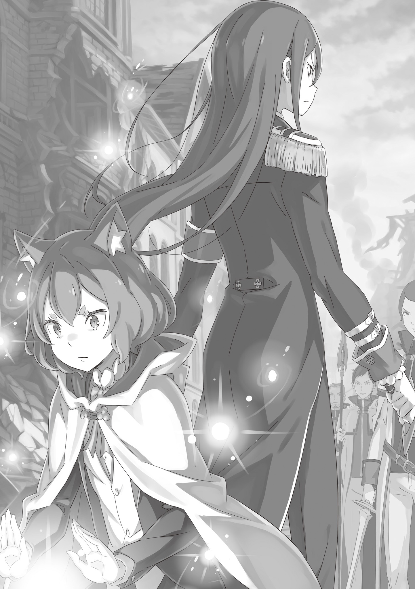

Нацуки Субару выпрыгнул из окна и бросился к аварии в хвосте колонны. Он бежал без колебаний, даже с какой-то лихой уверенностью. Так выглядит со спины человек, для которого спасать чужие жизни — единственно возможное дело.

— Немыслимо.

Черноволосый попутчик не обратил внимания на окрик и ринулся в гущу событий — совсем не думал о последствиях. Рассел Феллоу мог лишь провожать его взглядом, не веря собственным глазам.

Дело не только в том, что Рассел не понимал логики юноши. Он ведь так долго втолковывал ему важность их миссии, так тщательно объяснял, что такое приоритеты!

Но важнее было другое.

— Белая Овечка, почему ты его не остановила?!

Рассел потребовал ответа. Он же приказал умиротворить попутчика, чтобы дело шло гладко! Белая Овечка ведь положила руку на ладонь Субару, произнесла нужные слова. И все же он не послушался — нет, не поддался ее чарам.

— Вы ведь прекрасно понимаете, что сейчас важнее всего, — холодно процедил Рассел. — Мы не имеем права тратить ни секунды ни на что другое. И тем не менее …

— … я все сделала, — сорвался тихий шепот.

Собеседник его не разобрал. Он нахмурился:

— Что? — посмотрел Рассел на девушку.

Тем временем Белая Овечка глядела на открытое окно. Она прижала к груди руку, которую только что оттолкнул Субару, и повернулась к Расселу. В ее круглых золотистых глазах стояли крупные слезы.

— Я все сделала, — всхлипнула она. — Я применила к Субару … но он все равно выскочил наружу! Значит … значит, он просто такой человек!

— Такой … человек?

— Я ведь уже говорила Серебряному Лису! Я могу лишь пробудить те чувства, что уже есть в сердце! Если человек ни за что на свете не хочет чего-то делать, я не смогу его заставить!

— …

— П-пойдемте скорее за ним! Поможем раненым!

Девушка умоляла его со слезами на глазах, но Рассел лишь прикрыл рот рукой. В глубине его прищуренных глаз Божественная Защита, способная оценивать «стоимость» чего угодно в этом мире, уже перекраивала и плела заново паутину интриг.

Идеального ответа просто не было. Оставалось выбрать тот, что ближе всего к истине.

— Ого-ого, ну и веселые-развеселые у вас тут дела! — бросил на ходу Черный Пес. Он нагло забирался в драконью повозку. — Раз уж спорите, пускайте в ход кулаки, а не языки. А еще лучше — режьте-убивайте друг друга, а не лясы точите! Ку-ха-ха-ха!

— Черный Пес …

— А? Че это у тебя с лицом? Неужто научилась охмурять слезами, без всяких там прикосновений? Учти, это сработает только на мужиках. И я в это число не вхожу.

Черный Пес стянул черный плащ и маску, представши в строгом темном костюме. Мускулистое лицо мужчины с грубыми чертами скривилось в мерзкой усмешке. При Расселе и Белой Овечке он небрежно плюхнулся на ближайшее сиденье и продолжил:

— И вот я смотрю, чего вы тут возитесь-копаетесь, а вас, оказывается, какой-то щенок за руку цапнул! Я вам, между прочим, путь наружу открыл. Не смейте спускать в трубу чужие труды!

— Путь наружу?.. — Рассел нахмурился. — Только не говори, что …

— Эй, стой-погоди, что за взгляды? Я всего-то ось сломал. Драконы перепугались и всю эту бучу устроили! И вообще, все это я ради тебя сделал. Ку-ха-ха-ха, шучу!

— Серебряный Лис! — ахнула Белая Овечка.

Она отвернулась от наемника на сиденье и бросила на Рассела полный праведного гнева взгляд. Рассел спокойно встретил эту искреннюю ярость, опустил руку и произнес:

— Трогаем.

— В-вы серьезно?! —в шоке распахнула глаза Белая Овечка.

Рассел кивнул.

— Изначально нашей главной целью было захватить Круш. Я планировал прибрать к рукам и остальных, но если я протягиваю им руку, а они ее кусают, то так тому и быть. Жаль, конечно, терять Синего Змея — я хотел кое-что на нем проверить.

— А я ведь говорил, да? Надо было спалить его еще в канализации, и никаких бы хлопот не было.

— Я не собираюсь возвращаться к темам, которые не подлежат обсуждению. Время дорого.

Рассел повернулся к Белой Овечке спиной. По его осанке было ясно: он вычеркнул из планов попутчика, сбежавшего к месту аварии.

Девушка с решительным видом потянулась к его плечу, но …

— Погодь.

… длинная нога преградила ей путь. Все на том же сиденье Черный Пес посмотрел на закусившую губу девушку.

— Сама же сказала: если человек чего-то не делает, его не заставить.

— Но ведь так нельзя …

— Не реви, раздражаешь. И я не собирался делать услугу этому ублюдку. Просто, может, тебе и действовать не придется.

— …

Белая Овечка растерянно заморгала, а Пес пожал плечами и, не убирая ноги, махнул рукой в сторону задней части повозки — туда, где произошла авария. И добавил:

— Переполох, кажись, немного переменился. И как теперь поменяются наши планы? Ку-ха-ха-ха!

На месте происшествия клубилась пыль. Наполовину разрушенное здание продолжало осыпаться.

Под обрушившимся потолком лежал тяжелораненый человек без сознания. Острая деревянная балка насквозь пробила его тело, кровь хлестала потоком. Смертельная рана. Любой сказал бы, что беднягу уже не спасти. Так бы оно и вышло, не окажись рядом целителя.

— Феррис?

Тот откинул капюшон, и Субару резко втянул воздух, узнав знакомое лицо.

А ведь он совсем недавно о нем вспоминал. Думал, как там Феррис после всех испытаний. Ведь рыцарь отверг помощь Субару — назвал ее проявлением гордыни. Кто бы мог подумать, что он возьмет кодовое имя Синий Змей и окажется в той же группе!

— Чего застыл?! Уши заложило?!

— …

— Не стой столбом, когда жизнь на волоске! Если он умрет, это будет наша вина — вина тех, кто не спас!

Этот крик вывел Субару из оцепенения. Он вспомнил, что Феррис только что велел вытащить балку из груди раненого, и юноша опустил Беатрис на землю:

— Беако, прошу!

— Хорошо, я полагаю! Мурак!

Битва в особняке МакМахона, сражение в канализации — толком не удалось отдохнуть … но даже совсем измотанная, девочка не подала виду. Она применила магию Тьмы, чем уменьшила вес деревяшки.

— Поднимаю! — воскликнул Субару. — Готов?!

— Только идиот будет не готов! — огрызнулся Феррис.

— Ну и язык у тебя! У-о-о-о!

Юноша осторожно потащил вверх ставшую легкой балку. Мерзкий влажный звук, хлынувшая с новой силой кровь … Но как только дерево вышло из раны, Феррис показал себя во всей красе.

— Все хорошо. Сейчас я тебя вылечу.

Ослепительный, но бесконечно нежный синий свет залил все вокруг. Субару повидал немало целителей и сам не раз оказывался под их опекой, но он сразу понял: эта мощь — нечто за гранью.

— Какая … — сорвалось с губ Беатрис.

Великий Дух, тоже владеющая магией исцеления, замерла в изумлении. В этом свете крылась причина, почему Ферриса называли «Синим», почему считали гением, которому нет равных.

Его мастерство не просто осталось прежним. Оно явно шагнуло далеко вперед.

— Готово! Дальше! Унеси его!

Свет погас. И это не значило, что беда миновала. Это значило, что человек полностью здоров.

Рана закрылась — человека спасли, но все еще лежал без памяти. Субару стер кровь с груди пострадавшего и не нашел ни единого следа травмы — только дыру в одежде и бурые пятна. Феррис же не стал дожидаться благодарности и бросился к следующему.

— Беако! Присмотри за Феррисом! Я сейчас!

— Поняла, в самом деле!

Юноша оставил Беатрис прикрывать лекаря, вытащил исцеленного на дорогу и окликнул мужчину, который помогал раненым:

— Эй!

Тот обернулся, и Субару вытаращил глаза.

— Раненый?! Куда задело?! — крикнул мужчина.

Напряженное лицо было слишком знакомым. Это был Кадомон, торговец аблоками из столицы, с которым жизнь то и дело сводила юношу.

— Эй, парень, ты оглох?! Где у него рана?!

— В-все нормально! Одежда порвана, но он уже здоров!

— Чего? Здоров?! Ты что несешь …

— Соберите всех раненых, всех, кто ударился головой, в одно место! — закричал Субару, придя в себя. Кадомон его не узнал — видимо, работал плащ, скрывающий личность. — Там лучший целитель!

Субару грубо спихнул спасенного на руки Кадомону и бросился обратно к руинам.

Он едва не попался. Перепугался до смерти. Но все равно был рад, что вернулся, и дело было даже не в знакомом лице. А вот окажется ли этот выбор правильным до самого конца — зависело от того, что произойдет дальше.

— Я тут! Готов помогать! Что делать?!

— Не путайся под ногами! — продолжал сыпаться град оскорблений от Ферриса в этой суматохе. — Делай, что говорю! Держи его!

— Ах ты … Вот закончим, я тебе все выскажу!

И Субару, сжавши зубы, безропотно подчинялся. Если отбросить скверный характер, то целитель действовал блестяще — он мгновенно понимал, насколько серьезны раны, кому помощь нужна в первую очередь, и вытаскивал людей с того света одного за другим.

— Обычно магия исцеления лишь подстегивает собственные силы организма, в самом деле. Она просто ускоряет заживление ран, я полагаю. Оторванную руку так не вернешь, а если кость сложена неправильно, она так и срастется криво, в самом деле. Но магия этой девчонки …

Беатрис наблюдала за происходящим, не скрывая потрясения. Она так удивилась, что Субару даже не стал поправлять ее насчет пола целителя. Да и кто бы не ошибся, глядя на Ферриса?

— Ресторан. Время ужина … Понятно, почему тут столько народу, — пробормотал Субару.

Из-за затора на дороге многие посетители остались внутри здания. Какое счастье, что на глазах у Субару пока никто не умер. А если никто не умер мгновенно, значит …

— Никто не умрет, — прошептал Феррис. — Все вернутся домой.

Сияние мягко омывало раненых и заставляло страшные, смертельные увечья бесследно исчезать — настоящее чудо ломало саму суть трагедии.

Люди вокруг завороженно смотрели на это волшебство. Субару их понимал: увечья, которые должны были оставить калекой на всю жизнь, раны, от которых неминуемо наступила бы смерть, — все это исчезало, словно страшный сон, стиралось светящимися руками. Толпа молча стояла, онемев от восторга.

— Эй! Вы только посмотрите! — раздался вдруг полный ужаса вопль.

Кричал один из стражников, помогавших раненым. Он указывал на обломки ресторана — точнее, на кусок второго этажа и крыши, чудом державшийся на потрескавшихся колоннах.

Балки изо всех сил старались сохранить хрупкое равновесие и уберечь людей, но жалобно затрещали. Конструкция накренилась.

— Плохо! Сейчас рухнет!

Прямо под нависающей громадой находились Феррис и еще несколько раненых. Если крыша обвалится, погибнут все … В тот же миг Субару сорвался с места. И не только он.

Пожилой стражник, его подчиненные, простые горожане, помогавшие разбирать завалы, — все ринулись туда. Остальные тоже вскакивали на ноги, готовясь прийти на помощь.

Краем глаза Субару заметил это движение, до боли стиснул зубы и заорал во всю глотку:

— Беатрис!

— Теперь я совсем пустая, я полагаю! Мурак!

Девочка вскинула руки, и падающий кусок здания окутался слабым фиолетовым свечением. Но, увы, законы гравитации никто не отменял — скорость падения не изменилась, как и опасность: такая масса все равно раздавила бы всех в лепешку. Субару бросился прямо под обломки.

— Гх-х-х!

Он едва успел упереть руки в падающую крышу, словно жертва, которая попала в ловушку с опускающимся потолком. В одиночку ему было ни за что не удержать такой вес. Но следом подоспели стражники и горожане. Все вместе они навалились на огромный кусок стены.

— Кх-х … Быстрее … уносите … людей! — прохрипел Субару.

Кости трещали. Казалось, он вот-вот харкнет кровью от натуги. Остававшиеся в стороне люди бросились вытаскивать из-под завала раненых и Ферриса.

Надо продержаться. Чего бы это ни стоило! Субару напряг каждый мускул.

— Однако ж … горластый ты парень! — раздался вдруг голос рядом.

— А? Ты же … — Субару повернул голову и опешил.

Плечом к плечу с ним изо всех сил подпирал крышу торговец аблоками Кадомон. Субару похолодел. Рассел предупреждал, что мантия не всесильна. А он опять вылез на рожон, и Кадомон его узнал. План провалился.

Но торговец лишь ухмыльнулся:

— Да не корчи ты такую морду. Спасаешь ведь людей — вот и вся правда, которую я вижу.

От этих слов руки у Субару предательски дрогнули. Кусок здания накренился, Кадомон и остальные крякнули от натуги, и Субару спешно вцепился в крышу с удвоенной силой.

Он испугался, что его раскрыли, что все кончено, но как же здорово, что он вернулся!

— Все вышли! По команде толкаем вперед и отпрыгиваем! Кидаем вглубь!

Зубы скрипели от напряжения. «И-и … раз!» — рявкнули они хором. Резкий толчок руками — и огромный ломоть второго этажа полетел прочь. Как только он оторвался от пальцев, действие магии иссякло, и на землю обрушилась вся разрушительная масса.

— Назад, назад, назад, назад!!!

Оглушительный грохот ударил по ушам. Толпа бросилась врассыпную от смертоносной лавины кирпичей и дерева. Субару отскочил, споткнулся и покатился по земле. Остановившись, он лежа раскинул руки крестом в облаке пыли и взглянул на небо.

— Х-ха … Никому … ничего не прищемило? — тяжело дыша, спросил он.

— Не боись, — ответил Кадомон, лежащий рядом с ним. — Тут же лучший целитель.

— Даже если он вылечит, я не хочу смотреть на свои оторванные руки!

— Это точно, — рассмеялся торговец.

Отовсюду послышались смешки — судя по всему, никто из тех, кто держал крышу, не пострадал. Дело было сделано … вернее, так Субару хотелось думать.

— Феррис там все еще один надрывается. Надо помочь …

— Боюсь, это будет проблематично, в самом деле.

Субару через силу заставил ноющее тело подняться и обернулся на голос Беатрис.

Ее тон был слишком напряженным. И Субару сразу понял почему. Спасенных вытащили на улицу перед разрушенным рестораном, и Феррис продолжал исцелять раненых … но теперь его окружили.

— Мятежник, рыцарь Круш Карстен, «Синий» Феликс Аргайл. Вам приказано явиться в королевский замок. Немедленно следуйте за нами.

Послышалось, как обнажили мечи из ножен, и десятки рыцарей направили клинки прямо на целителя.

Их было около тридцати. Все в белых мундирах Королевской Гвардии. Субару смотрел на эту картину, и у него в голове помутилось от ее абсурдности: рыцари угрожают оружием целителю, спасающему жизни прямо на месте катастрофы? Быть того не может!

— Д-да что вы несете?! — возмутился Кадомон. — Приказ?! Вы что, не видите, что происходит?!

— Именно! Он людей лечит! — поддержал старый стражник. — Если бы не он …

— Возражения не принимаются! У нас приказ первой важности! Пусть стража разбирается с аварией. Мы — рыцари, и мы выполняем свой долг!

Заместо Субару заступились, но их крики, однако, утонули в яростном реве длинноволосого командира рыцарей. Наступила секундная пауза. Командир просверлил взглядом Ферриса — тот даже не посмотрел на рыцарей и продолжил творить исцеляющую магию. Рыцарь гаркнул:

— Это приказ! Прекратить, рыцарь Феликс! Вы и ваша госпожа подозреваетесь в тяжком преступлении против Королевства! Мы не можем доверить вам лечение! Откуда мы знаем, что вы сделаете с пострадавшими?!

— Совсем охренели?! — взорвался Субару.

Он не мог стерпеть таких чудовищных оскорблений в адрес Ферриса. Черноволосый юноша выскочил вперед и закрыл собой лекаря от рыцарей … нет, эти ублюдки даже не были достойны зваться рыцарями. Он яростно уставился на них:

— Да вы хоть знаете, через что прошел Феррис, чтобы стать лучшим целителем, вашу ж мать?! Думаете, это просто талант?! Он хотел спасать людей, вот и все!

— …

— Не знаете, что он сделает с ранеными?! Я вам скажу! Он их лечит! Жизни спасает! Вытаскивает с того света! Это поступки самого лучшего человека на свете, и любой, у кого есть глаза, это видит!

Субару орал до хрипоты. Глаза налились кровью. Как можно не понимать таких простых вещей?! Он махал руками, кричал, выплескивая всю свою ярость в лица гвардейцев, словно и не выбился из сил минуту назад. В каждое слово он вкладывал всю душу.

— Парень … — тихо прошептал Кадомон.

Для него, стражников и всех, кто разбирал завалы, это было очевидной истиной. И даже среди рыцарей пошли шепотки — кое-кто опустил мечи, в их взглядах промелькнуло сомнение.

Но этот здравый порыв был растоптан одной фразой:

— А я все думал, кто же это. Пособник мятежников, Нацуки Субару.

Командир посмотрел на него глазами, полными мутной ненависти.

Как только прозвучало имя Нацуки Субару, рыцари заморгали. Иллюзия развеялась. Мантия потеряла силу.

Стоило понять, что правильные слова произнес преступник, как гвардейцы тотчас отбросили сомнения. Чувство долга взяло верх, и воздух вновь зазвенел от напряжения — еще более плотного, чем раньше.

— Субару … — Беатрис сжала его руку. Но мана иссякла, сдерживать обломки было нечем. Бежать некуда.

«Разве что въехать командиру по роже Невидимым Провидением … » — подумал Субару.

— Прости, Феррис, — сказал он уже вслух. — Я только подлил масла в огонь.

— Заткнись, — фыркнул рыцарь из-за спины. — Я на тебя и не надеялся.

— Ха-ха …

— Но ты же любишь трепаться языком. Неси любую чушь, тяни время до последнего. А я пока спасу кого успею.

Они переговаривались, не оборачиваясь друг к другу. Субару лишь усмехнулся про себя язвительности Ферриса и приготовился к худшему.

Им нужна информация о Круш. Вряд ли они убьют его прямо сейчас. А раз магии нет, придется выкручиваться с помощью болтовни — в этом Нацуки Субару знал толк.

— Твоя опасность слишком велика. Чтобы спасти Королевство от смуты, Нацуки Субару, здесь и сейчас ты …

— Воу, стой-стой-стой! Вы меня переоцениваете! Да и мятеж …

— Молчать! Все ради Королевства! Твой поганый язык …

— Я чувствую ветер лжи.

Площадь обдул резкий, прохладный порыв ветра.

— Феррис.

— Да.

— Исцели всех раненых. Сделай так, чтобы они смогли вернуться к нормальной жизни.

— Я бы и сам так сделал, без всяких приказов.

— Вот и отлично. Я выиграю тебе время.

Они обменялись всего парой фраз. Но большего и не требовалось. Они знали способности друг друга лучше, чем кто-либо другой.

Вспыхнул золотой свет Глаза Дракона. Быстрыми, выверенными движениями она ворвалась в ряды рыцарей, внося панику и хаос. Гвардейцы попытались рассредоточиться и взять ее в кольцо, чтобы не задеть своих, но …

— Я все вижу.

Шквал ударов не оставлял ни единого шанса на спасение … Тонкое лезвие ее меча находило бреши размером с игольное ушко и неумолимо пробивало дорогу. Богиня Войны танцевала со смертью, пока рыцари один за другим роняли оружие.

Стоная, они отступали, зажимали запястья и кисти рук. Короткие, неглубокие порезы лишали их возможности держать клинки, выводя из строя без лишних жертв.

Меч, не отнимающий жизни … так казалось поначалу.

— Кто из вас «настоящий»? — процедила Круш. — А кто фальшивка?

Гвардейцы вздрогнули.

— Двое по краям — чисты. Тот, что спрятался за их спинами, — порочен. Тебе не уйти.

Безжалостный приговор прозвучал как гром. Рыцарь, стоявший позади, вскинул свободную руку. Явь исказилась, чем предвещала мощное заклинание.

— Бесполезно, в самом деле, — раздался шепот Беатрис.

И ее слова подтвердились: вспышка клинка разорвала плетение магии еще до того, как оно успело сформироваться. Рыцарь с расширенными от ужаса глазами получил диагональный удар и рухнул наземь.

Субару уже открыл было рот, чтобы остановить ее, но вовремя прикусил язык. Присмотревшись, он понял: Круш карала и щадила не просто так. Среди гвардейцев были те, кто хотел лишь задержать мятежницу, и те, кто явно жаждал крови. И Круш убивала только последних.

Судя по безумию их командира, здесь не обошлось без Капеллы. И Божественная Защита Круш безошибочно вычисляла тех, кто был осквернен ее ужасным Полномочием.

— Мне не кажется … или она стала сильнее, чем в особняке?

— Тебе не кажется, я полагаю. Теперь она управляется с Глазом гораздо лучше, в самом деле.

Безупречные, безжалостные удары без единого лишнего движения. Прямо в пылу боя Круш сортировала противников — на зараженных Капеллой и чистых — и для каждого выбирала свой способ расправы. Ее мастерство было за гранью реальности.

Глаз Дракона сливался с ней все сильнее. Субару не мог радоваться этому открытию, ибо слишком хорошо понимал, чем оно грозит.

— Готово! Всех вылечил!

Круш в одиночку сдерживала рыцарей ровно столько, сколько понадобилось Феррису для спасения раненых. Тяжело дыша, покрытый испариной целитель попытался встать, но пошатнулся. Субару вовремя подхватил его, обнял за талию и закинул тонкую руку себе на плечо.

— А ты знаешь, когда подкатить, Субару …

— Не говори так, будто я специально ждал! Слушай, а ты реально крут!

— Не ори. Держи крепче. Я сейчас упаду.

— Вечно ты командуешь. Ладно … Круш!

Феррис закончил. Пора было уходить. С ее силой они могли бы прорваться и с боем, но …

— Если она снова уснет по дороге, нам конец, я полагаю.

— Вот именно! Круш, скажите, что у вас есть план!

— Увы, нет.

— Ой-ей!

— Зато они есть у других. Черный Пес!

Субару, Беатрис и Феррис скривились. Надежда, конечно, умирает последней, но доверять свою жизнь этому типу было как-то боязно.

— Ку-ха-ха-ха! Да не кривитесь! Встречайте главную звезду!

Омерзительный смех эхом разнесся по площади. Рыцари и зеваки удивленно завертели головами, но никого не заметили.

Зато в следующий миг все вокруг заволокло густым черным дымом. К ним подбежала Круш:

— Это дымовая завеса. Она безвредна, — спокойно пояснила она под прикрытием хаоса.

Но одно дело верить ей, а другое — Черному Псу. Субару грызли сомнения.

— Все нормально, — пробормотал Феррис. — Иначе мы с тобой так тут и останемся.

— Логично! Понял. А теперь валим … Невидимое Провидение!

Из груди Субару вылетела невидимая темная рука. Она пробила пелену дыма и смачно впечаталась в лицо командиру рыцарей, который как раз собирался броситься за ними.

— Кха! — командир брызнул кровью из носа и рухнул навзничь.

Круш покосилась на него и произнесла:

— Этот человек чист.

— Да ладно?! Он что, не подменыш?!

— Я почувствовала в нем лишь сильную ярость и ненависть к вам. Есть догадки?

— Это же рыцарь Зеол, да? — подал голос Феррис. — Он был в замке, когда объявляли кандидаток. Наверное, поэтому.

— Да когда все уже забудут про тот позор?!

То этот случай доказывал его невиновность, то становился поводом для ненависти — сплошной дурдом. Но жаловаться было некогда. Под защитой черного дыма беглецы рванули прочь. Несколько рыцарей попытались кинуться в погоню, но …

— Мы вас к парню не пустим, — мрачно процедил Кадомон. Он заступил им дорогу вместе со стражниками. — Уж больно мне не нравится, как вы, гвардейцы, сегодня работаете.

Субару оторопел:

— Дядь?!

Но торговец лишь улыбнулся:

— Давай, беги! Я болею за тебя и Эмилию!

— А-ага! Я еще вернусь за твоим честным голосом!

Кадомон знал, кто он такой. Знал, что он рыцарь Эмилии, и все равно поддержал его! Едва не нахлынули слезы, но Субару бросился сквозь дым.

Вслед ему неслись яростные крики рыцарей и решительные голоса стражников.

— Осмотр завершен! Пропустите их, рыцари! Дайте страже делать свою работу!

Когда беглецы вынырнули из завесы черного дыма, они выбежали за главные ворота и запрыгнули в поджидающие их драконью повозку. Там их встретил Рачинс, он лениво помахивал рукой:

— О, вернулись. А я думал, вы уже сдохли.

— Чин, какой же из тебя все-таки мерзкий союзник …

Удивительно, как этот парень умудрился не ударить палец о палец, пока вокруг творилось такое.

— У тебя вообще сердце есть? Или ты из Культа?

— Чего мелешь?! И я вообще-то без дела не сидел. Я тут переговоры вел. Скажи же, герцогиня? — Рачинс показал язык и кивнул на Круш.

Та как раз поправляла повязку на левом глазу:

— Все верно.

— Рачинс Хоффманн умеет убеждать. В сущности, именно он и добился заключения сделки.

— Сделки? С кем …

— Разумеется, с нами, господин Нацуки.

От этого внезапного голоса Субару и Беатрис подскочили на месте. В повозку следом за ними поднялся не кто иной, как Рассел. В сопровождении Белой Овечки и Черного Пса он закрыл дверцу и велел кучеру трогаться. Повозка дернулась и обратилась тюремной камерой для провинившихся.

— Во-первых, вы все вернулись живыми, и это лучший исход. Разумеется, вам просто повезло, и у меня есть к вам масса вопросов, но … Синий Змей.

— М-м …

— Это вы поставили условие сохранить ваше присутствие в тайне. И тем не менее, вы сами раскрыли себя. Надеюсь, вы не станете винить в этом нас?

— Знаю. Я не буду упрекать вас, что нарушили уговора. Сейчас не до личных обид.

Феррис искоса посмотрел на Круш. Она наверняка заметила его взгляд, но не проронила ни слова. Между ними повисло гнетущее, сложное молчание.

— Что делать, Беако? Может, мне попытаться как-то разрядить обстановку?

— Погоди, подожди немного, в самом деле. Сейчас лучше просто наблюдать, я полагаю. И вообще …

— Господин Нацуки. Впредь воздержитесь от подобных выходок.

— Ух … Вы все-таки злитесь, да?

Субару опасливо заглянул в лицо Рассела, но прочесть чувства главы разведки было невозможно. На его лице застыло абсолютное спокойствие. Однако не мог же он простить юноше прямое неподчинение. Это холодное лицо стоило считать проявлением крайнего гнева.

— Я не злюсь. Я разочарован. Мне казалось, я предельно ясно объяснил вам, как расставлять приоритеты. Если бы не леди Круш, мы бы не стали рисковать и дожидаться вас.

— Круш? О чем вы …

— Все просто, — отозвалась герцогиня. — Сейчас я не доверяю никому из присутствующих, кроме Нацуки Субару. И я откажусь помогать вашим Шести Языкам, если его не будет рядом.

— Вот это … Да это великая честь, но!..

Заявление прозвучало слишком резко. Субару виновато покосился на остальных, особенно на Рассела, которому навязали такие условия, и на Ферриса, с которым у Круш были натянутые отношения. Впрочем, Феллоу даже не моргнул, а целитель сослался на усталость и просто отвернулся к окну.

Выходит, Шесть Языков не могли позволить себе потерять Круш, а она настояла на том, чтобы дождаться Субару и Ферриса.

— Но, знаете, господин Рассел …

— Что такое? Если этот случай заставил вас передумать …

— Не то чтобы передумать. Скорее, я понял одну вещь. Если такое повторится, ни я, ни Феррис просто не сможем пройти мимо. Поэтому у меня просьба.

— Слушаю.

— Давайте впредь действовать так, чтобы обходилось без жертв. Идет?

Рассел удивленно моргнул, а Черный Пес на заднем сиденье фыркнул.

Субару понимал, что просит невозможного. Но ведь сегодня никто не умер! Да, с прихвостнями Капеллы все сложнее, но можно хотя бы пытаться до последнего. Юноша приготовился к отказу, однако Рассел не успел и рта раскрыть:

— Я … я тоже! Я тоже думаю, что метод Субару правильный! — выпалила Белая Овечка.

— Чем меньше крови, тем лучше, — кивнула Круш. — Разумеется, ради великой цели приходится расставлять приоритеты. Но человеческая жизнь в моем списке стоит на первом месте.

К Белой Овечке и Круш наверняка присоединился бы и Феррис. Черный Пес, ясное дело, лишь усмехался, а Рачинс хмыкнул, но возражать не стал. И, конечно же, лучший партнер Субару разделял его идеалы:

— Само собой, Бетти придерживается того же мнения, в самом деле, — заявила она. — Ты всегда творил невозможное и заставлял всех замолчать, я полагаю. Так держать и в этот раз, в самом деле!

— Звучит так, будто я ходячая проблема. Но все равно спасибо.

Черноволосый парень со смехом усадил духа на колени и плюхнулся на сиденье слева от Ферриса. И тут же с другой стороны от него села Круш. Субару и Беатрис оказались зажаты между ними.

— Ой. Кажется, я не туда сел. Слушайте, может, я пересяду …

— Эй, Субарун. Передай своей соседке, что от ее странной силы могут быть побочные эффекты, так что лучше ею не злоупотреблять.

— Э-э …

— Нацуки Субару, передай своему соседу: боюсь, мне придется вздремнуть. Если его беспокоит мое состояние, пусть осмотрит меня, пока я сплю.

— Да зачем вам передавать это через меня?! Поговорите нормально! Вы же можете!

Но Феррис лишь подпер щеку рукой и уставился в никуда, а Круш скрестила руки на груди и закрыла глаза. Ни один из них не прислушался к воплям Субару.

Заполучить в союзники Круш и Ферриса ради спасения Королевства было огромной удачей. Субару радовался, но отношения между ними оставляли желать лучшего, и это портило все впечатление.

— Нас ждут … сплошные проблемы, — он тяжело вздохнул и уткнулся подбородком в макушку Беатрис. Та почувствовала вес, но не стала возмущаться, лишь легонько погладила его по голове.

Битва за Эмилию, за сражающихся вдали товарищей, за все Королевство Лугуника вот-вот начнется. Битва, которая наверняка окажется страшнее всего, с чем они сталкивались до сих пор.

И пока Нацуки Субару с твердой решимостью смотрел на удаляющуюся столицу …

— Об этом ты в письме не упоминал, Розвааль. Ты же должен был обучить его рыцарскому этикету ради победы Эмилии … — ошеломленно бубнил себе под нос глава разведки, коего вынудили возиться с этим непредсказуемым элементом.
