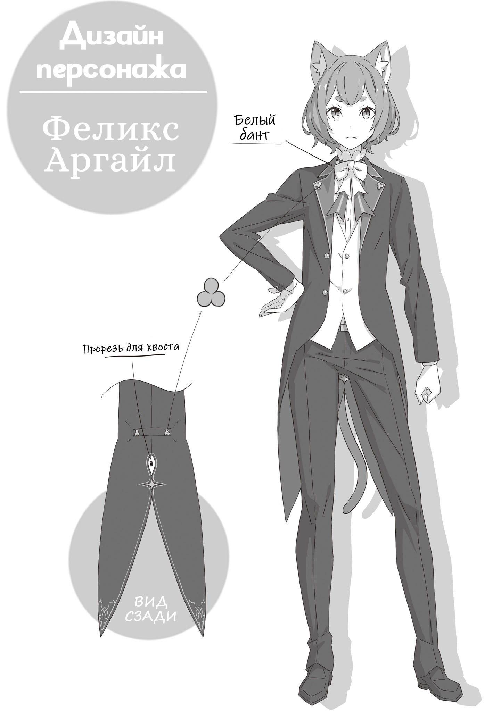
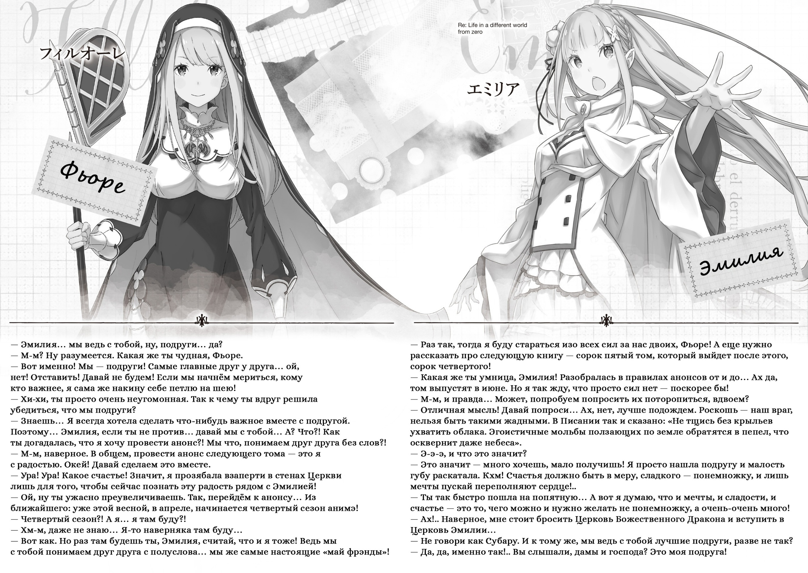
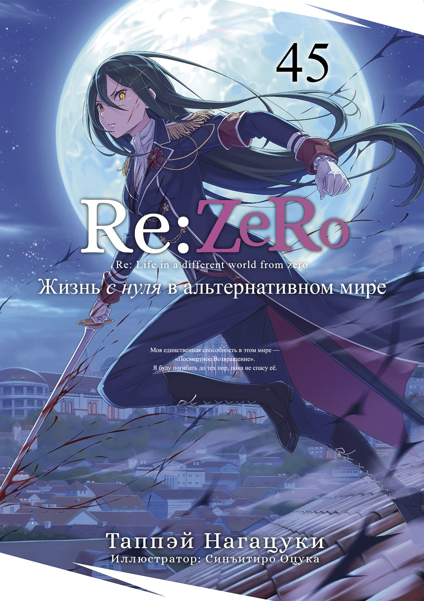
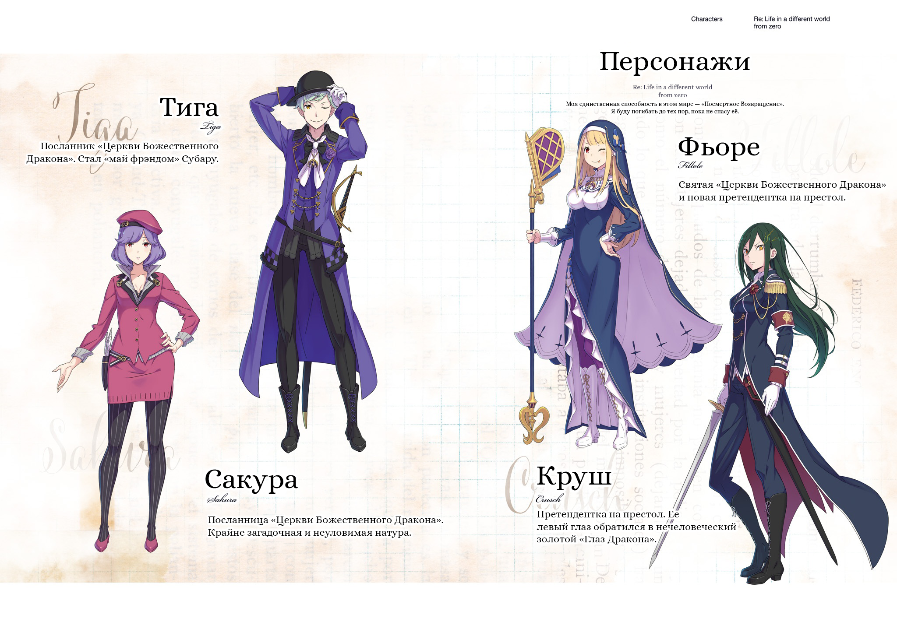
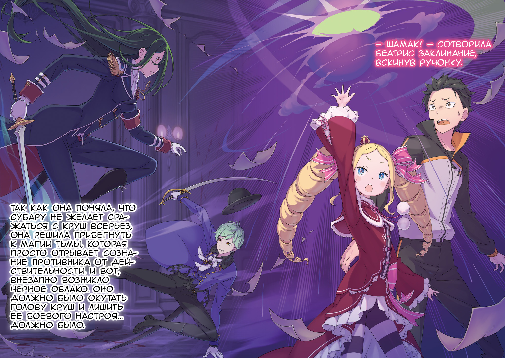
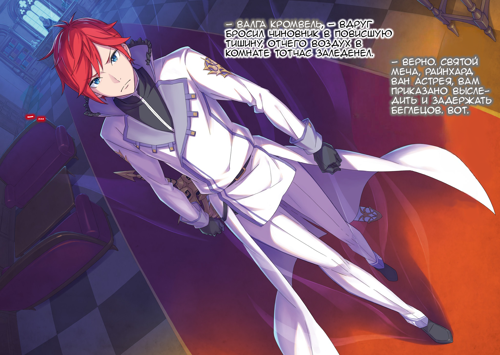

Итак, в прошлом томе подошла к концу девятая арка, и наша история разменяла второй десяток! Когда я только начинал писать Re:Zero, то твердо заявлял: «Всего будет десять арок!». Выходит, эта длинная история наконец-то добралась до финала … а вот и нет! Просто в ходе работы у меня появилось столько новых идей, что изначальные планы пришлось расширить! Так что после десятой арки Re:Zero ещё немного продолжится.

Но, несмотря ни на что, в каждую арку я вкладываю всю душу, чтобы читатели сказали: «Эта часть — самая интересная во всём Re:Zero!». И этот раз не исключение, я выложусь на полную! Долгое время у нас гремели масштабные сражения, а Королевские Выборы — казалось бы, стержень сюжета — постоянно отходили на второй план. Но в этой арке мы вплотную возьмемся за тайны и интриги, окутывающие Королевство Лугуника.

Королевские Выборы, драконья скрижаль, королевская семья Лугуники, Церковь Божественного Дракона, Святая, Святой Меча, Король-Лев.

Драконье Королевство Лугуника — то самое место, где началась история Re:Zero. Чтобы раскрыть его истинный лик, я доверху наполнил текст важнейшими зацепками, и теперь сюжет рванет вперед на полной скорости!

Лагерь Круш, который давненько не оказывался в центре внимания, и Фьоре со своими товарищами из Церкви Божественного Дракона, грозящие стать искрой нового конфликта … С нетерпением ждите ярких выступлений всех персонажей — как старых, так и новых!

А теперь, поскольку место на страницах неумолимо тает, позвольте перейти к традиционным благодарностям.

Мой редактор, господин Икэмото! Сюжет выходит на финишную прямую. Мы наконец-то приступаем к раскрытию тех самых задумок, о которых я рассказывал вам лет десять назад, и я приложу все усилия, чтобы реализовать их еще круче, чем собирался! Огромное вам спасибо!

Уважаемый иллюстратор Оцука! В этот раз, начиная с Ферриса на обложке и заканчивая множеством других рисунков, раскрывающих неожиданные стороны персонажей — это была настоящая услада для глаз! Особенно мне полюбилась Фьоре с ее неподражаемой мимикой. С нетерпением жду ваших новых работ! Искренне благодарю за вашу постоянную поддержку!

Господин Кусано, наш дизайнер! Вы вновь блестяще оформили иллюстрацию, пропитанную решимостью и трагизмом, у меня просто нет слов, чтобы выразить всю свою признательность. Надеюсь на вашу помощь и в десятой арке!

Мастера Атори и Аикава, создающие манга-адаптацию четвертой арки, и господин Такасэ Вакая, рисующий пятую арку, а также вся команда создателей анимэ! Вы не только открываете новые грани привлекательности мира Re:Zero, но и заряжаете меня боевым духом — я просто не имею права вам уступать! Спасибо вам огромное! Я не сдамся!

Редакция MF Bunko J, корректоры, представители книжных магазинов и сотрудники отдела продаж — я безмерно признателен вам за неизменную и всестороннюю помощь! Большое вам спасибо за все!

И, конечно же, самую огромную благодарность я выражаю вам, дорогие читатели! Тем, кто продолжает следить за Re:Zero, достигшим грандиозного рубежа десятой арки! Поверьте, без вашей поддержки я бы не смог продолжать эту историю. Пожалуйста, оставайтесь со мной и одалживайте мне свои силы до самого финала! А я отвечу вам со всей отдачей!

Что ж, увидимся в следующем, сорок пятом томе! Ждите новых потрясений!

Февраль 2026-го года. На старости лет начав подозревать, что я человек-дождь 4 .

