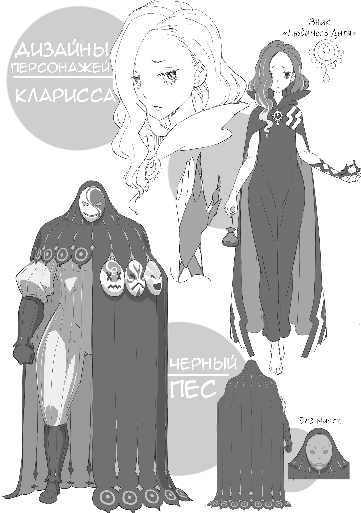
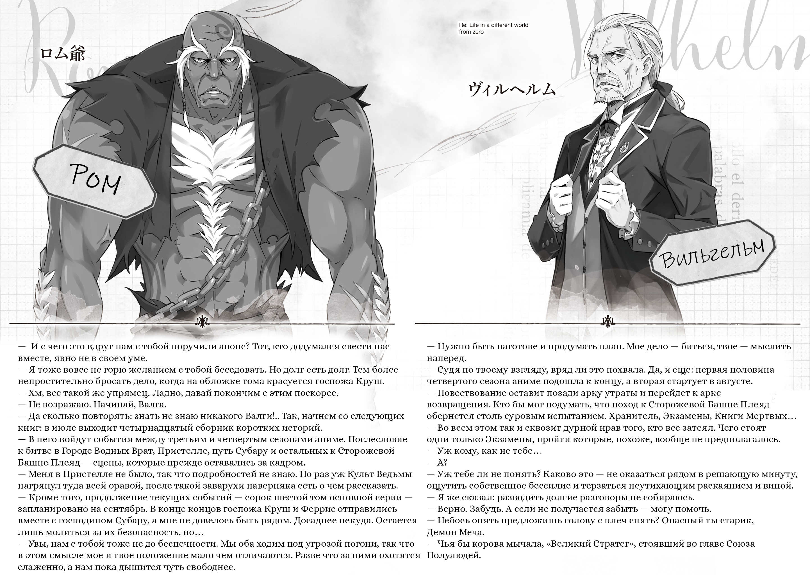

Спасибо, что дочитали сорок пятый том до самого конца! С вами Таппэй Нагацуки! Он же Серый Кот!

Как вам десятая арка, нравится? А уж автору-то … до чего же весело!

Из-за череды потрясений Королевские Выборы, пожалуй, успели подзабыться читателям. Но теперь они снова властно заявляют о себе! Мне хотелось столкнуть героев с подобающим размаху врагом и грандиозными препятствиями, поэтому во время работы я то и дело подстегивал себя: «Еще! Нужно еще больше!»

В лагере Эмилии прошлое и происхождение Субару почти не обсуждают, однако, как уже подозревали Шарфидна в шестой арке и Авель в седьмой и восьмой, от ощущения, что он здесь инородное тело, никуда не деться. И на этот раз враг безжалостно бьет именно в уязвимое место! Так начинается великое бегство … Зловещая тень нависает не только над Субару, но и над всем Лагерем Эмилии. Сумеют ли Субару и его спутники благополучно выбраться из этой передряги (в конечном счете)? Ждите с нетерпением!

Так или иначе, фокус истории сместился на королевскую столицу и Королевские Выборы, что позволило мне одного за другим выводить на сцену давних персонажей и пускать в ход отложенные до поры задумки. Сам автор просто в восторге! Для Re:Zero уже стало привычным делом менять состав действующих лиц от арки к арке, и нынешняя команда подобралась совершенно особенная — разве не любопытно, что из этого выйдет?

Впереди вас ждут ожесточенные битвы, накал страстей, новые тайны и разгадки — не пропустите!

Место на страницах, как водится, подходит к концу, так что перейдем к традиционным благодарностям!

Моему редактору, господину Икэмото: огромное спасибо за помощь в обсуждении запутанного сюжета десятой арки и столь плотного потока информации! Вы снова были со мной до самого победного конца, перед лицом жесточайших дедлайнов — я перед вами в неоплатном долгу!

Художнику Оцуке-сэнсэю: обложка с прекрасной и благородной Круш великолепна! Благодаря вашим иллюстрациям возвращение давно знакомых героев вдохновляло писать без устали. Впереди нас ждет еще немало персонажей, которых мне не терпится увидеть вашими глазами (включая Любимых Детей), так что рассчитываю на вас и дальше!

Дизайнеру Кусано-сэнсэю: премного благодарен за то, что вы мастерски оформили «лицо» этой книги — идеально передали и тревожную атмосферу, и пылкий накал десятой арки! Обложка получилась на загляденье.

Авторам манга-адаптации четвертой арки, Атори-сэнсэю и Айкаве-сэнсэю, а также Такасэ Вакае-сэнсэю, рисующему пятую арку: каждая ваша глава заряжает таким воодушевлением, что оригиналу просто нельзя отставать! С нетерпением жду продолжения манги и той особой выразительности, которая присуща только ей!

Всем сотрудникам редакции MF Bunko J, корректорам, отделу продаж и книжным магазинам — спасибо за огромный труд, благодаря которому книга увидела свет!

И, разумеется, моим дорогим читателям: спасибо за непрестанную поддержку! Ваши голоса и горячий отклик — главная сила, которая движет мной при работе над каждым новым томом!

До встречи в сорок шестом томе, где битва за Королевство развернется в полную мощь!

Май 2026 года

Приседая в преддверии лета за просмотром четвертого сезона аниме .

Заметки

Thank you (англ.) — спасибо.

You are welcome (англ.) — не за что; не стоит благодарности.

«Край Времен» — это таинственная локация игры «Chrono Trigger», находящаяся вне пространства и времени, где сходятся все эпохи.

В Японии «человеком-дожд е м» называют людей, чь е появление или важные события (поездки, мероприятия) вечно совпадают с дождем.
