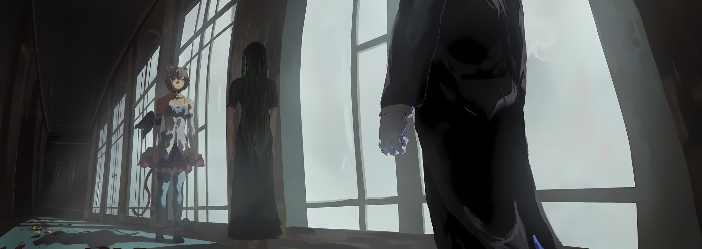
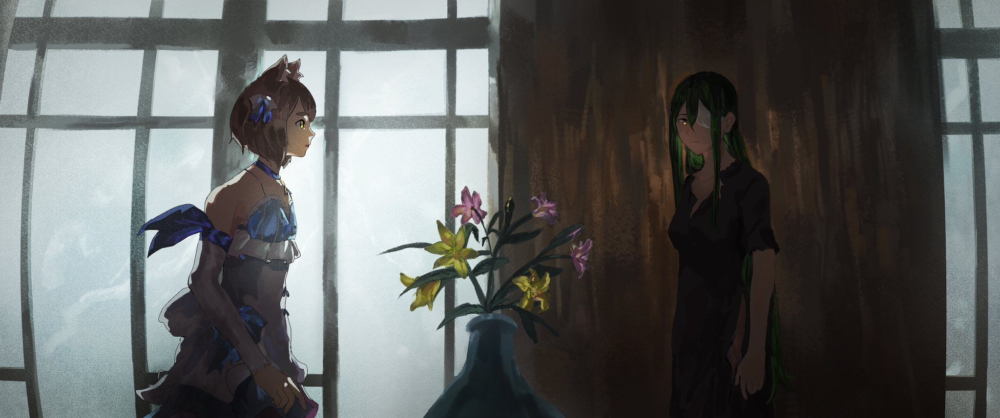
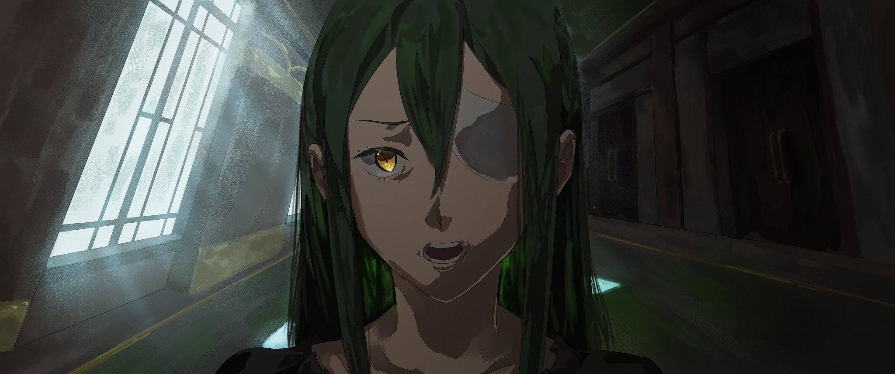

Стоило увидеть в саду нераспустившийся бутон, ноги остановились сами собой.

Здесь буйствовало и сливалось единым целым множество самых разных красок. Увы, я не разбираюсь ни в названиях, ни в видах, но доводилось слышать, что эти драгоценные растения, проросшие из семян, были собраны по всей стране. Сад был столь велик и величественен, что садовнику, которому доверили уход за ним, наверняка было где проявить свое мастерство. И нынешний облик сада служил тому лучшим доказательством.

Признаться честно, у меня не было как и особых ожиданий от этого цветочного многообразия, так и какого-то тонкого чутья на красоту цветов. Хотя не интересовалась я даже садами моего родного поместья. Пользуясь добротой понимающего отца, у меня вышло попасть сюда — в Королевский Замок Столицы Лугуника, но я не переоценивала себя настолько, чтобы считать, что могу участвовать в переговорах взрослых и ответственных людей. И потому решила отправиться в сад, где бы скоротала время, пока отец занят делами.

И тут, совершенно неожиданно для себя, я завороженно застыла перед этим цветком.

— …

Взгляд моих янтарных глаз был прикован к крупному, поникшему бутону. То, что меня привлек именно этот цветок с плотно сжатыми, едва покрасневшими лепестками, объяснялось, возможно, тем, что я увидела в нем саму себя — незрелую, запертую в коконе разочарования от собственной беспомощности … Впрочем, подобные мысли кажутся мне излишне поэтичными и самовлюбленными. Однако фактом остается то, что среди прочих цветов, которые уже распустились во всем своем великолепии и, казалось, полностью осознали свою притягательность, я почувствовала близость именно к этому, еще не раскрывшему свой истинный потенциал.

— На что же я способна и чего от меня ждут?

«Я … »

Я гордилась тем, что благословлена происхождением, семьей и талантом. Как человек, получивший этот статус и способности, я чувствовала некое подобие долга: я должна была оправдать их соответствующими достижениями. Но в то же время я осознавала, что эта гордость и чувство долга фатально несовместимы с моим истинным желанием.

— …

Можно сказать, что среди всех семян, посаженных в этом саду, я была единственным семечком, которое сомневалось в том, как ему цвести, и потому оставалось незрелым бутоном. Другие цветы без сомнений и колебаний принимали свою долю, понимали ее и исполняли свое предназначение. И все же я …

— Интересно, каким же цветком распустишься ты? — спросила я у бутона.

Последовавшая тишина, которая, собственно, и не могла ответить, заставила меня затаить дыхание. Окутанная сладким ароматом, я поняла, что не могу достичь взаимопонимания даже с тем, в ком видела родственную душу … ведь то, чего желало это дерзкое сердце, — не цвести прекрасным и ярким крупным цветком, а стать мощным и крепким деревом, что защитит эти цветы от ветра и дождя.

Да, мысль о том, что я лелею несбыточную мечту, заставила меня почувствовать себя жалкой и нелепой …

Внезапно послышался донельзя неуклюжий вскрик, и в колышущийся сад прямо что-то рухнуло сверху.

— !..

От неожиданности я округлила глаза и замерла на месте, словно ноги приросли к земле. В голове, на миг оцепенелой и пустой, с опозданием зазвучали тревожные колокола и уроки о том, как следует вести себя в подобных ситуациях. Но прежде чем я успела вытащить эти наставления из глубин памяти, человек, упавший в клумбу прямо передо мной почти на голову, вскочил.

Я увидела юношу, что был весь в грязи. У него были прекрасные золотистые волосы и подобные драгоценным камням алые глаза.

— Бфу! Бафа! Пха-пха! Ч-что это, земля? Это земля?! — восклицал он, выбираясь на карачках из цветочных зарослей.

Да, таково было …

— О-о, я как всегда великолепен … Думал, разобью голову о камни и все кончится, но даже из такой беды меня вытащила удача.

… мое самое первое воспоминание о последнем Короле-Льве.

С моих губ сорвался хриплый вздох, и сознание пробудилось. Органы чувств тоже начали просыпаться, а в мозг один за другим стали поступать потоки информации. В это мгновение самым сильным импульсом, охватившим все мое существо, стала непреодолимая, лютая жажда.

— …

Жажда — и это была не просто сухость в горле. Не хватало. Не хватало. Мало. Каждой частице моего тела не хватало воды. Я жаждала влаги, я умирала от истощения. Пересохли носоглотка и горло — пути для воздуха, высохли стенки желудка, жаждущего пищи, высохли глазные яблоки, когда я пыталась моргнуть, высохли сосуды, по которым должна была течь кровь, и жаждала сама душа, вопящая о нехватке жизни.

Жажда. Это была иссушающая жажда. Она разъедала само мое существование.

В желании хоть как-то утолить эту жажду, я попыталась кого-то позвать.

— Аэ … а … — но голос не повиновался. Во рту пересохло так сильно, что онемевший язык не мог издать ни звука.

Проще двигаться самой, чем звать … нет, даже эта мысль рассыпалась в прах. Как утопающий, который цепляется за спасателя и тянет его на дно, мой разум был девственно чист и иссушен нуждой.

Взывая к изможденному телу, от макушки до кончиков пальцев ног, я собрала остатки сил, чтобы просто подняться. Подняться. Встать. Идти. Пойти. Искать.

— Кх-х …

Отчаяние. Меня поглотило чистое отчаяние.

Охваченная жаждой, я наказывала себя: это твой последний шанс; остановишься, упадешь, допустишь хоть одну ошибку — и второго шанса не будет. Я не смогу искать, не смогу идти, не смогу встать, не смогу очнуться.

Я утону в этой бесконечной пустыне навсегда, навсегда, навсегда …

— …

Приложив все усилия немощного тела, я все же с трудом толкнула тяжелую дверь и выбралась наружу. Проклиная жажду собственного тела, которое едва не сдавалось под натиском малейшего дуновения ветра, я обвела взглядом все вокруг.

Зрение мутило, картинка была едва различимой, узкой. Я быстро поняла, что это потому, что один мой глаз закрыт. Но прежде чем я успела обеспокоиться этим, ветер донес до меня едва уловимый сладкий аромат.

Я повернула голову на запах и нашла ее — вазу, в которой стояли желтые и розовые цветы.

— !..

Времени на раздумья не было. Почти падая, я бросилась к вазе.

Грубо, словно сдирая кожу, я вырвала цветы, обхватила вазу обеими руками и опрокинула ее. И жадно, словно желая утопиться, я пила воду, приготовленную для цветов. Пила, пила и пила. Пролившаяся вода стекала по уголкам рта, по щекам, мочила шею и пропитывала черную ночную рубашку. Плевать.

Давясь и кашляя, я отшвырнула вазу, и звук разбитого фарфора эхом разнесся вокруг.

— Кхе-кхе! Кхе!..

Я грубо вытерла рот тыльной стороной ладони и обернулась. В коридоре через равные промежутки стояли другие вазы. Ногами, в которых появилось чуть больше сил, я подошла к следующей, выкинула цветы и осушила сосуд. Отшвырнула его. К следующей вазе.

Повторив это дважды, трижды, я заливала в иссушенное тело воду, возвращая себе свое «Я». Я уже тянулась к следующей вазе, как …

— Нельзя! — крикнул кто-то и схватил меня за запястье. Я обернулась.

Меня удерживал седовласый старый дворецкий, глядевший на меня широко раскрытыми глазами. Прежде чем память смогла вытащить его имя из-за пелены жажды, наружу выплеснулась густая, липкая ярость.

— Пусти!

Я замахнулась свободной левой рукой и изо всей силы ударила противника. И била не в шутку — удар был нацелен на то, чтобы дробить кости или рвать плоть, но старый дворецкий легко перехватил его свободной рукой, оставив обоих без единой царапины.

Я почувствовала огромную разницу в состоянии, навыках и опыте. Но я не могла остановиться.

— Отпусти меня! Отпусти!..

С каждым словом — удар, и с каждым движением руки возвращалась память о том, как нужно наносить удары, мои атаки становились острее … однако, какими бы быстрыми ни были мои выпады, старый дворецкий без труда блокировал их.

Постепенно зловещий холод жажды снова начал карабкаться по ногам вверх.

— Пожалуйста, отпусти! — кричала я. — В горле сухо … сухо … Жажда, жажда, жаждажаждажажда … я больше не могу-у!..

— Пожалуйста, успокойтесь. Сейчас принесут воду. К тому же, вам нельзя ходить босиком. И нужно обработать раны.

— Воду … правда? Вода … она есть?

— Да. Сию же минуту. Но прежде — раны.

Мое яростное сопротивление постепенно ослабело под напором слов дворецкого. Жажда никуда не делась, но она была уже чуть слабее, чем сразу после пробуждения. Если вода была близко — я была рада. Это было спасением. Благодарностью.

Когда силы начали покидать меня, я перевела взгляд на пол.

— Раны …

На ковре в коридоре, у ног дворецкого и моих собственных, виднелись отчетливые алые пятна. Они тянулись по коридору и заканчивались у моих ступней. Это была кровь. Я и не заметила, как наступила на осколки разбитых ваз, залив коридор собственной кровью.

Я топтала не только осколки, но и те цветы, что вышвырнула из ваз. Растоптанные лепестки смешались с пролитой кровью, образуя отвратительный, грязный узор. Грязный пятнистый узор … в сознании промелькнула картина чудовищного черного узора на коже.

— А-А-А-А-А-А-А-А!!! — вырвался из горла надрывный вопль, и я забилась в конвульсиях.

Дворецкий, видимо, ослабил хватку, решив, что я успокоилась. Я воспользовалась этим и замахала руками, чтобы разорвать мокрую ночную рубашку и рассмотреть свое тело.

Бинты, бледная, исхудавшая кожа, потерявшая всякие краски … В тех местах, что скрывались за бинтами, все мое тело должно было быть покрыто мерзким черным узором, отравляющим и проклинающим плоть. Собственное тело казалось мне чем-то непоправимо оскверненным.

— Нет! Феррис! Феррис! Ты где?! Где ты?! — крик сам вырвался наружу.

Я сорвала бинты, все еще боясь заглянуть под них. Но я не хотела больше ни секунды носить на себе этот уродливый черный рисунок.

Я не хотела его видеть, касаться, признавать. Не хотела быть грязной. Уж лучше … лучше умер …

Меня … мое мерзкое, уродливое тело обняли со спины чьи-то тонкие руки.

— Госпожа Круш!

И это был не захват — тот, кто меня удерживал, не использовал боевые приемы. Он просто порывисто, изо всех сил прижал меня к себе, обняв сзади.

Если бы я захотела, я бы вырвалась. Но у меня не возникло даже тени подобного желания. Просто отдалась этому бледно-синему свету, что мягко окутал мое тело.

— Все хорошо, я здесь. Я рядом с вами, госпожа Круш, я никуда не уйду …

— Ферри … с …

— Да, да. Это я. Это Феррис, — руки, обнимавшие меня, сжались чуть крепче, но я не почувствовала ни боли, ни страха.

Не успела я опомниться, как мои ноги подогнулись, и я осела прямо на пол. Разумеется, тот, кто обнимал меня — Феррис — опустился в коридор вместе со мной. Я чуть повернула голову и увидела его лицо совсем рядом, чувствовала его дыхание. Его круглые глаза дрожали от слез, он изо всех сил старался сохранить лицо. Это было так трогательно и мило.

И чувство неприятия ко всему окружающему, кипевшее во мне, начало отступать.

— Но мне … все еще страшно. Черные пятна … они и сейчас …

— Госпожа Круш, об этом … все уже … — хотел было что-то сказать дворецкий.

— Старик Вил, — прервал его Феррис.

Под его взглядом Вильгельм … да, точно, Вильгельм. Это был Вильгельм. Старый дворецкий — Вильгельм, Демон Меча, выдающийся воин, человек, на которого можно положиться.

Я сидела, зажатая между ним, что стоял передо мной, и Феррисом, что прижимался сзади.

— Я …

— Пожалуйста, послушайте меня, госпожа Круш. Насчет пятен можно не волноваться … Прошу простить мою дерзость, — Феррис начал медленно разматывать бинты с моего дрожащего тела, что до сих пор сотрясалось от рывков, а взгляд блуждал.

— А …

Затаив дыхание, я наблюдала за его нежными, но внушающими ужас движениями, не в силах шевельнуться. Через прорехи в ночной сорочке, которую я сама разорвала на груди и шее, показалась кожа … и я ахнула, не увидев там того ужаса, которого так боялась.

— Что?..

— Не только здесь, — он освободил от повязки мое плечо, и я в оцепенении подняла руку, — но на руках, плечах, ногах … скверны больше нет.

Моя рука выглядела сухой и истощенной, но на ней не было и следа того черного пятнистого узора. Только сейчас я поняла: та сжигающая боль, то ощущение, будто в каждую вену заливают кипяток, мучившее меня все это время, исчезло.

Жажда осталась. Ее отголоски ощущались до сих пор. Но это была жажда исцеленного организма, требующего жизни после того, как боль ушла.

В душе сразу появилась надежда, и я сразу спросила:

— Феррис … это ты сделал? Убрал это из меня …

— …

Видя мои страдания каждое утро, каждый вечер, каждый день, Феррис самоотверженно оставался рядом со мной и прилагал все силы, чтобы исцелить меня. И теперь его желание исполнилось, он вызволил меня из этой темницы страданий …

— Нет … вы ошибаетесь. Я … ничего не смог сделать, — но, покачав головой, он сам опроверг мои ожидания.

Его янтарные глаза наполнились разочарованием — глубоким разочарованием в самом себе. Касаясь моей руки, где исчез узор, он несколько раз вздрогнул губами, не решаясь что-то сказать. Он колебался, набирался смелости и снова отступал, пока, наконец, решившись, не произнес вслух:

— Чтобы исцелить вас, мы обратились за помощью к Церкви Божественного Дракона.

— Что?..

— Девушка, что назвалась Святой из Церкви, помогла нам своей силой. Я сам не смог спасти вас, госпожа Круш. Мне … — в его дрожащих глазах проступили слезы, — мне правда очень жаль.

От этого вида слова застряли в горле.

Смысл того, что он сказал, медленно доходил до меня, постепенно освобождавшейся от боли и удушающей жажды.

«Церковь Божественного Дракона» — организация, глубоко почитающая Божественного Дракона, исконного хранителя Королевства Лугуника, и верящая в его благодать. Они направляют свои усилия на поддержание спокойствия и мира среди граждан.

И хотя я могла бы согласиться, что принципы Церкви — не вмешиваться в политику страны во избежание излишнего влияния — заслуживают уважения, мы никогда не могли быть в добрых отношениях. Ведь то существо, которое для них превыше всего, и наш путь — фундаментально разные.

— Дракону …

Церковь Божественного Дракона свято блюдет пакт между Королевством и Божественным Драконом и возносит ему благодарности. Но для них поддержание этого пакта — высший приоритет процветания, такой же, как позиция правительства, которое считало погибших от безжалостной болезни членов Королевской Семьи лишь «винтиками» в механизме соглашения. Те же ценности, что превратили смерть Фурье Лугуники в просто «статистическое событие».

— !..

Внезапный прилив бесформенных эмоций ударил в грудь, к горлу подступила тошнота. Мысли, образы, чувства — все это вместе ударило по моим чувствам. Свет стал слышен, запах — виден, боль обрела вкус, голос — осязание, а вкус — запах. Вещи, которые не должны пересекаться, набросились на меня единым скопом.

Почему в моей голове возникло это имя? Почему я вспомнила его улыбку? Почему я слышу его голос? Почему я чувствую его лицо в своих воспоминаниях? Почему я помню вкус крови и слез, которыми оплакивала его смерть? Почему … почему Круш Карстен смогла вспомнить Фурье Лугунику?!

— А …

Ко мне возвращались чувства: возвратились ощущение утраты и долга, нежности и печали, ярости и радости, тепла и холода. Добрые воспоминания и горькие думы о том человеке, который ушел навсегда, смешивались и сплавлялись воедино.

Но была одна вещь, которую я понимала фатально четко.

— Королевские Выборы … — сорвалось с моих дрожащих губ, отчего Феррис вздрогнул, а Вильгельм, лица которого я не видела, напрягся.

Мы несовместимы с Церковью Божественного Дракона. Никак. Мы не можем идти в ногу, мы не можем смотреть на одно и то же. Мы сами выбрали этот путь, решили так и провозгласили это перед всеми. И если, несмотря на это, меня спасла сила того, чью помощь мы никогда не должны были принимать …

— Феррис …

— Да, — в его голосе уже не было дрожи. Он кратко кивнул и посмотрел мне прямо в глаза — его лицо было напряжено, но он не отводил взгляда. Эти желтые глаза говорили, что он примет любые мои слова, потому что сделал этот выбор осознанно.

— …

Я должна ему сказать. Я понимаю причину. Понимаю, почему ему пришлось сделать такой выбор. Я знаю, что он сделал это исключительно ради того, чтобы спасти меня. Я знаю, сколько ночей он мучился, находясь рядом со мной, когда меня день за днем пожирала скверна. Я своими глазами видела, как он страдал от собственного бессилия, не имея возможности исцелить то, что хотел исцелить больше всего. Я видела это ближе всех.

Поэтому я должна сказать ему: «Прости, что из-за меня тебе пришлось тяжко. Я понимаю твои чувства».

— …

Поэтому я должна сказать ему: «Я вынудила тебя принять это тяжелое решение. Но за это ответственна только я».

— …

Поэтому я должна сказать ему: «Не надо грустить. Благодаря тебе я все еще здесь».

— …

Скажи ему. Скажи. Скажи. Скажи. Скажи. Скажи. Скажи. Скажи. Скажи. СКАЖИ. СКАЖИ. СКАЖИ!..

— Почему? — сорвалось с моих губ. Само собой, будто я споткнулась на полпути.

Это было совсем не то, что я хотела сказать. В сказанном мною не было ни тепла, ни сочувствия.

— Ты ведь … ты ведь должен был понимать.

Прекрати. Замолчи немедленно. Заткни рот, закрой глаза, сотри свое сознание. Не смотри, забудь о случившемся, забудь о сделанном выборе.

— Феррис, ведь ты один … ты один должен был быть на моей стороне.

Этого нельзя говорить. Нельзя давать ему это услышать. Он не должен этого знать. Ведь он хотел спасти. Он молился. Он всего лишь хотел избавить любимого человека от страданий.

Поэтому нельзя. Нельзя произносить это …

— Почему?..

НЕ СМЕЙ.

— Почему ты не сдержал обещание, которое дал Фурье?

Если бы для исцеления пришлось его предать — я бы предпочла умереть.

