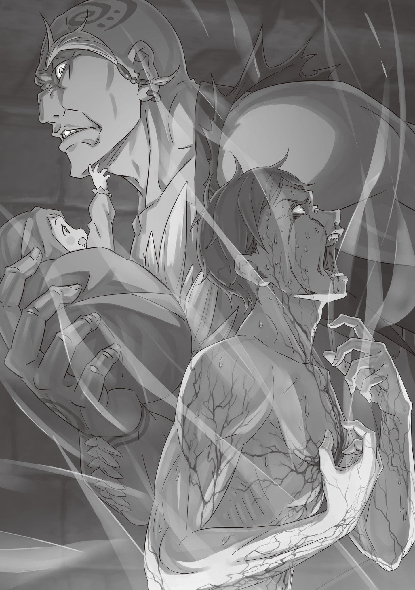

В ту ночь судьбы многих были безвозвратно сломаны.

— А-А-А-А-А-А-А! — вырвался наружу вопль во мраке глухой ночи. Этот рык никак нельзя было подавить, и, казалось, он проклинал все сущее.

Мужчина бился в конвульсиях, изо рта шла пена, по щекам градом катились кровавые слезы, плоть рвалась, кости трещали и крошились, вены выжигало пламенем — саму душу безжалостно, наживую рвали на куски.

Согрешил. Он непростительно согрешил.

Ну и пусть! Я признаю это и раскаиваюсь всем сердцем. Только, прошу, пусть расплата будет столь же доброй, сколь ужасен мой грех! Пусть будет в этом хоть какой-то смысл!

— А-А-А-А-А-А-А!

Пусто. В руках ничего не было. Сквозь его пальцы утекло то, до чего ему уже вовек не дотянуться. Просто исчезло … нет, правда была страшнее. И смириться с ней никак не выйдет. Ведь оно здесь, внутри него — жалкого и нелепого. Оно совершенно точно здесь.

— …

За ним, бьющимся в агонии, рыдающим, скрежещущим зубами, наблюдало маленькое «нечто» … Вздор! Это точно морок! Сама вина явилась ему образом ребенка.

Он ведь уложил его спать. Пообещал, что страшный кошмар уже кончился. Сказал, что утро будет ярким, полным надежд. Он гладил его по красным волосам, пока сон не взял свое … А значит, никто за ним не наблюдает … но кошмар не думал кончаться. Его обещание, что утро будет светлым, так и останется просто словами.

Уж лучше умереть … но даже на подобную милость надеяться было верхом наглости. Кошмар не кончился, надежды не оправдались, обещание не сдержано.

Он не мог посметь сдаться. Ради любимой семьи. Ради их будущего.

— А-А-А-А-А-А-А!

Он сжимал зубы так, что они едва не крошились, но терпел муки, терпел боль. Казалось, этой агонии не будет конца, так что оставалось одно — терпеть, терпеть, терпеть во что бы то ни стало.

— …

А маленькое «нечто», что молча смотрело на него, — лишь явившаяся ему совесть.

— Ха-а … ха-а … ха-а …

Огромные босые ступни шлепали по сырой земле. Гигант то и дело настороженно оглядывался через плечо.

Погони не было. Да и взяться ей было неоткуда. Ведь именно тот, кто раздавал приказы подобным пешкам, и дергал за все ниточки из-за кулис этой ночи. Но даже под страхом смерти он не рискнул бы назвать это поводом для спокойствия.

— Будь оно все проклято!.. — лицо скривило, голос дрожал досадой. Он свирепо вглядывался в полумрак.

Здесь, в подземелье, было темно, хоть глаз выколи. Об этом проходе не знал почти никто, а потому здесь не ходили патрули. Тайный коридор: прознай о нем кто чужой — и ничем хорошим это бы не кончилось. А кем теперь являлся он сам — тот, кто крался по этому коридору, будучи самым что ни на есть чужаком?

— Блядь, — он скрипнул зубами, едва подавил порыв вмазать со всей дури огромным кулаком по стене. И не потому, что боялся шуметь. А потому, что держал в руках кое-что лишнее.

Эта обуза злила все сильнее, разжигала внутри глухую ненависть …

— А-гу …

Гигант невольно поймал на себе взгляд той, кого держал на руках, и сдавленно хмыкнул.

Алые глаза. Невыносимые, мерзкие, самые ненавистные ему на всем белом свете. Даже в этом мраке они без проблем нашли его лицо — он отчетливо видел, как сузились их зрачки.

Так и подмывало заорать во всю глотку. Выдать все — и этот потайной коридор, и самого себя, безропотно и покорно бредущего туда, куда ему велели. Пусть бы все разом полетело к чертям!

Это убийственное, истязающее, отчаянное желание …

— У-у …

… развеялось без следа, стоило крохотным ручонкам потянуться вверх и неуклюже шлепнуть по его лицу, а губам — расплыться в беззубой улыбке. И отчаяние, и самоистязание, и тяга к разрушению — все это вдруг показалось сущим пустяком, каким-то нелепым вздором.

— До чего же вы бесите, мерзкие людишки.

Знали эти красные глаза о его чувствах или нет, но они до сих пор так ни разу и не ошибались.

Он мог в любой момент все бросить — оставить ношу, сдаться, разом со всем покончить. Но он ничего из этого не сделал, и вот его ноги уже ступали к выходу из коридора. Там, наверху, за пределами подземелья, его ждала бескрайняя ночь, а вместе с ней и возможность отказаться от заключенной клятвы, разорвать пугающе туманное будущее.

— Если уж будете жалеть, так жалейте по-крупному.

И все же этот последний шанс он твердо отверг — во имя собственных замшелых убеждений и жалких остатков гордости.

— Не смейте думать, будто вам удалось сковать меня клятвой. Вы у меня еще попляшете. Только погодите … я вырежу весь ваш людской род под корень, а трупы скину в Великий Водопад.

Гигант затаил в груди застарелую, бурлящую ненависть и зашагал прочь, пока упрямо твердил себе, что невинный взгляд существа, которое он держит на руках — это вовсе не причина останавливаться …

Такова была ночь, в которой судьбы многих были безвозвратно сломаны.

