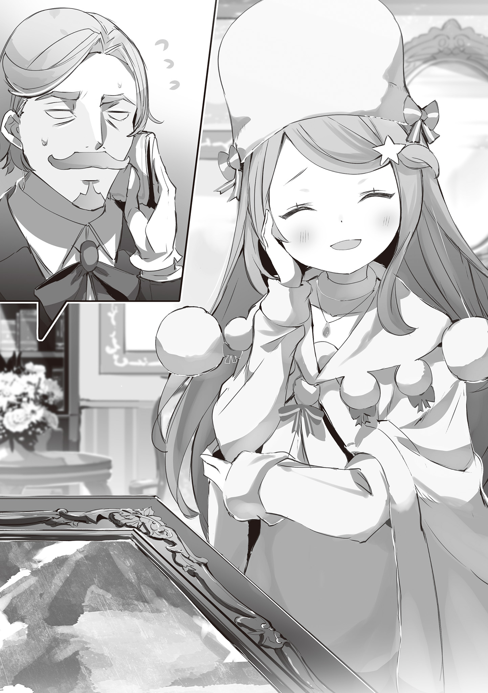
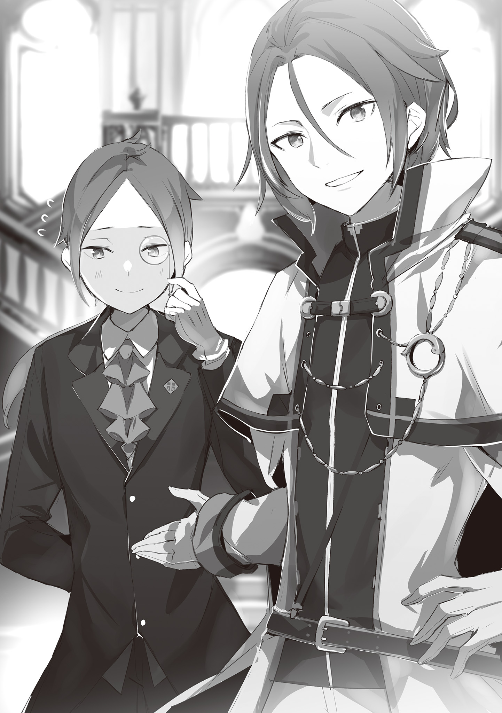
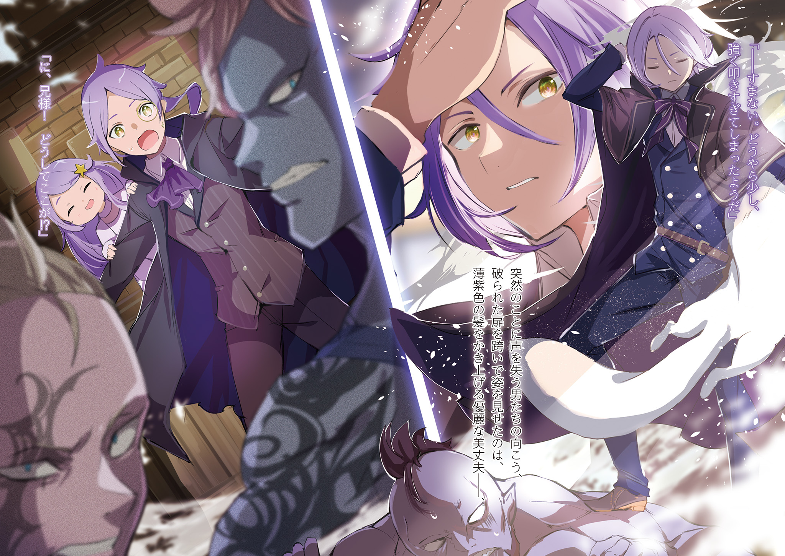
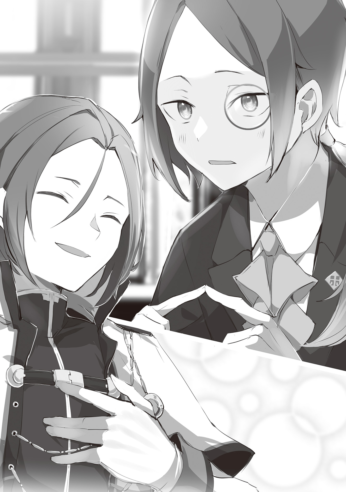

Стол с грохотом накренился, но когда мысль «дело плохо» мелькнула в голове, было уже слишком поздно.

Соскальзывающий бокал разбился об пол, отозвавшись звонким эхом. Алкоголь заливал пол под ногами, однако подбирать осколки или отдёрнуть промокший носок ботинка было страшно.

Всё потому, что…

— …Какого чёрта, а?! Вы чего удумали, вваливаясь на нашу территорию, а?!

— Крутые, да? Не думайте, что уйдёте отсюда просто так!

— Слышь, козёл! Чё, э?! Пришибу, гад!

Грубые голоса разбойников, свирепо окруживших их, давили на уши.

Под гнётом их неистовой ярости и подавляющей ауры кровь отхлынула от лица. Задыхаясь, взгляд метался по сторонам в поисках хоть какого-нибудь способа спастись.

Однако поле зрения не предлагало ни плана спасения, ни даже щели, через которую могла бы проскользнуть мышь. Дышать становилось всё труднее, а сердце билось всё быстрее и быстрее…

— …Успокойся. Не переживай, предоставь всё мне.

Напряжённое, затуманенное страхом зрение вдруг прояснилось от этого мягкого голоса и ощущения лёгкого похлопывания по плечу.

Оглянувшись, можно было увидеть, как миниатюрная девушка сделала шаг вперёд, выйдя из-за спины застывшего спутника. Эта особа, ростом на полголовы ниже его самого, тем не менее, ни капли не испугалась угрожающих мужчин.

Более того, на её губах расцвела улыбка, и она, сложив ладони перед грудью, произнесла:

— Ну же, давайте не будем так шуметь и спокойно поговорим? Сделайте мне одолжение.

Услышав такую элегантную просьбу от девушки, мужчины, до которых не доходили никакие уговоры, переглянулись. Оставалось лишь надеяться, что они не поддадутся гневу прямо сейчас, иначе за спиной этой девушки живым не остаться.

Почему всё обернулось именно так? В голову лезли запоздалые и бессмысленные сожаления.

Это логово головорезов, а не место для таких слабаков, как они. Так Йешуа Юклиус проклинал свою судьбу всеми возможными словами.

…Всё началось за несколько дней до того, как Йешуа начал проклинать свою судьбу.

Богатое и яркое сочетание красок, изысканные и мастерские мазки.

Слияние этой незаурядной техники и тонкого чувства порождает порой столь сильные переживания, что они способны изменить жизнь зрителя.

…Люди называют это «Искусством», а тех, кто выражает свой внутренний мир таким образом — «Художниками».

Искусство — это чудо, рождённое горсткой творцов, и обычные люди могут увидеть мир глазами художников лишь через эти воплощённые чудеса.

Прекрасные вещи обретают цену, а ценные вещи почитаются множеством людей.

Такова отправная точка долгой и глубокой связи человечества с искусством… И в то же время — начало неразрывных отношений между чудом и алчностью, неизбежно преследующей всё, что имеет цену.

— …Никуда не годится, господин Ольсен. Это подделка. Примите мои соболезнования.

Выпрямившись, девушка обернулась и с очаровательной улыбкой вынесла вердикт.

Длинные светло-сиреневые волосы, спадающие мягкими волнами, большие круглые глаза цвета бледного лука, белоснежное одеяние, напоминающее зимний пейзаж… Красивая женщина, чья миловидность была украшена неподдельным интеллектом.

День выдался тёплым, и белая лисья горжетка на её шее могла показаться излишеством, но, глядя на её несколько возвышенный, отстранённый вид, нельзя было сказать, что ей жарко.

Анастасия Хосин. Таково было имя этой прекрасной и умной белоснежной леди, одной из пяти, на кого была возложена важнейшая миссия в Королевстве Лугуника.

Позади Анастасии стояла картина, которую она только что внимательно изучала.

Прекрасная девушка, подперевшая щеку рукой и дремлющая, изображённая тончайшими мазками — это был шедевр столетней давности, известный как «Дрёма Мидерины».

Однако ни красавица на полотне, ни рама, призванная её украшать, не соответствовали своей истинной стоимости.

— Я был готов к этому, но… прослыть собирателем подделок — позор для коллекционера.

Барон Нико Ольсен в отчаянии опустил плечи.

На его лице застыла слабая кривая улыбка — бравада перед гостями. Будь он здесь один, никого бы не удивило, если бы он сейчас рухнул на колени.

Ведь его любимый шедевр — картина, о которой даже ходили слухи как о «главной любви» коллекционера Ольсена — была признана подделкой.

— Я понимаю ваши чувства, господин Ольсен. Для такого прославленного коллекционера, как вы, этот факт сродни внезапной потере любимой, — произнёс Юлиус.

— …Благодарю за сочувствие. Ха-ха, как же это жалко выглядит.

Подавленный Ольсен слабо ответил на слова утешения.

За страданиями барона с болью наблюдал рыцарь, стоявший рядом с Анастасией и следивший за процессом оценки — Юлиус Юклиус.

Рыцарь Королевской гвардии Лугуники, ныне служащий Первым Рыцарем Анастасии, одной из кандидаток на трон в ходе Королевских выборов, он сопровождал её и здесь.

С тех пор как в королевском замке было объявлено о начале выборов, прошло полгода. Пока другие кандидаты проявляли себя по-разному, Анастасия также продолжала деятельность, призванную продемонстрировать её королевские качества. Приглашение от Ольсена, известного в столице коллекционера произведений искусства, было частью этой кампании.

И всё же…

— Было бы лучше, если бы мы могли сообщить господину Ольсену добрые вести…

— Хм, в чём дело? Неужто вы недовольны моей оценкой? Конечно, я могла бы солгать, чтобы порадовать вас, господин Ольсен, но моя гордость этого не позволит.

— Нет, я не это имел в виду. Я лишь досадую на неудачное стечение обстоятельств. Если бы это было возможно, я бы хотел развеять печаль господина Ольсена.

— Всё равно чувствую себя так, будто меня выставляют злодейкой. Впрочем, когда занимаешься оценкой, к такому привыкаешь, — проговорила Анастасия с несколько обиженным выражением лица и направилась к гостевому дивану.

Юлиус, горько улыбнувшись её поведению, последовал за ней и тихо встал позади дивана, на который она присела.

Затем Анастасия пристально посмотрела на Ольсена, к чьим плечам всё ещё не вернулась сила:

— И всё же, господин Ольсен, у вас наверняка полно своих оценщиков, верно? То, что вы специально обратились ко мне с этой просьбой… можно ли считать это проверкой?

— Госпожа Анастасия, полагаю, это слишком прямолинейное высказывание…

— Нет, ничего страшного, господин Юлиус. Признаться, я немного опешил, но вы можете понимать это именно так.

Ольсен жестом остановил Юлиуса, попытавшегося укорить свою госпожу, и пристально посмотрел на Анастасию. Юлиус с лёгким напряжением наблюдал за тем, как их взгляды скрестились.

Барон Нико Ольсен, хоть и не обладал высоким титулом, был широко известен в кругах коллекционеров, горячо любящих искусство. Немало знатных аристократов глубоко разбираются в прекрасном, и Ольсен, чьё имя имело вес в этом мире, мог считаться незаметной, но важной фигурой в королевстве.

Для кандидата на трон, стремящегося заручиться поддержкой как можно большего числа влиятельных людей, он был бы желанным союзником.

Именно поэтому, когда он сам обратился к Анастасии, это казалось попутным ветром, но результат первой же экспертизы — подделка шедевра — сбил этот порыв в самом начале.

— Правда? А я-то думаю, что самое интересное только начинается.

— Самое интересное, говорите?

— Ага. Вообще, само по себе то, что вы попросили оценить картину, уже странно, верно? Просить экспертизу для картины, которую давно берегли — это доказательство того, что у вас с самого начала были дурные предчувствия. Разве не так?

Анастасия приложила палец к губам, и морщины горькой усмешки на лице Ольсена стали глубже.

Вот оно что. Анастасия утверждает, что Ольсен с самого начала подозревал подделку, когда заказывал экспертизу. Вопрос в том, почему у него возникли такие подозрения в отношении картины, которую он хранил долгие годы…

— Господин Ольсен, где вы приобрели эту картину?

— Сомневаться в продавце естественно, но с посредником я знаком давно. Я не сомневаюсь, что он продал её, не зная, что это подделка.

— Вы не смогли отличить подлинность картины, но уверены, что можете отличить добро от зла в людях?

— Сурово. Но именно потому, что у вас такие ценности, с вами можно говорить начистоту.

Проглотив довольно ядовитое замечание Анастасии, Ольсен сунул руку за пазуху и положил на стол лист бумаги.

— На днях в мой дом доставили это письмо. Имени отправителя нет, внутри лишь одна строчка: «Ваша картина „Дрёма Мидерины“ — подделка».

— …Позвольте взглянуть.

Юлиус взял письмо со стола и пробежал глазами по тексту.

Там действительно было написано лишь краткое обвинение, как и сказал Ольсен.

— И это всё? Прошу прощения, но разве подобные злые шутки — редкость?

— Да, вы правы. О том, что я владею «Дрёмой Мидерины», известно, так что я мог бы забыть об этом как о чьей-то гадкой выходке. Но…

— Гордость коллекционера не позволила господину Ольсену так поступить?

— …Верно.

Ольсен опустил голову и снова бросил взгляд на висящую «Дрёму Мидерины».

— Я слышал, что госпожа Анастасия тоже собирает предметы искусства. И что ваш глаз — один из самых зорких во всём Карараги. Поэтому я и попросил вас провести экспертизу на подлинность.

— Приятно слышать о таких ожиданиях, но ведь была вероятность, что я из вежливости солгу и выдам фальшивый результат, а?

— Разумеется, позже я бы поручил проверку своему знакомому оценщику. И если бы выяснилось, что госпожа Анастасия покривила душой…

— То моя глупость всплыла бы наружу, и на этом отношениям с господином Ольсеном пришёл бы конец. Надо же, господин Ольсен тоже не промах — если упадёт, то просто так не встанет. Люблю таких хитрых людей.

На очередную прямоту Анастасии Юлиус даже не стал реагировать. Он понял, что такое поведение было желанным для Ольсена, и именно поэтому она так себя вела.

Начав с подозрительного анонимного письма, он сам создал возможность для встречи с Анастасией, которая рано или поздно вышла бы на него, и использовал результаты оценки как ориентир для будущего своего дома.

Расчётливая натура Ольсена действительно перекликалась с образом действий Анастасии.

В доказательство этого Ольсен, скрывая свои истинные намерения за вежливой улыбкой, произнёс:

— Торговая компания госпожи Анастасии часто имеет дело с произведениями искусства. Существование столь искусной подделки должно вызывать беспокойство и у вас, не так ли?

— Не нужно меня так провоцировать, я поняла, чего вы хотите. Дадите мне немного времени?

— Да, разумеется. Чтобы получить желаемое, нужно время.

Хотя прямо это сказано не было, Анастасия и Ольсен пришли к соглашению.

В этом случае трудно решить, кого хвалить: молодую, но уверенную в себе Анастасию, или барона Ольсена, который ни на шаг не отступил перед кандидатом на трон.

— А, кстати.

Когда разговор уже подходил к концу, Анастасия поднялась с дивана и, поглаживая свою лисью горжетку, вдруг обернулась к Ольсену.

Затем она улыбнулась невероятно чарующе и спросила:

— Если я найду настоящий оригинал «Дрёмы Мидерины», вы его купите?

Бросив этот милый и одновременно ехидный вопрос, она покинула комнату.

— Простите за невежество, но как именно определяют подлинность картин?

— Ну-у, как бы сказать. В большинстве случаев смотрят на подпись, оставленную художником, или на краски, использованные в картине. Это очевидно, но подделки рисуются в более позднюю эпоху, чем оригиналы, поэтому фальсификаторы часто по неосторожности используют новые пигменты.

— Понятно, вот как это делается.

Юлиус был восхищён познаниями Анастасии, раскрывшей ему детали незнакомого мира.

Этот разговор происходил в драконьей повозке по пути домой из особняка барона Ольсена. Юлиус захотел получить объяснения касательно недавней оценки картины.

К сожалению, у Юлиуса не было глаза, способного отличить подлинник от фальшивки, но, выслушав объяснения Анастасии, он согласился с методом поиска различий.

Разумеется, в доме Юклиусов тоже были картины и предметы искусства, но…

— В вопросах оценки я полностью полагаюсь на своего брата Йешуа.

— Йешуа с таким удовольствием разглядывает и картины, и вазы. В отличие от меня, такой меркантильной, для него искусство действительно имеет значение, наверняка.

— Меркантильной, говорите? Но ведь и госпожа Анастасия…

— Вовсе нет, мне искусство совершенно не интересно. Те предметы искусства, что у меня есть — это подарки для тех, кто их хочет. Я развила свой глазомер только потому, что я торговец, вот и всё.

Анастасия легкомысленно махнула рукой, назвав себя, как владельца искусства, нечистой в помыслах.

Действительно, её подход отличался от того, что Юлиус представлял себе под словом «коллекционер». Однако её прагматичный взгляд, лишённый нарочитого самоуничижения, был вполне в её стиле.

— Госпожа Анастасия, вы придерживаетесь ценностей, утверждающих желания других людей.

— Немного не так. Я одобряю не столько чужие желания, сколько свои собственные. Если быть честным с тем, чего хочешь, жить становится проще, и счастье найти легче. Это просто мой взгляд на мир.

Анастасия утверждает чужую жадность.

Это был её «Королевский Путь» как Анастасии Хосин, заявленный ещё в тронном зале при объявлении начала выборов, её собственная философия.

— Предложение барона Ольсена — это лакмусовая бумажка, чтобы решить, кого поддержать на выборах. Вы так считаете, госпожа Анастасия?

— У нас с господином Ольсеном разные взгляды на искусство. Но по-человечески естественно хотеть поддержать того, кто к тебе хорошо относится, так что хотелось бы на это надеяться. К тому же…

— К тому же?

— Такую качественную подделку не часто встретишь. Нужно обязательно выяснить, кто и с какой целью её нарисовал.

Анастасия сложила пальцы обеих рук перед грудью. Заметив огонёк любопытства в её глазах цвета бледного лука и услышав слегка возбуждённый голос, Юлиус нахмурился.

Судя по её виду, это было нечто большее, чем просто ожидание важного момента в королевских выборах…

— Неужели у вас есть мысли использовать подделки в торговле?

— Что вы, что вы! О, смотрите-смотрите, мы уже почти приехали, верно? У нас ведь важный груз, нужно готовиться к выгрузке. Давайте-давайте.

Прищурившись, Юлиус попытался призвать её к ответу, но Анастасия ушла от разговора, глядя в окно.

Проследив за её пальцем, Юлиус увидел приближающийся знакомый особняк, тихо вздохнул и начал готовиться к выгрузке.

И вот…

— Э-это подделка?! Сама «Дрёма Мидерины»?! — воскликнул Йешуа Юклиус, в изумлении глядя на выгруженную из повозки картину.

Брат, чертами лица очень похожий на Юлиуса, но с гораздо более мягким взглядом, выдающим спокойный характер, был настолько потрясён, что его монокль съехал набок.

Он открывал и закрывал рот, не в силах издать ни звука.

— Ага-ага, именно такой реакции я и ждала. Отлично, просто отлично, я в восторге!

— В восторге?.. А! Значит, то, что это подделка — ложь?

— Не-а, это правда. Подделка, фальшивка. Если выставишь такое напоказ с пафосом, будет огромный позор.

— …?!

Анастасия была довольна реакцией Йешуа, но бедный юноша, получив очередной удар шокирующей правдой, лишь вращал глазами, снова потеряв дар речи.

— Успокойся, Йешуа. Эту картину признала подделкой госпожа Анастасия, и владелец, барон Ольсен, с этим согласился.

— Е-если сам барон Ольсен расстался с этой картиной, то в это можно поверить, но…

Благодаря объяснению Юлиуса, его брат, разглядывающий картину в холле, начал понемногу приходить в себя. Выражение изумления на его лице постепенно сменялось взглядом ценителя искусства.

…Йешуа, с детства обладавший слабым здоровьем, вместо прогулок увлекался книгами, поэзией и живописью. В вопросах искусства Юлиус и близко не мог сравниться с братом.

Поправив съехавший монокль, Йешуа снова взглянул на «Дрёму Мидерины»:

— …И это та самая подделка, что обманула глаз такого человека, как барон Ольсен.

— Судя по тону, ты весьма уважаешь господина Ольсена. Осторожней, а то Юлиус начнёт ревновать.

— П-прекратите, пожалуйста! Моя любовь к брату и уважение к барону Ольсену — это разные вещи. Просто для человека, увлекающегося искусством, коллекция барона Ольсена — это мечта, и эту «Дрёму Мидерины» я уже видел однажды, когда был приглашён к нему…

— Но хоть это и подделка, ты совсем не заметил подвоха, да?

— Угх…

Йешуа схватился за сердце и простонал от безжалостного замечания Анастасии.

Это была привычка девушки — поддразнивать, но для Йешуа, у которого не было иммунитета, это был сокрушительный удар. Желая спасти брата, Юлиус положил руку ему на плечо:

— Позволю себе заметить, эта картина обманула даже прославленного коллекционера, барона Ольсена. Должно быть, фальсификатор обладал незаурядным мастерством.

— Хм? Я с этим и не спорю, и что с того?

— У меня нет глаз, способных понимать искусство. Но как человек, у которого в комнате висит картина, нарисованная Йешуа, я могу сказать без всякой братской предвзятости: мой брат пишет прекрасные картины. Способность распознать подделку никак не связана с тем, насколько хороши картины самого Йешуа.

— Б-брат…

Услышав похвалу Юлиуса, Йешуа смущённо покраснел.

Он говорил не ради красного словца, это была искренняя похвала. Он даже собирался позже показать картины Анастасии, чтобы доказать, что не преувеличивает.

Была надежда, что брат, возможно, добьётся больших успехов на поприще искусства.

— …Ладно, то, что рисовать и оценивать — разные вещи, это верно, так что спорить не буду. Лучше сосредоточимся на главном — просьбе господина Ольсена.

Приняв возражения Юлиуса, Анастасия перевела тему с Йешуа на главное дело. Внимание и Анастасии, и Ольсена было приковано к фальсификатору, создавшему эту картину.

Найти его было условием для получения поддержки Ольсена.

— На данный момент зацепками могут служить эта картина и письмо, доставленное барону Ольсену. Впрочем, почерк изменён, и отследить отправителя будет сложно…

— Если смотреть только на буквы в письме, то, может, и так. Но что, если зайти с другой стороны?

— Не на буквы? Текст, формат, конверт, или…

— Нет-нет. Этот фальсификатор обладает мастерством, способным обмануть Ольсена, понимаешь? В таком случае…

— …Были и другие письма с обвинениями в подделках?

Йешуа невольно вмешался в разговор, и Анастасия улыбнулась ему: «Именно». Видя, как округлились глаза брата от этой догадки и похвалы, Юлиус тоже всё понял.

— Если этот же автор создал другие подделки, высока вероятность, что и другим коллекционерам были отправлены такие же обвинительные письма. Понятно, логично.

— Ох, какое облегчение, что мне письмо не приходило. Если бы вся та куча вещей, что я с таким трудом собрала, оказалась подделкой, моё доверие и самооценка были бы разбиты вдребезги.

— Это, к счастью, нас миновало. И всё же, госпожа Анастасия, вы как всегда проницательны. Поначалу поиск фальсификатора казался поиском ветра в поле, но теперь кажется, что мы приближаемся к цели.

— Не перехваливайте. Я лишь стараюсь свести концы с концами.

Несмотря на скромность Анастасии, восхищение Юлиуса не угасало. Если из короткого текста обвинения можно извлечь столько возможностей — это уже успех.

— Но если по письму можно понять так много, зачем мы одолжили картину у барона Ольсена? Есть способ извлечь из неё информацию, помимо проверки подлинности?

— М-м, я не настолько всемогуща. На самом деле, в самой картине особого смысла нет. Просто, используя эту качественную подделку… Йешуа.

— А, да! Я? Что такое?

Йешуа вздрогнул от неожиданности, услышав своё имя. Юлиус тоже удивился и насторожился, не понимая, зачем здесь понадобился его брат.

Перед двумя братьями Анастасия подняла один палец:

— Я хочу, чтобы мне самую капельку помог не Юлиус, а Йешуа.

— Не брат, а я? Если я могу быть полезен, то конечно…

— Ох, выручишь. Сразу видно, на мужчин рода Юклиус можно положиться.

Сказав приятные слова, Анастасия сложила ладони перед грудью. Затем, направив сложенные руки на поддельную картину, она мягко улыбнулась и произнесла:

— Мы ведь хотим по-быстрому найти людей, получивших письма с обвинениями в подделке, верно? Было бы здорово, если бы ты показал эту картину всем своим друзьям-любителям искусства.

— Ого! А ведь Юлиус был прав, это и правда нечто особенное.

Разглядывая многочисленные картины, украшавшие комнату, Анастасия сверкала глазками.

Её взгляд скользил по развешанным на стенах пейзажам. Здесь были виды столицы, достопримечательности соседних стран, а также пейзажи, рождённые воображением.

Попадались и работы, в которых бросалась в глаза неопытность автора, но на этот разброс в мастерстве стоило закрыть глаза. Ведь это была личная галерея Йешуа Юклиуса, расположенная в особняке Юклиусов.

Впрочем, здесь не было картин, обладающих высокой художественной ценностью, и слово «галерея» звучало слишком громко. По крайней мере, так оценивал это сам художник.

— Зная, как Юлиус пристрастен к родным, я гадала, как бы повежливее уйти от ответа, но ты и вправду рисуешь хорошо, так что лукавить мне не придётся.

— Если пристрастность брата заставила вас усомниться в его взгляде, то это лишь потому, что я не заслуживаю такой оценки. Брат всегда смотрит в будущее, поэтому…

— А, ну вот, семейная пристрастность у вас, братьев, взаимная. Беру свои слова обратно.

Анастасия слегка высунула язык, изображая раскаяние. Её прямолинейность, с которой она не лезла за словом в карман, наоборот, успокаивала Йешуа, считавшего себя недостойным звания художника.

Разумеется, он всё же поспешил исправить недопонимание касательно своего уважаемого брата.

— Я рисую в основном пейзажи, но большинство этих мест я не видел вживую. Я читал о них в книгах или слышал рассказы отца и брата. Всё это — плод воображения.

— Разве недостаточно того, что ты можешь так нарисовать, лишь вообразив? У меня вот руки не из того места растут, так что я уважаю такое мастерство. Завидно даже.

Поправка: прямолинейность девушки касалась и похвалы, из-за чего часто возникали неловкие моменты. Йешуа и без того не слишком ловко чувствовал себя в обществе Анастасии.

…В данный момент Анастасия разглядывала картины в галерее Йешуа, просто чтобы убить время в ожидании. По её просьбе он разослал приглашения своим знакомым ценителям искусства, и теперь они ждали, пока те соберутся.

Обычно занятая и вечно спешащая Анастасия, похоже, поставила поиск создателя подделок в высокий приоритет. В этот день, пригласив коллекционеров, она с самого утра выглядела скучающей.

И тут ей на глаза попалась галерея — на свою беду, Йешуа опомниться не успел, как ему пришлось проводить экскурсию.

— …А эта картина огромная.

Взгляд Анастасии внезапно остановился на полотне, занимавшем почти всю стену, и она пробормотала это себе под нос.

Йешуа тоже поднял голову и посмотрел на картину, привлёкшую её внимание. Она была значительно больше остальных и изображала особняк Юклиусов.

Для Йешуа этот дом, где он жил с самого рождения, был центром мира.

На создание этого полотна он потратил значительную часть своей жизни. Это время было равноценно тому, которое потребовалось ему, чтобы принять свой мир и взглянуть ему прямо в лицо…

— Раз уж ты так умеешь, не думал о будущем художника?

— …

Это внезапное замечание заставило Йешуа внутренне согласиться с тем, что Анастасия действительно обладает даром видеть суть искусства. Не потому, что эта картина была лучшей из его работ, а потому, что она поняла, сколько колоссального времени было в неё вложено.

Не размер рамы, а именно факт затраченного времени и сил сделало картину особенной в её глазах.

Но если так, то она должна была заметить и другое.

— У меня нет такого таланта. И брат, и вы, госпожа Анастасия, переоцениваете меня.

— Правда? Терпеть не могу лесть, поэтому редко кого переоцениваю, но… пожалуй, ты прав. То, что ты умеешь делать, и то, что хочешь делать — не всегда одно и то же.

— …

Эти слова были куда острее тех, что заставили Йешуа замолчать ранее.

Настолько острые, что ему показалось, будто его полоснули невидимым клинком.

— Я тебя смутила? Просто хотела похвалить: твои картины лучше, чем ты сам о них думаешь. Если ещё немного подтянешь навыки, их вполне можно будет продавать.

— …Это большая честь. Но я рисую не ради денег.

— А по мне, нет ничего роскошнее, чем получать деньги за то, на чём не собирался зарабатывать.

Система ценностей Анастасии в корне отличалась от взглядов Йешуа, но в её непоколебимости была своя чистота. Наверняка найдётся немало людей, которым по душе такой подход к жизни.

Но всё же лично Йешуа не мог свыкнуться с образом мыслей Анастасии.

— …Госпожа! Госпожа-а-а! Гости припёрлись, целая куча! Обалде-еть!

В этот момент из-за двери раздался громкий голос. Это была Мими, наёмница из личной охраны Анастасии, свободно разгуливающая по особняку.

Услышав звонкий голосок простодушной девчонки, Йешуа и Анастасия переглянулись.

— Что ж, раз гости прибыли, пойдём встречать.

— Да. …Послушайте, все приглашённые сегодня — добропорядочные коллекционеры, так что…

— Просишь быть помягче, да? Не волнуйся, Юлиус уже строго-настрого запретил мне обижать друзей Йешуа. К тому же, любители искусства вполне могут стать моими клиентами. — Анастасия погладила свою белую лисью горжетку и элегантно улыбнулась. — Я не буду рубить сплеча, будь спокоен.

Совпадает ли её уверенность с тем, на что надеялся Йешуа? Следуя за братом и числясь в списке её сторонников, он пока не мог до конца раскусить эту женщину.

— …Значит, другим коллекционерам тоже приходили такие письма с обвинениями.

Услышав, что план принёс желаемые плоды, Юлиус моргнул и принялся разливать чай по числу присутствующих, пока гости покидали особняк Юклиусов.

Чувствуя неловкость от того, что брат прислуживает ему, Йешуа опустил брови и ответил: «Да».

— Когда мы показали приглашённым подделку «Дрёмы Мидерины», они признались, что тоже получали такие же анонимки…

— Похоже, тот факт, что господин Ольсен был обманут, стал решающим. Увидев своими глазами столь искусную подделку, все наконец-то почувствовали опасность.

— Раз они почувствовали её «наконец-то», значит, до этого коллекционеры ничего не предпринимали по поводу доносов?..

На этот полный сомнения взгляд Юлиуса Йешуа и Анастасия лишь отрицательно покачали головами.

К сожалению, все коллекционеры, получившие письма, как и барон Ольсен, сочли это чьей-то злой шуткой. Поэтому никто из них не принял никаких контрмер.

— Ну, что поделать. Это знаменитые картины, прошедшие через руки множества оценщиков… Трудно поверить всего одному письму, утверждающему, что это подделка.

— Ущерб оказался неожиданно масштабным, так? По крайней мере, версия, что целью был лично барон Ольсен, отпадает… Но какую цель преследует доносчик?

— Вот это и есть главный вопрос. Доносчик обладает глазом, способным распознать искусную подделку… Это не было ради издевательства, и шантажа тоже не последовало. Хм-м, что же это?

— Быть может, это делается ради того, чтобы искоренить наводнившие мир подделки и защитить ценность искусства?..

— А-ха-ха! Ой, уморил! Юлиус, ну и шуточки у тебя!

Анастасия захлопала в ладоши и рассмеялась, отчего Юлиус сделал слегка обиженное лицо.

Должно быть, рыцарь говорил совершенно искренне, но, как и показал смех Анастасии, это звучало как наивная мечта.

Говорят, что две трети шедевров, циркулирующих в мире — подделки. Пока есть спрос, всегда найдутся те, кто захочет на этом хитро нажиться. История это доказывает.

Однако в действиях этого доносчика действительно чувствовалась враждебность к самим подделкам.

— Эм, а что если… например… Доносчик — это сам создатель подделок, и он просто насмехается над коллекционерами, которые не могут отличить фальшивку?

— Хо-о, тоже интересно. Если так, то доносчик и фальсификатор — одно лицо. Поймаешь одного — поймаешь обоих, очень выгодно.

— Не думаю, что уместно говорить об этом в категориях выгоды… — с горькой улыбкой заметил Юлиус, услышав реакцию Анастасии на идею его брата.

Однако на этом фантазия Йешуа касательно личности преступника иссякла. Да и, как заметил Юлиус, вряд ли эту проблему можно измерить линейкой «прибылей и убытков».

— …Выгода замешана всегда. Абсолютно.

— Э?..

— Неважно, материальная это отдача или духовная, но действий без выгоды не бывает. Прибыль — это не только деньги. Поэтому здесь точно есть человек, который выигрывает либо материально, либо душевно от всего этого. Это и есть автор писем.

С уверенностью в голосе произнесла Анастасия и пригубила чай, заваренный Юлиусом.

Глядя на её нежный профиль, наслаждающийся богатым ароматом, Йешуа засомневался: та ли это самая женщина, что только что излагала столь жёсткую философию?

Не обращая внимания на замешательство Йешуа, Анастасия подмигнула одним глазом и сказала: «Ну да ладно».

— Если слишком зацикливаться на образе преступника, можно споткнуться о предрассудки, так что будьте осторожны. В любом случае, скоро должно начаться движение.

— Скоро начнётся… Вы имеете в виду доносчика или создателя подделок?

— Не-а, не угадал. Я про друзей Йешуа, с которыми мы только что виделись.

Йешуа и Юлиус в удивлении переглянулись от столь беззаботного ответа. Улыбаясь реакции братьев, Анастасия начала отсчёт, указывая рукой на окно: «Три, два, один…»

«Не может быть», — с трепетом подумал Йешуа, с сомнением глядя в ту сторону.

— …Ноль. Эх, всё-таки так идеально не получилось, — Анастасия уже готова была смущённо улыбнуться и показать язык, признавая ошибку, как вдруг…

— Это же…

У ворот особняка Юклиусов показалась драконья повозка. Йешуа узнал её: она принадлежала одному из его друзей-коллекционеров, который был здесь всего несколько часов назад.

Более того, за этой повозкой одна за другой появлялись и другие, возвращавшиеся назад.

— Если бы я потянула ещё пять секунд, было бы чертовски круто, — подмигнув, Анастасия всё-таки показала язык и рассмеялась.

Увидев это, Юлиус почтительно поклонился, выражая восхищение, а Йешуа склонил голову, не в силах скрыть потрясения. В душе юноши сейчас царили не столько восхищение или уважение, сколько изумление перед бездонной прозорливостью Анастасии. И страх.

…Йешуа недолюбливал Анастасию.

Семья Юклиус поддерживала её как кандидата на трон в основном по воле Юлиуса, следующего главы рода, и Йешуа лишь следовал курсу, проложенному братом.

Он не знал, есть ли у Анастасии качества, необходимые для следующего короля Лугуники.

Однако даже за это короткое время он, кажется, начал улавливать крупицы причин, по которым Юлиус решил, что она достойна трона.

Это было…

— …

На его робкий, испытующий взгляд Анастасия ответила ещё более глубокой улыбкой.

Казалось, она предвидела даже это его движение, и Йешуа почувствовал, что ему страшно сделать хоть что-то по собственной воле, пока она не заговорит снова.

…Они добрались до жилища Азры Истана спустя всего три дня после того, как взялись за поручение барона Нико Ольсена.

— Не отвечают.

В ничем не примечательном уголке квартала простолюдинов, где шум столичной жизни был слышен лишь вдалеке, Юлиус обернулся к Йешуа и Анастасии, стоя перед нужным зданием.

Дома здесь лепились друг к другу без зазоров, тесные многоквартирные постройки, набитые людьми. Обитателя маленькой квартирки, которая была их целью, похоже, не было дома: ни на стук, ни на голос никто не реагировал.

Впрочем, они пришли к художнику. Не было бы ничего странного, если бы он вёл ночной образ жизни и спал днём, поэтому просто сдаться и уйти было бы глупо.

— …Но я удивлён. Мы так быстро вышли на след доносчика.

— Это всё благодаря тому, что друзья Йешуа так усердно скооперировались. Когда проблема чужая — всем всё равно, а как коснётся себя — так сразу паника… Правда, господин Ольсен может потом пожаловаться, что мы заставили его зря поволноваться и выставили в глупом свете.

Анастасия приложила руку к щеке и притворно вздохнула.

На самом деле, всё шло так гладко именно потому, что Анастасия широко оповестила знакомых коллекционеров Йешуа о существовании подделок, раздув их страхи. Узнав, что Анастасия ищет фальсификатора, коллекционеры наперебой поспешили к ней с информацией.

Желание коллекционеров поскорее решить проблему принесло все сведения прямо в руки Анастасии.

— Благодаря этому мы получили множество свидетельств о внешности отправителя и времени доставки писем. Отсеяв лишнее и сузив круг поиска, мы вышли на одного кандидата…

— …Азра Истан. Обычно он работает возницей драконьей повозки в торговой компании, но в свободное время рисует портреты на площади.

От человека, который сам рисует, можно ожидать более зоркого глаза, чем от обывателя. Впрочем, он лишь один из подозреваемых, так что зацикливаться на нём не стоило.

— Отложим его пока и проверим следующего подозреваемого?

— Юлиус, ты, кажется, прям загорелся, а?

— Это… Прошу прощения. Как у рыцаря, у меня есть возможность патрулировать, но вот так вести кропотливое расследование и выслеживать подозреваемого мне ещё не доводилось.

Юлиус ответил на замечание Анастасии, теребя чёлку.

В этот день на нём была не форма Королевской гвардии. Чтобы не пугать подозреваемого, а также по просьбе Анастасии, он выбрал удобную гражданскую одежду.

Однако даже переодевшись, Юлиус не мог скрыть своего благородства и изящества, так что Йешуа сомневался, насколько этот изысканный наряд помогал цели.

— В любой одежде само присутствие брата в квартале простолюдинов заставляет всех оборачиваться…

— Оставим братскую любовь Йешуа в стороне, но это и правда проблема. Когда мы стоим втроём — такие красавцы и красавица — от маскировки толку мало.

— Мне сложно подобрать слова извинения за это. Было бы славно, если бы для начала госпожа Анастасия сама подала пример и скрыла свою красоту и мудрость.

— Ого, как заговорил. …Но шутки в сторону, задерживаться тут — плохая идея.

Анастасия склонила голову и на мгновение задумалась, издав протяжное «М-м-м». Но тут же прервала размышления, хлопнула в ладоши перед грудью и сказала: «Так».

— М-м-м? Вам не кажется, что из дома доносится плач младенца?

— Э? М-младенца? Нет, я ничего не…

— …Понятно. Если плачет ребёнок, значит, ситуация критическая, нужно немедленно действовать.

Йешуа округлил глаза от внезапной слуховой галлюцинации Анастасии, но Юлиус без малейшего колебания положил руку на дверь дома Азры.

Из рукава Юлиуса вылетел красный тускло светящийся малый дух — Иа. Дух скользнул прямо в замочную скважину, и через секунду раздался щелчок открываемого замка.

— Б-брат?! Это же преступление!..

— Нет, это вынужденная мера для спасения младенца. Верно, госпожа Анастасия?

— П-плохое влияние..! Это дурное влияние госпожи Анастасии!

— Ну-ну, что ты такое говоришь. Будешь шуметь перед домом — соседям помешаешь.

Как только Юлиус скользнул в открытую дверь, Анастасия решительно подтолкнула колеблющегося Йешуа в спину. Не устояв перед её напором, он тоже ввалился в дом Азры.

— Извините, простите, мы не хотели ничего дурного. Просто брат никогда не сделает ничего неправильного, так что вся ответственность лежит на подстрекательнице Анастасии…

— Возлагать вину за свои поступки только на господина — это не то, чего я желаю. Лучше посмотри сюда…

Юлиус прервал поток извинений Йешуа. Его голос внезапно напрягся, и он тихо позвал: «Госпожа Анастасия».

Услышав этот тон, Анастасия тоже остановилась и кивнула.

— Мгм, я тоже вижу. …Изрядно тут всё перерыли.

От слов Анастасии Йешуа выдохнул «А?» и с ужасом огляделся.

Дом Азры, в который они вломились, был в полном хаосе, и взлом Юлиуса тут был ни при чём: перевёрнутая мебель, разбитая посуда, многочисленные следы борьбы.

Но больше всего взгляд притягивали красно-черные пятна на полу…

— Ч-чья это кровь?! Кто-то… здесь кого-то…

— Я не могу определить личность, но судя по количеству крови, жизни это не угрожает. Однако, учитывая, что дом брошен в таком состоянии…

— Скорее всего, хозяина похитили.

Внимательно осмотрев пятна крови на полу, Анастасия подошла к окну в глубине комнаты. Кровавый след вёл туда, а на подоконнике остались отпечатки множества ботинок.

— Они ворвались не через дверь, а отсюда, и напали на Азру. Потом стукнули сопротивлявшегося Азру по голове и утащили обратно через окно… Похоже на то.

— Утащили Азру? Но кто мог такое сделать?

— Согласно информации, которую мы отследили, Азра — тот самый доносчик. А кому этот доносчик мешает больше всего? Вероятнее всего, создателю подделок, которому он портит бизнес. Разве нет?

Рассуждения Анастасии звучали логично, и Йешуа, подгоняемый тревогой, согласился с ними.

Человек в состоянии замешательства всегда ищет, за что уцепиться ради спокойствия. В данном случае мягкий тон Анастасии стал для Йешуа именно такой опорой.

Благодаря этому паника в душе юноши начала понемногу утихать, но…

— Ситуация требует вмешательства стражи. Госпожа Анастасия, вы не возражаете, если я ненадолго отлучусь?

— Ага, так будет лучше.

— Да. …Йешуа, позаботься о госпоже Анастасии. Я приведу стражу и сразу вернусь.

— Д-да! Брат, будь осторожен.

Сказать брату, идущему за стражей, «будь осторожен» — что за глупость?

Осознав свою неловкость в подобных ситуациях, Йешуа устыдился.

Оставив Анастасию на попечение брата, Юлиус побежал к посту стражи. Ситуация явная. Раз есть признаки преступления, поиском Азры должна заняться столичная стража.

— Тогда, госпожа Анастасия, подождём брата снаружи…

— Ну уж нет. …Пока Юлиус не вернулся со стражей, надо сделать кое-что важное.

От ответа Анастасии Йешуа снова растерялся: «Э?». Увидев его реакцию, Анастасия подняла палец:

— Когда соберётся стража, мы уже не сможем действовать свободно, верно? Поэтому нужно сделать то, что при Юлиусе сделать нельзя, пока его нет.

— Сделать то, что нельзя при брате… Разве такие вещи существуют на свете?

— Твоё удивление, конечно, нешуточное, но да, существуют. Например…

С горькой усмешкой Анастасия направилась к соседнему дому. Йешуа, хлопая глазами и не понимая её цели, последовал за ней. Она постучала в дверь соседа:

— Эй, хозяева! Соседа вашего, Азру, похоже, кто-то побил! Ничего не видели?

— Ч-что?!

От такой бесцеремонности Анастасии Йешуа побледнел и перевёл взгляд с неё на соседский дом.

— Разве можно так спрашивать?! Если бы они что-то знали, то сообщили бы страже…

— Тс-с-с.

Анастасия приложила палец к губам паникующего Йешуа, требуя тишины.

Почувствовав прикосновение её тонкого пальца к своим губам, Йешуа застыл. Не обращая внимания на его волнение, Анастасия подождала реакции из соседнего дома, и, увидев, что ответа нет, произнесла: «Дальше», — и двинулась прочь.

Она направилась к дому с другой стороны от жилища Азры и точно так же постучала в дверь.

— Б-брат поручил мне… это мой долг…

Истинные намерения Анастасии были совершенно непонятны, но тот факт, что Юлиус доверил её ему, заставлял ноги Йешуа двигаться. Анастасия неспешно продолжала свои странные действия, разбрасывая весть о том, что дом Азры разгромлен, перед неотвечающими дверьми.

Пять, шесть домов — никакой реакции, никаких зацепок. Йешуа уже почти пал духом, как вдруг…

— …Эй, вы двое. Слыхал, вы что-то узнать хотите?

Грубый голос окликнул их, когда они безуспешно отходили от восьмого дома.

В испуге обернувшись, они увидели мужчину с татуировками, производящего крайне агрессивное впечатление. И он был не один — за ним стояла целая толпа подобных ему головорезов.

В тот же миг по спине Йешуа пробежал холодный пот, а в голове возникли самые неприятные картины.

— Э-э… нет, мы не то чтобы… ничего подозрительного…

— Да-да, мы как раз в тупике. Ребята, вы нам расскажете?

— А-Анаста… Ммм-гм!

Собрав всю храбрость, Йешуа попытался закрыть собой Анастасию. Слова, которые он с трудом выдавил перед лицом бандитов, были бесцеремонно прерваны самой Анастасией.

Более того, она зажала рот Йешуа сзади, заглушив даже его попытку возразить.

Однако…

— …Не называй моё имя.

Прошептала она ему на ухо, и Йешуа, поперхнувшись воздухом, замолчал. Отпустив его, Анастасия плавно вышла вперёд и встала лицом к мужчинам.

Незаметно для всех она сняла свою шляпу и горжетку, отчего впечатление от её обычного облика изменилось. Точно так же, как она скрыла своё имя, она скрыла и свою личность.

Даже несообразительный Йешуа наконец понял. Эти головорезы и были теми, кого Анастасия пыталась выманить своим странным поведением.

Если она с её даром предвидения ожидала такого поворота… Йешуа тяжело сглотнул слюну.

— …Тогда, как к вам обращаться пока что?

— Пусть будет Ана. Для отвода глаз. …Ну что, время экскурсии по криминальному миру.

В отличие от Йешуа, у которого от страха стыла кровь в окружении мужчин, Анастасия выглядела совершенно спокойной и даже подмигнула ему.

Поражаясь её поведению, Йешуа взглянул на дом Азры и, осознавая, что девушка оставила там свою шляпу и горжетку, чтобы скрыть, кто она такая, произнёс:

— …Я ведь правда могу верить ей, да, брат?

Спросил он у отсутствующего Юлиуса и безропотно позволил мужчинам увести себя.

…И вот повествование возвращается к тому самому моменту, когда Йешуа проклял свою судьбу.

— …Что касается Азры Истана, это вы, ребята, его убили?

От этого внезапного вопроса без предисловий юноша сдавленно икнул.

В полутёмном трактире, куда привели Йешуа и Анастасию, число мужчин, присоединившихся к поджидавшим их товарищам, перевалило за десяток. Атмосфера стала невыносимо гнетущей по сравнению с тем, что было снаружи, и Йешуа, далёкому от насилия, казалось, что одни только их взгляды вот-вот сломают ему кости.

Находясь в окружении таких головорезов, Анастасия, которая была ещё более хрупкой, чем Йешуа, держалась с достоинством. Но достоинство ещё не означало, что её посчитают безобидной.

В ответ на её прямой вопрос, спустя мгновение, мужчина с татуировкой — тот самый, что первым подошёл к ним — ударил рукой по столу. Бокал, скользнув по накренившейся поверхности, упал на пол.

Когда мысль «дело плохо» мелькнула в голове, было уже слишком поздно. Ситуация стремительно ухудшалась.

— …Какого чёрта, а?! Вы чего удумали, вваливаясь на нашу территорию, а?!

— Крутые, да? Не думайте, что уйдёте отсюда просто так!

— Слышь, козёл! Чё, э?! Пришибу, гад!

На них обрушился шквал оскорблений, выкрикиваемых с такой яростью, что слов было не разобрать. Йешуа почувствовал, как мир закружился перед глазами.

Сердце готово было выпрыгнуть из груди, но стоявшая рядом Анастасия лишь улыбнулась.

— Ну же, давайте не будем так шуметь и спокойно поговорим? Сделайте мне одолжение.

— А-А-А-Ана-сан?! У вас ведь есть план, правда?!

Эти головорезы, вероятно, имеют отношение к исчезновению человека, которого искали Йешуа и Анастасия.

Девушка без стеснения спросила их об Азре. Хотелось верить, что она не просто отважная женщина, а мудрый стратег, у которого есть шансы на победу.

Йешуа не справился бы даже с одним противником. А их здесь больше десятка.

— Если бы брат был здесь…

— Но если бы Юлиус был с нами, они могли бы вообще к нам не подойти.

— …Значит, это всё же было нарочно.

— Само собой. Чтобы выиграть по-крупному, нужно играть по-крупному. Запомни это, Йешуа, ладненько?

Йешуа затаил дыхание, глядя на Анастасию, которая подмигнула ему, как бы говоря: «Таков мой стиль». Природа её уверенности оставалась загадкой. Ему оставалось лишь верить, что у неё действительно есть козырь в рукаве.

Если он есть, то пусть она поскорее его раскроет и успокоит этих людей.

— Подумайте о своём положении…

Какое важное место занимает сейчас Анастасия Хосин в королевстве Лугуника! Почему рядом с ней нет ни Юлиуса Юклиуса, ни Рикардо из «Железного Клыка», ни Мими, ни Хетаро, ни Тиви — никого из умелых бойцов?

«…Йешуа, позаботься о госпоже Анастасии».

В тот момент в голове Йешуа всплыли слова, доверенные ему братом.

Как удивится Юлиус, вернувшись со стражей и обнаружив, что их нет на месте! Он будет волноваться. Но ведь Йешуа поручили это задание.

Не кому-нибудь, а «Безупречному Рыцарю» Юлиусу Юклиусу он должен гарантировать безопасность его госпожи.

— …

Йешуа судорожно сглотнул и внимательно оглядел трактир.

Стойка, игорный стол — похоже, это их логово. На помощь со стороны рассчитывать не приходится, значит, нужно справляться своими силами.

И тут взгляд Йешуа зацепился за декоративную саблю, висевшую на стене.

— …Ана! Сюда!

Колебание длилось лишь мгновение. Йешуа схватил Анастасию за руку и силой прорвал оцепление.

Застигнутые врасплох действиями Йешуа, который до этого выглядел испуганным, мужчины отпрянули, когда он грубо расталкивал их. Вдвоём с Анастасией они вырвались из круга.

Йешуа тут же сорвал саблю со стены и заслонил Анастасию собой.

— …Эй-эй, это уже перестаёт быть смешным, парень.

Сабля, висевшая без ножен, была тупой и ржавой, на её остроту рассчитывать не приходилось. Злобная ухмылка татуированного бандита говорила о том, что даже с оружием угроза выглядит жалко.

Смеялся не только он, но и его приятели. В их глазах поступок Йешуа выглядел не более чем блефом истеричного ребенка.

Возможно, с точки зрения силы, они были правы. Но настрой Йешуа был иным. Он и не думал шутить или играть.

…Он не мог взяться за меч, к которому поклялся больше не прикасаться, с такими мыслями.

— Не ждите, что я буду сдерживаться. Я не держал меча в руках почти десять лет.

— Слыхали? Не будет сдерживаться, ой как страшно! Щас в штаны наложу от страха. Великий мечник нас всех перережет!

— …Я не мечник. Я рыцарь.

— Чего? — Грубый смех мужчины оборвался.

Конечно, Йешуа понимал, что его слова лишь раззадорят противников. Понимал, но не мог промолчать. Потому что…

— Я сын рыцарского рода. Пусть эти слабые руки недостойны этого звания, я не позволю сломить мой дух. И главное!

Подняв голову и крепко сжимая меч дрожащими руками, Йешуа впился взглядом в противников.

— Как я могу отступить здесь… Я ведь брат человека, который больше всех в этой стране достоин зваться рыцарем!

Сорвав голос, который он редко повышал, Йешуа шагнул вперёд и взмахнул мечом.

Удар был неуклюжим. Десять лет без практики не прошли даром. Вялый, бессильный взмах — пожалуй, даже десятилетний Йешуа справился бы лучше.

И всё же этот удар выполнил свою роль — решительно встретить злобу. Ради защиты невинных противостоять злу… Это был, несомненно, меч рыцаря.

— Угх…

Мужчина, инстинктивно прикрывшийся рукой, вскрикнул от боли, когда с его ладони брызнула кровь.

Острота декоративной сабли была ужасной, а неумелость владельца лишь усугубила это, так что результатом стала лишь одна неглубокая рана. Но этого было достаточно, чтобы показать решимость Йешуа.

Разумеется, этого было достаточно и для того, чтобы привести в ярость мужчин, наслаждавшихся своим превосходством над слабыми.

— Ах ты, мелкий ублюдок!..

Раненый бандит, брызгая слюной, с искажённым от гнева лицом бросился на Йешуа. По сравнению с неумелым мечником с тупым оружием, его кулак мог представлять куда большую угрозу.

Но прежде чем он успел нанести удар…

— …Боже, мальчишки такие позёры.

Голос Анастасии, стоявшей позади, и ощущение, как его дёрнули за воротник, заставили Йешуа охнуть.

Он плюхнулся на задницу, и кулак мужчины просвистел над его головой. Капли крови упали между его ног. Его тело инстинктивно сжалось, но спину поддержали мягкие ладони.

— Г-госпожа Анастасия…

— Зови меня Ана. Ладно уж, за старания прощаю.

Анастасия мягко ответила Йешуа, который невольно назвал её по имени.

Но ситуация ничуть не улучшилась. Ещё один шаг, и загнанные в угол, они окажутся в беде.

Действительно, татуированный мужчина, на лбу которого вздулись вены, приближался к ним с лицом, искажённым яростью.

— Чего расселись! Вы, ублюдки…

— Это же естественно. Когда нас защищают целых два рыцаря, бояться нечего.

— Два?..

Анастасия положила подбородок на макушку сидящего Йешуа и показала татуированному язык. Но не успели Йешуа или бандиты осмыслить её слова, как в трактире произошло нечто странное.

В то же мгновение с оглушительным треском запертая дверь заведения разлетелась в щепки.

— …

— …Прошу прощения. Кажется, я постучал немного сильнее, чем следовало.

За спинами ошеломлённых мужчин, в проёме выбитой двери, появился прекрасный юноша, отбрасывающий назад свои светло-сиреневые волосы.

— Б-брат! Как ты здесь оказался?!

При виде лица брата, которого он сейчас хотел видеть больше всего на свете, Йешуа широко распахнул глаза, словно произошло чудо. Юлиус по голосу определил состояние Йешуа и с облегчением расслабил губы.

Затем он мгновенно собрался, покачал головой и сказал: «Да так…»

— Я вернулся со стражей, но вас не нашёл. Начал искать поблизости, думая, не случилось ли чего… И нашёл вот это.

Юлиус держал в руках любимую лисью горжетку Анастасии.

Та вещь, которую она сбросила, когда их уводили бандиты, служила не только для маскировки, но и как знак для Юлиуса об их бедственном положении.

— Госпожа Анастасия всё это спланировала… Угх.

— Ты с самого начала слишком рассеян. Я же сказала, я Ана. И прощаю только один раз.

— Понятно, вот какой план. В таком случае, зовите меня Юлием.

— А тебе это имя нравится, да?..

Анастасия горько усмехнулась, услышав псевдоним Юлиуса, но Йешуа не понял причины.

В любом случае, времени расспрашивать не было.

— Эй, вы! Хорош тут веселиться в чужом доме!

Придя в себя, татуированный заорал, переводя яростный взгляд с Йешуа и Анастасии на Юлиуса. Он указал пальцем на сидящего юношу, пытаясь сдержать Юлиуса:

— Не рыпайся! Иначе с тонкой шейкой этого парня…

— …Прости, но я не хочу, чтобы твои ругательства слышали те двое позади меня.

Мужчине не удалось заставить Юлиуса замолчать.

На полуслове Юлиус словно исчез из поля зрения бандита. На самом деле он, пригнувшись, в один миг сократил дистанцию и ударил мужчину ладонью в челюсть, не дав тому времени среагировать.

Раз они не смогли уследить за его движением, разница в силе между ними и Юлиусом была очевидна.

— Потому что это мой брат.

— И потому что он мой рыцарь.

Йешуа и Анастасия, каждый своими словами, заявили о победе над одним и тем же противником. Ударенный мужчина перевернулся в воздухе и с грохотом рухнул на пол трактира.

Пока ошеломлённые бандиты не могли пошевелиться от увиденного, Юлиус быстро встал перед Йешуа и Анастасией, закрывая их собой, и обвёл своими узкими глазами помещение.

— …Прятаться бесполезно. Двенадцать на виду, двое за стойкой. За оскорбление я отплачу унижением. Однако…

Сказав это, Юлиус отстегнул свой рыцарский меч от пояса и передал его Йешуа за спиной. Тот инстинктивно принял меч, удивившись его тяжести, а Юлиус улыбнулся ему.

И затем…

— Ты хорошо сражался, Йешуа.

— …А.

— Сегодня я странствующий наёмник Юлий. В трактирной драке мечи не используют. Я угощу вас кулаками.

Похвала для Йешуа, провокация для бандитов. Юлиус шагнул вперед по скрипящему полу.

Глядя на его спину, Йешуа почувствовал, как к глазам подступают слезы, и едва не опустил голову.

— Юлий, только не поранься.

Рука легла на спину, готовую согнуться, останавливая Йешуа. Тепло ладони говорило: «Не отводи взгляд». И спина брата, на которую он смотрел сквозь пелену слез, ответила, не оборачиваясь:

— Слушаюсь.

Диалог господина и слуги, полных доверия друг к другу. В следующее мгновение руки и ноги Юлиуса хлестнули, словно кнуты.

Первый же мужчина, получивший удар в грудь, отлетел назад, сбивая с ног стоявших за ним. Судьба бандитов, обладавших численным преимуществом, но не сумевших им воспользоваться, была решена.

В общей сложности четырнадцать человек — пятнадцать, включая первого поверженного — были разгромлены всего за несколько десятков секунд.

Глядя сверху вниз на стонущих мужчин, Юлиус, на котором не было ни царапины, выдохнул:

— …Не сказал бы, что результат получился очень элегантным.

И с высоты своего положения, недосягаемого для других, он скромно оценил свою победу.

— М-мы не громили тот дом. Мы сами искали Азру.

Видимо, разгром силами всего одного человека так сильно на них повлиял, что после драки мужчины стали честно отвечать на вопросы Анастасии.

Однако их ответы были далеки от того, на что надеялся Йешуа.

— Значит, вы окружили нас, потому что хотели узнать, где Азра?

— …Да. Нас попросили схватить этого парня за большие деньги.

— Выходит, Азра Истан нужен вашему нанимателю, — уточнил Юлиус.

Татуированный мужчина, сидевший на коленях на полу, многократно закивал.

Допрос вёл вежливый Юлиус, но, похоже, никакая вежливость не могла стереть из памяти факт сокрушительного поражения. Мужчины, побледнев, проявляли чудеса покорности.

— Как и ожидалось от брата… Даже сотни негодяев для него не проблема.

— Ну, если бы их были сотни, даже мне пришлось бы подумать над тактикой. Разумеется, если бы эти сотни угрожали госпоже Анастасии или Йешуа, я бы без колебаний встал на защиту.

— Брат..!

— Так-так, хватит этого милого и весёлого братского дуэта.

Анастасия хлопнула в ладоши, прерывая разговор братьев Юклиус. Затем она посмотрела на Юлиуса, держа в руках возвращённые шляпу и горжетку.

— Еще раз спасибо, Юлий. Ты не пропустил мою подсказку.

— Было бы труднее пропустить её, когда она так дерзко лежала посреди дороги. Это дорогие вещи, хорошо, что их никто не утащил до моего возвращения.

— Посреди дороги… Честное слово, вот в таких вещах она бывает очень небрежной…

— …?

Юлиус с озадаченным видом наклонил голову, глядя на Анастасию, которая с недовольным лицом отряхивала горжетку.

В ответ на его вопросительный взгляд она лишь показала кончик языка и пробормотала: «Это личное».

— И всё же, раз кроме нас Азру ищет кто-то ещё… Версия, что это сам создатель подделок, становится всё более вероятной. Ребята, вы подробностей о нанимателе не знаете?

— Спрашивать о причинах — табу. Только… он сказал, что дело срочное, иначе будет плохо.

— Будет плохо, говорите.

Это был человек, который не смог разглядеть очевидную силу Юлиуса. Трудно сказать, насколько можно верить его проницательности, но, по крайней мере, казалось, что сам он лгать не собирается.

В любом случае, раз он не главный…

— И кто же этот добрый человек, что вас нанял?

— Если я скажу, то…

— Да? Кстати, если Юлий позовёт, сюда сбежится целая куча стражников, которые патрулируют снаружи… Вам ведь не очень хочется, чтобы здесь всё перевернули вверх дном?

— У, угх..! Л-ладно! Скажу! Скажу, и всё!

От угрозы Анастасии, склонившей голову набок, татуированный сдался и закричал. Окончательно запутавшийся в сетях Анастасии, он с отчаянием выкрикнул имя нанимателя.

Это имя было…

— …Амирей Мегис, значит.

Покинув трактир и устроившись в заведении на главной улице, Йешуа повторил имя, которое они узнали от бандитов.

Услышав это имя, Анастасия элегантно приложила руку к щеке:

— В этих кругах он довольно известный скупщик краденого. Говорят, он торгует всем подряд, и дурных слухов о нем ходит немало.

— Этот скупщик искал Азру Истана. Парни в трактире Азру не поймали, значит, помимо нас и скупщика…

— Кто-то, кто разгромил дом, тоже искал Азру…

Если логично сложить факты, то вывод напрашивался сам собой. Азру искали как минимум с трёх сторон.

Азра, подозреваемый в написании доносов. Причины искать его есть у Анастасии (по просьбе жертвы) и у самого создателя подделок, которому мешают доносы.

— Значит, этот Амирей и есть создатель подделок?

— Хе-хе, это слишком простой вывод. Конечно, создателю подделок доносы мешают, но если подумать о работе Амирея, не всплывает ли другая сторона?

— Другая? Это… А! Т-точно! Амирей Мегис — скупщик краденого, значит, он тот, кто продавал подделки!

От догадки Анастасии Йешуа широко раскрыл глаза и ударил по столу. От удара монокль съехал, и Йешуа покраснел до ушей, осознав свою несдержанность.

Он был так рад, что догадался, что не сдержал эмоций.

— П-простите, я позволил себе лишнее…

— Не за что извиняться. Я того же мнения, что и Йешуа.

Анастасия махнула рукой, великодушно прощая юноше его неловкость. Юлиус улыбнулся и продолжил:

— Тогда получается, что обвинения Азры Истана невыгодны Амирею Мегису, торгующему подделками. Убытки должны быть огромными, а если он продавал их, зная, что это фальшивки, то это злостное мошенничество.

— К тому же коллекционеры произведений искусства не всегда такие пацифисты, как господин Ольсен. Если он продал подделки людям, привыкшим к насилию, месть за нечестную сделку неизбежна.

И с точки зрения закона королевства, и с точки зрения законов преступного мира — тупик.

Мошенник Амирей Мегис, осознавая своё положение, запаниковал и попытался схватить Азру, чтобы заткнуть ему рот.

— Однако вмешательство третьей стороны сорвало его планы. …Предположу, что Амирей Мегис связан с создателем подделок?

— Если торгуешь подделками, лучше всего работать в паре с их автором для стабильных поставок. Я согласна. Но думаю, найти господина Амирея будет так же сложно, как и самого фальсификатора.

— Зная, что его жизни угрожает опасность, он наверняка в бегах…

Картина прояснилась, но они всё ещё были далеки от сути.

Йешуа понимал, что главная цель — найти создателя подделок, но он также хотел выяснить местонахождение Азры, автора писем.

— Я не знаю его мотивов… но если бы не донос Азры, «Дрёма Мидерины» так и осталась бы неизвестной подделкой, а честь коллекционера была бы запятнана.

— О, Йешуа прямо загорелся.

— Э, а, нет, простите. Я опять увлёкся…

— Да ладно тебе. Любой бы разозлился, если бы оскорбили то, что он любит.

Анастасия подпёрла щеку рукой и улыбнулась, заставляя Йешуа смутиться.

Она могла совершать невероятно безрассудные поступки, и её влияние на благонравного Юлиуса вызывало беспокойство, но когда она проявляла такое великодушие, Йешуа не знал, как реагировать.

Наверняка это тоже часть её искусства управления людьми, но хуже всего было то, что ему это не было неприятно.

— И что теперь, Ана? След, кажется, оборвался… Но зная тебя, ты наверняка уже что-то предприняла?

— Ого, ты будешь продолжать меня так называть? Какое свежее чувство. …Что ж, придётся оправдать ожидания моего элегантного наёмника.

— В-вы снова замышляете что-то недоброе?!

— Йешуа, как грубо.

Юлиус с горькой усмешкой одернул брата, у которого вырвались эти слова во время легкой перепалки.

Йешуа снова покраснел от стыда за свою оговорку, как вдруг…

— …А, Госпожа! Вы здесь! Как хорошо, что я вас нашёл!

С улицы донёсся голос. Обернувшись, они встретились взглядом с большими круглыми глазами, заглядывающими в окно. Это был невысокий мальчик-получеловек из племени зверолюдей с оранжевой шерстью — Хетаро.

Брат Мими и один из личных охранников Анастасии, он улыбнулся троим через окно.

— Я волновался. Пошёл в тот дом, про который слышал, а там полно стражи.

— А, это у Азры. Прости-прости, не было времени сообщить. Молодец, что нашёл нас.

— У Юлиуса и Йешуа очень своеобразный запах.

— Э?! Не только у брата, но и у меня?!

— …Чему ты так удивляешься, Йешуа?

Хетаро потёр свой маленький носик, а Йешуа не смог скрыть удивления.

Для Йешуа было естественным, что от Юлиуса исходит аромат чистой воды и свежего воздуха, но он был крайне удивлён, что его самого упомянули в том же ключе.

— Вы же братья, запах очень похожий. У обоих запах твёрдый и мягкий одновременно… Только от Йешуа, может, немного пахнет маслом.

— М-маслом?..

— Должно быть, запах красок. Я тоже иногда замечаю его от Йешуа, — невозмутимо добавил Юлиус, пока Йешуа нюхал свой рукав.

Он не чувствовал того запаха, о котором говорили эти двое.

Не обращая внимания на Йешуа, который продолжал принюхиваться к себе, Анастасия почесала Хетаро под подбородком через открытое окно.

— Раз ты нас искал, значит, понял, о чем я просила?

— Мур-р… Ага, как Госпожа и говорила, мы нашли человека, который скупал старые картины. Картины не очень известные, но их много.

Хетаро довольно заурчал и прищурил глаза. Услышав его ответ, Анастасия удовлетворенно улыбнулась: «Вот как, вот как».

— А информация о покупателе?

— Узнали, где его мастерская. Могу прямо сейчас отвести.

— Ох, какие же у меня способные детки! Потом надо будет выдать особую премию.

Приговаривая это, Анастасия погладила Хетаро по голове другой рукой, усилив ласку, атакуя сразу и горло, и макушку мальчика-котенка.

Наблюдая за этой умилительной сценой, братья Юклиус склонили головы.

— Ана, объяснишь? Зачем мы искали того, кто собирает старые картины?

— Угу, расскажу по дороге. Жаль, но пора возвращаться к нашим обычным ролям.

Отпустив Хетаро, Анастасия взяла с соседнего стула лисью горжетку, обернула её вокруг шеи и снова надела большую шляпу.

Обычный наряд, противоречащий тёплой погоде, но странным образом её белая кожа не казалась потной, и окружающие принимали её миловидность как должное.

— Вам очень идёт, госпожа Анастасия. Ваш привычный облик необычайно прекрасен.

— Ну скажешь тоже. Давай, просыпайся, Хетаро! Веди нас.

Улыбаясь, Анастасия хлопнула в ладоши, окликая Хетаро. Мальчик, пребывавший в блаженстве от ласки, очнулся и поспешно вскочил: «Д-да!»

— Эм, госпожа Анастасия, так куда мы направляемся?

— Как это куда? Всё уже решено.

Анастасия рассмеялась в ответ на вопрос Йешуа, который уже расплатился и приготовился выходить. Эта улыбка была той самой, по-настоящему озорной и милой улыбкой, которую она часто показывала.

— …К тому, кого мы ищем. К создателю подделок.

Заявила она.

…Хоги Маршупо.

Так звали неизвестного художника, которого Анастасия определила как создателя подделок.

— Простите моё невежество, но я впервые слышу это имя…

— Разве для фальсификатора это не удобнее? Если художник прославился, его стиль тоже становится известен… Для создателя подделок это смертельно опасно.

— Но если он способен писать такие великолепные картины…

Йешуа мучился, вспоминая «Дрёму Мидерины», оказавшуюся фальшивкой.

Подделка, послужившая началом этого расследования, была шедевром, долгие годы заставлявшим многих верить в её подлинность. Если у него есть такое мастерство, он мог бы сам создавать шедевры.

Талант, до которого Йешуа, берущемуся за кисть ради хобби, было далеко как до неба.

— У поступков людей всегда есть причины. Должна быть веская причина, по которой этот человек, Хоги, стал создателем подделок.

— …Разве может быть убедительная причина для того, чтобы писать фальшивки?

— Не знаю. Мои познания в искусстве весьма заурядны. Думаю, взгляд Йешуа на это будет куда более верным, чем мой. …Госпожа Анастасия.

— М?

— Почему вы решили, что Хоги Маршупо — это тот самый фальсификатор?

Юлиус потребовал объяснений от Анастасии, которая обещала всё рассказать по дороге. В ответ на это Анастасия произнесла «Ах, точно» и на ходу подняла палец.

— Напомним. Помнишь, я рассказывала, как отличить оригинал от подделки?

— Стиль и техника, конечно, но также важны материалы. Если использованы материалы, которых не существовало в ту эпоху, по этому можно распознать…

— Верно-верно. Материалы — это краски, кисти, но… Бумага ведь тоже материал, так?

От уверенного тона Анастасии Йешуа округлил глаза: «А!»

— Точно! Чтобы подделать картину той эпохи, нужна бумага той эпохи. Поэтому он скупал картины неудачливых художников того времени…

— И рисовал поверх них… Ну, такой вот трюк.

— Я совершенно не знал об этом…

Йешуа, потрясённый объяснением Анастасии, почувствовал головокружение от существования мира, о котором он не подозревал.

Технологии шагнули далеко вперёд, и современные материалы совершенно отличаются от тех времён, когда использовались шкуры животных. Это касается и художественных материалов.

— Пока есть люди с острым глазом, способным отличить подлинник, будут развиваться и технологии обмана… Область искусства тоже в чем-то сродни фехтованию.

— Ну вы и серьёзные ребята, во всём ищете глубокий смысл. Это просто одна из сторон дела, не стоит так преувеличивать… О, кажется, пришли.

Хетаро, шедший впереди, остановился и указал прямо натянутым хвостом.

Там стояло ветхое здание — та самая галерея, которой пользовался Хоги Маршупо. Считается, что, базируясь здесь, Хоги создал множество подделок шедевров.

Если информация верна, и фальсификатор связан со скупщиком краденого…

— Высока вероятность, что внутри находятся люди Амирея Мегиса. Что будем делать?

— Самое страшное, если они сбегут… С силой брата мы, конечно, быстро обезвредим их, сколько бы их там ни было, но…

— Что-то ты начал думать, как госпожа.

— …?! Н-неужели я тоже заразился дурным влиянием госпожи Анастасии?!

Придя в себя от невинных слов Хетаро, Йешуа в ужасе посмотрел на свои руки.

Действуя вместе с Анастасией, он постепенно перестал сопротивляться её методам. Возможно, сам того не замечая, он начал перенимать её образ мыслей.

— Госпожа Анастасия, прошу прощения за брата.

— М-м-м, чего он так переживает? Не думаю, что это плохо… Ладно, раз уж мне не хочется «заражать» Йешуа, поступим по-доброму.

Сказав это, не дожидаясь реакции опешившего Йешуа, Анастасия невозмутимо подошла к входу в галерею и постучала костяшками пальцев в дверь.

Затем вдохнула и, прежде чем кто-то успел выйти:

— Я полагаю, это галерея господина Хоги, который подделал «Дрёму Мидерины»? Господин Хоги-и-и, вы та-а-ам?!

Голос Анастасии, которая редко говорила громко, разнёсся по галерее и по улице.

От такого вопиюще неосторожного заявления Хетаро криво улыбнулся, а Йешуа и Юлиус вытаращили глаза. Но больше всех, вероятно, опешил сам Хоги Маршупо.

В подтверждение этому послышался топот бегущих ног, приближающихся ко входу с огромной скоростью.

Глядя на этот метод Анастасии, Йешуа подумал:

— Использовать такие приёмы и говорить, что не хочешь меня «заражать» — да у кого только язык поворачивается?..

— …Как грубо, Йешуа.

Даже защита Юлиуса перед лицом такого метода звучала не слишком убедительно.

— …Как вы и догадались, я действительно автор подделок.

Хоги Маршупо, впустивший Йешуа и остальных в галерею, признал свою вину.

Это был мужчина средних лет с усами и ржаво-рыжими вьющимися волосами. Глядя на его робкое лицо и слыша измученный голос, Йешуа с трудом мог поверить, что этот человек создал подделки шедевров и участвовал в крупном мошенничестве.

Однако это впечатление Йешуа развеялось, как только они вошли в мастерскую.

Там в рядах стояли многочисленные копии шедевров, над которыми велась работа.

— Не слишком ли это смело? Если выпустить столько шедевров разом, кто-нибудь обязательно догадается, что это подделки, разве нет?

— А, нет, я не собираюсь выставлять их на продажу. Я просто проверял, смогу ли я нарисовать эти картины с моим нынешним уровнем мастерства.

— …Значит, вы смогли проверить? — тихо пробормотал Йешуа, глядя на поддельные шедевры, пока Хоги отвечал Анастасии.

Все копии были выполнены настолько великолепно, что, не зная правды, никто бы и не заподозрил подделку. Многие картины были ещё не закончены, но даже в таком виде было ясно, что завершённые работы не уступят оригиналам.

— Если у вас есть талант писать такие картины, зачем копировать других?..

— Я не могу создать настоящее. Всё, что я мог — это имитация… Причём имитация плохая.

— …Ах.

От слов опустившего глаза Хоги Йешуа почему-то почувствовал глубокое разочарование.

Это было разочарование, понятное лишь тем, кто держит кисть и ступил в мир искусства. Горечь и досада от того, что тот, кто стоит выше тебя, перестал смотреть вверх.

— …Госпожа Анастасия, что вы думаете?

— М-м, ну как сказать. Я была уверена, что господин Хоги и господин Амирей заодно, и кто-то из них главный злодей…

Картина, которую они рисовали в воображении — автор подделок и скупщик краденого, вооружённые и готовые к бою — вряд ли могла стать реальностью после того, как их встретили.

Хетаро, оглядывавшийся по сторонам, тоже доложил Анастасии знаком хвоста, что в галерее больше никто не прячется.

Тем не менее, этот смиренный Хоги не мог не иметь отношения к делу…

— Лучше всего спросить о том, чего не знаешь… Господин Хоги, вы знаете Азру Истана?

— …!

— Ого? Реакция сильнее, чем я ожидала.

Стоило ей назвать имя Азры наугад, как лицо Хоги явно напряглось.

Услышав это, Анастасия удивилась неожиданной реакции, но Хоги, окружённый четырьмя людьми, вздохнул, словно что-то поняв.

— Вот как. …Вы услышали о моих подделках от сына.

— М?

— Значит, вы узнали о моей работе от сына… от Азры? Он ненавидел мою работу фальсификатора.

— …Погодите немного. Ответ несколько расходится с нашими предположениями.

Юлиус пришёл на помощь Анастасии, которая захлопала глазами от неожиданного признания Хоги.

Создатель подделок и доносчик — они думали, что отношения между Хоги и Азрой — это отношения преступника и жертвы, но теперь открылась новая связь.

И схема отношений снова изменилась.

— Позвольте уточнить… Господин Хоги, вы утверждаете, что Азра Истан — ваш родной сын, верно?

— Д-да, это так.

— Но фамилии разные…

— Я встретил его мать, когда был молод… У нас обоих не было денег, мы не могли пожениться. Бедный художник не мог прокормить семью.

— А, и тогда с господином Хоги связался Амирей Мегис… Злобный скупщик заставил помогать ему и рисовать подделки, так?

— …Да. Деньги, полученные за подделки, я отправлял жене и сыну.

Это было мучительное решение. С горьким лицом Хоги оглядел подделки в галерее.

Не сумев жениться из-за бедности, Хоги, по иронии судьбы, став фальсификатором и связавшись с преступным миром, снова не смог жить с семьёй из-за опасности своего положения.

Он лишь продолжал посылать деньги, чтобы жена и сын не бедствовали, но…

— Его мать умерла два года назад, и сын узнал правду. Что он вырос на грязные деньги отца, делающего подделки. Это вызвало у него страшный гнев.

— Значит, то, что он разоблачил вашу подделку и навёл нас на вас, было…

— Своего рода местью сына… Так я думаю.

При виде поникшего Хоги Йешуа не нашёл слов.

Как любитель искусства, он даже чувствовал гнев за его поступки. Но услышав, что это было ради семьи, и что именно из-за этого его теперь ненавидит сын…

— Изучив живопись, сын проследил происхождение подделок и в конце концов добрался до меня. И потребовал немедленно прекратить делать фальшивки.

— …

— …Ненависть сына к моей работе естественна. Но я создавал подделки двадцать лет. Наводнив этот мир таким количеством фальшивок, теперь уже…

Хоги не договорил, но его глаза говорили: «Искупить грех невозможно».

Йешуа понял. Вот почему Хоги так смиренно принял их приход и признал все подозрения.

— Вы хотели понести наказание. Поэтому так спокойно нас встретили.

Ради семьи он отвернулся от любимого мира искусства. Увидев, как сын, выросший на неправедно нажитые средства, возненавидел его и выбрал самый худший способ начать самостоятельную жизнь, Хоги приготовился…

…Приготовился понести наказание за двадцать лет создания лжи.

Однако, узнав о чувстве вины Хоги и его готовности к наказанию, Йешуа подумал о другом.

— …Действительно ли гнев Азры был вызван тем, что он вырос на деньги от подделок?

Это была спонтанная мысль, вырвавшаяся необдуманно.

Но услышав это, Юлиус и остальные удивлённо посмотрели на Йешуа.

— Что ты имеешь в виду? Ты думаешь, господин Хоги лжёт?

— Н-нет! Я не думаю, что он лжёт! Просто… слова не всегда передают всё. Даже в семье люди не всегда могут полностью понять друг друга.

— …

Отведя взгляд от вопроса Юлиуса, Йешуа приложил руку к своей худой груди. Юлиус затаил дыхание, ожидая ответа, а стоящая рядом Анастасия встретилась взглядом с Йешуа.

Её глаза цвета бледного лука смотрели на него с любопытством и ожиданием.

— И? Что подумал Йешуа? Расскажи нам.

— …Я не говорю, что гнева не было совсем. Узнав, что его вырастил труд отца-фальсификатора, Азра мог устыдиться. Но у Азры, который увлёкся живописью настолько, что научился отличать искусные подделки, могла быть и другая причина.

С этими словами Йешуа встал перед незаконченной подделкой… нет, перед картиной. И прищурился, глядя на богатый красками мир и великолепную гармонию техники.

— Та «Дрёма Мидерины» была прекрасна. И все работы здесь тоже. Не только подлинность определяет ценность искусства. Истинная ценность в другом.

— Мои картины не имеют такой ценности…

— Это оскорбление для коллекционеров, которые сочли ваши картины прекрасными.

Йешуа намеренно использовал резкие слова, оборачиваясь к Хоги. Обычно он не позволял себе так разговаривать с другими. Но сейчас это было необходимо.

Как тот, у кого нет таланта, он должен был сказать это тому, кто не осознавал своего дара.

— Вы сказали, что Азра потребовал прекратить делать подделки. Мне не кажется, что это были слова, сказанные просто в порыве гнева.

— Не кажется… Но какой ещё смысл может быть?

— …Он хотел, чтобы вы писали свои собственные картины.

— А?

— Даже я, случайный человек, увидевший ваши работы, так думаю. Тем более Азра, который долгие годы жил благодаря вашей кисти.

Хоги, готовый принять наказание, был потрясен этими словами.

Его реакция — то, что он даже не думал об этом — вызвала горечь в душе Йешуа. …Наверное, это было близко к раздражению.

Человек, способный писать такие великолепные картины, так легко отказался от своего таланта.

— У вас потрясающий талант. Почему вы не понимаете?! Вы можете писать картины, не уступающие знаменитым мастерам, так почему?!

— Йешуа, успокойся.

Юлиус мягко придержал плечо Йешуа, наступающего на Хоги. Ощутив прикосновение руки брата, Йешуа устыдился своей эмоциональности и извинился: «Простите».

Но извинился он только за то, что потерял самообладание.

Он ни капли не сомневался в правоте своих слов. Наверняка Азра думал так же.

— Я согласна с Йешуа насчёт этого разговора.

Анастасия усмехнулась, наблюдая за вспышкой Йешуа.

— История про месть сына, который не может принять работу отца… как-то не клеилась у меня в голове. А вот если всё так, как думает Йешуа, то всё встаёт на свои места.

— Но это слишком опасная ставка. Разоблачать подделки, чтобы заставить отца бросить это занятие.

— Поэтому он и не назвал имя отца. Если станет известно, что картины — подделки, и работа прекратится, Хоги придётся свернуть лавочку. А то, что заденет господина Амирея — ну, сам виноват.

Мнение Анастасии тоже подтверждало истинные намерения Азры.

Если бы он всерьёз ненавидел и Хоги, и подделки, он бы назвал имя отца-фальсификатора вместе с разоблачением, и дело не стало бы таким запутанным.

Раз он этого не сделал, значит, зла Хоги он не желал.

— Разоблачение подделок… Неужели, даже пойдя на такое, сын… меня…

Глядя на свои дрожащие руки, Хоги столкнулся с невероятной реальностью.

Родитель и ребёнок, которые не могли встретиться лицом к лицу из-за постоянного чувства вины. Это чувство застилало глаза Хоги, не давая увидеть истинные намерения Азры.

Теперь, когда пелена спала, они наверняка смогут поговорить откровенно, но…

— Но самое главное, Азру похитили, и мы не знаем, где он…

— Что?! Сына похитили?!

Услышав тихое бормотание Йешуа, Хоги сорвался на крик.

Для него, балансировавшего на грани ареста, новость о том, что сын пропал, была громом среди ясного неба. От такого у любого голова пойдет кругом.

— П-простите, я плохо объяснил. Эм, вообще-то мы начали искать создателя подделок по просьбе барона Нико Ольсена, известного коллекционера…

Йешуа, не зная, с чего начать, вернулся к событиям, послужившим началом расследования. И посреди его сбивчивого объяснения…

— …Меня провели.

Внезапно прервав Йешуа, пробормотала Анастасия и схватилась за голову. Юлиус удивлённо моргнул, глядя, как она начала стонать: «А-а, у-у…»

— Что случилось, госпожа Анастасия?

— Меня, такую умную, обвели вокруг пальца… Боже, как стыдно за то, что я строила из себя крутую…

— …Неужели вы поняли, где Азра Истан?

Спросил Юлиус у слегка покрасневшей Анастасии.

Йешуа лишь глупо переспросил «Э?», не понимая, с чего Юлиус это взял, но Анастасия кивнула, не переставая краснеть.

— Мгм, поняла. …Пойдём допрашивать главного кукловода.

Ведомые Анастасией, которая, похоже, обрела странную уверенность, они направились к местонахождению «кукловода».

По дороге Хоги, которому объяснили критическое положение сына, бледнел всё больше. Неудивительно. Работа, которую он продолжал ради семьи, в итоге подвергла эту семью опасности — полная бессмыслица.

— Да не волнуйся ты так. Азра в порядке, он там.

Сказав это с элегантной небрежностью в ответ на тревогу и раскаяние Хоги, Анастасия кивком указала на место назначения, чем удивила Йешуа и остальных.

Естественно. И Йешуа, и Юлиус узнали это место.

Ведь владельцем этого особняка был…

— Всё это шло точно по твоему плану, да, господин Ольсен?

— Ого, добрались всего за три дня. …Ваша проницательность достойна восхищения.

Барон Нико Ольсен, главный виновник и заказчик этого расследования, улыбался так, словно давно ждал визита Анастасии.

…План главного кукловода, барона Нико Ольсена, был таков.

Азра Истан, чей отец был фальсификатором, хотел любыми способами заставить отца бросить это дело. Понимая, что отец его не послушает, он решил действовать радикально.

Он отправил донос Нико Ольсену, коллекционеру, владеющему подделкой «Дрёмы Мидерины».

Если такой известный в кругах коллекционеров человек, как он, поднимет шум вокруг подделки, путь Хоги Маршупо как фальсификатора будет закрыт. Однако Ольсен решил использовать донос Азры в своих целях.

Исполнить желание Азры, закрыть путь фальсификатора для Хоги, и при этом добиться ещё более желаемого результата для себя.

А именно…

— …Искоренить подделки шедевров. Для этого я использовал не только свою известность как коллекционера, но и внимание к госпоже Анастасии как к кандидату на трон.

— Использовать того, кто тебя использовал… Господин Ольсен, у тебя и правда характер что надо.

— Но ведь эффект был мгновенным, не так ли? Стоило услышать, что вы расследуете подделку, на которой меня провели, как другие коллекционеры тут же кинулись проверять свои сомнительные экземпляры.

— Значит, идея заставить других коллекционеров тоже прислать доносы принадлежала тебе, господин Ольсен?

— Именно так.

Приложив руку к груди и слегка поклонившись, Ольсен без тени смущения подтвердил это.

Его поведение можно было назвать верхом наглости, но в то же время и проявлением расчётливости. Как один из лидеров мира коллекционеров, он продемонстрировал решительное отношение к подделкам.

— Кроме того, я удачно использовал этот случай, чтобы оценить интеллект, изобретательность, связи и умение управлять людьми госпожи Анастасии в процессе поиска истины.

— Значит, ты поработал и как барон, и как коллекционер. Меня ловко провели.

— Услышав рассказ юного Азры, я сразу понял, что его отец, господин Хоги — фальсификатор… Но раз уж так вышло, почему бы не избавиться и от остальных подделок, наводнивших рынок?

Ольсен был в отличном настроении, раскрывая карты, когда его замыслы были один за другим разоблачены.

Тем не менее, благодаря его стратегии проблема подделок всплыла на поверхность, фальшивые шедевры в руках коллекционеров были выявлены, и мир искусства действительно очистился.

Если бы Хоги просто перестал работать, другой фальсификатор объединился бы со злобным скупщиком, и всё повторилось бы. Да и найти уже проданные подделки было бы непросто.

— Н-но тогда разгром в доме Азры…

— Когда появляется донос на подделку, естественно, что замешанные в этом люди попытаются заткнуть рот информатору. Поэтому я сыграл на опережение и инсценировал нападение на него. Кровь на месте — птичья. Удивлены?

— Господин Ольсен…

При виде улыбки Ольсена, в которой сквозило мальчишество, Йешуа лишился дара речи.

Как и сказала Анастасия, они полностью плясали под его дудку. Однако тайные действия Ольсена не были сплошным злом.

Благодаря тому, что он взял Азру под охрану, доносчик был в безопасности.

— Тогда, полагаю, господин Хоги и господин Азра сейчас в самом разгаре трогательного воссоединения?

— Да, я проводил их в надёжную комнату. Я считаю, что художники вкладывают свои чувства в произведения… но это люди. Ничто не заменит взаимопонимания через разговор.

— И с точки зрения господина Нико Ольсена, для которого разговор — это кредо, я прошла проверку?

— Хотелось бы, конечно, чтобы вы промариновали господина Хоги ещё немного, но…

Ольсен улыбнулся с хитрым прищуром, и Анастасия ответила ему своей улыбкой: «Правда?».

Это была улыбка истинного торговца, словно говорящая: «Ну-ну».

— Я думала, будет скучно, если всё пройдёт точно по твоему плану, господин Ольсен, но я рада, что наконец-то смогла переиграть тебя.

— Хо, переиграть меня?

— Не спеши, сейчас поймешь. Смотри — три, два, один.

Сказав это, Анастасия начала загибать пальцы, отсчитывая секунды. И как только она загнула последний палец и произнесла «ноль»…

— …Заждались, Госпожа! Я поймал того, кого вы искали!

С громким шумом в приемную особняка Ольсена вошла огромная фигура. Не стесняясь топать, вошёл крупный псоглавец — Рикардо.

Анастасия, предвидевшая его появление, улыбнулась: «Молодец».

— Ну и что ты сделал с тем парнем?

— Он визжал как резаный, надоел до смерти, так что я связал его и бросил в собачью повозку! Я следил за тем бандитским трактиром, про который говорила Госпожа, и джекпот! Га-ха-ха-ха, — расхохотался Рикардо, широко открыв пасть, докладывая обстановку. Йешуа и Юлиус поняли, о чем речь.

— Вы поймали того самого Амирея Мегиса?

— Вы же заставили ребят в трактире искать Азру, верно? Я подумала, что заказчик обязательно придёт узнать, как продвигается дело, и угадала. …Господин Ольсен, это мой подарок вам.

Подмигнув, сказала Анастасия, и Ольсен восхищённо выдохнул.

Скупщик краденого Амирей Мегис, торговавший подделками. …Вероятно, именно через него «Дрёма Мидерины» попала к Ольсену.

Короче говоря, все причастные к делу о подделках оказались в их руках.

Анастасия, задействовавшая «Железный Клык», улыбнулась Ольсену с милым и одновременно коварным выражением лица.

— Раз уж мы взялись всерьёз уничтожать подделки, если не убрать разом и фальсификатора, и сами подделки, и того, кто ими торгует, твоё желание исполнится лишь наполовину, разве нет, господин Ольсен?

— …

— Я торговец, моя сила — в исполнении желаний клиента… Ну как? Теперь я выгляжу достойным кандидатом на трон?

— …Понятно. Вы меня переиграли.

Сказав это, Ольсен встал со стула и медленно опустился на одно колено. Глядя на Анастасию, он приложил руку к груди и склонился в глубочайшем поклоне.

Это была священная клятва барона Нико Ольсена Анастасии Хосин.

— Моё восхищение и почтение. Прошу прощения за то, что испытывал вас, госпожа Анастасия. Как коллекционер и как барон Королевства, я выражаю вам своё уважение.

— М-м, отлично. …Надеюсь на долгое и плодотворное сотрудничество.

Ольсен выразил покорность, и Анастасия ответила ему великодушием.

Может прозвучать странно, но они отличная пара. Анастасия и Ольсен пытались перехитрить друг друга, но в итоге пришли к наилучшему решению.

Подделки шедевров уничтожены, Анастасия приобрела ещё одного сторонника на выборах.

Кроме того…

— К тому же, если бы я позволила себя одурачить, мне было бы неловко перед Юлиусом и Йешуа, которые так на меня рассчитывают.

Поглаживая лисью горжетку, Анастасия обернулась к братьям Юклиус.

На её слова Юлиус с глубоким поклоном ответил: «Это честь для меня», но Йешуа, осознав ещё более пугающую возможность, не смог сразу поклониться.

Возможно, все мотивы Анастасии в этом деле сводились к последнему пункту. А семья, связанная подделками, жертвы и преступники — всё это было лишь дополнением.

Не важнее ли поддержки барона Нико Ольсена для неё было укрепить веру Юлиуса в свой выбор и заставить Йешуа поверить в её способности?

Пока Йешуа трепетал от этой возможности…

— …Ну вот, дело закрыто.

— …

Победно улыбнулась Анастасия. То, что она выглядела при этом невероятно милой, вызывало у Йешуа, которого всё это время водили за нос, очень смешанные чувства.

— В итоге всё вышло так, как и планировала госпожа Анастасия. Всё-таки она видит то, чего не видим мы. Ты так не думаешь, Йешуа?

— Слова брата всегда верны. …Верны, но на этот раз даже я был, мягко говоря, удивлён многим.

В ночь после завершения дела братья Юклиус беседовали наедине в особняке.

Прошло всего три дня, но эти дни были насыщенными. Поскольку дело касалось предметов искусства, можно сказать, что вклад Йешуа был велик от начала до конца.

Брат гордился им, но сам Йешуа выглядел совершенно измотанным.

Однако его истощение того стоило. На самом деле, на милосердное решение барона Ольсена в отношении Хоги и Азры сильно повлияли настойчивые просьбы Йешуа.

К счастью, хотя Хоги и не был полностью освобождён от ответственности, ему оставили возможность продолжать рисовать под эгидой барона Ольсена, который взялся помочь ему в реабилитации. Отныне он пойдёт по пути создания собственных картин, а не копирования чужих, как того и желал его сын Азра.

Что касается злобного скупщика Амирея Мегиса, решение его судьбы также было доверено барону Ольсену.

В итоге и проблема подделок, и вопрос получения сторонника на выборах были благополучно разрешены…

— Ты не выглядишь так, будто всё решено. Что-то беспокоит?

— …Нет, я рад, что всё закончилось хорошо. Просто я волнуюсь, сможет ли господин Хоги, переставший делать подделки, действительно писать свои собственные картины.

— Собственные картины господина Хоги…

Глядя на опечаленного Йешуа, Юлиус коснулся своей чёлки и прищурился.

В этот раз Йешуа, неожиданно для себя провёдший много времени с Анастасией, столкнулся с ценностями за пределами Лугуники, причём в их концентрированном виде — в лице Анастасии.

Его смятение понятно. …Ведь Юлиус испытал то же самое.

— …

Учитывая врождённое состояние Йешуа, Юлиус всегда хотел показать ему более широкий мир. Это было его искренним желанием, без всякой фальши.

В детстве Йешуа был слаб здоровьем и редко выходил из дома. С возрастом его здоровье улучшилось, хоть и не кардинально, и он перестал бояться болезней.

Но реальность такова, что следовать рыцарскому пути, о котором он когда-то мечтал, ему сложно.

Но даже так, у Йешуа есть бесчисленные возможности, и было бы жаль, если бы он зачах. И Юлиус надеялся, что Анастасия, с её философией утверждения желаний, расширит его горизонты.

— Брат?

— …А, нет, прости. Я просто задумался. С господином Хоги действительно пока ничего не ясно. Сможет ли тот, кто долгие годы не брал кисть ради себя, изобразить свой собственный мир? Но…

Здесь Юлиус замолчал и тихо посмотрел на Йешуа. Под его взглядом он слегка выпрямился, и его янтарные глаза тревожно дрогнули.

Юлиус кивнул своему брату, который не умел заявлять о себе, но был полон возможностей, превосходящих его собственные.

— Сегодня я своими глазами видел, что даже тот, кто не держал меча более десяти лет, может поднять его ради кого-то другого. Это вселяет в меня надежду и ожидание.

— А…

— Страх того, что всё станет плохо или будет ухудшаться, конечно, есть. Но в то же время я хочу надеяться. Надеяться на то, что завтра будет лучше, чем сегодня — на такое банальное, обыденное желание.

Припоминалось желание Азры, чтобы его отец стал великим художником, которым можно гордиться. Юлиус хотел верить не в то, что Хоги не сможет этого сделать, а в завтрашний день, когда он сможет.

— Если он не выбрал совершенно другой путь, то всё зависит от настроя.

Даже будучи фальсификатором, он продолжал держать кисть, значит, всё возможно. И в конечном счёте, даже время не имеет значения. Даже если завтра умрёшь, нет причин не меняться…

…Юлиус уже решил, что его путь — только этот.

Он не жалеет о своём выборе. Рыцарство — это образ жизни, которого Юлиус желал сам, всем своим сердцем.

Поэтому…

— Йешуа, я хочу, чтобы ты тоже нашёл нечто подобное. Не спеши, времени сколько угодно. Я возьму на себя дела семьи Юклиус и заботу о госпоже Анастасии.

— Брат…

— Когда я услышу искреннее желание Йешуа, я поддержу его во всём. Это клятва Юлиуса Юклиуса, брата Йешуа Юклиуса.

У Йешуа много друзей. Наверняка найдется много тех, кто захочет ему помочь. Но среди них Юлиус сможет сражаться храбрее всех.

Это гордость Юлиуса — быть братом прежде, чем рыцарем.

— …Прошу, не смейся, когда услышишь.

Услышав клятву Юлиуса, Йешуа внезапно заговорил. Робко, колеблясь, он открыл рот, глядя на поднявшего голову Юлиуса.

— После всего случившегося мне сейчас ужасно хочется рисовать. Если возможно, я хочу нарисовать пейзажи, которые увижу своими глазами.

— …О, это прекрасно. Ты волен смотреть на любые прекрасные виды.

Услышав редкое желание Йешуа, Юлиус почувствовал, как его сердце дрогнуло.

Говорить о том, чего хочешь — это действительно приятно.

— Что ты хочешь увидеть? В столице и за её пределами много красивого. …Точно, ты как-то говорил, что хочешь увидеть Город Водных Врат.

— Пристелла. Это место славится живописными видами, я бы очень, очень хотел увидеть его хоть раз.

— Тогда давай предложим это госпоже Анастасии. Она наверняка найдёт какой-нибудь немыслимый способ, чтобы отвезти нас туда.

Странным образом, хотя они ещё даже не говорили об этом, в голове Юлиуса возник образ Анастасии, Рикардо и остальных, с энтузиазмом планирующих исполнение желания Йешуа.

Сам того не замечая, Юлиус улыбнулся. Глядя на него, Йешуа опустил глаза и добавил: «И ещё…»

— …Когда-нибудь, позволь мне нарисовать твой портрет, брат.

— Мой? Но ведь ты не рисуешь портреты…

— Д-да. Никогда не рисовал, но хочу попробовать.

Смущённо опустив лицо и глядя на брата исподлобья, Йешуа, казалось, боялся, что просит слишком многого. Но Юлиус был рад этой череде просьб.

Поэтому Юлиус естественно поклонился, как подобает рыцарю, которым хотел видеть его Йешуа.

— …Нет, это будет честью для меня.

И брат с радостью принял просьбу брата.

«Конец»
