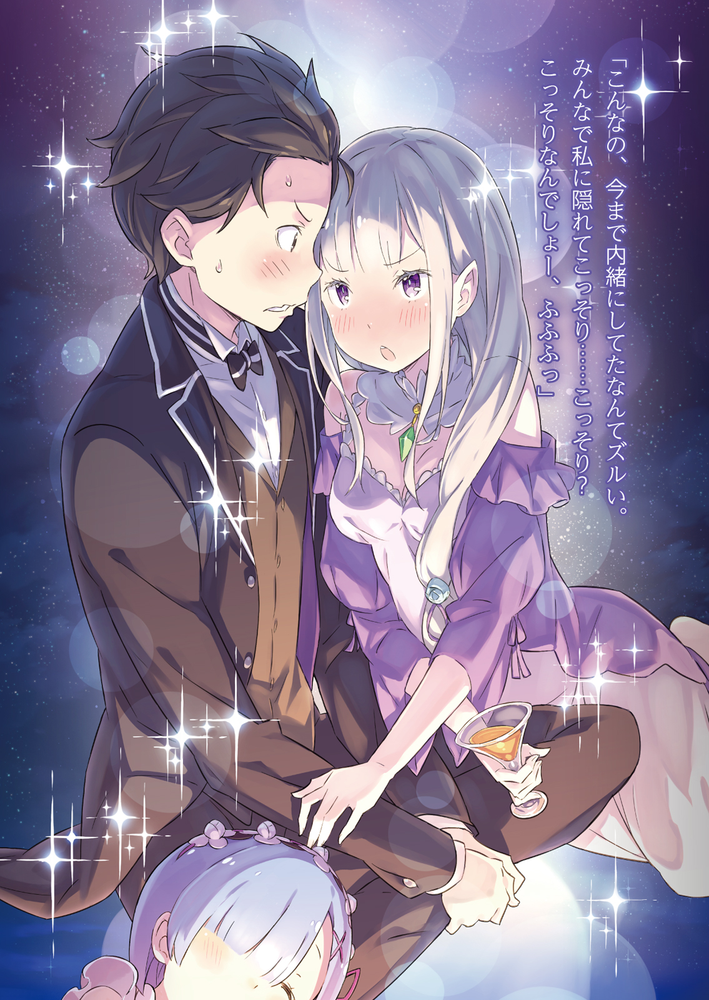
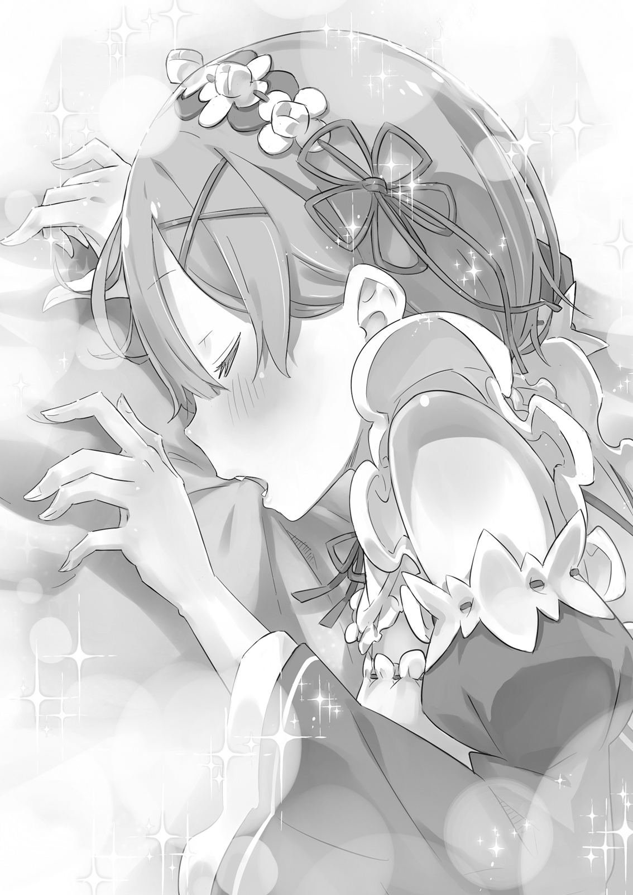
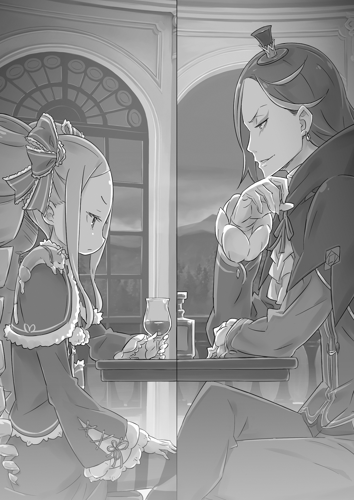

В обширном особняке Розвааля L. Мейзерса, расположенном на его территории, пустовало множество помещений. Особняк стоял за городом, у подножия лесистых гор, и своими размерами напоминал скорее небольшой замок, состоящий из трёх крыльев.

В главном крыле располагались основные помещения, такие как столовая, гостиная и большая общая ванная. В восточном крыле находились гостевые комнаты для посетителей, а также личные покои обитателей особняка и прислуги. Наконец, западное крыло содержало множество помещений, которые были “многоцелевыми”.

Оно использовалось гораздо реже остальных. Можно было бы просто назвать помещения многоцелевыми, однако, если быть точным, в западном крыле находились комнаты с неопределёнными функциями.

Там находился танцевальный зал, склад, забитый невзрачными картинами и другими произведениями искусства, а также запретный архив Беатрис, который, содержит целый ворох ненужных, по мнению Субару, книг. В западном крыле было слишком много неиспользуемых помещений.

Поэтому, хотя западное крыло и входило в график уборки, в повседневной жизни оно было совершенно предано забвению. Чаще всего люди посещали лишь кладовку в коридоре, соединяющем западное крыло с главным, что и объясняло неиспользование остальных помещений.

— И зачем, спрашивается, устраивать здесь генеральную уборку, да ещё и каждые три дня?… Хотя, интересно, что по этому поводу думает сестрица…

Субару снял пиджак от своей формы, закатал рукава и, держа в руке тряпку для пыли, произнёс эти слова. Он нахмурился и смахнул рукой витающую в воздухе пыль. Было очевидно, что как бы тщательно он ни вытирал её, пыль, кружащаяся в воздухе, никуда не денется. Она оказалась весьма надоедливым противником.

— Интересно, откуда она тут появляется и куда девается? Сестрица, что думаешь на этот счёт?

— Что?… — холодно отозвалась Рам. — Перестань говорить глупости и займись уже делом. Что бы там ни болтал Барусу, желания господина Розвааля должны быть исполнены безупречно. В этом наша работа.

— Ладно-ладно, я понял… Тогда я займусь… Что за…?!

Субару возмущенно вскрикнул, получив чувствительный пинок под зад как раз посреди своей вдохновенной речи. Обернувшись, он увидел Рам, ту самую, что только что так холодно его отчитала, которая, скрестив ноги, изящно восседала на деревянном ящике в углу комнаты. Само собой, ни тряпки, ни швабры в руках у неё не было. Она зевала, прикрывая рот рукой, и… убиралась?

— Только я решил, что ты работаешь молча… но это так в твоём духе, что у меня просто нет слов, сестрица. Если всю работу скинуть на меня, то мы так и во век не управимся.

— Если ты не способен испытывать стыд за собственную некомпетентность, то как человек, ты… бесполезен, Барусу.

— Ты можешь взглянуть на ситуацию объективно?! Давай-ка поглядим, кто у нас тут и пальца о палец не ударил!

— Ничего страшного не случится, если тебе немного не помогут с уборкой какой-то заброшенной кладовки.

— А где же та Рам, которая говорила, что безупречно исполнит желания господина Розвааля?

Рам притворно вздохнула, видя, как Субару округляет глаза от такого резкого изменения её отношения.

Обязанности по дому в особняке Розвааля были распределены между тремя людьми: Субару, нанятым работником, и сёстрами Рам и Рем.

Однако 80% работы по дому выполняла Рем, в то время как Субару и Рам делили между собой оставшиеся 20%… точнее, пытались делить, но попытки сделать это оканчивались сущим адом.

Эти двое, которым предстояло разделить работу пополам, были обречены на уборку заброшенной кладовой в неиспользуемом западном крыле, и это явно расстраивало обоих.

Одно только начало уборки начисто убило мотивацию Субару и Рам.

В особняке было принято убирать по очереди, по одному крылу в день. Западное крыло убирали всего три дня назад, и оно было не особо грязным, что ещё больше снижало их энтузиазм.

— С другой стороны, в твоих словах есть смысл… — пробормотал Субару, орудуя метлой. — Пыль просто разлетается, и я будто ничего не делал… Апчхи!

Рам, отлынивающая от работы и сидя на ящике, наблюдала, как Субару чихает от поднявшейся пыли. В дополнение к этому, поднятое метёлкой облако пыли осело на полках сбоку. Пыль, щекотавшая нос, взметнулась ещё сильнее, а кончик метлы задел полку, сбросив на пол какой-то непонятный предмет. Субару начал ворчать и наклонился, чтобы поднять его.

— Вроде сам убираю, а в итоге сам же и пачкаю… Сплошные неприятности… О?

Поднимая упавший предмет, Субару наткнулся на странный стык в полу. Проведя по нему рукой, он понял, что это крышка потайного люка.

— Рам, тут потайной люк. Ты не знаешь, что там внутри?

— …Не знаю. — сухо ответила горничная. — И забудь про него, Барусу. Как откроешь, оттуда наверняка посыплются насекомые. Если уж ты так хочешь, делай это после того, как я выйду и запру дверь.

— А зачем запирать? Да и проку уже нет.

Субару потянул за ручку люка и поднял крышку. Слова Рам вызвали у него неприятные образы, но любопытство пересилило его.

Рам тут же спрыгнула с ящика и бросилась к двери. Слегка усмехнувшись такой прыти в попытке бегства, Субару заглянул в потайное хранилище и…

— О-о?..

…изумлённо распахнул глаза.

— …И таким образом, то, что ты нашёл в потайном хранилище, моё~ё, — протянул Розвааль.

Субару, почтительно поклонившись, аккуратно поставил на стол перед ним деревянный ящик.

Нахождение люка в кладовке западного крыла, в результате чего первоначальная цель уборки была начисто забыта, привело к неожиданной находке.

Доклад принимал сидящий за рабочим столом Розвааль, а Субару, казалось, готов был лопнуть от гордости. Дневной облик маркграфа, занятого делами, контрастировала с его эксцентричным нарядом, речью и манерами.

Однако, когда Субару бесцеремонно прервал его работу, Розвааль ничуть не рассердился, а, напротив, расплылся в довольной ухмылке.

— Я-то дума~ал… — протянул он. — Вспомнил! Давным-давно я случайно услышал о винном погребе где-то в вилле. Под полом западного крыла… И подумать только, что он оказался в таком месте…

В деревянном ящике, который Субару поставил на стол, лежала дорогая бутылка вина, украшенная деревянной стружкой. Субару, услышав про винный погреб, озадачился другим моментом в словах Розвааля.

— Хм? Ты сказал «вилле»? Но это вино было найдено под особняком.

— Ах, это легко объяснить. Этот особняк построен здесь специально для подготовки к выборам короля, в котором участвует госпожа Эмилия, и по сути является виллой при моей резиденции. Главная резиденция Мейзерсов находится восточнее. Хотя, место, где я сейчас нахожусь, — тоже особняк Мейзерсов, так что особой разницы нет.

— Вилла такого размера? Тогда главная резиденция, должно быть… Даже представлять не хочу, пожалуй. В любом случае, этот подвал — не одна из твоих причуд, господин Розвааль?

— Сейчас я глава семьи, но до меня им был мой отец, а до него — дед. Возможно, винный погреб в подвале — идея моего деда, а может, и шутка моей бабушки. Говорят, они оба любили выпить.

Субару нахмурился, глядя на Розвааля, улыбающегося накрашенными фиолетовыми губами. Разговоры о дедушке казались ему совершенно отстранёнными. Розвааль, заметив сомнение Субару, прикрыл один глаз.

— Ах, простите~е. Не стоило тебе этого слышать… Но это правда.

Субару, привыкший к мысли о чрезмерной рабочей нагрузке в особняке, все же осознавал, что находится в другом мире. Представления о продолжительности жизни здесь, скорее всего, сильно отличались от тех, к которым он привык в своём родном мире. Долгоживущие расы и существование магии — это не то, что можно сравнивать с современной медициной.

— …В любом случае, я посчитал, что должен хотя бы сообщить об этом, — сказал Субару. — Что ты собираешься делать с коллекцией своего деда? Там ещё много всего нетронутого.

— Хм-м, резонный вопрос. Держать всё это в подвале в качестве… укрепления фундамента было бы расточительством. Кстати, Субару-кун, как ты относишься к вину? Можешь выпить сколько угодно? Или краснеешь от одного запаха и говоришь что-то наподобие: «Сегодня я не пойду домой…»?

— Эта фраза… кажется, её говорят на вечеринках… но и тут тоже? …Что касается меня, я не особо пьющий. Выпивка — только после двадцати.

— Двадцати? Вот это терпение!

Субару ответил, нахмурив брови в ответ на сомнение Розвааля. Он говорил чистую правду. У него не было никаких причин и желания притрагиваться к алкоголю, будучи несовершеннолетним в родном мире. К слову, на вечеринках он тоже никогда не был.

Нацуки Субару проводил свой досуг вдали от алкоголя, табака и женщин.

— Вот это неожиданно~о, — протянул Розвааль. — Учитывая характер Субару-куна, я думал, ты обязательно попытаешься выглядеть круто с помощью алкоголя и сигарет.

— Я понимаю, что ты обо мне думаешь, но к твоему несчастью, ты сильно ошибаешься. Хотя у меня был разочек, когда я попробовал затянуться сигаретой, которую отец забыл потушить…

— Да~а… ну~у… правда~а? — протянул собеседник.

— Только я затянулся, как батя вернулся… И отлупил меня так, что чуть спину не сломал. Мама тоже вернулась и начала реветь… А мне было плевать на сигарету — я больше переживал, что рёбра треснули и кровь пошла. Короче, для меня это больная тема , — пояснил Субару.

Конечно, если бы у Субару были плохие друзья, он мог бы и закурить, и выпить. Но, к счастью или нет, у него не было не только плохих, но и вообще никаких друзей. Так что подобного шанса ему не представилось.

— Вижу, ты задумался… Но в таком случае, даже если я дам тебе его в качестве награды, особой радости ты не испытаешь, — заметил Розвааль.

— По правде говоря, ты прав. На самом деле, я как-то раз попробовал выпивку. Один здоровенный дедуля угостил… Чуть горло, живот и голову не прожёг. Кстати…

Субару указал пальцем на ящик.

— В этих краях законно пить в моём возрасте? Мне всего семнадцать, я ещё несовершеннолетний! Мне даже на сайты для взрослых без разрешения родителей нельзя заходить!

— Я не совсем понимаю, что такое сайты, но мне кажется, что даже с их позволения это всё равно неправильно. Так вот, о выпивке, — Розвааль легкомысленно проигнорировал опасения Субару. — В Лугунике пить можно с пятнадцати лет.

— К тому же, хоть законы королевства и важны, во многих областях местные законы стоят выше. То есть, когда можно пить, решаю я~я.

— Вау, вот это злоупотребление властью. Согласно местным законам, я объявляю себя невиновным, — резюмировал Субару.

— Да и вообще-то, мне уже больше пятнадцати, так что даже по законам королевства я чист, — возразил Субару.

Хотя он и принял подарок, сильно радоваться, получив бутылку спиртного, Субару не спешил. Он не знал ни вкуса, ни прелести алкоголя, так что это было неудивительно. Обменять же подарок на деньги — это был бы край невежливости по отношению к Розваалю.

— Может, украсить ленточкой и поставить в комнате как предмет интерьера…? А когда мне стукнет двадцать, то я смогу с гордостью поднять бокал и попробовать его, — размышлял Субару вслух.

— Долго ждать придётся~я. Перед сном, после работы, после ванны… Повод выпить всегда найдётся. Не стоит себя так ограничивать, — ответил Розвааль.

— Тебе легко говорить, наверняка привык уже. А мне нужен какой-то особый повод. Кстати, я практически никогда не видел тебя пьющим — заметил Субару.

— Я тоже пью в меру. Конечно, на праздниках это не всегда получается, но я не принадлежу к тем, кто заглушает проблемы алкоголем, — ответил Розвааль. Он делал вид, что алкоголь для него не так уж важен, но даже сквозь это показное равнодушие просачивалась аура опытного ценителя. Без сомнения, перед Субару был человек, знающий толк в спиртном.

— И всё же, интересно, насколько я крепок к алкоголю… — пробормотал Субару. Хотя особого интереса он не испытывал, ему, как и любому другому, было любопытно узнать свой предел. И как только эта мысль закралась ему в голову, ему захотелось узнать то же самое и про остальных.

Субару нужно было что-то, какой-то толчок, чтобы преодолеть свою нерешительность и попробовать алкоголь. И не только ему…

— Точно, праздник! Розвааль, помнится, ты сказал, что пьёшь на праздниках? — вспомнил Субару.

— Хм? Да, так и сказал. В радостные моменты я тоже могу позволить себе выпить, чтобы развлечься. Я ведь тоже человек, — ответил Розвааль.

— Вот именно. В таких случаях и выпить не грех, — согласился Субару, приложив руку к подбородку. На его лице появилось выражение, словно он задумал что-то недоброе. Хотя на самом деле это не так. Он просто хотел устроить всем весёлый праздник.

— Если я организую такой праздник, можно будет взять ещё вина? — спросил Субару.

— На~а~аверно. Можешь делать как знаешь, мне это по душе.

— И кста~ати… — протянул Розвааль.

— Хм?

— Устроить праздник, чтобы увидеть, как госпожа Эмилия теряет контроль над собой… Субару-кун, довольно-таки развратный план у тебя, — хитро прищурился Розвааль.

— Такого у меня и в мыслях не было! Но раз ты это сказал, то теперь это выглядит именно так! Прекрати строить догадки! — воскликнул Субару.

Хотя он и не планировал ничего подобного, идея праздника с небольшой примесью личного интереса начала обретать форму.

— Итак, я решил организовать что-то наподобие любования цветами ! Прошу всех принять активное участие! — объявил Субару.

— Любование цветами? — непонимающе переспросила у него девушка.

«Ханами» (яп. 花見, любование цветами) — японская национальная традиция любования цветами, а именно сакурой в период её цветения.

Едва Субару вошёл в комнату, Эмилия вопросительно наклонила голову. Длинные серебряные волосы рассыпались по белым плечам, а фиалковые глаза, полные любопытства, широко раскрылись в ожидании. Девушка коснулась пальцем своих розовых губ, и на её прелестном лице появилась детская улыбка.

— Ничего об этом не слышала, но звучит весело. Любование цветами, любование цветами… — пробормотала она.

— Ага. У меня на родине есть такие деревья — сакура. Весной они покрываются розовыми цветами, и в это время все собираются под ними, пьют, поют и веселятся от души. Это и называется любованием цветами, — пояснил Субару.

— Странно… Разве люди будут любоваться цветами, если будут веселиться и пить? — заметила Эмилия

— Это деликатный момент, который лучше не затрагивать. В общем-то, это просто повод для веселья, — ответил Субару, смутившись от того, что Эмилия затронула суть японской традиции.

Получив алкоголь в качестве награды, Субару предложил устроить «Ханами» — так называемое любование цветами, которое на самом деле являлось вечеринкой с выпивкой для всех обитателей особняка.

Субару было любопытно не то, как он поведёт себя после алкоголя, а поведение других, особенно Эмилии. Вдруг она станет ещё очаровательнее под воздействием выпивки?

— Мы возьмём с собой еду и напитки, расстелем что-нибудь на земле и будем веселиться. Это главная цель нашего мероприятия! Благодаря алкоголю мы сможем увидеть друг друга в новом свете, и это, несомненно, укрепит наши связи. Ну как? — с энтузиазмом предложил Субару.

— Субару, детям нельзя пить. Для тебя так много алкоголя? — спросила Эмилия…

— Я могу понять, что ты имеешь ввиду, но я уже взрослый, так что закон на моей стороне! Мне уже семнадцать, так что я подхожу и по местным законам, и по законам Королевства! Я взрослый! Взрослый! — завопил Субару, начав размахивать руками.

— Взрослые так себя не ведут. Но Субару, тебе и вправду уже семнадцать? Очень неожиданно. Мне всегда казалось, что ты младше, — удивлённо произнесла Эмилия, глядя на суетящегося Субару.

Скорее всего, она приняла его за ребёнка из-за отсутствия на его лице зрелости и спокойствия, присущего взрослому человеку. Хотя, возможно, дело было просто в его жалком поведении.

— Все твердят, что я ребёнок, а ты сама, Эмилия-тан? Ты умеешь пить? Можешь выпить все позиции в меню от начала до конца?

— Извини, я не совсем понимаю, о чём ты.

Розвааль догадывался, что имеет в виду Субару, но вот что было в голове Эмилии в этот момент…

В этом вопросе она была совсем неопытна. Субару виделись самые невероятные варианты: от полной стойкости к алкоголю до абсолютной непереносимости.

Пока Субару прищурился, обдумывая возможности, Эмилия, немного запинаясь, произнесла:

— Ну… Хотя все вокруг об этом и говорят, но я сама никогда не пробовала алкоголь. Мне уже можно, но Пак запрещает.

— Само собой запрещаю! Алкоголь — это плохой напиток для взрослых. Лия всегда будет моей миленькой дочуркой, и ей незачем к такому прикасаться, — раздался голос из ниоткуда.

В тот же миг ожерелье на груди Эмилии засияло. Из зелёного кристалла вырвались частицы света, которые собравшись на её плече, приняли определённую форму.

Свет сформировал маленького серого котёнка, важно скрестившего лапки на груди.

— Я не позволю своей дочери попасть в дурную компанию. Весь алкоголь выпью я, Лие пить нельзя.

— Къяа, къяа, — Пак начал бить лапками, изображая бой с тенью.

— Так ты участвуешь, Пак, — заметил Субару.

Котоподобный дух-родитель, возомнивший себя защитником Эмилии, явно собирался воспользоваться случаем и вдоволь насладиться бесплатными напитками. Субару с облегчением убедился в его намерении присоединиться.

— Эмилия-тан, раз Пак участвует, ты ведь тоже не против?

— Э? Да, всё хорошо. Хоть и Пак скорее всего будет против алкоголя… Но мне нравится выбирать цветы и пробовать вкусную еду. Что насчёт Розвааля и остальных?

— Вообще-то, это была наша общая идея, так что он точно за. А если Розвааль за, то и Рем с Рам тоже не против. Правда, Рем придётся повозиться с готовкой, так что я тоже помогу ей, чем смогу.

Поначалу Субару с трудом справлялся даже с чисткой овощей, но благодаря своей ловкости в последнее время стал неплохим помощником на кухне. В отличие от Рам, чей кулинарный прогресс за долгие годы остановился на стадии варёного картофеля, Субару постоянно совершенствовался. Конечно, немалую роль в этом сыграло и рвение его наставницы.

— Похоже, Рем очень нравится готовить вместо с тобой, Субару. Хм-м… Тогда, может, и я помогу с готовкой угощений для любования цветами? Помнится, Субару сомневался в моих кулинарных способностях…

— Есть такое… Хоть эти сомнения всё ещё не развеяны…

— Какой упрямец. Онигири ведь получились вкусными, правда?

— На вкус — да. Но, как бы это сказать… Вид у них был немного… своеобразный.

Ранее, когда Субару и Рам по небольшому делу отправлялись в горы, Эмилия дала им с собой приготовленный ею обед. Это были простые онигири, но их размер был, мягко говоря, необычным. Каждый онигири был размером с гандбольный мяч, и даже один такой с трудом помещался в руке.

Проблема была не во вкусе, а в чувстве меры. Именно так Субару оценивал кулинарные способности Эмилии.

— Хмф! Если ты такой умный, то и готовь сам! На этом любовании цветами я точно удивлю тебя, Субару! И потом не смей извиняться!

— Ты меня уже достаточно удивила! Но ладно, я жду с нетерпением.

Надувшая губки Эмилия выглядела очень мило, а Субару лишь беззаботно улыбался в ответ.

Реакция Субару явно не соответствовала ожиданиям Эмилии, желавшей увидеть раскаяние на его лице, но Субару не смог сдержать улыбки.

— И когда мы устроим это любование цветами?

— Куй железо, пока горячо! Хотя сегодня, конечно, уже поздно. Но тянуть тоже не стоит, а то энтузиазм пропадёт… Думаю, завтра или послезавтра — самое то.

Конкретную дату следовало согласовать с Розваалем, самым занятым человеком в особняке. Идеальный сценарий — выбрать день, когда у него нет неотложных дел, и тогда можно будет устроить любование цветами.

— Раз уж мы устраиваем любование цветами, то лучшим местом будет цветочная поляна в лесу, верно? Конечно, по традиции любование цветами устраивают под цветущими деревьями, но это, пожалуй, слишком большая роскошь.

— Пить вино, любуясь цветущими цветами… Как изысканно. Ах, но в лесу…

— …В лесу с любованием цветами могут возникнуть небольшие трудности, — перебил Пак размышления Субару о выборе места.

— Почему?

Котёнок умылся лапкой и, предваряя объяснение словом «знаешь», ответил на вопрос Субару:

— Если мы уйдём слишком далеко от особняка, Беатрис не сможет присоединиться. Она не может покидать этот дом. Такова её… роль.

— Э-э, Беако? Не понимаю, о чём ты. Она же может ненадолго отлучиться. Тем более с разрешения владельца особняка, то есть Розвааля, она вполне официально может участвовать в любовании цветами!

— Я понимаю, чего ты хочешь, Субару. Но Беатрис находится в особняке далеко не по приказу Розвааля. Поэтому она не покинет его.

Категоричный тон Пака заставил Субару замолчать, чувствуя досаду.

Маленькая волшебница Беатрис, несмотря на свой характер, была незаменимым членом их компании. Субару не настолько бессердечен, чтобы исключать её из общего праздника. Зная Беатрис, она бы долго переживала, узнав, что все веселились без неё.

— Но ведь однажды, когда она лечила меня, она спустилась в деревню…

— Это было исключение из правил. Даже я, тот, кто её об этом просил, был удивлён, что она согласилась.

Сравнивать обычную ситуацию с той, когда всё висело на волоске, было, конечно, некорректно.

В любом случае, если Беатрис не сможет участвовать, от идеи с любованием цветами придётся отказаться. Заметив, как помрачнело лицо Эмилии, Субару стал лихорадочно искать выход из ситуации.

Беатрис не может покинуть особняк. Чтобы полюбоваться цветами, нужно выйти из особняка… Цель любования цветами — это, по сути, повод выпить алкоголь, а значит, главное — создать подходящую атмосферу. Следовательно…

— Отлично! Тогда так и поступим! — воскликнул Субару, его осенила блестящая идея.

Глаза Эмилии засияли от предвкушения.

Настал день, назначенный для мероприятия.

Получив согласие Эмилии и решив все организационные вопросы, подготовка пошла удивительно быстро. Во многом это была заслуга Рем, которая с энтузиазмом взялась за реализацию плана Субару.

— Я не могу допустить, чтобы Субару-кун опозорился, поэтому Рем выложится на все сто! — заявила она с милой улыбкой, но руки её двигались с невероятной скоростью.

Благодаря Рем, которая без единого слова жалобы взялась за дополнительные хлопоты, возникшие из-за внезапной идеи Субару, подготовка прошла без сучка и задоринки. Как и было задумано…

Субару и Эмилия тоже внесли свой посильный вклад, но подробности их деятельности, дабы не запятнать их репутацию, лучше опустить.

Как бы то ни было, незадолго до начала праздника Субару, оставив последние приготовления на Рем и остальных, отправился в одно место, чтобы завершить то, что мог сделать только он.

Этим местом оказалась…

— Ну вот, всё готово. Осталось только тебя дождаться, и все в сборе, — объявил Субару, пробираясь сквозь Запретную Библиотеку с поразительной интуицией.

— …Как всегда, врываешься и несёшь какую-то чушь, я полагаю, — прозвучал голос Беатрис.

Поначалу Беатрис возмущалась тем, что Субару нарушает её покой, но в последнее время она почти перестала реагировать на его внезапные появления.

Субару, с одной стороны, был доволен этим, но с другой — ощущал некоторую досаду. Однако сегодня он решил отложить эти чувства в сторону и перейти к делу.

Подойдя к Беатрис, которая как всегда сидела на своей стремянке с большой книгой на коленях, Субару фамильярно обратился к ней:

— Не отставай от жизни! Сегодня все в особняке устраивают праздник. Я специально не говорил тебе раньше, потому что знал, что ты начнёшь ворчать и жаловаться.

— Ты хоть сам понимаешь, что первая и вторая части твоей фразы противоречат друг другу? Праздник? С чего бы Беатрис участвовать в чём-то настолько утомительном?…

— Я так и знал, что ты это скажешь. Мне не хотелось уговаривать тебя дважды, поэтому я и решил всё рассказать сразу. В любом случае… всё равно ты согласишься, так что давай не будем тратить время и пойдём.

— Прекрати говорить со мной, как с маленьким ребёнком! Бесит, бесит, бесит! И откуда тебе знать, что нужно Бетти, на самом деле?! — Беатрис оттолкнула руку Субару и, спрыгнув со стремянки, гневно посмотрела на него.

— Где бы и с кем бы ни проходил этот праздник, Бетти не покинет особняк, я полагаю. Веселитесь, как хотите. Но Бетти это не касается…

— Так не пойдёт. Я не смогу веселиться на полную катушку, зная, что ты дуешься в особняке. Твоё участие обязательно. Отказ не принимается.

— С какой стати ты решаешь за меня?!

— Ла~а~адно, не слышу~у~у, — Субару заткнул уши, игнорируя крики Беатрис. Лицо девочки покраснело от гнева, но, видя её расстроенный вид, Субару продолжил:

— Пак рассказал мне о твоих… сложностях с выходом из особняка. Поэтому мы разработали план с учётом этого обстоятельства. Подготовка уже завершена, так что тебе остаётся только позволить мне взять тебя за руку и увести из этого унылого местечка…

— Слушай, я понимаю тебя. Даже если событие кажется интересным, перед самым выходом всё может показаться ужасно скучным. У меня такое постоянно. Но в итоге, когда я всё-таки куда-то выбираюсь, мне так или иначе становится весело… Поэтому, я помогу тебе сделать первый шаг.

Беатрис промолчала, но её тяжёлый вздох говорил сам за себя. Субару тихонько рассмеялся и, легонько хлопнув девочку по плечу, повёл её за собой.

Они вместе прошли по особняку и вскоре достигли нужного места.

— Ну же, давай, мы с тобой последние, — сказал Субару, подталкивая недовольную Беатрис к двери.

Он распахнул дверь и, заметив, как лицо девочки озарилось удивлением, торжествующе улыбнулся.

— Итак, с целью укрепить дружеские узы обитателей особняка, объявляю открытым первый в истории особняка Розвааля «Любование Звёздами»! — громко провозгласил Субару, театрально раскрыв руки.

Они стояли на верхнем этаже западного крыла особняка Розвааля — в давно забытом бальном зале, который был выбран местом проведения праздника. Свежий ветер, врываясь через открытые двери террасы, словно приглашал к танцу. В углу просторного зала стоял накрытый стол.

Участников было немного, поэтому стол не ломился от яств, но всё было приготовлено с большим старанием и выглядело очень аппетитно.

— А, Субару и Беатрис пришли! — воскликнула Эмилия, которая уже ждала их на террасе. Услышав её голос, остальные тоже обернулись, и Рем тут же подбежала к Субару.

— Субару-кун, ты справился! Всё-таки, поручить привести госпожу Беатрис могли только тебе. Как и ожидалось от главного специалиста по госпоже Беатрис в особняке!

— Да ладно тебе, но не могу не признать, что слышать твою похвалу приятно. Ну, я как первоклассный специалист по Беако просто обязан был справиться! — ответил Субару, радостно почёсывая затылок.

— Подождите-ка! Что за специалист?! Что за должность?! Прекратите нести чушь, я полагаю! — возмутилась Беатрис.

Субару и Рем дружно проигнорировали её возмущение.

Беатрис недовольно надула губы, но тут на её голову спрыгнул маленький котёнок. Лицо девочки мгновенно просияло.

— Пак!

— И тебе привет, Бетти. Я уж думал, ты не придёшь… Но Субару, похоже, знает, чем тебя заманить.

— Н-нет, ничего подобного! Пак всегда на первом месте для Бетти! Да-да! Можешь даже не сомневаться!

— Хе-хе, как мило. Надеюсь, это действительно так, — ответил Пак с лёгкой улыбкой.

По какой-то причине слова Пака заставили Беатрис скривиться, словно от боли.

Не обращая внимания на их перепалку, Субару слушал объяснения Рем.

— Мы с госпожой Эмилией и сестрой уже всё приготовили и расставили. Субару-кун тоже помогал с заготовками, так что на этот раз всё прошло даже быстрее, чем обычно.

— Это хорошо. Но украшение зала и прочие приготовления — это, безусловно, твоя заслуга, Рем.

— Верно? В этом я был неправ. В следующий раз я обязательно как-нибудь заглажу вину.

— Всё в порядке. Вместо этого, сегодня я позволю себе подольше обычного посмотреть на твоё спящее лицо, Субару-кун.

— М-м?… Ты сейчас сказала что-то странное? Спящее лицо?…

— Нет-нет. Я вовсе не говорила ничего странного~

Хотя ему и показалось, что прозвучало нечто, что нельзя было пропустить мимо ушей, Рем с очаровательной улыбкой ушла от ответа.

Субару склонил голову набок и, решив пока что взять инициативу на себя, чтобы собрать всех, направился к террасе.

— Субару, ты молодец. Привёл Беатрис, как надо. Умница, умница.

На террасе, овеваемой ночным ветерком, Эмилия встретила Субару с улыбкой и протянула руку. Её белые пальцы скользнули в его короткие чёрные волосы, и Субару, которого она гладила, покорно принимал ласку.

— «Вот же дилемма: как же хочется просто продолжать наслаждаться этим счастьем, но в то же время сказать ей, что я не ребёнок, и дать ей понять, что мы всё-таки мужчина и женщина…»

— …Эм, кажется, все собрались, может, уже поднимем тост?

— А можно перед этим ещё немного, чтобы кончики пальцев Эмилии-тан и моя кожа головы соприкасались?

— Барусу.

Острый взгляд с края террасы пронзил Субару, честно следовавшего своим желаниям. Рам, стоявшая там рядом с Розваалем, выглядела сурово. Весь её вид говорил: «Начинай уже быстрее».

Стоило Субару криво усмехнуться, как перед его глазами тут же оказался серебряный поднос.

На нем рядами стояли бокалы с напитками. Субару с благодарностью принял эту заботу от Рем, полностью посвятившей себя обслуживанию.

Убедившись, что все взяли бокалы, Субару тихонько кашлянул.

— Эм… спасибо всем, что пришли сегодня на «Любование Звёздами» в особняке Розвааля. В обычные дни нам нечасто выпадает шанс вот так всем вместе выпить, поэтому я подумал, что этот банкет станет хорошей возможностью укрепить наши узы. Итак, для начала, поучительная история, как и полагается на банкетах. История о трёх важных “мешках” в жизни…

— С-слушай, Субару. Эта история… она ведь, случайно, не будет о-о-очень длинной?

— Нет, ну что ты! Это просто шутка про “желудок, кошелёк, матушку и мешок терпения — так их же четыре!”… но…

— Барусу.

Снова пронзённый острым взглядом, Субару поспешно передал право вести беседу организатору — то есть хозяину особняка, Розваалю.

Розвааль, с улыбкой наблюдавший за этой небольшой сценкой Субару и остальных, слегка покачал бокал в руке и…

— Длинные речи только портят настроение, не та~ак ли? Поэ~этому я скажу лишь одно… Все мы, собравшиеся здесь, какие бы ни были между нами обстоятельства, должны быть товарищами. Впереди нас наверняка ждёт немало трудностей, но дава~айте преодолеем их, объединив усилия. А потому сегодня — поднимем бокалы!

— За встречу!

На удивление приличная для Розвааля речь была встречена дружным звоном поднятых бокалов.

Раздался лёгкий перезвон сталкивающихся бокалов, и под светом луны пиршество началось в мирной и дружеской атмосфере.

Так начался этот вечер…

Хотя он и назван праздником, конкретной цели что-то праздновать не было. Если уж на то пошло, то это, пусть и запоздалое, празднование разрешения инцидента с зверодемонами и выздоровления раненых в связи с этим.

Блюда, расставленные на столе, были приготовлены с большим старанием, чем обычно; конечно, это не значит, что обычная готовка Рем — халтура, но сегодняшние кушанья обладали особым, исключительным вкусом.

Гости смаковали угощения, поглядывали на звезды и понемногу наслаждались напитками.

Замысел насладиться цветами, пышно цветущими над головой, не осуществился, но вместо этого с террасы открывается панорамный вид на ночное небо, усеянное мириадами звёзд, словно это было устроено самими богами.

Свежий, кристально чистый воздух и небо, с которого ветер разогнал облака. Все условия для любования звёздным небом идеальны — это отличная ситуация для питья спиртного под прекрасными звёздами.

Нацуки Субару, чьё имя «Субару» означает Плеяды, тоже горел желанием блеснуть своими познаниями о звёздах. Потому…

— М-м? Что с тобой, Субару? Лицо у тебя… ахах, тако-о-ое странное. К тому же, ты так сильно поправился, это нечестно. Ты ведь собираешься съесть кучу сладостей?

— Это возмутительное обвинение, и я вообще не поправился! А-а-а, ну всё, Эмилия-тан, так нельзя. Вот, уже крошки роняешь…

Прильнувшая Эмилия, вся красная от смущения, выглядела очень довольной.

На укоры Субару она надула губки и снова залпом опрокинула бокал.

Янтарная жидкость скользнула меж вишнёвых губ, белое горло проглотило алкоголь. Вырвался горячий вздох.

— А-а-а… Алкоголь вкусный… Держать такое в секрете до сих пор, это нечестно! Вы все тайком от меня… тайком? Точно ведь тайком всё делали, да?

— Что ещё за «тайком», о чем ты вообще… А-ах, ну какая же милашка!

Эмилия уселась прямо на пол террасы и сама наливала себе в бокал. У её ног уже валялась пустая бутылка — пила Эмилия явно немало.

Хотя предел, после которого она стала бы совсем невменяемой, казался высоким, опьянела она на удивление быстро.

— «В принципе, этого и следовало ожидать, но всё-таки Эмилия-тан не только слаба к алкоголю, но и ведёт себя плохо будучи пьяной…»

Судя по её характеру, другого варианта и быть не могло: либо она пьет как сапожник, либо пьянеет от капли. К счастью, она не из тех, кто начинает раздеваться или творить непотребства, — просто становится прилипчивой. Пожалуй, это ещё не худший вариант.

Впрочем, то, что она и слушать не хотела, когда ей говорили прекратить пить, доставляло немало хлопот.

— «Если бы можно было, я бы силой заставил её остановиться и отвёл в комнату, но…»

Глядя краем глаза на Эмилию, соблазнительно покрасневшую от смущения, у Субару были причины, по которым он не мог её остановить. А причина была проста: он не мог сдвинуться с места.

Потому что…

— Субару-кун.

— Да, что такое, Рем?

— Кусь.

— Больно же, Рем.

На коленях Субару, сидевшего на террасе скрестив ноги, устроилась Рем, буквально рухнув туда. Выражение лица Рем оставалось таким же невозмутимым, как обычно, но сама она при этом покраснела так сильно, что это вызывало беспокойство.

Субару, обездвиженный всем её весом, отметил, что движения Рем были медленными, а требования — немногочисленными. Вот и сейчас она всего лишь грызла бедро Субару, не проявляя каких-либо признаков буйного пьянства.

Буйное пьянство… стоит ли так это называть? Она без сомнения была пьяна. Однако имелось одно тонкое отличие от Эмилии: Рем даже не пригубила алкоголя.

— «Не то чтобы она опьянела от воздуха или атмосферы… но неужели она так наклюкалась просто от запаха алкоголя? Если так, то как же она справлялась, когда использовала кулинарное вино во время готовки? Да и Роз-чи ведь иногда выпивает?», — размышлял Субару.

— Не смейся надо мной, Субару-кун. Субару-кун. Субару-кун.

— Ты назвала моё имя в три раза чаще обычного. Эм-м, в чем дело?

— Обычно я напряжена из-за важных обязанностей. Но сегодня весёлое событие, так что я немного расслабилась. Поэтому это вина Субару-куна

Хотя она вроде бы отвечала вполне последовательно и связно, речь её была невнятной, да и сама логика хромала. К тому же, хоть она и отвечала серьёзным тоном, её руки все это время обвивали талию Субару.

Её руки все это время обвивали талию Субару, а теперь она ещё и настойчиво тёрлась головой о его бок. Она была совершенно пьяна.

Видя эту неожиданную сторону её натуры, Субару машинально погладил Рем по голове. Рем с удовольствием замурлыкала.

— Ты что кошечка? Нет, она же вроде Они. Хотя, насколько я помню, у Они как раз репутация расы знатных алкашей… как же так получается?

— Не знаю, с чем ты сравниваешь, но то, что клан Они в целом устойчив к алкоголю, — правда. Рам с самого детства часто таскали на пирушки.

— Не надо так буднично признаваться в употреблении алкоголя несовершеннолетними! Хотя лезть в правила клана, наверное, тоже неправильно… Но да… у сестрицы ни цвет лица не изменился, ни язык не заплетается.

— Естественно. У Рам другая закалка.

Услышав разговор, Рам, сидевшая на стуле в зале, элегантно склонила бокал. Хотя одета она была как горничная, её манеры были как у настоящей аристократки. Возможно, такое впечатление создавали её неизменно гордая осанка и соответствующее ей достоинство?…

Рам прищурила свои светло-розовые глаза и, глядя на Рем, льнувшую к Субару, произнесла:

— Похоже, Рем тоже вовсю наслаждается застольем. Как мило.

— Наслаждается?… Выглядит так, будто она наслаждается по полной, но пока что Рем смакует лишь саму атмосферу этого места. Она ведь ещё даже к алкоголю не притронулась, а уже такая! В деревне Они что, на пирушках всегда была только ты, а Рем не участвовала?

— У неё было… сложное положение. К тому же, Рам не очень хотела, чтобы Рем смешивалась с компанией, где одни взрослые.

Рам опустила глаза и понизила голос, и Субару заколебался, стоит ли её расспрашивать дальше. Хоть он и неосторожно расширил тему разговора, похоже, для них разговоры о родной деревне — табу. Было ли это следствием его собственной неспособности учиться на ошибках, или же его рассудок слегка помутился от выпитого? Субару очень надеялся на последнее.

Хотя на фоне остальных это было и не так заметно, Субару тоже выпил немало.

Было бы хорошо, если бы под его влиянием он, подобно Эмилии или Рем, смог раскрыть ту свою сторону, которую обычно не показывает, и дать себе волю… но, к несчастью, Субару, похоже, был устойчив к алкоголю.

Не суметь опьянеть там, где полагается напиться — это настоящий талант в порче настроения людям. Он был почти что восхищён своей врождённой способностью портить атмосферу.

— Значит, что я вынес из этого вечера: алкоголь — это не просто гадость на вкус, и девушкам его давать надо с большой осторожностью…

— Это звучит как-то слишком категорично, — заметила Рам.

Да, существовали и такие девушки-Они, как Рам, чьё поведение ничуть не менялось от выпитого. Но видя, как две самые близкие ему девушки были «в нокауте» от алкоголя, Субару не мог воспринимать это так просто.

Кстати, о других присутствующих, о которых ещё не шла речь… Мистер «Я не позволю Эмилии пить алкоголь», — Пак, сейчас восседал на столе, купаясь в большой чаше с вином, словно в алкогольной ванне.

Розвааль, казалось, весело болтал с ним о чем-то.

И когда Субару обвёл взглядом террасу в поисках последнего человека — Беатрис…

— А, вот ты где, Беако.

Беатрис тоже была на террасе, как и остальные. Однако она сидела в самом углу на перилах, рассеянно глядя на звезды, а её локоны-спиральки покачивались на ветру.

Заметив тень одиночества на её погруженном в мысли лице, Субару со вздохом покачал головой.

— Ну-ка, пойду подразню её немного. Эмилия-тан, извини, присмотри за Рем.

— М-м? А, хорошо. Ну-ну, иди сюда, Рем. М-фу, така~ая милашка…

Субару осторожно высвободил руки Рем, которая вцепилась в него и теперь с явным недовольством во взгляде смотрела на него. Он передал её манящей рукой Эмилии. Та с радостью приняла не сопротивлявшуюся Рем.

Счастливая Эмилия радостно гладила её голубые волосы и, обнимая миниатюрную девушку, тёрлась о её щеку.

— …Хотел бы я это сфотографировать.

— Рам выжжет это на своих веках.

Доверившись памяти сестрицы, но чувствуя лёгкое сожаление оттого, что ему приходится покидать эту сцену, вобравшую в себя, казалось, всю красоту мира, Субару подошёл к Беатрис в углу террасы. Он прислонился спиной к перилам рядом с ней и улыбнулся застывшей девочке.

— Йоу. Чего это ты тут в уголке сидишь на пьянке? Понимаю, одиночество штука тяжёлая, но всё же.

— Я понимаю, когда меня безосновательно оскорбляют, я полагаю. Не говори лишнего. К тому же, это ты запретил Бетти пить алкоголь, я полагаю! И что мне теперь делать, на самом деле?

— Нет, ну я тебя позвал, конечно, но согласись, ты пьющая — это просто неправильно смотрится… Я не особо в курсе, как именно алкоголь влияет на неразвитый организм, но ты, тайком познавшая вкус спиртного… и представлять, как ты тайком прикладываешься к бутылке в Запретной Библиотеке, — нет уж, слишком грустно, даже думать об этом не хочу.

Ведь цель весёлого застолья не в том, чтобы подтолкнуть одинокую лоли к дурному.

На слова Субару Беатрис недовольно фыркнула.

— Пф-ф, “неразвитый организм”… Не твоё дело, я полагаю. Бетти, вообще-то… хм-м, впрочем, тебе это знать не нужно, я полагаю. Забудь, на самом деле.

Обратив взгляд на мальчика, Беатрис тут же заметила, что…

— Т-ты! Сам же специально сюда подошёл, и теперь витаешь в облаках? Какая невежливость, я полагаю!

— А! Нет, нет! Я вовсе не пялился на то, как Эмилия-тан и Рем там милуются!? Вовсе нет, но… камеру бы!…

В глубине террасы Эмилия вовсю гладила Рем по голове, а та мурлыкала и ласкалась к ней. Сцена была одновременно умилительной и слегка отдавала юри.

— Всё в порядке, я полагаю. Братика тоже забрал Розвааль, так что сегодня Бетти одинока, на самом деле. Наверное, дрожать тут на ночном ветру — это то, что ей подходит, я полагаю.

— Виноват, что оставил гостя без внимания, но давай не будем так язвить хозяину в самое сердце, ладно? Эх, ничего не поделаешь…

Усмехнувшись обиженной Беатрис, Субару закинул ноги на перила и легко присел рядом с ней. Но в тот же миг голова у него слегка закружилась от выпитого.

— О-оа!? Опасно!? Чуть не превратился в раздавленный помидор!

— …Не обязательно было исполнять трюк с риском для жизни, я полагаю. Даже если ты умрёшь, как раздавленный жук, Бетти это совсем не позабавит, на самом деле.

— Не настолько я верую в Бога Смеха, чтобы рисковать жизнью ради хохмы! Серьёзно, это было опасно, — смахнув пот со лба, пожаловался Субару.

От Беатрис он удостоился лишь раздражённого вздоха. Однако раз она не уходила, значит, позволила ему остаться здесь.

— Ладно, раз тебе всё равно нечем заняться, расскажу одну замечательную историю. Вообще-то, я хотел привязать это к звёздному небу и поведать кое-что романтическое Эмилии-тан, но из-за пагубного влияния алкоголя этот план потерпел крах.

— Звучит лишь так, будто стратег утонул в собственных интригах, я полагаю.

— Да, это так, это так! Но давай пока оставим это. В общем… у меня на родине у звёзд на ночном небе есть куча имён, связей и преданий. Например…

Субару решил пустить в ход свою коронную тему — астрономию, — чтобы вызвать у Беатрис интерес и улыбку. С этим твёрдым намерением он посмотрел на небо и… тут же замер, затаив дыхание.

Как и всегда, перед этим иным миром Субару не мог не ощутить замешательства.

Ведь местное ночное небо совершенно не походило на то ночное небо, что он знал. Здесь не было ни единой знакомой звезды.

Куда делась та самая яркая Полярная звезда и Большая Медведица рядом с ней? Куда пропали видимые в зависимости от сезона Летний и Зимний треугольники, созвездия Ориона и Кассиопеи?

По иронии судьбы, стоило лишь взглянуть на ночное небо, как становилось предельно ясно: этот мир находился в совершенно иной звёздной системе, отличной от той, что знал Субару.

— …Опять витаешь в облаках? Если сказать нечего, я исчезну, я полагаю.

— Вовсе нет! Эм-м… ну, для начала, видишь ту ярко сияющую звезду? Это Полярная звезда. Если однажды ты заблудишься и не будешь знать, где какая сторона света, — ориентируйся по ней. Она примерно указывает на север.

Хотя Субару был уверен, что ошибается, он заявил это с полной убеждённостью. В таких ситуациях отступать — значит проиграть. Чему именно проиграть, он не знал, но его суждения явно притупились из-за алкоголя.

Убедившись, что Беатрис молчит, Субару сместил палец, которым указывал на мнимую Полярную звезду.

— От этой Полярной звезды будем искать остальные. Посмотри чуть ниже… видишь пять звёзд, выстроившихся в форме буквы W? Это — созвездие Кассиопеи.

— Не вижу, я полагаю.

— Не смотри, а чувствуй! Я сказал “W”, но у меня на родине её ещё называли «Якорь». Легенда о Кассиопее… ну, это история о том, как тщеславная матушка Кассиопея хвасталась своей дочерью Андромедой и навлекла на себя недовольство окружающих

— ……Звёзды с весьма человеческими легендами, я полагаю.

Беатрис была явно озадачена лекцией Субару. Заметив её реакцию, он слегка улыбнулся.

— Так и есть. Звёзды с давних пор почитались как боги. И более того, все эти боги, каждый из них, имели свои проблемы и были очень “человечными” — на моей родине это обычное дело.

— Довольно эгоистичное представление о тех, кто обладает силой за пределами человеческого понимания, я полагаю.

— Называть их «сверхъестественными существами» звучит как-то слишком пафосно и внушает благоговейный трепет, но если похожий на них Дух так беззаботно плещется в винной ванне, то твои слова звучат неубедительно.

Субару посмотрел туда, где на столе Пак как раз перебирался в новый, только что наполненный вином бокал. Почувствовать в его облике хоть какое-то величие было, мягко говоря, затруднительно.

Даже Беатрис, похоже, не нашла слов в его защиту и лишь скривилась.

— Не стоит судить о духах по поведению братика, я полагаю. Просто братик очень добрый, вот и всё.

— Спасибо за отчаянную попытку его прикрыть. Так вот, насчёт других звёзд… А-а, точно. Ладно! Раз так, тогда давай поищем не что иное, как «Субару»!

— …Ха-а?

На воодушевлённого Субару Беатрис посмотрела так, словно видела нечто ужасно жалкое. В ответ на такое отношение Субару поспешно замахал руками:

— Постой, постой, постой! Прекрати смотреть на меня с такой жалостью! Ты не поняла! Субару — это моё имя, но его взяли от названия звезды. Точнее, «Субару» — это имя звёздного скопления, вот его-то мы и будем искать!

— Назвать сына именем звёзд, сверкающих в ночном небе… Твои родители, не подумав, обрекли тебя на ужасную судьбу, на самом деле.

— Хватит исподтишка издеваться, намекая, что имя мне не по плечу!

Не то чтобы его самого это совсем не задевало. Опасаясь, что его ткнут носом в этот комплекс, Субару, скрывая свои истинные чувства за шутливым тоном, указал пальцем в небо.

— Может, тебе и не интересно, но потерпи ещё немного. Считай это бредом пьяного, ладно?

— …Я вовсе не говорила, что мне не интересно, я полагаю, — тихим голосом пробормотала Беатрис в ответ на слова Субару.

От её неожиданных слов Субару широко раскрыл глаза, а Беатрис отвела взгляд. Её щеки едва заметно покраснели.

— Опа-опа-опа, ну что такое, что такое, какая же ты лоли без капли милоты! Ну ладно! Придётся потерпеть! Ну что ж, тогда я расскажу тебе ещё немного весёлых историй о звёздах!

— Нечего так воодушевляться, я полагаю. Какой же ты надоедливый.

— Да-да, милашка, милашка!

Настроение Субару окончательно поднялось от реакции Беатрис, и он в приподнятом духе продолжил рассказывать. Он смотрел на незнакомое звёздное небо, и его язык легко выдавал не относящиеся к делу байки о звёздах.

Какое-то лёгкое, парящее чувство охватило его — лёгкость в сердце смешивалась с лёгкостью в голове.

— Розвааль.

— А~а? Свидание с Субару-куном уже закончилось, да~а? — сказав это, Розвааль покачал бокалом и улыбнулся Беатрис, вернувшейся с террасы.

От слов этого шута лицо Беатрис скривилось.

— Шутки оставь для своего наряда, я полагаю. Неужели ты думаешь, что Бетти станет искренне наслаждаться временем вместе с ним ? Не смешно, я полагаю.

— О~ох, что за упрямица. В этом ты совсем не изменилась, не~е так ли?

— Само собой, я полагаю. В этом доме после братика я старше всех. Но важнее другое…

Беатрис мельком взглянула на Рам, сидевшую напротив Розвааля.

Розвааль, уловив смысл её взгляда, слегка кивнул ей и Рам бесшумно поднялась со стула.

Затем Рам, осушив свой бокал и поклонившись, направилась к террасе.

По пути она не забыла подобрать одеяла, чтобы позаботиться о тех, кто вырубился от выпитого.

На террасе вместе спали Субару, Эмилия и Рем, все трое мирно сжались вместе. Рам стала укрывать каждого из них одеялом.

— Детишки, не привыкшие к выпивке, такие милашки, не так ли? Субару-кун выглядел так, будто держится, но~о, похоже, он достиг предела раньше, чем я ожидал, да~а?

— Он и сам думал, что в порядке, но и его походка, и речь у него были странными, я полагаю. Он и обычно-то странный, так что неудивительно, если разницу заметить сложно, я полагаю.

— И тем не менее, Беатрис эту разницу заметила, значит, да~а?

— …

— Прошу не смотри так на меня. Это ведь была всего лишь шутка, не бо~олее.

В ответ Розваалю, который никогда не упускал случая добавить в свои слова скрытую насмешку, Беатрис выпустила вздох, в котором скопилась вся усталость за долгое время их знакомства. На этот жест, не подобающий юной леди, Розвааль со вздохом пожал плечами.

— Похоже, этот вечер тебе не очень пришёлся по вкусу, да~а?

— А ты думал, мне понравится, я полагаю? Подобное буйное веселье… Для Бетти, которая ненавидит, когда нарушают её покой, это самое ужасное, что может случиться.

— Правда ли~и? Глядя на тебя в последнее время, я никак не могу с этим согласиться. Похоже, ты лишь поневоле мирилась с тишиной, а на самом деле ты…

— Розвааль.

Встретив её пронзительный взгляд, Розвааль оборвался на полуслове.

Между ними повисла неловкая тишина. И тут в разговор вмешался третий участник.

— Бетти, тебе не очень понравилась эта вечеринка, да?

— Братик! М-м, нет, не совсем так, я полагаю. Просто видеть, как братик веселится для Бетти уже достаточно. Но сегодняшний братец пахнет алкоголем, так что я бы предпочла, чтобы ты не подходил слишком близко, я полагаю.

— Ня-я.

Подняв брызги в сосуде с вином, Пак погрузился в него. В тот же миг вино в сосуде было разом выпито до дна. Выпрыгнув из сосуда, Пак встряхнулся всем телом, сгоняя запах алкоголя.

— Ну как?

— Всё ещё пахнет алкоголем.

— Тогда вот так!

Пак, от которого всё ещё исходил запах, хоть он и стряхнул капли, махнул длинным хвостом и на мгновение исчез из этого мира. И тут же, в следующее мгновение, вернулся — исчезновение и воссоздание плоти. На миг вернув своё тело в состояние скопления маны и воссоздав его заново,

Пак полностью вернулся в обычное состояние.

— И алкоголь, и еда дают лишь временное чувство удовлетворения, знаешь ли. Духи как живые существа из-за этого, знаешь, на удивление лишены интереса к жизни.

— В смысле легкости бытия, я искренне завидую вам, да~а. Существа вроде духов, живущие, по сути, питаясь воздухом, в некотором роде являются совершенными созданиями в плане сосуществования с миром.

— Может, обычные духи и такие, да. Но в этом смысле, я думаю, мы с Бетти немного… неправильные, что ли?

Пак вскарабкался на плечо Беатрис и принялся умывать мордочку. На его слова все ненадолго умолкли. Погладив Пака, не сказавшего ничего со зла, пальцем по голове, Беатрис посмотрела на Розвааля.

— Не поведаешь ли мне свои истинные намерения, полагаю? Какова была цель сегодняшнего мероприятия?

— Всё так, как я и сказал перед тостом, да~а. Всем присутствующим здесь необходимо объединиться и вместе противостоять грядущим проблемам. Я решил, что буду сражаться этим составом.

— …

— Тебе тоже следует приготовиться. Время исполнения этого долгого, долгого контракта приближается. По крайней мере, таковы мои намерения, знаешь-ли~и.

Сказав это, Розвааль бокалом в руке указал на спящих на террасе юношу и девушек. Видел ли он надежду в них сквозь колеблющийся янтарный мир вина в бокале?

Беатрис, знавшая о заветном желании Розвааля, не испытывала к нему ни одобрения, ни осуждения. Ведь именно такое безразличие и было выбором, к которому Беатрис пришла за долгое время.

— …Как бы то ни было, я желаю увидеть завершение твоего существования. Для моей сущности, сотканной из одной лишь лжи, это одна из немногих истин.

— Какая бессмысленная сентиментальность. Сочувствие, так это называется, я полагаю?

— Это взаимное сочувствие. Ведь ты и я — единственные сообщники в этом мире.

Ответив так, Розвааль поставил на стол новые бокалы. Наполнив один янтарной жидкостью, он пододвинул его Беатрис.

— Что это?

— Твоя порция. Жестоко пригласить на пир и не дать выпить ни капли. А тот мальчик, что мог бы осудить тебя за поднятый бокал, сейчас крепко спит в мире грёз, не так ли~и?

С этими словами Розвааль предложил Беатрис выпить. Вспомнив о Субару, спящем на террасе, Беатрис взяла бокал в руку.

Однако, едва подняв, она поставила его обратно на стол и отодвинула к Розваалю.

— Воздержусь.

— Хочешь сохранить верность слову, данному Субару-куну? О-о, как это…

— Боюсь, ты неправильно понял. Бетти воздерживается не потому, что слушает слова того мальчишки. …Это наказ матушки, я полагаю.

От ответа Беатрис Розвааль умолк.

Думая про себя, что это возымело мгновенный эффект, Беатрис погладила по спине Пака, который делал вид, будто его это не касается.

Она вспоминала, что и раньше была такая ночь.

— Под звёздным небом, во время пира, матушка не одобряла, когда Беатрис прикасалась к алкоголю.

Ей, застывшей во времени, не под силу нарушить наказ матушки, данный тогда.

— Поэтому слова того парня для Бетти не имеют значения, я полагаю.

Оправдываясь так, Беатрис в тот день так и не притронулась к алкоголю.

Ночь пира шла своим чередом. Хозяин познал вкус и удовольствие от вина, а для некоторых этот пир разбередил старые душевные раны. Ночь медленно становилась глубже.

И лишь звёздное небо молча взирало на это сверху.

Конец
