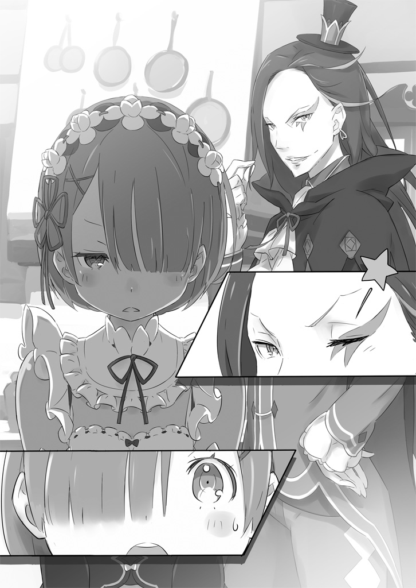

— У Субару не было какой-то особой причины для этих озарений.

— Странно. Тележка, что стояла здесь до сих пор, исчезла…

— Насчёт этого, я убрала её, пока Субару-кун отсутствовал.

— А, ясно. Спасибо, Рем.

— Странно. Вроде бы я доставал инструменты для стрижки газона, но…

— Насчёт этого, у меня выдалось свободное время, так что я позаботилась об этом.

— Вот как? Спасибо, как всегда, Рем.

— Странно. Я думал помочь расставить посуду, потому что как раз время ужинать, но…

— Насчёт этого, не беспокойся. Субару-кун может пока присесть.

— И впрямь. Похоже, мой выход отменяется. Рем как всегда на высоте!

— Э? Кстати говоря, то домашнее задание по каллиграфии, которое Рам велела мне сделать…

— Если ты об этом, то Рем сделала его, подделав почерк Субару-куна.

— …П-правда? Это, эм-м, как-то неправильно, не находишь? Нет, спасибо, конечно, но…

— Думаю, Рем стоило бы дать хотя бы один день, чтобы она могла как следует отдохнуть.

Субару, выждав момент за завтраком, когда все собрались, внёс это предложение на обсуждение жителей особняка.

Услышав это предложение, пятеро человек и два духа округлили глаза. Но больше всех удивилась та самая девушка с голубыми волосами — Рем.

Рем, стоявшая рядом с сидящим Субару и накрывавшая стол, мило наклонила голову.

— Выходной для Рем? Эм… неужели Рем совершила какую-то оплошность? И поэтому Субару-кун хочет уволить Рем?…

Глагол 暇を出す (hima wo dasu) может означать как «дать отпуск/свободное время», так и «уволить», поэтому Рем забеспокоилась, что Субару хочет её увольнения.

— Нет, это не так! Я совсем не это имел в виду. Наоборот, у меня никогда не было никаких претензий к твоей работе, но именно это и является проблемой! Ты же почти не отдыхаешь, всё время работаешь не покладая рук!

— …?

Даже выслушав объяснения Субару, Рем лишь смотрела на него с вопросительным выражением лица. То, что она совершенно не осознавала насколько она перерабатывает, наоборот, вызывало у Субару беспокойство и доказывало всю халатность её хозяина и окружающих.

Субару стало как-то жаль Рем, и он погладил по голове стоявшую рядом девушку. В последнее время Рем очень радовалась, когда Субару так делал, и безоговорочно принимала его ласку, каждый раз щурясь, хоть и не понимая причины этого.

— То-о есть, значит ли это, что Субару-кун протестует против нынешней системы найма слуг, обращаясь ко мне, своему работодателю? Та-ак вот оно что.

Пока Субару гладил Рем, эти слова, верно уловившие суть дела, произнёс человек, сидевший во главе стола — хозяин особняка, Розвааль L. Мейзерс. Розвааль, с белым лицом, на которое и этим утром был нанесён неизменный клоунский грим, слегка растянул окрашенные в фиолетовый губы в улыбке.

— Ну, «протестует» — это, пожалуй, слишком сильно сказано, но что-то близкое к тому.

— Какая дерзость, Барусу. Как ты смеешь так неуважительно говорить с господином Розваалем? Горничной возражать хозяину ещё сто лет рано, а Барусу — и всех четырёхсот не хватит.

— Такое особое отношение мне ни к чему. А ты сама разве ничего такого не думаешь?

Неужели ей не понравилось, что Субару высказал своё мнение Розваалю? Девушка с розовыми волосами, обычно смотревшая на него холодным взглядом, — Рам, сестра-близнец Рем, похожая на неё как две капли воды, — встряла в разговор.

Субару нахмурился от слов Рам, для которой Розвааль был превыше всего, и посмотрел на Рем, которую гладил по голове.

— Рем слишком много работает… вернее, поддержание этого особняка слишком сильно зависит от одной лишь Рем. Это же слишком сурово, как ни посмотри!

— Вовсе нет.

Субару вздохнул, глядя на Рам, которая невозмутимо покачала головой.

— …Тогда кто приготовил этот завтрак?

— Рем.

— Кто проснулся с самого утра, сразу же сделал простую уборку в особняке и проветрил комнаты?

— Рем.

— Кто разбудил тебя, помог переодеться и почистить зубы?

— Рем.

— Как ты умудряешься продолжать разговор с таким невозмутимым лицом?! Ты что, король?!

— Рам не настолько великолепна.

— Я тебя здесь не хвалю!!

Глядя на Рам, которая с дерзким видом выпячивала грудь, Субару почувствовал усталость и прижал руку ко лбу. И тут человек, сидевший слева от Субару и до этого не участвовавший в разговоре, вдруг поднял руку.

— Эм, можно мне кое-что добавить?

Девушка с тёмно-фиолетовыми глазами, словно инкрустированными драгоценными камнями, и длинными, дрожащими ресницами, смотрела на Субару — этой девушкой была Эмилия.

Эмилия, глядя на обернувшегося Субару и на Рем, которая выглядела довольной от поглаживаний, сказала…

— Я понимаю, что Рем о-о-очень много работает, но ведь и Рам с Субару тоже усердно работают, да? И несмотря на это, речь идёт о том, чтобы дать выходной только Рем?

— Эмилия-тан. Я рад твоей заботе, но речь идёт об объёме её работы и её нагрузке. Если посмотреть с этой точки зрения, то Рем работает слишком много по сравнению со мной или Рам.

В ответ на слова Субару, обращённые к Эмилии, Рам тихо фыркнула.

— Ты меня расстраиваешь, Барусу. Может ты и бесполезный недоучка, но Рам свою работу выполняет легко и прекрасно. Не смей ставить Рам в один ряд с собой в этом вопросе.

— Да тебе же поручают столько же работы, сколько и этому недоучке, так что ты говоришь?! И вообще, как вы справлялись, когда меня здесь не было? Ту работу, что сейчас делаю я, раньше выполняла ты, сестрица?

— Это глупый вопрос, Барусу. Раньше ею занималась Рем.

— Ты, может, и не заметила, но пока что в тебе нет ни одного положительного качества, сестрица!

Видя, что продолжать разговор с Рам — пустая трата времени и что следует вести прямые переговоры с начальством, Субару повернулся к Розваалю. Хихикая, словно его забавляла ситуация, Розвааль жестом вытянутой руки и побудил его продолжать говорить.

— Если вернуться немного назад, то есть и другие причины для особого отношения к Рем. Например, недавний инцидент с зверодемонами. Тот самый, когда мы предотвратили ущерб без твоего участия, Роз-чи.

Субару заговорил о небольшом инциденте, который произошёл совсем недавно.

Вольгармы, стайные зверодемоны, обитающие в лесу, напали на особняк Розвааля и ближайшую деревню Алам. Это была суматоха, в которой жертвы могли появиться в одно мгновение, но этот инцидент чудесным образом закончился лишь несколькими пострадавшими.

С другой стороны, у Субару действительно было много горького опыта, связанного с этим инцидентом, но он не стал об этом упоминать.

— Ты же обещал вознаградить за тот инцидент, поэтому…

— В твоём случае, Субару-кун, из-за специфики твоей просьбы, ощутимый результат может быть и не так заметен, но~o…

— Ну, эм… что ж, я благодарен за это.

Субару бросил косой взгляд на Эмилию несколько раз и ответил Розваалю, запинаясь. Эмилия вопросительно склонила голову заметив взгляд Субару, но она не знала в чем заключалась награда Субару.

Ему бы не хотелось, чтобы она узнала, как он попросил сделать несколько приготовлений для обещанного свидания с Эмилией. Она не должна была знать об этом именно для того, чтобы казалось, будто он сам подготовил цветы и венок.

— Давайте прекратим говорить о моей награде. Однако, раз уж я получил награду за тот инцидент, то это значит, что Рем и Рам тоже должны её получить, не так ли?

— Ты хочешь сказать, что с этими двумя следует обращаться так же, как с тобой, человеком, которого в то время следовало считать го~остем? Не кажется ли тебе, что это необоснованное требование, Суба~а~ару-кун?

— Даже если отбросить то, что я был гостем, нет ведь причины, по которой ты не можешь её дать? К тому же, проявив щедрость в такой ситуации, ты мог бы завоевать расположение прислуги и получить МАКСИМАЛЬНЫЙ уровень верности! Разве это не так работает, господин?

Розвааль улыбнулся настойчивому Субару и сказал: «Верность, значит…?», глядя на невозмутимую Рам.

Увидев, как Рам слегка склоняется в ответ на этот взгляд, Субару вспомнил, что рядом с ним уже стоит служанка с МАКСИМАЛЬНЫМ уровнем верности, и понял, что не смог подобрать правильные слова для убеждения.

— Вечно ты блокируешь все мои ходы, Рам.

— Бесполезно пытаться поколебать верность Рам и Рем господину Розваалю, Барусу. Более того, за такие слова я могу пригрозить тебе подозрением в шпионаже с целью посеять внутренний раздор.

— И это после того, через какое пекло мы прошли вместе!? В тебе нет ни капли пощады!

Они ведь даже неплохо сработались тогда, но на её симпатию это никак не повлияло. Субару горько усмехнулся, не зная, что и делать с этой почти освежающе-враждебной позицией Рам.

Однако…

— Но, впро~о~очем, нет нужды и полностью отвергать мнение Субару-куна, не та~а~ак ли?

— Господин Розвааль…

— Не делай такое мрачное лицо, Рам. Я вовсе не уступаю. Просто в словах Субару-куна есть резо~о~он. Тот инцидент был сродни моему промаху. Если я не дам хотя бы какой-то награды вам двоим, предотвратившим его, я прославлюсь как скупой аристократ~а~ат.

— Рам хотела бы получить перо, которым так дорожит господин Розвааль.

— Вот это контратака, сестрица! Невероятно!

Поза покорности воле господина — образец для слуги, но её смена настроения слишком резка, будто она просто подстроилась под ситуацию.

В ответ на то, что Рам прямо указала, чего хочет от него, Розвааль передал ей перо, которая была у него за пазухой. Рам почтительно приняла перо и, мягко прижав её к груди, отступила на шаг назад.

Во всяком случае, этот шаг назад был равносилен преодолению главного препятствия. Раз Розвааль убеждён, а Рам отступила, дальше всё просто.

Остаётся лишь самое важное — решение Рем.

— Субару-кун?

Рем, которую Субару всё это время непрерывно гладил по голове, непонимающе моргнула. Убрав пальцы с её шелковистых, приятных на ощупь волос, он посмотрел прямо ей в глаза.

— Итак, мы получили право на награду. Это блестящая победа сотрудников! Давай, загадывай любое желание! В пределах досягаемости финансов и власти Роз-чи, конечно.

— Хотя мне было бы немного не по себе~е~е, если бы ты возложила на меня чрезмерные ожида~а~ания.

Рем стояла перед Субару и улыбалась ему с раскрасневшимся лицом и прищуренными светло-голубыми глазами. Краем глаза он увидел, как клоун криво усмехнулся, но решил пока сознательно игнорировать это.

— Спасибо, Субару-кун. Но Рем счастлива просто проводя время с тобой и сестрицей в особняке. Так что ей больше ничего не нужно.

— Но это лишит смысла весь наш разговор!

Вернее, это означало бы, с точки зрения хода событий, победу лишь одного человека ── победу Рам, получившей перьевую ручку клоуна.

Мало того, что даже старания Субару выглядят так, будто были сделаны лишь ради Рам, так ещё и то, что Рем одна остаётся в проигрыше, — это уж слишком как обычно.

Быть доброй и бескорыстной — это добродетель, но не уметь попросить о чём-то большем, когда это следует сделать, — дурная привычка. Было бы неправильно для других позволять ей так поступать, и было бы неправильно для него не считать это печальным.

— Ну, может, просто попробуем то, что Субару сказал вначале? Разве так не будет лучше для всех?

В тот момент, когда разговор начал заходить в тупик, Эмилия хлопнула в ладоши и внесла своё предложение. Когда все взгляды устремились на неё, Эмилия взглянула на Рем и сказала:

— Я тут размышляла, слушая ваш разговор. Хотя это и её работа, но я тоже всегда полностью полагалась на Рем. Раз я так считаю, то вполне естественно, что Субару и Рам, которые работают с ней, думают так же, верно?

В ответ Эмилии, искавшей согласия, Субару отрывисто кивнул.

— Так что я тоже согласна с тем, чтобы дать Рем награду. Однако Рем сказала, что ей ничего не нужно… поэтому я не думаю, что будет правильно так поступать.

— Так что же ты тогда предлагаешь?

— Думаю, Розваалю тоже было бы неприятно, если бы в ситуации, когда нужно дать награду, он не смог бы ничего предложить. Рем — хорошая девочка, и я уверена, у она не попросит чего-то невозможного, но должным образом вознаграждать за труд — это тоже важная обязанность господина… так было написано в книге.

Только что она говорила такие важные вещи, а оказалось, это просто цитата из книги. Показав язык и смущённо улыбнувшись, Эмилия продолжила, обращаясь к немного удивлённой Рем: — Поэтому…

— Не говори «не нужно», подумай, пожалуйста. Ты ведь всегда так стараешься для нас, Рем, и мы тоже хотим что-нибудь для тебя сделать. Может, это и сложно, но…

— Госпожа Эмилия…

Рем широко раскрыла глаза; слова Эмилии словно раскрыли ей глаза на что-то новое. Субару тоже был тронут убедительностью Эмилии, так как сам он до этого момента руководствовался не столько логикой, сколько внутренним чувством справедливости.

— Так что именно подразумевает следование первоначальному предложению Барусу?

Тут в разговор вмешалась успокоившаяся Рам, убравшая перо в кармашек, и задала вопрос. В ответ Эмилия подняла один палец:

— Всё просто. Даже если мы попросим Рем вот так подумать о своей награде, когда она занята, я уверена, что Рем будет вся в заботах и у неё не найдётся времени спокойно подумать. Поэтому лучше дать ей денёк спокойно отдохнуть, и пусть заодно подумает о награде.

— А-а, понятно.

Субару искренне восхитился идеей Эмилии, видя, что она продумала её больше, чем он ожидал. Казалось, Рам и Розвааль были того же мнения — судя по тому, как они кивали, возражать никто не собирался.

Оставалось только узнать, примет ли Рем это предложение.

— … Госпожа Эмилия. Я искренне благодарна за вашу заботу. Рем очень стыдно за недостаток собственной предусмотрительности. Однако и награда, и выходной — это слишком большая честь. В том инциденте Рем лишь доставила хлопот остальным, да и в особняке без Рем будет…

Опустив глаза, Рем виновато перечисляла причины для отказа. Однако в её голосе не было колебаний, и чувствовалось упрямство, которое говорило, что она так просто своего мнения не изменит.

Поэтому…

— Рем.

— Да. Эм-м… Субару-кун, Рем…

— Давай возьмём выходной.

— Да. Раз Субару-кун так говорит!

── Вот так всё и обернулось.

Поскольку они всё ещё сидели за завтраком, было решено, что выходной Рем будет прямо сегодня.

Субару предложил ей отдохнуть завтра или позже, чтобы это был полноценный выходной на весь день, но Рем решительно отказалась от такого варианта.

— В таком случае, я думаю, нам нужно решить, как распределить работу на сегодня. Раз уж из-за выходного появляются недочёты, то и Рем не может спокойно отдыхать. И, прочувствовав на своей шкуре, сколько обычно работает Рем, в будущем вы непременно должны преисполниться искренней благодарности к ней — вот такой чрезвычайно значимый это проект.

Субару отправил Рем в её комнату, тем самым разделив их, и объяснил намерения проекта, который был предложен ранее.

В ответ на его слова Эмилия подняла руку:

— Э-эм, Субару, можно?

— Конечно, Эмилия-тан. Эта скромная манера поднимать руку, когда хочешь высказать своё мнение, — хорошая и милая.

— Я о~о~очень хорошо поняла и насчёт выходного Рем, и то, о чём ты сейчас говорил… но, может, стоит всё же объяснить как следует, чтобы и другие, кроме меня, тоже смогли понять и согласиться?

Эмилия приложила палец к губам и бросила взгляд в сторону.

Собравшиеся там — все жители особняка Розвааля, за исключением Рем. То есть, помимо слуг Субару и Рам, здесь также присутствовали хозяин Розвааль и другие.

Среди них особенно недовольное лицо было у…

— …Вообще, с чего это вы с самого начала действуете так, будто сотрудничество Бетти — само собой разумеющееся, я полагаю? Вот это куда более странно, на самом деле.

Сказав это и недовольно сверкнув глазами на Субару, миниатюрная фигурка, сидевшая на стуле, скрестила руки. Маленькая девочка в платье, с кремовыми волосами, уложенными в причёску типа «Одзё-самы» — это была Беатрис.

● «Одзё-сама» — японский термин, означающий «молодая леди». Обычно используется в аниме/новеллах и т.д для обозначения богатых, высококлассных женских персонажей с соответствующей внешностью. И Беатрис идеально подпадает под этот термин.

Хотя во время еды она и появляется за столом, Беатрис в основном старается придерживаться политики невмешательства в дела особняка. Субару знал, что и в этот раз она, скорее всего, займёт позицию отказа от сотрудничества, поэтому он выбрал для разговора время приёма пищи, когда ей волей-неволей придётся слушать.

— Ты ведь тоже по уши в долгу перед Рем, так? Когда ты обмочилась, кто, по-твоему, стирал твоё бельё и мокрый футон?

— Что за возмутительную околёсицу ты несёшь!? Когда это Бетти совершала такой неподобающий для леди промах! Хватит нести бред, я полагаю!!

— Довольно подозрительно, что ты так отчаянно это отрицаешь. Так ты действительно…

— Не делай такое серьёзное лицо! Бетти говорит тебе, что не делала этого, значит, не делала, на самом деле!

Он просто дразнил её, но нечаянно увлёкся весельем, видя, как легко она заводится. Прекратив пока подшучивать над Беатрис, Субару посмотрел на другое недовольное лицо.

— Барусу. Если есть оправдания, выкладывай их побыстрее.

Среди застывших лиц лишь бледно-красные глаза горели враждебностью — это была не кто иная, как Рам. Недовольство той, кто, в некотором смысле, должна была больше всех содействовать отдыху Рем. Причина её дурного настроения была не в чём ином, как…

— Какие уж тут оправдания, ситуация ровно такая, как ты видишь и как я сказал. Что касается бреши, возникшей из-за выходного Рем, то я говорю, что все в особняке должны восполнить её сообща, иначе ничего не выйдет.

— Но даже так, втягивать в это баловство ещё и господина Розвааля — это уже абсурд. Господин Розвааль, ежедневно поглощённый тяжёлой работой, занят даже больше, чем Рем.

— Так, по крайней мере, говорит секретарь, верно?

Пропустив мимо ушей тираду Рам, Субару обратился к Розваалю, который раскачивался на стуле рядом с ней. Услышав это, Розвааль прищурил один глаз и посмотрел на Субару жёлтым из своих разноцветных глаз.

— М-м-м, да. С моей стороны, вмешиваться в такое дело — не слишком похвально для человека на ответственном посту~у~у. Как и сказала Рам, я, знаешь ли, и так занятой челове~е~ек.

— Понятно, понятно.

— Но~о~о, с другой стороны, я считаю, что лично прочувствовать условия труда прислуги для работодателя — это отнюдь не пло~о~охо. В том числе и для того, чтобы оценить, соответствует ли зарплата объёму рабо~о~оты.

— Господин Розвааль, это…

В отличие от упрямой Рам, Розвааль с его гибким мышлением был настроен довольно благосклонно. Вероятно, в его случае преобладало желание просто поучаствовать в этом, казалось бы, чисто развлекательной затее. А может быть, ему просто нравилось наблюдать за растерянной Рам. Преданность Рам Розваалю не вызывала сомнений, но эти отношения господина и слуги были не до конца понятны даже Субару.

— Вот видишь! Уважай волю самого человека, о котором идёт речь. Разве ты не говорила, что горничной возражать господину ещё сто лет рано?

— Таким ничтожествам, как Барусу, не следует увлекаться поиском чужих ошибок.

Недовольно умолкнувшая Рам сверлила его таким взглядом, что Субару оставалось лишь криво усмехнуться в ответ на этот испепеляющий взор и кивнуть — мол, мнение выслушал.

— Итак, вернёмся к распределению обязанностей. Для начала условно разделим дела: еда, стирка, уборка…

— Ты вообще слушал, что говорила Бетти, на самом деле!? Неужели ты не слышал, как Бетти сказала, что не будет участвовать, я полагаю!?

— А-а-а, ну какая же ты зануда. Эмилия-тан, давай!

— Эмм, «Я не позволю запятнать фамильный герб!» — так ведь говорилось?

Без тени смущения, с выражением лица, говорящим «как же с тобой хлопотно», Субару, глядя на продолжающую упираться Беатрис, с обалдевшим видом предоставил Эмилии разбираться с ней. Услышав это, Эмилия произнесла заученную от Субару коронную фразу и протянула руку.

На ладони Эмилии сидел серый комок шерсти. Этот комок, догадавшись, что настал его выход, распрямился, пошевелил розовым носиком и уставился на Беатрис.

Контрактный дух Эмилии и по совместительству главное оружие против Беатрис — дух-кот Пак.

— Бетти.

— У-у… Братик. Ты и сегодня мил…

— Спасибо~. Так вот, Бетти. Я понимаю, что ты хочешь сказать, но я понимаю и то, что говорит Субару. К тому же, не наш ли это долг — время от времени проявлять великодушие ради человеческого дитя?

От спокойных слов Пака голубые глаза Беатрис задрожали от волнения. Даже Беатрис, которая во всём слушалась Пака, видимо, не могла позволить себе изменить мнение сразу после этого разговора — гордость не позволяла.

— Б-Братик, твои доводы, как всегда, убедительны, я полагаю. Н-но Бетти всё же…

— Бетти, пожалуйста.

Пак посмотрел на мямлящую Беатрис глазами, полными слёз, и, покачивая длинным хвостом, принялся её упрашивать.

— Раз уж так говорит братец, то ничего не поделаешь, я полагаю!

— Какая же ты простая!

Проблема Беатрис разрешилась невероятно легко, так что возражений больше не осталось.

Следующими вопросами были распределение работы и разделение на группы.

— Как нам разделиться?

— Основные три задачи я уже перечислил. С Паком нас всего шестеро, так что, думаю, будет идеально, если разделимся на пары. Распределение по группам…

Поймав на себе невероятно пронзительные взгляды тех двоих, что возражали ранее, Субару в общих чертах понял, что они хотят сказать, поэтому кивнул им и улыбнулся:

— Как насчёт Рам и Роз-чи, Беако и Пака, и меня с Эмилией-тан?

— Эм-м, я-то не против… но Пак и Беатрис… они справятся вдвоём?

— Хе-хе-хе, Лия такая паникёрша. Со мной всё будет в порядке. Я использую преимущество своего маленького тела на полную и подберу монетки, упавшие под комоды.

— Возможности применения твоих преимуществ слишком уж узки!

Непонятно, откуда у Пака столько самоуверенности, но раз у него есть энтузиазм, не стоит его гасить. В любом случае, это было лучше, чем если бы он взялся за ужин и смешал всю еду с кошачьей шерстью.

— Беако, ты предпочтёшь уборку или стирку? Выбирай.

— Из этих двух в стирке я смогу лучше использовать свою магию, я полагаю.

— Окей. Заодно постирай как следует всё своё описанное бельё, которое ты прячешь в комнате.

— Я же сказала, что не делала этого! Ты что, не понимаешь?!

Он успокоил разъярённую Беатрис, и было решено, что Пак и Беатрис займутся стиркой.

Следующим вопросом было, кто будет отвечать за приготовление еды, а кто — за уборку, но…

— Рам и господин Розвааль позаботятся о еде.

— Да я не против, но почему?

— Если это работа на кухне, то не придётся беспокоить господина Розвааля лишними хлопотами, и нет риска доставить неудобства из-за крупных промахов господина. В худшем случае, Барусу съест даже овощные обрезки, верно?

— Я хоть и родился в год Кролика, но я не вегетарианец!

Замечание Субару было проигнорировано с лёгким фырканьем. Тем не менее, в особняке, где не хватает Рем, именно Рам лучше всех справляется с хозяйством

Поручить команде Рам готовку, где успех или неудача так явно отражаются на вкусе, — отнюдь не ошибочный выбор. В крайнем случае, у Рам есть её коронное блюдо — картофель на пару. Хотя есть некоторая неопределённость насчёт того, что приготовит Розвааль, трагедии остаться без еды, вероятно, удастся избежать.

— Таким образом, нам с Эмилией-тан неизбежно достаётся уборка. Думаю, это будет тяжёлая и мучительная битва, но… ты поверишь в меня и пойдёшь за мной?

— Да, поняла. Я буду о-о-очень стараться, чтобы не быть тебе обузой, Субару.

— Ох, какая же она трогательно-милая!

Эмилия с горящим энтузиазмом лицом сделала победный жест кулаком. Субару удовлетворенно кивнул, видя надёжный настрой своей партнёрши, и распределение обязанностей было благополучно завершено.

— Отлично. Тогда пусть каждый займётся своей работой согласно распределению. Пак, Беако, идёмте со мной, я пока покажу вам, где сложено бельё для стирки. И ещё…

И как раз когда каждый собрался приступить к порученной ему роли, Субару оглянулся на дверь, соединяющую столовую и коридор; из слегка приоткрытой щели внутрь заглядывала голубоволосая девушка. Вероятно, она наблюдала за ними с тех самых пор, как Беатрис начала дуться.

— Рем, возможно, ты не можешь смириться с этим, но сегодня нужно просто успокоиться и бездельничать.

— Да, я это понимаю, но… ну эм, я волнуюсь.

— В тебе проявляются твои худшие черты трудоголика, Рем. Сегодня — «День Рем». Я, как профессионал по части ленивого времяпрепровождения, рекомендую тебе просто ничего не делать и валяться в кровати

— Э, почему? Разве так проводить время — не расточительство?

— Растрачивать время зря — вот для чего нужен выходной!

Субару ответил на замечание Эмилии, чувствуя, как что-то кольнуло его в груди. Тем не менее, по ту сторону двери у Рем было лицо, ясно показывающее, что она не собирается возвращаться в свою комнату.

— Во-первых, носить форму горничной, даже когда решено, что ты будешь отдыхать, — это вообще неправильно. Если ты решила расслабиться, то начать следует с внешнего вида. Немедленно переоденься во что-нибудь попроще и ныряй в кровать!

— Но у Рем нет ничего, кроме формы горничной и ночной рубашки.

— …А! Точно, ты же говорила что-то такое раньше! Это что, правда? Как ни посмотри, разве это не слишком сурово для девушки твоего возраста?

Действительно, с тех пор как Субару появился в особняке, он ни разу не видел, чтобы Рем и Рам носили что-то, кроме формы горничных. Хотя он и видел их в ночных рубашках, которые служат им ночной одеждой, но, по сути, только когда они находятся в своих комнатах.

— Это нехорошо. Надо будет как-нибудь подобрать тебе нормальную одежду. Ну, сегодня уж ничего не поделаешь, так что надень хотя бы форму горничной, в которой будет чуть посвободнее.

— Поняла. Я переоденусь в форму горничной, предназначенную для выходных.

— У тебя есть такая?!

Похоже, у неё имеется целый набор форм горничной для разных целей. Боевая, для выхода в город, для работы — судя по всему, линейка разнообразная, но изначальной причины ограничиваться только формой горничной нет.

В любом случае, как только он распрощался с Рем, которая делала всё с болезненной неохотой, «День Рем» наконец начался.

— Ладно! Ну что ж, пусть каждый приступит к своей работе со всей отдачей! Нельзя допустить, чтобы Рем подумала, будто поместье не справляется из-за того, что она взяла выходной!

— Да!

На призыв Субару Эмилия ответила, вскинув кулак.

Остальные тоже последовали за Эмилией, каждый своим голосом, и так начался немного тревожный день.

Когда все, кроме неё самой, разошлись по своим делам, Рем проводила время в своей комнате, беспокоясь как никогда раньше.

— Точно не нужно помогать? …Сестрица, Субару-кун.

Вернувшись в свою комнату, Рем, как и велел Субару, переоделась в форму горничной для выходных, но тут же начала беспокойно расхаживать по комнате туда-сюда.

Даже если ей велели лечь в кровать и провести время в праздности, она не могла успокоиться и тут же вскакивала.

Для Рем выполнение обязанностей горничной — это занятие, приносящее чувство удовлетворения, словно подтверждающее смысл её существования.

Конечно, Рем тоже не машина. Не то чтобы она совсем не уставала от работы, но факт в том, что её душа не могла найти покоя в этот внезапно свалившийся выходной.

— Всё-таки, пойду немного посмотрю.

Рем кажется спокойной и терпеливой, но на самом деле она на удивление нетерпелива в таких вещах.

Чувствуя, как тревога сжимается в её груди, которая была больше, чем у её сестры, Рем тут же вышла из комнаты и начала передвигаться по особняку, прислушиваясь к происходящему вокруг.

— Кажется, сестрица и господин Розвааль отвечают за еду… они должны быть на кухне.

Сначала она решила подглядеть за человеком, который был её второй половинкой, человеком, которому она могла больше всего доверять в плане работы — Рам.

Хотя у Рам есть привычка немного лениться, в плане дотошности и ответственности в работе она превосходит Рем. По крайней мере, так её оценивала Рем, и она не сомневалась в решении Рам самой заняться готовкой.

Она не сомневалась, но просто… немного, раза в два больше обычного, волновалась.

Сознательно приглушая шаги, она ступала по ковру коридора первого этажа главного крыла. Кухня находилась в самом конце прохода, и, уловив носом едва заметный приятный аромат, она скользнула к входу.

— Господин Розвааль. Прошу прощения, что сегодня всё так обернулось. Я обязательно сделаю строгий выговор Барусу после этого. …Да, строгий.

Ещё до того, как она заглянула внутрь, Рем услышала резкий голос Рам, и она остановилась.

Хотя Рам всеми силами избегала показывать свои чувства другим, Рем, зная её с самого рождения, могла угадать её душевное состояние по тихому тону голоса сестры.

Результат многолетнего опыта, отточившего её «сестринский сенсор», подсказал Рем, что Рам в ярости. Причём, она была зла с такой силой, какой Рем не видела уже много лет.

Бросив быстрый взгляд внутрь, она увидела Рам, яростно чистящую овощи. В руке Рам, умело обращающейся с ножом, казалось, будто вся кожура с овощей слетала как по волшебству.

— Вовсе не стои~ит так остро реагировать. Как я и говорил ранее, убедиться в том, как вы справляетесь с работой, — это чрезвыча~а~айно важно. И вовсе не потому, что Субару-кун меня уговори~и~ил.

Прислонившись к стене кухни, Розвааль неторопливо наблюдал за девушкой.

Глядя на спину работающей Рам, Розвааль помахал поднятым пальцем.

И тут котёл, стоявший на плите с огненным магическим камнем, задрожал, и пар с ароматным запахом наполнил кухню и выплеснулся в коридор.

— Господин Розвааль слишком добр к Барусу. Если это вызовет недопонимание, он натворит глупостей. Даже сегодня…

— Ох~хо, Рам, так ты считаешь, что желание дать Рем выходной — это ошибка~а~а?

— Это… ну, Рам думает, пусть Рем делает так, как хочет сама.

— Конечно, в последнее время она старается даже больше прежнего~о~о. Но быть полной энтузиазма и быть напряжённой — это разные вещи. Я считаю, что нынешнее состояние — это лучшая тенденция, чем ра~а~аньше.

Рам замолчала в ответ на слова Розвааля, а подслушивающая Рем затаила дыхание. Услышав, как они двое говорят о ней, Рем почувствовала невыносимый стыд за себя.

Она пришла подглядывать совсем не с этим намерением, но теперь чувствовала себя настоящей воровкой.

— …Пора идти.

Совместная работа Рам и Розвааля была безупречной, поскольку они давно знали друг друга. Никакого беспокойства о том, что они поссорятся, не было.

Решив немедленно уйти, Рем отстранилась от входа. Однако…

— Для Рам Рем всегда будет её милой младшей сестрой. То, что мой образ мыслей немного изменился, не значит, что я изменю своё отношение к ней. — Моя любовь к ней осталась прежней

— Что ж, давай так это и оставим, ты не про~о~отив?

Услышав ответ Рам, Рем тихонько прижала руку к груди. Затем она в последний раз быстро заглянула на кухню. И её взгляд встретился с Розваалем, который подмигнул ей с привычной улыбкой на устах.

— …

Однако Розвааль ничего не сказал Рем.

Приняв заботу своего господина, Рем вернулась в коридор, снова приглушила шаги и покинула кухню. Возможно, Розвааль с самого начала заметил присутствие Рем.

Если так, то не заговорил ли он с Рам на эту тему, чтобы Рем услышала?

— Спасибо вам, господин Розвааль.

За тактичное вмешательство Розвааля Рем мысленно поблагодарила его и направилась к следующему месту. Следующими были Пак и Беатрис, которые должны были заниматься стиркой.

В каком-то смысле это была самая непредсказуемая пара в сегодняшнем распределении обязанностей.

— Если подумать логически, они должны работать у воды, но…

Бельё собирают утром и относят к большой купальне. Поскольку это место, где не страшно промокнуть и можно использовать много воды, стирка у воды в купальне была обычаем в особняке.

Исходя из этого, те двое тоже должны были стирать там, однако…

— Интересно, смогут ли они различить тонкие различия в ткани?…

Она внезапно осознала неопределённый фактор и начала чувствовать беспокойство.

Внезапно, заметив повод для беспокойства, Рем ощутила беспокойство.

Ладно ещё носовые платки и прочие мелочи, но форма горничной и одежда Розвааля… А одежда Эмилии и женское нижнее бельё — это категории вещей, которые нельзя стирать вместе. Учитывая возможность полинять или повредить ткань, это очень плохо.

— Стиркой ведь всегда занималась либо Рем, либо сестрица!…

Досада охватила её оттого, что она упустила это из виду. Рем поспешила к большой купальне в западном крыле. До бегущей Рем донеслись звуки воды и голоса, подтверждая, что они там. Осталось только забрать белье, прежде чем эти двое испортят его своей небрежной работой…

— Слушай, Бетти. Женское нижнее белье легко деформируется и быстро приходит в негодность, если стирать его грубо, поэтому основа — это бережная ручная стирка. Нательное белье и рубашки можно стирать все вместе, но именно о ценных вещах нужно заботиться с особым усердием.

— Хм-хм, так и есть. Как и ожидалось от братика, ты хорошо осведомлён, я полагаю. Бетти примет это к сведению.

Перед глазами Рем, затаившей дыхание в раздевалке, предстала Беатрис, которая, погрузив руки в таз с набранной горячей водой, стирала нижнее белье. Пак парил рядом, покачивая длинным хвостом и глядя на маленькую персональную ванну.

Почувствовав слабое колебание маны, Рем вытянулась, чтобы посмотреть, что делает Пак. Увидев это, она тихо ахнула. Внутри ванны одежда, покрытая пеной, кружилась в горячей воде. Вероятно, это применение магии ветра и воды. А воду, наверное, нагрели магией огня?

И Беатрис тоже, если присмотреться к её рукам, не опускала их прямо в таз. На кончиках её протянутых пальцев вода словно обретала форму и двигалась, стирая бельё, будто вручную.

Это расточительное использование магии, от которого веет подавляющей обыденностью, возможное лишь потому, что они оба — сверхъестественные существа.

То, что они делали, было чрезвычайно сложным, но применение этого для стирки, поражающее своей простотой, вызывало смешанные чувства. Ещё больше удивила кладезь знаний Пака, который был странно сведущ в практической стороне человеческой жизни.

— Вот так постираешь с моющим средством, а потом нужно прополоскать в тёплой воде. Если плохо прополоскать, белая ткань пожелтеет. А сушить нужно в хорошо проветриваемом месте, не на солнце, в тени — вот забота о нижнем белье, да?

Даже слишком подробно, немного жутковато. Рем понимала, что он, вероятно, узнал это ради Эмилии, но где он этому научился, оставалось полной загадкой.

— Кажется, мне не о чем беспокоиться.

Самый большой повод для беспокойства — их невежество — благополучно развеялся. Закрыв глаза на то, что не совсем укладывалось в голове, Рем с облегчением вздохнула, подумав, что и здесь всё будет в порядке

— И всё же, стирка — это так утомительно. Людишки, все как один, одним своим существованием пачкают всё вокруг, просто ходячие проблемы, я полагаю.

— А мы-то можем просто ненадолго появиться-исчезнуть и освежиться. Ой, а у Бетти ведь немного другая ситуация, да?

— …Совсем чуть-чуть. В том смысле, что я не пачкаюсь, я такая же, как братик.

Понизив голос, Беатрис посмотрела на нижнее бельё в тазу.

— Даже с магией это хлопотно, а стирать это вручную по одной штуке — просто безумие. Бетти уже немного устала, только попробовав, на самом деле.

— Но ведь те дети и Субару делают это каждый день. Нам-то стирка не нужна, но мы же понимаем, что уборка и еда важны, так? Они всё это делают ежедневно, вот и устают. Я понимаю, почему им иногда хочется получить выходной.

— Ну, ну. Не то чтобы я совсем их не понимала…

По сравнению с Паком, чьи чувства не прочесть, как бы серьёзен он ни был, Беатрис понять проще. Даже Рем, уже вышедшей из раздевалки, ясно представилось покрасневшее лицо девочки.

— Спасибо вам обоим за вашу заботу.

Выйдя из раздевалки, Рем поклонилась в сторону купальни. Затем она направилась к последней группе из сегодняшнего распределения обязанностей.

Для Рем это была самая тревожная группа, та, насчёт которой она больше всего сомневалась, сможет ли удержаться от вмешательства.

Субару и Эмилия сегодня должны были заниматься уборкой западного крыла особняка.

— Ага, похоже, не зря я голову замотала.

— «Замотала голову»… Давно я не слышал такого выражения…

Добравшись до третьего этажа западного крыла, Рем услышала их голоса и тихо затаила дыхание. Прислонившись спиной к стене и заглянув в коридор, она увидела Субару и Эмилию с инструментами для уборки в руках — они протирали окна.

Эмилия собрала волосы сзади, надела передник и повязала голову белым платком. Рем находила забавным, как Субару то и дело украдкой поглядывал на Эмилию.

— Тем не менее, здесь тоже не так уж грязно. Похоже, здесь убирались о~о~очень тщательно.

— Ну, мы же убираем три крыла по очереди, сменяясь каждый день. К тому же, это крыло используется реже, чем центральное и восточное. Особенно танцевальный зал на этом этаже, он совсем простаивает. В этом особняке не наберётся столько людей для танцевальной вечеринки.

Рядом с ней Субару, стоя на деревянной стремянке, протирал верхние части окон и дверей. Однако, увидев, что и там уже чисто, он спустился со стремянки с видом человека, чьи усилия пропали даром.

— А-а-а, я сдаюсь. Здесь тоже убрано! Никогда не думал, что доживу до дня, когда буду недоволен тем, что что-то уже чисто!

— И правда. Но ведь это лишь доказывает, как усердно работает Рем. Я, пока вот так не прошлась посмотреть и не замечала этого вовсе.

Улыбнувшись Субару, схватившемуся за голову, Эмилия быстро оглядела коридор и вздохнула. Её подёрнутые тревогой фиалковые глаза затрепетали, и веки, обрамлённые длинными ресницами, медленно опустились.

— К такому нельзя относиться легкомысленно. Я хотела что-то сделать для Рем, но это также стало для меня уроком. Спасибо, Субару.

— Э? А, да, точно. Именно то, к чему я стремился! И Рем отдохнёт, и Эмилия-тан поучится. Прямо как Нацуки Субару, убивающий двух зайцев одним выстрелом — здорово, правда?

— Прости. Я не очень понимаю, о чем ты говоришь.

Когда Субару смущается и начинает тараторить, даже Рем порой не понимает, что он говорит. Эмилия, похоже, испытала те же чувства, и Субару понуро опустил плечи.

Не обращая внимания на Субару, Эмилия продолжила: — И всё же…

— Когда я вот так убираюсь в особняке, это напоминает мне о том, что случилось не так давно.

— Не так давно?

— Был момент, когда я тоже совсем немножко поработала, как Рем и остальные. Это было результатом разных недоразумений… хе-хе, теперь это хорошее воспоминание.

— Ого, вот как? Неужели ты и форму горничной надевала? Да ну, не может быть!

— Да, надевала. Хотя, в отличие от Рем и остальных, не короткую.

— Серьёзно!? Почему меня там не было!?

— А? Разве это было не до того, как я встретила тебя, Субару?

Эмилия с недоумением склонила голову, глядя на Субару, кусающего губы от досады.

Эмилия была грешницей, будучи человеком, который ничего не замечал, даже когда Субару было так легко прочитать. Рем, с одной стороны, жалела Субару, а с другой — испытывала облегчение от отсутствия прогресса в их отношениях.

Чувствуя при этом лёгкое чувство вины.

— А? Кстати, сегодня же… день огня и…

Пока Рем разбиралась в своих чувствах, Субару вдруг вслух начал считать по пальцам.

Закончив считать, Субару посмотрел в окно и тихо пробормотал: — Чёрт…

— Что случилось, Субару?

— Я забыл, что у меня есть одно важное дельце. Будет проблема, если я его пропущу.

— Важное дельце?… Это такая работа, что требует времени и людей?

— Не-а, я справлюсь один. Однако это одно из дел, которыми нельзя пренебрегать.

Субару почесал щеку с видом человека, осознавшего свой промах. Эмилия приложила палец к губам, обдумала ответ Субару и кивнула, мягко улыбнувшись.

— Хорошо. Тогда, иди и сделай это дело, Субару. Уборку в этом крыле я наверняка смогу закончить и сама. Она ведь почти завершена.

— …Эмилия-тан, ты точно справишься без меня? Не будешь скучать?

— Вообще ни капельки не буду скучать, так что всё в порядке.

— Почему ты так решительно это отрицаешь?!

Обменявшись своими обычными шуточками, Субару с явной неохотой отошёл от Эмилии.

Эмилия, помахав ему вслед своей маленькой ручкой, проводила его взглядом, а затем, словно подбадривая себя воскликнула: — Так!

— Хорошо, я ещё и похвасталась перед Субару, так что я должна постараться! Нужно показать, что и одна справлюсь играючи, а то потом он смеяться надо мной будет.

Хотя Субару никогда бы не стал смеяться над Эмилией…

Эмилия, не зная об этом, взяла ведро и тряпку и вошла в другую комнату. Если так пойдёт и дальше, то и с уборкой у Эмилии проблем не возникнет.

Если о чём и стоило беспокоиться, так это…

— Интересно, куда пошёл Субару-кун…?

Субару расстался с Эмилией и ушёл неизвестно куда один. Еда, стирка, уборка — все обязанности распределены, так что же это за важное дело, которое нельзя забывать?

— Ах…

Пока Рем размышляла, куда он мог направиться, она вспомнила, как Субару смотрел в окно, и нашла ответ.

— Можно Рем пойти с тобой, Субару-кун?

Увидев Рем, стоявшую у главных ворот особняка, только что вышедший Субару широко раскрыл глаза.

Услышав слова Рем, он неловко почесал голову.

— Вот чёрт. Ты всё-таки меня раскусила, Рем?…

— Нет, я тоже забыла об этом до недавнего времени. Вспомнила, наверное, примерно в то же время, что и Субару-кун.

Слегка улыбнувшись, Рем покачала головой, глядя на виноватого Субару.

На самом деле, если бы Субару не вспомнил, Рем, возможно, так и не заметила бы. Настолько, видимо, её разум был захвачен этим внезапно свалившимся выходным.

— Сегодня третий день с момента последней проверки… День, когда нужно пойти и проверить, хорошо ли закрепился барьер на горе. К тому же, суматоха из-за инцидента с зверодемонами наконец-то начала утихать.

Именно в тот момент, когда всё начало утихать, — вот та работа, о которой вспомнил Субару и забыла Рем, — проверка барьера.

Причиной недавней суматохи с зверодемонами было то, что барьер, разделяющий места обитания живущих в горах зверодемонов и людей, был частично разрушен из-за халатности в управлении им.

Поэтому Розвааль лично установил на горе новый барьер, и до тех пор, пока он не закрепится, они проводили регулярные проверки.

День такой проверки выпал на сегодня, и Рем как раз застала Субару, собиравшегося отправиться в горы, — такова была их ситуация.

— Я могу сам дойти до указанного места с камнем барьера, чтобы проверить светится ли он, знаешь ли? Ты так беспокоишься, отпуская меня одного в горы?

— Я всегда беспокоюсь о Субару-куне, но дело не только в этом. Рем хочет пойти вместе с Субару-куном. Можно?

От просьбы Рем Субару отвёл взгляд и почесал пальцем кончик носа.

Рем продолжала прямо смотреть на него, взывая взглядом, и Субару вздохнул, словно сдаваясь.

— Поход в горы в выходной день. Рем, оказывается, довольно таки любит проводить время на свежем воздухе…

— Быть рядом с Субару-куном значит, что я всегда могу на тебя положиться. Ведь ты сам так сказал, верно?

— Я не могу устоять, когда ты так говоришь. Ладно, пойдём вместе. С хорошей компанией любая дорога коротка.

— …Да.

Рем пошла следом за Субару, ступая в полушаге позади него.

Это расстояние и скорость были для Рем самыми комфортными.

Не рядом, но и не отставая. Но время от времени Субару бросал взгляд через плечо. Словно проверяя, что Рем точно идёт за ним.

С тех пор как она заметила этот жест, это место рядом с Субару стало для Рем лучшим местом.

В это время, проведённое с ним, она сильнее всего ощущала доброту взгляда черноволосого юноши и его тёплую заботу.

— Слушай, Рем. Я тут немного напролом сегодня всё решил, но… я тебе не помешал?

— Помешал?

— Ты выглядела так, будто ждала перед воротами, но я просто как-то подумал, что ты не выглядела очень спокойной. Нет, сейчас уже поздно, надо было раньше об этом подумать.

Глядя на Субару, который неловко пытался угадать её чувства, Рем чуть не рассмеялась. Как и сказал Субару, беспокоиться уже поздно, да и не стоило поднимать эту тему при её нынешнем настроении.

Но всё же, появилось лёгкое желание поддразнить его.

— Да, так и есть. На самом деле, у Рем тоже были разные дела, которые она планировала делать в определённом порядке, и то, что она хотела сделать, так что в этом смысле ты нарушил мой обычный рабочий распорядок.

— Угх… прости.

— Рем планирует на долгий срок, а не на один день, так что я собиралась сегодня сделать работу, которая бы повлияла и на завтрашний день, и далее. То, что вчерашний план прервался, возможно, немного помешает мне.

— Гфу… Ох, маленькая любезность обернулась большой проблемой…

Глядя на Субару, который, прижав руку к груди, пошатываясь шёл рядом, Рем мысленно высунула язык.

Раз уж её так удивили, то такая маленькая месть позволительна. И хотя она была удивлена, получить сегодня выходной было совсем неплохо.

— Но мне было приятно, что Субару-кун позаботился обо мне, и я смогла узнать хотя бы часть того, что госпожа Эмилия и господин Розвааль думают о Рем в обычной жизни. За это Рем хочет тебя поблагодарить.

К тому же, обширные познания Пака и то, как Беатрис использует мощную магию в быте были интересны. Рем тоже хотела бы попробовать тот способ стирки, когда одежда крутится в горячей воде.

Ответ Рем заставил Субару остановиться. Он стоял с широко открытым ртом, а после этого скривил губы, осознав, что она его поддразнила.

— Я рад, что Рем настолько со мной сблизилась, что может так шутить, чёрт возьми.

— Прости. Но я правда удивилась такой внезапности, как сегодняшний выходной. И если особняк будет работать так же, как сегодня, даже без Рем, то ей будет одиноко.

— Нет, но даже так, нельзя же постоянно собирать все силы особняка для работы по дому, как сегодня. И если подумать об объёме работы, который Рем успевает сделать с утра до завтрака, то есть подозрение, что на самом деле и за целый день с такими силами не управиться.

— Ты преувеличиваешь.

— Серьёзно, ты одна делаешь работу за пятерых и говоришь так? Можешь ценить себя чуточку больше, знаешь ли? Никто не будет жаловаться, если ты будешь немного гордиться собой.

Слышать такую оценку от Субару было для Рем просто радостно.

Если она могла заставить Субару сказать такое, то это значит, что все её ежедневные усилия не были напрасны. Она могла только благодарить Субару, который всё это затеял, и чувствовать лишь желание отплатить ему тем же.

— Субару-кун.

— Хм? Что такое? Захотелось похвастаться?

— Спасибо.

— Почему это мне сейчас сказали спасибо!? Разве не я подводил к своей благодарности всё это время!?

Субару растерялся получив неожиданный ответ от девушки, а Рем прикрыла рот рукой и рассмеялась.

…Именно потому, что он этого даже не осознаёт, она понимала, насколько дорог ей этот юноша.

На следующее утро Рем проснулась раньше обычного, уделила больше внимания своей внешности, чем обычно, с более ясным настроением, чем обычно, управилась с утренними делами и в обычное время пришла в комнату Рам.

— Сестрица, сестрица. Утро. Очень приятное утро.

— …Ещё пять минут.

Нырнув под одеяло, она подняла тело своей привычно ворчливой сестры. Сев позади Рам, чья голова неуверенно качалась, она расчесала её персиковые волосы гребнем.

— Сестрица, вот тёплое полотенце.

Она протянула полотенце, распаренное в горячей воде, лениво зевающей Рам.

Вялая Рам энергично вытерла им лицо, медленно пробуждая сознание. Тем временем, Рем принесла сменную одежду, быстро помогла Рам снять ночную рубашку и переодела её в форму. Это было уже привычным делом.

— …Рем, ты сегодня в очень хорошем настроении.

Рам, полностью проснувшись, обратилась к одевающей её Рем, которая что-то напевала, и её губы слегка тронула улыбка.

— Правда? …Наверное, ты права. Вчера у меня был очень ценный выходной. Прости, что и тебе доставила хлопот, сестрица.

— …Ты хорошенько отдохнула?

Рам коротко осведомилась о её дне.

При этих словах Рем вспомнила вчерашний день.

Обед и ужин, приготовленные Рам и Розваалем. Как сохла одежда, пока Беатрис спала на солнышке, вместе с Паком, которого унесло внезапным порывом ветра. Эмилию, которая разбила вазу посреди уборки, а затем бродила с видом, будто вот-вот расплачется. А потом — горная тропа, по которой она гуляла с Субару, и слова, которыми они обменялись.

— Всё это давало Рем очевидный ответ.

— Да, сестрица. Вчера у Рем был самый счастливый выходной в мире.

— …Вот как. Тогда хорошо.

В ответ на то, что Рем ответила с улыбкой, Рам закрыла глаза и удовлетворенно кивнула. Это было выражение лица, которое даже Рем редко удаётся увидеть, — то, которое появляется у Рам, когда она обретает душевный покой.

Переведя взгляд всё с тем же умиротворённым лицом, Рам посмотрела на окно и сказала:

— Иногда и Барусу способен на что-то полезное, да?

— Да! Субару-кун потрясающий! Ты тоже так думаешь, правда, Сестрица?

— Рам так не думает, но…

Не совсем честный ответ сестры заставил Рем по-детски надуть губы. Такой жест Рем показывала только перед Рам, но теперь она могла делить эту свою сторону ещё с одним человеком.

Как только Рам закончила переодеваться, она приняла позу перед зеркалом, и Рем зааплодировала. Затем, когда они вдвоём выходили из прохода, они заметили Субару, что неспешно шёл по коридору зевая.

Заметив их тоже Субару спешно подавил зевоту с улыбкой, и энергично поднял руку, приветствуя их.

— Доброе утро вам обеим… Почему сестрица сверлит меня взглядом с самого утра?

— Ты не знаешь? Когда женщина с утра находит труп крысы, она делает именно такое лицо.

— Не хочу думать, что это ответ на мой вопрос!

Разговор в комнате слишком затянулся, или это утренняя Рам с самого начала была холодна к Субару? в любом случае, Рем решила про себя быть добрее к Субару.

— Субару-кун, не обращай внимания. Сестрица просто немного не в духе.

— Это не служит оправданием тому, как со мной обошлись как с трупом крысы!

Почему-то не сработало.

Иногда попытки Рем проявить заботу не удавались. Когда это случалось, она наклоняла голову.

В любом случае, Субару глубоко вздохнул, отбросил шок от только что произошедшего и посмотрел на Рем.

— Кстати, Рем, вспоминая вчерашний день, тебе понравился твой отдых в твой внезапный выходной?

— Да, конечно. Это всё благодаря Субару-куну.

— Тц.

— Сестрица, ты сейчас цыкнула языком, не так ли?

Субару подозрительно сверкнул глазами на лицо Рам сбоку, когда та обиженно отвернулась. Завидуя тому, как хорошо они ладят, Рем была довольна, что нашла ещё большую радость.

— Ну, если Рем может так радостно смеяться, то это важнее всего.

Заметив, что Рем невольно улыбнулась, Субару тоже, широко улыбнувшись, застенчиво рассмеялся.

— Так вот, Рем. Вчера у тебя был целый день чтобы всё обдумать, да? Ты как следует подумала о своей награде? Ты ведь не скажешь, что была слишком занята тем, чтобы полностью насладиться выходным, что забыла подумать о своей награде?

— Я такого не скажу. Но, что касается награды Рем, я её уже получила.

— А, серьёзно? Я об этом не слышал. Вот же чертов Роз-чи, ведёт себя как чужой!

Наклонив голову, Субару надул губы в адрес отсутствующего здесь хозяина особняка.

Однако это было просто недоразумение. Это было ужасно ложное обвинение в адрес Розвааля. Ведь награду Рем получила в достатке, и предложена она была не кем иным, как самим Субару.

Все в особняке, беспокоясь о Рем, безвозмездно сотрудничали, чтобы выкроить для неё выходной. Все помогли её почувствовать свою ценность. Не могло быть большей награды, чем возможность принять эту реальность. Поэтому…

— …Рем и сегодня будет стараться изо всех сил в своей работе!

Сказав это, Рем показала важному для неё человеку улыбку, которая выглядела ещё прелестнее, чем обычно.

《Конец》
