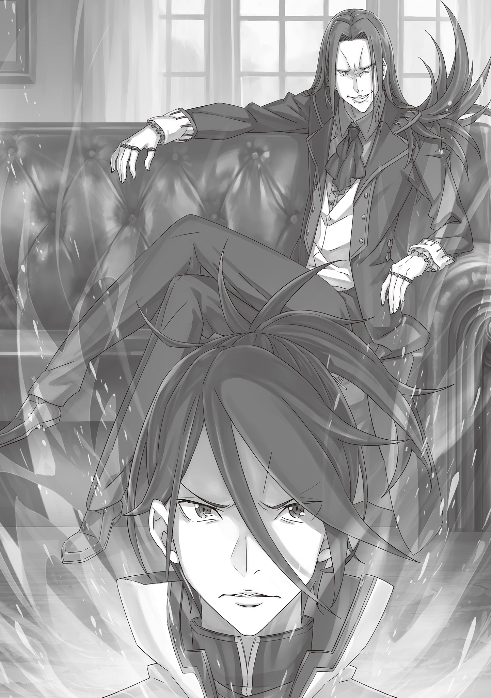

Результат Будущего

第一章 『一幕／先果』

× × ×

Стоял прекрасный солнечный день. Сквозь нежную зелень молодой листвы пробивались теплые весенние лучи. Холодная зима наконец отступила, уступая место теплу. Воздух и земля прогревались, а деревья и цветы, расцветая, наполняли мир яркими красками.

Прежде он совершенно не замечал смены времён года — в жару, потеешь, а в холод пальцы мерзнут. Это лишь мешало тренировкам. Теперь же всё стало иначе.

Он ощущал и легкую печаль об уходящем, и живую радость перед грядущим.

Хотя, если уж совсем откровенно…

— Вильгельм, — ее голос, неизменный в любое время года, и ее лицо — вот что заставило его полюбить смену сезонов.

— Вильгельм.

Ее голос, мягкий, словно шелест лепестков сакуры, ласкал его слух, и сердце Вильгельма вновь начинало биться от трепетного волнения, как и в день их первой беседы в поле цветов.

Как же он был глуп! Упрямо сопротивлялся чувствам, силился их подавить. Именно поэтому прошло так много времени, прежде чем он обнял её.

Отчаяно пытаясь наверстать упущенное время, он прижал её к себе изо всех сил.

Прижал… и…

— Вильгельм! Ты слушаешь?!

— ……

Вильгельм моргнул, громкий голос вырвал его из раздумий.

Терезия возмущенно извивалась в его объятиях. Снизу вверх на него смотрели её огромные, обычно безмятежные, но теперь наполненные слезами, голубые глаза. Немой укор во взгляде был высшим выражением гнева этой кроткой девушки.

Что же он натворил, что так разозлил Терезию?

— Что случилось? — спросил он.

— Что случилось?! Да ты опять меня не слушал! Как можно…когда я так…О чём ты вообще думал?!

— О тебе, конечно же. Ну, так что случилось?

— Н-ну… д-да… ладно…

Терезия, покраснев, смущённо опустила глаза. Но тут же, словно очнувшись, вскинула голову и воскликнула:

— Это всё не то! Хотя, очень приятно, что ты думаешь обо мне…так и надо! Ты же мой муж!

— И? Всё?

— Нет, не всё! Если бы всё, то мы, просто, в очередной раз признались друг другу в любви! В этом нет ничего плохого, но… я не об этом… Да пусти меня!

Сгорая от смущения, Терезия активно пыталась вырваться из его крепких объятий.

Вильгельм устало вздохнул.

— Ты понимаешь своё положение? — спросил он.

— …Твоя жена? Что-то ещё?

— Это конечно, важно, но есть и другие причины. Кстати, именно из-за них я тебя обнимаю, так что хватит капризничать.

— Я капризничаю?!

— А кто же ещё?

— Как ты так спокойно об этом говоришь!? Вильгельм… я правда понимаю, что беспокоишься за меня… но… пожалуйста…

— Что? Говори.

— …Можно я хотя бы в туалет схожу сама? — еле слышно прошептала Терезия, и её глаза наполнились слезами.

Вильгельм изумлённо моргнул.

— Я конечно беспокоюсь, но в туалет за тобой бегать не буду. Думай головой.

— Но ты же под дверью торчишь!

— На всякий случай.

— Если так продолжится, то я умру со стыда! — выпалила Терезия, рыбкой выскользнув из объятий и уперев в Вильгельма пальчик.

— Знаешь, дорогой мой, я конечно ценю твою заботу, но всему есть предел! Переодеваться и, тем более, в туалет, я буду ходить одна!

— Но мы же вместе купаемся.

— Вильгельм, то, что ты сейчас сказал…точь-в-точь как мой папа!

— Что?! Как ты могла меня с ним сравнить?! Есть вещи, которые нельзя говорить!

Даже сказанные в сердцах, эти слова задели его. Вильгельм страшно нахмурился. Терезия победно хмыкнула.

— Вот именно! Видишь? Даже между супругами должны быть какие-то границы. Я извинюсь, так что и ты уступи!

— Но… даже если ты сравниваешь меня с отцом, я…

Вильгельм был готов вынести любое унижение, лишь бы настоять на своем. В глазах Терезии мелькнуло беспокойство, мгновенно сменившееся радостью.

Тогда она вдруг поняла… Он готов на всё, лишь бы защитить ее.

Вильгельм почувствовал, как этот момент словно повис в воздухе. Он шагнул вперед, чтобы снова ее обнять…

— Перестань мучить леди Терезию своими жалкими оправданиями, нахал! — резкий голос заставил влюбленных мгновенно замереть. Они, в замешательстве, повернулись к дверям зала, где стояли две фигуры.

Женщина с золотистыми волосами, с суровым выражением лица и скрещенными на груди руками, а рядом с ней — мужчина с фиолетовыми волосами и печальной улыбкой на устах.

— Эмм… — пробормотала Терезия, переведя взгляд на блокнот в руках мужчины. Он использовал его для общения.

На странице, словно приговор, было написано:

Вас слышно даже снаружи.

— Вильгельм, ты идиот! — в отчаянии взвыла Терезия.

В её вопле прозвучала вся глубина досады из-за этого нелепого обвинения.

— Вильгельм, ты когда-нибудь перестанешь мучить леди Терезию?!

— Кэрол, Кэрол, успокойся, всё в порядке, правда. Это у нас… бывает иногда.

— Вы хотите сказать, что это происходит каждый день?!

Слова Терезии лишь подлили масла в огонь, и гнев Кэрол вспыхнул с новой силой.

Вильгельм не мог отделаться от ощущения, что Кэрол Ремендис сердита всегда и везде. С их первой встречи она ничуть не изменилась.

Всё происходило в особняке Астрея, в аристократическом квартале столицы. Один из незваных гостей, ворвавшихся в их дом, грозил Вильгельму кулаком и метал искры. Мужчина лишь пожал плечами, взглянув на второго, более сдержанного.

— Да уж, и как ты только её терпишь?

— В зеркало посмотри.

— Гримм, это ещё что? Какие-то претензии к моей Кэрол?

— Любовь всё преодолеет , — последовал ответ.

— Эх… и не поспоришь. Ладно, прощаю.

— Благодарю.

Автором этих строк был Гримм Фаузен, возлюбленный Кэрол. За его робкой внешностью скрывался на удивление твёрдый характер. Именно это помогло ему не только завоевать сердце девушки, но и стать заместителем командира отряда Зелгефа, элитного подразделения рыцарей Королевства.

Более того, он был давним боевым товарищем Вильгельма, командира этого самого отряда.

— Так, — начала Терезия, — может, хватит? Давайте успокоимся, пока все соседи сюда не сбежались.

— Плевать мне на соседей, ты важнее. Если хочешь чтобы всё это закончилось, то молись, чтобы Страйда нашли побыстрее.

Имя заставило Терезию слегка напрячься. Вильгельм, заметив это, раздраженно цокнул языком, досадуя и на себя, и на негодяя, заварившего всё это.

Их первая встреча с ним произошла совсем недавно, во время их свадебного путешествия.

Страйд с «Восьмируким» Курганом жестоко ранили Бертольда, отца Терезии, и пытались вызвать её на поединок, но он не позволил этому случиться.

В дуэли, прошедшей в торговом городе Пиктатт, и названной «Танцем Серебряного Цветка», формальную победу одержал Вильгельм. Учитывая, что Страйд прервал бой и сбежал, они оба не считали это победой.

— Мы так и не узнали где их искать. Они такие заметные, но будто сквозь землю провалились. Нам нужно быть начеку.

— А может, они уже вернулись в Империю? Раз «Восьмирукий» был с ним, то здесь есть какая-то связь.

— Я почти уверен, что Страйд и Курган из Волакии, но ведь не могли же эти двое вот так просто исчезнуть. Терезия, я видел его взгляд.

Девушка, которая скорее надеялась, чем была уверена, неловко опустила глаза.

Гримм и Кэрол тоже напряглись, но этого было мало. Пока они сами не увидят как искрится злобой его взгляд, они не поймут насколько он опасен. От него веяло невыносимой аурой надвигающейся беды.

Он словно был самим проклятием.

— «Бесконечное веселье», — произнёс Вильгельм слова Страйда, сказанные им перед побегом. — Он заявил, что «развлечения» только начинаются, и, судя по всему, его цель — «Святая Меча». Он подстроил поединок и пытался втянуть в него Терезию, ведь она… меч Королевства.

— Формально, теперь я принадлежу Вильгельму, и больше не «Святая Меча», — Терезия слегка сжала руку мужа, будто стараясь убедить в этом саму себя.

Отказ Терезии от титула «Святого Меча» не мог быть официально признан.

Этот титул переходил исключительно через наследование соответствующей Божественной Защиты, и невозможно было отказаться от него просто так. «Божественная Защита Святого Меча» всё ещё пребывала с Терезией, и она будет с ней пока не сменится поколение.

Именно поэтому имя Терезии, прославившееся во время Войны Полулюдей, до сих пор гремело не только в Королевстве, но и за его пределами.

— Поэтому Империя хочет использовать леди Терезию.

— Не позволю, — тихо, но твердо ответил Вильгельм, и в следующее мгновение прижал жену к себе, с силой обняв её плечи.

Крепко, до боли — так, как обнять мог только он.

— Надорвусь, но не позволю. Теперь ты не «Святая Меча», ты моя жена.

— Знаю… Я знаю, Вильгельм. — ответила ему Терезия, прижимаясь к нему в ответ.

Его слова звучали жестко, не несли нежности, но в них звенела и забота, и любовь.

— Мило… — еле слышно прохрипел Гримм.

Из-за поврежденных связок он почти не мог говорить вслух. Его слова звучали только в те моменты, когда он знал, что его поймут. Так Гримм выражал нежность и доверие.

— Да… очень мило, — с улыбкой произнесла Кэрол, и Гримм нежно улыбнулся в ответ.

— Теперь вы поняли меня? — с легким нажимом спросил Вильгельм. — Пока мы не схватим Страйда и Кургана, расслабляться нам нельзя. Возражения?

— Э-э… Ну… я… наверное… нет. Ладно тогда…

— Леди Терезия, успокойтесь, он специально пугает вас, чтобы…

— Что ты несешь? — резко перебил он. — С чего ты взяла, что…

— Перестаньте.

Вильгельм и Кэрол переглянулись, а между ними застыла Терезия, балансирующая на грани согласия с мужем. Гримм, вздохнув, протянул блокнот Вильгельму.

— Я понимаю тебя, но у нас есть дела во дворце.

— Дела?! Да какая разница, её безопасность…

— Ты останешься без работы.

— Гх…

Слова, написанные так уверенно, задели Вильгельма за живое. Когда-то ради Терезии он уже оставался без работы, и мысль о том, чтобы снова оказаться в такой ситуации, вызывала у него неприятную дрожь.

— Ты стал… дерзким.

— Всё-таки я заместитель командира.

Вильгельм не нашел, что ответить.

— Мы победили! Сдавайся! — с торжествующей улыбкой произнесла Кэрол, пристраиваясь рядом с Гриммом, словно это она выиграла спор. Но тут же, смягчив тон, добавила уже серьезно:

— Не только ты переживаешь за леди Терезию, не бери всё на себя.

— Тц…

Эти двое были невыносимы.

— Тебе может и не нравится, но придется смириться. Мы с Гриммом будем охранять её по очереди.

— Да я прямо как принцесса… Может, хватит? — проворчала Терезия, показав язык. И никому и в голову не пришло ее упрекнуть, потому что все прекрасно понимали, что она пытается хоть немного разрядить атмосферу.

И именно поэтому Вильгельм никогда не мог долго на неё сердиться.

— Никогда бы не подумал, что буду так скучать по Бордо… — пробормотал он. Гримм ухмыльнулся, услышав его ворчание.

Бывший командир отряда Зелгефа, Бордо, ныне занимал важный государственный пост в Королевстве и был далек от ратных дел. После того, как он передал командование Вильгельму, жизнь последнего стала заметно более напряженной. И сейчас эта напряженность его раздражала.

Была ещё одна причина, по которой он скучал по Бордо, но…

— Вильгельм?

— Да ничего, неважно. Вот что: с поочередной охраной я согласен, но пока мы находимся дома, с Терезией буду только я. Не мешайте нам наслаждаться медовым месяцем.

— Но в туалет я буду ходить одна! — громко заявила Терезия. Вильгельм резко нахмурился, а Гримм и Кэрол переглянулись, тихо вздохнув.

Страйд и «Восьмирукий» Курган, чьей целью стала «Святая Меча» Терезия ван Астрея, угрожали не только Вильгельму и его супруге, но и всему королевству Лугуника.

Война Полулюдей, тянувшаяся почти десять лет, едва утихла — а королевство только-только начало восстанавливаться, и тут, как гром среди ясного неба, произошёл этот инцидент.

Если вдруг подтвердится связь Страйда и Кургана с Империей Волакия, это просто раздует пламя нового смертоносного конфликта между двумя государствами, чье прошлое и так обагрено кровью бесчисленных сражений. Разумеется, маловероятно, чтобы Империя пошла на открытую войну из-за деяний каких-то безумцев.

Поэтому Королевство официально направило запрос в Империю о Страйде, но…

— ОНИ ЗАЯВИЛИ, ЧТО НИКАКОГО СТРАЙДА У НИХ НЕТ, А ГДЕ «ВОСЬМИРУКИЙ» ИМ НЕ ВЕДОМО! — закипая от злости прорычал мужчина. — ЭТО ВЕРХ НАГЛОСТИ И ЛИЦЕМЕРИЯ!

Вильгельм и Гримм, прибывшие во дворец на встречу с Бордо, сразу почувствовали напряжение. Но сильнее его негодования, их потрясло содержание новости.

— «Восьмирукий» — один из их сильнейших воинов, и они с совершенно серьёзным видом, заявляют, что не знают где он?!

— ЭТО ОТКРОВЕННОЕ НАСМЕХАТЕЛЬСТВО! СОМНЕВАЮСЬ, ЧТО ЕГО ВООБЩЕ ИСКАЛИ! ЕСЛИ ОНИ ХОТЯТ ВОЙНЫ, ТО…

— Остынь, — сказал Вильгельм. — Ты слишком горячишься.

Бордо тяжело дышал, пытаясь взять себя в руки. С грохотом он плюхнулся на стул, с которого секунду назад взлетел от гнева.

— Прости, меня малость занесло…

— Не переживай. На твоём месте я бы их всех на куски изрубил.

— Не смешно , — написал Гримм.

Вильгельм лишь пожал плечами — он и не шутил. Вот таков был ответ Империи: циничный и откровенно издевательский.

— И подумать не мог, что когда-нибудь Вильгельм будет меня успокаивать. Теперь Пивоту в глаза стыдно смотреть.

— М-да, он бы из гроба вылез от такого.

— Не смешно .

Вильгельм фыркнул, скользнув взглядом по записям Гримма. Пивот был заместителем Бордо и погиб во время гражданской войны. Он прошёл долгий путь с Бордо, был его опорой и правой рукой. И хотя он и держался холодно, но всё же до конца искренне заботился и о товарищах, и о своём командире.

После смерти Пивота Бордо заметно присмирел, но иногда в нём вновь пробуждался «Бешеный Пёс» — и именно его Вильгельм видел перед собой сейчас.

Принимая во внимание ответ Империи, даже самые безумные догадки «Бешеного Пса» уже звучали как зловещее предостережение.

— Если Империя в самом деле решилась на войну, напав на Терезию, они целят сразу в обе мишени.

— Это открытое объявление войны и попытка убрать сильнейшего защитника Королевства, но…

— У нас есть Божественный Дракон , — написал Гримм.

Вильгельм и Бордо одновременно кивнули.

Божественный Дракон Волканика, когда-то спасший мир от «Ведьмы Зависти», давным-давно заключил договор с королем Лугуники, дав клятву оберегать Королевство от любой внешней угрозы.

С тех пор Лугунику прозвали Королевством, дружественным Дракону, и все эти годы она благоденствовала, живя в спокойствии, не боясь чьих-либо завоеваний.

Пока этот священный договор имел силу, Империя, по идее, не должна была даже осмеливаться угрожать Королевству…

— Но никто не знает, действителен ли ещё этот договор. За всю войну Дракон так и не появился.

—Это была внутренняя распря. Дракон же поклялся оберегать нас только от внешних угроз. Такова официальная позиция.

— А ты как считаешь? — спросил Вильгельм.

Бордо промолчал, и это было ответом.

На самом деле, мало кто в королевстве питал надежды на Божественного Дракона. На самом деле мало кто в королевстве питал надежды на Божественного Дракона. Может быть, всё изменилось за века, может, Дракон сам отрёкся от обещания, а может, и вовсе давно умер. Все чётко понимали одно: помощи от Дракона можно не ждать.

Если бы он и вправду намеревался защитить их, то не допустил бы столь кровавой гражданской войны.

— Империя наглеет, потому что тоже так думает?

— После столь изнурительной войны и без малейшей надежды на помощь Дракона, естественно, что нас не считают за равных. Пока мы утопали во внутренних раздорах, Империя не тратила времени зря и накапливала силы.

— А мы, наивно полагаясь на договор с Драконом, несколько столетий почивали на лаврах, и только получив немного боевого опыта, тут же остались без ресурсов. С какой стороны ни глянь, положение безвыходное.

Идеальный момент для хода Империи. От отчаяния смеяться хотелось, но нужно было готовиться к худшему.

— Само собой разумеется, мы не будем сидеть и ждать чуда, — отрезал Бордо. — Раз уж они забыли, где их место, то нужно им напомнить.

— Хорошая идея. Возьмём копий, топоров побольше, и нагрянем к ним в столицу. Думаю, они нас тогда точно послушают.

— Не смешно .

Прерывая их мрачные размышления, эта фраза появилась в блокноте Гримма в третий раз за сегодня.

— Прости, — сказал Бордо Вильгельму. — Хотел бы я принести добрые вести…

— Зато теперь мы знаем, что Империя — один сплошной гадюшник. Уже хоть что-то.

— Да, береги леди Терезию… И Гримм, помоги ему.

— Есть, — чеканно ответил Гримм, впервые за это время сказав что-то вслух.

Вильгельм с трудом сдержал усмешку. Угроза никуда не делась, и расслабляться, увы, было слишком рано.

— Бордо совсем упал духом , — написал Гримм, когда они выходили из дворца.

Вильгельм кивнул, вспоминая его подавленный вид.

— Когда вижу его таким, меня самого съедает чувство вины. Он стал каким-то… апатичным — ему наверное тренировок не хватает из-за новой должности.

— Он как раз хватается за любую возможность, чтобы потренироваться. Дело не в этом, а в вине перед тобой.

— Но он же ни в чём не виноват…

Эти слова вряд ли утешат Бордо. В отряде Зелгеф была дурная привычка: в своих поражениях всегда винить себя, а не врага. И Вильгельм, и Гримм, да и почти все остальные были такими.

Но даже не получив от Бордо нужной информации, Вильгельм, как обычно, не собирался возвращаться ни с чем.

— Гримм, как мы и говорили, мне нужно зайти по одному делу. А ты…

— Пойду подменю Кэрол, ей нужно отдохнуть.

— Согласен. Спасибо ей за всё.

Эти слова были выражением искренней благодарности, которую он никогда бы не высказал прямо. Впрочем, если об этом случайно проговорится кто-то другой… что ж, бывает.

Гримм понимающе улыбнулся и кивнул.

Они расстались у ворот дворца. Вильгельм же направился не домой, а в город.

У него был отнюдь не выходной, но большую часть изматывающей бумажной работы он переложил на Гримма и Конвуда. В нынешней ситуации это было необходимо, и рыцари отряда, понимая это, охотно ему помогали.

И всё освободившееся время, Вильгельм решил потратить на…

— Это здесь, — сказал он, останавливаясь у самого порога старой, видавшей виды таверны, затерянной среди тихих, узких улочек.

В здании, несмотря на свет дня, царил полумрак. За стойкой стояла девица и с безразличием протирала стаканы, выделяясь своей опрятностью и аккуратностью в царящей вокруг убогости.

В ответ на её учтивый поклон, он едва заметно кивнул и неспешно огляделся.

— Эй, я тут! — внезапно раздался голос. — До чего ж ты любезен, даже немного пораньше пришёл.

В самом дальнем углу зала, за столиком на четверых, сидела женщина, игриво махая ему рукой.

Вильгельм нахмурился, медленно подошел к ней и сел напротив.

Она оперлась подбородком на руки и с хитринкой прищурила свои разноцветные глаза.

— Неужели ты уже истосковался? Нетерпели-и-ивый какой…

— Я женат. И не мели ерунду.

— Ох, какой ты холо-о-о-одненький… Ну впрочем, как обычно.

Она хихикнула, кокетливо прикрывая рот, из которого исходил её мелодичный и манящий голос. Вильгельм скрестил руки на груди, пытаясь сохранить хладнокровие.

Он ясно показал, что он здесь не за пустой болтовней, а только за необходимой информацией.

Его собеседница, Розвааль J. Мейзерс, представляла собой пленительную красотку с шёлковыми, как ночь, синими волосами, окутанную ореолом необъяснимой загадки. Она улыбнулась, едва заметно коснувшись губ.

— Углубим наши отноше-е-е-ения… — протянула она.

Вильгельма аж передернуло от омерзения. Он терпеть её не мог.

— И как же отреагирует твоя женушка-а-а-а-а, узнав, что мы тут с тобой на тайные свидания ходим? — промурлыкала Розвааль, кокетливо играя длинными локонами и бросая на Вильгельма томный взгляд.

— Ерунда, не неси чушь.

Он скользнул взглядом по пустому стакану, и женщина, заметив это, тут же спросила:

— Выпьешь? — спросила она и, не дав ему опомниться, жестом подозвала официанта. Тот оперативно наполнил его бокал напитком.

— Что ж, за нашу долгожданную встречу! И не думай о деньгах, — провозгласила она, подняв свой стакан.

— Сейчас день, вообще-то, — холодно ответил Вильгельм.

— Самое время выпить.

Видя, как настойчива Розвааль, Вильгельм вздохнул и чокнулся с ней бокалами. Он пригубил немного, но даже так понял, что вино было весьма дорогим.

— К счастью, семейный бизнес процветает, а к хорошему вину у меня, что уж греха таить, особая слабость, — с деланной небрежностью заявила она.

— Мне не интересно. Что с делом?

— Прямо-таки сгораешь от нетерпения… Или же тебя ждёт ревнивая женушка-а-а? — насмешливо протянула Розвааль, глядя на него одним глазом. Вильгельм понимал, что этот флирт неуместен, но знал, что их дела важнее его личных отношений.

Он сознательно задержался для разговора с этой женщиной, имея на то вескую причину.

— Скажу честно, я из кожи вон лезла, пытаясь раздобыть хоть какую-то информацию об этом… Страйде, но, к моему огромному сожалению, мои люди так ничего и не накопали

— И это все?! Ты меня позвала сюда просто чтобы извинится? — спросил он.

— А у тебя прямо на лбу отчаяние написано. Похоже, Бордо тоже ничего не нашёл.

Вильгельм промолчал, понимая, что она права. Параллельно с официальным запросом Бордо через Империю, он тайно попросил Розвааль провести своё расследование. Сомневаясь, что у его друга что-то выйдет, он делал ставку именно на её связи.

— Решила откупиться дорогим вином? — спросил он.

— Ха, в этом есть определённая логи-и-и-ка — она весело согласилась. — но, впрочем, не только в этом. Я же не люблю отступать. Поэтому и приняла меры.

— Меры?

— Верно. Клинд! — Розвааль лихо щелкнула пальцами. Тут же, подоспевший официант, оперативно заменил бокалы на тяжёлый объёмный свёрток.

— Что это? Клинок? Похож на метательный… Но выглядит он больно уж непривычно.

— Ты не ошибся, это кунай. Работают с ними, по большей части, синоби из Карараги.

— Их оружие? Откуда оно у тебя?! Стой, меры…Ты…

— Я…?

— …использовала себя как приманку?!

Розвааль лишь одарила его ещё более широкой улыбкой, и Вильгельм с отрезвляющей ясностью осознал, что самое безумное из всех его предположений оказалось правдивым. Было сложно поверить, но она действительно это сделала.

Безусловно, он отдавал себе отчёт, что Розвааль это — человек со своими особенными, довольно своеобразными методами, но…

— Если что-то случится, что мне говорить Терезии?

— Ох, а я-то думала, что тебя моя судьба интересует… Ну, впрочем, чего я могу ещё требовать, раз ты теперь «окольцованный», так сказать… Хотя, признаться, всё же неприятненько… Ну ладно, остаётся лишь быть удобной женщиной.

— Хватит. …Кто-то пострадал?

— Всё хорошо, они оказались ни на что не годными. В любом случае, занималась ими не я, а Клинд. — махнула в сторону официанта Розвааль. Вильгельм тут же понял, что он не просто слуга.

— Отнюдь. — мужчина склонил голову, приложив руку к груди. — Это заведение принадлежит госпоже, потому я непосредственно причастен к нему. Разрешите представится — Клинд, управляющий делами дома Мейзерс.

— Управляющий? Я всегда думал, что вы занимаетесь бухгалтерской вознёй, а не отражаете нападения убийц.

— К сожалению, у нас хватает всяких недругов, из-за чего такой управляющий — скорее необходимость. Да и в Королевстве не найдётся никого более подходящего.

— Вы слишком любезны, — невозмутимо ответил Клинд.

Его манеры были до безумия отточены, а во взгляде, легко читалась непринужденная уверенность, в своих силах. Похоже, он с одинаковой легкостью мог справляться и с обслуживанием клиентов, и с беспощадным истреблением любых противников.

— В тебе я уверен. Что с нападавшими? Есть что-то новое?

— Увы, все они покончили с собой, приняв яд. Никаких зацепок, о том, кто они, у нас нет.

— Получается, всё напрасно? — спросил Вильгельм.

— Не спеши опускать руки. Пусть они ничего и не рассказали, но их движения, их орудия и даже мёртвые тела могут на многое пролить свет — проговорила Розвааль, постукивая пальцем по кунаю на столе. Вильгельм молча кивнул, призывая ее продолжать.

— Начнем с их реакции. Как ты и говорил, я играла роль приманки. Специально пустила слухи, будто ищу Страйда. Ну и вот, прислали ко мне этих синоби… но это ещё не всё. Странность одна есть.

— Странность?

— Для тех, кто хотел навредить тебе или Королевству, они сработали слишком слабо.

— …Не в стиле Страйда, или просто… не напрягались?

— Мы ещё не знаем, что от него ожидать. Скорее, дело в халатности, — заключила Розвааль.

Клинд коротко кивнул. Вильгельм, потерев подбородок, погрузился в раздумья. Раз уж убийц прислали, то точно не хотели, чтобы их обнаружили. Но такая небрежность…

— Либо они не особо прятались, либо там есть ещё кто-то, помимо Страйда, — проговорил он.

— Определенно сказать сложно, но и эти ребята могут кое-что нам подсказать. Напомню, они синоби. Делают то, чего нормальным людям не поручишь.

— …Если они с ним, значит, у Страйда есть связи в Карараги?

— Рано делать выводы. Да, Карараги — колыбель синоби, но, говорят, их поселения есть и в Волакии. А эти были разных рас, скорее всего, имперские. Но кое-что я скажу точно. — Розвааль резко выпрямилась, и Вильгельм напрягся, чувствуя, как воздух наэлектризовался.

Она прищурила свой жёлтый глаз и, пристально глядя ему в лицо, произнесла:

— Страйд и его люди все ещё в Лугунике. Они тут, и плетут какую-то гадость.

От её слов исходила такая уверенность, что Вильгельм невольно затаил дыхание. В этом был какой-то пугающий смысл, и где-то внутри он знал, что она права.

Ведь Страйд ясно дал понять, что не закончил свою игру.

— Кто играет, тот не бросает игру на полпути… — сказал Вильгельм. — Он хуже капризного ребёнка.

— Метко подмечено. Занесу это к его «достоинствам», и продолжу расследование…

— Я тебя сам на это надоумил, не мне тебя отговаривать. Но будь осторожна.

— Само собой. Как и во время войны, я снова доверю безопасность дома Клинду.

— Кстати, на Войне Полулюдей я твоего управляющего не видел.

Розвааль лишь пожала плечами, а Вильгельм удивленно изогнул бровь. Пять лет знакомства со врем1н войны, а Клинда он рядом с ней ни разу не видел. Рядом с Розвааль всегда была Кэрол, пока Терезия не могла сражаться.

— Как по мне, он ничем не хуже Кэрол.

— Не хочу её обижать, так что промолчу. Скажем так, во время войны я была… ходячей государственной тайной — то и делала, что раскрывала планы Альянса Полулюдей. Понятное дело, что на меня, или мою семью, могли напасть в любой момент. Потому Клинд охранял их.

— К счастью, пока госпожа отсутствовала, особняк атаковали лишь несколько раз, — ровно произнёс Клинд. — Мне удалось обеспечить безопасность молодого господина.

— Это хорошо… Погоди, — Вильгельм резко замолчал, словно что-то кольнуло. — Клинд, это какая-то шутка?

— Прошу прощения, но я не понимаю, на что вы намекаете, — спокойно ответил слуга.

— «Молодой господин»? Ты хочешь сказать, что у неё есть ребёнок?! — Вильгельм опешил и посмотрел на Розвааль. Клинд, сохраняя невозмутимый вид, поклонился госпоже.

— Всё верно. Я приглядываю за вашим сыном.

— Этот…управляющий тоже свихнулся…

— Ну сколько можно всех подозрева-а-а-ать?! — воскликнула Розвааль. — Клинд всегда был таким, и он и правда печётся о моём сыне. Он уже совсем большой мальчик, потому я и взяла Клинда с собой.

Розвааль неспешно смаковала вино, будто в мире нет иных забот. Вильгельм вгляделся в Клинда, который слегка покачивал головой.

Погрузившись в мысли, он задумчиво поглаживал эфес меча.

— Значит, ты… уже мать?! И всё это время… — начал он, явно сбитый с толку.

— Постой. Да, я родила сына, но замуж так и не вышла. И воспитываю его одна.

— Но ты же аристократка! Как глава дома Мейзерс может…

Вильгельм сам был родом из аристократии, пусть и из рода, что уже канул в лету. В Лугунике издавна чтили наследие и кровные узы, особенно среди знатных семей. Дом Мейзерс до войны не значил ничего, но благодаря тому, что значение магии возросло, его влияние стало огромным.

И вот глава такого дома — незамужняя мать. Это было немыслимо.

— Как ни странно, мои родичи рады, что теперь есть кому наследовать дом, — спокойно ответила Розвааль.

— Так что, у вас там вся семейка с прибабахом?

— Какой кошмар! Расслабься, просто меня некому осадить. Родители с братьями уже в могиле, и никто не мешает мне делать, что я захочу.

Розвааль говорила об этом так непринужденно, что Вильгельм терялся в догадках. Он все никак не мог понять, какой жизнью она живёт.

— Ой, ты что, приуныл? Из-за того, что я родила-а-а-а ребенка?

— Да не до смеха тут. Ты теперь ещё более загадочная. У тебя есть ребенок, но ты всё равно заигрываешь со мной…

— Ты намекаешь, что вдова не вправе искать себе кого-то?… Ну ладно, это было лишним. Спасибо, что подсказал, я учту.

Розвааль внезапно умолкла, отчего Вильгельм почувствовал себя немного потерянным. После первоначального шока, ему вдруг стало очень интересно взглянуть на ребёнка, которого воспитывал её слуга.

— Полагаю, вам стоит познакомиться с господином Карлом, — спокойно произнёс Клинд.

— Розвааль, твой управляющий, похоже, читает мысли, — удивленно отметил Вильгельм.

— Ну поэ-э-э-тому он мне и по нраву.

Розвааль легко рассмеялась, а Вильгельм устало вздохнул, осушил свой бокал и поднялся с места. Похоже, никакой новой информации о Страйде он уже не услышит.

—Потянуло к любимой жёнушке? — спросила она.

—Ты о сыночке-то не забывай, не перекладывай всю заботу на плечи управляющего… Если что — сразу сообщи мне.

— От таких речей во мне зажёгся огонь надежды.

— Твоя госпожа не из самых ответственных. Будь осторожнее, — обратился он к Клинду.

— Слушаюсь, — спокойно ответил тот.

Вильгельм отмахнулся от её колекостей, решив положиться на Клинда. Этот незнакомец, которого он едва знал, вызывал в нём больше доверия, чем боевая подруга с пятилетним стажем. Подобное красноречиво говорило о её характере.

— В любом случае, мы пережили ту стра-а-а-ашную войну, — сказала Розвааль. — Давайте беречь себя.

— Если бы это от меня зависело, — ответил Вильгельм.

В Лугунике говорили, что будущее ведомо только Дракону.

Вильгельм надеялся узнать что-то о Страйде от Бордо и Розвааль, но напрасно, как об стену горохом.

Бордо поник, а Розвааль, наоборот, ещё больше загорелась желанием найти этого подонка. И то, и другое было ему только на руку — он по-прежнему мог рассчитывать на их поддержку.

Однако в душе Вильгельма начало расти беспокойное предчувствие.

Дерзкое поведение Империи и твердая уверенность Розвааль в том, что Страйд все еще находится в Королевстве, наводили на мысли о коварном замысле, в центре которого была его любимая Терезия.

«Демон Меча» Вильгельм ван Астрея, не имея выбора, вновь был вынужден прикоснуться к стали.

— Ненавижу ждать, — тихо пробормотал он, злясь на собственную беспомощность.

Единственное, что он умел — сражаться, и ничего не изменилось: несмотря на смену своего положения и появление подчиненных, он, по сути, оставался тем же.

Он вернулся домой, зная, что Терезия ждет его.

Гримм, пришедший раньше, уже наверняка успел рассказать ей о неудаче Бордо. Он не желал добавлять к этому списку и свои неутешительные вести, зная, что Терезия, хоть и скроет свое разочарование, всё равно в глубине души ждала только хорошего.

Однако все его худшие опасения сбылись. В самом печальном смысле этого выражения.

Едва он вошел в дом, непривычная тишина навалилась на него. Инстинктивно положив руку на эфес меча, Вильгельм осторожно пошёл вперёд по коридору, настороженно прислушиваясь к каждому звуку.

— Явился наконец? — раздался голос. — Дерзаешь ли ты заставлять Меня ожидать, глупец?

В зале, в котором Вильгельм обычно проводил вечера с Терезией, предстал не тот, кого он надеялся встретить, а тот, чьего появления всеми силами старался избежать.

Мерзавец, столь долго ускользающий от них, насмешливо расправил плечи, опустив свой пренебрежительный взор на него.

— Страйд.

— Удосужился прибыть, Вильгельм ван Астрея. Ежели Мне не изменяет память, так тебя зовут?

Он ничуть не испугался гнева, вспыхнувшего в глазах Вильгельма. С небрежной наглостью Страйд развалился на диване, посреди их дома, и самодовольно улыбнулся.

— Я, конечно, был наслышан, что ты подобно шакалу вынюхивал мои следы, — произнес он. — Но Я не столь бесчеловечен, как ты себе вообразил, посему и удостоил тебя своим личным визитом. Угостишь чем-нибудь?

Пристально оглядев застывшего от гнева Вильгельма, в его глазах блеснул хищный огонек.

«Демон Меча» и «Желающий Гибели» вновь оказались на грани схватки.

