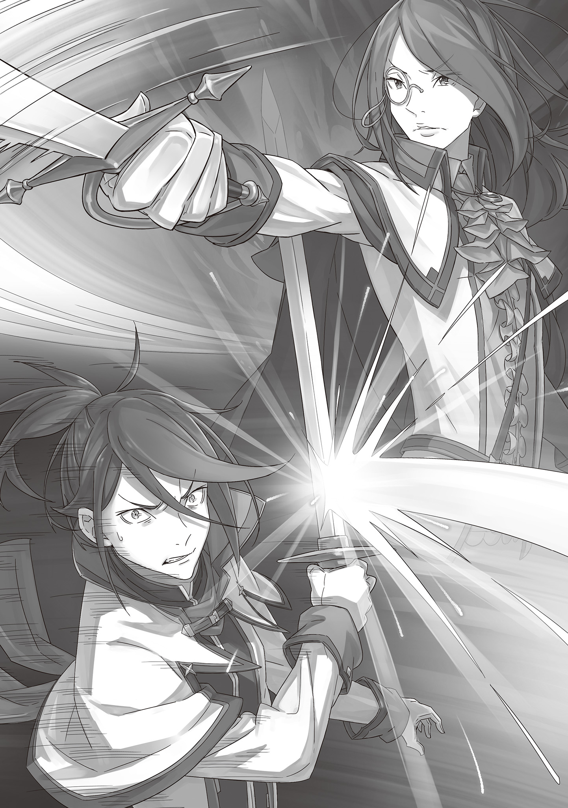
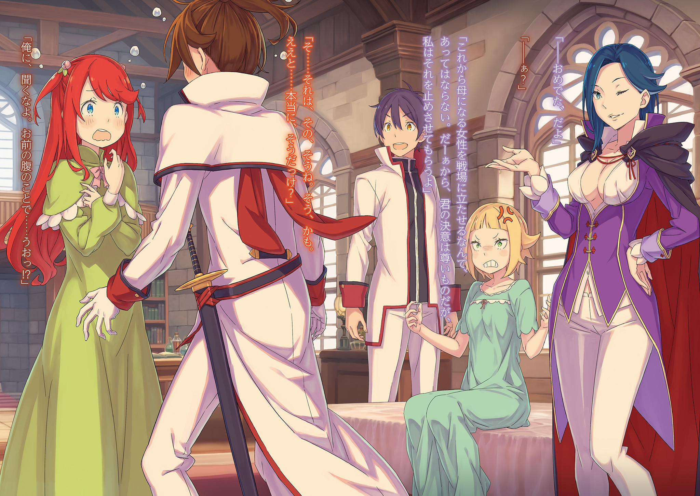

Объявление Бедствия

第二章 『二幕／宣禍』

× × ×

Главный зал, хранящий воспоминания о тёплых семейных вечерах, теперь пропитался ледяным напряжением поля боя.

— …

Вильгельм, стоявший у входа, сжал руку на рукояти меча. Его голубые глаза холодно сверкали боевым духом, но он помедлил мгновение, прежде чем обнажить клинок.

Поддаться рвущейся наружу враждебности и немедленно броситься в атаку было бы легко. Но слишком глупо.

Враг, которого следовало опасаться больше всего на свете, захватил его дом. Домочадцев, что должны были быть здесь, нигде не видно. В такой ситуации поддаваться гневу — последнее дело.

Прежде всего…

— Терезию… куда ты её дел?

Страйд небрежно развалился на диване, где они обычно сидели вдвоём с женой, и подпёр щёку рукой, оперевшись локтем о подлокотник. Воплощение самоуверенности, этот вестник бедствия, услышав вопрос Вильгельма, лишь выдохнул: «Ха».

Это была усмешка. Но полная удивления, разочарования и, в конечном счёте, презрения.

— Явился встретить Меня, и первый твой вопрос — о безопасности жены? Не похоже на рыцаря, что забрал меч у «Святой Меча», Защитницы Королевства, и кому теперь доверили его защиту. Какое легкомыслие.

— Похоже, в этот раз ты хоть немного разузнал о королевстве, в отличие от прошлого. Впрочем, результаты твоей учёбы оценят в тюремной камере. Где Терезия? Не заставляй меня повторять.

— Глупец, приказывать Мне — верх дерзости. Долго же ты добивался этой женщины, раз так отчаянно боишься её потерять? Настолько, что готов унять жгучую враждебность ко Мне, и продолжать этот пустой разговор?

— Ты кое-что неправильно понял, не находишь?

Страйд, не скрывавший своего презрения и насмешки, при этих словах удивлённо приподнял бровь. Он с интересом ожидал продолжения. Глядя прямо в лицо злодею, Вильгельм перевёл дыхание, выхватил рыцарский меч из ножен, направил остриё на врага и отчётливо произнёс:

— Ты заявился сюда без своего громилы. То, что твоя голова всё ещё на плечах, — заслуга не кого-то иного, а Терезии. Только её благополучие — твоя единственная надежда на жизнь. Твоя жизнь в руках Терезии. Не забывай об этом.

— …

От этой угрозы, полной неприкрытой враждебности и жажды убийства, Страйд впервые замолчал.

Не то чтобы его подавила аура меча Вильгельма, но и прежнего самодовольства в этом молчании не было. С первого взгляда не скажешь, но, скорее всего, это было… удивление.

Неожиданно. Застигнут врасплох. Впервые он увидел на лице Страйда что-то человеческое.

Разумеется, эта человечность была мимолётной. Лицо злодея тут же исказила дерзкая усмешка.

— Забавно… Как забавно, негодяй. Ха-ха, так это твоя женщина держит Мою жизнь в руках? Сказать такое в подобной ситуации может лишь отъявленный глупец или великий герой. К кому же из них относишься ты?

— К кому бы ни относился, скорость моего меча не изменится. Если не хочешь проверить это на своей шее…

Вильгельм уже собирался усилить свою ауру, чтобы изменить ход событий…

В этот самый миг…

— Пусть наши положения и различны, но чутьё на момент у нас, похоже, одинаковое.

— …!

На это высокомерное замечание Страйда Вильгельм не смог возразить.

Нужно было срочно отбивать атаки, надвигающиеся на него слева и справа. Звон стали о сталь эхом прокатился по залу, несколько клинков вонзились в пол и стены.

Чёрное стальное оружие… как раз то, что он видел недавно в таверне. Кунаи.

А значит, противники были…

— Синоби?!

— Ваше предположение истинно.

Чёрная тень, метавшаяся по залу во всех направлениях, ответила Вильгельму, отбившему летевшее оружие.

Используя стены и потолок как опору, не обращая внимания на верх и низ, его движения фундаментально отличались от стиля мечника вроде Вильгельма, идущего путём меча. Так вот на что способны синоби?

— Гру-ааааааа!!

Нельзя позволить себе быть игрушкой в руках столь стремительного противника.

Шагнув вперёд, Вильгельм обрушил шквал ударов меча на зал. Он разрушал опоры под ногами прыгающей тени, отсекал пути к отступлению, перекраивая поле боя под себя. Конечно, противник не оставался в долгу, перемежая свои движения ответными ударами и бросками кунаев, но…

— Дерзость!

— С этим господином сладу нет!

Если противник переходит в контратаку, это только на руку. Ответить ударом на удар.

Если техника синоби рвёт плоть и дробит кости, то его меч сожжёт их внутренности и разрубит души, жадно вырвав победу.

Вспышка меча. Противник пригнулся, уворачиваясь, но получил прямой удар ногой в грудь. Скрестив руки для защиты, враг отлетел спиной к стене. Вильгельм немедленно атаковал выпадом, но синоби, извернувшись в последний момент, уклонился. Лишь длинный шарф, опоздавший за хозяином, оказался пригвождён к стене, лишив чёрную тень подвижности.

— …

Проворная, или скорее хитрая, чёрная тень замерла, и Вильгельм наконец смог разглядеть противника.

Белые короткие волосы, тренированное, гибкое тело, облачённое в чёрное одеяние, рот прикрыт маской. Неожиданно юный облик привлёк внимание, но меч Вильгельма от этого не дрогнул.

Он уже замахнулся для горизонтального удара, намереваясь разрубить противника надвое… Как вдруг нога, которой он только что сильно топнул по полу, была чем-то схвачена.

— Кха!

В следующий миг, ощутив искажение пространства, Вильгельм получил удар ладонью синоби.

Он успел отдёрнуть меч и отбить удар рукоятью, но сила столкновения всё равно сотрясла рёбра и внутренние органы. Ужасающая мощь отбросила уже самого Вильгельма к противоположной стене.

Боевая техника… Ужасающее искусство синоби, отточенное немыслимыми тренировками. Его пробивная сила не только нанесла внешние повреждения, но и нарушила поток маны, циркулирующей в теле Вильгельма.

— Гха… ууу… кх!

Обычно мана циркулирует по телу воина неосознанно. Нарушение этого потока равносильно тому, чтобы забыть, как двигать руками и ногами, потерять хватку меча.

В битве, где каждое мгновение решает всё, такая заторможенность — смертельна…

— И это конец? Какое разочарование, я ожидал большего.

Насмешка ударила по Вильгельму, чья мана застыла, а конечности отказывались повиноваться боевому духу.

Холодная усмешка Страйда, всплывшая в сознании, была тут же затёрта улыбкой Терезии. Огонь… вспыхнул внутри.

— Оооооаааа!!

Вздрогнув плечами, он оторвал своё вдавленное в стену тело и яростно ринулся навстречу надвигающемуся синоби.

Первыми долетели два вида оружия: кунай, летящий прямо, и лезвие, летящее по дуге. Вильгельм смёл их минимальным движением и максимально эффективной вспышкой меча.

Но даже отбив их, он столкнулся с ещё более грозным оружием — атакой самого синоби.

Чтобы остановить её, Вильгельм с силой топнул ногой, едва не проломив половицу. В тот же миг то же самое скользкое ощущение обвило его лодыжку…

— …?!

Собрав все силы, он взмахнул ногой и вытащил из поверхности тени второго синоби, схватившего его за лодыжку. Магия или техника — неважно, он выдернул противника, прятавшегося в тени, на свет и швырнул его прямо перед первым атакующим синоби.

— Гру-гру-груааааа!!

В тот момент, когда оба синоби столкнулись, решающий удар Вильгельма, удар ва-банк, прочертил траекторию, разрубая обоих разом. Мощная отдача прошла по руке, отбрасывая двух синоби прочь.

Однако…

— Чёрт, какие живучие твари.

— Ничего не скажешь, поистине ужасающий господин.

— Воистину. Не ожидали, что дойдёт до такого.

Перед скривившимся от досады Вильгельмом стояли два синоби — как две капли воды похожие друг на друга, оба истекающие кровью из правой и левой руки соответственно, но сумевшие избежать разрубания надвое благодаря слаженной работе.

Похожие телосложением и чертами лица, они, вероятно, были братьями-близнецами. Их невероятная координация становилась понятной, если предположить, что она была врождённой.

В этот момент…

— Ясно. Даже вы, Мои «генералы», не ровня ему.

Обмен ударами, где на кону стояла жизнь, длился не более дюжины секунд, плотно насыщенных действием, так что и моргнуть было некогда.

Всё это время Страйд наблюдал за происходящим, словно наслаждаясь зрелищем, ни на йоту не изменив своей позы на диване. Было ли это результатом невероятного хладнокровия или же у него просто атрофировались чувства страха и напряжения, оставалось неясным.

— Похоже, чтобы сдержать тебя, придётся всё же вызвать «Восьмирукого». Досадно, но ты славно натренировался для того, кто не является марионеткой Наблюдателей. Хвалю.

— Хвалишь? Ты… что, чёрт возьми, ты задумал?

Стол разбит, осколки посуды, упавшей с опрокинутой полки, разбросаны по полу. Перед лицом этой разрухи, Вильгельм почувствовал не столько гнев, сколько отвращение к злодею, который размышлял и хвалил участников боя, словно их и не было рядом.

Пусть и против своей воли, он столкнулся с ним, обменялся словами, но всё равно не мог понять его.

Было бы проще, если бы он разговаривал со зверем, не понимающим слов. Но Страйд был не таков. Эта непостижимость, исходившая от него, таила в себе совершенно иную, омерзительную сущность.

Впечатление Вильгельма усугубляли мутные глаза Страйда.

— Приходится признать, твой вопрос глуп и выдаёт твою некомпетентность. Я уже ответил на него. Всё это — лишь забава.

— Ты серьёзно? Серьёзно творишь такое просто ради забавы, по своей прихоти?

— Глупости. С чего ты решил, что забава и прихоть — одно и то же? Забава становится по-настоящему захватывающей лишь тогда, когда она продумана, когда в неё вложены ум, время и усилия.

— …

Что бы он ни говорил, слова Страйда были для Вильгельма за гранью понимания — достаточной, чтобы «Демон Меча» решил, что пытаться понять его бессмысленно.

— Ваша светлость, просим вас более не провоцировать этого господина.

— Раны мои и брата нелёгкие. Мы не можем долго здесь оставаться.

Чувствуя, как нарастает холодная аура меча в повисшей тишине, двое синоби обратились к беспечному Страйду с предостережением.

Однако, вопреки их собственным словам, кровь из их глубоких ран уже остановилась. То ли они успели перевязать их, то ли использовали контроль тела, чтобы ускорить заживление, — в любом случае…

— Никто из вас троих отсюда живым не уйдёт.

Сколько ни говори, Страйд не выкажет ни капли сочувствия, чтобы сообщить о судьбе Терезии. Давать синоби время восстановить силы тоже опасно. Значит, атаковать нужно сейчас.

Но…

— Кстати, ты помнишь о Моих кольцах?

И снова слова злодея опередили движение Вильгельма. Как бы ни хотелось проигнорировать их и броситься в атаку, тема была выбрана слишком удачно, чтобы решиться на это.

Пока Вильгельм скрежетал зубами, Страйд поднял обе руки, демонстрируя их. На всех пальцах левой руки и четырёх пальцах правой были кольца — лишь мизинец правой руки был пуст.

Раньше на этом пустом мизинце было кольцо, называемое «Алый Мизинец», которое наложило проклятие на жизнь Бертоля, тестя Вильгельма и отца Терезии. В качестве трофея после победы в «Танце Серебряного Цветка» кольцо было уничтожено, и проклятие, терзавшее Бертоля, спало. Но сейчас перед ним было ещё девять колец такого же сияния. Увидев их вновь, Вильгельм затаил дыхание.

Страйд усмехнулся его реакции, и в тот же миг кольца на среднем и указательном пальцах его правой руки вспыхнули.

— «Нефритовый Указательный Палец» и «Янтарный Средний Палец». Считай их чем-то вроде прежнего «Алого Мизинца».

— Этими кольцами ты собираешься теперь наложить проклятие на меня?

— Была бы возможность проклинать кого угодно по своему желанию, это было бы забавно. Но даже у «Десяти Заповедей Гордыни» есть свои правила. У Меня нет замысла сковывать тебя проклятием. Просто подготовлюсь к грядущему дню.

— Что…

Он не успел договорить «ты несёшь». Раньше, чем он закончил фразу, двое синоби, до этого хранившие молчание, снова ринулись в атаку, действуя слаженно.

— Дерьмо! — рявкнул Вильгельм и вступил в бой с двумя синоби, атаковавшими его с кунаями в руках. С трудом отразив их первую зеркальную атаку, он заметил…

Глаза обоих синоби светились нефритовым и янтарным цветом — цветами колец. С помощью «Алого Мизинца» Страйд ограничил жизнь Бертоля проклятием. Похоже, так же, проклятиями колец, он подчинил себе этих двоих синоби.

— Они же твои товарищи!

— Ты не знаком с шахматной доской? У Меня нет странной привычки разглагольствовать о фигурах, заполняющих доску, как о товарищах. К тому же, добавлю…

— Что ещё?!

— Женщина, что была в особняке, спит наверху.

В этот миг у Вильгельма побелело в глазах. Вспышка меча отбросила синоби, несущих на себе проклятие колец.

Вынужденные сражаться, не боясь глубоких ран, вражеские фигуры были отброшены одним ударом. И тут же сверкающий росчерк клинка «Демона Меча» устремился прямо вперёд, к злобному лицу Страйда, намереваясь разрубить его пополам…

— …

За несколько мгновений до того, как серебряный клинок рассёк злодея, Вильгельм широко раскрыл глаза, ощутив внезапное чувство неладного. Причиной тому было карманное зеркальце, невесть откуда появившееся в руке Страйда. Он открыл крышку, и зеркальная поверхность повернулась к Вильгельму… В ней отражалось лицо незнакомой женщины.

— Действуй.

— Да, ваша светлость.

Седовласая женщина в зеркале, чьи веки были спокойно прикрыты, по приказу Страйда медленно открыла их. Зловещие глаза с узором, похожим на паутину, встретились с глазами Вильгельма.

Словно этот узор был настоящей сетью, ужас, готовый опутать всё, к чему прикоснётся, сковал всё его тело…

— Ваша светлость!

Преодолев сковывающий ужас, Вильгельм обрушил клинок на зеркальную поверхность, расколов её надвое. Но до жизни злодея, стоявшего за ней, остриё не достало — в последний момент рука синоби спасла его.

Схваченный за шиворот и оттащенный назад, Страйд оказался в стороне, а у его ног разбилось на осколки разрубленное зеркало.

— Вы слишком заигрались. Довольно.

На слова синоби, в последний миг спасшего Страйда от обнажённого клинка, сам злодей лишь фыркнул.

Глядя на Вильгельма, упустившего уникальный шанс, он промолвил:

— Подготовка завершена. Жди с нетерпением следующей встречи со Мною.

— С…

Прежде чем он успел выкрикнуть «Стойте!», быстро распространяющийся белый дым закрыл обзор.

Другой синоби, тот, что не спасал Страйда, бросил что-то на пол, создав дымовую завесу. Вихрь мечей немедленно пронёсся сквозь белый дым, но сталь не нашла цели.

Провели, как мальчишку. К тому же, если верить недавним словам Страйда, они успели добраться до Терезии ещё до возвращения Вильгельма…

— Ч-что здесь происходит?! Вильгельм! Ты здесь?!

— Терезия?

Вильгельм, скрежетащий зубами от нетерпения и ярости, удивлённо замер, услышав голос из-за пелены белого дыма. Он поспешно бросился на звук и увидел у входа в особняк, за пределами дымовой завесы, человеческую фигуру.

Две фигуры. Это были Терезия с широко раскрытыми глазами и Гримм.

— Терезия!

Увидев её, Вильгельм, не помня себя, бросился к ней и крепко обнял. Терезия издала: «Кья!» — но, оказавшись в его стальных объятиях, робко обняла в ответ.

— Я… я в порядке, успокойся, Вильгельм. Что… что случилось?

— Это я у тебя хотел спросить. Почему ты была снаружи?

— Почему? Мы с Гриммом ходили за покупками. А когда вернулись, увидели, как из особняка идёт белый дым…

Растерянно, но подробно Терезия ответила на вопрос Вильгельма. Он мельком взглянул на Гримма, стоявшего рядом, — тот глубоко кивнул, показывая, что ему нечего добавить.

Похоже, ядовитые клыки Страйда и его людей не коснулись Терезии. Осознав это, Вильгельм вздохнул с искренним облегчением…

— Нет. Тогда… женщина, о которой он говорил…

Если это был просто блеф, выдумка, чтобы вывести Вильгельма из равновесия, то проблемы нет.

Однако, имея дело с этим злодеем, такой оптимизм был бы непростительной глупостью.

— Второй этаж!

Лицо Вильгельма изменилось, и он крикнул так, что Терезия вздрогнула: «А?».

— …!

Вместо неё мгновенно отреагировал Гримм, почувствовавший неладное.

Будучи заместителем командира отряда, Гримм немедленно подчинился приказу командира и пулей бросился к лестнице на второй этаж. Вильгельм, потянув Терезию за руку, последовал за ним.

И там, в их спальне, расположенной прямо над главным залом…

— …Кха!

— Кэрол?!

Два крика вырвались одновременно при виде женщины, сидевшей на стуле посреди комнаты — это была Кэрол. В особняке оставалась не Терезия, а она.

Кэрол сидела с прямой спиной, закрыв глаза, словно спала. Руки и ноги были свободны, никаких следов связывания или внешних ран не было видно.

Учитывая вспыльчивый характер Кэрол, невозможно было представить, чтобы она так спокойно встретила Страйда и его людей.

— …рол! …Кэрол…

— Гримм, не делай ей больно! Нужно сначала перенести её на кровать…

Терезия остановила Гримма, который с бледным лицом тряс Кэрол за худые плечи, пытаясь её разбудить. Терезия взяла Кэрол за руку. Вильгельм и Гримм переглянулись и собрались поднять Кэрол, чтобы перенести её на постель. В этот момент…

— Леди… Терезия?

Длинные ресницы дрогнули, веки затрепетали, и тонкие губы прошептали её имя.

Терезия ахнула. Прямо перед ней медленно открылись глаза Кэрол. Зелёные зрачки несколько раз моргнули и наконец сфокусировались на Терезии.

— Кэрол? Ты в порядке? Ты меня узнаёшь?

— Я… что… Кажется, я проводила леди Терезию и Гримма… — пробормотала Кэрол, словно только что проснувшись. Но постепенно сознание прояснялось, и она, широко раскрыв глаза, воскликнула: — Точно! Тень качнулась, и в дом проникли злоумышленники! Те люди…

— Их уже нет. Я прогнал их… вернее, упустил.

— Вильгельм… Понятно. Но… раз вы и леди Терезия целы, то всё хорошо.

Вспомнив, что произошло перед потерей сознания, Кэрол ответила с досадой, но мужественно.

Её досада была понятна, но говорила она связно. Пусть её и оставили здесь таким странным образом, если с ней ничего не случилось, то это к лучшему. Так он подумал… и тут же…

— …эрол…

Гримм с облегчением на лице обратился к Кэрол, которая благополучно пришла в себя.

Он зашёл сзади, чтобы помочь перенести её на кровать. Кэрол, наконец заметив его присутствие, повернулась и открыла рот, чтобы назвать имя возлюбленного…

— Ай… кх… ух…

— Кэрол?! Кэрол!

Кэрол внезапно захрипела и вытаращила глаза. Гримм, изменившись в лице, закричал.

— Кэрол?! Что с тобой, держись!

— Что это, горло?

— Нет, не оно. Это не горло.

— Дыхание?!

Оттолкнув кричащую Терезию, Вильгельм схватил Кэрол за руки, которыми она царапала себе шею. Она металась, словно утопающий, — в её глазах читался ужас.

А ответ был ясно виден на её белой шее.

— Чёрный… след руки?

На шее Кэрол, где от её ногтей уже проступила кровь, ещё чётче выделялась чёрная отметина в форме ладони. Конечно, никакой реальной руки там не было. Тем не менее, Кэрол прямо сейчас задыхалась, сжимаемая невидимой рукой, оставившей этот след.

На мгновение в мозгу вспыхнула усмешка Страйда, и Вильгельм едва не потерял контроль от ярости…

— Вильгельм!

Голос вернул его к реальности. Вильгельм тут же подхватил Кэрол на руки. Он донесёт её быстрее и надёжнее, чем Терезия или Гримм.

Если это часть злого умысла Страйда, то полагаться нужно не на лечебницу, а на Розвааль. Остаётся лишь надеяться и рискнуть, веря, что она сможет помочь.

— Терезия! Гримм! Сообщите в замок! Я отнесу её к Розвааль…

— Кха… гхох…

— А?

Он уже собирался выбежать из спальни, громко скомандовав застывшим Терезии и Гримму, как его шаг замедлился. Кэрол, отчаянно боровшаяся за жизнь в его руках, закашлялась и сделала глубокий вдох.

Шея, которую только что сжимала чёрная отметина, освободилась от давления, и ей снова стало можно дышать.

— Ха… ха! Кх… гхох…

— Эй, дыхание вернулось?!

— Ах… да… Как-то… дышать… могу… Что… что это было…

Кэрол отвечала прерывисто, но опасность удушья миновала, и она могла говорить.

— К-Кэрол, ты правда в порядке?

— Да, леди Терезия, простите за беспокойство… Гримм, и ты прости.

Опираясь на руку Вильгельма, Кэрол самостоятельно встала и извинилась перед Терезией и Гриммом. Она всё ещё выглядела измученной, с глазами на мокром месте, но они оба покачали головами в ответ на её извинения.

Затем Гримм снова протянул руку, чтобы коснуться Кэрол…

— Стой, Гримм, не трогай.

Вильгельм, заметивший перемену, остановил Гримма, схватив его за запястье.

— Вильгельм? Что теперь?

— Шея.

Кратко ответил Вильгельм встревоженной Терезии. Услышав его ответ, Терезия посмотрела на Кэрол и тихо ахнула.

На шее Кэрол снова начала проступать чёрная отметина ладони.

Стоило Вильгельму отстранить руку Гримма, как отметина начала блекнуть. Но как только Гримм сделал шаг ближе, она вновь темнела, становясь зловещей…

— Идём к Розвааль.

Сказал Вильгельм, строя догадки о происходящем.

Разделяя общую тревогу и смятение, они направились к выходу, к единственной оставшейся надежде. Они шли, стараясь держать Гримма и Кэрол как можно дальше друг от друга.

— Всё будет хорошо, обязательно будет хорошо, Кэрол.

Терезия, вместо Гримма, взяла за руку Кэрол, свою служанку, которую любила как сестру. Она изо всех сил подбадривала её, пока они бежали навстречу хрупкой надежде.

Хотя все они смутно понимали, что надежда эта была эфемерна.

— То, что целью Страйда были ты и твоя супруга, теперь не вызывает сомнений.

Закончив осмотр места происшествия в разрушенном главном зале, Бордо произнёс эти слова, вызвав у Вильгельма приступ гнева.

Говорить такие очевидные вещи — пустая трата времени.

— Не надо так смотреть на юного господина. Вы и сами всё понимаете.

— Не надо так на меня смотреть. Мне и без твоих упрёков тошно от собственной глупости, аж внутренности кипят.

Должно быть, взгляд у него был убийственный. Услышав упрёк от Бордо и ещё одного голоса, Вильгельм потёр переносицу и пробормотал: «Прости». Это он просто сорвал злость. Возмущение, которое испытывал Бордо, чувствовал и сам Вильгельм.

Нападение средь бела дня на особняк Астрея в столице — полный позор для королевства.

— Если мне не показалось, синоби Страйда входили и выходили из теней. Если они могут уводить с собой других в тени, то в худшем случае они способны проникнуть даже в королевский замок.

— Немедленно примем меры. Но, говорят, техники этих синоби окутаны тайной. Как и в случае с магией во время Войны Полулюдей, у королевства полно пробелов в подобных специальных знаниях.

— Вот и пришло время платить по счетам за то, что полагались на Дракона и ленились заниматься самосовершенствованием.

— Нечего возразить. Особенно теперь, когда один-единственный злодей, действующий ради развлечения, может пошатнуть основы королевства.

Бордо провёл огромной рукой по своему широкому лбу, тяжело вздохнул и посмотрел в потолок. Вслед за ним Вильгельм тоже поднял взгляд… вернее, направил своё внимание на второй этаж.

Там, в спальне, Розвааль, с которой им удалось наконец встретиться, осматривала Кэрол. Терезия и Гримм находились рядом.

Странные симптомы пока что отступили, но…

— Как состояние мисс Кэрол?

— Она не лежит без сознания. Спокойно проходит осмотр. Повезло, что Розвааль оказалась в столице… Чёрт!

Ответив на вопрос, Вильгельм разозлился на собственные слова и пнул пол.

Он, видевший чёрную отметину на шее Кэрол, не имел права говорить «повезло». Особенно помня о душевной боли Терезии и Гримма.

Терезия и Гримм ушли за покупками, а Кэрол осталась в особняке одна, потому и стала жертвой. То, что Терезия и её спутник избежали беды, — чистая случайность.

— Нет. Действительно ли это случайность?

— Если начнёте об этом думать, то не будет конца. Если вы станете бояться противника, как какой-нибудь неуловимой Ведьмы, то только сыграете ему на руку.

— И без тебя знаю. Этот ублюдок — просто спятивший мерзавец.

— Успокойся, Вильгельм. Если ты вслед за Гриммом потеряешь самообладание, то только сыграешь ему на руку.

— На руку, на руку, чёрт… кх!

Вильгельм стряхнул руку Бордо, положившего её ему на плечо, чтобы успокоить, и выдохнул. Считать, что всё происходит по замыслу Страйда, — ошибка. Ведь Терезия и Гримм покинули особняк не по его указке, а благодаря Гримму.

Потому что один лишь Гримм предчувствовал это нападение Страйда.

Правда, у него не было никаких конкретных доказательств…

— Интуиция Гримма не раз нас спасала.

— Он, при всей своей скромности, на удивление осознавал свою интуицию. И сейчас он ужасно жалеет, что оставил Кэрол в особняке, решив сопровождать Терезию.

— Настолько сильна его гордость за вклад в отряд, надо полагать.

— …

Гримм, включая его интуицию, был незаменимой силой для отряда Зелгеф.

В некотором смысле, по своей стойкости Гримм был равен Вильгельму и Бордо, а может, и превосходил их. Страйд, намеренно или случайно, нанёс удар, который как нельзя лучше вывел Гримма из строя.

Как и советовали, не хотелось излишне бояться Страйда, словно он какая-то Ведьма. Но мысль о том, что даже случайность на его стороне, была досадна.

Хотелось бы, чтобы хоть какой-то попутный ветер подул и в их сторону…

— Прошу прощения за беспокойство в столь напряжённый момент, разрешите войти.

Неуместно легкомысленный голос прервал его размышления. Вильгельм обернулся ко входу в зал.

Посторонним вход в особняк был запрещён, только членам Рыцарского Корпуса. Однако атмосфера, исходившая от глуповато ухмыляющегося мужчины, была далека от рыцарской.

— Пришёл. Ничего, пропустите. Это я его позвал.

— Вот-вот, нас тут господин Бордо позвал. Извините за вторжение.

Рыцарь, попытавшийся остановить его, опустил меч. Мужчина с ухмылкой прошёл вперёд. Вильгельм, встречая его, сильно нахмурился от удивления и растерянности.

Увидев это, мужчина картинно всплеснул руками: «Ой-ой».

— Что такое, что такое? Неужели ты меня забыл? Если так, то ты слишком бесчувственный, братишка. Ты ведь жену себе нашёл только благодаря моему совету, да? Совету самого Орфея «Шестиязыкого».

— Не забыл. Именно потому, что не забыл, у меня такое лицо. Зачем пришёл, мошенник?

Мужчина, отвечавший с такой фамильярностью, хлопнул себя по лбу: «Хи-хи~».

Подобные театральные жесты ему удивительно шли. Стройный, высокий, с привлекательной внешностью и голосом, способным очаровать кого угодно, независимо от пола, — он был известным в королевстве мошенником, разбившим немало сердец. Орфей «Шестиязыкий».

С Вильгельмом они недолгое время провели вместе в Тюремной Башне, как сокамерники.

— Как видишь, здесь одни мужчины. Наверху есть три женщины, но им не до тебя.

— Какой ты холодный~. Неужели не знаешь, что именно когда у мужчины не всё гладко, женское сердце и кошелёк открываются легче всего?

— Серьёзно, зачем пришёл? Даже выйдя из тюрьмы, всё так же неисправимо обманываешь женщин?

— Именно, именно так. Только теперь я обманываю ради блага страны, понимаешь?

Орфей подмигнул, не меняя своей легкомысленной манеры. Раздражённый его бестолковыми ответами, Вильгельм уже собирался выставить его вон, но его остановил Бордо:

— Постой, постой. Я же сказал, это я его позвал. Более того, это ты мне его рекомендовал как полезного человека, Вильгельм. И действительно, язык у него подвешен и глаз намётан. Я его очень ценю.

— Его? Ты в своём уме?

— Понимаю, что сейчас суматоха и не до того, но рекомендателю не стоит так говорить. Как бы то ни было, я благодарен тебе и боссу Бордо.

— Хоть и не скажешь по нему, но он, похоже, на удивление порядочный парень.

— То ли хвалите, то ли нет. Весьма в духе юного господина, если можно так выразиться.

Орфей выглядел недовольным оценкой Бордо, но Вильгельм вздохнул и решил отбросить предвзятое мнение, основанное на их прошлых встречах, и взглянуть на него по-новому.

Задуматься о том, зачем Бордо позвал сюда этого проныру.

— Ты же не скажешь, что разбираешься в магии или проклятиях. Что ты умеешь?

— Как и раньше, всё, что я умею, — это красноречие. Этим своим языком я веду дела по всей столице… нет, по всему королевству. Люди, которые и слова не скажут чиновникам, запросто выкладывают всё, если подружиться с ними.

— Оправдываешь репутацию «Шестиязыкого». Есть результаты?

— Есть.

От этого краткого и ясного ответа Вильгельм широко раскрыл глаза. Орфей, предваряя свой рассказ, добавил: «Правда, результат не самый приятный».

— Я слышал, что эти ребята перемещаются с помощью теней. Уже одно это делает их противниками, против которых обычные правила погони не действуют. Но они же не живут в тенях, верно?

— Да… верно. Не думаю, что они настолько за гранью.

Вильгельм, потирая подбородок, ответил Орфею, вспоминая одно мгновение.

Во время последней схватки Страйд показал ему зеркало — скорее всего, это было то самое «Зеркало Связи», позволяющее разговаривать с теми, у кого есть такое же. Женщину, отразившуюся в нём, он не узнал, но у него была информация, которая могла помочь выводам Орфея.

— Женщина находилась не в тени, а в каком-то здании.

— Если женщину нельзя было вывести на место событий, её бы спрятали в безопасном месте. Если бы её можно было держать в тени, так бы и сделали. Значит, это не так.

— Я с этим согласен. Значит, им нужна база помимо теней, куда можно было бы отступать. Причём здесь, в Лугунике. Проще говоря…

— В королевстве есть те, кто помогает Страйду и его людям.

— Именно так, — подтвердил Орфей вывод Бордо, щёлкнув пальцами.

Действительно, как он и предупреждал, информация была из тех, что портит настроение. Мысль о том, что в родном королевстве есть предатели, сотрудничающие с этими злодеями.

— Предоставление информации и базы, обеспечение едой и одеждой… А если им ещё и помогают входить и выходить из столицы, то ситуация станет хуже некуда.

— К тому же, у них есть способ принуждать к повиновению даже несогласных, да?

Вильгельм видел, как Страйд подчинил себе двух синоби с помощью девяти колец на пальцах — тех, что он называл «Десятью Заповедями Гордыни». Кроме того, проклятие, сковавшее жизнь Бертоля, и чёрная отметина, мучающая Кэрол, — всё это, предположительно, было вызвано силой колец Страйда. Ситуации были одна другой мерзотнее и лишены всякой последовательности.

Что он может, а что нет? Не только его личность, но и его сила были слишком опасны.

— Босс, я продолжу расследование, но… Хочу попросить разрешения на одну вещь.

Обратился Орфей к задумавшимся Вильгельму и Бордо, подняв один палец. Бордо молчаливым взглядом побудил его продолжать. Орфей с серьёзным лицом сказал.

Это было…

— Разрешение на контакт со скрывающимися в разных местах остатками «Альянса Полулюдей» и, при необходимости, право на их допрос.

Бордо, забрав с собой Орфея, вернулся в замок, чтобы обсудить детали запрошенной операции.

На прощание он назойливо напомнил, чтобы ему немедленно сообщили о любых изменениях в состоянии Кэрол. Похоже, даже выслужившись, он не утратил дух командира отряда Зелгеф.

Для Бордо Кэрол, как и Вильгельм с Гриммом, была, несомненно, бесценным боевым товарищем, с которым он прошёл гражданскую войну.

— Думаю, сейчас вы испытываете такое же товарищеское чувство, как и юный господин.

— Заткнись. Трещишь без умолку, каждое слово бесит.

— Прошу прощения. Просто не могу удержаться от того, чтобы поучать молодёжь. Так было и при жизни.

— …

— О? Я пытался пошутить .

— Не смешно.

Вильгельм раздражённо скривил губы, глядя на собеседника, который невинно склонил голову набок.

После ухода Бордо и остальных, он приказал рыцарям, находившимся в зале, охранять окрестности и выпроводил их. Наконец-то появилось время, чтобы разобраться с очевидной проблемой — буквально очевидной — и обдумать контрмеры.

Именно, проблема, которую он видел перед собой. Это был…

— Пивот.

— Как-то странно, когда меня называют так официально. Редкая возможность для мёртвого и живого обменяться словами.

Сказал он, глядя на Вильгельма сквозь монокль на правом глазу. Каштановые длинные волосы, умное, проницательное лицо — на первый взгляд он производил холодное впечатление.

Однако, вопреки внешности, все в отряде Зелгеф, включая Вильгельма, знали, что в его груди билось сердце истинного рыцаря.

Этого учтивого на вид мужчину звали Пивот Арнанси. Заместитель Бордо во времена отряда Зелгеф, он погиб во время гражданской войны, и Вильгельм был свидетелем его смерти. Боевой товарищ.

То есть эта встреча была невозможна.

— Во время гражданской войны Ведьма использовала тайное искусство управления мертвецами. Возможно, моё нынешнее состояние как-то с этим связано?

— Та Ведьма не воскрешала мёртвых, а превращала трупы в кукол и играла ими. Ты сейчас не похож на куклу Ведьмы. Поэтому ты…

— …

Сложив руки за спиной, Пивот спокойно стоял напротив Вильгельма. Вильгельм опустил глаза.

Слова, оборвавшиеся на полуслове, застряли не потому, что он не мог собраться с мыслями. Наоборот. Именно потому, что всё было ясно, он и запнулся.

— Поэтому я?

— Ты точно умер, а мёртвые не возвращаются. Это просто обман.

— Весьма в вашем духе. Будь я слабее духом, этот словесный клинок мог бы лишить меня жизни. Впрочем, на самом деле меня лишил жизни не словесный, а настоящий клинок.

— …

— Даже бровью не повели. В этом весь Вильгельм Триас.

Пивот удовлетворённо кивнул дважды, трижды. Вильгельм стиснул зубы.

Во взгляде, голосе, манерах Пивота не было ни отчуждённости, ни враждебности к Вильгельму. Но что с того?

Пивот появился, а его голос стал слышен сразу после того, как Вильгельм прогнал Страйда и его людей.

То есть это, без сомнения, была «атака», оставленная тем злодеем.

Продолжать разговор с этим… чем-то… означало лишь тешить Страйда…

— Ты пришёл сюда сейчас, чтобы высказать мне свои обиды?

И всё же губы Вильгельма, его чувства жаждали диалога с Пивотом.

Видя колебания и смятение Вильгельма, Пивот пожал плечами: «Вовсе нет».

— Слова обиды… Как вы верно заметили, сейчас уже поздно. Даже если бы я явился к вам как призрак, я бы слишком сильно опоздал.

— Тогда зачем ты явился сейчас?

— Хм, хороший вопрос. Вильгельм, какова же моя цель?

— Откуда мне знать? Ты… разве ты был таким?

Почувствовав, что над ним издеваются, Вильгельм нахмурился и посмотрел на Пивота.

Как уже говорилось, за спокойной и сдержанной внешностью Пивота скрывалась компетентность, достаточная, чтобы управляться с Бордо, прозванным «Бешеным Псом». Он часто командовал вместо Бордо, который рвался на передовую, и провёл отряд через множество битв. Вильгельм, унаследовавший командование отрядом Зелгеф, даже сейчас учился у него заочно.

Но если отбросить его положение и способности…

— Разве мы были настолько близки, чтобы обсуждать впечатления друг о друге?

— …

— Мы провели вместе два года в одном отряде… Но наши отношения были чисто служебными. Мы не были настолько близки, чтобы называть друг друга друзьями.

— Верно. Поэтому мне и странно видеть тебя здесь, передо мной.

Они не были друзьями. Если верить его предыдущим словам, он не держал зла на Вильгельма.

Пивот перед ним, несомненно, был фантомом, который Вильгельм не должен был видеть. Если заставить его сражаться с этим фантомом было уловкой Страйда, то, может быть, стоит просто разрубить этот призрак…

— …Вильгельма! Не дайте ему умереть!!

В тот момент, когда эта мысль промелькнула в голове, мозг Вильгельма пронзил отчаянный крик, от которого, казалось, стыла кровь в жилах, — крик, услышанный им когда-то.

Во время Войны Полулюдей Пивот погиб, защищая Вильгельма от вражеского клинка.

Гнев, изумление и чувство потери того момента смешались, сбивая Вильгельма с толку. Схватившись за меч на поясе, он не мог решиться обнажить его против опасного, неуловимого призрака.

— Ах, вечно мне достаётся самая плохая карта.

Такой вздох достиг слуха Вильгельма, который стиснул зубы, не находя повода для атаки.

Пивот, поправляя монокль на правом глазу, медленно покачал головой. В его жесте и бормотании угадывался тот Пивот, что исполнял роль сдерживающей силы для необузданного отряда Зелгеф.

Произнеся эти слова, Пивот закрыл глаза, ища решение проблемы под сомкнутыми веками. И его предложения во многих ситуациях приводили отряд Зелгеф к победе и успеху.

Поэтому…

— …!

— Обнажили-таки.

Резкий звон стали о сталь и совершенно безразличный, будничный голос. Меч, который он так долго колебался обнажить, Вильгельм выхватил непроизвольно.

Чтобы отразить удар меча Пивота, целящегося ему в шею.

— Что… Что ты задумал?!

— Банально, но отвечу так. Какова же моя цель?

— Кх!

Прищурив один глаз, Пивот атаковал спокойным голосом, но его вспышки меча были острыми.

Фантом. Призрак. Никакой не мёртвый солдат, не имеющий здесь материального тела Пивот. Тогда что это за удары меча, что за отдача от отражённых атак?

С кем он сражается, ради чего скрестил мечи, чего он ждёт, стоя здесь?

— …

Мастерство Пивота перед ним, мягко говоря, не было выдающимся. Он владел стандартными воинскими приёмами, но сильно уступал настоящим мастерам. Разумеется, с Терезией, бывшей «Святой Меча», его и сравнивать было нельзя. Да и Вильгельм, одолевший её, мог бы сразить его меньше чем за пять секунд.

Но он не мог. Он только оборонялся, его теснили, и Вильгельм беспомощно…

— К сожалению, похоже, на этом всё.

После нескольких столкновений, когда их мечи скрестились в клинче, Пивот внезапно объявил это. На мгновение Вильгельм опешил, но тут же в глубине души вспыхнула ярость. Явиться сам по себе, махать мечом как вздумается, а потом самому же всё и закончить — это было слишком, слишком!

Скрестив мечи, отражаясь в клинках друг друга, Вильгельм взглядом выразил всё своё возмущение. Но Пивот лишь улыбнулся в ответ. Это была не холодная усмешка и не насмешка, а улыбка, которую трудно было описать.

— Вильгельм Триас. Следующий — ваш черёд.

— …

Смысл последующих слов стал непонятен, потому что спрашивать стало некого.

Противник, с которым он скрестил меч, исчез. Вильгельм цокнул языком, ощутив бессилие меча, рассекшего лишь воздух. Он вложил меч в ножны и вновь оглядел опустевший зал, повернувшись ко входу.

— Вильгельм.

Там стояла Терезия, глядя на него влажными глазами.

Затаив дыхание, Вильгельм понял причину внезапного исчезновения Пивота. Было ли ему неудобно или он сделал это из сочувствия к Вильгельму, разговаривавшему с пустотой, — он не знал.

В любом случае, рассказывать Терезии о фантоме Пивота он не собирался.

— Как осмотр Кэрол?

— Как раз сейчас узнаем. Вильгельм, ты тоже придёшь?

— Глупая, конечно приду. Не веди себя так странно. — ответил Вильгельм робко спросившей Терезии, подошёл и обнял её за плечи. Так, приобняв её, он направился на второй этаж, где проходил осмотр, попутно проверяя ощущения в руке.

В руке, державшей меч, не осталось никакого послевкусия от поединка с Пивотом.

— Если она коснётся любимого человека, то не сможет дышать. Можешь не сомневаться, именно такое проклятое ярмо наложил Страйд на Кэрол.

Розвааль объявила результаты осмотра, стоя вместе со всеми вокруг Кэрол, сидящей на постели.

Её слова подтверждали худшие опасения, и само это озвученное проклятие лишь подчёркивало злобу наложившего его чародея.

Запрет на прикосновение к любимым. Что ещё можно увидеть в этом, кроме чистой злобы?

— Когда он накладывал на меня проклятие, этот тип упомянул «Аметистовый Большой Палец».

Голос Кэрол, говорившей о собственном теле, звучал нарочито спокойно, но эта попытка сохранить самообладание казалась лишь болезненнее.

— Аметистовый… Большой Палец… Как «Алый Мизинец», которым сковали отца? — спросила помрачневшая Терезия.

— Следует полагать, что так. Вильгельм слышал, что он называл это «Десятью Заповедями Гордыни», верно? — Розвааль перевела взгляд на Вильгельма, стоявшего у стены со скрещёнными руками.

— Да, — кивнул он.

Мизинец — для Бертоля, указательный и средний пальцы — для двух сопровождавших его синоби, большой палец — для Кэрол. Похоже, проклятия Страйда соответствовали определённым пальцам.

Если грубо попытаться расшифровать эту закономерность…

— Значит, враг обладает десятью способами проклинать других по своему желанию, по одному на каждый палец. Нам известны четыре, но максимум их может быть ещё шесть.

— Если предположить, что «Восьмирукий» объединился со Страйдом под действием силы этих колец, то всё сходится. Они выглядели друзьями, но кто знает, как там на самом деле.

— Ясно-о. Но даже если так, остаётся ещё пять. Если только слова «Десять Заповедей Гордыни» — не обман, и он не заявит, что сюда включены и пальцы ног, хе-хе-е…

Неприятное предположение, но зная Страйда, нельзя было исключать и такого.

Тут в разговор Вильгельма и остальных вмешалась Терезия:

— Важнее другое!

Она села рядом с Кэрол на постель и, мягко обняв её за плечи, спросила:

— Разве нельзя ничего сделать? Это… это слишком ужасно! Я никогда не прощу!

— Я понимаю твои чувства. Прости. Моих сил недостаточно.

Розвааль смиренно извинилась, опустив свои разноцветные глаза. Терезия приглушённо вскрикнула, сожалея, что заставила её извиняться. На самом деле, вины Розвааль не было. Это понимали все присутствующие — кроме самой Розвааль.

Поэтому…

— Поднимите голову, госпожа Мейзерс.

— Кэрол…

— То, что я уступила врагу, — результат моей собственной слабости. По идее, если сил не хватает, платой должна быть жизнь. То, что этого не случилось, — не удача, а, вероятно, следствие высокомерия врага. За это я обязательно заставлю его заплатить.

В этих словах, обращённых к Розвааль, прозвучала вся несгибаемая сила воли Кэрол. Честно говоря, даже Вильгельм был поражён её стойкостью.

Легко представить, какое впечатление это произвело на Розвааль, которая слегка расширила глаза и выдохнула.

— Леди Терезия, вы тоже не переживайте так сильно. Кэрол ещё может сражаться. В отличие от случая господина Бертоля, если быть осторожной, это не помешает повседневной жизни.

— Осторожной? Да как можно!

— Если закрыть глаза на чувства, то можно сказать, что противник просчитался.

Теперь и Терезия лишилась дара речи от слов Кэрол.

Конечно, все понимали, что она хорохорится. Но Кэрол не уступит. Она будет упрямиться до конца и твёрдо настаивать, что никто не виноват.

И она права. Единственное несомненное зло здесь — это Страйд.

— …Аол…

Услышав этот зов, Кэрол, поочерёдно успокоившая Розвааль и Терезию, напряглась. Позвал её Гримм, до этого хранивший молчание, никак не связанное с его старой травмой горла.

Проклятие, терзающее Кэрол… объект этого проклятия — её любимый…

— Гримм…

Взгляды влюблённых, не способных прикоснуться друг к другу, встретились. Даже Кэрол, до этого державшаяся так стойко, увидев трагическое выражение на лице стоящего перед ней Гримма, заколебалась.

Но, назвав имя Гримма, она совершила нечто, удивившее всех. Медленно протянула ему свою руку.

Разумеется, этот жест поразил Вильгельма и остальных, а особенно Гримма.

Кэрол горько улыбнулась реакции своего возлюбленного, но тут же посерьёзнела.

— Гримм, надеюсь, ты не винишь себя?

— Это…

— Мы с тобой выполнили свой долг. Если бы это случилось с леди Терезией или Вильгельмом, вот тогда я бы не вынесла.

— …

— И то, что я должна сделать, уже решено. Уничтожить этот «Аметистовый Большой Палец» и заставить его ответить за содеянное. Своей рукой… если возможно, нашими руками.

Сказав это, Кэрол продолжала держать правую руку протянутой к Гримму. Он переводил взгляд с её руки на лицо, смотревшее на него, и затаил дыхание.

Прикосновение активирует проклятие, и чёрная отметина снова сдавит шею Кэрол.

Но даже так…

— …

Поняв её намерение, после секундного колебания Гримм взял Кэрол за руку.

Разумеется, проклятие тут же сработало, и на белой шее Кэрол уродливо проступила чёрная отметина. Но это не смогло помешать им двоим разделить свою решимость и подтвердить свои чувства друг к другу.

— …Кх… ха… ха-а. Видите? Вот так… Это всего лишь…

— Вовсе не «всего лишь». Совершенно несносные. И ты, и Гримм вечно лезете на рожон. Зачем терпеть такую боль?

— Но… это было не бессмысленно. Ведь правда?

Тяжело дыша, Кэрол улыбнулась Розвааль, которая осматривала её шею. Столкнувшись с таким нехарактерно воинственным настроем Кэрол, Розвааль наконец сдалась и криво усмехнулась.

Это была ненужная боль, но для Гримма и Кэрол это был необходимый ритуал. Понимая это, ни Розвааль, ни Вильгельм, ни Терезия не стали упрекать их в глупости.

Наоборот, это произвело сильное впечатление. И не только на Вильгельма.

— Вильгельм, мне нужно с тобой поговорить.

Терезия, стоявшая рядом с Кэрол, посмотрела на Вильгельма серьёзным взглядом. Увидев огонь решимости в её голубых глазах, Вильгельм прищурился.

Он примерно догадывался, что она скажет. Словно в подтверждение его мыслей…

— Наше важное обещание… Если я его нарушу, ты меня разлюбишь?

— Ты больше не «Святая Меча».

Не нужно было спрашивать, что означало упомянутое ею «обещание».

На неё саму охотятся, и к тому же ранили Кэрол. Терезия, с её обострённым чувством ответственности, состраданием и, самое главное, любовью к Кэрол, не та женщина, что сможет молча на это смотреть.

— Не может быть… Леди Терезия! Нельзя! Это… это уж слишком!

— Иуэлм…

На слова Вильгельма и Терезии отреагировали Кэрол и Гримм.

Кэрол попыталась остановить Терезию, потянув её за руку, а Гримм посмотрел на Вильгельма с серьёзным лицом. И это после того, как они сами только что провернули безрассудный ритуал.

Но даже если бы не это, никто бы не смог остановить её — «Святую Меча» Терезию ван Астрея. Вершину рыцарства, которую лишил меча «Демон Меча» Вильгельм Триас, а затем, по великодушию Его Величества Короля, и её статуса.

Сейчас она, ради своей лучшей подруги и члена семьи Кэрол, решила снова взять в руки меч…

— Прошу прощения, что прерываю вас в такой пылкий моме-е-ент.

— Госпожа Розвааль?

— Этот порыв, как женщина, я очень ценю-ю, но именно как женщина, я, похоже, должна вас остановить, хе-хе-е…

Розвааль хлопнула в ладоши, прервав разговор и привлекая к себе внимание всей комнаты. От её слов о том, что она «должна остановить», Терезия изящно нахмурила брови.

— «Как женщина»? Что это значит? Звучит очень тревожно…

— Тревожно, хм. Действительно, трудно подобрать подходящие слова для этого известия. Тем не менее, возвращать тебя сейчас в строй как «Святую Меча» было бы неправильно с моральной точки зрения.

— Хватит ходить вокруг да около. Что ты хочешь сказать?

Манера Розвааль говорить витиевато была обычной, но сейчас она раздражала Вильгельма сильнее обычного. Подавшись вперёд, он потребовал от неё прямого ответа.

В процессе изучения проклятия Кэрол Розвааль осмотрела и окружающих — Терезию, Гримма, Вильгельма. Если она обнаружила какую-то проблему у Терезии…

— Неужели этот ублюдок Страйд что-то…

— Поздравляю с прибавлением.

— А?

Вильгельм застыл, ошарашенный, не понимая смысла сказанных слов.

Что она только что сказала? Непонятно. «Поздравляю с прибавлением»…

— Э-э… Госпожа Розвааль, это значит…

— Прошу не путать это с названием какой-нибудь странной болезни, хе-хе-е~. Именно так, беременность, ожидание ребёнка. Ты была женщиной и женой. Но теперь ты ещё и мать, во-о-от.

Розвааль говорила спокойно, но в её голосе слышались тёплые нотки. Однако смысл её слов никак не доходил до сознания.

Не только до Вильгельма, но и до Терезии. Разинув рот, Терезия покачнулась, встала и, встретившись взглядом с застывшим Вильгельмом, так и осталась стоять.

Беременность… значит, она ждёт ребёнка. Кто? Терезия.

— Нельзя позволять будущей матери выходить на поле боя. Поэто-о-ому, хоть твоя решимость и достойна уважения, я её остановлю.

— Эт… Это, наверное, так. Да, возможно. Эм… Это… правда?

— У меня не спрашивай. Это же твой живот… Уох?!

Растерянная Терезия обратилась к нему с непонятным вопросом. Отвечая ей, сам пребывая в смятении, Вильгельм внезапно ощутил жажду убийства и отпрянул.

Мягкая подушка, прилетевшая с кровати, пронеслась мимо его носа. Однако, брошенная с сильной враждебностью, она превратилась в опасное оружие, способное нанести немалый урон при попадании. А бросила её женщина, дрожащая от гнева, с горящими глазами — Кэрол.

Сидя на кровати, она прожигала Вильгельма яростным взглядом зелёных глаз.

— Триас, негодяй! Что ты сделал, чтобы леди Терезия забеременела?!

— Не называй меня старой фамилией! Это звучит серьёзно, да и выглядит так, будто ты всерьёз!

— Я всерьёз! А ты, негодяй, хочешь сказать, что к леди Терезии относишься несерьёзно?!

— Как можно разговаривать с тем, кто тебя не слышит…

Вильгельм устало вздохнул от яростного напора Кэрол, потерявшей голову от гнева. Но именно этот запал и натиск и были сутью Кэрол Ремендис.

Это было гораздо лучше, чем если бы она впала в уныние или неестественно хорохорилась.

Помимо этого чувства…

— Вильгельм…

Он обернулся на дрожащий голос. Терезия стояла, прижав ладонь к животу. Там, под её ладонью, зародилась новая жизнь.

— …

Внезапно всё его тело пронзила дрожь. Вильгельм затаил дыхание от запоздалого осознания.

Они любили друг друга, стали мужем и женой. Конечно, он думал, что когда-нибудь их семья увеличится, но самонадеянно полагал, что это произойдёт ещё не скоро.

— Вильгельм.

Снова позвав его по имени, Терезия коснулась его щеки. Ощущая прикосновение её белых пальцев, Вильгельм заметил, что её рука дрожит.

Она была так же удивлена, растеряна и сбита с толку, как и он. Она столкнулась с той же проблемой и не знала, как быть, как с этим справиться.

И разделить эту проблему, пройти через это вместе мог лишь один человек в целом мире.

— Розвааль права. Я не позволю тебе взять в руки меч. Снова клянусь тебе в этом.

— В такое время…

— Я стану достаточно сильным, чтобы тебе не пришлось этого делать… Нет, я просто буду сильным.

Достаточно сильным, чтобы не проиграть ни Страйду, ни тем, кто ему пособничает, ни «Восьмирукому» Кургану.

Необходимая для этого сила и товарищи у Вильгельма сейчас должны быть.

— Леди Терезия…

— Кэрол… Прости меня. Я… я… Тебе так тяжело, а я в такое время…

Окликнутая, Терезия вздрогнула и попыталась извиниться перед Кэрол. Но Кэрол покачала головой и, сказав «Нет», добавила: — Это я должна извиниться за то, что так некрасиво потеряла контроль. Ведь на самом деле я должна была первой сказать вам, леди Терезия…

— Кэрол?

— Поздравляю вас с беременностью. Ваша Кэрол… по-настоящему счастлива.

— …

Терезия затаила дыхание, услышав поздравительные слова Кэрол, которая мужественно улыбалась.

Чувство вины не исчезнет. Время для переживаний обязательно ещё наступит.

Но в этот момент, только в этот момент…

Слова её служанки, с которой её связывала долгая и близкая дружба, словно сестёр… Только сейчас…

— Спасибо, Кэрол. Правда.

Ответить ей улыбкой… наверное, это было простительно.

— Итак, будущей матери нужно многое подготовить. Об этом я, как женщина, уже имевшая опыт родов, прочту лекцию вашим жёнам, а вот мужчин попрошу удалиться, хе-хе-е.

Выпроводив их такими словами, Розвааль заставила Вильгельма и Гримма покинуть спальню.

Пусть её манера говорить и была шутливой, Вильгельм доверял Розвааль, зная её отношения с Кэрол и то, что она не из тех, кто легкомысленно относится к жизни — за пять лет знакомства он в этом убедился.

Поэтому за происходящим в спальне он не беспокоился. Беспокойство вызывало то, что находилось за её пределами.

— Прости. Не вовремя всё это.

Сказал Вильгельм Гримму в коридоре, оставшись с ним наедине, так как этот разговор был не для спальни.

Гримм сначала удивлённо округлил глаза, а затем недоумённо нахмурился. Он не притворялся — похоже, он действительно не понимал, о чём речь.

— Я говорю как есть. Дать Терезии меч в руки — это возмутительно, но всё это случилось в такой тяжёлый для тебя и Кэрол момент. Не могу радоваться этому безоговорочно… гх!

— …ИУЭЛМ!

Вильгельм опустил глаза. Гримм схватил его за грудки и прижал спиной к стене.

Перед его лицом, когда он застонал от боли, в глазах Гримма горел гнев. Это был не гнев из-за сочувствия к его и Кэрол положению… нет.

Это был гнев, осуждающий отношение Вильгельма — отношение будущего отца.

Гнев из-за того, что он не мог безоговорочно радоваться беременности жены и зарождению новой жизни.

Даже сейчас он ставит других выше себя. Вот почему добрякам всегда достаётся.

— Ты… злишься не на то…

— ИУЭЛМ… ЧТО Ы ИЕЕ ИУ?

— Не чувствую… пока. И не готов ещё. Просто…

— ЧТО?

— …

Извинение, произнесённое осипшим голосом, оборвалось на полуслове. Вскоре Гримм отпустил его грудь.

Он услышал то, чего не должен был слышать, и взвалил на него непосильную ношу. Вильгельм понимал это, но слова извинения перед Гриммом так и не сорвались с его губ.

Не из-за какой-то мелкой гордости. Тогда что же ему мешало?

— Ты слаб в ситуациях, которые нельзя решить мечом. В этом твоя слабость. Верно, Вильгельм?

— …

За плечом Гримма Вильгельм увидел Пивота, прислонившегося к стене со скрещёнными руками. Ему показалось, что слова фантома насмехались над его душевными терзаниями.

Сможет ли «Демон Меча» с такими чувствами стать отцом? Он стиснул зубы так, что почувствовал во рту вкус крови.
