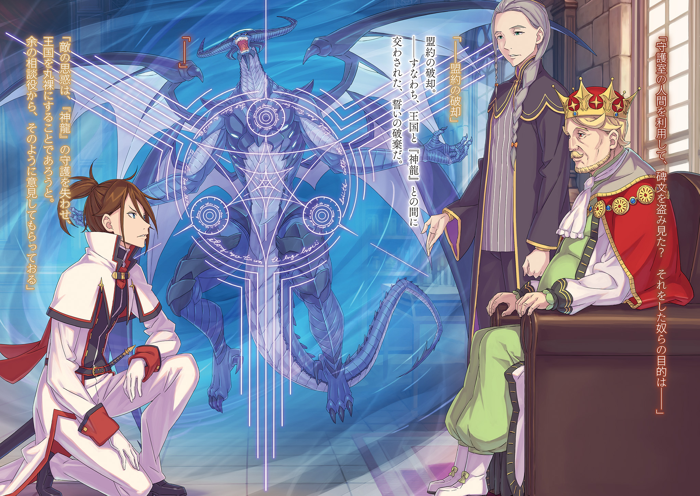

Сокрытие в Цветах

第三章 『三幕／潜花』

× × ×

— Терезия, Терезия, как ты? Тебе не холодно? Ты в порядке? А может, наоборот, слишком жарко? Если что-то беспокоит, не стесняйся, скажи своему папе что угодно. Пить не хочешь? Голодна? Точно! У тебя же была та любимая мягкая игрушка, помнишь? Как только я давал её тебе, ты сразу переставала плакать… Отлично, я сейчас же прикажу принести её!

— О-те-ц! — чётко разделяя слоги, проговорила Терезия, обращаясь к мужчине, который беспокойно метался по комнате — человеку, чьё совершенно неугомонное поведение противоречило его внушительным усам и элегантному наряду.

Она старалась вложить в голос как можно больше строгости, но тот лишь легко, словно танцуя, обернулся: — М? Что такое, Терезия! Сразу хочешь что-то сказать папе? Хм, я знаю. Я тоже люблю тебя, доченька.

— Отец, просто сядь, пожалуйста.

— «Просто сядь»? Папе немного обидно слышать такое…

— Сядь!

— Есть!

Лишь когда Терезия строго указала на стул рядом с кроватью, мужчина наконец послушался. Увидев его реакцию, Терезия, лежавшая в кровати, смогла наконец расслабленно откинуться на подушку.

Гостем Терезии, одетой в ночную рубашку, в её собственной спальне, был мужчина с такими же, как у неё, огненно-красными волосами и голубыми глазами — Бертоль Астрея. Вопреки своей бравой, невозмутимой внешности, он обладал весьма ранимой и мелочной натурой, а его безграничная любовь к дочери порождала неимоверную враждебность к зятю.

Бертоль, которого окружающие с лёгкой усмешкой обычно называли непоседой, в этот день вёл себя ещё более странно, чем обычно; его поведение откровенно напоминало повадки подозрительного типа.

Причиной тому был не он сам, а Терезия, которую буквально уложили в постель.

— Отец… Мне приятно, что ты беспокоишься, но от того, что ты пляшешь по спальне, толку никакого. К тому же, смотреть на это утомительно. Прошу, оставь меня в покое.

— А, так… Ну, да, ничего не поделаешь. Понял. Терезия, можешь положиться на папу. Оставлять в покое — это я умею. В особняке я часто слышу эту просьбу.

Бертоль несколько раз кивнул на спокойную, но на удивление настоятельную просьбу Терезии. Хоть он и бил себя в грудь, основания для его уверенности были довольно печальны, но Терезия из жалости к отцу не стала на это указывать.

К тому же, в случае Бертоля, даже если он молчал, тишины это не гарантировало.

— Отец, твой взгляд и твоё присутствие слишком громкие.

— Так мне теперь вообще ничего нельзя делать?! Это не жестоко?!

— Отец, ты шумишь.

— Уа-а!

Отвергнутый в проявлении всех своих отцовских чувств, уже немолодой Бертоль едва не расплакался. И в этот момент, к шумной парочке отца и дочери…

— Дорогой, Терезия ждёт ребёнка. Ты должен о ней как следует заботиться, — открыв дверь спальни и вмешавшись в их разговор, сказала красивая женщина с длинными светлыми льняными волосами — Тиша Астрея, родная мать Терезии.

При её появлении Терезия посмотрела на неё как на спасительницу: «Мама!..», а Бертоль, не желая мириться с услышанным, вскочил со стула.

— Что за слова, Тиша… Кто сейчас больше меня проявляет заботу о Терезии? Да никто… Никого нет…!

— Твоё старание говорить шёпотом — это, конечно, проявление заботы, но ты так бормочешь, что ничего не разобрать.

— Что-о-о? И это тоже нельзя?

— Не разобрать.

Хоть и жалоба, и изумление были произнесены шёпотом, шумное присутствие Бертоля ничуть не уменьшилось.

Как бы то ни было, появление Тиши было для Терезии спасением. В ответ на полный доверия взгляд дочери, Тиша изящным жестом указала на окно.

— Видишь, дорогой. Терезия, похоже, очень переживает за клумбу в саду. Разве это не забота отца — полить её вместо неё? Какой же ты недогадливый.

— Хм! Будто я этого не заметил! Просто я подумал, могу ли я ещё чем-то помочь… Эх, ладно, я иду! Смотри, какой заботливый у тебя отец!

Не успела Тиша договорить, как взъерошенный Бертоль пулей вылетел из спальни. Терезия удивлённо смотрела ему вслед, а Тиша удовлетворённо улыбнулась.

— Им так легко управлять… Какой он милый.

— Мама, ты и правда так умело управляешься с отцом…

— Секрет семейной жизни в том, чтобы жена крепко держала поводья мужа. Тебе тоже стоит постараться.

С этими словами Тиша села на стул, который только что освободил Бертоль. На слова старшей и опытной супруги Терезия ответила по-детски мило:

— Ха-а-ай.

Услышав её ответ, Тиша мягко усмехнулась:

— Совсем как ребёнок. Подумать только, ты станешь матерью, невероятно.

— Да… Я чувствую то же самое. Любовь, брак, дети… всё это казалось чем-то таким далёким… нет, не так…

— Ты думала, что тебе это не суждено?

— Да.

Тиша смогла облечь в слова те чувства, которые Терезия не могла выразить, и это вызывало восхищение.

Во всех смыслах Тиша была для Терезии примером и идеалом. Её женственность, её путь жены — гармоничная супружеская жизнь родителей была воплощением мечты.

Смогут ли они с Вильгельмом пройти тот же путь, что и Тиша с Бертолем?

— Не волнуйся, Терезия. Вильгельм, в отличие от него , спокоен и основателен, не так ли?

— Если сравнивать с отцом, то, возможно, даже младенец, который родится, будет спокойнее.

— Не могу сказать, что ты преувеличиваешь. Для этого человека мир всегда свеж и нов.

Прикрыв рот рукой, Тиша с нежностью говорила о Бертоле. Терезия тоже улыбнулась, а затем тихонько погладила свой слегка округлившийся живот.

Прошло уже три месяца с тех пор, как стало известно о беременности Терезии.

Честно говоря, обстоятельства, при которых беременность была обнаружена, были таковы, что искренне радоваться этому факту сразу было сложно. Но со временем осознание постепенно приходило.

Ведь ребёнок в животе рос и развивался, не дожидаясь, пока Терезия будет морально готова. Когда телесные изменения опережают готовность душевную, сердцу ничего не остаётся, кроме как поспешить за ними.

Благодаря этому удавалось как-то справляться с различными проблемами, связанными с подготовкой к беременности и родам.

К счастью, окружающие проявляли большую заботу. Родители, беспокоясь о любимой дочери, часто приезжали в столицу и хлопотали ради своего первого внука. Правда, от предложения Его Величества Короля устроить пышное празднование в честь этого события на государственном уровне пришлось решительно отказаться. Говорили, что Его Величество присутствовал инкогнито на свадьбе Терезии и Вильгельма и был так растроган, что потом сожалел, что не сделал это событие государственным мероприятием.

Это было так похоже на Его Величество Гиониса Лугуника, известного своей безграничной добротой.

Терезии действительно повезло и с семьёй, и с мужем, и с соседями.

Именно поэтому…

— Перестань винить себя из-за Кэрол, Терезия.

— Мама.

— Да, я твоя мама. И поэтому я понимаю, о чём ты думаешь и какое чувство вины испытываешь. Уверена, твой отец чувствует то же самое.

Тиша нежно накрыла её руку своей, и Терезия, не в силах ничего сказать, опустила глаза.

Мать была права. Хотя Бертоль ежедневно демонстрировал поразительную недогадливость в самых разных областях, в самые важные моменты отец никогда не упускал сути. Тем более, когда дело касалось его любимой дочери и Кэрол, которая была ему почти как дочь.

— В том несчастье, что случилось с Кэрол, нет ни твоей вины, ни вины Вильгельма. Сколько бы я ни повторяла это, ты всё равно будешь переживать, верно?

— Мама, тебе не перечить…

— Какое же ты трудное дитя. Хоть бы наполовину так же просто смотрела на вещи, как он.

— Мама, ты это серьёзно?

— Шучу. Я люблю его, но если бы и ты стала такой же, как он, мне было бы очень неловко перед Вильгельмом.

Шутливые слова матери заставили Терезию слегка улыбнуться. Но сил на настоящую улыбку не хватило. Заметив это, Тиша вздохнула:

— Терезия, мы с твоим отцом, как родители, сделаем для тебя всё возможное. То же самое, конечно, касается и Кэрол. Но в конце концов, вам самим придётся постараться.

— В конце концов…

— Размышляй, думай, пока не придёшь к какому-то выводу. Советуйся со мной или с кем угодно. И обязательно поговори с Вильгельмом. Любую проблему решайте вместе, как супруги.

Всё ещё держа её руку, Тиша передала ей эти слова, и Терезия бережно впитала их в себя.

Она чувствовала, что узнала нечто действительно, действительно важное. Возможно, это и был секрет идеальных, по её мнению, отношений между Тишей и Бертолем.

Храня это в сердце, Терезия свободной рукой коснулась живота, ощущая присутствие ребёнка.

Она хотела сделать всё возможное, чтобы всем сердцем благословить эту жизнь, что зародилась в ней. Даже если для этого придётся прибегнуть к тому, что она так ненавидела и от чего так старалась отдалиться — к титулу «Святая Меча».

— Действительно, трудное ты дитя, — прошептала Тиша одними губами, глядя на хрупкий профиль любимой дочери.

— … — застёгивая пуговицы на рубашке, Кэрол невольно вздохнула. Она поняла, что это было ошибкой, слишком поздно — собеседница услышала её и криво усмехнулась.

— Когда на меня так явно не возлагают надежд, мне тоже становится тягостно на ду-у-уше.

— Прошу прощения. Я ведь полагаюсь на вашу доброту, леди Мейзерс.

— Но воспринимать это т-а-ак мне тоже совершенно не по душе. Впрочем, виновата моя манера говорить, полага-а-ю. Мне тоже жаль.

Розвааль пожала плечами и извинилась с обезоруживающей лёгкостью. Кэрол слабо улыбнулась.

Это извинение было проявлением заботы со стороны Розвааль. Она свела к ничьей вопиющую невежливость Кэрол, и от этого чувство вины последней лишь росло.

Они находились в одной из комнат каменной башни на территории королевского замка Лугуники, отведённой для магических исследований.

На территории замка была и тюремная башня для содержания заключённых, но эта, парная ей, была закрыта более десяти лет. Однако после Войны Полулюдей, когда Розвааль убедила всех в необходимости пересмотреть важность магии, Его Величество Гионис отдал башню ей под исследовательскую лабораторию.

С тех пор под руководством Розвааль в башне днём и ночью велись магические исследования. Кэрол тоже неоднократно приходила сюда в поисках способа снять наложенное на неё проклятие.

— Только в этом месте у нас есть время для тайных встреч наедине, куда никто не посмеет вмешаться, так ведь?

— Почему вы говорите так, чтобы вызвать пересуды? Мы же просто просим никого не беспокоить, потому что опасность проклятия неясна.

— Какая ты всё-таки непристу-у-упная. Мы знакомы уже пять лет, а ты ничуть не стала ближе.

— Пожалуйста, не смущайте меня. Я могу забыть о своём положении и неправильно вас понять.

— А я бы нисколько не возража-а-ала, если бы ты это сделала.

Розвааль подмигнула ей одним глазом, её озорной голубой глаз смотрел прямо на Кэрол. Та не знала, что ответить, и смогла лишь изобразить неопределённую улыбку.

Однако слова Розвааль не были совсем уж далеки от истины… Они были знакомы уже пять лет. Кэрол и сама не заметила, как прониклась к Розвааль искренней симпатией.

Это была симпатия не только как к боевой подруге, с которой они вместе сражались и выжили в Войне Полулюдей.

Каждый раз, осознавая это, Кэрол корила себя за непочтительность.

— Как бы то ни было, вот результаты обследования, на которые ты не особо надеялась. Хорошие новости и плохие новости — с каких начать?

— Хорошие новости — ухудшения нет. Плохие новости — способ снять проклятие можно узнать только у самого Страйда, верно?

— Вот те н-а-а, не отбирай мою роль. Хотела бы я так сказать, но это моя оплошность, что я не могу сообщить ничего другого.

— Я не это имела в виду…

— Ты перестала злиться, Кэрол.

От этих внезапных слов Кэрол удивлённо заморгала: — А?

Сначала она подумала, что это очередная злая шутка Розвааль, но та смотрела на неё прямо своими разноцветными глазами с серьёзным выражением лица.

Поэтому Кэрол восприняла замечание о том, что она перестала злиться, всерьёз.

— Я осознаю, что раньше была слишком напряжена и часто повышала голос. Это не оправдание, но когда я только познакомилась с леди Мейзерс, я была ещё молода и позволяла себе много вольностей.

— Я не пытаюсь заставить тебя раскаиваться. Мне нравилась и та ты, которая часто краснела и кричала от гнева. Ты часто конфликтовала с Вильгельмом, помнишь?

— С Вильгельмом я и сейчас конфликтую… К моему стыду.

Не понимая, к чему клонит Розвааль, Кэрол растерянно подыгрывала ей.

Хотя Розвааль любила говорить намёками и намеренно сложными фразами, Кэрол была уверена, что та никогда не делает ничего совершенно бессмысленного. Она также знала, что Розвааль сильно винит себя за то, что не может найти эффективного способа снять её проклятие.

И раз уж Розвааль ищет диалога, Кэрол ответит ей со всей искренностью.

— Я уже не девочка-подросток. Я не могу больше устраивать истерики, как раньше, и причинять леди Терезии ещё больше беспокойства…

— Даже при том, что причина твоих нынешних страданий — именно леди Терезия?

— …

Кэрол затаила дыхание от этих тихих, холодных, даже гневных слов.

На мгновение она подумала, что ослышалась, и широко раскрыла глаза. Розвааль подняла один палец: — Послушай. Скажу прямо. Причина проклятия, наложенного на тебя, кроется в ней. Разумеется, истинным злом следует считать наложившего проклятие Страйда, но именно она стала мишенью такого опасного человека и, как следствие, втянула тебя в это. Вина, несомненно, лежит на ней.

— Ч-что вы…

— Какая глупость. Или ты просто намеренно отворачиваешься? Это не доброта, а просто потакание и отказ думать. Страдаешь ты, а не леди Терезия.

— Прекратите! — Кэрол вскочила на ноги и яростно посмотрела на Розвааль, изрекавшую безжалостные слова. — Почему… почему вы так говорите?! Леди Терезия ни в чём не виновата! Она так долго, так долго страдала! Поэтому дальше у неё должно быть только счастье. А вы!

— Она — это не ты. Каждый должен стремиться к своему максимальному счастью. Способность желать счастья другим после того, как обрёл собственное — вот что можно назвать добродетелью. Твой подход неправилен.

— Я… пф!

Сухие слова ранили, и глаза Кэрол защипало от подступающих слёз.

Почему она должна спорить об этом с Розвааль? Почему она должна обрушивать свой гнев на Розвааль, к которой только что снова почувствовала симпатию, из-за Терезии? И тут, в глубине сознания, охваченного страстью, что-то показалось ей странным.

Да, Розвааль бывала нелогичной, но не абсурдной…

— Леди Мейзерс, вы случайно… не испытываете меня?

— Ой, раскусила?

Внезапно суровое выражение лица Розвааль исчезло, и напряжённая атмосфера в комнате рассеялась. Кэрол растерянно заморгала, глядя на её беззаботный вид.

— Прости, прости, я перегнула палку, винова-а-ата. Я не то чтобы проверяла твою преданность, но то, что намеренно пыталась тебя разозлить — это правда. Прими мои искренние извинения.

— Почему вы так поступили?

— Похоже, ты проглотила бесчисленное количество слов, которые хотела сказать.

Кэрол несколько раз глубоко вздохнула, пытаясь сохранить спокойствие. Розвааль оценила её усилия, села на стул, закинув ногу на ногу, и жестом предложила Кэрол тоже сесть.

Затем…

— Я пыталась разозлить тебя. И ты, как я и ожидала, разозлилась. Этому я безмерно рада и чувствую облегчение.

— Радость — это понятно, но облегчение?

— Скорее, облегчение даже сильнее. Я знаю это по собственному опыту… когда сердце сломлено, когда человек погружается в отчаяние и смирение, он прежде всего перестаёт злиться.

— Это…

— Уже три месяца нет никаких результатов. Как ты и предсказала сегодняшние результаты, никакого прогресса нет. И при этом ты не показала ни разочарования, ни уныния.

— …

— Отчаяние легко ломает человеческое сердце… В каком-то смысле, это страшнее проклятия.

Эти слова прозвучали с огромной тяжестью личного опыта и убедительностью.

Потрясённая серьёзностью тона Розвааль, Кэрол поняла, что не может ей возразить. Действительно, результаты обследования не вызывали у неё ни радости, ни печали. Она просто считала, что ничего не произойдёт — ни случайной удачи, ни неизбежной беды.

Чем это отличается от отчаяния или смирения?

— Поэтому вы хотели меня разозлить? Ради этого даже выставили себя злодейкой?

— Это быстрее и надёжнее, чем искать причину для гнева где-то на стороне. К счастью, я знаю, что твоё слабое место — леди Терезия. Тебя ведь это разозлило, правда?

— Да, разозлило. Но не только потому, что вы плохо отозвались о леди Терезии… Но и потому, что вы, леди Мейзерс, попытались использовать моё доверие.

— Доверие?

— Не делайте вид, будто впервые слышите. Я разозлюсь ещё сильнее.

Кэрол бросила на моргающую Розвааль недовольный взгляд.

Розвааль легко сближалась с людьми и со всеми вела себя фамильярно, но в решающий момент ей было трудно понять чувства другого человека. Поэтому она так легко могла выбрать роль злодейки.

— Вы жаловались, что я не веду себя непринуждённо. Если вы несерьёзно, не говорите таких вещей так легкомысленно. Из-за этого…

— Из-за этого?

— Я не решаюсь думать, что мы с леди Мейзерс стали близки… как друзья.

Произнеся эти слова, на которые потребовалась смелость, Кэрол невольно отвела взгляд.

Это была самонадеянная мысль, которая могла показаться дерзостью, и ей было трудно сказать это, глядя Розвааль в лицо. Но понимая, что убегать было бы трусостью, она робко подняла глаза и увидела…

— … — Розвааль J. Мейзерс застыла с весьма многозначительным выражением лица.

— Л-леди Мейзерс?

— Да, верно… Неожиданные слова заставили меня растеряться.

— Неужели настолько неожиданные?!

— На самом деле, меня редко оценивают без учёта происхождения, внешности или пользы, которую я могу принести.

Оправившись от первоначального шока, Розвааль вернулась к своей обычной манере общения.

Кэрол ещё не совсем пришла в себя, но Розвааль, не обращая внимания на её состояние, тихо склонила голову.

— Прости. Я думала об этом, но не нашла другого способа отреагировать на твои слова. Но я сделала это потому, что считала необходимым, а не потому, что пренебрегала тобой…

— Д-достаточно. Я поняла, что извиняться вам непривычно, леди Мейзерс.

— Но…

— Вы один раз искренне склонили голову. Мне этого достаточно.

Кэрол протянула руку и взяла руку Розвааль, которая выглядела немного потерянной.

Для неё это был решительный шаг, но когда Терезия сделала то же самое для неё, Кэрол почувствовала себя спасённой и поняла, что ей доверяют. Она хотела передать это чувство.

— Леди Мейзерс, я буду злиться. Буду плакать. Буду смеяться, хоть и плохо у меня это получается. Я никогда не сдамся и не отпущу эти чувства. Так ведь правильно?

— Да, так правильно. Если хочешь, можешь ругать меня сколько угодно за то, что я не добилась никаких результатов, я собиралась это предложить, но, пожалуй, не ст-о-о-оит.

— Мудро. Хотя до этого вы были не слишком мудры.

Забота Розвааль, которая хотела дать Кэрол выход гневу на несправедливость, была приятна. Но если ей нужны были проявления эмоций…

— Ведь это может быть и радость, а не только гнев? Мне бы так хотелось.

— Разозлить эффективнее, чем рассмеши-и-ить…

— Леди Мейзерс.

Она намеренно строго назвала её имя, и Розвааль тихо ответила «да», пожав плечами. Эта редкая сцена вызвала у Кэрол улыбку — вот доказательство того, что рассмешить не так уж и сложно.

— Если позволите, расскажите мне о рождении вашего сына… Карла? Это наверняка пригодится леди Терезии.

— То есть ты предпочитаешь леди Терезию своей подруге?

— Не начинайте усложнять всё, пожалуйста.

На шутливые слова Розвааль Кэрол ответила, растянув губы в улыбке.

Я могу смеяться. Я смеюсь. С этим осознанием Кэрол подавила растущее чувство вины и закрыла глаза.

Находясь под проклятием, в эпицентре усилий многих людей, пытающихся ей помочь, она считала, что смеяться, злиться или плакать нельзя, но…

— Гримм. Пожалуйста, будь в безопасности, — молилась Кэрол за своего возлюбленного, который, возможно, боролся с чувством вины ещё сильнее, чем она сама.

— Что за своеволие. Хорошо ещё, что противники были слабаками.

— …

— Ты решил, что справишься в одиночку, да? Да уж, чутьё у тебя хорошее… Чёрт, ты ведь и правда справился. Трудно придраться.

Вильгельм раздражённо взъерошил волосы, услышав безмолвный протест идущего рядом Гримма, и цыкнул языком.

За их спинами бойцы отряда Зелгефа беспрерывно входили и выходили из таверны с упавшей вывеской. Они выводили изнутри избитых мужчин и уводили их прочь.

Всё это были головорезы, которые отказались сотрудничать с Гриммом, когда тот пришёл за информацией, и были избиты им в гневе. Их было не меньше двадцати, но даже полсотни таких уличных бандитов не были бы для Гримма проблемой. Он и сам остался невредим.

Впрочем, несмотря на это, долг командира отряда — отчитать его за перегибы.

Сейчас Вильгельм и остальные находились в Абиате, городе на юге Лугуники. Цель — проверить достоверность информации о том, что в окрестностях была замечена группировка Страйда.

Даже после нападения на особняк Астрея в столице, банда Страйда продолжала свои тёмные дела в королевстве.

Возможно, благодаря технике перемещения в тени, которую видел и Вильгельм, или силе неизвестных сообщников Страйда, врагов часто замечали, но им удавалось ускользать, не оставляя следов, и поймать их никак не получалось.

В итоге, схваченные головорезы оказались лишь мелкими сошками, которым заплатили за предоставление убежища. Они не знали ни о целях Страйда, ни даже о малейших деталях его планов.

Их просто водили за нос. …Понятно, почему раздосадованный Гримм так разозлился.

— Вспоминаются времена, когда мы преследовали трёх гигантов, возглавлявших Альянс Полулюдей во время гражданской войны. По правде говоря, по части доставленных хлопот он может сравниться с Валгой Кромвелем. Помните?

— Разве такое забудешь? Ты ведь умер из-за его уловки.

— Верно. Это был немного недобрый вопрос с моей стороны.

Вильгельм фыркнул на призрак Пивота — худощавого мужчины, который смежил веки и пожал плечами.

С тех пор, как после стычки со Страйдом в особняке призрак Пивота остался на краю сознания Вильгельма, прошло уже три месяца. Учитывая, что он постоянно покидал столицу, преследуя Страйда, за эти три месяца он виделся с Пивотом чаще, чем с Терезией.

— Как подумаю об этом, так и хочется прирезать тебя от злости.

— Если можете — пожалуйста. Но, к сожалению, нынешнего меня угрозами не проймёшь. Если бы это было так легко, вы бы не тянули три месяца.

— Заткнись. Сейчас я по горло занят заботами о Гримме.

Не скрывая раздражения, Вильгельм намеренно проигнорировал кривую усмешку Пивота.

Он осознавал, что разговаривать с призраком Пивота — это ненормально.

С мёртвыми нельзя разговаривать, а слухи о существовании душ умерших, «пустот», не заслуживало доверия. Однако Вильгельм не мог избавиться от этого призрачного Пивота и даже ценил его как советника, дающего объективные оценки.

Обычно эту роль выполнял Гримм, но сейчас ожидать от него этого было бы жестоко.

— …

Гримм слегка осунулся, но его глаза горели лихорадочным огнём — он явно был не в себе.

Он плохо спал по ночам, постоянно был начеку, не давая себе ни минуты отдыха. При этом он бросался в самую гущу опасности, словно ища наказания и истязая себя.

Это было опасно. Рискованно. Сколько бы Гримм ни страдал, это не могло искупить ситуацию, в которой оказалась Кэрол, да и Гримму не за что было искупать вину.

— Впрочем, Вильгельм, и вас нельзя назвать образцом спокойствия. Вы уже некоторое время не виделись с супругой. Не беспокоитесь о жене, которая ждёт ребёнка?

— Сейчас за ней присматривают её мать и отец. А Кэрол… пока она не контактирует с Гриммом, может жить как обычно.

— Это причина, по которой с леди Терезией всё в порядке, но не причина, по которой вы не должны беспокоиться. Это разные вещи, хоть и похожие. Вы ведь и без моих слов это понимаете, верно?

На саркастичные слова Пивота Вильгельм, хоть и разозлился, но не возразил.

Прошло три месяца с тех пор, как стало известно о беременности Терезии. Та решимость, которую он так неловко не смог обрести в тот день, до сих пор не окрепла… Имел ли он право на это?

Имел ли право Вильгельм, который был всего лишь мечом, стать чьим-то отцом?

— Вильге-эм?

Гримм, обернувшись, с недоумением посмотрел на Вильгельма, который внезапно остановился.

Если даже Гримм в таком состоянии начал за него беспокоиться, значит, дела Вильгельма плохи. Если командир и его заместитель в таком духе, то за отряд Зелгефа можно серьёзно опасаться.

Так не пойдёт , решил Вильгельм и уже собирался сказать Гримму: «Ничего особенного».

Но прежде чем он успел это сделать…

— Вильгельм! Гримм!

— Конвуд?

Услышав резкий оклик, Вильгельм и Гримм одновременно подняли головы. С другого конца улицы к ним бежал Конвуд Мелахау, ветеран отряда Зелгефа.

Конвуд командовал другим подразделением и должен был патрулировать противоположную часть города. Увидев, что он прибежал лично, Вильгельм на мгновение напрягся, подумав, что с отрядом что-то случилось. Но Конвуд, заметив изменение в их лицах, поднял руку:

— Погодите, погодите… Не делайте поспешных выводов. Это не известие о враге и не сообщение о чрезвычайной ситуации. Хотя… дело срочное, наверное?

— Не говори загадками и не делай выводов сам за себя. Как у вас дела?

— Командира и заместителя не было, но врага подавили с минимальными потерями. Итак, к делу. Из столицы прибыл человек из «Шести Языков». Говорит, есть разговор.

— Орфей.

На сарказм отдавшего честь Конвуда Гримм виновато отвёл глаза. Умение Конвуда вот так, невзначай, отпускать подобные шутливые замечания говорило о его компетентности.

Краем глаза заметив это, Вильгельм подумал об организации Орфея, «Шести Языках», которая незаметно стала частью королевской разведки. Именно Вильгельм порекомендовал его Бордо как способного человека, но его работа превзошла все ожидания.

Информацию о появлении банды Страйда в Абиате тоже раздобыли «Шесть Языков». Хотя они и шли по пятам, но не давали врагу окончательно замести следы, и это была их заслуга.

Однако…

— Желательно бы зацепочку покрепче. Верно ведь?

Орфей, небрежно усевшись на край стола на четверых и подмигнув, встретил их этими словами.

Они находились в зале для собраний в центре города, который сейчас был реквизирован отрядом Зелгефа и использовался как штаб для отчётов и совещаний. Вильгельм предупредил, что задерживаться они не собираются и беспокоить горожан не стоит, но Орфей, похоже, расположился здесь как у себя дома без всякого стеснения.

Вильгельм давно не видел Орфея лично, но, несмотря на то, что тот должен был мотаться по стране, занимаясь разведкой, его ухоженный вид не выдавал никаких признаков усталости.

— На самом деле, лозунги вроде «потей ради королевства» не особо популярны. Гораздо эффективнее убеждать людей, говоря: «Твоя сила нужна для мира». Даже звание «цепной пёс короны» можно использовать с умом.

— Ты приехал из столицы сюда, чтобы рассказать эту ерунду? — Вильгельм пристально посмотрел на легкомысленного Орфея. Они с Гриммом сели за стол. Орфей сказал «Конечно, нет» и сел на стул как положено.

— Для начала, я слышал, что вы здесь нашли. Простите, что опять впустую гоняли.

— Извиняйся не передо мной, а перед тем, кто рядом сидит. Он только что полуживыми сделал два десятка человек.

— Вот как… Достойно заместителя командира отряда Зелгефа. С виду такой красавчик, что дамам должен нравиться, а люди обманчивы, оказывается, — присвистнул Орфей. Гримм ткнул Вильгельма локтем.

Будто я отвечаю за его легкомыслие , подумал он, покосившись на Гримма.

— Итак? Ты сказал это, едва увидев нас. Нашёл способ не просто наступить им на хвост, а схватить за шкирку и притащить?

— Если всё пойдёт хорошо, то да. Однако, если не получится, будет довольно хреново. И мне нужно было заручиться твоим согласием, поэтому я приехал лично.

— Понятно. Это своего рода переговоры между главами отряда Зелгефа и «Шести Языков».

— …

Бросив взгляд, Вильгельм увидел, что последнее место за столом на четверых занял призрачный Пивот. Разумеется, Гримму и Орфею он был невидим, так что Вильгельм проигнорировал его.

Однако слова Орфея прозвучали немного иначе, чем интерпретация Пивота. По идее, чтобы получить информацию, Орфея не нужно было никакого согласия Вильгельма.

Тем не менее, он приехал лично и сказал, что хочет заручиться согласием…

— Это как-то связано с Терезией.

— Сразу скажу, я не собираюсь заставлять твою жену брать меч и что-то делать. Я знаю, что она беременна. Поздравляю.

— Поздравления — это хорошо. Говори дальше.

— Ладно, ладно. Как я сказал, размахивать мечом ей не придётся. Но я хочу, чтобы она поработала как «Святая Меча». Поэтому я и пришёл к тебе за согласием. — Орфей сложил руки на столе и серьёзно предложил это. Вильгельм почувствовал, как Гримм бросил на него быстрый взгляд.

Если он опасался вспышки гнева Вильгельма, то зря.

— Полагаю, есть смысл и причина. Что ты хочешь, чтобы она сделала?

— Пока мы преследовали банду Страйда, стали видны общие черты у тех, кто их укрывает. Продажные мелкие сошки, наёмники на мели и те, кто враждебен королевству.

— Враждебность к Королевству Лугуника… Это, возможно…

— Полулюди из разных мест.

Осознав это, Вильгельм почувствовал отвращение к собственной тугодумности.

Он был настолько сосредоточен на злодеяниях банды Страйда, что не задумывался о мотивах тех, кто их поддерживает. Но ведь изначально он предполагал, что замысел Страйда, направленный против Терезии как «Святой Меча», преследует цель разжечь вражду к королевству или войну.

Значит, высока вероятность, что и цели его пособников те же.

— Гражданская война окончена. Но враждебно настроенные полулюди есть везде. Есть опасение, что такие типы укрывают или сотрудничают с бандой Страйда. Мы хотим использовать силу «Святой Меча», чтобы призвать их прекратить это.

— Разве имя Терезии не возымеет обратного эффекта? Не хочу говорить этого, но во время Войны Полулюдей именно Терезия убила больше всего полулюдей в королевстве.

— Конечно, я знаю. Но это пожелание той стороны. Они хотят поговорить лично именно со «Святой Меча», убившей больше всего полулюдей.

— …

Орфей понимал, что это пожелание ляжет на Терезию тяжёлым психологическим бременем.

Именно поэтому он приехал сюда лично, чтобы получить разрешение Вильгельма. Он ясно сказал, что хочет заручиться его согласием, и сделал это.

Раз так, Вильгельм должен был не отвергать с порога, а серьёзно обдумать предложение. Тщательно взвесить стратегию, необходимую для продвижения в этой патовой ситуации.

— Допустим, Терезия поговорит с тем, кто хочет встретиться со «Святой Меча». Как это улучшит ситуацию? Кто этот человек, способный заставить полулюдей слушать его?

От ответа на этот вопрос зависело, примет ли Вильгельм предложение Орфея.

На эти мысли Вильгельма Орфей ответил, подняв свой тонкий длинный палец:

— Крагрелл Доусон. Последний из лидеров Альянса Полулюдей.

Войдя в комнату, Терезия ощутила знакомую атмосферу.

— …

На мгновение она попыталась вспомнить, где уже чувствовала нечто подобное, и тут же поняла… Это была атмосфера поля боя. Та самая, что царила на полях сражений, куда Терезия отправлялась как «Святая Меча».

Даже сейчас, отложив меч, она ощущала этот въевшийся в ноздри запах крови и гари.

И причиной этой атмосферы был…

— Хо, как изменилась. Та самая Богиня Смерти теперь даже мне кажется матерью, кхм.

Встретил Терезию старческий голос, сухой и скрипучий, словно порыв иссохшего ветра.

На стуле, опираясь обеими руками на трость, сидел старый получеловек. Кожа его была бледно-зелёной, покрытой чешуёй, на голове красовался жёлтый гребень, а за толстыми губами скрывался длинный, свёрнутый язык. Он сочетал в себе черты ящеролюда и лягушколюда, и именно благодаря этому занимал особое, признанное положение среди полулюдей.

Имя старца было Крагрелл Доусон — один из трёх вождей, возглавлявших союз полулюдей во время Войны Полулюдей. После их гибели он стал представителем союза.

Иными словами, он был нынешним представителем полулюдей в Королевстве Лугуника. Именно он подписал мирное соглашение с Его Величеством Гионисом на церемонии, положившей конец почти десятилетней гражданской войне.

Разумеется, Терезия, будучи тогда «Святой Меча», также присутствовала на той церемонии. Однако тогда она не чувствовала от Крагрелла такой атмосферы.

Тот факт, что её вызвали сюда именно как «Святую Меча», внезапно обрёл напряжённый оттенок, но…

— Мы впервые обмениваемся словами, лорд Крагрелл, — ничем не выдав своего беспокойства, Терезия приподняла подол юбки и сделала реверанс.

Она назвала его «лорд Крагрелл», поскольку он действительно обладал дворянским титулом — пожалованным ему в знак признания заслуг в достижении мира. Эта встреча проходила в одной из комнат особняка в столице, предоставленного Крагреллу.

Учитывая важность Крагрелла, особняк находился под строжайшей охраной, но эта сугубо секретная встреча проводилась по его настоятельному желанию без посторонних — только Терезия и Крагрелл.

Конечно, Терезия доверяла Крагреллу и не ожидала от него враждебных действий, но исходящая от него с самого начала напряжённая аура заставляла её держаться настороже.

На приветствие Терезии Крагрелл почесал голову своей трёхпалой рукой.

— Лорд Крагрелл, кхм… мне это звание не по плечу. Если бы Либре или Валга остались живы, меня бы не выдвинули… Старику вроде меня полагалась бы спокойная жизнь отшельника, какая ирония, кхм.

— Хорошо, если вы смогли обрести покой. Вы, безусловно, заслужили это право.

— Право, право, кхм… Значит, не только у меня, но и у тебя такое право появилось, кхм.

Терезия затаила дыхание, почувствовав, как взгляд Крагрелла метнулся к её животу.

До родов было ещё далеко, но живот Терезии уже заметно округлился, и скрыть это даже под свободной одеждой было невозможно. Было очевидно, что внутри неё зародилась новая жизнь.

Говорить об этом старику перед ней, одному из полулюдей, с которыми она враждовала как «Святая Меча», было непросто.

Однако…

— Да. Благодаря поддержке многих людей, моей семье, друзьям и, самое главное, моему мужу, я переживаю счастливое время. Я перестала убивать себя мыслью, что не имею права желать этого.

— …

— И этот ребёнок, и все люди, живущие сейчас, имеют право на здоровую жизнь завтра и в будущем. В той войне и мы, и вы желали одного и того же. Мы ранили и отнимали друг у друга, пока не поняли это… Но теперь нам больше не нужно этого делать.

Положив руку на живот, Терезия вспоминала дни, когда она, вся в крови, размахивала мечом и отнимала множество жизней, прослеживая путь, приведший её сюда.

Не только Терезия. Вильгельм, Кэрол, Гримм, Бордо — все они отнимали и теряли. То же самое пережил Крагрелл и другие полулюди. Но многие делали это не по своей воле. Потому и наступило время мира.

— Но сейчас есть те, кто пытается всё это разрушить. Вы ведь тоже слышали об этом, Крагрелл? И зная это, вызвали меня сюда.

— Перестала называть меня «лорд», кхм?

— Похоже, вам это обращение не по душе. Простите, что перешла на менее формальный тон. Увлеклась разговором.

Сознательные и бессознательные моменты смешались, и Терезия почувствовала себя виноватой. Слегка покраснев, она не отвела взгляда, и Крагрелл внезапно опустил голову.

Затем старик тихонько затрясся, его сгорбленные плечи мелко дрожали.

— Хо, хо-хо-хо, хо-хо-хо-хо-хо.

— К-Крагрелл?

— Прости, прости, не удержался от смеха, кхм. Не думал, что услышу такое от Богини Смерти… Валга бы удивился, услышав это, кхм.

Старик медленно покачал головой, его взгляд устремился вдаль. Терезия молчала.

Валга Кромвель, прозванный «Великим Стратегом» Альянса Полулюдей, — гиганта, поставившего королевство на грань гибели, сразил муж Терезии, Вильгельм. Судя по тону Крагрелла, они с Валгой были знакомы, а возможно, были и друзьями.

И как бы жестоко это ни звучало, сейчас Крагреллу нужно было думать не об отдельных полулюдях, а обо всём народе.

— И Валга, и Либре мертвы, оставив старику непосильную ношу. Лидер оставшихся… Но раз уж взялся, я исполню свой долг, кхм. …«Святая Меча».

— Можешь звать меня Терезией. Так будет уместнее для нас с тобой сейчас.

— Кхм… Терезия, если я отвечу на вопросы королевства, что станет с моими соплеменниками, кхм? Не разгорится ли вновь только что завершившийся конфликт?

— Этого не случится. Я не допущу этого, ни за что.

Терезия решительно отвергла опасения, высказанные Крагреллом.

Возрождение хаоса, которого боялся старик, — это будущее, которое нужно было предотвратить любой ценой. Никто в королевстве — ни люди, ни полулюди — больше не хотел возобновления той междоусобной войны. Тем более, если она будет спровоцирована интригами чужаков — это было совершенно недопустимо.

— …

Услышав твёрдое заверение Терезии, Крагрелл прикрыл свои чёрные, как у лягушки, глаза и погрузился в раздумья. Молчание длилось несколько минут, и всё это время Терезия не проронила ни слова, терпеливо ожидая ответа.

Наконец, тишину нарушил глубокий, долгий вздох Крагрелла.

— Я сам попросил вызвать тебя, Терезия, кхм. Как «Святую Меча», как ту, что убила больше всего моих соплеменников в королевстве. Я хотел встретиться и кое-что проверить, кхм.

— И как?

— Кхм. Я хотел увидеть твоё лицо, когда ты увидишь меня, и понять, что я почувствую, увидев твоё. Что если в нас обоих осталась злоба? Но…

Чёрные глаза Крагрелла отразили Терезию, уголки его глаз слегка опустились.

— И в тебе, и во мне было лишь отвращение к распрям, кхм. Ни ты, ни я не лгали, кхм.

— Крагрелл…

Услышав слова Крагрелла, Терезия широко раскрыла глаза, заметив изменение в атмосфере комнаты.

С самого её прихода здесь витала атмосфера поля боя. Теперь она исчезла. Терезия поняла причину… Крагрелл не пытался её испытать, нарочно создавая напряжение. Это, без сомнения, было его полем боя.

Величайшая битва в жизни Крагрелла Доусона — решившегося как лидер полулюдей встретиться лицом к лицу со «Святой Меча» королевства и отстоять будущее своих соплеменников словами.

И тот факт, что атмосфера поля боя рассеялась, означал…

— Я отвернулся от Валги и остальных, сказав, что не могу сражаться, кхм. Если я ещё могу что-то сделать, так это доставить как можно больше соплеменников в то будущее, о котором ты говоришь, кхм.

— В таком случае…

— Я подчинюсь требованиям королевства, кхм. Я обращусь к соплеменникам сам. И укажу местонахождение тех, кто может укрывать искомых вами лиц, кхм. Только, по возможности…

— По-хорошему. Это я понимаю… Спасибо. Я благодарна тебе, Крагрелл.

Крагрелл, как лидер Альянса Полулюдей, согласился полностью выполнить требования королевства. Терезия вздохнула с облегчением, но в то же время её обеспокоило измученное выражение лица Крагрелла.

Хотя его внешность не позволяла легко определить возраст или усталость, казалось, что Крагрелл стал меньше ростом по сравнению с тем, каким он встретил её в этой комнате. Хорошо, если это было результатом снятия напряжения после встречи со «Святой Меча», облегчением от сброшенного бремени. Но если это была не разрядка, а истощение…

— Крагрелл, позволь мне сказать кое-что… возможно, это не моё дело.

— Что, кхм?

— Ты достойно сражался на своём поле боя. Я, та, кто сражалась с тобой здесь, гарантирую это… Тебе не в чем стыдиться перед своими друзьями.

Терезия не знала, станут ли её слова утешением или спасением. Не было бы ничего удивительного, если бы они вовсе не тронули его сердце. Таких недоразумений было бесчисленное множество во время той междоусобной войны.

Тем не менее, Терезия сказала это, а Крагрелл молча закрыл лицо руками.

…Одного этого было достаточно, чтобы поставить точку в одном из конфликтов Войны Полулюдей.

— Прошу. Сейчас мои возможности ограничены, поэтому я хочу сделать всё, что в моих силах.

Вильгельм знал, что Терезия ответит именно так, когда он передал ей просьбу Орфея.

Он знал её характер, знал, как её тяготило собственное бездействие из-за беременности. Он знал, что Терезия не сможет молча опустить голову, когда её попросят выступить под титулом «Святой Меча».

Однако…

— Ах, ах, Терезия! Как я волнуюсь, волнуюсь, волнуюсь! Беременной встретиться один на один с лидером Альянса Полулюдей… Не стоило этого позволять?!

— Успокойтесь, тесть. Поэтому мы и здесь, чтобы присмотреть.

— Успокоиться? Успокоиться?! Да ты сам должен быть вне себя! Ты же её муж!

— Если и вы, и я потеряем рассудок, наступит конец света… — Вильгельм прижал руку ко лбу и вздохнул, отвечая бледному как полотно Бертолю.

Бертоль беспокойно расхаживал по комнате ожидания, сопровождая Терезию до особняка Крагрелла, и постоянно волновался о ходе переговоров. В особняке была своя охрана, плюс Вильгельм и часть его отряда наблюдали за встречей.

Правда, поскольку Крагрелл пожелал встретиться со «Святой Меча» без посторонних, в комнате переговоров находились только Терезия и представитель полулюдей.

— Как ни странно, беспокойство лорда Бертоля может быть и не лишено оснований.

— Даже если бы Крагрелл ненавидел «Святую Меча», любая выходка с его стороны спровоцировала бы новую гражданскую войну. И кроме того, что бы Крагрелл ни предпринял, против Терезии это бесполезно.

— «Святая Меча» никому не проиграет? Хотя вы сами являетесь живым опровержением этого?

— …

— Прошу прощения. Я лишь рассматриваю наихудший из возможных сценариев.

Пивот, прислонившийся к стене рядом с Вильгельмом, скрестив руки на груди и глядя на деревья в саду особняка, как обычно, попадал в больное место. Плохие мысли всегда легко приходят в голову, если их искать.

Понимая это или нет, проницательный взгляд Пивота раздражал, и Вильгельм цыкнул языком.

— Так не пойдёт, Вильгельм, давай поговорим о чём-нибудь отвлечённом. Иначе я от волнения за Терезию ворвусь в комнату… Эй, ты цыкнул языком?!

— Нет, это не на вас, тесть… Но отвлечённый разговор, говорите?

— Да, возможно, это не твоя сильная сторона. Но! Не волнуйся. У меня есть тема, которая заставит улыбнуться даже тебя… А именно, дети!

— …

— Если думать о семье, то, конечно, хочется мальчика. Но глядя на Терезию, очевидно, что и дочка — это очень мило. Трудно выбрать. А ты что думаешь? А?

Возможно, чтобы развеять тревогу, Бертоль говорил быстро и напористо. Вильгельм немного растерялся, но, видя, как искренне тот рассуждает о прелестях отцовства, заколебался с ответом.

И это колебание заметил даже обычно не слишком проницательный Бертоль.

— Вильгельм, что с тобой? Ты чем-то обеспокоен?

Бертоль прищурил голубые глаза, и Вильгельм невольно опустил взгляд, удивившись самому себе. Это было бессознательное проявление тревоги, неоспоримое доказательство того, что его раскусили.

Эта тревога нарастала в течение трёх месяцев, пока он безуспешно преследовал Страйда, — глубокая, фундаментальная, трудно преодолимая тревога и беспокойство.

— Смогу ли я стать отцом?

— Хм, ну, расскажи мне. — Тон голоса Бертоля изменился, когда Вильгельм тихо пробормотал эти слова.

Благодарный за серьёзное отношение тестя, Вильгельм так и не смог поднять голову.

— Мишенью Страйда является «Святая Меча». Крагрелл тоже вызвал именно «Святую Меча»… Я заставил Терезию отложить меч. Я не хочу, чтобы она снова им взмахнула. Ради этого я намерен защищать её изо всех сил.

— Как отец, я нахожу это обнадеживающим и благодарен. Что же не так с этой решимостью?

— Я понял. Когда родится ребёнок, я буду защищать не только Терезию. И эта проблема будет преследовать меня и дальше.

Всё просто. С рождением ребёнка Вильгельм будет защищать двоих. С каждым ребёнком, с каждым членом семьи их число будет расти.

А «Святая Меча» и «Демон Меча» навлекли на себя слишком много ненависти в этом мире.

— Более того, Страйд даже не ненавидит нас. Мы просто удобны для его целей — вот его мотив. Против таких людей…

— Ты не уверен, что сможешь защитить семью. Поэтому не знаешь, сможешь ли стать отцом.

— Нет… то есть, да.

Высказав свои чувства, Вильгельм захотел закрыть лицо руками от стыда.

Тревога, которую он до сих пор бессознательно подавлял, прорвалась наружу и хлынула неудержимым потоком слабости, заставляя отводить взгляд, парализуя его.

И только теперь он по-настоящему понял — не только поверхностно… Эту тревогу, которую испытывал он сам, несла на своих плечах за весь народ «Святая Меча», Терезия ван Астрея.

Вильгельм заставил её, несущую эту ношу, отложить меч. Но он должен был чётко понимать, какую ношу он берёт на себя взамен…

— Вильгельм… Нет, Вильгельм! Соберись! — вдруг рявкнул Бертоль, когда Вильгельм сжал кулаки от запоздалого осознания.

Бертоль замахнулся и бросился на него с кулаками. Вильгельм изумлённо увернулся и, развернувшись, инстинктивно прижал его к стене, вывернув уклонившуюся руку.

— Гуаааа! У-увернулся?! Не уворачивайся! От кулака тестя!

— Вы напали внезапно, я среагировал…

— К-как зять ты надёжен! Но больно, отпусти!

Освободив вопящего со слезами на глазах Бертоля, Вильгельм ещё раз извинился: «Простите». Тесть, потирая вывихнутую руку, смотрел на него с обидой, что было немного несправедливо.

Как бы то ни было…

— Не говори таких жалких вещей, не заставляй меня разочаровываться в тебе, Вильгельм.

— Слышать это от вас, со слезами на глазах… Нет, но вы правы.

— Нет, не так! Не пойми неправильно, Вильгельм!

— Да что ж такое?!

Только что его призывали к ответу, а теперь говорят, что он неправ, — Вильгельм был в замешательстве. Бертоль ткнул ему пальцем прямо в нос… Вернее, всей правой рукой, которую придерживал.

Это была та самая рука, которая пострадала во время предыдущей стычки со Страйдом и его людьми, и об этом, кроме целителя, знали только Вильгельм и Бертоль.

— Даже с такой рукой я отец. «Божественная Защита Святого Меча» перешла к моему брату, и я почти ничего не мог делать так, как подобает главе дома Астрея. Ты можешь представить мой уровень мастерства.

— Это… ну, да.

— Хотя это несколько отличается от нынешнего положения Терезии и тебя, я не скажу, что в доме Астрея, будучи аристократом, я был далёк от опасности. Разумеется, я тоже задавался вопросом, хватит ли у меня сил защитить любимую жену и дитя. Но я стал отцом. Спроси меня, почему.

— Почему?

— Потому что желание быть счастливым было сильнее страха и тревоги!

Убрав руку, Бертоль с силой ударил себя в грудь. Вильгельма словно обдало ветром от силы и напора его слов, он затаил дыхание.

И снова он испытал тот же шок, что и тогда, когда Бертоль признался в немощи своей правой руки.

Силу Бертоля — не физическую, не меча, но иную, несокрушимую.

— Когда думаешь о семье, всегда появляются новые силы и мужество. Я гарантирую. Более того, Вильгельм, тебе не нужно делать всё это в одиночку.

— Не нужно… в одиночку…

— Верно. Разве двое новичков, отец и мать, справятся сами? Положись на опытных. Ты лучше всех знаешь, как хорошо мы с Тишей воспитываем детей.

Бертоль подмигнул и широко улыбнулся, обнажив зубы. Вильгельм был полностью побеждён.

Всегда, всегда так. Вильгельм не мог победить Бертоля. Ему было далеко до этого человека, несравненно сильного как муж, как отец.

И снова он был побеждён, и снова осознал — в просвете среди нависших тёмных туч.

— Когда станет много дел, ты, возможно, не сможешь быть рядом с Терезией или ребёнком. Но тогда положись на меня и Тишу, на Кэрол. Мне это даже на руку — будет повод чаще бывать в столице!

— Если вы ограничитесь тем, чтобы не доводить Терезию до истерики, то всегда пожалуйста.

На шутливые слова Бертоля Вильгельм ответил в том же духе. Вернее, нужно было свести всё к шутке, иначе Бертоль, казалось, был готов поселиться у них надолго. Вильгельм уважал Бертоля как человека, но видеть его каждый день — об этом стоило подумать.

Именно в тот момент, когда Вильгельм переоценивал человеческие качества Бертоля, дверь комнаты, где проходила встреча, открылась, и в комнату ожидания заглянула Терезия.

— Вильгельм, отец, простите, что заставила ждать.

— Терезия… Ты в порядке? Как переговоры?

— Да, я в порядке. С Крагреллом мы тоже нормально поговорили. Остальные важные вопросы лучше обсудить с Орфеем и остальными… Вильгельм? — Терезия моргнула, когда Вильгельм подошёл встретить её и взял за руку. Её ясные голубые глаза посмотрели на него внимательно.

— С тобой что-то случилось? У тебя выражение лица немного изменилось…

— Я поговорил с тестем. Он мне здорово вправил мозги.

— Отец?

— Постой, постой, постой, это клевета! Я не успел вправить ему мозги! Он мне руку вывернул! — запротестовал Бертоль, размахивая рукой перед нахмурившейся Терезией.

Терезия с сомнением отнеслась к словам отца, но удар, который получил Вильгельм, был не физическим, а моральным.

И Бертолю хватило такта не вдаваться в подробности.

— В любом случае, если Крагрелл готов говорить, это сейчас самое главное.

— Но Вильгельм сказал, что ему вправили мозги…

— Забудь об этом. Это наш с тестем разговор. Я ему ещё отомщу. А сейчас…

Вильгельм притянул к себе Терезию, которая всё ещё ждала объяснений, и крепко обнял её. Терезия широко раскрыла глаза в его объятиях, а Бертоль почему-то вскрикнул: «Ого!».

— Внезапно… что случилось? Я же сказала, что в порядке…

— Нет, это я был не в порядке. Поэтому мне нужна твоя сила.

— Моя сила?

— Уверенность в том, что ты рядом со мной, здорова и улыбаешься.

«Не понимаю», — промелькнуло в глазах Терезии. Но она тут же ответила: «Поняла», — обняла Вильгельма в ответ и прижалась лбом к его груди.

Между ними ощущался её слегка округлившийся живот — та самая жизнь, ради защиты которой, как и сказал Бертоль, хотелось искать любые способы.

А Бертоль, который помог ему это осознать, с досадой кусал платок, глядя на эту сцену.

Миклотов МакМахон был одним из ключевых чиновников-управленцев королевства.

К своим тридцати с небольшим годам он уже добился признания благодаря своим способностям и проницательности, а после Войны Полулюдей стал незаменимым деятелем в управлении Королевством Лугуника.

Вильгельм был ему обязан — тот помог ему вернуться в отряд, из которого он фактически дезертировал. И даже сейчас, возглавив отряд Зелгефа, он время от времени контактировал с ним.

То, что Миклотов внезапно вызвал Вильгельма для частной беседы, было неожиданно.

Ведь непосредственным начальником отряда Зелгефа был Бордо, и до сих пор у Вильгельма не было поводов получать вызовы напрямую от Миклотова. Тем более сейчас, после беседы с Крагреллом Доусоном, состоявшейся при содействии Терезии, когда «Шесть Языков» Орфея отслеживали скрывающихся по всей стране остатки Альянса Полулюдей.

Включая отряд Зелгефа, рыцарский орден сейчас с удвоенной энергией пытался загнать в угол группировку Страйда, и этот вызов казался неуместным вмешательством.

Поэтому, в зависимости от причины вызова, Вильгельм был готов высказать пару претензий…

— Какая неожиданная встреча.

Услышав слова Пивота, преклонившего колено рядом с ним, Вильгельм мысленно выругался: «Заткнись», — но сам также опустился на колено и хранил молчание.

На глубочайший поклон Вильгельма собеседник напротив вздохнул: «Хм».

— Не нужно так официально, подними голову. Ты пред моими очами.

— С вашего позволения, именно потому, что я пред вашими очами, я и преклонил колено, Ваше Величество.

— Хм, если подумать, то да. Прости, прости, я посчитал тебя близким человеком и повёл себя слишком запросто. Ведь ты же когда-то врывался в мою спальню, не так ли?

— Прошу прощения за ту неслыханную дерзость. У меня нет слов, чтобы выразить благодарность за вашу великодушную снисходительность.

— Да ничего, тогда я, конечно, изрядно удивился, но сейчас это лишь доброе воспоминание. Триас… нет, теперь ведь Астрея! Но чтобы не путать с супругой, буду звать тебя Вильгельмом.

Несколько раз кивнув, мужчина средних лет с бородой, добрым лицом и характерными красными глазами приветливо улыбнулся. Он держался очень дружелюбно, но вообще-то Вильгельм не был в положении, чтобы так запросто разговаривать с ним на таком расстоянии.

Ведь перед ним был нынешний король Королевства Лугуника, Его Величество Гионис Лугуника.

— …

Получив прощение за давнюю дерзость, Вильгельм, внутренне съёжившись, бросил строгий взгляд на стоявшего рядом с Гионисом длинноволосого изящного мужчину — Миклотова.

Это был хрупкий на вид мужчина с интеллигентными зелёными глазами и бледной кожей, не знавшей сражений. Но духом он был крепче иного воина и не дрогнул под взглядом Вильгельма.

— Хм-м. Тем не менее, я сожалею, что встреча произошла в такой обманной форме. Но прошу понять, что на то были причины.

— Раз уж вы привлекли самого Его Величество… Я знаю, что вы не из тех, кто занимается дурацкими шутками.

Теперь Вильгельму была понятна и причина, по которой при вызове настоятельно просили прийти одного. Непонятно было другое: зачем такие сложности? Гионис мог просто вызвать Вильгельма, и у того не было бы ни причин, ни оснований отказаться.

К тому же, на этот раз Вильгельма вызвали в рабочий кабинет Миклотова.

Почему Гионис вызвал Вильгельма в эту комнату от имени Миклотова?

— Вызов от моего имени привлёк бы слишком много внимания. Я хотел этого избежать. Ведь дело касается государственной важности и требует крайней осторожности.

— Ваше Величество… — от этих слов, произнесённых с тихим достоинством, Вильгельм невольно выпрямился.

Подняв голову, но оставаясь на коленях, он встретился взглядом с Гионисом. В его прекрасных красных глазах читались тревога и чувство ответственности; король искренне смотрел на «Демона Меча».

Оптимистичные взгляды и слишком добрый характер делали его неподходящим для правления; пустая фигура, держащаяся лишь на популярности.

Злые языки порой так отзывались о членах королевской семьи Лугуники. Честно говоря, и Вильгельм, признавая личные качества Гиониса, не считал его выдающимся правителем.

Но в этот миг Вильгельм, без сомнения, преклонял колени перед настоящим королём.

— Крагрелл Доусон… Твоя жена, Терезия, поговорила с лидером Альянса Полулюдей и выведала его намерения благодаря, не так ли? Даже после того, как она сложила с себя звание «Святой Меча», ей снова пришлось пойти на жертвы ради страны. Я прошу прощения за свою неспособность предотвратить это.

— С вашего позволения, Ваше Величество, она сама этого желала, и раз есть результат, то можно лишь гордиться.

— Хм, мне повезло с подданными. И ты с супругой, и, конечно, Миклотов. Если бы не он, я, возможно, и не догадался бы об этой вероятности.

Торжественная речь Гиониса заставила Вильгельма нахмуриться и посмотреть на Миклотова. В ответ тот слегка кивнул своим тонким подбородком и положил что-то на стол.

Это был лист бумаги. На нём, похоже, был какой-то текст…

— Это копия надписи с Драконей Скрижали, — пояснил Миклотов.

— Чт…?! — Вильгельм застыл, широко раскрыв глаза.

Драконья Скрижаль была одним из сокровищ Драконьего Королевства Лугуника. Считалось, что её оставил Божественный Дракон Волканика, заключивший союз с Лугуникой, как знамение грядущих бедствий. Говорили, что на каменной плите предсказаны великие потрясения, которые постигнут королевство, и местонахождение камня держалось в строжайшей тайне.

Знать местонахождение Драконьей Скрижали и приближаться к ней дозволено было лишь членам Хранителей, поклявшимся в верности королевству и признанным безупречными по происхождению и преданности.

Разумеется, переписывать содержание надписи было строжайше запрещено.

— Как эта копия оказалась здесь?

— В этом-то и проблема, лорд Вильгельм. Копий надписей с Драконьей Скрижали существовать не должно. Обращение с камнем — дело высочайшей государственной важности. Члены Хранителей должны обращаться с ним с предельной осторожностью. Однако…

— Однако?

— Сразу после того, как лорд Крагрелл выразил готовность сотрудничать, один из членов Хранителей бесследно исчез. Эта копия была найдена в его комнате.

Судя по всему, копия надписи была неполной — вероятно, черновик, который забыли уничтожить. Естественно предположить, что существовала и чистовая копия.

— Зачем кому-то понадобилась копия? Нет, очевидно, чтобы показать кому-то. Но ведь в Хранители отбирают по строжайшим критериям. Неужели такой человек мог предать страну?

— В неё не берут людей с сомнительным прошлым. Но ведь были донесения. У тех, кто сейчас сеет смуту в королевстве, есть сила, перед которой бессильны даже долг и преданность.

— Кольца Страйда.

Увидев суровый взгляд Миклотова, Вильгельм кивнул, придя к тому же выводу.

Обладая «Десятью Заповедями Гордыни», Страйд мог легко подчинить себе даже члена Королевской Гвардии. То, что он до сих пор не использовал силу колец для своих тёмных дел в королевстве, включая подготовку убежищ, вероятно, означало, что он берёг её для решающего момента.

— Использовать человека из Хранителей, чтобы украсть надпись? Какова цель этих людей…

— Аннулирование Пакта, — произнёс Гионис.

— …

На мгновение Вильгельм не смог осознать смысл этих слов, его мысли застыли.

Затем он медленно переварил сказанное Гионисом.

Аннулирование Пакта. …То есть, расторжение пакта между королевством и Божественным Драконом.

— Вероятно, замысел врага — лишить королевство защиты Божественного Дракона и оставить его беззащитным. Так считает мой советник.

— Ваш… советник?

Услышав незнакомое выражение, Вильгельм перевёл взгляд с Гиониса на Миклотова. Роль советника, казалось бы, больше всего подходила Миклотову, но сейчас речь шла не о нём.

Однако на вопрос Вильгельма Гионис ответил: «Прости, но…»

— По определённым причинам я не могу раскрыть личность советника. Но в мудрости он не уступает Миклотову, и я ему полностью доверяю. Звучит впечатляюще, не правда ли?

— Ваше Величество, вы слишком высоко меня цените… Не могли бы вы продолжить рассказ советника?

— Разумеется. Что касается конкретного способа аннулирования Пакта, то, по словам советника, чтобы выяснить это, необходимо раскрыть тайну одного места.

— Одного места? Какого именно?

— Долины Шамрок, — ответил Гионис.

Услышав эти слова, Вильгельм снова, уже в который раз, затаил дыхание.

С тех пор, как Его Величество застал его врасплох, Вильгельм не переставал удивляться, и названное место тоже было достаточно веским поводом для изумления.

Долина Шамрок… Считалось, что там находилась база Альянса Полулюдей.

Не Крагрелла, а трёх его предшественников, бывших лидерами до него.

Там…

— Говорят, в том месте, окутанном густым туманом миазмов, находится наследие, оставленное «Ведьмой», величайшим врагом королевства. Содержание надписи уже было вынесено. Вильгельм, приказываю тебе и только твоим подчинённым: Добудьте наследие «Ведьмы» из долины Шамрок.

— Приказ Его Величества Гиониса… Но долина Шамрок…

— Крагрелл Доусон, наследие «Ведьмы»… Даже после окончания войны призраки прошлого то и дело напоминают о себе. Возможно, это тоже часть их издевательств.

— Не говори так о Крагрелле. Я рада, что смогла с ним поговорить.

С этими словами Терезия накинула белый мундир на Вильгельма, который переодевался в форму. Принимая заботу жены, Вильгельм коротко поблагодарил: «Прости».

Это было на следующий день после того, как Миклотов устроил ему встречу-ловушку с Его Величеством Гионисом.

Быстро собрав отряд, Вильгельм готовился к отправке в долину Шамрок. Даже Терезии он не мог рассказать подробности разговора с Гионисом, но…

— Ситуация может резко измениться. Если не случится ничего из ряда вон выходящего, в замке должно быть безопасно, но будь предельно осторожна. Я договорился с Миклотовом об усиленной охране.

— Спасибо… Если Его Величество узнает, он наверняка скажет, что беременную нужно ставить на первое место, и выделит нам ещё и свою охрану, мне даже неловко.

Терезия шутливо высунула язык, но Вильгельм ответил молчанием.

Потому что, когда Вильгельм просил предоставить Терезии и её родителям убежище в замке на время операции в долине Шамрок, Гионис сказал именно это.

— Весьма проницательно. Или, в данном случае, следует сказать спасибо популярности нашего короля?

Вильгельм сознательно проигнорировал шёпот Пивота на краю поля зрения и вздохнул.

Как бы то ни было, благодаря согласию Гиониса, Терезия и её родители будут находиться под защитой в королевском замке Лугуники, пока Вильгельм и его люди будут отсутствовать. Раз тылы прикрыты, остаётся только вернуться с результатом.

— Розвааль помешана на «Ведьме». Узнав, что можно проникнуть вглубь тумана, куда раньше не удавалось добраться, она, должно быть, в полном восторге.

— А, Розвааль… Тогда, наверняка, можно ей доверять.

— Доверять… От таких слов меня в дрожь бросает.

И всё же, то доверие, которое Вильгельм питал к Розвааль, ничем не отличалось от доверия к боевым товарищам вроде Гримма или Бордо. Более того, учитывая, что он первым обратился к ней за помощью в поисках Страйда, в каком-то смысле он доверял ей даже больше.

При первой встрече он и представить не мог, что их отношения сложатся таким образом.

— Впрочем, это касается не только Розвааль, но и Кэрол, которая была с ней… да и Гримма с Бордо, Конвуда тоже.

— И меня, верно?

— Верно. Я думал, что ко мне пристала какая-то странная Цветочная Девушка.

— Ну какой же невежливый муж! — со смехом в голосе воскликнула Терезия и обняла Вильгельма сзади.

Он не стал говорить банальностей вроде того, что она помнёт только что надетую форму.

Он просто ощущал тепло её тела и жизнь, зародившуюся внутри неё.

Ещё совсем недавно это тепло вызывало больше тревоги и страха, чем ожидания и радости.

Но сейчас…

— Хорошенько поработай, папа, — говорит ребёнок в животе.

— Да. А ты?

— Говорить тебе «не рискуй» бесполезно, так что просто вернись живым.

— Ха, — невольно улыбнулся Вильгельм. Эта жена понимала его лучше, чем он сам себя.

Сопроводив Терезию в холл особняка, он увидел Гримма, который пришёл встретить его и сейчас с сожалением прощался с Кэрол.

— Гримм, пожалуйста, будь осторожен, — кротко сказала Кэрол и обняла Гримма спереди.

Разумеется, проклятие активировалось, и на шее Кэрол проступило чёрное пятно, но она не разрывала объятий, пока хватало дыхания, молясь за безопасность возлюбленного и терпя до последнего.

Увидев такое, даже Страйд, наложивший проклятие, наверняка скривился бы.

— Вот же упрямство. Смотрю на них, и щёки горя-я-ят… Неужели и на меня проклятие перешло?

— Простите за нелицеприятное зрелище… Леди Мейзерс, прошу вас, позаботьтесь о Гримме и остальных.

— Как скажешь, — ответила Розвааль, почему-то оказавшаяся здесь же, на просьбу слегка запыхавшейся Кэрол. Заметив недоумённый взгляд Вильгельма, она небрежно пожала плечами.

Не обращая на неё внимания, Вильгельм подошёл к Гримму.

— Готов?

— Да, — прозвучал хриплый, короткий, но полный решимости ответ.

Вильгельм кивнул и, обведя взглядом собравшихся проводить его — Терезию, Кэрол, Бертоля и Тишу, — свою семью, вздохнул.

Семья, да, это была семья. То дорогое, что Вильгельм должен был защитить этим мечом.

— Тесть, я поручаю вам Терезию и остальных.

— Хм! Разумеется, само собой! Ступай и с честью выполни свой долг.

Среди оставшихся он намеренно обратился именно к Бертолю — это был своего рода ответ Вильгельма на их недавний разговор. И Бертоль понял его и ответил соответственно.

Эта клятва между достойным отцом и начинающим отцом была дана на глазах у семьи…

— Я пошёл, — сказал Вильгельм.

— Да, береги себя. Постарайся ради нас, твоей «семьи».

Услышав её слова напутствия, Вильгельм понял, что Терезия чувствовала то же самое, что и он. То, что он выбрал её… нет, то, что Терезия нашла его, было несравненной удачей. Запомнив это чувство, он отправился в путь…

…Не ведая, что это был последний раз, когда вся эта «семья» собралась вместе.
