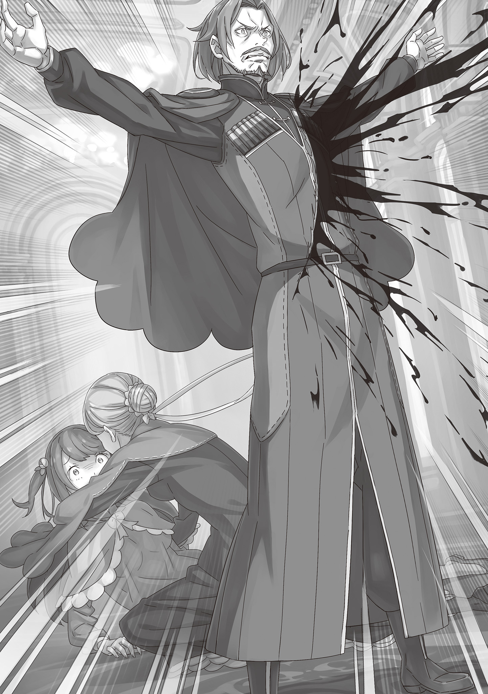
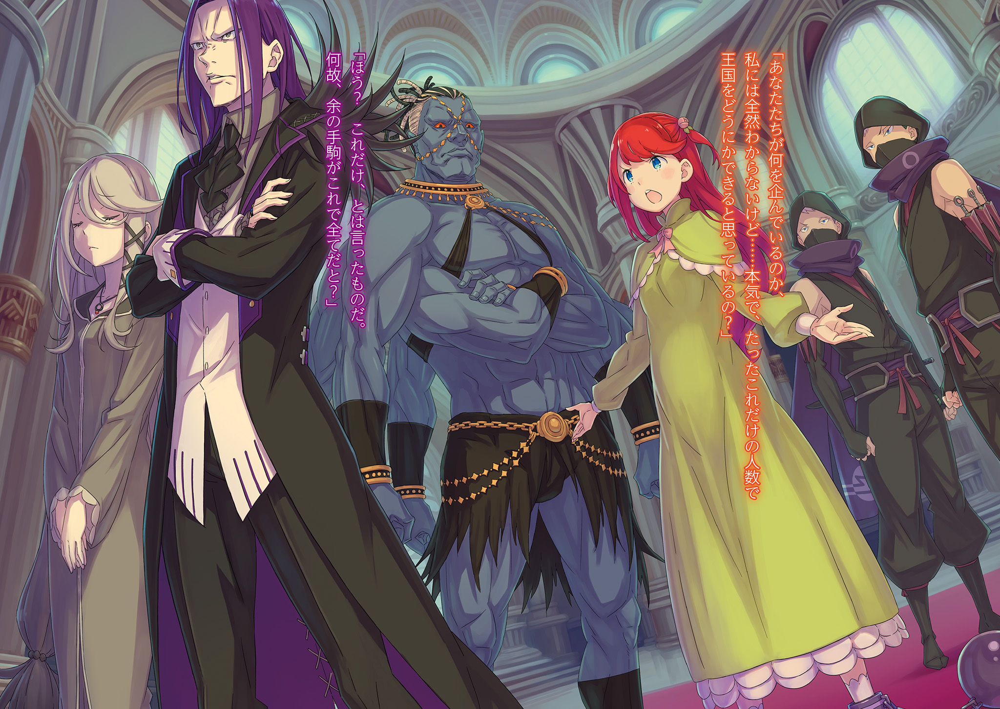

Разноцветная Пелена

第四章 『四幕／染霞』

× × ×

— Круглый год она окутана густым туманом, а на дне скапливается грязная мана — миазмы. Привлечённые этими миазмами, здесь обитает множество зверодемонов. Такова она, долина Шамрок.

В разгар Войны Полулюдей среди королевских войск, терпящих поражение за поражением от атак альянса, ходили упорные слухи, что именно в долине Шамрок находится база трёх лидеров альянса: «Великого Стратега» Валги Кромвеля, «Ядовитой Змеи» Либре Ферми и «Ведьмы» Сфинкс.

Однако суровая среда долины, подобная природной крепости, не давала тогдашней королевской армии возможности проверить эти слухи. После окончания войны необходимость в исследованиях отпала, и это место с дурной славой осталось заброшенным.

И вот в эту опасную зону, получив королевский приказ, должен был ворваться отряд Зелгефа, но…

— Честно говоря, я немного разочарован , — пробормотал Пивот, заведя руки за спину и оглядываясь по сторонам.

Розвааль J. Мейзерс, глядя на таинственно светящийся магический камень в её руке, прищурила свои разноцветные глаза.

— И подумать только, такой пустяк стал причиной здешнего тумана и миазмов, верно?

— Именно так. И самая отвратительная часть этой уловки в том, что она бьёт по пробелам в восприятии, как у господина Конвуда.

Вокруг него действительно стоял густой туман, но не настолько плотный, как говорили в слухах — мол, не видно вытянутой руки, — а скорее лёгкая дымка, позволяющая разглядеть рельеф местности.

— Подумать только, что нас так долго водили за нос столь простой уловкой… — со вздохом произнесла Розвааль. — Право слово… собственная некомпетентность начинает меня раздражать.

— Госпожа Мейзерс некомпетентна? Вы шутите, — усмехнулся Конвуд, пожав плечами, и приказал своим солдатам продолжать поиски в тумане.

Проводив его взглядом, Вильгельм окликнул Розвааль:

— Эй. Нечего хандрить. Мы на тебя рассчитываем. Соберись.

— Ох, неужели в твоих глазах я выгляжу убитой горем женщиной? В таком случае, мне бы хотелось услышать более нежные слова и увидеть проявление заботы на деле-е-е-е…

Вильгельм недовольно прервал её: — Ты победила «Ведьму». Это единственное, что тебе нужно помнить.

От его слов Розвааль удивлённо вскинула брови, а затем слегка улыбнулась.

Вильгельм не знал подробностей вражды между ней и «Ведьмой» Сфинкс. Он знал лишь то, что Розвааль питала к Сфинкс сильную ненависть, твёрдо решила её уничтожить и добилась своего.

И вот теперь чувствовать себя побеждённой из-за посмертной ловушки «Ведьмы» было просто бессмысленно.

— Она расположила магические камни в разных частях долины, создавая магический ветер, который наполнял это место туманом и миазмами. Чтобы войти или выйти, нужно активировать камни в определённой последовательности.

— А что будет, если ошибиться с порядком?

— Вероятно, сработает механизм, который за короткое время резко нагонит миазмы. Можно почувствовать недомогание или, в худшем случае, потерять сознание. А если туда нагрянут привлечённые миазмами зверодемоны, то всё кончено.

— Ясно, действительно мерзкая уловка, — нахмурился Вильгельм. Он окинул взглядом долину, где туман хоть и редел, но опасность ничуть не уменьшалась, и прищурил свои голубые глаза.

По сути, Розвааль зря чувствовала себя побеждённой. Это всё равно что сказать, будто ты проиграл, потому что не смог найти камень, зарытый в неизвестной земле, о котором тебе никто не сообщал. Поле битвы даже не было определено. И причина, по которой это стало ясно…

— Но кто же тот советник, что рассказал об этом его величеству Гионису, интересно мне зна-а-ать…

— Он сказал, что не может говорить по определённым причинам. Не пытайся дознаться.

— Дознаваться я не буду. Но думать-то мне никто не запретит? Возможно, королевская семья Лугуники тайно поддерживает связь с «Мудрецом», как считаешь?

— Мудрецом? Ты имеешь в виду Мудреца Шаулу, одного из Трёх Великих Героев? — от столь неожиданного слова Вильгельм невольно округлил глаза.

Трое Великих Героев — это легендарные личности, которые когда-то запечатали «Ведьму Зависти», едва не уничтожившую мир. «Святой Меча», «Божественный Дракон» и «Мудрец» — все они почитаются как герои. Влияние дома Астрея, из которого происходят «Святые Меча», и «Божественного Дракона» Волканики не подлежит сомнению. Естественно, «Мудрец» Шаула, будучи одним из Трёх Великих Героев, также пользуется огромным уважением, но…

— Говорят, что этот «Мудрец» заперся в башне на востоке королевства, и никто не может к нему приблизиться. С чего вдруг всплыло это имя?

— Я же сказала: тайно. Да, считается, что в Сторожевую Башню Плеяд уже несколько сотен лет никто не входил и не выходил, но что если у королевской семьи и «Мудреца» есть нечто вроде Зеркала Связи? Тогда они могли бы получать советы от «Мудреца», который, как говорят, видит всё на свете-е-е-е.

— У них есть Драконья Скрижаль, оберег от «Божественного Дракона», советы «Мудреца» и, на всякий случай, сила «Святой Меча»? Прямо всё включено.

— По правде говоря, именно так Королевство Лугуника и видят другие страны-ы-ы, — парировала Розвааль на его сарказм, и Вильгельм замолчал.

«Божественный Дракон», «Святой Меча» и «Мудрец». Королевство, веками оберегаемое славой спасителей прошлого… Такая оценка казалась пренебрежением к тем, кто живёт сейчас, и Вильгельму это было неприятно.

Но как бы неприятно это ни было, такова была реальность Королевства Лугуника.

— Если бы не союз, заключённый с «Божественным Драконом», другие страны вряд ли бы спокойно наблюдали за тем, как королевство истощается в Войне Полулюдей — заметил Пивот, словно прочитав его мысли.

— Несомненно, Империя уж точно попыталась бы вмешаться, — с кислой миной кивнул Вильгельм.

По иронии судьбы, именно из-за отсутствия вмешательства других стран Война Полулюдей продлилась почти десять лет. Если бы вмешательство произошло, закончилась бы гражданская война быстрее? Ответа не было.

— Это всего лишь предположение, конечно. Просто догадка без капли достоверности, но я не могу придумать никого другого, кто мог бы разгадать ловушку в ущелье. Хотя нет, не то чтобы не могу…

— Но?

— Но этот вариант гораздо менее вероятен, чем «Мудрец». Можешь забыть.

Розвааль задумчиво приложила палец к губам и многозначительно произнесла это. Хотя проверить её слова было невозможно, прерывать разговор на полуслове было неприятно.

Однако прежде чем Вильгельм успел потребовать продолжения, из тумана донёсся резкий крик:

— Горная хижина! Убежище альянса… «Ведьмы»! Нашёл!

Услышав голос солдата, Вильгельм и Розвааль переглянулись.

— Вильгельм! — раздался с той же стороны торопливый голос Гримма.

— Понял! Идём!

Вильгельм вместе с Розвааль устремился сквозь туман — обнаружение базы Альянса Полулюдей спустя столько лет само по себе придавало шагу скорости.

И вот…

— Наконец-то мы встретились ли-и-ично, — пробормотала Розвааль, остановившись перед тем же зданием, что и Вильгельм.

В её голосе слышались какие-то глубокие чувства, возможно, свидетельство того, что и она испытывала похожие на Вильгельмовы сентиментальные эмоции.

Прошло время, и вот они нашли убежище тех, с кем когда-то сражались насмерть, а теперь ищут в оставленных ими вещах способ избавиться от надвигающейся угрозы.

Как ещё это назвать, если не странным поворотом судьбы?

— … — Гримм, стоявший перед искомой хижиной, встретил подошедшего Вильгельма кивком. Вокруг него, во главе с Конвудом, солдаты отряда Зелгефа заняли боевые позиции.

— Может быть ловушка. Что будем делать? Я могу пойти первым, но…

— Увы, я не могу отправить тебя, человека с беременной женой, прямо в пасть опасности, — с шутливым замечанием Розвааль вышла вперёд. Вильгельм, обнажив меч, последовал за ней.

Это была хижина «Ведьмы». Неудивительно, если внутри их что-то поджидает. Рука Розвааль медленно потянулась к двери и коснулась её.

— Магических ловушек вроде бы нет. Открываю.

Убедившись в отсутствии ловушек, Розвааль толкнула дверь, а Вильгельм проскользнул мимо неё внутрь. Как и сказала Розвааль, никаких подозрительных механизмов внутри не было. Осторожно осмотрев тускло освещённую хижину, Вильгельм пришёл к такому выводу.

— Ясно. Здание скромное, но, похоже, именно здесь и был мозг альянса, да-а-а, — сказала Розвааль, войдя с ярко светящимся ручным светильником, и посмотрела на стену. Вильгельм, проследив за её взглядом, тоже увидел большую карту на стене — увеличенную карту земель Лугуники со множеством красных отметок.

Все отмеченные места были ему знакомы. Это были места крупных сражений Войны Полулюдей.

— Здесь и Болота Айхия, где я погиб. И Кастурские равнины, и плато Редонас .

— Что ж. Если ты уверена, то это главное. Теперь осталось найти то, что мы ищем. — Вильгельм проигнорировал мрачную шутку Пивота.

— По словам его величества, «наследие Ведьмы»… наследие Сфинкс, — добавила Розвааль.

Как будто специально поправившись, Розвааль демонстративно избегала называть Сфинкс «Ведьмой». Вильгельм не стал на это указывать и оглядел хижину.

Кроме карты на стене, в хижине была полка с небольшим количеством книг и ещё одна полка с инструментами непонятного назначения и устройства — зловещие предметы остались нетронутыми.

— Стены и пол вскрыть и поискать? Силач Конвуд легко справится.

— Нет, Сфинкс была рационалисткой. Она устроила в долине ловушку, запрещающую вход и выход. Вряд ли она стала бы прятать результаты своих исследований в самой хижине. Поэтому, если бы вы просто вынесли все материалы… — Розвааль, взявшая в руки один из инструментов с полки и осматривавшая его, вдруг замолчала.

Вильгельм не был настолько расслаблен, чтобы удивиться этому. Он тут же заметил неладное и спросил, глядя на профиль Розвааль:

— Что случилось?

Розвааль, не отрывая взгляда от полки, а не от инструмента в руках, ответила:

— Если после смерти Сфинкс сюда никто не входил, то пыли должно было накопиться гораздо больше. То есть…

— Есть следы того, что кто-то здесь побывал, — подхватил вывод Розвааль Вильгельм, и его щеки напряглись.

В ту же секунду снаружи хижины внезапно стало шумно, послышались чьи-то ругательства.

— Тц!

Вильгельм, словно подброшенный пружиной, вернулся ко входу и выглянул наружу, чтобы оценить обстановку. Он сразу понял, что произошло нечто неладное — незаметно вокруг хижины начал сгущаться густой, тёмный туман.

Без сомнения, сработала ловушка «Ведьмы», которой они и опасались… нет, это была ловушка бедствия, устроенная тем, кто использовал её, чтобы разом покончить с преследователями.

Почувствовав изменение потока ветра и тошнотворную слабость от миазмов, Вильгельм размотал платок с руки, обвязал им лицо, прикрывая рот, и крикнул:

— Гримм! Конвуд! Стройтесь в боевой порядок! Зверодемоны начинают собираться!

— Тц! — откликнулся Гримм.

— Есть! — отозвался Конвуд.

— Розвааль! Выбирай самое необходимое! Времени нет. Вынесем столько, сколько сможем. Что брать — решай сама!

Бросив это Розвааль в хижину, Вильгельм, не дожидаясь ответа, выскочил наружу. Он присоединился к отряду Зелгефа, быстро строящемуся в густом тумане, и… сверкнула серебряная вспышка, отсекая подкравшуюся тень.

— Кххх!

Высоко взвизгнув, на землю рухнула большая летучая мышь с рогом на лбу — Черная Крылатая Крыса. И это было только начало. Вильгельм почувствовал, как волосы на его затылке встают дыбом от ощущения, что зверодемоны со всего ущелья устремились к ним.

Их нужно было уничтожить, защитить Розвааль и вынести наследие «Ведьмы».

К тому же…

— Если это твоих рук дело, то этим всё не кончится, Страйд! — стиснув зубы, Вильгельм приготовил меч и бросился на наступающих зверодемонов.

Рядом с ним, прикрываясь большим щитом, бежал Гримм, разя морды зверодемонов. Даже не видя его яростного натиска, не видя его напряженного лица, было ясно.

Гримм испытывал то же беспокойство, что и Вильгельм — страх, что новое бедствие обрушится на тех, кого они оставили позади, и этот страх заставлял его размахивать оружием.

…Тревога Вильгельма и его товарищей оправдалась самым ужасным образом.

Всё произошло внезапно.

После проводов Вильгельма, благодаря любезности его величества Гиониса, Терезия и остальные получили защиту в королевском замке Лугуники на случай чрезвычайной ситуации. Не хватит слов благодарности за то, как радушно приняли беременную Терезию и Кэрол, на которую было наложено проклятие.

Во время отсутствия Вильгельма Бертоль и Тиша всё время оставались в столице и сопровождали их в замке. Особенно старался Бертоль, которому Вильгельм поручил присмотреть за ними — он был более энергичен, чем обычно, хотя эта энергия часто била мимо цели.

Но Терезии это было только на руку. Она не хотела поддаваться тревоге и напряжению, и, что важнее всего, на лице Кэрол, изо всех сил старавшейся не показывать уныния, появилась естественная улыбка.

Бертоль говорил необдуманные глупости, вызывая неодобрение женщин, Тиша вертела таким мужем, как хотела, и все вместе они говорили о будущем ребёнка.

Именно в такой момент… появился тот человек, окутанный зловещей аурой.

— Уступает Хрустальному Дворцу Империи, но и этот замок сложен неплохо. Слышал, он был почти разрушен варварскими действиями полулюдей. Молодцы, что защитили. Хвалю.

С такими высокомерными словами незваный гость ступил на алый ковёр королевского замка.

Ужас охватил гостевую комнату, воздух застыл. Королевский замок Лугуники должен был быть самым надёжно охраняемым местом в столице, в королевстве.

И чтобы в этот замок проник злодей, да ещё и тот, кого сейчас в королевстве опасались больше всего…

— Страйд… — потрясённо прошептала Терезия, увидев появившегося мужчину.

Услышав своё имя, мужчина — Страйд — прищурил свои тёмные глаза и зловеще улыбнулся.

— Давно не виделись, «Святая Меча»… Здорова ли ты была?

— Что стало с охраной снаружи?

— Хм. Перед ликом Моим заботиться в первую очередь о судьбе какой-то швали. За такое неуважение полагается смертная казнь, но… сейчас Я в хорошем настроении. Посему, милостиво прощаю тебя.

От его жестокого и надменного ответа Терезия крепко зажмурилась. Ответа на вопрос не последовало, но безразличие Страйда само по себе говорило о том, какая участь постигла охранников.

Та война, полная потерь, закончилась, королевство понемногу строило мирную жизнь, так почему…

— Почему ты так жесток к другим?

— Слышать такое от «Святой Меча», зарубившей не то тысячу, не то десятки тысяч, — неслыханно. Мои деяния — детские шалости по сравнению с числом жизней, отнятых тобой. Если бы грехи измерялись количеством отнятых жизней, то во всём мире не нашлось бы никого грешнее тебя.

— Тц!

Он уклонился от сути вопроса, но лезвие его слов нанесло Терезии острую боль.

Это было то самое лезвие — страдание, — которое терзало её сердце с конца той войны, с тех пор, как ей позволили отбросить меч, с тех пор, как она зачала ребёнка Вильгельма.

У Страйда был дар вонзать словесные клинки в слабые места противника и вливать в них яд.

Но вместо онемевшей Терезии взорвалась гневом другая женщина.

— Ах ты! Довольно оскорблять Леди Терезию! — выхватив стоявший у стены рыцарский меч, громко крикнула Кэрол. Она оттолкнула Терезию к Бертолю и Тише и сама вышла вперёд.

Бертоль и Тиша тоже встали, прикрывая Терезию, и встретились взглядом со Страйдом.

— Хм, — скучающе хмыкнул Страйд. Но на чём основывалась его уверенность в этой ситуации? Ведь он стоял здесь один.

— Кэрол, берегись теней. Вильгельм говорил, что у него есть синоби.

— Помню. У этого человека нет сил, чтобы в открытую прорвать оборону замка. Он трус, который всегда манипулирует другими, издевается над ними и топчет их, — Кэрол, остерегаясь внезапной атаки из тени, начала медленно зажимать Страйда в контролируемое пространство. Радиус поражения полуторного меча в её руке был велик, а её мастерство имело признание самой «Святой Меча». К тому же, как и раньше, от Страйда исходила жизненная сила немощного больного.

Конечно, если появится «Восьмирукий», ситуация мгновенно изменится, но…

— К несчастью, он слишком велик, чтобы прятать его в тени и выпускать оттуда. Можешь так не волноваться, его выход не здесь. Для развлечения Я приготовил кое-что другое.

— Развлечение… Мы не собираемся участвовать в твоих играх! Говори, что ты задумал и как проник в замок!

— Шумная женщина. Неужели дни без ласк с возлюбленным так на тебя повлияли?

— Ах ты! Тц! — гнев Кэрол достиг предела от слов Страйда, сказанных со сложенными руками и полных яда.

И тут же в поддержку Кэрол, собиравшей силу меча, пришло подкрепление.

— Госпожа Астрея! Вы целы?!

Два стражника замка, заметившие неладное, ворвались в гостевую комнату и оценили обстановку. Они тут же направили оружие на вторгшегося Страйда и приготовились действовать синхронно с Кэрол.

— Приготовься!

С трёх сторон одновременно мечи правосудия обрушились на Страйда.

Два стражника были хороши, но мощь меча Кэрол была несравненно отточеннее. Насколько знала Терезия, долго наблюдавшая за своей слугой, это был лучший её удар.

Полуторный меч, описывая полукруг, оставил красивый след в воздухе и должен был сразить Страйда… должен был.

— А? — горло Кэрол, нанёсшей свой лучший удар, издало лишь потрясённый, слабый выдох.

Она, должно быть, и сама понимала. Чтобы выведать планы интригана Страйда, нужно было не убивать его, а обезвредить и захватить.

Но сейчас её меч был мокрым от крови. Он безжалостно отнял жизнь у того, кого сразил. Вот только это был не Страйд, главный враг королевства.

Сражённые мечом Кэрол, в луже крови лежали двое прибежавших стражников.

— Кэро… л?

— Я… я… что я… А? Что… почему?..

На глазах у ошеломлённой Терезии Кэрол тоже в ступоре смотрела на свои руки. Руки были испачканы тёплой кровью, а брызнувшая кровь оставила красные пятна на её белых щеках.

Она зарубила подкрепление своим отточенным искусством меча. Это не могло быть её волей. А если это не её воля, значит…

— Ты спрашивала, что Я сделал с охраной снаружи, — внезапно произнёс Страйд, стоявший неподвижно посреди этой бойни.

Единственный, кто, казалось, понимал причину и следствие хаоса, он сказал это, глядя на Терезию, не обращая внимания ни на павших стражников, ни на совершившую это Кэрол.

На мгновение Терезия не поняла, но потом осознала, что это был её первый вопрос.

Страйд, заметив это по её дрогнувшим глазам, кивнул подбородком.

— Вот эта женщина.

— Ты…

— Ты спрашивала, как Я вошёл в замок. Вот эта женщина.

— Непра… я… я такого не…!

— Я сказал, что приготовил другое развлечение. Вот эта женщина.

Повторяя это, Страйд развёл сложенные руки и показал свою левую руку. На большом пальце левой руки зловеще сиял аметистовый блеск.

Это был один из пальцев силы проклятия Страйда, «Десяти Заповедей Гордыни» — «Аметистовый Большой Палец».

— То, что дыхание останавливается при прикосновении к любимому человеку, — лишь отвлечение. Это касается не только вас, но все слишком легко верят в глубину чужой злобы, — в его бормотании Терезии послышалось какое-то непонятное одиночество.

Чувство, не подобающее Страйду, в которое хотелось не верить. Но времени выяснять правду не было. Кэрол, прерывисто дыша, обернулась.

Словно её тело ниже шеи перестало слушаться, вопреки потрясённому выражению лица, меч в её руке медленно поднялся в слишком красивую стойку.

— Время пришло. Гордись. Наше превосходство не было таким уж подавляющим, как вы думали.

— Остановись… — положив руку на свой вздувшийся живот, Терезия умоляюще посмотрела на Кэрол.

Но злодей лишь усмехнулся в ответ. Жестоко растянув губы в улыбке, он приказал:

— Действуй.

Кольцо на большом пальце Страйда вспыхнуло особенно ярко.

Кэрол, лучше всех понимавшая, что означает этот приказ, закричала: — Не хочу… Не хочу, не хочу, не хочу… НЕ ХООООЧУУУ!!

Из её широко раскрытых глаз полились слёзы, но тело, против воли, готовилось продемонстрировать всю мощь мечницы, отточенную за всю жизнь.

Обратив клинок против «семьи», которую она решила защищать с того самого момента, как впервые взяла в руки меч.

— Бегите-е-е-е!!

Кэрол закричала, и в следующее мгновение резко шагнула к ним.

Увидев это, Терезия инстинктивно попыталась двинуться. В то же мгновение она почувствовала движение ребёнка в утробе, возникло колебание, и она замерла. В этот момент Тиша толкнула её на пол.

Упав на пол, Терезия увидела, как Тиша прикрывает её собой. А перед Тишей стоял Бертоль, раскинув руки.

Объятия матери, спина отца — они встали перед блеском меча, чтобы защитить дочь и внука.

— НЕЕЕЕЕЕЕЕТ!!

Крик… и в воздухе сверкнула вспышка серебра.

В королевском замке Лугуники распустились алые лепестки крови.

…Отряд Зелгефа вернулся в столицу, когда всё уже было кончено.

Ловушка «Ведьмы» Сфинкс, расставленная в долине Шамрок, и атака группировки Страйда, использовавшей эту ловушку, — Вильгельм и его люди преодолели всё это, сплотившись воедино.

Вильгельм и Гримм во главе отбивали натиск толп зверодемонов, и то, что все вернулись живыми, было настоящим подвигом.

— Есть раненые, но такого результата не добился бы ни один отряд, кроме отряда Зелгефа. Хоть он и больше не под командованием молодого господина… это впечатляет — прокомментировал Пивот.

— Мы лишь отбились от односторонней атаки. Если Розвааль ничего не найдёт в вынесенных документах, всё это будет зря, — криво усмехнувшись, ответил Вильгельм на слова Пивота, похожие на утешение или ободрение.

Группировка Страйда всегда опережала их на шаг. Если и поиски в долине окажутся напрасными, то королевство, неспособное противостоять злой воле одного злодея, будет сожжено дотла. Однако…

— Этого не случится. Я обязательно раскрою их замысел, — Розвааль, изучая в драконьей повозке вынесенное из долины «наследие Ведьмы» — вернее, материалы, которые могли привести к этому наследию, — твёрдо заявила это.

В её серьёзности чувствовалась не только злость из-за того, что дело было связано с «Ведьмой» и что ловушку в ущелье так нагло использовали, но и какая-то более веская причина.

В любом случае, чтобы раскрыть замыслы этого непредсказуемого стратега, оставалось полагаться только на Розвааль.

— Какое нетерпение… — Вильгельм стиснул зубы от досады, осознавая свою беспомощность в проблемах, которые нельзя решить мечом. Рядом с ним на сиденье драконьей повозки сидел Гримм, опустив голову, вероятно, испытывая такое же чувство бессилия.

Несмотря на то, что он сражался бок о бок с Вильгельмом на передовой, отбрасывая зверодемонов, на его теле не было заметных ран. Он стал надёжным мужчиной. Теперь он, возможно, мог бы потягаться даже с Бордо в его лучшие годы, когда того звали «Бешеный Пёс».

Значит, здесь находились «Демон Меча», одолевший «Святую Меча», и мужчина, сравнимый с «Бешеным Псом».

— И всё равно, вот такая вот ситуация. Всегда это так раздражает.

— …Кэр… ол… хочу увидеть… — прошептал Гримм прерывающимся голосом.

— Я тоже, — тихо согласился Вильгельм с отчаянными словами.

Гримм хотел увидеть Кэрол, Вильгельм — Терезию. Оба хотели встретиться со своими любимыми. Даже если это лишь усугубляло чувство бессилия и накапливало чувство вины, это было непреодолимое желание.

С этим желанием драконья повозка отряда Зелгефа вернулась в столицу Лугуники и…

— Прости. Я был в столице, и всё же упустил их, — с ноткой глубокого сожаления в голосе, Бордо опустил свои широкие плечи и низко поклонился.

В последнее время Вильгельм только и видел, как он сетует на своё бессилие и извиняется. Осознав это, он мысленно убил ту часть себя, что пыталась сбежать от реальности, и схватил Бордо за плечо.

Затем, посреди шума и суеты в королевском замке Лугуники, он допросил Бордо Зелгефа: — Что случилось?!

— В замок проник злоумышленник. Он пробрался с такой лёгкостью, что можно подумать о пособничестве изнутри, убил тринадцать охранников и сбежал… уведя с собой госпожу Терезию.

— Тц! Терезию… похитили? — Вильгельм остолбенел от ответа Бордо, который с мучительным выражением лица покачивался от тряски.

Сбылся самый худший, самый ужасный из всех кошмаров. Перед глазами встало лицо Терезии при прощании, вспомнилась жизнь, теплившаяся внутри неё, и холодный пот прошиб Вильгельма. На мгновение невыносимый гнев, рвущийся наружу, едва не обрушился на Бордо, сожалеющего о своей беспомощности.

Однако этот взрыв ярости Вильгельма был остановлен в последний момент.

— Кэр… ол? — прохрипел Гримм. Его лицо было таким же бледным, как у Вильгельма, если не бледнее. Заметив это, Вильгельм наконец-то смог представить себе чувства Гримма.

Если в замке произошло нападение и Терезию похитили, значит, Кэрол, которая была с ней, тоже подверглась нападению.

Но реальность оказалась ещё хуже, чем предполагал Вильгельм.

— Она тоже была уведена вместе с госпожой Терезией… нет, не совсем так. Кэрол Ремендис зарубила стражников и вместе с предводителем врага увела госпожу Терезию.

— Что?

— Это проклятие кольца, о котором давно говорили. Все выжившие стражники свидетельствовали, что она плакала и кричала им бежать… Её тело было под контролем, это было ужасно.

— … — От этой ужасающей правды Вильгельм потерял дар речи.

Они недооценили принудительную силу «Десяти Заповедей Гордыни» Страйда. Проклятый предмет, что истощал жизнь Бертоля, наложил на Кэрол нежеланные оковы и, вероятно, так же сковал людей в охраняемой комнате. Вильгельм предполагал, что он может использоваться для связывания жизни и принуждения к повиновению. Он даже думал, что именно поэтому Страйд заставил сделать копию Драконьей Скрижали… но всё оказалось не так.

Кэрол никогда бы не отдала Терезию в обмен на свою жизнь. Она скорее предпочла бы собственную смерть, чем предать Терезию. Такова была Кэрол.

Если Страйду удалось подчинить её, значит, проклятый предмет действительно превращал людей в марионеток.

Управляемая волей Страйда Кэрол против своей воли помогла ему проникнуть в замок, способствовала достижению его цели, зарубила стражников и помогла похитить Терезию и…

— Подожди. То, что Терезию похитили, я понял. То, что Кэрол забрали, чтобы использовать, — тоже понятно. Но в замке должны были быть и её родители.

Во время отсутствия Вильгельма Бертоль и Тиша должны были быть рядом с Терезией и Кэрол. Они обещали помочь своей любимой дочери и той, кто была ей как дочь, всем, чем могли. Значит, они тоже должны были быть в замке.

Вильгельм ведь и сам поручил Бертолю…

— Я просил тебя… и её родителей… присматривать за Терезией…

Эти родители наверняка сдержали бы своё обещание, чего бы им это ни стоило.

Стиснув зубы, Вильгельм с трудом подбирал слова. Сердце колотилось как бешеное, а холод пота, стекавшего по спине, был несравненно сильнее прежнего.

Та же тревога и напряжение, что он испытывал, узнав об опасности, грозившей его кровной семье — дому Триас, — охватили Вильгельма и грозили поглотить его целиком.

На это Бордо на мгновение зажмурился, а затем прямо сказал: — Вильгельм, слушай внимательно. Лорд Бертоль Астрея…

— …

— …был одним из самых почтенных рыцарей, гордостью королевства, и великим отцом.

Сидящая на кровати женщина производила на окружающих впечатление, совершенно не похожее на её обычный облик.

Мягко волнистые льняные волосы, платье цвета молодой травы, облегающее пышную фигуру. Красота зрелой женщины, выглядевшей намного моложе своих лет, всегда была ярко подчёркнута не сходившей с её уст улыбкой.

Но сейчас губы были плотно сжаты, бледные щеки и потускневшие волосы выглядели болезненно, бессильное тело, укутанное в ночную рубашку, безвольно обмякло, а взгляд был словно во сне.

Возможно, она действительно видела сон. Счастливый сон, в котором были её муж и дочь.

— Матушка, это Вильгельм. Я вернулся. Простите за опоздание.

— …

— Я слышал, что произошло во время моего отсутствия. Об отце… о главе дома… даже не знаю, что сказать. Мне очень жаль.

Стоя на коленях перед молчащей Тишей, Вильгельм почувствовал отвращение к своим пустым словам.

Какие банальные, избитые фразы. Если он искренне хотел извиниться, искренне хотел поддержать Тишу, почему он не мог подобрать самые подходящие слова?

Слова «жаль», «прискорбно» были слишком слабы, чтобы выразить его чувства к Бертолю Астрея.

— …

Перед склонившим голову Вильгельмом Тиша сидела с пустым взглядом, устремлённым вдаль.

Мать, на чьих глазах зарубили мужа и похитили дочь. По словам Бордо, у Тиши не было физических ран, но она не реагировала ни на какие слова и была словно пустая оболочка.

Душевные раны не похожи на телесные. Возможно, сердце Тиши никогда больше не…

— Матушка?

Внезапно Вильгельм поднял голову, почувствовав странное ощущение. Пальцы мягко погрузились в его тёмно-каштановые волосы и принялись гладить по голове, как будто успокаивая ребёнка. Это были руки Тиши, пребывавшей до этого в прострации. На глазах удивлённого Вильгельма в её глазах зажёгся свет.

— Вильгельм… мальчик мой… — прошептала Тиша.

— Матушка…! Леди Тиша, вы меня узнаёте?

— Да, конечно. Я… да, я показала себя не с лучшей стороны, — несколько раз моргнув, Тиша стыдливо опустила глаза. Вильгельм покачал головой, кивнул стражнику и отправил его за целителем.

— Матушка, сейчас придёт целитель. У вас нет физических ран, но…

— Нет. Нет, Вильгельм, в этом нет нужды. Я в порядке. Важнее другое, мне нужно кое-что тебе передать.

— Тц!

Вильгельм затаил дыхание от неожиданно твёрдого тона и руки, лёгшей ему на плечо. Сила этой руки была значительной, но сознание Вильгельма захватили глаза Тиши.

В её характерных ореховых глазах появилась слабая плёнка алого света — это было влияние того самого зловещего проклятого предмета, который истощил жизнь Бертоля.

Тиша не впала в прострацию от шока. Она стала проклятым посланником для Вильгельма.

Однако Тиша, осознавая это, говорила по своей воле, преодолевая силу проклятия:

— Мои чувства к тому человеку, полагаю, уже не требуют слов. Тот человек заставил Кэрол совершить нежеланное убийство и похитил Терезию. Он — бедствие, которому нет места в мире людей.

— …

— Непременно убей его. «Жду на Земле Танца Серебряного Цветка» — таково его послание.

Вильгельму вспомнились напыщенные, театральные речи Страйда, и он стиснул зубы.

Послание, похожее на строку из стихотворения… Отзвук «Танца Серебряного Цветка» был ему знаком. Он слышал, что так прозвали его первую стычку со Страйдом, когда он скрестил меч с его охранником, «Восьмируким».

Если тот говорит, что ждёт там…

— Место решающей битвы — Пиктатт. В том городе он, Терезия и остальные.

Конечно, учитывая злой умысел Страйда, это тоже могло быть ловушкой, чтобы обмануть их. Но он лично вторгся в замок и похитил Терезию, «Святую Меча». Это, вероятно, означало, что его план, который он тайно вынашивал в королевстве несколько месяцев, созрел.

В Пиктатте, скорее всего, соберётся вся группировка Страйда, и битва будет жестокой.

— Вильгельм, мальчик мой, на меня наложено проклятие. Прошу, свяжи мои руки и ноги, лиши свободы, и заткни рот кляпом, чтобы я не могла покончить с собой. Такие меры необходимы, — передав послание и выполнив свою роль, Тиша предложила применить к себе обращение, недостойное знатной особы. Однако, учитывая, что она находилась под влиянием проклятого предмета, это была вполне адекватная мера.

— Матушка, остальное предоставьте мне. Терезию, Кэрол и ребёнка в её утробе я обязательно верну.

— Да сопутствует удача тебе, — Вильгельм принял решимость Тиши и сжал её руку. Она же вознесла ему молитву. Это были короткие, но весомые слова — лучшие, какие могла произнести женщина, вышедшая замуж за воина.

Но в то же время Вильгельм чувствовал прикосновение ногтей к тыльной стороне ладони — бессознательную силу, горе жены, только что потерявшей любимого мужа, — и это горе тоже было ему доверено.

— Ты — мужчина из рода Астрея. Никогда, никогда не забывай об этом.

— Непременно, — голос дрожал, по щекам текли слёзы, а сжатая рука была холодной до жути.

И всё же, чувства, вложенные в эти слова, были благородны, и Вильгельм, кивнув, принял решение.

Как «Демон Меча», носящий имя Астрея, он непременно сразит «Желающего Гибели».

— Надо же, и в такой момент ни слезинки не проронить. Стойкая женщина.

Сказав это, Страйд тонкими пальцами поднял подбородок Терезии. Она же, с яростью в небесно-голубых глазах, взглянула на самую презренную в мире усмешку этого мужчины.

— У меня есть муж. Не смей так фривольно прикасаться ко мне. Бесстыдник.

— Ха. Неужели ты думаешь, что я возбуждаюсь от беременной женщины? Хотя, в твоём случае, это может быть даже пикантнее. До того, как стать матерью, ты была настолько чудовищным, потусторонним существом, что на тебя и смотреть было тошно.

— Тц!

В глазах Терезии, которой швырнули в лицо всю возможную злобу и отпустили подбородок, промелькнула боль.

Обвинения в том, что она была «Святой Меча», требования искупления за отнятые жизни — это было мучительно. Мучительно, но осознание вины стало и источником решимости. Необходимой болью, чтобы встретиться с ней лицом к лицу.

Но презрение Страйда было иным. Он осуждал не её поступки, а само её существование.

Рок, связанный с этим существованием, толкал Терезию к нежеланным страданиям. И не только её саму, но и окружающих… Медленно, в глазах навернулись слёзы.

— Отец…

Последний образ спины Бертоля, который заслонил Терезию собой от вспышки меча, снова и снова всплывал в памяти.

Образ отца, разрубленного пополам и лежавшего в луже крови, крик матери, обычно стойкой и всегда спокойной, — всё это врезалось в память, прилипло к глазам и ушам и не отпускало.

И заплаканное лицо Кэрол, которую заставили это сделать, её слишком горестные рыдания.

— Вот, пожалуйста, — кто-то сбоку осторожно протянул белый платок Терезии, на глазах которой блестели слёзы, смешанные из печали и обиды. Хоть на ногах и были кандалы, руки Терезии были свободны, и она взяла платок. Было обидно осознавать, что её явно недооценивают, считая неспособной к сопротивлению, но платок был ни при чём.

— Благодарить не буду.

— Это… как вам угодно. Я и не ждала благодарности, — слабым, комариным голоском ответила хозяйка платка — невысокая босая девушка с длинными волнистыми пепельными волосами. Её серая роба, полностью скрывающая тело, волочилась по полу, что тоже было примечательно, но самым ярким было не её правильное лицо или скромная одежда.

А то, что она и во время разговора с Терезией, и сейчас, держала глаза плотно закрытыми.

То, что она находилась здесь, говорило о том, что эта девушка тоже была из группировки Страйда. Но её отношения со Страйдом, похоже, были не просто товарищескими.

Потому что она была… Страйда…

— Мелинда, ты посмела дать что-то этой женщине самовольно, не спросив Моего позволения?

— А-а! П-п-прошу прощения!

— Ты — ключ к плану. Не смей делать опрометчивых поступков, стой в стороне. Если, конечно, осознаешь себя Моей женой.

От его властного тона девушка, названная Мелиндой, испуганно втянула плечи и отчаянно закивала головой. Однако в её ответе не было ни отказа, ни страха, а щеки слегка порозовели. Трудно поверить, но Мелинде приказали, и она этому радовалась.

Здесь существовали супружеские отношения, отличные от тех, что знала Терезия, — извращённые, как ей казалось.

— … — Сжав губы, Терезия изо всех сил старалась сохранять спокойствие, не поддаваясь эмоциям.

Гнев и печаль — на этот миг она решила отложить их. Тут же сработала переключатель сознания, выработанный во времена «Святой Меча», и она начала хладнокровно оценивать ситуацию.

Во-первых, её привезли в Пиктатт, процветающий торговый город.

Группировка Страйда, похитившая её из замка, не собиралась скрывать место назначения. Во время передвижения Терезии не завязывали глаза, и она знала, что находится в центральном районе Пиктатта, разделенного на пять районов, на верхнем этаже находящейся там башни.

И что Страйд и его люди используют эту башню как базу, плетя интриги в городе.

А самая важная боевая сила врага…

— Ваша Светлость, Райдзо вернулся, — послышался голос.

— Ваша Светлость, Шаске вернулся, — отозвался точно такой же голос.

Два голоса, звучавшие абсолютно одинаково, выскользнули словно из тени Страйда. Справа и слева от Страйда встали два синоби в чёрном с абсолютно одинаковыми лицами.

— Господин Райдзо, господин Шаске, с возвращением.

— Благодарю за заботу, госпожа. Однако я — Райдзо.

— А я — Шаске.

— А-а-а, а-а-а-а! Простите, простите! — Мелинда поспешно поклонилась, когда два синоби подняли руки и представились. Синоби, смущённые её чрезмерными извинениями, почесали щеки, а Страйд, не поворачиваясь к ним, спросил:

— Как успехи?

— Как и желала Ваша Светлость, поджоги в разных частях города завершены.

— Мы намеренно показались на глаза, чтобы привлечь внимание. Скоро люди соберутся.

— Хорошо, если успешно. Если бы и вы, «генералы», оказались бесполезны в чём-то, кроме боя, как Мелинда, то просто проклинать судьбу было бы недостаточно. Продолжайте служить.

— Слушаемся, — в унисон ответили Райдзо и Шаске, склонив головы перед словами Страйда.

Вместе с их способностью появляться из тени, эти близнецы, должно быть, и были теми самыми умелыми синоби, которых Вильгельм оценил так высоко. Мелинда, синоби-близнецы и ещё один…

— Райдзо и Шаске вернулись, значит, — раздался тяжёлый, гулкий голос, такой низкий, что можно было подумать, будто заговорила священная гора. Сначала из-за давления, исходившего от звука, было трудно поверить, что это человеческий голос.

И тут же становилось ясно, что обладатель голоса — существо с достаточной харизмой, чтобы вызывать такие мысли: восьмирукий монстр с синей кожей и лицом, похожим на скалу, — «Восьмирукий» Курган.

Курган склонил свою огромную голову и вошёл на верхний этаж башни. Он увидел синоби в комнате, а затем заметил и Терезию.

— И ты здесь, «Святая Меча». Рад видеть тебя в добром здравии.

— То же самое мне сказал и он. До встречи с вами я была в порядке.

— Прекрасно. Став матерью, ты не утратила боевого духа. Это радует и меня, — почувствовав на своём животе взгляд воина, Терезия бессознательно скрестила руки перед собой, защищая ребёнка.

Хоть это и казалось несерьёзным, но когда Вильгельм сражался с ним вместо Терезии, Курган хотел получить Терезию в качестве трофея. Он говорил, что его целью было создать сильное потомство с ней, но как он отнесётся к ней сейчас, на пике беременности, было совершенно непонятно.

Вернее, если говорить о понятном и непонятном, то в первую очередь…

— Я совершенно не понимаю, что вы замышляете… но неужели вы всерьёз думаете, что сможете что-то сделать с королевством таким малым числом?

— Хо? Малым числом, говоришь. С чего ты взяла, что это все Мои пешки?

— Даже если не все, их немного. Пальцев десять, максимум десять человек… нет, то кольцо, что прокляло отца, я сломала, так что максимум девять.

— Твой отец, который был сражён мечом женщины, которую он считал дочерью, и бесславно погиб?

— … — От этих слов неудержимая аура меча вырвалась наружу, и воздух в башне напрягся. Синоби инстинктивно приготовились, Мелинда схватилась за голову и вскрикнула «Хии!».

А Курган, тяжело вздохнув, взглянул на невозмутимого Страйда и сказал:

— Страйд, прекрати свои неосторожные провокации. Если из-за вспыльчивости «Святой Меча» случится непредвиденное, то всё, к чему ты стремился, пойдёт прахом.

— Увещевания верного слуги режут Мне слух. Наши с тобой отношения — не господина и слуги. Не зазнавайся.

Видимо, Страйд был настолько уверен в силе проклятия колец, что не смягчал своей надменности даже перед Курганом. Однако замечание Терезии перед вспышкой ауры меча попало в цель, и Страйд, предварив свои слова словами «Твои догадки неплохи», сказал:

— Как ты и предполагаешь, Мои пешки не безграничны. Способы их увеличить существуют, но методы «Ведьмы» Мне не по душе. Мёртвые должны оставаться мёртвыми, таков порядок вещей.

— Слышать от тебя слова о порядке вещей…

— Порядок — тоже Мой враг, которого нужно убить. …Я что-то разговорился. Похоже, даже Я взволнован возможностью наконец-то собрать урожай.

Терезия напрягла щеки, услышав слова Страйда, произнесённые неизменным тоном.

Собрать урожай — так ясно сказал Страйд. Он ворвался в королевский замок, похитил «Святую Меча» Терезию и без колебаний устроил хаос в Пиктатте. Эти смелые действия, явно отличавшиеся от его прежних тайных махинаций, были доказательством того, что это и есть основной план.

Именно поэтому он проклял Тишу и оставил послание Вильгельму.

— Но это и есть твоя самая большая ошибка.

— Хо, ошибка? Почему же?

— Вильгельм победит. Поэтому вы проиграете, — твёрдо заявила Терезия, указывая на главный просчёт Страйда и его людей.

Вильгельм победит. Обязательно победит. Даже с точки зрения Терезии, «Восьмирукий» был необычайно сильным противником, и его сила меча была наравне с Вильгельмом. Но он победит. Победит.

Терезия не сомневалась в победе Вильгельма. Потому что таков был «Демон Меча», которого она любила.

— Ху-ху… — раздался смешок, словно кто-то выдохнул. Терезия увидела, что смеётся Курган, сложивший четыре руки на груди и поглаживающий остальными четырьмя руками свои демонические тесаки. Сам «Восьмирукий» Курган смеялся над её заявлением о победе «Демона Меча».

— Твои слова позабавили меня. Мастерство «Демона Меча» в прошлый раз было поистине великолепно. Я понимаю, почему ты так веришь в него.

— Не паясничай, «Восьмирукий». Неужели ты, перед реваншем, ищешь оправдания своему поражению? — спросил Страйд.

— Ни в коем случае, — коротко ответил Курган суровым лицом и голосом. Страйд недовольно хмыкнул. Но очевидно, что к Кургану он относился иначе, чем к Мелинде или синоби.

Без сомнения, «Восьмирукий» Курган был сильнейшей пешкой Страйда. И он, без ошибки, будет брошен против сильнейшего козыря королевства — «Демона Меча» Вильгельма.

Однако…

— И всё же, что с твоим кровообращением, «Святая Меча»? — спросил Страйд.

— О чём ты?

— Неужто ты отдала и разум своему ребёнку? Твои слова не кажутся мне разумными. Если бы ты попыталась осмыслить собственные слова, то сама бы догадалась хотя бы о поверхностной части Моих замыслов.

С искренним презрением Страйд насмехался над непонимающей Терезией. В ответ Терезия нахмурилась, пытаясь постичь злой умысел этого злодея… и поняла.

Это был ответ на её предыдущее заявление.

Ответ на вопрос, зачем начинать безнадёжную битву, обречённое на поражение испытание.

А именно…

— Шанс на победу…

— Есть, — твёрдо заявил Страйд одновременно с пониманием Терезии.

Заглянув в глубину его узких глаз, в мутные чёрные эмоции, Терезия почувствовала, как по спине пробежал холодок. Ей уже не раз приходилось испытывать жуть и угрозу от слов и интриг Страйда. Но это ощущение холодка — страх — она почувствовала впервые.

В словах Страйда в этот момент была не пустая бравада, а настоящая уверенность…

— Ваша Светлость, — внезапно раздался тихий, почти неразличимый голос, обращённый к Страйду.

Взгляд Страйда, устремлённый на Терезию, сместился, и злодей обернулся к позвавшей его Мелинде. Мелинда, съёжившись, указала рукой за окно башни — на город.

— Люди начинают собираться. Что… что вы будете делать?

— Что делать, что делать… Ты знаешь свою роль. Начнём же.

На короткий приказ Страйда Мелинда затряслась всем своим худым телом и закивала головой. Вместе с этим изменилась и атмосфера вокруг Кургана и синоби — ситуация начала меняться.

Прежде чем это произошло, Терезия проверила на ощупь платок, который ей дали.

Даже ткань в её руках, если она всерьёз применит силу, может стать оружием, способным дробить кости. В зависимости от того, куда ударить, можно легко лишить противника жизни. Этим можно было сразить Страйда.

Конечно, если она это сделает, её разорвут на части остальные приспешники Страйда.

Но даже так…

— Сопротивляться неразумно. Жизни твоей слуги и матери — в Моих руках.

— Не смей меня унижать. И Кэрол, и матушка — женщины из рода воинов. И я тоже, конечно.

Страйд поднял руку с кольцом, демонстрируя его зловещее сияние, чтобы удержать её. Терезия ответила ему, подавив слабую, рыдающую часть себя.

Её ответ был искренним, но в то же время он отражал самый худший исход, которого она ни за что не хотела бы.

Однако Терезия была из рода Астрея, рода «Святых Меча».

Она обязана была рискнуть своей жизнью, чтобы спасти Драконье Королевство Лугуника от гибели. Это касалось не только её, но и Тиши, и Кэрол из рода Ремендис, связанного с Астрея.

Поэтому, даже если придётся пренебречь своей жизнью, обещанием мужу, она должна взяться за меч…

— А-а… — В тот самый миг, когда она приняла решение, из горла Терезии вырвался хриплый звук, и платок выпал из рук.

Белый платок закружился в воздухе и упал на пол. Подошва сапога злодея безжалостно растоптала его.

Растоптала…

— «Святая Меча» Терезия ван Астрея, — вновь назвал её Страйд, включая титул, и продолжил: — Ты сказала, что больше никогда не возьмёшь в руки меч, что это твоя клятва. Но Я не верю твоим словам на слово. Если твоя жизнь, жизнь твоего мужа, будущее королевства окажутся в опасности, ты растопчешь свою клятву и возьмёшься за меч. Ты, обласканная судьбой, положишься на свою Божественную Защиту и будешь использовать силу как сверхсущество.

— …

— Поэтому…

Растоптав платок, Страйд, вложив жар в голос, похожий на концентрированный яд, наполнив чёрные глаза злобой темнее самой тьмы, поднял другую руку, и её сияние вспыхнуло.

Большой палец правой руки Страйда… Там зловеще сияла драгоценность, и такое же сияние появилось в другом месте. На вздувшемся животе Терезии.

— Поэтому Я ждал. Ждал, пока твой живот не вздуется, пока ты не станешь матерью, пока не зародится слабость, которую ты будешь ценить больше собственной жизни, больше жизни мужа, больше будущего королевства.

— Прекра… ти…

— Не сопротивляйся. Если будешь сопротивляться, Я остановлю дыхание ребёнка в твоём животе с помощью «Аметистового Большого Пальца». Это не угроза.

— Прекрати-и-и!!

Уронив платок, Терезия обхватила живот пустыми руками и упала на колени.

«Десять Заповедей Гордыни» — их сила больше не нуждалась в доказательствах. Если они так подействовали на Кэрол, то нерождённого младенца, ещё не издавшего и первого крика, можно было легко лишить жизни.

Решимость, которая была у неё ещё мгновение назад, решение, которое, казалось, она приняла, убедив себя, что мать и Кэрол чувствовали то же самое, — всё это рассыпалось в прах без следа.

План Страйда удался. «Святая Меча» была действительно убита — её меч был убит.

— …

Страйд отвернулся от рухнувшей на пол, неспособной подняться Терезии, подошёл к окну, распахнул его и взглянул вниз, на раскинувшийся под ним город.

С открытием окна вместе с ветром ворвался воздух с едва уловимым запахом гари и, что гораздо сильнее, — голоса и присутствие толпы, полные гнева и враждебности. Только что Мелинда сказала, что люди начали собираться. Синоби сказали, что устроили поджоги и намеренно привлекли внимание.

Значит, собравшиеся были городской стражей Пиктатта. Город входил в пятёрку крупнейших в королевстве. Численность стражи составляла две-три тысячи человек, значит, вокруг башни собралось не менее нескольких сотен. И их собрали намеренно.

У этих действий тоже была цель. Зловещая цель «Желающего Гибели» Страйда.

— Мелинда, скольких сможешь охватить?

— Д-да… Думаю… смогу охватить взглядом всех, кто в поле зрения.

— Хорошо. Разрешаю открыть глаза.

Страйд кивнул на неуверенный ответ Мелинды и надменным тоном приказал своей жене. Мелинда шагнула вперёд, Страйд уступил ей место у окна, и она взглянула вниз на стражников.

Конечно, с закрытыми веками она не могла их видеть. Поэтому… веки были подняты.

— …

Глаза с характерным узором, напоминающим паутину, — Злые Глаза — отразили мир. Они начали воздействовать на мир, искажая и искривляя законы бытия.

Наблюдая за этим, злодей усмехнулся и произнёс:

— Свидетельствуйте, о Наблюдатели, с предрешенной судьбой. Свидетельствуйте о выборе, который сделает мир!
