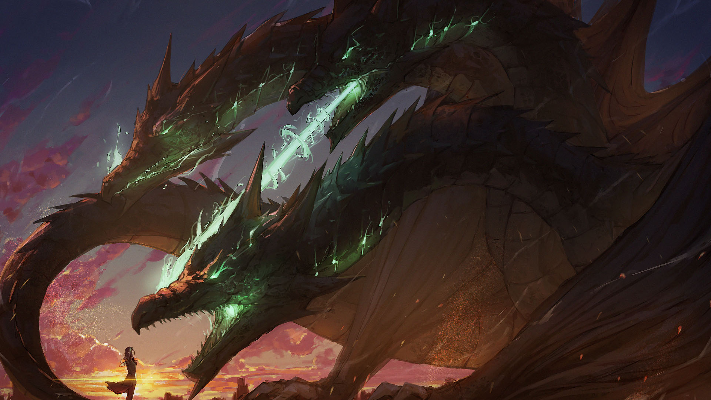
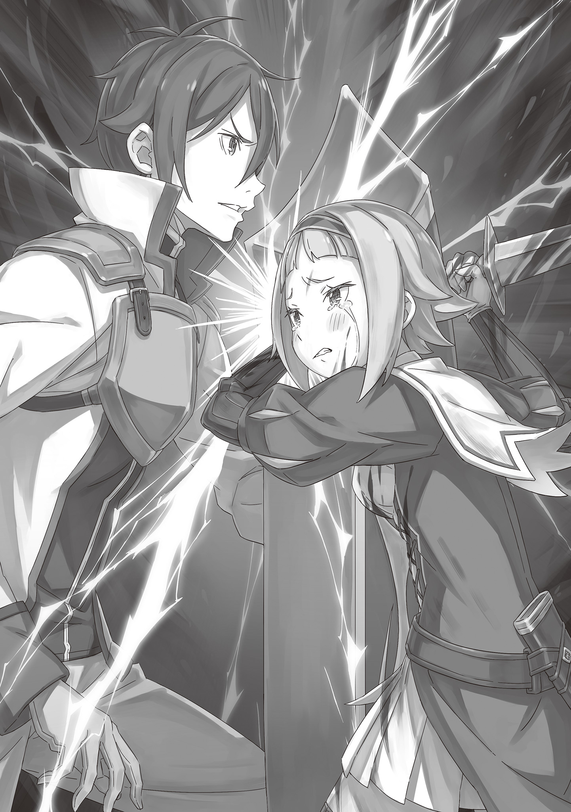

Тысяча Языков Пламени

第五章 『五幕／千火』

× × ×

— Я поняла истинную цель врага — как они расторгнут Пакт! — с серьёзным лицом заявила Розвааль посреди драконьей повозки, несущейся к месту решающей битвы.

Всё началось с нападения сторонников Страйда на королевский замок и сообщения от проклятой Тиши Астрея. Стало ясно, что Пиктатт, место с непростой историей, станет последним полем боя со Страйдом. Осознавая, что на кону престиж королевства, многие воины вызвались добровольцами. Из них в рекордно короткие сроки был сформирован отряд покорения, авангард которого поручили возглавить отряду Зелгефа. Естественно, были призваны его капитан Вильгельм, заместители Гримм и Конвуд, а также все бойцы, считавшиеся элитой — цвет вооруженных сил Королевства Лугуника на данный момент.

Вместе с отрядом Зелгефа, помимо Розвааль, ехал ещё один посторонний человек.

Им был…

— Поведай нам, госпожа Мейзерс. Честно говоря, начинать бой, совершенно не представляя замыслов противника, — затея совсем не здравая, — тяжелым голосом отозвался Бордо, скрестив на груди руки, толстые, словно бревна, и протяжно выдохнул.

Его любимая алебарда размером с него самого и тяжелые доспехи, в которых обычный человек не смог бы и стоять, — всё это свидетельствовало о том, что Бордо присоединился к отряду Зелгефа как воин. Все предыдущие ходы в тайной игре Страйда опережали их, а вторжение в королевский замок стало последней каплей для «Бешеного Пса». Он хвастался, что и после передачи командования не прекращал тренировок, и временно вернулся в строй, пообещав не быть обузой.

В ответ на слова Бордо Розвааль подняла один палец.

— Точнее говоря-я-я, разрыв Пакта — это стратегическая цель противника, а не какой-то конкретный ритуал или артефакт с подобным эффектом. Сначала давайте проясним это недоразумение.

— Что ты имеешь в виду?

— Конкретно, это последовательность шагов, необходимых для достижения цели… Пакт, как известно, заключен между Королевством Лугуника и Божественным Драконом Волканикой. Вы же знаете его содержание, да?

— Знаем. Сказка о том, как Дракон любезно спасает королевство в час гибели.

— Верно. Как мы уже не раз убеждались. Наше Королевство Лугуника долгое время процветало под защитой Божественного Дракона. Нас не тревожили ни вторжения других стран, ни неподвластные человеку стихийные бедствия. Но затем появилась трещина. Война Полулюдей.

При упоминании этого Вильгельм, Гримм и остальные слегка нахмурились.

— Вы ведь все задумывались, правда? Если бы пакт с Драконом все ещё действовал, Война Полулюдей не случилась бы. Та гражданская война и есть ответ.

Розвааль обвела взглядом всех в повозке, и никто не мог ответить ей ничего, кроме молчания. То же самое несколько месяцев назад Вильгельм и остальные обсуждали в кабинете Бордо. Дракон не придет. Все, кто был замешан в гражданской войне, смутно это подозревали.

И это касалось не только жителей королевства. Империя, Священное Королевство, Города-государства — все думали так же.

Просто никто не решался это проверить…

— Никто не захочет первым сунуть руку в кипящий котелок. Но что, если выяснится, что котелок, который, как все думали, стоит на огне, на самом деле пуст?

— ..Это и есть то, что пытается сделать Страйд? — наконец поняв суть её речи, Вильгельм тоже пришёл к этому выводу.

Цель Страйда… опасения Гиониса Лугуника насчет похищения надписей с Драконьей Скрижали, настойчивое преследование «Святой Меча» Терезии, вовлечение в заговор остатков полулюдей, затаивших обиду на королевство, — всё это ради того, чтобы сорвать с Лугуники личину Драконьего королевства.

Доказать королевству и другим странам, что «пакта», в существовании которого все и так сомневались, на самом деле нет. Это и есть разрыв Пакта Королевства Лугуника с Божественным Драконом.

Но чтобы добиться этого, Страйду и его людям нужно было кое-что выполнить.

— И это — победа над нами… нет, над «Демоном Меча» Вильгельмом ван Астрея? Теперь понятно, почему он назвал твое имя. Смысл ясен, — сказал Бордо, придя к тому же выводу, и посмотрел на Вильгельма. Тот коснулся меча на поясе, ощутив рукоять «Астрея» — клинка, выбранного Бертолем Астрея.

Гнев на то, что он стал мишенью в столь масштабном и возмутительном плане, конечно, был. Но это было гораздо лучше, чем если бы всё закончилось там, куда Вильгельм не смог бы дотянуться.

— Моя задача не меняется. Вместе с его замыслами я разрублю Страйда на куски!

— Да! — без колебаний кивнул Гримм на заявление Вильгельма.

В этот момент не было никого, кто превосходил бы этих двоих в мотивации и боевом духе для сражения со сторонниками Страйда. Они дадут понять врагу, что тот перешел дорогу не тем, кому следовало.

Почувствовав возросший боевой дух обоих, Розвааль прикрыла свой голубой глаз и произнесла:

— Кстати, господин Бордо, вы выполнили мою просьбу перед отъездом? Тщательно проверили всех, включая следующие за нами отряды?

— Хм, разумеется. Однако многие неохотно шли на самопроверку. Не было ли излишним заявлять, что это может считаться пособничеством врагу?

— Нет, ничего подобного. Уверена, скоро станет ясно…

Именно в тот момент, когда Розвааль это сказала, понимание пришло само собой.

— …! — раздались возгласы удивления, и на мгновение в драконьей повозке воцарился хаос. Зады подпрыгнули на сиденьях, сложенные у стен оружие и доспехи загремели, люди едва не потеряли равновесие. Все были поражены явлением, которое просто не могло произойти в несущейся на полной скорости повозке.

Земляных драконов, защищённых «Божественной Защитой Заграждения от Ветра», ничто не могло остановить в их стремительном беге. Ни встречный ветер, ни бездорожье не были им помехой, и эта благодать распространялась и на повозку, которую они тянули.

Но она прервалась. В результате повозку с Вильгельмом и остальными начало сильно трясти. Нет, не только их. Все повозки отряда Зелгефа.

— Вот о чем говорила госпожа Мейзерс — отключение Божественных Защит…

— Запретная техника, создающая слепую зону для Од Лагуны… Какое же ненавистное создание, — прозвучали слова Пивота и Розвааль, объясняющие произошедшее и его причину.

Это было наследие «Ведьмы», принесенное из долины Шамрок — одна из ловушек, расставленных Страйдом, которую Розвааль с таким трудом расшифровала. Потеря Божественной Защиты для тех, кто ею обладал, была равносильна потере руки или ноги, глаза или уха — врожденных органов чувств. Многие обладатели Защит не могли приспособиться к этому новому, неведомому ощущению. Были опасения, что некоторые, не справившись с возникшим диссонансом, могли даже повредиться рассудком.

Именно поэтому Розвааль заранее предупредила, чтобы из карательного отряда исключили всех обладателей Божественных Защит.

— Ты то-о-оже сомневался?

— Ты и раньше выкидывала всякое. Я прекрасно понимаю, где ты шутишь, а где нет.

— Какие жестокие слова-а-а…

Неизвестно, что именно задело её за живое, но Розвааль радостно рассмеялась в ответ Вильгельму. Затем она сползла на сиденье и, пока повозку трясло, прижалась к нему.

— Эй, — подозрительно буркнул он. Розвааль посмотрела на него своим голубым глазом.

— В благодарность, дам тебе один совет. — Сейчас тебе нужна не самокритика. А гнев.

— …

— Прозрачный гнев и мысли о враге, которого нужно сразить, — вот что вернет твоему мечу былую высоту, «Демон Меча» Вильгельм Триас. Ведь это твое имя, так?

Словно накладывая заклинание, Розвааль назвала Вильгельма его родовой фамилией. Словно пытаясь пробудить того «Демона Меча», что прошел Войну Полулюдей и в итоге одолел «Святую Меча».

— ..Какая же ты мудрёная женщина. Долго рассусоливаешь то, что можно было сказать одной фразой: «Не будь идиотом».

— Это проявление женского сердца, которое хочет подольше поговорить с тобо-о-ой.

Слишком беззаботный разговор для преддверия битвы. Но именно такие беседы они часто вели во время гражданской войны, возвращая Вильгельма к состоянию «Демона Меча» тех времен.

С этой решимостью в сердце, не колеблясь, Вильгельм устремил свой взгляд голубых глаз по направлению движения повозки…

— …

В следующее мгновение с далекого неба обрушилась ударная волна, сметающая колонну драконьих повозок.

— Двигайтесь!

Крик Гримма, ударивший по ушам, опередил ударную волну.

Поэтому Вильгельм успел прижать к себе сидевшую рядом Розвааль, свободной рукой выхватить меч, разрубить им стену повозки и выпрыгнуть наружу.

В то же мгновение багровая ударная волна показала свои клыки, поглотив драконью повозку, словно волна цунами. Краем глаза Вильгельм увидел, как сметенная ударом колонна разлетается в стороны. Лишь горстка самых умелых бойцов, подобно Вильгельму, сумела избежать гибели.

Но остальные были сметены без всякой возможности сопротивления, и дорога в одно мгновение превратилась в ад, наполненный криками агонии.

— От головы до хвоста… всю экспедицию покорения!

Замедлив падение и приземлившись, Вильгельм стиснул зубы, глядя на это чудовищное бедствие. Большинство бойцов отряда Зелгефа успели выпрыгнуть из повозок благодаря мгновенной реакции, но потери среди наспех собранного отряда были огромны. Многие повозки были разрушены до неузнаваемости, и те, кто остался внутри, скорее всего, погибли.

— Не может быть… — прозвучал рядом растерянный голос. То была Розвааль, которую Вильгельм обхватил за талию и вытащил в последний момент. Видя её смятение, столь нехарактерное для обычно невозмутимой женщины, Вильгельм понял всю серьёзность ситуации и уже собирался отдать приказ о спасении, как вдруг заметил… Розвааль смотрела в небо.

— …

Застывшая, с широко раскрытыми разноцветными глазами, на лице Розвааль застыло выражение крайнего изумления. Но не только она. Остальные, кто избежал ранений, тоже смотрели в небо.

И тогда…

— Вильгельм! — позвал его Гримм, которому тоже удалось выбраться из повозки, указывая в небо.

Поддавшись его движению, Вильгельм тоже наконец поднял голову. Вдали, в конце дороги, виднелись очертания цели — торгового города Пиктатт. А в небе над городом, очень высоко, парило странное черное облако.

Черное облако взмахивало огромными крыльями, и его золотые глаза, сияющие ослепительно ярко, смотрели на землю.

— Нет…

Он подавил слабость, заставлявшую отрицать увиденное, пытаясь уложить его в рамки понимания.

Это было не черное облако. Это было нечто, известное каждому в этом мире. Нечто, что никто не ожидал увидеть воочию. Существо, живущее по законам, непостижимым для смертных.

Это был…

— Дракон!

Расправив черные крылья, над центром торгового города зависло невероятно могущественное существо.

Это был трехглавый Злой Дракон, который, как ни парадоксально, обрушил свое дыхание на воинов, пытавшихся спасти Драконье королевство.

На крыше шпиля стоял удушливый запах крови.

Источник его — множество тел, лежавших в лужах собственной крови, сраженные прекрасными взмахами меча. Их жизненная сила иссякла, и они превратились в безжизненные, остывающие оболочки.

А та, кого заставили отнять их жизни против её воли, та, кого выбрали в качестве жертвы…

— Кэрол!

Кэрол Ремендис в боевом облачении, со своим любимым мечом в руке.

Раньше её часто можно было увидеть в доспехах, но в последнее время такие случаи стали редкостью. Это было свидетельством того, что она отдалялась от поля боя, а королевство постепенно оставляло позади эпоху раздоров. Терезия с грустью и одновременно радостью предчувствовала, что скоро Кэрол в своем строгом боевом облачении будет появляться только на церемониях и парадах.

Теперь это боевое облачение было забрызгано бесчисленными каплями крови, а её отточенный меч — осквернен.

— …

Ни гнева, ни печали уже не было в её зеленых глазах. Щеки Кэрол, крепко сжимавшей свой меч, были мокры от слез еще больше, чем от крови. В её взгляде была лишь мольба.

Это была не мольба о прощении.

Это была мольба о наказании.

Кэрол, чьи тело и разум были осквернены контролем «Десяти Заповедей Гордыни», жаждала искупления.

Не нужно было гадать, чья смерть стала причиной этой жажды искупления. Хотелось подбежать к ней, обнять, собрать осколки её разбитого сердца.

Но это было невозможно. Не из-за кандалов на ногах, не из-за проклятия, наложенного на её дитя, а из-за ещё одного «козыря», приготовленного Страйдом.

— Божественная Защита… — она её больше не чувствовала.

Исчезновение ощущения двух Божественных Защит, которыми обладала Терезия, — «Божественной Защиты Святого Меча» и «Божественной Защиты Бога Смерти» — принесло ей невообразимое… нет, невообразимо сильное чувство утраты.

— …

«Божественная Защита Святого Меча», передававшаяся из поколения в поколение в семье Астрея и единственная, как считается, обретаемая по наследству, могла быть передана следующему поколению ещё при жизни текущего обладателя. Сама Терезия была одной из тех, кто унаследовал Защиту ещё при жизни своего дяди, предыдущего «Святого Меча», ныне покойного. Поэтому она была готова к тому, что однажды «Божественная Защита Святого Меча» покинет её.

Но сейчас всё было иначе. Исчезла не только «Божественная Защита Святогр Меча», но и та, с которой Терезия родилась — «Божественная Защита Бога Смерти».

Нет, не исчезла.

Уснула.

И эта перемена, вероятно, коснулась не только Терезии.

Это тоже было частью коварного плана Страйда, обратившего свою ненависть против незримых сил — но лишь частью. Потому что его продуманный план шёл дальше лишения Божественных Защит.

Это был…

— Надо признать, вид впечатляет, когда смотришь так близко.

Неужели это тоже часть жатвы плодов? На лице Страйда появилась холодная усмешка, но в ней промелькнула толика тепла. На него и на тех, кто последовал за ним на залитую кровью крышу, упала тень. Длинные красные волосы Терезии взметнулись от порыва ветра, но она не могла отвести глаз.

Огромные крылья распластались в небе, гигантское тело было покрыто чешуей цвета воронова крыла, твердой, как сталь. Голова, сочетающая черты ящерицы и змеи, моргала золотыми глазами. И таких голов было три, соединённых с одним туловищем.

Его величественный вид, исходящая от него демоническая аура — сильнейшее существо, живущее по законам, непостижимым для смертных, — трехглавый Злой Дракон, взмахнув крыльями, спускался с небес Пиктатта.

— Ах!

Любой, кто живет в Королевстве Лугуника, растёт со знанием того, что находится под защитой Божественного Дракона. Даже не видев его величественного облика воочию, люди естественным образом испытывают к Дракону почтение.

Терезия не была исключением; благодарность и уважение к Дракону жили в её сердце неосознанно. Но встретиться с Драконом лицом к лицу ей, «Святой Меча», довелось впервые.

Тем более, было немыслимо видеть этого Дракона под властью отвратительного злодея.

— «Нефритовый Указательный Палец», «Янтарный Средний Палец» и «Лазурный Безымянный Палец», да? Три головы, три души — жадный зверь, раз уж отхватил три моих пальца.

Поднятая к небу левая рука Страйда испустила зловещее сияние — точно так же он проклял Кэрол, Тишу Астрея и дитя в чреве Терезии, а теперь пытался проклятием сковать души Злого Дракона. Но Злой Дракон не собирался покорно подчиняться.

— Гррррррааааааааа!!!

Издав свирепый рык, Злой Дракон попытался сопротивляться путам. Его хвост, окутанный ветром, со скоростью, опережающей звук, метнулся к дерзкому злодею, осмелившемуся подчинить себе Дракона.

Но удар хвоста не достиг Страйда.

Вперед выступил Курган, отразив его своим огромным тесаком; последующий удар когтями отбили два синоби, превратившиеся в тени; а порыв ветра от взмаха крыльев рассек сверкнувший меч Кэрол, защитившей зловещего предводителя.

— Сюда.

Перед этой кошмарной сценой застывшую Терезию потянула за рукав Мелинда. Она отвела Терезию подальше от вихря, подняв руку, чтобы защитить её от обломков и пыли.

Не в силах сопротивляться, Терезия спряталась за спину Мелинды, и её ушей достиг насмешливый смех.

— Видишь, «Святая Меча»? Этот глупый, жалкий, яростный Дракон — лишь пустая оболочка, драконий панцирь, утративший свою суть. Следуя инстинкту самосохранения, он прилетел, чтобы вернуть свою забрызганную жертвенной кровью сущность.

— Жертвенной… крови…

Дракон продолжал обрушивать смертельные удары, но Страйд перепоручил защиту своим приспешникам, сосредоточившись на противостоянии с душой Злого Дракона. Глаза Терезии расширились от слов насмехающегося мужчины, и она резко огляделась. Среди тел, сраженных мечом Кэрол, посреди горы смерти и крови, она увидела причину его насмешки.

Это был череп неизвестного драконида с тремя черными рогами.

Что это означало, Терезия не знала. Она не понимала связи между этим черепом и трехглавым Злым Драконом. Ясно было лишь то, что целью Злого Дракона была эта кость, а кровь была частью ритуала призыва.

И то, что один из глаз призванного Злого Дракона окрасился в нефритовый цвет.

— Полулюдей, желавших гибели королевству и готовых стать жертвой, было предостаточно. Яростный Дракон, призванный их кровью… может ли быть более подходящий актер для разоблачения лжи Драконьего королевства?

— С…

Крик предостережения опоздал. Сияющий указательный палец Страйда уже указывал на горизонт. На дорогу, ведущую из Пиктатта к горизонту — туда и было направлено дыхание разрушения.

— …

Вдалеке было видно, как алый свет пронесся по земле, сметая все на своем пути, и поднялся столб дыма. Мгновением позже порожденный им ветер и звук достигли Терезии и остальных, находившихся далеко. Чувство, будто весь город содрогнулся, прошло по ногам, доказывая чудовищную разрушительную силу Дракона.

И несмотря на это доказательство, неведомый ужас не отступал. Ведь оставалось ещё две головы.

— Не так-то просто подчинить, да? Но это лишь вопрос времени.

— Отбор здесь завершён. Теперь за грань пройдут лишь те герои, что достойны испытания.

Рядом со Страйдом, прищурившим один глаз, отозвался Курган низким голосом, опустив свой огромный тесак. Курган защищал Страйда от атак Злого Дракона, но в этом больше не было нужды. Одна из трех голов была подчинена, и сопротивление Злого Дракона постепенно ослабевало. Лишь две оставшиеся головы продолжали бороться, обливаясь слюной, пытаясь не поддаться проклятию перстней.

Подчинение Злого Дракона Страйдом, как он и сказал, было лишь вопросом времени. И когда это свершится, наступит немыслимое — Дракон будет топтать Королевство Дракона…

— Ваша Светлость, за облаком пыли от дыхания замечено движение, как нам докладывают, — сообщил Страйду синоби, напряженно всматривающийся вдаль, где всё ещё поднимался дым.

Услышав это, Страйд, продолжая сосредоточенно подчинять Злого Дракона, спросил:

— Докладывай точно. Движение вперед или назад?

— Насколько я вижу, движутся вперед.

— Кха, ха-ха, кха-ха-ха-ха-ха-ха! — рассмеялся Страйд в ответ другому синоби.

Это был не насмешливый и не холодный смех, а какой-то лишенный яда, похожий на смех злого мальчишки, радующегося успеху в детской игре — несбалансированный и искаженный.

— Так вы всё же не позволите певцу сойти с пути «Небесной Воли», проклятые Наблюдатели! — прошипел Страйд, вдоволь насмеявшись, его черные глаза яростно заблестели.

А затем…

— Райдзо, Шаске! «Генералам» пора занять места на доске. Наконец-то, представился желанный случай. Как и обещал, я использую вас как расходный материал!

— Слушаемся, — глубоко поклонились два синоби на этот безжалостный приказ и растворились в тени.

Проводив их взглядом, Страйд затем посмотрел на гигантскую фигуру стоявшего рядом Кургана.

— …

Черные глаза Страйда и красные глаза Кургана встретились, и на мгновение воцарилась тишина. Однако оба, не нарушая её, обменялись фразами, которые сложно было назвать просто приказом и ответом:

— Иди, «Восьмирукий» Курган. Исполни своё заветное желание.

— Я иду, Страйд. И ты сверши своё великое стремление.

Обменявшись этими словами, сильнейший Бог Войны Империи оттолкнулся от крыши и полетел в город. Навстречу врагу, излучая демоническую ауру.

Проводив взглядом улетающую громадную фигуру, Страйд поднял голову к Злому Дракону, который продолжал сопротивляться его воле. Затем, не опуская глаз, он обратился к жене: «Мелинда».

— Уведи «Святую Меча» обратно в башню. А те, кого ты пленила своими глазами?

— А… в-все уже расставлены по местам, Ваша Светлость.

— Хорошо. Исполни долг Моей жены. В этом смысл жизни такого ничтожества, как ты.

— Да, Ваша Светлость… — прошептала Мелинда, прижав руку к груди, словно пытаясь унять бешено колотящееся сердце, и кивнула. Её бледные щеки слегка порозовели, и она снова взяла Терезию за руку, чтобы увести в башню.

Сопротивляясь её руке, Терезия крикнула злодею в спину: «Страйд!». Мужчина не обернулся, но обратил на неё своё внимание. Терезия колебалась, подбирая слова…

— Довольно уже! Кэрол…

— Не произноси желаний, которым не суждено сбыться. Это ничем не отличается от щебетания беспомощного птенца.

— …!

— Право озвучивать желания есть только у сильных. Ты к ним не относишься.

Разгадав её хрупкую надежду, Страйд заставил Терезию задрожать от бессилия. Он поднял руку, словно не желая больше слушать, и аметистовый свет лишил её дара речи.

Синоби и Курган ушли, даже Мелинду отослали. На крыше осталась лишь Кэрол, вынужденная стоять рядом со Страйдом, стремящимся подчинить Злого Дракона. Терезия, представляя её чувства, ощутила, как сжалось сердце. Но прежде чем её увели обратно в башню, она должна была нанести хотя бы один удар…

— А у тебя оно есть? Право топтать желания множества людей?

— Иди, — холодно отрезал Страйд, хотя Терезия ожидала немедленного утвердительного ответа.

Словно он сам прекрасно осознавал, что у него такого права нет.

Появление Злого Дракона и его «отбор» дыханием посеяли хаос в отряде покорения.

— …

Дракон, которых не видели десятилетиями, а может и столетиями, внезапно появился и безжалостно атаковал карательный отряд. Трехглавый Злой Дракон, зависший прямо над городом, не мог быть не связан со сторонниками Страйда, ожидавшими их. Вероятность этого была равна нулю.

То есть враг подчинил себе даже Дракона…

— Нет, враг не полностью контролирует Дракона. В этом наш шанс на победу!

— Ты в своем уме?

— Разумее-е-ется, в своем. Господин Бордо, позвольте высказать предложение.

Пока паника из-за появления Дракона распространялась, а крики боли и яростные приказы раздавались среди тех, кто пытался спасти раненых, Розвааль, первой пришедшая в себя, повернулась к Бордо, который стирал кровь со лба тыльной стороной ладони.

Услышав твердость в её голосе, Бордо кивнул: «Слушаю».

— Этот Дракон, без сомнения, — козырь, приготовленный Страйдом. Похищение «Святой Меча» с помощью «Десяти Заповедей Гордыни», лишение Божественных Защит с использованием темного наследия Войны Полулюдей, и, как назло, план заставить Дракона топтать Драконье королевство — всё это шаги к гибели, без сомнений.

— Не могу не поразиться его расчётливости, хоть он и враг…

— Да, разделяю ваше мнение. Но-о-о… лазейка ещё есть. И доказательством тому…

— Повторной атаки нет, — заключил за Розвааль Гримм, пристально глядя на далекого Дракона.

Щёлкнув пальцами на слова Гримма, Розвааль кивнула: «Именно».

— После первой атаки, сорвавшей наше наступление, если бы каждая из голов Злого Дракона обрушила на нас своё дыхание, мы бы даже не смогли приблизиться к городу. Посе-э-эму я делаю вывод, что они не полностью контролируют Дракона. Однако, если мы будем медлить, всё может измениться. Значит…

— Значит, успеть можем только мы, и только сейчас.

— …

Интуиция воина подсказала Вильгельму согласиться с предположением Розвааль.

Бордо, выслушав предложение, скрестил толстые руки на груди, колеблясь между наступлением и отступлением. Даже если бы Бордо выбрал отступление, Вильгельм бы не отступил, но…

— «Бешеный Пёс» Бордо! — раздался голос, дрожащий от гнева и боевого духа, зовущий его.

Это был не голос Розвааль. И, конечно, не Вильгельма или Гримма.

Голос принадлежал Конвуду, который слушал их разговор. Его глаза горели сильным чувством долга, и он был не единственным, кто смотрел на Бордо так. Все рыцари, собравшиеся здесь и ещё способные сражаться… нет, даже те, кто был ранен и больше не мог считаться боевой силой, — все разделяли одну мысль.

— Сражаемся! За королевство, за «Святую Меча»… за наши мечи и нашу гордость!

В ответ на эти слова все как один подняли мечи. Чтобы показать, что значит быть рыцарем королевства.

Увидев это, Бордо закрыл глаза. В его груди на чашах весов взвешивались боевой дух и долг. И чаша склонилась.

— Ах вы, кретины… — прорычал он один раз прежним грубым тоном и с улыбкой на лице закинул свою алебарду на плечо. Затем медленно поднял голову к Злому Дракону, взиравшему на землю с далекого неба.

Ему не потребовалось много времени, чтобы принять решение.

— Похоже, наша ставка сыграла, — пробормотал Вильгельм, когда отряд смертников во главе с ним успешно прорвался в город.

Был предложен план разделить отряд и атаковать Пиктатт с четырех направлений, чтобы подготовиться к возможному препятствию, но в итоге было решено атаковать единым кулаком, всей массой. Формация была выбрана с упором на скорость и атаку, но, как и ожидалось, на пути не было никаких преград, а дыхание Злого Дракона ударило лишь раз, в самом начале. То, что это не было сбережением сил, становилось ясно по мере приближения к Дракону.

— Грррррр…

Невероятный гигант длиной в десятки метров, облаченный в черную, блестящую, как сталь, чешую, с тремя головами, изрыгающими всесокрушающее дыхание, — воистину, Дракон из древних легенд, внушающий ужас.

Однако сейчас этот Злой Дракон извивался в воздухе, и рычание непрерывно доносилось из его трех глоток.

Было очевидно, что свобода Злого Дракона скована, и он сопротивляется нежеланному контролю. Это было лучшим доказательством правоты Розвааль и наличия у Страйда уязвимости.

— Но и эта возможность исчезнет со временем. Отсюда начинается гонка со временем.

— К несчастью, у меня руки будут заняты Страйдом и его шайкой. Нет времени ещё и со временем фехтовать. Может статься, что после всего этого придется ещё и с Драконом разбираться.

Даже если Дракон избежит контроля Страйда, не было гарантии, что он будет дружелюбен к ним. Вполне возможно, что после уничтожения сторонников Страйда придется сражаться ещё и со Злым Драконом.

— Какая бравада-а-а. Вот это в твоем духе, и то, что это вызывает у меня улыбку, так приятно-о-о, — весело рассмеялась Розвааль, бежавшая рядом с Вильгельмом, услышав его слова, не выказывавшие страха даже перед Драконом.

Пока он косился на неё, отряд смертников мчался по главной улице города, направляясь к центральному району — к шпилю, над которым парил Злой Дракон. Точное местонахождение сторонников Страйда было неизвестно. Но если он испытывал трудности с контролем над Драконом, то его позиция у подножия Дракона не могла быть ошибкой…

— Стойте! Посмотрите туда! — внезапно раздался крик одного из рыцарей, и Вильгельм с теми, кто бежал впереди, остановились.

Впереди, на пути следования отряда, на улицу, пошатываясь, выходила человеческая фигура. На мгновение мелькнула мысль, что это убийца от Страйда, и все насторожились, но тут же поняли, что это не так. На оружии в руках человека и на его доспехах был выгравирован герб города.

— Это же городской стражник, верно?

Слова рыцаря, заметившего это зорким глазом, вызвали всеобщее согласие. Вильгельм уже начал ослаблять бдительность, радуясь появлению союзника, у которого можно было бы узнать о ситуации в городе.

Однако его остановил профиль Гримма, вышедшего на шаг вперед. Он молчал. Но Вильгельм не доверял ничему так сильно, как предчувствию Гримма, за исключением слов Терезии.

И это предчувствие оправдалось.

— Эй, это уже слишком… — произнес дрожащим голосом рыцарь, почувствовавший неладное, и огляделся. Со всех сторон послышались бесчисленные шаги, стучащие по мостовой. Звук заполнил улицу, достаточно широкую, чтобы на ней могли свободно разъехаться несколько драконьих повозок.

Сначала один, потом пятеро, десять… и вот уже черная толпа заполнила улицу. Их шаг перешел в бег, они толкались, сталкивались и ринулись вперед всей массой.

«Плохо дело», — понял он, когда пути к отступлению уже не было.

— Поднять щиты! Прорываемся в одной точке! Нас раздавят!

— Оооооооо! — взревел Бордо, и рыцари мгновенно отреагировали. Во главе с Гриммом, который вырвался вперед раньше всех, воины со щитами столкнулись с первой волной людей… раздался оглушительный грохот.

— …!!!

К яростному грохоту ударов примешались стоны боли, звуки рвущейся плоти и хрустящих костей терзали барабанные перепонки. Это повторялось снова и снова, волна за волной, мешая продвижению их отряда. Бордо, выставив вперед алебарду и сопротивляясь яростному натиску толпы, стиснул зубы.

— Почему?! Неужели городская стража перешла на сторону Страйда?!..

— Не так! Глаза!

— Что?

Бордо, озадаченный, уставился на Вильгельма, чей крик прорезал шум битвы. Не вынимая меча из ножен, Вильгельм сбивал противников с ног и, указывая на свои глаза, кричал:

— У всех глаза странные! Я уже видел! Это люди Страйда!

— Та женщина, с которой вы встретились взглядом через зеркало… У них такой же узор в глазах.

Крик Вильгельма вызвал ответ Пивота, осматривающего окрестности, и в памяти Вильгельма всплыли воспоминания. В тот день, когда он не смог убить Страйда, напавшего на особняк Астрея, он встретился взглядом через «Зеркало Связи» с женщиной. Той самой женщиной, из-за которой он начал видеть фантом Пивота.

И сейчас глаза стражников, обративших свои клыки на Вильгельма и его людей, были подёрнуты тем же паутинообразным узором, что и у той седовласой женщины. Их разум был пленен.

— Злые Глаза… Курган, синоби, теперь это… Чего только они не припасли, меняя тактику и средства, — вздохнула Розвааль, узнав в словах Вильгельма знакомое явление. Она ловко уклонялась от атак стражников, вырубая их сильными ударами кулаков.

Бордо и Конвуд, хоть и не так искусно, как Розвааль, но всё же как элита королевства, парировали атаки стражников, пользуясь превосходством в силе, и с трудом удерживали позиции, чтобы их не раздавили.

Однако подавляющее численное превосходство врага было неоспоримо, и это равновесие продержалось бы ещё от силы несколько минут.

— Нужно где-то нарушить баланс сил. Готовность… зарубить их.

— …

В пылу сражения их взгляды встретились — разноцветные глаза Розвааль и глаза Вильгельма. Он стиснул зубы. Как всегда, эта женщина берет на себя роль злодея, говоря то, что кто-то должен сказать. Её слова зажгли в Вильгельме, колебавшемся выхватить меч, огонь решимости. Проклиная подлость замысла — стравить их со стражей Пиктатта, то есть с людьми королевства, — Вильгельм уже готов был принять жестокое решение…

— Вильгельм!!!

В тот же миг, отреагировав на крик Гримма, он рефлекторно выхватил меч. Если бы не это, он был бы мертв.

— …!

Мгновенно выхватив меч, он поставил его вертикально, принимая удар тяжелого клинка, летевшего с силой пушечного ядра. Удар пронзил всё тело Вильгельма, он не смог устоять на ногах и был отброшен назад. Но отлетел не только Вильгельм, но и его противник.

Атака тараном, не заботящаяся о приземлении, мощь, сравнимая с летящей глыбой, — всё это было реализовано восемью руками, держащими четыре демонических тесака, принадлежавших непревзойденному Богу Войны…

— Удача, «Демон Меча». Хорошо, что ты выжил после дыхания Злого Дракона.

— А вот я твою рожу видеть совсем не хотел, «Восьмирукий» Курган!

Курган, разбив коленом мостовую, с силой приземлился. Вильгельм сплюнул кровь, подступившую к горлу, и свирепо посмотрел на него, на чьем лице играла злобная ухмылка. Курган ворвался в суматоху боя с невероятного угла. Честно говоря, если бы не предупреждение Гримма, Вильгельм был бы уже мертв, и битва была бы проиграна.

— Вильгельм, нас отрезали от молодого господина и остальных. Если так пойдет и дальше…

— Понимаю! Розвааль! Ты… — кивнул Вильгельм на шёпот Пивота в критической ситуации и посмотрел в сторону основного боя.

Атака Кургана пробила брешь на поле боя, где смешались враги и союзники. Воспользовавшись этим, Гримм и остальные могли бы прорвать окружение и добраться до Страйда. Вильгельм решил, что его роль — сразиться здесь с Курганом.

Однако…

— Её нет? — изумленно вырвалось у Вильгельма, чьи глаза расширились.

На поле боя, где Бог Войны пробил брешь, не было Розвааль, которая должна была там быть. Мелькнула паническая мысль, что её могло задеть той атакой и отбросить. Но эта паника сменилась ещё большим удивлением.

Глаза Вильгельма заметили… — Как тень на поле боя пошла рябью, словно водная гладь.

— …

Тень так же дрожала, когда Страйд ускользнул от него. Техника синоби, позволяющая перемещаться сквозь тени. Они воспользовались суматохой боя и утащили Розвааль.

— Не паникуй, Вильгельм! Госпожа ушла вместе с Гриммом! — громкий голос Бордо вернул Вильгельма к реальности, вырвав из пекла мыслей.

Вильгельм моргнул и увидел могучую спину Бордо, который, размахивая алебардой, сбивал с ног стражников и отважно сражался. Это придало ему мужества. И правда, Гримма тоже там не было.

Неизвестно, что ждало их впереди, но он доверится отваге Гримма и Розвааль. У самого Вильгельма тоже не было времени топтаться на месте перед сильным врагом.

— Благодарю достойного противника. Это конец королевства. Пусть наш с тобой поединок будет ему достойным завершением.

— Как всегда, несешь чушь по своему усмотрению. Долго возиться с тобой не собираюсь.

— Тогда пусть эти несколько мгновений станут лучшими в моей жизни.

С этими словами мечи «Демона Меча» и «Восьмирукого» скрестились, а их сила столкнулась.

«Танец Серебряного Цветка» — лепестки второго раунда раскрылись посреди хаоса битвы в Пиктатте.

В тот момент, когда тень освободила его, Гримм потерял ориентацию в пространстве, небо и земля поменялись местами. Он инстинктивно вытянул руку к земле и сумел упасть лишь на одно колено. Тут же отпрыгнул далеко назад, выставив большой щит с гербом дома Ремендис, готовясь к атаке.

Но ожидаемой атаки не последовало. Нет… вообще, где он оказался, перенесшись сквозь тень?

— Не справиться даже с таким пустяком… Не повезло Мне и с «генералами». Зачем ты притащил сюда ещё и этого непрошеного простолюдина? Попробуй оправдаться.

— Чрезвычайно догадливый господин был, как оказалось. Схватил за руку нужную женщину, как нам и требовалось.

— Болван. Твоя вина очевидна, и оправданий быть не может.

Перед напряженно застывшим Гриммом разговаривали худощавый мужчина с длинными фиолетовыми волосами и синоби в черном одеянии, почтительно отвечавший ему. Из их разговора можно было сделать выводы. Да и без того, он так часто видел его лицо на розыскных листах, что оно въелось ему в память и снилось по ночам.

Этот мужчина и был источником всех бед, поставившим Королевство Лугуника на грань гибели — Страйд.

— Надо же, надо же, не ожидала, что меня пригласят прямо к источнику всего зла-а-а, — произнесла стоявшая рядом прекрасная женщина, Розвааль, глядя на того же человека. Она невозмутимо принимала боевую стойку, и, похоже, не была ранена.

Он испытал облегчение. Она была его боевым товарищем и важной подругой Кэрол.

Хорошо, что в тот момент, когда тень задрожала, он смог броситься туда, не раздумывая.

— Благодарю, Гримм. Благодаря тебе, мне не пришлось столкнуться с этим в одиночку.

— Да.

Ощущая, как кожу покалывает от бьющего в лицо ветра, Гримм кивнул Розвааль. В этом они с ней тоже были согласны. Нельзя было бросаться сюда в одиночку.

— Прямо над головой, на поле боя, где парил трехглавый Злой Дракон, сопротивляющийся накладываемому на него проклятию.

— Гррррррр…

Воздух содрогнулся от стона Дракона, способного убить целый мир.

Гримм и Розвааль были выброшены из тени на крышу башни, обдуваемую ветром, который поднимал Дракон. Сократив расстояние до цели — шпиля, — они оказались перед предводителем врага. Страйд рассмеялся их изумлению и развел руки: «Впечатляет, не правда ли?»

— Могущественное создание, о котором слагают легенды, непостижимое для человеческого разума, — настоящий «Дракон», — а не может отбросить проклятие такого полумертвого, как Я, и так трогательно барахтается.

— Не мне судить, но… не скажешь, что это достойное увлечение, не так ли?

— Хо-о-о, Мои забавы тебе не по нраву? Я полагал, ты из тех, кто ценит развлечения, но, видимо, ошибся.

— Ради интереса, можно узнать, почему ты так обо мне подумал?

— Никакой сложной логики. Потому что ты, волшебница королевства, ближе всех подобралась к замыслу Моему.

Улыбка Страйда стала шире, его узкие глаза, в которых таилось зло, уставились на Розвааль. В поле зрения Страйда Гримм совершенно не существовал. Целью этого человека была исключительно Розвааль, раскрывшая большую часть его плана по уничтожению королевства.

Раз так, может, Гримму, которого игнорируют, стоит выждать момент и…

— Не советую безрассудно нападать, смею я заметить, — произнес синоби, бдительно прикрывавший слабости своего господина, и Гримм тоже был вынужден отказаться от необдуманных действий.

Бросив взгляд на Розвааль, он увидел, что она, похоже, пыталась вытянуть из Страйда как можно больше информации. Гримм решил последовать её плану и постарался сохранять спокойствие.

Присутствие Злого Дракона было угрозой, но если это логово врага, то здесь должно быть и то, что они ищут.

Похищенная Терезия и подчиненная Кэрол.

— То есть, поскольку я загнала вас в угол, мне полагается приз за отвагу? Это весьма любезно. Я как раз очень хотела размозжить тебе че-е-ереп!

— Неподобающие слова для одной из мудрейших женщин королевства, сведущей в магии. Но Я прощаю. Не говори глупостей о призах за отвагу. Этот заговор — для тебя.

— Для меня?

Розвааль прищурилась от этих зловещих слов. В следующее мгновение…

Легкий стук ног о крышу башни был заглушен ревом ветра, поднятого Драконом. Меч рассёк этот драконий ветер, описав красивую дугу и устремившись к шее Розвааль. Розвааль попыталась отразить удар черной кожаной перчаткой, но…

— Не пущу!

Гримм отразил удар меча своим щитом, спасая Розвааль от внезапной атаки. Нет. Розвааль предвидела эту атаку. Даже если бы Гримм не вмешался, она бы справилась сама.

Поэтому Гримм бросился вперед не ради Розвааль. А ради себя.

Потому что полуторный меч, нацеленный в спину Розвааль, держала…

— Гримм, — дрожащие бледные губы отчетливо произнесли имя Гримма, остановившего её меч.

Забрызганная кровью, вынужденная этим мечом отнимать жизни против своей воли — любимая женщина Гримма.

Кэрол Ремендис, проклятая Страйдом, была вынуждена сражаться.

Увидев на её щеках засохшие следы слёз, Гримм невольно протянул руку.

Хотелось обнять её. Хотелось прижать к себе. Никогда больше не отпускать.

Но она искусно владела мечом, выскользнула из его пальцев и отпрыгнула назад.

Слёзы снова потекли из её глаз, и их капли застыли в воздухе, когда она отлетала.

А затем…

— Я знал, что эта женщина — слуга «Святой Меча» и подруга Мейзерс. Посему считал её достойной пешкой, подходящей для того, чтобы стравить их друг с другом. Но никак не ожидал…

Кэрол, проливавшая слёзы, встала рядом со Страйдом и с грацией вновь приняла стойку, держа клинок в руке. Страйд прикоснулся рукой к её подбородку сбоку, его черные глаза засияли.

Засияли, и он, словно внезапно вспомнив, наконец, впервые, заметил присутствие Гримма.

— Что ты — любовник этой женщины… ха, вот так совпадение. «Святая Меча», Мейзерс, а теперь ещё и любимый мужчина… Неожиданно ты доставляешь Мне удовольствие!

— Нет, нет… нет… — всхлипывала Кэрол.

— Ещё не иссякли силы сопротивляться и слёзы проливать? Редко встретишь женщину, которой так идёт плачущее лицо. Наверняка, и ты как мужчина воспылаешь? Если нет…

Грубые, переходящие все границы приличия слова Страйда были прерваны звуком ломающегося камня.

— Ваша Светлость, шуткам тоже есть предел, должен заметить.

— Хмф, — фыркнул Страйд на замечание, но синоби не выказал недовольства.

Даже если его господин был самым презренным человеком, синоби верно защищал его тело.

Даже от обломков пола, которые Розвааль запустила, словно снаряды.

Спокойное, холодное, красивое лицо Розвааль излучало бесстрастную враждебность. Гримм помнил, что такое выражение лица у неё было, когда она смотрела на своего заклятого врага, «Ведьму».

То есть это была Розвааль J. Мейзерс в её истинном гневе.

— Вообще-то, мне следовало бы заставить тебя выложить весь план до мельчайших подробностей… но закрой свой рот, подлец. Твой голос больше невозможно слушать.

— Ха. Какое лицо. Мне тоже не нравятся твои глаза. Твои голубые глаза вызывают у Меня отвращение. Думаешь, проведя черту, сможешь остаться в рамках человечности? Не зазнавайся.

— …

— Мы с тобой — по одну сторону. Хочешь ты того или нет.

Ненависть и отвращение, взаимная кровавая враждебность — Розвааль и Страйд стояли друг против друга. Гримм, видя это краем глаза, тоже крепче сжал щит перед Кэрол.

Даже сейчас её стойка была завораживающе красива. Даже забрызганную кровью, её, посвятившую себя мечу и решившую защищать других, нельзя было осквернить.

— Гримм… прости меня, прости меня… прошу, меня…

— Кэрол, ты…

Рыдая, она произносила слова, полные боли. Он сразу понял, о чём она просит.

Поэтому не дал ей договорить. Прервав её, Гримм решительно сжал челюсти и посмотрел вперед.

Он знал, что нужно сказать любимой женщине, когда она плачет.

Ведь его лучший друг, «Демон Меча», сделал это перед множеством подданных королевства, обращаясь к «Святой Меча».

Поэтому…

— Люблю тебя. — прошептал он, принимая на щит удар меча, пущенного любимой женщиной, по щекам которой катились слёзы.

Мечи Гримма Фаузена и Кэрол Ремендис столкнулись, высекая искры, прям как в Песне Любви.

Началась великая, великая битва, на кону которой стояла судьба королевства.

Терезия ощущала это по дрожи воздуха, по содроганию земли, и сделала долгий, глубокий вдох.

Сейчас Терезия, лишенная Божественных Защит, с проклятым ребенком во чреве в качестве заложника, была просто женщиной, лишенной средств для борьбы и способов сопротивления — слабой женщиной.

Всё шло по плану, тщательно разработанному Страйдом, она была связана по рукам и ногам.

Возможно, ей стоило, как и подобает беспомощной женщине, тихо ждать спасения.

Однако…

— Госпожа Мелинда, это ведь ваш Злой Глаз управляет солдатами гарнизона, верно? — прямо спросила Терезия.

Мелинда тихо простонала: «Ух…».

Терезия мало что могла сделать. Её вернули на верхний этаж шпиля, даже не разрешая открывать окна, так что она не могла узнать, что происходит снаружи. На крыше всё ещё продолжался ритуал подчинения призванного Злого Дракона. Сердце Кэрол, оставленной там наедине со Страйдом и вынужденной прислуживать ему, должно быть, разрывалось на части.

Именно поэтому Терезия не могла просто сидеть сложа руки в роли плененной принцессы.

— Пожалуйста, не замышляйте ничего… Его Светлость приказал мне следить, чтобы ничего не произошло…

— Вас тоже заставили подчиняться проклятием кольца?

— …! Я… я не под проклятием кольца!

— Не под проклятием. Верно. Простите. Это было очень некрасиво с моей стороны.

На быстрое извинение Терезии Мелинда ответила сбивчиво, не зная, как реагировать. Чувствуя себя виноватой, Терезия всё же втянула её в словесную дуэль, игнорируя её темп, чтобы вывести на разговор. Затронув тему, которую Мелинда не могла проигнорировать — сомнение в том, что она помогает Страйду по собственной воле, — Терезия рассчитывала, что та не сможет не возразить.

И действительно, всё пошло по плану. Нужно продолжать.

— Вы помогаете Страйду по собственной воле. Причины… их много, верно? Мы с мужем такие же, так что я понимаю. Но каковы истинные намерения Страйда?

— Что вы хотите этим сказать?

— Даже если вы любите его, это не значит, что он отвечает вам тем же. Может быть, ему нужна лишь ваша особая сила, сила Злого Глаза, и он просто использует вас?

Это было жестокое предположение, которое требовало мужества, чтобы произнести его вслух.

Мелинда закрыла веки. Племя Злого Глаза… редкая раса полулюдей, которую считали даже вымершей. Они обладали особыми Злыми Глазами, расположенными где-то на теле, которые давали им силы, отличные от магии, проклятий или Божественных Защит. Говорили, что они могли видеть невидимое или вмешиваться в сознание других.

Причиной сокращения численности обладателей этих глаз считаются гонения со стороны Империи, боявшейся их особых сил. Вполне возможно, это было похоже на отношение к полуэльфам в королевстве. Вероятно, Мелинда тоже пережила жестокие гонения и была на волосок от смерти.

Возможно, её чувства были вызваны тем, что её спасли из этой угнетающей среды…

— На самом деле, Страйд использует ваши Глаза в своих целях. Поэтому…

— Меня… используют… И в чем же проблема?

— …!

— Этому Человеку нужна лишь сила моих проклятых Злых Глаз. Да, да, да, так и есть. И это хорошо. Я счастлива, что нужна Ему, Его Светлости.

Это был ответ, непохожий ни на обожание, ни на упоение. Услышав его, Терезия устыдилась.

Было маловероятно, что Страйд любил Мелинду как жену. Но Мелинда, понимая это, всё равно искренне любила Страйда.

И Терезия устыдилась того, что пыталась назвать это чем-то иным, нежели любовью, и использовать в своих целях.

— Этот Человек был изгнан своей родиной. Этот Человек — свет для проигравших, проклинающих судьбу. Этот Человек — проводник для тех, кого отвергла предначертанная история. Этот Человек — яд, что убьет Наблюдателей, восседающих на небесах.

— …

— А я — основание для этого. Для этого я использую свои проклятые Злые Глаза. Ненавистное дитя, рожденное с ними в обоих глазах, дитя, уничтожившее свою родину, — родилось именно для этого.

Истинная гордость, твердая решимость, непоколебимая вера… нет, любовь была мотивом Мелинды. Ради этого она, не колеблясь, была готова отдать жизнь, она действительно так думала.

И перед этой искренностью Терезия тоже должна была показать, что обладает такой же решимостью.

— …! Н-не делайте… глупостей!

Несмотря на закрытые веки, Мелинда чутко уловила движение Терезии. Неясно, по звуку или по ощущению кожи, но она действительно насторожилась, увидев, что Терезия встала.

Конечно, Терезия без Божественной Защиты и в кандалах мало что могла сделать… но она могла заставить Мелинду, не знающую боя, поверить, что способна сражаться.

— Не забывайте о проклятии… на ребенке в вашем чреве… Ценой ваших действий будет жизнь вашего дитя.

— Да. Это страшно. Действительно страшно. Но я — «Святая Меча». Когда королевство в опасности, я не могу просто молча наблюдать.

— Н-но такое звание..! Из-за ложного чувства долга рисковать жизнью младенца?!

— Хотим мы того или нет, но моему ребенку и ребенку Вильгельма предстоят трудности. Ведь это дитя Астрея… Этот ребенок тоже не сможет избежать судьбы. Хотелось бы, чтобы он жил спокойно, без происшествий, просто как обычный человек, и был счастлив, но…

Погладив свой округлившийся живот, Терезия искренне помолилась лишь о будущем благополучии своего ребенка.

Но в то же время она знала. Спокойная жизнь её ребенку не уготована. Она не сможет защитить его от всех проблем на его пути, сметая их, как камешки с дороги.

Поэтому…

— Раз он дитя Астрея, ему тоже придется сражаться. За меня, за того человека, за эту страну. Такова судьба рода «Святых Меча».

Голубые глаза Терезии посмотрели прямо в закрытые глаза Мелинды, произнося эти слова.

От этого утверждения руки, плечи, губы Мелинды начали дрожать.

— …Как… как… как высокомерно! Заставлять ребенка сражаться, а не защищать его? В-вы… я поражена вами. Я… не думаю, что смогу вас простить.

Сказав это, Мелинда, сбросив пелену растерянности и наполнившись враждебностью, сурово сжала челюсти и медленно открыла закрытые глаза… Злые Глаза.

— Мой правый глаз — «Злой Глаз Гордыни», мой левый глаз — «Злой Глаз Тщеславия».

— Ах!

В черных глазах проступил красивый, будоражащий разум узор паутины… В тот же миг почва ушла из-под ног, и Терезию охватило чувство падения, словно её душу затягивало в бездонную пропасть.

— Это темное, темное дно сожалений и грехов. На ребенке в вашем чреве нет греха. Но на вас, как на матери, на «Святой Меча», лежит непростительный грех. Вспомните его.

Голос, обращенный к ней, враждебность Мелинды — всё удалялось, удалялось, удалялось.

Сознание Терезии улавливало это краем уха, пока её душа погружалась в бездну…

— Вильгельм, — прошептала она лишь одно слово, имя любимого мужа.

И сознание Терезии поглотила тьма.
