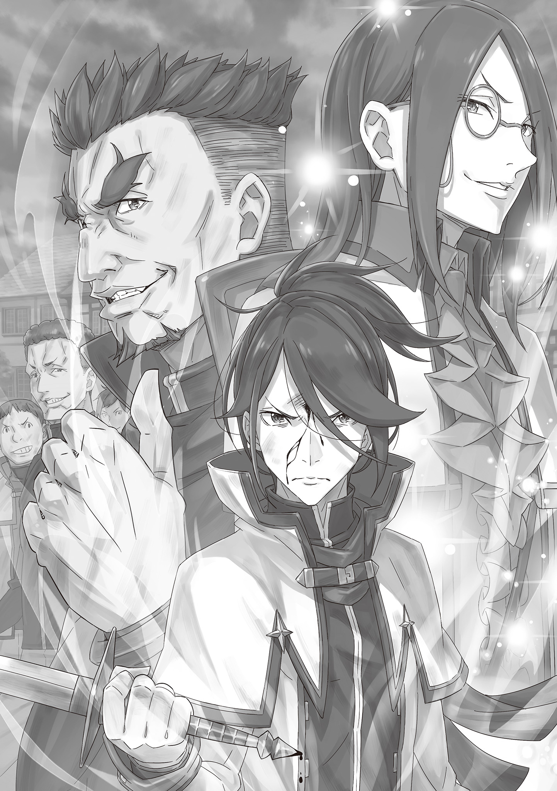
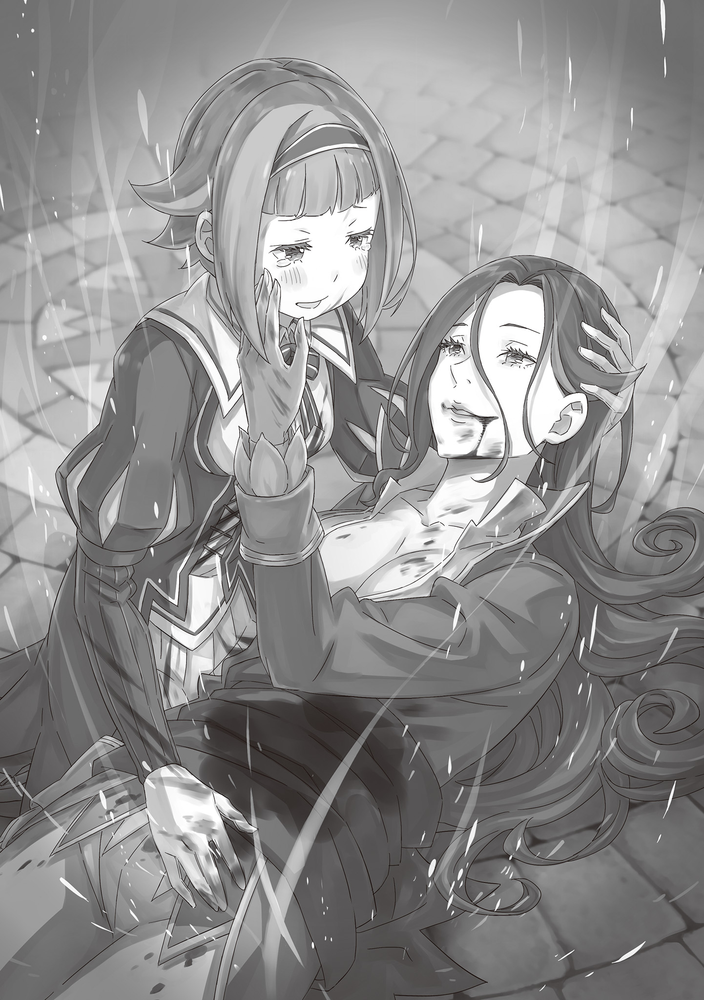
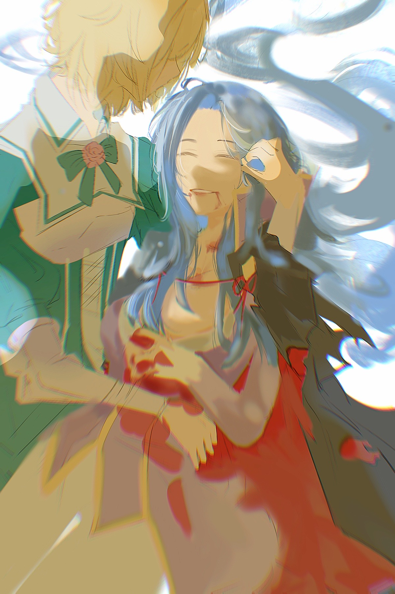
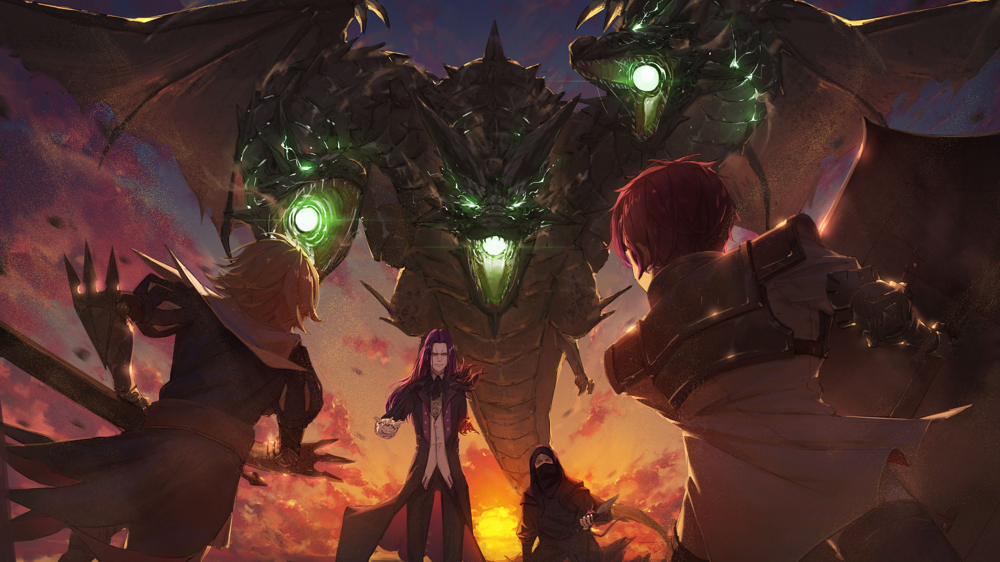
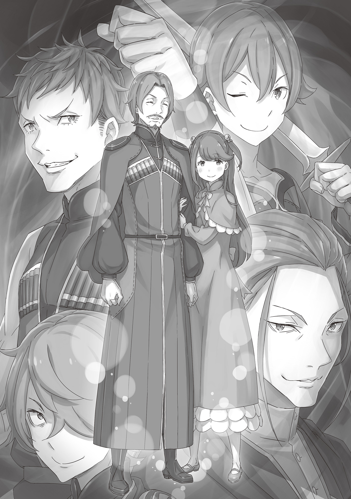
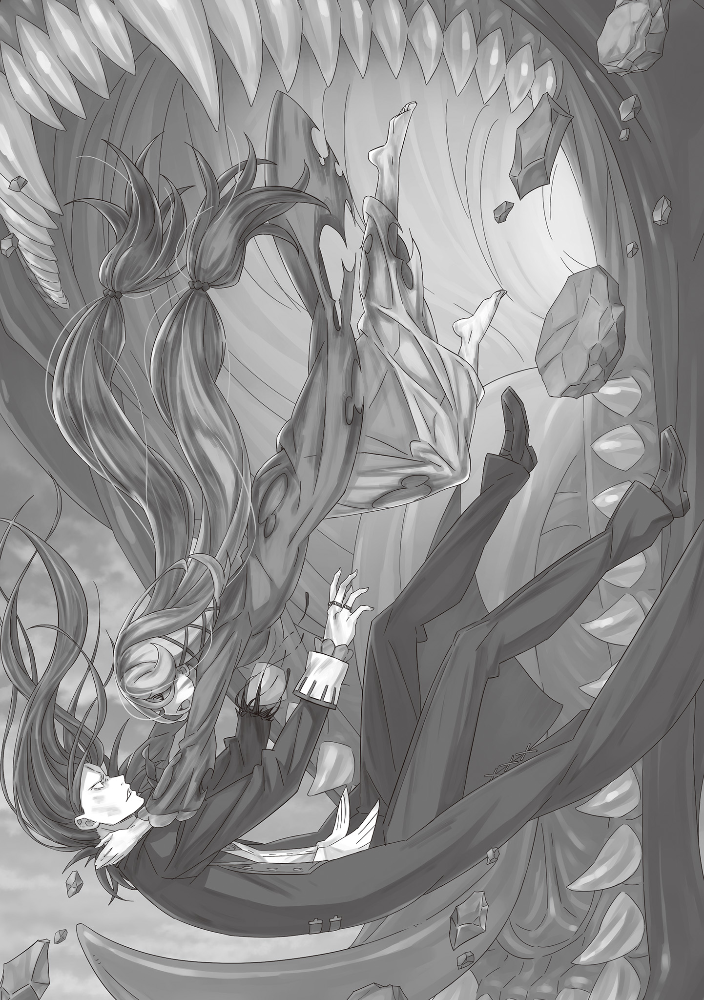
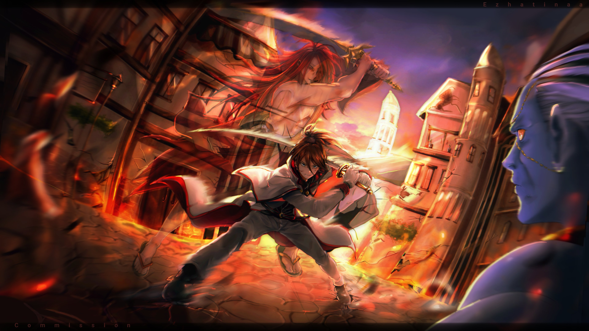
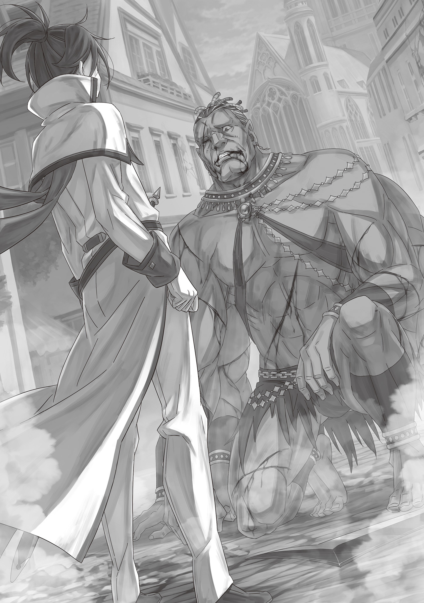

Великолепная Вспышка

第六章『六幕／閃華』

× × ×

Охваченная ощущением погружения на тёмное, тёмное дно, Терезия покачивалась во мраке.

В пространстве, где даже ощущения собственных рук и ног были расплывчаты, Терезия коснулась своего живота и извинилась. В её округлившейся утробе находился младенец, с нетерпением ожидающий момента рождения.

Плод любви Терезии и Вильгельма, «Святой Меча» и «Демона Меча», ещё до своего появления на свет подвергался угрозе, смертельной угрозе.

Если Терезия так и не сможет всплыть, этот ребёнок даже не сможет родиться…

— Я ни за что этого не допущу, — тихим, но полным твёрдой решимости голосом матери произнесла Терезия.

В душе её крепла готовность защитить дитя во что бы то ни стало, что бы ни ждало впереди.

Дно встретило решительную Терезию, и в разрывающейся тьме перед ней раскинулся пейзаж. Это было…

— …Да, так и есть. Если это место должно показать мне совершённый грех, то увижу я лишь одно.

Пробормотав это, Терезия окинула взглядом раскинувшуюся перед ней, окрашенную в багровые тона землю.

Дул сухой ветер, небо было таким высоким и далёким, словно покинуло землю. Терезия стояла на вершине полуразрушенной башни, сложенной из неровных камней.

Со всех четырёх сторон на неё пустыми глазами взирала толпа теней, заполонившая всё поле зрения — орда мертвецов, протягивающих запачканные кровью пальцы и издающих стон проклятий, подобный гулу земли.

Все эти ожившие трупы были ей знакомы. Это были те, кого убила Терезия.

Взяв меч как «Святая Меча», во имя Войны Полулюдей Терезия отняла множество жизней.

Если нет благородных и низких жизней, если вес их одинаков, то чаша весов её судьбы была слишком несправедлива.

Поэтому, если мертвецы жаждали её осуждения, у Терезии не было права им отказывать.

— Это… конец пути моего греха?

Ещё раз окинув взглядом толпу мертвецов — свидетельство её вины, — Терезия почувствовала, как дрожат колени. Неосознанно прикрыв живот рукой, она хотела было сжаться в комок, но вспомнила о жизни внутри себя.

Пока мертвецы, которым она даровала смерть, наперебой рвались к ней, внутри Терезии билась драгоценная жизнь, которую она решила привести в этот мир. Поэтому Терезия выпрямилась и подняла голову.

— Прошу, даруй мне храбрость, Вильгельм.

Это была её искренняя молитва, произнесённая не ликом «Святой Меча», а лицом обычной женщины, прежде чем она, увернувшись от пальцев мертвецов, по своей воле спрыгнула с полуразрушенной башни.

В мире, пленённом «Злым Глазом Гордыни», начиналась битва с собственным грехом.

В Торговом городе Пиктатт разгоралась ожесточённая битва.

В небе — Злой Дракон, на земле — люди. Мир был лишён Божественных Защит, и дитя катастрофы лишь злорадно усмехалось.

На крыше шпиля, возвышающегося над городом, стоял «Желающий Гибели» Страйд. Раскинув руки и с удовлетворением слушая разносившийся по всему Пиктатту рёв Злого Дракона, он воскликнул:

— Итак, сцена готова, актёры собрались! «Святая Меча» стала простым человеком, Божественные Защиты отняты, спасение Дракона не придёт. Близок час конца, о подлые Наблюдатели! Каков ваш следующий ход?!

Глаза Страйда лихорадочно блестели, но его лицо цвета мертвеца вдруг оживилось, а голос наполнился энергией.

Эти слова не были обращены к кому-то конкретному — это было проклятие, нагло размазанное по всему миру. Глядя на Страйда, любой бы подумал — какая же сила даёт человеку ненависть?

— Кх!

За спиной Страйда, чья чёрная одежда развевалась на ветру, поднятом крыльями Злого Дракона, разворачивалось ещё одно поле боя, созданное злой волей в Пиктатте.

Техника синоби нырять в тень столкнулась с отточенным до кровавых мозолей боевым искусством женщины.

Мейзерс, упорно следовавшая за замыслами Страйда с помощью своего ума, и в выборе способа боя превзошла все ожидания. Почему специалист по магии столь мастерски владел боевыми искусствами?

Страшно отточенные техники сменяли друг друга в чистом поединке не на жизнь, а на смерть, за которым было весьма интересно наблюдать.

Однако наибольший интерес Страйда привлекла другая, более грязная битва.

— У-у-ух, а-ах!

Издавая крик, похожий на вопль, женщина с опухшими от слёз глазами, из которых продолжали катиться слёзы, исполняла танец меча.

Вопреки жалкому виду женщины, вступившей в бой, красота сверкающих клинков была завораживающей. Каждый раз, когда большой щит принимал удар, раздавался приятный, похожий на музыку звук, и искры рассыпались по крыше.

Странный поединок полуторного меча и большого щита. В нём не было ни ненависти, ни вражды — лишь непреодолимая скорбь и неугасимая любовь. Это была нежеланная схватка любящих друг друга людей.

— Проклятие было наложено на неё не столько из-за её способностей, сколько из-за того, что её человеческие отношения были удобны для Моей цели… но надо же, она и как мечник первоклассна, а тут такой неожиданный защитник объявился.

Поединок мечницы, связанной проклятием, и щитоносца, который в лоб отражал её атаки. Сам Страйд как воин не стоил и ломаного гроша, но он был уверен в своей способности распознавать хороших бойцов.

Это был сложный и изысканный бой, достойный его взгляда. Но затянувшаяся драма рисковала превратиться в дешёвый фарс.

— А? А, ааах! Н-нет, нет! Гримм! Беги-и-и!

Глаза рыдающей мечницы начали слабо светиться аметистовым цветом. Вслед за этим, даже для неопытного глаза стало очевидно, что её удары ускорились, а сила удвоилась. Щитоносец не смог устоять на ногах и был отброшен назад.

— Проклятие взламывает закрытый Од, вливая жизненную силу во всё тело. Это своего рода запрещённый приём, заставляющий тело превзойти пределы… но Мне нет дела, если кукла сломается.

— А, ааа, а-а-а-а-ах!

Ледяное бормотание Страйда заглушил отчаянный крик мечницы. Вся её ярость была направлена на Страйда, но отточенная техника обрушивалась на мужчину, который должен был быть её возлюбленным.

Вынужденная выжимать из себя силы сверх предела, мечница чувствовала, как трещат её кости и рвётся кожа. Но её яростные атаки не прекращались. Защита щитоносца не успевала, и казалось, что его падение в лужу крови — лишь вопрос времени.

Однако у щитоносца, ведущего исключительно оборонительный бой, был один способ изменить эту одностороннюю ситуацию.

Ни один бой не заканчивается тем, что тебя просто бьют. Не нужно защищаться — нужно ответить.

— Гримм… прошу, меня… кх…

«Убей», — вероятно, такой мольбой закончился бы её жалобный плач.

И действительно, Страйд не собирался останавливать танец меча иначе. Битва любящих друг друга могла продолжаться лишь до тех пор, пока один из них не умрёт — женщина или мужчина.

Поскольку мужчина явно не собирался этого делать, а у Страйда были планы использовать женщину и против Мейзерс, его холодный расчёт подсказывал, что занесённый меч расколет голову её возлюбленного, и на этом всё закончится. Но эта унылая догадка рассеялась в следующее мгновение.

— Что?

Щит выскользнул из руки мужчины… нет, он сам его отпустил, подставившись под удар меча женщины.

— Кэрол…

Подставившись под удар, мужчина с невероятно нежным лицом позвал по имени любимую женщину.

На мгновение глаза женщины расширились от изумления, рука дрогнула, и удар меча должен был разрубить мужчину от макушки до паха…

— …

Страшного звука рассекаемой стали плоти и костей не последовало.

Удар меча остановился в дюйме ото лба мужчины. Но это было не чудо чистой любви.

— Думаешь… я не насмотрелся… как Кэрол и «Демон Меча» дерутся?

Вскинув обе руки, мужчина поймал меч ладонями, остановив его.

Щитом так сделать было нельзя. Щит мог только защитить, парировать или отклонить удар. Поэтому мужчина отбросил щит и рискнул жизнью, чтобы не дать женщине взмахнуть мечом против её воли.

Это не было сделано ради победы, не было рациональным решением, да и не требовало риска жизнью — это было безумством любви.

— …

Пронзённый взглядом мужчины, совершившего этот поступок, Страйд впервые по-настоящему обратил внимание на противника — на Гримма, как его звали. Он признал в нём нечто большее, чем просто возлюбленного управляемой проклятием куклы — несомненную ценность.

Его губы невольно скривились. Не от гнева, а от радости. От неожиданного, чудесного поворота судьбы.

— Так это ты?

— Чего?

— Неужели это ты? Ты и есть главным козырем Наблюдателей? Не «Демон Меча»!

На громкий вопрос Страйда выражение лица Гримма не продвинулось дальше непонимания. Но раздражение от его реакции не имело значения. Страйд уже пришёл к выводу.

Нужно проверить. Является ли этот мужчина одной из последних стен, которые он должен преодолеть в своей жизни?

— Шаске!

Средний палец его поднятой правой руки сверкнул, и направляемый вспышкой янтарного света, длинная рука смерти скользнула по теням. Огромная тень, созданная Злым Драконом, замерцала, словно водная гладь, и в следующее мгновение приказанный синоби появился за спиной застывшей мечницы. Мелькнул серебряный свет кинжала, нацеленный на две жизни.

Использовав спину мечницы как опору, он намеревался пронзить сердце Гримма вместе с ней. Гримму, отбросившему щит и с заблокированными руками, нечем было защититься; он даже не успел заметить синоби.

Безжалостный удар должен был одновременно пронзить сердца возлюбленных…

— Этого я не позволю.

Внезапно, синоби, скользнувшего по тени, настигла техника перемещения, отточенная суровыми тренировками. Уничтожив разделявшее их расстояние, некто вклинился между смертоносной рукой и мечницей.

Безжалостный удар брызнул на крышу неуместно яркой кровью.

— А?

Ударившись спиной о спину, мечница затаила дыхание от толчка. Наконец осознав происходящее позади, она до предела повернула шею и глаза и увидела это.

Высокая фигура, бросившаяся под клинок, — Розвааль J. Мейзерс, — была пронзена насквозь.

Глядя на это широко раскрытыми зелёными глазами, Кэрол закричала: — Джулия!!

Мучительный крик разнёсся в небе. Разнёсся и затих.

Этот разговор произошел спустя некоторое время после того, как Вильгельм начал видеть призрак Пивота.

— В конце концов, я — это само чувство вины, что навсегда останется в вашем сердце.

— Говори, я слушаю.

— Весьма любезно с вашей стороны. Тогда, с благодарностью продолжу. Впрочем, то, что я скажу дальше, почти не отличается от ваших собственных мыслей.

— …

— Вильгельм, не стоит бесконечно потакать этому отклонению.

— Постой. Потакать? Я?

— Да, именно так. Вы и сами уже должны быть уверены. Я, находящийся здесь, — не тот Пивот Арнанси, что был заместителем командира отряда Зелгефа. В конце концов, я лишь тень, рождённая из образа Пивота, который вы знаете, проявление заблуждения.

— Это…

— Скажете, что это не так? В таком случае, задайте мне крайне личный вопрос. О хобби Пивота Арнанси, его прошлом, составе семьи. Я не смогу ответить ни на один из них.

— …

— Потому что вы ничего не знаете о Пивоте. В конце концов, это марево — лишь остатки вины, прилипшие к уголку вашей души. Того, чего не знаете вы, не знаю и я.

— …

— Причина и повод отклонения очевидны. Единственная оставшаяся загадка — почему именно я? Но и на этот счёт у вас, вероятно, есть догадки. Некогда бывший лишь мечом, вы пробудились к человечности, познали чувство вины. Я — первый человек, чью смерть вы оплакали.

— Впервые, смерть…

— Моё существование подобно мареву, что рано или поздно исчезнет. Боевой товарищ, которого вы оплакивали, Пивот Арнанси, уже мёртв, и возможности поговорить с ним больше никогда не представится.

— …

— Поэтому, Вильгельм, вы должны признать.

— …

— Следующий — ваш черёд.

— Мысли витают где-то далеко?

— Кх!

За мимолётное погружение в дрём наяву пришлось заплатить сокрушительным ударом.

Демонический тесак, окутанный яростным ветром, обрушился с гарантированной смертоносной мощью. Вильгельм, доверив свою жизнь собственному мастерству и прочности любимого меча, встретил удар восходящим взмахом, способным расколоть землю.

Оглушительный звук, и сразу за ним распространилась ударная волна. Без преувеличения, небо треснуло, а земля вздыбилась.

Неужели такой урон может быть нанесён в схватке меча с мечом, человека с человеком, техники с техникой?

Битва «Демона Меча» и «Восьмирукого» уже оставляла на городе шрамы, подобные следу стихийного бедствия…

— Нет времени отвлекаться. Твой меч — против моего, мой меч — против твоего. Это — величайшая сцена твоей жизни, не порть её.

— Твои театральные фразочки чертовски похожи на манеру твоего грёбаного хозяина, а?!

Выругавшись, Вильгельм сплюнул скопившуюся во рту кровь.

Прямых попаданий он не пропускал. Но его враг — «Восьмирукий» Курган, Бог Войны, безраздельно носящий титул сильнейшего в Империи Волакия, сверхчеловек, способный убить одним лишь движением.

Даже если идеально парировать атаки, истощение накапливалось, изматывая даже Вильгельма.

Кроме того, ситуация была крайне неблагоприятной для Вильгельма… нет, для всего отряда покорения Королевства.

— …

Увеличивая дистанцию, чтобы перевести дух, Вильгельм мельком взглянул в сторону главной улицы.

Пока Вильгельм сражался с Курганом, там разгоралась схватка между солдатами городской стражи, управляемыми Злым Глазом, и отрядом во главе с Бордо. Чтобы избежать братоубийства между жителями Королевства, отряду приходилось вести тяжёлый бой, но нельзя было позволить им жертвовать жизнями ради этого выбора.

— Если дойдёт до крайности, молодой господин примет решение. Вильгельм, сосредоточьтесь на враге. — мельком взглянув, Вильгельм увидел рядом с собой фигуру Пивота. Как и говорил призрак, в худшем случае оценку ситуации лучше доверить Бордо.

Сейчас Вильгельм должен был победить Кургана, стоявшего перед ним…

— Ты… одержим Злым Глазом.

— Что?

Внезапно прерванный суровым голосом, Вильгельм моргнул.

Курган, державший четыре больших тесака и скрестивший оставшиеся четыре руки на груди, своим устрашающим лицом смотрел не на Вильгельма… а на призрака Пивота рядом с ним.

Конечно, он не должен был видеть Пивота. Вероятно, он уловил суть по бормотанию Вильгельма и движению его взгляда. Возможно, помогло и то, что он был в одном лагере с тем, кто наслал на Вильгельма эту иллюзию Злого Глаза.

Как бы то ни было, Курган разгадал, что Вильгельм находится во власти Злого Глаза, и…

— «Злой Глаз Тщеславия», что показывает разную реальность всякой мелюзге, и «Злой Глаз Гордыни», что взывает к вине грешников, обременённых злодеяниями… Хоть Страйд и взял их обладательницу в жёны, не могу скрыть разочарования, что «Демон Меча» попался на такие уловки.

— Разочарование, говоришь?

— Именно, разочарование, «Демон Меча». В оковы Злого Глаза попадают лишь слабые.

Разочарование Бога Войны ранило сердце Вильгельма сильнее, чем любое злобное слово Страйда.

Его назвали слабым. Это было во второй раз в жизни Вильгельма. Первый раз — когда Терезия, раскрыв себя как «Святую Меча», чтобы защитить Вильгельма, сказала это ему в спину.

Вильгельм не забыл то невыносимое чувство бессилия. Он должен был убить в себе слабость.

Так почему же, почему сейчас слабость снова отбрасывает тень на его путь?

Неужели Вильгельм Триас, став Вильгельмом ван Астрея, обрёл слишком много лишнего?

Если так, то чтобы Вильгельм снова стал достаточно сильным, чтобы победить «Восьмирукого»…

— Да. Вот так. Именно таким ты и…

— Я…

Крепче сжав рукоять меча, Вильгельм, словно ведомый, поднял голову и посмотрел на Пивота.

Если это символ его чувства вины, его слабости, то чтобы избавиться от неё, ему остаётся лишь перешагнуть через труп, мимо которого он однажды прошёл?

— …

Пивот молча смотрел на Вильгельма, который смотрел на него.

Сложив руки за спиной, он ждал ответа, не касаясь меча на поясе.

Глядя на то, как он ждёт ответа, Вильгельм…

— Не смей недооценивать капитана нашего отряда, «Восьмирукий»!!

Внезапно, напряжённую тишину разорвал зычный голос, остановивший Вильгельма от принятия решения. Голос принадлежал Бордо, который, окружённый со всех восьми сторон стражниками, опирался на свою алебарду, весь покрытый кровью.

Не только он был изранен — среди устоявших бойцов отряда не было ни одного с лёгкими ранениями. Все были в крови, и все до единого сохраняли лица, на которых не было и тени угасшего боевого духа. В центре их стоял Бордо, также окровавленный, с жестокой ухмылкой, достойной «Бешеного Пса».

— Ты хоть представляешь, сколько времени ушло, чтобы сделать из этого идиота человека?! Слышать не желаю, чтобы его по твоим своекорыстным причинам снова превращали в зверя!

Стукнув древком алебарды о мостовую, Бордо выпрямился, направил оружие на Кургана и взревел. Курган слегка приподнял брови от этого яростного крика, затем посмотрел на Вильгельма.

И тогда…

— Не сдерживайся, Вильгельм! Иди вперёд без колебаний, с гордо поднятой головой! Что бы ты ни нёс в душе, ты — меч Королевства, ты — сильнейший в Королевстве! Разве не так?!

— ДА!!!

На вопрос Бордо, прозвучавший как боевой клич, рыцари ответили восторженным рёвом.

Подняв оружие к небу, они, изо всех сил стараясь одолеть наступающих стражников, не убивая их, доверили свою судьбу мечу Вильгельма.

Это было полной противоположностью мыслям, доминировавшим в голове Вильгельма мгновение назад…

— Быть «Демоном Меча», отбросившим всё, — это и есть доказательство вашей силы?

Нарушив молчание, Пивот обратился к застывшему Вильгельму. Когда тот повернул к нему взгляд, Пивот, сменив холодное выражение лица, улыбался.

Улыбка, которую он не помнил при жизни. Это тоже была удобный ему мираж?

— Столько молча давил на меня, а теперь решил переобуться?

— Давил? Какая несправедливость. У меня и в мыслях не было вас загонять. Что тогда, что сейчас, вы просто не дослушиваете людей до конца.

Пожав плечами, Пивот сделал жест «ну что поделаешь», хорошо знакомый Вильгельму по его жизни, и сказал: — Вы ведь помните, как я погиб у вас на глазах?

— Да, конечно.

— Для вас это, должно быть, было как гром среди ясного неба. Вы ведь тогда и представить не могли, что на поле боя кто-то может быть зарублен вместо вас.

Человек, совершивший то, чего он не мог себе представить, встал перед сильнейшим воином расы полулюдей и получил смертельную рану, защищая Вильгельма. Он до сих пор видел тот момент во сне.

— Вильгельм. Следующий — ваш черёд.

Ещё раз Пивот бросил Вильгельму эти слова.

Слова, которые должны были проклясть его, обрекая на ту же смерть, что постигла самого Пивота.

Однако Пивот, произнёсший это проклятие, улыбнулся не с проклятием, а с благословением:

— Ваш черёд рисковать жизнью за то, что дороже всего.

— Кх!

Внезапно Вильгельм со всей силы ударил себя по лбу рукоятью меча.

Раздался глухой удар, и из разбитого лба потекла кровь.

— Вильгельм ван Астрея, «Демон Меча», возжелавший жить как сталь. И прежде, и впредь, на пути, что вы изберете, вас будет преследовать множество смертей. Но даже так, вы никогда не должны останавливаться. — стерев рукавом текущую кровь, Вильгельм крепко стиснул зубы и посмотрел вперёд.

— Это единственные слова, которые я, как бывший заместитель командира отряда Зелгефа, хотел передать нынешнему командиру.

— Этого… достаточно.

— Удачи в бою. И… пожалуйста, позаботьтесь о молодом господине.

Шаг вперёд.

Пивот, стоявший рядом, не последовал за ним.

Естественно.

Его здесь больше нет.

Мёртвые не поспевают за шагом живых.

Как и прежде, он проводил взглядом «Демона Меча», рвущегося на передовую.

И…

— Прости, что заставил ждать. Продолжим.

— Похоже, ты обрёл иную верность, чем ту, на которую я рассчитывал. Но…

— Да уж, думаю, это отличается от того, что ты сказал.

Медленно сокращая дистанцию, Вильгельм и Курган снова сошлись в пределах досягаемости мечей. Курган, в свою очередь, наговорил всякого, но, вероятно, это были советы и предостережения Бога Войны, исходившие из лучших побуждений.

Именно поэтому «Восьмирукий» смотрел на воспрянувшего духом «Демона Меча» не с разочарованием, а с радостью.

И Курган, и Бордо с рыцарями, и Пивот — все они слишком многого ожидали от Вильгельма.

Но…

— Теперь я могу сразиться с тобой без лишних помех.

— …

— Поэтому я больше не думаю о проигрыше.

Трудно сказать, что ситуация улучшилась.

Терезия в руках врага, Кэрол стала марионеткой, судьба Розвааль и Гримма неизвестна, и сколько ещё продержится бравада израненного Бордо и его людей — неизвестно.

И всё же, всё, что он обрёл, не было чем-то лишним…

— ЗАЩИТИТЕ КОРОЛЕВСТВО!!!

— ООООО!

Подражая человеку, который когда-то кричал эти слова, захлебываясь собственной кровью, Вильгельм громко отдал приказ.

На призыв «Демона Меча» «Бешеный Пёс» и рыцари ответили мощным рёвом и ринулись в бой из последних сил.

«Демон Меча» смеялся, «Восьмирукий» тоже смеялся.

Началась схватка между сильнейшим Королевства и сильнейшим Империи.

Живот пронзила обжигающая боль, колени подогнулись.

Тело среагировало инстинктивно.

Что за оплошность, какую глупость я совершила!

Я не должна умирать. Это было абсолютное, незыблемое правило.

И я нарушила его, поддавшись эмоциям, вот так бездарно всё бросив.

Ах, но даже так. Ах, однако. Ах, всё же…

— Джулия!!

Мучительный крик назвал моё прежнее имя. И я улыбнулась этому.

Что-то заполнило пустоту в глубине моей груди, и я почувствовала облегчение.

Я подумала, что рада была защитить.

Поэтому Розвааль J. Мейзерс было достаточно лишь этого…

— …

В тот миг, когда он увидел улыбающийся профиль Розвааль и заплаканное лицо Кэрол, издавшей мучительный крик, сердце Гримма Фаузена яростно воспылало.

Оружие управляемой Кэрол он держал в своих руках, а скрывавшегося синоби пригвоздила к месту Розвааль. Сейчас ничто не мешало атаковать виновника несчастий.

— Оооо!!

Резко взревев, Гримм ударил ногой по упавшему на пол большому щиту, подбросив его в воздух. В то же мгновение его глаза встретились со Страйдом, стоявшим за двумя женщинами — Кэрол и Розвааль.

Целясь в беззащитного врага, Гримм со всей силы ударил по щиту, отправив его в полёт.

Вращающийся серебряный диск — это стальной большой щит размером с человеческий торс. Прямое попадание легко раздробило бы человеческое тело. Смертоносное оружие летело прямо к Страйду, стоявшему у края крыши.

— Ваша Светлость!

Пытаясь предотвратить удар, синоби — Шаске — попытался скользнуть сквозь тень, но потерпел неудачу.

Пронзённая в живот Розвааль схватила Шаске за руку, не давая ему уйти. Глядя на изумлённого синоби, она ослепительно красиво улыбнулась.

— Покопался в животе у дамы, а теперь такой холо-о-о-одный…

Улыбка на окровавленном лице помешала синоби вернуться к своему господину.

Тем временем большой щит, не останавливаясь, приближался к Страйду, приближался, приближался… и враг, утверждавший, что не обладает боевой силой, не имея возможности увернуться…

— Ч-ч!

Одновременно с цыканьем языком раздался звонкий звук столкновения стали со сталью.

С гулким стуком большой щит Гримма ударился об пол крыши и покатился. Его сбил странный меч, который Страйд выхватил из пустоты.

Ослепительный, сияющий алым светом драгоценный меч, клинок которого, казалось, светился сам по себе.

— Это?

— «Волакийский Меч Света», передаваемый в Империи Волакия?

Сомнения Гримма развеяли слова кашляющей кровью Розвааль.

Нахмурившись при упоминании «Меча Света», Гримм понял, что этот меч обладает огромной силой. Он понял, что заявление Страйда о его небоеспособности было ложью, и напрягся.

Но на его глазах произошло нечто невероятное. Левая рука Страйда, державшая «Меч Света», внезапно вспыхнула.

— Г-гх! Проклятье!

Лицо Страйда исказилось от боли, и «Меч Света» выпал из его горящей руки. Не успев коснуться пола, меч исчез в пустоте, так же, как и появился.

Однако пламя, охватившее Страйда, не погасло, угрожая сжечь его дотла.

— Прошу прощения!

Прежде чем огонь перекинулся на тело, подскочивший Шаске отрубил руку кинжалом. Вращаясь, рука упала на пол, обуглилась и испепелилась, превратившись в горстку праха.

Благодаря молниеносному решению, Страйд едва спас свою жизнь. Схватившись за обрубок руки, он выдохнул.

— Неожиданно лишился руки. К тому же…

Подняв ногу, Страйд раздавил свою обугленную руку. Затем, порывшись носком ботинка в прахе, он с отвращением отшвырнул то, что осталось от расплавившихся колец, потерявших свою форму.

Это были пять колец, которые он носил на левой руке, основа «Десяти Заповедей Гордыни».

Это означало…

— Теперь ты больше не сможешь управлять мной по своему желанию.

Резкий, исполненный достоинства голос раздался на крыше.

Его произнесла Кэрол, освободившаяся и теперь державшая на руках обмякшую Розвааль. Направив чистую энергию меча на Страйда, она обратилась к Розвааль: — Леди Мейзерс! Прошу вас, прошу, держитесь! Леди Мейзерс!

Отчаянно взывая к ней, Кэрол быстро сняла свой плащ и перевязала им рану на животе Розвааль, из которой непрерывно текла кровь.

Но плащ лишь впитывал кровь и тяжелел, а кровотечение не останавливалось.

Жизнь Розвааль утекала, и это было не остановить.

— Леди Мейзерс, пожалуйста, откройте глаза… откройте глаза…!

— Ты назвала меня… Джулией… или мне послышалось?

Дрожащий голос Кэрол прервался, когда она почувствовала прикосновение к своей щеке и изумлённо подняла глаза.

В её объятиях Розвааль слабо приоткрыла веки. Сняв перчатку с левой руки, она коснулась щеки Кэрол и мягко, но мимолётно улыбнулась.

— Не плачь, пожалуйста-а-а, Кэрол… Ты всё время… всё время выглядишь такой несчастной.

— А…

— Ты часто злишься, но… больше всего тебе идёт улыбка, да-а-а.

Услышав эти слова, сказанные едва слышным шёпотом, Кэрол с трудом сдержала слёзы и попыталась улыбнуться. Попыталась, не получилось, заставила себя стереть неудавшуюся попытку, попыталась снова и улыбнулась.

Глаза были красными от слёз, заплаканный вид было не скрыть, но Кэрол всё же улыбнулась, как того желал дорогой ей человек.

И тогда…

— Если я назову вас Джулией… вы снова будете дразнить меня, как обычно?

— О-о, это да. Да, это хорошо.

Улыбнувшись окровавленным лицом, словно увидев то, что хотела, Розвааль несколько раз кивнула. Затем она посмотрела на Кэрол своими разноцветными глазами, в которых теплилась нежная привязанность, и сказала: — У меня дома есть управляющий по имени Клинд. Попроси его… позаботиться о Карле.

— Н-нет!.. Нельзя, не смейте! Прошу вас, леди Мейзерс…

— Джулия.

Розвааль прижала палец к губам Кэрол, прерывая её слёзный голос. Застыв от этого прикосновения, Кэрол затем, словно цепляясь за последнюю надежду, прошептала:

— Джулия, прошу…

Слеза скатилась по щеке Кэрол.

Эту каплю Розвааль… нет, Джулия, с нежностью поймала кончиком пальца и…

— Будь счастлива… с Гриммом.

— Джулия?

С последним словом-молитвой тело в её руках стало тяжелее. Но вместо этого что-то ускользнуло.

— Джулия, Джулия… Джулия, Джулия, Джулия!

Голова Джулии склонилась набок, сила покинула её тело. И не только сила.

Ушло нечто более важное, самое важное. Ушло и больше никогда…

— Джули…

— Умерла. На полпути.

Это был невероятно сухой голос. Но в нём не было ни иронии, ни насмешки.

Страйд, потерявший левую руку, смотрел на Джулию, уснувшую в объятиях Кэрол. Выражение его лица было холодным, эмоции в глазах — сложными и загадочными, его мысли были недоступны никому.

Лишь на мгновение в этих сложных чувствах промелькнули одиночество и зависть.

— Не смей!

В тот момент, когда она это увидела, гнев Кэрол достиг предела.

Здесь, сейчас, что-то было потеряно. У Кэрол отняли что-то дорогое. И это…

— Страйд, для тебя даже смерть будет слишком легким наказанием!

— Вероятно. Я и сам не вынес бы, если бы Мой конец был таким же, как у сотен других.

Кэрол не собиралась слушать его бредни. Глубоко вздохнув, она подавила бушующую внутри ярость.

Сначала она осторожно положила безжизненное тело Джулии на пол, скрестив ей руки на груди. Аккуратно вытерла кровь у уголка её губ, поправила упавшие на лоб волосы и поднялась.

Взяв рыцарский меч, она встала рядом со своим возлюбленным, поднявшим щит. Оставив подругу позади, она посмотрела на врага.

— Ваша Светлость, сейчас начнётся самое трудное.

— Проклятие, что связывало тебя, сгорело. Зачем ты остаёшься здесь? При первой же возможности отрубишь Мне голову и вырвешь сердце. Разве это не было твоим заветным желанием, равно как и твоего недостойного брата?

— Брат — это я, Шаске. Мой старший брат, Райдзо, выполняет другое задание. Кроме того, Ваша Светлость, мы готовы быть с вами до конца, даже без всяких проклятий.

На слова Шаске, выражающие верность, Страйд лишь фыркнул, его высокомерие осталось непоколебимым.

Почему Шаске служит такому губительному человеку, как Страйд?

— Кого-то спасает сияние солнечного света, а кого-то — ядовитая грязь. Я не ищу понимания. Вот и всё.

— Если господин ошибается, нужно действовать, чтобы исправить его. Хватит пустых слов, дальше…

— Да, верно. Пустые слова не стоят того, чтобы их слушать.

Страйд оборвал Шаске и опередил Кэрол, собиравшуюся сделать шаг вперёд.

Но её остановили не холодные слова Страйда. Проблемой было то, что Страйд вытащил из-за пазухи и демонстративно поднял вверх.

Увидев это, Кэрол потеряла дар речи, а Гримм широко раскрыл глаза от изумления.

Книга в чёрном переплёте. На таинственно представленном томе не было названия, и с первого взгляда нельзя было угадать её содержание. Но суть этой книги была ясна с первого взгляда.

Это был символ абсолютного зла, которым могли обладать лишь избранные…

— Лишние слова ни к чему, не так ли? Но и это тоже — часть игры. «Святая Меча», Божественный Дракон, Королевство и Империя, Божественные Защиты и проклятия — ценность и смысл всего этого связаны с замыслами Наблюдателей на небесах. Посему Я возражаю против этого. Я докажу, что не бывает неповреждённых фигур и нерушимых досок!

— Что… Что ты несёшь, негодяй! Страйд, ты!

— У меня нет глупого поклонения Ведьме, но я последую примеру того трудолюбивого парня, что вручил Мне эту книгу и помог освоить Полномочие… «Десять Заповедей Гордыни». Так что скажу так.

Подняв чёрную демоническую книгу — «Евангелие», — Страйд со злобной ухмылкой произнёс:

— Архиепископ Греха Культа Ведьмы, воплощение «Гордыни», Страйд Волакия.

— Культ Ведьмы? И к тому же, ты называешь себя Волакия!

— К несчастью, Я лишь подделка, заполучившая Фактор Ведьмы и Полномочие. У Меня и в мыслях нет поклоняться «Ведьме Зависти», как тот трудолюбивый. А может, существование Ведьмы опасно и для самих Наблюдателей… возможно, она на Моей стороне.

Мысли Кэрол путались от саркастической усмешки Страйда. Если Культ Ведьмы и Империя Волакия замешаны в тайных махинациях Страйда и его группы, то…

— Кэрол.

Но тут Гримм, вставший рядом, положил руку ей на плечо и ободряюще кивнул.

— Мы его размажем. Просто… причин стало… на одну больше.

— Да. Ты прав.

Одного этого слова было достаточно, чтобы Кэрол успокоилась, и сумятица в её голове рассеялась. Сейчас приоритетом было спокойствие Королевства, уничтожение вражеского предводителя и, что важнее всего…

— Я — Кэрол Ремендис, дочь рода Ремендис, семьи «Ножен», что из поколения в поколение служит дому Астрея. Но сейчас, в этот самый момент…

Кэрол подняла длинный меч перед собой. Воспоминания о ней пронеслись в её голове.

Сколько раз она доставляла хлопот.

Сколько раз злила.

Сколько раз они смеялись вместе.

Она любила её.

Поэтому, только в этот момент, только сейчас, она будет не дочерью Ремендис…

— Как подруга Джулии, Кэрол, я зарублю тебя!

— Много же слов от женщины, не сумевшей противостоять проклятию. А спутник твой, ему нечего сказать?

— Нет.

Короткий, мгновенный ответ. Страйд удивлённо поднял брови: «О?»

Гримм с серьёзным лицом, без гнева или ненависти, движимый лишь чувством долга, смотрел на врага.

— Ты… просто… случайный злодей.

— Оптимальный ответ.

Кэрол поняла, что никогда не сможет понять Страйда, искренне улыбнувшегося этому обмену репликами.

Приготовившись к бою вместе с Гриммом, она стояла с мечом и щитом наготове. Шаске, защищая улыбающегося Страйда, тоже сжал в руках клинки, прикреплённые к его телу.

И тут обе стороны ринулись в атаку. Но в то же мгновение первым двинулось нечто иное.

— Кх!!!

Дыхание Злого Дракона, освободившегося от проклятых оков, разом поглотило шпиль — символ города.

Сколько ни беги, казалось, этому миру нет конца.

Если это место рождено чувством вины, то неудивительно, что оно бесконечно. Ведь однажды совершённый грех не может быть прощен, и истинное искупление невозможно.

— Какие мрачные мысли… кх…

Отгоняя прочь пришедшие в голову идеи, Терезия продолжала бежать, задыхаясь.

От преследующей толпы мертвецов невозможно было уйти, как ни старайся. Они словно знали, где она, опережали её, не давая ни минуты на передышку.

И всё же, раньше она могла бежать сколько угодно и совсем не уставала.

— И здесь… живот тяжёлый, сил меньше, и Божественной Защиты не чувствую…

Забравшись в укрытие среди скал, Терезия опёрлась рукой о стену и задумалась о своём состоянии.

Беременная, лишённая «Божественной Защиты Святого Меча» и «Божественной Защиты Бога Смерти», она на некоторое время отошла от дел, с головой погрузившись в тихую семейную жизнь новобрачной, и её физическая форма сильно ухудшилась.

В таком состоянии не было смысла позволять Злому Глазу пленить себя, подвергая опасности ещё и ребёнка.

Если удастся разрушить Злой Глаз Мелинды, ключевой фигуры в плане Страйда…

— Это точно поможет Вильгельму и остальным, сражающимся снаружи…

Как и Божественная Защита, особые силы сильно зависят от душевного состояния их владельца. Могущественный эффект Злого Глаза — это обоюдоострый меч, и если его разрушить, это подорвёт саму основу плана.

Именно с этой целью Терезия, будучи пленницей, сама погрузилась ещё глубже в эту тьму.

— Неужели я и вправду такая слабая женщина без меча?

Пока она размышляла, мертвецы, которых она убила, приближались, желая утащить её за собой.

Глядя на их мёртвые лица, слыша их стоны проклятий, Терезия осознала, что её недавнее уныние было не просто гордыней, а чем-то бесчеловечным, и упрекнула себя.

Если бы сейчас у неё была «Божественная Защита Святой Меча», смогла бы она снова зарубить их?

Неужели она всерьёз желала снова убить тех, кого уже однажды лишила жизни, чтобы обрести окровавленное существование?

В мире, принявшем форму греха, мертвецы — символы греха — проклинали грешницу Терезию, приближаясь, приближаясь, приближаясь, чтобы подвергнуть её наказанию, соразмерному греху…

— Ах.

То ли она слишком задумалась, то ли сама возжелала наказания.

Незаметно скальное укрытие, где она остановилась, было окружено толпой мертвецов со всех сторон. Терезия оказалась в ловушке, полностью лишённая путей к отступлению.

Она огляделась, но бежать было некуда. Положив руку на живот, Терезия почувствовала, как дрожат её губы.

— Вильгельм…

Его нет. Его здесь нет.

— Кэрол…

Её нет. Её здесь нет.

— Кто-нибудь, кто-нибудь… кх…

Никого нет. Здесь никого нет. Терезия была одна.

Здесь. Совершенно. Одна.

— Помоги… отец.

— Ах, ну разумеется.

На тихий зов о помощи ответили невероятно нежными объятиями, от которых хотелось плакать.

— Э… — тихо выдохнула Терезия. В следующее мгновение бесчисленные вспышки мечей обрушились на мертвецов, пытавшихся разорвать её на части, и сразили их.

Голубые глаза Терезии расширились при виде спин мужчин с рыцарскими мечами, сделавших это.

Ведь этого не могло быть.

— Ну папа, ты совсем забираешь себе все лавры.

— Мы ведь тоже беспокоились о Терезии.

— Э?! И вы мне прямо здесь такие претензии предъявляете?!

Голос обнявшего Терезию человека сорвался от удивления на ворчливые слова мужчин.

Услышав эту знакомую теплую перепалку, Терезия замотала головой.

Нет, так нельзя.

Неправильно.

Такого не должно было случиться.

— Сестрёнка, ты слишком много на себя берёшь. Да, возможно, ты сожалеешь, что как «Святая Меча» зарубила многих. Но не нужно думать, что и мы — твой грех.

— Ну, благодаря этой твоей привычке всё на себя брать, мы и смогли здесь оказаться.

У двоих, что обращались к ней, были знакомые лица.

Нежное лицо с доброй улыбкой и суровый профиль мужчины, небрежно закинувшего меч на плечо…

— Касильес… Старший братик Карлан…

— Конечно, я тоже здесь, Терезия.

— Даже старший братик Темза…

Младший брат Касильес и второй старший брат Карлан. А тот, кто прямо сейчас играл мускулами, был очень похож лицом на отца, но его сила и мощь создавали совершенно иное впечатление — это был старший брат, Темза.

Трое братьев, которых она не должна была больше увидеть, погибших во время Войны Полулюдей.

— Это чудо, рождённое любовью. Терезия, ты так не думаешь?

— Отец, что ты такое говоришь?

— Э-э?! И это твоя реакция после всего?! Я думал, ты обрадуешься?!

Само собой, так шумно и изумлённо восклицал её любимый отец, Бертоль. В ответ Терезия показала ему язык, прошептав: «Врунишка», — и уткнулась лбом в его грудь.

Слёзы навернулись на глаза. То, что она встретила их здесь, означало, что сомнений нет.

— Отец…

— Терезия, ты не должна винить себя. И Кэрол тоже. Ни тебе, ни ей не в чем себя упрекнуть.

— Но… но я так хотела ещё поговорить с тобой, отец, о многом… кх…

— Разумеется, сожалений у меня полно. И внука не подержал на руках, и на свадьбе Кэрол хотелось побывать. Годовщину свадьбы с Тишей в этом году планировали отпраздновать с размахом, да и с Вильгельмом выпить уже хотелось, и ещё…

Слушая, как Бертоль, загибая пальцы, перечисляет свои сожаления, Терезия не могла сдержать слёз.

Она действительно хотела этого. Хотела сделать это для него.

Но такой возможности больше не представится. Сожаления останутся неудовлетворенными, навсегда…

— Но, Терезия, так и должно быть.

— Э?

— Не бывает жизни без сожалений. Невозможно всё успеть сделать. Потому что я жил счастливо и умер счастливо. А у счастливого человека желания безграничны. Если бы я исполнил нынешние сожаления, у меня появились бы новые мечты. И так бесконечно, без конца.

Расправив грудь, Бертоль продолжил: — Терезия, я… мы любим тебя. Поэтому то, чего не смогли сделать мы, сделаешь ты, а потом твои дети, и их дети. И этого достаточно.

— Отец…

— Поэтому, чтобы ты могла это сделать, давай немного поднажмем, да? А, ребята?

Бертоль поднял голову, и его лицо обрело твёрдую решимость. Трое его сыновей обернулись…

— Вообще-то, пока ты тут распинался, мы были очень заняты!

— Мертвецы не собирались стоять смирно, пока батя закончит свою длинную речь!

— Да и вообще, отец, ты мечом владеешь так себе, так что напрягаться придется только нам.

— Ээээ?! И это вы так говорите?! Знаете что, если будете так себя вести, я не приведу вам особого помощника!

Сыновья, которые даже во время разговора продолжали рубить наступающих мертвецов, отзывались о нём нелестно. Но Терезия, которую обнимал за плечо Бертоль, склонила голову: «Помощника?».

Какого ещё помощника можно было представить в такой ситуации, когда спасение уже пришло?

— Это я, Терезия. Возможно, ты не очень рада меня видеть.

Ответ на её вопрос принесла вспышка меча человека, только что появившегося на поле боя.

Одним взмахом он сразил толпу мертвецов. Это был худощавый мужчина, высокий, с длинными волосами, производивший впечатление холодного и одинокого. Это был…

— Дядя Фрибал!

— Бывший «Святой Меча», Фрибал ван Астрея. Посрамленный, но прибыл на помощь.

Мужчина, закинувший длинный меч на плечо, едва заметно тронул губы улыбкой. Фрибал ван Астрея — предыдущий «Святой Меча» и младший брат Бертоля.

«Божественная Защита Святого Меча», обитавшая в Терезии, была передана ей от него. Поэтому она не раз и не два ненавидела его за то, что на неё была возложена эта тяжкая судьба.

— Я не собираюсь этим искупать вину. Изначально, то, что ты несла, было неизбежной обязанностью.

— Да, дядя. Я понимаю. В то время я… не смогла выполнить свой долг.

— Верно. Ты избежала ответственности, и за это были заплачены жизни. Если ты называешь это грехом, то, возможно, так оно и есть. Но…

Даже во время этой невероятной встречи толпы мертвецов не иссякали и продолжали нападать. Фрибал, не оборачиваясь, сметал их сокрушительными ударами меча.

Видя, как мертвецов снова рубят на куски, Терезия не могла не почувствовать боль в груди.

— Не вини себя. Даже если этот мир порождён твоим чувством вины, они — не те жизни, что ты отняла. Это чувство вины неуместно.

— Дядя, ты совсем не меняешься в своих высказываниях…

— Я понимаю, что ты хочешь верить, что это грех. Но тогда кто же мы — я, Темза и остальные, и, кстати, мой брат, — что явились сюда?

— …

На вопрос Фрибала Терезия замолчала и задумалась. Бертоль рядом с ней скорчил гримасу, но она этого не заметила.

Что дядя хотел ей сказать? Она отчаянно пыталась понять. Ведь при жизни ей так и не удалось нормально поговорить с дядей.

— Это место — не дно греха. Это место, где обретает форму то, во что хочет верить очарованный. Его создал человек с добрым сердцем.

— Добрый… человек…

— Не утопай здесь в грехе, Терезия. Тебе нельзя умирать в таком месте. Смертью ничего не искупить. Живи.

Сказав это, Фрибал встал спиной к Терезии и Бертолю, защищая их, и одним взмахом меча смёл толпу мертвецов. Темза и остальные встали рядом с ним, образовав непробиваемую линию обороны.

Какие же они надёжные. Может, она думает так потому, что у неё нет «Божественной Защиты Святого Меча»? Этого дара капризного Бога Меча, из-за которого она когда-то безжалостно пренебрегала своими братьями, поглощёнными тренировками с мечом?

— Многое хочется сказать, но…

Оборвав фразу, Бертоль посмотрел на мужчин рода Астрея так, словно видел что-то ослепительное. Во взгляде его читалась зависть того, кто не был одарён талантом к мечу.

Но это чувство тут же исчезло, и в голубых глазах, обращённых к Терезии, осталась лишь нежность.

— Слова Фрибала верны. Терезия, живи. Не нужно нести на себе такой грех. Вообще-то, твой отец удивлён, что ты так себя загнала.

— Я думала, что всё не так уж и серьёзно…

Теперь, когда это проявилось так явно, ей пришлось признать, что она ошибалась.

Бертоль положил руку на плечо дочери, носившей в себе такую глубокую тьму, и улыбнулся.

— Я не говорю забыть о грехе. Но перестань жить ради греха. Нет нужды жить ради искупления. Но если сердцу всё ещё тяжело… возвращай долги.

— Долги?

— Живи не для искупления грехов, а для возвращения долгов. Живи счастливо и умри счастливо. Вот уж действительно идеал для дочери Бертоля.

Глядя на откровенно смеющегося Бертоля, Терезия округлила глаза.

Неужели такой образ жизни дозволен роду «Святых Меча»? Людям из семьи Астрея, вынужденным жить как клинки Королевства, — неужели им доступно такое… доброе существование?

Но Бертоль Астрея улыбался, говоря, что он прожил именно так.

— Отец.

— Да?

— Я хотела, чтобы имя ребёнку в животе дал ты.

— Вот как. Да, пожалуй.

На просьбу Терезии Бертоль расслабленно улыбнулся. Затем он почесал свою красную, как у Терезии, голову и сказал:

— Тогда я хорошенько подумаю над этим.

— Да. Обещай, отец.

Это было обещание, которому не суждено было сбыться, и Терезия знала это, но всё равно заключила его.

Затем, всё ещё держась за руку отца, Терезия повернулась к мужчинам Астрея, стоявшим впереди.

— Старший братик Темза, старший братик Карлан, Касильес, дядя Фрибал.

Мужчины по очереди обернулись, когда Терезия назвала их имена.

Она крепко запечатлела в памяти их лица, их облик, пока они сдерживали толпу мертвецов. Хоть им и было тяжело, они изо всех сил старались не показывать ей свою слабость.

Она поняла, что её всегда вот так защищали.

— Я вас всех очень люблю.

Она призналась в любви своей дорогой семье. Смогла ли она при этом улыбнуться?

Была ли она той Терезией Астрея, которую хорошо знали её отец, дядя, братья? Той Терезией Астрея, какой она была до того, как получила титул «ван»?

— …

Их последние улыбки… вот он, её ответ.

— Ах, ха…

В тот же миг Терезия, задыхаясь от нехватки воздуха, схватилась за грудь и осела на пол. Снова и снова она судорожно вдыхала пыльный воздух, возвращаясь в реальность.

И тут…

— А, ааа, ааааа… Мой… мой Злой Глаз… снят?!

Вслед за возвращением сознания Терезии раздался запоздалый крик Мелинды.

Она закрыла глаза руками, в панике подбежала к окну комнаты и выглянула наружу, на то, что происходило за пределами шпиля. Затем, схватившись за свои пепельные волосы, она закричала:

— Нельзя, нельзя, нельзя-нельзя-нельзя, нельзя!

— Мелинда?

— Мой «Злой Глаз Тщеславия» развеян… желание человека… этого человека… ах…

Её разум метался в смятении, но вдруг Мелинда, словно что-то осознав, обернулась. Она поднялась с пола и, с закрытыми глазами, подошла к Терезии, смотревшей на неё.

Протянутые руки схватили Терезию за плечи, лица сблизились. Догадавшись о её намерениях, Терезия вскрикнула «Нет!» и попыталась вырваться, но…

— Гх!..

Веки Мелинды открылись, и в следующее мгновение после того, как их взгляды снова встретились со Злым Глазом, Мелинду дёрнуло, словно от удара током, и она рухнула на колени. Из её глаз капала кровь, а паутина внутри зрачков окрашивалась в красный цвет.

— Эй?! Нельзя, не перенапрягайся!

— Не… прикасайтесь ко мне… кх!.. Вы… нарочно… как…

— Семья прогнала меня, сказав, что грех — это не то, что нужно нести в себе.

Оттолкнув руку Терезии, пытавшуюся её поддержать, Мелинда, плача кровавыми слезами, с искренним сожалением опустила голову.

Она тоже поняла. Поняла, что Терезия намеренно спровоцировала её, заставив использовать Злой Глаз, чтобы освободить множество людей в городе из его плена.

Если бы Мелинда спросила указаний у Страйда, всё могло бы пойти иначе, но такой способ, вероятно, даже не пришёл ей в голову. Дядя, должно быть, прав.

— Ты человек, способный сопереживать моему ребёнку. Давай прекратим это.

— Н…

— Ты не можешь этого сделать? Нет, как раз этого быть не должно. Сейчас я — просто мать, просто женщина, без меча и Божественной Защиты… Если и у тебя есть любимый человек…

Человеческую сущность Страйда, которого любила и которому хотела помогать Мелинда, невозможно было ни понять, ни принять.

Но это не должно было стать причиной для отрицания самой Мелинды, полюбившей виновника несчастий.

— Я…

Последовала долгая пауза. Мелинда, с закрытыми веками, несколько раз поднимала и опускала лицо, и, наконец, что-то решила.

Увидев в этом надежду, Терезия сказала: «Да», — и протянула руку, чтобы взять её ладонь…

— А?

В следующее мгновение руки Мелинды вытянулись, и она силой оттолкнула Терезию.

От этого неожиданного действия Терезия беспомощно упала на спину, моргая глазами…

— …

…Дыхание Злого Дракона поглотило шпиль, и пламя ворвалось в комнату, где они находились.

Синоби подобен асуре, рожденному из боли и страданий, результат жестокой системы промывки мозгов.

Сначала у него отнимают имя. Затем семью, имущество, прошлое, будущее — всё, что было до становления синоби. Лишь когда его жизнь обесцвечена, он признаётся заготовкой для синоби.

Став заготовкой, безымянное существо не получает ни капли милосердия.

Тренировки, наркотики, проклятые печати, всевозможные еретические методы древности и современности… Один из ста избегает самоубийства, один из ста выживших не сходит с ума, один из ста сохранивших разум переживает обучение, и лишь один из ста переживших становится завершённым синоби. Поэтому братья-близнецы Райдзо и Шаске стали беспрецедентно успешным творением для деревни синоби, и на их мастерство и успехи возлагались большие надежды.

Но взрослые в деревне должны были понять раньше: тот факт, что они братья-близнецы, означал, что ещё на этапе отбора заготовок Райдзо и Шаске были неполноценными синоби.

В результате «Близнецы Асура», которых называли величайшим шедевром деревни, убили всех взрослых, отнявших у них всё, и всех их последователей-собратьев, став отступниками.

Преследуемые, Райдзо и Шаске, охотясь на преследователей, знали, что жизнь отступника долго не продлится. С другой стороны, хоть она и не была долгой, не было причин и для её скорого завершения. Возможно, поэтому?

— Я использую вас самым расточительным образом.

Они оба, братья, купились на это приглашение, не имевшее ничего общего ни с добротой, ни со справедливостью.

Какой бы безумной ни была цель, служить тому, кто охвачен великим замыслом, было их истинным желанием.

Только Страйд Волакия, человек, на которого многие показывали пальцем, использовал ставших отступниками «Близнецов Асура» как настоящих синоби.

Поэтому и сейчас, когда мир был на грани конца…

— Ваша Светлость!

С приходом испепеляющего дыхания Злого Дракона, Шаске схватил Страйда и взмыл в небо.

Мгновение спустя крышу шпиля смело волной жара, и нечеловеческая огневая мощь сожгла всё дотла. Почувствовав, как горячий ветер, рождённый взрывом, обжигает кожу, Шаске был уверен в смерти тех, кто не успел сбежать.

Однако…

— Глупец, куда ты собрался бежать!

Внезапно тихий гневный голос пронёсся у самого уха, и Шаске извернулся в воздухе. Он не смог полностью увернуться и получил рубящий удар. Левое плечо взорвалось болью, и Шаске вытаращил глаза.

За Шаске, взлетевшим в воздух, прыгнула светловолосая мечница — Кэрол.

Она хорошо владела мечом, но он считал, что не более того. А она, словно используя воздух как опору, свободно отталкивалась от пустоты и атаковала синоби, обременённого ношей, воздушными клинками.

— Прыжки по воздуху — это моя территория. Похоже, ты ошибся с оценкой.

— Кх! Но если вы здесь, то что сталось с вашим мужем, госпожа?!

Крыша была охвачена испепеляющим жаром, и спастись могли лишь те, кто умел летать. В отличие от Страйда, которого нёс Шаске, в руках Кэрол не было её возлюбленного.

Простой человек, владеющий лишь большим щитом, — он никак не мог выжить…

— Вот оно что, простой человек.

Страйд, находившийся в его руках и смотревший куда-то в сторону, произнёс это горячим голосом. Проследив за его взглядом, Шаске увидел, что господин смотрит на крышу, где ещё ощущались последствия жара.

Там виднелся сияющий большой щит. Простой человек, переживший жар, укрыв собой павшую прекрасную женщину.

— Я — «Ножны», Гримм — «Щит». Мы всегда будем рядом с «Мечом», как друзья.

Отразив сверкнувший удар меча кунаем, Шаске отлетел назад и обрёл опору. Чёрную спину дракона.

— …

Для Дракона ростом более десяти метров вес ничтожного человека был не более чем пушинкой.

Пока ревел Злой Дракон, освободившийся от оков кольца, синоби и мечница, используя спину, крылья и лапы сверхъестественного существа как опору, развернули сказочный танец мечей.

Злой Дракон, ставший их полем боя, извивался в воздухе, его когти и хвост безжалостно рассекали воздух. Бушевал ураган, одно касание которого грозило неминуемой смертью. Шаске стиснул зубы в пылу мгновенной схватки.

С раненой левой рукой, неся господина, он сражался одной правой рукой с первоклассным мечником на спине легендарного существа, используя силы, отточенные до предела в тренировках Асур.

Неужели такое возможно? Неужели такое может произойти?

Чтобы он, синоби, обречённый скрываться в тени истории, в тени мира, на изнанке повествований, преследуемый и обречённый сгнить во тьме, — получил такую яркую сцену?

— Кха!

Оскалив зубы, Шаске выдохнул… нет, рассмеялся.

Шаске, которого растили, приказывая избавиться от сердца, отбросить эмоции, Шаске, который вместе со своим братом Райдзо не смог стать настоящим синоби и стал отступником, — впервые за долгое время рассмеялся.

Всё же это того стоило. Стоило связаться с этим человеком, проклинавшим судьбу и пытавшимся разрушить мир, ради дерзости.

— Ах, да уж, было весело!!

Смеясь, его молниеносный клинок метнулся к белому горлу Кэрол. Но лучший удар в жизни Шаске был далёк от мастерства сильнейшего в Королевстве «Демона Меча».

А значит, не было причин, по которым щитоносец, годами наблюдавший за этим рядом, не смог бы его отразить.

— Кэрол!!

Крикнул мужчина, рискнувший жизнью и прыгнувший на спину Злого Дракона ради одного удара. В ответ женщина без колебаний оттолкнулась от воздуха и высоко-высоко занесла полуторный меч.

Глядя ей в лицо, Шаске направил все свои техники синоби, сделав тело твердым, как сталь.

Но он уже знал, что это бесполезно против чистого, ясного удара.

Интересно, брат выполнил свою задачу?

Диагональный удар меча вошёл в правое плечо и вышел из левого бедра, разрубив тело одним взмахом. Получив этот смертельный удар, Шаске, кашляя кровью, широко улыбался.

Надеюсь, брат тоже смог посмеяться.

— Ваша Светлость, я ухожу первым. — падая, в крови, на спине трёхголового дракона, думал он.

Наверное, я единственный синоби, умерший в таком ярком месте.

— Честно говоря, такие, как вы, меня не интересуют. Те, кто попался и был убит, сами виноваты, что слабые… Ка-ка-ка, я? Я занимаюсь синоби, ну, это… Мечтаю когда-нибудь где-нибудь устроить себе невероятно яркую и эффектную смерть. Это секрет, ладно?

Это была встреча с самым сильным, самым смертельно опасным и самым загадочным синоби во время их побега с Райдзо после уничтожения деревни и становления отступниками.

Зрелый синоби был сильнее их, и история «Близнецов Асур» чуть было не закончилась там.

Но по какой-то прихоти их пощадили, и они получили шанс, заключили договор со Страйдом на использование себя как синоби и дожили до сегодняшнего дня.

Почему же сейчас, в такой критический момент, он вспомнил того странного синоби?

Вероятно, потому, что ему удалось опередить того синоби и исполнить его мечту.

— В конце концов, моя цель — убийство Короля Лугуники.

И всё же, какого же дотошного и злодейского хозяина он себе выбрал.

Пока в Торговом городе Пиктатт разворачивалась битва, где Страйд, вероятно, уже шёл к своей главной цели, а Курган, Мелинда и Шаске сражались с элитой Королевства, — на фоне этого грандиозного сражения, разделяющего небо и землю, Райдзо вернулся в Королевскую Столицу Лугуники и проник в замок. Если Королевство лишится «Святой Меча», Божественного Дракона и Короля, то миф о безопасности, долгое время поддерживавший процветание Лугуники, рухнет, и верить в него больше никто не станет.

Это будет означать, что Страйд и Райдзо с остальными, ставшие его руками и ногами, силой изменят существующий порядок мира.

— …

Перемещаясь из тени в тень, Райдзо как можно быстрее проник в королевский замок.

Чувство времени сильно исказилось, но он знал распорядок дня короля Гиониса Лугуники: около полудня огненного часа тот обычно спал в своей спальне после обеда.

И здесь Райдзо действовал без ошибок. Он забрался на стропила над спальней Гиониса. Прислушавшись, он уловил тихое дыхание спящего. Оставалось лишь быстро спуститься в комнату и сломать шейные позвонки.

Бессмысленно мучить не в его стиле. Но для того, чтобы смерть короля стала достоянием общественности, его тело нужно будет выставить на видном месте…

— Похоже, противник весьма силён. Я не могу позволить себе сдерживаться. Прошу прощения.

Именно в тот момент, когда он услышал голос, которого здесь быть не должно, правая половина тела Райдзо, скрывавшегося на стропилах, внезапно была чем-то раздавлена и сжата.

— Гх… о… оооо!..

Едва не поглощенный самим пространством, Райдзо извернулся, пожертвовав правой рукой и ногой. Слыша звук и ощущая, как ломаются и сминаются плоть и кости, он проломил пол и упал в спальню. Полностью уничтоженная правая половина тела, полуразрушенная левая… Он сам понимал — рана смертельна.

— Великое… мастерство… Не хотите ли стать синоби?

— Вы мне льстите, премного благодарен. Однако я уже занимаю должность управляющего. Отказываюсь.

Сказав это, с кровати бодро спустился молодой человек с синими волосами в одежде дворецкого.

Наглец, забравшийся в постель, где должен был спать король, но если это был план по перехвату убийцы, то его провели.

— Идея госпожи, одобренная господином Миклотовым и подготовленная господином Орфеем. Всё предусмотрено.

— Значит, король Гионис Лугуника…

— В безопасном месте. Приготовьтесь.

Услышав ответ молодого человека, Райдзо признал, что его план убийства короля был полностью разгадан. Искать исчезнувшего короля сейчас, пробиваться через охрану и лишать его жизни было нереально.

Да и не верилось, что молодой человек перед ним позволит ему уйти.

— Я изучил всех сильных воинов Королевства, но… вас…

— Я не настолько значителен, чтобы называть своё имя. Однако есть кое-что, что я должен вам передать. На прощание.

— И что же это?

— Если вы враждуете с историей, то и меня можно считать её частью. Я ведь один из тех, кто знает эпоху «Ведьм» многовековой давности. Старожил.

Произнеся это ровным тоном, молодой человек глубоко поклонился.

Смерть близка. Выдыхая кровавый воздух, Райдзо обдумал его слова и рассмеялся.

— Будет что рассказать господину в аду, когда встретимся.

— Тогда окажу вам самый радушный приём. Заодно и в утешение души госпожи. С благодарностью.

Непонятная логика, непонятная причина, но результат был желаемым. Райдзо приготовился.

Он так и не узнал его имени. Но и с тем синоби было так же. Яркая, эффектная смерть… способ расцвести отличался от того, что он себе представлял, но…

— Ваша Светлость, я ухожу первым.

Следуя за неординарным хозяином, он, как один из тех, кто пытался сломать рамки, похоже, сможет уйти эффектно.

Жаль, что Шаске этого не увидит , — с необычной для него братской нежностью подумал он.

— Ваша Светлость, я ухожу первым.

Пробормотав это, тело синоби, разбрасывая кровь и внутренности, сорвалось со спины Злого Дракона.

Проводив взглядом падающий труп сильного врага, Кэрол, не теряя бдительности, снова выставила меч.

Перед ней, на спине Злого Дракона, бушующего как шторм, цеплялась чёрная фигура виновника несчастий — Страйда Волакии, человека, называвшегося Архиепископом Греха, лишившегося своего верного стража.

— Все твои уловки исчерпаны, негодяй. Злой Дракон вырвался из твоих рук, все твои интриги обратились в прах.

— Как только ситуация меняется, ты сразу начинаешь щебетать. Но Я прощу тебя. Менять своё поведение в зависимости от колебаний сопровождения — это участь таких мелких сошек, как ты.

Даже лишившись левой руки, потеряв последнего союзника и не имея возможности даже стоять на спине дракона, Страйд не утратил ни капли своей надменности.

— Ты решился на это безумие из-за злости, что не смог обрести обычного человеческого счастья?

— Ха.

На тихий голос Кэрол Страйд на мгновение показал удивлённое лицо. Затем он посмотрел на серьёзную Кэрол своими глазами и опустил голову.

Его плечи затряслись, горло издало булькающие звуки. Это был смех.

— Х… кхкх… ха-ха-ха! Глупости… ха-ха-ха! Какие шутовские слова, ты… жалеешь Меня? Находясь так близко к Мне, центру всех событий, понять лишь это… насколько же ты глупа?

— Да, я глупа. Из-за своей глупости я попалась на уловки такого злодея, как ты, потеряла тех, кого должна была защищать, и даже моя подруга погибла. Меня обманывали снова и снова, я сама себе противна.

В ответ на насмешливый смех Страйда Кэрол посмотрела на свои запачканные кровью руки.

Она позволила умереть дорогой подруге, убила своего благодетеля этой рукой. Кэрол много раз ошибалась. Вспоминая, она ошибалась с самой первой встречи с Терезией.

Но такую Кэрол, глупую Кэрол Ремендис…

— Люблю тебя.

— Да. И я люблю тебя. Джулия тоже любила меня. Господин Бертоль заботился обо мне. Госпожа Терезия тоже любит меня.

Кивнув на слова Гримма, стоявшего рядом, Кэрол мягко улыбнулась.

При этих словах улыбка исчезла с лица Страйда, а вместе с ней и презрение с насмешкой в его глазах. Вместо этого Страйд медленно перестал цепляться за спину дракона и встал.

Он не владел боевыми искусствами, и без опоры на чешую не продержался бы и нескольких секунд. И действительно, Страйд тут же потерял равновесие, и его тело начало падать в пустоту…

— Признаю.

В последний момент, когда он уже падал, Страйд, с лицом, на котором забыли про улыбку, сказал изумлённым Кэрол и Гримму: — Ваша взяла. Но только на этот раз.

— В такой момент!

Решив, что он пытается покончить с собой, Кэрол оттолкнулась от спины дракона и бросилась вперёд, чтобы остановить его.

Она догнала бросившегося в воздух Страйда, веря, что только покончив с ним мечом рода, связанного с Астрея, она сможет почтить память Джулии…

— Нет!

Но в момент прыжка её схватили сзади, и прыжок не удался.

Подскочивший Гримм быстро схватил Кэрол на руки и прыгнул в противоположную от Страйда сторону… Мгновение спустя хвост Злого Дракона смёл то место, где они только что находились.

Они едва избежали участи быть разорванными на куски, но взамен потеряли возможность догнать Страйда.

— Кхх!

Мимо Кэрол и Гримма, скрипевших зубами от досады, трёхголовый Злой Дракон резко спикировал вниз, устремляясь к виновнику несчастий.

— Иди.

Издалека было видно, как губы Страйда сложились в это слово, обращённое к приближающемуся Злому Дракону.

В самый последний момент этот человек избежал клинка Кэрол и доверил свою жизнь клыкам Злого Дракона, которого сам же и призвал… так должно было случиться, но за мгновение до этого…

— Ваша Светлость!

Из окна разрушающейся, оплавленной башни в воздух выпрыгнула женщина. Женщина, чьё всё тело было обожжено так, что удивительно было, как она ещё жива, — Мелинда.В воздухе она вцепилась в тело своего мужа, встречавшего смерть.

Челюсти Дракона сомкнулись, поглотив тела обнимающихся супругов.

Испепеляющее дыхание, поглотившее крышу шпиля, донесло частичку своей ярости и внутрь башни.

— …

Волна жара, хлынувшая из открытого окна, словно проклиная пыльный воздух, воспламенила его. Верхний этаж башни мгновенно превратился в огненный рай, который обрушился на находившихся там Терезию и Мелинду.

Нет, это неверно. В пламени на верхнем этаже оказалась не двое, а одна.

Оттолкнув Терезию и закрыв своим телом железную дверь, ведущую на лестницу, Мелинда осталась одна в комнате, бушующей огнём. Жар безжалостно опалил её спину.

— А… аааааа!

Мучительный крик раздался из-за железной двери. Терезия, прикрывая живот, в панике бросилась к ней. Но железная дверь частично оплавилась и деформировалась, и тонкие руки Терезии не могли её сдвинуть.

— Как же так… Мелинда! Мелинда! Открой дверь!

Терезия колотила по раскалённой железной двери и кричала внутрь. Даже через дверь ощущался чудовищный жар. Если принять его без защиты, человеку не выжить.

— Зачем ты спасла меня таким образом?

— На… ребёнке… греха… нет.

— Тц!! Мелинда!

Услышав прерывистый голос из-за железной двери, Терезия вскинула голову. Деформированная дверь оставалась плотно закрытой, продолжая разделять двух женщин, врагов и союзников.

— Мелинда, слушай! Я сейчас же окажу помощь, поищи, где можно пройти!..

— Я… Злой Глаз этого человека… Его… недостойная жена… Его…

— Мелинда?

Услышав слова Мелинды, похожие на бред, Терезия сразу поняла.

Как «Святая Меча», она побывала на многих полях сражений во время гражданской войны. На полях битв, где жизнь и смерть переплетались, она много раз слышала подобные голоса.

Это был голос человека, пленённого смертью, на последнем издыхании.

Пламя, ворвавшееся в комнату, обожгло тело Мелинды настолько сильно, что принесло ей неминуемую смерть. И она защитила Терезию от этой смертельной опасности.

Инстинктивно, наверняка бессознательно, просто повинуясь своей совести, она спасла Терезию и её дитя.

— …

Стиснув зубы, Терезия крепко сжала кулаки. Нужно во что бы то ни стало вернуться в эту комнату. Даже если Мелинду уже не спасти, нельзя позволить ей умереть в одиночестве.

Никто, никто не должен умирать в одиночестве.

— …

Чувствуя тяжесть округлившегося живота, Терезия поспешила на крышу.

Видя, как бушует Злой Дракон, она беспокоилась и о судьбе Кэрол, оставшейся на крыше. С трудом открыв деформированную жаром дверь на крышу, Терезия вышла наружу через полуоткрытый проём.

И там, на крыше, где ещё витали остатки пламени, она увидела бездыханное тело прекрасной женщины, лежавшей с закрытыми глазами.

— Госпожа Розвааль…

Она сразу поняла, кем была эта красивая женщина. И в тот же миг осознала, что её бледное спящее лицо больше никогда не проснётся.

Острая боль пронзила грудь. И Вильгельм, и Кэрол будут оплакивать её смерть. Для них она была незаменимой подругой.

— Тц! Злой Дракон!

Но она не могла подбежать к телу и предаться горю. В небе на той же высоте, что и крыша, она увидела Злого Дракона, кружащего на расправленных крыльях.

Издалека на его спине виднелись несколько человеческих фигур. Вскоре одна из фигур в чёрном соскользнула со спины дракона и начала падать вниз, вниз…

— Ваша Светлость!

Внезапно высокий голос эхом пронёсся в небе, и из окна башни выпрыгнула женщина с пепельными волосами. Это была Мелинда, та добрая женщина, чьё тело было ужасно обожжено и покрыто ранами от пламени.

Она прыгнула к падающему с неба Страйду и крепко-крепко обвила его худое тело своими руками. Было видно, как её глаза, глаза, которые ненавидели за то, что они были Злыми, наполнились счастьем.

Правая рука Страйда и левая рука Мелинды сплелись перед ними, и в этот миг они выглядели как по-настоящему любящие друг друга супруги…

— …!!!

Их тела были поглощены челюстями стремительно пикирующего Злого Дракона.

Три головы Злого Дракона, словно соревнуясь, впились клыками в их тела и безжалостно разорвали их на части. Хотя путь из каждой пасти вёл к общему желудку, казалось, для Дракона было важно именно насытить свои клыки их плотью и кровью. Хищная охота Злого Дракона превратила супругов в кровавые ошмётки.

— А…

Терезия вдруг рухнула на колени. Силы покинули её, ноги не двигались. Было ли это отчаяние или облегчение? Её разум не мог правильно воспринять конец Мелинды.

Она так хотела поговорить с ней ещё.

Если бы ей это удалось, смогла бы она понять хотя бы крупицу того счастья, что наполнило её Злые Глаза в последний миг?

— Леди Терезия…

Внезапно её позвали по имени. Подняв голову, она увидела Кэрол.

Та опустилась на колени и осторожно коснулась щеки Терезии. Терезия накрыла её руку своей, почувствовала знакомое тепло и заплакала от осознания того, что к Кэрол вернулась свобода.

— Кэрол… ты… ты в порядке?

— Да, благодаря Гримму и… Джулии.

— Джулии…

Взгляд Кэрол подсказал ей ответ на незнакомое имя. В глазах Кэрол, произносившей имя «Джулия», были глубокая любовь и печаль.

Розвааль J. Мейзерс — та, кого Кэрол называла Джулией, — вероятно, и свела их, Терезию и Кэрол, снова вместе.

— Госпожа Терезия…

— Гримм тоже… Простите, что так обременила вас… А Вильгельм?

— Сража… ется.

На ответ Гримма, вставшего рядом с Кэрол, Терезия закрыла глаза.

Вильгельм сражается. Так и есть, так и должно быть. Вильгельм всегда сражается. Всегда он размахивает мечом, сражаясь, чтобы защитить что-то.

Поэтому и в этот самый миг он продолжает сражаться.

— Главарь шайки, Страйд, мёртв. Но Злой Дракон…

— Хорошо было бы, развернись призванный Дракон и улети…

В легендах Божественный Дракон Волканика описывается как разумное, мудрое и милосердное существо. Но даже в Королевстве Лугуника, называющем себя дружественным Дракону, нет записей о встречах Драконами, кроме как с самим Волканикой. Злой Дракон может стать существом, которое перепишет легенды.

— Кх! Дракон!

Кэрол вскрикнула и указала вверх.

Злой Дракон, закончивший пережёвывать тела злодея и его жены, расправил крылья и поднялся высоко в небо над городом. Если бы он просто улетел прочь… к Великому Водопаду, который считается обителью Драконов…

Но эта хрупкая надежда…

— …!!!

…мгновенно развеялась, когда Злой Дракон повернул три свои головы в разные стороны и взревел, испуская лучи жара.

Разрушительная волна тепла прокатилась по городу, улицы, сметаемые ею, вспыхивали и загорались. Пустые здания взрывались от вторичной детонации, пожар разрастался, и по всему городу раздались крики.

— Город! Тц, его ярость не утихает!

— Голоса… в сознание приход…ят?

Кэрол и Гримм по-разному отреагировали на ущерб, нанесённый тремя головами Злого Дракона.

Кэрол — на ярость дракона, Гримм — на крики из города. А Терезия, не обратившая внимания ни на то, ни на другое, широко раскрыла глаза.

— Вильгельм…

Высоко в небе, к восседающему там трёхглавому Дракону с расправленными чёрными крыльями, метнулась серебряная вспышка. Удар меча «Демона Меча», Вильгельма ван Астрея, вонзился в Злого Дракона.

— Кхх!

От неожиданного удара, от атаки ничтожного существа, которое не должно было достать до неба, Злой Дракон издал страдальческий рёв. Удар Вильгельма неглубоко рассёк крыло Дракона, но нанёс реальный урон.

— Этот человек, до самого конца…

Кэрол пробормотала это, глядя на Вильгельма, бросившегося на Злого Дракона, с недоверием. Рядом с ней Гримм прищурился… затем, с досадой на лице, обернулся к Терезии.

— Вы двое… бегите, пожалуйста.

— Гримм?

Взгляд Гримма был устремлён на живот Терезии. Вдруг Терезия поняла, что с момента появления Злого Дракона она всё время держала руку на животе.

Ладонь сама собой нежно поглаживала его, словно успокаивая дитя внутри.

— Гримм, я… ах…

Услышав указание Гримма, глаза Кэрол наполнились сомнением. Не должна ли она, обладающая боевой силой, остаться здесь и сражаться? Такое колебание…

…Но он просто заставил её замолчать, притянув к себе и накрыв её губы своими.

— …

Сладкие, нежные губы соприкоснулись, и изумлённая Кэрол застыла. Затем Гримм медленно отстранился, и лицо Кэрол залилось румянцем: «Ч-ч-что…».

— Тебе… я доверяю жизнь… любимого мной человека.

— Хорошо. Гримм, ты тоже, пожалуйста…

Колебание растворилось в поцелуе. Кэрол положила руку на грудь Гримма, вкладывая в своё пожелание молитву. Приняв её чувства, Гримм твёрдо кивнул и посмотрел на Терезию.

Терезия не стала останавливать его, видя решимость и готовность в его глазах.

— Не оставлю его одного… сражаться.

— Иди, Гримм Фаузен. Рыцарь «Щита». «Святая Меча» Терезия ван Астрея будет свидетелем твоей решимости.

— Да.

Получив благословение слов Терезии, Гримм с исполненным достоинства лицом глубоко кивнул.

Затем он повернулся к ним спиной, посмотрел на закатное небо, где сражались «Демон Меча» и Злой Дракон, и…

— Ооооооооооо!

Издав мужественный клич, мужчина с большим щитом на спине прыгнул с крыши башни на соседнее здание. Продолжая прыгать, он быстро спустился на землю и оттолкнулся от неё, чтобы присоединиться к своему боевому товарищу.

Проводив Гримма взглядом, Кэрол осторожно подняла тело Розвааль. Обернувшись, она посмотрела на Терезию с лицом, с которого исчезли страх и печаль.

На её взгляд Терезия также твёрдо кивнула в ответ.

— Леди Терезия, мы тоже…

— Да. Сделаем то, что должны. Чтобы не было стыдно перед теми, кого мы любили.

Это произошло незадолго до того, как «Демон Меча» атаковал Злого Дракона в небе.

— Значит, проклятие Злого Глаза развеяно…

Отразив удар невероятно толстого большого тесака, серебряная вспышка клинка Вильгельма неглубоко полоснула по груди гиганта. «Восьмирукий» с обнажённым синим торсом отступил на полшага и произнёс это тяжёлым голосом.

Уловив краем глаза смысл этих слов, Вильгельм крепко стиснул зубы.

— …

В поле зрения попали солдаты городской стражи Пиктатта, изумлённо переглядывающиеся и роняющие оружие.

Пешки, управляемые Злым Глазом и брошенные в братоубийственную бойню против отряда Зелгефа, освободились от его влияния и пришли в себя.

— Не сдерживайся, Вильгельм! Об остальном позаботимся мы! — крикнул Бордо, и остальные бойцы отряда взревели в ответ, вскинув мечи. Затем они начали обращаться к растерянным стражникам, быстро уводя их с поля боя.

Глядя на слаженные действия Бордо, Курган сурово улыбнулся: — Ловкий ход, хороший солдат. Твои солдаты хорошо обучены.

— А как иначе, если на капитана совсем нельзя положиться? Приходится подчинённым быть собранными.

— Шутишь. Однако, если контроль той девы со Злым Глазом развеян…

Слова Кургана прервал рёв Дракона, обрушившийся с неба на землю. Взглянув вверх, они увидели трёхглавого Злого Дракона, восседающего в небе. Он извивался, словно пытаясь сбросить что-то со своей спины, и буйствовал.

Кто-то сражался там, на спине Дракона. Должно быть, какой-то невероятный безумец…

— И этому безумцу нужно помочь. Сдавайся уже и умри.

— К сожалению, помощь безумцу — удел и мой тоже. Это не твоя исключительная привилегия.

Перебрасываясь словами, они возобновили схватку, сверкая обнажёнными клинками.

Вильгельм, отталкиваясь от земли и стен, используя городское пространство, атаковал со всех сторон. Курган отвечал, вращая четыре больших тесака в восьми руках, словно шторм.

В разгар боя Вильгельм снова и снова задавался вопросом, на который не находил ответа. Почему этот человек сражается на стороне Страйда?

Из-за жажды битвы, стремления сразиться с сильным противником? Если причина в этом, то она слишком мелка. Нельзя сказать, что характер человека можно понять, скрестив с ним мечи, но что-то определённо передавалось.

Суть, вложенная в его меч, говорила о том, что «Восьмирукий» — не какой-то поверхностный фехтовальщик.

С другой стороны, версия, что он управляется кольцом, тоже маловероятна.

В движениях меча Кургана не было ни сомнений, ни колебаний, присущих тем, кого заставляют подчиняться. Да и в общении Страйда и Кургана не было и намёка на иерархию господина и слуги.

Курган высказывал Страйду недовольство его поведением, давал советы и вот так помогал ему силой. Возможно, отношение Кургана к Страйду было…

— Вы что, отец и сын?

— Кровного родства нет.

Вращаясь, словно волчок, Вильгельм обрушил шквал ударов. Отражая этот высокоскоростной натиск и рассыпая искры, Курган подтвердил его догадку.

Отношения Страйда и Кургана — это отношения отца и сына без кровного родства. Значит, он его воспитал?

— Жаль тебя разочаровывать, но у тебя ни капли таланта к воспитанию детей.

— С этим я не спорю. Надеюсь, ты не повторишь моей ошибки, но, боюсь, тебе не суждено увидеть лица своего ребёнка.

— Заткнись!

С этими словами скорость атак Вильгельма возросла. Курган, державший клинок вертикально и принимавший удары, слегка расширил глаза. На глади его демонического тесака появились трещины.

Это было свидетельством того, что удары меча раз за разом приходились точно в одно и то же место. В следующее мгновение ужасающая точность меча «Демона Меча» наконец-то разнесла вдребезги одно из орудий «Восьмирукого».

Восемь рук, четыре больших клинка — баланс сил, державшийся на этом, резко изменился.

Вильгельм опустил «Священный Меч» вниз и шагнул вперёд, намереваясь одним махом решить исход боя…

— Демонический тесак…

Внезапно по всему его телу пробежал невиданный доселе озноб.

Прямо перед ним Курган раскинул восемь рук вверх, вниз, влево и вправо. Три оставшихся тесака были занесены по разным траекториям. Пустые руки схватили клинки, создавая опору.

Сила хвата и сила замаха уравновесили друг друга, и когда эта энергия высвободится, с трёх сторон обрушится погибель.

— Сможешь ли увернуться, «Демон Меча»?

Отразишь — победишь, не отразишь — проиграешь. Получив этот вызов, «Демон Меча» стиснул зубы.

— …

Смерть, выпущенная Богом Войны, неслась с трёх сторон, подобно метеорам.

Расскажем здесь небольшую историю об «отце и сыне».

В Священной Империи Волакия наследование императорского престола определяется ритуалом под названием «Церемония Императорского Отбора», в ходе которого кандидаты на трон сражаются насмерть, пока не останется лишь один.

Страйд Волакия был одним из тех, кому была предначертана такая борьба за престол.

История того, как Курган взял Страйда под свою опеку, не слишком сложна.

Семья Страйда, рано разочаровавшаяся в нём из-за его врожденной слабости, передала его другой семье при условии отказа от прав на наследование. Семья, принявшая Страйда, обратилась к Кургану с просьбой обучить его.

Хоть и ущербный, но всё же член императорской семьи Волакия. Прямое убийство было нежелательно, и подразумевалось, что Страйд умрёт во время сурового обучения у Кургана.

Но Страйд выжил.

Используя врожденную жадность и проницательность как оружие, Страйд опроверг ожидания многих и даже проявил задатки, позволившие бы ему побороться за трон, не имея никакой поддержки.

И это было ошибкой.

Страйда отравили. Три дня и три ночи его рвало кровью. Семь дней и семь ночей он блуждал на грани жизни и смерти, а затем целых три месяца метался между сном и явью. Когда яд наконец вышел из его тела…

— Слушай, Курган. В жару Я узрел истину. Я видел их — Наблюдателей, восседающих на небесах, смотрящих на нас сверху вниз, смеющихся и играющих нами, словно пешками.

Страйд исхудал ещё больше, став похожим на полумертвеца. Но жажда в его глазах была несравнима с той, что была, когда он желал трона. Поэтому Курган определил свой путь.

Каким бы глупым путём ни пошёл Страйд, он — мой сын. Я не могу подчиняться Империи, что приказывает сыну не жить, а умереть.

Этого глупого, неспособного никого любить одинокого сына, даже если все отвернутся, он один будет любить.

В самом конце этого человека сожжёт пламя ненависти и гнева, его останки будут растерзаны всеми, а его образ жизни будет жестоко осуждён.

Он совершил достаточно для этого. Он совершит достаточно для этого. И он, Курган, не собирался его останавливать.

Если тот намерен идти по пути к смерти, как по своему собственному пути, то он пройдёт этот путь вместе с ним.

Это была любовь, которую отец, прозванный Богом Войны, мог дать своему глупому сыну, — его собственная форма любви.

— …

Смерть надвигалась с трёх сторон, подобно метеоритному дождю. Ответ «Демона Меча» был очевиден.

Если не можешь уклониться, просто бей в ответ.

Меч двигался с такой невероятной скоростью, что, казалось, превзошел саму суть стали, не оставив ничего кроме этого.

Сверху, слева, справа — в последний миг, когда клинки были уже у цели, «Восьмирукого» охватило странное ощущение.

Вильгельм и сам не до конца понимал, что произошло.

Пожалуй, его нынешнее мастерство не уступало, а то и превзошло то, с которым он победил «Святую Меча» Терезию ван Астрея, на церемонии окончания Войны Полулюдей.

Это был уровень, превосходящий даже «Святую Меча».

Жил-был паренёк, что с мечом был на «ты».

— …

Клинок его пел и плясал, был лёгок и быстр, безжалостен и могуч.

В мире фехтования ходит легенда о вершинах мастерства. Если титул «Святого Меча» — это признание абсолютной силы, то признание абсолютной техники — это…

— …Ты стал на одну ступень ближе к «Небесному Меча»?

— Не неси ерунды. Кому есть дело до какого-то там «Небесного Меча»?

Цокнув языком, Вильгельм вложил меч в ножны и обернулся. Перед ним застыл израненный, больше не способный двигать руками, Курган. Огромные тесаки «Бога Войны» прорыли землю, а сам он прищурился и…

— Великолепно.

Изо его рта, переполненного кровью, больше не донеслось ни слова. Великан опустился на колени и с грохотом повалился на землю. Вильгельм проводил его взглядом и глубоко вздохнул.

— В любом случае, каким же уродом ты был…

— Вильгельм!

Отголоски победы не остались после этой смертельной схватки. Лишь изнурение давило на всё тело. К Вильгельму, борющемуся с усталостью, подбежал Конвуд с изменившимся лицом.

— Ты молодец! Победить «Восьмирукого» из Волакии, ты действительно…

— Не время для этого! Битва ещё не окончена… Что со стражниками?

— Ими занимается господин Бордо. С помощью тех, кто цел и легко ранен, выносят раненых. Мы старались только обороняться, но жертв всё равно много.

— Беспокоюсь о Гримме и Розвааль, которых отбросило. И самое главное…

Он поднял взгляд к небу. В состоянии Злого Дракона, кружившего вокруг шпиля, произошли изменения.

Три головы Злого Дракона жадно поглотили что-то, словно борясь друг с другом, а затем резко взмыли ввысь. Было бы прекрасно, если бы он улетел прочь, но, похоже, это было не так.

Бушующий Злой Дракон вытянул три свои шеи и начал испускать дыхание в разные стороны.

Город горел, крики и вопли людей, поглощаемых белым светом, эхом разносились вокруг, и Злой Дракон ревел.

— Кхх!!!

— Похоже, он в ярости, из-за того, что его бесцеремонно призвали… Если его не остановить, уничтожение страны — лишь вопрос времени.

Перед Конвудом, чьё лицо побледнело, Вильгельм медленно повернулся к Злому Дракону. Увидев это, Конвуд закричал:

— П-постой, Вильгельм! Ты… ты всерьёз собираешься сражаться с ним? С Драконом?!

— Хочешь сказать, в Королевстве, заключившем Пакт с Драконом, рубить Дракона — это плохо?

— Да разве об этом речь! Сражаться с таким чудовищем…

Он не мог закончить фразу «невозможно». Голубые глаза Вильгельма, обернувшегося и смотревшего на него, не позволили ему этого сказать.

— Конвуд, эвакуируй жителей вместе с отрядом. Скоро должен прибыть гонец с подкреплением. Всеми силами Королевства мы зарубим эту ящерицу.

— …

Вильгельм не говорил о том, возможно это или нет. Он сказал, что сделает это, и действительно зарубит.

Поэтому Конвуд, помедлив несколько мгновений, чтобы перевести дух, кивнул: — Не умирай, не увидев лица своего ребёнка, Вильгельм.

— И жену мою найди. Вряд ли я смогу сражаться с таким противником, одновременно ища женщину.

Сказав это, Вильгельм сорвался с места и понёсся вперёд.

Насколько в движениях Злого Дракона был замысел Страйда, было неизвестно. Вильгельм стиснул зубы, подозревая, что Дракон не просто бушует, а преследует иную цель.

Отталкиваясь от разрушенной мостовой, взбегая по стенам зданий, объятых пламенем, перепрыгивая через обгоревшие крыши, он занёс свой меч над Злым Драконом, восседавшим в небе, окрашенном в цвета заката.

— ООООООООООО!

В крыло Злого Дракона, который и не подозревал о сопротивлении ничтожного существа, серебряный свет меча «Демона Меча» вонзился, не иначе как притянутый магнитом.

Бежать, нестись, мчаться без остановки.

Прямо сквозь город, превратившийся в поле боя, Гримм Фаузен отчаянно бежал вперёд.

Лучи жара без разбора терзали город. Охваченный белым светом, исходящим со всех сторон, и ярко-красным пламенем, город превратился в ад, где даже дышать приходилось пеплом.

В зените — закатное солнце, на земле — сияющее пламя, и то, и другое пыталось сжечь мир дотла.

Рёв заполнил небо, крики захлестнули землю. Гримм бежал на звук лязгающей стали.

— Вильгельм!

Битва, развернувшаяся над головой, казалось, превосходила всякое человеческое понимание.

Как можно было осмелиться сражаться с Драконом — существом, обладающим крыльями, телом в несколько раз больше человеческого, чешуёй прочнее стали и статусом сверхъестественного существа?

Как мог ничтожный человек, в одиночку, бросить вызов такому могущественному созданию?

Кто мог бы осудить его, если бы он задрожал, уронил меч, заплакал и попятился?

Но Гримм шёл. Туда, где нельзя сражаться в одиночку.

— Дождись…

Я иду к тебе. Да, иду.

— Чего бы это ни стоило, я не оставлю тебя одного!

— ООООООООО!!

Взмахнув «Священным Мечом», он со всей силы парировал удар Драконьих когтей, обрушившийся подобно сметающей волне. Раздался треск костей в плечах, мышцы порвались, он почувствовал, как крошатся стиснутые зубы.

Хрупок. Прежде всего, он сам был мелок. Его меч сейчас был слишком неглубок.

Вспомни исход боя с Курганом! Момент, когда ты увернулся от его смертельного удара, — максимально приблизься к этому состоянию! Или… к той технике, которой ты отвоевал Терезию у Бога Меча, — снова достигни этого уровня!

— Кххх!!!

Раздался оглушительный рёв, и всё тело Вильгельма, ступившего на башню, было словно избито звуком.

Хвост Злого Дракона метнулся, чтобы прихлопнуть застывшего Вильгельма, как букашку. Используя этот хвост как трамплин, Вильгельм резко взмыл вверх и зацепился за спину дракона.

— Рья-я-я-я-я-я-я!!

Меч вошёл в кончик хвоста, и за Вильгельмом, пробежавшим по нему, брызнула кровь. Похоже, у Драконов тоже текла красная кровь. Всего лишь живое существо. Если пронзить сердце, он умрёт?

— Отрубить голову, чтобы убить, — та ещё морока!

— Кххх!!!

В тот миг, когда он выкрикнул это, одна из трёх голов оскалила клыки на Вильгельма, стоящего на спине. Если схватит — разорвёт на куски, если замешкается — жизнь тут же оборвется.

Он встретил приближающиеся клыки мечом, отбил и приготовился к следующему движению. Но другая голова с другого ракурса атаковала Вильгельма, мешая ему. Ощутив приближение смерти со спины, Вильгельм напряг руки. Его цель по-прежнему — голова Дракона прямо перед ним.

Атаку со спины он игнорировал. Потому что…

— Гримм!!

— Га… а-а-а-а-а-а-а-а-а!!

Откликаясь на зов боевого товарища, Гримм, запрыгнувший на спину дракона, принял удар клыков на большой щит.

Человеческая сила не могла противостоять такому врагу. В миг удара колени Гримма подогнулись под чудовищным давлением и со звонким треском сломались. Он сдержал крик боли.

— Вильгельм!!

На яростный рёв истекающего кровью товарища Вильгельм ответил ударом меча по Дракону.

Свет клинка скользнул по клыкам Злого Дракона, рассёк его голову поперёк, разделив челюсти надвое. Зубы Дракона, подхваченные воздушным потоком от меча, разлетелись во все стороны, а брызнувшая кровь ещё больше окрасила «Демона Меча» в красный цвет.

—Кххх!!!

Извиваясь от жгучей боли в разрубленной морде, Злой Дракон закрутился в воздухе волчком. Подхваченные этим вращением, Вильгельм и Гримм были сброшены в небо.

Гримм со сломанным коленом не мог сопротивляться. Вильгельм, оттолкнувшись от стены, догнал его, схватил за руку, и они вместе, едва успев, рухнули на крышу другого здания.

— Кха! Х… чёрт… Идиот, что ты творишь…!

— А… ха… а… не тебе… говорить…

Вильгельм криво усмехнулся на хриплые ругательства Гримма. Затем он поднял взгляд на Злого Дракона, который сотрясал небо яростным рёвом.

Прищурив голубые глаза, Вильгельм цыкнул языком.

— До чего же упрямый тип.

— …?

Услышав это бормотание, Гримм с недоумением посмотрел на него сквозь гримасу боли. Вильгельм коротко выдохнул, затем направил свой верный меч на Злого Дракона в небе:

— Посмотри на его неуклюжие движения. Разве так дерутся Драконы? Это же движения дилетанта, не знающего, как сражаться.

— Эт… значит…

— Это не Дракон. Это Страйд, чёрт бы его побрал.

Гримм замер от слов Вильгельма. Естественная реакция. У самого Вильгельма не было чётких доказательств. Просто интуиция подсказывала это.

Кольца были катализатором. Сила, названная «Десятью Заповедями Гордыни», вероятно, принадлежала самому Страйду. И в этот критический момент он использовал её, чтобы управлять своей самой большой и самой ужасной марионеткой.

— В худшем случае, можно было бы убить кукловода Страйда, и он бы остановился…

— Бесполезно. Он… мёртв.

— Так я и думал.

Услышав слова Гримма, Вильгельм стиснул зубы.

Страйд ценой собственной жизни лишил Королевство простого способа остановить Злого Дракона. Неужели до самого конца всё было в руках этого человека?

— …

Гримм лежал на спине, его колено было раздроблено. Ещё немного, и он не сможет ходить.

Подкрепление прибудет не скоро, Бордо и его люди заняты эвакуацией жителей от дыхания дракона. Розвааль тоже… раз её нет, значит, ей тяжело.

Такая женщина не стала бы спасать себя в такой ситуации.

Интересно, сколько она сможет продержаться в одиночку?

— Вильгельм.

Голос Гримма окликнул Вильгельма.

Снова посмотрев на него, Вильгельм затаил дыхание. Увидев выражение его лица.

— Не один.

Ответ на эти слова, полные уверенности и убеждённости, придёт.

По всему городу, сжигаемому Злым Драконом, раздались голоса.

— …

Подняв голову на крики, Вильгельм расширил глаза. Со всех сторон города Пиктатт люди кричали, поднимали мечи и смотрели на Злого Дракона в небе.

Люди, чьи сердца были сломлены рёвом Злого Дракона, чьи дома сгорели в его дыхании, кто лишь преклонял колени, — теперь, как и Вильгельм, сражавшийся в одиночку, объединились и подняли голоса.

А во главе их, рядом с Конвудом, державшим знамя отряда Зелгефа, стояла…

— Терезия…

Поддерживаемая стоявшей рядом Кэрол, там была Терезия, её красные волосы развевались на горячем ветру.

Беременная женщина гордо стояла во главе самых храбрых мужей Королевства. Тронутые её голосом, люди, чьи души были разбиты, собрали их осколки и поднялись.

— Вильгельм…

Терезия, стоявшая во главе, посмотрела на застывшего Вильгельма, и её губы шевельнулись. Только Вильгельм сразу понял, что она позвала его.

Без меча, как мать, она вдохновила людей, как «Святая Меча».

Ах, как же прекрасна его жена.

— Кххх!!!

Никто не покорился, никто не сломался, никто не опустил взгляда.

Столкнувшись с этой несокрушимой волей, Злой Дракон в небе забыл о боли и затрясся от ярости. Три его головы начали накапливать дыхание, чтобы испепелить храбрецов на земле.

И тут…

— Что ты смеешь делать с моей женщиной!!

Пронзив одну из шей «Священным Мечом» снизу, он остановил выброс дыхания.

Ударив большим щитом по челюсти другой шеи, он взорвал испепеляющую волну жара глубоко в её горле.

Схватив третью, почти оторванную челюсть, он направил её дыхание на её же собственное крыло.

— ОООООООООО!

В воздухе произошёл взрыв, и Злой Дракон с криком рухнул на башню. В то же время «Демон Меча», наполовину объятый пламенем, падал на землю.

Вильгельм, нанёсший Злому Дракону огромный урон, падал с неба на землю. Верная смерть от падения… но под падающего Вильгельма…

— Ты бы уже умер бесчисленное количество раз, если бы не я. Великий идиот.

Его подхватили сильные, мускулистые руки. Превозмогая боль, Вильгельм с трудом открыл глаза. Перед ним было лицо мужчины с мужественной улыбкой — Бордо.

Увидев эту улыбку так близко, Вильгельм усмехнулся.

— Ты как раз вовремя, старик. Как ты узнал, куда я упаду?

— Хмф, смейся. Знакомый голос сказал: «Молодой господин, иди подбери его».

— …

— Благодаря этому успел. Предсмертные видения или дрёма наяву — иногда и от них бывает польза.

Услышав эти слова, Вильгельм закрыл глаза.

Он не верил, что призрак, символ его сожалений, существовавший лишь из-за того, что он был очарован Злым Глазом, чей голос он больше не слышал, — мог что-то сделать в реальности.

Но без такого чуда его жизнь, вероятно, оборвалась бы здесь.

— Ты хорошо выдержал. В этой битве твоя победа.

— Рано радуешься, идиот. Дракон ещё не мёртв.

Спустившись с рук Бордо, Вильгельм произнёс это, тяжело дыша. Но Бордо покачал головой:

— Нет, ты неправ. Битва окончена. Его Величество… пришёл в движение.

— Его Величество Гионис?

Услышав неуместные слова Бордо, Вильгельм нахмурился. Король Лугуники, Гионис Лугуника — добродушный человек, в чьей порядочности не приходилось сомневаться, но Вильгельм никак не мог представить, что он станет решающим фактором в этой битве.

Неужели он лично взял меч и примчался на поле боя, чтобы сразить Дракона?

— …

В следующее мгновение Вильгельм затаил дыхание. Причиной было изумление, вызванное его собственными действиями.

Сам того не заметив, Вильгельм опустился на колени и склонил голову.

Он увидел, что и Бордо, стоявший рядом, сделал то же самое. Более того, он кожей чувствовал, что и все остальные люди находятся в том же состоянии. Город… затих.

Голоса людей, которые так храбро поднимались против рёва Злого Дракона, исчезли. Все перестали говорить и естественно склонили головы перед «Его» присутствием.

Потому что…

— Следуя древнему Пакту, ради потомка Короля-Льва, я примчался на этих крыльях.

На фоне сияющего красного заката явился синий Божественный Дракон, истинный владыка небес.

— …

Подавляющее присутствие, внушающее инстинктивный трепет, чувство благоговения, голос, не допускающий и мысли о сопротивлении, удар, словно шёпот прямо в душу, — все живые существа в городе преклонили колени.

Мысли побелели, горло сковало изумление, все пять чувств отказались работать.

Лишь благоговейный страх перед абсолютным правителем, чьё имя знал каждый в Королевстве, всплывал в сознании.

Благородное существо, заключившее союз с Королевством Лугуника, истинный, настоящий дракон…

— Я — Волканика. Услышав зов крови старого друга, я явился сюда.

С пришествием Божественного Дракона Волканики исход битвы был предрешён.

— …

На поле боя, где все преклонили колени в благоговении, тишину мира грубо нарушил звук обрушения. Это был трёхглавый Злой Дракон, поднявший своё гигантское тело на вершине шпиля и окончательно разрушивший каменную башню. Злой Дракон тоже испытал благоговейный страх. Почувствовал ужас перед неодолимым существом.

Но каким же маленьким он казался!

По сравнению с явившимся Божественным Драконом, Злой Дракон выглядел жалко слабым и хрупким.

— Кххх!!!

Даже со стороны было ясно, насколько велика разница в силе.

Инстинкт Злого Дракона не мог не понимать этой безнадёжной ситуации. Но Злой Дракон не собирался сдаваться. Боевой дух горел во всех глазах его трёх голов, и он расправил крылья навстречу Божественному Дракону.

Он издал клич. Рёв эхом разнёсся по Пиктатту, окрашенному в красные цвета заката.

Был ли это лишь обман слуха Вильгельма, что этот рёв казался наполненным радостью?

— Жаль тебя, Вальгрен. Потеряв своё любимое дитя, ты позволил злу осквернить твою драконью оболочку.

Голос Волканики был преисполнен скорби, от которой сжималось сердце.

Волканика, назвавший Злого Дракона Вальгреном, был Драконом в истинном смысле этого слова: его тело, в несколько раз большее, чем у Вальгрена, было покрыто сияющей бледно-голубой чешуёй.

Разумные глаза, интеллект, превосходящий человеческий, и плотная мана, окутывавшая всё его тело… Небо исказилось, пламя на земле очистилось, и мир, который должен был сгореть, исцелялся.

Нет, дарованное исцеление не ограничивалось только этим.

— Не может быть…

Изумлённо Вильгельм посмотрел на своё тело и застыл, видя, как заживают все раны, полученные в этой битве. То же самое происходило и с Бордо рядом с ним, и с Гриммом на крыше здания.

Вероятно, благодать Божественного Дракона излилась на весь город. Люди, раненные в этом городе, блуждавшие на грани жизни и смерти, исцелились и взирали на небеса, где произошло чудо.

Это было чудо, принесённое Драконом, об утерянном Пакте с которым все твердили, считая, что Дракон никогда не придёт на помощь Королевству в трудный час…

— Спи спокойно, Собрат, чью суть исказили.

— Кххх!!

На милосердные слова Божественного Дракона Злой Дракон ответил яростным рёвом. Злой Дракон Вальгрен, чья голова была сильно повреждена в схватке с «Демоном Меча», тем не менее, поднял все три свои головы к небу и раздул лёгкие, чтобы выпустить дыхание.

Божественный Дракон с печалью смотрел на него, взмахнул крыльями и поднялся на ту же высоту, что и Злой Дракон. Понял ли Злой Дракон, что это было сделано для того, чтобы его собственное дыхание не опалило землю?

— Кххх!!!

В любом случае, ответа мы не узнаем.

Злой Дракон взревел, и из трёх его пастей одновременно вырвался белый свет. Лучи испепеляющего жара слились в единый поток разрушения и устремились к Волканике.

Встречая его лицом к лицу, Волканика открыл пасть…

— …

…Голубой свет заполнил небо и рассеял приближающийся белый свет, не дав ему и шанса на сопротивление.

Дыхание Божественного Дракона, не причинив никакого вреда ничему на своём пути, поглотило тело Злого Дракона и силой, которую следовало бы назвать очищением, а не жестокой смертью, обратило его в пыль.

Существование Злого Дракона, пленённого безумием и вынужденного вести нежеланную битву, исчезло в дыхании Божественного Дракона.

— …

Ослепительно божественный свет погас, и в следующее мгновение Злого Дракона нигде не было.

Подавляющая сила, клятва Дракона, последовавшего Пакту, — развеяли насилие, обрушившееся на город Пиктатт.

Страйд Волакия был мёртв, его пособники пали, и даже призванный им Злой Дракон был наконец уничтожен благодаря вмешательству Божественного Дракона.

— Победили.

Кто-то прошептал это хриплым голосом.

За этим шёпотом последовали взгляды людей друг на друга, подтверждающие, что они живы, что другие живы. Голоса, голоса радости, заполнили город.

— …

Поднявшись, Вильгельм тоже посмотрел на стоящего рядом Бордо. Бордо кивнул ему в ответ. Гримм, чья сломанная нога зажила, спустился со здания на землю.

И к ним, к Вильгельму и остальным…

— Вильгельм!

Раздался высокий голос. Он обернулся. Прямо перед ним по улице к нему спешила любимая женщина с развевающимися длинными красными волосами и взволнованным лицом.

Она хотела как можно скорее убедиться в безопасности мужа. С этим желанием в глазах Терезия бежала к Вильгельму… её нога запнулась обо что-то, и она чуть не упала.

Подбежавший Вильгельм подхватил её и крепко обнял.

— Виль…

— …

Слова были не нужны. Вильгельм просто накрыл её губы своими.

Она была здесь, он ощущал тепло её тела, они оба были живы, битва закончилась.

Сейчас больше ничего не было нужно.

На этом «Покорение Злого Дракона» завершилось, и кошмар, устроенный Страйдом Волакия окончился.

А в «Боевой Балладе Демона Меча» оставался лишь последний акт.
