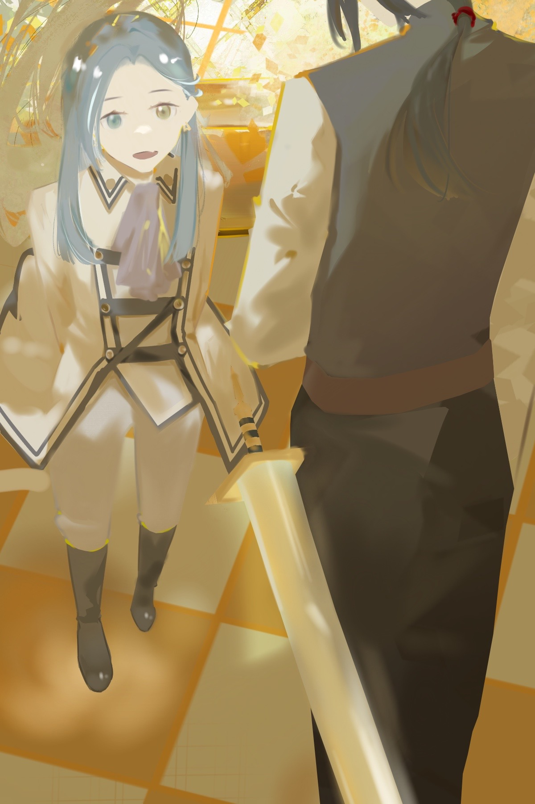
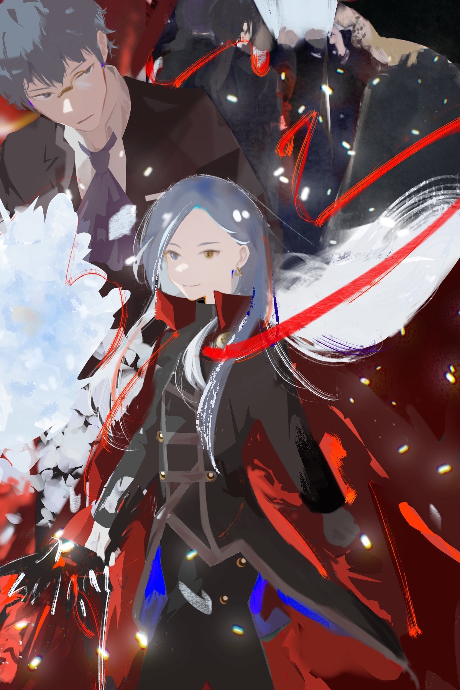
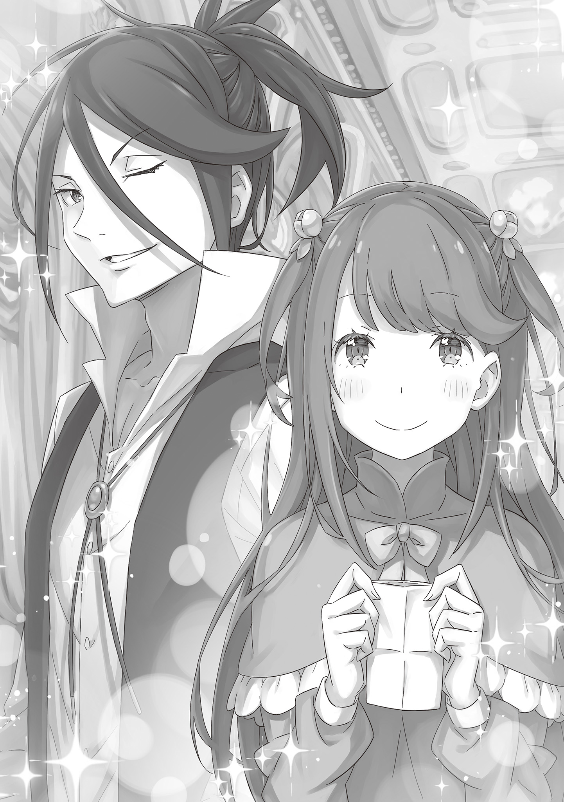

Боевая Баллада

第七章 『終章／戦歌』

× × ×

В день похорон шёл дождь.

— Она была из тех, кто мог бы ляпнуть что-нибудь вроде: «Как раз подходящая погода для похорон», — сказал Конвуд Мелахау, глядя на дождливое небо. Рыцарское парадное облачение сидело на нём как-то нелепо.

— Пожалуй, ты прав, — кивнул Вильгельм в ответ на его слова, сказанные шутливым тоном. Не только Вильгельм — другие сослуживцы, услышавшие разговор, тоже согласно закивали.

Она любила подобные высказывания, способные задеть за живое. Глядя на нелепый белый букет, возложенный Конвудом, Вильгельм подумал, что их отношения были такими, что позволяли вот так вспоминать об усопшей.

Прошло более десяти дней с момента «Покорения Злого Дракона» в Пиктатте.

Не прошло и нескольких лет после окончания Войны Полулюдей, как разразилась новая битва, потрясшая всю страну. Участие в ней Злого и Доброго драконов напомнило Королевству о Пакте с Божественным Драконом Волканикой. По иронии судьбы, действия Страйда Волакии вдохнули новую жизнь в Королевство Лугуника, связанное Пактом с Драконом.

Уже продвигался план восстановления города, понёсшего огромный ущерб. Люди постепенно осознавали свою боль и, неся бремя печали, начинали идти навстречу завтрашнему дню. Эти государственные похороны были частью необходимого ритуала на этом пути.

И вот…

— Господин Вильгельм, я полагаю? Мама много о вас рассказывала.

С этими словами мальчик, которому на вид не было и десяти лет, низко поклонился. Волосы цвета индиго до плеч, правильные черты лица, обещавшие будущую красоту, хрупкое, незрелое тело, облачённое в парадный костюм. У мальчика были глаза разного цвета — голубой и жёлтый.

Но даже без этой особенности в нём ясно угадывались черты Розвааль J. Мейзерс. Черты друга, павшего в той битве.

— Я — Вильгельм ван Астрея, рыцарь Королевства. Я многим обязан вашей матушке. У меня перед ней столько неоплатных долгов, что и не сосчитать. Она — великая благодетельница для меня и моей жены.

— …

— Я так и не успел сказать ей этого, но я ей очень благодарен. Я действительно получил от неё многое. И хочу отплатить за её доброту. Если у вас возникнут какие-либо трудности, обращайтесь ко мне в любое время.

Тут Вильгельм прервал речь и опустился на одно колено. Он снял с пояса свой любимый меч вместе с ножнами и положил его у своих ног. Затем посмотрел прямо на мальчика…

— Я непременно стану вашей силой.

Так Вильгельм поклялся дитю своего друга, Карлу Мейзерсу, совершив высший рыцарский ритуал.

Клятва рыцаря — абсолютна. Поэтому никакие трудности и невзгоды не смогут её нарушить.

— Надо же, чтобы сам господин «Демон Меча» сказал мне такое… Мама, должно быть, будет топать ногами от досады, что её здесь не было, — с лёгкой усмешкой проговорил Карл.

Вильгельм был удивлён выражением лица мальчика. То, как его губы дрогнули в печальной улыбке, словно он смотрел на что-то бесконечно дорогое, — это было так похоже на его мать.

— Господин Карл… Ах да, если наследуешь пост главы дома, то наследуешь и имя, верно?

— Со временем, да. Но не прямо сейчас. Пройдёт ещё много времени, прежде чем я стану зваться Розваалем… А до тех пор, пожалуйста, зовите меня Карлом.

— Я слышал, настоящее имя твоей матушки — Джулия. Впервые узнал об этом из эпитафии.

— После наследования поста главы дома принято скрывать прежнее имя. Раскрывают его разве что супругу или, возможно, очень близкому другу.

Карл прикрыл жёлтый глаз, оставив открытым голубой.

— Ясно, — кивнул Вильгельм.

За пять лет их знакомства Розвааль ни разу не заговаривала о своем настоящем имени. Вероятно, она и не собиралась его раскрывать Вильгельму.

Но он не думал, что это из-за поверхностности их отношений.

— Для меня твоя матушка всегда была и будет Розвааль.

— Уверен, мама тоже так считала, поэтому и не говорила вам.

Вильгельм не мог не покачать головой от неуместного чувства удовлетворения, вызванного ответом Карла. Слова мальчика были лишь словами от имени его матери. И всё же ощущать их так, будто это сказала сама Розвааль, — это был явный самообман.

— Ваши слова я глубоко запечатлю в сердце. Возможно, когда-нибудь и где-нибудь мне придётся попросить вас о помощи, господин Вильгельм. В таком случае…

— Преодолев все преграды, я примчусь к тебе. В клятве рыцаря нет лжи.

— Управляющий так назойливо смотрит, мне, пожалуй, пора.

За спиной улыбающегося Карла, чуть поодаль, стоял юноша в одежде дворецкого — Клинд. Элегантный управляющий, заметив взгляд Вильгельма, поклонился. Интересно, как он воспринял смерть своей госпожи?

Однако было ясно одно: он по-прежнему служит дому Мейзерс и намерен исполнять свои обязанности.

— Тогда на сегодня я откланяюсь. Когда-нибудь, где-нибудь ещё…

— Господин Карл Мейзерс.

— Да?

— Благодарю. Тебя и твою матушку. Спасибо. Я перед вами в долгу.

Вильгельм обратился к мальчику, который уже повернулся спиной и собирался уйти. Он сказал это простыми словами, без формальностей, далекими от рыцарского этикета, — тем же тоном, каким говорил с его матерью.

Услышав это, Карл на мгновение замер, широко раскрыв глаза…

— Берегите себя от ран и живите долго.

С этими удивительно взрослыми словами мальчик на этот раз действительно ушёл.

Эта комната была слишком уж крепко сбита, чтобы называть её гостевой.

Толстые каменные пол и стены были защищены «Метеорами», обладающими защитным эффектом. Даже дыхание Дракона не смогло бы пробить эту преграду с первого раза. Вокруг комнаты стояли искусные гвардейцы, денно и нощно действовала безупречная система охраны.

Хотя инцидент и был исчерпан, наследие, оставленное «Желающим Гибели», было велико. Не было гарантии, что не появится кто-то другой, кто попытается провернуть то же самое. Такая настороженность читалась во всём.

Впрочем…

— Похоже, эта мера скорее для предотвращения побега, чем для защиты от вторжения, не так ли, юнец? — раздался голос.

— Хм-м. Прискорбно слышать такое, господин советник, — ответил Миклотов МакМахон.

В этой неприступной комнате Миклотов принимал «почётного гостя» самого короля.

Миклотова, которого, несмотря на молодость, уже превозносили как мудреца, и который пользовался расположением Его Величества Гиониса Лугуника, окружающие иногда называли коварным не по годам. Или опасным хитрецом, которого нельзя недооценивать. Но все эти оценки казались лишь вежливыми эпитетами на фоне решимости Его Величества Гиониса назначить своим советником того, кто сидел сейчас напротив Миклотова, с трудом втиснув своё гигантское тело в стул. Гиганта, чьё существование держалось в тайне и который пылал враждой к «людям» Королевства.

— Прекрати нести чушь насчёт «советника». Оставлять нас с тобой вдвоём — само по себе безумие, — прорычал гигант, используя слова, подчеркивающие его силу и возраст.

— Даже если вы причините вред только мне, это ни к чему не приведёт. Вы ведь не из тех, кто действует безрассудно и без плана.

— Ирония? В результате безрассудства, на которое я якобы не способен, я сижу здесь, связанный. Разве не так?

— Если определять безрассудство как следствие безвыходности, то нет. У вас был и следующий план, и другие средства. И в этот раз они нас спасли.

Миклотов слегка склонил голову, вплетая в конец фразы нотку скромной благодарности. В ответ собеседник громко цокнул языком. Миклотов тихо вздохнул и спросил: — Почему? Вы же ненавидели Королевство, людей. Почему вы нам помогли?

— Не ненавидел. Ненавижу, — поправил гигант. — Я и сейчас ненавижу вас, ублюдков. Ни разу не гасло пламя в моей груди, жаждущее истребить вас всех до единого.

— …

— Но методы тех парней неприемлемы. При таком подходе жизни моих соплеменников будут без разбора и бессмысленно растрачены. А этого я не желаю. Вот и всё.

Сжигаемый неугасимой ненавистью, этот гигант, тем не менее, держал её под контролем.

Возможно, это даже страшнее, чем когда он был явным врагом , — подумал Миклотов, но не выдал своих опасений. Он медленно поднялся. Ему не хотелось задерживаться и вызывать недовольство гиганта. Он уже выразил благодарность и узнал причину сотрудничества. Теперь осталось…

— Я не собираюсь вас умасливать, но… испытываете ли вы какие-нибудь неудобства? Без вашего совета ситуация была бы куда более критической. Мы хотели бы по возможности обеспечить вам всё необходимое…

— Неудобства, — низко выдохнул гигант. Это единственное слово напугало Миклотова больше, чем явная враждебность или ненависть.

Миклотов широко раскрыл глаза. Гигант затрясся от смеха, сотрясая своими огромными плечами.

И затем взревел: — Ты спросил меня, испытываю ли я неудобства, молокосос?! Если говорить о них, то я испытываю их с самого рождения! Ни разу мы, полулюди, не были свободны!

— …

— Вот увидишь, Королевство Лугуника! Я ещё ничего не бросил! Когда-нибудь цепи, сковывающие меня, разорвутся, и тогда вы поймёте… кто на самом деле должен быть в цепях!

Миклотову стало стыдно за то, что он неосторожно коснулся этой незаживающей раны, этого неугасимого пламени.

Сгорая от стыда, он спросил гиганта, живущего с этой болью: — Эти слова… вы и Его Величеству Гионису скажете то же самое?

— …

Ответа не последовало. Но Миклотову показалось, что это молчание — своего рода надежда.

Ненавидимые, осыпаемые проклятиями, сжигаемые пламенем гнева — найдётся ли когда-нибудь ответ на этот вечный конфликт?

— Хотя я и сам этого хотел, но какая же неблагодарная роль, — пробормотал Миклотов себе под нос, уже выходя из комнаты, и коротко вздохнул.

— Не думал, что только мне доведётся испытать позор выживания, — с глубоким вздохом произнёс «Восьмирукий» Курган, ступив на землю в крепости у границы с Волакийской Империей, где должна была состояться его передача. В его голосе слышались горечь и унижение.

Его выживание действительно было неожиданным.

Проиграв дуэль Вильгельму, Курган должен был умереть там, на поле боя. Если бы только перед смертью он не получил благословение исцеляющей силы Божественного Дракона. Ирония судьбы заключалась в том, что из всей группы Страйда выжил лишь он, воин.

Однако…

— Но при этом ты не выглядишь раздосадованным, — заметил Вильгельм.

Голос Кургана не проклинал несправедливость судьбы. Напротив, его взгляд был спокоен, словно с него спало наваждение, и он тихо принимал такой исход. Как будто даже поражение было частью их заветного желания.

— Только не говори, что вы считаете, будто одержали победу и просто ушли.

— Страйда не заботили победы и поражения. Если уж говорить о них, то он всегда проигрывал. Но всё же в самом конце наш парень достиг своей цели. И этого достаточно.

— Цели…

— Он должен был умереть никем, но смог изменить ход событий. И умер не один.

Даже слушая это, Вильгельм не мог ни на йоту постичь истинных мотивов Страйда. Вероятно, и сам Курган не понимал их до конца. Никто не мог разгадать, что творилось в душе у того человека.

Он своевольно попирал мир, в конце концов уничтожил себя и умер. Жил и умер. Вокруг него были лишь те, кто пытался любить такого человека, даже не понимая его.

— Будь здоров, «Демон Меча».

Это был последний раз, когда «Демон Меча» и «Восьмирукий» обменялись словами.

— Что с ним будет, когда он вернётся в Империю? — спросил Вильгельм у Бордо Зелгефа, стоявшего рядом. Они провожали взглядом с крыши крепости удаляющуюся драконью повозку с Курганом. Передача прошла без заминок.

Бордо, отвечавший за транспортировку «Восьмирукого», сурово посмотрел в сторону имперской территории.

— Из-за этого инцидента Империя в большом долгу перед Королевством. Член императорской семьи, бежавший из своей страны, замышлял переворот в другом государстве и нанёс ущерб. Трения в отношениях неизбежны.

— И то, если Империя признает существование Страйда, верно?

— Верно. А Империя ни за что этого не признает. Королевство, понимая это, будет искать компромисс.

— Чушь собачья. И это называется политикой? — сплюнул Вильгельм.

— Это лишь малая часть, — с кривой усмешкой ответил Бордо. — Решать проблемы не кулаками — слабая сторона и для меня, и для тебя.

Он был прав. Это был мир, в котором ни Вильгельм, ни Бордо не были сильны. Но Бордо, в отличие от Вильгельма, должен был вступить на это незнакомое поле боя.

— Эта битва… была для меня последней, — сказал вдруг Бордо.

— …

— На последнем поле боя я смог сражаться рядом с тобой, Гриммом, парнями из отряда… и даже с Пивотом. Я выжил, своими глазами увидел величественный облик Божественного Дракона. Лучшего финала и не придумаешь.

Глядя на Бордо в этот момент, никто не смог бы сказать, струсил ли он или достиг умиротворения. Вильгельм хотел что-то ответить, но не нашёл слов и просто посмотрел в небо.

Облака над головой, подхваченные ветром, медленно меняли свою форму. Время не останавливало свой бег, ничто не вечно… Эти мысли бередили душу Вильгельма.

— Вильгельм.

— …

— Ты… Оставайся таким же. Не меняй свой внутренний стержень.

Вильгельм не смог отшутиться от этих странно сентиментальных слов Бордо. Он лишь молча поклялся далёкому синему небу, что сохранит их в сердце. «Демон Меча» дал эту клятву.

— Мы с Кэрол станем семьей.

После того как они немного выпили, Гримм Фаузен смущённо протянул Вильгельму записку с этими словами.

Они сидели в своей обычной таверне, был ранний вечер. В зале витал лёгкий запах выпивки, смешиваясь с шумными разговорами посетителей, — идеальная атмосфера для радостных новостей.

— Что правильнее: хмыкнуть «наконец-то» или сказать «поздравляю»?

— И то, и другое — в твоём духе.

— Ясно. Ага, так и есть. Наконец-то. Поздравляю.

Вильгельм поднял свою кружку, они чокнулись и выпили. «Станем семьей» — это было очень в духе Гримма. На самом деле это означало, что он наконец-то делает Кэрол предложение.

Многие, кто наблюдал за их романом, давно уже этого ждали. Препятствие, мешавшее развитию их отношений, — разница в происхождении между аристократкой Кэрол и простолюдином Гриммом — было устранено благодаря недавним событиям.

— Ещё бы, ведь главная заслуга в последней битве — твоя.

И это была правда. Гримм одолел зачинщика, Страйда Волакия, спас пленённую «Святую Меча» Терезию, да ещё и сыграл ключевую роль в битве с бушующим Злым Драконом Вальгреном. За эти подвиги ему было официально пожаловано рыцарское звание. Хоть титул и не наследовался, Гримм получил статус дворянина, и разница в положении с Кэрол исчезла.

— Когда свадьба?

— Скоро. Поговорю с Кэрол.

— Меня ведь позовёшь?

— Удивлён, что ты вообще подумал, будто тебя могут не позвать.

Обмениваясь такими шутками — Вильгельм словами, Гримм записками, — они продолжали пить. В последнее время Вильгельму давно не доводилось пить такого вкусного алкоголя. Сегодняшняя выпивка была особенной, во многом из-за радостной новости.

Но Вильгельм знал — это ещё не всё. У Гримма была и другая новость.

Поэтому он спросил напрямик: — Уходишь?

— Я ухожу из рыцарского корпуса.

Гримм ответил заранее подготовленной запиской. В обычном разговоре это выглядело бы странно, но между ними такие несоответствия были привычным делом. Привычная картина: Гримм водит карандашом по бумаге, выводя следующие слова.

— Женюсь на Кэрол и ухожу из Корпуса. Я решил.

— Причина?

— Хочу быть рядом с Кэрол. Быть с ней — смысл моей жизни.

Кончик карандаша двигался с жаром, буквы, которые он показывал Вильгельму, дышали решимостью. Гримм даже подался вперед. Видя это, Вильгельм лишь пожал плечами и вздохнул про себя.

Если подумать, Гримм постоянно обманывал его ожидания с самой первой встречи. Парнишка, ставший солдатом с поверхностным желанием быть героем; случайный товарищ, выживший вместе с ним в первом бою; потом его подобрал отряд Зелгефа под командованием Бордо; он носился по полям сражений как член самого сильного отряда королевской армии… и незаметно стал незаменимым лучшим другом Вильгельма.

Человек, который не вписывался ни в какие рамки. И которого невозможно было в них загнать. Поэтому было так похоже на Гримма: совершить подвиг, достойный лучших рыцарей королевства, и тут же использовать эту заслугу как предлог, чтобы жениться и уйти из Корпуса.

Да ещё и принять это решение ради того, чтобы быть рядом с любимой женщиной, — вот уж поистине ирония.

— Ну и дурак же ты.

— Не тебе мне говорить.

— Ах ты! Трус, который даже меч обнажить не в силах! — вырвалось у Вильгельма слово за слово.

Услышав эту неожиданную фразу, Гримм широко раскрыл глаза. Вид его удивлённого лица доставил Вильгельму злорадное удовольствие.

Интересно, помнит ли он? Те слова относились ко времени их первой встречи…

— Собравшись с духом, я отложу щит , — показал Гримм новую записку, словно отвечая на давний упрёк.

Когда-то Гримм не видел смысла в сражениях и не мог ответить на главный вопрос. Разочарованный Вильгельм тогда презрительно обозвал его трусом. Прошло больше семи лет, и вот теперь, наконец, ответ был найден.

На этом отношения Вильгельма и Гримма достигли своей полноты и завершённости.

— Уйдёшь — и что дальше? Семейное дело наследовать будешь?

— Семейное дело унаследовал мой младший брат. И потом, не говори так, будто тебя это не касается, господин

— Эй…

Вильгельм проследил глазами за быстро выводимыми строчками и нахмурился на последнем слове. Он был не настолько глуп, чтобы не понять намёк в этом обращении «господин».

— Ты, неужели…

— Госпожа Тиша любезно согласилась .

— Но матушка говорила мне, что главой дома буду я.

— Мы с Кэрол будем к вашим услугам, господин.

Вильгельм скривился от этих фамильярных заявлений и залпом осушил кружку. И, что самое обидное, выпивка была чертовски вкусной. Несмотря на то, что он только что унаследовал пост главы дома, который должен был перейти к нему от Бертоля, и его тут же совершенно проигнорировали в этом качестве.

Он вытер с губ остатки выпивки вместе со странным чувством — то ли досады, то ли радости.

— А я уж было обрадовался, что наконец от тебя отделаюсь…

На эти слова Вильгельма, похожие на ворчание проигравшего, Гримм буквально рассмеялся без звука.

— Мы с Гриммом… будем вместе.

Услышав эту трогательную новость, Терезия, сидевшая в кресле-качалке, невольно рассмеялась. Кэрол, которая с серьёзным видом начала с фразы «у меня есть важный разговор» и которой потребовалось столько времени, чтобы сделать это простое признание, всё ещё стояла перед ней с пунцовым лицом. Она была так мила.

— Л-леди Терезия? П-почему вы смеётесь?

— Ну, Кэрол, у тебя такое лицо, будто ты собираешься вызвать кого-то на дуэль! Я уж подумала, что ты скажешь… ты такая милая, правда!

— П-пожалуйста, не дразните меня… — Кэрол понуро опустила голову и принялась теребить подол платья. Терезия улыбнулась этому жесту.

Кэрол больше не могла скрывать свою влюблённость, и Терезия была уверена — причиной тому было недавнее посвящение Гримма в рыцари. Разница в их положении исчезла, свадьба была лишь вопросом времени. Терезия была искренне рада за них.

— Ты станешь Кэрол Фаузен? Или он — Гримм Ремендис?

— Я… я собираюсь взять фамилию Гримма, Фаузен. Дом Ремендис унаследует мой младший брат… А моё имя должно быть вычеркнуто из рода Ремендис.

— Кэрол, это!

— Это необходимо, леди Терезия. Даже если вы и леди Тиша будете сколь угодно великодушны, в моих руках… до сих пор живёт ощущение того дня.

Кэрол заявила это с прежним упорством, не желая уступать только в этом вопросе. Глядя на её серьёзное лицо и слыша твёрдое «я уже решила», Терезия поняла, что у неё нет ни права, ни смелости оспаривать это решение. Но одно она хотела уточнить: — Если ты покинешь род «Ножен», ты… ты уйдёшь и от меня?

— Леди Терезия! Даже если это говорите вы, от таких слов я рассержусь!

Терезия с облегчением выдохнула. Не скрывая своего детского желания опереться на подругу, она показала язык и извинилась. Она уважала решение Кэрол и хотела его уважать. Но они всегда были вместе, и Терезия хотела, чтобы так было и дальше. Это было её искреннее желание.

Поэтому, ради этого…

— Ты действительно уверена в Гримме? Это твоё самое большое счастье?

— Леди Терезия…

— Я хочу, чтобы ты была самой счастливой в мире, Кэрол. Поэтому я хочу, чтобы ты была с тем, кто сделает тебя самой счастливой. С Гриммом всё будет хорошо? Он — твоя судьба? Гримм — это твой Вильгельм?

— Леди Терезия, вы запутались. Я не скажу, что ваше последнее сравнение оскорбительно, но…

Кэрол нежно обняла Терезию, которая со слезами на глазах продолжала настаивать, и успокаивающе погладила по спине. Словно сестру или мать — ребёнка. Терезия почувствовала облегчение, но в то же время ей стало немного стыдно. Наверняка Кэрол сейчас волновалась гораздо больше неё.

Но Кэрол, обнимая её, улыбнулась.

— Всё в порядке, госпожа Терезия. Кэрол станет самой счастливой в мире. Гримм — моя судьба… нет, не судьба, а человек, которого я выбрала.

— Верно… Этому можно доверять гораздо больше, чем какой-то судьбе.

Терезия вытерла слёзы и, услышав слова улыбающейся Кэрол, надула губы: — Но это нечестно, Кэрол! Если ты так говоришь, я ведь ничего не смогу возразить!

— Да. Теперь причислите и меня к тем немногим, кто смог победить «Святую Меча», — улыбнулась Кэрол.

— Хорошо, так и сделаем. Да, я — самая слабая и жалкая, вечно проигрывающая, самая никудышная «Святая Меча» из всех. Так что и впредь… побеждай меня снова и снова, ладно?

— Можете на меня рассчитывать. Кэрол всегда будет рядом с леди Терезией.

Она отстранилась от объятий и мягко положила свою руку на руку Терезии. Их взгляды встретились. Преисполненная достоинства, гордая и очаровательная спутница Терезии… она стала сильной. Казалось, в её взгляде, в выражении её лица отражались причины этих перемен.

Не всё удалось вернуть. Многое было утрачено навсегда.

И всё же Терезия была благодарна за то, что сейчас они с Кэрол могли вот так смеяться вместе, проводя время друг с другом. Она вознесла молитву благодарности всем тем, кто помог этому случиться.

Так для долгой «Боевой Баллады Демона Меча» наступает последняя сцена.

— Кэрол и Гримм выглядят та-а-ак счастливо, правда?

— Ага, точно.

— Когда у них такие лица, язык не повернется сказать, что мне грустно из-за того, что Кэрол у меня «забирают», да?

— Ага, точно.

— Вильгельм, тебе тоже грустно, что Гримма «забирает» Кэрол?

— Ага, точно.

— Ну всё! Вильгельм, ты совсем меня не слушаешь! — взорвалась Терезия.

Они были вдвоём в спальне особняка Астрея. Терезия сердито надула щёки, глядя на мужа, который отвечал ей невпопад. Но Вильгельм, казалось, её не замечал. Он был поглощён другим — приложив ухо к её животу, он пытался расслышать присутствие их ребёнка.

— Тише, Терезия. Не слышно, как ребёнок плачет.

— Он не плачет! А ещё, будь добр, выслушай свою милую, важную, любимую жену!

— Потом.

— Так просто?! Ужас, ужас, ужас!

Терезия вздохнула из-за возмутительного поведения мужа, но в то же время… Вильгельм раньше словно боялся прикасаться к её животу, и то, что он сейчас так активно пытался взаимодействовать с ребёнком, её радовало. Конечно, если бы он ещё знал меру и не забывал о любви к самой Терезии.

— Ну и? Пока ты тут заставлял жену грустить, поговорил с ребеночком?

— Нет, ни в какую. Ничего не слышно. Он же там не мёртвый?

— Не говори страшных вещей! Он живой! Вот, смотри, даже сейчас активно двигается!

Будто решив присоединиться к протесту матери, малыш заворочался в животе. Терезия взяла руку Вильгельма и приложила к своему животу, чтобы он почувствовал.

— Что… Ого! Правда! — от этого ощущения лицо Вильгельма расцвело радостью… счастьем.

Как давно они не проводили такого спокойного, мирного, бесценного времени вместе? В такие моменты Терезия даже чувствовала себя жутко избалованной и безнадёжно капризной.

— Но мы же молодожёны и пока только учимся быть родителями. Такое — редкая роскошь.

— Роскошь? Мы просто вместе. Это раньше всё было неправильно.

— Н-ну вот, опять ты так запросто говоришь такие нечестные вещи… Сегодня мы будем вместе, да? — плюхнувшись на кровать, Терезия посмотрела на Вильгельма исподлобья.

Тот поднял бровь и мягко кивнул: — Ага. Наконец-то со всеми делами разобрались… Хотя, наверное, скоро снова начнётся суета.

— Армию ведь реорганизуют? Отряд Зелгефа тоже объединят с другими, сделают больше… Ходят даже слухи, что из них создадут Королевскую Гвардию.

Эту новость она услышала краем уха от Тиши Астрея, которая вращалась в кругах высшей аристократии. Некоторые говорили, что Тиша делает это, чтобы заглушить боль от потери мужа, Бертоля. Но у Терезии было иное мнение. Мать собирала истории — чтобы однажды, когда она снова встретится со своим любимым мужем, поразить его рассказами.

— Похоже на матушку, — пробормотал Вильгельм. — Но эта история с Королевской Гвардией… для меня всё сложно.

— Почему? Я рада, что тебя ценят…

— Если я стану гвардейцем, меня реже будут посылать за пределы столицы. А значит, и возможностей помахать мечом станет меньше. Но зато… я смогу быть рядом с тобой.

— …

— Поэтому и сложно. Хотя, думаю, чувство благодарности всё же сильнее.

Глядя на искренне обеспокоенное лицо мужа, Терезия в который раз изумилась и почувствовала прилив нежности. В мире Вильгельма мало что могло сравниться с мечом. Хотелось бы просто принять это, но… какой должна быть «правильная» реакция для жены «Демона Меча»? Это тоже был непростой вопрос.

Что ж, придётся потихоньку склонять чашу весов на свою сторону , — решила она.

— В любом случае, у нас есть несколько дней вместе. Еда, ванна — всё предоставь мне.

— Насчёт еды ладно, но в ванне помогать не позволю!

— Но ведь это из лучших побуждений, из заботы.

— В-вот именно! Плохо то, что забота идёт как дополнение! Я беременна, беременна!

— То, что ты Терезия, ничуть не меняе…

— А-а! А-а! Довольно! Нет, нельзя! На этом всё! Разговор окончен! — Терезия покраснела, схватила его за руку, усадила рядом и заставила себя обнять. — Давай, обними меня, крепко-крепко, сейчас же!

Её желание вырвалось наружу с такой силой, но Вильгельм лишь криво усмехнулся и сделал, как она хотела. Вот за это она его и любила, и ненавидела одновременно. И снова, и снова влюблялась в него с новой силой.

Можно ли жить с таким легкомысленным сердцем? — в который раз спросила она себя.

О таком и беспокоиться не стоит , — казалось, каждый раз отвечал ей голос отца. Любящая дочь была уверена: Бертоль, будь он здесь, сказал бы то же самое.

И поэтому с её губ внезапно сорвалось: — Я так хотела, чтобы имя ребёнку дал отец…

Это было желание, которое она загадала во сне, навеянном тем «Злым Глазом Гордыни», — там, где она встретила семью, которую уже не надеялась увидеть. Она знала, что желание несбыточно, но всё равно попросила. И Бертоль тогда с улыбкой ответил, что подумает и решит.

— Терезия, я тебе кое-что не сказал, — тихо прошептал Вильгельм ей на ухо, всё ещё обнимая. Затем он разжал руки и полез себе за пазуху.

— Это мне передала твоя матушка. Просила отдать тебе от меня, когда будет подходящий момент.

Он протянул ей смятое письмо. Терезия робко взяла его. Она растерянно смотрела на потрепанный лист — частично порванный, согнутый, с почерневшими краями. Неужели это… кровь?

Дрожащими пальцами она развернула письмо…

— Ах…

— Похоже, твой отец всё это время думал над этим.

Услышав слова Вильгельма, Терезия коротко, прерывисто вздохнула. На листе было бесчисленное множество имён. Рядом с ними стояли пометки — кружочки, крестики… Следы мучительных раздумий, озарений, отказов, отчаянных попыток найти то самое имя.

И среди них — одно-единственное, последнее, обведённое в кружок.

— Хейнкель.

Она произнесла это вслух. Имя слетело с губ. Хейнкель… Этот звук нежно, но пронзительно отозвался в груди Терезии.

— Похоже, он думал только об имени для мальчика, — усмехнулся Вильгельм. — Прямолинеен, когда ему что-то втемяшится в голову… В этом весь твой отец.

— Правда… да, точно. Правда, всё это… так похоже на папу… — прошептала Терезия, с трудом сдерживая слёзы.

Она ведь не просила его напрямую. Но он, наверняка, сам загорелся идеей, долго мучился, страдал, перебирал варианты… и действительно всерьёз думал об этом.

— Он сдержал обещание…

Она думала, что то обещание, данное отцу после его смерти, останется невыполненным. Обещание, которое, казалось, невозможно было сдержать. Но Бертоль сдержал его. Он сдержал последнее обещание, данное своей любимой дочери.

Он был таким человеком. Способным на такое. Она от всего сердца гордилась им.

— Хейнкель… Хейнкель… Хейнкель… — снова и снова повторяла она имя, словно желая, чтобы ребёнок в её животе услышал его.

— Хейнкель Астрея, — тоже произнёс Вильгельм, обращаясь к своему ребёнку. Он только что посмеивался над тем, что Бертоль не подумал об имени для девочки, но всё равно назвал сына так.

— Хейнкель… это твоё имя. Имя, над которым так усердно думал твой дедушка — самый добрый и самый храбрый на свете. Имя, которым тебя будут звать много-много раз с любовью после твоего рождения. Было тяжело ещё до твоего рождения, и наверняка будет тяжело и после, но… мы с Вильгельмом будем рядом. И дедушка с бабушкой тоже любят тебя.

— Похоже, наше общение с Гриммом и Кэрол тоже затянется надолго, — добавил Вильгельм. Так что гарантирую: когда ты появишься, скучать тебе точно не придётся.

На его слова Терезия медленно повернулась, её голубые глаза отразили любимого мужа. Она улыбнулась — прелестно, как распускающийся цветок.

— Вильгельм, я люблю тебя… А ты?

На её слова Вильгельм посмотрел ей в глаза и ответил так, что его неизменная натура была невыносимо мила:

— …Сама знаешь.

Так и эта история подходит к концу.

История мужчины и женщины, брошенных на произвол судьбы злой волей «Желающего Гибели». История любви, прошедшей испытания, и любви, ответившей на них.

Было много расставаний, и чаши весов приобретённого и утраченного не найти в равновесии. Но кто из посторонних может измерить чужое счастье и несчастье?

Сейчас — просто слушайте. Слушайте боевую балладу.

О чём пел «Демон Меча», тоскующий по любви? Неуклюжий демон, способный говорить лишь на языке битвы, — чего он возжелал в конце своего пути?

Пусть же в конце «Боевой Баллады Демона Меча» настанет то завтра, о котором он мечтал.

《Конец》
