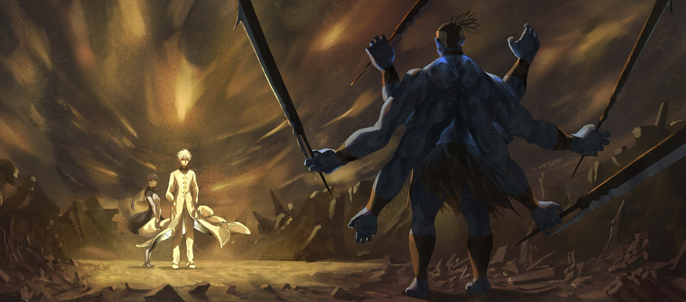

— Эй, верзила! И тут тоже поработай!

После этих слов в спину мужчины полетел инструмент для земляных работ. Он ловко поймал его одной из своих нескольких рук и медленно поднял голову.

Ростом он был метра два с половиной, не меньше. Мощное, мускулистое тело отливало глубокой синевой, а на крепкой шее покоилось такое свирепое лицо, что и зверодемон бы сбежал в страхе. Однако самой примечательной чертой этого мужчины были, пожалуй, не лицо и не внушительный рост, а восемь толстенных, как бревна, рук.

Представители племени многоруких обычно имеют от четырех до пяти рук, но обладатели восьми рук — большая редкость. Во всей истории найдется лишь один с таким количеством конечностей.

Так или иначе, при виде такого гиганта, стоило бы дважды подумать, прежде чем так грубо и пренебрежительно с ним обращаться. Но, к сожалению, обидчик не ошибся в выборе объекта для своих издевок и, по крайней мере, по его собственному мнению, имел полное право так себя вести.

Ведь обидчиком был надсмотрщик этой каменоломни, а гигант — всего лишь пленник, находящийся в его подчинении.

На шее гиганта красовался Метеор, именуемый «Ошейником Подчинения». Стоило ему не угодить надсмотрщику и он был бы наказан по первому желанию хозяина. О сопротивлении не могло быть и речи. Да он изначально и не помышлял о бунте.

— Чего уставился? Глаза у тебя больно дерзкие. Недоволен чем-то?

— Нет. У меня всегда такое лицо.

Услышав этот ответ на свою придирку, надсмотрщик хищно прищурился. Гигант приготовился к наказанию, но…

— Надсмотрщик Рехал! Вас вызывает комендант!

— Тьфу, везучий ублюдок… — выругался надсмотрщик, скривив лицо.

— Чтоб вернулся и все было сделано! — удалился он с этими словами.

Проводив его взглядом, гигант посмотрел на кирку в своей руке и пробормотал, словно ослепленный: «Везучий, говоришь…».

— …Какая ирония, Страйд, меня называют счастливчиком, — с этой полной смирения фразой он замахнулся киркой, приступая к работе — закладке фундамента для огромной строящейся крепостной стены.

Когда-то жил легендарный воин, прозванный «Восьмируким».

Выходец из редкого племени многоруких, обитающего в Империи Волакия, он, как и следовало из его прозвища восемью руками управлялся с оружием, сокрушая любых, даже самых грозных противников.

В империи, где превыше всего ценилась сила, «Восьмирукий», носивший титул сильнейшего, был объектом всеобщего восхищения.

Однако, всё это было почти тридцать лет назад.

Превозносимый как сильнейший в империи, «Восьмирукий» был неофициально объявлен особо опасным преступником, как один из зачинщиков военных действий против соседнего королевства Лугуника. Учитывая былые заслуги «Восьмирукого» и его реальную силу, он вполне мог бы оспорить несправедливый приговор силой и отказаться от такого унизительного положения.

Но он этого не сделал. Он без сопротивления принял наказание, назначенное страной.

В итоге, приговоренный к бессрочным каторжным работам, «Восьмирукий» вот уже несколько десятилетий трудился над возведением мощных и неприступных стен крепостного города Гаркла, расположенного на севере империи.

За эти годы легенда об «Восьмируком» покрылась ржавчиной забвения, и многие из тех, кто надзирал за ним во время работ, даже не знали, кем он когда-то был.

К строительству этой бесконечной стены, призванной стать ещё крепче и прочнее, привлекались в основном такие же преступники, как «Восьмирукий», проигравшие в войнах солдаты и скитальцы, не имеющие родины.

Даже среди этих обездоленных «Восьмирукого» считали пустым местом, трусливым старым волком, который не возражает и не сопротивляется издёвкам.

Так продолжалось до того самого дня.

Это должен был быть самый обычный, ничем не примечательный день.

Гору Гилдрей, служившую естественной границей с соседним государством, окутывала легкая дымка, и прохладный ветерок проникал в прилегающий к ней Город-Крепость. В последнее время стояла душная, знойная погода, поэтому на стройплощадке только и разговоров было, что о том, насколько легче будет работать сегодня.

Однако…

— Эй… Я же сказал, позовите мне главного, — послышались слова, прозвучавшие словно каприз избалованного ребёнка и сопровождавшиеся ужасающими разрушениями.

Высвобожденная ударная волна вздыбила землю города, сметая с лица земли людей, вещи, здания — буквально всё, превращая их в груду обломков.

Одним махом была разрушена треть Гарклы, гордившейся своей неприступностью, а число жертв превысило десять тысяч.

После первого удара воцарился кромешный ад: повсюду раздавались крики и вопли. Ступая по руинам, мужчина откинул прядь седых волос и проговорил:

— Черт, мало того, что меня занесло в такую дыру, так ещё и наткнулся на невежливых грубиянов. Невероятно не везёт. Я же специально проделал весь этот путь, а им плевать на приложенные мной усилия. Где элементарная вежливость, спрашивается? — бормоча себе под нос, мужчина небрежно щелкнул пальцами. И в тот же миг в точке, куда был направлен щелчок, произошел небольшой взрыв, принесший городу новые разрушения и увеличивший число жертв.

Мужчина, сеющий вокруг себя непостижимые разрушения, со скучающим видом оглядел содеянное и произнёс:

— И в довершение всего, когда я указываю им на их ошибки, никто даже не извиняется. Как же раздражают эти люди, думающие только о себе. Ты так не считаешь, сто тридцать четвертая?

— Да, господин, вы совершенно правы, — спокойно ответила идущая следом за ним шатенка. Мужчина удовлетворенно кивнул, выслушав ответ женщины. Её черты лица и изысканные манеры напоминали безжизненную куклу.

В этот момент…

— Стройся, сволочи! Настало время послужить! — пронзил воздух резкий голос, сопровождаемый топотом множества ног.

Услышав это, седовласый мужчина нахмурился и уставился на выстроившуюся перед ним шеренгу.

Это были около тридцати мужчин в потрепанной одежде и с примитивным оружием в руках.

Разного возраста и расы, помимо потрепанного вида, их объединяло наличие ошейников.

— И что это? Наконец-то осознали свои ошибки и решили всем скопом поприветствовать меня? Должен сказать, я не жду каких-то грандиозных почестей. Всё, что мне нужно, это нормальное человеческое отношение. Ах да, я ещё кое-что ищу. Не то чтобы мне это было нужно, но меня попросили достать одну вещь… — втолковывал цель своего визита мужчина, не скупясь на слова.

— Огонь!

По команде человека в имперской военной форме, стоявшего позади шеренги, в мужчину разом полетело оружие.

Оружие градом обрушилось на него, прервав его речь на полуслове…

— …Я, кажется, только что говорил! Прерывая меня, вы попираете мои права. А подобного я не прощаю!

Мужчина вытянул руку, лишь прикрыв стоящую позади женщину от летящего оружия, а сам остался беззащитен перед градом смертоносных предметов, однако он… вышел из него целым и невредимым, лишь слегка ощетинившись.

Ярость мужчины обрушилась на выстроившихся перед ним пленников.

Улица исчезла, многие превратились в безжизненные куски плоти, а у выживших, похоже, не было выбора — им оставалось лишь, сжимая в руках оружие, подобранное ценой невероятного везения, с отчаянием на лицах бросаться на мужчину.

— Никто не желает меня слушать. …Как же это отвратительно, — с искренним отвращением выплюнул мужчина, щелкнув пальцами в сторону бегущего впереди всех противника.

В царившем хаосе на плечи надсмотрщика Рехала Ивсанта обрушился груз неотложных решений.

Для Рехала, который по сути был всего лишь надзирателем за строительством стены, поступающие доклады и указания по реагированию явно выходили за рамки его должностных обязанностей, но в этой ситуации ничего не поделаешь.

Дело в том, что комендант крепостного города Гаркла погиб при первом же ударе, превратившись в кровавый туман. Его помощники тоже были сметены, и в настоящий момент официальная система командования Гарклы была полностью разрушена.

Пока шло бы выяснение, рана, нанесенная городу, могла стать смертельной.

Поэтому Рехалу ничего не оставалось, кроме как временно исполнять обязанности коменданта. Разумеется, такое абсурдное решение принял не сам Рехал, простой надсмотрщик.

Подтолкнул его к этому решению…

— Враг… всего один? И он раскидывает каторжников? Что за бред…

— …По-вашему, это ошибка? Вы основываетесь на здравом смысле? Но разве здравый смысл объясняет то, что творится в городе? Шевелите мозгами!

— Т-то есть, сын Императора, вы всерьёз полагаете, что один человек мог сотворить такое с городом?

— Разумеется, нельзя исключать, что он действует не в одиночку… Но главное — это его цель, — приложив руку к губам, задумался случайно оказавшийся в городе с инспекцией человек — юный сын Императора, которому не было и десяти лет.

Рехал принял решение безоговорочно следовать его указаниям, пораженный мудростью не свойственной юноше его возраста.

В этом сыне Императора, который был младше его вдвое, чувствовалась какая-то непостижимая, несоизмеримая с возрастом сила. Величие, которое заставляло думать: «Вот каким должен быть меч Волакии».

— …Хотя именно я больше всего этого и не желаю.

— Сын Императора?

— Не обращайте внимания. Главное — не допустить дальнейших разрушений. Действуйте как можно быстрее. И ещё… в этом городе должен быть «Восьмирукий».

— Д-да… Да? «Восьмирукий»? Но…

Решимость Рехала тут же пошатнулась, и он неуверенно заморгал.

Юноша говорил об одном из каторжников, приговоренных к работам в этом городе. Многорукий с восемью руками, но совершенно безвольный, чьё прозвище «Восьмирукий» было лишь насмешкой над его сущностью.

— Почему вы вспомнили о нём?…

— Глупец, — резко одним словом осадил он Рехала, покрывшегося холодным потом, и посмотрел в окно.

Сын Императора наблюдал за ужасающей картиной разрушенного города, где уже не осталось безопасных мест, слушая непрекращающийся грохот и звуки взрывов, и продолжил:

— Услышав твоё имя, многие реагируют так же. …И это тебя устраивает, «Восьмирукий»?

Курган лежал навзничь, не в силах разглядеть синеву неба сквозь пелену облаков, и щурился. Кости во всём теле ломило, внутренние органы, похоже, тоже были серьезно повреждены, а дышать было тяжело.

Во время каторжных работ надсмотрщик, бывало, ради развлечения наказывал его разрядами тока через «Ошейник Подчинения», а другие каторжники срывали на нём злость, избивая, но ничто из этого не причиняло ему настоящей боли.

Однако нынешние раны были настоящими. Боль была настоящей. Но тот, кто нанёс их, был далёк от образа настоящего воина или бойца, — это было отвратительное, мерзкое, порочное существо.

«Неужели, так всё и кончится…?», — эта мысль целиком завладела Курганом.

Десятки лет назад он помог своему приёмному сыну в его мятеже против мира, и после того, как все его соратники погибли, он остался единственным выжившим… с тех пор прошло много времени.

Проведя впустую эти долгие годы, он будет убит нелепой, человекоподобной катастрофой.

Таков конец Кургана…

— Ты правда согласен с этим?! Исполни свой долг! — в следующее мгновение этот голос схватил за душу Кургана, уже собиравшегося безвольно закрыть глаза.

Сами по себе слова ничем не отличались от тех, что выкрикивал надсмотрщик, заставляя Кургана и других каторжников подчиняться «Ошейнику Подчинения» и служить живым щитом от угрозы. Но в отличие от надсмотрщика, погибшего в результате атаки, эти слова почему-то задели Кургана за живое.

Ибо в этом голосе звучало отчаяние человека, готового поставить на кон собственную жизнь ради достижения цели.

Такое же отчаяние было и у сына Кургана — Страйда Волакии…

— Сбросьте! — выкрикнул приказ тот же голос, и рядом с поверженным Курганом с тяжелым гулом что-то упало. Что именно — он не увидел. Но ему и не нужно было видеть.

Звук рассекаемого воздуха и глухой удар о землю — Курган не мог ошибиться.

— ……Тесаки.

— Это твоё оружие, «Восьмирукий»! Раз уж ты оказался здесь, тогда исполни свой долг! Вот что значит быть Мечом-Волком Волакии!

Резким рывком Курган поднялся на ноги и бросился к месту, куда, если верить звуку, они упали. Там, воткнувшись в землю, стояли четыре огромных тесака с широким и толстым лезвием — «Демонические Тесаки». Он выдернул их из земли и крепко сжал в руках.

Прошли десятилетия с тех пор, как он сжимал в руках эти тесаки, но, едва ощутив их тяжесть и фактуру, этой пропасти во времени словно и не бывало вовсе.

Разумеется, за эти долгие года, пока за ними не ухаживали, они неплохо затупились…

— Есть, — низким, глухим голосом ответил Курган, пораженный собственным воодушевлением.

Ещё мгновение назад он был готов умереть здесь, ни за что не сражаясь. Но при этом, стоило ему ощутить в руках тяжесть любимых тесаков… Нет, причина внезапно вспыхнувшего боевого духа была в другом.

Причина была наверху крепости, в черноволосом мальчике, отдавшем приказ сбросить Кургану «Демонические Тесаки», — в силе духа, заключенной в его голосе, пробудившей саму душу «Восьмирукого».

Он не должен позволить этому мальчику умереть. Ради этого он вновь и взмахнет тесаками.

Медленно выдохнув, Курган посмотрел вперёд. На другом конце улицы он встретился взглядом с седовласым мужчиной, который отбросил его на огромное расстояние.

И тогда…

— «Восьмирукий» Курган.

— Архиепископ Греха Культа Ведьмы, воплощение Жадности, Регулус Корниас.

…Город-Крепость Гаркла пал примерно за час.

Многие из тех, кто услышал эту новость, навсегда запечатлели в своей памяти ужас, внушаемый Архиепископом Греха Культа Ведьмы, столь быстро уничтоживший город, известный своими неприступными стенами.

Однако мало кто знал, что этот час был лишь результатом задержки: изначально всё должно было завершиться вдвое, если не втрое, быстрее.

Та толика времени, которую «Восьмирукий» Курган смог выиграть в битве против Архиепископа Греха, являющегося бедствием для всего мира, казалась мизерной, но именно оно позволило свести к минимуму ущерб, нанесенный Жадностью.

Все тесаки Кургана были сломаны, а сам он, потеряв все восемь рук и истекая кровью, опустился на колени.

Стоящий перед ним мужчина был невредим, он раз за разом сводил на нет все атаки Кургана с помощью какой-то явно нечестной техники. Он не был воином. Но сейчас Кургана это нисколько не волновало.

Он лишь увидел, как вдалеке, за спиной мужчины, в затуманенном от потери крови зрении, взвился флаг, и его губы растянулись в улыбке.

Флаг с изображением пронзенного мечом волка — знак того, что приказавший Кургану сражаться использовал выигранное время не понапрасну…

— …Великолепно.

— «Великолепно»? С чего вдруг такие слова? Никаких эмоций они у меня не вызывают. Вообще-то, ещё до того, как всё это началось, должно было быть понятно, что всё это бесполезно. Не знаю, глупый ты или ещё что, но из-за того, что ты этого не понимал, ты отнял у меня кучу времени, а теперь говоришь «великолепно»… — продолжал что-то бормотать мужчина, но Курган уже не слушал его пустую болтовню.

Игнорируя его, Курган медленно терял сознание. Он думал лишь о том, был ли смысл в том, что он выжил в той битве и провел здесь столько времени.

Он желал, чтобы его битва здесь оставила след в будущем, чтобы она стала хоть малейшим уроном для тех, кого ненавидел Страйд, — для Наблюдателей.

Таковы были его мысли.

— Спустя годы, юный сын Императора, оказавшийся свидетелем тех событий, приложил все усилия для восстановления доброго имени Героя Волакии — «Восьмирукого».

А Рехал Ивсант, ставший новым комендантом Города-Крепости, нуждавшегося в восстановлении, отреставрировал сломанные тесаки «Восьмирукого» и выставил их на самом верхнем этаже крепости как символ несокрушимости города.

Многие считали ту битву полным поражением «Восьмирукого», но Рехал и другие, спасенные в тот час, будут из поколения в поколение рассказывать о совершенной победе Кургана.

Они будут говорить, что такова легенда о «Восьмируком», пережившем старую битву и погибшем ради нового будущего.

《Конец》
