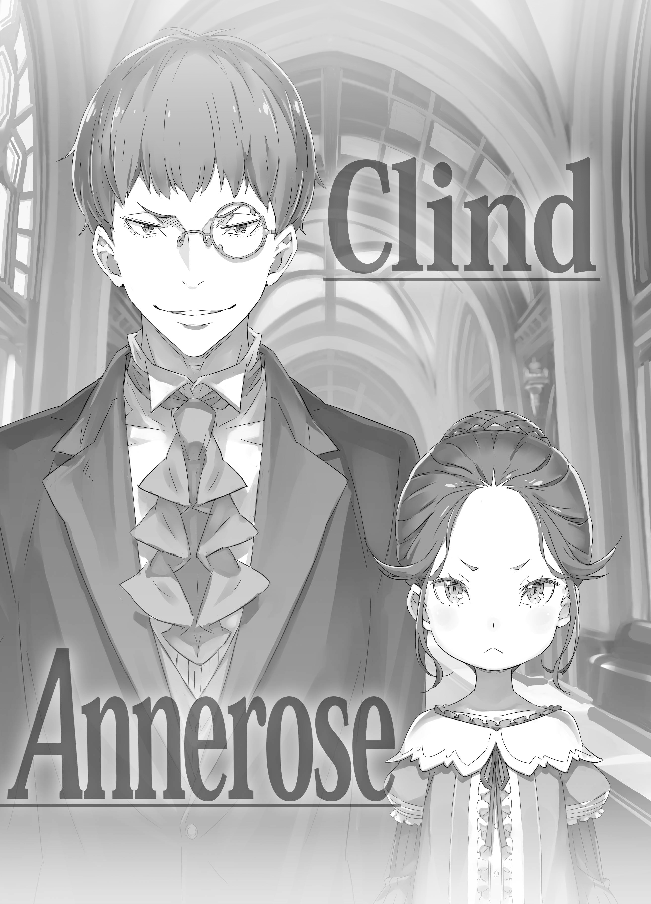

— Вы эгоистичны, как и всегда, дядя!

Маленькая девочка громко отчитывала его, скрестив руки на груди.

Её тёмно-синие, заплетённые в пучок волосы были уложены на макушке, а сама она была облачена в официальный наряд, производящий строгое впечатление. Черты её нежного, утончённого личика были прекрасны, но сейчас его омрачили сурово сдвинутые брови, выражая явный гнев, так что неосторожным комплиментом было не отделаться.

И тем, на кого была направлена вся ярость этой девочки и кто лишь криво усмехался в ответ, был высокий мужчина с таким же цветом волос, разноцветными глазами, и одетый в костюм клоуна.

— Прошу проще~е~е~ения за доставленные неудобства, Аннероза. Но тебе ведь не было нужды отправляться в Святилище ли~и~и~ично. В пути, верно, намучилась?

— Если бы я не приехала, кто тогда смог как следует высказать дяде все претензии? Ну право же! Все только и делают, что балуют дядю, вот он и начинает вести себя как вздумается, доставляя всем неудобства. Вы ведь уже взрослый человек, извольте задуматься над своим поведением!

— Ох-ох, ты всегда ставишь меня в неловкое положение, не та~а~ак ли? Но, да, ты права. Прости.

Кривая ухмылка стала ещё глубже, и мужчина — Розвааль — понуро опустил плечи и послушно склонил голову перед девочкой.

Увидев, как Розвааль извиняется, она изумлённо округлила глаза.

— Аннероза? Что-то не та~а~ак?

— Просто… чтобы дядя столь искренне просил прощения… Что же с вами стряслось? Уж не связано ли это с вашей ярко-красной щекой?

Коснувшись своей нежно-розовой щёчки, девочка указала на щёку Розвааля — распухшую и алую. Услышав это замечание, он кивнул:

— Ах, да~а~а~а… Как видишь, я получил зна~а~а~атный удар по лицу, меня даже отбросило.

— Ох! Прямо дяде по лицу?! Да кто же… кто же мог совершить такое?!

Аннероза изумлённо прикрыла рот рукой, а Розвааль обернулся.

Там, перед вереницей драконьих повозок, на которых прибыла девочка, толпилась взбудораженная группа людей. Розвааль указал на стоявшего среди них светловолосого юношу — Гарфиэля — и сказал:

— А вот и о~о~он. Нет, бил меня не только он, но сильнее всех ударил и~и~именно он. Да так, что я аж сквозь стену пролетел.

— Непостижимо!.. Я сейчас же пойду и выскажу ему всё!

С нескрываемым потрясением на лице, девочка резво подбежала к Гарфиэлю. Заметив её приближение, парень слегка насторожился.

— Аа? Чё надо, мелюзга?

— Это вы! Говорят, это вы ударили дядю так, что он отлетел!

Гарфиэль вытаращил глаза на Аннерозу, которая решительно ткнула в него пальцем и выпалила это. Он хмыкнул «Ха!» и оскалился:

— Ну да, я. Какие-то предъявы?..

— В вас чувствуется огромный потенциал, молодой человек! Если дядя решит вам докучать, непременно жалуйтесь мне! Я буду на вашей стороне!

— А? Аа, э-э-э…

Такими словами Аннероза совершенно сбила Гарфиэля с толку.

— Ох-хо-хо… И впрямь неловко.

И этим она ещё больше заставила Розвааля почувствовать себя не в своей тарелке.

— Меня зовут Аннероза Милоад. Я из побочной ветви семьи Мейзерс, к которой принадлежит дядя… В общем, можно сказать, я его дальняя родственница. Прошу любить и жаловать.

Так величаво представившись, Аннероза продемонстрировала безупречный реверанс, выполненный по всем нормам этикета.

Самосознание, сквозившее в каждом её жесте, легко давало окружающим понять аристократическое достоинство девочки, которой не было ещё и десяти лет, и его высокую чистоту. Её тёмно-синие волосы, как и следовало из объяснений Аннерозы, подтверждали кровное родство с Розваалем, однако…

— И не скажешь, что она родственница Розвааля, настолько нормальный ребёнок…

— Понимаю, что он для вас ближайший пример, но, думаю, не стоит брать маркграфа за эталон аристократа. Все знают, что маркграф Мейзерс — тот ещё чудак.

— Ну, наверное, это так. В королевском замке большинство аристократов были такими, как я и представлял.

Когда Субару задумчиво пробормотал это, Отто с неопределённым выражением лица кивнул: «Верно».

Не обращая внимания на этот их разговор, отряды, которые привела с собой Аннероза, один за другим въезжали в Святилище и занимались размещением пассажиров, которых было более ста.

Святилище было благополучно освобождено, но состояние его было плачевным.

Ведь сначала был сильный снегопад, навлёкший на них Великого Кролика, а затем, ради уничтожения этого зверодемона, последовали ожесточённая битва Эмилии и боевое крещение Субару с Беатрис.

Розвааль был сильно истощён, Эмилия всё ещё не освоилась со своей освободившейся от оков силой, и для уборки снега не оставалось ничего, кроме как полагаться на силы природы. Поэтому в Святилище задержался несвойственный сезону холод, и, пусть даже временно, требовалась скорейшая эвакуация.

— Да уж, в самый подходящий момент появились…

— …Мы, что подготовились заранее по просьбе господина. Услуга.

— Уо-о-о-о?!

Когда в их разговор так естественно вклинились, Субару и Отто одновременно подпрыгнули. На их изумлённый вид молодой человек с синими волосами поклонился, сказав: «Мои извинения».

Аккуратно подстриженный, с моноклем на левом глазу, что подчёркивал его интеллигентное лицо. Облачённый в чёрный костюм, он был худощав, но тело его было идеально натренировано, и даже непрофессионал бы заметил его безупречную выправку.

— Эм, а вы, наверное…

— Я Клинд, служу дворецким у госпожи Аннерозы. Ранее я также исполнял обязанности дворецкого у господина… Розвааля L. Мейзерса. Дерзость.

— Дворецкий… это вроде как самый главный среди горничных и остальных слуг, да?

— Совершенно верно. Проницательность.

От ответов Клинда, который слегка опустил подбородок, у Субару по спине пробежал холодок.

Манеры Аннерозы его впечатлили, но поведение этого Клинда было чем-то большим. Он был настолько безупречен, что было даже жутко.

— Прошу прощения, Клинд. Вы сказали, что всё было подготовлено заранее?

— Да. Мы получили предварительное сообщение от господина. Вы ведь Отто Сувен, министр внутренних дел, не так ли? Я уже наслышан о вас. Компетентность.

— В ваших словах есть момент, в обсуждении которого я даже не поучаствовал, и я не могу с этим смириться!

Краем глаза наблюдая, как Отто причитает о своей судьбе, Субару тихо пробормотал: «Серьёзно?».

Если этот спасательный отряд во главе с Аннерозой был подготовлен заранее, то, несомненно, Розвааль предвидел его необходимость после того, как воплотил в жизнь содержимое Книги Мудрости.

В итоге они пошли по пути, отличному от описанного в книге, но каким же ироничным оказалось это спасение.

— …Благодаря этому, часть проклятия господина также будет снята. Признательность.

— А? Что вы сейчас сказали?

— Не пора ли вам почувствовать голод? Я спрашивал, не желаете ли отобедать. Повторение.

— Да нет же, вы точно не это говорили! Там было что-то гораздо более важное!

Субару возразил на столь явную отговорку, но Клинд нахмурился, пожал плечами и, вздохнув, не выказал ни малейшего намерения отвечать на вопрос.

Такое поведение сразу же сделало ещё более убедительным тот факт, что он связан с Розваалем. И пока дворецкий морочил Субару голову,

— Опять за своё… Клинд, не мог бы ты уже избавиться от этой дурной привычки дразнить других?

— Фредерика, ты его знаешь?.. А, ну да, это ж очевидно.

Фредерика, подошедшая к ним с таким видом, будто больше не могла на это смотреть, на слова Субару кивнула с крайне недовольным выражением лица, сказав «да».

— К сожалению, мы давно знакомы. Клинд долгое время служит господину… так что и я, будучи новичком, была на его попечении.

— Со старшим товарищем, которого так давно знаешь, ты на удивление язвительна…

— Что ж, это так. Конечно, если говорить лишь о способностях, его можно оценить как подходящего на роль дворецкого, но… у этого мужчины столько недостатков, что они с лихвой перекрывают все достоинства. Особенно…

Возможно, из-за давней связи её жалобы были бесконечны, и Фредерика уже собиралась их перечислять. Но прежде чем она успела, к ним подбежала маленькая фигурка.

— Сестрица Фредерика! Все из деревни собрались на площади. Что делать дальше?

— П-Петра! Стой, не подходи сюда!

— А?

Петра, закончившая провожать жителей деревни к драконьим повозкам, подбежала к старшей горничной за следующими указаниями. При виде неё Фредерика изменилась в лице, но было уже поздно.

Когда они это заметили, прямо перед удивлённой Петрой уже стоял тот мужчина — Клинд. Пока все изумлялись его неуловимой для глаз скорости, он посмотрел на девочку сверху вниз и кивнул.

— …Понятно. В настоящее время это чрезвычайно многообещающее дитя. Высший балл.

— В-в настоящее время?.. Не в будущем?

— Да, в настоящее время. Именно в вашей юности, этом средоточии возможностей, вы обладаете наивысшей ценностью. Когда-то и Фредерика была такой, но сейчас она в столь плачевном состоянии… Разочарование.

— Прекрати немедленно, извращенец!

Фредерика, рванув вперёд, безжалостно пнула Клинда. Тот, даже не глядя, увернулся от удара со спины, и скользящим движением оказался за Петрой.

— Ухья!

— П-подлец! Мерзавец! Сражайся честно!

— Сражение? Нелепость. Я всего лишь желаю дать несколько советов этой в настоящее время многообещающей девочке — да, Петре — относительно её работы. Доброжелательность. Почему же ты мне мешаешь? Непостижимо.

— Этот!..

Фредерика яростно атаковала абсолютно невозмутимого Клинда, но он раз за разом уворачивался, неизменно выставляя Петру между собой и ею. Петра, угодившая в эпицентр бури, только и могла, что крутить головой и восклицать «Ва-ва-ва-ва!», а битва тем временем становилась лишь ожесточённее.

— Аа, Нацуки. С этим я как-нибудь управлюсь, так что, может, вам лучше пойти к госпоже Эмилии?

— Это было бы очень кстати, но… как ты собираешься «как-нибудь» это сделать?

— «Как-нибудь» — это «как-нибудь», понимаете? Если подумать о будущем, то, наверное, мне придётся для начала справиться хотя бы с такой нелепой задачкой.

На эти слова Отто, пожавшего плечами, Субару округлил глаза. Затем, тут же отведя взгляд от заботы и решимости друга, он грубо хлопнул того по спине.

— Больно! Эй, зачем же так внезапно!

— Не обращай внимания. Ну, остальное на тебе, господин министр внутренних дел.

Бросив эти слова, Субару поспешно покинул то место.

За спиной послышался голос: «Я всё ещё не убеждён, знаете ли!», — но он пропустил это мимо ушей, как и всегда.

В том же темпе Субару направился вглубь площади. У гробницы, возле лестницы, Эмилия разговаривала с Аннерозой. Он подбежал к ним.

— М-м, Субару, ты опоздал. Чем ты занимался?

Первой его заметила Беатрис, сидевшая на ступеньке. Она встала, отряхнула юбку и естественно пристроилась рядом с подошедшим Субару.

— Ох, виноват, виноват. Слегка заболтался с Отто, а потом попал в какой-то странный тайфун… Беако, ни в коем случае не подходи к тому дворецкому с моноклем.

— …? Почему это? Что же такого сделал тот дворецкий…

— В общем, так. Прошу тебя, Беако. Ты мне очень дорога. Я не хочу, чтобы ты пострадала.

— Л-ладно, я поняла. Ну, раз уж Субару так настаивает, то, так и быть, послушаюсь, я полагаю.

Когда он обратился к ней с серьёзным лицом, Беатрис, покраснев, несколько раз кивнула. Теперь беспокойство, что Беатрис может подвергнуться нападкам, должно было поутихнуть.

Оставалось лишь ломать голову над тем, как избежать её будущих контактов с Клиндом.

— …Судя по твоему виду, ты уже столкнулся с Клиндом.

Пока Субару с облегчением и умилением гладил Беатрис по голове, к нему обратилась Рам. Она стояла в своей обычной позе, обхватив себя за локти, и её светло-алые глаза были слегка прищурены.

— Рам давно его не видела, но, похоже, его натура действительно неисправима.

— Аа, ну да, разумеется, ты его тоже знаешь. Такой икэмэн, и при этом лоликонщик… жесток же бывает бог…

— Рам не понимает, что такое «икэмэн» и «лоликонщик», но он — самый что ни на есть настоящий. Когда Рам была маленькой и умненькой, он и с ней был подозрительно любезен. Наверное…

— Наверное?

— …Наверное, с Рем было то же самое.

Слегка опустив глаза, Рам произнесла это так, словно что-то проверяла или убеждала саму себя. От этих слов в груди Субару кольнуло.

Существование Рем, её воспоминания — всё это по-прежнему было утеряно. И воссоединение Рем, которую удалось благополучно вывезти из особняка, с Рам оказалось, как и ожидалось, очень сложным.

Раньше Субару уже страдал от того, что в памяти Рам не было Рем, и на этот раз было то же самое. Однако, в отличие от прошлого, в этом мире у сестёр было будущее.

Исходя из того, что Рем удастся вернуть, Рам, пусть и не осознавая её существования в полной мере, признала и приняла её как свою младшую сестру и как-то пыталась с этим смириться. Только это и было спасением.

— Как бы то ни было. С Клиндом тоже придётся как-то ладить, так что прошу твоих наставлений в этом деле, сестрица.

— Что ж. Скажу лишь одно: пока кто-то достаточно молод, ему без разницы, мальчик это или девочка.

— И что мне делать, услышав такое?!

Было тяжело, когда тебя безжалостно сталкивали с такими глубоко порочными вещами. В ответ на крик Субару, Рам слегка улыбнулась — той самой гордой улыбкой, что была ей так свойственна.

Субару тоже криво усмехнулся.

И тут…

— Эй, ты там! Это ты тот Субару, о котором говорила Эмили?

— Ого!

От неожиданного появления прямо перед ним Субару невольно отступил на шаг. А указывала на него пальцем никто иная, как Аннероза.

Она смотрела на Субару на удивление свирепым взглядом, и губы её дрожали.

— Да, это я, но… а? Почему это на меня так враждебно пялятся?

— Очевидно! Ты, воспользовавшись тем, что Эмили такая милая и беззащитная, насильно её поцеловал, не так ли! Ты хоть можешь взять на себя ответственность?!

— Ты?!..

От обвинений Аннерозы Субару на мгновение потерял дар речи. В их перепалку с испуганным лицом вклинилась Эмилия.

Она взяла маленькую Аннерозу за плечи и, покраснев, замотала головой.

— Н-нет, Анна! Совсем не насильно! Он сказал, если не хочешь — увернись. Но я не увернулась, так что… так что, эм, это было по обоюдному согласию!

— Подожди, Эмилия-тан! Как-то от твоих слов это ещё меньше похоже на согласие, и ещё… «Эмили»? Какие у тебя с этой девочкой отношения?

— Эмили — это Эмили, её прозвище. У нас с Эмили такие глубокие отношения, что мы зовём друг друга по прозвищам. Если понял, то назойливой мухе следует удалиться!

В жесте Аннерозы, которым она отмахивалась, приговаривая «кыш-кыш», не было и следа того достоинства юной аристократки, которое она продемонстрировала вначале. Осталась лишь лютая враждебность к сопернику и явное намерение объявить войну.

— Да какие мы соперники, это же смешно! Эмилия-тан ведь самая милая девушка на свете!

— И-и-и что с того? Ребёночка в животике Эмили мы с ней вдвоём будем бережно растить. Так что ты, разлучник, живо убирайся отсюда!

— М-м! Такого я стерпеть не могу! Эта девчонка, как она смеет так разговаривать с партнёром Бетти! Я могу прямо сейчас заткнуть ей рот!

— Поцелуем, что ли? Госпожа Беатрис, вы говорите весьма смелые вещи.

— Вы всё только усложняете, так что, Беако, сестрица, помолчите немного!

На необоснованную враждебность Аннерозы Беатрис, чьего Субару оскорбили, разозлилась, а Рам подлила масла в огонь. Субару же отчаянно пытался разобраться в этой ситуации.

Наблюдая за этим, Эмилия округлила свои аметистовые глаза и чуть заметно улыбнулась. Её пальцы нежно касались магического кристалла на шее — того, в котором спал Пак.

— Ну о~о~очень шумно, но… хе-хе. Это люди, которые мне дороги.

Шёпот Эмилии потонул в оглушительном гаме, и никто его не услышал.

Лишь магический кристалл сверкнул, словно кивнув в ответ на голос любимой дочери.

《Конец》
