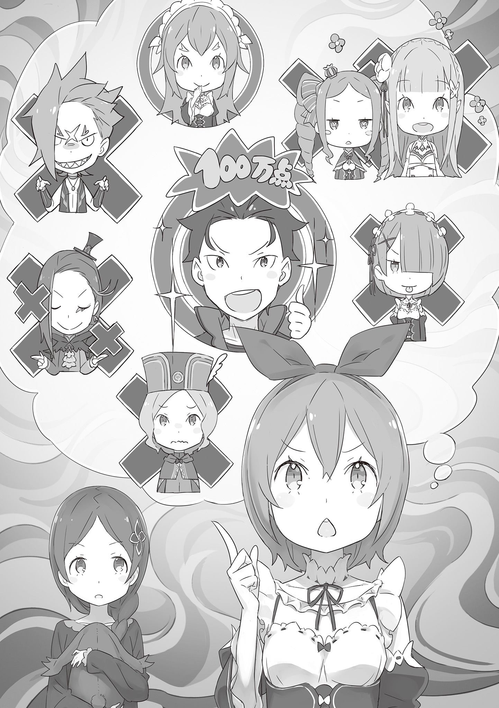
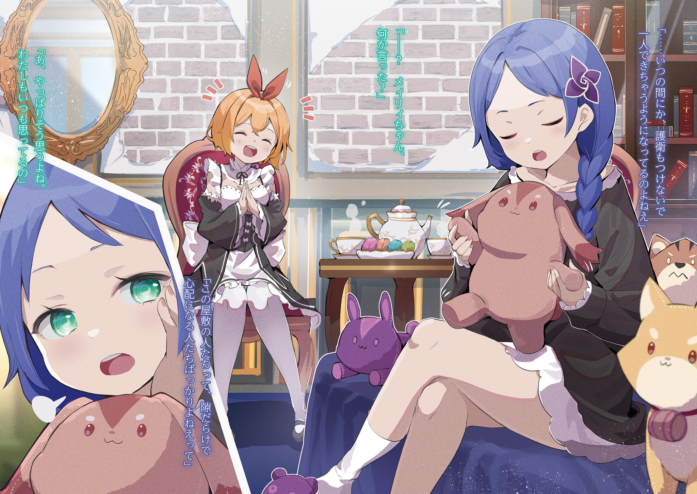
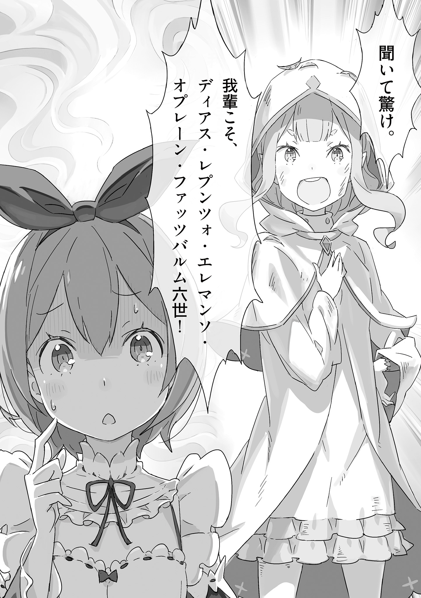
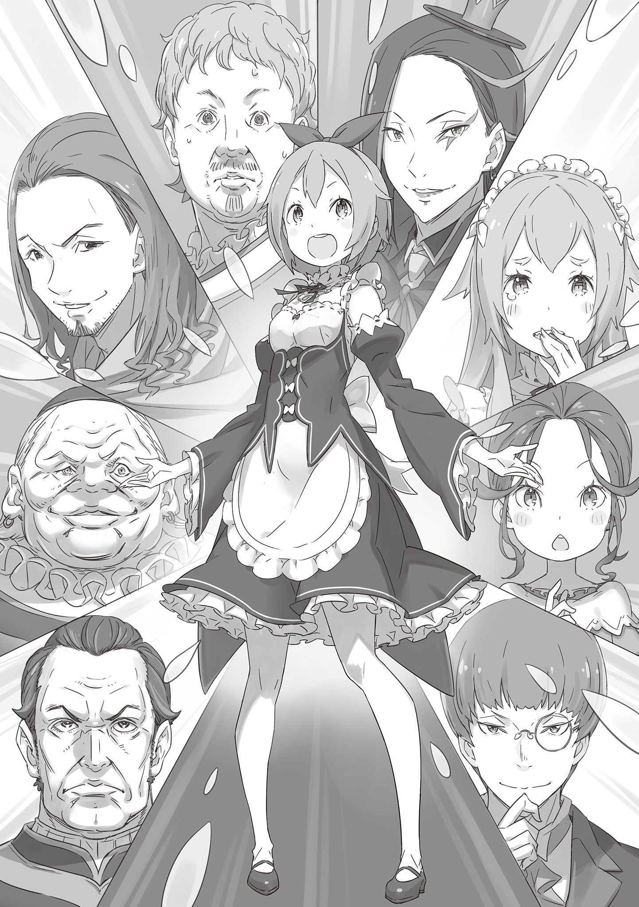
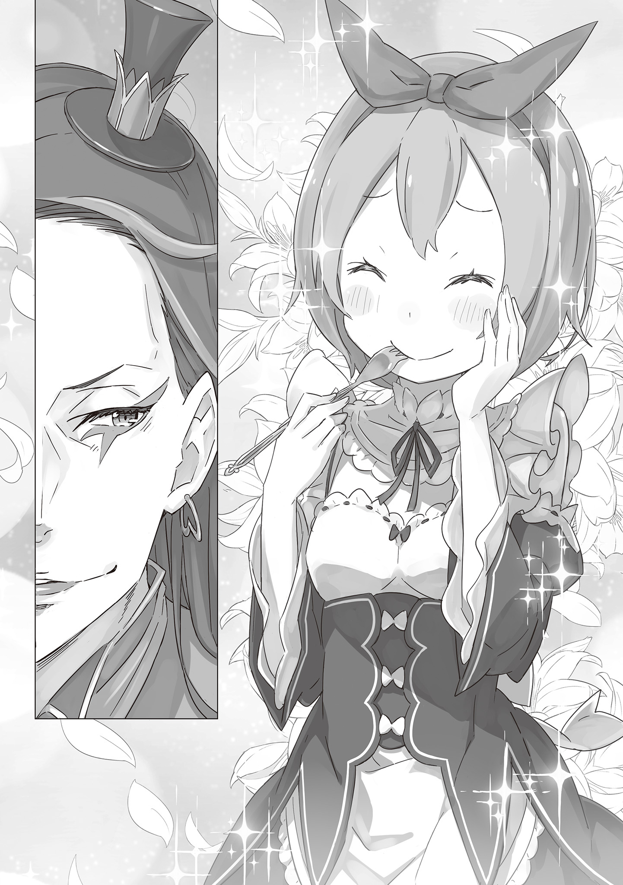

— Ну вот! Думают, раз я не злюсь, то можно делать всё, что вздумается!

Недовольно надув губки, девочка — Петра Лейт — с покрасневшим миловидным личиком выплёскивала своё возмущение.

Светло-каштановые волосы с рыжеватым отливом, большие круглые глаза, ещё по-детски незрелое, но уже с пробивающимися робкими ростками женственности тельце — все эти черты сливались в одном слове: «очаровательная».

Её тело, вот-вот готовое расцвести из детской поры, было облачено в привычное платье горничной, которое заставляло любого, кто её видел, предвкушать её будущую красоту и редкое обаяние.

Проще говоря, она была красавицей с многообещающим будущим.

Однако сейчас эта самая многообещающая красавица Петра, крепко сжав белые кулачки, со всей серьёзностью горячо что-то доказывала.

А содержание её речи было таковым:

— Сестрица Эмилия такая рассеянная, сестрица Рам вечно пытается отлынивать от работы, Отто-сан совсем не отдыхает, хоть я ему и говорю, Гарф-сан закапывает в саду обгрызенные ножи, Субару ни капельки не замечает моих чувств, Беатрис-тян постоянно с Субару, это нечестно, господин Розвааль и не думает каяться в содеянном, а Отто-сан совсем не спит!

Петра, работающая в особняке Розвааля, перечисляла поимённо всех своих близких и их недостатки. Загибая пальцы, она представляла дорогих её сердцу, но таких непутёвых людей одного за другим.

Выпалив на одном дыхании своё недовольство, Петра облегчённо погладила себя по груди.

— Ну вот… одна только сестрица Фредерика всё делает как надо, просто беда с ними.

Закончила она свою тираду длинным-длинным вздохом, который в конце обернулся восхищением в адрес уважаемой ею женщины.

Эту речь, которую сложно было назвать то ли жалобой, то ли признанием в любви, Петра, конечно же, не собиралась произносить вслух при ком-либо из упомянутых. Ей было бы стыдно, да и не хотелось, чтобы её считали вредной девочкой.

Впрочем, это не было и монологом, ведь слушатель у Петры всё же был.

— И чего ты ждёшь, Петра-тян, вываливая всё это на меня~я~я? — лениво склонив голову набок, спросила синеволосая девочка её лет.

Длинные волосы незнакомки были заплетены в косу, а сама она была одета лишь в тонкую чёрную ночную рубашку. Чертами лица она ничуть не уступала Петре, но в её жестах сквозило не свойственное её возрасту очарование.

Прикрыв рот рукой, она зевнула:

— Прости, но я ничем не могу тебе помочь, зна~а~аешь ли.

— И не надо! Я просто хотела, чтобы ты выслушала, — не унималась Петра, подавшись вперёд и продолжая, — К тому же…

— Мейли-тян, тебе ведь тоже скучно тут совсем одной, да? Вот я и составлю тебе компанию.

— …Знаешь, Петра-тян, а ты не так уж и проста~а~а.

На такое заявление, сделанное с сияющей улыбкой, девочка — Мейли — сперва опешила, но затем, со вздохом пожав плечами, позволила своим губам расслабиться в улыбке.

Петра Лейт — тринадцатилетняя девочка, самая юная во всём лагере.

Она была ещё совсем ребёнком, и все в лагере очень-очень о ней заботились. Петра и сама это прекрасно понимала и считала себя счастливицей.

Однако, принимая этот счастливый факт, Петра не позволяла себе утопать в этой заботе.

Петра помнила то время, когда была ужасно высокомерной и несносной, пребывая в постыдном заблуждении. Раскаявшись в этом, она твёрдо для себя решила:

«Я буду делать всё, что в моих руках, как следует и изо всех сил. А просить о помощи я стану лишь тогда, когда почувствую, что сама постаралась на славу».

Для Петры, принявшей такое решение, обитатели этого особняка были весьма грозными противниками.

Ведь они при каждом удобном случае пытались всячески её баловать, и все как один твердили одно и то же: что они старше, они взрослые.

— «Это нечестно», — думала Петра.

Как бы она ни хотела, обогнать их в возрасте она никак не могла, поэтому такой приём она считала вдвойне нечестным.

Вообще, раз уж они используют такое непобедимое оружие, как возраст, то пусть и ведут себя как подобает старшим.

Эмилия и Беатрис, хоть и говорят, что старше, на самом деле очень милые. Отто умён, а Гарфиэль силён, но ведь и Розвааль умён и силён, а на деле — просто безнадёжно пропащий человек. А значит, и Отто с Гарфиэлем тоже никуда не годятся.

А вот Субару в этом плане не слишком силён и не слишком умён, зато он добрый, так что ему миллион баллов.

Единственное, что беспокоит — он вечно пытается взвалить всю боль на себя. Ей хочется быть ближе и поддерживать его, даже если отбросить влюблённость. Хотя она никогда и не думала о нём, отбросив её, так что на самом деле забыть о ней она, пожалуй, и не сможет.

Если ко всей этой компании добавить Рам, которая, хоть и способна на всё, ленива и обладает, наверное, худшим в мире вкусом на мужчин, то на этом оценка лагеря Эмилии от Петры будет завершена.

Как нетрудно догадаться, все они нуждаются в помощи Петры. Да, такова уж Петра: её оценки настолько суровы, что самопровозглашённые старшие и взрослые задрожали бы, услышь они их.

— …Да, все, кроме сестрицы Фредерики.

— А не слишком ли ты к ней пристра~а~астна?

Мейли сидела на кровати, теребя плюшевую игрушку у себя на коленях. В ответ на её удивлённое замечание Петра надула щёчки: «Вовсе нет».

Неужели она не понимает, насколько все в лагере Эмилии непутёвые и как великолепна Фредерика, которая так ловко их всех поддерживает?

— Мейли-тян, хочешь попасть в мой список непутёвых?

— Даже страшно представить, что будет, если я туда попаду~у~у, — прижав игрушку к груди, пробормотала Мейли, на что Петра лишь озорно показала ей язык.

Сейчас они разговаривали в тайной комнате-тюрьме в подвале особняка Розвааля — впрочем, это было лишь громкое название для обычного подвального помещения.

Формально комната могла служить тюрьмой, ведь дверь запиралась только снаружи, но кому придёт в голову называть тюрьмой помещение, обставленное как гостевая комната — с кроватью, письменным столом и даже шкафом?

Но что окончательно лишало это место сходства с тюрьмой, так это многочисленные «дары доброй воли» от посетителей, лежавшие у Мейли на коленях и расставленные на полках в глубине комнаты.

Это была комната Мейли Портрут — наёмной убийцы, подосланной в особняк Розвааля с целью лишить жизни Петру, Субару и остальных. Но, потерпев неудачу, она была схвачена и теперь находилась здесь под стражей.

Разумеется, вопрос о том, как поступить с Мейли после её поимки, вызвал в лагере большие разногласия.

Мейли и без того была в непростом положении, но вдобавок ко всему она была чрезвычайно опасна, ведь обладала Божественной Защитой, позволяющей управлять зверодемонами по своему желанию. Поскольку полностью лишить её способности к сопротивлению было трудно, её вполне могли казнить.

Этого не случилось, и она осталась в особняке лишь благодаря желанию лагеря выяснить, кто за ней стоит, и отчаянным попыткам Субару её защитить — причём последнее сыграло решающую роль.

К этому стоит добавить, что и сама Мейли без тени раскаяния предпочла плен, заметив: «Я ведь провалила зада~а~ание. Если вот так вернусь, меня наверняка убью~ю~ют».

Как бы то ни было, по этой причине Мейли и находилась в положении пленницы, заточённой в комнате-тюрьме. Разумеется, всем причастным было строжайше велено не терять бдительности, однако…

— …Я и сама не заметила, как ты стала приходить одна, без сопровожде~е~ения.

— …? Мейли-тян, ты что-то сказала?

— Я лишь сказала, что в этом особняке все таки~и~ие беспечные, что за них даже тревожно стано~о~овится.

— А, ты тоже так думаешь? Я тоже постоянно об этом думаю, — хихикнув, согласилась Петра со вздохнувшей Мейли.

Бдительность по отношению к Мейли — казалось, это уже превратилось в пустую формальность. Особенно Субару и Эмилия — за последний год они совершенно растаяли от кротости не сопротивлявшейся Мейли.

Доказательством тому служили подарки, расставленные по комнате-тюрьме: самодельные плюшевые игрушки от Субару, постельные принадлежности, которые Эмилия выбирала вместе с Беатрис. — Пожалуй, единственными, кто по-настоящему сохранял к ней настороженность, были лишь Отто и Розвааль.

Разумеется, сама Петра не была исключением.

— Петра-тян ведь така~а~ая ответственная.

— Угу, так и есть. У меня очень хорошая память, — пригубив чай из принесённой чашки, Петра улыбнулась словам Мейли.

Да, у неё хорошая память. Она всё схватывает на лету, она сообразительна и в большинстве дел быстро делает успехи, а ещё у неё милое личико. Всё то, чем одарили её родители, и позволяло Петре находиться здесь.

— Не переживай, Петра не забыла, что однажды Мейли устроила переполох со зверодемонами в её родном Аламе. И последующий разгром в особняке — тоже.

Она никогда бы не позволила себе забыть, что Мейли — опасная девочка, и опасно общаться с ней как ни в чём не бывало.

— …И всё же, почему ты та~а~ак часто сюда приходишь?

— Я подумала, что если ты ко мне привяжешься, то передумаешь, что бы ты там ни замышляла. Поэтому я и составляю тебе компанию. Можешь полюбить меня, я разрешаю.

— …

Увидев, как Мейли опешила от этих слов, Петра почувствовала приятное удовлетворение.

Это была её месть за прошлое — ставить на место Мейли, которая всегда пыталась держаться с ней по-взрослому, свысока. Сможет ли она когда-нибудь простить её, если будет и дальше копить в себе это сладкое чувство?

Впрочем, будущего не знала даже сама Петра.

— …И хоть ты така~а~ая добрая, Петра-тян, того маркграфа со странным макияжем ты всё равно простить не можешь, в~е~ерно?

— С господином совсем другая история. Он и не думает каяться, так что я его не прощу, — надув щёчки, Петра выплеснула своё недовольство на маркграфа, который продолжал делать вид, будто ничего не произошло.

Розвааль, строивший козни в «Святилище» и особняке, был отчитан Эмилией за свои злодеяния и глубоко раскаялся.

По крайней мере, так должно было быть, но Петра в этом сильно сомневалась. Его возмутительное поведение никуда не делось, и Петра страдала от него чуть ли не каждый день.

— Сестрица Эмилия говорит, что господин просто хочет внимания…

Хотя Эмилия и выразилась мягче, её оценка Розвааля была близка к этому, и забавно было наблюдать, как тот, лишившись своей обычной дерзости, не мог ничего ей возразить. А ещё на душе становилось легче, когда Рам наступала на него со всей решимостью, а он, растерявшись, пытался от неё убежать.

— Но сестрица Эмилия, как говорит Субару, — это настоящее чудо…

Хоть это и немного отличалось от того, что хотела сказать Петра, с выражением Субару она была согласна.

Вот уже год, как Петра стала горничной в особняке и продолжала помогать Эмилии в её подготовке к королевскому отбору. За это время она хорошо изучила её прямой, бесхитростный, безгранично добрый и беззащитный характер. Петра никак не могла понять, как можно быть такой, будучи такой красивой и взрослой.

Но, вероятно, именно потому, что у Эмилии был такой незамутнённый взгляд, она смогла разглядеть искривлённую натуру Розвааля и победить его в споре. Она действительно была достойна восхищения.

Конечно, восхищение — это одно, а соперничество — совсем другое, и девичье сердце Петры пылало вовсю.

— Но ведь скоро тебе предстоит поездка с этим твоим нелюбимым господи~и~ином? А братик и сестричка едут отдельно, та~а~ак ведь?

— …Да, ты права, и всё так… так не вовремя.

— Ой-ой, Петра-тя~я~ян, что это за лицо? Совсе~е~ем не мило, — заливисто рассмеялась Мейли, увидев, каким мрачным стало лицо и голос Петры.

Событие с «неудачным временем», о котором говорила Петра, официально называлось «Совещание в землях Западного маркграфа».

Розвааль, которому было поручено управлять западными дворянами королевства, был, бесспорно, великим аристократом с обширными землями и множеством подданных. И вот, в ходе королевского отбора, решающего судьбу следующего монарха, он пообещал свою полную поддержку кандидатке Эмилии.

Естественно, было бы логично ожидать поддержки Эмилии и от западных дворян и влиятельных лиц, находящихся под его началом. Однако не всё было так просто.

— …Хотя сестрица Эмилия такая добрая…

Люди не спешили сближаться с Эмилией, полуэльфийкой с серебряными волосами и аметистовыми глазами.

Чтобы побороть это предубеждение, ставшее для неё горькой нормой, Розвааль последний год без устали убеждал влиятельных людей. И это совещание должно было стать финальным штрихом в его усилиях.

Другими словами, это была невероятно важная встреча, от которой зависело будущее всего лагеря Эмилии. И на эту встречу в качестве сопровождающей вызвалась сама Петра.

Она считала, что всему нужно учиться, и это был её порыв — не упустить возможность и узнать что-то новое как полноправный член лагеря. Однако…

— И надо же было этому совпасть с поездкой Субару и остальных…

— Это ведь не совсем поездка, не та~а~ак ли? Да и не думаю, что между братиком и сестричкой что-то случится, лишь потому что они съездили куда~а~а-то вместе.

— Я вовсе не об этом беспокоюсь! Я тоже хотела посмотреть водный город!

Подозрения Мейли были настолько беспочвенны, что Петра о них даже не думала, а потому лишь сокрушалась из-за собственного невезения.

Водный город Пристелла — так назывался город, в который отправились Субару, Эмилия, Беатрис и ещё двое.

Это был один из пяти великих городов Лугуники, известный как Город Водных Врат, и отправились они туда по приглашению другого кандидата на королевский престол.

— Но-но… вряд ли они просто сделают свои дела и сразу вернутся. Наверняка они увидят кучу красивых мест…

— А ты могла бы прогуляться по этим местам вместе с бра~а~атиком, да?

— Вот именно… Не напоминай о том, о чём я жалею! Какая же ты вредина, Мейли-тян!

— Естественно. Я ведь наё~ё~ёмная убийца.

Хихикая, Мейли указала на себя, гордо именуя себя столь опасным словом. Петра сперва округлила глаза от удивления, глядя на неё, а затем лишь пожала плечами со вздохом.

— Ой-ой? И что это сейчас зна~а~ачило?

— В этом ты очень похожа на господина, Мейли-тян.

— …

Девочка моргнула, когда Петра решительно ткнула пальцем в её сторону.

Притворяться плохой, называть себя опасной… она наверняка делала это, потому что хотела оттолкнуть Петру. А то, что её методы были такими неумелыми, наверняка означало, что и желание это было не слишком сильным.

В каком-то смысле, она тоже просто хотела внимания, прямо как Розвааль.

— Но господин делает это, зная, что получит внимание, так что он гораздо хуже. Прости, что сравнила тебя с ним.

— Думаю, господин, который доводит тебя до таки~и~их слов, ещё~ё~ё хуже.

Разумеется, ведь такого злодея, как он, ещё поискать. Петра была уверена, что никогда в жизни его не простит, а потому и Розваалю до конца своих дней не забыть того, что он натворил.

Хотя было ужасно досадно от мысли, что и это было частью его замысла.

— Ах, уже так поздно. Мне пора готовиться к отъезду.

Взглянув на установленный в комнате магический кристалл времени, Петра в панике вскочила на ноги, поняв, что засиделась.

— Раз ты уезжаешь, Петра-тян, то в особняке остаётся твоя люби~и~имая сестрица?

— Нет, тут остаётся только сестрица Рам. Мейли-тян, ты продержишься недельку без еды?

— Обязательно скажи той сестрице, с розовыми волосами, чтобы она про меня не забы~ы~ыла…

— Хи-хи, да шучу я… Наверное.

Уж кто-кто, а Рам точно не могла забыть о Мейли. Тем не менее, Петра немного забеспокоилась и решила, что обязательно передаст ей просьбу и даже оставит записку.

Затем, убрав за собой чайный сервиз, Петра обернулась к Мейли.

И, осторожно сунув руку за пазуху…

— Мейли-тян, можешь кое-что для меня сделать?

— …? Что~о~о это? Платок?

— Да, платок. Я хочу, чтобы ты повязала его мне на правую руку.

Она мягко улыбнулась недоумённо склонившей голову Мейли, которая взяла протянутый ей белый платок.

— Это ритуал на удачу в пути. Хоть он и отличался от истинного смысла подобных ритуалов, но, отправляясь на такое важное дело, можно ведь и довериться суевериям.

— …Петра-тян, ты и вправду та~а~а ещё штучка.

Видя решимость Петры, Мейли обессиленно прикрыла один глаз и туго обернула платок вокруг её тонкого запястья.

А затем…

— Счастли~и~ивого пути. Смотри, будь осторо~о~ожна.

— И ты, Мейли-тян, не ешь слишком много картошки, а то растолстеешь.

Петра и Мейли, две девочки, обменялись улыбками и словами недолгого прощания.

Это был странный и неестественный, но всё же по-настоящему дружеский разговор.

— «Уж в чём-чём, а в отваге ей не откажешь», — так Петра Лейт с гордостью думала о себе.

Иначе она не смогла бы вот так, всем своим существом, ринуться в новую жизнь и, проявляя ещё большую смелость, догнать тех, кто шёл впереди. Поэтому Петра, в своём маленьком теле, отчаянно, изо всех сил, продолжала бежать вперёд.

Возможно, услышь кто-то её историю, то посмеялся бы — мол, из-за чего так надрывается какая-то девчонка из захолустья? Но он и они — не смеялись. В этом и заключалась вся причина её упорства.

А потому ей всё было нипочём.

— А это, я так полагаю, та самая юная горничная? Причина пожара в особняке Маркграфа, о котором столько слухов ходило.

Слова были брошены как бы невзначай, лёгким уколом, чтобы проверить реакцию.

Говоривший не собирался нападать на Петру лично, да и кем он был, чтобы обращать внимание на простую горничную, девочку, не имевшую никакого влияния? Петра и сама это прекрасно понимала, а потому обижаться было не на что.

И всё же…

Когда высокий мужчина, взмахнув плащом, встал перед произнёсшим эти слова бородачом и заявил:

— К несчастью, виконт Арруз, причиной того пожара была моя оплошность.

Эти слова, сказанные так, словно он защищал Петру, были для неё куда более унизительными.

— Не утруждай господина Розвааля. И ещё, все они гораздо большие интриганы, чем ты можешь себе представить. Не показывай им свою слабость и всегда держи глаза открытыми.

Такой совет дала Рам Петре перед её отъездом на Совещание земель Западного маркграфа.

Из-за необходимости ухаживать за продолжающей спать Рем и за пленницей Мейли в комнате-тюрьме, Рам не поехала на совещание, оставшись в особняке в качестве смотрительницы.

Честно говоря, даже если бы Рам и поехала, большой помощи в работе горничной от неё бы не было, однако чувство уверенности, которое дарило её властное присутствие, было незаменимо.

Возможно, её внутренние переживания отразились на лице, а может, Рам просто была очень проницательна, но перед самым отъездом она мягко коснулась плеча Петры и дала ей этот совет.

— Всегда держи глаза открытыми…

Петра мысленно повторила сказанное и запечатлела эти слова в своём сердце. Хоть в них и не было ничего особенного, они почему-то глубоко запали ей в душу.

Всегда держать глаза открытыми, а голову высоко поднятой.

— «Это очень правильно», — думала она.

— Петра, ты нервничаешь? — заглянула ей в лицо Фредерика, сидевшая рядом в драконьей повозке.

Её длинные золотистые волосы сияли, а изумрудные глаза были прищурены. Глядя на эту идеальную женщину, Петра улыбнулась: «Нет».

Сейчас они ехали в драконьей повозке в особняк виконта Триона Арруза, где должно было состояться совещание. И хотя Петра вызвалась сама, это был первый раз, когда она сопровождала их на таком официальном мероприятии, поэтому Фредерика то и дело о ней беспокоилась.

Такая забота со стороны старшей горничной была очень приятна, и Петра не могла не гордиться своей сестрицей.

— Просто задумалась немного о том, что сказала мне сестрица Рам перед отъездом.

— Что ж, тогда хорошо. Если ты будешь нервничать уже сейчас, то на самом совещании совсем задеревенеешь… Хотя, признаться, меня беспокоит, что именно сказала тебе Рам.

— Ничего такого, о чём сестрице стоило бы волноваться. Наоборот, даже кое-что хорошее.

— Хм… В таком случае я чу-у-уточку ревную, — Фредерика слегка надула губки и нежно погладила Петру по голове.

От этого прикосновения у Петры засияли глаза, и она, испытав приятно-щекотное чувство, доверчиво прижалась к Фредерике. Было почему-то радостно, что её сестрица вот так по-детски обижается на её ничего не значащие слова.

Ей не о чем было беспокоиться. Путеводной звездой уважения и обожания для Петры всегда была Фредерика. Конечно, отсутствие Рам вызывало лёгкое беспокойство, но присутствие её любимой сестрицы было куда более добрым знаком.

Ведь как-никак…

— Ну~у и ну~у, когда меня так откровенно игнорируют, это ранит даже меня~я~я. Хотим мы того или нет, нам предстоит путешествовать втроём несколько дне~е~ей. Будьте ко мне добры~ы~ы.

…им приходилось ехать вместе с Розваалем, который отпускал подобные реплики с неприятной ухмылкой и самым бесстыжим видом. От этого сердце Петры постоянно изнывало от голода и жажды по доброте и нежности.

Одна только мысль о том, что вместо Фредерики в этой поездке могла оказаться Рам, заставляла её содрогнуться.

Как бы то ни было, в ответ на легкомысленную болтовню Розвааля Петра снова напустила на себя строгий вид.

— Господин, прекратите эти дурацкие шутки и лучше как следует готовьтесь к совещанию!

— Ох, как хо~о~олодно, а ведь ты сама попросилась поехать с на~а~ами, поэтому я уж было понадеялся, что это шанс для нас сбли~и~изиться.

— Господин, прекратите, пожалуйста, говорить то, чего и в мыслях не держите. Честное слово, — Фредерика решительно поддержала Петру.

Оказавшись под их перекрёстным огнём, Розвааль, словно сдаваясь, поднял обе руки и глубоко откинулся на сиденье. Но по тому, как его накрашенные губы так и остались растянуты в ухмылке, было ясно, что его это нисколько не задело.

— Бе-е, — Петра показала ему язык, не скрывая своего отношения. Фредерика на это ничего не смогла сказать и лишь беспомощно, слабо улыбнулась.

Она вовсе не хотела расстраивать Фредерику, да и к работе своей относилась со всей серьёзностью. Однако, несмотря на весь её энтузиазм, её терзало одно большое беспокойство.

А именно…

— …Господин, вы и правда сможете убедить всех остальных встать на сторону сестрицы Эмилии?

Её терзала тревога, что всё совещание может провалиться по вине Розвааля.

Совещание земель Западного маркграфа — как и следовало из названия, это было собрание вполне определённых людей.

Изначально маркграф — это титул, жалуемый тем, чьи владения расположены на границе с другим государством, то есть тем, на кого возложена важнейшая роль по защите страны.

Земли, которыми владел Розвааль, как раз и относились к «Землям Западного маркграфа», а участниками этого совещания были влиятельные лица, содействовавшие ему в управлении этими землями.

Их положение было самым разным: здесь были и титулованные аристократы, и главы городов, расположенных на его землях, и владельцы обширных угодий, и даже руководители торгово-промышленных гильдий.

И именно Розваалю, и никому другому, предстояло собрать под одной крышей всех этих людей, не уступавших друг другу ни в статусе, ни в сопутствующей этому скандальности, и привести совещание к успеху.

— …

Когда драконья повозка прибыла к месту проведения совещания, и их провели в просторный зал роскошного особняка, взгляды всех уже собравшихся участников разом обратились на группу Розвааля.

Это были сложные, запутанные взгляды, и Петра не могла разобрать, были они добрыми или злыми. Она поняла лишь одно: все присутствующие с каким-то умыслом оценивали друг друга, и никто из них не обращал ни малейшего внимания на девочку-горничную, стоявшую рядом с Розваалем.

— Как погляжу, все в сборе. Какая похвальная я~я~явка, — произнёс Розвааль, окинув взглядом зал с его пышным убранством и собравшимися лицами.

— Это вы, маркграф Мейзерс, прибыли на удивление рано, — мягко ответил ему мужчина в аристократическом наряде с пышными усами.

Розвааль улыбнулся мужчине, который, слегка поклонившись, подошёл к нему.

— Виконт Арруз, благодарю вас за то, что любезно предоставили свой особняк для нашего совеща~а~ания.

— Что вы, это для меня большая честь. Для нас это редкая возможность услышать ваше мнение, маркграф. Ради такого дела, можете пользоваться моим домом, сколько будет угодно.

«Какой лицемерный обмен любезностями», — мысленно скривилась Петра, наблюдая за тем, как аристократы прощупывают друг друга.

В зале находилось ещё несколько участников совещания. Официально оно должно было начаться только вечером, но многие собрались за несколько часов до вечера, вероятно, для того, чтобы заранее договориться о позициях и согласовать свои действия. Именно поэтому Розвааль и распорядился, чтобы драконья повозка прибыла раньше назначенного срока.

И в тот момент, когда Петра размышляла, радоваться ей или возмущаться тому, что его скверный характер проявляется не только в стенах особняка, но и за его пределами, и склонялась всё же к возмущению…

Вероятно, это была расплата за то, что она наблюдала за всем со стороны, словно за представлением в далёкой опере.

— Горничная, что сопровождает вас сегодня, не та, которую мы привыкли видеть.

— Ах, Рам я оставил присматривать за особняко~о~ом. К тому же, я хотел представить вам и новое лицо нашего до~о~ома.

— Понимаю, что ж, в таком случае…

Человек, которого назвали виконтом Аррузом, мельком взглянул на Петру. В ответ на его взгляд она уже было хотела прихватить пальцами краешек юбки, чтобы сделать реверанс, но…

— А это, я так полагаю, та самая юная горничная? Причина пожара в особняке маркграфа, о котором столько слухов ходило.

— …

От этих неожиданных слов Петра, уже готовая ступить на сцену оперного театра, споткнулась. На мгновение у неё перехватило горло, и единственное, за что она могла себя похвалить, — так это за то, что волнение не отразилось на её лице.

Но на этом поводы для самопохвалы закончились. Дальнейшее было предсказуемо.

— К несчастью, виконт Арруз, причиной того пожара была моя оплошность.

Именно после этих слов Петра и испытала величайшее унижение в своей жизни.

— Как же я жалко выглядела…

В глубоком раскаянии Петра схватилась за голову и, тяжело вздохнув, опустила плечи.

С тех пор как Петра, попав под шальную стрелу в битве интриг аристократов, испытала унижение, прошло немного времени. В ожидании начала совещания Розвааль отдыхал в своей гостевой комнате. Петре и Фредерике, которым также выделили отдельные комнаты, было велено отдыхать до начала мероприятия, однако…

— С таким настроением я просто не могу сидеть на месте…

Если она остановится, то от всех этих тягостных мыслей в голове начнётся полная каша.

Поэтому, прекрасно понимая, что это невежливо, Петра выскользнула из комнаты и стала бродить по особняку виконта Арруза в поисках способа забыть о своём унижении.

Хотя, по правде говоря, со стороны никто бы не нашёл в поведении Петры ни единого изъяна. Более того, виконт Арруз позже лично извинился перед ней за ту «шальную стрелу», что в неё попала.

В конце концов, проблема была в той планке, которую Петра сама для себе установила.

Петра оценивала своих близких настолько сурово, что другие бы пришли в ужас, услышь они её слова. И для себя она не делала исключений. Её самооценка, за исключением, пожалуй, собственной внешности, была чрезвычайно строгой.

— И виной всему были и Субару с остальными, которые так старались, и этот господин со своим скверным характером… А?

Петра, которая, тихо постанывая, пыталась примириться со своими тягостными мыслями, заметила какую-то суету среди слуг особняка и недоумённо склонила голову. Она подошла узнать, не случилось ли чего.

— Простите, — обратилась она к одной из них.

— Понимаете, повар, которого мы пригласили для банкета после совещания, куда-то пропал. Нас предупреждали, что у него непростой характер, но если так пойдёт и дальше, мы не успеем приготовить ужин.

Излишне болтливая служанка выглядела совершенно растерянной, и Петра предложила ей свою помощь в поисках повара. Хотя она понимала, что в чужом особняке от неё будет мало толку — разве что сообщить, если она его найдёт.

— «Какая же я ужасная… Разве можно чувствовать облегчение, увидев, что у других проблемы?»

Так Петра объяснила себе то, что чужая беда отвлекла её от собственных тягостных мыслей. Такое с ней бывало редко, но сейчас любое событие вело её по пути к ненависти к себе.

— «Нужно хотя бы по-настоящему помочь в поисках повара, чтобы перебить это гадкое чувство».

— Если бы я попросила сестрицу Фредерику, она, может, нашла бы его по запаху, но…

Фредерика, в чьих жилах течёт кровь зверолюдей, наверняка отлично ищет пропавших. Петра и сама часто просила Гарфиэля помочь найти что-нибудь потерянное, а потом тайком давала ему в благодарность сырое мясо.

Однако относиться к Фредерике так же, как к Гарфиэлю, она не решалась.

— Эй, девица, ты, девица, слышишь меня?

Этот голос окликнул её, когда она, погружённая в свои думы, проходила мимо внутреннего двора особняка. Петра обернулась на зов и увидела тонкую белую руку, торчавшую из живой изгороди.

Она невольно округлила глаза, а рука снова подала голос:

— Девица! Ты как раз вовремя. Изволь помочь, я тут случайно закопалась!

— Закопались? Как это… а, впрочем, неважно. Так, эм-м, э-эй!

Хоть и в замешательстве, Петра схватила белую руку и изо всех сил потянула на себя эту высокомерную особу. Силы у миниатюрной Петры было немного, но, к счастью, её ноша оказалась лёгкой. Вскоре она почувствовала, как тело освобождается из земли, и из изгороди показалась не только рука, но и её владелица.

Это была девочка, с головы до ног укутанная в белый капюшон. Одета она была в лёгкую, удобную для передвижения одежду, а на вид ей было примерно столько же лет, сколько и Петре. И эта самая девочка каким-то образом умудрилась застрять в живой изгороди аристократического особняка.

— А, подозри… мпф-мпф!

— Стой, стой, стой! Я понимаю твои чувства, но кричать не стоит, девица.

В тот самый миг, когда Петра уже собиралась позвать на помощь, незнакомка зажала ей рот. Удерживая вырывающуюся Петру, девочка строго спросила: «Не будешь кричать, верно?» — и Петра торопливо закивала.

— Я вовсе не подозрительная личность. Так, хорошо, я всё объясню. Я…

— Кья-а-а! Кто-нибудь… мпф-мпф!

— Ни на секунду нельзя терять бдительность! Ты мне нравишься, девица, но сейчас ты создаёшь проблемы!

Снова зажав рот Петре, которая попыталась её перехитрить, девочка издала несколько жалких стонов от непослушности горничной. Петра молча уставилась на неё и, тяжело вздохнув, опустила плечи.

— Что, смотришь так, будто хочешь попросить убрать руку, пообещав на этот раз не кричать? — с сарказмом произнесла девочка. — Да у тебя наглости хватает такое просить после того, что было?…

Вопреки своим словам, она всё же разжала ладонь.

— Пха-а! Но ведь ты отпустила. Так… чем ты тут занимаешься?

— Хм-м… что ж, скажем так, я пытаюсь выпутаться из ситуации, которая мне не по нраву.

У неё был милый и красивый голос, но говорила она на удивление высокопарно. Петра почему-то чувствовала, что эта девочка, выглядевшая её ровесницей, обладала странным, необъяснимым достоинством.

Но именно потому, что эта девочка была такой необычной…

— Нельзя убегать только потому, что тебе что-то не нравится. Если будешь всё время убегать, это войдёт в привычку.

— Хо-о? Читать мне нотации вздумала? Какая отвага. Но! Я всегда поворачивалась спиной к ситуациям, которые мне не по нраву, и делала, что вздумается. Так я поступлю и сейчас. Что в этом плохого?

— Если так себя вести, однажды важные для тебя люди отвернутся от тебя.

— Разве это не образ мыслей слабака, который вверяет свой путь другим?

Словно слова Петры задели её за живое, девочка придвинулась к ней вплотную, почти касаясь лбом её лба. Горничная увидела её золотистую чёлку и скрывавшиеся за ней синие глаза.

Слова девочки были сильными. Твёрдыми. Непоколебимыми.

Но…

— Дело не в силе или слабости! И не нужно так сложно рассуждать, от этого только хуже! Что странного в том, чтобы хотеть быть добрым к кому-то?!

— …

— Быть добрым очень трудно, ведь это невозможно, если ты сам этого не захочешь. Если привыкнешь убегать, у тебя больше не получится иного. Поэтому…

Произнося это, Петра поняла, что в её груди бушует целый вихрь эмоций.

Да, быть добрым трудно. Когда-то, когда она сама была для себя центром вселенной, Петра совсем не замечала таких простых вещей. Но один добрый человек научил её этому.

Петра живёт, окружённая добротой этих людей.

— Вот почему, когда Розвааль защитил меня, это, наверное…

— …!

Она чуть было не сказала что-то недостойное, чуть было не опустила голову, но всё же заставила себя поднять взгляд.

В её голове всплыли слова — всегда держать глаза открытыми.

— …Хм-м, какое досадно удачное стечение обстоятельств. У тебя такое лицо… так и хочется заставить его растаять.

Стоявшая напротив Петры девочка, скрестив руки на груди, с каким-то удовольствием пробормотала это. Улыбка, мелькнувшая на её едва видных губах, показалась Петре знакомой. Да, это была та самая злая усмешка, которую так часто показывал ей Розвааль.

— Ты мне понравилась, девица. В знак уважения к твоему смелому заявлению, я тоже отброшу своё ребячество. Раз уж ты здесь, то появишься на банкете, верно? Я дарую тебе райское наслаждение.

Аккуратно приподняв подбородок Петры пальцами, девочка заявила это с необычайно властной улыбкой и словами. На это заявление, произнесённое с такой странной аурой, Петра, не зная, как реагировать, пробормотала:

— В конце концов, кто ты такая?

— Слушай и трепещи! Я — Диас Лепунцо Элеманцо Оплен Фатцбальм Шестая! Гордись, девица! Заставить меня, особу капризную, отступить от своего решения — это нелёгкое дело. И свою награду за это ты получишь сегодня вечером!

Девочка, столь величественно представившаяся — некая Диас — с громким смехом покинула внутренний двор. А спустя мгновение её нашли слуги особняка, и Петра увидела, как её тут же подхватили и унесли.

Проводив её взглядом, Петра, всё ещё находясь в лёгком оцепенении, произнесла:

— Какое… странное имя…

Это было всё, что она могла сказать в столь необычной ситуации.

— …

Показалось, она даже услышала, как натянулся воздух, и Петра невольно выпрямила спину.

Просторную комнату для совещаний наполняло странное, ни с чем не сравнимое напряжение. В центре стоял круглый стол, рассчитанный более чем на десять человек, и все места за ним были заняты.

Каждый из более чем десяти участников привёл с собой сопровождающих, так что в помещении находилось около тридцати человек. И несмотря на это, в комнате царила тишина — верное доказательство того, что все мысленно готовились к предстоящему совещанию.

Наконец-то начинается Совещание земель Западного маркграфа.

Королевство Лугуника делится на четыре части — западную, восточную, северную и южную, — и управление западными землями было поручено всем известному Розваалю L. Мейзерсу.

На совещании, помимо самого Розвааля, собрались все влиятельные лица Западного Маркграфства.

Хозяин особняка, где проходило мероприятие, и обладатель второго по значимости после Розвааля титула — виконт Трион Арруз.

Глава одного из пяти великих городов Лугуники, «Промышленного города» Костула, — Лено Рекс.

Владелец нескольких обширных ферм, известный под прозвищем «Молочный Король», — Грифас Аллен.

И, наконец, глава западной торгово-промышленной гильдии, «Хитрец» Гвейн Мерете.

Помимо них, здесь собрались и другие весьма именитые гости — настоящее змеиное гнездо. Все как один — интриганы, с которыми так просто не сговоришься. И никто из них не был союзником Розвааля.

Если в этом зале и были его союзники, то это…

— Петра, рад нашей новой встрече. Вы в добром здравии, и это главное. Облегчение.

…лишь сказавший это Клинд, который первым подошёл к ней, как только она вошла в зал, да его госпожа, родственница Розвааля, — Аннерозе Милоад.

— Совещание вот-вот начнётся. Вернитесь к госпоже Аннерозе. И не смейте так запросто приближаться к Петре, — тут же вмешалась Фредерика.

— С чего бы это я должен выслушивать от вас подобные указания? Вы что, мать Петры или её супруга? Что-то я такого не припоминаю. Сомнение.

Однако перепалка между Клиндом и Фредерикой из-за Петры уже началась.

Похоже, Фредерика по какой-то причине не хотела подпускать Клинда к Петре и всегда говорила с ним таким колючим тоном. И всякий раз эта сцена наполняла Петру сладостным ощущением заботы Фредерики, заставляя её втайне благодарить Клинда и чувствовать себя победительницей в этой маленькой схватке.

Как бы то ни было…

— Сестрица Фредерика, господин Клинд, совещание сейчас начнётся…

Услышав примиряющие слова Петры, Фредерика и Клинд прекратили свою перепалку. Кивнув, дворецкий вернулся к своей госпоже, а Петра с Фредерикой заняли свои места позади Розвааля.

— Ну~у~у что ж, все в сборе. Начнём же, пожалуй, Совещание земель Западного маркгра~а~афа.

И вот так, со столь легкомысленного приветствия, и началось Совещание земель Западного маркграфа.

Обычно целью этого совещания было принятие множества важных решений, касающихся управления землями.

Петра до начала своей работы в особняке имела об этом лишь смутное представление, но Розвааль, носивший титул Западного маркграфа, был одной из самых влиятельных фигур во всём королевстве Лугуника.

Конечно, самым главным в королевстве был король, но Розвааль, которому этот самый король и поручил управление западом, был, можно сказать, самым главным человеком во всей западной части королевства.

Поэтому и на Совещании земель Западного маркграфа Розвааль должен был председательствовать и принимать важнейшие решения, влиявшие на жизнь всех жителей, включая саму Петру.

Таково было его положение и его роль.

Но не сегодня.

— Ещё раз, просим вас, маркграф Мейзерс, изложить нам ваши соображения касательно нынешнего королевского отбора.

Первым слово взял тот самый усатый господин, виконт Трион Арруз. Сидя за круглым столом прямо напротив Розвааля, именно он исполнял в этот день обязанности председателя. Его глаза и лицо были напряжены от чувства ответственности и долга, возложенных на него.

— …

С самого начала ощутив почти физически это обжигающее напряжение, Петра, игравшая роль украшения для стен, вся напряглась.

Она мельком взглянула на стоявшую рядом Фредерику — та была совершенно невозмутима. Непоколебимое чувство собственного достоинства придавало её осанке идеальную красоту. Петра невольно залюбовалась.

— Я бы просил вас обойтись без долгих объяснений о сути королевского отбора. Время дорого. Особенно для людей нашего положения.

— Как же ты любишь ходить вокруг да около, Трио-о-он-тян.

Но внутренние переживания Петры никого не волновали — напряжённая атмосфера в зале пришла в движение.

Слова виконта Арруза прервал эффектный мужчина с щетиной, подперев щёку рукой, — глава торгово-промышленной гильдии, Гвейн Мерете. Он провёл рукой по своим длинным каштановым волосам, собранным сзади.

— Дядечек ведь не это интересует, так ведь?

— Я уже неоднократно просил вас не называть меня «Трион-тян».

— Прости, прости, Трион-тян. …Так вот, в конечном итоге, внимание дядечек приковано не к самой этой ярмарке под названием «королевский отбор», а к кандидатке. Не так ли, Ро-о-озваль-тян?

Проигнорировав замечание виконта с глупой ухмылкой, франт обратил ту же улыбку к Розваалю. Его манера держаться выглядела несколько более дружелюбной по отношению к Розваалю, чем у остальных участников, но…

— Да, конечно, нас предупреждали. Мол, я нашёл кандидата для участия в королевском отборе, буду его поддерживать, так что и вы, ребята, помогайте. Только вот…

Петра с ужасом заметила, что, хотя Гвейн и улыбался, его глаза не смеялись совсем.

— Когда выясняется, что этот кандидат — полуэльф, это уже похоже на удар исподтишка, тебе так не кажется?

После слов Гвейна воздух в комнате для совещаний стал ещё тяжелее.

Вероятно, остальные участники, включая виконта Арруза, хоть и молчали, но разделяли мнение Гвейна. Аннерозе, которая была на их стороне, похоже, тоже предпочитала пока не вмешиваться.

В воздухе плотно повисли недоверие к Розваалю и неприятие «сереброволосой полудьяволицы».

— …

«Полуэльф»… Петру злило, что Эмилию вот так, одним словом, пытались загнать в рамки.

Она думала об этом и перед отъездом, во время разговора с Мейли. Ей было ужасно обидно, что добрую Эмилию так называют люди, которые её совсем не знают.

Но эта злость и обида родились лишь потому, что за последний год Петра смогла близко узнать Эмилию. Для большинства людей «полуэльф» и «Ведьма Зависти» были неразделимы. Если бы Петра не знала Эмилию, она бы думала так же, как и они.

А значит, стоит им только узнать Эмилию, и их мнение тут же изменится. Однако проклятие, что несло в себе слово «полуэльф», отнимало у Эмилии даже такую возможность.

Именно для того, чтобы дать Эмилии этот шанс, и было устроено сегодняшнее совещание.

И потому Петра с такой надеждой ждала первых слов Розвааля. Ждала, что этот несносный, ненавистный ей господин сможет переломить отчаянное положение Эмилии.

Знал он о её смятении и надеждах или нет, но Розвааль несколько раз кивнул и произнёс:

— Иными словами, господин Гвейн, будь она чистокровным эльфом, вы бы обеими руками проголосовали «за»?

— …

Розвааль, оказавшийся под перекрёстным огнём, наконец-то открыл рот после своего приветствия. И его первая же реплика, оказавшаяся откровенным вздором, застала врасплох и Гвейна, и остальных участников, и даже саму Петру.

Воспользовавшись возникшей паузой, Розвааль сложил руки на столе.

— Шутки в сторону… Я приношу свои извинения, если то, что я говорил вам до официального объявления королевского отбора, ввело вас в заблуждение. Но всё~ё~ё же, я бы хотел, чтобы вы не ошибались на мой счёт.

— Ох, и в чём же мы ошибаемся?

— Я не в том положении, чтобы просить вас о чём-то. Я в том положении, чтобы вам приказывать.

Розвааль понизил голос, и воздух в зале снова наполнился напряжением.

В этой звенящей тишине он прикрыл один глаз и обвёл присутствующих своим жёлтым оком.

— Ваше положение отличается от положения каких-то там третьесортных аристократов для массовки. Вы — незаменимые люди, необходимые для того, чтобы госпожа Эмилия, которую я поддерживаю, победила в королевском отборе. Ради этого наш дом Мейзерсов долгое, долгое время трудился, чтобы придать землям Западного маркграфа их нынешний вид.

— Ха-ха-ха! Судя по вашим словам, вы будто готовились к королевскому отбору на протяжении нескольких поколений.

Слова Розвааля прервал «Молочный Король» Грифас, поглаживая своё внушительное брюхо. В ответ на реплику тучного мужчины, уже вступавшего в преклонный возраст, Розвааль лишь пожал плечами.

— Я лишь пытаюсь донести, насколько это судьбоносное собы~ы~ытие. Изначально земли Западного маркграфа были местом ссылки для всяких чудаков. Вы в корне отличаетесь от тех князей, что тут же переметнулись, едва стало известно о происхождении госпожи Эмилии, не так ли?

— И чтобы держать в узде таких, как мы, вы решили прибегнуть к силовым методам?

— Раньше я бы, не колеблясь, сокрушил любое сопротивление силой… Увы, сейчас я так сказать уже не могу~у~у.

В зале, где нарастало и бурлило негативное напряжение, атмосфера вокруг Розвааля внезапно изменилась. От столь резкой перемены участники совещания недоумённо заморгали.

В ответ на их реакцию Розвааль медленно покачал головой.

— Раньше, ради скорости и надёжности, я бы без колебаний прибегнул к силовым методам. Но, к несчастью, сейчас мне совесть не позволяет использовать этот подхо~о~од.

Сказав это, Розвааль мельком взглянул за спину, на Фредерику и Петру, — нет, лишь на Петру. Встретившись взглядом с его разноцветными глазами, Петра затаила дыхание.

В этот миг в её голове пронеслись слова Рам: «Держи глаза открытыми».

И только сейчас до неё дошло, что это означало ещё и «смотри внимательно».

— Впрочем, если я сейчас начну распинаться, расхваливая личные качества госпожи Эмилии, это вряд ли прозвучит убедительно, не так ли? Поэ~э~этому, давайте-ка произведём замену игрока.

Сказав это, Розвааль с улыбкой щёлкнул пальцами.

— Петра-кун, прошу вперёд.

— Хьяй?!

От неожиданного обращения Петра подскочила на месте и взвизгнула.

Она посмотрела на Розвааля, надеясь, что ослышалась, но его ненавистная ухмылка даже не дрогнула. Не выдержав, Фредерика воскликнула:

— Господин! Такие злые шутки в подобном месте… Даже я не могу этого стерпеть.

— Злые шутки? Какая несправедли~и~ивость. Ты и сама знаешь, моим «словам» не хватает убедительности, чтобы завоевать их дове~е~ерие. Это всё результат моих прошлых поступков.

— И вы ещё и сами это признаёте…

— И что касается убедительности, то и ты не подойдёшь, поско~о~ольку им известно о нашей с тобой долгой связи. Они думают, что ты уже окрашена в мои цвета.

Розвааль опередил Фредерику, не дав ей даже предложить свою кандидатуру вместо Петры. От его слов Фредерика лишь простонала: «Гх…» — потому что это было чистой правдой.

Прикрывшись этим постыдным фактом как щитом, Розвааль снова посмотрел на Петру.

— А вот мои отношения с Петрой-кун не так уж и долги. И то, что она меня недолюбливает, присутствующим здесь уже, полагаю, известно.

— …

Возражений не последовало. Петра вспомнила, что, когда они только прибыли в этот особняк на совещание, о ней уже были наслышаны.

Значит, о ней навели справки, и Розвааль решил обратить это в свою пользу.

Иными словами, он заставит Петру, которая не станет защищать его самого, выступить в защиту Эмилии.

— Позвольте заметить, маркграф Мейзерс, в её словах едва ли найдётся достаточно веса…

— Да ладно тебе, Трион-тян. Пусть делает, как задумал.

Мнения виконта Арруза и Гвейна по поводу замысла Розвааля разошлись. Но, как показала практика, в таких спорах верх неизменно брал Гвейн.

Так случилось и на этот раз: виконт Арруз уступил мнению Гвейна.

И вот…

— …

Опомнившись, Петра поняла, что стоит в самом центре зала, под пристальными взглядами всех влиятельных лиц.

— Э-это…

Ощущая, как пересохло во рту, Петра почувствовала, что в голове у неё всё путается. Сердце бешено заколотилось от напряжения, голова закружилась. Как до такого дошло?

Всего год назад Петра была обычной деревенской девочкой. Люди из-за пределов её деревни, те, кто владел городами и огромными землями, казались ей самыми настоящими небожителями.

А теперь она стоит прямо перед ними и…

— Не переусердствуйте, иначе всё пойдёт так, как и задумал дядюшка.

— …!

К Петре, которая, казалось, забыла, как дышать, обратилась сидевшая за круглым столом маленькая девочка — Аннерозе, возвращая её к реальности.

Десятилетняя, даже младше самой Петры, но полная величественного достоинства глава дома Милоад, величаво кивнула растерянно моргающей Петре.

— Сделайте глубокий вдох и расскажите об Эмили. Даже если вы скажете что-то не то, я всё исправлю. Ведь это ради Эмили.

От слов Аннерозе Петра крепко зажмурилась.

Аннерозе, которая так горячо поддерживала Эмилию, была в этом зале надёжной союзницей, и её слово имело вес. Передать ей слово было бы лучшим решением.

Однако для Петры это было немыслимо.

Она ощутила на правой руке повязанный платок и открыла глаза.

— …Спасибо вам большое, госпожа Аннерозе, но говорить буду я.

— У вас получится?

— Я справлюсь, ведь это та роль, что была мне поручена.

Петра сама вызвалась на это задание, и на неё возложили эту ответственность.

Она помнила каждое слово, сказанное ей Субару и Эмилией перед отъездом из особняка. И ни в одном из этих слов не было и намёка на сомнение в её силах.

Субару и остальные не беспокоились, а возлагали на Петру надежды.

Поэтому…

— …Господин.

— М-м? В чём дело?

— Я вас ненавижу!

Петра обернулась и, скривив рот в злой гримасе, выплеснула свою злость на Розвааля. В ответ тот лишь слегка удивлённо приподнял бровь.

Не дожидаясь, пока его лицо изменится снова, Петра резко повернулась обратно и прихватила пальцами краешек юбки.

И затем она сделала идеальный реверанс, настолько безупречный, что все присутствующие невольно залюбовались.

— Простите, что заставила вас ждать. Я — Петра Лейт, горничная на службе у маркграфа Розвааля L. Мейзерса.

— …

— Возможно, слова мои будут неумелыми, но я бы хотела рассказать вам о госпоже Эмилии. Не о «полуэльфе», а именно о госпоже Эмилии.

Сделав это вступление, Петра, стоя под взглядами всех вельмож, начала свою речь. Странно, но волнение в душе утихло, оставив место лишь гордости.

Да и как могло быть иначе? Это ведь так естественно.

— Разве может быть не в радость хвастаться тем, кого ты любишь?

— …

За её спиной, пока Петра с таким достоинством держала речь, стояли двое: Розвааль, чья улыбка становилась всё шире от восхищения выступлением юной девочки, и разъярённая Фредерика, которая с такой силой вцепилась в его руку, что та, казалось, вот-вот затрещит.

И сколько бы Розвааль ни пытался одними губами извиниться, признавая, что перегнул палку, Фредерика не ослабила хватку и не уняла свой гнев. Это тоже было естественно.

Ведь сейчас было куда важнее наблюдать за звёздным часом своей драгоценной младшей сестрёнки, чем злиться на господина с его скверным характером.

— Ха-ха-ха! А всё же, то твоё «ненавижу» было просто восхитительно.

— Я… я выставила себя в ужасном свете…

В ответ на слова Грифаса, который сидел за обеденным столом в прекрасном настроении, Петра, донельзя смущённая, лишь съёжилась.

Перед ней был «Молочный Король», один из тех влиятельных людей, в чьих руках была судьба Совещания земель Западного маркграфа. Глядя на то, как он поглаживает своё внушительное брюхо, Петра чувствовала, что у неё вот-вот загорится лицо.

Однако в их разговор вмешался Гвейн:

— Эй-эй, погоди-ка. Стесняться-то нечего, ты перед нами, дядечками, держалась молодцом. Трион-тян, ты ведь тоже так думаешь?

— С чего это вы вдруг спрашиваете моего мнения?… В её действиях не было никаких ошибок. То, как она держалась в той ситуации, вызвало у меня большое восхищение…

— Петра-тян, у Триона-тян молодая жена, так что будь с ним поосторожнее.

— Господин Гвейн!!

В ответ на крик покрасневшего виконта Арруза, Гвейн лишь по-свойски рассмеялся и подмигнул. Растерянно глядя на их перепалку, Петра почувствовала, как всё напряжение её покинуло, и расслабила плечи.

Наконец-то до неё дошло, что она, похоже, всё-таки справилась с той неожиданной и важной ролью, что выпала ей в начале совещания.

И в самом деле, её мнение об Эмилии, в отличие от мнения Фредерики, прозвучало для участников свежо, ведь она служила у Розвааля не так давно и, более того, совершенно его не переносила.

В этом, собственно, и заключался замысел Розвааля, и можно было сказать, что его план по привлечению Петры увенчался успехом.

Непонятно было лишь одно: почему о таких важных вещах он молчит до последнего момента.

— Если бы я провалилась, ему ведь тоже было бы несладко…

Но хуже всего было то, что Розвааль никогда не ставил по-настоящему невыполнимых задач. Все его выходки были лишь пакостями в пределах того, с чем Петра была в силах справиться.

Вот почему она и смогла кое-как выдержать это внезапное испытание. И теперь была просто ужасно зла.

Как бы то ни было…

— Скоро начнётся банкет, а пока, господа, прошу вас продолжить беседу.

— А, тогда я пойду помогу… — услышав слова виконта Арруза, пробормотала Петра и поспешно покинула комнату, торопясь присоединиться к Фредерике, которая помогала с подготовкой.

И как только Петра скрылась за дверью…

— Усилия этой девочки, надо полагать, были лишь уловкой, призванной добиться нашего одобрения.

— …

— У нас с самого начала не было выбора, кроме как принять просьбу маркграфа. Однако принуждение силой могло бы посеять семена раздора в будущем, поэтому это был необходимый шаг… Что-то не так?

Сидевший во главе стола мужчина с суровым лицом — глава «Промышленного города» Костула, Лено Рекс, — нахмурился, заметив обращённые на него взгляды.

В ответ на его реакцию Гвейн погладил свою щетину.

— Да так, — протянул он, — я просто подумал, что давненько не слышал твоего голоса, Лено-тян, а когда ты наконец соизволил открыть рот, то сказал именно это.

— Хм, моя немногословность — часть моей натуры. Но что ты имеешь в виду под «именно это»? — спросил Лено, не меняя выражения лица.

На его вопрос Гвейн лишь пожал плечами, а виконт Арруз и Грифас в унисон вздохнули.

Затем Гвейн посмотрел на дверь, в которой скрылась Петра.

— То, что всё это было фарсом, понимали все. И господин Розвааль, разумеется, и сама Петра-тян, пока говорила.

Петра с самого детства была девочкой, которая всё схватывала на лету.

Было время, когда она считала себя центром вселенной, но после одного случая с этим заблуждением было покончено. Поэтому и сейчас она не заблуждалась, будто её проникновенная речь смогла изменить мнение тех взрослых.

— …

Наверное, всё шло по заранее написанному сценарию. Небольшая импровизация вряд ли могла что-то изменить. Сценарий был продуман до мелочей.

И даже величайшая битва в жизни Петры была лишь хрупкой деталью, неспособной изменить ход пьесы. Именно поэтому Розвааль и мог спокойно строить свои козни.

А потому…

— …Я всё-таки ненавижу господина.

— И ты говоришь это прямо ему в лицо~о~о.

По пути на кухню она столкнулась в коридоре с Розваалем, который, услышав её прямую дерзость, лишь весело скривил губы. Аннерозе, стоявшая рядом с ним, удивлённо приподняла бровь.

— Петра, вы только что произнесли великолепную речь, не поддавшись на козни дядюшки. Вы так хорошо знаете Эмили, у меня даже сердце защемило.

— Госпожа Аннерозе…

Девочка хвалила её речь без стеснений, хотя и вкладывала в это немного другой смысл. Петре были приятны её слова, и она не думала, что в них есть хоть капля лжи или слащавой лести.

Но какой на самом деле был эффект от той речи?

— Каким бы ни был предрешённый исход, это ничуть не умаляет благородства вашего поступка. Держите грудь колесом, Петра. Я вам это разрешаю, — продолжила Аннерозе, словно прочитав её мысли.

И добавила: «От имени этого дядюшки», — она ущипнула Розвааля за руку.

Оказавшись под натиском двух девочек, Розвааль, не сопротивляясь, лишь криво усмехнулся.

— Что ж, как и ожидалось, я оказался злоде~е~ем.

— А как же иначе? Сегодняшние заслуги дядюшки сводятся лишь к тому, что он позволил Петре рассказать о великолепии Эмили, и к тому, что он пригласил величайшего кулинара, госпожу Диас.

— А, Диас Лепунцо Элеманцо Оплен Фатцбальм Шестую?

— Вы её знаете, Петра?

— Э-э-э, да, я столкнулась с ней в саду…

Аннерозе говорила о той самой взбалмошной девочке, которую Петра встретила в саду перед совещанием. Имя у неё было такое же высокопарное, как и её манеры, и настолько запоминающееся, что Петра кое-как его запомнила.

Если подумать, она действительно что-то говорила о том, что её пригласили в качестве повара на банкет.

— Она что, знаменитость?

— Да что там знаменитость! Она куда больше! О ней ходят легенды: говорят, вкус её блюд останавливал войны, а Дракон был так восхищён, что забывал о своей ярости!

Подавшись вперёд, выпалила Аннерозе.

«Но если всё это правда, то она не столько великий повар, сколько какая-нибудь волшебница», — подумала Петра.

Хотя нет, стоит немного поправить, ведь самый могущественный волшебник — как назло, тот, кого Петра ненавидит больше всех на свете.

— На самом де~е~еле, я уже приглашал её в прошлый особняк. Благодаря тому знакомству мне и удалось её позвать, и раз уж Аннерозе так рада, значит, я не зря так старался её разыска~а~ать. Наслаждайтесь обедом, вы о~о~обе.

— …?

Розвааль коснулся плеча Аннерозе и произнёс это мягким голосом.

Хоть они и были родственниками, Розвааль, похоже, и впрямь души не чаял в Аннерозе и всегда разговаривал с ней в подобном тоне. Петра считала, что это было то же самое искажённое проявление любви, которое он демонстрировал по отношению к Беатрис.

Но Петру зацепило не это…

— Почему вы, господин, говорите так, будто вас это совсем не касается?

Зацепило то, с каким отстранённым видом Розвааль говорил о банкете.

Стоя рядом с Аннерозе, чьи глаза сияли в предвкушении изысканных яств, он произнёс это таким голосом и с таким лицом, будто находился совершенно вне рамок происходящего.

Конечно, человек в положении Розвааля мог наесться деликатесами до отвала, но в его поведении сквозило что-то иное.

В ответ на вопрос Петры Розвааль прищурил свои разноцветные глаза.

— Всё очень про~о~осто. У меня нет чувства вкуса, поэтому я и не могу насладиться едой.

— …А?

Сказать, что это было неожиданно — не сказать ничего.

Эта новость была настолько ошеломляющей, что для Петры буквально перевернулся мир.

— «Нет чувства вкуса… что это значит? То есть… он не различает вкусов?»

— С-с каких пор…

— О, это было задолго до твоего рождения, не стоит об этом беспокоиться. В конце концов, до сих пор я ведь не давал вам повода что-либо заподозрить, не так ли?

— …

Петра онемела.

Как он мог с таким безразличным видом говорить о таких ужасных вещах? Ведь не чувствовать вкуса — значит не знать одной из главных радостей жизни.

Ни вкуса стряпни Фредерики, ни вкуса печёной картошки Рам, ни вкуса вина, которое он тайком пьёт по ночам, ни мясного пирога Гарфиэля, ни майонеза Субару — ничего.

— Об этом никто не знает, кроме Аннерозе и Клинда. Я не говорил об этом ни Рам, ни Фредерике. В особняке об этом знаешь только ты.

— …! Почему… почему вы мне это рассказали?…

— Тебе ведь тоже хочется иметь хоть какой-то козырь против меня, не так ли?

Розвааль прикрыл один глаз, глядя на неё своим жёлтым оком. В этот миг разум Петры охватила ярость.

То самое чувство, что она испытала на совещании и которое уже было улеглось, вспыхнуло с новой силой, и у Петры запылала голова.

— Да почему вы… почему вы такой?!

Вот он какой. Розвааль. Почему он такой?

Петра никогда не простит его. Это было решено. И зачем он так себя с ней ведёт? Как же это бесит!

Раскрыть секрет, о котором не знают ни Рам, ни Фредерика, и сказать, что она, наверное, хочет иметь против него козырь.

— Он просто издевается. Петра, иметь дело с дурными привычками дядюшки…

— …Нет, госпожа Аннерозе, я решила.

Заметив, как изменилось лицо Петры, Аннерозе с беспокойством коснулась её руки. Петра осторожно положила свою руку поверх её и вперила взгляд в Розвааля.

— Я заставлю господина пожалеть об этом.

— Меня? Хм-м, но даже если ты всем разболтаешь то, что я сказал, вряд ли кто-нибудь поверит…

— Я сделаю это не так.

Он дал ей в руки козырь, зная, что она не сможет им воспользоваться — и это было особенно мучительно. Но Петра, переборов это чувство, почувствовала, как в ней разгорается пламя борьбы.

Она знала, что должна делать. — Петра Лейт была не из тех девочек, что молча глотают слёзы.

— В-ах…

За банкетным столом, уставленным ослепительными блюдами, Петра невольно затаила дыхание.

Бесчисленные яства, заполнявшие стол, были настоящим праздником вкусов со всего света, неведомых деревенской девочке. Её ждало кругосветное путешествие, начинавшееся с кончика языка.

— Угощайтесь моими блюдами, которые отправят вас в рай. Наслаждайтесь ими всеми пятью чувствами, — уверенно заявила Диас (и так далее), стоявшая перед столом в сопровождении своего полного помощника.

И слова Диас (и так далее) не были пустым бахвальством — перед ними были воистину лучшие, величайшие блюда.

Даже видавшие виды аристократы, пресыщенные всевозможными деликатесами, не могли скрыть своего восторга и благоговения перед видом, ароматом и вкусом её творений.

И этот же восторг испытала и Петра, которой по доброте душевной тоже выделили место за столом.

Вообще-то, для слуги, коей она являлась, было немыслимо сидеть за одним столом с участниками совещания, но сама Диас (и так далее) предложила это в знак уважения к тому, как Петра блестяще справилась с невыполнимой задачей, поставленной Розваалем, а виконт Арруз любезно согласился.

Вероятно, это был его способ выразить свою благодарность. И Петра с признательностью приняла эту любезность — ради своей собственной контратаки.

— …М-м!

Едва кусочек блюда Диас (и так далее) коснулся её языка, как тело Петры пронзила настоящая лавина вкуса. Её хрупкие плечи задрожали, а тело охватил жар от удовольствия, с которым не могли справиться одни лишь вкусовые рецепторы.

Она села за стол по своей воле, но она и не подозревала, насколько великолепны были блюда Диас (и так далее). За последний год Петра и сама значительно поднаторела в готовке, и оттого ещё острее ощущала, как далека она от подобных высот.

Это была вершина кулинарного искусства, недостижимая для простых смертных. Если сильнейшего мечника называли «Святым Меча», то сильнейшего повара за такую мощь следовало бы называть «Святым Вкуса».

— …!

Переборов эту волну вкусового шока и сдержав слёзы, Петра улыбнулась.

— Да! Очень вкусно! Во рту прямо расцветает аромат, а естественная сладость продуктов придаёт блюду такой изысканный вкус. И выглядит так мило, что я могла бы есть это вечно!

— Хо-хо-о? Хо-хо-о-о, ещё бы, ещё бы! Ты понимаешь толк в еде, девица! Какая же ты мастерица на комплименты!

Услышав отзыв Петры, Диас (и так далее) самодовольно откинулась назад. Она, должно быть, уже устала слушать, как все нахваливают её еду, но всё равно отреагировала с такой искренней и милой улыбкой.

— …взгляд…

Однако внимание Петры было приковано не к ней, а к сидевшему рядом Розваалю.

Там, под её пристальным взглядом, Розвааль, слушая, как она красноречиво описывает вкус блюда, сидел с весьма многозначительным выражением лица. Увидев это, Петра торжествующе улыбнулась.

Вот он, вкус счастья, который Розвааль так долго и упорно игнорировал и скрывал.

Когда повар готовит, он думает о тех, кто будет есть его еду. И если его блюда — это вкус счастья, значит, он — творец счастья. А Розвааль всё это игнорировал.

Никаких оправданий. Петра могла расценивать это только так. А потому это была её месть — атака, призванная донести до Розвааля, лишённого чувства вкуса, неведомую ему радость.

Она расскажет ему о вкусе как можно подробнее. Да так, чтобы у слушателя слюнки потекли. Она исчерпает все слова, чтобы у него заурчало в животе.

— В чём дело, маркграф? Забыл, как есть? Не ты ли меня сюда позвал?

— А-ах, да, коне~е~ечно. Я, разумеется, тоже с нетерпением ждал… — произнёс Розвааль, выходя из оцепенения, и приступил к своей тарелке.

На мгновение Петре показалось, что он колеблется, прежде чем поднести еду ко рту, — была ли это заслуга её мести или нет…

— …Ах, должно быть, это и впрямь очень вкусно.

Эти слова Розвааля, который, прищурившись, смотрел на то, как Петра, борясь с вкусовым шоком, отчаянно пытается описать вкус блюда, донеслись до неё через его выражение лица.

К слову, после этого случая Фредерика, решив, что «Петра — мастерица на комплименты», стала постоянно просить её поделиться впечатлениями о вкусе блюд, и теперь Петре каждый раз приходится выдумывать всё новые и новые похвалы. Но это уже совсем другая история.

— Ну-у что ж, будем считать, что мы достигли соглаше~е~ения?

На слова Розвааля, который хлопнул в ладоши, собравшиеся ответили общим молчанием.

Хотя на совещании и собрались одни из самых влиятельных людей, Петре пришлось признать, что с самого начала и до самого конца всё шло под диктовку Розвааля.

Их молчание не было знаком несогласия или враждебности, а лишь подтверждением того, что все влиятельные и властные фигуры западной части королевства согласны с заключительным словом Розвааля и не имеют возражений.

Добившись единодушия от этих интриганов, Розвааль удовлетворённо кивнул.

— Окей, большое спасибо всем, что собрали~и~ись. Раз уж мы успешно договорились, самое время появиться и самой госпоже Эми~и~илии…

— …!

— …но этого не бу~у~удет. В следующий раз я обязательно устрою вам встречу с ней ли~и~ично.

Вот так, с улыбкой Розвааля, который до самого конца не упустил случая показать свой скверный характер, Совещание земель Западного маркграфа благополучно завершилось.

— Наконец-то закончилось… — вырвалось у Петры, и она тут же в панике зажала себе рот.

Хоть это и было сказано вполголоса, но если бы кто-то услышал, это бы бросило тень на репутацию их лагеря… а даже если и нет, то уж точно стало бы поводом для насмешек.

Судя по тому, что Петра успела узнать о характерах участников совещания, ей не стоило оставлять после себя ничего, что могло бы стать поводом для пересудов на долгие годы.

— И ведь совсем недолго… да?

Эти слова сорвались с её губ сами собой из-за того, насколько насыщенными были эти переговоры, длившиеся всего-то два дня и одну ночь.

Главной темой была поддержка Эмилии в королевском отборе, но помимо этого обсуждалось и множество других мелких вопросов, в которых горничной-ученице вроде Петры делать было нечего. Но она изо всех сил старалась вникнуть в суть совещания, чтобы её не сочли несерьёзной и ненадёжной.

Из-за этого усталость была такой, будто она работала без отдыха целую неделю.

— Вы хорошо потрудились, Петра. Весьма неплохая работа, — к Петре, которая стояла в уголке зала и с облегчением переводила дух, подошла довольная Аннерозе, чтобы похвалить её.

Эта юная, но такая благородная аристократка на равных спорила с взрослыми на совещании, что вызывало одно лишь восхищение. Подумав об этом, Петра в панике выпрямилась.

— А, госпожа Аннерозе, вы тоже хорошо потрудились. Эм-м, господин доставил столько хлопот…

— Ай-яй-яй, какая нехорошая девочка, говорит плохо о своём господине. Впрочем, я понимаю ваше желание так отозваться о дядюшке, но никому, кроме меня, этого говорить не стоит, договорились?

— …П-простите, да, я поняла.

Слова Аннерозе привели Петру в чувство — она поняла, что от облегчения слишком расслабилась.

В ответ на её раскаяние Аннерозе лишь изящно улыбнулась и, повернувшись к стоявшему рядом дворецкому — Клинду, — обратилась к нему:

— Для первого раза она справилась отлично, не так ли? Вы, как дворецкий, могли бы в качестве наставника поделиться с ней парой советов о том, как подобает вести себя слуге.

— Я? Извольте. Принято.

В ответ на зов госпожи Клинд кивнул. Его узкие глаза всегда заставляли Петру нервничать.

Каждое его движение было безупречно, и он, как выразился бы Субару, был на вершине «мастерства горничной». Из-за того, что он почему-то не ладил с Фредерикой, у Петры редко выдавался шанс нормально с ним поговорить, но она с нетерпением ждала его наставлений.

— Как я, братец Клинд? Я хорошо справилась?

— Как и сказала госпожа Аннерозе, более чем удовлетворительно. Похвала. Однако вам ещё многому предстоит научиться, и вы должны усердно трудиться. Самосовершенствование.

— Да, я понимаю.

— Послушание — залог роста. Добродетель. Когда-то и Фредерика была такой же милой, как вы, Петра… Сожаление.

Поправляя монокль, Клинд с горечью посмотрел в потолок.

Не только Фредерика была невысокого мнения о Клинде, но и Клинд о Фредерике отзывался не лучше. Хотя для Петры они оба были достойными и уважаемыми наставниками.

— Ну вот, и слова дельного сказать не можете. …Петра, я вас как следует оценю, и за этого бесполезного слугу тоже.

— Спасибо вам, госпожа Аннерозе. И вам, братец Клинд.

Улыбнувшись Аннерозе, Петра подняла глаза на Клинда.

— Но одно я вам всё же скажу: сестрица Фредерика и сейчас очень милая.

Услышав эти слова, Клинд слегка расширил глаза. Затем уголки его глаз смягчились, и на его вечно строгом лице промелькнуло редкое, тёплое чувство.

Петра удивилась, впервые увидев у него такую реакцию, но он тут же спрятал свои эмоции за сжатыми губами.

— Петра, что касается банкета…

— А, э… то есть, эм-м, я поступила так неприлично…

От неожиданного упоминания банкета, где блистала своим мастерством «Святая Вкуса» Диас Лепунцо Элеманцо Оплен Фатцбальм Шестая, Петра вся съёжилась.

Она подумала, что её будут ругать за ту пакость, что она устроила Розваалю, однако, вопреки её ожиданиям, Клинд медленно покачал головой.

— Полагаю, господин был весьма доволен. Вы — образец горничной. Похвала.

И эти слова заставили Петру в полном недоумении склонить голову.

— О, вот ты где, девица. Хорошо, что я нашла тебя до своего отъезда.

— Госпожа Диас?

Петра, которая уже собралась в дорогу и ждала Розвааля, прощавшегося с участниками совещания, услышала голос Диас (и так далее), появившейся в холле.

Судя по её словам, она искала Петру. Выпятив свою худенькую грудь, она с гордым видом произнесла:

— Я рада, что встретила тебя, девица. Твои искренние впечатления за ужином доставили мне давно забытое удовольствие. Пожалуй, если готовить только для тех, кто возомнил себя гурманом, можно и растерять своё поварское чутьё. Ты мне об этом напомнила.

— Э-э, разве я сделала что-то особенное? Блюда госпожи Диас были такими вкусными, что у меня просто щёки отваливались…

— В этом-то и заключается вся суть готовки!

— Хьяй!

От громогласного рёва Диас (и так далее) Петра вздрогнула, но та крепко схватила её за дрожащие плечи, и её глаза заблестели.

— Чем бы ты ни занимался, если это входит в привычку, о росте можно забыть. Я уже давно иду по этому пути, находясь на самой вершине, и поэтому время от времени я чувствовала ужасную пустоту.

— П-пустоту…

— Такую, знаешь ли, тоску, будто в одиночестве бредёшь по пустыне, куда никто не может добраться.

Понизив голос, рассказывала Диас (и так далее), а за её спиной растерянно переминался с ноги на ногу её помощник, повар-мужчина.

Он, похоже, не знал, как реагировать на столь откровенные и довольно тяжёлые признания своей наставницы. Жалкое зрелище.

Как бы то ни было, не обращая внимания на своего удручённого ученика, Диас (и так далее) резко вскинула голову и воскликнула:

— Поэтому! Ты, девица! Ты искренна со своими чувствами и, что важнее всего, очень мила. Как насчёт того, чтобы пойти со мной?

— Что, я?!

От неожиданного предложения Петра округлила глаза. Ученик Диас (и так далее) тоже был в шоке:

«Что?!»

В ответ на их реакцию Диас (и так далее) решительно кивнула.

— Да, именно так! Пойдя со мной, ты сможешь достичь безграничных высот кулинарного искусства. Услада вкуса ведёт к счастью. А ты, девица, знаешь вкус счастья, не так ли?

— Я…

Слова Диас (и так далее) слегка тронули сердце Петры.

Она понимала, что та имела в виду. Чувство вкуса, услада для языка — это, несомненно, одна из форм счастья.

И поэтому путь, к которому стремилась Диас (и так далее), был, по мнению Петры, поистине благородным.

— Но… простите. Я уже решила, чем хочу заниматься.

Получить приглашение от такого авторитета в своём деле — такая честь выпадает нечасто. Но Петра всё же отказалась от предложения Диас (и так далее).

И не из-за её ученика, который стоял за её спиной и рыдал в три ручья. Хотя ей и было его жаль, было бы невежливо не ответить своими словами.

— Мне было очень приятно, что вы меня пригласили. И еда была просто восхитительной!

— …Понятно.

На мгновение взгляд Диас (и так далее) устремился вдаль. Но лишь на мгновение.

Она тут же скрестила свои короткие ручки и, словно прорычав, рассмеялась:

— Не обращай внимания! В конце концов, я лишь гонюсь за мимолётной мечтой! Мой путь — дарить людям райское наслаждение в одной трапезе, и я привыкла идти по нему в одиночестве.

— Эм, а ваш ученик за спиной?…

— Хоть ты и упустила шанс стать моей ученицей, слушай, девица. Возьми это.

Что именно она так решительно проигнорировала — слова Петры или слёзы своего ученика — было неясно.

Как бы то ни было, Диас (и так далее) с сияющим лицом всучила Петре свёрток.

Он был тёплым, и, поскольку его дала ей сама «Святая Вкуса», способная заставить даже Дракона застонать от удовольствия, не было никаких сомнений, что внутри была еда.

— Что это?

— Твои искренние и честные впечатления за ужином тронули меня до глубины души. …Но ведь ты это делала не только для того, чтобы порадовать меня, не так ли?

Её слова попали прямо в точку, и Петра, не зная, что ответить, лишь промычала:

«У-у…»

Её преувеличенные отзывы за столом — сами впечатления от вкуса были, конечно, подлинными, но чрезмерные реакции были направлены не только на Диас (и так далее).

На самом деле, у них была совсем другая цель, и её раскусили. Однако «Святая Вкуса» не стала упрекать Петру в её наивной хитрости.

— Я тоже тебе помогу, это будет моя благодарность.

…сказала она и добродушно рассмеялась, и Петра, поняв, что ей с ней не тягаться, с радостью признала своё полное поражение.

— Такое почётное приглашение, не жалеешь, что отказа~а~алась?

В драконьей повозке, на обратном пути, Петра, увидев неприятную ухмылку сидевшего напротив Розвааля, нахмурилась.

Его ведь там не было, так откуда он знает о её разговоре с Диас (и так далее)? Поистине, ни на секунду нельзя терять бдительность.

И хотя он без всякой на то причины заставил её насторожиться…

— Ни капельки! Я уже решила, что буду помогать сестрице Эмилии и Субару. Так что от пути самой милой в королевстве поварихи я отказываюсь.

— Ох, а ты, оказывается, отказалась от идеала куда более высокого, чем я предполага~а~ал. Ну и ну, какой же Субару-кун гре~е~ешник.

Сказав это, Розвааль подпёр щёку рукой и расплылся в улыбке. В его лице не было ни расчёта, ни каких-либо козней, и Петра коротко вздохнула.

На самом деле ей совсем не хотелось вот так нервничать из-за каждого его жеста и взгляда.

— Но вы, господин, совсем не даёте мне расслабиться…

Конечно, даже если бы Розвааль и исправился, поверить в это было бы непросто. И даже если бы он раскаялся, она бы всё равно не смогла простить то, что он натворил.

Их отношения были, что ни говори, непростыми.

Однако…

— Господин, спасибо, что взяли меня с собой в этот раз.

— …Хм, любопытно. Мне казалось, я и в этот раз доставил тебе немало хлопот… Не ожидал услышать благодарность вместо упрё~ё~ёков.

— За то, что вы делаете это, зная, что вас будут ненавидеть, я бы с радостью посмотрела, как вы страдаете. Но… я всё равно была рада.

— …

Прикрыв один глаз, Розвааль смотрел на Петру своим синим оком, а девочка же осторожно отвернулась от его взгляда и стала смотреть в окно драконьей повозки.

Во время совещания Розвааль действительно не раз ставил перед ней невыполнимые задачи.

Самой главной из них было заставить её рассказать о Эмилии перед всеми влиятельными лицами. В тот момент она думала, что её сердце вот-вот разорвётся, но, кажется, она поняла его истинные намерения.

Розвааль, под видом невыполнимой задачи, дал ей роль. Дал ей работу. Он заставил её почувствовать, что она действительно была участницей Совещания земель Западного маркграфа.

И это было ужасно, ужасно досадно.

— Вы и правда такой неприятный человек, господин.

— И ты говоришь это прямо мне в лицо, своему нанима~а~ателю?

— Потому что госпожа Эмилия и сестрица Фредерика вам такого никогда не скажут.

Поэтому Петра взяла эту роль на себя. Таково было её положение до сих пор.

Но благодаря тому, что она поехала на это совещание, и благодаря тому, что Розвааль — как бы досадно это ни было признавать — доверил ей эту роль, она наконец-то это почувствовала.

Она наконец-то смогла считать себя полноправным членом лагеря Эмилии.

— Поэтому я поблагодарила вас один раз. Больше не буду.

— Ох-хо-о, я так буднично воспринял столь редкую возмо~о~ожность. Может, стоило посмаковать её подо~о~ольше?

В ответ на то, что Петра отвернулась от него, Розвааль лишь тихо рассмеялся. Но его слова о том, чтобы «посмаковать», напомнили Петре кое о чём.

— Ах, да! Госпожа Диас ведь дала мне с собой гостинец.

— О-о, она дала тебе гостинец? Похоже, ты ей и вправду очень понра~а~авилась.

— Ещё бы. В отличие от вас, господин, который постоянно лжёт, я искренняя и милая.

Показав язык Розваалю, который, похоже, и впрямь был удивлён, услышав о гостинце, Петра развернула свёрток, который ей дала Диас (и так далее).

Сладкий аромат ударил в нос — это было хрупкое печенье, которое, казалось, рассыплется от одного прикосновения.

Почувствовав, как от воспоминаний о том блаженстве у неё во рту мгновенно стало влажно, Петра взяла одно и…

— Вот, господин, вам тоже.

— Петра-кун, я же тебе говорил…

— И всё равно.

Она не позволит, чтобы доброта Диас (и так далее), которая дала ей с собой гостинец, пропала даром. Поддавшись её напору, Розвааль взял печенье.

И затем Петра и Розвааль одновременно положили печенье в рот.

В тот же миг нос пронзил невероятно сильный аромат, и Петра чуть не расплакалась от вкусового восторга.

Сколько раз в жизни ей ещё доведётся отведать нечто подобное? Подумав об этом, она даже стала немного жалеть, что отказалась от предложения Диас (и так далее), но…

— …А?

В следующее мгновение все её переживания разлетелись вдребезги.

— …

Сидевший напротив Розвааль, который съел такое же печенье, резко изменился в лице. Его вечно невозмутимая маска слетела, и он, прикрыв рот рукой, онемел.

Розвааль, который признался Петре, что у него нет чувства вкуса и что он не может оценить блюда Диас (и так далее), очевидно, трепетал от «восхитительного вкуса».

— …Изысканная еда — это не только услада для языка. Аромат и текстура — тоже её часть.

Медленно анализируя то, что с ним произошло, Розвааль долго выдохнул.

Обдумав его слова, Петра тоже поняла. Диас (и так далее) всё-таки догадалась. Догадалась о том, что у Розвааля нет чувства вкуса.

И она не могла смириться с тем, что он сдался перед этим фактом.

— Хе-хе-хе-хе!

Не в силах сдержаться, Петра рассмеялась. Смеясь, она протянула Розваалю оставшееся в свёртке печенье. Увидев это, тот округлил глаза.

Интересно, как давно он в последний раз чувствовал вкус чего-то по-настоящему восхитительного?

Глядя на то, как Розвааль медленно берёт протянутое ему печенье, Петра подумала:

— «И всё-таки, хорошо, что я поехала на это совещание».
