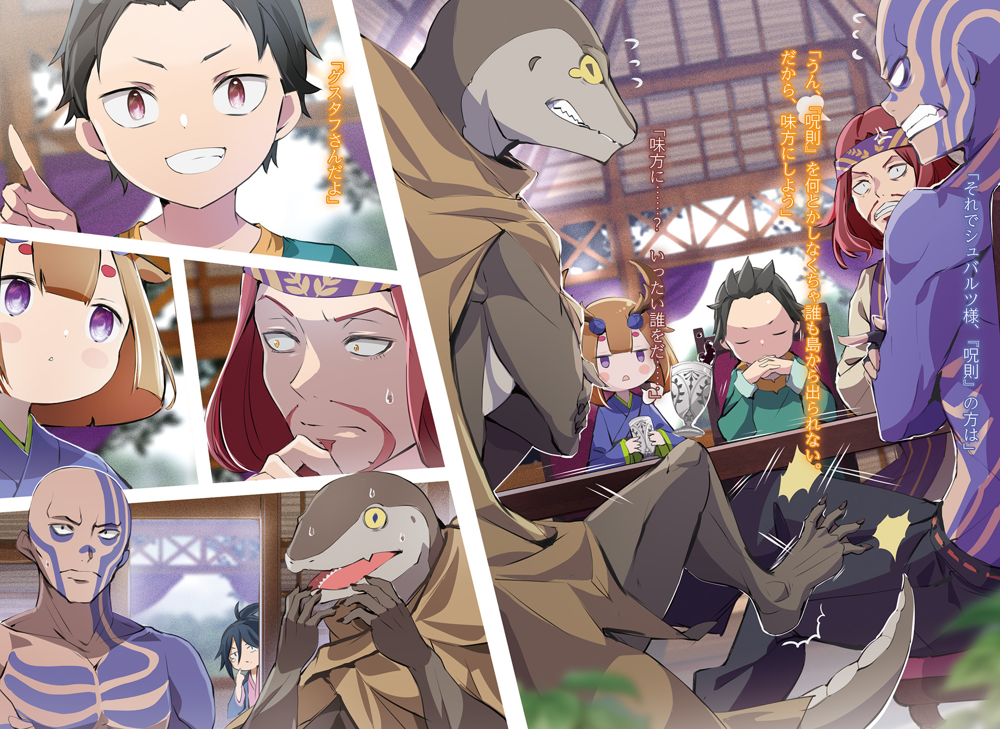
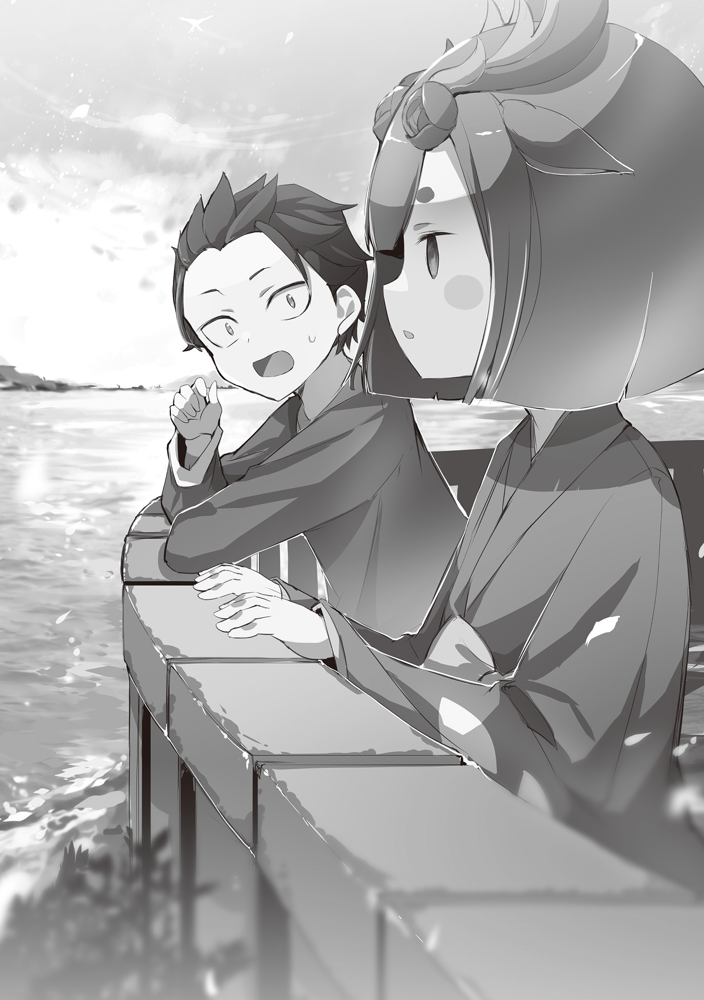
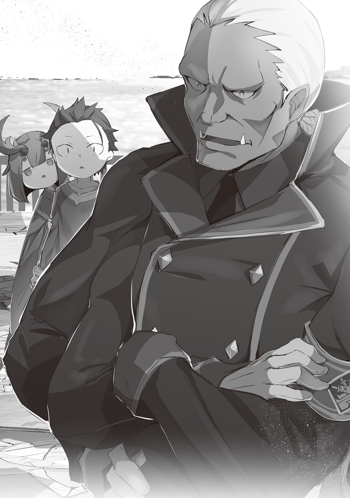

Английский перевод: garmadoncar (разделы 1-6)

Перевод: Sergirym (разделы 1-6), AandihcE (с раздела 7)

Редактура: MilkyWay и Mannrell (разделы 1-6), AandihcE и Gradient (с раздела 7)

Примечание: изложенная ниже история содержит в себе спойлеры к седьмой сюжетной арке и происходит в конце 31-го тома ранобэ (после 75 главы веб-новеллы соответственно).

…На западе Империи Волакии, находился одинокий остров Гинунхайв, окружённый водами озера. Был он также известен как Остров Гладиаторов, на коем действовал уникальный свод правил.

В общем и целом, люди, живущие на нём, делились на две отдельные группы — стражников и подконтрольных им гладиаторов. Многие из последних являлись преступниками, должниками, или вероятно лишь теми несчастными, которым не посчастливилось быть пойманными работорговцами и сосланными на этот остров; у абсолютно каждого из них за плечами имелись свои особые жизненные обстоятельства.

Но, по какой бы причине они здесь ни оказались, обращались с ними непредвзято.

От гладиаторов лишь требовалось, каждые несколько дней, как только наступал их черёд, принимать участие в Спарке, шоу, где их умения и жизни становились зрелищем, и суметь её пережить.

Если им доставало удачи и подлинной силы, то в таком случае они не только сумели бы избежать смерти после множества Спарок и прожить долгую жизнь, но также выкупить собственную свободу в качестве награды, или даже заслужить себе высокое положение на этом острове.

Место, где биография и человечность не имели значения, являло собой утопию для дикарей, в коей ценилась лишь физическая сила — таковым был Остров Гладиаторов Гинунхайв.

— …До чёрта парней с подобным заблуждением, но если спросишь вот этого вот, то я скажу, что такой ход мыслей охренеть какой тупой.

На сих словах, этот человек залпом опустошил грубо вы ́ тесанный деревянный кубок с дешёвым пойлом.

У этой персоны были пепельно-каштановые волосы, тёмная кожа и пухлые губы. У него был белый шрам, который, казалось, перекрывал его правый глаз, а позади прикрытого века находилась его искусственная замена.

Она не являлась чем-либо способным восполнить потерю глазного яблока, но похоже что без неё ему было бы одиноко.

Мужчину звали Джозроу. Он был одним из гладиаторов, живших на Гинунхайве, и к тому же весьма известным в этих местах. …По словам остальных, его знали как волка одиночку Джозроу.

Причиной подобному прозвищу служила отнюдь не только его отстранённость от людской компании.

— В здешних местах действует система Отрядов, по которой ты должен верить в то, что незнакомцы прикроют твою спину, а они также обязаны доверять тебе свои. Вместе, вы ставите на кон ваши жизни. Такое видать случается и тогда, когда дела идут совсем туго. Но…

— Но?

— Если парень, чью спину ты должен прикрывать гнусный, грёбаный мудила, то что тогда?

Едва наклонив голову, Нацуки Субару столкнулся с вопросом и нахмурился, погрузившись в раздумья.

Сидя за небольшим столиком в углу обеденного зала этого острова, Джозроу пристально буравил притихшего Субару сердитым взглядом своего всё ещё рабочего левого глаза.

Облик Субару, отражавшийся на поверхности единственного ока Джозроу, на вид соответствовал годам одиннадцати или двенадцати.

Если размышлять, оперируя обыденными стандартами, то в подобном возрасте едва ли кто-то нашёлся бы чем ответить на вопрос Джозроу. Однако, во взгляде, задавшего его человека, не было блеска присущего, тому, кто подшучивал над несмышлёным ребёнком, но он также и не пытался торопить Субару, пока тот размышлял; лишь ожидание его ответа.

Вполне вероятно, что под отношением Джозроу скрывались его ожидания на счёт Субару.

В таком случае, у него не имелось другого выбора кроме как их оправдать.

По этой причине, Субару, набрал воздуха носом и…

— На этом острове, есть и преступники, наломавшие дров за его пределами. Может они что-то украли, кого-то убили, или нарушили какое-то правило. И среди них…

— ………

— Есть и ребята, кто воровал у женщин и детей, или даже убивал их. “Грёбаные мудилы” это про них?

— … Эй, ты забыл добавить “гнусные”.

После сказанного Субару, покончившего с размышлениями, Джозроу пробубнил эти слова, переводя взгляд на выпивку в своём кубке. Психика Нацуки была не настолько искажена, чтобы воспринять это как знак неприятия или отказа.

Под взглядом Джозроу, Субару выпрямился, сидя на своём стуле, и продолжил.

— Такие люди которым ты не можешь доверить прикрывать твою спину… Раз уж на то пошло, то им в принципе даже в лицо смотреть не захочешь. Не потому ли ты остался совсем один, что твой Отряд побросал таких парней как они?

— Это тоже неверно. Их не бросили. Их зарубили и списали в утиль.

— Со спины…

— Если эта спина не стоит того, чтобы её прикрывали, то мне было бы куда спокойнее, убей я их на месте. У тебя ведь тоже не выйдет сказать, мол с твоими друзьями такого не приключится, верно?

Расплываясь в циничной улыбке и фыркнув носом, Джозроу попытался было продолжить со словами “Поэтому”, но вполне вероятно, что заготовленное им высказывание в точности совпадало с тем каким его представлял себе Субару.

Окажись Субару прав в своих выводах, подобное заявление вовсе не было бы нужды озвучивать.

— Что ж, такое меня бы устроило.

— …Чего?

— Когда тебе захочется, если посчитаешь мою спину недостойной защиты, то можешь притвориться будто я достаточно рослый, дабы твои убеждения позволили меня зарубить. Гарантирую, я буду так стоять, доверив свою спину тебе, что ты об этом точно не пожалеешь.

— ………

От заявления Субару, глаза Джозроу широко распахнулись, и его искусственное око выпало из его правой глазницы. Отскакивая от поверхности стола, оно покатилось прямо к Субару. Заметив это, последний поймал его правой рукой, и сжал своими пальцами, поднимая то до уровня своего лица.

Затем, встретившись взглядом с деревянным оком в упор, он глянул через него на Джозроу. Пока он на него смотрел, на устах Субару запечатлелась улыбка озорного сорванца, и…

— Сдавайся уже и стань моим другом, Джозроу. Из гладиаторов остался только ты.

В ответ на подстрекательства, улыбающегося Субару, Джозроу прижал руку к своей пустующей глазнице, в то время как его оставшийся глаз слегка дрогнул, и его взгляд опустился вниз.

Так ознаменовался финальный акт сопротивления со стороны теперь уже бывшего волка-одиночки, Джозроу, прежде чем тот наконец-таки вернулся обратно в стаю.

— К-каким-то образом мне даже Джозроу удалось убедить стать моим другом…Путь этот был долог…

С хлопком плюхаясь на жёсткую кровать в его комнате, Субару положил руку к себе на лицо.

Пребывание в его юном теле влекло за собой чудовищное чувство усталости в купе с гордостью за свои достижения, которые могли с ним посоперничать или даже вовсе то затмить.

Ведь, на данный момент, число гладиаторов, заключённых на Гинунхайве, превышало отметку в шесть сотен… Он успешно обратил их всех в своих союзников и присоединил к Лагерю Нацуки Шварца.

— Это и вправду, отняло уймищу времени…

Субару глубоко и протяжно вздохнул, пока его обзору мешала рука, лежавшая на лице.

Встав на ноги после своей перезагрузки, Субару решился на это, не задумываясь над точным количеством гладиаторов. Далее он вернулся в борьбу, теперь рассматривая положение дел на этом острове и личные обстоятельства гладиаторов по одному за раз; эти его усилия были столь тяжкими, что читатель с рассказчиком оба разом, залились бы слезами в процессе их изложения.

Но, вместе с тем как начинало казаться будто он утонет в тех слезах, сам факт, что он не прекращал суетливо барахтаться, плывя вперёд, таки был вознаграждён.

Благодаря чему, он стал на один шаг…,

—……ближе к тому, чтобы закрасить тот, наихудший из всех возможных исходов.

Сжимая руку, бывшую у него на лице, в кулак, теперь когда ничто не мешало ему видеть, во взгляде его отразился грязный потолок, а сам Субару, ощутив некоторый отклик, задумался над тем как продвигалось положение дел.

…Эта жизнь являлась для Нацуки Субару уже вторым заездом по Острову Гладиаторов.

“Посмертное Возвращение” он всё же использовал отнюдь не во второй раз. Касаемо этого полномочия, всё находилось явно не на уровне двух или трёх попыток; количество его перезагрузок было совершенно не поддающимся сравнению.

Под вторым заездом в данной ситуации подразумевалось нечто отдельное от накопившихся у него “Посмертных Возвращений”, и являло собой пример отматывания времени куда более широкого размаха.

— ……Всё же, предыдущий заезд закончился ужасно…

Пока Субару бормотал, сквозь его разум проносились финальные аккорды безнадёги, такой, что никак во всей красе не выразить одним лишь словом “наихудшей”.

То была концовка, где жизни всех его знакомых с этого острова, коих он взаимно считал друзьями, одну за одной, отнял кровожадный клинок; все остальные обитатели Гинунхайва пали жертвами массового убийства; не предотвращая его, точка отсчёта “Посмертного Возвращения” продолжала неумолимо нестись вперёд, пока наконец не закрепилась в тот момент, когда никого уже нельзя было спасти.

Изначально предполагалось, что уже было слишком поздно. Спасти хотя бы даже одного человека для него более не представлялось возможным.

Однако, Субару напрочь отказался признавать такой финал, и потому, полагаясь на сущность, даровавшую ему силу бороться со Смертями, с коими он сталкивался уже не раз — доверившись Ведьме, он получил последний шанс.

Снова, по возвращении в тот самый первый день, когда его отправили на Остров Гладиаторов, ему дали шанс начать свою битву заново, дабы никогда больше не встречать на своём пути сего безнадёжного исхода.

Осуществление плана Субару, призванного предотвратить тотальное истребление Острова Гладиаторов, шло полным ходом.

Во имя этой цели…,

— Я обращу всех и каждого на этом острове в своих друзей.

Опять же, затея была полнейшей нелепицей. Но, ему ничего более не оставалось кроме как претворить её в жизнь.

В будущем, где Остров Гладиаторов был полностью уничтожен, все на нём окажутся в одной лодке.

Дабы отогнать вестников, несущих с собой эту катастрофу, всеобщее единение было необходимым.

Затем, преуспев в присоединении волка-одиночки Джозроу, ключ к убеждению которого всё никак не находился, к рядам своих союзников, Субару таки избавился от одного из препятствий, стоявших на пути его замысла.

— Честно говоря, это смахивает на спидран набивания очков одобрения…в жанре временных петель, протагонист обычно начинает действовать эффективно и происходят всякие штуки, но в реале, всё идёт не настолько уж гладко.

В разномастных мангах и видеоиграх, побывавших в руках Субару, имелись персонажи с жизненными обстоятельствами схожими с его собственными; памятуя о невзгодах, успевших постигнуть его до сих пор, а также о том сколь явной будет разница в боеспособности, случись ему поменяться местами с кем-то из них, он печально опустил плечи.

В отличие от видеоигр, в реальности, люди, с которыми Субару имел дело, были помимо всего прочего наделены сознанием и чувствами, а потому решись он следовать учению о максимальной эффективности, игнорируя при этом те самые чувства, то эти люди не стали бы от чистого сердца вставать под его знамёна.

По этой самой причине, ему и доводилось неоднократно терпеть неудачу на поприще выстраивания межличностных отношений, а следовательно…,

— ……Басу! Басу! Я всё разузнал!

Пока он вспоминал о тех невзгодах, со стороны входа в комнату раздался взбудораженный голос. После чего, его обладатель без колебаний с силой распахнул дверь и, жизнерадостно улыбаясь, ворвался внутрь.

Им оказался смазливый мальчишка с синими волосы, собранными на затылке, одетый в яркие одежды розового и синего цветов — Сесилус Сегмунт, трудный ребёнок Острова Гладиаторов и самопровозглашённый носитель этого имени.

Сесилусом Сегмунтом звали сильнейшего воина всея страны, и хотя Субару в целом считал, что мальчишка перед ним вероятно не являлся самозванцем, вопрос этот всё же пока оставался нерешённым, и следовательно его имя продолжат считать самопровозглашённым.

Как бы то ни было, с весьма довольным выражением лица, Сесилус посмотрел в сторону, лежащего на кровати, Субару, и…,

— У тебя наконец получилось уломать Джозроу, так ведь!? Ну и ну, когда Басу впервые заявил что-то типа “Все на этом острове станут мне друзьями”, меня по правде очень порадовало всё это бахвальство, но, вот те на, я взаправду обязан сказать браво, ведь я в немалой степени удивлен тем как далеко тебе удалось зайти!

— …Ахх, аммм, это такое поздравление? Сеси…

— Поздравление? Несомненно, поздравление как оно есть! Хоть по сей день на Остров Гладиаторов Гинунхайв и попало много народу, не находилось среди них ещё кого-то такого же амбициозного и целеустремлённого как Басу и при этом столь близкого к их воплощению в жизнь! Такое до́лжно воспеть как подвиг необычайного величия!

— А теперь, в довершение ты станешь хвастать тем насколько велик твой собственный удел, раз ты подобрал меня, расхаживая вдоль берега?

— В точности так! Пока я бесцельно и бесхитростно бродил в одну из моих эпизодических прогулок, мне довелось подобрать Басу. Это и есть доказательство тому чем я обладаю! Может статься, в том есть причина почему главная роль сего мира досталась мне!

В открытую восхваляя себя любимого, Сесилус с довольным видом ухмыльнулся, и в ответ удостоился кривой улыбки Субару.

Сесилус аки пулемёт целыми очередями выпаливал ошеломительные реплики, но на удивление, Субару не испытывал дискомфорта, когда его заставляли их слушать. Лицо их исторгавшее не страдало замкнутостью и не колебалось при разговоре, и всё же, вероятно, дело было в подобранных им выражениях, чётких и тактичных.

Именуя себя не иначе как ведущим актёром, казалось будто ему хватало достоинства не говорить о вещах, которых он не желал, чтобы услышали другие.

— Однако, тебе в самом деле не стоит быть беспечным, Басу.

— Беспечным?

После сказанного ему, Субару выпрямился, сидя на кровати. После чего, кивнув со словами “Да, конечно”, Сесилус молниеносно ткнул пальцем в кончик носа Шварца.

Скорость была поистине слишком высока, чтобы его глаза за ней поспели, и к тому же пагубна для его сердечка.

— “Беспечным”, и таки в чём я был беспечен?

— По мне так тебе наверняка пришлось довольно по душе уговорить практически всех гладиаторов острова встать на твою сторону, но Гинунхайв не настолько прост, чтобы твой завоевательный поход на том и завершился. С тех пор как это место стало известным как Остров Гладиаторов, тот знавал лишь одного беглеца.

— Беглеца…

— К тебе ведь это тоже относится, так? В конце концов, Басу намерен убраться с этого острова.

Поразмыслив над тем как он без умолку молол чепуху, своей краткой ремаркой Сесилус наконец таки подобрался к сути дела.

Засвидетельствовав такое удачное применение ораторского искусства сродни боевому стилю, Субару почесал свою щёку. Он попал прямо в яблочко, но до сего момента, ему при разговоре с Сесилусом ни разу не доводилось говорить об уходе с острова.

— Воу-воу, похоже ты не на шутку удивлён, но это дело ясное. Всё же, раз этот слух так сильно раздули по всему острову, то и моих ушей утечке о личности Басу также довелось коснуться.

— Только не говори мне, что стража тоже в курсе!?

— Аа, не надо тебе на этот счёт беспокоиться. Я наверное слегка переборщил со сказанным мной секунду назад. Под слухами на острове я имею в виду, что они гуляют только по информационной сети гладиаторов. Окей?

[прим. пер.: отныне и впредь, подчёркнутые слова (в данной реплике это: over, network, okay и т.п, и т.д.) Сесилус, а потом и Субару, произносят на английском.]

— ОК ОК блин, ты сбиваешь меня с толку…

Так как Сесилус ограничил набор слов коими изволил изъясняться, едва ли не показалось будто план Субару вот вот должен был развалиться.

Разумеется, касаемо только что поднятой Сесилусом темы “личности” Субару, он с умом бы применил её против людей, стоящих у руля этого острова, но стало бы неловко, окажись начальство о сём осведомлённым.

Если им и суждено об этом услышать, то он постарался бы подобрать для этого сцену максимально эффективно сие раскрывающую.

— Однако ж, я только что был на волосок от провала, но странным бы не показалось, просочись оно когда-нибудь наружу…

— гляжу~~

— На счёт этого, полагаю, мне нужно напомнить всем не распускать эти слухи, и…

— глаз~~, не отвожу~~

— …Ну что такое, Сеси? Уж больно шумно и экспрессивно ты пялишься.

[прим.пер.: в тексте было использовано слово emphasis, которое можно также интерпретировать как “эмфаза”(от др.-греч. ἔμφασις «выразительность») — эмоционально-экспрессивное выделение какого-либо значимого элемента высказывания или его смысловых оттенков, подчёркнутое произношение входящих в слово звуков, отличающиеся от нормального. Теперь мы оба узнали что-то новое.]

Субару в раздумьях приложил руку к своему подбородку, а Сесилус устремил на его профиль напряжённый, пристальный взгляд. Он даже постарался добавить экспрессии к мощи своего неотрывного взора, выразив её звукоподражанием, но узрев то как Субару в ответ нахмурился, Сесилус издал “Не-не-не!”, принявшись утрированно размахивать руками, и…

— Очень похоже на то, что ты зришь прямиком в будущее, но всё ещё пренебрегаешь лежащим под самыми твоими ногами, Басу! Разве тебе не ясно? Я лишь сказал “практически” всех гладиаторов с этого острова. Разве не существует разницы между “практически” и “вообще” всеми? Такому положено быть очевидным!

— Агась, впрочем, мне это известно.

— Значит значит значит! Этот упёртый волк-одиночка Джозроу, вероятно являлся тем ещё внушительным препятствием, но даже он был не более чем вступительным актом, послужившим прелюдией к гвоздю программы! Негоже тебе забывать про столь очевидный факт!

— Агась, и это я знаю.

Слушая Сесилуса, который без остатка опустошал свои лёгкие всякий раз как говорил, Субару повернул голову назад, когда тот в нехарактерной для него манере выдал один или два веских аргумента.

И действительно, заполучив Джозроу, Субару сделал серьёзный шаг на пути к своей цели, но он являлся лишь одной из преград, которые надлежало преодолеть, а не всем набором препятствий.

Ответ Субару в купе с выражением решимости, заставил Сесилуса чуть

шире распахнуть глаза.

После чего, расслабив щёки, он принял довольный вид.

— Ну неужели, правда? В таком случае, что ты намерен делать дальше?

— Ну, пока я лишь скажу, что секрет есть секрет, и он из тех вещей, которые я хочу обсудить со всеми. Касаемо гвоздя программы этого острова, в детали также углубимся во всё той же беседе.

— Хыхыхы, я понял, понял, ты подводишь к кульминации. Но увы!

Сколько ни продумывай свои военные планы и приготовления, а нельзя быть настолько уверенным в высоте стены, коей является наш гвоздь программы!

Запуская длани в рукава своего кимоно, Сесилус размахивал круго́м его материей в триумфальном ликовании.

Сесилус всего себя посвятил декларированию проповедей о величайшем из врагов, штуке известной как беспечность, и кивком отреагировав на его манеру речи, Субару поднялся с кровати и направился в сторону коридора.

После чего…,

— ……Господин Шварц, все собрали́сь в обеденном зале.

С этим словами, покидавшего комнату Субару, встретила маленькая девочка, облачённая в кимоно, отличное от того, которое носит Сесилус. На её голове росло два роскошных рога, ей являлась Танза, девочка-олень одного с нынешним Субару возраста.

У Танзы имелась личная причина выжить на этом Острове Гладиаторов, куда её отправили вместе с Субару. Одарив сию отзывчивую девочку широкой улыбкой, Субару похлопал её по плечу и изрёк “Понял”,

— Ну тогда, приступим? …Завоевание Острова Гладиаторов, Заключительный Этап.

Такой была манера, в коей Субару огласил Танзе и Сесилусу своё заявление.

— Здаров, братан, мы готовы приступать по твоей отмашке. Так когда у нас начало? …Синхронное восстание, в котором мы возьмём этот остров под контроль!

Прибывшего в обеденный зал Субару, ожидал, сидевший за их привычным столом, человек-ящер — Хиайн, который размашисто помахал своими руками, и во всеуслышание объявил сие сногсшибательное известие.

Утечки этой информации он и боялся; такая мысль неосознанно порушила решимость, коей Субару зарядился у входа в свою комнату, а Хиайн, по своей беспечности, сильно схлопотал от кого-то по затылку.

Завопив “Гьяяяягххх!!”, Хиайн съёжился и схватился за голову. Тем, кто стоял позади него, сжимая свой кулак, был человек с похожими на скелет татуировками по всему телу, он же Вайц.

С сердитым выражением лица, усугубляющим свирепость во взгляде, в коей виноваты его татуировки, он заговорил…

— Хорош уже без умолку трепаться во всю глотку, падла ты рептилоидная…Подумай в каком Шварц положении…!

— В-всё таки, ни к чему лупить меня за такое! Совсем ни к чему!

— Будь оно так, мне бы пришлось глотку те перерезать…

— Да что с тобой нахрен такое, мудила!?

Удостоившись грозного взгляда, говорившего шёпотом Вайца, Хиайн злобно уставился на того в ответ, разговаривая на повышенных тонах.

Этим двоим, неспособным поладить несмотря ни на что, уже далеко не впервой было вот так ругаться и буравить друг друга суровым взором.

— Батюшки мои, чем сильнее вы двое шумите, тем больше внимания привлечёте. Такое для Шварца наверное будет куда накладнее.

Человеком с кривой улыбкой на лице, не придающим значения ссоре этого дуэта, оказался Идра, сидящий за их столом. Поглаживая свою бородку, он похлопал рукой по стулу подле своего, и сказал,

— Шварц, присядь-ка. Я конечно не Хиайн, но всё же надеялся с тобой переговорить.

— Да, я и сам собирался так поступить. Танза, возле меня. Сеси, если будешь шуметь, иди-ка вон туда. А сможешь быть паинькой, то не стесняйся и подсаживайся к нам.

— Просить меня вести себя тише гиблое дело, но полагаю и так сойдёт. Я скорее буду хранить молчание, нежели упущу возможность поприсутствовать на грядущем обсуждении.

Пространно и затянуто объяснившись, Сесилус уселся у края стола. Прояснив этот вопрос, Субару сел рядом с Идрой, а подле него примостилась Танза.

Даже спорившим друг с другом, Хиайну и Вайцу, заметившим, что Субару и остальные заняли свои места, ничего не оставалось кроме как прекратить свои распри, и сесть за стол.

А затем…,

— …Так, когда мы это сделаем? Я уже об этом говорил, но все ведь уже готовы.

— Падла рептилоидная…

— Да какого хрена! Я ж ну очень тихо базарю, чем я чёрт возьми на этот раз не угодил!?

Даже заговорив тише, Хиайн всё равно стал объектом убийственно сурового взгляда Вайца, после того как откопал тему, уже имевшую место совсем недавно. В тот самый миг, когда эти двое вот вот должны были вновь сцепиться, начав второй раунд, Субару вытянул руки и воскликнул, — Погодите!

Этим двоим в принципе не имело смысла затевать здесь драку.

Так или иначе…,

Субару: Простите что так разжёг ваш энтузиазм, но синхронным восстанием мы заниматься не будем. Захват гладиаторами власти на острове с нами в качестве его правителей…всё же не к этому я стремлюсь.

— Нгха!?

— Чего…?

Когда им чётко прояснили их заблуждение на счёт проложенного курса действий, разумеется, что Хиайн, и даже Вайц, которому было положено находиться с ним по разные стороны баррикад, оба удивлённо выпучили глаза.

Каким-то образом, несмотря на его упрёки в сторону Хиайна за его поспешность, Вайц по-видимому без всяких сомнений верил в то, что их план заключался в захвате острова с помощью грубой силы.

— Что ж, полагаю такая стратегия и впрямь подошла бы жестоким гладиаторам, но…

— Не будет никаких шансов на победу. Неужели вы двое успели забыть? Губернатор этого острова, Господин Густав Морелло, навязал нам Закон Проклятия.

— Гхк…!

Кривая улыбка Субару стала ещё выразительнее, а, сидевшая сбоку от него, Танза изъявила своё удивление, всё ещё не выдавая эмоций.

Услышав то, что отметила маленькая девочка, у Хиайна заложило горло, а лицо Вайца также приняло огорчённый вид.

…Закон Проклятия являл собой нечто, сковывающее узников Острова Гладиаторов цепями невидимыми глазу.

Если Закон Проклятия нарушат, то жизни гладиаторов будут нещадно оборваны. А для всех его установил Правитель Острова, Губернатор Густав Морелло.

Сочти необходимым он так поступить, то смог бы вмиг всех гладиаторов на Острове сгубить. Будь он способен с точностью избрать цель Закона Проклятия, то ему бы не составило труда уничтожить лишь тех, кто замешан в мятеже.

— Покуда Закон Проклятия не будет развеян, взятие острова под контроль всё равно что сон внутри сна. Теперь то до вас двоих дошло сколь бездумно звучат ваши слова?

— *Цык*…

Туловище Хиайна апатично рухнуло на стол, а Вайц сложил руки, недовольно щелкнув языком. Впрочем, важнее всего было то, что оба они осознали тяжесть сложившихся обстоятельств.

— Однако, даже не поленись ты сделать всех гладиаторов острова твоими союзниками, стоит только Губернатору тебя заподозрить и нам всем крышка. Сомневаюсь, что единственное твоё желание это стать царём горы, Шварц.

— Чего и стоило ожидать, Идра весьма проницателен.

На сей ремарке, Субару щёлкнул пальцами, а Идра негромко фыркнул и его губы расслабились.

Как Идра и отметил, если они не сподобятся что-либо сделать с Законом Проклятия, то тогда Субару утратит своё положение по достижении статуса царя горы. Но, его цели простираются за пределы острова. Точнее говоря, в них входило становление всех и каждого на Острове Гладиаторов в качестве его союзников, и последующий совместный побег с Гинунхайва.

Именно такую концовку для Тома об Острове Гладиаторов Субару и запланировал.

— Но но точно же, ну знаешь. Велик шанс, что Басу наверное мог бы просто вырвать этот Закон Проклятия и рвануть напролом, ведь так?

— Сеси, ты ведь обещал держать рот на замке.

— Извини извини. Просто, ну знаешь, мне не кажется будто бы Басу на самом деле собирается из кожи вон лезть чтобы его достопочтенные союзники все до единого беспокоились о том о сём, разве не так?

Стуча двумя пальцами по столу, Сесилус в такой манере высмеивал их собрание.

Из-за ремарки и поведения Сесилуса, в сторону Субару были обращены неприветливые взгляды Хиайна и остальных. Даже их получатель мог догадаться какой смысл они в себе несли, но той, кто чётко изложила его словами являлась Танза.

Равно как и у трех остальных, ощущаемая ею тревога от сказанного Сесилусом, проявилась в её глазах.

— Господин Шварц, мм, вы точно в здравом уме, раз собрались совершить это с помощью Господина Сесилуса?

— Если ты спрашиваешь мыслю ли я здраво, нежели просто серьёзен ли я, то в ответ на такой вопрос, мне бы захотелось всё отрицать независимо от его содержания.

— Приношу искренние извинения. То была нечаянная оговорка. Вы на полном серьёзе собрались совершить это с помощью Господина Сесилуса?

Танза хотела спросить полагалась ли его стратегия на Сесилуса, и словно бы поддерживая её вопрос, взгляды остальных членов Отряда сделались напряжёнными.

Под давлением взоров этой четвёрки, в купе с самоуверенным взглядом Сесилуса, Субару вздохнул, и,

— Нет? Ломая голову на тем как бы разобраться с Законом Проклятия, я и не думаю прибегать к помощи Сеси.

— Да да истинно так и есть, ибо тут настаёт мой черёд выйти на сцену, это будет представлением под стать звезде сего шоу и ПОГОДИ ЧТО ТЫ СКАЗАЛ!?

— Я имею в виду, какой будет толк, если от Закона Проклятия убежит один только Сеси? Так проблема бы не решилась, верно же?

В миг равный одному вздоху, Сесилус забрался на стол, попытался устроить представление и тут же был ошарашен. С занимаемой им позиции, он изучал выражение лица Субару, но последний ткнул его в нос, заставив спуститься.

Речи Сесилуса с грохотом неслись не в ту степь уже в ту пору, когда они ещё не успели прибыть в обеденный зал, но к несчастью для него, не было ни шанса, чтобы Субару, зашедший так далеко, убедив даже Джозроу стать его сторонником, избрал бы Сегмунта своей следующей целью.

Конкретно для него, он вознамерился организовать подходящую ситуацию, но…,

— В таком случае, что ж ты, ёлки твои палки, намерен делать, Шварц?

— На счёт Закона Проклятия?

— Ага…Как бы сильно это меня не бесило, но в чём-то самозваный вояка таки прав…Если ты не в силах преодолеть Губернаторский Закон Проклятия, то тогда у тя не выйдет…

— Хм?

— Тогда у тя не выйдет встретиться с твоим папкой, Его

Превосходительством Императором…

Лицо его было мрачным, а тон голоса низким, однако сказанное Вайцем было в немалой степени достойно похвалы.

— …

Спустя мгновение после слов Вайца, Субару улыбнулся и глубоко вздохнул.

Касалось это не только Вайца; и Хиайн и Идра, вероятно также и Сесилус, который был не особо заинтересован, наряду с изрядным множеством гладиаторов, разделяли это заблуждение. …О том, что Субару являлся незаконнорождённым сыном Императора, ставшим расхожей темой для обсуждения по всей Империи.

Рождённый из слухов, факт существования черноволосого Кронпринца определённо пребывал посреди процесса своего распространения по Империи Волакии, лёгшего в основу набиравшего силу восстания; поговаривали, что он вознамерился отнять Трон Империи у его нынешнего обладателя.

Более того, Субару, продемонстрировавшего на Острове Гладиаторов деяния, несвойственные его возрасту, единодушно подозревался в том, что именно он был тем самым человеком, коему молва приписывала статус черноволосого Кронпринца.

Таким образом…,

— Так и есть. Я также хочу врезать своему говённому папаше под дых от всей души.

Умышленно не проясняя сие недоразумение, Субару пользовался им как орудием упреждения дабы пленить сердца обитателей этого острова.

Он стыдился того, что обманывал членов его Отряда, с коими был довольно близок; но изначально, именно они первыми выдвинули предположение будто бы Субару и есть тот самый черноволосый Кронпринц, а посему это сыграло тому на руку при их убеждении.

То же касалось и других гладиаторов, ведь установление его статуса незаконнорождённого дитя выгодно смотрелось в глазах немалого числа людей. Поэтому, он не собирался разглашать правду по крайней мере до тех пор пока они не покинут Гинунхайв.

И тем не менее…,

— …

Безмолвная и неподвижная, Танза пристально рассматривала профиль Субару. Только ей одной было известно, что на самом деле он не являлся незаконнорождённым сыном Императора, и понимала суть его лжи.

Даже если большую часть совместного времяпрепровождения они пребывали в статусе членов Отряда, их знакомство началось в Хаосфлейме, ещё до прибытия на остров. Он считал, что перед ней будет тяжко притворяться будто Субару является бастардом Императора, и прежде всего, не беря в расчёт логику и результативность, ему просто не хотелось обманывать Танзу.

Всё же, шанс на повторный заезд был дарован Субару благодаря тому, что в мире, приближавшемся к безысходному финалу, Танза крепко сжимала его в своих объятиях до самого конца.

Во всяком случае…,

— Н-ну, по итогу-то, как мы поступим? Никто не станет бунтовать. Но и сдаваться, нос повесив, мы также не будем. Ну так что делать то будем?

— Чистейшая правда, только интересно мне, каков твой план!? Разве это не самую малость, чересчур неискренне, бахвалиться, выпячивая напоказ свои мечты, не имея при этом настоящего плана? Басу похоже не в домёк до чего глубокими окажутся раны на сердцах тех, чьи надежды будут самым вопиющим образом преданы.

— Кажется твои обвинения в мой адрес летят тем же курсом, что и у Хиайна, но твои слова это уже совсем про другое. Перво-наперво, я ни слова не сказал на счёт твоего участия в моём плане, Сеси.

— Тупой Басу!

Подпрыгнув, он соскочил со стола и, отпустив напоследок ребяческий комментарий, Сесилус, прямо как ветер — с воистину соответствующей ему скоростью, умчался прочь из обеденного зала.

Провожая взглядом его удаляющуюся подобно буре спину, Субару вздохнул. После чего, он вновь повернулся к людям, ожидавшим продолжения беседы.

— Итак, Господин Шварц, касаемо Закона Проклятия…

— Мда, если мы что-то не сделаем с Законом Проклятия, никто не сможет покинуть остров. Следовательно, давайте обратим его в нашего союзника.

— Союзника…? Да кого, черти его дери…?

Услышав это впервые, думая при этом о ком-то, обладающем незаурядной силой, Вайц обыскал взглядом вход в обеденный зал на предмет спины Сесилуса, после того как последний только что выбежал наружу.

Но, Субару натянул на лицо улыбку и, снабдив свои следующие слова преамбулой из “А, эт не то”, заговорил.

— Я говорю про Густава.

— …Что?

От слов Субару, его товарищи по Отряду нахмурились, посчитав, что они ослышались.

То что они придут к такому выводу было неизбежным. Ведь, речь шла о большой шишке среди начальства Острова Гладиаторов; кое-о-ком известном за его непреклонность в работе, и как воплощение непоколебимой верности Империи.

Да при таких условиях, если он собирался преодолеть Закон Проклятия, этого было не избежать.

Следовательно, уже во второй раз, Субару прямо заявил.

— С Законом Проклятия я что-нибудь да сделаю. Для этого уговорю Густава стать нашим другом.

Так он и заявил.

…Губернатор Острова Гладиаторов Гинунхайв, Густав Морелло.

Будучи членом Племени Многоруких, обладающим четырьмя крепкими руками, плотно опоясывающими его крупное тело ростом в два с половиной метра, он являлся закалённым на вид джентльменом с аккуратно зачёсанными назад волосами.

Выражение его лица и манера речи являлись строгими, но он был не из тех с кем невозможно вести беседу или же достигнуть понимания, а у Субару на его счёт складывалось впечатление как о взрослом, обладающем чрезвычайно редкой в Империи Волакии благоразумностью.

Но в то же время, он был весьма строгих правил, и Субару ещё сильнее казалось будто тот не позволит сократить дистанцию между ними, а потому ему без всяких сомнений суждено стать грозным оппонентом для сего завоевательного похода.

— И тем не менее, нам необходимо заполучить Густава.

Разумеется, существование Закона Проклятия являлось отнюдь не последней причиной настойчивого образа мышления Субару.

Если они не преодолеют Закон Проклятия, карающий тех кто нарушил правила, взимая с тех плату в лице самой жизни, то в таком случае гладиаторам, сотрудничающим с Субару, будет никак не избежать истребления, и в итоге для них всё закончится кровавой бойней.

Даже если предположить наличие способа свести на нет эффект Закона Проклятия, Субару не желал, чтобы жизни Густава и его стражников были отняты в ходе вооружённого восстания гладиаторов.

Субару не были по душе ни Империя Волакия, ни Остров Гладиаторов, но он не намеревался обращать беспричинную ненависть на людей, выполняющих свои профессиональные обязанности в качестве стражников и солдат.

— Заключенные подвергаются издевательствам со стороны стражников, такое развитие событий в беллетристике зовётся клише́, но здесь мне о чём-то подобном пока что слышать не приходилось.

[прим.пер.: Беллетри́стика (от фр. belles lettres — «изящная словесность») — общее название художественной литературы в стихах и прозе, либо же исключая стихи и драматургию.]

Он полагал, что такое наверное бывает отнюдь не только в беллетристике, но такая система жесточайшего контроля, рождённая из разницы положений, никак не проявлялась на этом острове. Условия делали строже при помощи надзора и дисциплины, всесторонне насаждаемых Густавом, а также реализацией его руководства как Губернатора.

В двух словах, если бы он смог заполучить Густава, то тогда ему бы не пришлось уговаривать стражников по отдельности, одного за другим; наоборот, они вполне возможно все разом встали бы на его сторону.

— Раз так, то нет причин этого не делать, так ведь?

— Мне ясно о чём вы, но…

Когда Субару во всей красе расписал преимущества, которые будут идти в комплекте с Густавом, Танза с обеспокоенным видом прикрыла рот рукой.

В данный момент, они покинули обеденный зал и находились на одной из смотровых площадок, возвышающихся над островом.

Вне участия в зрелище они располагали относительной свободой, но эта смотровая площадка пользовалась немалой популярностью среди гладиаторов. Отсюда едва ли можно было разглядеть невольничью башню, и чувствуя себя пускай даже самую малость, но ближе к небу, они могли погрузиться в иллюзию свободы. Это весьма излюбленная уловка.

— Мотив этой уловки ну уж больно прямолинейный…

Танза: Одного только этого достаточно, дабы показать, что все здесь истосковались по свободе. Именно поэтому у них столь высокие ожидания на счёт Господина Шварца. Черноволосого Кронпринца…Пускай это всего лишь выдумка.

— Не говори так в лоб… В конце концов, ты же не знаешь не подслушивает ли нас кто со спины.

— В отличие от Господина Хиайна, я крайне осторожна.

Невозмутимо унижая Хиайна, Танза, со спокойным лицом глядела вдаль -на ту сторону озера. Поддавшись ностальгии, она размышляла о мире за пределами тех берегов.

С Гинунхайва, полностью окружённого водами озера, нельзя было разглядеть внешний мир. Субару и Танза, оба они имели свои интересы и тревоги, лежавшие за границей его противоположного берега. Ему было до боли знакомо её нетерпение.

Заметить как колышутся чувства маленькой девочки было нелегко, но Субару осознавал сколь сильно пылало её сердце.

— …Итак, каковы ваши намерения?

— …! Поможешь мне в противостоянии с ним?

— Равно как и все остальные, я мощнейше порываюсь от сего отказаться. Однако, проведя всего несколько дней в вашей компании, мне стало ясно, что Господин Шварц не особо умеет сдаваться.

На слова Танзы, которая понурила плечи будто бы говоря “ничего не поделаешь”, Субару ответил кривой улыбкой и почесал свою голову.

И хотя то что проступило на его лице несло в себе оттенок кривой улыбки, он от всего сердца, искренне радовался такого рода подкреплению.

Всё же, он поведал Хиайну, Вайцу и Идре о замысле по обращению Густава в своего союзника, но все трое разом поникли, заключив, что это “невозможно” и разошлись.

Если точнее, то они приправили это словами “Тебе б башку свою остудить”, “есть вещи, на которые ты способен, и те, что в их число не входят” и “Положись на меня, я спущу с Густава шкуру и сыграю в ней его роль…”, но их наличие в стане друзей никаких плодов не принесло.

— Кстати об этом, Танза за меня всерьёз беспокоится! Обожаю это!

— …Как и ожидалось, вы наверное желаете побудить меня вновь рассмотреть возможность вас покинуть?

— Стой стой стой стой стой, виноват. Но, раз уж ты в самом деле волнуешься, подкинь идею плиз.

— идеею…

(прим.пер.: в пред. реплике Субару добавил в конце: “idea please” “aideea…”.)

Пока она машинально повторяла за этим ломаным Английским, её большие зрачки слегка опустились, и,

— Прежде всего, нам следует открыто уведомить его о том, что за нами все гладиаторы, и в ходе переговоров воспользоваться разницей в военном потенциале как щитом. Как вам такое?

— Буду вынужден сказать нет. В случае Густава, похоже стоит ему только понять, что мы готовим заговор или чего-то там планируем, как он покарает нас, воспользовавшись Законом Проклятия.

Отвечая на совет Танзы, Субару припомнил свой первый заезд, когда на Остров Гладиаторов в качестве посланников явились те, чьи лица он не желал запечатлевать в своей памяти, после чего между ними и Густавом развязался спор.

Посланников беспокоила угроза возникновения волнений внутри страны из-за обитателей острова, и они предложили тотчас же устранить всех гладиаторов, но Густав наотрез отказался. Причиной тому послужила отнюдь не поддержка рабов с его стороны, а чувство профессионального долга, коим обладал сам Губернатор.

В то время, Густав попросту не последовал предложению исполнить наказание, обоснованное лишь подозрениями. Субару, впрочем, не считал будто Губернатор стал бы мешкать с применением Закона Проклятия, стоило только тем подтвердиться.

— Если в переговорах мы станем в открытую орудовать военной мощью, то шансы того, что Густав не воспользуется Законом Проклятия, невелики. Вот поэтому, нет.

— Мои искренние извинения. Похоже, что мне не удалось принести Господину Шварцу пользу.

— На этом у тебя всё!? Вот почему такое впечатление будто в этом мире так много девчонок, которых так и тянет прибегнуть к грубой силе!?

После извинений Танзы, склонившей голову, из которой росли её оленьи рожки, Субару пожаловался небесам за обилие столь плотоядных дам.

Для начала, невзирая на то, что оленям положено быть травоядными, таким уж был подход Танзы к решению проблем. Ну почему все женщины, встреченные им на его пути, как например Медиум и амазонки племени Судрак, все предрасположены к грубой силе?

— Может Рем и Госпожа Йорна исключения…Нее, разве эти двое тоже в известной степени не склонны прибегать к силовым решениям?

Даже несмотря на её неспособность ходить из-за проблем с ногами, Рем с натяжкой, но тоже условно являлась адептом грубой силы. Йорне, наносившей своему Дворцу взрывные по своей мощи рубящие удары, в конечном итоге тоже можно приписать склонность к применению физической силы.

— Будете плохо отзываться о Госпоже Йорне, и я вас не прощу.

— Да не говорю я о ней ничего плохого, это всего-то моё праздное бурчание…Так или иначе, то что ты мне помогаешь делает меня ну очень счастливым, Танза.

— … Да.

Хоть Танза и не сумела дать совет, она, легонько кивнув, всё же согласилась помочь.

Если честно, на Танзу нынешний Субару мог рассчитывать как ментально так и физически. К тому же, его долгом было оправдать её ожидания и веру в него, поскольку она осталась рядом с ним.

— Стало быть, как вы, по итогу, намерены поступить?

Заси́м, вернувшись на исходную, ко всё тому же вопросу, Субару внезапно посмотрел на небо.

Что же ему предпринять, ответом на вопрос Танзы было…,

— Прежде всего, мне бы хотелось узнать его чуточку получше.

— Э?

Безразличное к чувствам Субару и всех остальных там внизу, ненавистное небо, ныне открылось взору, когда облака слегка рассеялись. Его слова, сказанные пока он сердито глядел в небеса, заставили Танзу бросить удивлённый взгляд.

А затем…,

— …Заставил тебя ждать, Шварц.

Заслышав суровый голос, павший до уровня его ушей с точки куда более близкой к небу чем он, Субару опустил взгляд. Подле него, Танза напряглась всем своим крохотным телом, и по рядам остальных гладиаторов, присутствующих на смотровой площадке, стало расползаться волнение.

Сие явление было в порядке вещей. Ибо весьма редко случалось такое, чтобы этот человек посетил эту смотровую площадку.

Той самой персоной оказался Густав Морелло, Губернатор Гинунхайва, Острова Гладиаторов.

— Рад, что вы сумели сюда прийти, Густав.

— Господин Шварц!! Вы призвали Губернатора сюда!?

— Так и есть. Я назначил встречу, раз уж это никак бы не навредило.

Занервничав, Танза повысила голос, а Субару спокойно кивнул, ответив на её вопрос.

Величаво вышагивая в сторону тех двоих, к ним приблизилась крупная фигура, столь высокая, что даже заберись эти детки друг другу на плечи, то всё равно бы не встали вровень с его глазами.

Скрещивая свои дородные руки, Густав не нарочно бросил тень на Субару и Танзу, после чего заговорил,

— Сей чиновник пребывает здесь не в своё свободное время. По прихоти своей вызывать меня сюда в крайней степени неудобно.

[прим.пер.: в японском тексте, говоря о себе, порой в третьем лице, Густав часто пользуется местоимением 本職 обозначающим его статус как госслужащего и в целом жонглирует формой обращения к себе в своих репликах, например, обозначая себя как “сей чиновник”]

— Это даже и близко не прихоть. Я позвал вас, будучи полностью готовым к тому, что вы на меня рассердитесь. Если бы я в самом деле без всякого умысла вас вызвал, то попросил бы прихватить с собой ланч-бокс да пригласил на пикник.

— Будь это ты, Танза, или Сегмунт, юным лицам весьма не характерно иметь столь крепкие нервы.

— …Я тем не менее нахожу неприятным, что меня расценивают вровень с этими двумя.

Всё ещё испытывая напряжение в присутствии Густава, она таки вмешалась, услышав комментарий, который она была не в силах игнорировать.

Хоть он и считал будто её поведение полностью подтверждало сказанное Густавом по поводу их нервов, Субару всё таки думал, что в отличие от него самого в этот уже второй по счёту заезд, хладнокровие Танзы являлось вполне естественным, и следовательно на неё можно было рассчитывать.

Как бы то ни было…,

— Я рад, что вы нашли свободную минутку, несмотря на загруженный график.

— Твоё нынешнее положение, в известной мере, привлекает к себе больше всего внимания на Острове Гладиаторов. Даже более чем Сегмунт, который может похвастаться подавляющей мощью, не дающей никому с ним сравниться.

— Так ли это? Если позволите мне так выразиться, то я считаю, что его боевой стиль не следует выставлять на обозрение перед неотёсанной публикой.

— Разумеется, ведь ему в отличие от тебя не довелось снискать себе столько же возможностей блеснуть этим боевым стилем перед остальными.

Категорично заявил Густав, несмотря на отсутствие в его голосе изумления или гнева.

Когда Субару почесал щёку, Густав принялся артикулировать своим большим ртом, который смотрелся ещё свирепее из-за двух клыков выступающих из него, а затем сказал,

— Только не говори мне, что не собираешься останавливаться? Участвуя при этом в каждой новой Спарке, ставя на кон собственную жизнь дабы помочь остальным гладиаторам в их борьбе за выживание.

Густав, несомненно, принял принял приглашение Субару, чтобы прояснить ситуацию, вызывающую у него сомнения.

Участие в Спарке — В его второй заезд по Острову Гладиаторов, оно внесло наибольший вклад в переманивание многих бойцов на сторону Субару. Их всех принуждали сражаться со Зверодемоном известным как Зверь-Гладиатор в честь Спарки, и им было необходимо подвергать свои жизни риску дабы выйти из неё победителями.

Нечто чего на острове боялись сильнее всего остального, но в то же время являющееся наилучшим способом продемонстрировать устои бытия Гражданина Империи; с пользой реализуя эти возможности, Субару заручился уважением и доверием гладиаторов.

Однако…,

— В прошлом сей чиновник постиг в том числе и воинскую профессию. Мне не довелось стать полноценным бойцом, но я полагаю, что сумел развить в себе чутьё на таланты. Шварц, если рассуждать с этой точки зрения, то твоё выживание во всех Спарках, в коих ты поучаствовал по сей день, было не более чем хождением по тонкому льду.

— …

Густав: Если ты допустишь просчёт в одной ничтожной мелочи. Или же, выражаясь точнее, если ты её не учтёшь, то будет загублена твоя жизнь. По долгу службы сему чиновнику доводилось встречать гладиаторов, с разнящимися мнениями о жизни и смерти, но твои методы напрочь лишены здравого смысла.

Категорично заключил Густав, проведя анализ совершенно безрассудной манеры ведения боя в исполнении Субару.

Оценка его была точной. На самом деле, Субару принимал участие в Спарке множество раз, но не то чтобы от его присутствия та сильно убавляла в риске.

Участвуй в ней Сесилус, он бы моментально умертвил Зверя-Гладиатора и исказил бы сами устои Спарки, а Густав и остальное руководство не смогли бы спустить всё на тормозах, не применив какого-либо наказания.

— Но такое совсем бы не вязалось с тем как сражаюсь я. Ведь в конце то концов, я всякий раз борюсь за свою драгоценную жизнь.

— Ты не притворяешься и это вполне очевидно. К неистовству толпы гладиаторов, вызванному твоим участием в боях, привело ничто иное как их осознание того, что ты с ними на равных и не избегаешь битвы.

— И тем не менее, Господин Шварц не позволяет мне участвовать…

Когда Танза прошептала эти слова и опустила взгляд, Субару пронзило жгучее чувство горечи. Но стоило ему только принять её помощь и тогда он, при всей его слабости, стал бы жаждать этой поддержки.

В том не было бы никакого смысла. …Доверие гладиаторов являлось тем, что Субару следовало заслужить самостоятельно.

— Твоя полоса везения не будет тянуться вечно. Скоро, возможно именно в следующий раз, удача тебя покинет.

— Густав заявляет, что в открытую отправит туда супер сильного Зверя-Гладиатора?

— Это всего лишь правило большого пальца. Невезение есть нечто, приходящее под личиной везения. Тебе определённо стоит отнестись к этому со всей серьёзностью. …Сей чиновник также полагает, что твоя гибель была бы прискорбной.

[прим.пер.: правило большого пальца (англ. rule of thumb), оно же эмпирическая закономерность — зависимость, основанная на экспериментальных данных и позволяющая получить приблизительный результат, в типичных ситуациях близкий к точному.]

Неожиданные слова Густава удивили Субару и заставили Танзу тоже широко открыть глаза. Как водится, жуткое лицо Губернатора не позволяло его эмоциям просочиться наружу, но сказанное им не показалось ложью. Как ни странно, учитывая их своеобразные отношения, коим нельзя было присвоить ярлыка ни дружеского ни враждебного, он верил, что Густав не стал бы лгать.

— Густав, а почему вы Губернатор этого острова?

— Какая внезапность.

— Разве? Первоначально, я позвал Густава сюда просто потому что хотел поболтать с ним о том, о сём. Или, вам наверное уже пора возвращаться обратно?

— …

— Кстати, раз уж вы проявляете упорство и не сдаётесь, работая за своим столом, то при правильном количестве перерывов, меняя темп, можно повысить эффективность. Это доказали исследования, проведённые в Калифорнии.

— Сему чиновнику это слово не ведомо. Кстати, не преподавал ли ты наме́дни таких слов Сегмунту?

— В случае с Сеси, не то чтобы я ему преподавал, просто он сам впитывает их как губка.

Освободив себя от груза сих ложных обвинений, Субару спросил, — Ну так, каков будет ответ? — дабы убедиться намерен ли Густав продолжать беседу.

Услышав вопрос Субару, Густав, спустя мгновение тишины, заговорил,

— Сей чиновник принял пост Губернатора не иначе как по приказу Его Превосходительства Императора, Винсента Волакия.

И вместе с тем он принялся детально излагать свою историю вплоть до сего дня, сказание о Густаве Морелло.

— По первости к сему чиновнику даже в его собственном племени относились как к белой вороне. Причиной тому являлась предрасположенность большей части Племени Многоруких к насилию, а мне, в моём призвании, оно было вовсе не присуще.

Среди великого разнообразия полу-людских рас, с первого взгляда угадать характерную особенность Племени Многоруких было вовсе не сложно.

В среднем, они рождались с количеством рук от четырёх до шести, и раз те были способны управляться с оружием и инструментами, то и упоминать не стоит о том сколь полезными они приходились на войне. Так или иначе, благодаря распространению вестей о деяниях Восьмирукого, уроженца сего племени, их воины стали славиться своей силой.

Само существование Восьмирукого, снискавшего славу воина Империи Волакии, вселило надежду в его соплеменников, и многие его собратья ринулись на поле брани, размахивая оружием, имея в распоряжении рук куда больше чем у представителей прочих рас.

— В свою очередь сей чиновник не был опьянён тем же рвением. В то время как мои собратья находились под чарами доблести и славы, ожидавших их на полях сражений, я же куда больше годился для наслаждения книгами, выращивания скота, и защиты наших жилищ. В моём призвании, я подвергался нападкам соплеменников за мою трусость, но ни единого раза не случалось мне испытывать стыда.

Пыл Восьмирукого свирепствовал в племени ещё до рождения Густава. Его отец и дед, братья и сёстры, а также друзья, все поголовно грезили полем битвы, но для него всё обстояло иначе.

Кровь пролилась, отрублены руки; вместо исполнения их грёз, судьба решила, что те в своей мимолётности рассеются по полю бра́ни―― Становление воином виделось ему не более чем приближением к напрасной смерти.

— Не то чтобы я страшусь смерти. Чего сей чиновник опасается, так это умереть, не принеся результатов. Мне хотелось избежать ситуации, в коей моя жизнь была бы разбазарена, загублена гибелью тщетной в своей бессмысленности.

Его отец, дед, братья, сёстры и друзья, все истратили свои жизни, их смерти были напрасны, тщетны, они погубили себя так и не заслужив репутации легенды подобной Восьмирукому.

Он не считал будто сам мыслил правильно, не думал также, что умершие ошибались, но так как Густав уцелел, его соплеменники стали обращаться с ним ещё суровее. И раз все дорогие им люди погибли, а тот кого должны были поносить за трусость остался в живых, то они попросту не могли обойтись без ненависти к нему.

Густав принял это как нечто неизбежное.

Однако…,

— На мою деревню, утратившую многих моих собратьев, напали бандиты. Они полагали, что все мужчины пали на поле боя, и остались лишь женщины и дети.

Бандиты рассудили верно; возможностей сопротивляться у племени Густава было не много.

Дома сожжены, пожитки разграблены, а женщины и дети убиты забавы ради. Один лишь Густав, единственный не ушедший на войну мужчина, сражался с врагом; муж из Племени Многоруких, ненавидевший поле брани, избегавший оружия, не имел ни единого шанса, а его сопротивление было тут же подавлено.

Затем, неспособного что-либо с этим поделать, Густава вот вот должны были обезглавить, как вдруг…,

— …Прямо перед тем как жизнь сего чиновника должна была оборваться, пронёсся порыв ветра.

Шея человека, поднявшего свой топор дабы отсечь Густаву голову, была в мгновение ока разрезана ветром; тела всех бандитов вокруг также оказались стремительно разрублены одно за другим.

Далее, когда ветер прекратился, в живых остались лишь Густав да несколько его соплеменников. Все бандиты были убиты, никто из них не уцелел, на пастбище осталась только лужа их крови.

Перед изумлённым Густавом предстал один единственный человек сопровождавший тот ветер.

— Человек худощавого, на взгляд сего чиновника, телосложения изрёк следующее: “С чего бы представителю Племени Многоруких, утратившего многих на полях сражений, находиться сейчас в этих землях, где были убиты женщины и дети?” И потому я в меру своих способностей ответил: “Я не отправился на поле бра́ни. Ибо в равной степени питаю отвращение к войне и сражениям.”

Судя по кровопролитной природе положения, в коем они оказались, сей дерзкий диалог шёл вразрез с тоном творящегося вокруг. Но Густав не был способен вынести верное суждение, покуда его разум пребывал в оцепенении под тяжестью непреодолимых обстоятельств.

Таким образом, наладился диалог, а человек, получивший ответ на свой вопрос осмотрелся вокруг и…

— Этот человек сказал: “У меня сложилось такое же мнение.” После чего он сказал, что пожалует сему чиновнику право решить дальнейшую судьбу выживших членов банды и их предводителя.

По словам человека, сопровождаемого ветром, за нападением бандитов стоял феодал из окрестных земель.

[прим.пер: Феодал — землевладелец в эпоху феодализма (владелец феода).]

Дабы не позволять влиятельным племенам, населявшим его владения, сосредоточить в своих руках слишком много власти, этот феодал по своему обыкновению маскировал своё личное войско под бандитов и прорежал стадо; на этот раз, целью стало Племя Многоруких.

— Им уже удалось взять, стоявшего за этим, феодала в плен. Этот человек приказал сему чиновнику вынести приговор. Даже будучи под арестом, тот феодал не утратил чувства собственного достоинства, и сохранил свою решительность, но за всем этим я узрел скрываемый им страх перед смертью. Следовательно я, в своём призвании…

Получив приказ вынести приговор, Густав всё же не убил того феодала.

Ему, стоявшему на месте с оружием в руках, пожаловали шанс нести возмездие путём насилия; воздать за то сколь оскорбительным образом распорядились смертями его соплеменников, и свершить кару за презренное нападение на его деревню. Однако же, Густав от него отказался.

Вместо смерти, Густав приговорил этого феодала к каторжным работам, а ставшие тому свидетелями, выжившие люди его племени стали крича выражать своё неодобрение. И тем не менее, тот человек с уважением отнёсся к тому, что Густав не исказил его волю.

В итоге, он сказал…

— Трудись под моим руководством, Густав Морелло. Твой образ жизни может быть расценён как слабохарактерный, но я так не считаю. На этих просторных землях Империи, где ценится сила, твоё достоинство будет сохранено.

— С тех пор сему чиновнику даровали покровительство. Исполняя свои обязанности, я удостаивался возможностей повысить свой придворный чин, и мне был пожалован титул Верховного Графа. Тот человек — Его Превосходительство Император, лично поручил мне работать в качестве Губернатора Острова Гладиаторов.

До мирного правления Императора, Винсента Волакия, было рукой подать; но он, опять же не занимал положения сравнимого с Девятью Божественными Генералами или Премьер-министром Империи, а потому не то чтобы у него был шанс продолжать лицезреть одарённость Императора, находясь подле него.

Винсент, однако, явил Густаву лицо и изрёк слова, неведомые кому бы то ни было ещё; поэтому, хоть это и было в порядке вещей, ему доставало уверенности в себе, дабы принять это куда серьёзнее чем кто-либо.

Мудрейший Император возложил на него крайне важную обязанность, и направил его на Остров Гладиаторов. Так, будучи признанным за выдающуюся ответственность и лелея в сердце своё жизненное кредо, Густаву ничего не оставалось кроме как безукоризненно исполнять свой профессиональный долг.

Несомненно, именно это и являлось…,

— …Причиной мне как лицу должностному выполнять свои служебные обязанности на этом Острове Гладиаторов.

Содержимое истории, поведанной им устами Густава, под голубым небом на смотровой площадке, не увязывалось с настроем, привносимым лучами солнца, проходящими сквозь кроны древ. Сему сказанию куда более под стать был ветер с окровавленного поля бра́ни, нежели освежающий бриз несущийся над озёрной гладью.

Невозмутимое выражение лица Густава, а также его характер и мировоззрение оставались неизменными, и тогда Субару, глубоко вздохнув, сказал,

— Вы говорили куда откровеннее чем я от вас ожидал…

— Разве не ты справлялся о причине, по которой я, в своём призвании, принял свои профессиональные обязанности, Шварц? Сей чиновник намерен отвечать на все вопросы настолько прямо насколько это возможно.

— Я не сомневаюсь в вашей искренности. Что ж, я с самого начала был в ней уверен.

Личность известная как Густав стояла куда выше деяний подобных хитрости и лжи.

Ведь по итогу, если тот не мог о чём-либо говорить, то ясно давал это понять. Он был напрочь лишён такого рода бесчестия, при коем кто-то попытался бы сгладить углы путём лжи и вероломства, всё то время сочиняя удобные подробности.

И тем не менее, как он уже говорил, Субару не ожидал от Густава такой откровенности.

— …Вы присягнули Его Превосходительству Императору, поскольку были им спасены?

— Это не так. Строго говоря, я, в своём призвании, был спасён Синей Молнией, бывшим подле Императора. Если тебя интересует причина почему я так ему обязан, то быть может она заключена в том, что иначе сей чиновник пребывал бы в положении весьма отличном от теперешнего.

— Синяя Молния…

Пробормотала Танза услышав те самые слова, а её лицо приняло тревожный вид. Субару также приходилось слышать это прозвище, но всё несколько осложнилось и поскольку беседа меняла своё направление, он решил пока что это пропустить.

— Значит вы верны ему потому как он проявил уважение к вашему жизненному кредо?

— Мне свойственно нежелание изъявлять эмоции. А следовательно, я отказываюсь отвечать.

— …Именно такого я и ждал от Густава.

Как характер, проявленный Густавом, равно как и последовавший от него ответ, соответствовали ожиданиям.

С этого момента ничто уже не могло удивить Субару, но явление слуги, почитающего Императора — воистину боготворившего Абеля, стало уже вторым по счёту вслед за Зикром. Ему действительно было не под силу понять их чувств, но немало людей, присягнуло на верность Абелю не поддавшись влиянию своего окружения, а потому как сами пришли к этому решению.

Густав как раз являлся одним из тех людей, и приказано ему было…,

— …Закалять гладиаторов духом и телом на случай чрезвычайного положения, так ведь?

— …Не то чтобы я это скрывал, но откуда тебе об этом известно? Немного времени минуло с твоего прибытия на остров, а потому, несмотря на наличие у тебя простора для подозрений на счёт сего чиновника…

— Что-то типа “У стен есть уши, у дверей — глаза” и “за дверьми не удержится молва”.

[прим.пер.: есть вероятность, что Субару ссылается на “Инкарцерон” пера Кэтрин Фишер (советую также заценить синопсис), поэтому на всякий случай оставлю тут цитату оттуда:

Walls have ears.

Doors have eyes.

Trees have voices.

Beasts tell lies.

Beware the rain.

Beware the snow.

Beware the man

You think you know.

У стен есть уши,

У дверей — глаза,

Звери лгут

И деревьев голоса.

Берегись дождя,

Снега берегись,

Бойся человека,

Знакомого всю жизнь…

]

Он не мог определить понятны ли Густаву эти выражения, поэтому списав это на неспособность последнего лгать, Субару произнёс “Отложим это в сторону” дабы насильно сменить тему разговора.

Приказом, отданным Густаву лично Императором, обязанностью, которую тот ни за что бы не оставил, даже получив директиву подписанную Премьер-Министром, являлось…,

— Чрезвычайное положение, не кажется ли вам, что нынешняя ситуация, когда Империя находится на грани погружения в смуту, как раз попадает в эту категорию?

— ……

— Я слыхал, что Густав осуществлял все эти приготовления, и сильно повысил квалификацию гладиаторов. Старик Нулл также говорил о том как разительно всё преобразилось с тех пор как Густав стал Губернатором.

У старика Нулла имелся многолетний стаж в качестве гладиатора, к тому же он являлся живым свидетелем различных времён этого острова, хороших и не очень. Судя по его показаниям, говорящим о том, что не было ещё Губернатора лучше чем Густав, событием сие было крайне важным.

Густав превосходно справлялся с должностными обязанностями, возложенными на него самим Императором.

— Но даже отполированный, дорогой меч искусной работы будет совершенно бесполезен, если оставить тот томиться в ножнах.

— Шварц, на что ты пытаешься меня сподвигнуть? Если с твоего языка продолжат слетать чрезмерно опрометчивые замечания, то у меня не останется другого выбора кроме как воспользоваться своим положением и назначить наказание.

— Заставите меня участвовать в Спарке? Но, Густав, уж вы то должны знать, что в моём случае такое едва ли сойдёт за наказание, так ведь?

— … Не обязательно чтобы твоё наказание во всей его полноте ограничивалось одним лишь приказом участвовать в Спарке.

Недолго посомневавшись, Густав прищурил глаза, направив взгляд на Субару. Было ясно как день, что на самом деле за теми словами скрывался Закон Проклятия.

Нежелание его применять, если это представлялось возможным, проявлялось через умиротворённость во взгляде Губернатора, которую даже внушительная наружность, присущая ему, была не в силах скрыть.

— В какое время мы ныне проживаем, шаги какого рода сему чиновнику осуществить, есть то что я, в своём призвании, решу собственноручно. Шварц, от тебя лишь требуется вести себя, осознавая свой гладиаторский статус, и смиренно коротать время.

На этих словах, Густав повернулся к Субару и Танзе спиной.

Если сие являлось последним, что он желал донести до Субару, то с его уст слетело слишком много ненужных подробностей. Независимо от того осознавал ли это сам Густав, последний быстрым шагом проследовал вдоль по мощёному камнем покрытию смотровой площадки, желая как можно скорее удалиться прочь.

Таким образом, невзирая на жалость, испытываемую им в отношении Густава…,

— Вы дали совет, но мне так жаль, ведь я ни за что не стану смиренно коротать время, Густав.

Когда прозвучал голос, брошенный вслед массивной спине Густава, его ноги резко замерли на месте. Он оглянулся назад, повернув только голову, и устремил свой взгляд на, стоявшего по струнке, Субару и Танзу, ждавшую подле него.

Под этим грозным взглядом, Субару не спеша покачал головой из стороны в сторону.

— Хоть вы мне и нравитесь Густав, но у меня таки есть дела. Раз уж я не намерен от них отступаться, то думаю мне придётся ещё какое-то время пошуметь.

— …Пытаешься сего чиновника спровоцировать?

— Нет. Я лишь утвердился в своей решимости объявить войну.

Так Субару и заявил, сверкнув улыбкой, а Густав, будучи тому свидетелем, провёл правыми руками по своим клыкам. После недолгих раздумий, последний глубоко вздохнул в адрес Субару с его нестираемой улыбкой, и,

— В таком случае, со стороны сего чиновника не последует ничего окромя исполнения наших профессиональных обязанностей.

Оставив после себя лишь эти слова, Густав в этот раз действительно, широко шагая, покинул смотровую площадку.

Когда спина последнего пропала из виду, Субару, всё ещё ожидая пока чётко различимые звуки шагов стихнут, расслабил свои напряжённые плечи.

— Ну ничего себе, противостоять Густаву и впрямь тот ещё головняк.

— Не вам говорить “ну ничего себе”. По-моему это как раз моя жизнь резко сократилась.

Пока измождённый Субару переводил дыхание, Танза, более не сковываемая напряжённостью, пилила его этими словами. Видя её раздражённость, он через силу улыбнулся, говоря “Виноват, виноват”, и,

— Но, лишь благодаря Танзе я сумел это перенести не зарыдав. Спасибо тебе.

— Быть может вам пошло бы на пользу, заплакав, подвергнуться стыду, дабы вас затем заставили передумать, Господин Шварц.

— Эй, эй, даже будь плач тождественен пиcанию в портки, я бы всё равно не отступился бы, смекаешь?

— Думаю в ответ на мой глупый вопрос, Господин Шварц тоже выдал глупость.

Оценка сия была чрезмерно строга. Но, с точки зрения Танзы, для неё пожалуй вполне закономерными могли являться слова о том, что позволить столь далеко зайти такому было уж больно великодушно.

В конце концов, их противник занимал главенствующую должность на этом острове, и мог бы в два счёта их убить стоило ему только этого захотеть. И даже попытайся они убежать, это оказалось бы тщетным, ибо тот обременил их проклятием.

— Итак, послужило ли это цели Господина Шварца, коему жизнь не мила?

— До чего ж противоречивый способ это выразить… Прошу не обращайся со мной как с Сеси. В конце концов, я то своей жизнью в самом деле дорожу.

— Послужило ли это вашей цели?

— Жестоко вот так прессовать! Послужило, послужило! Правда вместо выполнения цели, лучше будет сказать, что я её выяснил. …Похоже одними речами его не убедить.

Тёмные радужки, неумолимо приближавшейся к нему Танзы, сразили Субару наповал. Услышав от него ответ, походивший на жалобу, она насупила свои круглые бровки.

В цели Субару входило выяснить сколько душевных сил Густав вкладывает в выполнение своих Губернаторских обязанностей. Затем, он хотел разгадать корень того чем это было мотивировано.

К счастью, благодаря исповедуемому Густавом принципу открытости, ему удалось узнать об этих вещах. Взамен, он также выяснил кредо, лежащее в основе его непоколебимой преданности.

— Чёрт возьми, как же этот подонок в маске меня бесит.

Вспоминая невыносимого и коварного человека, носящего маску Они, который всё продолжал вставлять ему палки в колёса, невзирая на разделявшие их дали, Субару недовольно надул губы, и затем, повернулся к небу, потянувшись к тому, приняв величественную позу.

А потом…,

— Танза, можешь позвать Хиайна и остальных? Я определился с тем как быть дальше.

От заявления Субару лицо Танзы напряглось, а слова, последовавшие далее, заставили её хранить молчание.

Лицо девочки выражало преданность, надёжность, оно словно бы говорило, что какой бы ни была стратегия, они точно доведут её до конца; смутно предвосхищая то каким окажется выражение лица Танзы мгновение спустя, он продолжил.

— …Я вызову Густава на Спарку.

Так он собственно и заявил.

— Вызвать Густава Морелло, губернатора Острова Гладиаторов Гинунхайв, на «Спарку».

Таков был план Нацуки Субару, последний рывок в его плане по захвату острова. Стратегия, которую он разработал, заручившись поддержкой всех гладиаторов острова, Он решил вступить в гражданскую войну, что потрясла империю Волакия.

— Однако, господин Шварц, разве не вы отвергли моё предложение, назвав применение силы верхом безрассудства?

— Я не говорил «верх безрассудства»! Я же постарался ответить максимально нейтрально, что-то вроде «скорее нет, чем да»?! Я же не хочу, чтобы Танза меня невзлюбила!

— Наверное, вы всем так говорите. Неудивительно, что вы смогли заслужить доверие всех гладиаторов острова.

—…Твоё замечание слишком колкое для простого беспокойства…

Субару замешкался от слов Танзы, которая возразила ему бесстрастным голосом, не меняя выражения лица. Было трудно поверить, что всего мгновение назад она смотрела на него с готовностью выслушать что угодно. Впрочем, её недовольство было вполне объяснимо. План Субару — вызвать Густава на «Спарку» — на первый взгляд, мало чем отличался от её собственного первоначального предложения: применить силу, используя их численное превосходство.

— К тому же, разве не этот же план предлагали господин Хиайн и господин Вайц, призывая к всеобщему восстанию?

— Судя по твоему «к тому же», ты невысокого мнения об этих двоих… Но нет, мой план отличается и от их плана, и от твоего, конечно, тоже.

— …И чем же?

— Вызвать на «Спарку» и захватить остров силой — совершенно разные вещи. Я хочу, чтобы Густав понял, что это необходимое для него решение.

Судя по взгляду Танзы, его слова остались для неё непонятными. Но Субару не имел намерений позлить её или намеренно запутать.

— Я верю в тебя больше, чем ты думаешь.

И всё же, даже в разговоре с ней он старался тщательно подбирать слова. В конце концов, сейчас, когда все гладиаторы острова перешли на его сторону, Гинунхайв оказался в крайне беспокойном положении. Единственное, что сдерживало гладиаторов, — это «Правило Проклятия». Из-за него гладиаторы боялись действовать напролом, опасаясь односторонней резни. Вот только Субару уже знал источник этого «Правила».

«Инструмент Проклятия… внутри тела Густава…»

Когда в «первый раз» Тодд и Аракия прибыли на остров эмиссарами из столицы, Густав, отклонив приказ премьер-министра, в итоге поплатился за это жизнью. Тодд вскрыл его и извлёк из него инструмент — источник «Правила Проклятия». Чёрная сфера размером с ладонь. Если бы целью Субару было избавиться от «Инструмента Проклятия», ему достаточно было бы просто повторить то, что сделал Тодд. Тогда план Танзы и гладиаторов был бы исполнен, и все они смогли бы покинуть остров.

Вот только Густав и стражники при этом погибли бы. А этого Субару не мог допустить.

— …Господин Шварц, какое будущее вы себе представляете? — спросила Танза, видя, что Субару тщательно подбирает слова.

Хоть она и была ещё юна, Танза была далеко не глупа. Она прекрасно понимала, что Субару не раскрывает ей всей информации и намеренно что-то скрывает. У неё всегда была возможность достать её силой. Однако…

— …

Танза молча ждала ответа. Она не хотела прибегать к силе, пока Субару не будет с ней честен. Именно эта уверенность и побуждала Субару отвечать ей искренностью, а не расчётом.

— Мой идеал — чтобы я, ты, все наши из «Гла…», все гладиаторы, а также Густав и его стражники дружно взялись за руки и вместе покинули этот остров.

Поэтому Субару, без малейшего сомнения, поделился с Танзой своими истинными планами. На мгновение в её глазах промелькнуло негодование от его, казалось бы, абсурдных слов, но, увидев, что он не лжёт, оно сменилось пониманием и некой растерянностью.

— …Как бы то ни было, это слишком уж несбыточная мечта.

— Вовсе нет.

Танза пыталась урезонить его, называя его идеал несбыточной мечтой, но Субару тут же, не задумываясь, отверг её слова, чем вызвал ещё большее недоумение в её глазах. Должно быть, она не понимала, откуда в нём столько уверенности, и это было весьма иронично. Ведь эту безосновательную уверенность ему подарила именно она.

«Да, вы правы, Господин Шварц. В следующий раз, без сомнения, мы точно не проиграем.».

Эти слова она сказала ему в мире, который уже канул в лету, когда он отчаянно не хотел сдаваться и пытался спасти хотя бы одну жизнь.

— …И инструментом для достижения этого идеала является «Спарка»? — наконец, словно сдавшись под его непоколебимым взглядом, вздохнула Танза.

Напряжение спало, не то чтобы он всерьёз думал, что Танза применит силу, но…

— Я был готов к тому, что в худшем случае мне сломают руку-другую…

— Мне крайне неприятно, что вы считали меня способной на подобное насилие.

— Да, да, прости. Я не то чтобы сомневался в тебе, просто… личный опыт заставил немного понервничать.

Даже для Танзы, ломать пальцы было бы уже слишком. Однако это напомнило ему одну из милых черт Рем.

Во всяком случае…

— Если честно, я считаю вашу идею безрассудной и нелепой.

— Угх… ну, отчасти ты права…

— Однако, — прервала Танза скорчившегося Субару, — когда госпожа Йорна создавала Хаосфлейм, окружающие, должно быть, тоже называли её затею невыполнимой, безумной и безрассудной. Но она сделала это.

Произнося имя той, кем она восхищалась, Танза заговорила о её великих достижениях. Субару, видевший Хаосфлейм своими глазами, мог представить, насколько самоуверенной была затея Йорны и каким тягостным был путь к её осуществлению. Он также понимал, каким невероятным благом это стало для Танзы и многих других полулюдей.

— Я не говорю, что вы способны на то же, что и госпожа Йорна. Она — особенная.

— Понимаю… но я не настолько самонадеян.

— Но если я стану той, кто лишь обесценивает чужие идеалы, это будет равносильно тому, что я посмеюсь над идеалом госпожи Йорны.

Танза, искренне благодарная и преданная Йорне, никогда бы так не поступила. Не то чтобы Субару рассчитывал на такой исход, но эта юная девушка сама расставила для себя приоритеты, выбрав то, что для неё было важно, и то, чем можно было поступиться.

— Однако у госпожи Йорны были и сила, и план для осуществления её грандиозного замысла. Есть ли они у вас, господин Шварц?

— …Что ж, если сравнивать с силой и умом госпожи Йорны, то я, пожалуй, никто. Но что касается плана — «Спарка» — всё , что нужно для успеха, а что до силы…

— Что до силы?

— Моя сила, на которую я рассчитываю, — это все гладиаторы этого острова и ты, Танза.

— Какая самоуверенность… — наконец отвела взгляд Танза.

Она, должно быть, была поражена его безоговорочной зависимостью от других, но Субару уже перестал об этом беспокоиться. Что он мог сделать ? Его гордость была словно пух одуванчика, — дунь, и она разлетится.

— Вот такие дела. Так что, не могла бы ты ещё раз поговорить с Хиайном и остальными? Сначала с этой троицей… а потом мне понадобится помощь всех гладиаторов.

— Слушаюсь… Но возможно ли это в принципе? Бросить вызов на «Спарку» самому губернатору острова, господину Густаву?

— Если я просто позову его на арену по-мужски помахаться кулаками, то шансы, что Густав согласится, невелики, это правда.

— Тогда как вы собираетесь поступить? — нахмурив брови, спросила Танза.

Она понимала, что без хитрости, которая заставит Густава принять вызов, их цель недостижима. Это был резонный вопрос, но и здесь было своё толкование. Впрочем, Субару мог легко представить реакцию Танзы, если бы он попытался объяснить всё в деталях.

Ведь…

— Эту историю я услышал от Сеси.

Едва он произнёс имя Сесилуса, то, как он и предполагал, лицо Танзы приняло доселе невиданное, крайне скептическое выражение.

— Бацу, тебе известно происхождение слова «Спарка»? — начал Сесилус.

— Сейчас так называют бои гладиаторов, но изначально оно означало дуэль, где на кон ставили незыблемые убеждения. Со временем поединок принципов в умах людей превратился в поединок на смерть… Впрочем, — добавил он с усмешкой, — возможно, сама суть не так уж и изменилась, ведь именно в смертельной схватке наши убеждения и принципы проходят самую суровую проверку!

С лёгкостью принимать подобные перемены в толковании слов — удел статистов. Увы и ах, но жизнь и убеждения — это совершенно разные вещи! Большинство, конечно, посоветует поступиться принципами ради спасения жизни, но такой выбор дозволен лишь массовке, второстепенным персонажам да антагонистам.

Но если ты стремишься стать главным, тем, кто ведёт за собой повествование и купается в лучах славы на сцене! Тогда нельзя предавать свои убеждения из страха потерять жизнь! Убеждения — это и есть твоё достоинство, твоя суть. Если ты пожертвуешь ими, чтобы сохранить свою жизнь, то кем ты станешь?

Что это будет за «существо»…?

В тот самый миг, когда ты предаёшь свою гордость и отказываешься от принципов и собственной морали, ты теряешь доказательство того, что ты — это ты! И если отбросить своё внутренеё «я», оставив лишь жизнь, то чем станет эта пустая оболочка? Можно ли её вообще назвать «кем-то»? А потому я осмелюсь заявить! И пусть это прозвучит как чудовищное заключение, пусть со мной никто не согласится — я прокричу это во весь голос!

— «Спарка» — это и есть жизнь!

Битва за свои убеждения и достоинство может начаться в любой момент. А возможно, мы и так беспрерывно сражаемся на полях «Спарки», сами того не осознавая. И если это понять, станет ясно: для «Спарки» не нужны ни мечи, ни даже конечности.

Сражение —не просто грубая сила; это прекрасный цветок, что расцвечен многообразием проявлений воли.

Так скажи же, Бацу… Какова твоя «Спарка»?

— Густав, я вызываю вас на «Спарку».

— …

Густав медленно обернулся и смерил Субару суровым взглядом. У губернатора всё время было грозное лицо, способное одним лишь взглядом вселить страх, но сейчас он действительно смотрел на него с нескрываемой злобой. На Нацуки Субару, что привел всех этих гладиаторов в резиденцию губернатора, что полностью парализовало его работу.

— Что означает этот мятеж? Сей чиновник требует объяснений, Шварц.

Густав часто пользуется местоимением 本職 , в переводе первой части используется “сей чиновник”, я не буду отходить от этого варианта.

— Объяснений…

Густав, не теряя самообладания, пошевелил губами, из-под которых виднелись большие клыки. Субару, стоя спиной к входу в кабинет, мысленно повторил его слова и огляделся. В «первый раз», он, замаскировавшись вместе с Хиайном, стал свидетелем жестокой резни, разыгравшейся в этой самой комнате. Воспоминания были слишком яркими, но, постаравшись их забыть, он увидел перед собой лишь очень скромное, безликое помещение. И только от него зависело, останется ли таким или нет.

— Шварц, сей чиновник все ещё ждёт объяснений!

Какие тут могли быть объяснения? Он так открыто поднял мятеж, что с точки зрения Густава как губернатора острова, правильнее всего было бы без лишних разговоров повалить его силой. Тем более, в кабинете они были одни. Схватить его не составило бы труда. Субару даже попросил Танзу не сопровождать его и пришёл сюда один. Разумеется, он сделал это, доверяя Густаву и будучи уверенным, что тот не станет сразу применять насилие, но, что более важно, он хотел поступить по совести. Хотел всё сделать правильно ради того серьёзного разговора, который Нацуки Субару собирался завести с Густавом Морелло.

— Мне нечего вам объяснять, Густав.

— …

— Как вы видите, все гладиаторы на этом острове стали моими товарищами. Похоже, вы были правы. Мой стиль ведения «Спарки » был настолько безрассудным и вызывающим беспокойство, что пробудил в них отцовский инстинкт

— Насколько мне известно, большинство гладиаторов далеки от проявления отцовских чувств.

— Да у меня настоящий талант…

Субару пожал плечами, и Густав в раздумье прищурился.

Сейчас Остров Гладиаторов был полностью подконтрольным Субару и его шестисот товарищей. На острове было около сотни стражников, но они не смогли бы остановить всех гладиаторов, действовавших организованно и по чёткому плану. Единственной реальной угрозой были Зверодемоны, но и эту проблему удалось решить, заранее выкрав ключи от их клеток.

— К счастью, обошлось без Зверодемонов. Только они меня и тревожили…

— Только они?

Для него это, должно быть, прозвучало самоуверенно. Ведь главной сдерживающей силой на острове были не Зверодемоны, а…

— …Не может быть, чтобы ты не знал о силе «Правила Проклятия», дарованной сему чиновнику.

— Я знаю, что из-за этого вашего «Правила» гладиаторы, несмотря на всё недовольство, не бунтуют, ведь в таком случае они рискуют жизнью.

— Тогда к чему этот безрассудный мятеж? Неужели ты решил, что «Правила» не существует, и сей чиновник выдумал его лишь для усмирения гладиаторов ?

— Нет, так я не думаю. Точнее, думал раньше. Но теперь — нет.

Было время, когда он и впрямь сомневался, предполагая, что «Правила Проклятия» либо не существует вовсе, либо представляет собой нечто куда менее совершенное, что лишь кажется могущественным благодаря значимости Густава. Но теперь Субару знал — «Правило» реально. И всё же он не боялся его по одной простой причине.

— «Правило Проклятия» — жуткая штука, но я не боюсь его, пока его владелец — вы, Густав. Потому что вы никогда не используете его, чтобы уничтожить нас всех.

— …Считаешь, что сей чиновник не справляется с ролью губернатора? — в голосе Густава прозвучало недовольство.

В конце концов, его слова можно было расценить как обвинение в робости и неисполнении долга. И хоть он и говорил Субару, что не считает храбрость своим главным достоинством, вряд ли ему было приятно выслушивать такое уничижение.

— Сему чиновнику была отведена роль смотрящего, обязанного обеспечивать стабильную работу Острова Гладиаторов, и я должен устранять всё, препятствующее этому, чтобы это ни было. Более того, губернатором меня назначил лично Его Превосходительство.

— То есть вы должны готовить гладиаторов на случай «Чрезвычайного положения»?

— В целом, верно. Поэтому подобное неповиновение мне и стражникам недопустимо. Следовательно, я должен применить дарованную мне силу, чтобы наказать виновных и предотвратить повторение подобного. —категорично изложил свою позицию Густав.

Если бы на этом всё и закончилось, действия Субару привёли бы к активации «Правила» — худшему из возможных исходов. Но Густав, глядя на Субару, продолжил:

— Однако, если вы сейчас же распустите всех и пообещаете больше никогда не прибегать к подобным методам, сей чиновник воздержится от применения «Правила»… дарованной мне власти.

— …

— Шварц?

Предложив пойти на уступки, Густав слегка нахмурился. Причиной тому было выражение лица Субару. Напряжённое в ожидании его слов, оно вдруг расслабилось, стоило ему услышать рекомендацию Густава.

В этот момент Субару почувствовал облегчение. Но наиболее его радовало , что…

— Я так и знал. Вы тоже сомневаетесь, Густав!

— Что?

— Бесполезно делать такое лицо и говорить так грозно, когда вы предлагаете нам столь гуманное наказание.

— …Свою внешность и голос я не выбирал, — безвольно возразил Густав.

Но это была не растерянность не понимающего о чём речь. Напротив, это было неловкое, но искреннее смятение того, кто слишком хорошо всё понимал. И виноват во всём этом был не Густав, а тот, кто отдал ему этот приказ.

«Всё из-за неясных приказов этого ублюдка Авеля», — мысленно выругался Субару, вспомнив ненавистное ему лицо с ехидной ухмылкой.

Конечно, он не считал, что виной тому была некомпетентность Авеля.

Император в изгнании, продолжавший манипулировать всем так, чтобы вернуть себе трон, был кем угодно, но только не некомпетентным. Поэтому и Густав всё это время продолжал размышлять. Размышлять об истинном смысле Императорского приказа.

— Если из-за него вы так мучаетесь, почему бы вам не подойти к нему и не высказать всё, что вы о нём думаете.

— Оскорбления в адрес Его Превосходительства…

— Недопустимы, я знаю. Но вы сами разве не думали? «Готовить гладиаторов на случай чрезвычайного положения»… Когда наступит это «Чрезвычайное положение» ? Каковы требования к подготовленности гладиаторов? И что делать после того, как эта цель будет достигнута? —перечислял Субару свои претензии к столь неясному приказу.

В его голосе звучал неподдельный гнев по отношению к Императору Волакии, за что его только что отчитал Густав. Но на этот раз губернатор не стал его упрекать. Не потому, что он и сам втайне злился на Императора. Просто в его молчаливом лице ,Субару, как ему показалось, разглядел отголоски едва заметных, потаённых размышлений.

— Я думаю, у меня есть ответ на вопрос, что вас так мучает.

— …Ответ, который я хочу знать?

— Я понимаю, вы очень преданы Императору. Не могу сказать, что я это одобряю, но понимаю… Возможно, это даже спасло мне жизнь.

Последние слова, добавленные шёпотом, были связаны с подозрением, которое Субару не хотел проверять. Если оно подтвердится, ситуация примет тоскливый окрас. Скрыв за мимолётным морганием свои личные терзания, Субару посмотрел на Густава и сказал:

— Скажу прямо… вы сомневаетесь и переживаете, правильно ли вы исполняете приказ Императора, верно?

Субару был уверен, что Густав изо всех сил старался сохранить невозмутимое выражение лица. Но он не смог сдержать минутного волнения, от которого напряглись мышцы на его щеках.

Высокопоставленный Граф, преданный своему Императору, честно пытался оправдать его ожидания. Но сам приказ был слишком неуловимым, оставляя слишком многое на усмотрение его исполнителя.

Воля правителя империи была далека и недосягаема, и Густав, должно быть, сомневался. И в итоге, по-своему истолковав истинный замысел Императора, он, после долгих раздумий, приступил к его исполнению.

— Я думаю, то, что Император хотел от вас, — и есть то, что происходит сейчас. Как бы дико это ни звучало.

— …С чего ты злишься, Шварц? Не стоит так непочтительно отзываться о Его Превосходительстве. И вообще, с чего ты взял, что нынешнее положение дел на острове соответствует его замыслу?

— Нет, я не знаю, является ли этот остров тем идеалом, который ожидал увидеть Император, но…

— …Похоже, твоё собственное мнение постоянно меняется.

— Вовсе нет.

Субару покачал головой, и замешательство на лице Густава лишь усилилось. Серьёзный, прямолинейный, с ужасающим выражением лица, синекожий представитель Племени Многоруких. С таким верным и преданным Графом Император Волакии — Авель — сыграл жестокую шутку.

— Я думаю, приказ Императора заключался не в том, каким будет Остров, а в том, как ты, Густав, будешь методом проб и ошибок исполнять его приказ.

— …

— То есть, Император… испытывал тебя. Он проверял, как ты, Густав, истолкуешь и выполнишь отданный тебе приказ. Не думаю, что это было просто любопытство.

Густав молчал, слушая поразмыслившего Субару. Но это было не молчание человека, сдерживающего гнев или нахлынувшие эмоции, а осмысленная, хладнокровная тишина, необходимая для того, чтобы принять и обдумать слова Субару. Вероятно, таков был его характер, но, скорее всего, у него были на то и более веские причины.

«Если я прав, то Авель тот ещё мерзавец…»

Понимать способности подчинённого по тому, как он справляется с задачей, — подход понятный, однако типичный для высокомерных деспотов. Когда подобное проворачивается в масштабах целого государства, количество втянутых в это людей становится невиданным.

Однако этот приказ, казалось, имел другую цель: выявить качества, неугодные Авелю. Если он хотел оставаться единоличным Императором, то ему не нужны были самостоятельно мыслящие люди вроде Густава. Истинная суть испытания ожидании того, на кого можно было бы полностью положиться в безусловном подчинении.

«Слишком не в его духе, чтобы называть это ожиданием. Может, доверие?.. Тоже на него не похоже».

Пожалуй, это была та форма гордыни, что маскировалась под доверие, — мол, само собой разумеется, что подчинённый Императора на такое способен. Густав, подвергнутый этому испытанию, изо всех сил пытался оправдать оказанное ему доверие, и результатом этих усилий стал Остров Гладиаторов…

— Поначалу я думал, что это просто ужасное место…

Субару коснулся спинки дивана в скромном кабинете и обвёл взглядом помещение, намереваясь на самом деле окинуть взором весь остров Гинунхайв. Его, выброшенного на остров, против воли связали общей судьбой с незнакомцами, заставили раз за разом переживать ужасную смерть, и всё ради того, чтобы пройти «Спарку».

Иначе здесь нельзя было даже стать полноправным гладиатором. Но за этим первым препятствием его ждала жизнь на острове, скованная строгими правилами и полная напряжения. Когда Субару осознал, что по замыслу Густава этот остров был местом, где ограничения не сводились к одной лишь жестокости и суровым условиям, он подумал:

— А ведь это место похоже на очень требовательную школу.

Конечно, вступительный экзамен был не просто требовательным, а смертельно опасным, и такая система вызвала бы негодование со стороны любого родителя, даже не самого скандального. Но если закрыть на это глаза, списав на суровые имперские нравы, то условия были вполне сносными: еда и крыша над головой гарантированы, и даже была работа, хоть и требующая концентрации («Спарка»). Словно школа… хотя, учитывая прошлое гладиаторов, уместнее было бы сравнение с тюрьмой. В любом случае, оба этих заведения призваны перевоспитывать и перековывать тех, кто в них попадает.

Почему же такая роль была доверена именно Густаву?

— Ты ведь рассказывал мне на смотровой площадке. Когда ты впервые встретил Императора, все мужчины из твоего поселения были на войне, и на вас напали. Остались только ты, женщины и дети.

— …Строго говоря, мужчины, кроме меня, были. Но все они не были боеспособными.

— И что с ними стало?

— Когда на поселение напали, они первыми схватились за оружие и погибли. В живых остались только я, женщины и немногие дети. И если бы Его Превосходительство Император со своими людьми не подоспел вовремя, даже не знаю чтобы было…

— Вот оно.

Прервав Густава, Субару ухватился за нить своего сомнения. Густав, будучи непосредственным участником событий, не видел в них ничего странного. Так часто бывает: то, что очевидно со стороны, не кажется чем-то особенным тому, кто находится в центре событий. Но что, если то же самое несоответствие, что и Субару, заметил и Император?

— Насколько я помню, зачинщиком нападения был местный феодал, который хотел сократить число своих подданных. Такую операцию, разоблачение которой грозило бы ему гибелью, он должен был досконально спланировать.

Однако в итоге Густав, женщины и дети смогли выиграть время, и подоспевшие воины Императора перебили нападавших, а феодал был разоблачён и понёс наказание. Значит, был какой-то фактор, что разрушил его планы.

— Ты вооружил женщин и детей на случай нападения?

— …

— Судя по твоему лицу, так всё и было?

— …Когда мужчины покидают поселение, оно становится лёгкой добычей. Сидеть сложа руки и ждать гибели — это даже не глупость, а нечто куда хуже. Я не люблю конфликты, но я не из тех, кто из принципа не возьмётся за меч, даже если на кону стоит жизнь. И всё же… большинство погибло.

— …Но вы спаслись. И не только вы, пусть и немногие.

Неизвестно, утешало ли Густава то, что были выжившие. Если его мучило чувство вины, то Субару мог понять его терзания по принципу «всё или ничего». Но он также примерно понимал, почему этот необычный многорукий, оказавший сопротивление, был столь оценён Императором, подоспевшим на помощь.

— Если бы ты был из тех, кто бездумно подчиняется приказам, этот остров был бы сущим адом, и ты бы, не раздумывая, применил «Правило Проклятия», как только мы выказали неповиновение. …Но, может, именно поэтому тебе и доверили этот остров?

— Но ты же только что предположил, что меня испытывают, и что в этом и заключается истинный замысел Его Превосходительства?

— Испытание — это испытание, но чтобы его пройти, нужны определённые умения. Какой смысл испытывать того, у кого нет шансов его пройти? Это будет просто попытка ради попытки. К тому же…

Это ведь испытание того самого высокомерного человека, который, кажется, видит всё наперёд и говорит так, будто ему всё известно.

— Раз он решил тебя испытать, значит, он уже склонялся к тому, чтобы признать тебя. Если бы результат его разочаровал, он бы винил за свой выбор себя, а не того, кто провалил испытание.

— …

— …Так мне кажется.

Сделав паузу, Субару подчеркнул, что всё сказанное — лишь предположение. Он, возможно, и подал Густаву надежду на то, что тот сможет понять истинный замысел Императора, но, говоря всё это, он и сам начал сомневаться в своей правоте.

Авель вполне мог бы за секунду придумать всё то, на что у Субару ушли многие размышления, но с той же вероятностью всё это могло быть и совершенно неверным. Однако именно такой образ Авеля идеально укладывался в его сознании.

— Если предположить, Шварц, что твои догадки верны, — после долгой паузы наконец произнёс Густав, — то что, по-твоему, означает «Чрезвычайное положение», о котором говорил Его Превосходительство? — его голос, словно из глубины тёмной пещеры, сопровождался скрещиванием его дородных рук.

— …Если ты думаешь, что это «Чрезвычайное положение» — и есть нынешняя гражданская война, то хочу напомнить, что ты сам же мне на смотровой площадке и сказал, что решать это только тебе.

— Я признаю это. Но, переступив через свою гордость, прошу твоего совета.

То, как он, признав свою неправоту, открыто попросил совета, выглядело даже по-своему достойно. Вот только обратился он с этим вопросом к Субару, и это было несвойственной для него ошибкой. Ведь так? Если бы Субару сейчас сказал, что «Чрезвычайное положение» уже настало, это дало бы Густаву полное право присоединиться к ним. А может, именно в этом доверии и крылся его истинный замысел…

— Я думаю, что «Чрезвычайное положение», о котором говорил Император, — это о состоянии души. Он имел в виду не конкретную дату или событие, а приказ быть готовым ко всему, что бы ни случилось.

Само использование такого слова, как «Чрезвычайное положение», породило и возможность выбора, и смятение. Возможно, Император и это считал частью испытания.

— …

В ответ на слова Субару во взгляде Густава промелькнуло смешанное чувство. Ответ Субару отличался от того, который дал бы ему формальное право действовать. Субару мог бы воспользоваться ситуацией и подтолкнуть его, но он предпочёл не делать этого. И…

— «Чрезвычайное положение», о котором говорил Император, ещё не настало. Но… почему бы нам не сделать вид, что оно уже здесь, и не отправиться вместе сокрушить эту гражданскую войну? — с весёлой улыбкой предложил он, призывая предать только что разгаданный приказ Императора.

— Это трудно понять.

Субару с улыбкой протянул ему руку, но в ответ Густав лишь тяжело выдохнул.. Субару и сам чувствовал долю ответственности за то, что раз за разом вгонял собеседника в такое замешательство.

— Я всего лишь прошу вас немного поступиться своими принципами, Густав…— предпринял еще одну попытку юноша.

— Я это прекрасно осознаю, — возразил Густав, смерив взглядом Субару, который лишь делал вид, что ничего не понимает. — И именно потому не могу взять в толк. С самого начала все твои поступки были…необъяснимы: ввязаться в «Спарку», переманить на свою сторону гладиаторов острова и поднять против меня мятеж — это я ещё могу понять. Но бунтовать, осознавая опасность «Правила Проклятия», — вызывает лишь вопросы. Более того, своим недавним поведением ты словно подталкивал меня к его использованию.

— Похоже на добровольную смерть?— с лёгкой усмешкой уточнил Субару.

— Иначе и не скажешь, — подтвердил губернатор. — Однако я не чувствую, чтобы ты жаждал смерти. И уж тем более не верится, что ты готов потащить за собой остальных. А значит, происходящее выше моего понимания.

Каждый из них пытался проанализировать другого: Субару — Густава, а Густав — характер Субару. Впрочем, юноша не считал себя сложной личностью, так что оценка Густава была в целом верной. Он никогда не хотел умирать и уж точно не собирался никого забирать с собой. Именно поэтому Густав и был в замешательстве, не в силах понять мотивы Субару…

— Кстати говоря, «Инструмент Проклятия» ведь находится в вашем теле, Густав? — внезапно сменил тему Субару.

— …Неужели ты уже извлёк его из моего тела? — насторожился тот.

— Ну, вообще-то… да как вы себе это представляете! — воскликнул Субару. — Вся система и придумана, чтобы этого не случилось! Если бы я умудрился достать его так, чтобы вы не заметили, это было бы уже слишком, не так ли?!

— С Сесилусом Сегмунтом большинство невозможного становится возможным, — резонно заметил Густав.

— А-а, Сеси…э, ну да. Сеси, Сеси… — протянул Субару, которому нечего было возразить на этот довод.

Казалось бы, абсурдное предположение, но при упоминании имени Сесилуса приходилось соглашаться. «Интересно, — подумал Субару, — а считает ли Густав этого нестандартного мечника «Первым»? Надо бы потом спросить.

— Как бы то ни было… простите, Густав, в одном я таки соврал, — признался он.

— …Соврал? Всё-таки насчёт «Инструмента Проклятия» в моём теле?

— Нет, насчёт того, что все гладиаторы острова со мной, — покачал головой Субару. — Есть одно исключение. Сеси.

— Что?

— Одного лишь Сеси я ещё не позвал, — пояснил юноша. — Более того, я не собираюсь настойчиво просить его присоединиться.

Он поднял один палец, показывая своё отношение к «единственному и исключительному» на этом острове. Услышав это, Густав слегка расширил глаза и вздохнул. Его реакция всё красноречивее говорила: «Это выше моего понимания».

— Мне всё труднее тебя понять… — наконец произнес он вслух.

— Так и думал, что вы это скажете, — кивнул Субару.

— Естественно! — воскликнул Густав. — Ты ведь, кажется, был дружен с Сегмунтом. Учитывая его силу, он был первым, кого следовало бы позвать!

— Ну, он тот ещё любитель внимания, так что я знаю — следовало бы позвать, и более того, он бы не отказал, — признался Субару, вспоминая, как Сесилус поначалу набивал себе цену, а под конец уже напрямую требовал своего участия.

— Будь Сеси с нами, большинство проблем и правда можно было бы решить грубой силой, но…

— Если ты это понимаешь, то почему? — перебил его Густав.

— Именно поэтому я и поступил, — без промедления ответил Субару.

— …Мне трудно тебя понять.

От мгновенного ответа подозрения Густава лишь усилились. Субару понял, что пора разобрать гору накопившихся вопросов, иначе даже такой рациональный человек, как Густав, мог в отчаянии активировать «Правило Проклятия».

— Я не зову Сеси, отчасти чтобы ему насолить, но самое главное — это послание для вас, господин Густав.

— Послание? — переспросил тот.

— Демонстрация намерений, — уточнил Субару. — Мы не собираемся действовать силой.

Эти слова не только не развеяли сомнения Густава, но и заставили его сомневаться ещё больше.

— …Сему чиновнику кажется, что мятеж всех гладиаторов острова уже вполне подпадает под определение «действовать силой», — возразил он.

— Но у вас есть «Правило», — парировал Субару. — А у нас нет козыря в виде Сеси, так что силой мы не заставим вас подчиниться. Верно?

— Эта логика имеет смысл, но вся остальная — нет.

Эта мысль внесла хоть какую-то ясность в общую путаницу. Губернатор опустил верхние руки и упёр их в бока. Слегка выпятив грудь, оскалил клыки .

— Следуя твоей логике, преимущество на моей стороне, ведь у меня есть крайняя мера — «Правило Проклятия». Причём преимущество одностороннее. Я не понимаю, зачем ты создал эту ситуацию. Какова твоя цель?

— Так я же сказал с самого начала, — улыбнулся Субару. — «Спарка».

Он криво усмехнулся: после долгих блужданий они наконец-то вернулись к главному. Его требование ни на йоту не изменилось с того момента, как он впервые озвучил его Густаву. Это должно было быть столкновение убеждений, без использования Сесилуса или «Правила Проклятия».

— Спарка… — задумчиво повторил Густав. — Но, Шварц, ты ведь не собираешься драться со мной насмерть?

— Конечно, я и не думаю, что вы согласитесь, но если вдруг — я буду в полной растерянности. Хотя, если ваши мускулы — просто бутафория, а на самом деле вы — статист, то у меня есть шанс, — пошутил Субару.

— Будучи статистом было бы довольно сложно управлять островом, — невозмутимо ответил Густав.

— И то верно, — согласился юноша.

Поэтому вариант с рукопашной битвой отпадал, и требовался другой план. И этим планом был…

— Господин Густав, вы знаете о происхождении слова «Спарка»?

— Вступая в должность губернатора Острова Гладиаторов, сей чиновник был обязан изучить всё досконально, — ответил тот. — Изначально это слово обозначало не показательные бои, а поединок, на кон в котором ставилось нечто незыблемое.

— Вот именно. И «Спарка», которую я хочу вам предложить, — как раз такая.

С этими словами Субару расчистил место на столе и развернул узелок из ткани, который всё это время держал в руке. Внутри оказалась грубо сделанная игровая доска и горсть камушков, выкрашенных с одной стороны в белый, а с другой — в чёрный цвет.

— Это называется «Реверси», — начал объяснять он. Мы по очереди выкладываем на доску свои камни. Побеждает тот, у кого их в итоге окажется больше. Если окружить фишку противника между двумя своими, она переворачивается и становится твоей.

«Реверси», более известная за пределами Японии под названием «Отелло», — настольная игра для двух игроков, которая ведётся на доске 8×8 клеток. Целью игры является захват фишек(камней) противника путём окружения их своими. Первый ход делают чёрные.

— К чему ты объясняешь мне правила этой игры? — нахмурился Густав.

— Потому что это и есть та «Спарка», которую я предлагаю, — ответил Субару, оперевшись руками о стол и глядя на губернатора снизу вверх.

Здесь не было ни толпы зрителей, ни состязания отточенных навыков. Но если «Спарка» — это битва, где на кон поставлены убеждения, то и этого было вполне достаточно.

— Если победите вы, мы все мирно уйдём, — изложил свои условия Субару. — Больше никаких беспорядков. Обещаю.

— Если я выиграю…— медленно произнес Густав. — А если победишь ты, Шварц?

— Откажитесь от «Правила Проклятия» и освободите нас, — ответил юноша. — А после… пойдёмте с нами.

Сказав это, Субару с размаху плюхнулся на диван и жестом указал Густаву на кресло напротив, приглашая его присоединиться. Всё ради того, чтобы воплотить в жизнь тот идеал, о котором он говорил Танзе. Ту безрассудную мечту, над которой хотелось рассмеяться, но она этого не сделала.

— На штурм столицы, к Его Превосходительству Императору. Всем островом.
