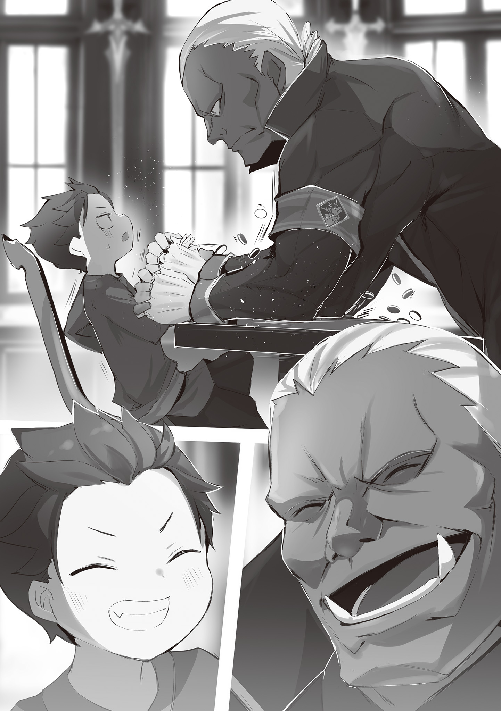
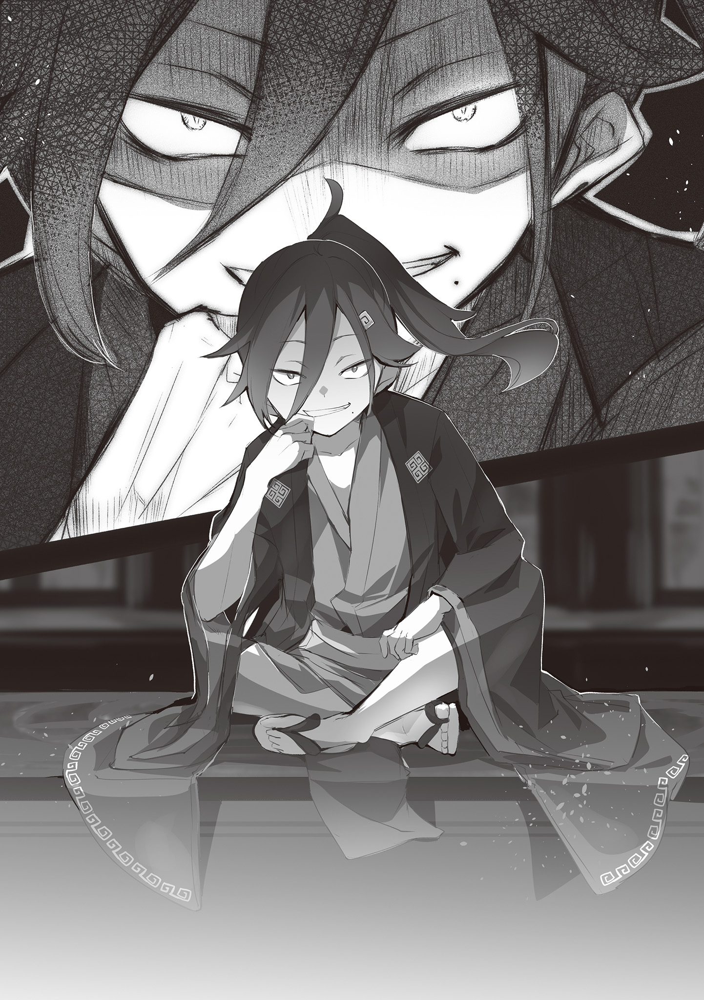
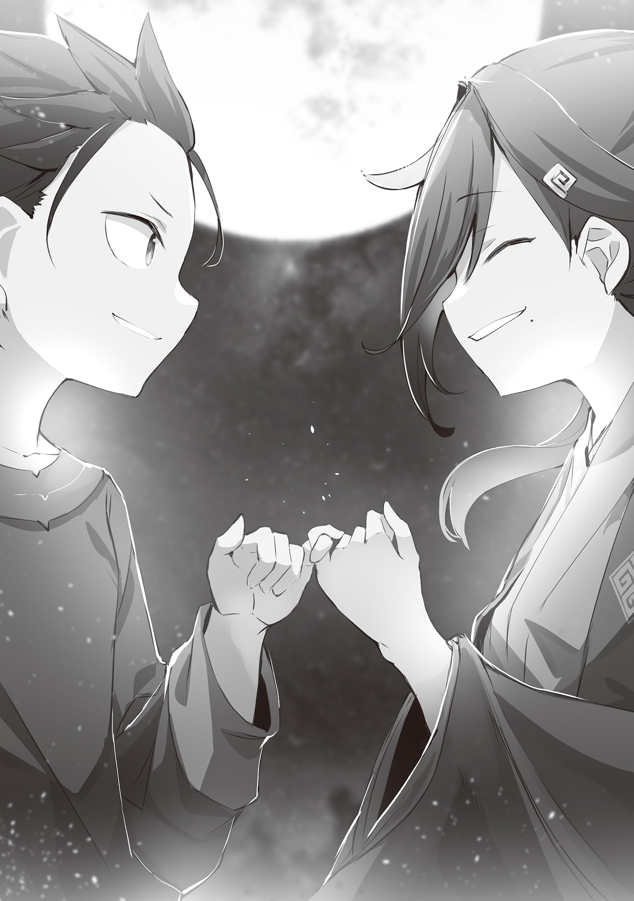

Это было настолько нелепое предложение, что его следовало отвергнуть без раздумий. Густав, занявший пост губернатора Острова Гладиаторов по прямому приказу Императора Волакии, Винсента Волакии, не имел ни единой причины соглашаться. Более того, он мог бы активировать «Правило Проклятия», чтобы доказать юноше, Нацуки Шварцу, всю ошибочность его безрассудного, даже скорее непостижимого, предложения.

Однако…

— Я буду играть чёрными, а вы, Густав, белыми, хорошо? Кажется, там было какое-то правило, что цвет определяет, кто ходит первым, но я его забыл, так что выбирайте, как вам удобнее.

— …В таком случае, я хожу вторым.

— Окей, тогда первый ход за мной.

Шварц, облизнув губы, хлопнул в ладоши, взял в руку чёрный камень он небрежно поставил свою чёрную фишку так, чтобы запереть белую. Та тут же перевернулась и стала чёрной.

— …

Густав взял в пальцы слишком маленький для его руки камень и задумался, куда его поставить. Почему он вообще согласился на предложение Шварца и вместо того, чтобы подавить этот нелепый бунт, всерьёз играет с ним в эту игру… то есть, в «Спарку»?

— Если вы не можете сосредоточиться, беспокоясь о стражниках, то не волнуйтесь.

— …На чём основана твоя уверенность?

— Мы не стали применять к ним силу, а просто подмешали им лекарство. Я попросил Старика Нулла приготовить его, а Кодоро и Кашу добавили его в еду, которой угощали стражников.

— …Похоже, сему чиновнику стоит пересмотреть порядки общения между стражей и гладиаторами. Благодарю за информацию.

Густав вздохнул, выслушивая эти сведения, преподнесённые как бы между делом, пока они обменивались ходами.

Он позволял гладиатору по прозвищу Старик Нулл определённую свободу для лечения других гладиаторов, но то, что то, что он приготовил такое снадобье, было для него неожиданностью. Тот факт, что стражники ели приготовленную гладиаторами пищу и были нейтрализованы, тоже нельзя было игнорировать. Придётся ещё раз напомнить им о важности их службы на острове.

Пока Густав размышлял об ужесточении дисциплины, Шварц продолжал:

— Старик Нулл признаёт ваши методы. Но он помог мне, потому что я пообещал вернуть его на родину. Он сказал, что хочет ещё раз увидеть один пейзаж перед смертью.

— …

— Ах да, Кашу и Кодоро раньше были поварами. Но бандиты, подосланные конкурентом разгромили их ресторан , и их поймали, когда они пытались отомстить.

— …

— Кстати, ключ от клеток с Зверодемонами украли Хиайн и его приятель Орсон. Ящеры могут ползать по стенам и сливаться с окружением. Это так круто! Из-за этого их часто несправедливо обвиняют в воровстве.

— …

— А эту доску для Реверси и камни сделал Джозроу. Знаете его? Тот, кого знали как волка одиночку. Теперь он уже «вернулся в стаю», но, оказывается, раньше он был каменотёсом.

— …

— Камни раскрасил Вайц. Он всё просил дать ему какое-нибудь дело, и я поручил ему это. Получилось гораздо лучше, чем я ожидал. А платок, в который всё завёрнуто, дал мне на удачу Идра, это его бандана.

— …

— И такие люди, Густав, в ваши методы не поверят.

К тому моменту, когда лишь половина доски была заполнена, голос Шварца стал горячее. На доске, казалось, преобладал белый цвет Густава. Но в этой игре, Реверси, ситуация могла перевернуться в один миг, так что расслабляться было нельзя. С того самого момента, как Густав позволил втянуть себя в этот поединок, он, вполне возможно, уже попал в ловушку этого юноши.

— …

Шварц смотрел не на доску, а прямо на Густава. Неудивительно, что многие гладиаторы, пленённые искренним, лишённым всякого расчёта в его чёрных глазах, меняли своё мнение. Особенно, если он и вправду был незаконнорождённым сыном Императора.

Слухи о том, что Шварц — это тот самый «черноволосый наследник», будоражащий сейчас умы многих, разумеется, дошли и до губернатора острова. Любой, кто видел его в деле, понимал, что Шварц — не просто ребёнок, каким казался на вид. А люди всегда ищут причину.

И Густав не был исключением. Он не знал, правда это или нет, но если слухи окажутся правдой, ему придётся отнять жизнь у сына Императора, которому он был стольким обязан. Этого он хотел бы избежать.

— Но это мои причины, а не твои, Шварц. Я не понимаю, почему ты, ставя себя в заведомо невыгодное положение, пытаешься говорить со мной на равных.

Если твоя главная цель — покинуть остров, то логичнее всего было бы, отбросив принципы, заручиться поддержкой Сесилуса, сломить «Правило Проклятия» и без лишних хлопот убраться отсюда. Но Шварц так не поступил, а вместо этого выбрал тернистый путь, на котором победа казалась невозможной.

— Всё-таки, мне трудно тебя понять.

— Господин Густав?

— Шварц, ты так спокойно говоришь о том, что у гладиаторов есть и другие таланты, кроме сражений, но при этом собираешься втянуть их в гражданскую войну. Это противоречие. Ты также не воспользовался возможностью обмануть меня насчёт «Чрезвычайного положения», зная, что я никогда не посмею ослушаться приказа Его Превосходительства. Это тоже нельзя назвать мудрым решением.

Если ты не хочешь ничьей смерти, то разве не стоит втягивать гладиаторов в войну. Если ты хочешь подчинить себе Густава, то не стоило упускать такую прекрасную возможность. То же самое касается и этой игры, где они отвоёвывали друг у друга территорию чёрными и белыми камнями.

— Даже если ты победишь меня в этой «Спарке», нет никакой гарантии, что я сдержу обещание. Как ты знаешь, сей чиновник не воин империи и он не гордится своими боевыми навыками.

— Я знаю. Но вы кое-что неправильно поняли, Господин Густав. Я не собираюсь побеждать вас в этой «Спарке».

— …Что?

Шварц со стуком поставил чёрный камень, и белые фишки на доске перевернулись. Прокладывая себе путь к победе, он, тем не менее, сказал, что не собирается выигрывать этот поединок. И в словах, и в действиях сквозило противоречие. Пока Густав в недоумении пытался осмыслить этот хаос, Шварц, подкидывая свой камень, широко улыбнулся.

— Звучит как загадка, но это не она. Когда говоришь «столкновение», на ум сразу приходят победа и поражение, но ведь есть и другие исходы, верно?

— …

— Мой идеал — победить в «Спарке», а затем вместе с гладиаторами и вами, Господин Густав, вломиться в столицу и надавать по шее Императору.

— Для этого тебе придётся меня победить. А это противоречит твоим словам о том, что ты не собираешься этого делать.

— Победа и поражение в Реверси — это одно. Но «Спарка» — это столкновение и сравнение убеждений. А в таком поединке может быть и ничья, когда обе стороны признают правоту друг друга.

Густав поставил белый камень, перевернув чёрные. Шварц, уступив ему ход в игре, где четыре руки многорукой расы не давали никакого преимущества, подмигнул ему. И спросил:

— А каков ваш идеальный исход, Господин Густав?

— …Исполнить приказ Его Превосходительства и выполнить свой долг губернатора Острова Гладиаторов.

— А для этого нужно готовить тело и дух гладиаторов на случай «Чрезвычайного положения»… верно?

— Верно. Мы уже неоднократно выяснили это в ходе этого разговора…

— …Тогда когда, по-вашему, наступит это «Чрезвычайное положение»?

Как ни в чём не бывало, Шварц задал этот вопрос и с громким стуком поставил камень на доску. Этот стук ударил по барабанным перепонкам, а вопрос — прямо в сердце, и Густав наконец-то понял то, что так долго его мучило.

Шварц чётко вбил ему в голову замысел Императора. Его назначили губернатором, чтобы проверить, способен ли Густав не только подчиняться приказам, но и самостоятельно искать наилучшее решение. Если в этом и заключалась истинная воля Императора Винсента Волакии, то Густаву было даровано право. Право по своему усмотрению толковать приказ Императора, судить и принимать решения.

— …

Вопрос остался тем же, но теперь отвечающий сменился. В предыдущем разговоре Шварц упустил возможность заполучить Густава в свои ряды. Но теперь роли поменялись, и выбор был за Густавом. Теперь только он мог решить, настало ли то самое «Чрезвычайное положение», о котором говорил Император. И, словно подталкивая его, Шварц добавил ещё кое-что:

— Господин Густав, можете ли вы спокойно отсиживаться на острове, когда тот, кому вы обязаны жизнью, в опасности?

— Шварц!..

— Лицо и голос у вас страшные, но пока вы не пытаетесь убить меня «Правилом Проклятия», мне не страшно.

Густав опёрся двумя верхними руками о стол и, нависнув над доской и Шварцем, впился в него взглядом. Но юноша, смотревший на него снизу вверх, ничуть не испугался.

Необычайная смелость и пронзительный взгляд, видящий, казалось, насквозь, до самой души, — всё это напоминало того человека, что в далёком прошлом смотрел на умирающего Густава Морелло с высока.

В тот день этот человек с чёрными глазами признал и принял его таким, какой он есть. Густав был благодарен ему и за спасение поселения, и за дарованный статус. Но истинную преданность он питал к тому спасению, что он обрёл в тот миг.

Если бы тот Император приказал ему ждать на Острове Гладиаторов, куда не дойдут даже отголоски столичной смуты, до наступления «Чрезвычайного положения», он бы подчинился.

Однако…

— Если «Чрезвычайное положение» настало, сей чиновник должен немедля отправиться к Его Превосходительству

— И повести за собой гладиаторов, чьи тела и дух вы так усердно готовили, верно?

— Но, Шварц, ты… твоё положение… оно ведь связано с Его Превосходительством Императором…

Если Шварц и вправду был тем, кем его называли слухи, — «черноволосым наследником», незаконнорождённым сыном Императора, — то его целью должно было быть узурпация трона, предательство того самого Императора, которому Густав был стольким обязан. А раз так, не будет ли ошибкой пойти на поводу у Шварца? Не станет ли это той самой ошибкой, которую уже нельзя будет исправить?

— То, что я пришёл сюда, и есть ответ.

Внезапно раздался тихий голос Шварца, прервавший глубокие размышления Густава. Оставаясь в тени массивной фигуры губернатора, Шварц сжал ладонь у себя на груди и встретил его острый взгляд.

— Я не могу предоставить доказательств. У меня ничего нет. Всё, что я могу предложить, — это мои истинные, чистые чувства.

— Что ты…

— Отправимся вместе в столицу, чтобы защитить империю Волакия.

— …

— Если ты мне поможешь, я клянусь, никто и никогда не назовёт тебя человеком, что пошёл против Императора.

Это были простые, прямые слова, лишённые всяких уловок, — лишь призыв. Будь на его месте Авель, он бы использовал множество ухищрений, чтобы лишить Густава выбора, подвести его к нужному решению и подчинить его волю, оставив лишь чувство поражения. На мгновение Густаву показалось, что он видит отголоски этого мастерства и в Шварце, но…

— …Это мой последний камень. Похоже, игра окончена?

— …Ага, на этом в Реверси всё.

На доске, где с середины партии преобладали белые фишки, преимущество так и не перешло к противнику. Последний ход окрасил почти всю поверхность в белый цвет. Несмотря на то, что Шварц сам предложил эту игру и так уверенно принёс её, он потерпел сокрушительное поражение.

— Ты принёс игру, в которой не рассчитывал победить?

— В Реверси я играю неплохо, но… честно говоря, сейчас решалось, смогу ли я убедить вас, Господин Густав, так что я совсем не мог сосредоточиться на доске.

— …Но для тебя, Шварц, настоящая битва разворачивалась не здесь, так?

По правилам игры, это была безоговорочная победа Густава. Если бы они следовали условиям «Спарки», Шварц и его люди должны были бы отступить, и на Острове Гладиаторов воцарился бы прежний порядок, установленный Густавом.

Однако…

— …Сделать и себя, и меня победителями «Спарки», значит?

Если это не битва на смерть, а столкновение убеждений, то возможен исход, в котором никто не проиграет. Да, в словах Шварца определённо был смысл

— Господин Густав, мы проиграли в Реверси, так что мы расходимся. А вы что будете делать? — в его тоне ясно читалось, что исход игры на доске был для него вторичен; его настоящая битва была здесь и сейчас.

Предложив Густаву новые условия победы, заставив его осознать их и изрядно помучиться сомнениями, Шварц в этой финальной схватке выложил на стол все свои карты.

— …

Густав на миг прикрыл глаза, глубоко вздохнул и положил конец своим долгим, мучительным терзаниям. Терзаниям, что преследовали его с того самого дня, как он вступил в должность губернатора этого острова.

— Я хочу кое-что сказать тебе, Шварц.

— Да?

— Я не раз упускал возможность применить «Правило Проклятия» из-за соображений, связанных с твоим положением. Но этот мой выбор… он ни в коем случае не является уступкой тебе. Не в «Чрезвычайное положение».

Сказав это, Густав убрал скрещённые верхние руки со стола, расцепил нижние и… всеми четырьмя руками пожал протянутую ему руку юноши.

— Честно говоря, я до смерти не хотел выяснять, не делаете ли вы мне поблажек из-за моего происхождения. Было бы очень неприятно осознавать, что меня спасают благодаря моему паршивому папаше.

Искреннее отвращение, с которым юноша произнёс эти слова, убедило Густава Морелло в том, что его собственные принципы как губернатора не были ущемлены. И он, вопреки своей обычной сдержанности, рассмеялся вслух.

— Вы уж не держите на меня зла, Босс.

Сидя со скрещёнными ногами на столе, юноша с темно-синими волосами подпёр щеку рукой и беззаботно улыбнулся. Его улыбка была до тошноты привычной, поэтому Субару сразу понял: он не шутит.

И это было естественно. Люди склонны приукрашивать свои слова, если за ними стоит какая-то праведная цель. Так они хоть немного повышают свои шансы на успех, если же в подобных ухищрениях нет необходимости — ведь ты можешь добиться желаемого одной лишь силой — то и думать о красноречии незачем.

Именно таким был Сесилус Сегмунт, юноша с неизменной улыбкой на лице.

— Сеси…

— Ваш голос портит всё зрелище. Я, конечно, попросил не злиться, но если гнев сделает вас более выразительным, то, пожалуйста, не сдерживайтесь. Для меня главное, чтобы представление было что надо.

Хоть они и называли друг друга по прозвищам — Босс и Сеси, — атмосфера между ними не становилась теплее. Обычно, если люди так по-дружески общаются, они делают друг другу поблажки, но от Сесилуса ожидать подобного не приходилось. Ведь пропасть между ним и Субару была не просто душевной — это была пропасть в самом образе жизни.

Дракон и тигр никогда не поймут друг друга… нет, учитывая и разницу в скорости, уместнее было бы сказать — кролик и черепаха. Как бы то ни было, существам, настолько разным по своей природе, трудно найти общий язык.

— Господин Сегмунт, вы в своём уме?

Танза, девушка в кимоно, с оленьими рожками на голове, смотрела на Сесилуса своими тёмно-фиолетовыми глазами, полными тревоги. Поймав её взгляд, он лишь шутливо вскинул бровь.

— Что за бессмысленный вопрос, госпожа Танза. Разве вам дано отличить, по какой стороне тропы здравомыслия я иду? Как вы собираетесь сравнивать мой мир с тем, что вы считаете нормальным?

— Господин Шварц, похоже, он в своём уме.

— Да, скорее всего.

Танза с горечью в голосе отреагировала на витиеватую речь Сесилуса, ведь говорил он по будто сценарию.

Субару в ответ лишь пожал плечами, изо всех сил стараясь сохранить невозмутимое лицо. Иначе его выдал бы холодный пот, которым промокла вся спина.

И если бы Сесилус это заметил, никто бы не знал, что он выкинет в следующий миг. Он и так был «проблемным ребёнком», но если он будет и дальше вести себя так, как ему вздумается, это может стать серьёзной проблемой…

«Чёрт…»

Он был уверен, что знает, с кем имеет дело, но понял, что это было лишь заблуждением. И что теперь?

— Ну-с, интересно, сработает ли «Наблюдение» Босса против моих прихотей? — с улыбкой, обнажившей белые зубы, Сесилус бросил издевательскую фразу, словно читая его мысли.

Тут Сесилус использует ”物見”(monomi) — слово, которое буквально означает «наблюдение», «дозорный» или «разведчик», но в данном контексте оно используется скорее в смысле сбора информации.

И эта фраза, сказанная на полном серьёзе, била в самое уязвимое место, — «Посмертное возвращение» Субару. Но хуже всего было то, что Сесилус, скорее всего, делал это инстинктивно — в этом и заключалась его самая опасная черта.

Стиснув зубы от осознания опасности, но понимая, что это почти наверняка бесполезно, Субару закричал:

— Почему… почему ты предал меня, Сеси?!

Действие переносится на несколько дней назад, до той самой злополучной стычки.

— Бесполезно! Мы всё обыскали, тут ничего нет!

— Оружейная и склад с провизией пусты! В воду подмешали пепел! Такое пить нельзя!

— Они даже любезно прикончили тягловых быков… Какие же мрази!

Доклады, полные растерянности, скорби и негодования, сыпались один за другим. Субару, ждавший новостей после захвата крепости с нетерпением и восторгом, мог лишь с горечью слушать. Вся вылазка оказалась напрасной.

— Черт побери! Этот ублюдок… он добился своего!

Столкнувшись со столь точным и злонамеренным саботажем, Субару сразу понял, чьих это рук дело. Без сомнения, это устроил его злейший враг — Тодд Фанг.

В «прошлый раз» Тодд, прибыв на Остров Гладиаторов в качестве посланника из столицы, устроил там чудовищную резню, истребив всех его жителей. Чтобы предотвратить этот кошмар, Субару начал всё заново.

На этот раз ему удалось склонить на свою сторону всех гладиаторов и даже Густава, губернатора острова.

Таким образом, он успешно предотвратил высадку Тодда. Это была безоговорочная победа, и Субару вместе с шестью сотнями своих товарищей-гладиаторов пребывал в эйфории.

Чувствуя себя непобедимыми, они покинули остров и отправились в сторону имперской столицы. Первым же препятствием на их пути стала сторожевая крепость на противоположном берегу.

Это был небольшой форт, где постоянно находилось не более двадцати человек. Его основной задачей было управление подъёмным мостом, который соединял остров с материком, и досмотр повозок. Как уже упоминалось, Субару привёл с собой шестьсот гладиаторов. Силы были несопоставимы.

— Но я все равно обалдел, когда Сеси, пока мы там на выходе с острова копошились, в одиночку взял крепость и сжег их флаг…

— Ах, просто как-то уже накипело от всей этой тягомотины, вот я и не сдержался. Хотя захват крепости — это не то, чем стоит гордиться. В какой-нибудь книге о моём подвиге упомянули бы в паре строк между главами.

— …Да, пожалуй, этот эпизод не войдет в летопись твоих чудовищных деяний.

Пока Субару бормотал это себе под нос, Сесилус, нёсший на плече пустой флагшток с обгоревшими остатками знамени, лишь усмехнулся. Его беззаботность говорила о том, что он совершенно не разделяет всеобщего беспокойства.

А беспокойство это было вызвано вот чем:

— Как и докладывали господин Хиайн и остальные, крепость оставили основательно подготовленной к нашему приходу. В итоге мы не смогли добыть ни воды, ни еды.

— Чем оставлять врагу, лучше сжечь или выбросить, да? Сбежали, поджав хвост, но не забыли напоследок провернуть такую гнусную пакость…

Выслушав краткий отчет Танзы, Субару со всей силы пнул подвернувшийся под ногу деревянный ящик. Пальцы пронзила острая боль. И во всем этом был виноват тот парень с ярко-оранжевыми волосами.

— Господин Шварц, вы полагаете, что это дело рук того самого рядового первого класса, о котором вы говорили?

— Не сомневаюсь. Он как раз из тех, кто знает, как доставить тебе неприятности. Но чтобы додуматься насыпать пепла в колодцы… это уже перебор.

Субару простонал, приложив руку ко лбу, а Танза не знала, как его утешить. Хоть она и знала о его планах больше других, ей было трудно до конца осознать всю опасность, коварство и ужас, которые таил в себе Тодд, не столкнувшись с ним лично.

Впрочем, Субару и не хотел, чтобы она это понимала. Пусть он один будет тем, кто знает об угрозе со стороны этого жуткого и непредсказуемого противника. По крайней мере, по тому, как тщательно враг подготовил свое отступление, она уже могла судить о его коварстве.

— В такие моменты особенно остро понимаешь, как полезна была бы магия. Если бы мы могли создавать воду или лёд, мы бы справились и с голодом, и с жаждой…

— С жаждой — возможно, но как лёд поможет от голода?

— Можно набить желудок льдом, чтобы приглушить голод, или, например, сделать ледяную стружку. Возможности магии безграничны!

— Что-то это не похоже на безграничное применение…

Танза склонила голову набок, явно не впечатлившись. Возможно, магия была ей не слишком знакома, или же примеры Субару оказались неубедительными. Он бы с радостью бросился восстанавливать доброе имя магии, но сейчас были дела поважнее, чем статус магии, у которой всё равно не так уж и много пользователей в Империи.

А именно…

— Благодаря Сегмунту, потерь среди наших нет. Но это не повод сидеть сложа руки. Без пополнения припасов мы все рано или поздно погибнем от истощения.

— Угх…

— Сколько ни воодушевляй других громкими речами, если за ними не стоят реальные дела, уважения ты не добьешься. И твой юный возраст, как бы сурово это ни звучало, не может служить оправданием неверным решениям.

Суровый голос указал на его недальновидность, и Субару не нашел что ответить. Перед ним, скрестив свои дородные руки, стоял Густав с лицом, напоминающим демона. Его беспощадные слова были вполне ожидаемы, учитывая его положение.

— Я понимаю. Нельзя спотыкаться на самом старте. Особенно после того, как вы, господин Густав, предали «его превосходительство» и пошли с нами!…

— …Такое заявление и формулировка, должен заметить, несколько оскорбительны для сего чиновника.

Густав глубоко вздохнул, произнося это, что было ещё довольно мягкой реакцией. Будучи губернатором Острова Гладиаторов, он и его стражники помогли Субару и шестистам гладиаторам совершить побег. Это было важное решение, способное разрушить всю его карьеру, а в случае провала, скорее всего, привело бы к казни.

Субару убедил Густава, что игра стоит того, заставив его поставить на кон всё, что тот строил годами. А значит, теперь Субару нёс ответственность за жизнь Густава. Впрочем, нет. Не только за Густава, но и за всех, кто решил пойти за ним.

— Я их собрал, я их и поведу. Это и есть «Братство Плеяд».

— Название меня не слишком волнует, но я искренне надеюсь, что ты справишься со своими обязанностями. Если же нет…

— Если нет?

— Сему чиновнику придётся незамедлительно вернуться к своим прямым обязанностям.

— …То есть, вы всех насильно вернёте на остров?

— Если не будет иного выбора. Однако…

— Эй, ты! Да ты много на себя берёшь, я посмотрю!

— Эээ, ты чего?!

На робкий вопрос Субару Густав дал безжалостный ответ, и тут же в разговор вклинился кто-то ещё, поразив Субару своим напором.

Это был Хиайн, один из его товарищей по «паре». Пронзительным голосом он набросился на Густава, сверля его своими маленькими глазками.

— Если бы не братан, тот посланник мог бы устроить на острове резню! И после этого у тебя хватает наглости тут вякать, неблагодарная ты скотина!

— Я не высказывал недовольства, Ятс. К тому же, информация о намерениях посланника основана исключительно на словах Шварца. Чтобы судить справедливо, необходимо выслушать и другую сторону.

— Какая к чёрту справедливость! Братан — наш союзник! Его враг — наш враг! Вот и всё, что нужно знать!

— Стой-стой, это слишком грубо!

Видимо, предыдущий разговор Субару и Густава сильно задел Хиайна, и его голос срывался от ярости. Однако его логика была абсурдной, так что, хоть Субару и был благодарен за поддержку, ему пришлось вмешаться.

— Не надо так кипятиться! Господин Густав просто не даёт мне расслабиться.

— Позвольте спросить, что именно вы считаете неуместным?

— Просто постойте и посверлите меня своим страшным взглядом, не усложняйте!

Пытаясь утихомирить Хиайна, Субару сам попал под удар Густава. На его просьбу тот лишь хмыкнул и замолчал, но пыл Хиайна не угас.

— Нечего перед ним лебезить, братан! «Правило Проклятия» уже снято. Сколько бы этот губернатор из себя ни строил, на нашей стороне численное превосходство!

— Какое же это отвратительно трусливое заявление!

Хиайн, несмотря на свою трусость и слабость в бою, знал, как оседлать попутный ветер. Его умение примкнуть к победителям вызывало восхищение, но в одном он крупно просчитался.

— Напомню, «Инструмент Проклятия» всё ещё у Густава. Так что твоя мысль, будто мы можем делать что-то безнаказанно, ошибочна.

— Ладно! На сегодня я тебя прощаю!

— Просто образцово-показательное малодушие!

Хиайн, обладающий способностью к мимикрии, в буквальном смысле позеленел от страха. Бросив эту фразу, он тут же спрятался за спину Субару.

— Шварц, я не хочу говорить ничего плохого о твоем «братане», но…

— Я понимаю. Я поговорю с Хиайном позже.

— Было бы неплохо. Сей чиновник не заинтересован в бессмысленных конфликтах.

Последнее было чистой правдой, но и его предыдущее предупреждение — тоже. Густав умел чётко разделять реальные задачи и личные симпатии. Просто их поединок, так называемая «Спарка», на Острове Гладиаторов немного затуманил его суждения. Если он увидит необходимость, то сможет в любой момент изменить своё решение. И обязанностью Субару было сделать так, чтобы он этого не сделал.

Так или иначе…

— Шутки в сторону. Господин Шварц, вы ведь понимаете…

— …Ты про еду и воду?

Танза понизила голос и, услышав Субару, нахмурила свои круглые брови и кивнула. Их отряд насчитывал более шестисот человек. Это больше, чем в небольшой школе, и почти все — взрослые. К тому же, у стражников были с собой Зверодемоны. Так что продовольствия одной «школьной столовой» им бы точно не хватило.

Разумеется, во время побега они вынесли все запасы с острова. Но даже при двухразовом питании этих запасов не хватило бы и на два дня. Они надеялись найти хоть какие-то припасы в захваченной крепости, но Тодд разрушил и эти надежды. Ненавистный ублюдок.

— Мы на западной окраине империи, а столица — далеко на востоке. Нам катастрофически не хватит ни еды, ни воды.

— Не хочу, чтобы кто-то голодал.

— Дело не только в этом, это порождает тревогу. …Голод истощает не только тело, но и душу.

В голосе Танзы звучала неподдельная, тяжёлая тоска. Такое не придумаешь, такое надо пережить. Танза знала, каково это. Она либо сама голодала до истощения души, либо видела, как голодают другие. Субару не мог отмахнуться от её страхов, назвав их преувеличением.

Даже на Острове Гладиаторов, где жизнь постоянно висела на волоске, еда и кров были гарантированы. Именно это доказывало: в суровых условиях они абсолютно необходимы для поддержания порядка. Если их лишиться, «братство» ждёт неминуемый распад.

— Проблемы с припасами, неизбежные для такого большого количества людей… Какая же приземлённая, но от этого не менее сложная задача свалилась на нас с самого начала.

— Легко тебе говорить, как будто тебя это не касается! Твой непомерный аппетит — тоже огромная нагрузка на наши запасы!

— Ха-ха, что бы вы ни говорили, я не собираюсь ни в чём себе отказывать. Меня не интересуют ни бытовые, ни финансовые дела компании. Звезда сцены обязана получать достойную плату за свою роль!

Сесилус весело рассмеялся, постукивая флагштоком по земле. Несмотря на свою хрупкую комплекцию, он был невероятно прожорлив. Даже на Острове Гладиаторов, где о роскоши не могло быть и речи, он умудрялся питаться настолько сытно, что даже поправлялся.

При своём телосложении он с лёгкостью уплетал порцию, которой хватило бы троим взрослым. В то время как другие гладиаторы довольствовались двухразовым питанием, он ел три, а то и четыре раза в день. Судя по его заявлению, он и не думал сдерживать свой нечеловеческий аппетит.

— Может, попросить Густава наложить на Сеси проклятие, чтобы тот не ел не более двух раз в день?

— О-хо-хо, Босс. Не слишком ли вы меня недооцениваете? Даже если меня проклянут смертью после третьей трапезы, я всё равно потянусь за хлебом, как только живот заурчит. Звезде сцены важно поддерживать цветущий и здоровый вид!

— А на господина Сегмунта вообще подействует проклятие? Может, он и от него убежит?

— Умрёт, это я гарантирую.

— Не знаю, почему вы это гарантируете, но раз Босс говорит, значит, умрёт!

Бессмысленными были угрозы, которые никто и не собирался приводить в исполнение. Сесилус оставался безразличен даже к разговорам о собственной смерти. Субару и сам видел, как тот погиб от «Правила Проклятия», но даже в тот момент Сесилус вёл себя так спокойно, будто и не умирал вовсе. Так что это не было бравадой.

— Как бы то ни было, меня бесит, что мы должны плясать под дудку этого голодного обжоры. Сейчас не время следовать поговорке «на голодный желудок особо не повоюешь». Густав, где ближайшая крепость?

— В полудне пути на восток. Она значительно крупнее этой.

— Отлично, туда и направимся!

«Конечно, приятно быть лидером. Но и ответственность огромная».

Субару и раньше доводилось на короткое время возглавлять группы людей в другом мире, но у него никогда не было опыта долгосрочного руководства столь большим отрядом. Только став лидером, он по-настоящему осознал… всю тяжесть этой ноши.

«И почему Авель хочет вернуться на трон? Не понимаю».

Субару, который едва справлялся с руководством бывшими гладиаторами с острова, с отвращением подумал о ненавистном лице человека, стремящегося править чем-то гораздо большим, и мрачно пробормотал это себе под нос.

Потратив полдня на дорогу на восток, Субару и остальные гладиаторы наконец-то нашли крепость, о которой говорил Густав.

В отличие от небольшой крепости, служившей для надзора за Островом Гладиаторов, эта оказалась куда более внушительной. Окружённая высокими каменными стенами, она напоминала скорее заставу, а её вид вселял большие надежды на богатое содержимое.

Однако…

— Кладовая пуста! Ничего, кроме пыли!

— Что ещё… Говоришь, в колодец налили помоев?

— Да сколько можно издеваться… Ублюдки!

Как и следовало из горестных докладов, их надежды снова были разбиты вдребезги.

Кладовые оказались пусты, а единственный колодец — осквернён. Крепость, из которой увели всех тягловых быков и даже земных драконов, была покинута задолго до их прихода.

Но мало того…

— Едва я открыл дверь склада, как сработала ловушка с мана-камнем…

— Ну-с, не окажись я первым, кто туда сунулся, тут полегло бы немало народу. К счастью, моей скорости хватило, чтобы убежать от взрыва, — легкомысленно заметил Сесилус.

— Хорошо, что ты у нас монстр, способный убежать от взрыва.

— Нельзя ли хотя бы «чудовище»? Хотя… давайте сойдёмся на «красивом чудовище», что скажете?

— Так может, господин Сесилус способен и от проклятия убежать? — с изумлением прошептала Танза, глядя на разрушенную часть крепости.

Взрыв был такой силы, что каменная кладка пошатнулась, а пламя, должно быть, было видно издалека. Если бы не звериный аппетит Сесилуса от попавшего в ловушку не осталось бы и следа. Видимых жертв не было, но и отсутствие припасов само по себе было мощным ударом.

И заброшенная крепость, и ловушка — всё указывало на Тодда

— Не мог же он, в конце концов, оставить так все крепости… — пробормотал Субару.

Поскольку было неизвестно, насколько далеко простираются его руки, они не могли себе позволить опрометчивых решений. Тодд, с которым они ещё даже не встретились лицом к лицу, раз за разом наносил удары по самым уязвимым местам.

— Остаться здесь ни с чем — это полный провал.

Последние полдня они гнали себя из последних сил, рассчитывая пополнить запасы в этой крепости.

Чтобы отвлечься от медленно нарастающего беспокойства, они шли, напевая и пританцовывая, из-за чего потребление воды и пищи было выше обычного. Если так пойдёт и дальше, их братство может распасться, как и опасалась Танза, из-за истощения духа.

— Шварц, не переживай так… — произнёс Вайц, положив руку на плечо погрузившегося в размышления Субару.

Он, кто и в прошлый, и в этот раз усердно осматривал крепость, больше других расстроился, что ничего не нашел. Но, должно быть, он не мог смотреть на поникшее лицо Субару. Вайц провёл рукой по татуировке черепа на своём лице.

— Ты не тот, кто сдастся из-за таких грязных трюков…

— Вайц…

— Пускай эти крикуны едят землю… А если им не хватит, у нас ведь столько народу… Мы можем напасть на какую-нибудь деревню или город и пограбить…

— Вайц?!

— Что?…

— Всмысле «что»?! Так нельзя!

— …?

— Никаких грабежей, краж и разбоя! Ничего подобного! Категорически запрещено!

— Чего?… — на лице Вайца отразилось непонимание.

Видя, как Вайц так естественно выбирает грабёж, Субару осознал разницу между их мирами, и это касалось не только Вайца. Услышав спор Субару и Вайца, остальные гладиаторы в растерянности переглянулись.

— Ты в своём уме, Шварц? Какие ещё «без грабежей»?

— А как ещё добыть еду? Она что, из земли растёт?

— Может, и растёт, но мы не знаем, как её выращивать!

Субару опешил, слушая, как гладиаторы наперебой выкрикивают свои дикие идеи. Судя по их серьёзным лицам, это была отнюдь не шутка. Что и говорить, элита преступного мира, собранная со всей Империи Волакия.

— Эй, стойте! Подождите! Все, послушайте меня! — воззвал Субару, пытаясь донести свою мысль до разгорячённых гладиаторов.

Но остановить их было непросто. Вероятно, как только продовольственная ситуация серьёзно ухудшилась, у них уже неосознанно возникал вариант с грабежом. И когда Субару запретил этот вариант, плотину прорвало.

— «Всё, что хочешь, возьми силой»… Таков закон Империи… И ты, и мы — все мы завоевали свободу силой… — сказал Вайц, словно пытаясь образумить Субару.

— Нет, это не так. Да, мы сражались. Но это всегда было ради победы, а не чтобы грабить кого-то.

— Это одно и то же!

— Вовсе нет!

Субару, глядя ему прямо в лицо, продолжил:

— «Победить» и «грабить» — это может похожие понятия, но не одинаковые. Я готов сражаться ради победы, но не чтобы грабить.

— Шварц…

Когда спор накалился до предела, в него вмешался Идра, подняв руку.

— Как именно ты проводишь различие? Ни я, ни остальные этого не понимают.

— Нет, это не так уж и сложно. Я уверен, что все вы знаете разницу, — ответил Субару и одним прыжком вскочил на ближайший деревянный ящик.

Оказавшись выше остальных, он обвёл толпу взглядом, глубоко вздохнул и крикнул так, чтобы его услышали все, кто покинул с ним остров:

— Слушайте все! На пути в столицу мы не будем грабить ни деревни, ни города! Это закон нашего братства!

— …

— Мы здесь, чтобы побеждать! Но мы не будем ничего отнимать силой. Наша цель — не грабёж. Запомните это!

После его слов на мгновение воцарилось молчание, а затем толпа взорвалась криками. Шум стал ещё сильнее, но в нём было больше растерянности, чем протеста. Для них, чьи жизни были пропитаны духом Империи, сама мысль «не отбирать» попросту не укладывалась в голове.

— Твоя позиция ясна. Но можно ли назвать её реалистичной? — раздался из толпы чёткий голос Густава.

— Господин Густав…

— Грабежи сей чиновник не поощряет. Однако, если эта «экспедиция» закончится неудачей, я исполню свой долг.

— Ах ты… он таки собирается нас предать… — прошипел Хиайн.

— Хиайн, замолчи, — остановил его Субару. — Вы знаете, я на многое пошёл, чтобы собрать всех вас. А раз так, я сделаю всё, чтобы добиться успеха. Конечно, я понимаю, пустыми разговорами сыт не будешь и жажду не утолишь.

— Значит, у тебя есть какой-то альтернативный план?

— Ну…

Субару на мгновение задумался, понимая всю важность ответа. Одно неверное слово — и это братство распадётся, не успев даже вступить в бой, а их всех вернут обратно на остров. Ему совсем не хотелось бросать на ветер всё, чего они добились.

— Мне кажется, вы немного неверно поняли нашего Босса, господин Густав, — раздался вдруг беззаботный голос Сесилуса.

Юноша приковал к себе все взгляды. Наслаждаясь всеобщим вниманием, он с улыбкой продолжил:

— Босс ведь не капризничает, не желая брать еду и воду без честного обмена. Его различие между «победить» и «отобрать» — это, конечно, игра слов, которая, похоже, только всех запутала.

— Сесилус, говори понятнее.

— Раз Босс расстроился, найдя крепость пустой, значит, отнять припасы у врагов для него не проблема. Так что, вся загвоздка в том, кто враг. Вы же не станете отнимать добычу у собаки или кролика, а вот у волка — почему бы и нет?

— …

— Я прав, Босс? — спросил Сесилус, склонив голову.

Теперь все взгляды вновь устремились на Субару, и он нехотя кивнул. В целом, Сесилус был прав.

Вот только…

— Но даже если противник — волк, я хотел бы называть это «победой».

— Ха-ха, принципы — это хорошо. Без них любой замысел превращается в бессмысленный и пустой фарс. Однако…

— …?

— Попытки выделиться одной лишь эксцентричностью зачастую оборачиваются полным провалом. Как и вы, господин Густав, я тоже этого не хотел бы, — слова Сесилуса, прищурившего один глаз, обладали остротой стекла — тонкого и хрупкого, но режущего. Этот выпад больно ударил и по Субару.

Многие из гладиаторов, услышав этот разговор, так ничего и не поняли.

— На вражескую крепость — это понятно, но почему нельзя нападать на деревни и города?

— Да что этот Шварц вообще задумал?

— Если хочешь завалить Императора… то бишь, нашего батю… сейчас не время голодать! — вновь закричали они.

К досаде Субару, хоть они и пытались его поддержать, их забота шла вразрез с его собственными идеалами. Ему совсем не хотелось заставлять их замолчать и силой навязывать свою волю, оставляя эту пропасть в мировоззрении нетронутой. Но как же донести до них свою мысль?

— «Спарка».

— А?…

— Я хотела сказать, что если вы объясните это как «Спарку», то, думаю, все поймут, — промелькнул проблеск надежды для растерявшегося Субару, когда он услышал стоявшую рядом Танзу.

В отличие от Сесилуса, чей нетривиальный склад ума позволил ухватить суть утверждений Субару, Танза, обладавшая куда более обычным мировосприятием, всё же прониклась его идеей. Иначе как ещё объяснить её предложение, которое казалось единственно верным? От этой мысли у Субару потеплело на душе.

— Господин Шварц?

— А, нет, прости, я тут немного прослезился… Ребята! Танза нашла идеальное слово! Танза! Эта милашка! Она всё так просто объяснила!

— П-перестаньте! Мы отвлеклись от темы!

— Ай, больно, больно же! Не щипай меня!

Попытка Субару поделиться своей радостью со всеми была пресечена покрасневшей Танзой, которая больно ущипнула его за бедро. Теперь уже от боли, а не от умиления, он со слезами на глазах продолжил:

— Мы гладиаторы! Наше дело — «Спарка», а не грабёж беззащитных! В этом и заключается суть битвы!

— …

— Понимаю, вы недовольны, но когда придёт время столкнуться в столице с моим отцом… то есть, с Императором Волакии… я не смогу его победить, если останусь жалким, трусливым и эгоистичным слабаком.

Возможно, дело было не в доводах логики, а в чём-то духовном — а вернее, в силе духа.

Столкновение с Императором Волакии… по крайней мере, Субару всерьёз намеревался бросить вызов самозванцу. Он не знал, с какой целью этот лжеимператор сверг Авеля с престола, но он не думал, что на такое способен обычный трус, лишённый твёрдых убеждений.

А это означало, что в столице его ждёт битва с могучим противником, обладающим сильной верой — настоящая «Спарка». И в ней Субару, предавший самого себя, не имел бы ни единого шанса.

Это было необходимо для победы — непоколебимая вера Нацуки Субару.

«Хотя, может, это и не вера вовсе, а простое упрямство», — подумал он.

Но если именно это упрямство позволило ему выжить на Острове Гладиаторов и вообще выстоять всё это время в другом мире, то от своей упёртости и скверного характера Субару отказываться не собирался.

— …

После его заявления среди гладиаторов вновь воцарилась тишина. На этот раз в ней не было гула голосов, но отчётливо ощущалось недоумение. Судя по их реакции, даже после такого простого объяснения они всё ещё не могли понять его.

Однако тишину прорвал громкий и дерзкий голос.

Это был…

— Эй, эй, вы чего скисли! Раз брат сказал, что сделает, значит, так и будет! Кто не верит — валите отсюда, черепа с синей татухой!

— Заткнись, ящерица… Не смей говорить, будто я сомневаюсь в Шварце… Это ты лучше залезь под камень и дрожи от страха!

Хиайн и Вайц, переругиваясь и злобно глядя друг на друга, разрядили неловкую атмосферу. Слегка отстав от них, Идра с кривой усмешкой спросил:

— Шварц, ты ведь не собираешься менять своё решение?

— Да, ни за что. Даже если придётся голодать, я не передумаю.

— Твоё упрямство нам хорошо известно, мы ведь наблюдали за тобой всё это время, — сказал он.

Говоря об упрямстве, Идра имел в виду его попытки переманить на свою сторону всех гладиаторов на острове или то, что ему удалось убедить Густава, когда даже они сами уже опустили руки? А может, и то, и другое.

Идра улыбнулся.

— Наш знаменосец — ты, Шварц. Мы хотим как можно точнее следовать твоим идеям, поэтому у нас есть предложение. Вместо «собак и кроликов», давайте нападём на «волка».

— Место, где есть волки?…

— В дне пути к северо-востоку отсюда есть город… Гларасия…

— Его ещё называют «Город Железной Крови»! Он славится производством оружия и доспехов! Это один из крупнейших городов Империи, так что там… — наперебой заговорили сцепившиеся Вайц и Хиайн.

Субару удивлённо округлил глаза, но тут же покачал головой.

— Постойте. Если город большой, то там, конечно, будет много еды и воды, но тогда мы нарушим правило не грабить…

— Мы нападём не на город… а на крепость с имперскими солдатами, которая его защищает…

— …!

— По всей Империи нарастает недовольство столицей. Разумеется, крепости, защищающие города, сейчас находятся в состоянии повышенной готовности на случай восстаний. Так что противник там будет достойный, — закончил мысль Идра.

— Враг — «Крепость Железной Крови» в Гларасии! Ну как, братан, отличный план?! — воскликнул Хиайн.

— Не приписывай себе все заслуги! — прошипел Вайц.

Идра кивнул, Хиайн заважничал, а Вайц цыкнул языком.

Слушая предложение этой троицы, Субару лишь ошеломлённо стоял с открытым ртом. Чья-то маленькая ладонь осторожно коснулась его подбородка.

— Господин Шварц, я считаю, что предложение господ заслуживает рассмотрения, — сказала Танза, легонько подталкивая его челюсть вверх и закрывая рот.

Она, казалось, была весьма впечатлена их идеей, но Субару был не просто впечатлён, а глубоко тронут.

«Ведь следовать моим убеждениям — значит идти против здравого смысла Империи».

И всё же эти трое уважили его решение и предложили способ его осуществить, хотя им было бы гораздо проще убедить его самого следовать имперским обычаям.

Трое гладиаторов придумали цель, которая позволяла ему не отступать от своих эгоистичных принципов.

Громко шмыгнув носом, чтобы сдержать подступающие слёзы, Субару хлопнул себя обеими руками по щекам. Он открыл глаза и с высоты ящика окинул взглядом лица своих товарищей. В их глазах смешались ожидание, понимание, растерянность и напряжение — ещё не все определились со своим отношением, но…

— Расскажите мне подробнее про Гларасию!

Город Железной Крови, Гларасия, был главным центром оружейной промышленности Священной Империи Волакии.

В Волакии, где войны не прекращались, спрос на оружие и доспехи всегда был огромен, и в Гларасии с утра до ночи не утихал звон кузнечных молотов. Город поставлял более половины всего вооружения Империи, и, разумеется, считался чрезвычайно важным объектом. Его обороне уделялось соответствующее внимание.

Главным оплотом этой обороны служила крепость, где постоянно размещалось более тысячи солдат, — «Крепость Железной Крови».

В Гларасии почти все жители так или иначе были связаны с оружейным делом. Среди них хватало вспыльчивых людей, но мало кто зарабатывал на жизнь непосредственно войной.

Крепость Железной Крови была ключевым узлом, защищавшим этих мастеров и обеспечивавшим стабильные поставки вооружения. Генерал второго ранга Империи, известный как «Стальной Ценитель» , был командиром, которому доверили оборону этого важного города.

В оригинале —鋼鉄伯楽(Kōtetsu Hakuraku), 伯楽(Хакураку или же Бо Лэ) — имя легендарного эксперта по коням из древнего Китая. Таким образом, прозвище «Стальной Ценитель» подчёркивает, что Торид Шпигель является непревзойдённым экспертом в оценке качества оружия и людей, которые им владеют.

— Оружие… прекрасно.

Этот человек, Торид Шпигель, любил оружие. Чтобы понять, насколько сильно он ему предан, достаточно сказать, что усы на его лице были подстрижены в форме меча — так он выражал свою любовь.

Это был мужчина лет сорока, с подтянутой, стройной фигурой и идеально прямой осанкой. Облачённый в генеральский мундир с плащом — знаком отличия имперских «генералов» — он стоял лицом к стене, заложив руки за спину. Он находился в своём кабинете на верхнем этаже Крепости Железной Крови — здания, где постоянно размещалось более тысячи имперских солдат.

Стены кабинета были увешаны огромным количеством оружия, и всё это было личной коллекцией Торида.

— Оружие создаётся искуснейшими мастерами, соревнующимися в своём ремесле, ради одной ясной цели — отнимать жизнь. И чем проще его предназначение, тем большим испытанием оно становится для навыков и фантазии создателя, — с упоением, горячо произнёс он, любуясь развешанным по стене оружием.

Взять хотя бы клинок меча. Достичь идеального баланса между остротой и прочностью — задача не из лёгких. Если лезвие тонкое, оно будет острее, но его прочность снизится. Если сделать его толще, прочность возрастёт, но острота, предсказуемо, упадёт, и меч превратится в тупую железку.

Именно этот бесконечный поиск компромисса между идеалом и реальностью, воплощённый в металле, так завораживал Торида Шпигеля.

Эта страсть не только превратила его в одного из известнейших коллекционеров оружия в Империи, но и принесла ему прозвище «Стальной Ценитель». Именно благодаря своему безошибочному взгляду он заслужил звание генерала второго класса.

— Хотя мне ещё многое предстоит освоить, я посвятил этому делу всего себя. Пусть до вершин мастерства мне ещё далеко, но я горжусь своим умением видеть суть оружия. Я могу оценить его качество, прочность и даже то, насколько оно подходит своему владельцу.

В мире хватало невежд, которые, кичась своим богатством, скупали знаменитые и легендарные мечи. Но видеть, как такой человек носит клинок, которого он недостоин, было попросту смешно. Нередко тот, кто владеет неподходящим ему оружием, становится объектом насмешек.

Впрочем, бывало и так, что человек, устыдившись этих насмешек, начинал стремиться стать достойным своего клинка. В этом и заключалась притягательность оружия, а также та духовная стойкость, что требовалась от «волков» Империи.

— Я не позволяю своим подчинённым носить посредственное оружие. Я верю, что, взяв в руки достойный клинок, человек будет стремиться стать достойным его стального блеска и совершенствовать себя.

Торид не был настолько самонадеян, чтобы считать себя знатоком человеческих душ. Зато он разбирался в оружии. И через оружие он научился видеть — достоин ли человек того клинка, что держит в руке.

Все солдаты в Крепости Железной Крови были вооружены превосходным оружием, отобранным лично им. И он с уверенностью мог сказать, что каждый из них закалил себя, стремясь стать достойным своего клинка.

Именно поэтому…

— Так что же ты сделал с моими превосходными подчинёнными?

— Прошу прощения. Должен признать, у них были весьма решительные лица, но, чтобы остановить меня, таланта им всё же недоставало, — ответил ему кто-то из-за спины.

Торид как раз любовался висевшим на стене драгоценным мечом, когда услышал голос. Голос того, кто в одиночку сумел пробраться в его кабинет — самое защищённое место в крепости, где несла службу тысяча сильнейших имперских солдат.

— Сейчас вся Империя охвачена невиданной смутой. Повсюду поднимают головы те, кто осмелился пойти против воли Его Превосходительства Императора. Могу ли я считать, что ты один из них?

— В общих чертах — да. Однако мне было бы весьма неприятно, если бы вы ставили наше братство в один ряд с прочими. Мы куда более… особенные!

Тут Сесилус использует 「スペシャル (supesharu)」 — это прямое заимствование из английского языка, слова «special» (особенный, специальный).

— Хм-м…

Голос, говоривший с легкомысленной интонацией, употребил незнакомое слово. Обдумывая его, Торид протянул руку к драгоценному мечу и снял его со стены. В его коллекции было много всего — не только мечи, но и копья, топоры, молоты и даже косы, — но именно меч лучше всего лежал в руке. Разумеется, сам Торид в совершенстве владел любым оружием из своей коллекции.

Он меньше всего хотел походить на тех выскочек, что, упиваясь деньгами и положением, собирают оружие, которым даже не могут пользоваться. Именно поэтому, пройдя через кровавые тренировки, Торид и дослужился до звания генерала второго класса.

Обернувшись, он встретился взглядом с синеволосым мальчишкой, стоявшим в дверях. Ребёнок лет тринадцати, не больше — он был младше любого из четырёх детей Торида.

Однако, раз уж они встретились здесь, он никак не мог быть обычным мальчишкой. Но верно оценить его силу Торид не мог.

А всё потому, что…

— Ты пришёл сюда с пустыми руками, без оружия?

— Да, с пустыми. Можете не верить, но у меня нет никакого скрытого оружия при себе.

— Я верю тебе. Я не чувствую от тебя его присутствия.

Если уж ты считаешь себя ценителем оружия, то должен понимать, что даже скрытые клинки, предназначенные для внезапных атак и убийств, имеют своё присутствие. Хотя их и прячут, Торид научился улавливать их особое, едва заметное присутствие. Проще говоря, он их слышал.

— Я не слышу от тебя голоса скрытого оружия.

— Какой чудесный ответ! Интересно, вы и впрямь обладатель дара, позволяющего говорить с оружием, или это, как сказал бы мой Босс, просто часть вашего образа?

— Моя любовь чиста. В ней нет примеси нечестивых даров.

— Понятно! Значит, у вас просто очень яркий образ!

Дары были лишь полезной особенностью, но не имели никакого отношения к его талантам.

Торид гордился своим чутьём, отточенным любовью к оружию.

Услышав ответ, мальчик принялся постукивать по полу своими дзори .

Вид национальной японской обуви, атрибут национального парадного костюма.

— Судя по тому, что я вижу, здесь выстроился целый ряд шедевров. Но вот чего я не замечаю, так это катан.

— Катан?

— Да. Моё излюбленное оружие — катана. Я ищу идеальный клинок, достойный моей руки, но никак не могу найти подходящий шедевр!

— Ясно. Действительно, в моей коллекции нет ни одной катаны, которая могла бы быть достойной.

Услышав страстную просьбу мальчика, Торид мысленно перебрал всю свою коллекцию. Помимо того, что висело на стенах его кабинета, в его поместье хранилось бесчисленное множество других клинков. Но и среди них не было ни одной прославленной катаны.

Катаны, изогнутые мечи, пришедшие из городов-государств Карараги…

Что касается катан, то в Империи был коллекционер, который превосходил даже Торида. Это был Первый генерал Империи, скупавший все известные катаны, что ему только удавалось достать.

А потому, если мальчик решил найти в Империи выдающуюся катану, его ждал тернистый путь.

Впрочем…

— Это лишь в том случае, если ты превзойдёшь эстетическое чутьё «Стального Ценителя».

— «Стальной Ценитель»! Как здорово! Прекрасное прозвище! Кстати, а ваше эстетическое чутьё одобряет поединок со мной?

— К несчастью, мой взор способен оценить лишь достоинства и недостатки оружия да усердие мастера.

Торид понимал, что сила мальчика с прикрытым глазом была запредельной — уже сам факт того, что он добрался до верхнего этажа крепости, говорил о многом. То, что никто из солдат до сих пор не поднялся сюда, лишь подтверждало его силу. Вот только у Торида Шпигеля не было способа измерить силу того, кто не носил оружия.

— Поэтому я покажу тебе историю бесчисленных клинков и их мощь.

— …Прошу прощения, я едва не совершил ужасную ошибку. Приношу свои глубочайшие извинения.

— Хм, извинения?

— Неудивительно, что вы заслужили звание генерала второго класса Империи. Я чуть было не счёл вас, человека, который достиг всего благодаря своей гордости и убеждениям, простым статистом. Для ведущего актёра на этой сцене это было бы весьма высокомерной оплошностью.

С этими словами мальчик несколько раз легко подпрыгнул на месте и согнул колени. В его непринуждённых движениях не было ни малейшего изъяна. Торид напряжённо следил за ним.

Затем, прямо перед ним, мальчик спокойно выпрямился.

— Солдаты в этой крепости тоже были достойными актёрами. Я отдам дань уважения вам и вашим людям, и не стану заканчивать всё «за кадром».

— Пой, мой драгоценный меч!

В тот миг, когда мальчик сощурился, Торид взмахнул клинком, посылая сверкающую дугу через свой рабочий стол. Это была не скрытая сила меча, а его собственное мастерство, отточенное до блеска, чтобы не посрамить клинок.

Ударная волна устремилась к мальчику, а Торид ринулся следом, сокращая дистанцию. Напрягая мышцы худой руки, он заставил свой драгоценный меч закружиться в танце множества серебряных вспышек. Они, казалось, прожигали воздух, доказывая, что острота этого клинка способна рассечь сам мир.

Однако…

— Увидев ваше мастерство, никто не посмеет назвать вас статистом.

Эти слова пронеслись у самого уха, и в следующее мгновение сокрушительный удар обрушился на затылок Торида.

Теряя сознание, он попытался осмыслить слова мальчика, которого не затронула даже буря его ударов, и сдался.

«Я ничего не понимаю… кроме оружия».

Таков был ответ Торида Шпигеля — человека, который даже жену себе нашёл лишь потому, что она тоже была коллекционером оружия.

Падение «Крепости Железной Крови», вероятно, станет одной из главных тем в новостях Империи, наравне с утратой Острова Гладиаторов Гинунхайв. Впрочем, в последнее время в Волакии и без того хватало громких событий: город-крепость Гуарал был захвачен мятежниками, а Город Демонов Хаосфлейм — разрушен.

Нынешнее происшествие станет лишь очередным в этом ряду.

Хотя, по мнению Субару, тот факт, что крепость с гарнизоном в тысячу человек была взята одним-единственным юношей, был на голову безумнее всего остального.

— Всё-таки Сеси просто невероятен. Хорошо, что он на нашей стороне.

— Объективно говоря, господин Шварц, захвативший Остров Гладиаторов, заслуживает не менее высокой оценки.

— Я? Не-а, я, конечно, тоже постарался, но Сеси — настоящий самородок, а я — результат множества попыток, разве нет?

— Даже не знаю, что вам на это ответить…

Танза с недоумением нахмурилась, слушая слова Субару, склонившего голову набок. Он достиг своего идеала благодаря «Посмертному Возвращению» и прошёл через немыслимое количество проб и ошибок.

Сесилус же, способный с одной попытки добиться желаемого, был совсем другим. Но, похоже, даже Танза не могла до конца понять его самоощущение.

Как бы то ни было…

— Он блестяще справился, даже выполнил моё условие — никого не убивать. — Субару окинул взглядом крепость.

Солдаты, стоявшие на постах в разных частях здания, были повержены, но все они оказались лишь без сознания, а не мертвы. Таково было условие, которое Субару поставил Сесилусу.

Они придерживались этого правила не только в «Крепости Железной Крови», но и в двух предыдущих фортах. Пусть это и казалось наивным, но он не мог так просто отнимать чужие жизни.

Такова была позиция Субару, и, на удивление, Сесилус не стал над ней смеяться.

«Думаю, Боссу стоит поступать так, как он считает нужным. К счастью, для этого у вас есть сила… в лице такой превосходной фигуры, как я. Если сильный может с лёгкостью отнять жизнь у слабого, то и выбор не отнимать её — это тоже в духе Империи».

С такими словами он легко согласился и, как и обещал, в одиночку захватил крепость. Конечно, Субару понимал, что его просьба была весьма экстравагантной. Если отбросить рассуждения о ценности жизни, то нейтрализовать врага, не убивая его, гораздо сложнее, чем просто лишить жизни. Он поставил перед Сесилусом трудную задачу, и тот её выполнил.

— Для начала, пусть наши ребята свяжут спящих врагов. Понимаю, что все голодны и готовы наброситься на хлеб, но придётся немного потерпеть.

— Да, губернатор уже принял командование на себя. Нам наверх?

— Ага, а то Сеси там уже заждался, машет нам вовсю.

Они с Танзой подняли головы и увидели на вершине крепости крошечную фигуру, машущую рукой. Субару, вздохнув, помахал в ответ на это непрекращающееся напоминание о себе. Затем они вместе с Танзой направились вглубь огромной крепости, в кабинет генерала.

И там, в кабинете, их встретил Сесилус…

— …Я подумал, что это подходящая крепость, чтобы устроить вам одно испытание, Босс.

В комнате, увешанной оружием, Сесилус сидел на письменном столе и с улыбкой смотрел на вошедших Субару и Танзу. Рядом с ним, стоял навытяжку мужчина с характерными усами. По его мундиру с плащом Субару сразу понял, что перед ним генерал, но тут же задался вопросом: почему этот генерал стоит здесь так свободно?

— Господин Сегмунт, кто это?…

— Это господин Торид Шпигель, Генерал второго класса Империи, «Стальной Ценитель». Он командовал этой крепостью, и, должен сказать, он довольно сильный воин.

— Обойдёмся без лести. Мои клыки… нет, мой клинок не смог тебя достать.

— Что и неудивительно, ведь я — особенный!

На слова мужчины, представленного как Торид, Сесилус ответил со своей обычной лучезарной улыбкой. Танза, не выдержав этого, стиснула зубы.

— Что это за комедия?

— Ну что вы, я вовсе не играю. Не буду отрицать, что из-за моей нехватки серьёзности всё это может показаться игрой, но в основном я всегда серьёзен.

— Да я не о том! Что вы вообще…

Танза, не получив ответа, который хотела услышать, на удивление повысила голос, но её взволнованный выкрик прервал Субару.

— Ты сказал, что хочешь меня испытать? А это не может подождать, пока все поедят?

— Мне и самому очень жаль. Особенно мне, ведь я, в отличие от остальных, кто терпел лишения, не пропустил ни одного из трёх приёмов пищи. Но мне нужно кое-что прояснить именно сейчас.

— Прояснить?

Субару почувствовал, как взгляд Сесилуса буквально прожигает ему лоб, но, скрывая напряжение, он продолжал смотреть ему в глаза. Он стоял лицом к лицу с чудовищем, не зная ни его мыслей, ни его намерений.

В ответ на его отчаянный взгляд Сесилус уселся на столе поудобнее, скрестив ноги, и подпёр щеку рукой.

И…

— Ваша особенность , Босс, — в том, что вы не принимаете кровавый путь? Я хочу посмотреть, насколько тверда ваша решимость.

…И вот повествование возвращается к самому началу — к сцене разговора с Сесилусом.

«Почему… почему ты предал меня, Сеси?!»

— Так я же говорил, что решил вас проверить, Босс… Ах, я не уточнил, как именно? Какая оплошность! Что поделать, терпеть не могу вдаваться в детали!

Сидя на столе в кабинете на верхнем этаже Крепости Железной Крови, Сесилус рассмеялся и похлопал себя по ногам. Рядом с ним покорно замер «Стальной Ценитель» Торид Шпигель. Вместе они смотрели на Субару и остальных.

— Вы отнимаете у «волков», но не трогаете «собак и кроликов». Не поймите неверно, такая позиция мне даже по душе. Я даже надеюсь, что вы будете верны ей до самой смерти, но…

— …Но?

— Но не кажется ли вам, что ради этого вы слишком уж стараетесь уберечь «волков» от гибели? — прищурив один глаз, спросил Сесилус. Он широким жестом обвёл не просто комнату, а всю крепость. — Ну, вы ведь приказали мне захватить крепость, верно? Как я уже говорил, Торид — довольно умелый боец, да и остальные солдаты, хоть и годились лишь для массовки, были вполне сносным пушечным мясом.

— Если ты их не убивал, какое же это «пушечное мясо»?

— Так я их и не убивал, ведь сами же просили обойтись без жертв.

Рядом с кивающим Сесилусом Торид слегка прищурился и уставился на Субару. Особо выделялись его остроконечные усы, но в глазах генерала читалась не только злость на собственное поражение, но и что-то ещё.

Неужели это была злость на Субару за приказ обойтись без убийств? Может, он, как и прочие «волки» Империи, считал смерть в бою высшей честью?

Если так, то, о чём говорил Сесилус…

— Так ты устроил всё это, потому что я просил никого не убивать? Решил, что я «слишком уж стараюсь» избежать кровопролития?…

— Что ж, если вы так не считаете — это прискорбно. Это значит, мы с вами смотрим на мир слишком по-разному. Не так ли, госпожа Танза?

— …Не хочу отвечать.

— Какой уклончивый, но оттого не менее изящный ответ!

Сесилус был очень доволен ответом Танзы, а вот Субару скривил губы.

Его задели слова о том, что он «слишком усердно» избегает смертей. В конце концов, когда речь идёт о жизни, не бывает «слишком». Есть только жизнь или смерть, третьего не дано.

— Кроме того, на ваш предыдущий вопрос я отвечу «нет». И делаю я это не потому, что вы велели мне никого не убивать.

— …А?

— Думаю, и в поединках без убийств есть своя прелесть. Уровень сложности боя возрастает в разы. А как пьянит мысль, что поверженный и униженный враг, сгорая от горечи поражения, отточит своё мастерство и однажды вернётся за реваншем!

— Можешь не рассчитывать. Сомневаюсь, что я смогу достичь твоего уровня, — бросил Торид, на которого искоса взглянул Сесилус.

Мальчик надул губы, а смятение Субару лишь усилилось. Субару, мысливший по-имперски, предположил, что бунт Сесилуса был вызван приказом «без убийств», лишившим его упоения смертельной схватки. Но, как оказалось, он ошибался.

— Так… так в чём тогда дело?! Что значит «излишне избегаю смертей»?…

— Ха-ха, только не говорите, что не понимаете. Босс, неужели для вас «волки» — это лишь враги, что стоят на пути?

— …

— Потому что в моих глазах госпожа Танза рядом с вами тоже выглядит как очень милый «волк».

Услышав это, Субару потрясённо посмотрел на Танзу. Та, не оборачиваясь, продолжала заслонять его собой, и её милое лицо окаменело. Субару заметил, что она слегка прикусила губу. Она поняла, кого Сесилус на самом деле зовёт «волками», раньше него.

— «Волки», о которых ты говоришь… это все, кого мы привели с острова?

— Да, да, йес, зэт'с райт!

— Но даже если так, что в этом плохого?! Они мои товарищи! Что странного в желании защитить своих товарищей?! В этом же нет совершенно ничего…

— …В таком случае, зачем вы вообще забрали их с острова?

Холодные слова, словно клинок, приставленный к горлу, заставили сердце Субару дрогнуть так, будто его остриё и вправду там оказалось.

Затаив дыхание, он распахнул глаза. Сесилус, прикрыв один глаз, заглянул прямо в его глаза и спросил:

— Ваша цель, Босс, — столица Империи. Вы зашли в эту крепость ради воды и провизии, но с её захватом я справился в одиночку. Я ценю, что вы доверились моей силе и поручили это мне, но… — настойчиво добавил он. — В столице тот же трюк не пройдёт. Если вы не хотите, чтобы ваши товарищи гибли, тогда и не нужно было делать их своими товарищами. Нельзя приручить стаю волков, как свору собак.

— …

— Господин Сесилус! — резко выкрикнула Танза, когда Субару не нашёлся с ответом.

Встретившись с яростным взглядом тёмных глаз девочки, Сесилус открыл второй глаз и показал язык.

— Ладно, не будем ещё больше злить госпожу Танзу, поэтому я быстренько изложу своё требование. Как вы и велели, босс, никто из солдат не погиб. Это значит, что боевая мощь крепости ничуть не ослабла, ну, если не считать пары-тройки сломанных клинков.

Сесилус поднял указательные пальцы обеих рук и, покачиваясь из стороны в сторону, продолжил. От его «требования» и предыдущего замечания по спине Субару пробежал неприятный холодок.

«Не может быть», — подумал он и посмотрел вниз, на Крепость Железной Крови.

Увидев его реакцию, Сесилус улыбнулся так, словно говоря: «Именно!».

А затем…

— Захватите крепость ещё раз, но уже без моей помощи. Если вы не способны даже на это, значит, вы не заслуживаете права выйти на главную сцену. И уж поверьте мне как главной звезде этой сцены, это мой вам настоятельный совет.

Когда те двое, пятясь, покинули комнату, взгляд Торида остановился на том, кто остался. На мальчишке, что беззаботно болтал ногами, сидя на его же столе. Впрочем, нет. Не на мальчишке, а на живом воплощении имперского духа. Ведь по законам Империи, где правит сила, победитель забирает всё.

— Сесилус Сегмунт.

— М-м? — тут же откликнулся тот.

Торид прищурился, глядя на мальчишку, на чьём лице читалось одно лишь: «А что такого? Вы назвали моё имя — я и ответил».

— И ты смеешь так называться? Но ведь тот, кто носит это имя…

— А, да, я что-то такое слышал. Говорят, есть какой-то жутко назойливый тип с тем же именем и прозвищем. Но сколько бы ни плодилось самозванцев, подлинник всегда один. Так что примите как данность: я, и никто другой, — «Синяя Молния» Сесилус Сегмунт.

Торид решил пока что принять это на веру. С самим «Первым» из Девяти Божественных Генералов Империи он лично знаком не был, но о его силе и неслыханной дерзости знал каждый житель страны. Вот только «Синяя Молния» никак не мог быть ребёнком…

— И всё же, господин Торид, прошу прощения. Мы тут просто всё решили по-своему.

— По законам Империи сильнейший вправе делать что хочет. Даже будь я против, мне всё равно нечем было бы тебя прогнать. И…

— …?

— Буду признателен, если перестанешь извиняться без малейшего намёка на раскаяние.

— Ха-ха!

Замечание было рискованным, но Сесилус лишь рассмеялся, пропустив его мимо ушей. Торида это, впрочем, не слишком обескуражило. Судя по разговору, этот мальчишка вряд ли на него набросится. Хотя полной уверенности, конечно, быть не могло.

— Предупреждаю, поблажек больше не будет. Если нам представится ещё один шанс, мы исполним свой долг, как и подобает воинам.

— О, я только за! Будет скучно, если вы станете поддаваться. К тому же я не вмешаюсь, даже если боссу и его людям придётся туго.

— Будь у оружия голос, он звучал бы именно так.

Слушая невозмутимые речи Сесилуса, Торид невольно думал, что и сам этот мальчишка — словно живое оружие, выкованное ради одной лишь цели: силы. С той лишь разницей, что это оружие могло по собственной воле восстать против своего хозяина.

Думая об этом, он даже ощутил нечто вроде сочувствия к черноволосому юноше и девушке с оленьими рожками.

— Я не пропущу «Черноволосого принца» на восток, дальше этой крепости. Ваша цель — столица и голова Его Превосходительства Императора. Я не могу этого допустить. И пускай этот шанс на реванш достался мне лишь по прихоти мальчишки, возомнившего себя «Синей Молнией».

Пока Торид укреплялся в своей решимости, Сесилус, подперев щёку рукой, с ухмылкой наблюдал за этой невидимой для других сценой.

— Ну же, Босс, запечатлейте в своей памяти ещё раз. Мне интересно, какой ответ вы, совершивший невозможное, найдёте на мою скромную прихоть?

— Я же говорил, что этому паршивцу верить нельзя! — чуть ли не плача, взвыл Хиайн, хватаясь за голову.

Они расположились на равнине, с которой вдали виднелась Гларасия. Весь отряд Субару отступил от крепости и теперь обсуждал, что делать дальше. Главной темой, конечно, было худшее из препятствий, свалившееся на них как снег на голову.

— С остальными-то ладно, но ты, братец, до последнего не пытался образумить этого сопляка! Значит, ты и сам так думал, да?! Чёрт, знал же я, что добром это не кончится!

— Заткнись, ящер-переросток! Вечно ты умничаешь задним числом! Если такой умный, почему сразу Шварцу не сказал?!

— И что бы это дало?! Тот паршивец тут же бы взбесился!

— Ну, можно сказать, он и так «взбесился».

Когда все узнали о произошедшем в крепости, на лицах отразилась целая гамма неприятных чувств — от горечи до досады.

— Ребята, простите. Если бы я смог убедить Сеси, ничего бы этого…

— Стой, тебе не за что извиняться! — тут же перебил его Идра. — Вот кто виноват, так это ящер, который всё чуял, но молчал в тряпочку!

— Да, это я… Да пошёл ты! Во всём виноват только тот чокнутый мальчишка

— Господин Хиайн, несомненно, прав. Однако проблема в том, что никто из нас не в силах изменить мнение господина Сегмунта.

Танза согласно кивнула на гневные слова Хиайна, но от констатации очевидного проблема не решалась.

— Сей чиновник видит два возможных варианта, — произнёс Густав низким, рокочущим, словно у каменного гиганта, голосом.

— Первый: игнорируем требование Сегмунта, бросаем крепость и уходим из Гларасии к ближайшему форту или поселению. То есть меняем план. Это, однако, потребует от господина Шварца отступиться от своих принципов и начать отбирать припасы у окрестных селений.

— Это…

— Исключено! Я не позволю Шварцу отступить от его принципов!

На первый вариант Густава резче всех отреагировал Вайц, опередив даже Субару. Вайц, который поначалу не видел ничего плохого в грабежах, теперь искренне уважал убеждения Субару. Судя по всему, Идра и, хоть и с сомнением, Хиайн были с ним согласны.

Густав, словно ожидая такой реакции, продолжил:

— Тогда остаётся второй вариант. Он донельзя прост: принять вызов Сегмунта и захватить Крепость Железной Крови собственными силами.

— Идти у Сесилуса на поводу — так себе затея, но, похоже, другого выбора у нас нет.

Раз первый вариант был отвергнут, оставалось лишь принять второй — согласиться на дурацкую игру, предложенную Сесилусом. Идра смирился с этим, и никто не возразил. Поэтому возразил Субару.

— Подождите! Должен быть другой выход… Например, ещё раз поговорить с Сеси…

— Шварц, мне тяжело тебя об этом спрашивать, но… ты и впрямь думаешь, что Сегмунт станет тебя слушать?

— Угх…

Удар пришёлся в самое больное место. Субару почувствовал, как напряглись его скулы. В этом-то и была вся проблема. Даже если бы он использовал яд, спрятанный за моляром, даже если бы повторял попытку за попыткой с помощью «Посмертного возвращения», как тогда на острове, он всё равно не представлял, как ему переубедить Сесилуса.

Может, если бы его точка «возврата» была раньше — скажем, в тот момент, когда его выбросило на Остров Гладиаторов, — он смог бы заранее устранить причину этого «взрыва»?

«Но даже так…»

Каким бы путём он ни сделал Сесилуса союзником, у Субару не было уверенности, что он сможет предотвратить «взрыв этой бомбы». Именно поэтому он и боялся его так сильно. «Прихоть» Сесилуса была настоящей проблемой.

«Никогда не знаешь, в какой момент сработает детонатор у бомбы по имени Сесилус».

Может, тогда стоило вовсе отказаться от этой «бомбы»? Но и это было невозможно. Идти в столицу без Сесилуса — всё равно что поставить телегу впереди лошади. Эту «бомбу» нельзя было просто оставить — только обезвредить.

— Но это не значит, что прямо сейчас…

— Шварц, я понимаю твои терзания, но…

Субару медлил, не решаясь принять этот невыполнимый вызов. Заметив его колебания, Вайц положил руку ему на плечо. Субару удивлённо посмотрел на него, но тут же всё понял, увидев, как на его суровом лице сошлись морщины.

Громко заурчало. У него в животе.

Словно по цепной реакции, на этот звук отозвались желудки и других гладиаторов. Настоящий хор голодных животов, и в этом не было ничего удивительного.

— До сих пор мы питались раз в день. Но даже так, еда закончилась. Кое-как перебиваемся дождевой водой, которую собираем…

— А этот сопляк жрёт три раза в день до отвала! Братец! Мне… мне так обидно! Что он всё время водит нас за нос!

Слова Вайца, Идры и Хиайна, подкреплённые урчанием их животов, вонзились Субару в душу. И не только их. Все гладиаторы, чьи желудки урчали — и даже те, у кого не урчало — во взгляде каждого читалась мрачная решимость.

От их взглядов у Субару свело желудок…

— Подождите, прошу вас! Не сбивайте господина Шварца с толку! — звонко воскликнула Танза, не поддаваясь общему давлению суровых гладиаторов.

Она встала между Субару и остальными, раскинув руки, и, глядя на мужчин, с трагическим выражением на милом лице сказала:

— Если вы намерены следовать за господином Шварцем, то наш долг — помочь ему не принимать поспешных решений…

Её отчаянная попытка защитить его прервалась на полуслове.

Гладиаторы изумлённо замерли. Виной тому стал тихий, но предательский звук: откуда-то из-под её кимоно, в районе живота, донеслось жалобное урчание.

Танза инстинктивно прижала руки к животу, а лицо её — от самой шеи до кончиков ушей — вспыхнуло пунцовым румянцем.

— Н-нет, господин Шварц, я…я не…

Она обернулась к нему с лицом, полным отчаяния, пытаясь как-то выкрутиться. Но как бы отважно она ни пыталась это скрыть, милое урчание её живота скрыть было невозможно.

Услышав его, Субару прикусил губу.

— Ребята… простите. Дайте мне ещё час. Всего один час, чтобы принять решение.

Так он попросил время для последней, отчаянной попытки найти выход.

— Зная характер Сегмунта, можно сказать точно: он за крепость биться не станет. В чём ему не откажешь, так это в упрямстве — если он что-то решил, то это навсегда.

— Хм, да. Тут я с тобой согласен.

— …И всё же, судя по твоему лицу, тебя по-прежнему что-то гложет, — Густав, слегка нахмурившись, посмотрел на Субару, а тот лишь пощипывал себя за щёку.

Выпрошенный им «час на раздумья» таял на глазах, а Субару всё так же терзался сомнениями. Неужели нет другого пути? Он снова и снова искал выход, который позволил бы избежать штурма крепости.

— Ты жалеешь, что сделал Сегмунта своим союзником?

— Да я скорее язык себе откушу, чем признаюсь, что не жалею… Но ведь выбора не брать его с собой у нас и правда не было.

— Верно. Каким бы опасным он ни был, без Сегмунта нам не обойтись.

Чтобы пробить огромную стену, нужна взрывчатка. И пусть есть риск, что она рванёт прямо в руках, — без неё не обойтись. А раз так, стоило заранее продумать, как снизить эти риски. Неужели он так этим пренебрёг?

— Шварц, я должен извиниться перед тобой кое в чём.

— …А? Вы? Передо мной, господин Густав?

Эти тихие слова застали Субару врасплох, вырвав из круговорота мыслей. Он не мог взять в толк, за что Густав мог бы перед ним извиняться.

— Когда мы только покинули Остров Гладиаторов, я сказал тебе, что юный возраст — не оправдание для ошибок.

— …А, да. Вы так говорили. И я думаю, это правда.

Это было сказано ещё до того, как их припасы иссякли, но когда первые признаки этого уже появились. Те слова заставили Субару взять себя в руки, напомнив, что это он вывел гладиаторов и самого Густава с острова. Их безопасность, вода, еда — за всё это он несёт ответственность.

— Оттого мне и стыдно, что мы оказались в таком плачевном положении…

— …Я тогда не договорил. И если мои слова загнали тебя в угол, то вина за это лежит на мне.

Четырьмя руками Густав остановил Субару, уже готового погрузиться в самобичевание, и низко склонил голову. Когда гигант ростом почти в два с половиной метра склонился в поклоне, для съёжившегося Субару это было всё равно что наблюдать, как рушится гора.

— Не договорили?…

— Похоже, ты воспринял мои слова как упрёк в безответственности, но я не это имел в виду. Я хотел сказать, что ты не должен был взваливать всю ответственность на одни лишь свои плечи.

— …Простите, я не совсем понимаю…

Даже после объяснения слова Густава оставались для Субару загадкой. Увидев его нахмуренные брови, Густав скрестил свои могучие руки на груди и продолжил:

— В нынешней выходке Сегмунта уйма недостатков, но есть и одна положительная сторона. Он создал проблему, которую мы — весь наш отряд с острова — должны решать сообща.

— …

— Шварц, я знаю, как сильно ты не выносишь людских смертей. Это стало ясно, когда ты запретил грабежи и приказал обойтись без убийств при штурме крепости… нет.

Тут Густав покачал головой.

— Нет, сей чиновник понял это ещё тогда, когда ты раз за разом выходил на «Спарку», чтобы покорить всех гладиаторов на острове. Затем ты бросил вызов мне и потребовал бескровной капитуляции. Ты остался верен себе и преуспел.

— Но ведь это естественно — идти на всё ради собственной прихоти, разве нет?

— Согласен. Я и сам годами пытался изменить правила на Острове Гладиаторов. И именно поэтому я должен кое-что тебе сказать.

— …

— Шварц, все, кто покинул остров вместе с тобой, готовы сражаться за тебя. И если ты зовёшь это своей прихотью, то будь уверен: теперь это и наша прихоть тоже.

— …А.

От этих прямолинейных слов, от этой готовности стать его силой, у Субару перехватило дыхание. Густав, который был гораздо старше, склонил перед ним голову, чтобы донести свои чувства. И сказал, что это — мысли не только его одного, но и всех остальных.

— Ты — лидер, но это не значит, что ты должен нести всю ношу в одиночку. И я, и все остальные готовы разделить её с тобой. В конце концов… — произнеся это, Густав скривил уголки своего клыкастого рта, и Субару не сразу понял, что это была улыбка. — Иначе почему, по-твоему, все они, голодные и измученные, до сих пор не разбежались, а покорно следуют твоим правилам?

— …Какой же я идиот. Да, точно, идиот.

Это была горькая усмешка взрослого, который смотрит на наивного ребёнка. Даже будь Субару сейчас в своём обычном теле, к нему бы отнеслись точно так же. Настолько очевидными, естественными и до смешного простыми были слова Густава.

«В таком случае, зачем вы вообще забрали их с острова?»

— Теперь понятно, что Сеси имел в виду…

Наконец-то Субару понял истинный смысл вопроса, брошенного Сесилусом в крепости. То, что до него дошло только с чужой подачи, лишний раз доказывало, насколько недружелюбным был стиль общения Сесилуса. Но в этот раз Субару и сам проявил непростительную недогадливость.

К его стыду, Сесилус разглядел в его товарищах то, чего он сам не видел. Субару, пытаясь взвалить всю ответственность на себя, полностью проигнорировал их собственные чувства. Он думал, что защищает их, оберегая от ран и держа подальше от опасностей.

«Нельзя приручить стаю волков, как свору собак».

Сесилус это понял. А Густав прямо сказал ему, что он был не прав.

«Вся моя стратегия сводилась к одному: избегать битв, искать обходные пути. И я ошибался».

Никто не знал, что за бои их ждут в столице, но они точно будут несравнимы ни с чем из того, с чем им приходилось сталкиваться до сих пор. Там наверняка будут могущественные противники, вроде «Девяти Божественных Генералов».

Уберечь всех от этих опасностей было невозможно.

Он не хотел, чтобы они пострадали. Не хотел, чтобы они сражались. Тогда зачем он вообще вёл их за собой?

— …Шварц, время вышло. — Голос Густава раздался сверху.

Субару открыл глаза. Губернатор уже выпрямился и, похоже, заметил перемену в его лице. Субару с облегчением услышал, что голос гиганта вернулся к привычному спокойному тону.

— Господин Густав.

— …

— Господин Густав, отныне вы — стратег нашего отряда. Моя правая рука.

— …Насколько мне известно, эти должности уже заняты госпожой Танзой и господином Сегмунтом.

— Если бы это было так, меня бы уже давно отходила либо правая, либо левая рука, — усмехнулся Субару в ответ на шутку Густава.

Он посмотрел на гиганта, тот кивнул в ответ, и они вместе направились к остальным.

Все взгляды тут же обратились к ним. Воздух застыл. В наступившей тишине, казалось, можно было услышать, как бьётся сердце. Его слово сейчас было для них важнее любого приказа.

Как бы то ни было…

— Прежде всего, я хочу вам кое-что сказать.

Все слушали Субару.

Впереди стояла Танза, рядом с ней — Хиайн, Вайц и Идра. Были тут и старик Нулл, и Орсон, и Рекс с Мильзаком, и даже одиночка Джозроу затесался в толпу.

Он окинул взглядом их лица, каждое из которых знал.

Он чувствовал на себе жар их взглядов, полных надежды, которую он так долго предавал.

Субару открыл рот.

Перед ним стояла гордая стая волков, которую нельзя было сделать ручной.

И он, улыбнувшись, сказал:

— Мне надоело, что нас зовут то отрядом гладиаторов, то беглецами с острова. Отныне у нас будет своё имя. Мы — «Батальон Плеяд»!

…«Батальон Плеяд».

Таково было имя этого сборища сорвиголов во главе с Субару.

А раз это боевой отряд, то все его члены должны быть воинами. Говоря языком Империи — все они волки, а не собаки, кролики или, упаси боже, свиньи.

Надёжные товарищи, готовые приложить все силы, чтобы следовать законам, установленным Субару.

— Шварц, все на позициях.

Услышав голос Идры, Субару кивнул.

Над головой простиралось ночное небо, в котором кое-где уже проглядывались звёзды. Вообще-то, по правилам военного искусства, атаковать следовало бы на рассвете, но это лишь в том случае, если противник о тебе не знает.

В этот раз выбирать время было бессмысленно, поскольку сам Сесилус подстроил это сражение, и солдаты в Крепости Железной Крови прекрасно знали о намерениях отряда Субару. Но была причина куда весомее: их желудки просто не могли ждать до утра.

— Ещё немного, и нам придётся зарезать и съесть зверодемонов…

— Говорят, они отвратительны на вкус. Будто вонючего песка наелся. Старик Нулл рассказывал, как однажды с голодухи попробовал — так только хуже стало.

Субару слышал, как ради пропитания ели коней, но когда речь заходила о зверодемонах, по сути, мана-зверях, — это был уже край. Нужно было начать и закончить бой до того, как это случится.

— Вот только говорят, что для атаки нужно троекратное превосходство.

Субару помнил эти слова. Против них — около тысячи солдат, в «Батальоне Плеяд» же было шестьсот человек и «небольшое подкрепление». Числом их было не взять.

— Господин Шварц.

Танза, стоявшая рядом, тихо позвала его. Конечно, в их отряде были и такие бойцы, как она или Густав, чью силу сложно было измерить , поэтому нельзя было сказать, что они полностью уступали противнику.

Но без Сесилуса, который в одиночку стоил целой армии, жертвы были неизбежны. И с той, и с другой стороны. Чтобы свести их к минимуму…

— …Я буду бороться. И только вперёд.

Субару коснулся языком мешочка с ядом, спрятанного за коренными зубами, и выдохнул.

На Острове Гладиаторов он использовал «Посмертное возвращение», чтобы по возможности избегать сражений. И в этой ситуации он поначалу думал в том же ключе: как предотвратить «предательство» Сесилуса? Как изменить эти нелепые обстоятельства? Но теперь всё изменилось.

Он приведёт их к победе. Всех вместе. И ради этого он будет умирать снова и снова, пока у них не получится.

— Мы победим. Более того — победим безоговорочно.

Он начнёт бой, выяснит, какой у противника строй, какую тактику он использует, кто, в какой момент и где падёт.

Он узнает всё. И как тогда он спас шестьсот жизней, чтобы повести их за собой, так и сейчас он спасёт их снова. Нет. Не только их. Но и тысячу врагов, что стоят по ту сторону.

Так спаси же их всех до единого, Нацуки Субару, — всю тысячу шестьсот!

И в тот миг, когда громовой рёв потряс равнину, Гларасию и саму крепость, Сесилус сидел на самой высокой точке цитадели, наслаждаясь ночным ветром.

— Хм-хм-хм-м-м… — он сидел на самом краю, болтая ногами в дзори и напевая себе под нос.

«Интересно, что выберет Шварц и его люди? Сбегут или примут бой?»

Лично он ставил на бой, но прекрасно понимал, что такой человек, как Шварц, вполне мог выбрать и бегство. Не из-за трусости, а из-за ума.

Вот только ум здесь, в Империи, не всегда в почёте.

«Пытаться выжить с такими принципами, как у Босса, — невыносимо тяжело. Но…»

Но именно поэтому его путь и становился по-настоящему драматичным. Какой смысл следить за чем-то обыденным? Пресная, умеренная, до тошноты заурядная жизнь ещё никого не сводила с ума по-настоящему.

Именно поэтому Сесилус и жаждал, чтобы Шварц выбрал битву.

В Шварце определённо таился тот самый прекрасный, роковой изъян, что способен довести до истинного безумия. И если бы он не расцвёл, это было бы досадно не столько для самого Шварца, сколько для Сесилуса. Да и мир от этого стал бы лишь невыносимо скучным и пресным местом.

Именно поэтому…

— О! Так вы всё-таки решились!

Увидев, как на равнине разворачиваются гладиаторы, Сесилус искренне просиял. Что ж, первый выбор он сделал в угоду его желаниям. Но как пойдёт битва дальше и какой финал оправдает его ожидания — этого он не знал.

Неважно, жив ты или мёртв. Важно лишь, как ты живёшь, как умираешь и какое представление при этом устраиваешь.

— Так пусть же зрители на небесах увидят… душу актёра, что горит на этой сцене!

Даже если ты статист, выйдя на сцену, ты попадёшься кому-нибудь на глаза. И этот миг, когда на тебя устремлён взгляд, и есть вся суть отношений между актёром и зрителем. Именно поэтому нужно всегда быть готовым — и телом, и духом. Чтобы потом не жалеть о том, каким тебя запомнят.

— Хм? Что это они там вытворяют? — Сесилус, собиравшийся оценить выступление гладиаторов, удивлённо вскинул свои изящные брови.

Далеко внизу, на равнине, в построении гладиаторов было что-то странное, нелогичное. Защитники крепости, предупреждённые о штурме, тоже наверняка это видели. Их командир, «Стальной Ценитель», должно быть, тоже.

…Гладиаторы выстраивались в круг. Маленький круг в центре большого, который, в свою очередь, был окружён ещё большим кругом.

А затем…

— МЫ — СИЛЬНЕЙШИЕ!

— СИЛЬНЕЙШИЕ! СИЛЬНЕЙШИЕ!! СИЛЬНЕЙШИЕ!!!

Невероятный клич, переходящий в яростный рёв, потряс равнину, город и ночное небо над крепостью.

Стоя в центре сомкнувшегося круга, Субару выкрикивал слова и всем телом впитывал их боевой дух. В этом рёве не было ни капли сомнений — лишь неукротимая воля «Батальона Плеяд». Он вбирал в себя их ярость и, многократно усилив, возвращал её им.

— МЫ — НЕПОБЕДИМЫ!

— НЕПОБЕДИМЫ! НЕПОБЕДИМЫ!! НЕПОБЕДИМЫ!!!

Шесть сотен человек в гигантском круге гудели от энергии, словно на школьном спортивном фестивале. Цель была та же — сплотиться, стать единым целым. Вот только впереди их ждала не игра, а смертельная битва.

— К ЧЁРТУ СУДЬБУ-У-У!

— А НУ, ДАВАЙ! ДАВАЙ!! ДАВАЙ!!!

Это был его личный вызов судьбе — своему главному и самому нелогичному врагу.

Никто не возразил. Враг и так знал об их присутствии и намерениях. А значит, им оставалось лишь одно — превзойти его в воле к победе.

Разомкнув сцепленные руки и плечи, они устремили взгляды вперёд.

Прямо перед ними, за равниной, возвышалась величественная Крепость Железной Крови. Сейчас, перед лицом их объединённой мощи, она казалась куда более неприступной, чем тогда, когда пала перед одним лишь Сесилусом. Но это ничуть не ослабило их решимости.

«Неважно, сколько раз придётся начинать сначала».

Его решение было непреклонно: сражаться, идти только вперёд. Его готовность умереть ради этой цели была столь же отчаянной, как в начале его «второго раза» на острове, если не сильнее.

Эту битву Нацуки Субару пройдёт вместе со своими товарищами.

— ВПЕРЁД!!!

С этим кличем они яростно ринулись в атаку.

Поднимая клубы пыли, они неслись к крепости. Земля дрожала и гудела под ногами сотен воинов, и впереди, на фоне темнеющей цитадели, показались ряды врагов. С каждым шагом столкновение с ними — застывшими, с решимостью умереть на лицах — становилось всё ближе.

Ещё мгновение — и начнётся резня. Он должен был увидеть всё… И в этот момент Субару вдруг заметил на верхнем этаже крепости чей-то силуэт.

Фигура беззаботно махала рукой, словно подбадривая их.

— СЕСИЛУС СЕГМУНТ, АХ ТЫ ПРИДУРОК!!!

— ПРИДУРОК!!!

То, что произошло, было чудом — стечением бесчисленных факторов, сошедшихся в одной точке времени и пространства.

Во-первых, чувства всех участников должны были слиться воедино, без малейших колебаний. Это общее чувство должно было быть великим, сильным и несокрушимым.

И, наконец, в самом центре должен был находиться Нацуки Субару, бессознательно активирующий «Кор Леонис».

— Да ладно… — невольно пробормотал Сесилус, став свидетелем этого чуда.

Он, которого редко трогали обыденные вещи, привыкший смотреть на мир свысока, словно на театральную сцену, сейчас был искренне удивлён. Этот возглас совершенно выбивался из его привычного образа.

— Они… они просто тают.

Битва между отрядом гладиаторов и воинами крепости превратилась в одностороннее избиение.

Сесилус ожидал равного боя, возможно, с небольшим перевесом у защитников. Ему было любопытно, как Шварц и Густав смогут переломить неблагоприятный расклад. Но его прогнозы были опровергнуты самым абсурдным образом.

Взрослый и ребёнок, стремительный конь и щенок, Сесилус и Шварц… нет, последнее сравнение, пожалуй, было неуместным, но разница в силе между двумя армиями была примерно такой.

Сесилус мгновенно разгадал причину.

Это была техника «потока». Искусство применения внутренней маны в бою… технике, доступной лишь истинным мастерам.

И по какой-то причине все шесть сотен гладиаторов внезапно овладели ею.

— Нет, я абсолютно уверен, что раньше они так не умели! Будь у них столько мастеров, «Спарка» была бы до смерти скучной!

Сесилус, конечно, не отрицал влияния боевого духа на тело, но это был уже перебор. Такого просто не могло, не должно было случиться.

— Ну, Босс… ты просто чудовищно хорош.

Сесилус редко кого-либо хвалил с таким искренним изумлением. Шварц блестяще оправдал его ожидания. Нет, он превзошёл их, перешагнув за грань воображения, за рамки возможного.

— Я уж было решил, что из-за страха перед гибелью «волков» ты стал слишком робок и тебя просто сомнут… но довести эту трусость до абсолюта и превратить её в оружие — это гениально!

Хоть он и не знал всех деталей, его намётанный глаз безошибочно определил виновника этого чуда. Сесилус разразился хохотом, находя происходящее невероятно забавным.

Крепости Железной Крови не повезло: ей суждено было пасть дважды за один день.

Победа далась им на удивление легко. Слишком легко. Но Субару так не считал — ведь он до сих пор не понимал, как они победили.

— Не мог же ты, Сеси, что-то для нас сделать?

— А-ха-ха! Ну что вы, что вы, это уж совсем невероятно! Я же сказал, что не буду вмешиваться. А это значит, что я не буду ни мешать, ни помогать. Таково моё твёрдое и непреклонное решение!

— Да, я так и думал. И не надеялся. — Субару пожал плечами в ответ на беззастенчивый ответ Сесилуса.

С его точки зрения, ему и не за что было извиняться. Наверное, он был даже доволен, что всё сложилось именно так, и это лишь укрепило его в уверенности, что он — главная звезда этой сцены.

— А вот и нет, Босс. Вышло не так, как я хотел. Вышло гораздо лучше.

— О…

— Даже я не мог себе представить, что в самый последний момент вы с ребятами одним махом снесёте всех солдат крепости! — в волнении Сесилус вскочил на ноги и развёл руками.

Они стояли на крыше «Крепости Железной Крови», уже захваченной отрядом Субару, который тот назвал «Плеяды». За спиной обернувшегося Сесилуса висела большая белая луна.

— А что насчёт вас, Босс? Может, это тоже было в пределах вашего «Наблюдения»?

— Будь у меня такая силища, жизнь была бы проще…

— Разве вы не живёте лёгкой жизнью, Босс?

— …Это ты к тому, что по сравнению с тобой я двигаюсь медленнее, а значит, экономлю энергию и живу проще?

— Нет-нет, всё гораздо проще.

Субару нахмурился, решив, что это какая-то невероятная придирка, но Сесилус с улыбкой покачал головой.

— Босс, как вы думаете, что в жизни отнимает больше всего энергии?

— Опять ты за своё… Ну, не знаю, может, момент достижения какой-то большой цели?

— Больше всего сил отнимают моменты, когда всё идёт наперекосяк.

От спокойного ответа Сесилуса у Субару слегка напряглись скулы. Заметив его реакцию, Сесилус с улыбкой продолжил:

— И как вам этот результат, Босс? Крайне нежелателен?

— Не говори гадостей… Он лучше, чем я мог мечтать, — пнув носком сапога крышу, ответил Субару.

Первая битва «Батальона Плеяд» завершилась безоговорочной победой над Крепостью Железной Крови.

И это была победа в прямом смысле слова — без единой потери. Всё благодаря той невероятной силе, что внезапно проявилась у них на равнине.

— И на Острове Гладиаторов, и в этой крепости вы блестяще достигли своих целей и исполнили свои желания. Если следовать моей теории…

— …То я почти не потратил энергии.

— Не скажу «почти», но раз вы исполнили прихоть и получили желаемый результат, то вы победили. По крайней мере, нельзя сказать, что ваши усилия были напрасны.

Хоть это и по-прежнему звучало как придирка, Субару понимал, что слова Сесилуса не были лишены смысла. Не только на острове, но и в большинстве случаев в этом мире он в итоге получал желаемое. Вот только за этим успехом скрывались бесчисленные «напрасные усилия», о которых Сесилус не знал.

— Я не говорю, что вы легко и просто решаете все проблемы, экономя силы. Я прекрасно понимаю, что ваш путь настолько тернист, что у вас все ступни в крови. Но, понимая это, я всё же утверждаю, что вы, побеждая, наслаждаетесь лёгкой жизнью.

— …Сеси, к чему ты клонишь?

После долгой и витиеватой речи Сесилус наконец-то изложил свои мысли. Выслушав его, Субару под светом луны решил поставить точку в этой битве за крепость.

Единственным зрителем была белая луна, но для Сесилуса и этого было достаточно, чтобы блистать. Оставалось лишь одно — сочтёт ли он Субару достойным партнёром на этой сцене.

— Я исполнил твою «прихоть»? Что ты собираешься делать дальше?

На вопрос Субару Сесилус промолчал. Если бы он решил затеять ещё один раунд, то даже усиленный неведомой силой «Батальон Плеяд» вряд ли смог бы победить.

Но Субару, и не потому, что так сказал Густав, был уверен, что он этого не сделает.

Сесилус был хоть и капризен, но при этом являлся парадоксальным существом, а не просто воплощением эгоизма.

— …На самом деле, у меня есть одно опасение.

Помолчав некоторое время, Сесилус поднял один палец.

— Босс, вы ведь видите то, что не видят обычные люди. Я позволю себе называть это «Наблюдением», но…

— …!

— Ах, не нужно ни подтверждать, ни отрицать. У меня на этот счёт уже есть свой ответ. И, простите за дерзость, но ваше собственное мнение мне не требуется.

От спокойных слов Сесилуса сердце Субару гулко забилось. Хоть тот и сказал это как бы между прочим, для Субару это был вопрос жизни и смерти. И лишь потому, что Сесилус не стал требовать ответа, всё обошлось.

Понимая, что Субару обладает силой за гранью обычного, он продолжил:

— У вас, Босс, есть дар видеть вдаль. Я не буду к этому придираться, но… если вы видите слишком много, это может стать несколько неинтересно.

— Слишком много?…

— Есть хорошие истории, финал которых известен заранее. Но я не хочу такого для сцены, на которой выступаю сам. Поэтому я хочу, чтобы вы дали мне обещание, Босс.

Сесилус эгоистично и своевольно вёл разговор. Но Субару не мог его прервать не потому, что тот был чудовищно силён, а потому, что его слова завораживали.

— Обещание? Какое? — превозмогая желание слушать его голос, переспросил Субару.

Сесилус, словно не ожидая ответа, слегка приподнял бровь, а затем, как обычно, прикрыл один глаз.

— Ваша решимость достойна восхищения. Ваша крайняя трусость в отношении смерти, доведённая до такой степени, выглядит даже круто. И то, как вы, с этим своим «высокомерием», втягиваете в свои дела толпы людей, — это хорошо. Но… позвольте мне быть исключением.

— …

— Не позволяйте моей жизни и смерти попадать в поле зрения вашего «Наблюдения». Буду ли я жить или умру, буду ли блистать, танцевать или сиять — пусть всё это будет целиком и полностью моим решением.

Субару закрыл глаза, слушая, как Сесилус, прижал руку к груди, излагая свою волю.

— …Ты ведь не думаешь, что бессмертен, так?

— Вовсе нет. Я, конечно, главная звезда и актёр этого мира, но если меня ударят мечом, моя голова слетит с плеч, если выпью яд, моё сердце остановится.

Сесилус произнёс это с такой пугающей обыденностью, что вся решимость Субару показалась лишь детской забавой. Это было мировоззрение, отточенное истинным пониманием принципа «всегда на поле боя».

Субару и сам видел, как тот, следуя этому принципу, принял свою смерть. Он не боялся умереть. Он лишь не хотел, чтобы его жизнь и смерть были осквернены чужой волей.

— Хорошо, Сеси. Я обещаю.

Наконец, Субару кивнул, принимая его условие. Возразить было невозможно, да и бессмысленно. Если бы он захотел, Сесилус убежал бы так быстро, что его никто бы не догнал. Если бы его что-то не устроило, он бы ушёл, невзирая ни на какое «Правило Проклятия».

— Сеси, дай мизинец.

— Мизинец? Зачем?

— Это ритуал обещания из моих краёв. Если нарушишь, придётся проглотить тысячу иголок.

— Хм, а в ваших краях, я погляжу, те же нравы, что и в Волакии.

«Потому-то я и ненавижу Волакию», — подумал Субару и сцепил свой мизинец с мизинцем Сесилуса.

И…

— Насчёт нашего обещания, я тоже хочу кое-что добавить.

— Что же? — склонил голову набок Сесилус, пока они, сцепив мизинцы, покачивали руками вверх-вниз, скрепляя клятву.

Субару посмотрел ему прямо в глаза и, не тая зла, сказал:

— Я — закоренелый нарушитель обещаний.

На эти слова, произнесённые сразу после заключения клятвы, Сесилус широко раскрыл глаза, а затем громко рассмеялся.

Так была заключена их клятва. Единственным свидетелем этого разговора под луной была лишь она сама — белая, круглая луна.

— И тут! Прямо изнутри как хлынет силища! Это что, результат моих тренировок на острове, а?! Да я просто монстр!

— Да каких тренировок, ты же там только и делал, что убегал…

— А может, у меня боевое чутьё проснулось!

— И как боевое чутьё помогает тебе вырубать врагов?… Ты сначала думай, потом говори, ящер-придурок!…

Привычная троица громко обсуждала свои успехи, но на этот раз их эйфорию разделяли и остальные. Весь «Батальон Плеяд» гудел. Таинственный всплеск силы, что они испытали вчера, не давал никому покоя.

— Я понимаю всеобщее волнение. То событие и во мне пробудило давно забытый трепет.

— Вы, господин Густав?! В трепет?!

— Неужели моя способность испытывать чувства так поразительна?

Субару был ошеломлён, услышав это от Густава. Губернатор, словно обидевшись, сжал все четыре кулака.

— В большинстве случаев я не придавал значения грубой силе, но, увидев такой результат, я и сам задумался.

— Что-то вроде: «Опьянеть от этой невероятной мощи?…»

— О том, что с такой силой можно воплотить в жизнь даже те цели, о которых мечтаешь ты, Шварц.

В ответ на робкий вопрос Субару Густав отрицательно покачал головой. Мощь отряда «Плеяды» позволила им добиться невозможного: полной капитуляции крепости без единой жертвы.

— Тогда это скорее мне нужно следить, чтобы не опьянеть от этой власти.

— …Шварц?

— Не, ничего. Я рассчитываю на тебя как на нашего стратега, Густав. Без тебя мы мигом развалимся.

— …Постараюсь.

В ответ на подмигивание Субару Густав, скрестив могучие руки на груди, низким голосом ответил.

И тут Субару задумался…

— А? Кстати, а где Танза?…

— …Я здесь.

Субару вздрогнул, когда за спиной раздался её голос. Обернувшись, он увидел Танзу, которая, как обычно, смотрела на него с непроницаемым лицом.

— О-о-о, отлично, а то я тебя потерял.

— Неужели? Мне кажется, вы, господин Шварц, и без меня прекрасно справитесь. Судя по вашему разговору с господином Сегмунтом, я там была лишь помехой.

— …Да нет же, просто разговор с Сеси обещал быть непростым.

Танза с сарказмом говорила о вчерашнем разговоре под луной. Её беспокойство было понятно, ведь от благополучия Субару напрямую зависел её шанс на воссоединение с Йорной.

— То же самое касается и пленных. Не убивать — это одно, но отпускать их — совсем другое.

— Мы же забрали у них всё оружие. Когда я сказал, что мы забираем клинки, господин Торид аж побелел.

— …Больше мне нечего сказать.

Танза отвернулась, всем своим видом показывая, как её не устраивает такой ответ. Субару ломал голову, как её задобрить.

— Господин Шварц, вы приложили огромные усилия, чтобы заполучить в союзники всех этих людей.

— Да, это было сложнее, чем кажется… Неужели и ты, Танза, устроишь мне проверку?

— Да.

— Бунт Танзы?!

После «Спарки» с Густавом и предательства Сесилуса ещё и это. Субару широко раскрыл глаза и беспомощно захлопал ресницами.

Танза, не поворачиваясь, произнесла:

— …Просто скажите, что моя сила вам нужна.

— …

— Если вы хотите меня задобрить, просто скажите, что вам нужна моя сила.

От этого требования Субару округлил глаза ещё больше, а затем не сдержался и рассмеялся.

— …Мне нужна твоя сила, Танза.

— В таком случае, я останусь с вами. — С этими словами Танза повернулась к нему. Уголки её губ тронула лёгкая улыбка.

Увидев это, Субару понял, что «бунт Танзы» благополучно завершён.

Он глубоко вздохнул и, повернувшись к своим товарищам, которые теперь выжидающе смотрели на него, громко провозгласил:

— Вперёд, «Батальон Плеяд»!

— О-о-о-о!

Их цель — столица Империи, Рапгана.

Их ждёт величайшая битва в истории Империи, и это — история рождения безумного, непредсказуемого братства, которому было суждено обрушиться на Империю, словно лавина, и стать джокером в этой смертельной игре.

《Конец》
