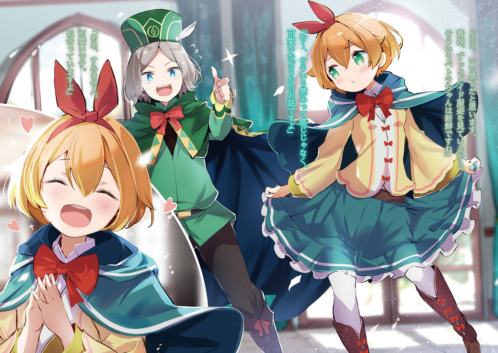
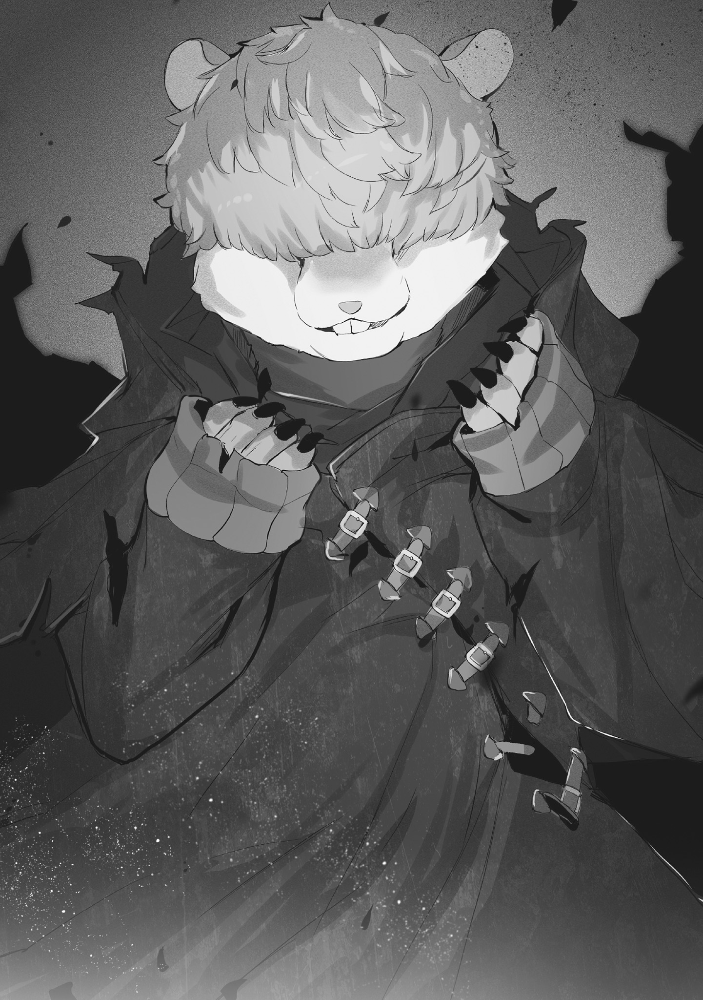
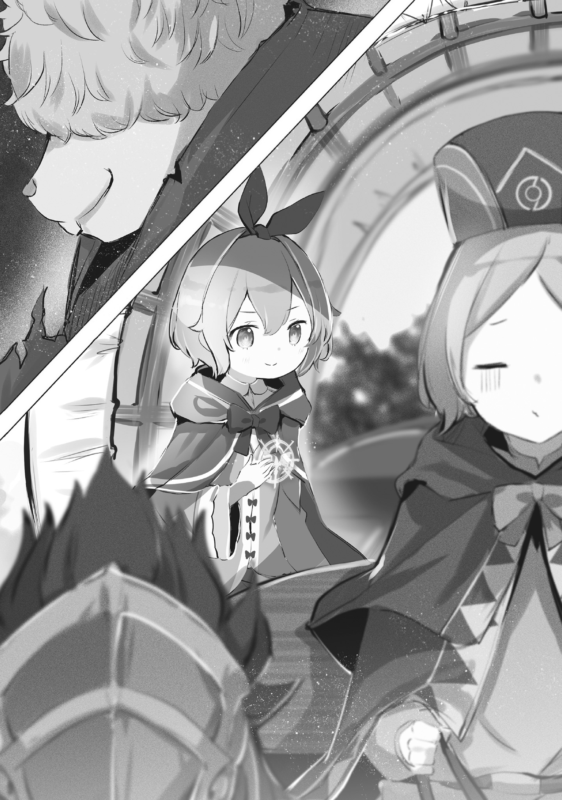

В торговом городе Пиктат состоялись тайные деловые переговоры с компанией Сувен.

Представителем выступала кандидат на престол Эмилия, а её покровитель, маркграф Розвааль, присутствовал рядом.

Поведение Мазерана и Фрамир Сувен, которые полностью проигнорировали тот факт, что Отто — их блудный сын, вернувшийся домой после долгого отсутствия, было настолько по-купечески деловым, что заслуживало аплодисментов.

Как бы то ни было, просьба, которую они озвучили, была весьма специфична.

Неудивительно, что те вели себя так осторожно.

В центре переговоров стоял вопрос о способе проникновения в южную Империю Волакия, что закрыла свои границы и запретила сообщение между двумя странами.

Проще говоря, речь шла о содействии в нелегальном пересечении границы. Само собой, нелегальное пересечение границы — это противозаконно.

А если речь шла об Империи, известной своей суровой политикой, то в случае поимки одним лишь порицанием дело бы не обошлось.

Более того, положение тех, кто собирался нелегально пересечь границу — а именно, уже упомянутых Эмилии и Розвааля — создавало серьёзную проблему.

Из-за близкого знакомства это не всегда ощущалось, но оба они были важными фигурами в Королевстве.

В особенности Эмилия, чья значимость была несравненно выше даже значимого маркграфа Розвааля.

— Если бы это был только господин, то, может, всё закончилось бы тем, что ему просто отрубили бы голову и дело с концом, но если раскроется личность сестрицы Эмилии, это может привести к войне с Империей…

Размышляя с некоторой предвзятостью, Петра всё же знала, что это не было преувеличением.

…Петра Лейт была занята, очень, очень занята, и постоянно находилась в движении.

Покинув родную деревню Алам, Петра, как ответственный человек, каждый день усердно трудилась и училась множеству вещей.

Обязанности горничной, этикет, подобающий слуге маркграфа Мейзерса, физические и умственные тренировки для достижения личных целей — пальцев на руках не хватило бы, чтобы всё пересчитать.

И за всё время этой суматошной учёбы Петра усвоила, что отношения между Королевством и Империей были крайне плохими, и малейшая искра не раз приводила к межгосударственным конфликтам.

Если верить различным историческим записям, войн, начавшихся по пустяковым причинам, было предостаточно, и по сравнению с теми искрами, само существование Эмилии было не просто искрой.

Это было так же опасно, как бросить пьяного Отто на склад, забитый огненными магическими камнями.

Поэтому…

— «Я ни за что не должна подвести сестрицу Эмилию».

— …Петра-чан, можно?

— Пи-и! — Петра, сидевшая на собранном багаже и мысленно настраивавшая себя, подпрыгнула от неожиданности.

Не потому, что её окликнули внезапно, а потому, что окликнул её тот самый Отто, которого она только что мысленно напоила и бросила на склад, полный магических камней.

Петра поспешно обернулась.

На её яркую реакцию Отто, стоявший в дверях комнаты, лишь слегка улыбнулся.

— Какой милый писк, я тебя напугал?

— Н-нет, всё в порядке. Просто я как раз мысленно столкнула Отто на склад, полный огненных магических камней.

— Столкнула меня на склад, полный огненных магических камней?!

— А, не обращайте внимания, это совсем неважно!

— Для Отто в твоей голове это очень даже важно… Знаешь, в такие моменты ты мне и вправду напоминаешь, что ты лучшая ученица Фредерики.

Петра, мысленно убирая Отто вместе со складом, широко раскрыла глаза от его слов.

Это была приятная похвала, ведь Фредерика была для Петры объектом восхищения и жизненным ориентиром.

Девочка так усердно училась, конечно, и для того, чтобы стать достойной своего возлюбленного Субару, но не менее важным было не доставлять хлопот Эмилии, которой она служила, и ни в коем случае не опозорить свою наставницу Фредерику.

Поэтому сравнение с Фредерикой её сильно радовало.

— Но я бы предпочла, чтобы вы приберегли эту похвалу для более важного случая.

— Не факт, что это была похвала… Петра-чан, твоё стремление к самосовершенствованию и впрямь достойно уважения. Многим стоило бы у тебя поучиться…

— Правда? Но я думаю, что и вы, Отто, из тех, кто чувствует больше удовлетворения, когда награда находится где-то высоко.

— Хм, если подумать, возможно, ты и права. Приятнее, когда тебя хвалят за достижение чего-то сложного, а не за всякие пустяки.

Отто понимающе кивнул на мнение Петры, а затем, вскинув брови, сказал:

— Ох, точно ведь, уже почти назначенное время. Я за этим и пришёл, но, похоже, ты уже готова.

— Да, я в полной готовности.

Вспомнив об истинной цели своего прихода, Отто посмотрел на Петру, а та в ответ покружилась на месте.

Её наряд сменился с обычной формы горничной на новенький дорожный костюм. Блузка с широкими рукавами, юбка до колен, а под ней — штаны для удобства передвижения.

Это был результат её собственных размышлений о том, как совместить стиль, практичность для путешествия и требуемую роль.

— Я постаралась не слишком выделяться, как вам?

— Да, по-моему, отлично. Я привык видеть тебя в форме горничной, так что в таком наряде ты выглядишь свежо.

— М-м-м, я спрашивала не о свежести, а о том, мило ли это.

— Ах, прости. Очень мило, тебе идёт.

Получив желанный ответ, Петра удовлетворённо улыбнулась.

— Вот и я так думаю!

Ей не хотелось привлекать лишнего внимания, но и затеряться в толпе девичье сердце не позволяло. В конечном счёте, это был результат поиска тонкого баланса, так что ей было важно услышать оценку.

Конечно, ей бы хотелось показаться в этом наряде и Субару, чтобы услышать его мнение, но…

— Всё в порядке, вы обязательно встретитесь.

— …

— …? Что случилось? — на молчание Петры Отто удивлённо склонил голову набок.

Его реакция раздражала тем, что он, казалось, совершенно не понимал, что сказал что-то не то.

Он прочитал мысли Петры, но ничуть этим не кичился.

— …Отто, вы в таких ситуациях всегда с первого раза попадаете в яблочко.

— Погодите, меня сейчас ругают?

— Хвалю, хоть и нехотя.

— Почему-то мне, как тому, кого хвалят, тоже не по себе…

Отто с досадой почесал в затылке, а Петра, увидев это, сглотнула подступивший к горлу комок.

Затем она перевела свои круглые глаза за пределы комнаты, в сторону парадного холла особняка.

Как и сказал Отто, было назначенное время — долгожданное время прихода важного гостя.

— Проводник скоро будет, да?

— Да, благодаря содействию дома Регундра, прибыл подрядчик по нелегальному пересечению границы. …Вы готовы не только своим милым нарядом, но и отважным сердцем, юная госпожа?

— Не дерзи, холоп.

В ответ на шутливую проверку её «роли» со стороны Отто, Петра, смеясь, высокомерно ответила так, как и подобало её «персонажу».

— …Чтобы пересечь границу, вам придётся пройти под землёй.

Проводник, скрывавший лицо под глубоко надвинутым капюшоном, мрачным голосом изрёк это всей компании.

Он был невысок ростом, одет в плащ, на котором виднелись пятна въевшейся грязи.

Лица его не было видно, но Петра прикинула, что он примерно возраста её отца.

Хоть он и был неразговорчив, создавалось впечатление, что это человек бывалый, ведь даже будучи вызванным в дом могущественного купца Пиктата, дома Регундра, он держался уверенно.

— Как минимум, вести себя почтительно, но не дрожать сверх меры. Таким, как мы, кто занимается подобным ремеслом, нельзя позволять себя недооценивать, юная госпожа.

— А…

— Прошу прощения, я сам лица не показываю, а за вашим выражением слежу — нехорошо получается… Ой-ой-ой.

Петра, почувствовав, что её укорили за невежливый взгляд, невольно опустила глаза.

В тот же миг между ней и проводником широким шагом вклинился Гарфиэль и со свирепым видом уставился на него.

— По-хорошему тебе говорю, прекращай стращать нашу принцессу, а то плохо кончишь.

— Плохо кончу? Это вы со мной что-то сделаете?

— Не, не только крутой я. И другие тоже.

Гарфиэль, оскалив клыки, кивком подбородка заставил проводника отвести взгляд.

В поле его зрения попали Фредерика и Рам, настороженно наблюдавшие за проводником.

Обе, как и Петра, были одеты не в форму горничной, а в дорожные костюмы. Их прищуренные глаза в сочетании с красотой создавали весьма, даже очень внушительное впечатление.

Словно в подтверждение этого, они улыбнулись, поймав взгляд проводника.

— Ремесло, в котором нельзя позволять себя недооценивать, — это прекрасно. Но…

— …и мы не такие хрупкие клиенты, какими кажемся.

— …Виноват, похоже, я в меньшинстве.

Проводник ещё глубже натянул капюшон, сдаваясь под напором их взглядов.

Гордясь своими надёжными назваными сёстрами, Петра ткнула пальцем в спину стоявшего перед ней Гарфиэля.

— Спасибо, Гарф.

— Ха, да ерунда. Пока Капитана нет, защищать товарищей по лагерю — моя работа. Вы тоже, госпожа Петра, особо не мельтеши, ага.

— Я и не мельтешу, не надо обращаться со мной как с ребёнком.

Надув щёки на поддразнивания Гарфиэля, Петра хлопнула его по спине ладонью.

Затем, не желая портить отношения с проводником, она извинилась:

— Простите, что так разглядывала вас, это было невежливо. Проводник, вас зовут…

— Музыка, это моё имя.

— Музыка, вы ведь проведёте нас? До самой Империи.

На вопрос Петры проводник — Музыка — после короткой паузы глубоко кивнул. В ответ на это Петра почувствовала, как в груди нарастает тихое ожидание.

Наконец-то начнутся настоящие поиски пропавших Субару и остальных.

…Контакт с подрядчиком по нелегальному пересечению границы оказался сопряжён с немалыми трудностями.

Главным препятствием стали переговоры с могущественным купцом, домом Регундра, с которым был связан Музыка.

Даже с посредничеством компании Сувен переговоры зашли в тупик.

…Нет, в данном случае можно было сказать, что они зашли в тупик именно из-за посредничества дома Сувен.

— Госпожа Диадора, благодарю за ваше содействие.

— …Не стоит, мне это тоже выгодно. Благодарности излишни.

Так на слова благодарности Петры ответила женщина с роскошно уложенными длинными волосами — Диадора Регундра.

Именно благодаря её содействию удалось связаться с Музыкой.

Однако отношения с Диадорой были крайне сложными.

Ведь именно она была той самой влиятельной фигурой в городе, с которой у Отто были давние счёты и из-за которой он неоднократно отказывался от возвращения на родину.

Конфликт между Отто и Диадорой был обоюдным, хотя ответственность за неосторожные действия Отто была несколько выше.

В итоге всё разрешилось его извинениями и примирением.

Конечно, нанимать убийц для устранения Отто было со стороны Диадоры перебором, но…

— Если скажут, что мои тогдашние действия, совершённые в отчаянии и без оглядки на окружающих, были достойны смерти, то, пожалуй, я и впрямь вёл себя так, что это было бы неизбежно. — Вспоминая себя в прошлом, Отто полностью признал свою вину.

Именно Петра, поговорив с Диадорой и узнав все обстоятельства, предложила Отто извиниться, и именно потому, что извинения были не просто словами, они тронули сердце Диадоры.

Глядя на Отто, который так искренне подошёл к решению проблемы, Петра подумала:

— «Всё-таки, с Отто что-то не так…»

— …Госпожа Петра, вы готовы?

— А… — внезапно её вырвали из размышлений, и Петра растерянно моргнула.

На мгновение обращение «госпожа» показалось ей странным, но, поймав на себе взгляд Диадоры, она тут же вспомнила о своей «роли».

Вооружившись улыбкой, Петра снова вошла в образ.

— …

Одетые в дорожные костюмы Фредерика и Рам, а также Гарфиэль и Отто, молча и с естественным видом ждали её слов, как и подобало тем, кто обращается к ней как к «госпоже».

И не только они…

— Не стоит так напрягаться, успокойтесь, госпожа Петра.

— Да, верно, можете смело на нас положиться.

От голосов двоих, стоявших за её спиной, у Петры чуть не свело щёки, но она сдержала этот порыв.

Ведь Петра была знатной леди с непростой историей, и…

— …Спасибо, я рассчитываю на вас, Дадли, Эмили.

…она была их госпожой, а они — её верными слугами, носящими фальшивые имена.

…При нелегальном проникновении в Империю Волакия главной задачей было, конечно же, не допустить раскрытия личностей Эмилии и, заодно, Розвааля.

Как уже упоминалось, из-за напряжённых отношений между Королевством и Империей, раскрытие их личностей могло спровоцировать войну.

Поэтому во время перехода границы их истинные лица должны были оставаться в тайне.

Для этого и была придумана «роль»: Петра изображала знатную леди с непростой судьбой, а сопровождающие её лица — её свиту и умелых телохранителей.

— Как-то это нехорошо, но так волнительно.

Так сказала Эмилия, облачённая в привычный плащ с «Помехой для восприятия» и изображающая телохранителя под псевдонимом «Эмили».

Фредерика и Рам, а также Гарфиэль и Отто, военный и гражданский чины, выглядели органично, поскольку их роли не сильно отличались от обычных.

Но присутствие Эмилии вызывало сильный диссонанс, ведь полуэльфийка изначально не умела ни врать, ни хранить секреты.

Она была воплощением доброты, искренняя и честная до мозга костей. У неё даже был своеобразный недостаток: когда она врала, у неё начинал болеть живот.

Конечно, Эмилия была полна энтузиазма, но этот энтузиазм часто приводил к обратному результату, поэтому все пристально следили за каждым её словом и действием.

В отличие от этого ходячего источника беспокойства, Эмилии…

— …Госпожа Петра, вы не хотите пить? Если что, обращайтесь ко мне с любо-о-ой просьбой.

В оригинале Розвааль в роли «Дадли» полностью убирает свои привычные растягивания и театральность, за исключением особых моментов, но, что примечательно, в этой его первой фразе он всё же растянул свои слова, но не так как обычно, а утрированно-вежливо, словно карикатурный дворецкий, явно переигрывая свою «роль», причём, это единственный раз когда он так сделал .

— …Ваше лицо меня раздражает.

— Ох, что вы, не стоит обращаться к простолюдину с такой вежливостью. Можете, как и раньше, вести себя высокомерно, я ничуть не возражаю.

— …Ваше лицо меня раздражает, так что отойдите.

В повозке, назойливо предлагавший свою помощь собеседник скривил губы, а Петра, сама понимая, насколько немило это прозвучало, ответила ему.

Тот, кому это было сказано, с весёлым видом отступил, что вызвало ещё большее раздражение.

Тем, кто так злил Петру, был Розвааль, который, как и Эмилия, и даже больше неё, наслаждался сложившейся ситуацией.

Под псевдонимом «Дадли» он играл роль дворецкого Петры.

Его наряд был не обычным эксцентричным костюмом, а дорожной одеждой, практичной для долгого путешествия, но при этом с элементами элегантности.

Однако эта элегантность была продумана так, чтобы служить лишь дополнением к образу госпожи и не привлекать к себе лишнего внимания.

Длинные волосы собраны в один хвост, лицо без клоунского грима — чем лучше человек знал Розвааля L. Мейзерса, тем меньше этот дворецкий ассоциировался бы с ним.

— «И бесит, что этот грим действительно работает…»

В том смысле, что его обычный эксцентричный наряд и грим сильно меняли его облик.

В отличие от Эмилии, он мог маскироваться, не полагаясь на эффект «Помехи для восприятия», а значит, его повседневные выходки действительно были эффективны.

Когда ей демонстрировали это в ситуации, когда они пытались спасти Субару, Петра теряла дар речи и испытывала горькое чувство.

— Я понимаю твои чувства, госпожа, как говорят: «Аблоко из Куэ — на вид сладкая, а на вкус кислая».

То, что Гарфиэль понимал чувства Петры, было для неё спасением, ведь он, как и она, был одним из тех, у кого были свои счёты с Розваалем.

Иными словами, они состояли в союзе «Будем-следить-за-Розваалем-в-оба».

В этот союз входил и Отто, а также ещё один участник…

— …Беатрис-чан.

— …

На зов Петры девочка на её коленях не ответила. Петра лишь нежно погладила пальцем её щёку, бледную, как у куклы.

Беатрис, используя маленькие колени Петры как подушку, спала, поддерживая режим «энергосбережения».

Для посторонних такое непочтительное отношение к госпоже было бы недопустимо, но здесь проблем не было.

Потому что Музыке уже объяснили, что Петра и Беатрис — сёстры. Кстати, старшей сестрой была Петра, а младшей — Беатрис.

«Беатрис намного старше, я полагаю» , — вот так она злилась.

Вспомнив, как Беатрис, покраснев, жаловалась, Петра нежно улыбнулась.

Это было так в духе Беатрис, но что поделать, если Петра выше ростом. Прошло чуть больше года с их встречи, и рост Петры превращал её из девочки в девушку.

Она отличалась от Беатрис, которая, будучи духом, не меняла свой очаровательный облик.

— Пока ты так спишь, разница во времени между нами снова увеличится.

Касаясь её мягкой щёчки, Петра прошептала это спящей девочке.

Желание поскорее встретиться с Субару было сильным, но Беатрис была для Петры важной подругой, и то, что она была вынуждена всё время спать, было гораздо мучительнее, чем разлука.

— Как самочувствие вашей сестры?

Голос Музыки, ехавшего верхом рядом с повозкой, донёсся до ушей Петры, переживавшей за Беатрис.

Проводник, едя верхом на своём земном драконе, вёл их к цели.

Его беспокойство о Петре, «представителе» группы, и Беатрис на её коленях — это было проявлением заботы или попыткой задобрить?

«Какие неприятные мысли», — подумала Петра и покачала головой.

— Спасибо за заботу. Состояние сестры без изменений.

— …Ах, простите за глупый вопрос. Если бы ей становилось лучше от тряски в повозке, то и в этом путешествии не было бы нужды.

— …Верно, — отвечая немногословно, Петра укорила себя за излишнюю осторожность.

Поведение Музыки можно было счесть попыткой что-то выведать, но можно было и расценить как проявление заботы о клиентах, продиктованное его верностью указаниям Диадоры, его важного заказчика.

Часто бывает так, что если воспринимать что-то со злым умыслом, то это и становится злом, а если с добрым — то добром.

— Вы беспокоитесь о моей сестре?

— И это тоже, но не для того же я это делаю, чтобы ваши телохранители на меня косо смотрели. …Скоро мы прибудем на наше рабочее место.

— Рабочее место…

Лица Музыки под капюшоном не было видно, но по его жесту Петра поняла, что он указывает вперёд.

Следуя его указанию, она подняла голову и посмотрела поверх козел, где сидел Отто.

Уже некоторое время назад дорога закончилась, и они ехали по земле, куда обычно не ступала нога человека, но их цель была ещё дальше.

Именно там…

— …Долина Шамрок, наше рабочее место, так сказать.

— …

Слушая голос Музыки, Петра прищурилась, глядя на приближающуюся цель.

Долина Шамрок, расположенная к востоку от торгового города Пиктат, была известна в Королевстве Лугуника как место с дурной славой, овеянное множеством мрачных легенд.

Говорили, что в этой земле, где постоянно стоял туман и скапливалась мана высокой плотности, бродили души мёртвых — Пустые, и это было место, куда почти никто не заходил, настоящая демоническая земля.

— Зато для тайного пересечения границы — самое то~о~о.

— Да, именно так. И для нас, и для наших уважаемых клиентов, которым приходится на нас полагаться, это прямо дар небес, не так ли?

— Не то чтобы ты не прав, но эта твоя манера речи крутому мне совсем не нравится, Дадли.

На слова Розвааля и Гарфиэля Музыка, пожав плечами, перевёл взгляд на Петру. Он словно изучал её реакцию перед лицом зловещей долины.

Однако…

— Если это нам удобно, то мы используем и святилище Пустых, и что угодно ещё. Не стоит каждый раз так пристально следить за моим выражением лица.

— …Понятно, вы отважны, а ваш обнадёживающий ответ очень ценен.

В его голосе проскользнуло удивление от неожиданной реакции, и Музыка почтительно склонил голову перед Петрой.

Глядя, как девочка величественно кивает в ответ, Гарфиэль и Розвааль, каждый по-своему, пробормотали:

— Ха, как и ожидалось, самая смелая в нашем отряде.

— Всё-таки, я был прав, когда с самого начала рекомендовал её.

Оба сказали это так тихо, чтобы посторонние не услышали, восхваляя решительное поведение Петры.

Похвалу Гарфиэля она приняла искренне, а похвалу Розвааля — с долей скепсиса.

Петра с нетерпением ждала прибытия в Долину Шамрок.

Это не было бравадой; у Петры не было той милой черты, чтобы бояться Пустых или останавливаться из-за каких-то нереальных слухов.

Она была готова как можно скорее пересечь туманную долину, но если и была толика беспокойства, то она касалась…

— «…Интересно, как там сестрица Фредерика и остальные».

…душевного состояния тех, кто ехал в другой повозке, следовавшей за ними.

…Долина Шамрок, окутанная непроглядным туманом и плотной маной.

Тайный проход, ведущий из Королевства Лугуника в Империю Волакия, был прорыт в глубинах этой демонической земли с дурной славой.

— Хоть это и демоническая земля, но с проводником бояться нечего.

— Отто, вы ведь не из тех, кто боится Пустых.

— Ну, если увижу их вживую, может, и изменю мнение, но пока что я с ними не сталкивался, так что и бояться нечего. Живые люди, особенно бывалые торговцы, куда страшнее.

Таково было мнение Отто, державшего поводья, и Петра была в целом с ним согласна.

Действительно, несмотря на плохую дорогу и ухабы, «Божественная Защита Уклонения от Ветра» земных драконов была при них, и повозка, запряжённая любимицей Отто, — Фуруфу, без проблем преодолевала путь.

Конечно, условия должны были быть такими же и для повозки, которую вела любимица Субару, — Патраш.

— Хи-и-и! Т-там, за туманом, только что промелькнуло чьё-то лицо?!

— Это ветер. Туман завихрился, вот тебе и показалось.

— А, подожди, Рам! Кажется, кто-то зовёт из тумана! Э-э… «Тебе не выбраться отсюда живым», говорит кому-то. Ужас! Надо идти спасать!

— Это ветер. Мы в ущелье, вот и кажется, что это человеческий голос.

В отличие от их повозки, которая ехала спокойно, в той, где поводья держала Рам, было шумно и суетливо. Хоть она и пыталась это скрыть, Фредерика на самом деле была трусихой.

Она очень остро реагировала на Пустых и необъяснимые странные явления. Петра слышала, что Эмилия тоже когда-то боялась Пустых, но в её случае всё начиналось с того, чтобы научиться отличать их от людей.

Пока она воспринимала проклятия как сигналы о помощи, ей было далеко до уровня Фредерики.

— И пусть никогда не достигнет этого уровня, мне и одной няньки хватает.

— Сестрица Рам… то есть, Рам, не могу с тобой не согласиться…

Как бы то ни было, благодаря Рам, которая держала в руках и поводья, и ситуацию, задняя группа тоже благополучно пересекла ущелье и прибыла к «тайному проходу».

— Вот оно…

— …Мы зовём это «Вечная Тьма». Говорят, этот проход прорыли ещё деды наших дедов, больше ста лет назад.

— Ваши предки прорыли?…

— Да, вот этими когтями.

Перед их глазами, в склоне невысокого холма, зияла пещера. Музыка, стоя перед ней, медленно снял капюшон, и Петра, поражённая увиденным, уставилась на него.

Лицо, которое он до сих пор скрывал, открылось, и все слегка ахнули.

— Прошу прощения за моё невежество до сих пор. Просто нас, знаете ли, не очень-то любят.

Сказав это, Музыка помахал руками, которые до этого прятал под плащом, — руками с толстыми и острыми когтями, — и улыбнулся, показав своё лицо, покрытое короткой тёмно-коричневой шерстью.

Круглый нос, большой рот, маленькие уши — его лицо напоминало крысу.

Невысокий, но крепко сбитый, он не был толстым — под шерстью угадывались плотные, сильные мышцы.

Его глаза были скрыты короткой шерстью цвета земли, и даже без капюшона их было не разглядеть. И всё же, в голове Петры чётко возник образ того, кем был Музыка.

— Кротовый Народ?

— Именно. Вживую вы нас, наверное, редко встречали, но то, что вы сразу догадались, — это от вашей учёности или оттого, что наша дурная слава так широко известна?

— …Думаю, потому что я усердно учусь.

— Чи-чи-чи, как мило с вашей стороны. — Тихий смех Музыки прозвучал и как ирония, и как благодарность.

Петра догадывалась, что в основе его самоуничижения лежали слухи о «Кротовом Народе», который он называл «нелюбимым», и история их преследований.

Это было неразрывно связано с идеалом, который преследовала Эмилия, стремясь к победе в Королевском Отборе.

— …«Ирис и Терновый Король».

Когда Петра произнесла название пьесы, Музыка молчаливым кивком подтвердил её догадку.

Эта пьеса, основанная на реальных событиях, была знаменитой историей, зародившейся в Империи Волакия.

Это была великая эпопея о девушке по имени Ирис, которая влюбилась в того, кого называли «Терновым Королём», и, чтобы спасти его из беды, собрала множество союзников и бросила вызов Великому Бедствию.

Если слушать лишь краткое содержание, это звучит как история, любимая народом, но эта пьеса так надолго осталась в сердцах людей потому, что её финал был трагическим.

В конце истории главная героиня Ирис, одолев Бедствие, погибает от рук предателя-союзника прямо перед воссоединением с возлюбленным, так и не встретившись с ним.

И у персонажей этой основанной на реальных событиях истории были прототипы. Множество источников указывают, что «Терновый Король» был тогдашним императором Волакии.

Существование девушки Ирис, погибшей, так и не воссоединившись с любимым, также считается доказанным, и в этой истории…

— …теми, кто предал Ирис и устроил трагедию, были Кротовый Народ и Народ Волков, которые должны были вместе с ней одолеть Бедствие.

— Из-за этого у нас, из поколения в поколение, нет места в Империи. Народ Волков, не знавший, как бежать, был истреблён, а наши предки рыли норы и…

— …так появилась «Вечная Тьма»?

Музыка, стоя спиной к зияющей позади него тьме, кивнул на слова Петры.

Затем он тихо рассмеялся и с восхищением сказал:

— Вы и впрямь очень усердно учитесь.

— …Зачем вы нам это рассказали?

— Некоторые, лишь узнав, что нору рыл Кротовый Народ, начинают брезговать. Если вы начнёте капризничать уже внутри, будет поздно, так что если хотите повернуть назад — вот вам моя старческая забота.

— А также чтобы купить наше доверие.

На недоумённый вопрос Петры ответил Музыка, а затем в разговор вмешался Отто.

Отто, так же смотревший на «Вечную Тьму», поднял палец, отвечая на сомнения Петры:

— Если знать о слухах, окружающих Кротовый Народ, то некоторые действительно могут почувствовать отторжение, о котором говорит Музыка. Но в то же время, узнав, что предки Музыки бежали из Империи, это придаёт убедительности тому, что эта пещера соединяет две страны.

— …А, то есть, вы не собираетесь нас обмануть и запереть внутри?

— Именно так. Что скажете?

— Я думаю, если бы мы не спросили, Музыка сам бы нам всё объяснил.

— Ох, ну и пугающий же вы народ. Не мешайте нашему бизнесу, пожалуйста.

На замечание Отто, прищурившего один глаз, Музыка поднял руки, сдаваясь.

Это было доказательством того, что догадка Отто верна, и что он действительно помешал их делам.

Отто был надёжен, но из-за своей натуры торговца или личных качеств, он был слишком суров к чужакам, что было его недостатком.

Неудивительно, что он разозлил Диадору.

— Вот бы сейчас здесь был Субару, он бы всё сгладил.

— О, какое у вас нежное выражение лица, кто этот Субару?

— Мой жених.

— Пф-ф! — Отто громко фыркнул на дерзкую ложь Петры.

Показав ему язык, Петра уставилась на зияющую пасть «Вечной Тьмы».

Она узнала историю возникновения этой огромной дыры и получила уверенность в том, что она ведёт в Империю.

— Пройти через это, попасть в Империю и выполнить нашу цель.

— Вы храбрая девушка, раз идёте на такое ради спасения сестры.

На решительный настрой Петры, сжавшей кулаки, Музыка ответил тихим восхищённым вздохом.

Ему, впечатлённому, они сказали, что цель этого нелегального перехода — спасение Беатрис.

Что в Империи есть чудодейственное лекарство от её болезни, из-за которой она спит неглубоким сном.

И это не было полной ложью.

Просто это лекарство было нужно и Петре тоже.

— И чё дальше? Как я понял, ты нас и внутри поведёшь, а?

— В общих чертах вы правы, но, как и следует из названия «Вечная Тьма», внутри простирается непроглядная тьма, куда не проникает свет. Если зажечь огонь, дышать станет нечем, так что…

— Так что?

— …дальше вас будет сопровождать всё моё племя.

За спиной Музыки, обернувшегося на вопрос Гарфиэля, появился наглядный ответ.

Из тёмной дыры послышался шорох множества шагов по земле, и оттуда выползла группа из более чем десяти человек — все, как и Музыка, были одеты в плащи с пятнами грязи, все были из Кротового Народа.

— …Внутри «Божественная Защита Уклонения от Ветра» действовать не будет. Так что, пожалуйста, внимательно слушайте наши указания и двигайтесь соответственно. Иначе…

— Иначе…?

Музыка, понизив голос до поучительного тона, повернулся к Петре.

Встретившись взглядом с его лицом, где невозможно было различить глаза, Петра напряглась, а он улыбнулся и продолжил:

— …вы рискуете вечно блуждать в этой тёмной-тёмной «Вечной Тьме».

Как и предупреждали, путь через «Вечную Тьму» оказался весьма трудным.

Во-первых, ошеломляющая темнота земляных коридоров.

В долине Шамрок и так было мало солнечного света, а под землёй его не было вовсе.

Через определённые промежутки для освещения были установлены лагмитовые камни, но расстояние между ними было так велико, что для непривычной Петры они были почти бесполезны.

Психологическая нагрузка от невозможности видеть вокруг была гораздо сильнее, чем можно было представить. Хотя их и предупреждали о тёмном пути, на деле любая подготовка быстро растворялась во всепоглощающем мраке.

Казалось, её уже и не найти, а угнетающее настроение усугублял влажный воздух «Вечной Тьмы». Возможно, из-за тумана в долине, влажность под землёй была высокой, и воздух казался даже немного липким.

Единственным спасением было то, что от духоты не приходилось потеть, но это было лишь избавлением от худшего из зол.

Однако сырость и холод могли привести к болезни, так что об этом тоже нужно было помнить, но и это было лишь начало.

Главным испытанием «Вечной Тьмы» было…

— Попа болит…

…пробормотала Петра, потирая рукой зад, который она приподняла с сиденья.

Она меняла позу, подкладывала под себя вещи, но оптимального решения не находилось, и Петра бесконечно страдала от боли в пятой точке.

«Божественная Защита Уклонения от Ветра» земных драконов, незаменимая в долгих путешествиях, совершенно не работала в «Вечной Тьме».

Для её активации нужна была определённая скорость и непрерывное движение дракона, а в тёмных и ухабистых коридорах «Вечной Тьмы» это было недостижимой роскошью.

— Госпожа Петра, всё в порядке? Хочешь сесть ко мне на коленки?

— Эмили…

Видя страдания Петры, Эмилия, ехавшая с ней в одной повозке, предложила ей выход из этой ситуации похлопав себя по коленям.

Эмилия, строго следуя своей роли, обращалась с Петрой как с госпожой.

Условия для неё были такими же — «Божественная Защита Уклонения от Ветра» не работала, — но даже в полумраке она выглядела бодрой.

— У тебя попа не болит, Эмили?

— Конечно, немного болит, но я ещё потерплю. Думаю, у меня на коленях будет удобнее, чем просто на сиденье, как думаешь?

— Э-это очень мило, но…

Эмилия похлопала себя по бёдрам, соблазняя слабое сердце Петры.

Если бы она приняла её предложение и села к ней на колени, стало бы гораздо легче, но будет ли это выглядеть естественно для проводников Музыки и его людей?

Вызывать у них подозрения из-за боли в попе было бы верхом глупости.

«Но болит так, что плакать хочется…»

— Нельзя так себя мучить, госпожа Петра. Со мной всё будет хорошо, эта тёмная дорога ведёт к Субару, так что я всё вытерплю.

— Я тоже буду терпеть!

— Э-э-э?! Почему?!

Увидев внезапную перемену в настроении Петры Эмилия удивлённо округлила глаза, но ведь это сама полуэльфийка превратила боль в попе в испытание любви к Субару.

Даже если это была неосознанно сказанная фразочка, Петра не могла отступить.

Однако…

— …Что смешного, Дадли?

— …В такой темноте, госпожа Петра, вы не должны видеть моё лицо.

— Я и без света знаю, ведь в большинстве случаев лицо, которое ты мне показываешь, одно и то же.

В повозке, где едва можно было разглядеть собственные руки, Петра уставилась на то место, где должно было быть лицо сидевшего напротив Розвааля, и надула губы.

Сразу после того, как она решила терпеть, она почувствовала, что Розвааль, слышавший их разговор, усмехнулся.

Какое у него было при этом лицо, Петра живо представила, это было чистое предположение, но Розвааль, веселившийся в темноте, не стал возражать.

Его беззаботное поведение… может, стоит пожаловаться на него Рам или Фредерике?

— Сколько бы я ни говорила, на него это не действует.

— Да, я тоже так думаю. Роз… Дадли, это нехорошо.

— Хм, что именно? Эмили, мне очень интересно, что ты мне скажешь.

Когда Эмилия заступилась за надувшуюся Петру, Розвааль провокационно ответил ей в кромешной темноте.

Обычно он старался поддерживать Эмилию, но в этой временной роли, где не было чёткой иерархии, он, похоже, наслаждался отношениями между Эмили и Дадли.

От его скверного поведения Петру затошнило, но…

— Дело ведь не в положении, госпожа Петра так старается, и ты, зная это, всё равно ведёшь себя как злодей… это по-детски и некрасиво.

— Значит, по-твоему, правильно путешествовать с серьёзным, нахмуренным лицом, погружённым в тревогу?

— Опять говоришь как злодей. Я тоже беспокоюсь о Субару и Рем, но я не говорю, что нужно всё время ходить с мрачным лицом.

— Эмили…

Эмилия, сидевшая рядом, приобняла Петру за плечи и с вызовом посмотрела на Розвааля.

Лицо девушки тоже было в тени, но блеск её глубоких аметистовых глаз был безошибочно узнаваем.

— Дадли, ты ведь думаешь так же? Но ты не говоришь этого вслух и не заботишься о том, поймут ли тебя… вот это и есть по-детски.

— …

— Субару бы прямо сказал, что он сделал или что хочет сделать. Я не очень догадливая, поэтому мне приятнее, когда мне всё понятно, ясно?

Сказав это Розваалю тоном, каким говорят с детьми, Эмилия повернулась к Петре, сидевшей совсем близко.

— Госпожа Петра, хоть Дадли и ведёт себя так, у него нет злого умысла… вернее, может, и есть, но он направлен не на вас или на нас, а на себя.

— На себя?

— Да, совсем взрослый, а капризный как трудный ребёнок, честное слово.

От этих слов Эмилии Петра невольно фыркнула.

Когда эта невинная душа бралась за дело, все мрачные и напряжённые вещи превращались в мир, укутанный мягкой тканью, даже скверный характер Розвааля становился проявлением капризности.

И то, что это не было далеко от истины, подтверждало молчание самого дворецкого. Розвааль, чьё лицо было не видно в темноте, вздохнул на слова Эмилии и сказал:

— Госпожа Петра, может, отвлечётесь, попрактиковав магию? — он попытался сменить тему, чтобы отвести удар от себя.

Глядя на его совершенно неблагородное поведение, можно было согласиться с доводами Эмилии.

— Практиковать магию, здесь? В такой темноте?

— В темноте, может, даже легче сосредоточиться. Медитация, осознание потока маны внутри себя — это основа мастерства.

— Это не попытка уйти от ответа, когда вы в невыгодном положении?

— Не буду отрицать и этого… но здесь высокая плотность ма~а~аны. Условия для того, чтобы почувствовать её, лучше, чем обы~ы~ычно.

В темноте Розвааль отвечал, и лица его не было видно, но Петра была уверена, что он никогда не станет врать о магии или говорить что-то наугад, чтобы сменить тему.

За те несколько месяцев, что она была его ученицей, она в этом убедилась.

— …

Хоть и было досадно поддаваться ему, Петра закрыла глаза и сосредоточилась на своём внутреннем мире.

Даже с закрытыми глазами разницы с внешней темнотой почти не было, но это вынужденное отключение зрения действительно помогло ей лучше осознать циркуляцию маны внутри себя.

Мана, как и кровь, циркулирует по всему телу, но в отличие от крови, которая течёт в такт биению сердца, у маны нет звука.

Проследить её поток было сложно, но…

— Попробуй воспринимать её не как звук, а как цвет или тепло.

…этот совет был настолько точным, что мир изменился быстрее, чем успело возникнуть раздражение.

Она окрасила текущую ману.

Представила свой любимый цвет — розовый, — и розовая мана начала циркулировать в её теле, распространяясь, как вода в растении.

Грудь, голова, руки, ноги…

— Открой глаза.

Когда она, по его словам, открыла глаза, то была поражена преображённым видом «Вечной Тьмы».

В темноте, где едва можно было разглядеть собственные руки, мир для Петры стал розовым, точнее, она могла различать людей и предметы по оттенкам розового.

В тусклом, тёмном пространстве она видела людей и предметы, окутанные слабым розовым свечением.

Лицо Розвааля напротив тоже было розовым, но она могла разглядеть даже его выражение.

— …

Он смотрел на Петру так, словно видел младенца, который только что самостоятельно встал на ноги.

Поняв это, Петра смущённо отвела взгляд и тут же увидела рядом с собой огромный розовый комок, отчего вздрогнула.

— А?! Это Эмили?!

— Э? Что? Что случилось? Я что-то не так сделала?

— Нет, всё в порядке, просто ты превратилась в розовый комок…

— Розовый комок… звучит очень сладко.

По бессвязным речам розового комка можно было с уверенностью сказать, что это Эмилия. Благодаря располагающим условиям «Вечной Тьмы», Петра теперь могла видеть ману.

Ману в людях, предметах, в воздухе — Эмилия, похоже, обладала невероятным количеством маны. Раньше, в особняке, она вместе с Субару практиковала «смертельный приём» и замораживала всё вокруг.

Теперь стало ясно, что это было результатом грубой силы, основанной на её огромном запасе маны.

— Беатрис-чан тоже, оказывается, комок маны…

Рядом с Эмилией, на сиденье, спала Беатрис, и она тоже была комком маны, настолько плотным, что контуров было не разобрать.

По количеству Эмилия превосходила, но по сжатию Беатрис была сильнее, наверное, это результат того, что она дух, существо, состоящее из маны.

— Но такое… Дадли, ты всегда так видишь мир?

— Не совсем верно, я вижу не так уж и кардинально. То, скорее всего, из-за того, что ваш, госпожа Петра, основной атрибут — это атрибут Света, который воздействует на тело.

— Атрибут Света…

Розвааль покачал головой, и Петра, слушая его объяснения, посмотрела на свои руки и пробормотала. В магии было шесть атрибутов, и в основном они относились к огню, воде, ветру или земле.

Так же были выходящие за рамки обычного атрибуты Тени и Света, и атрибутом Петры был Свет.

Определение своего атрибута само по себе было большим шагом в изучении магии, но…

— Я хотела, чтобы у меня был атрибут Тени, как у Субару и Беатрис-чан…

— Разочарованы? Какая роскошь, атрибут Света редок, так что это настоящая находка.

— Редкий или нет — не так уж и важно.

Петра ответила настойчивому Розваалю не с враждебностью, а с искренностью. То, что у неё другой атрибут, чем у Субару и остальных, было обидно, но редкий атрибут ещё и означал, что было меньше предшественников, а значит, путь к совершенствованию был узок, и для Петры это было минусом.

Путь, который она решила пройти, не позволял оправдываться детством.

— Но это потрясающе, госпожа Петра. Значит, ты видишь всё вокруг даже в темноте?

— Э-э, похоже на то, и повозку Фуруфу сзади, и сестрицу Фредерику внутри, и всех остальных хорошо вижу…

Ответив Эмилии, которая сложила руки на груди, Петра с любопытством огляделась.

Мрак, называемый «Вечной Тьмой», теперь для её глаз был весь розовым, но это не означало, что она видела сквозь стены или могла заглянуть в далёкую Империю.

Она могла лишь следить за движениями Музыки и его людей, ведущих их повозку, и видеть, как Рам лежит, положив голову на колени Фредерики.

— Сестрица Рам так расслаблена, завидую… А ещё, впереди дорога как-то светится?

Посмотрев вперёд, Петра заметила место, где свет маны был особенно сильным. Примерно в десяти метрах впереди, на земле, по которой скоро должна была проехать повозка, скопилось много маны.

На реакцию Петры Розвааль тихо пробормотал: «Впереди, дорога?».

Он не собирался читать лекцию о скоплениях маны, услышав слова Петры. Да и времени на это не было.

…Ситуация изменилась быстрее.

— …Ау!

Внезапный толчок снизу подбросил Петру на сиденье, и она вскрикнула.

В тот момент, когда повозка наехала на то самое скопление маны, её сильно подбросило, но это было не просто подбрасывание — повозка сильно накренилась и затряслась во все стороны.

— …Петра-чан!

Протянувшиеся руки обхватили Петру, крепко прижав её голову к себе. Подвергаясь сильной тряске, Петра поняла, что повозка, в которой она ехала, «упала».

Да, она падала.

Повозка, находящаяся под землёй, невероятным образом падала ещё глубже во тьму.

— …!

Среди скрежета повозки раздался пронзительный, затихающий крик Патраш. Естественно, если падала повозка, то и земного дракона затягивало с собой.

Повозка с Петрой, Эмилией, Розваалем и Беатрис, подвергаясь ударам, падала и падала вглубь земли…

— …Оста-новилась?

Падение, казавшееся вечностью, наконец закончилось.

Прижатая головой к груди Эмилии, Петра, задыхаясь, прошептала это, а затем вспомнила об окружающих, особенно о беззащитной Беатрис.

— …! Беатрис-ча…

— Всё в порядке, я её поймал.

На паникующий вопрос Петры ответил Розвааль, стоявший на коленях в накренившейся повозке.

В неизменной темноте, в поле зрения Петры, которая различала людей по количеству розовой маны, было видно, как Розвааль крепко держит Беатрис на руках.

Облегчение от этого факта сменилось вопросом о ситуации. В момент, когда они наехали на скопление маны, возникло ощущение, будто земля ушла из-под ног повозки.

— Музыка! Что случилось? Вы в порядке?…

— …Простите за грубость, юные госпожи.

Ответ снаружи принёс не облегчение, а настороженность.

Тихий, спокойный тон голоса, который, казалось, не был удивлён ситуацией, заставил Петру затаить дыхание.

«Простите за грубость», — сказал Музыка, не «произошла ошибка».

— Это ваших рук дело?

Вместо напрягшейся Петры, этот вопрос Музыке задала Эмилия, в её твёрдом голосе звучала сильная решимость.

…Решимость того рода, что не побоится применить силу в зависимости от ответа. Похоже, это дошло и до собеседника.

Музыка бросил в ответ: «Не стоит».

— В этой «Вечной Тьме» связываться с нами я бы не советовал. Здесь тесно, темно и сыро — это наш мир.

— …Что вы собираетесь с нами делать?

К этому моменту вероятность того, что это была случайность, полностью исчезла.

Если это было подстроено намеренно, значит, у Музыки и его людей была какая-то цель. На вопрос Петры Музыка, чьё лицо было слабым пятном розового света, вздохнул.

Вздохнул так, словно он, устроивший всё это и имеющий преимущество, был ужасно уставшим.

Пока Петра размышляла над этим, Музыка снаружи сказал:

— Если будете сидеть тихо, ничего плохого с вами не сделаем. …Вы просто должны стать заложниками для переговоров с Королевством, вот и всё.

…Нелегальное пересечение границы через «Вечную Тьму» было сопряжено с трудностями, о которых их предупреждали заранее.

Сказали, что придётся пробираться втайне, в тёмной и сырой пещере, и Петра, готовая на любые неудобства ради спасения Субару и остальных, с решимостью вошла в «Вечную Тьму».

Конечно, она и не надеялась на комфортное путешествие, но…

— …О таких неудобствах я как-то не думала.

— И это ваша реакция на происходящее? Вы и впрямь удивительная юная госпожа.

На вырвавшееся у Петры замечание Музыка, услышав его, низким голосом рассмеялся. От этого глухого, мрачного голоса и замкнутой обстановки Петра понуро опустила плечи.

Скопление маны, которое увидела Петра, оказалось ловушкой, устроенной Музыкой и его людьми.

Была возможность её разгадать, но она, из-за отсутствия опыта, упустила её, и это было досадно. Теперь, из-за этого они провалились ещё глубже под землю, и их повозка опрокинулась на бок.

— Моя девочка… Патраш-чан в порядке?

— …? Ах, эта прекрасная земная дракониха? Мы её напугали, конечно, но землю смягчили. Она испачкалась, но не ранена.

— …!

— Вот, сами слышите.

Словно слов Музыки было недостаточно, в темноте раздался крик Патраш.

В отличие от Отто, у Петры не было способа говорить с земными драконами, но она почему-то поняла, что в этом крике не было паники.

Она немного успокоилась, ведь Патраш тоже была важным товарищем. В конце концов, о Субару и остальных, заброшенных в Империю, беспокоились не только люди.

— Хорошо, что Патраш-чан в порядке, но… нас отделили от повозки сестрицы Фредерики и остальных.

В данный момент две повозки в «Вечной Тьме» были разделены, и группа Петры внизу была отрезана от группы Фредерики наверху.

Это тоже, вероятно, было подстроено Музыкой и его людьми, чтобы контролировать их действия. Пока что они полностью были в их руках.

И причина, по которой они пошли на такое…

— …Переговоры с Королевством, так, кажется, ты сказал?

Тихим, максимально сдержанным голосом произнёс Розвааль, находившийся в той же повозке.

Дворецкий, положивший рядом с собой потерявшую сознание Беатрис, точно проследил взглядом за позициями Музыки и его людей, державших их на прицеле снаружи, и сказал:

— Я не ослышался? Переговоры с Королевством из этой тёмной дыры на дне земли?

— Вы не ослышались, мы взяли вас в заложники. Вы ведь знатные господа, так? Значит, Королевство должно прислушаться.

— В-вы собираетесь говорить с Королевством о нас?

— Да. …А, вы беспокоитесь, что станет известно о нелегальном пересечении границы? Что ж, тут вам не повезло, то, что вы именно сегодня и именно в это время решили пройти через наше жилище, — это не иначе как воля небес.

Музыка и его люди неверно истолковали причину волнения в голосе Петры, но было бы жестоко винить их в недогадливости, всё же девочка и её спутники скрывали свои истинные личности, так что Музыка и его люди не могли добраться до правды.

Но даже если их представление о ситуации расходилось с действительностью, обращение в Королевство было крайне невыгодно для Петры и её спутников — а значит, и для лагеря Эмилии.

— Станет известно о нелегальном пересечении границы сестрицей Эмилией…

Раскрытие этого дела было нежелательно не только для Империи, но и для Королевства.

Если станет известно о противозаконных действиях кандидата на престол, это неминуемо повлияет на Королевский Отбор, и, скорее всего, за их действиями установят наблюдение, и выезд из Королевства станет невозможен.

— Мы пытаемся сделать что-то плохое, так что у нас нет права злиться, что на нас донесут… нет права, но это очень, очень плохо.

— У нас нет к вам неприязни или вражды, поэтому нам искренне больно за вашу сестру, но, учитывая всё это, мы просим вас подчиниться.

— Это обязательно?

— Да, мы тоже не шутим. Сопротивляться не советую.

На просьбу Эмилии о мирном решении Музыка ответил непреклонно. От его ответа холодный воздух «Вечной Тьмы», казалось, стал ещё холоднее — нет, не казалось.

— …Очень, очень жаль.

Эмилия, опустив брови в ответ на слова Музыки, на самом деле понизила температуру. Девушка была на удивление вспыльчива, и это было признаком того, что её терпение подходило к концу.

Петра это поняла, Розвааль, должно быть, тоже понял, но не останавливал её. Ответ был очевиден.

…Он был уверен, что силой они легко решат проблему.

— Жаль Музыку и его людей, но…

Если подумать о ловушке наверху, то в той, другой повозке, ехал Гарфиэль, и, учитывая сообразительность Фредерики, Рам и Отто, та группа тоже не была в безвыходном положении.

Первая ловушка их застала врасплох, но Музыка и его люди выбрали себе в жертву совершенно не тех людей.

…Поэтому их цель не будет достигнута.

— Чего вы хотели добиться, разговаривая с Королевством, сделав всё это?

— Госпожа Петра? С ними больше не о чем говорить…

— Дадли, помолчи.

Остановив Розвааля, который собирался вмешаться, Петра спросила о цели Музыки и его людей, она не хотела вести переговоры, ей просто было интересно, чего они хотели.

Каких переговоров с Королевством они собирались добиться, взяв в заложники Петру и её спутников, которых они считали аристократами?

Если это было похищение с целью выкупа, то ставка была слишком высока, наверняка была другая цель.

С этой мыслью Петра задала вопрос, и Музыка на мгновение замолчал…

— …О Королевском Отборе вы, юные госпожи, конечно, знаете, верно?

— …Э?

От этого неожиданного удара Эмилия невольно затаила дыхание, и Петра, конечно, тоже была удивлена.

Она думала, что у Музыки и его людей есть какая-то особая причина, но не ожидала, что это будет связано с Королевским Отбором.

Эта тема, словно нарочно сказанная, заставила Петру и остальных застыть. Музыка снаружи, не обращая внимания на их реакцию, продолжал:

— Это важное событие, которое потрясает всю страну. У вас, юная госпожа, есть любимый кандидат?

— Э-эм, как бы сказать, я ещё в процессе выбора.

— Очень осторожный и скромный ответ, в хорошем смысле. Конечно, мы тоже следим за Королевским Отбором… Только в плохом смысле.

— …Что это значит? Следите за Королевским Отбором в плохом смысле?

Нетерпеливая от его загадочных речей, Эмилия спросила о его истинных намерениях. Учитывая её положение, такой вопрос был естественен.

Как Музыка отреагирует на их повышенный интерес, учитывая, что они, сами того не ведая, оказались в центре событий?

Не обращая внимания на сомнения Петры, Музыка ответил на вопрос Эмилии.

И это был…

— Мы хотим обратиться к Королевству с требованием отозвать с Королевского Отбора кандидатку-полуэльфийку, Эмилию. И вы, юные госпожи, должны стать заложниками для этого.

…ответ, который крайне невыгоден для лагеря Эмилии.

— …Отозвать Эмилию…

Услышав этот тихий шёпот, Петру охватило острое сожаление. Не стоило слушать Музыку, нужно было поддержать безжалостного Розвааля и без лишних слов разрушить их планы.

Но она этого не сделала, и в результате сама того не желая ранила Эмилию.

— …Что это значит?

Сразу после этого сожаления Петра решила вытянуть из Музыки всю правду. Конечно, была вероятность, что, заставив его говорить дальше, она ранит Эмилию ещё сильнее, но копьё уже пронзило её грудь, значит, нужно было узнать, было ли оно отравлено, и с какой силой был нанесён удар.

Не зная глубины раны, нельзя было её обработать.

— Вы же сами говорили, Музыка, что Королевский Отбор — это очень важное для Королевства дело. Такие правила не меняются так просто, даже если вы возьмёте нас в заложники…

— Жизни юных госпож не потрясут страну, вы это хотите сказать?

— …Да.

Обмениваясь спокойными репликами, Петра всё больше наполнялась сомнением. Их разговор был логичен, не только её слова, но и ответы Музыки.

В его ответах не было запинок, и он не пытался насильно заставить её замолчать, он был спокоен.

И именно поэтому его действия были полны противоречий.

— По положению, мы, наверное, принадлежим к богатым. Но это если смотреть в целом, а у тех, кто в центре Королевства, мнение, думаю, другое.

— Толку от такого поступка не будет, в этом вы пытаетесь нас убедить?

— Если вы поддадитесь на уговоры.

Музыка горько усмехнулся на ответ Петры, и по этому было видно, что он не потерял рассудка, он и сам должен был понимать сказанное Петрой.

По крайней мере, судя по поверхностной информации, присутствие Петры и её спутников не могло стать решающим фактором для отзыва кандидатуры Эмилии.

На самом деле, это было не просто решающим фактором, а чем-то большим, что и усложняло ситуацию.

— …

Петра мельком взглянула на молчавшего Розвааля и кивком указала на Эмилию. Этого было достаточно, чтобы догадливый Розвааль понял её замысел.

Сердце девушки и так было готово разорваться от беспокойства о Субару и остальных, и внезапный тяжёлый груз был просто невыносим, и именно поэтому этот груз нужно было снять, ради будущего самой Эмилии…

— «Крайние меры можно приберечь до самого конца».

Если бы всё стало совсем плохо, всегда можно было всё отменить.

Но если бы здесь был Субару, он бы до последнего думал, жертвовал чем-то, и только в безвыходной ситуации прибег бы к крайним мерам.

Петра чувствовала, что многому научилась и выросла, но в основе её личности лежала философия Субару, и она хотела следовать его убеждениям.

Поэтому она не хотела здесь и сейчас отказываться от диалога с Музыкой.

— Расскажите мне о своих чувствах, Музыка. Мне нужны аргументы для убеждения.

— …Какое требование. Напомню, мы хотим вести переговоры с Королевством, а не убеждать вас.

— Если вы не сможете переубедить такую маленькую девочку, как я, то и страна вас слушать не станет.

— …Если вы тянете время, то это бессмысленно.

— У меня и в мыслях не было.

Чувствуя на себе пристальный взгляд из-за пределов повозки, Петра уверенно солгала. На самом деле, она действительно тянула время, но не для себя, а, скорее, для Музыки и его людей.

В тот момент, когда этот разговор прервётся, Розвааль немедля уничтожит их.

Скорее всего, Петра, Эмилия и остальные благополучно выберутся из этой передряги, но тогда не будет способа вытащить занозу из сердца Эмилии.

— «Этого я ни за что не допущу».

Возможно, время и залечит раны и вытащит занозу, но они собирались отправиться в опасную и неизведанную Империю, брать с собой убитую горем Эмилию было тревожно, и, что важнее всего, Петра не хотела этого.

Не хотела оставлять Эмилию с болью и страданием.

— Почему вы хотите, чтобы госпожа Эмилия сняла свою кандидатуру с Королевского Отбора? Всё-таки, потому что она полуэльф?

— А какие ещё могут быть причины? Этого более чем достаточно, чтобы она была снята.

Дежурный вопрос сразу же попал в цель, и Петра надула губы. Этот довод она слышала слишком часто.

Большинство тех, кто не любил Эмилию, как и Музыка, указывали на её происхождение, и глубину этой проблемы Петра, как ей казалось, понимала, но каждый раз, когда она это слышала, ей становилось обидно.

Обидно от того, что люди, ничего не знающие, смешивали в одну кучу «полуэльфа» и её любимую «Эмилию».

— Таких доводов я наслушалась досыта.

— Это лишь доказывает, что так думают многие. Кандидат, который собирается стать королём страны, не может игнорировать мнение большинства.

— Но…

«…никто не прибегает к таким жёстким мерам, как Музыка и его люди».

Петра хотела сказать это, но в последний момент прикусила язык. Не потому, что боялась их разозлить, а потому, что сама подумала, что её слова верны.

— …

Большинство тех, кто не любил Эмилию, действительно смотрели на неё так же, как и Музыка и его люди, но не все они устраивали беспорядки, чтобы заставить Эмилию снять свою кандидатуру.

Сереброволосая полуэльфийка не может быть избрана королём.

Петра тоже возмущалась, но такова была реальность — общественное мнение. Почему же Музыка и его люди, в отличие от большинства, считавшего, что у Эмилии нет шансов, решили действовать?

Потому что их положение отличалось от положения тех, у кого не было причин высказываться.

— …Если госпожа Эмилия участвует в Королевском Отборе, это невыгодно для вас, Кротового Народа?

— …!

На эту догадку Петры реакция Музыки стала чуть острее.

По этой реакции Петра предположила, что её мысль была не так уж и далека от истины. Почему же возвышение Эмилии было невыгодно Музыке и его людям — Кротовому Народу? Как они уже говорили во время пути, Кротовый Народ был расой, изгнанной из Империи.

История «Ирис и Терновый Король», основанная на реальных событиях, лишила их места в Империи.

Предки Музыки бежали оттуда, и их потомки, включая его самого, до сих пор жили в долине Шамрок, перебиваясь помощью в нелегальном пересечении границы.

— …Почему?

Это ведь не Империя, так что Музыке и его людям не было нужды прятаться. Конечно, «Ирис и Терновый Король» была известной историей и в Королевстве, но отношение к ней здесь должно было быть совсем другим, чем в Империи.

И всё же, Музыка и его люди жили, избегая людей.

Они отвергали внешний мир и жили замкнутой общиной, что напоминало…

— …«Святилище».

Родина Фредерики и Гарфиэля, поселение для полулюдей с непростой судьбой — «Святилище».

Петра была там всего один раз, когда как раз таки разрешился конфликт вокруг этого Святилища.

Сейчас закрытое поселение было расформировано, и его жители переехали в разные деревни на территории владений Розвааля, поэтому сейчас там оставались лишь несколько человек, включая бабушку Фредерики и Гарфиэля, Рюдзу, в качестве хранителей запретной усыпальницы.

Жизнь в «Святилище» и жизнь Кротового Народа в долине Шамрок казались похожими в том смысле, что они отвергали внешний мир.

Если так, то и причина такого выбора могла быть схожей.

— Может быть, причина, по которой вы хотите снять госпожу Эмилию с Королевского Отбора, связана с «Войной Полулюдей»?

— …Юная госпожа, вы что, читаете мысли?

— Не читаю, хотя иногда хотелось бы.

Иногда Рам или Отто говорили так, словно читали мысли, но если Отто, несмотря на это, делал бестактные замечания, то проницательности Рам хотелось бы поучиться.

Цель Петры — впитать в себя всё лучшее от всех в лагере и стать завтра лучше, чем сегодня.

Как бы то ни было, реакция Музыки подтверждала правоту её догадки.

— …«Война Полулюдей».

…Это была крупная гражданская война, произошедшая в Королевстве Лугуника несколько десятилетий назад.

В этой войне, где люди и полулюди яростно сражались друг с другом, погибло огромное количество людей, и она продолжалась почти десять лет.

Говорили, что началась она с мелочи, но на неё сильно повлияли давние разногласия между людьми и полулюдьми.

И источником этих разногласий стала…

— …«Ведьма Зависти», а следовательно, и враждебное отношение к полулюдям, включая эльфов.

Последнюю часть мыслей Петры завершил сам Музыка.

При упоминании «Ведьмы Зависти» лицо Эмилии ещё больше помрачнело, и Петра поняла, что действия Музыки были продиктованы глубоко личными причинами.

Как он и сказал, причиной начала «Войны Полулюдей» была враждебность к полулюдям — в Королевстве, где урон от «Ведьмы Зависти» был особенно велик, преследование эльфов было особенно жестоким.

Со временем это перекинулось и на других полулюдей, и разгорелся большой пожар гражданской войны.

Услышав это, Петра наконец поняла мотивы Музыки.

Ужасная гражданская война, которая принесла столько страданий, боли и смертей…

— Мир четыреста лет залечивал старые раны, и если полуэльфийка, ввязавшаяся в безнадёжную битву, расковыряет их снова, и снова прольётся кровь, это будет очень плохо.

…боясь её повторения, Музыка и его люди решили действовать.

— …

Низкий голос Музыки звучал так, будто был истёрт страхом и усталостью.

Петра не могла до конца переварить сложные чувства, вложенные в этот голос.

И это было естественно.

Как она, с её короткой жизнью, могла измерить всю глубину переживаний Музыки, который был примерно ровесником её родителей?

Тем более, что это были чувства не только Музыки, но и груз четырёхсотлетней истории.

— Мы, знаете ли, не хотим снова попасть под раздачу. Если уж на то пошло, мы уже натерпелись сполна.

— Под раздачу…

— Да, под раздачу за то, что натворили деды наших дедов. Вы, усердная юная госпожа, должно быть, прекрасно это знаете.

— …

— За поступки родителей и братьев ещё можно смириться, но дед деда — это для нас человек, которого мы и в глаза не видели. И теперь за его вину нам жить в норе?

На эти слова Музыки Петра ничего не могла ответить. Она сама читала «Ирис и Тернового Короля» как книгу, но были и те, кому не было позволено смотреть на эту историю объективно, как на трагедию.

А именно — Музыка и его люди, которые несли на себе грех предков, живших много поколений назад.

— Но ведь полуэльфы в такой же ситуации, разве нет? Нет никого, кто был бы таким же, как «Ведьма Зависти», и всё же…

— Вы хотите сказать, что мы мешаем тем, кто пытается что-то изменить? …Я же сказал, мы не хотим попасть под раздачу.

В отличие от дрожащего голоса Петры, голос Музыки становился всё более безэмоциональным.

Его ровная речь красноречиво говорила о том, сколько ужасных вещей он видел в своей жизни.

— Хоть я и сказал так, но мы смирились со своим положением. Как есть богатые и бедные от рождения, так есть Кротовый Народ и все остальные. Жить в темноте, быть изгоями — это наша судьба.

— Так говорить…

— Вам, доброй юной госпоже, такая реальность, наверное, тяжела, но даже мы, смирившиеся, не хотим, чтобы стало ещё хуже.

— Ещё хуже…

Слушая рассказ Музыки, Эмилия прошептала его последние слова.

На этот шёпот Музыка, словно вспомнив о других слушателях, сменил свой сухой тон на более горячий, чтобы его услышали.

— Кандидатка в короли-полуэльфийка, и те, кто её выдвинул, — не знаю, о чём они думают, но для нас это не что иное, как дурная слава.

— То, что я не понимаю, о чём думает тот, кто её выдвинул, — с этим я согласна, но…

Петра мельком взглянула на того самого виновника, —Розвааля. Естественно, ответа от него не было, да Петра и не ждала.

Но, оставив в стороне замыслы Розвааля, намерения Эмилии должны были быть известны всем.

— Идеи госпожи Эмилии были объявлены публично. Музыка, вы тоже…

— Улучшение положения тех, кто с рождения лишён выбора и находится в трудном положении… да, до нас это дошло. …Только вот это совершенно лишняя забота.

— …Лишняя забота.

— Да, именно так, юная госпожа-телохранитель.

Не выдержав пренебрежительного тона, Эмилия повторила его слова, и остриё копья Музыки повернулось к ней.

— Полуэльфийка… да ещё и, как назло, с такими же серебряными волосами и аметистовыми глазами, как у «Ведьмы Зависти». Кто, скажите на милость, захочет, чтобы такой человек стал королём?

— К-как знать? Может, например, я.

— В таком случае, хотелось бы донести до её сведения, что у неё весьма сомнительные сторонники.

— М-м-м…

Как ни старайся, Музыка на всё находил ответ, и в его упрямстве не было ни малейшей лазейки.

Но рядом с отступающей Петрой Эмилия снова подала голос: «Подождите».

Скрывая свою истинную личность, она, с нескрываемой искренностью в глазах, сказала:

— Расскажи мне ещё. О том, что ты назвал лишней заботой и попаданием под раздачу.

— …Вы всё-таки тянете время, не так ли? Ждёте, что те, в другой повозке, что-то предпримут?

— Ничего подобного!…

— …На них мы не очень-то надеемся.

Вместо Эмилии, чей голос дрогнул от подозрения, чётко ответила Петра.

И это была правда.

Она не надеялась, что Фредерика и остальные, оказавшиеся в другой ловушке, смогут что-то сделать. Вернее, если бы нужно было просто обезвредить Музыку и его людей, это можно было бы сделать прямо сейчас.

Те, в другой повозке, наверняка думали так же, и то, что они не двигались, было знаком того, что они выбрали позицию наблюдателей.

…Решение было оставлено за группой Петры.

— Так что можете говорить всё, что думаете.

— Какой дерзкий ответ. У меня нет никаких оснований вам верить… Так вы хотели узнать о лишней заботе и попадании под раздачу?

Как он и сказал, у Петры не было никаких оснований, чтобы ей поверили, и всё же, Музыка, сохраняя серьёзный вид, приготовился ответить на вопрос Эмилии.

Возможно, это было его проявлением уважения к Петре и её спутникам, которых он втянул в это дело.

— Нужно ли объяснять про дурную славу? У полуэльфийки нет шансов на победу, так что само её участие в Королевском Отборе лишь привлекает нежелательное внимание.

— Это же просто предрассудки.

— Смешно слышать от такой усердной ученицы, что она не знает таких простых вещей. Вы ведь знаете, как боятся «Ведьмы Зависти», и самое страшное — это то, что вы заставляете всех об этом вспоминать.

— Вспоминать?…

«Странный оборот речи», — подумала Петра и склонила голову набок.

Она не хотела соглашаться с мнением Музыки, но слухи о «Ведьме Зависти» были общеизвестны по всему миру. Забыть о них было невозможно, а значит, и вспоминать не было нужды.

Однако на эту мысль Петры Музыка тихо цокнул языком.

— Вспоминают, юная госпожа. Если полуэльф выйдет на публику, все вспомнят, что тот, кого они старались игнорировать, на самом деле существует.

— …Я не очень понимаю.

— Для нас это очевидно, что «Ведьма Зависти» ужасна, и связываться с полуэльфийкой, которая как две капли воды похожа на неё, — к несчастью.

— …

— Но очевидное — это то, о чём можно забыть, если просто не смотреть в ту сторону. Да, мы так удачно забыли… И вот, нежданно кандидатка в короли Эмилия заставляет нас вспоминать. Вспоминать о том, чего мы так боялись.

В тёмной «Вечной Тьме» раздавался холодный, мрачный и сырой голос Музыки.

Слушая его, Петра на мгновение вспомнила.

…Вспомнила, что и она была всего лишь деревенской девочкой, боявшейся «Ведьмы Зависти». Она не помнила, когда впервые узнала о «Ведьме Зависти», но, сколько себя помнила, она знала.

Знала слово «Ведьма Зависти», и то, что, вспомнив о ней ночью, она не могла уснуть, плакала и дрожала от страха.

Это был необъяснимый, первобытный страх, глубоко врезавшийся в сердце девочки.

— …Я очень боялась.

Петра от всего сердца боялась «Ведьмы», которую никогда не видела и с которой никогда не говорила.

Она помнила, как проводила бессонные ночи, думая о запретной теме, к которой нельзя было прикасаться.

Когда же этот страх утих, когда «Ведьма» перестала быть такой близкой и была загнана в уголок сознания?

Но она не поборола его.

Время от времени, по малейшему поводу, он давал о себе знать.

…Например, с появлением кандидатки в короли-полуэльфийки.

— …Все в деревне тоже были в ужасе.

Петра хорошо помнила перемены, произошедшие в её родной деревне Алам, когда было официально объявлено о начале Королевского Отбора, и весть об этом разнеслась по всей стране.

Когда выяснилось, что таинственная девушка, заходившая в особняк лорда неподалёку, и есть та самая сереброволосая полуэльфийка, жители деревни стали относиться к ней с отчуждением.

Они даже не слушали её, когда она отчаянно пыталась их убедить, что хочет их защитить.

— И как это связано с вашим попаданием под раздачу?

Тем же голоском похожим на серебряный колокольчик, что и тогда, когда она столкнулась с отторжением жителей деревни, Эмилия пыталась докопаться до истинных мотивов, побудивших Музыку к этим действиям.

— Если Эмилия будет участвовать в Королевском Отборе, все будут думать о «Ведьме»… да, я уверена, так и будет. Но почему от этого пострадаете вы?

— Сразу ничего не произойдёт, но как вода в самой спокойной реке течёт от истока к устью, так и проблемы, перетекая, рано или поздно добираются до низовьев.

— …?

— Если внимание с полуэльфийки переключится на «Ведьму», может случиться то же, что и в прошлом. Я боюсь, что это коснётся и меня.

Музыка, словно медленно качая головой, тяжело изложил свою проблему.

— Спасение слабых — очень благородная идея, но это всё равно что ребёнок будет хвастаться, что победит «Святого Меча». Если это слова сопливого мальчишки, можно и проигнорировать, но что хуже всего в нынешней ситуации…

— …Эмилию нельзя игнорировать, и это о-о-очень плохо…

— Что ж, если выражаться так мягко, то да.

Музыка кивнул на слова телохранительницы, словно путь к выводу наконец-то был проложен. Его доводы дошли до Эмилии, и её красивые брови скорбно нахмурились. Разумеется, до Петры тоже дошли его доводы и мысли.

Однако…

— Я, знаете ли, не хочу… второй «Войны Полулюдей».

— Этого не…

…это было лишь плодом пессимистических, очень плохих фантазий.

Можно даже сказать, паранойей.

Но этот поспешный протест Петры был остановлен холодным тоном Музыки, который продолжил: «Правда?».

— Правда мы слишком много думаем? В те времена, когда началась «Война Полулюдей», разве все не думали, что такого не может быть?

— …

— Если вы скажете, что мы слишком пессимистичны, то, может, и так. Но, возможно, это натура Кротового Народа, который только и делает, что возится с землёй? Мы чувствуем дрожь земли.

— Дрожь земли…

— Да, предзнаменование того, что что-то большое рухнет, вот такую дрожь.

Хоть это и звучало как суеверие, эти слова тяжело и глубоко легли на сердце Петры. Выслушав доводы Музыки, девочка проклинала свою недальновидность.

…Вместо того чтобы вытащить занозу из сердца Эмилии, она сама оказалась пронзена насквозь.

Эта заноза с зазубринами — если попытаться её вытащить, рана только расширится. Возможно, стоило прекратить этот разговор, пока ещё была надежда, что рана неглубока.

Потому что…

«Я не хочу сомневаться в сестрице Эмилии…»

Она не могла отрицать логику Музыки, потому что, если отбросить излишний пессимизм, в ней не было изъянов.

В прошлом гражданская война произошла из-за враждебного отношения к «Ведьме Зависти», и никто не мог с уверенностью сказать, что на этот раз всё будет по-другому.

А то, чего нет, доказать невозможно.

…Петра знала Эмилию, поэтому она могла ей верить, но как заставить верить в неё тех, кто не мог отличить её от вымышленного образа «полуэльфа»?

Если даже сейчас, скрывая личность Эмилии, она не могла убедить даже стоящего перед ней Музыку.

— Э-Эмили, я…

На мгновение она чуть не назвала Эмилию по имени, но сдержалась.

Она так хотела облегчить боль в сердце девушки, но не смогла, и эта собственная беспомощность была для Петры невыносима…

— …Петра-чан, всё в порядке.

— А…

Внезапно её обняли, и голова Петры оказалась на чьей-то тёплой груди. Она поняла, что её обняла Эмилия, по мелодичному голосу, доносившемуся сверху.

Сердце Эмилии, прижатое к ней, билось ровно и спокойно, словно символизируя её доброту.

Сердце, которое могло бы колотиться от отчаяния и боли…

— Я тут подумала… Наверное, таких, как Музыка и его люди, много, и как сделать так, чтобы они успокоились?

— И-и как?…

Это был именно тот ответ, которого так жаждала Петра.

Как бы Эмилия убедила, вразумила и успокоила таких, как Музыка, отравленных пессимистичным будущим и решившихся на действия?

И на этот вопрос, заданный Петрой, Эмилия ответила…

— Я думаю, лучше всего — это поговорить с ними и дать им понять, что я совсем не такая, как «Ведьма Зависти». Поэтому, наверное, я… нет, Эмилия, думаю, побежит.

— П-побежит?…

— Да, когда возникают проблемы из-за того, что кто-то не такой как все, или из-за недопонимания, Эмилия бежит к этому человеку и говорит с ним. Говорит до тех пор, пока её не поймут, а если не слушают, то старается до тех пор, пока не услышат!

Петра почувствовала, как Эмилия с решимостью сжала кулак, и потеряла дар речи.

Это заявление, сделанное с такой силой, без сомнения, было в духе философии Эмилии, но можно ли было применять эту философию для решения данной проблемы?

Во-первых, если Петра, знающая Эмилию, и согласится, то убедит ли это Музыку?

— И ещё, можно я кое-что скажу по поводу того, что говорил Музыка?

— …Что же, юная госпожа-телохранитель?

— Я очень хорошо понимаю ваше желание не допустить второй «Войны Полулюдей». У меня такие же чувства, но в том, что вы сказали, есть кое-что, с чем я никак не могу согласиться.

— …

— Вы сказали, что в прошлом «Война Полулюдей» произошла потому, что никто не думал, что она произойдёт. Но мы уже знаем, что «Война Полулюдей» была, и мы знаем, что никто больше не хочет её повторения.

Логика Музыки основывалась на прошлых событиях, чтобы доказать опасность Эмилии.

Прецедент «Войны Полулюдей» придавал его словам большую убедительность, и именно эта убедительность и стала причиной сильного волнения Петры.

Но Эмилия обратила этот прецедент против него.

…Нет, вряд ли Эмилия думала о таких хитростях.

Она просто искренне хотела извлечь уроки из прошлого и сделать будущее как можно лучше.

— Если все не хотят этого, и все об этом знают, то та дрожь земли, о которой вы говорили, — это просто слуховой обман. Так думает Эмилия.

— …Какое-то странное чувство, словно я говорю с той самой, кого мы пытаемся заставить снять свою кандидатуру. Вы и впрямь сторонница Эмилии, юная госпожа?

На слова Эмилии и реакцию Петры Музыка, естественно, засомневался. С точки зрения сокрытия личности, всё было уже на грани провала.

На этот вопрос, который мог выдать их с головой, Петра не смогла ни подтвердить, ни опровергнуть. Ей очень нравились слова Эмилии, такие в её духе и такие безрассудные.

Но так просто поверить в то, что это осуществимо…

— …Всё в порядке, я не «Ведьма Зависти», и я не одна.

Эти слова Эмилии, основанные на присутствии Петры и других товарищей, ударили в сердце девочки сильнее, чем пессимистичные прогнозы Музыки.

И в то же время она вспомнила.

…Вспомнила, как жители деревни Алам, которые так сторонились Эмилии, в конце концов приняли её.

Они поговорили с Эмилией, узнали её, пообщались с ней, и поняли, что Эмилия совсем не страшная, а добрая и милая полуэльфийка.

Не полудьявол с серебряными волосами и аметистовыми глазами, как в легендах о «Ведьме Зависти»…

— …А.

Внезапно Петра кое-что поняла.

Она вспомнила все разговоры, которые велись в этой «Вечной Тьме», и её зацепила одна нестыковка. Мысль о том, что это могло значить, начала разрастаться.

Может быть, от неё всё это время отводили взгляд.

В поисках ответа на возникший вопрос, Петра подняла голову с груди Эмилии и перевела взгляд на Музыку, стоявшего снаружи повозки.

И…

— …Музыка, вы ни разу не назвали госпожу Эмилию полудьяволом.

…чтобы ухватиться за первую ниточку, она указала на эту нестыковку.

Большинство тех, кто не любил Эмилию, как и Музыка и его люди, указывали на её происхождение.

Это было поразительно однообразно.

И большинство из них называли Эмилию «полудьявол» — словом, которое Петра ненавидела.

— Но вы, Музыка, ни разу так не сказали. Я хорошо это помню.

Несмотря на то, что он желал дисквалификации Эмилии с Королевского Отбора и так настойчиво говорил о её опасности, Музыка неизменно называл её «полуэльфом».

Это не означало, что он на самом деле не ненавидел Эмилию — это было бы слишком хорошо, чтобы быть правдой.

Скорее всего, это было связано с происхождением.

…Не Эмилии, а самого Музыки.

— Потому что вы, Музыка, тоже из Кротового Народа, на которых так же смотрят свысока.

Музыка, который сам подвергался предрассудкам, не мог заставить себя обозвать Эмилию «полудьяволом».

И именно в этом, как поняла Петра, заключалась суть всего этого плана.

— Музыка, как вы собираетесь вести переговоры с Королевством, взяв нас в заложники?

— …Ничего сложного. О том, что мы с вами, знает дом Регундра, мы сообщим им об этом, и они передадут весть в столицу…

— Но вы же знаете, что этот план не сработает.

— …

— Вы с самого начала знали, что даже если возьмёте нас в заложники, важные люди в стране вас слушать не станут.

Как и прежде, присутствие настоящей Эмилии всё усложняло, но если бы Петра и её спутники были просто знатными дамами, как думал Музыка, то их цель не была бы достигнута.

Если, конечно, их целью действительно было заставить Эмилию снять свою кандидатуру.

— …Мы просто верим, что важно бросить камень в воду.

— И вы хотели бросить этот камень первыми.

— Чт…

— Чтобы Кротовый Народ стал теми храбрецами, кто первым выступил против угрозы, напоминающей о «Ведьме Зависти».

На эти слова голос Музыки впервые по-настоящему дрогнул.

По этой реакции всё стало кристально ясно.

Все его предыдущие реакции были всего лишь заранее заготовленным спектаклем.

«И то, что он позаботился, чтобы Патраш-чан не пострадала в ловушке, и то, что он так долго с нами разговаривал — я должна была понять, что это странно».

Он защитил земного дракона, попавшего в ловушку, и терпеливо разговаривал с пленёнными Петрой и её спутниками.

Говоря, что не станет подыгрывать им, тянущим время, он сам же на это и попался.

По мере разговора, посеянная в душе Петры тревога о дурной славе полуэльфов — всё это было лишь страховкой на случай провала их плана.

Они надеялись, что освобождённые Петра и её спутники расскажут о сегодняшнем разговоре окружающим.

…Чтобы все подумали, что Кротовый Народ, рискуя собой, первым поднял голос, чтобы предотвратить вторую «Войну Полулюдей», которая могла разразиться из-за участия Эмилии в Королевском Отборе.

— Похищение аристократов Короле~е~девства — это тоже для привлечения внима~а~ания. Чем тяжелее преступление, тем больше люди хотят знать… О героическом ва~а~варварстве Кротового Народа, переживавшего за судьбу мира.

— Гх…

Розвааль, выбрав нарочито резкие слова, глубоко ранил сердце Музыки.

Услышав это, Петра поморщилась.

Не только из-за его скверного поведения, но и потому, что поняла, что Розвааль пришёл к тому же выводу, что и она, но гораздо раньше.

Доказательством тому было то, что во второй половине разговора Розвааль стал заметно молчаливее.

Неизвестно, в какой момент он разгадал замысел Музыки, но он всё это время молча наблюдал.

Причина этого была примерно ясна, и это раздражало.

— Но я злюсь ещё больше. …Это же коллективное самоубийство всего Кротового Народа.

— Э…?!

Эмилия, не совсем успевавшая за ходом мыслей, широко раскрыла глаза на слова Петры. Но это было и неудивительно, ведь такая мысль никогда бы не пришла в голову Эмилии.

Музыка и его люди были готовы умереть, чтобы стать храбрецами, переживавшими за будущее Королевства.

И это, скорее всего, было…

— …бунтом против судьбы, навязанной им из-за исторических событий… вашим собственным способом борьбы за то, чтобы смыть с себя клеймо предрассудков, которые преследуют Кротовый Народ.

— …Я думаю, они и вправду не хотят «Войны Полулюдей».

— О, как вы добры, госпожа Петра.

Петра показала язык на эту едкую ремарку, и её неприязнь к Розваалю усилилась.

Действия Музыки и его людей не были похвальными, и для Петры и её спутников это была большая проблема, но называть все их мотивы и замыслы низменными было однобоким взглядом.

Это ничем не отличалось от того, чтобы не видеть разницы между Эмилией и «полуэльфом».

— Музыка, так как же?

— …Похоже, мы и вправду прокляты судьбой, которая никогда не складывается в нашу пользу.

Голос, смешанный с сухим смехом, звучал так, будто он опустил плечи.

— Как вы и думаете, юные госпожи, этот низменный план и был нашей надеждой… глупой надеждой потомков тех, кто предал Ирис и навлёк на себя гнев Тернового Короля.

После долгого смеха Музыка, словно смирившись, сказал это. Догадки Петры и Розвааля были верны, и они сражались с призраком деяний своих предков.

— Знаете, Музыка, я…

— Эмили, подожди.

Не выдержав боли в его голосе, Эмилия решительно заговорила, но Петра в последний момент остановила её, прервав её решение.

Сейчас Эмилия собиралась раскрыть свою личность и встретиться с Музыкой лицом к лицу.

Сама по себе эта мысль была благородной и очень в духе Эмилии, но если бы она это сделала, в голове Музыки мог бы возникнуть хаос и новые плохие мысли.

Поэтому сейчас была не очередь телохранителя Эмили, а очередь госпожи Петры, ведущей за собой отряд.

Тем, кто искал будущего, в котором их бы запомнили как храбрый Кротовый Народ, предотвративший вторую «Войну Полулюдей»…

— …Музыка, может, вместо того чтобы вести переговоры с Королевством, вы проведёте их со мной?

…Путь через «Вечную Тьму» в Империю Волакия возобновился, и повозка затряслась.

— Попа болит…

Сидя на сиденье трясущейся повозки и постоянно меняя положение, пробормотала Петра.

Услышав её слова, сидевший рядом человек произнёс ласковые слова…

— Считай это расплатой за свою безрассудность и тихо стони от боли.

…которых не было.

— …Сестрица Рам, вы не добрая.

— Я не добрая. И вообще, я тебе не сестрица, не так ли, госпожа Петра?

Встретившись с безжалостными бледно-розовыми глазами, Петра понуро опустила плечи.

— Рам, прекрати издеваться над госпожой Петрой.

— Сестрица Фредерика…

Однако в этот разговор между Петрой и Рам вмешалась спасительная рука…

— Я вам не сестрица, госпожа Петра. И хоть я и упрекаю Рам, но я тоже злюсь. Да, очень-очень злюсь.

…которой не было.

Сидевшая напротив Фредерика, скрестив руки на груди, отвернулась, и Петра сжалась.

В тот же миг с крыши донёсся весёлый смех.

— Какое-то время придётся потерпеть, госпожа Петра. Я понимаю, почему сестра и Рам так говорят. Хотя то, что ты уделала этого ублюдка Розвааля, — это круто.

— Гарф, не говори это так легкомысленно! Госпожа Петра, если почувствуете себя плохо, сразу же скажите.

— Я п-понимаю, простите, что заставила вас волноваться, сес… Фредерика.

На слова склонившей голову Петры Фредерика, опустив уголки бровей, сказала: «Ну вот ещё».

В её выражении лица читался упрёк, но ещё больше — беспокойство.

С тех пор, как её пересадили в повозку догнавшей их группы, Петра только и делала, что извинялась.

Но это было и неудивительно.

— Кто бы мог подумать, что госпожа Петра будет вести переговоры, чтобы убедить противника… Эмили ладно, но что делал Дадли?

— Ухмылялся и с нездоровым интересом наблюдал, провалюсь я или нет.

— Похоже на правду, но в то же время, это какое-то предвзятое мнение, которое расходится с реальностью в ключевых моментах!… — Отто, державший поводья на козлах, скривился от едкого ответа Петры.

Возможно, в её словах и была доля предвзятости, но это не было далеко от истины.

Розвааль, быстро разгадавший замысел Музыки и его людей, после этого предоставил диалог Петре и её спутникам и молча наблюдал.

Другой причины этому придумать было сложно.

Конечно, она понимала, что, наблюдая, он не желал ей провала. Размышляя об этом, Петра становилась всё более недовольной.

Отто, заметив это краем глаза, поправил шляпу и сказал: «Ну и ну».

— И всё-таки, вы в порядке, госпожа Петра? …Последствия Клятвы.

— …Всё нормально, правда.

Добавив это, она сделала свои слова ещё более подозрительными, но, как она и сказала, это была правда.

На самом деле, с её здоровьем было всё в порядке.

В моральном плане было некоторое чувство, что она поступила опрометчиво, но чувство удовлетворения было сильнее.

Удовлетворения от того, что она наконец-то, как член лагеря Эмилии, смогла ей помочь.

— С этим чувством надо быть осторожнее, оно затягивает.

— А вам, Отто, уже поздно!

— У меня есть некоторое самосознание, так что не надо мне об этом говорить!

Слушая, как срывается высокий голос Отто, Петра посмотрела на себя и осознала присутствие знака «Клятвы», вырезанного под одеждой.

Именно это было той ценой, которую она заплатила в будущем, ведя переговоры, чтобы все — включая Музыку и его людей — благополучно выбрались из «Вечной Тьмы».

Доказательством того, что она дала нерушимую клятву и пообещала будущее.

Когда их план был раскрыт, и пойманные Петра и её спутники стали им мешать, Петра, прежде чем они успели сорваться, предложила им переговоры.

Их содержанием было…

— …не таким способом, а нормальным путём донести до всех, что Кротовый Народ старался, чтобы не допустить «Войны Полулюдей».

— И для этого ты пообещала устроить им встречу с госпожой Эмилией… Сидя рядом с ней самой, ты дала довольно жестокое обещание.

— Кротовый Народ хотел смыть с себя позор предков… значит, нынешнее поколение должно переписать его новой оценкой. Я считаю, это хороший компромисс.

Рам и Фредерика по-своему оценили клятву, данную Петрой, и её цель.

Рам — строго, Фредерика — мягко.

Однако…

— Но рисковать так же, как господин, ради этого — это, я считаю, слишком.

Добавила Фредерика, и её взгляд стал строгим, и Петре оставалось лишь съёжиться и извиниться.

Отчаянный поступок её младшей сестры по духу, Петры, разозлил Фредерику как никогда, и она не представляла, как её успокоить.

— …Гарф, Гарф, есть какой-нибудь хороший способ?

— А? Не знаю, может, дать ей погрызть что-нибудь твёрдое? У меня тоже, когда зубы чешутся, настроение портится к чёрту.

— Угу, поняла. Больше у Гарфа спрашивать не буду.

— Гах…?!

Оставив в покое Гарфиэля, который был шокирован несколько предсказуемой оценкой, Петра прикоснулась к своей груди и снова осознала причину всеобщего беспокойства.

…Решение Петры, которое разозлило Фредерику и, скорее всего, Рам, было клятвой, связавшей её душу с исполнением обещания, данного Музыке и его людям.

Если она нарушит эту клятву, то ей не поздоровится.

Содержание клятвы — диалог между Музыкой и его людьми и Эмилией, — так что условия были довольно мягкими.

— «Если мы все благополучно вернёмся в Лугунику, то проблем не будет».

В этом смысле, эта клятва была своего рода декларацией решимости Петры. Клятвой обязательно встретиться с Субару и вернуться в Королевство всем вместе.

Но была и одна вещь, за которую ей было стыдно перед Фредерикой и остальными.

— «Я так хотела что-нибудь сделать с этим лицом господина „я-всё-знаю“, что из упрямства дала клятву — вот это, наверное, было по-детски…»

…Зато лицо Розвааля в тот момент, когда она это предложила, было бесценно.

…И в то время, как Петра получала нагоняй от присоединившихся к ней товарищей…

— …Я поняла, что мне очень повезло.

— Повезло? Несмотря на то, что из-за существования госпожи Эмилии появляются такие отчаявшиеся люди, как они?

— Да, я не согласна с мыслями Музыки и его людей и с тем, что они пытались сделать… но мне были приятны чувства Петры-чан. То, что Петра-чан, в отличие от Дадли, поставила мои чувства на первое место.

— …

— А, то, что она дала клятву без спроса, — за это я злюсь!

— Клятва, да…

— Роз… Дадли?

— Нет, это меня удивило. И эта идея, и эта решимость, и прежде всего, стремление спасти даже тех, кто причинил тебе вред. Словно…

— Словно Субару?

— Да, но, похоже, и влияние Эмили тоже есть. Ну и ну, с такими темпами…

— …? Что ты говоришь, как будто тебя это не касается?

— …Что?

— Петру-чан магии и всему прочему учишь ты, Дадли. Так что это и твоё влияние тоже, не забывай об этом.

— …

— А, я пойду посмотрю, как там Патраш-чан. И надо спросить у Музыки и его людей, сколько ещё до выхода из «Вечной Тьмы».

— …

— …Ты что-то притих, я полагаю.

— О, проснулась?

— Немного, на самом деле. …Пока Бетти спала, что-то случилось, я полагаю?

— Да, пока ты спала…

— …?

— …произошло нечто… нечто, отчего возникают чувства, которые очень, очень трудно выразить словами.

«Конец»
