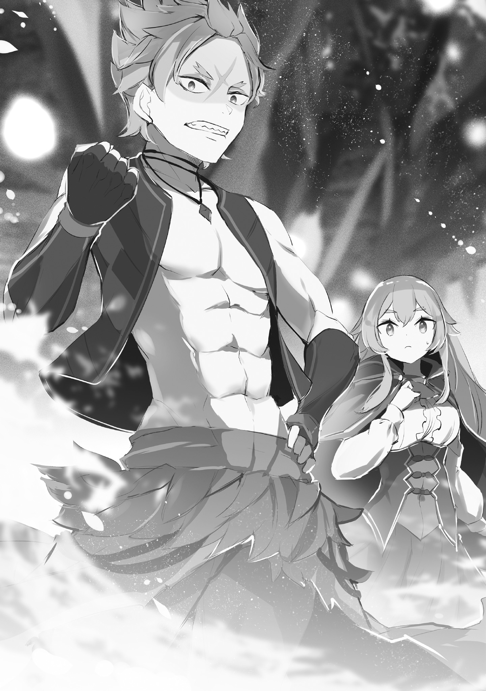
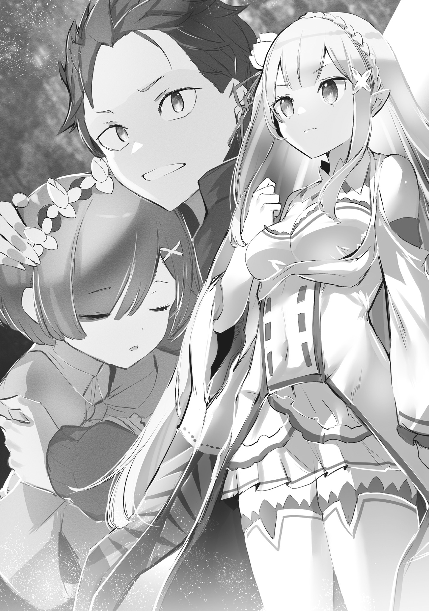

В тот миг, когда долгий плен во тьме наконец закончился, Фредерика ощутила, как на душе стало легче.

Она не помнила, чтобы когда-либо особенно тосковала по солнцу, но, оказавшись под его лучами впервые за более чем сутки, не могла сдержать нахлынувших чувств.

Казалось, она воочию убедилась, что люди действительно живут благодаря солнцу.

— Наконец-то мы выбрались из «Вечной Тьмы», какое облегчение, сестрица, — тихим голосом, заботясь об окружающих, прошептала Петра Фредерике.

Её названая сестрица, в своём наряде юной леди, излучавшем очарование и миловидность, продолжала с блестящим актёрским мастерством исполнять роль главной героини их путешествия.

Фредерика искренне хотела бы ответить на это похвалой, аплодисментами и объятиями, но обстоятельства не позволяли.

Во-первых, нужно было соблюдать разницу в ролях, которые играли Петра и Фредерика. Петра была знатной леди, а Фредерика — её компаньонкой и телохранителем.

Объятия и похвалы от служанки в адрес госпожи не соответствовали общепринятым нормам отношений между господином и слугой. Любые подозрения и сомнения следовало исключить по мере возможности.

А во-вторых…

— …Госпожа Петра, не сказываются ли на вас последствия клятвенной печати?

— У… в-всё в порядке. Мне приятно, но ты слишком беспокоишься, сестрица.

— Заботиться о здоровье госпожи — долг слуги. И, пожалуйста, прекратите называть меня сестрицей, госпожа Петра.

— У-у-у…

От упрёка Фредерики круглые глаза Петры наполнились слезами, и она, опустив голову, крепко вцепилась в сиденье драконьей повозки.

Хоть Петра и дулась, Фредерика не была к ней несправедлива без причины. Даже если заплаканная Петра была очень мила, она не стала бы издеваться над ней просто так.

«К тому же, улыбка Петре идёт гораздо больше».

Поэтому колкое обращение Фредерики с Петрой было связано с другим — с клятвенной печатью, о которой зашла речь, и с тем, как эта девочка запечатлела её на своём юном теле.

Петра без колебаний вступила в переговоры с отрядом Кротового Народа, что властвовал в «Вечной Тьме» и занимался нелегальным пересечением границы между Королевством и Империей, когда те попытались взять их в заложники для переговоров с Королевством.

Безусловно, сам по себе этот поступок был достоин похвалы, но способ его достижения — нет.

Петра, в обмен на определённое обещание, добилась от Кротового Народа изменения их планов и продолжения помощи в нелегальном пересечении границы.

И в качестве доказательства того, что она сдержит своё слово, она выбрала нанести на себя клятвенную печать, которая сулила суровое наказание в случае нарушения клятвы.

Само по себе обещание, которое она поклялась исполнить, было несложным, если бы рядом была Эмилия, но…

— …То, как вы это сделали, очень похоже на господина, и это меня не радует.

— …Да, я виновата.

Глядя на поникшую Петру, Фредерика сдержала желание её утешить. Если Петра не усвоит урок сейчас, то не изменит свой образ мыслей.

Нельзя было допустить, чтобы она продолжала считать, что подвергать себя неоправданной опасности — это лучший выход. Для этого нужно было, стиснув зубы, твёрдо выразить свои чувства.

«Иначе дальше… с имперскими обычаями нам не справиться».

Выбравшись из длинной-длинной пещеры под названием «Вечная Тьма» и направившись к пробивающемуся свету, их взору открылась плодородная зелёная земля.

Драконье Королевство Лугуника тоже было прекрасно, но при сравнении становилось очевидно, что растительность здесь другая, что было доказательством того, что мир за пещерой кардинально изменился.

Вот они и прибыли в Священную Империю Волакия… нет,

— Раз уж мы нелегально пересекли границу, то наше прибытие далеко не триумфальное.

…так скромно оценила Фредерика их прибытие в Империю.

— Пройдя немного дальше от выхода из пещеры, вы выйдете на большую дорогу, если пойдёте по ней, то доберётесь до города. Советую вам там и решить, что делать дальше.

— Да, спасибо. Вы нам очень помогли, Музыка.

— Перестаньте. Мы поступили с вами невежливо… Чтобы вы выполнили своё обещание, мы хотим, чтобы вы благополучно вернулись. — Оставив эти слова заботы, Музыка и его люди снова скрылись в «Вечной Тьме».

Учитывая обещание, данное Петре, они, вероятно, хотели бы проследить за их путешествием, но у Кротового Народа не было места в Империи.

«Если бы нас нашли, то немедленно…» — хоть Музыка и сказал это в шутку, Фредерика считала, что это не было преувеличением.

Суровые нравы Империи и дискриминация Кротового Народа могли легко привести к бессудной расправе. Ведь люди могут быть на удивление жестоки к тем, кто на них не похож.

Как бы то ни было…

— То, что мы смогли попасть в Империю, — это весьма отрадно. Но наша цель не здесь, а впереди. Все это понимают, да~а~а?

— Это и без тебя понятно. Зачем ты вообще об этом спрашиваешь, а? Чё ты задумал?

— Придержи язык, Гарф. Дадли лишь предостерегает нас от расслабленности.

— Тц, ясен пень. — Цыкнув, Гарфиэль отвёл взгляд от Рам, которая сделала ему справедливое замечание.

Девушка, прищурив свои бледно-розовые глаза, извинилась перед Дадли — то есть, Розваалем — взглядом. Сам он, казалось, не обратил на это особого внимания и лишь пожал плечами.

Расставшись с Музыкой и его людьми, они, прежде чем отправиться в указанный им город, остановили две драконьи повозки, чтобы обсудить дальнейшие планы о…

…Спасении Субару и Рем, цели их прибытия в Империю.

— Возможно, слово «спасение» звучит слишком грандиозно, но давайте будем готовы к худшему. Конечно, если всё обойдётся простым воссоединением, то это будет просто замечательно.

— …Трудно представить, что бы Субару не ввязался в какую-нибудь опасную авантюру.

— Я того же мнения.

Петра с тревогой опустила брови, а Отто, приложив руку ко лбу, согласно кивнул. С их мнением была согласна и Фредерика — да и все присутствующие.

На самом деле, основной причиной, по которой они так спешили попасть в Империю Волакия, было то, что они не знали, в какую передрягу могли попасть Субару и остальные.

К тому же, было множество других причин для скорейшего воссоединения, например, контракт с Беатрис.

Поэтому, даже попав в Империю, от них требовались быстрые действия, но…

— Но Волакия такая большая. Я слышала, что она больше Лугуники, так как же нам найти Субару и остальных?…

— На этот счёт есть два основных направления действий… Отто-ку~у~ун.

— Да-да, я думаю так же, но позвольте мне объяснить.

На вопрос Эмилии, приложившей палец к губам, Розвааль, кивнув, обратился к Отто.

Тот, поправив шляпу, оглядел всех и сказал:

— Что касается двух направлений, о которых сказал Дадли, то, проще говоря, это сбор информации и наём людей.

— Наём людей… вы хотите нанять людей, чтобы найти Субару и остальных?

— Это было бы разумно. Искать пропавших в этой огромной Империи ввосьмером — нереально. Но и это не так просто.

— Э… может быть, это будет очень дорого?

— Ну, дёшево точно не обойдётся.

Услышав о деньгах, Эмилия поникла и пробормотала: «Да, конечно…».

Когда дело касалось финансов, Эмилия не могла сама принимать решения. Разумеется, все расходы на это путешествие покрывались из казны дома Мейзерсов.

Включая плату за молчание, Музыке и его людям, нанятым для прохода через «Вечную Тьму», была выплачена соответствующая сумма.

— Кстати, можно спросить, сколько?

— Лучше не спрашивай, Эмили. От удивления глаза на лоб полезут.

— Ой, страшно…

— Так что значит, что нанять людей будет сложно?

Эмилия, обеспокоенная суммой, побледнела и задрожала от предостережения Рам. Тем временем Фредерика, чтобы узнать истинный смысл слов Отто, продолжила разговор.

На вопрос Фредерики Отто ответил: «Именно то, что я сказал».

— Во-первых, в Империи наши статусы недействительны. Раз мы сейчас не аристократы и не кандидаты на престол, то на особое отношение рассчитывать не приходится. К тому же, полагаться на связи тоже сложно.

— Связи — это ж знакомые, да? У тебя, Отто бро, в Империи нет знакомых?

— К сожалению, чтобы попасть в Империю, нужно было приблизиться к родине, чего я избегал. Так что в Империи у меня тоже нет никого, на кого можно было бы положиться… Вот в Густеко или Карараги — другое дело.

Медленно покачав головой, торговец с лёгким сожалением прикусил щёку изнутри.

Отто, с его обширными знаниями и связями, был одним из ценнейших кадров в лагере Эмилии, но, похоже, его купеческие связи не действовали, когда речь заходила об Империи.

И тут…

— Что касается проблемы, которую только что озвучил Отто-кун, то, возможно, я смогу с ней разобра~а~аться. У меня нет таких уж тёплых отноше~е~ений, но и в Империи есть некоторые знако~о~омые.

— …! Значит, можно будет нанять людей?

— Гарантий не~е~ет, но это не тот человек, с которым нельзя договориться. Одна~а~ако ему придётся рассказать правду, а не притворяться. И тогда…

— Дадли пойдёт один? Неприемлемо. Я пойду с тобой.

— М-м…

Розвааль, который было остановил опасения Отто, сам был остановлен Рам, у которой возникли свои опасения.

Реакция маркграфа, прикрывшего один глаз, была доказательством правоты Рам.

— Неужели вы собирались отправиться в одиночку? Это уж слишком…

— Но, учитывая обстоятельства, это лучший вариант. Независимо от того, станет он слушать или нет, нужна только моя персона… незачем подвергать опасности Эмили и всех остальных.

— …В любом случае, без Дадли тело Рам долго не продержится. Не вижу причин отказывать мне в сопровождении.

— Ну и ну… мне кажется, решать это должен я~я~я… —Розвааль горько усмехнулся и пробормотал это, глядя прямо на Рам, которая хладнокровно отрезала ему пути к отступлению.

С точки зрения Фредерики, были понятны и мысли Розвааля, и доводы Рам. Проблема была, скорее, в том, что Розвааль колебался оставаться наедине с Рам, но…

«В этом вопросе никто не станет на сторону господина против сестрицы Рам».

— …Я, пожалуй, скажу, что я против, хе-хе.

На замечание Петры, которая сложила руки на груди и улыбнулась, Гарфиэль недовольно скривился. Но и Гарфиэль, если отбросить личные чувства, прекрасно понимал, что было бы разумно.

То, что у Розвааля не было союзников, — это расплата за прошлое, так что ему придётся смириться с решением большинства.

— Если есть на кого положиться, то переговоры можно доверить Дадли, да? Тогда постарайся вместе с Рам в качестве помощницы.

— Поняла. У Дадли ведь тоже нет возражений?

— …Не~е~ет.

Последний толчок от ничего не подозревающей Эмилии и взгляд Рам заставили Розвааля сдаться. Итак, наём людей пока что был доверен Розваалю и его спутнице, а…

— Отто бро, а что насчёт сбора информации?

— Как мы и планировали, нужно искать информацию о местонахождении и следах Нацуки-сана. Но и здесь есть свои сложности.

— То есть?

— Думаю, Нацуки-сан, поняв, что он в Империи Волакия, не станет представляться как «Нацуки Субару».

— А, как я или Дадли?

На слова Эмилии, расширившей глаза, Отто кивнул. Фредерика тоже поняла, что это было естественной предосторожностью.

Хоть Субару и его спутники и попали в Империю из-за непредвиденных обстоятельств, но как только они разобрались в ситуации, Субару должен был сразу осознать всю шаткость своего положения.

Естественно, он должен был подумать и об опасности того, что его имя станет известно в Империи.

— Значит, искать господина Субару нужно не по имени Нацуки Субару, а…

— Скорее всего, если он что-то и натворит, то под псевдонимом. Надеюсь, он выберет какое-нибудь простое и понятное имя.

— Псевдоним Капитана, значит…

Скрестив руки на груди, Гарфиэль задумался, но вряд ли от него можно было ожидать ответа. В конце концов, мысли Субару были понятны только самому Субару. А для Фредерики идеи Субару были и вовсе чем-то из другого мира.

— Значит, нам нужно расспрашивать не об имени Субару, а о его приметах… цвет волос, глаз, одежда, взгляд.

— Да. …Если бы Субару остался в своём «спортивном костюме», было бы заметнее и проще.

— В таком случае Барусу не миновать бы сожжения на костре за то, что его личность раскрыта.

— Сожжение на костре — это слишком… Слишком ведь?

От замечания Рам, обхватившей себя за локти, Фредерике стало не по себе, и она переспросила у окружающих. Но, независимо от их знаний об Империи, обнадёживающего ответа так и не последовало.

Как бы то ни было…

— Дадли и Рам отправятся поговорить с тем, на кого можно положиться, а мы в ближайшем городе поспрашиваем, нет ли слухов о Субару и остальных… так?

На слова Эмилии, подводившей итог, возражений не последовало. Хоть и было тревожно разделяться в этой чужой стране, но…

— Господин… Дадли и Рам ведь не станут делать глупостей?

— Не беспокойся. Даже если возникнут небольшие трудности, мы с Дадли их преодолеем.

— Не могли бы вы не создавать себе трудностей?

Ответ Рам, который был то ли обнадёживающим, то ли нет, заставил Фредерику нахмуриться и сделать ей строгое замечание.

На это Рам фыркнула, что, наверное, можно было расценить как знак отсутствия напряжения.

— Как мы встретимся, пока будем действовать раздельно?

— Если бы я был один, то подал бы какой-нибудь яркий знак, но раз со мной Рам, то с её «Ясновидением» она сможет вас найти. Не беспокойся.

— Я беспокоюсь не о тебе, а о Рам.

Тем временем мужчины, Розвааль и Отто с Гарфиэлем, спорили, и Розвааль, без грима, с естественным выражением лица, легко парировал их нападки.

Когда план действий был определён…

— …Ну что ж, мы отправляемся. Надеюсь, у всех будут хорошие новости. Если у вас возникнут какие-то проблемы и вы решите с нами встретиться…

— Э-э, мы должны отправиться к тому другу Дадли, о котором вы говорили… к госпоже Дракрой, да?

— Да, всё верно. Она немного сложный человек, но…

Величественно кивнув на подтверждение Эмилии, Розвааль медленно протянул руку. Рам, стоявшая рядом, без слов направилась в его объятия.

Оказавшись в его объятиях, Рам, будучи поднятой, обернулась и сказала:

— Фредерика, я на тебя надеюсь.

— …Да, и без ваших слов.

Выбрав именно её из всех присутствующих, чтобы доверить ей эту миссию, Фредерика глубоко кивнула в ответ.

Увидев это, фигуры Розвааля и Рам медленно начали подниматься, в мгновение ока взмыли в небо и, продолжая подниматься всё выше и выше, скрылись в облаках.

Настало время продемонстрировать подавляющую мобильность магии полёта Розвааля.

— Тц, взлетел выше обычного… «Ухаживание Ханфана — выше всех», что-ли?

— Это же Империя. Если их увидят летящими, то не скажут: «А, это просто маркграф Мейзерс…», так что им нужно быть незаметными.

— Да знаю я. И что теперь, Эмили?

Проводив взглядом исчезнувших в облаках Розвааля и его спутницу, Гарфиэль с недовольным видом обернулся.

На его слова Эмилия крепко сжала кулаки.

— Мы тоже должны начать действовать, чтобы не отставать от них. Сначала найдём ночлег в ближайшем городе, а потом — за сбор информации.

Так она определила первый план действий в Империи.

…Ближайший к выходу из «Вечной Тьмы» город, Мозот, производил удручающее впечатление.

Империя славилась плодородными землями и тёплым климатом, благодаря которому урожай можно было собирать круглый год.

И хоть опыт пребывания в Империи у них был недолгим, густые зелёные леса, луга и влажный воздух подтверждали эту славу.

Однако, в отличие от этой тёплой, живой природы, городские постройки, созданные руками человека, выглядели уныло, безжизненно и сухо.

Неасфальтированные, утоптанные дороги, здания с трещинами и повреждениями, оставленными без ремонта, серые пейзажи, лишённые всякой цели радовать глаз.

Раньше она не придавала этому значения, но теперь осознала, насколько велико бессознательное влияние цвета на настроение. Однообразие само по себе вызывало сильное чувство несвободы.

Было ли это сделано ненамеренно или по злому умыслу, Фредерика не могла судить…

— Какая-то очень унылая атмосфера.

Похоже, так думала не только она, и от слов Эмилии ей стало немного легче. Но это могло помешать их цели, так что радоваться было нечему.

В Мозоте Фредерика и её спутники надеялись найти информацию, которая привела бы их к Субару.

Однако…

— В таком безжизненном городе, наверное, и с людьми, и со слухами негусто…

— Черт, лучше бы они прорыли свою пещеру до какого-нибудь более оживлённого места.

— Это уж слишком для Музыки и его людей… но я согласна с Гарфом.

Оглядывая город, Гарфиэль и Петра обменивались репликами. Грубый юноша, сморщив нос, не скрывал своего нетерпения.

Изначально роль Гарфиэля была в основном силовой, и в этом путешествии, где нельзя было действовать напролом, он часто чувствовал себя не в своей тарелке.

…Нет, скорее, то, что он не мог быть полезен, порождало в нём, беспокоящемся о Субару, нетерпение и чувство бессилия.

— Гарф, нетерпение — наш враг. Обязательно будет момент, когда твоя сила понадобится.

— И без твоих слов знаю… Я всё понимаю. — Гарфиэль отвёл взгляд, сдерживая раздражение.

Фредерика, видя, что её брат понял смысл её слов, тяжело вздохнула

Как бы то ни было, они наконец-то добрались до желанной Волакии. Сдерживая нетерпение, все они хотели как можно скорее начать активные поиски пропавших.

— Вряд ли мы найдём много информации, но в любом случае нужно снять жильё. Нужно где-то оставить драконьи повозки, да и возможности ночевать в поле хотелось бы избежать.

— У всех уже тела затекли от ночёвок в повозке.

— Идея отдохнуть в нормальной кровати заманчива. И база нам тоже нужна. Петра-чан должна будет присматривать за Беатрис-чан.

— Э?

На слова Отто, мастерски управлявшего повозкой, Петра удивлённо округлила глаза.

Присматривать за Беатрис в гостинице означало, что она не сможет участвовать в расспросах в городе. Подобное решение, для неё, так сильно переживающей за Субару, было довольно жестоким.

Однако…

— Госпожа Петра, я тоже согласна с господином Отто. Учитывая наши роли, было бы странно, если бы вы сами ходили и всех расспрашивали… вы ведь понимаете?

— У… да, это так, но…

— Эй, мы ведь телохранители госпожи Петры и госпожи Беатрис. Если те, кого мы охраняем, будут слоняться где попало, то нам не будет покоя.

Настрой Петры был понятен, но в этом путешествии они придерживались именно такого распределения ролей.

К тому же, хоть это и вызовет её недовольство, но в нынешней ситуации, когда они ещё не освоились в Империи, нужно было по возможности избегать опасности для юной девушки.

Даже если она была не по годам умна и смела, она всё равно была ребёнком.

— Я понимаю твоё нетерпение, но доверься нам, госпожа Петра.

— Эмили…

— Беатрис может просыпаться по несколько раз в день, и если она проснётся, а вокруг никого не будет, ей будет о-о-очень одиноко. Сейчас, когда Субару нет рядом, быть с Беатрис — это тоже наша важная задача.

— …Это нечестно.

Даже если у Эмилии и не было такого намерения, но, использовав Беатрис в качестве аргумента, она заставила Петру сдаться.

Петра так же сильно дорожила дружбой с Беатрис, как и своей любовью к тому черноволосому парню.

Именно поэтому она была так решительно настроена на это путешествие. Настолько, что не побоялась нанести на своё тело клятвенную печать.

— Каждому своё. К тому же, Петра-чан уже проделала большую работу. Нам, взрослым, тоже пора поработать, дайте нам шанс реабилитироваться.

— В отличие от Эмили, манера речи Отто мне не нравится и раздражает.

— Я что-то не то сказал?!

— Нет. Дело в манере, — Петра, отвернувшись, надула красные щёчки, выражая своё недовольство.

Но умная девочка быстро поняла правоту их доводов.

Конечно, она, наверное, разгадала и скрытый мотив Фредерики — уберечь Петру от опасности.

— …Не хочу понимать, но поняла. Я буду ждать в гостинице с Беатрис-чан. Но вы обязательно должны принести хорошие новости.

— Да, если госпожа Петра будет с Беатрис, мы сможем со спокойной душой уйти на поиски. Мы обязательно найдём, где Субару!

— Сразу же найти то, что нам нужно, — это, пожалуй, слишком оптимистичное желание.

Но, возможно, без такого настроя и не найти двух человек в этой огромной Империи. Фредерика с улыбкой смотрела на воодушевлённых Эмилию и остальных, и тут…

— …Фредерика, можно на пару слов? — тихим голосом, только для Фредерики, позвал её Отто.

Почувствовав, что он не хочет, чтобы их услышали Эмилия и остальные, Фредерика выпрямилась. В таких случаях Отто обычно говорил о чём-то важном.

И на этот раз её предчувствие не обмануло.

— Что касается дальнейших расспросов, то, естественно, мы будем спрашивать о внешности Нацуки-сана, его приметах, а также о недавних событиях в стране.

— Да, разумеется. И что?

— Мне тоже не хочется об этом думать, но… что касается событий в стране, то я бы хотел, чтобы вы обращали внимание и на то, что может быть связано с последствиями «Чревоугодия».

— …

Как и следовало ожидать от такого неприятного вступления, слова Отто — «Чревоугодие» — заставили Фредерику нахмуриться.

Но она прекрасно понимала справедливость его опасений.

— Из Башни ведь исчезли не только господин Субару и Рем.

По докладу Эмилии и остальных, на Сторожевую Башню Плеяд, куда они отправились, чтобы встретиться с «Мудрецом» Шаулой, напали Архиепископы Греха «Чревоугодия».

Хоть они и одолели и захватили двух Архиепископов, в конце внезапно появился третий, который исчез вместе с Субару и Рем.

— Поскольку мы не видели самого момента исчезновения, то нельзя исключать возможность, что она пропала отдельно от господина Субару и Рем…

— Чтобы Нацуки-сан и всё обошлось без головной боли? Невозможно.

— Невозможно…

С абсолютно одинаковыми мыслями Фредерика и Отто одновременно вздохнули. Вопреки его собственным желаниям, Субару был магнитом для неприятностей.

Если рядом была какая-то беда, то естественно было предположить, что он её к себе и притянул. То, что этой бедой и семенем раздора был Архиепископ Греха, — это было не смешно.

— Если бы Нацуки-сан стал жертвой «Чревоугодия», то нам бы не пришлось ехать в Империю. Мы бы не стали искать того, кого не помним.

— Господин Отто…

— Я не буду говорить это при госпоже Эмилии или Петре-чан. Я не хочу, чтобы на меня злились.

— Тогда злиться буду я.

На несколько отстранённые слова Отто Фредерика сделала ему замечание. Торговец иногда вёл себя как злодей, но, вероятно, это был его способ выживания.

То, что он выбирал, кому говорить, а кому нет, можно было счесть разумным поведением.

— В общем, нужно обращать внимание на последствия «Чревоугодия»… конкретно не знаю, но, возможно, будут какие-то ужасные происшествия, так? Конечно, хотелось бы, чтобы этого не случилось, но это лучше, чем полное отсутствие зацепок, так что тут трудно сказать, чего желать.

Если Культ Ведьмы разбушевался, то обязательно будут жертвы, от которых захочется отвести взгляд. Как и сказал Отто, отсутствие зацепок — это плохо, но желать ради них большой беды — язык не повернётся.

— О чём вы там шепчетесь?

— Ничего особенного, просто уточняли кое-что. Давайте разделимся. Впрочем, город не такой уж и большой…

Заметив тихо болтающую парочку, Эмилия подошла к ним, и Отто непринуждённо ответил. Он оглядел город и задумчиво прищурился.

Как и сказал Отто, Мозот был небольшим городком с населением менее пятисот человек.

Для остановки в долгом путешествии он подходил, но как ключевой пункт для сбора информации по всей Империи казался слишком ненадёжным.

— Петра-чан и Беатрис-чан… то есть, обе госпожи останутся в гостинице, а мы вчетвером займёмся расспросами. Фредерика, вы не могли бы присмотреть за Эмили?

— Э, мы не будем действовать поодиночке?

— В незнакомом месте женщине одной ходить опасно. Я не хочу, чтобы Нацуки-сан, когда мы с ним встретимся, устроил мне разнос.

На невозмутимый ответ Отто Эмилия неохотно кивнула.

Конечно, это была лишь его отговорка, а на самом деле он беспокоился о том, чтобы Эмилия не действовала в одиночку. Но не из-за того, что она могла пострадать, а наоборот.

— Эмили, это новое для нас место, так что давайте будем защищать друг друга. Простите, что это из-за моих страхов…

— А, нет-нет, всё в порядке, я поняла. Я обязательно защищу Фредерику.

— Да, это обнадёживает… Гарф, постарайся на славу.

На слова Эмилии, которая решительно поджала губы, Фредерика с улыбкой кивнула.

Гарфиэль, стоявший рядом с ней, с энтузиазмом хрустел костяшками пальцев, ведь ему было поручено действовать в одиночку, так что его нужно было немного угомонить.

На это замечание Гарфиэль скривился и сказал: «Да знаю, знаю».

— Ну чё, Отто бро, как будем действовать?

— Итак, госпожи останутся в гостинице, а мы соберёмся через три часа… ровно, в конце часа огня, в центре города.

— О, понял.

На предложение Отто, поднявшего палец, Гарфиэль и все остальные кивнули.

И в качестве последнего слова перед началом действий…

— Ну что, все, давайте действовать осторожно. Если наши личности раскроют, будет очень плохо, так что будьте осторожны.

…после замечания Эмилии все разошлись по своим делам.

— Путешественник с чёрными волосами и чёрными глазами? Нет, ничего такого не слышал. Но, судя по вашей внешности, вам, девчонки, стоит быть осторожнее. Ведь…

— Значится двое, и одна из них девушка с синими волосами… даже не знаю, спросите в другом месте. Но, судя по твоей внешности, тебе лучше запомнить…

— Что-то необычное? Нет, ничего такого не слышал. А, но, раз уж ты такая красавица, скажу тебе…

— …Все говорили одно и то же. Предостерегали от «похищения невесты».

— Похищения невесты?

В назначенное время они встретились в центре города.

Место, которое с натяжкой можно было назвать площадью, было просто пустырём в центре города, где развернулся небольшой рынок.

Глядя на рынок издалека, Фредерика, Эмилия и Гарфиэль, закончившие трёхчасовые расспросы, обменивались результатами.

Отто запаздывал, но они были уверены, что он, как всегда, копнёт глубже и найдёт больше информации, так что это была простая погрешность.

К сожалению, ни о черноволосом и черноглазом — приметах Субару, — ни о девушке, похожей на Рем, ничего не было слышно.

Они на всякий случай поспрашивали и о последствиях «Чревоугодия», но и тут не было никакой информации, и хорошо-ли это было или плохо — непонятно.

Как бы то ни было, самой интересной информацией было то, что было сказано в начале, и Фредерика была с этим согласна.

— Похищение невесты… говорят, это обычай, когда, чтобы жениться на понравившейся девушке, её силой похищают и увозят домой…

— Страшный обычай… и опасно это только для женщин?

— Нет, мужчин тоже похищают. В этом случае это делает группа женщин, или им помогают семья и друзья девушки.

— Картина не для слабонервных. Сразу же познакомился с имперскими нравами.

На замечание Гарфиэля, скрестившего руки на груди, Фредерика, хоть и не к месту, но согласилась.

Группа женщин, похищающая одного мужчину, — это было бы зрелище. Если бы она столкнулась с этим, то, наверное, от удивления просто застыла бы на месте.

Но тут Гарфиэль склонил голову набок.

— Эмили и сестрице все делали замечания, а мне — нет. Почему мне ничего не сказали?

— Кстати, да. Почему?

— …Просто, наверное, не было причин похищать Гарфа. Те, кто нас предостерегал, говорили, что мы, то есть, красавицы, и поэтому…

— Сестрица? Эй, эй, куда они смотрели пока го… ай! Я же не договорил!

— Ты уже всё сказал! Какой невежливый!

Фредерика, покраснев, потянула Гарфиэля, который сделал удивлённое лицо, за ухо.

Конечно, Фредерика и не собиралась кричать на каждом углу, что она красавица. Рядом с ней были Эмилия, а также милые девушки, как Рам и Петра.

По сравнению с ними она была слишком крупной, и клыки у неё были острые. Хотя цвет глаз и выражение лица, как она считала, были неплохими. Раньше её за это часто хвалили.

Но как только она выросла, это прекратилось, так что она считала это просто лестью.

— …

— Ай-ай-ай! Долго ты ещё будешь тянуть меня за ухо?!

— Ой, прости. Я нечаянно сжала пальцы.

Вспомнив неприятные моменты, она нечаянно сжала пальцы. Быстро отпустив, она увидела, как Гарфиэль, держась за ухо, спрятался за Эмилию.

На это Эмилия тихо рассмеялась.

— Всё в порядке, Фредерика очень милая. Гарфиэль просто стесняется хвалить сестру.

— А, спасибо… но, мне кажется, слово «милая» мне не очень подходит. «Милая» — это особенное слово.

— Правда? Ну, тогда ты красавица, так что всё в порядке!

— У-у… г-господин Отто ещё не пришёл? Он опаздывает!

Эмилия, без малейшего злого умысла, похвалила её, и Фредерика почувствовала, как у неё горят уши. По иронии судьбы, брат и сестра одновременно держались за уши.

Эмилия, сказав «да, ты права», огляделась.

— Может, он с кем-то заговорился… Отто-кун, когда выпьет, становится очень болтливым.

— Только Эмили может так называть пьяные приставания Отто бро… Но то, что он опаздывает, — это и впрямь странно.

На слова Эмилии, которая приложила палец к губам и нахмурилась, Гарфиэль клацнул клыками. Фредерика, обмахиваясь рукой, тоже почувствовала беспокойство.

Хоть она и сказала это невзначай, но для Отто это было нехарактерно.

Как и сказала Эмилия, в обычной жизни Отто мог перебрать с алкоголем, но это было в безопасной обстановке… в месте, которое можно было считать вражеской территорией, это было маловероятно. Не случилось ли чего?

Неприятное предчувствие нарастало.

— Кстати, о той болтовне насчёт… похищении невесты?

— Да, о похищении невесты. Кстати, Регулус чуть не заставил меня выйти за него замуж, это тоже было похищение невесты?..

— Мне жаль, что с вами такое случилось, Эмили… Гарф?

Разговор немного отклонился от темы, но Фредерика позвала Гарфиэля, чтобы он продолжил.

Тот, сказав «нет», с силой почесал свои короткие светлые волосы.

— Может, я слишком много думаю, но ведь говорили, что и мужчин похищают.

— Да, все так говорили.

— …Надеюсь, Отто бро не похитили?

— …

На мгновение после слов Гарфиэля повисла странная тишина. Но её тут же нарушила расслабленная мысль: «Да нет, не может быть».

— Н-нет-нет, что ты, быть такого не может. Гарф, это ты уж слишком, какая-то бредовая мысль.

— Д-да? В конце концов, Отто бро не станет делать глупостей, и он не такой дурак, чтобы его поймали…

— Ч-что ты! Если Отто-кун в опасности, это ужасно!

— …Эмили?!

Но Эмилия, отбросив мысли Фредерики и Гарфиэля, с изменившимся лицом бросилась бежать. С секундным опозданием Фредерика и Гарфиэль последовали за ней.

— Эмили! Это, наверное, всё-таки…

— Если я ошибаюсь, то и хорошо! Но если нет, то будет ужасно!

— …!

Слова Эмилии, бежавшей впереди, ударили Фредерику как обухом по голове. Она была права: если это была ложная тревога, то и хорошо.

Но если нет, то нужно было бежать.

— Гарф, запах господина Отто…

— Сестрица, ты и сама знаешь. У Отто бро и так слабый запах. К тому же, у нас обоих нос ещё не привык к имперской земле.

Полулюди, Фредерика и Гарфиэль, обладали более острым обонянием, чем обычные люди.

Но сейчас, только попав в Империю, их обоняние было сильно притуплено.

Как и сказал Гарфиэль, нос ещё не привык к особому запаху имперского ветра, земли и растений, и использовать его для поисков Отто было невозможно.

С этим досадным чувством они догнали бежавшую Эмилию. Та, остановившись, направилась к тому самому ларьку, где Фредерика расспрашивала торговца.

Полуэльфийка крикнула ему: «Торговец!».

— А? О, это вы, девчонки. Что случилось, на вас лица нет.

— Тот разговор, о похищении невесты, расскажите мне подробнее!

— Подробнее? Нет, я же вам уже всё рассказал…

— Тц, расскажите всё, что знаете! Наш друг возможно встрял в ту ещё передрягу.

Прижатый к стене, торговец удивлённо округлил глаза, а от слов Гарфиэля его лицо напряглось.

Затем он, понизив голос, спросил:

— Ваш друг в беде — его похитили, верно?

— Мы не знаем. Просто он не пришёл на встречу в назначенное время… он очень пунктуальный, так что это на него не похоже.

— Спрошу, хоть и неловко, он красивый?

— Красивый… да, думаю, красивый. Правда ведь, Фредерика?

— То, что он красив, — это факт. Хоть он и не производит такого впечатления… — на невинный вопрос Эмилии Фредерика, немного смутившись, всё же ответила честно.

«Красив, когда молчит» — так Фредерика оценивала Отто.

То, что он не производил такого впечатления, было из-за того, что они были хорошо знакомы.

Когда он общался с Субару или Гарфиэлем, его богатая мимика делала его не столько красивым, сколько обаятельным и интересным.

«Интересный» — вот что приходило на ум раньше, чем «красивый».

Как бы то ни было…

— Понятно, красивый… тогда велика вероятность, что его утащили люди-нетопыри.

— Люди-нетопыри?..

— Те, кто занимается похищением невест. Не только в этом городе, по всей округе местным от них житья нет.

Торговец, приложив руку ко лбу, с сочувствием посмотрел на них, пока Фредерика и её спутники, затаив дыхание, переглядывались.

— Н-но, даже если они и опытные, господин Отто не так-то прост…

— Как они похищают?

— Говорят, бьют сзади по голове и связывают.

— Из всех возможных способов — самый для него неприятный!..

Отто, казалось, мог справиться с любым противником, но, вероятно, единственное, с чем он не мог справиться, — это с ситуацией «без разговоров».

— Даже Отто бро не сможет ничего сделать, если на него нападут внезапно?..

— У господина Субару и господина Отто нет шансов в обычной драке…

Худшие опасения подтверждались одно за другим, и лица Фредерики и Гарфиэля побледнели.

Поскольку целью похищения была «женитьба», то, возможно, его жизни ничего не угрожало. Но в жизни часто бывает так, что по неосторожности можно и погибнуть.

Проведя в Империи Волакия всего несколько часов, они уже столкнулись с такой бедой, с какой в Лугунике даже не слыхали, — это было не просто невезение.

— Что же делать…

— Скажите, торговец, почему вы знаете, что похитители — это люди-нетопыри?

— Эмили?

Если они ошибутся, жизнь Отто может оказаться в опасности. Пока Фредерика в страхе думала об этом исходе, Эмилия серьёзно смотрела на торговца.

Хоть она и была в плаще с «Помехой для восприятия», но когда Эмилия так пристально всматривалась, у Фредерики и Гарфиэля пробегал холодок по спине.

Однако торговец, похоже, был впечатлён не её личностью, а её взглядом.

— П-почему я знаю, что это их рук дело? Всё просто. Это… кровь.

— …Кровь?

— Да, кровь. Эти люди-нетопыри пьют человеческую кровь. И, говорят, выбирают жертву по качеству крови…

Торговец замолчал, но можно было догадаться, что он хотел сказать дальше.

Чтобы выбрать жертву по качеству крови, нужно сначала эту кровь попробовать. Для этого они, похищая, пробовали кровь на месте.

И следов на месте преступления оставалось столько, что сразу становилось ясно, что это дело рук людей-нетопырей.

— Эта банда людей-нетопырей перемещается по всей стране в поисках жертв. На этот раз их целью стал наш город и соседние. Поэтому я и предупреждал вас быть осторожнее.

— Понятно… Их нельзя остановить?

— Людей-нетопырей? Если с ними связываться и злить, будет только хуже. Если не сопротивляться, то прольётся только та кровь, которую они выпьют, а если нарушить это правило, то прольётся и та, которую они не смогут выпить. Что лучше, думаю, и так понятно, — сказав это с укором, торговец медленно покачал головой.

Затем он, предупредив Эмилию и её спутников не делать глупостей, вернулся к своей работе.

«Если уж связываться с людьми-нетопырями, то лучше пожертвовать одним похищенным», — по поведению торговца было видно, что он думал именно так.

И это, само по себе, было его способом выживания в этом городе, и добрым советом, но…

— …Несмотря на ваш совет, у нас есть причина не отступать.

Глубоко поклонившись торговцу, Эмилия поблагодарила его за информацию, но заявила, что у неё своё мнение.

Затем она, взяв Фредерику и Гарфиэля, отошла от ларька.

— Что вы двое думаете? Отто-куна похитили?

— …Не хочется так думать, но то, что он не пришёл на встречу, и то, как они действуют, — думаю, даже Отто бро могли поймать.

— В другой стране и правила другие. Обычная хватка господина Отто в Империи могла и не сработать… такая возможность есть. Но…

— …Мы не можем своими действиями доставлять неприятности жителям города.

На эти слова Эмилии Фредерика робко кивнула.

Если верить рассказу торговца, то люди-нетопыри, которые могли похитить Отто, были очень опасной группой. Если бы они, чужаки, устроили здесь беспорядки, то могли бы разжечь их гнев.

И в этом случае их распалённый гнев мог обрушиться не на них, а на город.

— Я понимаю эти опасения. Понимаю, но…

— Эмили?

— Понимаю, но… я очень злюсь. Это плохо?

— …

— Я думаю, что брак — это очень прекрасная и важная вещь. Поэтому мне не нравится, когда кого-то силой увозят и заставляют жениться, и если Отто-кун в опасности, то тем более я хочу что-то с этим сделать.

Хоть она и говорила сдержанно, в своём духе, но Фредерика чувствовала гнев Эмилии.

И Фредерика тоже, хоть и была подавлена силой слова «похищение невесты», но сама эта идея была для неё неприемлема.

К тому же, Эмилия, как она слышала, чуть не стала жертвой чего-то подобного от Архиепископа Греха в портовом городе.

— Тогда, когда Субару пришёл за мной, я была так счастлива. На этот раз я хочу быть той, кто придёт на помощь. …Хоть это и не Субару, а Отто-кун.

— …Вы серьёзно? Если мы создадим себе врагов, то искать господина Субару и остальных станет ещё сложнее.

— Но, сестрица, это ж…

— Гарф.

Резко, одним словом, она заставила замолчать своего брата, который собирался вмешаться.

Фредерика понимала, что хотел сказать Гарфиэль.

Понимала, но, несмотря на это, она спросила Эмилию о её решимости. На вопрос Фредерики она, сверкнув аметистовыми глазами, ответила:

— Возможно, мы наделаем шума, хоть и только приехали. Но это гораздо лучше, чем если Отто-кун исчезнет, правда ведь?

— …Если это ваше решение, то я ничего не могу сказать. …Рам, наверное, будет долго ворчать.

Раз уж ей доверили это, то и виновата в сложившейся ситуации будет она, так что ругань Рам была неизбежна.

Хотя, скорее всего, первым под раздачу попадёт Отто.

— Похоже, договорились. И чё будем делать? — сжав кулаки, Гарфиэль оскалил клыки и улыбнулся.

На слова энергичного юноши, излучавшего свирепую боевую готовность, Эмилия задумалась и сказала: «Получается…».

— Торговец сказал, что люди-нетопыри охотятся на тех, у кого вкусная кровь… как сделать кровь вкусной?

— Я люблю мясо, но в крови ни в зуб ногой…

Эмилия и Гарфиэль склонили головы набок, не зная, какая кровь вкусная. Действительно, подстроиться под непонятные вкусы людей-нетопырей было бы довольно сложно.

У Фредерики тоже, к сожалению, не было никаких идей на этот счёт.

Однако…

— Эмили, Гарф, у меня есть предложение.

— …! Что-то придумала?

— Да. Хоть это и не тот способ, к которому хотелось бы прибегать.

На слова Эмилии, чьи глаза заблестели от надежды, Фредерика закатала рукав.

И, проведя пальцем по коже, где просвечивали вены, сказала:

— Я тоже не разбираюсь в качестве крови. Но у меня есть предположение, какая кровь может считаться вкусной… Эта кровь — моя.

— Кровь Фредерики?

— …Эй, эй, сестрица, ты чего… — Гарфиэль, ахнув, схватил сестру за плечо.

Фредерика мягко отстранила его руку, чувствуя в его сильном хвате беспокойство.

Опасения Гарфиэля были справедливы.

— Эмили, кровь, что течёт в моих жилах, — особенная, её называют «редкой кровью».

— «Редкой кровью»?..

— Сама я, правда, этого не ощущаю.

То, что её кровь особенная, ей сказал Клинд.

Точнее, ей об этом сказал Клинд, который одолел злодея, устроившего один инцидент из-за крови Фредерики. На самом деле, она сама не помнила, чтобы её особенная кровь когда-либо ей помогала.

Скорее, она была причиной неприятностей.

Однако…

— Если то, что я слышала, правда, то моя кровь с большой вероятностью понравится людям-нетопырям. По крайней мере, это лучше, чем полное отсутствие зацепок.

— Клинд говорил тебе не болтать об этом, — перебив Фредерику, Гарфиэль серьёзно посмотрел на неё.

Его облик, только что излучавший боевой дух, готовый броситься на спасение своего названого брата, сменился на искреннее беспокойство о родной сестре, и это было так мужественно, что хотелось, чтобы Рам была здесь и видела это.

Конечно, беспокойство Гарфиэля было приятно и очень трогательно.

— Но вряд ли будет другой случай, когда моя кровь сможет пригодиться. Предостережение Клинда было связано с возможными неприятностями, верно?

— …И ты думаешь, что, спасая Отто бро, их не будет?

— Да… Эмили, — кивнув на взгляд своего брата, Фредерика повернулась к Эмилии.

Слушая их разговор, полуэльфийка пристально смотрела на руку Фредерики — нет, на кровь, что текла под её кожей.

В её глазах промелькнул тот же оттенок беспокойства, что и у Гарфиэля. Здесь право решать, одобрять операцию или нет, было у Эмилии.

Если она, поставив безопасность Фредерики на первое место, решит, что операция невыполнима, то придётся искать другой способ.

Но у Фредерики была определённая уверенность — нет, надежда.

И это была…

— …Давайте сделаем это. Мы с Гарфиэлем обязательно тебя защитим.

…уверенность в том, что Эмилия, когда придётся принимать трудное решение, обладала силой его принять.

…Держась за пульсирующую от боли голову, Отто с самоиронией признал свою ошибку.

«Я же старался быть осторожным…»

Он намеренно избегал безлюдных переулков и контактов с подозрительными личностями. В незнакомом месте нельзя было рисковать.

Главное — с самого начала держаться подальше от опасности. Но вся его осторожность была вдребезги разбита дерзостью противника.

…Хотя, скорее, это была не дерзость, а безрассудство и грубость.

В любом случае, удар по голове пришёлся в тот краткий миг, когда вокруг не было людей.

— Похоже, я один… — сдерживая боль, торговец осмотрелся и тихо пробормотал это.

Отто, которого ударили по голове и куда-то унесли, оказался в железной клетке. Она была достаточно большой, чтобы можно было лечь, но далеко не комфортной.

И, похоже, он был не единственным в подобном положении.

Вокруг слышались всхлипывания и стоны, все были в отчаянии. Но то, что среди них не было его товарищей — Эмилии или Фредерики, — было для Отто облегчением.

«И снова похищение… у меня определённо какая-то связь с куплей-продажей».

Если его похитили, то, скорее всего, для работорговли. Его уже однажды ловили работорговцы, может, он проклят?

Если так рассуждать, то придётся пересмотреть всю свою жизнь, полную неприятностей…

— …?

Внезапно Отто почувствовал, как воздух похолодел, и, вздрогнув, прищурился, глядя за пределы клетки.

Судя по тусклому свету и холодному воздуху, Отто предполагал, что клетка находится в подземелье или пещере, и внезапный холод не сулил ничего хорошего.

И его предчувствие не обмануло.

— …Приветствую вас, дамы и господа. Простите за долгое ожидание.

С этими словами за пределами клетки — пространство исказилось, и из него появилась тёмная фигура.

Это был высокий, стройный мужчина в чёрной одежде с зачёсанными назад зелёными волосами. На первый взгляд он производил холодное впечатление, но был настолько красив, что по спине пробегали мурашки.

Однако его лицо, возможно, из-за тусклого света, казалось мертвенно-бледным, что вызывало жуткое чувство. Пока Отто размышлял об этом, мужчина глубоко поклонился.

— Я Джаккароуз Блау. Хоть и невежливо, но я собрал вас здесь по причине. По причине, от которой нельзя было отказаться, — торжественным голосом произнёс мужчина, представившийся Джаккароузом.

Если под «невежливостью» он имел в виду удар по голове и похищение, то хотелось бы более искренних извинений.

Но вмешиваться и вызывать раздражение противника было бы неразумно. Сначала нужно было выслушать их требования, а потом решать, как действовать.

Отто, решив промолчать, в глубине души похвалил себя за это решение.

Ведь следующие слова Джаккароуза, поднявшего голову, были…

— …Собравшиеся здесь — кандидатки в невесты моей крови. Супругой мне, носителю древней крови, должна стать та, в чьих жилах течёт достойная кровь.

— …

Пространство наполнилось певучим голосом Джаккароуза, и всхлипывания прекратились, наступила мёртвая тишина.

Воспользовавшись этим моментом, Отто внимательнее проанализировал слова Джаккароуза и присмотрелся к другим клеткам.

И понял.

…В других клетках сидели только женщины.

«…Тогда почему я здесь один?»

Хоть он и был в полном недоумении, Отто сумел сдержать свой вопрос.

Если бы он произнёс его вслух, привлёк бы к себе внимание, и кто знает, что бы тогда случилось. Впрочем, Отто не был уверен, насколько молчание улучшит его положение.

Одно он знал точно…

«…Потом меня обязательно отругают Рам и Петра-чан».

…что две самые страшные женщины в его лагере устроят ему грандиозный разнос.

…По тёмному переулку города Мозот шла высокая женщина.

Она ступала тихо, её спина была прямой, а длинные золотистые волосы струились по ней словно каскад.

Шея и уши, видневшиеся сквозь волосы, и участки обнажённой кожи были такими белыми и прозрачными, что от одного лишь её вида сзади перехватывало дыхание.

Но для тех, кто следил за ней и у кого перехватывало дыхание, самым притягательным был пьянящий аромат крови, щекотавший ноздри.

Похоже, женщина была ранена в левую руку, и на её запястье, видневшемся из-под рукава, была повязка.

Кровь уже остановилась, и рана была несерьёзной.

Но даже если рана и не была опасной, скрыть пьянящий аромат крови было невозможно.

Поэтому…

— …

Два охотника, затаив дыхание в темноте, обменялись взглядами, поняв друг друга без слов. Никаких причин для колебаний или оправданий, чтобы отступить, — всё это исчезло перед пьянящим ароматом крови.

Чувствуя, как по телу пробегает дрожь, они медленно вышли из тени.

Бесшумно и незаметно они подкрались к ней сзади.

В сумерках города, где слухи уже, должно быть, распространились, — какая неосторожность.

Но они были безмерно благодарны за эту неосторожность.

Их долго упрекали за то, что они не могут принести дары, и вот наконец-то их терпение было вознаграждено. Напасть сзади, мгновенно лишить сознания.

…Или, может, во время захвата, случайно задеть когтями и пустить кровь.

Так, облизнувшись, они замерли на мгновение.

— …Жадность до добра не доведёт.

Грубый голос сзади заставил их резко обернуться.

За их спинами, которые должны были быть за спиной женщины, стоял кто-то ещё.

Это была тень с изумрудными глазами, сверкавшими в сумерках переулка, и острыми клыками.

— …

По спине пробежал холодок, и тело инстинктивно дёрнулось. Как инстинкт повёл их на сладкий аромат крови, так же инстинкт заставил их взмахнуть когтями.

Но ни то, ни другое не увенчалось успехом.

— Хоп, — взмахнувшая рука была небрежно перехвачена.

Причём были перехвачены обе руки — оба они, среагировав инстинктивно, были остановлены.

И пока они застыли от удивления, их руки были с силой вывернуты.

— Сидеть смирно!

Мир перевернулся, и они беззащитно упали на спину.

От удара перехватило дыхание, и они не смогли даже вскрикнуть, а сознание, вспыхнув белым, начало угасать. Полная дезориентация, они не понимали, что произошло, и сознание уплывало всё дальше…

— Гарф, ты переборщил!

— А чё мне было делать! Я и сам не думал, что так получится!

— Подождите, вы двое! А, нет! Они сейчас потеряют сознание!

На грани угасающего сознания доносился бестолковый спор.

«Может, я сейчас умру», — промелькнула в голове пессимистичная мысль, и если это будут последние слова, которые он услышит в своей жизни, то это будет очень обидно.

Поэтому он, словно молясь, чтобы это было не так, до последнего мгновения перед потерей сознания молился.

— …Понятно, похищение невесты.

Успокоив рыдающих в железной клетке женщин и кое-как выудив у них информацию, Отто задумчиво погладил подбородок.

Место, куда его притащили, связав и ударив по голове в переулке, — оказалось логовом тех самых похитителей невест, о которых ходили слухи в Мозоте и окрестностях.

Высокий мужчина, который недавно с таким пафосом и торжественным голосом представлялся, — Джаккароуз Блау, — был их главарём и предводителем преступной группировки людей-нетопырей.

— …

Разбираясь в ситуации, Отто в первую очередь проклинал свою невезучесть.

Он знал, что постоянно попадает в неприятности, но в последнее время, обосновавшись в лагере Эмилии, немного расслабился.

К тому же, это была Империя Волакия, где его привычные правила не действовали. Ему следовало быть более осторожным и подумать о последствиях одиночных вылазок.

«Но если я буду слишком много об этом думать, то и происшествия в Пристелле свалят на мою невезучесть, так что тут нужно знать меру».

В конце концов, если говорить о невезении, то Субару и Эмилия тоже были не промах.

Думать, что это их совместное невезение, было грустно, но если бы не оно, то и нынешних встреч не было бы, так что тут было и хорошо, и плохо.

Как бы то ни было…

«Судя по всему, меня приняли за женщину…»

Хоть и не хотелось об этом думать, но все улики указывали на это.

В клетках, которые были далеко не комфортными, сидело около двадцати человек, и все они были женщинами.

Если женихом был Джаккароуз, то это было логично. Единственное, что не сходилось, — это сам Отто.

На самом деле, Отто намеренно выбрал одежду, скрывающую его телосложение. Он знал, что у него андрогинная внешность, так что его действительно могли принять за женщину.

Это лицо и телосложение, хоть и не внушали доверия, но на переговорах могли стать козырем.

«В такие моменты я завидую злому взгляду Нацуки и Гарфиэля…»

Хоть это и не подходило для переговоров, но отпугивать неприятности — это было заманчиво.

Конечно, злой взгляд мог привлечь другие неприятности, так что не всё было так просто. В конце концов, человек не может играть картами, которые ему не сдали.

Взгляд, лицо, голос, рост — если бы их можно было менять в зависимости от собеседника, было бы идеально, но это было бы уже слишком.

…Или, может, потерей своей важной индивидуальности?

«…Время встречи давно прошло».

По словам женщин, слухи о «похищении невесты» ходили и в Мозоте.

Эмилия и остальные, не дождавшись Отто в назначенном месте, должны были связать его исчезновение с этими слухами.

Обычно над такой ситуацией посмеялись бы, но Фредерика и Петра знали, что Отто переодевался в женщину, так что они легко могли прийти к такому выводу.

То, что дурацкие идеи Субару и Розвааля могли оказаться полезными, было не очень приятно.

«Требовать от маркграфа ответственности за это было бы слишком. Виноват Нацуки-сан, который создал этот нелепый прецедент».

Как бы то ни было, Отто решил не поднимать шума и ждать помощи от Эмилии и остальных.

Если он попытается сбежать, то, даже если сам и спасётся, может подвергнуть опасности других похищенных женщин.

Здесь, хоть и нетерпеливо, но нужно было выжидать.

Пока что, если его не разоблачат как мужчину, то можно было спокойно наблюдать за ситуацией.

«Нужно стараться не привлекать внимания… может, говорить немного более высоким голосом…»

Если бы на его месте был Субару, то он бы так идеально сыграл женщину, что Отто бы обзавидовался.

Если бы был Гарфиэль, то, даже если бы его и разоблачили, он бы силой пробил себе путь.

В общем, причиной тупиковой ситуации было то, что похитили самого неподходящего для этого человека.

Оставалось лишь молиться, чтобы Джаккароуз и его товарищи потратили побольше времени на выбор невесты…

— …Время пришло! Время выбрать невесту моей крови!

— Что?!

В тот самый момент, когда он настроился на долгую осаду, раздались эти слова, и Отто невольно отреагировал.

Он поспешно зажал рот, но было уже поздно.

В странном пространстве, где в клетках сидели похищенные женщины, — в пещере, наполненной холодным воздухом и тьмой, — по твёрдой земле застучали шаги, и появился Джаккароуз.

Сильный и властный мужчина с пронзительными фиолетовыми глазами уставился на Отто, зажимавшего рот.

— Что случилось, моя будущая невеста? Почему ты так удивлённо вскрикнула?

— Нет, просто… я подумала, что вы слишком торопитесь. Я считала, вы будете долго и тщательно выбирать невесту, достойную вашей древней крови, — медленно покачав головой, Отто, прикрывая рот рукавом, ответил.

В японском тексте Отто вообще не упоминает местоимений в своей речи, грамотно избегая своего раскрытия, но в русском языке так не получится, иначе вся конструкция будет выглядеть нелепо. Так что у меня Отто будет обращаться к себе в женском роде, как наиболее логичная адаптация.

Он старался говорить немного более тонким голосом и, опустив голову, изображал страх, чтобы скрыть своё телосложение и пол.

Он не хотел говорить, но в данной ситуации это было неизбежно.

Не обращая внимания на мысли торговца, Джаккароуз, скрестив могучие руки на груди, сказал:

— Будущая невеста, я понимаю твою мысль. Но у меня… у нас осталось не так много времени.

— Но ведь невесту крови нельзя выбирать как попало. Учитывая ценность вашей древней крови, достойную пару так легко не найти…

— Твои слова справедливы. Но я и не думал, что так легко найду достойную пару. Это было бы слишком. Скорее, нужно превратить избранную невесту в достойную древней крови. Не в этом ли суть?

— Э-э, я думаю, это благородная мысль, но…

…но его так неожиданно здравый ответ сбил Отто с толку.

Ответ Джаккароуза был на удивление адекватным, и он, казалось, реально смотрел на вещи.

Действительно, если истолковать «древнюю кровь» как «знатный род» и не ставить слишком высоких требований к выбору невесты, то это был идеальный ответ.

Проблема была в том, что способ сбора невест был похищением, и в том, что в культуре, известной Отто, было невозможно построить дружеские отношения с похищенной невестой.

То есть, идея Джаккароуза спотыкалась ещё на этапе концепции.

Если это был способ выбора супруги у людей-нетопырей, то то, что они продолжали его использовать до сих пор, говорило о культурном разрыве.

— Но ты, однако, очень серьёзно относишься ко мне и моему роду.

— Что?

— При таком способе похищения большинство девушек плачут и скорбят, и даже говорить со мной для них — испытание. Но ты, хоть и дрожишь, но ведёшь себя по-другому. Возможно…

В голосе Джаккароуза послышалось восхищение, и Отто почувствовал очень неприятное предчувствие.

Но даже если предчувствие и сжигало его душу, он не мог его остановить, всё зависело от воли собеседника.

Поэтому Отто ничего не мог с этим поделать…

— …ты и есть та, кто достойна стать моей супругой.

— …

«Сказал…», — подумал Отто.

Назвать это самовлюблённостью было бы странно, но он чувствовал, что разговор катится именно в этом направлении.

Ощущение «так я и знал».

Взгляд Джаккароуза пронзал Отто сквозь железные прутья. Женщины вокруг перестали всхлипывать, и в их глазах появилось лёгкое ожидание и любопытство.

Ожидание было понятно.

Если выберут одну невесту, то остальных, возможно, отпустят.

Но любопытство?

Ответа на этот вопрос он знать не хотел.

— Как тебя зовут?

Он чуть было не ответил импульсивно: «Отто Сувен», но эмоциональные поступки часто приводили к раскаянию и большим сожалениям.

Он сдержался.

Сдержался и сказал себе, что нужно максимально использовать ситуацию.

Сказал себе и решил, что ответить.

Решил и сказал.

— …Одри Суффл, — ответил он.

— Значит, Джаги и Мозе, вы братья «похитителя невест»?

— Д-да…

— Да.

— Понятно… но если вы ищете невесту для своего брата, то, думаю, ему лучше самому её искать. А не заставлять искать братьев и друзей, — Эмилия, опустив брови, сделала несколько странное замечание.

Два мальчика, которых она отчитывала, — люди-нетопыри, связанные льдом, Джаги и Мозе, — недовольно скривились.

С их точки зрения, их избили, а потом ещё и отчитывали. Вряд ли они были в настроении слушать и раскаиваться.

Тем более, если это было сделано в соответствии с законами их рода, то раскаиваться было ещё сложнее.

— Я понимаю доводы Эмили, но разрыв между родами трудно преодолеть…

— Но мы не можем их отпустить. На кону честь Отто бро.

— …Д-да, я понимаю, — медленно покачав головой, она взглядом укорила несдержанного на язык Гарфиэля.

Хоть его слова и были прямолинейными, но, учитывая положение Отто, это была не шутка. Именно из-за этих опасений Фредерика и согласилась на роль приманки.

…Операция по заманиванию людей-нетопырей, занимающихся «похищением невест», в качестве приманки выступила Фредерика, и решающим фактором стала её «редкая кровь».

Даже просто женщине одной в безлюдном переулке было опасно, а если целью преступников была женщина и её кровь, то лучшей кандидатуры, чем Фредерика, было не найти.

И действительно, им удалось удивительно легко выманить нужных им людей.

— Хотя, если противниками оказались дети, то, возможно, и не было нужды в том, чтобы это была я, — сказав это, она посмотрела вниз, на связанных и сидящих на земле Джаги и Мозе, которые выглядели не старше Петры.

Их манера скрывать присутствие и шаги была небрежной, и Фредерике, ожидавшей нападения, пришлось поволноваться, не ловушка ли это.

— На самом деле, это были просто неопытные дети…

— Это не так! Твоя кровь вкусно пахла!

— Да!

— Мне это не лестно! — на неуместное оправдание Фредерика повысила голос.

Как бы то ни было, им удалось поймать тех, кого они искали. По их словам, целью «похищения невесты» был поиск невесты крови для их брата — вождя людей-нетопырей.

Древняя и благородная кровь людей-нетопырей, и это было великое дело для её сохранения.

— И для этого вы похищаете людей, вот уж великое дело.

— Это традиционный способ нашего рода. Брат прав!

— Да!

— …У каждого рода свои проблемы и трудности, в которые я не могу вмешиваться, но…

На возмущение Гарфиэля Джаги и его брат активно возразили, но тут вмешалась Эмилия с серьёзным лицом и пристально посмотрела на них своими аметистовыми глазами.

От её серьёзного, пронзительного взгляда Джаги и Мозе затаили дыхание.

— Если от этого способа хорошо только вам, то, думаю, лучше придумать что-то другое. По крайней мере, нам очень грустно.

— …

— …

— Вы всегда так ищете невесту?

— …Обычно нет.

— Да…

На вопрос Эмилии братья, опустив головы, честно ответили.

Услышав их ответ, Эмилия пробормотала «понятно», а Фредерика удивлённо подняла брови. Она думала, что этот способ укоренился у людей-нетопырей Империи.

— Если обычно нет, то почему вы ищете невесту таким способом?

— Брат сказал, что так нужно.

— Да.

— Брат сказал, так что насчёт подробностей не в курсе, а? Не нравится мне это, — недовольно зарычав, Гарфиэль посмотрел на братьев, и те сжались.

Его раздражение было направлено на них, безропотно подчиняющихся брату, или на брата, который приказал своим младшим братьям и товарищам заниматься «похищением невест»?

Так, пока Фредерика размышляла о мыслях стоявшего рядом Гарфиэля…

— …Проведите меня к вашему брату.

— …

— Э?

Эмилия, прямо и без намёков, высказала свои требования, и братья удивлённо уставились на неё.

От такого прямолинейного подхода, свойственного Эмилии, Фредерика потёрла виски. Она и сама собиралась предложить то же самое, но искала подходящий способ.

Обман, уговоры — хоть и нехорошо, но она думала, что без этого не обойтись. Вряд ли они согласятся на просьбу Эмилии, высказанную так прямо.

Однако…

— Вы ведь и сами думаете, что этот способ странный? Поэтому вы и выглядели так виновато и понуро.

— Может, они просто расстроились, что их так легко одолели?

— Может быть. Но я думаю, что это не так.

Ответив на замечание Гарфиэля, Эмилия, сказав «как думаете?», присела, чтобы встретиться взглядом с братьями Джаги и Мозе, и повторила свой вопрос.

На этот повторный вопрос и пронзительный взгляд её аметистовых глаз братья замялись, и, наконец…

— …Брат, кажется, немного торопится.

— Да…

— Торопится? Спешит жениться, и поэтому прибег к «похищение невесты»?

— Да…

— Да.

— А причину этой спешки вы от брата слышали?

На вопрос Эмилии, склонившей голову набок, они покачали головами.

Причина странного поведения брата им была неизвестна.

Но то, что оно было странным, они подтвердили, кивнув друг другу. В их поведении не было и тени лжи.

Почему же брат мальчиков решился на «похищение невесты»?

Чтобы узнать причину…

— …Всё-таки, я хочу, чтобы вы нас познакомили с вашим братом. И мы услышим его настоящие чувства от него самого.

— Но… это как предать брата.

— Да.

— Вы искали невесту для своего брата. Но и хотели узнать, действительно ли это для его блага, — это тоже из-за заботы о нём. Значит… — она на мгновение замолчала, а затем мягко положила руки на плечи Джаги и Мозе.

И, серьёзно посмотрев на них, кивнула.

— Не сомневайтесь, чтобы вы могли по-настоящему быть на стороне своего брата, нужно знать правду. Я не считаю предательством простое желание узнать правду.

— …

— …

От этих слов Эмилии глаза братьев, полные сомнений, затрепетали. Фредерика ясно видела, как это тронуло сердца юных мальчиков.

Если бы это сказал Розвааль или Отто, то можно было бы заподозрить скрытый умысел.

Но в словах Эмилии, которая искренне пыталась их убедить, не было и тени корысти.

«Именно поэтому существование и стремления Эмилии имели такое большое значение», — думала Фредерика.

Поэтому…

— …Ты поговоришь с братом?

— …Да.

— Да, конечно!

На робкую просьбу юных братьев Эмилия с готовностью кивнула. Глядя на неё и на гордо выпрямившегося рядом Гарфиэля, Фредерика не могла не восхищаться.

— Этот покой — лишь временное затишье. Рано или поздно тонкий лёд треснет, и холодная вода хлынет наружу. До тех пор мы должны вернуть себе былую силу.

Джаккароуз сжал в кулак свои большие руки с длинными пальцами и с жаром произнёс эти слова.

Слушая его голос, полный тревоги, Отто с поникшими плечами думал о том, что его талант попадать в неприятности достиг своего апогея.

Конечно, это было необходимо. Это была вынужденная мера, оправдание, которое он не мог не произнести.

Однако…

— Ты ведь понимаешь, Одри.

То, что его теперь так называют, было отчасти пагубным влиянием Субару, и если бы он сказал, что это не так, то солгал бы.

Имя «Одри Суффл», которым он представился Джаккароузу, было связано для Отто со сложными воспоминаниями, в основном неприятными.

Но, чтобы Джаккароуз продолжал считать его женщиной, он не мог назвать мужское имя. Поэтому ему пришлось ворошить неприятные воспоминания.

Не обращая внимания на самокопания Отто, Джаккароуз продолжал с жаром:

— С восшествием на престол императора Винсента Волакии в Империи, где не прекращались войны, наступило временное затишье. Но я знаю. Рано или поздно это затишье закончится, оно будет нарушено, и разгорится пламя. Поэтому…

— …Следуя традиции похищения невесты, вы собрали нас в качестве кандидаток?

— Как я и сказал, я прекрасно понимаю, что это эгоистично. Взамен на неудобства и несвободу я готов исполнить любое желание невесты. Конечно, и она должна будет исполнить свой долг.

— Долг — это…

— Естественно, роль невесты крови… Принять кровь, что течёт в её чистом теле, — Джаккароуз, стоявший за решёткой, выпятил свою могучую грудь и ответил.

Чёрный наряд, облегавший его мускулистое тело, был похож на парадный костюм, и, вероятно, это был его лучший наряд, выбранный, чтобы не оскорбить собранных кандидаток в невесты.

Хоть его методы и были ужасны, но Джаккароуз, похоже, был по натуре очень серьёзным человеком. И этот поступок был продиктован не корыстью, а искренней тревогой за будущее своего рода.

Была ли его тревога обоснованной или являлась лишь плодом его паранойи, Отто, провёдший в Империи Волакия меньше половины дня, не мог сказать с уверенностью.

Нынешний император Волакии, Винсент Волакия, по мнению Отто, был творцом мира, который умело управлял Империей, где не прекращались загораться очаги конфликтов, и создал в ней покой.

Конечно, взгляд изнутри и снаружи — это разные вещи.

Если жители Империи говорят, что правление императора подходит к концу и появляются признаки распада, то такая возможность есть. Однако была и большая вероятность, что это была паранойя Джаккароуза.

— Вы действительно думаете, что у Империи нет будущего?

— Признаю, мастерство императора восхитительно. Но мы, те, кто прячется в тени даже днём, обладаем обострённым чутьём. Мрак беспробудной ночи уже близок.

— И для этого люди-нетопыри должны сплотиться. И для этого нужна невеста крови?

— Когда-то, когда в Империи бушевали жестокие войны, наши предки, люди-нетопыри, славились своей силой, равной тысяче воинов. И это было благодаря вождю крови, который вёл за собой род, и невесте крови, которая его поддерживала. Мы вернём ту древнюю, сильную породу людей-нетопырей.

Сказав это с немалой силой, Джаккароуз сузил зрачки своих фиолетовых глаз.

Тихий скрежет костей был знаком того, что два его клыка, особенно выделявшиеся во рту, становились ещё острее.

Это было не превращение в зверя, а трансформация тела в более подходящее для боя состояние, что было индивидуальной особенностью у полулюдей, — и это означало одно.

Даже если нельзя было с уверенностью судить о положении дел в Империи, то сила самого Джаккароуза была настоящей.

— Это хуже чем я мог предположить…

Нельзя было с уверенностью отрицать возможность паранойи, но было ясно, что тот, кто это говорил, был силён.

Если пытаться его переубедить, то можно было нарваться на неприятности, так что и пускаться в словесные баталии было страшно.

— …

К счастью, благодаря разговорчивости Джаккароуза, Отто, сам того не желая, мог тянуть время. Но его многолетний опыт торговца подсказывал, что Джаккароуз силён, и бежать от него бесполезно.

Из-за особенностей людей-нетопырей они хорошо видели в темноте и обладали невероятным слухом.

Отто, который обычно использовал «Божественную Защиту Духовной Речи» для поиска выхода из сложных ситуаций, не мог неосторожно открыть рот, даже если бы говорил на непонятном для них языке.

То, что его поймали, — это невезение, а то, что он не мог сбежать, — вина противника. Совпадение было худшим.

Судя по всему, даже если бы они и поженились по несчастному стечению обстоятельств, то семейная жизнь у них не сложилась бы.

— …Кстати, как вы будете выбирать невесту?

— Когда я увижу достойную, то сразу пойму… так мне говорили. Сейчас я жду, когда мои братья приведут кандидаток, но я уже сделал свой выбор.

— …Можно узнать подробнее?

— Не будь такой нескромной.

То ли он был застенчив, то ли напорист, но от горячего взгляда Джаккароуза из-за решётки Отто мог лишь представлять себе свою семейную жизнь, которая закончится, не успев начаться.

Он отчаянно молился, чтобы братья Джаккароуза как можно дольше не возвращались, чтобы оттянуть развязку.

Но, помолившись, он тут же понял свою ошибку.

Ведь и в первый раз, когда на него обратил внимание Джаккароуз, это случилось сразу после того, как он помолился, чтобы не было больше проблем…

— …Джаккароуз.

Почти одновременно с тем, как Отто проклял свою судьбу, в это место, где были собраны жертвы похищения, пришёл стражник-нетопырь.

Джаккароуз, услышав своё имя, поднял голову.

— Называй меня вождём крови.

— Так точно. Вождь крови, Джаги и Мозе вернулись. С невестой.

— Понятно, вернулись, значит. Но используй слова правильно. Она лишь кандидатка в невесты, а не невеста. Вряд ли она мне понравится, но мои братья хорошо поработали. Наконец-то в них проснулось осознание того, что они братья вождя крови…

— И они привели троих.

— Троих?! П-понятно. Они превзошли мои ожидания, и я очень рад.

Получив отчёт, превзошедший его ожидания, удивлённый Джаккароуз откашлялся, чтобы прийти в себя.

— Но я не буду делать поблажек только потому, что их выбрали мои братья. Важно, чтобы она была достойна древней крови. Качество невесты крови определяется не количеством, а качеством её крови и духа.

— Верно. …Осторожнее, Джаккароуз.

— Я же сказал, называй меня вождём крови. …Осторожнее — это как?

Поправив его, Джаккароуз склонил голову набок, не поняв слов своего товарища. Тот, кто уже видел кандидаток в невесты, понизил голос.

Он, словно жалея Джаккароуза, который не видел ситуации, сказал:

— Ты только что сказал мне использовать слова правильно.

— Да, сказал. И что…

— Я использовал правильные слова. …Придёт невеста.

Сказано это было так уверенно, что Джаккароуз нахмурил свои густые брови.

— …А. — Джаккароуз, слегка дёрнув носом, резко поднял голову.

Его лицо, которое можно было описать лишь как ошеломлённое, выражало удивление, изумление, восторг и радость.

Отто, не будучи человеком-нетопырем, не понял смысла его реакции, но ответ пришёл скоро, и в такой форме, что понял и он.

И это было…

— …Брат, мы вернулись.

— Да.

…потому что он увидел двух мальчиков, молодых и чем-то похожих на Джаккароуза, и трёх теней, следовавших за ними, — и особенно женщину, на которую было устремлено внимание Джаккароуза и остальных людей-нетопырей.

Красавица с длинными, прекрасными золотистыми волосами и зелёными, как драгоценные камни, глазами.

Увидев её, фиолетовые глаза Джаккароуза в мгновение ока налились кровью.

— Т-ты…

— Рада познакомиться. …Меня зовут Фредерика.

Женщина — Фредерика Бауманн, — хоть и была одета не в привычный наряд, но с привычной грацией поклонилась, и атмосфера в пещере изменилась.

Отто, не зная, радоваться ли этому изменению, но, учитывая всё остальное, глубоко вздохнул с облегчением.

И…

— Неудачи преследовали меня, но, похоже, удача наконец-то повернулась ко мне лицом…

…почувствовав, что его неминуемый брак отдаляется, он слабо улыбнулся.

Их провели в пещеру, искусно спрятанную за скалой в лесу, недалеко от города Мозот, братья Джаги и Мозе.

— Находить такие природные пещеры — это наш конёк.

— Да.

— Снова пещера… — рядом с хвастливыми братьями Эмилия с тревогой смотрела на нору. И это было неудивительно.

С тех пор, как они попали в Империю с помощью Кротового Народа, прошло меньше половины дня. После более чем двухдневного перехода через «Вечную Тьму» снова спускаться в пещеру — было от чего устать.

— А, нет-нет, всё в порядке. В тот раз, с Музыкой, я заставила госпожу Петру напрягаться. На этот раз я должна быть сильной, чтобы такого не случилось.

Однако Эмилия, не скрывая своего беспокойства, кивнула Фредерике и остальным.

Петра, оставшаяся в гостинице с Беатрис, переутомилась, и Фредерика тоже глубоко сожалела об этом, так что она была согласна с мнением Эмилии.

Скорее, нужно было спасти Отто, который так же легко мог наделать глупостей, как и Петра, прежде чем он станет третьим, кто нанесёт на себя клятвенную печать.

— Не волнуйтесь. Что бы ни случилось, крутой я ни за что не позволю им и пальцем вас тронуть.

— …Да, это обнадёживает.

Гарфиэль, сжав кулаки, с энтузиазмом кивнул своим спутницам.

Честно говоря, Фредерика сильно сомневалась в успехе этой операции, но было и веское слово Джаги и Мозе, а так же огромное желание избежать лишнего шума.

Ирония была в том, что мерой для этого стало то, что Фредерика смотрела на Гарфиэля со сложными чувствами…

— …Гарнет.

Так, совершенно не меняя тона голоса, уверенно представилась Гарнет — то есть, Гарфиэль.

Фредерика представилась как обычно, Эмилия назвала свой псевдоним «Эмили», и когда пришла очередь Гарфиэля, он без колебаний сказал это.

Гарфиэль, накинув на голову куртку, которую дала ему Фредерика, старался как можно лучше скрыть свою фигуру и лицо.

Честно говоря, кроме того, что он был невысокого роста и у него были красивые глаза, это было далеко от женского образа, но ему удалось пройти до этого места без сучка и задоринки.

Обычно такой маскарад не прошёл бы. Эту операцию нужно было отменить, убедив её инициатора, — Эмилию.

Но на этот раз всё прошло гладко…

…Потому что «редкая кровь» Фредерики лишила людей-нетопырей способности здраво рассуждать.

— …

Мускулистый мужчина — по тому, что Джаги и Мозе называли его братом, было понятно, что это вождь их рода в этой пещере, Джаккароуз, — уставился на Фредерику, не сводя с неё глаз.

Его взгляд не обращал внимания на представившихся Эмилию и Гарфиэля, а был прикован к Фредерике. То, что нелепый маскарад Гарфиэля не был раскрыт, было большим облегчением, но…

— …

Этот взгляд, пронзавший Фредерику и устремлённый на кровь, что текла под её кожей, не вызывал приятных чувств.

Фредерика знала, что её нельзя было назвать просто милой или красивой, но ей нравилось, когда хвалили её внешность или одежду.

Конечно, похвала за её работу или человеческие качества тоже была приятна. Но когда ценили её кровь, это вызывало совершенно другие чувства, чем когда хвалили её длинные волосы или называли её изумрудные глаза красивыми.

— …Значит, то, что я слышал, было правдой. Когда встретишь достойную, то сразу её узнаешь!..

— Э-э, да?

— Фредерика, кровь, что течёт в тебе, благоуханна и свежа. Ты и есть та самая невеста крови, которую я, наш род, так долго искал!

Джаккароуз, опустившись на одно колено, с горящими глазами громко воскликнул.

Насколько страстным было это признание, можно было смутно догадаться по тому, как Джаги, Мозе и другие люди-нетопыри, которые их провели, прикрыли рты руками от удивления.

Наверное, он её очень сильно похвалил. Но она совершенно ничего не почувствовала.

Хоть это и было совсем другое, но это было похоже на то, как если бы хвалили белизну выдыхаемого ею пара. Да, это было связано с ней, но она не чувствовала в этом своей заслуги.

Хотя, разумеется, в культуре людей-нетопырей, которые имели обыкновение пробовать кровь других, это, наверное, было признанием в любви всей жизни.

— Э-э, господин Джаккароуз, я…

— В таком случае, остальным кандидаткам в невесты придётся уйти. Джаги, Мозе, помогите им вернуться домой. Обращайтесь с ними вежливо. Они стали нашими дорогими гостями.

— Господин Джаккароуз!

— Конечно, Фредерика, ты — исключение. Ты не гостья, а невеста крови, которую мы должны принять… о, да, Одри. Прости, что заставил тебя надеяться.

Резко встав, Джаккароуз начал очень быстро решать дела. Увидев Фредерику, он тут же решил вернуть остальных похищенных жертв.

Фредерика повысила голос на его нежелание слушать, но когда Джаккароуз обернулся к клеткам сзади, то вместе с Эмилией и остальными склонила голову набок, услышав имя «Одри».

За Джаккароузом была клетка, и в ней, как и в других, сидела похищенная фигура.

И тот, кого назвали «Одри», был…

— Г-господин Отто?!

— …Нет, Одри.

— Что вы такое говорите! …А, нет, я поняла.

В клетке, подняв руку, сидел тот, о чьей судьбе так беспокоились Фредерика и её спутники, и кто был главной причиной их прихода сюда, — Отто.

Облегчение от того, что он жив, и осознание того, что его всё-таки похитили, заставили её ослабеть, но то, зачем Отто назвался «Одри», Фредерика быстро поняла.

Его приняли за женщину и похитили, так что он, чтобы его не разоблачили, вёл себя соответственно.

— Хотя, в ситуации, когда Гарф назвался Гарнет, и господин Отто — Одри…

— Ха-ха-ха, неприятное совпадение. Давайте забудем об этом, как только выйдем отсюда.

На удивление Фредерике Отто ответил сухим смехом и мольбой.

Раньше Гарфиэль и Отто называли себя этими псевдонимами, когда по некоторым причинам переодевались в женщин.

Переодевались в женщин по некоторым причинам — от самой этой фразы хотелось с недоумением склонить голову набок. Точнее, тогда и Субару переодевался в женщину, так что причины были у троих.

Если бы и сейчас Субару был в женской одежде, то это была бы совсем не смешная шутка.

Как бы то ни было…

— Следуя традиции, я нашёл невесту крови. Теперь осталось провести обряд бракосочетания между мной, вождём крови, и невестой, а потом…

— …На этом всё.

— М-м.

Джаккароуз, по-прежнему игнорируя их волю, собирался продолжать, но перед его огромной фигурой вклинилась стройная Эмилия и, снизу вверх, уставилась на него.

Полуэльфийка, в плаще с «Помехой для восприятия» и капюшоном в виде кошачьих ушек, который был ей неимоверно к лицу, с серьёзным взглядом посмотрела на Джаккароуза, и тот нахмурил свои густые брови.

— Спутница Фредерики? Вы тоже можете возвращаться… нет, раз вы спутница Фредерики, то должны присутствовать на обряде.

— Да, я бы очень хотела побывать на свадьбе. Но только если жених и невеста любят друг друга и обещают быть счастливы вместе.

— Это…

— Вы уверены, что невеста согласна на ваш способ? До прихода Фредерики другие девушки всё время плакали. И Отто-кун тоже.

— Одри!

— И Одри тоже!

Джаккароуз, скривив губы от её напора, посмотрел на Эмилию.

Девушка, похоже, не поняла, почему Отто назвался псевдонимом, и, указав рукой не на Фредерику или Отто, а на других кандидаток в невесты, которые всё ещё были в клетках, сказала:

— Мне не нравится, когда из-за традиций кто-то страдает. И так думаю не только я. Джаги и Мозе, ваши братья, тоже так думают.

— Что? Вы, правда? — в ответ на слова Эмилии взгляд Джаккароуза пронзил его братьев.

На мгновение мальчики съёжились от грозного вида брата, но сзади их поддержал Гарфиэль. И Эмилия, встав перед ними, высказала их чувства.

Поэтому…

— Д-да, брат. Это неправильно.

— Да…

Собравшись с духом, Джаги и Мозе высказали своё мнение своему брату и вождю, Джаккароузу.

Тот, услышав их, удивлённо ахнул и выдохнул.

— …Это вы их подучили?

— Не говорите «подучили». Мы серьёзно и долго разговаривали!

— Замолчи!..

Голос Джаккароуза, словно удар молота, обрушился на девушку. Но Эмилия, хоть её плащ и развевался от ветра, не отступила.

Она выдержала его давление и уверенно отразила его.

— Даже если вы будете притворяться злым, это не поможет. Если я сейчас отступлю, то мне будет стыдно перед Джаги и Мозе, которые набрались смелости.

— …!

— Прежде чем кричать и отгонять, давайте поговорим. Джаги и его брат помогали вам искать невесту, потому что вы им нужны. Это…

— …Чтобы подготовиться к грядущему краху Империи.

На искренний вопрос Эмилии вместо виновника ответил тот, кто больше всех говорил с Джаккароузом, — Отто. Торговец, который, будучи Одри, провёл с Джаккароузом довольно насыщенное время вместе, кивнул из клетки.

— Скоро в Империи начнётся большая смута. И чтобы к ней подготовиться, нужно вернуть былую силу людей-нетопырей. Так он думал.

— Былую силу… а, так вот почему вы начали похищать невест по-старинке?

— …Традиции не возникают просто так, у них есть свои причины и свои блага.

Эмилия, округлив глаза, поняла, и Джаккароуз не стал этого отрицать.

Мускулистый мужчина признал, что именно по этой причине он приказал своим братьям и товарищам собирать кандидаток в невесты крови.

«Но», — сказала Эмилия, приложив палец к щеке.

— Я слышала, что в Империи сейчас очень мирно. Уже много лет не было никаких войн.

— Я же сказал. Крах близок. Неравные весы рано или поздно потеряют равновесие. И если толчок будет сильным, то содержимое подвешенных на них кувшинов с водой разольётся.

— И для этого нужна невеста крови, да?

Крах имперского порядка, и действия по защите своего рода для подготовки к нему. Если бы это было просто отговоркой, то можно было бы посмеяться над такой окольной мыслью.

Но именно эта, казалось бы, абсурдная идея и придавала его словам убедительности. Вероятно, в замыслах Джаккароуза не было лжи.

Но даже если так…

— …На чём основано ваше мнение, что имперский порядок рухнет?

— На интуиции людей-нетопырей.

— …На интуиции?

— Не стоит недооценивать её, Фредерика. Наша, и особенно моя, интуиция невероятно остра.

— Но Джаги и его брат были пойманы очень легко…

— Мои братья ещё неопытны как люди-нетопыри!

Если он начал приводить исключения, то становилось сомнительно, насколько можно верить его словам.

Но упрямый Джаккароуз не собирался ни отступать от своего мнения, ни вступать в переговоры, чтобы его пересмотреть.

Он был очень упрям.

Если так пойдёт и дальше, то Эмилия может заморозить их всех вместе с пещерой, чтобы покончить с этим.

Такое тайное беспокойство Фредерики…

— …Интуиция и традиции людей-нетопырей, надо же. Вы так дорожите чем-то таким нематериальным.

…было стёрто Гарфиэлем, который, щёлкнув клыками, медленно снял с себя куртку.

Хоть его маскарад и был далёк от женского образа, но то, что он оказался мужчиной, вызвало у Джаккароуза удивление. Но настоящее удивление было впереди.

Гарфиэль, указав на Джаккароуза, сказал: «Эй».

— Почему вы так цепляетесь за традиции? Это что, приносило какие-то плоды?

— …Когда-то люди-нетопыри славились силой, равной тысяче воинов. Это было время расцвета силы людей-нетопырей. Значит, следуя древним традициям и приняв невесту крови…

— …вы обретёте ту самую силу, непобедимую в Империи? …Забавно. — Гарфиэль снова сильно щёлкнул клыками и с вызовом посмотрел на Джаккароуза, который был выше его ростом.

Хоть он и сказал «забавно», но в его лице не было и тени веселья. Два мужественных, свирепых мужчины смотрели друг на друга.

— Выпив крови, ты превратишься в суперсильного человека-нетопыря?

— Не любая кровь подойдёт. Нужна кровь невесты крови — в данном случае, кровь Фредерики. Эта красавица с прекрасной кровью — та, кого я искал.

— У-у, как-то неловко…

Джаккароуз, раскинув руки, продемонстрировал толику своей широкой души, но направление было неверным.

Фредерика, покачав головой, отошла, а Гарфиэль, фыркнув, сказал:

— Ладно, я дам тебе ту кровь, которую ты хочешь.

— Гарфиэль?

— Ч-что ты такое говоришь, Гарф! Я…

На это самовольное предложение Эмилия и Фредерика тут же отреагировали.

Даже быть приманкой и пролить кровь, чтобы заманить Джаги и его людей, было неприятно. А уж быть облизанной, хоть и не напрямую, было совсем не по себе.

Но…

— …У тебя есть какой-то план?

Тихо, всё ещё находясь за решёткой, спросил Отто у Гарфиэля.

На этот вопрос Гарфиэль, пожав плечами, ответил: «Конечно».

— Если показать, что то, за что вы цепляетесь, — это ошибка, то появится желание прислушаться к окружающим. «Так говорил Гарфиэль Тинзель», ага.

…Действия и результаты которых добивался Гарфиэль были просты и ясны, и поэтому их нельзя было исказить.

По настоянию Эмилии и Отто, Фредерика дала Джаккароузу свою кровь, свою «редкую кровь», и осуществила желание Гарфиэля.

Честно говоря, Фредерика была равнодушна к ценности своей особенной крови.

Но, увидев, как тело Джаккароуза, выпившего её кровь, наполнилось силой, и он стал на голову выше, она поняла, почему он так настаивал на существовании людей-нетопырей, равных тысяче воинов, и на том, что для этого необходима невеста крови.

Однако…

— …К-как…

Получив удар кулаком в лицо, Джаккароуз рухнул на спину.

На его лице остался отпечаток кулака, его гордый нос и клыки были сломаны.

Вождь крови людей-нетопырей, приняв «редкую кровь», активизировал своё тело и находился в состоянии, превосходящем его обычные возможности.

Сам Джаккароуз хвастался, что никогда в жизни не чувствовал себя таким лёгким. Он, должно быть, был уверен, что достиг уровня легендарного вождя крови людей-нетопырей.

И он был повержен одним ударом кулака Гарфиэля, который вызвал его на поединок.

— Думаете, если следовать традициям, то можно пережить любые невзгоды в Империи? Мир не так прост. — Гарфиэль, одолевший противника одним ударом, сказал это без всякой радости победителя.

Люди-нетопыри, которые, пытаясь воссоздать легенду, опустились до «похищения невесты», стали свидетелями и возрождения легенды, и её краха.

Кулак Гарфиэля был самым убедительным отрицанием. Фредерика тоже потеряла дар речи от того, как вырос её брат.

— Он говорил, что у него нет ничего, кроме грубой силы, но…

Когда она увидела Гарфиэля, одолевшего убийц, напавших на поместье во время беспорядков в «Святилище», она была поражена его силой.

Но тогда удивление от встречи с братом после десятилетней разлуки было сильнее, и во время его дальнейших тренировок в качестве военного чина в их лагере она не замечала таких кардинальных изменений.

Но в том, что, по слухам, было смертельной битвой в Городе Водных Врат, Гарфиэль сломал свою скорлупу.

Честно говоря, Фредерика понимала, что против Джаккароуза, выпившего её кровь, она была бы бессильна.

И этого Джаккароуза Гарфиэль одолел буквально одной левой.

— Брат! Ты жив?!

— Да?!

На несколько секунд все застыли от удивления, но, придя в себя, Джаги и Мозе бросились к своему брату. Они подняли его, истекающего кровью и стонущего, и отчаянно звали его.

Джаккароуз, с капающей с сломанного носа и клыков кровью, не мог сфокусировать взгляд.

— Я-я…

— Я победил.

— …А.

Его расколотое от сильного удара сознание вернулось к реальности от этого заявления о победе. Его фиолетовые глаза уставились на Гарфиэля, который смотрел на него сверху вниз, и на протянутый к нему кулак.

Увидев этот кулак, Джаккароуз понял.

Понял своё поражение и поражение своего идеала.

— …Моей силы не хватило? Или, в конце концов, сила всегда побеждается силой?

Следуя традициям, он нашёл невесту крови, стал сильнейшим человеком-нетопырем — и проиграл.

Для Джаккароуза, который, переживая за будущее своего рода, желал силы, каким же это было отчаянием?

На бормотание Джаккароуза Гарфиэль слегка прищурился.

— Если цепляться за традиции, то далеко не уедешь. То, что достаётся легко и коротким путём, — ненадёжно. …Мой кулак тоже не стал таким сильным легко.

— А…

Сказав это, Гарфиэль разжал протянутый кулак и поднёс руку к Джаккароузу. Из его руки полился слабый свет, который начал исцелять его раны.

Чувствуя, как утихает боль, и ощущая исцеление от магии, Джаккароуз моргнул.

— Ты, почему…

— Я Гарфиэль Тинзель. Такой же, как и ты, большой дурак, который думал, что справится со всем в одиночку, пока его не стукнули по голове.

— Большой дурак… — исцеляемый, Джаккароуз слабым голосом пробормотал это.

Он посмотрел на свои руки, на рухнувший идеал и на туманное будущее, и растерялся.

Для него, который, стремясь к силе своего рода, дошёл до того, что поверил в суеверные традиции, это поражение, должно быть, оставило неизгладимый шрам на душе.

Хоть и жестоко, но теперь «похищения невест» прекратятся.

Взамен будущее Джаккароуза и его людей-нетопырей стало туманным. Сомнения в будущем Империи не развеялись, а способ противостоять ему исчез.

Но…

— …Это всё потому, что я слаб…

— Да, слаб. …Поэтому стань сильнее.

На слова Джаккароуза, проклинавшего себя, наложился твёрдый голос Гарфиэля. От этих слов вождь крови людей-нетопырей удивлённо округлил глаза.

«Что он сказал?» — с изумлением подумал Джаккароуз, глядя на Гарфиэля.

— Стать сильнее? Но я, даже с помощью невесты крови, не смог тебя…

— Сила и слабость — это не только про кулаки. Если уж так говорить, то кулаки того, кого я считаю самым сильным в этом мире, — просто ничто.

— Гарфиэль, не говори так. Если Субару услышит, то заплачет.

На упрёк в его словах Гарфиэль, пожав плечами, скривился. В его свирепой улыбке не было и тени того раздражения, что было до боя.

В его взгляде, устремлённом на Джаккароуза, была какая-то мягкость, как будто он смотрел на своего в доску.

— Я же сказал, я был таким же, как и ты. Но сейчас и кулаки у меня неплохие, и та сила, что измеряется меркой Капитана, — тоже ничего. Есть и такая сила.

— …

— На твоих плечах будущее твоих братьев и твоего рода. Я понимаю, почему ты так напряжён. И то, что ты не можешь ни на кого положиться, никого попросить, — тоже. …Но всё это — чушь.

Эти брошенные слова могли бы и сломить Джаккароуза. Но Фредерика, Эмилия и Отто не вмешивались. Потому что в словах Гарфиэля не было намерения унизить его.

Это были слова, идущие из глубины его души.

Слова, которые Гарфиэль нашёл после долгих блужданий, сомнений и страданий. И этот ответ Гарфиэль украсил стыдом и гордостью.

Потому что…

— Самый сильный человек, которого я знаю, когда ему трудно, просит помощи у других. Когда кому-то трудно, он сам протягивает руку помощи. Он не остаётся один. Его нельзя оставить одного. Недавно я, кажется, наконец-то понял, как это сказать.

— Это…

— Может, это и не по-имперски. Но есть ли смысл цепляться за имперские традиции, которые вот-вот рухнут? — сказав это, прищурив один глаз, Гарфиэль отвёл руку.

И там, где она была, было лицо Джаккароуза с зажившим сломанным носом и отросшими маленькими клыками.

Его взгляд сфокусировался, и вождь крови, ошеломлённо слушавший слова Гарфиэля, увидел, как его братья, стоявшие рядом, вытерли кровь с его исцелённого лица своими рукавами.

— Брат, мы, может, и ненадёжные, но…

— Да.

Стыдясь того, что они, отказавшись думать, просто подчинялись брату, считая, что это для его же блага, Джаги и Мозе схватили Джаккароуза за рукав.

Другие люди-нетопыри тоже окружили своего вождя, сидевшего на земле, и звали его по имени: «Джаккароуз».

Оглядев своих сородичей, Джаккароуз, слегка затаив дыхание, сказал:

— …Я же сказал, называйте меня вождём крови.

Сказал он это голосом, в котором чувствовалось некоторое облегчение от чувства поражения и безнадёжности, но с гордостью вождя крови.

По словам Джаккароуза и реакции на них людей-нетопырей Фредерика поняла, что то, что хотел передать Гарфиэль, было понято.

— Гарфиэль, да? Я… нет, мы проиграли. Похищенные женщины будут благополучно возвращены домой. Возрождение древних людей-нетопырей отменяется.

Джаккароуз, окружённый своим родом, опустился на одно колено и посмотрел на Гарфиэля.

В отличие от того времени, когда он был на седьмом небе от счастья, найдя невесту крови, теперь, твёрдо стоя на ногах, они решили вернуть кандидаток в «невесту крови» домой.

И после этого, в глазах Джаккароуза появился огонь.

— Независимо от наших традиций, я хочу принять Фредерику в качестве невесты. …Вряд ли я встречу женщину лучше тебя.

— Э-э, это очень лестно. Но…

Признание, лишённое отчаяния и безысходности, тронуло сердце Фредерики больше, чем предыдущее. Но всё же, недостаточно, чтобы она стала его обдумывать и взвешивать.

— Женщин лучше меня, наверное, много. Конечно, мне лестно, что вы так высоко оцениваете меня по своим меркам.

Это была не та оценка, которую хотела бы получить Фредерика.

К тому же, у неё были дела поважнее, чем выбирать себе супруга после драматической встречи, — дела с теми, кого она любила сейчас.

Так, Фредерика вежливо отказала ему в предложении, и тут рядом с ней встал Гарфиэль и, грубо схватив её за плечо, которое было на уровне его головы, сказал:

— Это моя сестрица, так что я не отдам её кому попало. По крайней мере, тому, кто слабее меня, — точно нет.

— Гарф!

Гарфиэль, щёлкнув клыками, с ухмылкой сказал это Джаккароузу и его людям.

Фредерика, невольно оскалив свои острые клыки, возразила своему брату, который ставил невыполнимые условия.

Как уже говорилось, она не собиралась принимать предложение Джаккароуза. Не собиралась, но после того, как она увидела их бой, условия Гарфиэля казались слишком суровыми.

— Ты что, хочешь, чтобы я осталась старой девой?

— Ха, лучше уж так, чем отдать сестрицу какому-то слабаку.

На этот беззастенчивый ответ брата Фредерика потёрла виски.

Потирая, она поняла, что это не так уж и плохо, и от облегчения после разрешения ситуации в её душе царил хаос.

— Гарфиэль, такой взрослый, а всё ещё маменькин сынок. Очень мило.

Хоть это и было довольно драматическое событие, но в изложении Эмилии оно выглядело именно так.

На самом деле, наверное, им повезло.

Цель «похищения невесты» была в некоторой степени благородной, у Джаккароуза и его людей-нетопырей была хоть какая-то совесть, был человек, который успокоил похищенных женщин, чтобы они не паниковали, и была грубая сила, которая растоптала традиции.

Если бы хоть одна шестерёнка сдвинулась, то эта ситуация не разрешилась бы так.

— Мне не были неприятны слова Гарфа, но результат не очень милый.

Решающим фактором в отказе Джаккароузу было слово Гарфиэля, но если бы она, приняв слова Эмилии на веру, осталась старой девой, то это было бы печально.

У Фредерики тоже были мечты о счастливом замужестве. Хоть и конкретного кандидата на примете не было.

— По крайней мере, я бы хотела, чтобы меня ценили не за мою кровь, а за меня саму.

— У Фредерики, думаю, не будет проблем с женихами.

— Как знать. Я не очень-то доверяю комплиментам мужчин.

Так ответил Отто, спасённый от рук людей-нетопырей вместе с другими женщинами.

На его комплимент Фредерика неопределённо улыбнулась и поправила свои длинные золотистые волосы. К стыду своему, у Фредерики был опыт общения с мужчинами, которые к ней приставали.

Но, будучи горничной у Розвааля и Аннерозе, она чаще общалась с людьми по работе, а в последнее время её часто преследовали из-за её «редкой крови».

Честно говоря, если бы можно было поменять кровь и избавиться от этой злосчастной «редкой крови», она бы так и сделала.

— Но Фредерика, используя свою кровь, которую она не очень-то любит, спасла Отто-куна. И я думаю…

— Думаете?

— У меня тоже были неприятности из-за моих волос, глаз, происхождения. Но если бы не это, то я бы сейчас не была с Субару… со всеми.

— …

— А, я не говорю, что это хорошо, что были неприятности. Лучше всего, когда нет неприятностей и все счастливы. Но и в плохом есть что-то не только плохое, что ли.

Эмилия, пытаясь подобрать слова, искала способ выразить свои мысли.

Это было очень милое и трогательное проявление заботы, смешанное с желанием не обидеть собеседника и желанием правильно донести свои чувства.

…Но для завершения истории о том, как Отто приняли за женщину, а Гарфиэль избил переживавших за будущее людей-нетопырей, это было слишком.

— Но хорошо, что Отто бро в порядке. Было бы странно, если бы он стал чьей-то женой, пока мы ищем Капитана.

— Да, это точно. И семейная жизнь у меня бы не сложилась, так что хорошо, что пришёл Гарфиэль.

— Да. Правда. И Субару бы очень удивился, узнав, что Отто-куна чуть не сделали невестой.

— …Э-э, вообще-то, предложение делали Фредерике, так что это, скорее, эта история с женихами её, а не моя.

— Э? Но…

Отто, со своей моральной стойкостью, пытался забыть о случившемся с ним, но даже если он и пытался переложить вину, это вряд ли бы прошло.

Ведь всё началось с того, что похитили его, и они бросились его спасать. Но, похоже, только Фредерика в этой компании могла понять его чувства.

— Тогда, когда мы встретимся с господином… с Дадли, так и доложим. И, конечно, когда встретим господина Субару.

— …Буду вам обязан, Фредерика.

— Да, будьте обязаны сполна.

Когда Фредерика взяла вину на себя, Отто облегчённо вздохнул.

«Как-то странно…» — Эмилия ещё некоторое время выглядела озадаченной, но, если ей повторить несколько раз, она, наверное, поймёт.

А Гарфиэль, возможно, будет время от времени подкалывать Отто.

— Но то, что господин Джаккароуз говорил о беде в Империи…

— Стоит ли считать это просто пессимистичным прогнозом, или… хм, ситуация была такая, что мы не могли расспросить других женщин в клетках.

— Когда Отто бро ещё не пропал, мы расспрашивали в городе, но ничего такого не слышали.

Разговор сменил направление, и теперь все думали о том, что заставило Джаккароуза и людей-нетопырей пойти на преступление, — о смутном беспокойстве за будущее Империи.

Джаккароуз говорил, что это случится скоро, но действительно ли это так близко?

И если да, то коснётся ли это и их?

— Когда придёт беда, мы, сплотившись, преодолеем её. Если понадобится, зовите нас в любое время. …Люди-нетопыри придут на помощь.

Это были слова Джаккароуза, полные благодарности не за то, что он хотел понравиться Фредерике, а за то, что его буквально встряхнули и вернули к реальности.

Ситуация, в которой им понадобится их помощь, — лучше бы её не было.

— …

К тому же, даже если они и исправились, будущее Джаккароуза и его людей не было радужным.

Масштаб их преступления был велик, и даже если похищенные жертвы благополучно вернутся домой, вряд ли всё закончится хорошо.

Неизвестно, как в Империи Волакия наказывают за такие преступления, но, скорее всего, их ждало суровое наказание.

Однако…

— Император Волакии ведь старается сделать эту страну мирной? Тогда он, наверное, выслушает и Джаккароуза и его людей.

Фредерика тоже хотела верить в светлое будущее, как верила в него Эмилия.

Мир, построенный в Империи, — мир, невиданный со времён её основания, — мог быть построен кровавыми методами, о которых Эмилия и не догадывалась.

— Но пока мы ищем Нацуки-сана, нам не стоит об этом беспокоиться.

Отто, пришедший к тому же выводу, что и Фредерика, не собирался делиться им с Эмилией. Его слова были холодны, но надёжны, и хотелось забыть о его сегодняшней оплошности.

Впрочем, оплошность была не только у Отто, но и у всех.

— Хоть мы и спасли Отто бро, но что сказать Петре и Беатрис — ума не приложу.

Гарфиэль, почёсывая голову, выразил общую мысль, и Фредерика была с ним согласна.

Петра, сдерживая нетерпение, осталась в гостинице и, наверное, верила, что Фредерика и остальные принесут хоть какую-то информацию о местонахождении Субару.

Они задержались, да ещё и вернулись без зацепок — как же она расстроится.

С этой головной болью Фредерика и её спутники вернулись в гостиницу…

— …Все, беда! Появилась «Нацуми Шварц»!

— …

На ресепшене гостиницы их с нетерпением ждала Петра, и от её первых же слов у всех застыла мысль.

— Э? Нацуми в Империи? Почему?

…Нет, только Эмилия, в отличие от Фредерики и остальных, склонила голову набок от удивления.

Она единственная не знала истинного значения этого имени, но сейчас было не до объяснений, нужно было выяснить, что имела в виду Петра.

— Нацуми Шварц? Что это значит…

— Немного на запад отсюда есть город под названием Гуарал. Говорят, что беспорядки, которые там произошли, связаны с «черноволосой девой» Нацуми Шварц, я полагаю.

— Беатрис! Тебе можно вставать?

На вопрос Фредерики, которая пыталась разобраться в ситуации, ответила Беатрис.

Эмилия и остальные, вернувшиеся с улицы, удивлённо посмотрели на неё, ведь она должна была экономить энергию, находясь вдали от Субару.

— Услышав такое, я не могу спокойно спать, на самом деле.

— Это понятно, но… госпожа Петра, как вы узнали об этом?

— Я хотела узнать хоть что-то о Субару… но не только поэтому.

Гарфиэль, похлопав Петру по голове, похвалил её, но Петра, которая обычно мягко отстраняла его руку, с беспокойством посмотрела на всех.

Это было очень неприятное предчувствие.

— Имя Нацуми Шварц и прозвище «черноволосая дева» уже создают неприятную атмосферу, но что случилось?

— …Э-э, эта «черноволосая дева», она, кажется, захватила этот город Гуарал.

— …Захватила город?

Петра, подбирая слова, пыталась сказать это как можно мягче. Но из-за этого смысл её слов был не до конца понятен Фредерике и остальным.

«Захватила город» — так обычно не говорят.

Если и говорят, то…

— Я и не думал, что он будет сидеть сложа руки, но…

— Что он наделал, этот человек…

Ошеломлённая Фредерика пришла в себя, а за ней — Гарфиэль и Отто. Вероятно, к тому же выводу пришли и Петра с Беатрис.

Субару, заброшенный в Империю, — они думали, что он в беде.

Они надеялись, что он и Рем в безопасности. И эта простая картина разлетелась вдребезги, к тому же, захват города — это явное восстание против властей.

— Неужели то, о чём говорил господин Джаккароуз…

Крах имперского порядка, который так остро чувствовал Джаккароуз. То, что казалось нереальным, вдруг стало очень даже реальным.

И причиной тому был не кто иной, как их знакомый.

— Имя Нацуми…

— …Это Субару, Эмилия.

— Субару?

Беатрис сообщила это Эмилии, которая единственная не понимала, что происходит.

Для Эмилии, не знавшей, что Нацуми Шварц — это Субару в женской одежде, это, должно быть, было шоком.

Хоть они и не скрывали этого намеренно, но Фредерика почувствовала себя виноватой, словно пособницей во лжи.

Но Эмилия, хлопнув в ладоши, сказала: «Понятно».

— Субару тоже, чтобы не быть узнанным в Империи, назвался другим именем. Как Отто-кун и Гарфиэль.

— Э?

— Ведь они тоже взяли имена Одри и Гарнет? Это же то же самое, что и Субару, взявший имя Нацуми.

Кивая, Эмилия, основываясь на имеющейся у неё информации, сделала такой вывод.

Фредерика и остальные переглянулись.

…Действительно, с той информацией, что была у Эмилии, такой вывод был естественен.

И не было веской причины распутывать этот клубок и раскрывать правду.

Важно было то, что…

— …Субару использовал имя, которое мы можем узнать. Он даёт нам знать, где он.

На мнение Эмилии, понимающе кивнувшей, Фредерика и Отто с остальными были согласны.

Честно говоря, после того, как они выбрались из «Вечной Тьмы» и попали в Империю, где им пришлось бегать и спасать похищенного Отто, они были измотаны и физически, и морально, но…

— Завтра утром отправляемся. Э-э…

— …В Гуарал… город-крепость, на самом деле.

— …В этот Гуарал! — сжав кулаки, Эмилия объявила это.

Наконец-то появилась информация, которая могла привести их к пропавшим Субару и Рем. Хоть и сопутствующие этому тревожные слухи и подозрительная обстановка в Империи не давали покоя, но…

— …Всё будет хорошо! Мы все обязательно вернёмся.

…никто не мог отрицать эту сильную уверенность Эмилии.

…И действительно, слухи о «черноволосой деве» Нацуми Шварц, которые они здесь услышали, оказались правдой — это был Нацуки Субару, которого они искали.

Однако город-крепость, куда они прибыли, находился в самом центре величайшего кризиса со времён своего основания, и воссоединение с Субару и остальными было далеко не простым.

Крах имперского порядка, которого так опасался Джаккароуз Блау, действительно произошёл, мир в Империи Волакия был нарушен, и это привело к одной из крупнейших смут в её истории.

Но…

— Ждите нас, Субару, Рем. …Мы все идём к вам!

…взгляд Эмилии, устремлённый вперёд, и взгляды её спутников, поддерживающих её, оставались непоколебимы.

«Конец»
