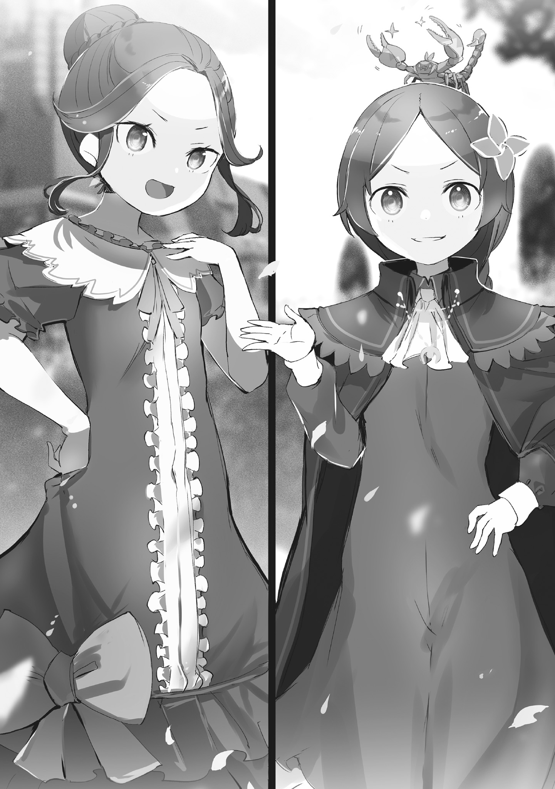

— Мы попробуем зайти со стороны Карараги. Там бдительность может быть ниже, чем на границе между Лугуникой и Волакией, которые и так вечно друг на друга косятся, — такое предложение Анастасии стало для Эмилии приятной неожиданностью.

Конечно, она понимала, что Анастасия, Юлиус и Ехидна беспокоятся за Субару и остальных, но они были из другого лагеря.

Изначально они отправились к Сторожевой Башне Плеяд по той же причине, но с разных позиций.

И теперь, когда все благополучно вернулись, у них не было никаких обязательств помогать в поисках пропавших.

— Я разделяю мнение госпожи Анастасии. Отношения между Империей и Королевством — это одно, но, что важнее всего, города-государства — родные земли торговой компании Хосин, оплот госпожи Анастасии.

— Там я смогу задействовать все свои связи. Не думаю, что это такая уж плохая ставка, а?

— Анастасия, Юлиус!…

И несмотря на всё это, они с такой готовностью вызвались помочь, что аметистовые глаза полуэльфийки невольно наполнились слезами.

— Я так рада, что мы с тобой подружились, Анастасия.

— Ну, думаю, мы не совсем подруги. Как и прежде, мы с Эмилией соперницы в гонке за трон. Но…

— Но?

— Когда разберёмся и с Нацуки-куном, и с Королевским Отбором, давай станем подругами. У меня, как и у тебя, Эмилия, тоже не так уж и много друзей.

В ответ на растроганные слова Эмилии Анастасия одарила её очаровательной улыбкой.

— Кстати, это она не из скромности сказала, а чистую правду. У Аны очень мало друзей.

— Эй, не болтай лишнего, — Анастасия ущипнула Ехидну за нос, заставив свою спутницу замолчать.

Тихонько хихикнув над этой сценой, Эмилия с тревогой и надеждой прижала руку к груди. Видя, как Эмилия успокоилась, Анастасия, однако, чуть строже добавила:

— Только не радуйся раньше времени, хорошо? Путь через Карараги в любом случае займёт у нас много времени… А у Нацуки-куна его ведь не так много, верно?

— Да. Нам нельзя мешкать… Поэтому мы попробуем пробиться в Империю своим способом, отличным от вашего, — Эмилия сжала кулачки и посмотрела прямо в светло-бирюзовые глаза Анастасии.

Пока те будут искать путь в Волакию через Карараги, Эмилия и её спутники попытаются попасть туда своими силами.

Собравшись с духом, полуэльфийка с серьёзным выражением лица заявила:

— …поэтому мы все постараемся и нелегально проберёмся в Империю!

— …

— …? Что случилось? Почему у вас двоих… нет, у вас троих таки-и-ие странные лица? — Воодушевлённая Эмилия склонила голову набок, удивлённая реакцией Анастасии и остальных.

В ответ на её недоумение Анастасия лишь отмахнулась.

— Когда я разговариваю с тобой, Эмилия, и хорошее, и плохое становится каким-то… мягким. Это забавно.

— Правда? Не очень понимаю, но, наверное, мягче лучше, чем твёрже?

— Как знать. Юлиус, а ты как думаешь?

— Я? …Я считаю, что это добродетель госпожи Эмилии.

— Эм, спасибо.

Похоже, её похвалили, так что Эмилия искренне поблагодарила Юлиуса.

Правда, после этого обмена слов сам Юлиус выглядел как-то растерянно, а Анастасия озорно улыбалась.

В таких случаях Эмилия обычно чего-то не замечала, но, скорее всего, в их словах был какой-то глубокий смысл.

— Вечно вы мне ничего не объясняете.

— Что ж, нечасто выпадает шанс поддержать чьё-то нелегальное проникновение в страну. Однако этот раз, похоже, тот самый редкий случай. И я, и Ана надеемся на ваш успех.

— Верно. Эмилия, ты ведь понимаешь, что это рискованная затея?

— …Угу, мне уже все высказали, как это опасно.

Подхватив слова Ехидны, Эмилия кивнула, встретив серьёзный взгляд Анастасии.

Нелегальное проникновение — это тайное вторжение в другую страну без разрешения.

Это плохо, и если их поймают, то ждёт суровое наказание, а ведь Эмилия — кандидат на престол Королевства Лугуника…

— Может, из-за меня отношения с Империей ухудшатся, а может, меня даже лишат права участвовать в Королевском Отборе.

— И ты всё равно пойдёшь на это? У тебя ведь тоже есть цели, которых ты хочешь достичь, не так ли?

Вопрос Анастасии был строгим, но в то же время в нём чувствовалась доброта.

Она была права.

У Эмилии была мечта, которую она хотела осуществить, став королевой.

Были люди, которых она хотела спасти, были цели и идеалы, что зародились с началом Королевского Отбора.

— Но я хочу достичь всего этого вместе с Субару. Поэтому я очень-очень постараюсь.

— …Субару — счастливчик.

— Не Субару счастливчик, а я.

Так Эмилия с улыбкой ответила беспокоящемуся Юлиусу, который очень сдружился с Субару во время их путешествия.

Она была бесконечно благодарна Субару за его усердие и старания, ведь он так часто её выручал.

Поэтому, если с ним что-то случится, она хотела быть первой, кто протянет ему руку помощи.

— Ладно-ладно, я прекрасно поняла твои мысли, Эмилия. Спасибо за угощение.

— Спасибо за угощение…

Анастасия хлопнула в ладоши, словно завершая трапезу, а Эмилия с замешательством уставилась на её губы. Разумеется, за всё время разговора они ничего не ели.

Почему она вдруг сказала «спасибо за угощение», Эмилия так и не поняла.

— Мы с Аной тоже скоро отправимся в путь. К счастью, если верить словам маркграфа Мейзерса, мы сможем воспользоваться силой того управляющего.

— Вы про Клинда? Он говорил, что он не управляющий, а дворецкий.

— В любом случае, мы сможем сократить время в пути до границы с Карараги. …Лично мне очень интересно, что это за магия.

— К сожалению, эту любознательность придётся отложить, да.

К сожалению для увлечённого магией Юлиуса, Эмилия и сама не знала секрета таинственных способностей Клинда.

Она ни разу не видела их в действии, так что, вероятно, он мог использовать свою силу лишь при особых обстоятельствах.

И то, что Субару и остальные стали такой «особой причиной», было очень кстати.

Хотя, возможно, такие решение принимал не сам Клинд.

— Эмилия.

— А, прости. Что?

— Как ты уже слышала, мы приложим все силы, чтобы помочь в поисках Нацуки-куна и Рем. Поэтому донести до столицы вести о Башне мы поручаем твоим людям.

— Да, конечно. Анна…

— …Это, по-своему, знак моего доверия.

— …

Эти слова, прервавшие её ответ, тяжёлым грузом легли на сердце Эмилии.

Она широко раскрыла глаза от их веса, а Анастасия серьёзно продолжила:

— Сторожевая Башня Плеяд, лишённая песчаных бурь и «Мудреца», стала куда более беззащитной, чем раньше. То, что на вершине сидит «Божественный Дракон», конечно, удивительно, но этого совершенно не достаточно. Если какие-нибудь злоумышленники или Культ Ведьмы нацелятся на Башню, быть беде.

— Для её защиты потребуется мощь Королевства. Изначально целью нашего путешествия был поиск способа спасти жертв Культа Ведьмы. Возможно, библиотека с «Книгами Мёртвых» станет ключом к решению.

— Прочесть их все и найти ответ… Это тернистый путь, требующий помощи многих людей.

Слова Анастасии, Юлиуса и Ехидны подчёркивали всю серьёзность ситуации.

Они были правы: потенциал Сторожевой Башни Плеяд был воистину безграничен.

Вероятно, в зависимости от намерений того, кто её использует, эта Башня могла сотворить как великое благо, так и великое зло.

И чтобы этого не допустить, Башня должна была перейти под управление Королевства.

— Только не забирай себе всю славу за покорение доселе непроходимых Песчаных Дюн Аугрии и захват Сторожевой Башни Плеяд с её неведомым потенциалом, ладно? Обязательно поделись.

Так, с озорной ноткой в голосе, Анастасия развеяла повисшее в воздухе напряжение.

Это было не столько сдерживание соперницы по Королевскому Отбору, сколько немного колкое напоминание.

…Нет, Эмилия понимала, что Анастасия сделала это намеренно.

Поэтому…

— Да, доверься мне. Я ни за что не сделаю ничего, что могло бы разочаровать моих друзей.

Эмилия, решив для себя не злоупотреблять этой заботой, со всей своей искренностью и толикой озорства кивнула в ответ.

— Я-то думала, у тебя найдётся способ проникнуть в Империю и вернуться обратно, на самом деле.

За этими, как обычно, резкими словами скрывалась неприкрытая бравада.

Сложив короткие ручки на груди и сделав надменное лицо, будто бы она ни на что и не надеялась, девочка лишь сильнее выдавала свою отчаянную мольбу.

Поэтому Розвааль на удивление искренне произнёс:

— Прости~и~и уж. Я как-то не предполагал, что во время Королевского Отбора придётся отправляться в Импе~е~ерию. Насколько я знаю, всё должно было завершиться в пределах Лугу~у~уники.

— Хмф, как жалко для владельца настоящей «Книги Мудрости», я полагаю. Я надеялась, ты покажешь мне то, чего не смогла бы Бетти, четыреста лет просидевшая с пустой книгой, на самом деле.

— …

— Ч-что это за жуткое лицо, я полагаю?

Розвааль, сидящий у стола в своём кабинете, с нескрываемым изумлением уставился на Беатрис, которая с важным видом произнесла эти, казалось бы, тяжёлые слова.

Четыреста лет она хранила пустую «Книгу Мудрости».

Эта рана была так глубока, что её можно было бы назвать священным шрамом, которого все боялись коснуться и который предпочитали не замечать.

И то, как легко Беатрис сейчас об этом говорила, поразило его.

— …Я завидую Субару-куну.

— Смысла не вижу, я полагаю! Не вздумай вешать лишний груз на Субару, когда он и так в беде, на самом деле! А знаешь что? Просто возьми и слетай в Империю за ними прямо сейчас, я полагаю!

— Если бы всё могло закончиться лишь тем, что летучий дракон просто укусит меня за зад, это было бы даже заба~а~авно, — Розвааль горько усмехнулся на её абсурдное требование.

Видя её нервозность, он, сохраняя эту усмешку на устах, он позвал её по имени: «Беатри~и~ис…».

— Я принял все возможные меры. Я ни за что не позволю тебе исче~е~езнуть.

— …Излишняя забота, я полагаю. Тебе нужен Субару, на самом деле. И Бетти это вполне устраивает.

— Какие печальные слова~а~а. Ты ведь знаешь, что я люблю тебя.

— Не говори глупостей!…

— И это тоже весьма печальное заблужде~е~ение. Что же тебя… ах, кста~а~ати.

Тут Розвааль прервался и прикрыл один глаз.

Глядя на Беатрис своим жёлтым оком, он, изображая безразличие, задал вопрос.

Вопрос, которого ни он, ни Беатрис не могли избежать…

— …Тот искусственный дух, что сопровождает госпожу Анастасию.

— …Только имя, на самом деле. Насколько Бетти смогла проверить, она ничего не знает, я полагаю.

Она, должно быть, ожидала этого вопроса.

В ответе Беатрис не было ни тени сомнения или колебания.

Искусственный дух в виде лисьего воротника, сопровождавший Анастасию, — дух, назвавшийся Ехидной, — был для Розвааля и Беатрис существом, которое они не могли игнорировать.

Похоже, Беатрис хотела верить, что этот дух не знает ничего важного.

— А что, если она лишь делает вид? Может, она обма~а~анывает тебя.

— Она призналась, что является искусственным духом. Какой в этом смысл, я полагаю?

Розвааль прищурился, услышав резкий ответ Беатрис.

Какой смысл был во лжи?

…Да сколько угодно.

В конце концов, те, кто лгут, лгут и без всякой на то причины.

С точки зрения такого злонамеренного человека как Розвааль, мысли Беатрис были слишком наивны.

Невероятная простота для Великого Духа, прожившего четыреста лет.

«И это было хорошо» , — подумал Розвааль, тихо вздохнув.

— По~о~онял. Раз уж у тебя появился друг-дух, я тоже не буду лезть с бестактными вопро~о~осами.

— Мы не друзья, я полагаю! Не говори глупостей, на самом деле.

— Понял, по~о~онял. Ну что, ты готова к путешествию? Если будешь мешкать…

— И без твоих напоминаний знаю, я полагаю! Хмф! На самом деле.

Отвернувшись с покрасневшим лицом, Беатрис вышла из кабинета, шлёпая босыми ногами по полу с такой силой, будто каждый её шаг был тяжёлым и весомым.

Её стойкая спина, не выдававшая душевной боли от отсутствия Субару, скрылась из виду, и…

— …Вы удовлетворены?

…голос раздался с коленей Розвааля, который проводил Беатрис взглядом.

Бросив взгляд вниз, он встретился с бледно-розовыми глазами, находившимися совсем близко.

Чувствуя тяжесть и тепло головы, лежащей у него на коленях, Розвааль пожал плечами.

— Я просто вёл необходимый разговор. Называть это «удовлетворением» — странный оборот ре~е~ечи.

— Ведь господин Розвааль любит госпожу Беатрис.

— …Когда ты повторяешь это, становится как-то нело~о~овко, — Розвааль скривил губы, когда ему с насмешкой напомнили о недавнем разговоре.

На него, приподняв голову, мягким взглядом смотрела Рам, лежавшая у него на коленях.

Она всё это время слушала их разговор с Беатрис, оставаясь в той же позе.

Разумеется, Беатрис ничего не сказала, понимая, что на то была причина.

— Ты, должно быть, сильно переутомилась в пути. Даже если бы не история с Субару-куном, поспешить с возвращением было правильным решением.

— Накопились душевное напряжение и усталость. Можете себе представить, как тяжело было сопровождать госпожу Эмилию и Барусу… Был бы Отто, я бы всё свалила на него, но он бесполезен.

— Он и сам восстанавливался после ра~а~ан. Будь к нему снисходительна. К тому~у~у же…

— …я предложила альтернативный план. Так что я его прощаю.

Розвааль тихо рассмеялся, услышав ответ Рам, сказанный с закрытыми глазами.

Это была высшая степень похвалы в её исполнении.

Истинное свидетельство того, как высоко она ценила Отто.

Продолжая разговор, Розвааль коснулся лба Рам — шрама от сломанного рога — и начал вливать туда точно отрегулированную ману, очищая её тело с нарушенной циркуляцией.

Одного лишь взгляда на эту мутную, иссохшую циркуляцию маны было достаточно, чтобы представить, какую боль испытывала Рам.

— Хорошо, что ты благополучно вернулась.

— …Господин Розвааль.

Слова сорвались с его губ сами собой, и Розвааль сам удивился своим словам, издав тихое «ах».

А вслед за удивлением его обожгла острая ненависть к себе.

Гнев на собственную расслабленность был само собой разумеющимся, но Розвааля охватил гнев на собственное бесстыдство.

Каким же ртом он мог произносить слова радости о благополучии Рам?

И всё же…

— …Да. Вот Рам и вернулась.

Вид счастливо улыбающейся Рам в ответ на его слова разрывал ему грудь.

Она была такой заботливой.

Можно было представить, какая буря тревог бушевала в её сердце из-за исчезновения Субару и Рем.

И всё же она улыбалась — ради Розвааля.

И то, что эта улыбка производила именно тот эффект, на который Рам рассчитывала, было невыносимо…

— Я понял, почему принял твою сестру, Рем, в особняк.

— …

Чтобы доказать, что он не заслуживает её улыбки, он решил открыть ей правду, которая должна была вызвать её разочарование.

Это было внезапно, но он долго об этом думал.

Какую пользу его заветной цели могло принести существование Рем, забытой всеми из-за Полномочия Чревоугодия?

Зачем Розвааль держал в особняке Рем, которая, в худшем случае, могла бы проспать вечно?

Наконец, он смог построить правдоподобную догадку.

Догадку, столь свойственную Розваалю, узнав о которой Рам на этот раз точно бы его не простила…

— Это…

— …замена рога Рам, не так ли?

— Э…

— Какая жалость. Попробуйте снова в другой раз.

«Если хотите, чтобы я вас возненавидела», — беззвучно добавила Рам и медленно закрыла глаза.

Ошеломлённому Розваалю не оставалось ничего, кроме как продолжать лечение маной.

Он был полностью в её руках, и, понимая всю свою беспомощность, ничего не мог поделать.

Он больше не знал, как заставить её страсть угаснуть.

«Книга Мудрости», что должна была указать ему путь, была сожжена не кем иным, как девушкой, лежавшей у него на коленях, и теперь уже никогда не покажет ему будущего.

И зная это, именно в этот самый миг он жаждал увидеть строки «Книги Мудрости» больше всего на свете.

— Анна, Мейли, я доверяю вам Башню! Постарайтесь, я тоже буду стараться!

Эмилия энергично помахала рукой и вместе с товарищами исчезла в мгновение ока.

Это действительно произошло за одно мгновение, и те, кто перемещался, ощущали это так же.

Конечно, для провожавшей их Аннерозе они тоже будто растворились в воздухе.

— Правда, это очень удобно, но так зага~а~адочно.

Сказав это, девочка с косичками провела носком туфельки по земле.

Мгновение назад здесь стояла драконья повозка, запряжённая двумя земными драконами, но и она исчезла вместе с ними.

Можно было понять, почему девочка, видя всё своими глазами, недоуменно склоняла голову.

— Я и сама не до конца понимаю, насколько непредсказуем Клинд.

Именно Клинд воспитывал Аннерозе как главу дома Милоад.

Он был для неё и опекуном, и наставником, но этот хладнокровный и непоколебимый дворецкий, насколько знала Аннерозе, нисколько не изменился ни во взглядах, ни в поведении, и причин тому она не знала.

Поэтому…

— Тебе стоит быть осторожнее. Он хоть и компетентен, но опасен.

— Это мне и Петра-чан, и сестричка с клыками говори~и~или, но что это значит-то? Что он любит маленьких де~е~евочек?

— Если говорить прямо, то да.

— А-ах, вот оно что~о~о. Ну, это меня совсем не пуга~а~ает, — Мейли беспечно махнула рукой.

Аннерозе, прикрыв один глаз, внимательно посмотрела на, казалось бы, беззащитную спину девочки.

На вид она была на два-три года старше самой Аннерозе.

За миловидной внешностью скрывались манеры и речь, полные какой-то усталости от мира, что создавало опасное впечатление.

Если верить тому, что она слышала ранее, это было неудивительно.

«Э-это, Мейли — девочка, которая сожгла наш старый особняк… н-нет, не одна, а вместе со своей сестрой. Но она не злая! А ещё у неё есть сила управлять зверодемонами, и из-за этого Субару тоже был в опасности… но она не злая!» — так отчаянно защищала её Эмилия, хотя Мейли была, без сомнения, опасной личностью.

Однако, учитывая, что её доверили Аннерозе, и ту роль, что она должна была исполнить вместо Эмилии и остальных, решение Аннерозе было очевидным.

— Я буду защищать тебя.

— …

— Что это за лицо? Будто моих гарантий вам недостаточно?

На гордое заявление Аннерозе Мейли, обернувшись, посмотрела с сомнением.

Когда Аннерозе потребовала объяснений, Мейли надула губки.

— Нет, это не так, про~о~осто… ты ведь младше меня, да? Я же старшая сестричка, разве не~е~ет?

— Вы думаете, надёжность определяется возрастом? Если на то пошло, то самой надёжной окажется Эмили.

— У-у… приводить в пример сестричку Эмилию — это нече~е~естно.

Аннерозе победоносно улыбнулась, видя, как Мейли расстроилась, задетая за живое.

Вот так, не зная этого, Эмилия помогала Аннерозе, даже не находясь рядом.

— К тому же, мне поручил тебя сам дядюшка. Думаешь, дядюшка доверил бы будущее тому, в ком хоть немного сомневается?

— …Я мало что понимаю в этом маркгра~а~афе. Но, думаю, звучит убеди~и~ительно. — Мейли задумчиво приложила палец к губам.

Внезапно воротник её плаща зашевелился, и из-под капюшона на макушку вылезла маленькая тень.

Это был маленький скорпион в красном панцире.

Сидя на голове у Мейли, он направил на Аннерозе свои клешни.

Словно хотел сказать, что это он защищает Мейли.

— Похоже, у вас весьма надёжный телохранитель.

— Пра~а~авда же? Поэтому я не беспокоюсь… но ладно. Какое-то время я позволю тебе себя защищать, де~е~евочка.

— Аннерозе. В идеале тебе следовало бы называть меня госпожой Аннерозе.

Многие недооценивали Аннерозе из-за её юного возраста, так что она уже привыкла к подобным ответам.

Вспомнилось, что при первой встрече с Эмилией они обменялись похожими фразами.

Тогда она и подумать не могла, что в будущем будет так дорожить той невоспитанной эльфийкой.

— Буду с нетерпением ждать, сможешь ли ты стать моим другом.

— …Петра-чан говорила мне что-то похо~о~ожее. Может, в этом поместье учат так подкатывать, м~м~м?

Мейли с подозрением посмотрела на Аннерозе, которая улыбалась, прикрыв рот рукой.

И тут…

— …Нет, это ошибочное суждение. Поправка.

— Кья-я-я?!

Внезапно появившийся из ниоткуда Клинд застал Мейли врасплох, и та издала пронзительный визг.

Мейли подпрыгнула от неожиданности, а скорпион, слетевший с её головы, был ловко пойман Клиндом.

«Опасно. Спасение», — пробормотал он, но гнев скорпиона это не уняло.

— Он уцепился вам за палец. Так вам и надо.

— Какие бессердечные слова. Однако я смиренно их принимаю. Сладостно.

— Не могли бы вы не сравнивать скорпиона с моей язвительностью?!

Клинд появился так же мгновенно, как и исчез.

С раздражением глядя на своего дворецкого, к пальцу которого прицепился скорпион, Аннерозе перевела взгляд на Мейли.

Та, обхватив голову руками, широко раскрыла глаза от неожиданности.

Девочка, только что уверявшая, что Клинд ей нипочём…

— Как видите, он весьма эксцентричен. Поэтому…

— П-поэтому~у~у?

— …я думаю, нам с вами стоит подружиться.

Аннерозе прищурилась и, растянув губы в улыбке, посмотрела на Мейли, которая тихо сглотнула.

Укротительница Зверодемонов промолчала, и это было правильным решением.

Ведь её мысль была слишком унизительной: «Раз ты родственница Розвааля, то твоё злое выражение лица меня не удивляет».

— На самом деле, у себя на родине я в розыске… ну, точнее, не совсем в розыске, но мне лучше не показываться на людях.

Когда Отто с серьёзным лицом сделал это признание, Фредерика, честно говоря, не смогла подавить в себе мысль: «Так я и думала».

Отто, министр внутренних дел лагеря Эмилии, был незаменимым сотрудником благодаря своему интеллекту и деловой хватке.

Наряду с Субару и Петрой, его можно было считать одной из трёх главных «находок» лагеря.

«Хотя ставить вас в один ряд с Петрой мне, честно говоря, не по душе…»

Как бы то ни было, Фредерика давно задавалась вопросом, какой жизненный путь и опыт отточили эту надёжность Отто.

Если бы речь шла о Розваале с его знатным происхождением, Эмилии с её выдающейся биографией или Петре, сияющей, как неограненный бриллиант, всё было бы предельно понятно.

Но Отто и Субару не подходили под эти категории, и, говоря прямо, Фредерика их побаивалась.

Но теперь, наконец, её страх по отношению к Отто мог быть развеян.

— Какое облегчение. Значит, господин Отто и впрямь тот человек, которого могут объявить в розыск.

— И впрямь?! Да ещё и облегчение?! Почему?!

— Ох, не обращайте внимания. Это моё личное мнение.

— Вот это-то и беспокоит больше всего?! Фредерика, вы что, считали, что для меня естественно быть в розыске?!

— …Иначе многое бы не сходилось.

Прикрыв клыки рукой, Фредерика отвела взгляд и высказала своё честное мнение.

Лицо Отто исказилось так, словно небо и земля поменялись местами.

Он беззвучно открывал и закрывал рот, ища поддержки у окружающих — у всех, кроме себя и Фредерики.

— Надеюсь, вы-то не скажете того же?

— Не парься, Отто бро. Сестрица всегда преувеличивает.

— Не знаю, преувеличивает ли Фредерика, но я уже слышала об этом раньше, так что не удивлена. Меня тоже на родине все боялись.

— Госпожа Эмилия, ваша ситуация немного отличается от ситуации Отто. Не делайте такое лицо. Ну вот, из-за того, что Отто сказал лишнего…

— И это я виноват?!

Получив ответы от Гарфиэля, Эмилии и, по цепочке, от Петры, Отто, похоже, вспомнил, с чего всё началось — с его положения на родине.

Он тут же закрыл лицо ладонями и бессильно пробормотал:

— На этот раз это тот редкий случай, когда я действительно виноват…

— Рада, что ты сам разобрался. Итак? Понятно, что тебе нелегко возвращаться на родину, но мы не можем вечно здесь торчать.

На Отто, воздевшего очи к небу, обрушились резкие слова Рам, которая стояла, обхватив себя за локти.

Однако, несмотря на отсутствие всякой мягкости, её слова были справедливы.

Они только что прибыли из особняка Розвааля к своей цели — торговому городу Пиктат — с помощью силы Клинда.

Появиться прямо посреди города было бы слишком заметно, поэтому они переместились в ближайший лес, откуда планировали выйти на дорогу.

Но именно там Отто и сделал своё признание.

Он был в розыске на родине, и поэтому ему было не по себе возвращаться домой.

— И всё же, именно в Пиктате мы можем найти способ попасть в Импе~е~ерию. И предложил это не кто иной, как сам Отто-кун. Исключить тебя из планов невозмо~о~ожно.

— Это, конечно, так… Просто я не хочу доставлять вам всем неприятности, и, как-никак, я обычный человек, так что мне нужно набраться смелости, чтобы войти в город, где на меня охотятся.

— «Обычный человек…»

Слова Отто, который прислонился к дереву и понурил голову, вызвали у всех одинаковую мысль.

— Обычный человек, надо же такое придумать, я полагаю.

— Да ничего я не придумывал!

Отто сокрушался из-за разницы между его самооценкой и мнением окружающих, услышав изумлённые слова Беатрис.

Но оставив в стороне это расхождение в самовосприятии Отто…

— Отто-кун, если тебе правда будет невмоготу, скажи, хорошо? Мы, конечно, хотим вернуть Субару и Рем, но если из-за этого ты пострадаешь, уверена, Субару будет хныкать так, будто это его собственная беда.

— Хотя на хнычущего Нацуки-сана я бы посмотрел…

— Отто, будь серьёзнее.

Услышав бормотание Отто, Петра строго сверкнула своими милыми глазками.

Петра применила свою безраздельную власть, которой в лагере Эмилии не мог противостоять никто.

Проигнорировать её могли только невозмутимая Рам и беззаботная Эмилия, так что Фредерика тоже была бессильна.

— Я не поддался этому давлению, но всё в порядке, госпожа Эмилия. Для гладкого ведения дел моё присутствие будет полезно. К тому же…

— К тому же?

— …наверное, пришло время встретиться лицом к лицу со своей родиной и прошлым.

Отто, отвечая на вопрос склонившей голову Эмилии, устремил полный решимости взгляд вдаль — в сторону торгового города.

Триумфальное возвращение в родные края, где его ждали старые счёты, — чувства Отто, должно быть, были далеки от спокойствия.

— К счастью, самый главный источник беспокойства в нашем лагере отсутствует, и мы здесь в полном боевом составе. Лучшей возможности вернуться домой, наверное, уже не будет!

— Отто, будь серьёзнее!

— А?!

На Отто, сжавшего кулаки, обрушился резкий окрик Петры.

Мало того, что он в розыске на родине, так он ещё и невозмутимо причисляет боевую мощь к факторам, обеспечивающим безопасное возвращение.

Именно из-за такого отношения его и прозвали «боевым министром».

«Почему умный господин Отто совершенно не видит того, что у него под носом… это для меня всегда было и остаётся настоящей загадкой…» — искренне думала Фредерика.

…Благополучно миновав пропускной пункт на въезде в город и оказавшись в торговом квартале, Гарфиэль невольно клацнул клыками, ощутив перемену в атмосфере.

— Да уж, атмосфера здесь отличается от других здоровых городов, вроде Костула или Пристеллы.

Он развалился на крыше драконьей повозки и, оглядываясь по сторонам, повертел головой.

Гарфиэль, выросший в уединённом «Святилище» в лесу, осознавал узость своего кругозора.

Прошёл почти год с тех пор, как он покинул лес, а мир всё ещё был полон неизведанного.

Промышленный город Костул, ближайший к особняку, портовый город Пристелла, где он провёл последние дни, и вот теперь Пиктат — третий крупный город, который он видел своими глазами.

Все они входили в пятёрку великих городов Королевства Лугуника, но различия в их особенностях поражали его воображение.

— В этом городе запахи повсюду разные… Обычно-то всё как-то однородно, тц.

— А, я знаю! Пиктат разделён на пять районов: восточный, западный, южный, северный и центральный. И в каждом районе продают совершенно разные товары.

— Ого! Госпожа Эмилия, вы, как всегда, на высоте, ага!

— Хе-хе, правда?

Эмилия, услышав бормотание Гарфиэля с крыши, с гордостью поделилась своими знаниями.

Государственное устройство, история королевства, становление городов, принципы ведения дел и многое другое — обучение Эмилии шло успешно, и её познания, которыми она делилась при случае, часто заставляли его согласно кивать.

И действительно, как и сказала Эмилия, разница в ароматах, витавших в разных частях города, похоже, была связана с разнообразием товаров, которыми торговал каждый район.

На улицах вперемешку стояли стационарные лавки и временные киоски, и весь город был окутан атмосферой оживлённого «рынка».

Можно было сказать, что это был крупный город, полный жизни и шума, полностью оправдывающий своё название — торговый.

— Тут пахнет какой-то незнакомой едой… А там какая-то ткань, которую я никогда не видел. О! А вот ножик, который так и хочется погрызть! Давайте остановим повозку…

— Гарф, не теряй из виду цель. Будь начеку.

— Гр-р… Д-да делаю я это, и без твоих слов, чтоб ты знала!

Рам отчитала Гарфиэля, чьи глаза загорелись при виде ножей в уличной лавке.

С сожалением оторвав взгляд от прилавка, Гарфиэль скрестил ноги и подпёр щёку рукой.

Прищурив свои зелёные глаза, он фыркнул, заметив взгляды, направленные на их драконью повозку.

— …Отто бро и впрямь разыскивают, а? — почёсывая шею, пробормотал он, раздосадованный столь явной враждебностью.

Хотя проблемного Отто спрятали внутри повозки, чтобы его не было видно снаружи, с самого въезда в город их преследовали колючие взгляды.

— Чтоб его начали преследовать, как только он вернулся… Слишком уж много врагов он себе нажил, Отто бро.

Подробностей ему не сообщали, но раз противники действовали так быстро, то дело было серьёзным.

Должно быть, он раскрыл преступления какого-то могущественного злодея или раскопал замятое дело, за что его ненавидели уже много лет.

Иначе это было не объяснить.

Если они перешли дорогу какому-то очень влиятельному человеку, то Гарфиэль был бессилен.

Конечно, если бы все эти взгляды принадлежали врагам, которые надеялись только на грубую силу, он бы их отбил.

— Если с кем-то не разобраться кулаками, придётся полагаться на Розвааля…

Правила, установленные за пределами леса, были сложными, потому что не всё решалось силой в драке.

К его досаде, в мире, где все подчинялись этим правилам, титул Розвааля имел огромную силу.

Гарфиэлю это не нравилось, как и многое другое.

Например, то, что Розвааль вообще сопровождал их в этом путешествии, вызывало у него большое недовольство.

— То, что титул этого ублюдка полезен, так же очевидно, как и то, что он чертовски опасен, понятно, как «Аллегро застенчив», не так ли?

Субару и Рем, заброшенные в Империю Волакия, пропали без вести, и ради них они должны были сплотиться, но Розвааль был явным источником беспокойства.

К тому же, Гарфиэль уже жалел, что не отправился с ними к Сторожевой Башне Плеяд.

…Конечно, он не собирался отрицать то, что приобрёл, оставшись в Пристелле.

— …Тяжело это, Капитан, двигаться шаг за шагом.

«Не торопись, не паникуй», — наверное, так сказал бы Субару.

Но эти слова, которые были бы сильной поддержкой, прозвучи они из его уст, в его отсутствие казались лишь пустой надеждой.

И хотя он понимал, что только упорство поможет пробить эту стену тревоги…

— …Гарф.

Голос с козел отвлёк Гарфиэля от его размышлений.

Фредерика, державшая поводья драконьей повозки, заговорила слегка напряжённым голосом.

Он собрался и посмотрел туда, куда был направлен её взгляд — вперёд по ходу движения.

Его взгляд проскользнул над головами чёрного и синего земных драконов и остановился на сцене, развернувшейся впереди…

— Что за?… — увидев это, Гарфиэль растерялся, не зная, как реагировать.

Впереди, посреди улицы, стояли и широко махали руками крупный мужчина и мило улыбающаяся рядом с ним элегантная женщина.

Эта пара средних лет, так бодро преградившая им путь, видя их замешательство, открыла рты и…

— Не беспокойтесь, пожалуйста! Спутники нашего сына, добро пожаловать в торговую компанию Сувен!

— Э-э-э-э?! — раздался изнутри повозки удивлённый возглас Отто, который, кажется, ударился головой о стену.

Этот приветственный клич громким эхом разнёсся по всей улице.

— Добро пожаловать, вы проделали долгий путь. Меня зовут Мазеран Сувен.

Так, с улыбкой, глава компании — Мазеран Сувен — приветствовал внезапных гостей.

Их провели в приёмную, угостили ароматным чаем и сладостями, и радушный приём с обаятельной улыбкой не мог не расположить к себе.

— Каков сын, таковы и родители.

— Это вы сейчас точно не в хорошем смысле сказали?

— Ха.

Рам, кратко оценив гостеприимство, фыркнула в ответ на слова ушастого Отто.

Она могла бы и более изящно унизить Отто, но милосердная Рам не стала бы издеваться над сыном в присутствии его родителей.

Тем более, когда здесь были и отец, и мать.

— Надо же, Отто, так внезапно вернуться. Он с детства был таким: как что-то вбьёт себе в голову, так ничего вокруг не видит. Мы с ним намучились.

— А, да, это и сейчас не изменилось. Отто-кун часто вместе с Субару вытворяет что-нибудь из ряда вон выходящее и всех нас удивляет.

— Беря в расчёт чувства господина Отто, я, пожалуй, воздержусь от честного ответа.

— Я отвечу так же, как сестрица Фредерика.

Элегантная женщина, так мило беседовавшая с Эмилией и остальными, была матерью Отто — Фрамир Сувен.

…Так и состоялась встреча лагеря с родителями Отто.

— Рам? Ты чего так уставилась на папашу с мамашей Отто бро, а?

— Ничего. Просто убедилась, что Отто унаследовал черты обоих родителей, и вычеркнула из головы вариант, что его подобрали под мостом.

— Зачем вообще было такое подозревать?! Я средний из трёх братьев!

— Предосторожность никогда не помешает.

— Для чего?!

Отто, похоже, был в приподнятом настроении от возвращения домой и был на порядок шумнее обычного.

Понятно, что он так вёл себя перед родителями, но хотелось бы, чтобы он успокоился.

— Прошу прощения, что прерываю столь оживлённую беседу.

Когда они обменялись первыми впечатлениями, руку поднял Розвааль.

Он с удовольствием принимал гостеприимство и, глядя на благодушного Мазерана, сказал:

— От лица всех присутствующих благодарю вас за тёплый приё~ё~ём. Однако я удивлён. Мы ведь даже не смогли отправить письмо о нашем прибы~ы~ытии, а вы встретили нас раньше, чем мы успели подъе~е~ехать.

Вопрос, заданный Розваалем, беспокоил и Рам: как родители Отто узнали об их приезде?

Они прибыли сюда с помощью таинственной силы Клинда и не сообщали семье Отто о его возвращении.

Почему же они ждали их у ворот дома?

— Ах, прошу прощения, если мы вас этим удивили. Для нашего города это обычное дело, поэтому мы и не стали ничего упоминать. …Отто.

— Д-да?

— Почему ты ничего не рассказал тем, кто о тебе заботится? Только не говори, что ты, по глупости своей, забыл.

— Эм, то есть… я запамятовал. Мне крайне стыдно…

Под тихим напором отца, Мазерана, Отто растерянно опустил глаза и понурил голову.

Видеть, как над Отто подшучивают, было привычно, но видеть, как его отчитывают по делу, — редкость.

Рам с тихим удовлетворением посмотрела на Мазерана, который сокрушённо качал головой.

Мазеран, сохраняя мягкое выражение лица, коснулся пальцами своих усов, выдававших в нём бывалого человека, и сказал:

— Прошу прощения за недосмотр моего непутёвого сына. Но, право, в этом нет ничего особенного. Здесь, в торговом городе, торгуют всем: товарами, людьми, информацией.

— …Я~я~ясно. В некотором смысле, пропускной пункт служит именно для этого.

Розвааль, услышав ответ, понимающе кивнул, и Мазеран подтвердил его слова: «Именно так».

С некоторым опозданием Рам тоже поняла суть дела и перевела свой бледно-розовый взгляд за пределы особняка — туда, где находился городской пропускной пункт, через который проехала их драконья повозка.

Естественно, на въезде в город стражники проверяли и груз, и пассажиров.

Если эта информация распространилась, то и действия Мазерана, и шквал колючих взглядов становились понятны.

— Но если городская стража так легко разбалтывает информацию, это же удар по репутации, разве нет?

— Разбалтывает? Какое ужасное заблуждение. Они лишь сообщают нужные факты тем, кому следует. В этом и заключается твёрдое доверие. В каком-то смысле, это можно назвать и контрактом.

Шанс на победу и шанс на сделку — эти слова звучали одинаково и имели схожий смысл.

Пиктат — город, который кишмя кишит жадными купцами, ведущие ожесточённую борьбу.

Управлять здесь торговой компанией, передаваемой из поколения в поколение, означало постоянно добиваться результатов.

И чтобы соответствовать этим требованиям, Мазеран выбирал не выбирать средства.

…То, что он узнал о возвращении сына, которого не видел несколько лет, было доказательством того, что информация с пропускного пункта дошла до него.

Но сама мысль о том, что Отто может быть в повозке дома Мейзерсов, не могла возникнуть, если не знать, где сейчас находится его сын и чем занимается.

Иными словами, всё это было результатом тщательной, почти навязчивой подготовки и предварительных действий.

— Всё больше убеждаюсь: каков сын, таковы и родители.

— …Согласна, на самом деле. Но благодаря этому шансы на то, что на них можно положиться, возросли, я полагаю, — кивнув на бормотание Рам, тихо прошептала Беатрис.

Глубоко утонув в диване и оперевшись на плечо сидевшей рядом Петры, Беатрис была вынуждена экономить энергию, пока не воссоединится с Субару, её источником жизни.

Не имея возможности получать ману извне, единственной мерой было снижение её расхода.

И всё же, её нетерпение, заставившее её заговорить, было до боли понятно Рам.

Рам тоже хотела как можно скорее обнять… не Субару, а Рем.

— В этом и есть смысл рисковать. …Отто, говори.

— Весь риск ложится на меня, но… кхм. Отец, у меня есть к вам дело. Я понимаю, что ситуация сложная, но это касается Империи Волакия.

— Хо, Волакия, значит. — Мазеран театрально вскинул брови и изменил тон голоса.

Казалось, каждый его жест, каждый оттенок голоса был частью купеческого искусства убеждения, направленного на то, чтобы манипулировать мыслями собеседника.

Но Рам решила довериться их сыну, надеясь, что он раскусит эти уловки, и позволила разговору продолжаться.

Отто, в ответ на реакцию отца, сжал губы и серьёзно сказал:

— Нам нужно как можно скорее попасть в Империю. Желательно, всей этой большой компанией, но законным путём границу нам не пересечь. Поэтому…

— Вам нужен способ пересечь границу, и вы хотите, чтобы мы вам в этом помогли?

— Да, именно так. Я вернулся домой, полагаясь на ваши средства и информацию, — сняв шляпу, Отто с серьёзным лицом изложил отцу суть дела.

Мазеран, поняв цель, прищурился, словно о чём-то задумался.

Затем он было открыл рот, чтобы что-то сказать, но…

— …Это значит, ты хочешь одолжить силу торговой компании Сувен, так? В таком случае, Отто, это не консультация.

— Мама…

Быстрее, чем ответил Мазеран, в разговор вмешалась Фрамир.

Она, беседуя с Эмилией и остальными, похоже, прислушивалась и к разговору мужа с сыном.

Обернувшись к сыну, она ласково улыбнулась.

— Я ведь учила тебя правильно использовать слова, помнишь? И то, что перед тобой семья, ничего не меняет. Это ты тоже помнишь, да?

— Ух… да, помню.

— Вот и хорошо. Тогда то, с чем ты пришёл, — это не консультация, верно?…

Фрамир выпрямилась и, не переставая улыбаться, протянула руку к Отто.

Лёгкое замешательство пробежало по лицам Эмилии и Фредерики, а Гарфиэль, вытаращив глаза, наблюдал за происходящим.

Только Рам, Розвааль и догадливая Петра почувствовали неладное, и их взгляды, естественно, сосредоточились на Отто.

Оказавшись под взглядами и своего лагеря, и своих родителей, Отто со вздохом смирился.

И…

— Я пришёл не для «консультации», а для «деловых переговоров».

В тот миг, когда он провёл эту черту, Рам почувствовала, как изменилась атмосфера в комнате.

Мягкие, добродушные выражения на лицах Мазерана и Фрамир не изменились, но их суть кардинально преобразилась.

…Можно сказать, в воздухе повисло напряжение, как перед дуэлью.

С этого момента этот дом перестал быть домом Отто и стал штаб-квартирой деловых партнёров.

— …Давайте поговорим, отец, матушка. О взаимовыгодной сделке между нами, группой во главе с госпожой Эмилией, и торговой компанией Сувен.

— Вот это по-нашему.

— Вот это наш сын.

Прижав снятую шляпу к груди, Отто принял эффектную позу, и супруги в унисон улыбнулись.

Эта сцена, со стороны, выглядела донельзя странно.

В ней витало неописуемое, зловещее напряжение, но в то же время она убеждала посторонних в том, что это, без сомнения, семья.

И снова в душе Рам всплыло чувство, которое она испытывала уже не раз.

Рядом с Рам, которая прищурила свои бледно-розовые глаза, наблюдая за происходящим, сидела Эмилия.

Совершенно не обращая внимания на напряжённую атмосферу, она беззаботно произнесла:

— Отто-кун так похож и на папу, и на маму, да?

На это трогательное замечание Рам лишь тяжело вздохнула.
