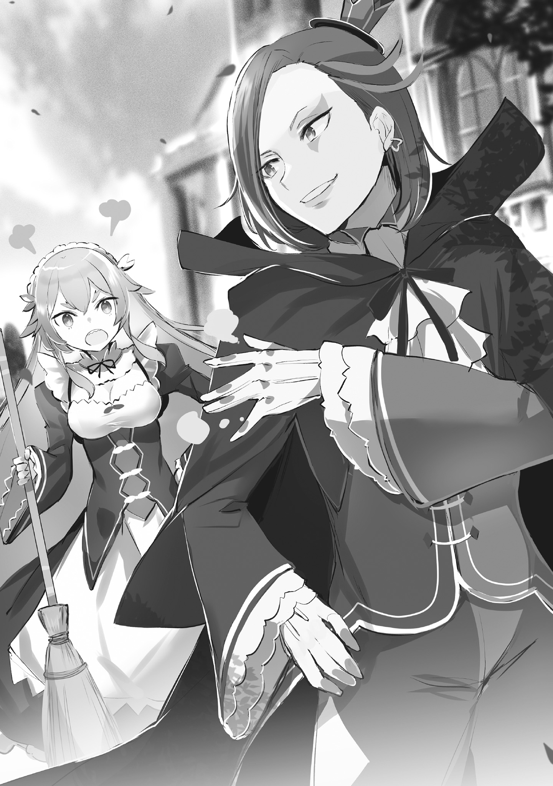
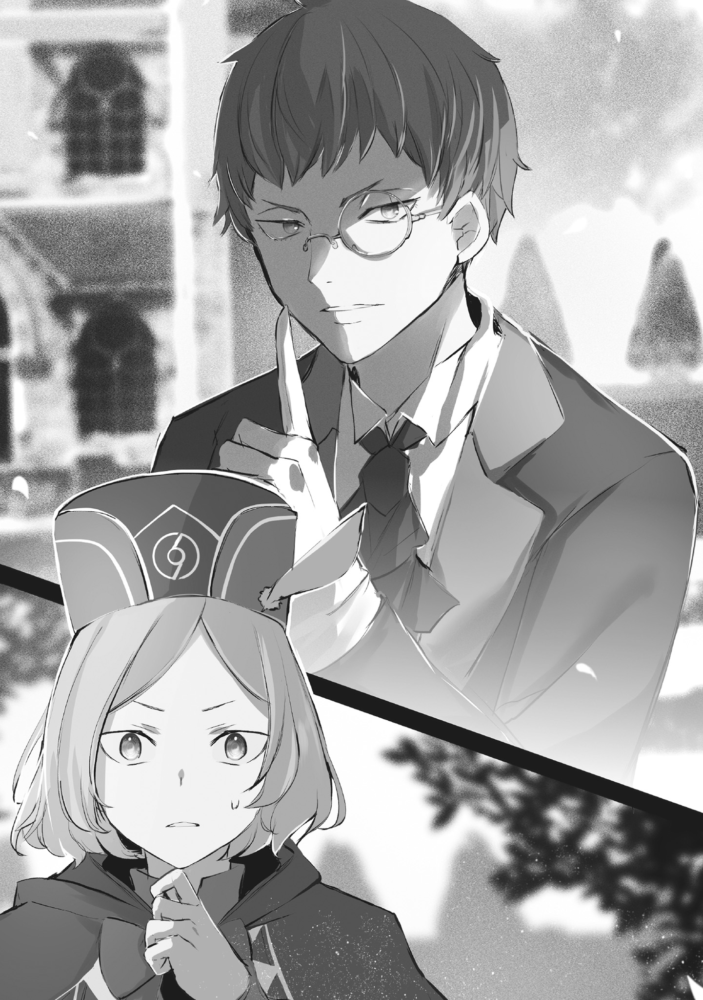
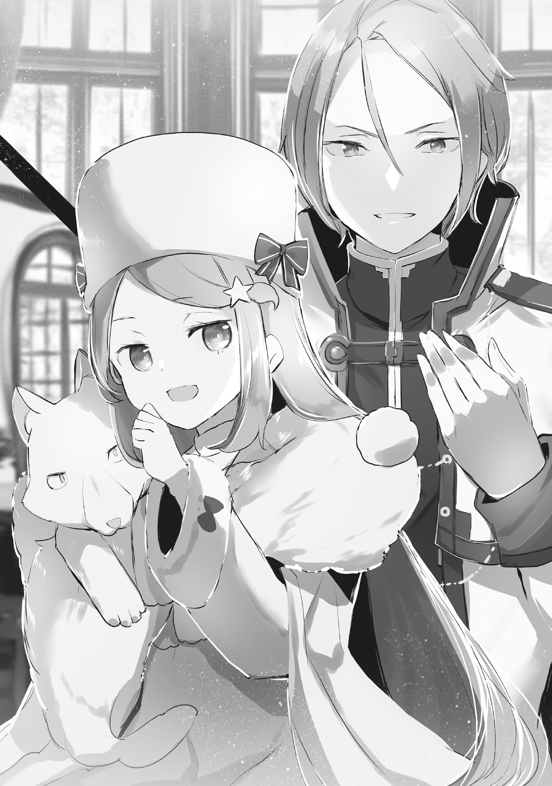
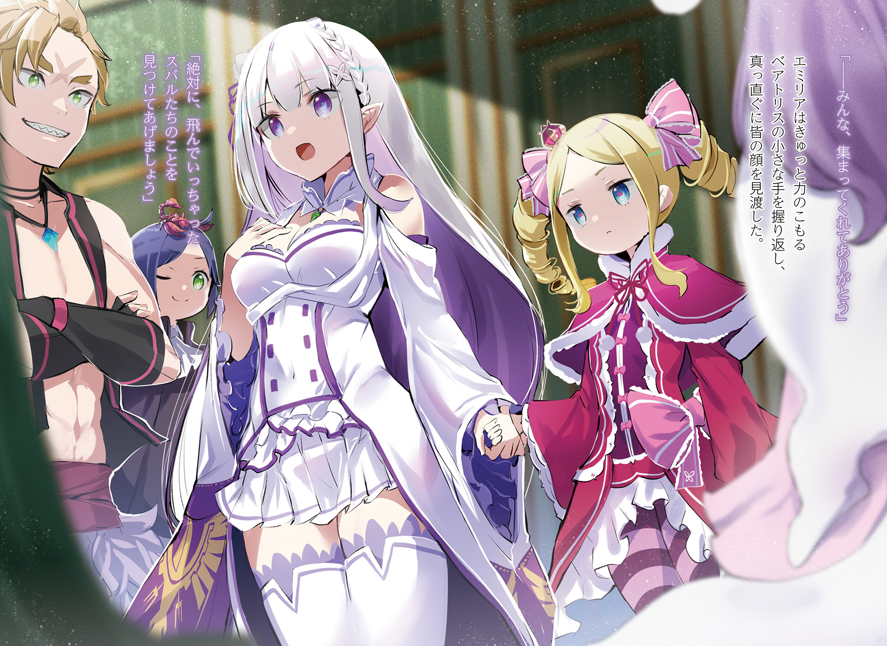

Нацуки Субару исчез из Сторожевой Башни Плеяд.

Вкратце, в письме, доставленном в особняк, говорилось именно об этом.

— Госпожа Эмилия стала куда~а~а лучше в каллиграф~а~афии, — пробормотал Розвааль L. Мейзерс, прищурив свои разноцветные глаза и пробежавшись взглядом по тексту.

Он коснулся пальцами своего тонкого подбородка, высказав замечание, совершенно не связанное с содержанием послания.

Когда они только познакомились, неосведомлённость Эмилии о мире переходила все границы. Она вела затворнический образ жизни в родном лесу, вдвоём со своим «отцом» — Великим Духом, и была совершенно не знакома с общепринятыми нормами.

Чтобы подготовить её к участию в королевских выборах, пришлось приложить немало усилий для её обучения, и будущее казалось весьма туманным.

Однако благодаря своей покладистости и стремлению к знаниям Эмилия добилась заметных успехов.

Конечно, в ней всё ещё было много незрелости, но её рост доставлял удовольствие тем, кто занимался её образованием. Если бы королевские выборы не были ограничены тремя годами, было бы забавно обучить её и многим другим вещам.

— Впро~о~очем, сейчас не время для таких беззаботных мы~ы~ыслей, — сказал он, используя этот миг ухода от реальности, чтобы собраться с мыслями, и закрыл глаза.

Не так давно Эмилия вместе с Субару и другими спутниками отправилась к песчаным дюнам Аугрии на восточной границе королевства — к Сторожевой Башне Плеяд, обители «Мудреца».

Целью их путешествия был контакт с «Мудрецом» Шаулой и обращение к её знаниям, которые, по слухам, были всеобъемлющи.

Однако Розвааль полагал, что испытание Башни будет сопряжено с неимоверными трудностями — такими, с которыми не смог справиться даже «Святой Меча» Райнхард, — и что без Нацуки Субару оно было бы попросту невыполнимо.

И действительно, хоть и было неясно, какой именно вклад внёс Субару, Эмилия и её спутники благополучно добрались до Сторожевой Башни Плеяд и достигли своей цели.

Вот только… это и привело к проблеме, упомянутой в самом начале.

— Субару-кун покинул госпожу Эмилию, значит… Похоже, это непредвиденное обстоятельство.

Способность уладить любую ситуацию наилучшим образом — вот какой Розвааль знал силу Субару.

И если даже этой силы оказалось недостаточно, чтобы справиться с возникшей проблемой… иначе и не объяснить, почему Субару оставил Эмилию.

Для Розвааля это тоже было чрезвычайной ситуацией.

Нужно всё исправить.

Любой ценой.

— …

Прищурив глаза, Розвааль распахнул окно своего кабинета и, выпрыгнув из него, грациозно спланировал во двор перед особняком, а его плащ развевался на ветру.

Приземление было безупречным, но нашёлся тот, кто был возмущён столь внезапным поступком.

— Господин! Что это вы себе позволяете?! Такое невежество простительно разве что Гарфу… — заметив выпрыгнувшего Розвааля, к нему подбежала горничная Фредерика.

Её длинные золотистые волосы развевались, а в прекрасных изумрудных глазах горел гнев.

Подступив вплотную, она уже была готова высказать свои нравоучения, не обращая внимания на то, что перед ней хозяин особняка.

— Прошу вас, прекратите эти детские выходки. Если бы вас увидела Петра, она отчитала бы вас куда строже, чем я…

— Фредерика.

— Что такое?! Сразу скажу, я делаю это ради вас, господин…

— …Птица принесла послание от госпожи Эмилии. Дело срочное. Приготовься.

— …Слушаюсь. А вы что намерены делать, господин?

Строгий тон Розвааля, прервавший её нотацию, заставил Фредерику мгновенно сменить тон и выпрямиться.

Такая быстрая реакция была образцом для подражания любой горничной.

В ответ на её вопрос Розвааль указал пальцем в небо.

— Судя по ситуации, нам срочно нужен транспорт. Я позову Клинда. Вернусь через несколько часов.

— …Поняла. Я передам всё Петре.

При упоминании имени Клинда уголки глаз Фредерики едва заметно дёрнулись, но Розвааль не стал указывать на её неприязнь.

Отношения между Фредерикой и Клиндом, некогда очень близкие, стали несколько натянутыми.

Розваалю хотелось бы, чтобы эти двое талантливых слуг работали слаженно, но это так и оставалось для него головной болью.

Как бы то ни было…

— Вот содержание послания. Детали доверяю тебе. Прошу, всё тщательно обдумай и подготовься.

Передав Фредерике письмо от Эмилии, Розвааль повернулся к ней спиной.

Он был уверен, что, прочитав его, Фредерика всё устроит наилучшим образом.

Положившись на неё, Розвааль легко оттолкнулся от земли и взмыл в воздух.

Это была магия полёта, созданная сочетанием магии ветра, земли и света, — весьма полезное заклинание, позволяющее развивать скорость, не уступающую перелётным птицам.

Однако оно относилось к категории высшей магии, и мало кто мог его воспроизвести.

И королевский двор, и старые друзья не раз просили его не использовать это заклинание слишком часто из-за малого числа владеющих им…

— …Но сейчас как раз тот самый чрезвычайный случай, — произнёс он невольно серьёзным тоном, отбрасывая все предостережения, и, словно разрезая голубое небо, полетел прочь.

— Если бы вы всегда вели себя так серьёзно, окружающие смотрели бы на вас куда добрее, — пробормотала Фредерика, поднимая голову после глубокого поклона.

Ветер, поднятый её улетающим хозяином, развевал её длинные волосы.

Она сокрушалась о том, каким же нескладным, при всей его одарённости, был Розвааль.

Судя по его быстрой реакции и серьёзности, беспокойство Розвааля об Эмилии и остальных было неподдельным. Конечно, в основе всего лежала его собственная цель, но это не меняло его отношения к делу.

«Почему бы не показать эту свою сторону Петре, Отто или Гарфиэлю, которые вечно следят за каждым его шагом?» — думала она.

— Неужели это лишь моя благодарность господину застилает мне глаза? — Опустив брови и тяжело вздохнув, Фредерика перевела взгляд на письмо в своих руках.

Послание с птицей — способ доставки писем на дальние расстояния с помощью птиц, прошедших специальное разведение и обучение.

Эту технологию разработала бабушка Розвааля, его предшественница на посту главы семьи.

Хотя у метода было много недостатков, таких как высокая стоимость разведения птиц и необходимость наносить на письма скрытые печати на случай их перехвата или гибели птицы, он был популярен среди высшего сословия королевства.

Тот факт, что письмо прибыло с восточной окраины королевства, из дюн Аугрии, говорил о поразительной скорости и дальности доставки.

Но что же заставило Розвааля стать таким серьёзным?

— Это…

Пробежав глазами по письму, Фредерика забыла даже прикрыть рот рукой.

Она забыла об этом бессознательном жесте, который никогда бы не забыла в обычной ситуации, — настолько шокирующим было содержание, и более того…

— Сестрица Фредерика! Господин только что куда-то улетел?

Петра, которая в последнее время обучалась магии у ненавистного ей Розвааля, почувствовала возмущение маны в особняке и выбежала во двор.

Фредерика, знавшая о влюблённости этой девочки, которую считала почти-что сестрой, осознала истинный смысл слов Розвааля «остальное доверяю тебе» и мысленно прокляла его.

— …И как мне теперь рассказать об этом Петре? — бессильно прошептала Фредерика, глядя в небо, где скрылся её хозяин, и думая, как передать Петре содержание письма Эмилии, заставившего Розвааля так спешить.

Спустя несколько часов после того, как прозвучали полные обиды слова Фредерики, Розвааль, ставший их причиной, стоял лицом к лицу с тем, кого искал, в нужном ему особняке.

— Как всегда, визиты дядюшки так внезапны.

— Признаю, что это неве~е~вежливо. Но у меня срочное дело. Прошу меня прости~и~ить.

— Напротив, было бы куда хуже, если бы вы явились через балкон без всякой на то причины.

С этими словами на Розвааля, вошедшего с террасы, строго, но по-детски взглянула хозяйка поместья и глава дома Милоад, с которым его связывали долгие годы знакомства, — Аннерозе Милоад.

Впрочем, долгие годы знакомства связывали его с семьёй Милоад, а с самой Аннерозе, которой было всего девять лет, он был знаком лишь с момента её рождения, то есть всего около десяти лет.

«Она выросла в поистине замечательную леди», — с умилением подумал Розвааль, но…

— Дядюшка, мне уже не девять, а десять лет. Прошу не ошибаться.

— Ох, кажется, я ничего такого и не говори~и~ил.

— Ваши глаза сказали всё за вас. Возьмите себя в руки. Ваше поведение, одежда и образ жизни терпимы лишь потому, что все ошибочно полагают, будто внутри вы порядочный человек.

— Ох, ну что ж, после твоих слов я просто обезору~у~ужен, — Розвааль криво усмехнулся на замечание Аннерозе и откинулся на спинку дивана для гостей.

Будучи благодарным ей за хладнокровие, с которым она приняла своего опекуна, явившегося по воздуху, Розвааль искал слова, чтобы перейти к делу.

Однако…

— Раз уж вы прилетели по воздуху, значит, у вас ко мне просьба… или к Клинду. А может, и к нам обоим?

— Ты и вправду поразительно проница~а~ательна. Неужели я так легко чита~а~аюсь?

— Да, очень легко. Дядюшка всегда выбирает самый быстрый и оптимальный путь. Вы не прибегаете к окольным путям и обходным манёврам, потому что боитесь потерпеть неудачу, не так ли?

На эту детскую провокацию, сопровождавшуюся подмигиванием, Розвааль решил, что разумнее всего будет не спорить.

Учитывая обстоятельства её рождения и его отношения с её родителями, он был слаб перед Аннерозе.

Девочка, прекрасно понимая свою ценность для Розвааля, щёлкнула пальцами.

— Клинд, войди. Впрочем, ты ведь уже здесь?

— …Да, как вы и сказали. Проницательность.

В ответ на зов раздался голос, и в дверях приёмной показался человек с худым лицом.

Мужчина в безупречно выглаженном костюме дворецкого, с моноклем на одном из проницательных глаз, — дворецкий дома Милоад и один из козырей в рукаве Розвааля.

Воспользовавшись любезностью сообразительной Аннерозе, Розвааль перешёл к сути своего визита.

А именно…

— Пришло послание с птицей от госпожи Эмилии. Похоже, мне придётся отправиться в Империю по делу, связанному с Суба~а~ару-куном. Поэтому я хотел бы заручиться вашей помощью для улаживания дел в моём поме~е~естье.

— …Эмили и Нацуки Субару, значит, — задумчиво пробормотала Аннерозе, и её брови дёрнулись.

Дом Милоад был одним из влиятельных сторонников Эмилии в королевских выборах.

Но даже если бы это было не так, Аннерозе, придумавшая своё прозвище для Эмилии, не пожалела бы сил, чтобы помочь ей.

Даже если дело касалось её соперника в любви, Нацуки Субару, к которому она питала смешанные чувства.

— …Значит, пока вы, дядюшка, будете решать проблему, я должна присмотреть за домом Мейзерсов?

— Да, я хочу поручить это тебе. У меня нет никого друго~о~ого, кому я мог бы доверя~я~ять.

— Прекратите эти лестные речи… Вы кого-нибудь оставите?

— Я думал оставить Рам или Фредери~и~ику… но, похоже, это будет сло~о~ожно. Судя по всему, проблема коснулась не только Субару, но и Рем, которую я отправил вместе с ни~и~ими.

При этих словах Розвааля Аннерозе изящно нахмурилась.

Хотя он не стал на этом заострять внимание, в письме Эмилии говорилось, что пропал не только Субару, но и Рем.

В таком случае, Рам, должно быть, сильно встревожена.

Ведь горничная отправилась в это путешествие именно в поисках способа спасти свою спящую сестру. Узнав, что Рем не только не очнулась, но и исчезла, она наверняка потеряет покой.

Розвааль и не думал, что она послушается, если ей велят спокойно ждать в особняке.

— Так что~о~о я смогу оставить разве что Фредерику… Разумеется, я тщательно всё обду~у~умаю. В любо~о~ом случае, Фредерике придётся передать дела Кли~и~инду.

— Что ж, я согласна присмотреть за вашим домом. Что до остального… — Аннерозе подхватила мысль Розвааля и быстро определила свою роль.

В конце своей речи она устремила свои миндалевидные глаза на Клинда, стоявшего за её спиной.

Побуждаемый взглядом хозяйки, всемогущий дворецкий почтительно поклонился.

— Тогда позвольте и мне задать вопрос. Чего вы желаете от меня, господин?

— …У Субару-куна есть одна проблема. Его нельзя надолго разлучать с Беатри~и~ис. Время ограничено.

— Контракт заклинателя духов между господином Субару и госпожой Беатрис. Его срок и ограничения. Предел.

«До чего же вы оба быстро соображаете», — с горечью подумал Розвааль, скривив губы.

Субару и Беатрис, связанные узами контракта как партнёр и дух, находились в созависимых отношениях, где каждый восполнял недостатки другого.

Отношения Субару, чьи врата были полностью разрушены и который лишился способа высвобождать производимую телом ману, и Беатрис, имеющей дефект, из-за которого она могла принимать ману только от своего партнёра, были идеальными.

Сами они, конечно, стали бы утверждать, что их отношения не основаны на таком расчёте, но их мнение сейчас не имело значения.

Проблема заключалась в очевидном недостатке этих идеальных отношений.

— То, что они так дружны, это прекрасно, но стоит их разлучить, как они оба оказываются на грани гибели. Субару-куну грозит смерть от избытка маны, а Беатрис — исчезновение из-за её нехватки.

— Это невыносимо как для вас, господин, так и для меня. Потеря.

— Да, это та~а~ак. Я не могу позволить себе потерять такой ко~о~озырь, как Субару-кун.

— Прошу прощения. Я говорил о госпоже Беатрис. Приношу извинения.

— …

Розвааль скривился от лицемерных извинений Клинда.

Аннерозе хлопнула в ладоши между ними и сказала: «В любом случае», — побуждая их продолжать.

— Обстоятельства ясны. И причина, по которой вы, дядюшка, просите помощи Клинда, тоже… Но сократить расстояние он может только в пределах Лугуники.

— Конечно, я это понима~а~аю. Как бы то ни было, чтобы отправиться в Импе~е~ерию, нужно будет уладить дела в разных местах. Могу я рассчитывать на тебя, Кли~и~инд?

— Если вы желаете, господин, а госпожа Аннерозе согласна. Без проблем. Однако…

— Плата, не та~а~ак ли? Я знаю, хоть это и рвёт мне се~е~сердце.

Пытаясь ответить как можно бесстрастнее, Розвааль понял, что ему это не удалось.

Хоть он и понимал, что это неизбежно, мысль о плате разрывала ему сердце.

Возможно, эта душевная боль и была доказательством платы, как утверждал сам Клинд.

Продавать свои воспоминания по частям — какая ирония для Розвааля, так отчаянно цепляющегося за прошлое.

— Я отдам в качестве платы три… нет, четыре заклина~а~ания. Взамен я хочу одолжить силу твоего Полномочия.

— Четыре — это решительно. Смело.

— Если поскупиться и этого окажется недостаточно, будет плаче~е~евно. Времени нет. И у меня то~о~оже, — прикрыв один глаз, Розвааль посмотрел на Клинда своим жёлтым глазом.

Время было дорого.

И это касалось не только текущей проблемы, но и всего пути к исполнению его заветного желания.

Розвааль больше не имел права на ошибку.

Ждать следующей возможности — такой роскоши он позволить себе не мог.

— Сначала встреть госпожу Эмилию и остальны~ы~ых. И будь осторожен, не проговорись о своём Полномо~о~очии.

— Слушаюсь. Госпожа Аннерозе, вы не возражаете? Одобрение.

— …Раз это ради Эмили, поступай так, как говорит дядюшка, Клинд, — Аннерозе с не по годам мудрым взглядом кивнула Клинду.

Дворецкий низко поклонился своей хозяйке, и в тот же миг его фигура исчезла.

Он буквально растворился в воздухе.

Не спрятался, не стал невидимым.

Вероятно, сейчас он уже был в Мируле, ближайшем городе к песчаным дюнам Аугрии.

— Если бы захотел, мог бы, наверное, добраться и до самой Сторожевой Башни Плеяд, — сказал Розвааль.

— Он сам говорил, что не может. Якобы есть причина, по которой ему нельзя приближаться к Башне… Подробностей он не рассказал, — рассказав о Полномочии исчезнувшего Клинда, Аннерозе опустила глаза.

Розвааль с удивлением посмотрел на неё, и после недолгого молчания она спросила:

— Вы уверены, дядюшка?

— Спрашивать об этом, когда уже ничего не верну~у~уть, не слишком ли жестоко с твоей стороны~ы~ы?

— Магия ведь очень важна для вас. Очень, очень важна.

— …И именно поэтому, — ответил он.

Взгляд больших глаз Аннерозе вызвал у Розвааля чувство дежавю.

Вероятно, черты её лица и её искренность напомнили ему о её родителях.

Крепко сжав ткань на груди, Розвааль стерпел боль от укоров из прошлого.

Он не пожалеет никаких жертв ради исполнения своего заветного желания, ради встречи с той, кого он так хотел снова увидеть.

Даже если ценой окажется благословение, дарованное тем самым человеком.

— Дядюшка, прошу вас, не накручивайте себя так.

— Всё наоборот, Аннерозе. У меня нет причин не накручивать себя. У меня, — сочувственно выслушав юную собеседницу, Розвааль покачал головой.

Он понимал, что её совет был искренним, но принять его не мог.

Такова была история, которую выбрал Розвааль L. Мейзерс — нет, Розвааль Мейзерс.

— …

Буквально за одно мгновение мир изменился, и он оказался стоящим перед особняком.

Путь, который должен был занять больше недели и составлял сотни километров, был преодолён в один миг.

Отто Сувену потребовалось несколько секунд, чтобы прийти в себя.

Ровно пять секунд, после чего он глубоко вздохнул.

— Что ж, теперь меня таким уже не удивить…

— Отто бро, ты стал крепким орешком. Или, может, всегда таким и был?

— Я уже и не помню, каким был год назад, так что неважно.

Пожав плечами, когда Гарфиэль, переживший то же самое, хлопнул его по плечу, Отто отбросил насущный вопрос и, сказав «как бы то ни было», посмотрел на стоявшего рядом изящного мужчину.

— Это невероятно удобно, но могу я узнать подробности?

— Как вы и догадываетесь, об этом запрещено говорить. Могу лишь заверить, что это не то, чем можно пользоваться бездумно, и что для человеческого тела оно безвредно. Заверение.

— Звучит немного тревожно, но понятно… — Отто неохотно кивнул на слова дворецкого, Клинда.

Клинд, без сомнения, был союзником, но союзником загадочным.

Он давно знал Розвааля, и, как слышал Отто, именно он обучал Фредерику ремеслу горничной.

Кроме того, по словам самих же учеников, он обучал Субару владению кнутом и рукопашному бою, а также усердно занимался с Петрой.

В общем, он был незаменимым человеком, поддерживающим лагерь Эмилии.

— Надо же, из Пристеллы до особняка в один миг. Это то самое «Пересечение Дверей», которое использовала Беатрис?

— Нет, принцип совершенно иной, нежели у магии тени госпожи Беатрис. Большая разница. К сожалению, подробности вынужден скрыть. Прошу прощения.

— По вашему тону не скажешь, что вы всерьёз пытаетесь что-то скрыть…

— Прошу прощения.

Похоже, впечатление, что его невозможно понять, которое сложилось у Отто ранее, и на этот раз не развеялось.

Однако сейчас в приоритете был не «перенос» Клинда — иначе это явление и не назовёшь, — а причина, по которой он доставил их в особняк Розвааля.

— Нацуки-сан и Рем-сан… перенеслись в Империю Волакия?

— …Чёрт, крутому мне надо было пойти с ними, — услышав слова Отто, лицо Гарфиэля тут же стало серьёзным.

Прежняя расслабленность исчезла, и он понизил голос.

Отто покачал головой.

— Мы все вместе так решили. Для реконструкции Пристеллы нужны были люди, а местонахождение «Останков Ведьмы» без Гарфиэля было бы не выяснить.

— Но всё же…

— Если начнём говорить «а что, если», то этому не будет конца. Если устранять все причины, то дойдём до того, что Нацуки-сану вообще не следовало туда попадать.

— Говоришь прямо как Рам, это слишком жестоко по отношению к Капитану…

— Поэтому нет смысла винить себя.

Если это не поможет предотвратить повторение случившегося, то поиски виноватых — пустая трата времени.

Факт остаётся фактом: Субару и Рем перенеслись, и чтобы вернуть их, нужно отправляться в Империю.

Именно для этого Отто и Гарфиэля вернули в особняк.

— Но надо же было попасть в самую проблемную страну…

— В этом весь Капитан. Как в той сказке: «Испытания отца короля, одно за другим в Магрице».

— Эта история ведь полна страданий и заканчивается смертью без всякой награды, — опустив плечи от сравнения Гарфиэля, Отто задумался о грядущих трудностях.

За свою долгую карьеру торговца Отто бывал в странах за пределами Королевства Лугуника, но единственной из четырёх великих держав, куда он ни разу не ступал, была южная Империя Волакия.

Причиной тому были напряжённые отношения с королевством и множество условий для пересечения границы, но главная причина, по которой он не хотел туда ехать, была куда проще…

— …Потому что в той стране человеческая жизнь ценится меньше всего.

Культура Империи, где сильные почитаются, а слабые угнетаются, для тех, кому она не по душе, была сущим адом.

И не было никаких сомнений, к какой из этих двух категорий относится Субару.

— Госпожа Эмилия и остальные уже ждут вас в особняке. Нетерпение.

И то, как Клинд открыл дверь особняка именно в тот момент, когда они собрались с мыслями, лишь подтверждало, насколько этот дворецкий был предусмотрителен.

Ощутив это на себе, Отто, выпрямив сутулую спину, сказал:

— «Нетерпение» — это слишком большая ответственность, но госпожа Эмилия и Беатрис, должно быть, очень переживают. Пора и нам к ним присоединиться.

— Хех, не волнуйся, Отто бро. Если в Империи придётся драться, крутой я вам пригожусь!

— …Постараюсь, чтобы до этого не дошло.

Как бы ни было жаль воодушевлённого Гарфиэля, Отто не собирался провоцировать международный скандал.

Это могло бы поставить крест на королевских выборах, да и Субару не выдержал бы такой ответственности.

А в этом случае и Отто, скорее всего, оказался бы втянут в неприятности.

Лучше бы он сбежал с этого тонущего корабля, пока была возможность…

— Но я давно уже сам отказался от такой возможности.

Вспоминая, когда он мог сбежать, если бы захотел, он должен был вернуться в те времена, когда ещё не считал своего младшего брата, пыхтящего рядом, своим братом, а видел в нём лишь свирепого врага.

С тех пор Отто ни разу и не думал о побеге.

— Этот удобный фокус дворецкого… Юлиус, ты не сможешь так научиться?

— …Прошу прощения. Если это вариация магии тени, то возможно, когда Нес подрастёт…

— Ой, не принимай всерьёз. Даже я, профан в магии, понимаю, что это непросто.

На столь серьёзный ответ рыцаря, заставляющий собеседника выпрямиться, Анастасия Хосин лишь махнула рукой, сожалея о своём поведении.

Она снова заставила Юлиуса излишне беспокоиться, и это было досадно.

После восстановления их отношений как госпожи и рыцаря в Сторожевой Башне Плеяд, их общение всё ещё было немного неловким.

Анастасия больше не сомневалась, что Юлиус — её рыцарь.

Однако память о нём всё ещё не вернулась к ней, и они никак не могли нащупать правильную дистанцию друг с другом.

— Хотя мне, как ни странно, нравится видеть Ану в таком редком замешательстве, — прозвучал голос.

— Не говори глупостей. Какая же ты вредина, — ответила Анастасия, показав язык своему шарфу на шее.

Это не было метафорой — она действительно говорила со своим шарфом.

Этот белый лисий шарф был искусственным духом по имени Ехидна, давней спутницей и партнёршей Анастасии.

Услышав сдержанный смешок Ехидны, с которой её связывали особые, тайные отношения, Анастасия надула губы.

Но, вспомнив о тех трудностях, что выпали на долю её спутницы в её отсутствие, она не могла найти слов для возражений.

К тому же, как оказалось, Анастасия в последний момент свела все эти труды на нет.

— Чтобы избежать воздействия Полномочия Архиепископа Греха Чревоугодия, ты спрятала своё сознание внутри Ода. Ты даже пошла на рискованный шаг, оставив управление телом мне.

— Но из-за моего нетерпения всё пошло прахом. Какая же я нетерпеливая, — сказала Анастасия, с досадой положив руку на щеку.

Но на её самокритику Юлиус возразил: «Вовсе нет».

Этот рыцарь с изящными чертами лица, стоя перед корящей себя Анастасией, приложил руку к груди.

— Именно ваш голос, госпожа Анастасия, стал решающим в той ситуации. Без этого толчка мой меч никогда бы не достиг Рейда Астрея.

— Ты правда так думаешь? Не приукрашиваешь ли ты немного ради меня?

— Это чистая правда. Клянусь своим мечом и преданностью вам.

— Ну, раз ты так говоришь, то я верю.

Янтарные глаза Юлиуса смотрели прямо в светло-бирюзовые глаза Анастасии.

Сила его взгляда и слов заставила её отбросить сомнения.

И всё же, она не могла не удивляться такой глубокой преданности.

— Похоже, мы с Юлиусом отлично ладили. А с чего всё началось?

— Вы имеете в виду, почему я решил служить вам?

— Именно. Я ведь торговка из другой страны, а ты — потомственный рыцарь королевства, верно? Мои мотивы ясны, а вот твои — не очень.

Конечно, она знала общие сведения о происхождении Юлиуса.

Он был наследником дома Юклиус из Королевства Лугуника и принадлежал к рыцарскому роду, состоящему в гвардии.

Его манеры и владение мечом не оставляли сомнений в правдивости этих сведений.

Но она не понимала, как такой человек из королевства мог объединиться с торговкой из Карараги.

— …На то было много причин, но…

— Но?

— Главная, пожалуй, в том, что я увидел надежду в вас, госпожа Анастасия.

— …

После недолгого раздумья Юлиус произнёс свой ответ.

От такой неприкрытой надежды и доверия Анастасия округлила глаза.

Она ожидала, что поводом послужили какие-то свойственные ему возвышенные идеалы или принципы.

И пока Анастасия стояла в оцепенении…

— А-ха-ха-ха-ха-ха! — раздался смех Ехидны с её шеи, заставив Анастасию вздрогнуть от удивления.

— Ч-что такое, Ехидна, не пугай меня так внезапно.

— Прости, прости. Просто этот ответ был до боли похож на мой собственный. Вот я и не сдержалась.

— Похож на твой… что это значит? — спросил Юлиус, нахмурившись от неутихающего смеха Ехидны.

Дух ответил: «Дело в том…»

— Я тоже одна из тех, кто вложился в будущее Аны. Поэтому я и почувствовала, что это касается и меня.

— А-а, кажется, ты мне что-то такое говорила… Но погоди-ка, — Анастасия склонила голову набок, услышав легкомысленный ответ Ехидны.

Она смутно припоминала похожий разговор в начале их знакомства с Ехидной, но, поразмыслив, поняла, что в детстве слышала то же самое и от Рикардо.

Кажется, Рикардо тогда тоже смеялся и говорил, что с нетерпением ждёт, каким будет её будущее.

— Получается, я всегда одним и тем же способом уговариваю людей?

— Какая разница? У тебя, конечно, много разных приёмов ведения переговоров, но если есть козырь, который действует на всех, то это только к лучшему.

— Верно, это мудрые слова, — серьёзно согласился Юлиус.

Анастасия с кривой усмешкой ответила: «Правда?».

Ехидна всегда была такой, но, видя, как Юлиус во всём находит положительные стороны, Анастасия сильно сомневалась, стоит ли оставлять всё как есть.

Или, может, раньше такие вопросы их бы не беспокоили?

— Не знаю. Я полагал, что между нами, госпожа Анастасия, нет никаких поводов для беспокойства. Но я не знаю, сколько усилий вы прилагали за кулисами, чтобы я так думал.

— …Каков наглец, ты что, мои мысли читаешь?

— Хоть вы этого и не помните, я тоже был рядом с вами и всё видел.

— Ну и подлиза же ты, — сказала Анастасия, прикрыв рот рукой, и, тихо рассмеявшись, простила дерзкого рыцаря.

Небольшая тревога была.

Но этот рыцарь, который, казалось, всё делает с изяществом, помнил о тех отношениях, воспоминания о которых она утратила.

Значит, у них всё получится.

— Ведь её конёк — это стойкость перед лицом невзгод.

— К тому же, я ведь внезапно вспомнила Эмилию, так что, может, и тебя вспомню в любой момент, как думаешь?

— В конечном счёте, это было бы идеально. И она, и Юлиус — оба пострадали от Полномочия Чревоугодия, и неизвестно, при каких условиях их утраченные воспоминания вернутся…

— Не нужно торопиться. Сейчас я так думаю. И я горд, что могу так думать.

Приложив руку к груди, Юлиус улыбнулся, и в его позе не было и тени бравады.

Анастасия, подмигнув, кивнула: «Понятно, понятно».

И раз уж они наметили план по восстановлению своих отношений, несрочные дела можно было отложить.

— Как и говорили в Башне, нам тоже нужно помочь в поисках Нацуки-куна и Рем… Сомневаюсь, что Эмилия помнит, но известие о третьем Чревоугодии тоже беспокоит.

— Да. Если она была перенесена вместе с Субару и мисс Рем, то и Империи грозит опасность.

— Однако эта великая держава вряд ли прислушается к нашим словам. И как же нам теперь найти Нацуки-куна и остальных?

Как только направление было определено, обсуждение между Анастасией, Юлиусом и Ехидной пошло быстро.

Перечислив все проблемы, Анастасия, подперев щеку рукой, сказала:

— Не скажу, что все проблемы решены, но то, что мы сейчас здесь, — это тоже благодаря Эмилии и остальным… Нужно вернуть долг, иначе пострадает моя репутация торговки.

— Что же вы намерены делать?

— Ну конечно же, коммерческое предложение в стиле моей торговой компании… так, наверно, — ответила Анастасия, пожав плечами на вопрос подмигнувшего Юлиуса.

К счастью, эти двое только что доказали, насколько эффективны её уговоры.

Хотя…

— Может, правильнее будет сказать не двое, а один человек и один зверёк?

Она игриво высунула язык, и шарф на её шее щекотно заплясал.

— Все так суетятся, чтобы вернуть братика и остальны~ы~ых… — равнодушно пробормотала Мейли, подперев щёки руками и положив локти на колени.

Суматошная атмосфера, царившая в особняке Розвааля, совсем не напоминала Мейли образ родного дома.

Хотя, чисто технический, Мейли тоже провела в этом особняке год.

— Но я сидела под домашним арестом, так что такая суета для меня в новинку~у~у, — пропела она.

Изначально Мейли была наёмной убийцей, посланной, чтобы устранить Эмилию и её соратников.

Она напала на сгоревший дотла особняк, но потерпела неудачу и попала в плен.

По идее, её должны были пытать и казнить, но по какой-то причине она оказалась в таком положении.

Насколько же они были беспечны, что сейчас оставили её здесь одну, без всякого присмотра.

— …Интере~е~есно, они не думают, что я могу внезапно предать их и устроить погро~о~ом?

Оружия ей не дали, но Мейли оно и не было нужно.

Если бы она захотела, то могла бы призвать зверодемонов из окрестностей и сделать их своими подчинёнными.

Она вполне могла бы устроить бойню в память об Эльзе.

«Ха», — она невольно усмехнулась своим злобным мыслям.

— Эльза, наверно, меньше всего хотела бы, чтобы я устраивала ей какие-то поми~и~инки, — пробормотала она.

Эльза была из тех, кого совершенно не заботило, что будет после её смерти.

Она и при жизни была такой, так что вряд ли что-то изменилось бы после её смерти.

На самом деле, у Мейли была возможность узнать, о чём думала Эльза.

Но она этой возможностью не воспользовалась, и сейчас считала, что сделала лучший выбор.

Раньше она и вправду думала, что без этого не сможет двигаться дальше, но…

— …Мне показали, что это не та~а~ак.

Ей сказали, что для того, чтобы решить своё будущее, можно посмотреть на множество разных примеров для подражания.

Правда, было досадно, что тот, кто это сказал, улетел так далеко, что его спины теперь не было видно.

— А! Мейли!

— Ой~й~й, — пропела она.

Знакомый голос окликнул её, когда она бездельно сидела в гостиной.

Мейли откинулась на спинку стула, почти лёжа на ней, и увидела в перевёрнутом виде знакомое милое личико.

Девочка, которая, наряду с Субару и Эмилией, навещала Мейли, когда та была в заточении.

— Петра, как ты, в поря~я~ядке?

— Да, я в порядке. Хорошо, что ты тоже вернулась целой и невредимой, Мейли. Я так за тебя волновалась.

— Наверно, после братика, сестрицы и Беатрис?

— Не говори так. Я не расставляю людей по порядку, когда волнуюсь, — Петра, уперев руки в бока, надула свои красные щёчки.

Мейли рассмеялась на её реакцию и, перевернувшись, села ровно, чтобы посмотреть на Петру.

Даже при ближайшем рассмотрении Петра ничуть не изменилась с тех пор, как они виделись в последний раз.

Впрочем, за месяц разлуки вряд ли что-то могло кардинально измениться.

Хотя, по идее, обратный путь должен был занять столько же времени, сколько и путь туда, но…

— Вы ведь были вместе с Клиндом? Что это была за магия?

— Поня~я~ятия не имею. И я не вредничаю, я правда не знаю. Пришёл тот дяденька, немного поговорил с сестрицей и остальны~ы~ыми, а потом обе драконьи повозки — раз! — и оказались перед особняко~о~ом.

— Хм-м… Наверное, всё-таки магия тени. Неприятно, но надо будет потом спросить у господина, — сказала Петра, усердно кивая на удивительный рассказ Мейли.

Петра, которая с каждым днём добивалась всё больших успехов в разных областях, как слышала Мейли, с таким же интересом и талантом осваивала и магию.

Она, вероятно, скоро разгадает и магию того дворецкого, который так пристально на неё смотрел и которого звали Клинд.

Как бы то ни было…

— Петра, ты, кажется, не так уж и расстроена из-за бра~а~атика.

— …Что ты такое говоришь? Я очень волнуюсь и очень злюсь, — сказала Петра, и её глаза совсем не улыбались, отчего Мейли не смогла промолвить ни слова.

Да, Мейли ошиблась.

Петра была в чистой ярости.

Просто эта девочка не выплёскивала свои эмоции, а находила им выход таким ужасающим способом, о котором Мейли и подумать не могла.

Мейли вспомнила, как год назад Петра, часто навещавшая её в заточении, произнесла страшную тираду, от которой у неё до сих пор бежали мурашки по коже.

Тогда она сказала удивлённой Мейли: «Я заставлю тебя полюбить меня. Тогда ты больше не сможешь думать о таких страшных вещах, как убить меня, правда? Не бойся, можешь смело меня любить».

Эта ужасающая хитрость и расчёт за год полностью обезоружили Мейли.

Теперь у неё не возникало и мысли причинить Петре вред.

Поэтому…

— …П-прости~и~и.

— …? Почему ты извиняешься, Мейли? Ты ведь хорошо справилась со своей работой, да? Говорили, ты помогла в месте, где было много зверодемонов.

— Это та~а~ак, но… я ведь тоже не смогла помочь бра~а~атику.

— …

Это было не извинение из-за страха перед Петрой, а собственное сожаление Мейли.

— Когда братика унесло, меня не было рядом… Но я не могу не думать, что если бы я осталась на месте, то…

То, что она расслабилась после окончания битвы в Башне, не было оправданием.

Мейли пренебрегла необходимой осторожностью, и из-за этого все пострадали.

Она и представить не могла, что сейчас происходит с Субару и остальными в Империи.

Услышав искренние слова Мейли, Петра смягчила свой взгляд.

— Да, спасибо, что извинилась. И прости, что заставила тебя извиняться… Я ведь не была с вами, так что я виновата гораздо больше, чем ты.

— Вовсе не~е~ет…

— …Поэтому в этот раз я обязательно пойду с ними. Это моё твёрдое решение.

Мейли расширила глаза, увидев, как Петра решительно сжала свои маленькие кулачки.

Затем она расслабленно улыбнулась.

— Братик — счастливчик, пра~а~авда? Петра так сильно о нём забо~о~отится.

— Да, это так. О, но и о тебе я тоже очень забочусь, Мейли, — добавила она.

Хоть это и было сказано как бы вдогонку, Мейли совсем не обиделась, что само по себе говорило о серьёзности её положения.

Она окончательно попала под обаяние этой сильной и хитрой девочки.

И, наверное, не только она.

— Петра, я не смогу пойти с вами на поиски бра~а~атика.

— …Да. Ты ведь едешь в столицу с Клиндом и госпожой Аннерозе?

— Да~а~а. Там мне нужно будет рассказать, как пройти через те песчаные дю~ю~юны.

Кивнув на слова Петры, Мейли представила себе кардинально изменившуюся Аугрию.

Раньше песчаные дюны Аугрии и Сторожевая Башня Плеяд считались неприступными.

Но теперь, когда «Мудрец» Шаула завершила свою миссию и песчаная буря, затруднявшая путь, утихла после окончания «испытания», защита песчаной башни, где хранились «Книги Мёртвых», резко ослабла.

И теперь важную роль в защите Сторожевой Башни Плеяд от злоумышленников играли…

— «Божественный Дракон», с которым подружилась сестрица Эмилия, и ты, Мейли, которая может управлять зверодемонами.

— Никогда бы не поду~у~умала, что меня поставят в один ряд с «Божественным Драконом», — с кривой усмешкой ответила Мейли на слова Петры о её нынешнем положении.

Теперь Сторожевую Башню Плеяд защищали только старый «Божественный Дракон», обосновавшийся на вершине башни, и стаи зверодемонов, обитающие в песчаных дюнах Аугрии.

И обоими мог управлять лагерь Эмилии.

— …Такое чувство, что меня потихоньку втягивают в вашу компа~а~анию.

— …? Ты только сейчас это поняла?

— Петра, перестань так на меня смотреть, это стра~а~ашно.

Мейли пугало то, с каким видом Петра говорила о само собой разумеющихся вещах.

Как бы то ни было, чтобы королевство признало её новую роль, Мейли должна была лично явиться в королевский замок.

Поэтому её путь лежал отдельно от Петры, Эмилии и остальных.

— Немного обидно, но я доверю поиски бра~а~атика вам с остальными.

— Да, мы постараемся. …Ты тоже постарайся, Мейли. Клинд очень добрый, но с ним есть некоторые проблемы, так что будь осторожна.

— Перестань давать такие пугающие сове~е~еты. …Но я тоже не одна, пра~а~авда? — С этими словами Мейли слегка качнула капюшоном своего плаща.

«А?» — удивилась Петра, и в поле её зрения выскочила маленькая тень.

Это был красный скорпион, который, перебирая своими многочисленными лапками, взобрался на плечо Мейли и выглянул из-за её головы.

— Этот малыш…

— Он вроде как мой телохранитель, наве~е~ерно. Имя… я ещё не решила, как его назвать, так что пока зову его Багровый Скорпио~о~он.

— Багровый скорпион…

Петра повторила это имя про себя, внимательно разглядывая скорпиона.

В ответ скорпион, пытаясь казаться больше, защёлкал своими острыми клешнями.

Было неясно, было ли это угрожающим жестом для защиты Мейли или чем-то ещё.

— Позаботься о Мейли, Багровый Скорпиончик.

Петра не рассмеялась, а взяла его маленькую клешню своими пальцами, словно пожимая руку.

Багровый Скорпион, похоже, воспринял это всерьёз и, удовлетворённо вильнув хвостом, замолчал.

И тогда…

— Давай обе хорошо поработаем, хорошо~о~о? Это будет лучше всего.

— Да. Когда Субару вернётся и всё наладится, мы снова будем играть все вместе!

— Да~а~а. У меня тоже накопилось много чего, что я хочу сказать бра~а~атику, — Мейли улыбнулась в ответ на воодушевлённые слова Петры.

Услышав её ответ, Петра слегка склонила голову набок.

— Хм? Что-то в твоей реакции, Мейли… меня немного настораживает.

— …Что именно, интере~е~есно?

— Не знаю… Может быть, ты увидела, какой Субару крутой?

Услышав этот робкий вопрос, Мейли невольно округлила глаза.

Она хотела было тут же ответить «вовсе нет», но почему-то замешкалась.

Было ли это злой шуткой, чтобы отомстить взволнованной Петре, или же мимолётным сомнением, возникшим при воспоминании о событиях в Сторожевой Башне Плеяд.

В любом случае…

— Какая же ты надоеда, Пе~е~етра.

Над головой смущённо улыбавшейся Мейли Багровый Скорпион защёлкал клешнями, не то подтверждая, не то отрицая, и тем самым лишь усилил тревогу Петры.

— Госпожа Эмилия, вы успокоились?

— …Да, немного. Прости, что заставляю тебя так волноваться.

Эмилия, переодевшись и выйдя из своей комнаты, виновато улыбнулась Рам, которая ждала её.

Ей было приятно, что о ней заботятся, но в то же время очень стыдно.

Они вернулись из Сторожевой Башни Плеяд в особняк, и теперь им нужно было объединиться, чтобы найти пропавших Субару и Рем.

Эмилии нельзя было больше раскисать.

— Субару и Рем пропали, и у тебя, Рам, наверняка полно хлопот.

— За Барусу не беспокоюсь, а вот за Рем — да. За Барусу — не беспокоюсь.

— Можешь не повторять дважды, я и за тебя тоже поволнуюсь о Субару, я полагаю. …Я верю, что с ними обоими всё в порядке, на самом деле, — услышав храбрый ответ Рам, Беатрис, державшая Эмилию за руку, опустила голову.

И бледность Беатрис была вызвана не только беспокойством за Субару и остальных.

Была ещё и проблема с её контрактом духа с Субару.

— Госпожа Беатрис, как ваше самочувствие?

— Кое-как держусь в режиме энергосбережения, я полагаю. Это тебе должно быть тяжело, на самом деле.

— Рам сейчас прыгнет в объятия господина Розвааля.

— …Я никогда не смогу понять твой дурной вкус, я полагаю.

— Это я могу сказать и о госпоже Беатрис… нет, о вас обеих.

— А? И обо мне тоже? О чём ты? — внезапно втянутая в их перепалку, Эмилия удивлённо моргнула.

Но ответа от них не последовало, и троица, идущая по коридору, остановилась.

Они достигли цели — кабинета Розвааля на верхнем этаже.

— …Благодаря господину Клинду мы вернулись очень быстро, но нужно спешить ещё больше.

Она была очень удивлена, когда в Мируле, куда они спешно возвращались, отправив Розваалю послание с птицей, появился Клинд.

Ещё больше её удивил последующий «перенос», но удивляться было некогда.

Нужно было постараться ещё больше, чтобы отправиться за Субару и остальными в Империю.

— …Розвааль, я вхожу, — сказав это через дверь, Эмилия, ведя за руку Беатрис, вошла в кабинет.

Внутри уже собрались их надёжные товарищи, ожидавшие их прихода.

Все они беспокоились о Субару и Рем и были готовы помочь.

— …Спасибо, что все собрались, — собрав на себе взгляды всех присутствующих, Эмилия крепче сжала маленькую ручку Беатрис и прямо посмотрела на лица своих друзей.

Она была рада, что все здесь разделяют её чувства.

Поэтому она уговаривала своё взволнованное сердце не торопиться и не делать ошибок.

Она верила, что если они объединят усилия, то всё будет в порядке.

— Мы обязательно найдём исчезнувших Субару и Рем!

В ответ на её призыв все дружно кивнули, и это придало Эмилии невероятную уверенность.

«Конец»
