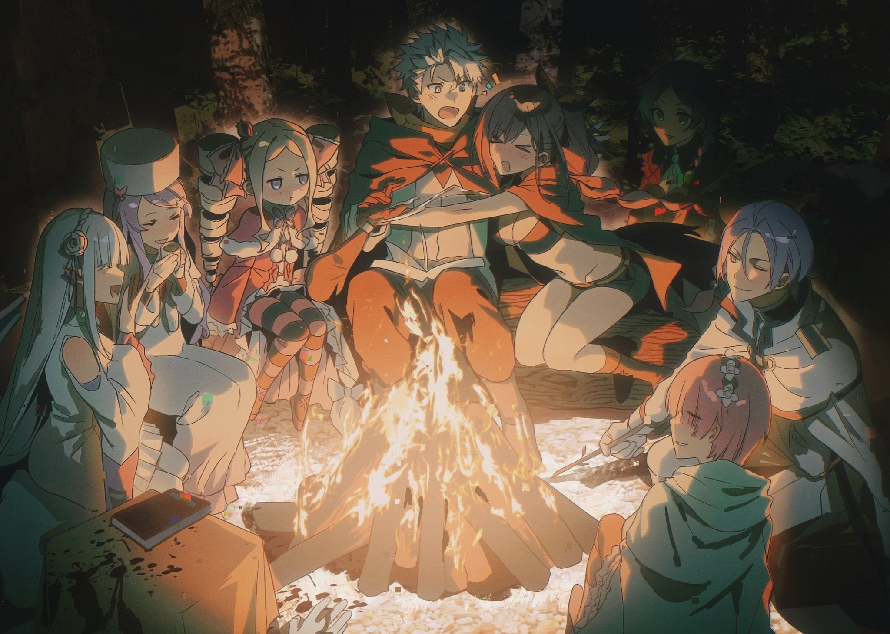
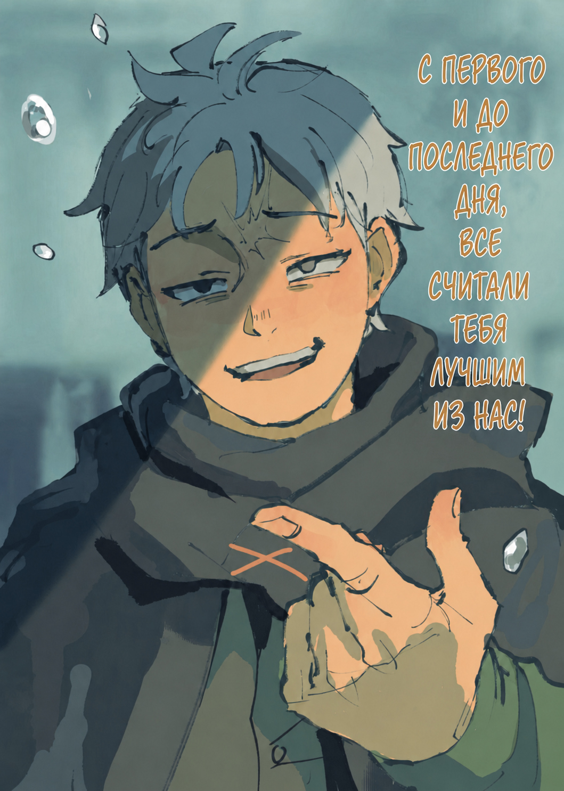

Сшивая жизнь с нуля в альтернативном мире

『ゼロカラツギハグイセカイセイカツ』

Оригинал на японском

Перевод и редактура: Энди , MilkyWay

Фан-арты: span , iwa_to_mushi

Это альтернативная история основного сюжета, поэтому отношения между персонажами могут отличаться, хотя что-то останется неизменным. Читайте на свой страх и риск.

Шью-латаю, шью-латаю… Сшиваю воедино.

Шью-латаю, шью-латаю… Перекраиваю форму.

Шью-латаю, шью-латаю… Вплетаю новые краски.

Шью-латаю, шью-латаю, собираю из лоскутов… И шаг за шагом приближаюсь к идеалу.

Шью-латаю, шью-латаю, шью-латаю, шью-латаю, шью-латаю, шью-латаю, шью-латаю, шью-латаю, шью-латаю, шью-латаю, шью-латаю, шью-латаю, шью-латаю, шью-латаю, шью-латаю, шью-латаю, шью-латаю, шью-латаю, шью-латаю, шью-латаю, шью-латаю, шью-латаю, шью-латаю, шью-латаю, шью-латаю, шью-латаю, шью-латаю, шью-латаю, шью-латаю, шью-латаю, шью-латаю, шью-латаю…

Я кромсаю и сшиваю обломки, крою и латаю. И прямо сейчас… Всё такой же незавершённый…

— Послушай, ты знаешь, как меня зовут?

Девочка по имени Амью Сирз затаила дыхание от испуга.

Ей задали самый заурядный вопрос, который ни к чему не обязывал. Вопрос не из тех, над которыми нужно хорошенько подумать или собраться с духом перед ответом. Обычный скучный вопрос. Знаешь — ответь «да». Не знаешь — скажи «нет». Вот и всё. Но сейчас Амью не могла выдавить из себя ни звука в ответ.

Говорят, человеческая жизнь — это череда выборов. Четырнадцатилетняя Амью познала это на собственном опыте. Порой они мелкие, порой роковые. Но какими бы важными они ни казались, вся наша жизнь строится на решениях, которые мы принимаем. И сейчас ей предстояло сделать, возможно, самый тяжёлый выбор в жизни… Как ответить на скучный вопрос, который в обычное время не вызвал бы ничего, кроме зевоты?

— Послушай, ты знаешь, как меня зовут?

Вопрос прозвучал уже не в первый раз и теперь он, точно петля, медленно затягивался на её шее. Вот только задавший этот вопрос, похоже, вовсе не желал ей зла. Его повторение скорее походило на своеобразную заботу. Извращённая, совершенно неуместная здесь вежливость. Парадоксально, но леденящий ужас внушал ей человек, который сейчас беспокоился о ней больше всех на свете. Амью понимала, что он искренне желал лишь одного — получить ответ. Не более того. Но ей не дали подсказок, поэтому она могла лишь вслепую пробираться сквозь тьму догадок. В поисках верного выбора она судорожно копалась в глубинах собственного разума, что кричал от ужаса.

Что… Что ответить? Какой ответ будет правильным? «Знаю»? Или «Не знаю»? Какой из них он жаждет услышать? Соврать, что знаю, когда не знаю? Или сказать, что не знаю, хотя всё знаю?

Безвыходность положения разрывала её на части. Ей хотелось кричать.

— Пос-лу-шай… ты… знаешь… ка-ак… ме-ня зо-вут?

Он снова начал терять терпение и заговорил ещё медленнее, нарочно растягивая и чеканя каждый слог. Её сковал новый страх: вдруг он решит, что она его просто не понимает? Но одно стало ясно наверняка. Обычного «да» или «нет» уже недостаточно. Простой, односложный ответ не удовлетворит стоящего перед ней палача. Если она промолчит, если не решится… Этот кошмар никогда не закончится. Он просто её не отпустит.

— …

Не в силах произнести ни слова, Амью неотрывно смотрела в чёрные, бездонные зрачки юноши. Она боялась пошевелиться. А в зеркальной черноте его глаз отражалось её лицо, застывшее в гримасе дикого страха… Сказать по правде, втайне она гордилась своей миловидной внешностью. И тем больнее было видеть это жалкое отражение — видеть себя, что из последних сил цеплялась за остатки рассудка. Ей показалось, будто она в один миг постарела лет на двадцать. Ещё секунда — и сердце просто разорвётся, не выдержит сокрушительного давления этого вопроса.

— Послушай, ты знаешь, как меня зовут?

Внезапно удушливый страх смерти отступил. На смену ему пришла надежда. Ей не хватало воздуха, низ живота крутило от боли, но в голове вдруг вспыхнула спасительная мысль. Если она просто ответит, мучения закончатся. Страх уступил место облегчению. Словно камень свалился с плеч. Паника, которой она сама себя истерзала, затихла перед простым животным желанием защититься. И это желание показалось ей спасительным знаком свыше. Она решительно посмотрела ему в глаза, и её бледные, дрожащие губы наконец приоткрылись.

— Послушай, ты знаешь, как меня зовут?

Сейчас ею двигало лишь одно — она хотела как можно быстрее вырваться из этого кошмара. А чтобы вырваться — нужно ответить. Совладав с непослушным, онемевшим от напряжения языком, девочка выдавила: — Н-нет…

Не знала. Перестав перебирать варианты, что до этого кружили в голове, она ответила на вопрос — искренне, от всего сердца. Она и вправду никогда раньше не видела его лица и не знала его имени. Она родилась на окраине, в богом забытой глуши. Где-то далеко, за холмами, в Королевской Столице вершились великие дела. Но здесь любые новости казались глупыми байками с другого конца света, до которых никому нет дела. Поэтому кем бы ни был и какую бы роль ни играл он в большом мире, для Амью Сирз он оставался никем.

— Вот как.

Девочка так и не смогла понять, что скрывалось за этими словами. Смирение со своей безвестностью? Грусть? Тяжёлое разочарование? Впрочем, это уже не имело значения. Она выбрала. А потому тяжкий груз ответственности снова лёг на него. Всё-таки жизнь состоит из выборов, и никто не застрахован от бремени выбора. Так что теперь этому странному юноше тоже предстояло выбрать.

— …

Затаив дыхание, четырнадцатилетняя девочка просто молча ждала решения своего палача.

Ждала, стояла на месте, ждала совсем одна. Брошенная всеми, посреди пустой деревни… Деревни, которая… Которая в одночасье опустела.

— Не пора ли нам пообедать?

Оклик заставил его остановиться. Он погладил себя по животу. День давно перевалил за полдень, и желудок требовал своё. До этого юноша просто не замечал голода, полностью уйдя в монотонную ходьбу. Тракт тянулся и тянулся без конца, уводил всё дальше, так что оставалось только механически переставлять ноги. От одной мысли о том, сколько ещё предстоит пройти, на душе становилось тошно.

— Как бы там ни было, отдых — дело святое. Прости, Эмилия-тан. Устала?

— Нет-нет, со мной всё в порядке! Просто я беспокоюсь о тебе. Ты всё идёшь и идёшь… Если не устал, то хорошо, но…

— Да не, я и сам голоден как волк! Ещё немного, и у меня бы живот к спине прилип. Фух, спасла! — схватился комично за живот Субару.

— Правда? Звучит о–о-очень опасно… — прикрыла рот ладошкой и тихонько хихикнула Эмилия.

Она была самой прекрасной девушкой на свете, а голос её был похож на серебряный колокольчик. Юноша посмотрел на неё снизу вверх, почесал затылок и глуповато заулыбался в ответ. И тут сбоку донеслось:

— Хватит дурачить Эмилию, я полагаю. Как бы ты ни проголодался, живот к спине прилипнуть не может, в самом деле.

— Ой-ёй.

Субару обернулся. Неподалёку стояла Беатрис. Скрестив короткие ручки на груди, девочка в роскошном платье смотрела на него с самым невозмутимым видом. На её брюзжание юноша лишь мягко прищурился. А девочка тут же нахмурилась:

— Меня нервирует твоя физиономия, в самом деле. Что с тобой, я полагаю?

— Да просто твоё «проголодался» прозвучало безумно мило. Ну-ка, повтори на бис!

— У-у-у, бесишь, в самом деле! Хватит дурачиться, я полагаю!

Малышка зарделась и огрызнулась. Эмилия с Субару переглянулись и вместе рассмеялись. Беатрис надула щёчки ещё сильнее, отчего выглядела совсем уж очаровательно. Конечно, скажи он это вслух, она бы точно обиделась, поэтому юноша сдержал порыв и с бодрым «Отлично!» закатал рукава.

— Раз уж Эмилия-тан так обо мне заботится, объявляю привал на обед! Сегодня продемонстрирую вам свои кулинарные таланты. Есть особые пожелания?

— О, тогда я бы хотела что-нибудь с майонезом. Рам же недавно наготовила, да?

— Принято! С превеликим удовольствием! К счастью, запасов у нас теперь навалом. Эта вредина наконец-то осознала всё величие майонеза и…

— Прекрати нести чушь.

— Оу?!

Он уже успел сгрузить вещи на траву и собирался обустроить место для отдыха. Но тут прямо перед ним возникли изящные ножки. Субару вздрогнул. Сверху вниз на него высокомерно смотрели алые глаза. Девушка в форме горничной скрестила руки на груди. Величественная поза, но ни о каком гостеприимстве или смирении в ней не было и речи.

— Как внезапно, Рам! Дала бы хоть закончить.

— Ха! Не смеши меня. Рам помогает готовить майонез исключительно из чувства долга. Чтобы Рам прониклась симпатией к этой белой кислой жиже? Какая мерзость.

— Про «мерзость» ты загнула! И вообще, даже ты не сможешь отрицать абсолютное величие печёной картошечки с майонезом! Только не говори, что не влюбилась в этот вкус!

Нежная, рассыпчатая картошечка, слегка подсоленная и щедро приправленная густым майонезом… Этот божественный, почти греховный вкус, обволакивающий язык — настоящий кулинарный рай для любого ценителя мазика. Картофель и майонез были созданы друг для друга — союз, созданный на небесах. При мысли об этом шедевре у Субару аж слюнки потекли. Глазки Эмилии и Беатрис, которые сидели рядом с ним и вообразили ту же картину, заблестели.

— Ты только посмотри на этих двоих! И после этого ты будешь называть майонез ересью?

— Что ж… В чём-то Барусу прав. Великолепие печёной картошки действительно способно облагородить даже такую сомнительную дрянь, как майонез.

— Всё с точностью до наоборот! Ну, ладно, не совсем, но… Сестрица, какая же ты непробиваемая!

Рам стояла на своём: главная заслуга принадлежит исключительно картошке, а майонез тут вообще ни при чём. От такого упрямства у Субару аж кулаки зачесались. К счастью, в их спор с виноватой улыбкой вовремя вмешалась Эмилия:

— Ну-ну, Субару, тише. Мне вот нравится и картошка сама по себе, и майонез, и всё вместе. К тому же… мне кажется, Рам просто немножко стесняется признаться.

— Госпожа Эмилия, не берите на себя смелость додумывать за Рам. То, как вы это подали, резко сбрасывает Рам лет десять.

— Ой, прости. Но при чём тут возраст?..

Лукавая логика служанки сбила Эмилию с толку. Впрочем, за этой перепалкой не крылось ни капли злобы — лишь искреннее доверие и тёплая привязанность .Они вообще ладили удивительно хорошо. Конечно, с точки зрения субординации, горничная явно подзабила на чины и покорность, что порождало мелкие неудобства, но их связывало нечто куда более ценное. И уж кто-кто, а Субару это знал. Так или иначе…

— Извини, сестрица, но слова Эмилии-тан для нас — закон! Таков кодекс нашей пати 1 ! Так что решение окончательное. Спонсор сегодняшнего обеда — майонез!

— Ура-а, здорово!

Эмилия радостно захлопала в ладоши, а Рам лишь устало вздохнула. Впрочем, её молчаливая капитуляция лишь подтверждала, что она и сама была не прочь потакать капризам своей госпожи. Конечно, выбор меню оставался жутко предвзятым — всё-таки главную скрипку играл отъявленный майонезный фанатик.

— Беако ведь тоже за майонез обеими руками, правда?

— Отрицать не стану, в самом деле. Но твой покровительственный тон меня бесит, я полагаю. И гнев Бетти так просто не утихнет, в самом деле! В качестве морального ущерба я требую невероятно вкусный обед, я полагаю.

— Хе-хе, будет исполнено!

Юноша шутливо отдал поклон малышке, которая выпятила свою плоскую грудь с важным видом. Увидев, что его кривляния вызвали у спутниц искренние улыбки, он начал готовить. Правда, в походных условиях особо не разгуляешься. Нет, с помощью магии, конечно, можно было раздобыть и огонь, и воду, но…

— Прости. От меня мало толку.

— Эй, тебе не за что извиняться! Мне выпал шанс проявить смекалку! Более того, разрешаю влюбиться в меня заново, когда увидишь, какой я изобретательный!

— Ну вот, опять ты дурачишься.

Эмилия улыбнулась. Юноша ответил ей тёплым взглядом и принялся колдовать над припасами. Хороший обед — залог успешного дня. Халтурить тут нельзя. Порывшись в сумках, он твёрдо решил состряпать что-нибудь эдакое, что пришлось бы по вкусу всем и каждому. Вообще, вся их компания обычно уплетала стряпню за обе щеки. Раньше Субару об этом не задумывался, но видеть, как близкие с аппетитом наминают то, что ты приготовил, было безумно приятно. Для повара нет лучшей награды.

Если всё было так просто… Стоило чаще хвалить мамину стряпню.

— М-хм-хм-мм…

Отодвинув сентиментальные мысли подальше, он ухмыльнулся. Девушки с любопытством заглядывали ему через плечо. Кто-то даже напевал под нос фальшивую, но милую мелодию.

— Ой-ёй, так сегодня за еду отвечает братец? Что-то мне жутковато~…

В разгар приготовления откуда ни возьмись выросла Мейли. Накручивая на пальчик синюю косичку, девочка бросила на парня не по годам лукавый взгляд. Субару подозрительно прищурился.

— С чего это тебе жутковато, а? Дерзким девчонкам добавки не даём!

— Ты жесто~окий! Издева~аешься, да?.. Не сильно-то и хотелось. Братец постоянно заливает всё этой своей белой штукой. А я её терпеть не могу~у.

— Ч-что-о-о?! Неужели и ты не в силах постичь величие майонеза?!

— Ой, ну не делай ты такую мину, будто мир рушится~…

Видя его ошарашенную физиономию, Мейли тяжело вздохнула. Впрочем, удар, нанесённый её словами, оказался сокрушительным. Пускай апокалипсисом тут и не пахло, но по ощущениям было сравнимо как минимум с концом этого года.

— И всё же ты сгущаешь краски. Мейли лишь пытается сказать, что не разделяет твоего стремления заливать всё майонезом.

— Мм…

На защиту девочки встал Юлиус. Этот статный красавец умудрялся сохранять безупречное изящество даже в обычной походке. Подойдя ближе, он сдержанно улыбнулся.

— Позволю себе согласиться с Мейли. Сам по себе майонез вполне хорош, но если поливать им каждое блюдо, изысканность вкуса улетучивается. Призываю тебя к благоразумию.

— Тебе обязательно вставлять свои пять копеек? Мы тут с Мейли сами разбирались, мог бы и не встревать!

— Поддержание здоровой атмосферы в коллективе — долг каждого. Если мы закроем глаза на семена раздора, они пустят корни и прорастут ядовитым цветком, о чём мы после будем горько жалеть. А потому я считаю своей обязанностью давать своевременные наставления, дабы предотвратить беду. Разве я не прав?

— На каждое моё слово у тебя десять найдётся!

Витиеватые фразы рыцаря методично загоняли парня в угол, отчего тот лишь сильнее заводился. Наблюдая за их перепалкой, Эмилия тихонько рассмеялась.

— Эмилия-тан?

— Вы всё так же прекрасно ладите.

От её умилённого взгляда у Субару бессильно опустились плечи. Сиятельный рыцарь рядом с ним испытывал нечто похожее — он прикрыл глаз, поправляя чёлку. На доли секунды их мысли совпали: оба были вопиюще не согласны с тем, как увиденное трактовала девушка. Ей эта стычка казалась трогательной перепалкой лучших друзей.

— Я же сто раз повторял, всё совсем…

— Совсем?

«Совсем не так! Чудовищная ошибка!» Субару уже открыл рот, чтобы возразить девушке, которая склонила голову набок, как вдруг…

— Всё…

— …

Слова застряли в гортани. Язык одеревенел. В ту же секунду улыбающаяся Эмилия замерла… И не только она. Все, кто только что окружал его у костра, все, чьи голоса ещё миг назад наполняли воздух, застыли на месте. Ни движений, ни дыхания — они превратились в изваяния. Казалось, сам мир остановился, ждал его ответа… Но нет. Шорох листвы, пряный запах травы, бульканье воды в котелке — мир не остановился. Оцепенела только Эмилия. И только они… Словно замерли в ожидании, пока воображение Субару, что изо всех сил пыталось сшить их образы, не догонит реальность. Застыли только они…

— Ма-а-астер! Я тут сгоняла на разведку~с!

— …

Словно камень в стоячую воду, в этот мёртвый, тихий мир ворвался посторонний шум. Прямо перед юношей, который сидел на валуне у кострища, приземлилась фигура.

— Шаула успешно вернулась на базу~с! Мастер, похвали меня, обними и засыпь своей любовью~с!

Высокая, ослепительно красивая девица расплылась в счастливой улыбке. Длинные каштановые волосы, собранные в высокий хвост, и откровенный наряд, ничуть не скрывавший гладкую белоснежную кожу — не стесняясь демонстрировать пышное соблазнительное тело, Шаула буквально светилась от счастья. Но в ответ на бурный порыв нежности юноша лишь мрачно сдвинул брови. И неудивительно: она бухнулась ровно туда, где мгновение назад стояла и улыбалась Эмилия. Своим приземлением она развеяла призрачный силуэт полуэльфийки, а вслед за ней растаяли и все остальные застывшие фигуры.

— Э-э? Ч-что такое, Мастер? Я опять накосячила?

— Нет. Ничего. Не бери в голову, ты не виновата.

— Тогда париться не буду~с!.. О, ты обед стряпаешь~с?! Круто~с! Я так проголодалась, аж под ложечкой сосёт~с!

На секунду Шаула озадаченно сникла под его тяжёлым взглядом, но тут же с легкомыслием приняла отговорку. Уже забыв об этом, девушка повисла на его руке. Несмотря на то что локтем и плечом он ощущал соблазнительную мягкость прижавшейся к нему девицы, юноша безжалостно отпихнул её:

— Эй, а ну отлипни!

— Ах! Ну и злюка… Но я не сдамся~с! Пойду напролом — ударю по сердцу, пошлым мыслишкам и мужскому достоинству~с!

— Похоже, у тебя прицел сползает всё ниже и ниже… И вообще, не мешай повару. А если я порежусь или обожгусь?

— Тогда я нежненько залижу твои ранки~с! Буду вылизывать тебя с ног до головы. Лизь-лизь, лизь-лизь!

— Да у меня кожа от такого сойдёт…

Шаула пылко всплеснула руками — логики в её доводах не водилось, зато страсти было хоть отбавляй. Глядя на эту бурю эмоций, юноша бессильно усмехнулся и опустил плечи. Девушка тут же удивлённо вскинула бровки:

— Ты сейчас улыбнулся~с? Что тебя позабавило~с?

— Из забавного тут только ты.

— Э-э? Это что, предложение руки и сердца?..

— Ни в коем случае!

Как вообще она умудрилась прийти к такому умозаключению, оставалось загадкой. Недолго думая, он щедро наградил смущённую дурочку щелбаном по лбу. Вложил в него всю силу своего несогласия.

— Ау-у-у… — жалобно заскулила Шаула, потирая лоб. — Ну ведь фраза «а ты забавная» — классика романтических историй~с! После неё всегда идёт: «Стань моей женщиной!»~с!

— Откуда у тебя в голове этот мусор? Шаблон настолько заезженный, что даже у меня на родине его уже лет сто никто не использует…

Конечно, в стареньких сёдзё-мангах или отомэ-играх мужские персонажи постоянно бросались подобными штампами при первой же встрече, но юноша сильно сомневался, что это ещё актуально. Как бы то ни было, назвал он её забавной не ради флирта. Просто она…

— Ты несёшь такую непредсказуемую дичь, что это даже бодрит.

— …

— Так что болтать с тобой… не так уж и плохо.

Не то чтобы общение с кем-то другим давалось ему с трудом. Но в разговорах с остальными он слишком чётко осознавал собственную никчёмность, и именно это резало по живому. Никто не был в этом виноват… Никто, кроме него самого.

— Виноват всегда только я. Поэтому…

— Значит, на этот раз точно предложение~с?!

— Я же сказал, нет!

От серьёзного настроя не осталось и следа. Шаула возмущённо всплеснула руками, вовсю заболтала ногами и капризно протянула:

— Э-э-э?! Но ведь это поворот в стиле «моя жизнь была серой и унылой, пока не появилась ты и не стала глотком свежего воздуха» — это же клише из клише~с!

— Да откуда, чёрт возьми, ты черпаешь эти эшелоны штампов?!

Душевный разговор не удался из-за глупостей девицы, и юноша сдался. Слабо усмехнувшись, он вернулся к костру. Он сидел у котелка на обочине тракта. И порций здесь было всего две. Только для него самого и для Шаулы. Ни для Эмилии, ни для Беатрис, ни для Рам, Мейли или Юлиуса — ни для кого из тех, с кем он только что так весело болтал, — еды не предусматривалось. Возвращение в суровую реальность отзванивалось в груди глухой, щемящей пустотой.

Шью-латаю, шью-латаю… Сшиваю воедино.

Шью-латаю, шью-латаю… Перекраиваю форму.

Шью-латаю, шью-латаю… Вплетаю новые краски.

Шью-латаю, шью-латаю, собираю из лоскутов… И шаг за шагом приближаюсь к идеалу.

Ежеминутно чувствовать себя неполноценным существом — испытание не для слабонервных. Подобное самоедство отдаёт безумием, но когда эта мысль въедается в разум, душа начинает медленно крошиться в труху. Короче говоря, именно в этом болоте сейчас и увязал Нацуки Субару.

— Ма-а-астер, Ма-а-астер, а куда мы идём~с?

— Дай подумать…

Шаула шагала рядом и напевала под нос незамысловатый мотивчик. Её звонкий голос заставил парня оторвать взгляд от земли и посмотреть вдоль тракта.

— Для начала возьми курс на запад. Вам ведь нужны людские поселения? А если намерены держаться от них подальше, то кругом марш — и прямиком в Великий Водопад.

— Сестрица, как обычно, щедра на крайности… Но спасибо.

Выдать дельный совет и тут же приправить его ядом — в этом была вся Рам. Субару мотал её слова на ус и взял курс на запад.

— На запад-то я пойду… А вот ты что будешь делать?

— А? Я прилеплюсь к тебе намертво~с! Мы так долго были в разлуке, что теперь я ни на шаг от тебя не отступлю. Буду неусыпно оберегать твой покой с самого доброго утра и до следующего доброго утра 2 , так что полагаюсь на тебя!

— От утра и до утра… Мать твоя женщина, это же круглые сутки!

— И так день за днём, ночь за ночью~с!

От такой маньяческой преданности у Субару аж мурашки пошли по коже. Он ещё сильнее помрачнел. Честно говоря, вот так идти плечом к плечу с Шаулой было как-то странно. С одной стороны — мрачный, раздавленный виной юноша, с другой — гиперактивная, фонтанирующая эмоциями девушка. Если посчитать эмоциональный баланс, их плюсы и минусы вроде бы перекрывали друг друга. Шумная девица невольно дарила ему отдушину, но вот какую выгоду из этого извлекала она сама — оставалось загадкой.

— Главное, что Мастер — это Мастер! Ничего важнее на свете нет!

— Хоть убей, не догоняю. Ты правда собираешься таскаться за мной по пятам?

— А то! Пока смерть не разлучит нас, как говорится~с! Любовь, закалённую веками разлуки, ничего не сломает~с. Что бы ни стряслось, я буду рядом. А потом нарожаю тебе детишек — аккурат на бейсбольную команду!

— Ого ты фастболы 3 набрасываешь…

Шаула выпятила пышную грудь и воззрилась на него сияющими глазами. Юноша закрыл лицо ладонью и тяжело вздохнул. Внутри него бушевала буря. Такие подкаты, конечно, льстили его самолюбию. Если закрыть глаза на сумасбродство, Шаула была неописуемой красоткой и невероятно соблазнительной девушкой. И всё же сердце юноши не дрогнуло. Подобные чувства мог позволить себе только полноценный человек. Нынешний он этого права лишён.

— Мне кажется, тебе стоит быть с ней помягче. Она ведь та-а-ак старается… Неужели тебе её ни капельки не жаль?

Рядом раздался голос, похожий на звон серебряного колокольчика. Парню даже не пришлось оборачиваться — Эмилия сама заглянула ему в лицо и слегка надула губки. Субару зажмурился.

— Эмилия-тан, жестоко просить о таком! Кому, как не тебе, знать о моих чувствах?

— М-м… Ну, наверное. Может, ты и прав. Прости… Конечно, мне тоже очень одиноко, но нельзя же вечно хандрить. Ведь…

— Ведь?

— Ведь я уже…

Эмилия чуть прищурила глаза. Внутри у Субару всё сжалось. Он не хотел слышать эти слова, но перебить её тоже не мог. Найти в себе силы отказать ей было сложнее, чем отвергнуть глас божий. И всё же…

— Ой-ёй.

Если уж он не мог прервать её сам, за него это сделал случай. Сзади нарастал шум. Субару отвлёкся от девушки и отступил на обочину. Гулкий стук колёс предвещал приближение драконьей повозки. Резким движением он цапнул Шаулу за руку и сдёрнул её с дороги.

— Ах~, ты такой грубый~с…

— Отлипни.

Шаула норовила воспользоваться моментом и повиснуть на нём, но Субару мастерски увернулся. Теперь без опоры, девица на полном ходу впечаталась носом прямо в придорожное дерево и жалобно пискнула. Субару даже не взглянул на спутницу, которая теперь тёрла покрасневший нос. Он дождался, пока повозка промчится мимо, и уже собирался снова выйти на дорогу, как вдруг…

— М-м?

Обогнавший их экипаж со скрипом замер. На поломку это совсем не походило, а значит, причину остановки следовало искать в них самих. Солнце стояло высоко, однако тракт пустел. На мгновение он насторожился — не разбойники ли?

— Прошу прощения… Вы случайно не Нацуки Субару?

Но все опасения рассеялись как дым, едва человек спустился с козел. Услышав своё имя, Субару расслабился. К нему неспешно шагал высокий парень с пепельно-серыми волосами, собранными в хвостик. На вид он выглядел ровесником Субару. Из-за мягких черт лица юноша казался изнеженным, но под одеждой угадывалось крепкое телосложение. Вряд ли он вкалывал, но и к белоручкам его отнести было нельзя. Впрочем, всё это вторично. Главное — незнакомец узнал его с первого взгляда.

— Ох, я не ошибся, это правда вы, господин Нацуки! Давно не виделись.

— А-а… Ну-у…

Хоть парень и сохранял вежливую дистанцию, тем не менее, держался как давний приятель. Растерявшись, Субару оглянулся на спутниц. Эмилия и остальные отрицательно качнули головами: они тоже понятия не имели, кто это. Раз уж никто не мог ему помочь, оставалось надеяться только на себя. Натянуть дежурную ухмылку и сыграть роль душевного друга — обычно для Субару это не составляло труда, но сейчас душа к этому не лежала. Смущение юноши не укрылось от собеседника, и тот озадаченно нахмурил красивые брови:

— Ой, неужели вы меня забыли? Я Регин… Регин Сувен! Вы сильно помогаете моему старшему брату, Отто. Мы с вами как-то виделись в деревне.

— Регин… А-а! Так ты брат того самого Отто!

— От вашего «того самого Отто» веет такой прохладой, будто говорите о незнакомце.

Субару с неловкой улыбкой хлопнул в ладоши, изобразил озарение. На самом деле Регина он вообще не помнил, но вот Отто прекрасно знал. И о чудо, вглядевшись в лицо юноши, Субару действительно уловил семейное сходство. Никаких сомнений: перед ним брат Отто — тот, кто его знал.

— Виноват, виноват! В голове такая каша последние дни, вот имя и выскочило.

— Да что вы, при вашей-то занятости это совсем не дивно. Слухи о королевских выборах долетают даже до нашей глухомани… Брат не доставляет вам хлопот?

— Такого быть не может. Отто — наша главная опора.

— Да брось! Если честно, мы всем лагерем нагло сидим у него на шее. Не будь его с нами, всё бы давно накрылось медным тазом.

— Вот как… Что ж, я рад.

Регин казался немного зажатым, но стоило заговорить о брате, как он расслабился. Затем его взгляд скользнул с Субару на Шаулу, которая топталась на месте неподалёку.

— Но что вы делаете в такой глуши? Пылить пешком по тракту без драконьей повозки — сомнительное удовольствие…

— Твоя правда. Я бы и сам с радостью катил с ветерком, да только обстоятельства подкачали. А если интересно, как нас сюда занесло…

Парень запнулся, подбирая правильные слова, но быстро продолжил:

— Я сейчас, так сказать, витаю в эмпиреях самопознания… Короче, ищу себя!

— Ищите?

— Именно! Ищу себя… Пф-ха-ха-ха!

Фраза прозвучала настолько нелепо, что он не выдержал и нервно расхохотался. «Ищу себя» — заезженная отмазка для запутавшихся подростков, однако существовала ли более точная формулировка происходящего с ним? Поэтому он и смеялся. Видя эту странную вспышку смеха, Регин явно заподозрил неладное.

— Вы точно в порядке? — с тревогой в голосе спросил он. — Может, вам плохо? Честно говоря, я потому и засомневался сначала… Вы сильно изменились с нашей последней встречи.

— Физически — в полном порядке, честно. А вот по менталке… тут, пожалуй, кол. Но ты удержал меня на краю пропасти. Встретить тебя здесь — настоящее спасение.

Субару согнулся в низком поклоне, оборвав собеседника на полуслове. Такой порыв лишь сильнее сбил парня с толку, но вместе с тем окончательно убедил, что с Нацуки Субару творится что-то неладное. Отбросив сомнения, Регин произнёс:

— Я не понимаю, что у вас стряслось, но давайте съездим в деревню. Отдохнёте в моей клинике, и мы спокойно всё обсудим.

— Звучишь прямо как лекарь.

— Вообще-то мои пациенты — земляные драконы и скотина, но да, я лекарь. Вы и это забыли?

— Забыл… Ну да. Получается, забыл.

— Господин Нацуки?..

Эх, сводись всё к банальной забывчивости, юноша не испытывал бы сейчас столь невыносимого чувства отчуждённости. Но то, что терзало его изнутри, было куда страшнее обыкновенного склероза.

— Там дальше по тракту твоя деревня, так? И я там уже бывал?

— Д-да, конечно! Вы приезжали вместе с Отто и ещё одним господином, когда с нами приключилась беда…

— Понятно… Спасибо.

В общем и целом, он узнал всё, что хотел.

Повернувшись к сбитому с толку Регину, Субару продолжил:

— А ведь говоришь ты точь-в-точь как брат.

— А?

— Раз ты такой славный парень, значит, и Отто человек отличный.

Именно поэтому ему было так страшно в будущем встретиться с ним «впервые». Ведь тот уж точно не обрадуется подобному «знакомству».

— Шаула.

— Да?

— Сделай всё быстро. Без боли.

Короткий приказ звучал абсолютно дико и непонятно. Но девушка уловила подтекст мгновенно. Ответив привычным весёлым «Оки-доки-ту-ту-ру!», она…

— Прости, — тихо роняя слова, Субару посмотрел Регину прямо в глаза.

В этот раз в извинении звучал предельно чёткий смысл — в отличие от предыдущих туманных фраз. Впрочем, несчастный так и не успел ничего понять… Раньше, чем пришло понимание, ослепительная вспышка света поглотила и испарила череп Регина. Обезглавленный труп рухнул на дорогу с глухим стуком. Чудовищный жар мгновенно спёк ткани, так что из обрубка шеи не вытекло ни капли крови. С точки зрения морали восхищаться техникой убийства — дикость, но выстрел вышел настолько ювелирным, что слова восхищения сорвались с губ сами собой.

— Каждый раз диву даюсь — работаешь чисто.

— Я целых четыреста лет торчала в башне без дела и изо дня в день набивала руку на зверодемонах~с! Как вспомню — тоска зелёная! Совсем не подходят такие будни юной деве в самом расцвете сил~с!

— Юной деве четыреста лет?..

Случившееся не вызвало у него никаких эмоций — юноша лишь озадаченно склонил голову. Переваривал слова спутницы. Спорить он не стал, лишь подошёл к телу, ухватил его за ноги и поволок к осиротевшей драконьей повозке.

Вдруг земляной дракон учуял неладное. Напуганное животное рвануло с места и попыталось сбежать. Тотчас ослепительный белёсый луч пронёсся в миллиметре от уха Субару, насквозь прошил повозку и вонзился в дракона. Белый свет испепелил внутренности зверя, пробил череп насквозь и мгновенно оборвал его жизнь. Выстрел снова оказался безупречным, но парень о нём вовсе не просил.

— Э-э-эй…

— Я-я случайно~с! Это самооборона~с! Я просто хотела его затормозить, а получилось вот так~с! Привычки машины для убийств ещё не до конца выветрились~с!

— Я не злюсь. Честно, я спокойней воды. Вот только мы снова остались без повозки. Когда уже мы перейдём с моих двоих на какой-нибудь транспорт?..

Вот так всегда: в компании Шаулы земляным драконам фатально не везло. И пока эта бестия рядом, юноше суждено стирать ноги в кровь до скончания веков.

— Да я же тебе говорю~с! Даже если вокруг полная тишь да гладь, я готова таскать тебя на спине двадцать четыре на семь! А соскользнёт ладошка на что-нибудь эдакое — так я и слова не скажу~с! Ну что, по рукам~с?!

— Ощущение, будто ты меня разорить собираешься.

Юноша сухо отклонил заманчивое предложение и втащил труп в повозку. Огромная туша земляного дракона распласталась на дороге, разделив судьбу хозяина, вплоть до отсутствия головы. Оттащить такую махину было выше его сил.

— Короче, отнеси дракона с повозкой подальше в чащу. Я пока наведаюсь в ту деревню… Найдёшь меня потом?

— Раз плюнуть~с! Спрятать так, чтобы никто не снюхал?

— Если выиграешь пару дней — будет идеально.

Субару спрыгнул на землю и сдал объект с рук на руки. Девица с готовностью салютовала, ухватилась тонкой ручкой за тушу убитого зверя и без малейших трудностей потащила за собой и дракона, и повозку. Пока спутница заметала следы в лесу, юноша устремил взгляд туда, где стояла деревня.

— Что ж.

Парень шагнул вперёд. Теперь у него была ясная цель. Он направлялся прямо в деревню Регина. Сколько местных помнят «Нацуки Субару»? Много? Мало? От этой неизвестности на душе скребли кошки. Впрочем, бежать от неприятного — значит свернуть с единственного верного пути. Выбор казался диким, но альтернативы не существовало. Всё выправится… Главное — вернуть «Нацуки Субару», и тогда…

Всё можно будет исправить, да?

Именно ради этой цели он совершал то, на что «Нацуки Субару» никогда в жизни бы не пошёл.

— Ха-а-а…

Сознание рухнуло обратно в реальность, и книгу выбило из ослабевших пальцев. Колени мелкой дрожью колотило о пол, дыхание спёрло. Даже сидя, Субару ощущал, как мир перед глазами плывёт в бешеном круговороте. Сколько бы раз он ни проходил через это, привыкнуть к такому нельзя.

— Ха-а, ха-а…

Он грубо утерел рукавом липкий холодный пот со лба и задышал глубоко-глубоко, силился унять взбесившийся пульс. Сердце заходилось в груди — тело бунтовало, не могло переварить диссонанс между разумом и телом. С каждой новой книгой грань его собственного «Я» всё больше размывалась, теряла чёткие контуры. Любой обычный человек на его месте давно бы потерял себя, растворился в чужих жизнях и сошёл с ума.

— Мастер, ты как?

— Да… Жив, жив. У тебя что? Нашла следующую?

— Э-э-э… в процессе~с. Тут же всё на пазл похоже, сплошная головоболь~с! Такая муторная работа вообще не для меня~с…

Девушка с тревогой взирала на его судорожные вдохи. Она виновато сцепила указательные пальцы. Впрочем, ругать её юноша не собирался. Она права: он сам заставил её заниматься тем, для чего она совсем не годилась. Вменять в вину скромный прогресс той, кто преданно помогает тебе вопреки всему — совсем уже ни в какие ворота. И пусть сам Субару давно уже увесистыми шагами маршировал по пути чудовища, даже у него оставались черты, которые он не мог переступить.

— Я знаю, что дело муторное, но прошу, Шаула… Мне больше некого просить.

— Эх, сказал бы лучше: «Мне нужна только ты»…

— Ты — единственная, на кого я могу положиться.

— Фыр-фыр-фыр! На этот раз, так и быть, сгодится и такой ответ~с!

С довольным видом, Шаула вновь занырнула в бескрайний океан книг. Вряд ли её энтузиазма хватит надолго, однако её глаза оставались незаменимы. Даже если свести всё к утилитарной пользе, без её помощи он был обречён.

Он поднял с пола упавший том и провёл подушечкой пальца по корешку. Короткая надпись на чёрном переплёте гласила: «Регин Сувен». Парень, который когда-то давно пересекался с «Нацуки Субару», а затем имел несчастье встретить Нацуки Субару — и отправиться в мир иной из-за этого. Только что юноша прожил всю его жизнь от корки до корки. Среди чужих воспоминаний действительно нашлись отголоски той давней встречи.

— Не сказать чтобы мы были близки… Для Регина «Нацуки Субару» — какой-то мутный тип, который увязался за его старшим братом.

Обратившись к чужой памяти, которая теперь стала частью его собственного разума, юноша тяжело вздохнул от досады. По-хорошему, убиваться и вздыхать следовало бедняге Регину, но Субару не мог сдержать разочарования. Снова всё насмарку.

— Господин Нацуки, это возмутительно.

— Прости… Я выгреб твои воспоминания дочиста, но пересекались мы мельком, так что точный образ восстановить не выйдет. Похоже, долго задерживать тебя здесь я не смогу.

На фоне стеллажей тлел силуэт Регина. Он с молчаливым укором взирал на книгу со своим именем. Человек имел полное право упрекать Субару, ведь мало того, что его убили, так ещё и объявили, что это не принесло особой пользы. Субару всё понимал, поэтому прозвучавшее «прости» было искренним. Но…

— Ну, раз уж я мёртв, тут ничего не попишешь. К тому же, если у вас всё получится, всё вернётся на круги своя, так ведь? Буду на это надеяться.

— Ого, вот это великодушие. Прости, что так нагло им пользуюсь, но идёт. Когда всё придёт в норму, я перед тобой в долгу не останусь.

— Буду ждать… пусть и без особых надежд.

Регин пожал плечами, махнул рукой и растаял в воздухе. Юноша проводил его взглядом, вернул «Книгу Мёртвых» на место, затем поднял лежащий рядом лист бумаги и пером перечеркнул одну из строчек. На исписанном именами листе стало на одно зачёркнутое больше.

— Осталось ещё двадцать три…

Юноша сверился со счётом и размял затёкшую шею. Впереди его ждал долгий путь. «Тайгета», обитель «Книг Мёртвых», встречала всё тем же холодным равнодушием. Сколько бы юноша сюда ни приходил, библиотека упорно не желала обзаводиться хоть каким-то подобием каталога. Казалось бы, пора улучшить сервис для постоянного клиента, но нет — это место продолжало изводить своей неприступностью.

— Запретная библиотека Бетти была не из малых, но с этой ей не тягаться, я полагаю. Никто тебя не осудит, если отложишь поиски на завтра, в самом деле.

— Она права. Отыскать нужную книгу здесь — задача нетривиальная. К ней нужно подходить тихо, не спеша, без суеты. Хаотичные метания только изнурят тебя.

Стоило дать слабину, как возникли образы Беатрис и Юлиуса. Прогуливаясь между стеллажами, призраки делились житейской мудростью… Искренне заботились о нём. Именно поэтому Субару упрямо мотнул головой. Прислушайся он к их словам, сделай передышку — и давящая безысходность, возможно, на миг ослабила бы хватку. Но…

— Передышка — это роскошь, которую я не могу себе позволить. Время не ждёт. Я обязан найти ответ… и как можно скорее.

— Ну не найдёшь, и что с того? Будто от твоей суеты что-то изменится, Барусу.

— Изменится… Изменится абсолютно всё.

Неподалёку вырос силуэт Рам. Субару отчаянно пытался не смотреть на неё. Горничная сверлила его ледяным взглядом. Он же уставился на скомканный лист в своей ладони. Там числился Регин и прочие жители той деревни. Судя по памяти первачка, шансы откопать в их жизнях хоть какую-то зацепку были ничтожны. Ничтожны, но всё же не нулевые. А раз так…

— Если ты прочтёшь их книги, твоё желание исполнится?

— Эмилия-тан…

От трепетной интонации её силуэта Субару на мгновение оцепенел. Однако затем упрямо кивнул, но даже не ей… скорее он пытался убедить самого себя.

— Конечно. Из-за того, что я… из-за того, что я всё забыл, страдаете вы. Это единственный способ всё исправить.

— Но тебе не нужно ничего исправлять…

— Нужно!

Эмилия смотрела на него так, словно больше не выносила вида его самоистязания. Но её слова лишь заставили юношу сорваться на крик. Он встретился взглядом с ошарашенной девушкой и выдохнул:

— Умоляю, не говори так… Я во что бы то ни стало верну «Нацуки Субару». А потом…

— А потом?

— А потом я снова встречусь с вами… Встречусь и всё исправлю…

Ценность того, чем обладал, осознаёшь лишь тогда, когда всё потерял. Почему люди замечают, каким сокровищем владели, только после того, как оно выскальзывает из рук и оставляет лишь звенящую пустоту после себя? Почему это осознание приходит слишком поздно, когда сквозь пальцы уже всё утекло и пути назад больше нет?..

Эмилия слушала его сдавленный шёпот с печальной, невесомой грустью. В её аметистовых глазах бушевала такая сложная гамма чувств, что парень не мог прочесть ни единой эмоции. Уж кто-кто, а он должен видеть её насквозь, чувствовать каждое движение её души. Но сейчас юноша совершенно не понимал, что происходит в сердце девушки. И от этой неизвестности внутри всё сжималось от липкого страха. О чём она думает? Что чувствует? Каким видит Нацуки Субару? Ответ…

— Мастер! Я нашла ещё одну~с! Похвали меня, ну похвали~с!

— А? Д-да… молодец. Умница, Шаула.

— У-хе-хе-хе~!

Виснущая на шее Шаула грубо оборвала их разговор. Парень погладил её по голове, и спутница расплылась в блаженной, глуповатой улыбке. На корешке книги в её руках действительно значилось имя из его списка.

— Сколько же «Нацуки Субару» дремлет на твоих страницах?..

Забрав книгу, юноша задал вопрос вещи, которая не могла ему ответить. Разумеется, она не собиралась делиться с ним кратким пересказом чужой жизни. Но ответ лежал внутри. Все принесённые жертвы, все сотворённые зверства — всё это делалось лишь ради этого ответа.

— Мне пригодится любой кусочек информации, любые обломки.. Я сошью их воедино и шаг за шагом приближусь к идеалу…

Личность человека определяется тем, как его видят окружающие. А значит, если сшить воедино все чужие взгляды, если изучить его образ сквозь призму памяти каждого, кто его знал — можно воссоздать эту личность заново… Вернуть «Нацуки Субару» — эта цель подчинила себе мысли и поступки Нацуки Субару. Уже пролитая кровь и те жертвы, что ещё придётся принести — лишь необходимая плата за то, чтобы вернуть «Нацуки Субару». Если «Нацуки Субару» вернётся… Если он только вернётся…

— Уж ты-то точно со всем этим справишься.

Эмилия, Беатрис, Рам, Мейли, Юлиус и многие другие знавшие его люди молили об этом. А значит, у «Нацуки Субару» должна быть сила, которая позволит оправдать их надежды. А значит, он сможет…

— Спаси меня…

Умоляю тебя, «Нацуки Субару». Если ты герой… так спаси же меня.

Шью-латаю, шью-латаю… Сшиваю воедино.

Шью-латаю, шью-латаю… Перекраиваю форму.

Шью-латаю, шью-латаю… Вплетаю новые краски.

Шью-латаю, шью-латаю, собираю из лоскутов… И шаг за шагом приближаюсь к идеалу.

«Убийство входит в привычку».

Это одна из фраз, оставленных миру знаменитым детективом Эркюлем Пуаро. Смысл её не в том, что человек, совершивший убийство, пробуждает в себе маниакальную тягу к крови и начинает убивать ради собственного удовольствия. Смысл в том, что тот, кто однажды решил проблему с помощью убийства, столкнувшись с новой трудностью, снова попытается выйти из положения убийством.

«Убийство входит в привычку».

Но если оно действительно решает проблему, при чём тут привычка? Не правильнее ли назвать это вынужденной мерой, продиктованной непреодолимыми обстоятельствами? Люди выбирают убийство не по привычке, а потому, что у них просто нет другого выхода. А если его нет, то о какой вообще привычке речь?

«Убийство входит в привычку».

Да пошел он к чёрту, этот Эркюль Пуаро! Какое право имеет выдуманный сыщик рассуждать так, будто познал истину в последней инстанции? Не смей делать вид, будто видишь всех насквозь! За каждым поступком, в любой ситуации всегда скрывается сложнейший клубок причин и обстоятельств. Не смей закрывать на это глаза и стричь всех под одну гребёнку своей жалкой фразочкой! Не держи меня за дурака!

«Убийство…»

Это просто отсутствие выбора. Самый рациональный, единственный существующий выход. Поэтому это никакая не привычка.

«Убийство — единственный выход».

Да. Да. Всё именно так. Это единственно верное решение. Последний, отчаянный шанс вырваться из удушающего тупика беспросветного отчаяния.

— Субару всегда спасает меня, он решает любые проблемы. Он — мой рыцарь. — Не будь Субару, Бетти до сих пор сидела бы совсем одна в Запретной Библиотеке, я полагаю. — Барусу… умеет появляться в нужный момент. Уж это Рам готова признать. — Если бы братец не вмешался~, я бы точно справилась с заданием. — Субару, ты, верно, сам того не понимаешь, но ты спас и меня. Ты стал моей путеводной звездой.

— Я знаю.

Я знаю, как сильно вы любите «Нацуки Субару». Я знаю, как он вам дорог. Я знаю, что «Нацуки Субару», который всех вас спас — самый настоящий супермен. И я прекрасно понимаю, что пустил прахом всё, ради чего трудился «Нацуки Субару». Поэтому я обязан его вернуть. Ведь стоит мне только вернуть «Нацуки Субару»… Стоит лишь сделать это, и всё наладится. Всё будет хорошо… Всё просто обязано быть хорошо.

— Нацуки Субару сошёл с ума. Он убил Эмилию, Юлиуса и всех остальных. Мне чудом удалось спастись. Я едва унесла ноги… и прибыла сюда.

После этих слов Анастасии собравшиеся разом помрачнели. Их лица исказились — и без слов было понятно, о чём каждый сейчас подумал.

— Вы не хотите верить, и это нормально. Мне самой невыносимо больно приносить такие вести. Но он слишком опасен, у нас просто нет времени прятать голову в песок.

— Госпожа Анастасия, даже если так…

— Меня зовут Ехидна… Ана по-прежнему спит в глубинах этого тела. Пожалуй, это к лучшему.

— В это не так-то легко поверить… — ответил Райнхард, так и не подняв глаз.

Все они находились в Пристелле, городе водных врат. Здесь собрались все, кто был связан с королевскими выборами. Пристелла сильно пострадала от рук Архиепископов Греха и, чтобы спасти пострадавших, Эмилия и её отряд двинулись к Сторожевой Башне Плеяд — они надеялись отыскать «Мудреца» и найти способ исцелить жертв. Все с замиранием сердца ждали вестей с востока. Конечно, они беспокоились, но верили, что посланники вернутся с добрыми вестями. И главной опорой этой веры был Нацуки Субару. Теперь же им заявляют, что он сошёл с ума.

— Я просто не могу кивнуть и сказать: «Понятно».

— Веришь ты или нет, но это правда. Он больше не тот, кого вы знали. Нацуки Субару потерял память и стал одержим идеей вернуть её. Ради этого он пошел по самому страшному пути.

— Самый страшный путь?..

— «Книги Мёртвых». Мы нашли их в Сторожевой Башне Плеяд. Они позволяют пережить чужую жизнь и воспоминания умерших. К сожалению, сама я не открыла ни одной, поэтому не знаю о силе их влияния.

Собравшиеся застыли в оцепенении. Слова Ехидны о книгах, таящих в себе такую силу, никак не укладывались в голове. Разумеется, они не понаслышке знали, как страшно лишиться памяти, ведь сами через это прошли. Собственно, спасение жертв амнезии и привело Субару в те края. Но кто мог предугадать, что поход обернётся такой катастрофой?

— Не верю, что Нацуки провернул бы всё это в одиночку, — пугающе холодно произнёс Отто. — Даже если его целью действительно были «Книги Мёртвых», как он сумел зайти так далеко?

— Отто, неужели ты веришь в это? — Райнхард потрясённо округлил глаза и повернулся к юноше.

Встретившись взглядом с голубыми глазами «Святого Меча», Отто твёрдо кивнул.

— Да. У госпожи Анастасии… точнее, у госпожи Ехидны, нет причин лгать. Слишком уж абсурдная эта история, чтобы оказаться выдумкой. В конце концов, то, что она вернулась сюда одна, уже доказывает, что стряслось нечто непредвиденное.

— Это… да, но…

— Я и сам не хочу верить. Ни единому слову не хочу.

Отто крепко сжал кулаки, перебивая сомневающегося рыцаря. Голос его сорвался, выдавая бурю, бушевавшую в душе. Гарфиэль с тревогой покосился на искажённое болью лицо своего названого брата и взволнованно пробормотал: «Братан…».

— Анализ Отто абсолютно верен. Даже потеряй Нацуки Субару память и изменись его принципы, один он бы не справился. Эмилия и Юлиус скрутили бы его в мгновение ока. Но его замысел увенчался успехом, потому что у него появилась сообщница — Шаула.

— Дык ведь это имя Мудреца, который стережет Сторожевую Башню! И он помогает Капитану?.. Не, у меня сейчас башка лопнет. Ну точно, как в той поговорке про «Замешательство Озмунда»…

— К сожалению, у нас нет времени ждать, пока твоя голова остынет. Как ты и сказал, Шаула действительно охраняет башню. Хотя сама она утверждает, что «Мудрец» — это её наставник, а она сама таковой не является.

— Вопросов меньше не становится… — Райнхард решил уточнить. — Но всё же, эта Шаула действительно на стороне Субару?

Ехидна молча кивнула, и этот лаконичный жест едва не взорвал хрупкую тишину в комнате. Герой, который только что спас город от Архиепископов Греха, вдруг сошёл с ума. А помогает ему в этом безумии сам «Мудрец» — великий столп истории, один из «Трёх Героев». В такой жестокой реальности, где один кошмар сменялся другим, трудно было не впасть в отчаяние.

— Я пришла рассказать вам всё это вовсе не из жажды мести…

Ехидна смотрела в пол. Её тихий голос разрезал поднявшийся в комнате гул. Услышав её шёпот, Райнхард приподнял брови: «Ехидна?». Почувствовав на себе тяжелые взгляды «Святого Меча» и остальных, она тяжело вздохнула:

— Если подумать о чувствах Аны… и о том, сколько времени я сама провела бок о бок с Юлиусом, мне следовало бы пылать праведным гневом, ведь Нацуки Субару поднял на них руку… Но я просто устала.

— Устала?

— Устала ненавидеть и быть ненавидимой. А ещё устала от понимания, что человек, который пытался меня убить, на самом деле лишь несчастный, отчаявшийся ребёнок.

Ехидна покачала головой и медленно встала. На лице Анастасии застыло выражение глубокой беспомощности — сама хозяйка тела никогда бы не позволила себе проявить такую слабость.

— Я ухожу. Заставить Ану вернуться было бы верхом жестокости. Мы совершили роковую ошибку.

— Но… это же…

— Знаю, ты желаешь мне только добра. Но когда отступление остаётся единственным выходом, любые уговоры бороться дальше лишь бередят раны. Для меня всё кончено.

Никто не посмел остановить эту сломленную женщину. Да она и сама знала, что её никто не задержит. Ехидна молча повернулась спиной к притихшим слушателям и пошла к дверям. Сказанные ею слова означали лишь одно: она официально выходит из борьбы за трон Лугуники.

— Удачи вам… И берегите себя.

Это были последние слова единственной уцелевшей из тех, кто отправился к Сторожевой Башне Плеяд. И их оказалось более чем достаточно, чтобы поселить в душах присутствующих липкую, удушающую тревогу.

— Что теперь будешь делать?

Ехидна молча шла по дороге. Прикрыв глаза, она слушала шагавшего рядом Рикардо. Потеря руки далась ему тяжело. На месте утраченной конечности теперь тускло поблёскивал металлический протез с крюком. И пускай это само по себе говорило о его несгибаемой решимости продолжать сражаться, что было так в его духе…

— Я ведь уже ответила — сдамся. Это самое разумное решение. Мне больше незачем притворяться ею… Но перед торговой компанией я свой долг всё-таки выполню. Хотя бы минимальный.

— Минимальный, значит…

— Сверну дела, помогу бывшим подчинённым найти новую работу. Передачу остатков я доверю вице-президенту Тюдену, он со всем справится.

— …

— Понимаю, тебе это не нравится. Но иначе нельзя.

Хотя она так и не раскрыла свою истинную личность, они знали друг друга слишком давно. Пусть это было одностороннее знакомство, Ехидна отлично понимала, как сильно Рикардо дорожит своей госпожой. Понимала, потому что сама испытывала к девочке то же самое. Если для него Анастасия была любимой дочерью, то для Ехидны она была ребёнком, о котором хотелось заботиться с материнской нежностью.

Именно поэтому…

— Полагаю, от прав на «Железный Клык» я тоже откажусь. Отныне ты волен делать с ним всё, что посчитаешь нужным.

— Раз уж я волен делать что хочу, то найду способ разбудить нашу барышню.

— Что ж, если ты намерен пытаться спасти её даже теперь, когда лучший шанс безвозвратно упущен… мешать не стану. Особенно если бойцы «Железного Клыка» согласятся пойти за тобой.

Ехидна не могла отмахнуться от его слов, назвав их обычным упрямством. Рикардо был предельно серьёзен. Он собирался до последнего защищать то, что ему дорого. Было бы верхом жестокости назвать чьи-то начинания бессмысленными до того, как человек хотя бы попытается. То, что сдалась сама Ехидна, вовсе не обязывало сдаваться Рикардо.

Вот только…

— Не уверена, что Ана одобрила бы такое рвение.

— Отругает — так тому и быть. Но я не отступлю, пока сам всё не перепробую. В конце концов, я ей вместо отца.

— …

— А какой из меня отец, если я брошу дочь в беде? Кто бы что ни говорил, я своего не оставлю.

В этих простых словах не было упрёка. Но они всё равно больно ранили Ехидну, потому что она, в отличие от него, прекрасно осознавала собственную слабость. Она лишь горько усмехнулась, втайне восхищаясь его стойкостью. А затем…

— Ты действительно…

«Ты действительно очень силён», — хотела договорить она. А может, ей хотелось спросить: если бы у неё было больше времени, смогла бы и она обрести такую же силу?.. Но времени уже не было.

— …

Земля под ногами задрожала от глухого утробного гула. В ту же секунду толстая лапа Рикардо мёртвой хваткой вцепилась Ехидне в шиворот и резко оторвала от мостовой. Она даже не успела испугаться, как мир вокруг разорвался на части. Сокрушительный поток воды накрыл их обоих, а следом хлынул на улицы, затапливая весь город и безжалостно снося всё на своем пути. Великий потоп, которого Пристелла чудом избежала во время нападения Культа Ведьмы, на этот раз настиг спасшийся было город водных врат.

Субару тихо выдохнул, глядя с высоты на уходящий под воду город. Выстроенный в форме чаши, он не оставлял путей к спасению, стоило хлынуть воде. Зрелище ошеломляло. Казалось, кто-то решил затопить гигантский муравейник.

— Чего еще ждать от города, построенного для битвы со зверодемонами… Ловушка сработала безупречно.

Всё случилось именно так, как подсказывали знания об этом городе. Его изначально возвели ради одной цели — истребления зверодемонов и «Ведьмы», и открытие шлюзов принесло сокрушительные плоды. Бушующий поток в считаные секунды утянул улицы на дно, поглотил людей и не оставил им ни единого шанса на спасение.

— Что-о-о ж, разве это не великоле-е-епно? Так ты разом избавился от большинства людей, которые тебя зна-а-али… Пожалуй, теперь можно смело сказать, что твой «поиск себя» идёт полным хо-о-одом.

— Заткнись.

Высокий мужчина в клоунском гриме стоял за спиной Субару и отпускал совершенно неуместные комментарии, пока юноша холодно наблюдал за катастрофой. Нельзя сказать, что Розвааль сиял от восторга, но результат ему точно понравился. Его реакцию легко понять: весь этот план удалось воплотить в жизнь лишь благодаря его советам и глубоким познаниям.

— Вы просто ужасны, господин…

Юная горничная одарила своего хозяина презрительным взглядом. Эта милая, смышленая девочка прижалась к Субару и робко взяла его за руку. Юноша ободряюще сжал её ладонь и кивнул.

— Петра, как обстановка?

— Э-эм… Кажется, госпожа Шаула со всем справилась. Она открыла все шлюзы, так что выжить никто не мог… Скорее всего, даже те, кто спрятался под землёй.

— Ясно… Прости, что заставляю тебя говорить об этом.

В ответ на просьбу дать объективную оценку, Петра натянуто, но мужественно улыбнулась. В этой девочке всегда таился сильный внутренний стержень, но в глубине души она оставалась самым обычным ребёнком. Субару не мог не чувствовать вины за то, что втянул ее во всё это, но…

— Раз уж вы предаетесь бесплодным сантиментам, не стоило вообще всё это затевать. Вы вечно останавливаетесь на полпути, господин Субару.

— Тут мне даже возразить нечего.

Гнев Фредерики утихнет ещё не скоро — это было очевидно. И злилась светловолосая горничная не из-за собственной участи, а из-за трагедии, которая постигла всех этих невинных людей. За это она никогда не простит Субару. Ею правила не логика, а чистые эмоции. И то, насколько искренней она оставалась в своих чувствах вопреки обычной рассудительности, выдавало её кровное родство с Гарфиэлем.

— Хотя о самом Гарфиэле я знаю лишь по чужим рассказам…

Юноша тихо пробормотал это себе под нос и запустил пальцы в чёлку. Он с силой взъерошил волосы, а затем глубоко, шумно выдохнул, пытался переключить мысли и настроиться на грядущую битву.

— Ну и-и-и Что планируешь делать да-а-альше?

Розвааль подался вперед, заглядывая юноше в лицо. Субару раздраженно цокнул языком и словно выплёвывая ругательство, бросил: «Это же очевидно».

— Действуем по плану. Сразу устранить самого проблемного противника — лучшая стратегия.

Шью-латаю, шью-латаю… Сшиваю воедино.

Шью-латаю, шью-латаю… Перекраиваю форму.

Шью-латаю, шью-латаю… Вплетаю новые краски.

Шью-латаю, шью-латаю, собираю из лоскутов… И шаг за шагом приближаюсь к идеалу.

— Кха, кхэ!..

— О-Отто, ты как?! Выплёвывай, всё выплёвывай!

Отто надрывно кашлял и задыхался, слёзы текли ручьем. Он пытался вытолкнуть воду, что забила лёгкие. Гарфиэль сразу понял, что дело плохо, и бросился на помощь. Правда, его метод — схватить друга за ноги и потрясти — стал суровым испытанием и для тела, и для духа пострадавшего. Но это сработало, и Отто наконец с хрипом выплюнул воду.

— Да что тут вообще творится?!..

— Похоже, кто-то открыл шлюзы. Вода хлынула на улицы… Мы столько сил потратили на битву с Культом Ведьмы, а теперь… всё насмарку. — пробормотал Отто, глядя на затопленный город.

Гарфиэль заскрипел клыками от ярости. Заметив боль в изумрудных глазах названого брата, торговец опустил голову. Вокруг царила полная разруха. К счастью, Гарфиэль успел вовремя подхватить Отто и запрыгнуть на крышу, куда вода не доставала. Но скольким жителям удалось спастись?

— Всё под воду ушло…

Гарфиэль оцепенел. Он смотрел на тонущий город. Отто не расспрашивал друга, но чувствовал, что тот встретил здесь кого-то, кто стал ему дорог, по-настоящему близок… И этот потоп смыл едва зародившиеся узы. И ведь дело не только в Гарфиэле. Как бы ни тревожило его состояние, нужно было думать и о других. Анастасия — вернее, Ехидна, — только-только вернулась с неожиданными вестями. Кандидатки на трон и их свита собрались выслушать её… Они наверняка тоже пострадали. Получалось, что, собрав всех вместе, чтобы предупредить об опасности, они, сами того не желая, подставили их под удар.

— Послушай меня. Знаю, это жестоко, но вставай. Нужно что-то делать. Так же, как раньше, во время нападения Культа.

— Братец Отто… но как же…

— Нельзя опускать руки! Здесь нет ни Нацуки, ни госпожи Эмилии! Встань! Остались только мы!

— …

Он вцепился в названого брата и закричал ему прямо в лицо. Да, жестоко, но жалость сейчас была непозволительной роскошью, и Отто задушил её в зародыше. Нужно было разозлить его, разжечь угасающий огонь в его груди, заставить подняться. Пусть он возненавидит Отто, пусть даже сочтёт бездушной тварью — плевать. Главное — сделать то, что нужно.

— Мы должны найти выживших, найти кандидаток и рыцарей. Если это спланированное нападение, нам нужно сплотиться и дать от…

— Отто!

— А?!..

Он пытался звучать безжалостно, убеждал самого себя и друга, но тот вдруг с рёвом оттолкнул его. В ту же секунду Отто повалился на черепицу, а прямо перед его лицом с безумным свистом пронеслась ослепительная вспышка.

— Гх, а-а-ах!..

Свет лишь скользнул по груди, но тело пронзила обжигающая боль. Крови не было — ткань мгновенно испепелилась, а кожа под ней почернела и обуглилась. Этот белый свет нёс в себе чудовищный, смертоносный жар. И он…

— О-о-о-о-о-о-о!!

К ужасу Отто, смертоносные лучи посыпались один за другим. Рыча, Гарфиэль отражал шквал белого света щитами. Атаки сыпались с такой скоростью, что человеческий глаз не успевал за ними уследить. Развернулось бурное сражение, детали которого он попросту не мог разобрать. И всё же общую картину торговец уловить сумел.

— Откуда…

Превозмогая боль, Отто огляделся. Он щурился, пытаясь разглядеть, откуда их обстреливали. Тот, кто так прицельно бил по нему и Гарфиэлю, явно открыл шлюзы. На ум приходили лишь Культ Ведьмы, и…

— Да не с такого же расстояния?!..

У самого горизонта, на противоположном конце города, виднелась одна из башен управления. На её вершине сверкнуло. Казалось, свет лишь мигнул, но луч уже нёсся прямо на них. Пока Гарфиэль чудом успевал отбивать атаки, но…

— Долго мы так не протянем! Отто, вали в укрытие! А я урою этого ублюдка!

— Ты уверен, что стоит сокращать дистанцию?!

Гарфиэль яростно рычал. Его положение трудно было назвать завидным. Белый свет летел с безумной скоростью. Он успевал отражать его только благодаря огромному расстоянию до стрелка. Стоит сократить дистанцию — и времени на реакцию просто не останется. На сверхзвуковых скоростях даже доля секунды решала всё.

— Похеру! Другого выхода нет! Остались только мы, ты же сам сказал!

— Да… ты прав. Вперёд!

— Ага-а-а!!

Зарыча, тигр с невероятной силой оттолкнулся от черепицы и взмыл в воздух. Используя торчащие из воды крыши как опору, он направился прямо к башне управления — позиции снайпера.

— О-о-о-о-о-о!

Каждый встречный удар отдавался сокрушительной дрожью в костях. Напор сбивал с ног, грозил отбросить назад, но вопреки всему Гарфиэль упорно прорывался вперёд, буквально пробивал себе путь к победе. Противник казался чудовищем. Поразительная меткость на таком расстоянии и неисчерпаемый запас маны, позволяющий палить без передышки, не укладывались в голове. Стрелок изначально находился в абсолютной безопасности и в выигрышном положении.

— Всё равно…

Гарфиэль не привык безвольно пасовать перед сильными врагами. Тем более что на враге висел непростительный грех. Пристелла ушла под воду — число погибших наверняка превосходило самые чёрные опасения. Они ещё не успели оправиться от нападения Культа Ведьмы, как началось новое бедствие. И среди тех, кто остался там, внизу, была его родная кровь. «Не думай об этом», — приказал он себе, стиснул зубы и резко мотнул головой. Но чем сильнее пытаешься забыться, тем глубже увязаешь в мыслях. В груди сплелись воедино скорбь и ярость. Неистовая тёмная злоба захлестнула разум, распалила зверя. Собрать бы всю эту клокочущую ненависть в клыках и когтях, а затем обрушить на врага…

— Гарфиэль.

В затуманенный жаждой крови разум внезапно ворвался знакомый голос. Его просто окликнули. Обычный зов он бы проигнорировал, но…

— Капитан?..

Всё меняется, когда этот голос принадлежит человеку, чьего возвращения ты ждал больше всего на свете. Его изумрудные глаза заметались из стороны в сторону. Посреди битвы юноша искал того, кто его позвал. Он ни на секунду не поверил словам Ехидны. Он вообще не привык доверять созданиям с этим именем. Да, в своё время он предупреждал Субару об опасности, но в итоге, скрепя сердце, согласился на их экспедицию к Башне Плеяд. И когда назад вернулась лишь Ехидна в теле Анастасии, юноша горько пожалел о собственной наивности и беспечности. Тогда он решил броситься в погоню, чтобы разыскать Субару, Эмилию и остальных. Но едва они начали обсуждать это с Отто, город затопило. У торговца явно имелись свои соображения на этот счёт, но Гарфиэль наотрез отказывался слушать его. Он просто отказывался верить, что Нацуки Субару мог проиграть. Именно поэтому этот голос подарил ему надежду — надежду на то, что капитан непременно переломит ход битвы. Обманывая самого себя, он высматривал его…

— Даже сейчас сомневаешься… Всё-таки близкие видят нас насквозь.

Говорящий показался. Гарфиэль нахмурился. И дело было вовсе не в словах — их-то он как раз не расслышал. Сам его вид заставил юношу резко измениться в лице. Там, внизу, глядя на летящего навстречу свету Гарфиэля, стоял человек. Силуэт и черты лица, безусловно, принадлежали старому другу, но…

— Ты ещё кто такой, ублюдок?

Он принюхался. В нос ударил до боли знакомый запах. И всё же чутьё, которое было куда надёжнее нюха, бешено взвыло — оно наотрез отказывалось признавать капитана в существе, что стояло внизу. Секундное замешательство. Микроскопическая пауза, продлившаяся меньше мгновения. Но именно эта заминка всё и решила.

— Приветики!

— Чег…

Прямо на него с издевательски-весёлым криком налетела черноволосая женщина. Удар её ноги он принял на щиты, погасив мощь, сравнимую с тараном мчащейся драконьей повозки… В бою с таким противником нельзя было терять бдительность.

— Неплохо! Но Мастера я люблю в сто раз сильнее~с!

Нападавшая расплылась в широкой улыбке и выставила ладонь прямо перед его лицом. Волосы на теле мгновенно встали дыбом от леденящего ужаса. Он резко откинул голову и…

— Буг-х!..

…и её кулак пробил его живот насквозь.

Пока тело друга распускалось цветком, Отто лихорадочно искал выход. Со сжатыми зубами он проклинал собственную хладнокровность. Было тошно. Как, чёрт возьми, можно оставаться рассудительным в такой момент?! Прямо на его глазах названого младшего брата разорвало на куски, а он всё равно не смог позволить эмоциям взять верх. Даже зайдя в тупик Отто судорожно цеплялся за окружающий мир в поисках малейшей подсказки. «Божественная Защита Духовной Речи» не раз доказывала, что не бывает абсолютно безнадёжных ситуаций. Все прошлые испытания юноша преодолевал именно благодаря этой вере. И поэтому…

— Тут столько воды, что даже крысы сдохли. Не с кем поболтать, да?

— …

Тихий голос под звук неспешных шагов разрезал пугающую тишину. Незнакомец медленно приближался. Отто обернулся — и воздух застрял у него в груди. Коротко выдохнув, он сумел вытолкнуть из себя лишь…

— А вы сильно изменились.

— Да ладно? Я и не заметил…

— Посмотрели бы в зеркало — сразу бы поняли. Ах, ну да. Если верить Ехидне, вы потеряли память. Похоже, потому и не замечаете.

— Ха-ха, может и так. Хотя изменись я полностью, смириться было бы куда проще…

Человек перед ним почесал щёку и усмехнулся в ответ на колкость. Как назвать того, кто стоял напротив? Отто захлестнуло ледяное хладнокровие и слепая ярость. Он колебался. Язык не поворачивался произнести знакомое имя, но и назвать по-другому этого человека он не мог.

— Кто вы…

— Сам знаешь. Я — Нацуки Субару. Бессмертный и вечно без гроша в кармане.

— …

— О тебе я… наслышан, так сказать. Наконец-то мы встретились, Отто.

Человек… нет, существо с внешностью Нацуки Субару, но абсолютно чуждое тому, кого Отто знал, тихо рассмеялось. С мутным, мёртвым левым глазом, с седыми волосами и безумной ухмылкой на губах — он насмехался над ним.

Шью-латаю, шью-латаю… Сшиваю воедино.

Шью-латаю, шью-латаю… Перекраиваю форму.

Шью-латаю, шью-латаю… Вплетаю новые краски.

Шью-латаю, шью-латаю, собираю из лоскутов… И шаг за шагом приближаюсь к идеалу.

Юноша протяжно выдохнул, глядя на собранного, настороженного собеседника. «Сильно изменился» — надо же, резанул по живому. Конечно, заяви тот, будто он не изменился, Субару счёл бы это издёвкой. Но и такое прямое «ты — совсем другой человек» больно стегало. Подобной прямоты он не получил ни от тех, кто был в Башне, ни от тех, за счёт кого шил и латал.

— Честно говоря, мне пришлось изрядно попотеть.

— Над чем же?

— Ехидна не рассказала? О том, что я потерял память, свихнулся и теперь творю тут всякое… Типо того.

— Об этом — да. Как и о вашей одержимости вспомнить всё.

— Хм, не помню, чтобы откровенничал с ней… Впрочем, вывод логичный. Ха, куда ни глянь, вокруг одни гении. И только я — бесполезный мусор.

Субару горько усмехнулся и осторожно прикоснулся пальцами к левому глазу. Заметив это, Отто сглотнул:

— Могу я спросить, что с глазом?

— С этим? А, да ничего страшного. Просто слегка мутнеет. Наверное, слишком сильно приложился головой, когда ещё тогда случилось кое-что сногсшибательное. Да и волосы я специально не белил — сами такими стали. Смешно, правда?

— Ха-ха, обосраться можно… Ну что, довольны?

— До этого ещё далеко. Мне предстоит пройти слишком долгий путь… Настолько долгий, что желчь подступает к горлу. — ответил он сухой ухмылкой.

Судя по всему, раньше они были близкими друзьями. Субару видел это в воспоминаниях Эмилии, Беатрис и остальных членов лагеря, а теперь чувствовал сам.

— Вы всегда та-а-ак дурачились, было приятно смотреть!

— Ну, в основном Субару просто помыкал им, в самом деле. Думаю, в этом плане ничего особо не поменялось, я полагаю.

Девушки встали по обе стороны от торговца и принялись наперебой предаваться воспоминаниям. Субару облизнул пересохшие губы.

— Итак… Я долго ждал возможности «познакомиться» с тобой, однако прекрасно понимаю, что если дам тебе хоть минуту на размышления, это может выйти мне боком. Так что не обижайся, но пора прощаться.

— «Познакомиться»… Спорное выражение. Впрочем, оставим мою скромную персону. Если брать в расчёт ваши истинные цели, разве всё происходящее — не сплошной провал?

— Что?

Юноша недоумённо нахмурился и чуть наклонил голову. Отто пожал плечами.

— Да так. На самом деле, ваш план чертовски хорош. Дождаться, пока все ключевые фигуры соберутся в одном месте и атаковать, отрезав все пути к отступлению… Снимаю шляпу. Когда на тебя рушится стихийное бедствие, бессильны и элитные мечники, и армия наёмников. А, и судя по всему, то, что вы позволили Ехидне сбежать из Сторожевой Башни, тоже было частью плана. Ей дали уйти, чтобы она созвала всех, кто вас знает. Наиболее вероятная точка сбора в текущих обстоятельствах — Пристелла. Которая, как удачно, город на воде.

— Я прямо-таки польщён.

Делая вид, что принимает похвалу, Субару всё сильнее поражался. Хвалить стоило не его, а этого юношу напротив. Тот почти без промаха восстановил всю цепочку событий, даже правильно понял причину побега Ехидны. Хотя…

— Если честно, её побег изначально не задумывался. Я не стал пускаться в погоню лишь потому, что из этого можно было извлечь выгоду.

— Вот как. Просчитай вы всё до таких мелочей, я бы сильно удивился. Внезапно поумнеть после амнезии — это слишком… Однако.

Торговец умолк и впился в собеседника тяжёлым, острым взглядом. От этой непреклонной стальной воли Субару поневоле напрягся, у него сузились зрачки. Видя его реакцию, Отто продолжил:

— В самом конце, у самой развязки, вы просчитались.

— Просчитался? Я? И в чём же соль 4 ?

— Вы опять странно подбираете слова. Никакой «соли» тут нет. Шанс провести столь безупречную атаку выпадает раз в жизни. Если вы серьёзно настроены, нужно доводить дело до конца.

— До конца…

— Не надо жадничать. В первую очередь вам следовало заняться Райнхардом.

Отто твёрдо указал пальцем на него. Субару широко распахнул глаза. Видя его неприкрытое удивление, торговец начал наседать:

— Вы ведь используете штуки, позволяющие читать чужие воспоминания… «Книги Мёртвых», если не ошибаюсь? Если с их помощью вы собираете себя по частям, главным врагом для вас неизбежно становится именно он. И раз уж вы вознамерились его уничтожить, шанс выпадал только один — первый внезапный удар. Теперь он настороже. Больше подступиться к нему не удастся.

— То есть ты клонишь к тому, что я упустил единственный шанс, когда мог впиться ему в глотку?

— Именно. Поэтому…

— Пха-ха…

— А?

Из груди Субару вырвался странный, удушливый смешок. Отто недоумённо насупил брови. Этот смех не был притворством или уловкой — юноша хохотал совершенно искренне. И у него имелись на то все основания. Ведь человек, который разгадал его план, просчитался у самой развязки.

— Ты ошибаешься. Единственный, кто тут ничего не понял — это ты.

— Что?..

— Моей целью был вовсе не Райнхард. Конечно, захлебнись он под шумок во время потопа, я сэкономил бы уйму сил. Но я бы никогда не стал полагаться на это.

Чужие воспоминания с исчерпывающей полнотой донесли до него одну простую истину: Райнхард — аномалия. Убить его — задача за гранью возможного. Для этого пришлось бы выстраивать монструозные конструкции из десятков планов, наворачивать ловушку на ловушку, просчитывать каждую мелочь до бесконечности. «Герой» не может умереть от удачного стечения обстоятельств. Ждать от него подобного — глупость.

— Если я решу убить его, то подойду к делу со всей серьёзностью. Я истощу его, нанесу удар в спину, заманю в ловушку, обложу заложниками — да сделаю всё что угодно! Захочу убить — убью… Но он не приоритетная цель.

— Значит, потоп нужен был лишь для того, чтобы разом прикончить всех, кто знал вас лично? В самом деле, после недавних событий число таких людей резко…

Юноша вскинул ладонь, прерывая собеседника на полуслове. Он и без пояснений прекрасно знал, к чему тот клонит. Нападение Культа Ведьмы на Пристеллу Субару полностью изучил. Превратить затопленный город в братскую могилу — решение удобное, но по сравнению с его подлинным замыслом это было лишь приятным бонусом. Всё это было ради одной-единственной цели.

— Это ты, Отто.

— Что?..

— Всё это я придумал для того, чтобы убить тебя. А остальные — так, сдохли и сдохли.

— …

Отто онемел, отказываясь воспринимать услышанное. Субару прикрыл здоровый глаз. Разглядывая мир сквозь мутную пелену повреждённого левого, он неспешно оглядел крышу.

— Но… почему я?

— Спрашиваешь, зачем устраивать такую бойню ради тебя одного? Это дань моему глубочайшему уважению твоей опасности. А с учётом того, что под боком у тебя шатался Гарфиэль, мне пришлось подстраховать подстраховку. Как-то так.

— …

— И давай сразу начистоту: замысел принадлежит не мне одному. Я вообще не привык доверять собственному котелку. Стоит мне напрячь свои жалкие мозги и хитрить, получается жалкий пшик. Пределы его собственного коварства были слишком ничтожны. Человек, который не знал законов этого мира, его тонкостей и подводных камней, физически не мог породить настолько безупречный план. А потому…

— Я посоветовался.

— …

Ошеломлённый торговец молчал. А вокруг него уже сомкнулся строй надёжных соратников. Невидимые для живых, они представали только перед туманным взором левого глаза Субару. Эмилия, Беатрис, Рам, Розвааль, Петра, Фредерика… Все те, кто когда-то был членом лагеря Эмилии, плотно взяли юношу в кольцо. Субару по очереди заглянул в бестелесные лица, пожал плечами с молчаливым «Ну а как иначе?» и задал вопрос:

— Кто из всех, кто знает меня, опаснее всего?

— Отто, — отозвалась Эмилия.

— Кто из всех, кого знаю я, опаснее всего?

— Отто, я полагаю , — проронила Беатрис.

— Кто из всех, кого знаю я, опаснее всего?

— Должно быть, Отто. Как бы меня это ни бесило , — ответила Рам.

— Кто из всех, кого знаю я, опаснее всего?

— Коне-е-ечно Отто, — протянул Розвааль.

— Кто из всех, кого знаю я, опаснее всего?

— Думаю, господин Отто , — прошептала Петра.

— Кто из всех, кого знаю я, опаснее всего?

— Господин Отто , — кивнула Фредерика.

— Единогласно. И окажись здесь Гарфиэль, уверяю, он сказал бы ровно то же самое.

— С кем вы вообще…

— Не заговаривай мне зубы. Я же сразу сказал: город пущен под воду ради одного тебя. Когда вокруг нет ни единой мыши, даже у тебя не получится спастись.

Именно для этого Субару открыл шлюзы и затопил всю Пристеллу. Ни водяные драконы, ни крысы, ни букашки не могли помочь Отто Сувену. Отрезанный от суши, тот лишился возможности использовать даже магию Земли. Выжав максимум из чужих воспоминаний, Субару зашёл невероятно далеко. И только для того, чтобы…

— Я не стану тебя недооценивать… Я никого, кроме себя, не смею недооценивать. Вы все просто невероятные. А потому я подойду к вашему убийству со всей серьёзностью.

— Да вы просто…

— Ма-а-астер~с.

Прозвучавшее объявление войны требовало ответа, но закончить мысль торговцу не дали. На крышу легко, словно пушинка, приземлилась Шаула. Половина её тела была заляпана свежей кровью. Она провела ладонью по липкой груди и протянула:

— Я наконец-то с ним закончила~с! Ох, ну и живучая же гадина~с. Представляешь, у него кишки вывалились, а он всё ползёт… Я уж думала, что он бессмертный~с.

— Я-то гадал, почему ты так долго… Уверена, что он мёртв?

— Да я ему башку размозжила, так что железобетонно~с! Люди ведь дохнут, когда им давят голову~с? Ну, кроме тебя, конечно.

— С чего это вдруг я — исключение? От такого я тоже сдохну.

— Ой, да не заливай~с!

Девушка хихикнула и игриво пихнула его в плечо, не поверив ни единому слову. С логикой у неё всё было плохо. Спорить Субару не стал. В конце концов, с поставленной задачей она справилась.

— Отличная работа. Осталось только…

— Разобраться с этим, да~с? Неужели ради него стоило так заморачиваться~с? Что-то я сомневаюсь~с…

— Если мерить всё сугубо грубой силой, ты и меня одной левой в порошок сотрёшь.

Сила Отто лежала совсем в иной плоскости — там, где его спутница бесполезна. К такому выводу юноша пришёл, изучив воспоминания всех членов лагеря. Шаула кивнула:

— О-о, ну так-то да~с!

Тем временем, торговец жёг их взглядом, полным лютой, нескрываемой ненависти.

— Кто бы мог подумать, что высшая похвала в моей жизни обернётся смертным приговором. Хуже не придумаешь.

— Высшая похвала? Да брось, ты явно умаляешь свои заслуги.

Субару сказал это искренне. Истина, которую парень почерпнул из «Книг Мёртвых», не оставляла сомнений.

— С первого и до последнего дня, все считали тебя лучшим из нас!

— Сдохни, фальшивка.

Субару безумно усмехнулся, но собеседник ответил не менее свирепым оскалом. Встречные слова лезвием резанули по сердцу, но… В следующее мгновение ослепительный белоснежный луч насквозь прошил торговца, поставив в их споре кровавую точку.

Шью-латаю, шью-латаю… Сшиваю воедино.

Шью-латаю, шью-латаю… Перекраиваю форму.

Шью-латаю, шью-латаю… Вплетаю новые краски.

Шью-латаю, шью-латаю, собираю из лоскутов… И шаг за шагом приближаюсь к идеалу.

— Довольно.

Из-за этого единственного слова Нацуки Субару медленно открыл глаза. Перед ним, у самых ног, лежало тело Отто — его верхнюю половину оторвало начисто. Чуть поодаль, покачиваясь на воде, плыл бездыханный, поверженный Гарфиэль. И посреди этого кошмара Субару предавался крайнему лицемерию — он молча молился за упокой их душ.

Он не питал ненависти к ним. Не нашлось бы и единой причины ненавидеть хоть кого-то из тех, чьи жизни оборвались по его вине… Хотя нет, если подумать, к Розваалю, который успел изрядно наломать дров, у «Субару» должны были остаться кое-какие претензии, но что именно он чувствовал на самом деле, Субару уже не помнил. Если не считать этой мелкой заминки, юноша никому не желал зла. Единственным, кого стоило ненавидеть всегда и вопреки всему, был он сам. Тот, кто на самом деле не являлся «Нацуки Субару». Ту никому не нужную фальшивку. Он — нелепый Нацуки Субару, который пытается собрать воедино обломки «Нацуки Субару» и сшить себя воедино. Именно поэтому…

— Перед тобой… я тоже виноват.

— Субару…

Юноша обернулся и посмотрел на Райнхарда, стоявшего у самого края крыши. Этот образ не раз всплывал в чужих воспоминаниях, — безупречный силуэт без единого изъяна. На одежде рыцаря не было ни капли влаги, хотя оставалось загадкой, как ему это удалось в затопленном городе.

— Понятно. Истинная аномалия.

— Субару, это твоих рук дело?.. Я про Отто и Гарфиэля.

— Если ты о том, «заставил ли я их убить», то да. И не только их. Наводнение унесло жизни множества горожан… Это тоже моих рук дело.

— Но зачем… Зачем?! Ты ведь хотел их спасти!..

— А потом отправился к Сторожевой Башне, верно? Знаю. Прекрасно знаю. Пускай не я это пережил, но смутно знаю — будто прочитал краткий пересказ ранобэ.

В ответ на упрёки Райнхарда Субару лишь широко развёл руки и указал на тонущие улицы. Он знал, что ещё до наводнения этот несчастный город пережил сущий кошмар. Шрамы, оставленные Культом Ведьмы, оказались не столько глубокими, сколько уродливыми. Забирать у людей «воспоминания», превращать их в нечто нечеловеческое, силой ломать волю несогласных и навязывать свои извращённые идеалы… Безусловно, с точки зрения гуманности это были самые гнусные методы из всех возможных. Но в то же время Субару не покидала одна мысль:

— В их планах полно дыр. Должно быть, они прут напролом только из слепой веры в собственную непобедимость.

Архиепископы Греха, обладающие, судя по всему, сверхъестественными силами, слишком расслабились, полагаясь на свои способности. Неужели им никто не объяснил очевидного? Каким бы чудовищем ты ни был, если использовать силу без ума, — проиграешь. Тебя раздавят интеллектом, задавят числом или превзойдут талантом — неважно, но ты проиграешь.

— Я же не вступаю в игру, пока не буду уверен в победе на все сто. Я скрупулезно просчитываю каждый шаг к триумфу и бью только в идеальный момент. А для этого я советуюсь.

— Советуешься?.. Неужели эта девушка заморочила тебе голову?

— Э, вы про меня~с?

Шаула удивлённо округлила глаза, когда поняла, что говорят о ней. Она ткнула в себя пальцем и возмущённо уставилась на Райнхарда:

— Да если бы я могла пудрить мозги Мастеру и строить из себя роковую женщину, я бы давно это провернула~с! Он вообще не ведётся на мои чары… хотя я соблазняю его всей своей нереальной сексуальностью~с!

— Моя помощница верна мне, но её котелок совершенно не варит в том, что касается злодейских козней. Мне никто не пудрил мозги… Хотя, если выразиться точнее, это можно назвать внутренним голосом.

— Внутренним… голосом?

— Лев, что спит во мне, рвётся наружу и требует свободы.

Райнхард серьёзно воспринял эти слова, но тут же понял, что юноша несёт бред. На его лице мелькнуло разочарование. Тем временем Шаула принялась настойчиво тыкать Субару локтем в бок:

— Мастер, Мастер! От него же просто дико несёт аурой Рейда~с. Это же полный капец, да~с?

— Глазастая какая. Еще какой капец. Он потомок Рейда.

— По-то-мок?

— Ну, вроде как внук его внука или типа того.

— Блин блинский~с! Так он реально родственник Рейда~с?! Почему ты сразу не сказал~с?!

Шаула посмотрела на Субару с такой обидой, будто её жестоко предали, и жалобно захныкала. Субару и сам прекрасно помнил, как Рейд когда-то отделал их до полусмерти. Разумеется, выходить против его прямого потомка без плана было чистым самоубийством.

— Мне очень жаль, но твои бесчинства закончатся здесь… Это единственное, что я могу сделать для тебя в память о нашей дружбе.

— Как грустно слышать это от парня, с которым мы сорвали свадьбу. Пусть я и вынудил её произнести те слова, но Эмилия-тан тогда была так счастлива…

— Субару, хватит… Пожалуйста, хватит.

— …

От скорбного тона голоса Райнхарда Субару умолк. Искажённое болью лицо рыцаря вызывало у него щемящее чувство, будто собственную грудь разрывали на части… Как и с Отто и Гарфиэлем, у него не было ни единой причины ненавидеть Райнхарда. Субару прекрасно понимал, что тот ни в чём не виноват. Он был верным товарищем и щедрым благодетелем, не заслужившим ни единого упрёка. И всё же…

— Чтобы вернуть «Нацуки Субару», мне нужен и твой обломок. Поэтому однажды я приду и убью тебя.

— …

— Но не сейчас. Не сегодня. Когда-нибудь потом.

Райнхард нахмурился, в его глазах промелькнуло замешательство. Он ведь собирался положить этому конец. Стоило рыцарю сделать лишь шаг — и жизнь Субару оборвалась бы в мгновение ока. Даже если бы Шаула бросилась на защиту, исход остался бы прежним. И всё же юноша верил в свои слова, потому что…

— В такой заварушке Фельт наверняка побежит прятаться вон туда, на самую окраину.

Шаула выпустила луч белого света туда, куда указал лысый великан. Райнхард резко вдохнул и в то же мгновение сорвался с места. На световой скорости он устремился вслед за смертоносным лучом. Он бросился вовсе не к стоявшему перед ним врагу. Рыцарь мчался на самую окраину — к зданию, где укрывалась уцелевшая Фельт. Он обязан успеть, обязан перехватить этот губительный белый свет.

— Когда держишь то, что тебе дорого, при себе — сам подставляешь спину врагу. Это правило работает даже для «Святого Меча-а-а».

Розвааль, который и подсказал эту уловку, победно оскалился, упиваясь тем, что смог перехитрить Райнхарда. Субару мельком взглянул на него и тихо выдохнул:

— Шаула, уходим… На сегодня всё.

— Есть!

Девушка весело вскинула руку и обняла юношу за талию. С поразительной для её хрупкого тела силой она легко подняла его и присела, готовясь одним мощным прыжком покинуть город. За миг до того, как они взмыли в воздух, Субару бросил прощальный взгляд в ту сторону, где скрылся Райнхард:

— Ты вовсе не всемогущий сверхчеловек, каким себя мнишь.

Поэтому…

— Я обязательно убью и тебя.

Шью-латаю, шью-латаю… Сшиваю воедино.

Шью-латаю, шью-латаю… Перекраиваю форму.

Шью-латаю, шью-латаю… Вплетаю новые краски.

Шью-латаю, шью-латаю, собираю из лоскутов… И шаг за шагом приближаюсь к идеалу.

— Позволь спросить ещё раз. Как тебя зовут?

— А… Амью. Амью Сирз…

— Какое красивое имя. Тебе пришлось пережить нечто ужасное, Амью.

Девочка тихо всхлипнула. Рыцарь опустился на одно колено, чтобы заглянуть ей в глаза. Услышав его мягкий голос, Амью больше не смогла сдерживаться. Оцепенение спало, её забила дрожь от запоздалого ужаса и она залилась слезами.

Райнхард посмотрел на рыдающего ребёнка, затем окинул взглядом окрестности. Картина руин отозвалась острой болью в груди. Он прикусил губу.

Два дня назад в небольшую деревушку на севере Лугуники пришла беда. Эта глушь находилась так далеко от столицы и «Пяти Великих Городов», что вести о случившемся дошли не сразу. Отряд рыцарей под его командованием опоздал на несколько дней. Всё это время единственная выжившая девочка просидела в полном одиночестве, обхватив руками колени. Среди изувеченных тел родных и соседей.

— Субару…

Рыцарь задумчиво прошептал имя друга, и его ладонь сама собой легла на эфес «Драконьего Меча». Жестокость и масштаб бойни явно указывали на Культ Ведьмы, да. Однако интуиция безошибочно подсказывала, кто на самом деле стоял за этим зверством.

— Это сделали… юноша и девушка, верно? Двое молодых людей.

— Д-да… всё так… Но…

— Но?

Девочка запнулась и судорожно вздохнула, пыталась сдержать слёзы. Райнхард слегка нахмурился и стал терпеливо ждать.

— Насчет той женщины не уверена, — нерешительно выдавила Амью, — но вот мужчина…

— Что с ним?

— Я не знаю… но мне показалось, что он разговаривал с кем-то ещё.

— …

Она говорила совсем тихо, опасаясь, что в такой бред никто не поверит. Но Райнхард лишь закрыл глаза и тяжело вздохнул. Наблюдательность Амью её не подвела. Нацуки Субару действительно мог говорить с кем-то невидимым. Рыцарь не знал, кем или чем был этот загадочный собеседник, однако…

— Благодарю за ценные сведения. Мои люди скоро обо всём позаботятся. Скажи, у тебя остались родственники, к которым…

— Ах…

Райнхард ласково улыбнулся и попытался подняться, но детские пальчики робко вцепились в край его плаща. Словно испугавшись, что спаситель уйдет, девочка с недоумением посмотрела на собственную ладонь, будто сама не верила своей смелости. Впрочем, сейчас от неё этого вполне можно было ждать. Она лишилась семьи и дома, и неизвестно, сколько ещё испытаний уготовила ей судьба. Если присутствие рыцаря хоть немного успокоит её сейчас, он не уйдёт.

— Понятно. Пока ты не окажешься в полной безопасности, я буду рядом. Не бойся. Я никого к тебе не подпущу. Никто больше не сделает тебе больно.

— У-у-у… П-простите… Простите меня…

— Тебе не за что просить прощения… Ты ни в чём не виновата.

Он бережно накрыл своей широкой ладонью её маленькие дрожащие пальцы. Вглядываясь в заплаканное лицо ребёнка, «Святой Меча» мысленно обратился к тому, кто устроил эту бойню:

Этого достаточно?.. Теперь ты доволен? О чём ты вообще думаешь? Я не могу этого понять…

— Субару…

Рыцарь ещё раз тихо произнёс имя человека, которого здесь не было, и закрыл глаза. Во тьме под веками возник образ друга. Того, кто рано или поздно придёт за его головой. Того, кто не остановится ни перед чем ради своей безумной цели. Друга, которого ему однажды неизбежно придётся убить собственными руками.

— Видимо, как раз тогда малышка Амью и столкнулась с Райнхардом.

— Единственная выжившая из сожжённой дотла деревни, выходит. Немудрено, что ребёнок в такой ситуации вцепился в «Святого Меча» мёртвой хваткой… Ну, зато теперь они нас точно не нагонят.

— Хитрый расчёт или чистая случайность… ну, не мне судить.

— Эт точно. Капитан с братцем Отто в таких тёмных делишках всегда работают душа в душу.

— Бу-э-э…

— О-о, вместе скривились!

Субару ломился напрямую через лесную чащу. Он отмахнулся от веток и скривился. Шедший бок о бок Отто состряпал точно такую же мину. Гарфиэль весело расхохотался и задорно щёлкнул клыками.

— Хи-хи! Как хорошо, что мы снова вместе. Оттого и весело… Всё благодаря тебе, Субару.

— Эх, после таких слов понимаешь, что старания не прошли даром! И раз уж я так блестяще справился, хотелось бы, чтобы Эмилия-тан наградила меня… самым волшебным образом…

— Наградила?

— Ну, я ведь юноша чистый и скромный, так что о своих сокровенных мужских мечтах стесняюсь говорить вслух…

Девушка невинно склонила голову набок, а юноша почесал щёку и отвёл взгляд. Но тут же наткнулся на полный презрения взор горничной.

— Мерзость.

— Эй, чего сразу «мерзость»?! Я же даже вслух не сказал! Могла бы и похвалить за то, что я задавил в себе постыдные порывы!

— Похвалить Барусу? Скорее небо упадёт на землю.

— Настолько всё безнадёжно?!

Рам лишь пожала плечами и пошагала дальше. Юноша повесил нос, но в ту же секунду две пары крохотных ручек ласково сжали его ладони с обеих сторон.

— Хватит ныть, в самом деле. Если партнёр Бетти — тюфяк, мне страшно за наше будущее, я полагаю.

— Вот-вот! Сестрица Рам всегда была букой, ничего нового. Зато я буду с тобой ласковой, господин Субару! Ну-ну, не грусти! Ути-пути!

— Ого, не ожидал оказаться в настоящем лоли-сэндвиче! Хотя Петра-то уже совсем взрослая барышня. Эх, время беспощадно, оно мчится без оглядки, и только Беако остаётся нашей вечной лоли…

— Заладил, лоли да лоли! Это неуважительно по отношению к леди, я полагаю!!

Петра расцвела от удовольствия — приятно, когда в тебе наконец видят взрослую девушку, а не ребёнка, — и гордо выпрямила спинку. А вот положение другой малышки оставалось неизменным. Впрочем, такова её природа. Выглядеть малюткой ей суждено целую вечность, и тут уж ничего не поделаешь.

— Все родители на свете мечтают, чтобы дети перестали расти тогда, когда они милее всего. Так что ты буквально ходячая исполненная мечта.

— М-м… Ты сейчас так витиевато признал, что Бетти милее всех на свете, в самом деле?

— Ну, за титул «самой милой» у нас ещё развернётся суровый турнир, но вот звание «самой прелестной» безоговорочно твоё. Держи заслуженную медаль!

— А я? Эй-эй, Субару, а мне?

— Хм-м… А Петра у нас безусловно «самая очаровательная» во всей вселенной!

— Ура!

Девочка радостно пискнула, подхватила Беатрис на ручки и запрыгала от восторга. Та от неожиданного напора опешила, но вырываться не стала.

И тут…

— О-о-о, какая бурная радость. И не скажешь, что по реальному возрасту эта милая леди превосходит нас всех вместе взятых, пра-а-авда? А держится так ми-и-ило…

— Угх… я полагаю…

К ним вальяжной походкой приблизился Розвааль. При виде маркграфа Беатрис состряпала кислую мину. Петра сморщилась ничуть не меньше. Похоже, репутация господина в собственном поместье была ниже плинтуса. Впрочем, если вспомнить все его выкрутасы, удивляться тут было абсолютно нечему.

— Госпожа Беатрис, Петра, не стоит корчить такие недовольные гримасы.

— Вот именно-о-о! Какая ты умница, Фредерика. Отчитай их как сле-е-едует…

— Разве вы не понимаете, что подобное отношение лишь доставляет нашему хозяину удовольствие? Вы же прекрасно знаете его натуру.

— Беру свои слова наза-а-ад.

Подколка старшей горничной с ходу сбила с маркграфа весь спесивый лоск. Впрочем, девочки к её совету моментально прислушались:

— Хорошо.

— Поняла, в самом деле.

— Мы, конечно, немного шумим, но эта суматоха — неотъемлемая часть наших будней.

— Я вовсе не против понаблюдать за вашими буднями, однако не забыл ли ты обо мне и о Мейли?

— Хм-м-м…

Разговор завязался с Юлиусом, который держался чуть позади шумного лагеря Эмилии. Рыцарь чуть прищурился и посмотрел на Субару:

— Смею надеяться, мои наставления относительно противостояния Райнхарду принесли свои плоды?

— Не скажу, что они были бесполезны, но ты о Райнхарде вечно говоришь с каким-то фанатизмом. Верить тебе тяжело. Завязывай ты со своим синдромом фанатика.

— Какая чёрная неблагодарность к человеку, который протянул тебе руку помощи. Что ж, в будущем мне придётся пересмотреть своё отношение к тебе.

— Ну-ну, Юлиус, не кипятись. Мы должны убедиться, что Нацуки чувствует себя у нас в неоплатном долгу. Даже без подписи на бумаге такой устный договор имеет огромную ценность.

В разгоравшуюся перепалку мягко вмешалась Анастасия. В её бирюзовых глазах вновь проблеснула стальная хватка опытной торговки. Под этим внимательным, проницательным взглядом парень невольно отступил.

— Нацуки, ты ведь не забыл? Когда с нашей помощью ты снова станешь самим собой…

— Помню… Когда я верну «Нацуки Субару» и откручу время назад — к той точке, где ещё можно всё исправить…

Юноша осёкся, жадно глотнул воздух и тихо закончил:

— Вот тогда я искуплю вину перед всеми, кого убил.

Шью-латаю, шью-латаю… Сшиваю воедино.

Шью-латаю, шью-латаю… Перекраиваю форму.

Шью-латаю, шью-латаю… Вплетаю новые краски.

Шью-латаю, шью-латаю, собираю из лоскутов… И шаг за шагом приближаюсь к идеалу.

Всё ближе и ближе к идеалу… И если на этот раз я наконец дошью эту лоскутную куклу…

Если смогу сделать её именно такой, какой ей и надлежит быть…

Тогда я уж точно смогу начать всё с чистого листа.

«Нацуки Субару» под силу переписать саму судьбу. К этому выводу пришёл Нацуки Субару. Эмилию, Беатрис, Рам, Юлиуса, Мейли, Петру, Фредерику, Розвааля, старика Рома, Гарфиэля, Отто, Анастасию, Рикардо, Хетаро, Тиви, Мими, Киритаку, Лилиану — каждого из них можно вернуть. Если за дело берётся «Нацуки Субару», всё обязательно получится.

Ведь «Нацуки Субару»…

— Мой рыцарь. — Партнёр Бетти, я полагаю. — Мужчина, умеющий появляться вовремя. — Я считаю тебя своим близким другом. — Ну, может, я готова признать тебя… самую малость~. — Благодаря Субару я решила, что буду стараться!» — Вы столько раз спасали меня, господин Субару. Я так вам благодарна. — Субару, ты именно тот, кого я ждал все эти долгие годы… — Кто бы мог подумать, что этот юнец на такое способен. Уж я-то точно не ожидал. — Капитан! Если чё стрясётся, только свистни! Если надо решить дело кулаками — зови меня! — Но я боюсь, что разгребать последствия всё равно придётся мне. Так что, пожалуйста, знайте меру. — Ага-ага, когда шумно — это здорово! Может, и нам с Мими и остальными стоит чуток расслабиться? — О, двигаешься в правильном направлении! Вот-вот, ты слишком много работаешь! Отдыхать до упаду — самое то! — Если госпожа захочет отдохнуть, я возьму работу на себя… — Чтобы госпожа могла выложиться на полную, когда господину Нацуки понадобится помощь, да-да. — О, точно! Поняла-поняла! Мими тоже, Мими тоже! Мы с Гарфом будем мега-стараться! — Кажется, мы хотели отплатить за спасение города… хотя, глядя на то, чем всё обернулось, утверждать это уже не получается. — Ну вот, господин Киритака, вы опять за своё! Ну нельзя же быть настолько злопамятным~! Ведь стоит господину Нацуки вернуть себя — всё вернётся на круги своя!

Друзья плотным кольцом обступили его. Все они неудержимо возлагали надежды на «Нацуки Субару». Он слушал их со смущением. Казалось, речь шла о ком-то чужом, но Субару всё равно кивнул.

— Да, верно. Всё так. Сам я, конечно, никогда не справлюсь… мне это не под силу…

— Но ты ведь сможешь, Субару?

— Наверняка… Нет, абсолютно точно смогу… Да?

Субару крепко сжал кулак. Стоило ему произнести это, друзья разразились радостными криками. Он наблюдал за ними, а когда к нему подошла Эмилия, приподнял бровь. Она поманила его рукой, а затем указала в сторону, чуть поодаль от их круга. Там, куда указывал её тонкий белый палец, стояла…

— Шаула выглядит такой одинокой. Так нельзя, Субару. Неужели тебе её совсем не жаль?

— Она…

— Никаких отговорок. Мы все стараемся. Но больше всех сил — ты, а сразу за тобой — Шаула, верно? Поэтому…

— …

— Поэтому ты должен беречь её… Обещай мне.

Слово «обещание», сорвавшееся с губ Эмилии, имело для них двоих невероятно глубокий смысл. Впрочем, как именно воспринимал эту тяжесть «Нацуки Субару», он — тот, кто им не был — знать не мог. Но даже оставаясь чужаком самому себе, он до боли ясно видел безграничное доверие в глазах Эмилии. Доверие, которым она хотела связать «Нацуки Субару» через это обещание.

— Хорошо… Обещаю.

— Умница, вот и славно… Ну, тогда удачи, Субару.

Эмилия с улыбкой помахала ему на прощание. И в тот же миг растворилась. Стоило ему моргнуть, осознать, как затуманенный левый глаз перестал видеть лица друзей — они исчезли, словно их безжалостно стёрли ластиком. Вокруг сомкнулась тихая, безжизненная пустота, из которой словно вырезали всех, кроме самого Субару. Больше не было ни той, кому он дал клятву, ни самого обещания.

— Шаула, иди сюда.

Он отбросил бесплодные мысли и окликнул девушку, которая брела поодаль. Стоило ей услышать его голос, как её лицо мгновенно просияло, и она чуть ли не полетела к нему.

— Что такое, Мастер?! Твой перерыв на бубнёж под нос уже закончился~с?!

— А ты рубишь правду-матку, да? Нельзя вот так прямо говорить человеку с поехавшей крышей, что у него кукуха поехала. Это вообще-то обидно.

— Хе-хе!

Она шутливо стукнула себя кулачком по голове, высунула кончик языка и вроде как извинилась за бестактность. Хотя какое там «извинилась»… Ну и ладно. Как бы то ни было, Шаула верно следовала за ним от самой Песчаной башни… И пускай образ Эмилии был лишь иллюзией, но Шаула и вправду вносила самый большой вклад в общее дело. Чтобы наметить путь и составить планы, он заимствовал мудрость, знания и идеи товарищей. Но для их воплощения требовалось нечто иное — грубая сила. Без Шаулы ничегошеньки не получилось бы. И всё же Субару прошёл этот путь, почти не замечая её, ни разу не наградил за труды. Он пользовался ей как бездонным колодцем. Словно ему — не «Нацуки Субару», — дозволено творить любое бесчинство.

— …

— Мастер?

Он невольно замолчал. Шаула удивлённо склонила голову. Её длинные чёрные волосы медленно скользнули по обнажённым плечам. Субару сглотнул, собрался с мыслями, и спросил:

— Шаула… В конце концов, чего ты сама-то хочешь?

— М-м, ты о чём~с?

— Не прикидывайся дурочкой. Ты ведь прекрасно понимаешь, к чему я клоню.

Он начисто забыл о секундном порыве как-то отблагодарить её. Тон его стал резким, почти грубым. Шаула нахмурилась. Девушка явно не понимала, к чему он клонит. Она потянулась лицом к нему, но Субару упёрся ладонью ей в лоб. Не подпуская девушку ближе, он произнёс:

— Я убью каждого, кто меня знает, и прочту их «Книги Мёртвых». И когда все, кого я только вспомню, умрут, наступит твой черёд. Я прочту и твою книгу тоже.

У Субару зияла огромная пустота на месте самого главного, и заполнить эту бездну сам он не мог. Ему оставалось лишь по крупицам, шаг за шагом собирать «Нацуки Субару» из чужой памяти. Сшивать лоскут за лоскутом, пока перед ним не предстанет законченный образ. Чтобы возродить завершённого «Нацуки Субару», требовались воспоминания всех близких ему людей. И Шаула, наряду с Эмилией и Беатрис, не была исключением. Поэтому он убьёт её. Эту девушку, которая без колебаний помогала ему и вела себя так беззаботно… он должен лишить её жизни.

— Даже зная всё это, ты поможешь мне?

— О-о-о, так ты переживаешь за меня~с? Это потому, что ты меня любишь~с?

— Хватит паясничать… Я серьёзно спрашиваю.

Тон её не изменился. Это резануло по его натянутым нервам и Субару разозлился. В ответ же Шаула просто тихо произнесла:

— Я ведь тоже не шучу. В конце концов, быть любимой тобой, — смысл моей жизни. Ничего важнее для меня нет.

— …

— Если будешь любить меня, можешь использовать как угодно. Моя жизнь — твоя. И всё, чего я хочу — чтобы ты пользовался мной до моего самого последнего вздоха.

Она говорила об этом так просто, будто речь шла о чём-то повседневном. И хотя Субару грубо отталкивал её, Шаула продолжала вести себя легкомысленно — то ли шутя, то ли всерьёз. Она провела ладонью по своей пышной груди, посмотрела на юношу чёрными глазами и слабо улыбнулась. В этом была вся она. Абсолютная искренность, не запятнанная и тенью лукавства — так она проживала день за днём. Шаула всегда была предельно серьёзна… А раз так, то и лгать ей незачем.

— Выжми меня досуха, Мастер. Используй, пока не сдохну самой жалкой смертью. Но взамен… просто люби меня. А когда меня не станет — поплачь. Мне… мне правда больше ничего не нужно.

— Почему ты так предана мне?.. Я ведь не «Нацуки Субару»…

— Это не важно.

— …

— Тот ты Мастер или не тот — какая разница? Я просто хочу любить того, кого выбрало сердце, и любить так сильно, как только смогу. И если этот человек ответит мне тем же, значит, я жила не зря. Разве это странно?

Шаула склонила голову набок. Всем своим видом она показывала, что не находит в собственных словах абсолютно ничего странного. Субару долго смотрел на неё, а затем тихо выдохнул. Но этот выдох застрял в горле, сдавил грудь и мало-помалу перерос в смех. Субару смеялся взахлёб. Не как «Нацуки Субару», чью роль он усердно играл перед Эмилией и остальными. Он смеялся, напрочь забыв о своей жизни в альтернативном мире. Смеялся как пустой, бесполезный Нацуки Субару.

—А-а, ну что ты за человек… Я, понимаешь ли, с ума схожу от экзистенциального кризиса, ищу себя… а ты так легко разбрасываешься такими словами, дура.

— Э-э-э?! Мастер, ты что, разозлился~с?! Я что-то не то ляпнула~с?! Ты теперь выбросишь меня на помойку, как горючий мусор по понедельникам, четвергам и пятницам~с 5 ?!

— Я не злюсь. Я просто поражён. У меня нет слов.

Субару устало покачал головой и побрёл вперёд. Шаула — что было совсем на неё не похоже — с опаской смотрела ему вслед. Ощущая спиной её тоскливый, умоляющий взгляд, он снова тяжело вздохнул.

— Ладно, делай что хочешь. Только не отставай.

— Делать что хочу~с… Значит, если я повисну у тебя на руке, ты не разозлишься~с?!

— Если не будешь наваливаться всем весом.

Лицо Шаулы мгновенно расплылось в улыбке. Она подскочила к нему и крепко прижала его руку к своей груди. Обычно шумная, грубоватая и неуклюжая, рядом с ним она разительно менялась. Стоило ей коснуться Субару, каждое её движение становилось невероятно бережным. Будто она держала в руках хрупкое сокровище, боясь повредить безумно дорогую для неё вещь. Субару замечал это всякий раз, и оттого лишь сильнее ненавидел… нет, скорее, тяготился этой близостью. Ему было не по себе от её ласки. Ведь Шаула дарила нежность «Нацуки Субару». Сам же он считал, что до Нацуки Субару никому нет дела.

— Мастер, о-о-о, Мастер!

— Чего тебе?

— Я люблю тебя, Мастер. Лав из овер 6 .

— Рад за тебя. А я тебя нет.

— Кья-я! Ты жестокий~с…

— Но…

— Но?

— Я убью Райнхарда, а после него — тебя. Последней жертвой этого меня… меня, который не «Нацуки Субару»… будешь ты.

— …

— Только это я могу тебе пообещать.

— Аха, аха-ха-ха, аха-ха-ха-ха-ха! Мастер, Мастер, правда~с? Я буду последней~с? Последней женщиной Мастера?

— Когда ты так это преподносишь, мне сразу хочется не выполнять обещание.

— Э-э-э! Не смей! Ты обещал! Это абсолютно железное обещание~с!

— Да пошутил я.

— Э-э-э?! Пошутил?! В каком месте?! Мастер, о Мастер!

Шью-латаю, шью-латаю… Сшиваю воедино.

Шью-латаю, шью-латаю… Перекраиваю форму.

Шью-латаю, шью-латаю… Вплетаю новые краски.

Шью-латаю, шью-латаю, собираю из лоскутов… и шаг за шагом приближаюсь к идеалу.

Шью-латаю, шью-латаю, шью-латаю… Швов становится так много, что за ними уже не разглядеть прежний облик. Но даже когда из новых обрывков рождается нечто совершенно иное, этого всё равно мало.

Он будет жить, сшивая себя по кусочкам.

Он будет жить, сшивая себя по кусочкам.

И пока в один день за ним не придёт смерть, он так и будет жить — сшивая себя по кусочкам…

«Сшивая жизнь с нуля в альтернативном мире»

⟅КОНЕЦ⟆

ПОСЛЕСЛОВИЕ

И в этом году я снова представляю вам первоапрельскую IF-историю, приуроченную ко дню рождения Нацуки Субару.

Основной сюжет ещё далёк от финала, но на этот раз развилка ждёт вас прямо посреди шестой арки. В этой альтернативной ветке Субару пристрастился к убийствам и не смог устоять перед искушением прочесть «Книги Мёртвых», лишь бы докопаться до истинных мыслей окружающих его людей. Деталями этой истории я обязательно поделюсь в блоге, как только представится подходящий случай.

Что ж, встречаем первый год эпохи Рэйва! Давайте проведём его на полную!

ЗАМЕТКИ
