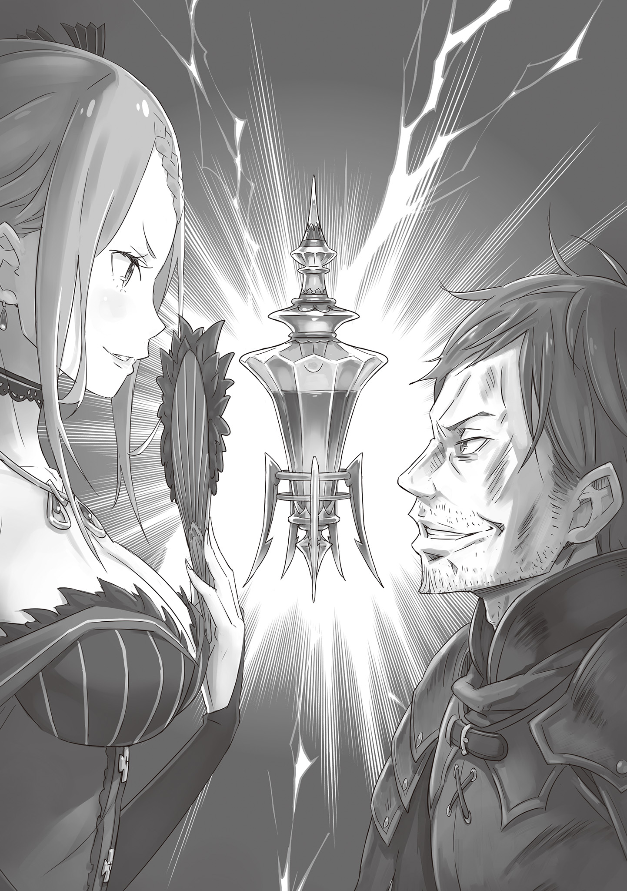

…В комнате стоял смрад крови и выпивки.

Поваленные, разбитые полки, разбросанные осколки керамики, грубые мечи и окровавленные дубины — всё это служило доказательством того, что здесь произошла безумная, хаотичная драка.

Не было видно ни одной красивой вещи, лишь презрительная грязь застилала взор.

Поэтому девушка в багровом платье, вошедшая в эту грязь, не только бросалась в глаза, но и казалась настолько чужой, что можно было подумать, будто сам мир ошибся в выборе её роли.

Её оранжевые волосы переливались, словно солнечный свет, её глубокие малиновые глаза были подобны палящему пламени, а её кроваво-красное платье было украшено ужасно дорогими драгоценностями. Однако все эти сверкающие драгоценности не могли сравниться с красотой самой девушки.

Её красота была из тех, что застилают разум, как только на неё взглянешь. Если понятие экстравагантности превратить в нападение, то красота девушки была самой его квинтэссенцией: насилие, окрасившее своим оттенком чувство красоты, присущее всему человечеству.

Девушка, в итоге пришедшая не на ту сцену, смотрела на тускло освещённую комнату своими пунцовыми глазами.

Зрелище, представшее перед ней, было жалким, тошнотворным. Следы боёв, оставленные вокруг, были такими же, как и вышеупомянутые, однако деталь, которая произвела наибольшее впечатление, была опущена в объяснении.

На земле лежали тонны человеческих останков. Более того, некоторые конечности были отрублены, внутренности извлечены из тел, так что образовалось озеро свежей крови.

Вонь от неё была совершенно удушающей, а слабый, но резкий запах спиртного завершал ошеломляющую картину. Скорее всего, бочки с алкоголем, висевшие на стенах, получили повреждения, в результате чего их содержимое вылилось наружу.

Вонь крови и выпивки, наполнявшая воздух, делала атмосферу воплощением мирового упадка. И в этом упадке…

— …Чёрт возьми, женщины не должны появляться в таком месте.

…Присутствовал единственный выживший, угрюмо бросивший эти слова в сторону прелестной девушки.

Света в комнате было, поэтому они не могли ясно видеть лица друг друга. Однако она могла сказать, что это был мужчина, что он был высоким, что он был зол и что он был пьян от крови и выпивки.

Она могла сказать и о других вещах, но не обратила на них внимания, поскольку они были пустяками по сравнению с текущей информацией. Вместо этого она фыркнула, прикрыв рот веером, который держала в руке.

— Не обращайся со мной так, будто я одна из тех служанок или деревенских девушек. Что уж тут говорить, дураки всегда будут дураками, с моей стороны было бы сверх гордости просить у тебя прощения за этот глупый поступок.

— …Чёрт, мне что, алкоголь в голову ударил? Я не понимаю ни слова из того, что ты говоришь.

Мужчина раздражённо поморщился, вслушиваясь в её слова. Он положил одну руку на голову и медленно покачал головой влево и вправо, чтобы избавиться от дурноты. Затем противоположной рукой он приготовил свой меч — свой рыцарский меч.

— Что ж, неважно. Призрак или нет, всё будет гораздо проще, если я тебя прирежу.

— Какой опрометчивый человек. Я похвалю тебя только за то, что ты не пытался потратить моё время впустую.

— Проваливай, призрачная женщина…!

Как только он произнёс эти слова, фигура мужчины одним махом сократила расстояние между ними. Расстояние между ними исчезло в мгновение ока, так что тонкая шея девушки оказалась в зоне досягаемости меча мужчины.

Его удар можно было даже назвать весьма ярким, что резко контрастировало с его потрёпанной внешностью.

В частности, в его ударе мечом чувствовалась тренировка, которую он проделал, чтобы одним ударом уничтожать своих врагов — несомненно, именно это привело к появлению всех этих трупов разбойников, разбросанных по комнате.

Точно так же и девушка должна была получить от его удара отрубленную голову и оказаться среди трупов… Но не успела она лишиться жизни, как рыцарский меч мужчины был отбит с пронзительным лязгом.

— Что за…!

Мужчина отступил назад, издав возглас удивления от того, что его удар был блокирован. Возможно, он не был бы так взволнован, если бы причина была только в этом. Однако поведение девушки было странным.

Она отбила его удар, ударив кончиком веера по спине его меча. Затем, пока он стоял в оцепенении от этого факта, тело девушки исчезло перед ним…

— Где т… Бх!

Через долю секунды после того, как он позволил своему взгляду блуждать по сторонам, его ударили по лицу, в результате чего его высокая фигура крутанулась в воздухе и врезалась в стену. И точно так же мужчина отскочил в ответ, а затем один удар за другим, в общей сложности три, врезались в его спину, заставив его закашляться кровью, когда он рухнул в лужу крови.

Пока мужчина вспенивал кровь, на его голову опустилась туфля на высоком каблуке.

— Абсолютно неправильно направлять на меня свой меч, ты должен благодарить свои счастливые звёзды.

Девушка внушительно высказала эти слова в сторону сбитого ею с ног мужчины, топча его так, что у него заскрипел череп. Естественно, у упавшего человека не хватило ума ответить ей; и если бы он остался в таком положении, то, вероятно, утонул бы в луже крови.

— …Принцесса, принцесса, как всё так получилось?

Девушка издала раздражённый вздох, услышав голос, раздавшийся сзади неё, и обернулась. Она увидела странную фигуру в железном шлеме, стоящую у входа, освещённого сзади.

Железный шлем смотрел на ад внутри комнаты и на мужчину, которого топтала девушка, и сказал: “Я думаю, он умрёт, если ты будешь продолжать в том же духе, так что не могла бы ты убрать ногу?”

И таким вот нелепым образом мужчина в шлеме предложил это, чтобы спасти несчастного от ада, находящегося в луже крови.

В настоящее время баронство Бариэль переживало период перемен.

Толчком к этому послужили Королевские Выборы, проходившие в Драконьем королевстве Лугуника — с пятью девушками, которые были выбраны в качестве кандидаток на церемонии избрания следующего короля вместо умершей от болезни королевской семьи.

Одна из этих пяти кандидаток, Присцилла Бариэль, была знаменитой “Солнечной принцессой”, о которой ходили разные слухи.

Первоначально её муж, Лейп Бариэль, был тем, кто должен был править землями Бариэль. Однако он был полон дурной славы в отношении своего поведения в качестве правящего лорда.

В действительности, граждане, подчинявшиеся законам его территории, страдали в нищете, проводя свои безденежные дни, не зная, что их ждёт завтра… Однако в те дни с ними произошла перемена.

Лейп внезапно тяжело заболел, примерно в то время, когда Королевские Выборы начались. И тогда его молодая жена, Присцилла, сменила своего больного мужа на посту правящего лорда.

Её превосходные способности в мгновение ока очистили земли Бариэль от застойной атмосферы. И хотя Лейп в конце концов скончался, дела у Присциллы шли своим чередом, выполняя волю её покойного мужа.

То, как она была честна и искренна, стало спасением для жителей баронства, которые пострадали от его плохого правления.

Поэтому жители почитали её как богиню спасения и с бесконечной благодарностью и уважением называли “Солнечной принцессой” в честь её прекрасной внешности, напоминающей солнце.

— Так что же мне с тобой делать? Повесить до смерти или обезглавить? Учитывая, что я так щедра, я позволю тебе выбирать.

Солнечная принцесса, богиня спасения, сказала это связанному человеку с жестокой улыбкой.

Сейчас они находились в самом большом здании близлежащей деревни Аганте, вдали от бандитского логова, пропахшего кровью и алкоголем, — в одной из комнат жилища старосты деревни.

Конечно, независимо от того, был ли это лучший дом, который могла предложить деревня, он всё равно не дотягивал до уровня Присциллы, однако…

— Ветхий дом, обставленный убогой мебелью. И что ещё хуже, качество еды здесь ужасное, ни одно блюдо не достойно меня… Тем не менее, они сделали всё возможное, чтобы мы чувствовали себя как дома. Кто я такая, чтобы возлагать вину на людей за то, что им недостижимо. Было бы бесполезно подвергать их мелким обвинениям.

Так распорядилась “Солнечная принцесса”, поэтому её подчиненный, железный шлем — Ал, хранил молчание.

Однако, как только он подумал, что Присцилла проявила отношение, которое можно было бы назвать милосердным, она пошла и навязала эти жестокие решения захваченному человеку. Он действительно не мог понять её.

На данный момент он метафорически сложил руки в молитве за несчастного человека. На самом деле, это было невозможно, поскольку у него не было левой руки, так что тут уж ничего не поделаешь. Тем не менее…

— И всё-таки… Не слишком ли вы его запугиваете, принцесса? Будь такой, и ты знаешь, как это бывает, даже те, кто могут говорить, не станут этого делать.

— Что ты несёшь? Когда это я ему угрожала? Всё, что я сделала, это проявила милосердие.

— О, ты действительно в настроении лишить его жизни…? Это было немного неожиданно.

Ал пытался сменить тему, но Присцилла посмотрела на него взглядом, полным презрения, заставив его в отчаянии возиться со швами на шлеме.

— Вы, люди, знаете, кто я, чёрт возьми, и вы всё ещё обращаетесь со мной подобным образом?

Жалкий человек, связанный верёвкой, был тем, кто прервал их обмен мнениями. У Ала было плохое предчувствие в ответ на то, что он решил выдавить из себя. Его беспокоило не столько то, что он сказал, сколько реакция Присциллы, которая это слышала.

— Хах, “Кто я”, — сказал он. Простолюдин, который разевает рот, говоря такие забавные вещи. Ты слышал его, Ал?

— Да, слышал. Я слышал его, и именно потому, что слышал, я не могу не беспокоиться, что ты собираешься сорваться, принцесса. Может, я предложу пока послушать, что он скажет?

Ал выбрал слова как можно более нейтрально и предложил это, и Присцилла, конечно же, заинтересованно улыбнулась. Однако хмурый взгляд мужчины стал ещё глубже, как будто он истолковал его слова как поддержку.

— Этот чудак точно понял. Эй, было бы разумно снять с меня эти верёвки как можно скорее. Злясь на меня, вы ничего не добьётесь…

— Хватит болтать. Поторопись и покажи, кто ты такой. Разве я не говорила тебе тогда, в том мерзком свинарнике, что единственное, что у тебя есть, это то, что ты не потратил моё время впустую?

— …Я — Хейнкель Астрея.

В одно мгновение мужчина был ошеломлен тем, что сказала Присцилла, а его голубые глаза наполнились мрачными эмоциями, когда он назвал себя.

Ал перестал возиться со своим шлемом, как только тот произнёс своё имя. Заметив это краем глаза, Хейнкель с триумфом сказал: “Похоже, ты знал”.

— Астрея, я — Астрея. Я скажу это ещё раз, просто чтобы глупая женщина поняла. Астрея, это моя фамилия. Не может быть, чтобы ты не понимала, что это значит, верно?

— Ну, я не понимаю. Какое значение эта фамилия должна иметь для меня?

— Вау.

Торжествующее лицо мужчины застыло на месте, как только он почувствовал её веер прямо на своей шее. Мгновенно по лицу мужчины побежал холодный пот, как будто воспоминание о том, как его чуть не убили, вернулось.

— Не пойми меня неправильно, глупый простолюдин. Единственный, кто имеет право решать здесь всё, это я, и только я. Не важно, как тебя зовут, не важно, из какого ты пэрства, и не важно, чей ты отец — они не повлияют на мой выбор.

— Гх, кх…

Получив холодные слова Присциллы, Хейнкель потерял дар речи. Скорее всего, серьёзность её слов дошла до него, когда он посмотрел в её пунцовые глаза.

Тем не менее, Ал не мог закрыть глаза на рыжие волосы, голубые глаза и силу, которой обладал человек, называвший себя Астреей.

— Хватит, принцесса. Этот парень — Святой Меча… Ну, судя по тому, что ты сейчас сказала, этот парень, должно быть, отец Святого Меча, верно? Если мы его убьём, то попадём в настоящую передрягу.

— Что, Ал, ты думаешь, что я проиграю такому извращённому парню?

— Возможно, нет, принцесса, но думаю, что я бы проиграл. Шульт тоже попадёт в беду.

— Фу, с каких это пор ты начал вести переговоры так, чтобы затронуть Шульта.

Присцилла нахмурила брови и посмотрела на Ала, когда тот отвесил ей вежливый поклон. Она фыркнула на его поведение и молча отдёрнула веер от Хейнкеля.

Сразу после того, как он освободился от её убийственного намерения, Хейнкель начал тяжело дышать, словно только что вспомнил.

— Хх, ххаа, ххаа… Ч-что с вами не так, люди? Вы знаете, что я Астрея, и всё же…

— О, если я скажу тебе, что эта прекрасная, благородная леди здесь, как сливки урожая, кандидатка на Королевские Выборы в Королевстве Лугуника, Присцилла Бариэль-сама… Ты поймёшь, в каком положении находишься, верно?

— К-к-кандидатка на Королевские Выборы…?

Услышав нечто столь неожиданное, Хейнкель побледнел. Вероятно, до него дошло, какая должность, между его и Присциллы, считалась более важной в Королевстве в настоящее время.

Кроме того, было бы совсем не странно, если бы он знал о репутации Присциллы благодаря своему положению.

— Но что женщина в вашем положении делала в этом логове бандитов…

— Негодяи угрожали моим гражданам прямо здесь, в моих землях. Так что же странного в том, что я вмешиваюсь в это?

— Ну, она говорит это так, будто действительно заботится о своём народе, но на самом деле она просто случайно оказалась поблизости и услышала что-то интересное, поэтому и отправилась туда.

— Что-то, что показалось интересным…?

— Странствующий рыцарь услышал это от жителей деревни и благодаря своему рыцарскому духу взял на себя ответственность разобраться с бандитами, отправившись в одиночку в их логово глубоко в горах. Это трогательная история, которая понравилась бы поэту, не так ли?

Ал пожал плечами, словно подшучивая над ним, отчего Хейнкель молча закрыл рот. Даже Ал мог сразу понять, что его молчание не было вызвано неловкостью.

Как ни краток был их контакт, Хейнкель не был из тех, кто обладает такой добродетельной натурой. Он ни за что не взял бы в руки меч по такой причине, как нежелание смотреть на чьи-то страдания.

— Я могу предположить, какую цель ты преследуешь. Скорее всего, тебе нужна эта вещь, которая была у бандитов?

Говоря это, Присцилла держала что-то перед Хейнкелем. Чашу тускло-серебристого оттенка. Волна приглушённых эмоций пронеслась по глазам Хейнкеля, как только он увидел её. Уныние от того, что он взглянул на что-то настолько разочаровывающее — или, возможно, чувства, граничащие с ненавистью.

— Похоже, бандиты утверждали всякое… вроде “Если налить в эту чашу ликёр и выпить, то в мгновение ока излечишься от любого недуга”, выдавая это за правду. Действительно, это должен был быть “Метеор”. Однако…

— Эта чушь — всего лишь фикция, превращающая алкоголь в наркотик для облегчения боли. Не похоже, что, если использовать его на больном человеке, это его вылечит. Это пустышка.

— И это ты узнал после того, как расправился с подчинёнными, которые отказались передать тебе “Метеор”. Хах, как забавно. Эта кучка, погибшая из-за своих преувеличений, ещё более тупая, чем ты.

Присцилла выплюнула свои слова и крепче сжала чашку в ладони. Сразу после этого чашку охватило пламя, и она сгорела дотла в мгновение ока.

Хейнкель в шоке открыл глаза, но не от того, что она расплавила серебро, а от бушующего адского пламени. В отличие от него, Ал, будучи вполне знакомым с этим, просто хрустнул костями шеи и сказал:

— Принцесса, меня пугает, когда ты не говоришь мне, что собираешься это сделать, к тому же, ты ведь можешь обжечь свои маленькие хорошенькие рученьки.

— Прекрати свои ошибочные опасения. Важнее то, что ты должен отправить этого глупого простолюдина к той девушке из трущоб. На этот раз я забуду о произошедшем, потому что он избавил меня от необходимости выслеживать этих бандитов.

Оставив эти слова, Присцилла отвернулась от Хейнкеля, выражение её лица говорило о том, что она потеряла интерес. На самом деле, она, вероятно, полностью отстранилась от него. Можно сказать, что для Хейнкеля это было спасением.

Тем не менее, он обратился к её повернутой фигуре…

— Вы упомянули, что являетесь кандидаткой на престол, не так ли? Тогда, думаю, я могу быть вам полезен.

— …

В ответ Присцилла остановилась на месте. Она обернулась и посмотрела на Хейнкеля. По позвоночнику Ала пробежала дрожь, когда он уловил взгляд её глаз со стороны.

Если бы Хейнкель допустил хоть одну ошибку в своих словах, он бы в мгновение ока потерял голову. Если дело дойдет до этого, то им не удастся избежать столкновения с лагерем, в котором находился Святой Меча. При этом внимание Присциллы уже было сосредоточено на Хейнкеле. Если бы Ал прервал её сейчас, он был бы единственным, кто вызвал бы её недовольство.

Беспокоясь о своей шкуре, Ал выжидал, что же скажет Хейнкель дальше, чувствуя себя словно в молитве.

— Говори. Чем ты можешь быть мне полезен?

— …Паршивка Святого Меча доставляет тебе неприятности, верно? У меня есть план, как справиться с этой девочкой, говорящей, что она тут босс, и превращает его преданность в свою игрушку. Хех, хе-хе.

Хейнкель сообщил ей о своих враждебных намерениях по отношению к собственному сыну, а также к девушке, которой его сын присягнул как своему хозяину, при этом сверкнув злобной ухмылкой. Это произвело на Ала некоторое впечатление.

И, похоже, на Присциллу тоже; она закрыла один глаз и сказала: “И что же ты хочешь от меня взамен?”

— Кровь.

— …кровь.

Хейнкель твёрдо кивнул ей, когда она повторила это слово, просто чтобы убедиться.

Затем отец Святого Меча, человек, носивший фамилию Астрея, заговорил с искажённым выражением лица.

— Когда ты станешь королевой, одолжи мне Кровь Дракона, что хранится в замке. Мне… Мне потребуется чудо, чтобы она проснулась.

《Конец》
