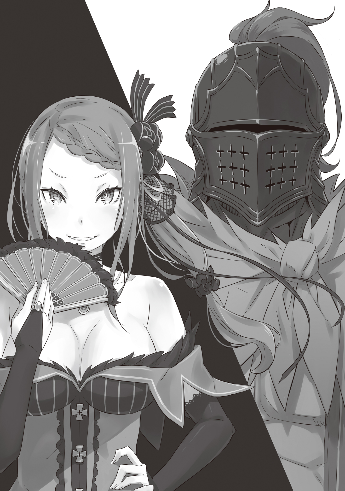

— Ну и сборище… бестолковые глупцы, не знающие своего места.

Глядя на разворачивающуюся внизу картину, девушка прикрыла рот веером и, не таясь, бросила фразу, сочившуюся ядом.

Она обладала пугающей красотой, напоминающей смертоносный цветок — была истинной девой, излучающей агрессивное, подавляющее великолепие.

Её волосы цвета солнца, собранные в сложную высокую причёску, сверкали драгоценными камнями, а кроваво-красное платье бесстыдно открывало плечи. Пышный бюст, едва сдерживаемый тканью и словно готовый в любой миг вырваться на свободу, лишь подчёркивал дьявольскую притягательность, способную испепелить рассудок любого мужчины.

Алые, подобные пламени, глаза холодно смотрели вниз, во внутренний двор каменного особняка, больше напоминавшего крепость. Туда, где кипело действо, и на тех, кто был поглощен его безумием.

Сад был огромен, но здесь не нашлось места привычным дворянским статуям или цветочным клумбам. Газон скрывала грубая брусчатка, а в центре возвышалась круглая арена. Обступившие её участники орали, заглушая лязг металла, и не могли оторвать жадных глаз от яростных схваток на помосте.

— Состязание в боевых искусствах, турнир прямо перед моим взором… — протянула красавица с выражением предельной скуки. — Надо же, из каких щелей выползло столько бездельников?

Снизу доносилась грязная брань, камни были запятнаны кровью и потом, а искры от скрещивающихся клинков лишь сильнее разжигали лихорадку толпы.

В этот миг кто-то во дворе заметил фигуру, возвышающуюся над суетой. Множество голов тут же повернулось в её сторону.

Взгляды дикарей в помятых шлемах и латах, сжимавших грубое оружие, горели неистовым жаром.

Однако, оказавшись в перекрестье стольких глаз, девушка даже бровью не повела, сохранив ледяную маску на лице.

— Усердствуйте, сколько влезет. Быть может, если вы будете каждый день сдирать плоть с костей, то станете достойны моего взгляда.

Она резко, с сухим щелчком распахнула веер, надменно бросая им эти слова. Голос прозвучал совсем не громко.

И всё же он непостижимым образом ударил по барабанным перепонкам каждого присутствующего, заставив волну возбуждения вспыхнуть с новой, пугающей силой.

— …

Алые глаза, наблюдавшие за этим помешательством, оставались абсолютно холодными.

— Присцилла! Не заставляй меня повторять! Твое появление перед ними вызовет ненужный ажиотаж! Сиди тихо в своей комнате и жди результатов!

— Сие действо устроила я ради собственного развлечения. Если я не узрею всё лично, то какой смысл в стараниях этой черни? Это было бы верхом бестактности. И тебе не стоит повторяться, старый хрыч.

— Старый хрыч… говоришь?! Т-ты… да за кого ты меня принимаешь?!

— Ты — муж, купивший меня за деньги, разве не так? Не забивай голову пустяками, ничтожество. Если испортишь мне настроение, проблемы будут у тебя. А кто именно там победит — мне совершенно безразлично.

— Гх…

Старик поперхнулся и скрипнул зубами; на лбу вздулись вены. Лейпу было под семьдесят, но он держался прямо, а в движениях сквозила энергия, совершенно не свойственная дряхлеющим старцам. Если источником этой силы были непомерные амбиции, то такая жадность заслуживала даже некоторого уважения.

Присцилла взирала на не скрывающего ярость мужа равнодушным, полным скуки взглядом.

Их связывали узы брака, невзирая на пропасть в возрасте. Однако ни привязанности, ни любви там не было и в помине — их связь была продиктована необходимостью. Для Лейпа это была очередная ступень к воплощению его амбиций. Для Присциллы — просто следствие привычной среды обитания.

— Я с самого начала был против! Ты не понимаешь, насколько важен выбор рыцаря! Родословная, статус, достоинство — всё это напрямую влияет на репутацию господина! Выбирать столь важного слугу через этот балаган…

— Я буду поступать так, как пожелаю. Не забывай: я потакаю твоему заговору лишь до тех пор, пока он не противоречит моим капризам. Знай же: плоды твоих многолетних интриг зависят от каждого слова и действия, способного повлиять на моё настроение. Так что старайся лучше, бездарь.

Холодно отмахнувшись от повысившего голос супруга, Присцилла под шелест платья вновь направилась к окну. Проигнорировав строжайший запрет показываться на людях, она без колебаний вышла на террасу.

Ветер коснулся её кожи. Придержав рукой развевающиеся волосы, Присцилла окинула взглядом сад. Внизу бурлила толпа. Собравшиеся здесь воины жаждали главного приза — титула рыцаря леди Бариэль. Ради этого они были готовы махать мечами и проливать кровь.

Лейп Бариэль занимал видное место в Королевстве Лугуника. Стать рыцарем его жены означало получить исключительные привилегии. Обычно такой чести удостаивались лишь «настоящие рыцари», состоящие в Королевской Гвардии. Однако на сей раз был пущен слух, что избранника найдут среди вольных воителей. Разорившиеся наёмники и те, кому высокий статус и не снился, ухватились за этот призыв, наполнив сад атмосферой безумного ажиотажа.

И всё это происходило исключительно по воле самой Присциллы, продавившей решение вопреки протестам мужа.

— Сброд собрался знатный, признаю. Однако даже в такой куче…

Лицо Присциллы, взиравшей на людское море свысока, оставалось хмурым. В её глазах читалось разочарование: вопреки пылу сражающихся внизу, сердце госпожи оставалось холодным. Это не было лицо человека, наслаждающегося развлечением. Она смотрела на них не как на героев, а как на скот, дерущийся за территорию в загоне.

— Ничто не заставляет моё сердце трепетать. А значит, никто из них не достоин стать моим рыцарем.

Услышь эти слова Лейп, у него от злости наверняка случился бы удар. Если головорезы внизу узнают, что их собрали впустую и победителя не будет, они могут тут же наброситься на хозяев. Лейп хоть и бесился, но бледнел именно от понимания: страже особняка не сдержать такую разъяренную орду.

— Несчастливое будущее всей этой оравы зависит лишь от моего каприза… Хм?

Она уже собиралась уйти, зевая от скуки, но вдруг замерла. Обернувшись вполоборота, девушка подошла к перилам террасы. Что-то мелькнуло на самом краю её поля зрения.

Опершись руками об ограждение, Присцилла вгляделась в сад — и увидела его.

— Ой-ой. Если все будут так от меня шарахаться, я же реально в депрессию впаду.

На каменном возвышении стоял мужчина, оглядывая толпу.

Почему он привлёк внимание Присциллы? Ответ был прост. В тот же миг, как появился этот человек, царивший вокруг гвалт стих, словно его отрезало ножом.

Причина же такой реакции становилась ясна при первом взгляде на него.

Выглядел незнакомец донельзя странно. Голову скрывал глухой угольно-черный шлем, полностью прячущий лицо. При этом ниже шеи на нём висел дешёвый плащ, а тело прикрывала лишь легкая одежда из грубой ткани. На ногах — плетёные сандалии, кое-как примотанные тряпками. Всё было принесено в жертву подвижности.

Но главное, чем он приковал всеобщее внимание — у него отсутствовала левая рука.

Будь это уличная драка — ещё куда ни шло, но здесь проходил турнир, где состязались в воинском искусстве. Однорукость была гандикапом, тяжесть которого понимал любой.

Значит ли это, что он чертовски уверен в правой руке?

Видимо, к тому же выводу, что и Присцилла, пришли все присутствующие. Закованный в латы противник однорукого поудобнее перехватил широкий меч и, не теряя бдительности, начал сокращать дистанцию.

В ответ странный воин хрустнул шейными позвонками и неторопливо протянул: — Ого-го, какой ты у нас ретивый… Если проиграю, я разревусь, так и знай.

Выхватив меч, закреплённый горизонтально на пояснице, он с шутками-прибаутками, вальяжной походкой двинулся навстречу врагу.

— Любопытно. Любопытно, любопытно, любопытно, любопытно. Хм-м… как же это любопытно!

Шумно раскрывая и закрывая веер, Присцилла повторяла одно и то же слово, и с каждым разом на её лице проступало всё большее упоение. Она взволнованно мерила шагами комнату; на щеках играл румянец возбуждения. Даже не осознавая того, всем своим обликом она источала ауру такой густой, почти порочной чувственности, что это казалось выходящим за рамки приличий.

Глядя на её расцветшую красоту, находившийся рядом Лейп судорожно сглотнул. Старик, чей источник плотских желаний, казалось, должен был давно иссякнуть, потряс головой, силясь отогнать внезапно подступившую жажду.

— Да что тут любопытного?! О чём ты вообще думаешь?! Ты разогнала всех, кого мы с таким трудом собрали, прогнала даже победителя турнира, а оставила… вот это?! Ты в своём уме, женщина?!

— Не желаю тратить время на пустые пререкания о том, где кончается здравый смысл и начинается безумие. Кто поручится за твой рассудок? Правоту моих деяний докажет сам мир через явленный результат. Не смей разбазаривать мои мгновения своими унылыми речами. Лучше приведи его.

— Да как ты…

Лейп захлебнулся гневом, но Присциллу его возмущение интересовало не больше пыли под ногами. Воздух в комнате сгустился до предела, но назревающую бурю прервал вежливый стук.

— Господин Лейп, госпожа Присцилла, я привёл его.

— Угу. Дозволяю. Пусть войдет, — бросила Присцилла, опередив хозяина дома.

За дверью возникло короткое замешательство. Затем створка отворилась, пропуская внутрь совсем юного мальчика, едва достигшего подросткового возраста, а следом…

— Когда важные шишки вот так срывают с места и вызывают на ковёр, такой трус, как я, чувствует, будто жить мне осталось недолго.

Пощелкивая застёжкой шлема, в комнату вошел однорукий мужчина.

Он бесцеремонно оглядел комнату и, заметив устремленный на него взгляд Присциллы, пожал плечами.

— Искренне польщён приглашением… На колени падать обязательно?

— Плевать. Пустые формальности — удел сброда, они не имеют ценности. Покажи мне, какова твоя истинная цена. Иначе зря я потратила на тебя время.

— Жуткая женщина… Надеюсь, я не ошибся адресом.

— Негодяй! Как смеешь ты в таком тоне разговаривать с моей женой?!

Терпение Лейпа, наблюдавшего за этой пикировкой, лопнуло. Старик решительно двинулся к гостю, брызгая слюной от ярости: — Твоё поведение, твои манеры — сущее издевательство! Явиться сюда, даже не соизволив снять шлем — неслыханная наглость! Такого хама, как ты, нужно казнить на месте за непочтительность, и…

— Посредственность.

— Что?! Мы заняты важным де…

— Шумный.

Вместе с этим словом Присцилла нанесла удар.

Сложенный веер со свистом врезался в затылок Лейпа. Старик, чье лицо мгновение назад багровело от гнева, беззвучно, как подкошенный, рухнул на пол. Сбив мужа с ног одним ударом, Присцилла выдохнула и перевела взгляд на застывшего в сторонке мальчика.

— Унеси.

Юный дворецкий подчинился без колебаний. Он подставил плечо под грузное тело старика и, волоча ноги под тяжестью, но с удивительной сноровкой потащил бесчувственного хозяина прочь.

Дверь за ними с шумом закрылась. В комнате остались лишь двое: Присцилла и странный гость.

— Ну вот, наконец-то помеха исчезла.

— Не мне это говорить, но не слишком ли эксцентрично? — протянул мужчина. — Остаться в закрытой комнате с типом столь подозрительной наружности… у вас что, напрочь отсутствует инстинкт самосохранения?

— Ты полагаешь, что способен что-то сделать мне? Не зазнавайся, простолюдин. Со мной происходит лишь то, чего желаю я сама. Ничто иное в этом мире не властно над моей судьбой.

Присцилла самодовольно выпятила грудь. Глядя на это, мужчина тяжело вздохнул и покачал головой: — Ну вы даёте. Сдаюсь, этот орешек мне не по зубам. И что же я, чёрт возьми, должен продемонстрировать, чтобы соответствовать высоким стандартам принцессы?

— Ну, скажем так… — Присцилла на миг задумалась. — Попробуй выжить.

Не успели эти слова затихнуть, как её тело сорвалось с места, крутанувшись волчком.

Раскрытый веер скользящим росчерком пронесся перед лицом мужчины, перекрывая обзор. Тот рефлекторно отбил пеструю вещь правой рукой. Но Присцилла уже скользнула ему во фланг. Рывок руки к чужому поясу — и она выхватила из ножен широкую рукоять меча, принадлежавшего самому же гостю.

— Ха!

Короткий выдох. Вспышка стали. Разогнанный центробежной силой клинок устремился горизонтально, грозя снести мужчине голову.

«Он мой. Однозначно», — с холодной уверенностью отметила про себя Присцилла.

— Вот что значит выражение «висеть на волоске», да?

Кончик клинка с гудением рассёк воздух, задев лишь верхний слой кожи на шее мужчины, успевшего отклониться назад.

Голова с плеч, фонтан крови — исход казался предрешенным фактом. Удар был безупречен. И всё же она промахнулась. Цель ускользнула в ничтожную долю секунды, отделявшую жизнь от смерти.

— Пощадите, принцесса. Вы ведь не станете бить второй раз, правда?

— Будь спокоен. Этого единственного выпада было достаточно, чтобы увидеть твою суть. Хм… И всё-таки любопытно.

Присцилла с лёгкой усмешкой швырнула меч обратно владельцу. Увидев летящий в него обнаженный клинок, мужчина в панике отпрыгнул: — Поймать такое нереально!

С влажным хрустом острие вонзилось в ковёр, глубоко уйдя в пол.

— Эй, простолюдин. Что за неуважение? Ты что сотворил с моим ковром?

— Это ведь не я виноват! Как ни посмотри, это самоуправство принцессы! И вообще, как мне это понимать? Могу я льстить себя надеждой, что пришёлся вам по вкусу?

— Покуда ты развлекаешь меня больше, чем стоит этот ковёр — можешь. Твоя реакция в тот миг, да и всё твоё поведение в качестве потехи… В твоих действиях есть ценность, достаточная, чтобы удержать мой интерес.

Услышав вердикт, мужчина с шумом выдохнул. Представив выражение его лица под шлемом, Присцилла достала из-за пазухи запасной веер и прикрыла им губы.

— Итак, почему ты не снимаешь шлем даже передо мной?

— Просто… я слегка облажался, и лицо теперь не то чтобы людям показывать. Не хочу портить принцессе настроение, так что уж потерпите. К тому же я ведь ещё не представился, верно?

— Хорошо, дозволяю. Услышать имя шута и приблизить его к себе — в этом есть величие моего духа. Назовись.

Без всяких формальностей Присцилла царственно даровала ему право голоса.

— Альдебаран. Меня зовут Альдебаран, принцесса. И, принцесса… хотел бы, чтобы вы звали меня просто Ал. Я называю вам полное имя, потому что отныне вы — моя Госпожа.

— Звучит неплохо. У тебя хорошее имя, Альдебаран. Так и быть, сегодня я великодушна. Я не отвергну первую же просьбу своего слуги. Ал — так я буду звать тебя.

Когда новоиспеченный слуга благодарно поклонился, Присцилла тихо фыркнула. Бросив косой взгляд на Ала, который с кряхтением выдёргивал меч из пола, она произнесла: — С этого момента я вступаю в борьбу, что определит судьбу этой страны. И хотя исход мне очевиден, дорога предстоит бурная. Ал, я приказываю тебе расчищать этот путь передо мной. Возражения есть?

— Что? А, никак нет. Именно ради этого я здесь.

Многозначительное бормотание Ала Присцилла пропустила мимо ушей, сохранив невозмутимый вид. То, что он что-то скрывает, она ясно понимала. Оба понимали: даже клятва верности не означает, что все карты на столе. И всё же Присцилла оставалась спокойной, ибо её уверенность была абсолютной.

Такова была её жизненная философия, её естество:

— Сей мир устроен так, чтоб был удобен для меня.

Вот причина, по которой дева по имени Присцилла Бариэль была такой самоуверенной и себялюбивой.

