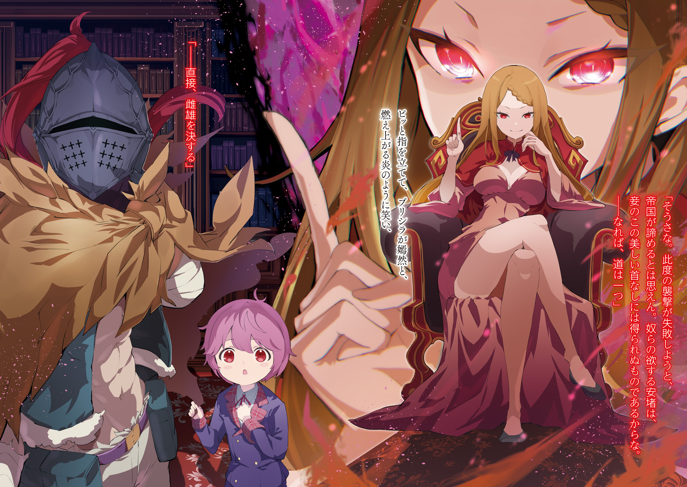

Один за другим, трупы бросали в вырытую глубокую яму. С них сняли черные одежды, и даже их жалкие и убогие лица, с навсегда застывшими эмоциями, были обнажены. Их смерть никто не узнает и не будет оплакивать, ведь они лежат здесь, в холодной темной земле.

???: Мне кажется, что фраза «Жизнь приходит и уходит» здесь вполне уместна. В конце концов, жизнь быстротечна. Так ведь?

Некто обращался к трупам, пока их закапывали, но они, естественно, не отвечали.

Один из солдат, хоронивших тела, вместо этого обратился к нему: «Господин Ал». Он принадлежал к так называемым «Красным Пластинам», все его тело покрывала красная броня.

Солдаты входили в состав частных войск Присциллы, правительницы территории Бариэль; несколько из них занимались захоронением тел. По тому, как небрежно они это делали, было видно, что хоронят они не своих товарищей или соратников. Все было наоборот.

Солдат: Я слышал, что вы скрестили мечи с одним из ассасинов, которые ворвались в особняк. Вы ранены?

Ал: Это должно быть очевидно, если посмотреть на меня. Бой был чертовски ожесточенным, я потерял левую руку.

Солдат: …даже не знаю, что сказать.

Слишком серьезный молодой человек скорчил гримасу, на что Ал пожал плечами, подумав про себя: «Блин, этот парень не понимает шуток». Тем не менее, юноша действительно беспокоился о нем, поэтому Ал поднял правую руку и повернулся:

Ал: Не стоит беспокоиться, я не ранен. После тридцатикратного упорства я наконец-то нашел хороший способ победить без проблем.

Солдат: А…? Неважно, главное, что вы в порядке.

«Красные Пластины» часто были свидетелями эксцентричного поведения Ала, потому не стали вникать в его слова, также не понимая, что он имеет в виду.

Солдат: В любом случае, я рад, что ни господин Ал, ни слуги не пострадали. ……Не говоря уже о том, что я не могу представить, что бы мы делали, если бы что-то случилось с госпожой Присциллой.

Солдат: Тот, кто защитил госпожу, был тем ужасно знаменитым заместителем командующего Королевской Гвардией, или как там его. Думаю, он все еще отец «Святого Меча», пусть и прогнивший до костей.

Солдат: Но даже если он отец «Святого Меча» и заместитель командующего Королевской Гвардией, было бы очень хорошо, если бы он не был таким гнилым.

Остальные солдаты воспользовались моментом, чтобы продолжить разговор, пока заделывали дыру. Хотя у них сложилось неоднозначное впечатление о заместителе, в их язвительных высказываниях, вероятно, было немало пользы. Впечатления Ала были примерно такими же. ……Они были неоднозначными, но в них была и благодарность.

Ал: …не знаю, что случилось бы с принцессой, в конце концов.

Он уже давно решил, что готов поставить на кон свою жизнь в качестве мясного щита Присциллы, когда представится. Тем не менее, защитить ее, проводя время с ней рядом, круглые сутки, было нереально.

Он задавался вопросом, что случилось бы с Присциллой, если бы она была полностью предоставлена сама себе в этой ситуации.

Ал: Зная ее, принцесса, вероятно, все равно как-то выкарабкалась бы, даже в одиночку…

Солдат: Пускай и так, убийство в такой момент… Это должен быть кто-то из других Кандидаток на трон, да?

Ал: Принцесса из тех, кто никогда не потеряет самообладание. В любом случае, она наверняка догадывается о том, что происходит… хотя нет, скорее всего, она точно знает, в чем дело. Хотя я не думаю, что она скажет нам прямо.

Солдат: Это весьма досадно для тех из нас, кто находится рядом с ней и защищает ее.

Ал: Да, соглашусь.

Солдат опустил глаза и вздохнул, после чего вернулся к своей работе. Поскольку у Ала была только одна рука, он мог лишь играть роль надсмотрщика, не мешая им работать. Тем не менее, он прекрасно понимал, какую тревогу испытывают «Красные Пластины».

Ал молча погрузился в размышления о том, в какую сложную ситуацию попала Присцилла, глядя на лица мертвецов, которых закапывали в землю, чтобы они стали удобрением для почвы.

Прошло около месяца с тех пор, как была улажена катастрофа, вызванная нападением Культа Ведьмы.

Лагерь Присциллы вернулся на свои земли на юге Королевства. По возвращению их осадили наемные убийцы, прямо в доме, по которому они так соскучились.

К счастью, им удалось переломить ход событий с помощью боевых сил, которыми они располагали в особняке, и все закончилось тем, что лагерь не понес никакого ущерба.

Тем не менее, оставалось неясным, кто послал ассасинов. Присцилла приказала Алу похоронить их тела вместе с «Красными Пластинами», и они только что закончили.

Хотя «Красные Пластины» тоже были обеспокоены, самым простым вариантом того, откуда взялись нападавшие — действие одной из Кандидаток… В конце концов, они находились в самом разгаре битвы за трон Королевства. Такие вещи, как убийства и тайные заговоры, не должны вызывать удивления.

Однако из-за того, что произошло в Пристелле, другие лагеря, вероятно, не могли позволить себе тратить силы на эту вражду. Да и сами Кандидатки, вероятно, не слишком любили подобные вещи.

Конечно, он также должен был учитывать вероятность того, что кто-то предпринял действия, чтобы обеспечить победу своей любимой Кандидатки, и это могло не иметь никакого отношения к самим Кандидаткам. Но размышления ни к чему не привели.

Присцилла наверняка пропустит такие подробности и даст ответ, используя свои способности к проницательности, которыми никто другой не обладал. А вот собирается ли она вообще давать ему ответ — это уже совсем другая история…

???: ……Убийцы, которые напали на меня, должно быть, прибыли из Волакии.

Несмотря на ожидания Ала, Присцилла изложила свои мысли без лишней суеты.

???: Волакия… Вы имеете в виду большое Королевство на юге?

Присцилла: Ты действительно смышленый, но это не совсем верно. Волакия — это Империя, а не Королевство, поскольку Император, а не Король, стоит над массами.

???: А какая разница между Королем и Императором…?

Присцилла: Никакой. Они оба глупы и уродливы по сравнению со мной.

Ал: Это не похоже на ответ…

Присцилла находилась в своем кабинете, сидя со скрещенными ногами в своем любимом кресле, окруженном множеством книжных полок. Она смотрела на Ала багровыми глазами, пока он бормотал и жаловался.

Он отпрянул от ее пронзительного взгляда и стыдливо спрятался за невысокого слугу Шульта, стоявшего рядом с ним.

Шульт: Ал-сама, Ал-сама! Я же маленький, так что Присцилла-сама все равно вас видит!

Ал: Эй-эй-эй, ну-ка, Шульт-чан. Пожалуйста, стань высоким, чтобы меня спрятать.

Шульт: Я постараюсь…! О, я знаю! Что, если я сделаю глубокий-глубокий-вдох…

Шульт выглядел очаровательно, пытаясь сделать глубокий вдох, чтобы его тело казалось хоть чуточку больше. Ал успел спрятать голову за милыми попытками мальчика, а затем заговорил.

Ал: Как вы узнали, что убийцы были из Волакии?

Присцилла: Глупец, а как я могла не знать? Они не справились с заданием, и перед тем, как покончить с собой, я задала одному из них вопрос. Это должно было быть очевидным, по их реакции.

Ал: Волк Меча… Я знаю, что это относится к гербу Волакии. Я понимаю, что их реакция тоже чертовски подозрительна, но хочу спросить: что здесь делают люди из Империи?

Именно поэтому подозрения в первую очередь должны были вызывать Кандидатки и те, кто с ними связан.

Даже если подозрения, павшие на них, были сняты в силу каких-то обстоятельств, он все равно не мог понять, почему следующим вариантом, который всплыл, была интервенция.

Ал: К тому же, почему это должна быть Волакия? У меня остались лишь ужасные, кошмарные впечатления от этой страны.

Шульт: С вами там что-то случилось, Ал-сама?

Ал: Да, я потерял левую руку.

Услышав невинный вопрос Шульта, Ал выдал свою вторую однорукую шутку за день. Правда, на этот раз в его ответе была доля правды.

Ал потерял левую руку из-за событий на арене Острова Гладиаторов Гинунхайв в Империи Волакия.

Ал: Это довольно жестоко — убивать друг друга ради развлечения других. Мне было бы куда лучше, если бы я ничего не потерял…

Шульт: Лучше… Но даже так я рад, что познакомился с вами, Ал-сама.

Ал: Шульт…

Ал удивился, услышав эти неожиданные слова от маленького мальчика. Круглые глаза Шульта расширились от удивления, продолжая отражаться в красных радужках глаз Ала.

Шульт: Но тогда, Ал-сама, я бы не смог встретить вас таким образом. Я имею в виду, что в той стычке я бы…

Ал: …Господи, да ты просто мастерски владеешь словом, да?

Поскольку Шульт мог говорить такие вещи совершенно естественно, без всякого предварительного планирования, это привело к тому, что у него был природный талант располагать к себе людей. В сочетании с его очаровательной внешностью, если он продолжит расти в том же духе, то в будущем может стать известным ловеласом.

Ал: В любом случае, я с гордостью могу сказать, что защита такого будущего — один из венцов моей жизни. Принцесса, вы ответите на мой предыдущий вопрос? Например, на каком основании эти волакийские ассасины…

Присцилла: Это очевидно. Империя хотела меня убить.

Ал: …Вас, принцесса? Только не говорите мне, что все дело в какой-то проблеме, которую оставил после себя Лейп?

Владения, которыми управляла Присцилла, баронство Бариэль, изначально принадлежали ее покойному мужу, Лейпу Бариэль. Баронство располагалось недалеко от границы с южной частью Империи Волакия. Оно служило буферной зоной между Королевством и Империей, последняя из которых всегда, так или иначе, конфликтовала с первой.

Он не удивился бы, если бы они заслужили враждебность Империи чем-то подобным. И хотя Ал уже думал об этом, ответ Присциллы стал для него полным шоком.

Присцилла: Нет, мой глупый муж не имеет к этому никакого отношения. Причина, по которой Империя Волакия попыталась убить меня, заключается в том, что я происхожу из ее Императорской Семьи, но инсценировала свою смерть, а затем бежала из страны.

Ал: …А?

Она произнесла эти слова, опираясь подбородком на руки, с выражением скуки на лице. Хотя он и внял ее словам, его мозг с трудом переваривал сказанное, оставляя его в полном замешательстве.

Что она сказала? ……Что она из Императорской Семьи?

Шульт: Так вы действительно из Империи, Присцилла-сама!

Присцилла: Место рождения не имеет никакого значения. Если бы вы проследили, где я родилась, то, конечно, это была бы та земля, где началась моя история.

Шульт: Хм, но как вы приехали в Королевство?

Присцилла: Мне пришлось, чтобы избежать этих неприятных правил. В конце концов, это Путь Империи — не иметь возможности наследовать трон, не убив предварительно всех своих братьев и сестер… Мне это уже порядком надоело.

Ал: Стоп, стоп, стопстопстопстопстоп…

Присцилла непринужденно ответила на невинный вопрос Шульта, не проявляя никаких признаков колебаний. Тем не менее, Ал не мог не прерваться, слушая ее в полном замешательстве.

Это было новостью даже для Ала, который по тем или иным причинам обладал многими знаниями, которыми не владели другие. Он никогда не копался в истории Присциллы, но…

Ал: Принцесса, если я не ошибаюсь, ваш титул — дочь феодала?

Присцилла: Это потому, что я поменялась местами с девушкой, которая пришла в качестве служанки, чтобы научиться этикету, в то время, когда я инсценировала свою смерть.

Ал: …Значит, вы и правда относитесь к дворянству Волакии?

Присцилла: А какая у меня причина лгать?

Хотя Присцилла вела себя спокойно и собранно, у Ала все еще оставалось время на то, чтобы вернуться к здравому смыслу.

Конечно, бывало, что Присцилла говорила весьма нелепые вещи, но это объяснялось тем, что ее способность мыслить нестандартно выходила за рамки понимания обычных людей. К тому же она была не из тех, кто стремится обманывать.

Другими словами, это означало, что все, что она рассказала им здесь, было правдой.

Ал: Я слышал, что престолонаследие в Волакии — чертовски безумное дело. Все дети Императора, имеющие право на трон, убивают друг друга, да? Значит, нынешний Император должен быть…

Присцилла: Мой старший брат. Хотя, он названный.

Ее ответ был бесстрастным, как всегда, но так не должно было быть с самого начала.

Он занял место Императора, но ведь его сестра еще не умерла. Если бы об этом стало известно, пускай даже в этот момент, он был бы свергнут с трона, это был бы ужасный скандал.

Ал: Тогда почему вы участвуете в Королевских Выборах?

Присцилла: Что?

Ал: Разве не очевидно? Вы занимаете должность, которая сильно выделяется, поэтому говорить, что вы притворяетесь мертвой, не имеет смысла. Разве не должно быть очевидно, что Империя заметит это, а также что придут убийцы?

Присцилла: То есть ты хочешь сказать, что я должна жить в страхе перед ними, опустив голову, закрыв глаза и заткнув уши? Если ты говоришь это всерьез, то я, должно быть, ужасно ошиблась на твой счет.

Ал: …………

Ал сглотнул слюну, почувствовав холодный жар, исходящий от ее багровых глаз.

Однако он не собирался отказываться от своего мнения из-за этого. Ал был уверен, что его мнение в этом вопросе правильное.

Если Присцилла дорожила своей жизнью, то ей не следовало ввязываться в такие дела.

Ал: …Хотя кто я такой, чтобы такое говорить?

Пытаясь поставить под сомнение поведение Присциллы, Ал понял, что не обладает достаточной «Квалификацией» для этого.

Ведь тот, кто вывернул ее путь, был не кто иной, как сам Ал. Когда-то у него был выбор — поступить по-другому и не позволить ей участвовать в Королевских Выборах.

Ал уже сделал этот выбор, когда отказался помочь Лейпу Бариэль в его коварном замысле. Он был неправ, когда возлагал на Присциллу вину за свой собственный выбор.

Ал: Итак, принцесса… Что вы теперь будете делать?

Присцилла: Хм. Поскольку убийцы не вернутся, Империя немедленно предпримет следующий шаг. Переубедить их будет практически невозможно. Таким образом, путь, по которому мы должны идти, только один.

Присцилла улыбнулась лучезарной, как пылающий огонь, улыбкой и щелкнула пальцами.

Присцилла: …Уладить это лично.

Ал: …………

У Ала на мгновение перехватило дыхание, когда он услышал ее непреклонный ответ. Рядом с ними Шульт с нервным выражением лица наблюдал за их разговором. Даже если его беспокойство за Присциллу было искренним, он едва мог уловить мысль, учитывая возраст.

Поэтому только Ал мог посоветовать Присцилле не делать этого.

Ал: Принцесса, я знаю, что вы не хотите меня слушать, но, пожалуйста, прислушайтесь к тому, что я хочу сказать. У нас ведь не один выход. Мы можем забыть об Империи, и даже при условии Королевских Выборов и всего остального, есть возможность отказаться от…

Ал с горькой покорностью советовал ей, что все будет к лучшему, если он поставит ее на первое место.

В противном случае он должен был принять во внимание возможность того, что это может вызвать и ее гнев. Вот почему он был несколько удивлен, хотя и не настолько, чтобы не понять, почему.

……Даже если бы ему отрубили голову «Мечом Света», не дав возможности договорить.

Есть вещи, которые не изменить, что бы вы ни говорили и сколько бы действий ни предпринимали.

Так было с судьбой или непреклонной верой — вещами, на которые не влияли действия или вмешательство других людей. Упрямец, который, решив что-то, не сдвинется с места, не уступит, какие бы уговоры или угрозы вы ни использовали. А самым упрямым человеком, которого знал Ал, была Присцилла.

И когда число его попыток заставить ее отказаться от этой идеи достигло тысячи, Алу ничего не оставалось, как с сожалением признать, что его уговоры не сработают.

Присцилла: …Уладить это лично.

Выбор Присциллы уже не мог быть изменен вмешательством извне. Ал понимал это более чем достаточно, поэтому он вздохнул и сказал.

Ал: Я понял, что вы имеете в виду, принцесса. У меня нет никаких возражений.

Присцилла: О? Это удивляет. Учитывая твое поведение в последнее время, я подумала, что ты был бы настолько глуп, чтобы не понять своего положения и пойти против меня, оставшись без головы.

Ал: …жаль, похоже, вы ошиблись насчет меня.

Ал не мог скрыть холодного пота на своем шлеме, говоря с ней так, будто видел это раньше.

В любом случае, он прекрасно понимал, что не сможет изменить ее выбор. Поэтому все, что Ал мог сделать, — это справляться со всеми препятствиями, которые ее ожидали.

……В нем вновь пробудилась та самая решимость, которую он проявил в тот день, когда решил перестать быть звездой.

Присцилла: Тогда приготовьтесь. Мы отправимся в Империю, как только закончится осмотр наших земель.

Шульт: Так точно! Я тоже выложусь по полной!

Шульт выпрямился и ответил Присцилле, не собираясь идти против ее решения. Ал лишь бросил взгляд в сторону, наблюдая за их обменом, а затем посмотрел на пейзаж, открывающийся из окна кабинета.

Под бескрайним небом, далеко-далеко, лежала Империя Волакия… Земля, с которой Ал был тесно связан; земля, в которую Ал не хотел бы больше ступать, если это возможно.

Ал: …Окей, давайте сделаем это. Вперед, о неизбежная судьба!

Что бы ни ждало их впереди, он прорвется из каждого тупика и добьется желаемого результата.

Ал, а точнее, Альдебаран, сжал единственный кулак в никому не ведомой решимости.
