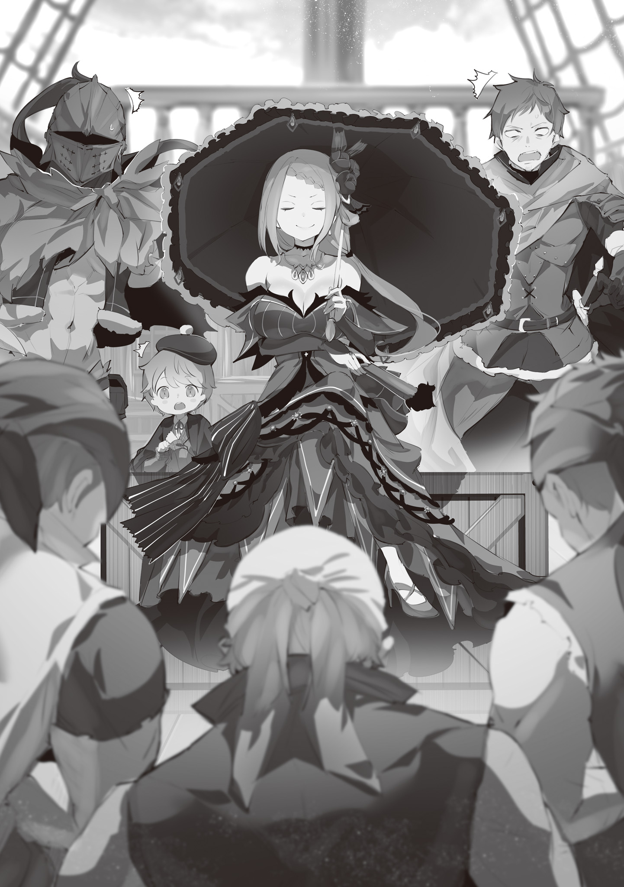

Королевство Лугуника и Империя Волакия издавна были заклятыми врагами. Хотя обе державы и входили в четверку великих стран, по богатству своих земель они заметно уступали Священному Королевству Густеко и Городам-государствам Карараги.

В таких условиях стремление к расширению территорий было вполне естественным. Лугуника и Волакия не раз сталкивались в кровопролитных войнах.

Чаще всего зачинщиками выступали люди Волакии, с их жестокими законами и культом силы. Но и жители Лугуники не упускали случая напасть на своих соседей.

Однако четыреста лет назад, после заключения договора между Лугуникой и Божественным Драконом, конфликты стали реже, и между двумя народами установился хрупкий мир.

Шульт: Я читал об этом в книге! Так здорово, что войны прекратились благодаря Божественному Дракону!

На слова Шульта трое пассажиров драконьей кареты отреагировали по-разному. Присцилла прикрыла веки, Ал задумчиво потер подбородок, а…

Хейнкель: И ты всерьез веришь в эту детскую сказку?

Бросил Хейнкель, его красные брови скептически приподнялись.

Все четверо были важными фигурами в лагере Присциллы, одной из Кандидаток на трон. Они путешествовали в одной драконьей карете, направляясь к цели своего путешествия.

Во время долгой дороги Присцилле стало скучно, и она решила порасспрашивать Шульта о его учебе. И как только мальчик закончил свой рассказ, Хейнкель не удержался от едкого комментария.

Если честно, Ала постоянно напрягало поведение Хейнкеля.

Ну зачем он так с Шультом, любимцем Присциллы? Неужели он забыл, чем это обычно оборачивается?

Присцилла молча пронзила Хейнкеля ледяным взглядом.

Ал: А?

Присцилла: Что такое, Ал? Любуешься моим лицом?

Ал: Что вы, принцесса, ваше лицо и вправду восхитительно. Я бы любовался им бесконечно… Но я удивился вашему молчанию. Обычно вы в таких случаях устраиваете кровавую баню.

Присцилла: Глупец.

Отрезала она, и Ал, пожав плечами, посмотрел в сторону Шульта и Хейнкеля, куда ему указала Присцилла.

Шульт: Называть это детской сказкой — обидно, Хейнкель-сама! Я же еще ребенок, мне нравятся детские истории.

Хейнкель: Самокритика — это, конечно, хорошо. Но кто ж с тобой будет церемониться?

Шульт: Ну…

Хейнкель: Скажу прямо: никто. Враги без зазрения совести используют твою привязанность к Присцилле. И она из-за твоей детской глупости пострадает. Дошло?

Прохамил Хейнкель, не жалея Шульта, пока тот отчаянно пытался защититься.

Хотя со стороны это выглядело как обычная ссора, Ал понимал, что все не так просто.

Казалось, Шульт тоже по-своему понимает, что имеет в виду Хейнкель.

Шульт: Я понял… Я должен вести себя как взрослый, да?

Хейнкель: Нет, детство для того и существует, чтобы быть ребенком. Лучше быть милым и беззащитным, чем обладать какими-то там способностями.

Шульт: Так как все-таки надо?!

Выпалил мальчик, покраснев от гнева. Он был похож на рассерженного щенка.

Но, по мнению Ала, они не ссорились по-настоящему. Было очевидно, что Хейнкель не хотел обидеть Шульта.

Ал: Не думаю, что он вдруг проявит теплоту к ребенку. Даже если и проявит, это вряд ли изменит отношение к нему.

Присцилла: Довольно пустых слов, Ал. Пусть другие судят нас, как им вздумается, но это не должно влиять на наши действия. Ты думаешь, что этот человек переживает о чужом мнении? Есть способы жить намного проще.

Ал, играя со шлемом, согласился с Присциллой.

Хейнкель сознательно создал себе репутацию неприятного человека, вызывая отторжение у всех вокруг.

Именно поэтому редкие проблески человечности в его поведении так удивляли. Иначе говоря…

Ал: Это как в той банальной истории, где хулиган подбирает бездомного котенка под дождем.

Присцилла: Ты снова несешь какую-то чушь.

Ал: Ты больше не спрашиваешь меня об этом, как раньше. А жаль, я так любил читать тебе разное.

Присцилла: Мы давно знакомы, и я различаю, когда ты говоришь по делу, а когда болтаешь чепуху. Сейчас — второй вариант. И, кстати…

Присцилла замолчала и посмотрела в окно драконьей кареты. Ал повернул голову вслед за ней и заметил, что:

Ал: …Мы скоро прибудем в порт.

Ал сразу почувствовал запах воды — влажный воздух словно прилипал к коже, говоря о близости большой воды.

Портовый город, к которому они направлялись, был уже близко. Забавно, но порт выходил к низовьям той самой реки, рядом с которой они недавно были.

Ал: Водный Город Пристелла, вернее, Великая Река Тиграсий…Мы прошли далеко вниз по течению, но такое ощущение, что мы вернулись обратно.

Присцилла: Терпеть не могу бездельничать. Но ехать через земли Бариэль — бессмыслица. Нам не нужны проблемы с Империей.

Ал: Но это можно легко решить, принцесса, — с помощью вашего обаяния.

Присцилла: Да, мое лицо всегда сияет. Но чернь слепа к истинному блеску. Птицы, собирающие блестяшки, в этом плане намного честнее и милее.

Присцилла без зазрения совести назвала жителей Империи глупцами. Впрочем, Ал давно привык к ее резкости и не видел в этом ничего критичного. К тому же их отношения с Империей были такими, как сказал Шульт в самом начале.

Поэтому, повинуясь желанию Присциллы, они отправились к Великой Реке Тиграсий. Их целью было спуститься вниз по течению и проникнуть в Империю.

Ал: Империя…

Ал тихо вздохнул. У него остались не самые приятные воспоминания об Империи Волакия. Хотя он провел там восемнадцать лет — дольше, чем в Лугунике — он помнил лишь постоянную борьбу за выживание в этом аду.

Он надеялся больше никогда туда не возвращаться…

Присцилла: Что-то не так?

Ал снова вздохнул и посмотрел на Присциллу — именно она была причиной его возвращения в Империю. Присцилла вопросительно приподняла брови, и Ал отмахнулся: «Ничего».

Ал: Если это и есть любовь, тогда я не понимаю, что в ней хорошего.

Присцилла: Ясно. Какая-то ерунда, которую мне необязательно слушать.

Как и прежде, Присциллу не заинтересовали слова Ала. А он в ответ на ее холодность тихо пробормотал: «И что в ней хорошего…».

Великая Река Тиграсий, берущая свое начало на юге Святого Королевства Густеко, извилистой лентой пролегала через земли четырех великих держав и впадала в Империю Волакия. Там она текла до самого юга, достигая Великого Каскада.

Река служила важным торговым путем между странами. Пристелла была одним из крупных торговых центров, но существовали и другие, менее значимые, речные порты.

Именно из такого порта они наняли судно, чтобы попасть в Империю.

Небольшое, но вполне пригодное для путешествия судно взяло курс на имперские земли.

Во время плавания было всякое. Шульта мучила морская болезнь, Присцилла делилась своими знаниями о реке и морских путешествиях, а Хейнкель умудрялся ссориться даже с матросами. Но серьезных проблем не возникало, и вскоре судно пересекло границу Империи. А потом…

???: А ну, стоять! Никаких резких движений! Иначе хуже будет.

Ал: …………

???: Эй, ты, мудак в шлеме! Ты меня понял? Я с тобой разговариваю!

Ал: А? Со мной? Виноват, виноват, не разглядел вас. Теперь все понятно.

Ал поднял руки и опустился на колени на палубе. «Как же так получилось?», — с досадой подумал он.

Они сели на судно в портовом городе и планировали незаметно проникнуть в Империю по реке.

Хотя Империя Волакия была в напряженных отношениях с Лугуникой, где проходили выборы на престол, речной путь охранялся гораздо слабее, чем сухопутная граница.

Ал надеялся, что они смогут спокойно попасть на имперские земли, однако…

Ал: Вот не думал, что мы наткнемся на речных бандитов…

Ал, нахмурившись под шлемом, заложил свою единственную руку за голову, демонстрируя смирение.

Речные бандиты: как в горах — горные, а на болотах — болотные, так и на реках водились свои — речные бандиты. Это были обычные разбойники, нападающие на торговые суда.

Когда они заметили лодки вокруг своего судна, было уже поздно. Бандиты ворвались на борт, и Ал с матросами оказались в плену.

Шульт: А-Ал-сама? Что нам делать?

Ал: Успокойся, Шульт. Пока мы не сопротивляемся, все будет хорошо. Хейнкель, старик, это касается и тебя.

Хейнкель: …Тц.

Рука Хейнкеля легла на рукоять меча; холодный блеск в его глазах говорил о готовности вступить в бой. Но Ал только лениво покачал головой, давая понять, что без его помощи Хейнкелю не справиться.

Конечно, если бы Ал и Хейнкель объединили усилия, они, возможно, и справились бы с двадцатью бандитами. Однако…

Ал: Мы бы не вышли невредимыми. Ты же не хочешь, чтобы Шульт пострадал?

Вид напуганного Шульта подействовал на Хейнкеля лучше любых уговоров.

Ал: Сработало. Молодец, Шульт, какой же ты хитрец.

Шульт: А? О чем вы?

Хейнкель, хоть и скрепя сердце, но все же отказался от мысли вступить в бой. Ал не был уверен, было ли это связано с тем, что Хейнкелю нравятся дети, или он видел в Шульте кого-то другого.

Главарь: Я спускаю лодки. Перебирайтесь туда. Мы вас не убьем.

Сказал мужчина, спуская лодку за борт.

Однако было непонятно, поместятся ли туда все матросы. Хоть судно и было небольшим, на нем все же работало двадцать человек, столько же, сколько было и бандитов. А если добавить пассажиров…

Бандит: Босс! В одной из кают капец какая красавица!

Ал: А!

Один из бандитов, обыскивавших судно, вернулся с новостью. Он привел с собой Присциллу, которая должна была отдыхать в своей каюте. Естественно, она была не в духе от того, что ее потревожили.

…Нет, все было гораздо хуже.

Это было видно по ее взгляду. Однако Главарь подошел к Присцилле и нагло схватил ее за подбородок.

Главарь: Ух ты, какая роскошная! Красивая и богато одета… Мы получим за нее огромный выкуп. Эта золотая рыбка никуда от нас не денется.

Присцилла: …Как вульгарно.

Главарь: Что?

Присцилла: Я и раньше не горела желанием возвращаться домой. А эта задержка меня совершенно не устраивает. Поэтому…

Ал и Хейнкель напряглись, ожидая резни. Однако ничего не произошло.

Присцилла: …………

Присцилла приоткрыла губы и начала что-то шептать главарю.

Его лицо напряглось, глаза широко раскрылись. Подчиненные, видя это, переглянулись.

А затем…

Главарь: …Как я уже сказал, пересадите матросов в лодку! Мы берем женщину и ее спутников в заложники! И корабль тоже забираем!

Громко скомандовал мужчина, и бандиты бросились выполнять приказ. Матросов пересадили в лодку и отпустили по реке, а на судне остались только Присцилла и ее свита.

Ал: Э… И что мы теперь будем делать? Торговаться о выкупе?

Присцилла: Глупец, нам не нужно этого делать. Смотри.

Ал: А, что… О?!

Ал хотел было что-то сказать, как только матросы исчезли из виду, но он с удивлением обнаружил, что все бандиты стоят на коленях перед Присциллой.

Ал, Шульт и Хейнкель переглянулись в недоумении. А Присцилла, словно ничего не произошло, произнесла:

Присцилла: Отличная работа, благодарю за теплый прием. Это был смарт* ход.

Главарь: Да, мэм. Он смарт*…?

* Smart — умный.

Присцилла: Это любимое словцо моего шута. Можешь считать это комплиментом, если не понимаешь его смысла.

Растерянный главарь почтительно кивнул, а Ал наконец поднялся и спросил: «Принцесса?»,

Ал: Я не понимаю, что здесь происходит, и как вы связаны с этими людьми… Не могли бы вы объяснить?

Присцилла: Тут нечего объяснять. Эти люди — личная гвардия одной имперской дворянки, замаскированная под речных бандитов.

Шульт: Личная гвардия? Но они же злые!

Ал и Шульт в недоумении наклонили головы. Только Хейнкель, стоящий позади них, произнес с видом знатока:

Хейнкель: Вот в чем дело. Вашу личность трудно скрыть. Проще всего избежать преследования — залечь на дно. Поэтому…

Присцилла: …Верховная Графиня Серена Дракрой. Мы знакомы через моего бывшего мужа.

Тихо ответила Присцилла Хейнкелю. Услышав это имя, бандиты еще больше напряглись.

Вероятно, эта Верховная Графиня и была их госпожой. И, выполняя ее приказ… нет, действуя по договоренности с Присциллой, они разыграли этот спектакль.

Ал: Неужели нужно было так заморачиваться, чтобы просто отвязаться от преследователей? Вы же всего лишь едете домой.

Присцилла: Это не просто поездка домой. Иначе, где же в этом вся соль?

Хитро улыбнулась Присцилла, достала из декольте веер и прикрыла им рот.

Ал, хотя и не видел ее улыбки, почувствовал, как дрожь пробежала по спине.

Судно с ними на борту плыло вниз по реке, все глубже проникая в Империю.

Занавес, возвещающий о грядущих бедах, был уже готов подняться.

